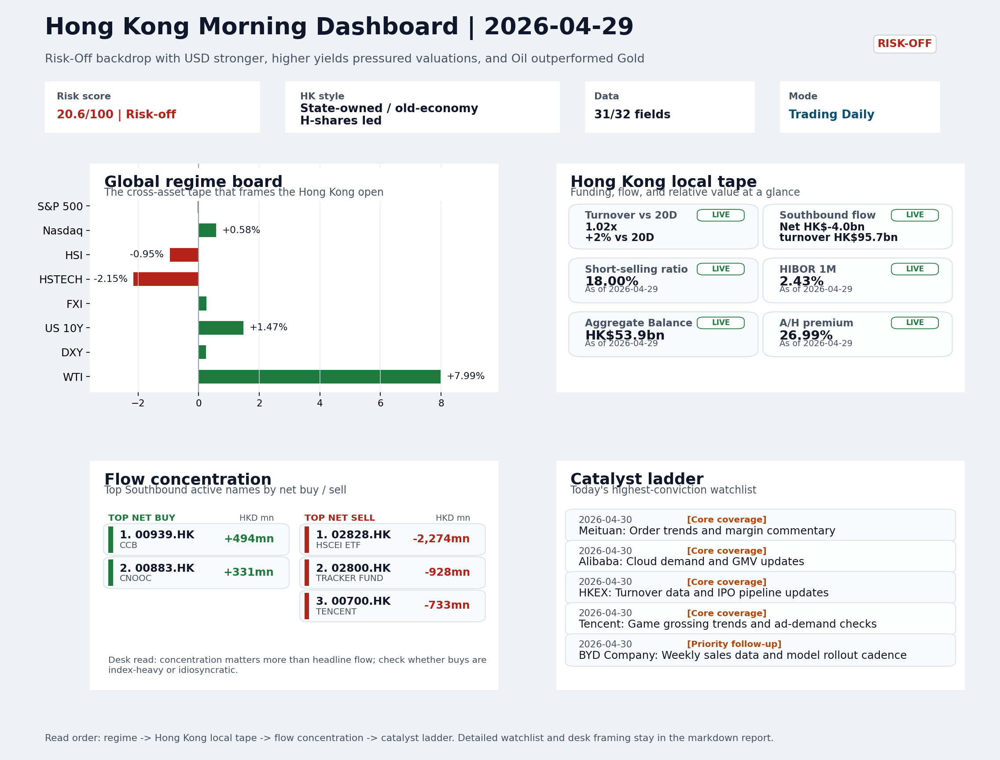
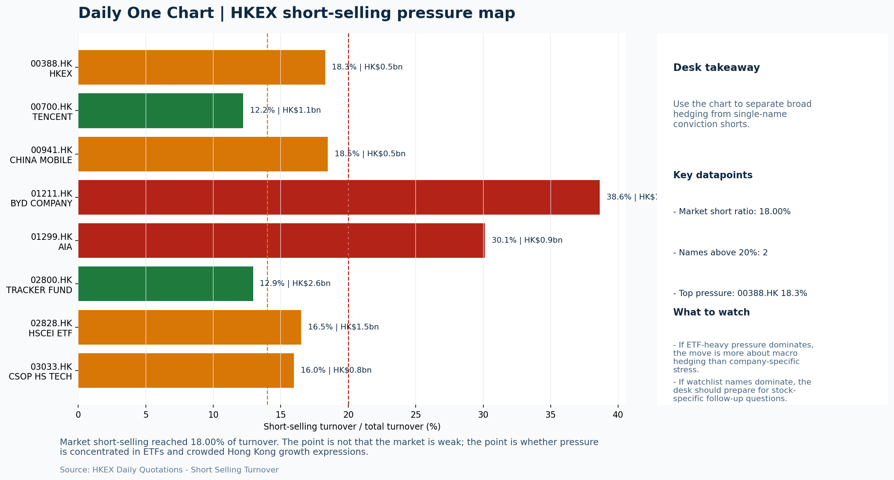
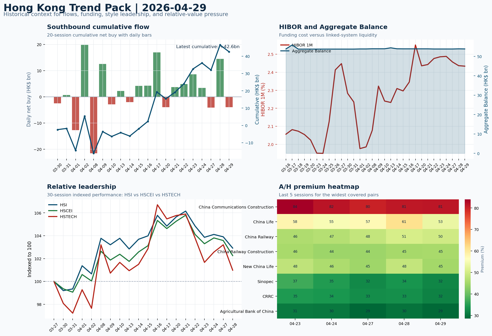

# Morning Research Workbench | 2026-04-30

> Designed for a Hong Kong sell-side commute: Layer 1 `Scan`, Layer 2 `Deep Read`, Layer 3 `Thinking`
> Mode: `Trading Daily` | Keep the report execution-oriented: what mattered in the completed session, what can move Hong Kong leadership, and what needs fast follow-up.
> Briefing date: `2026-04-30` | Review date: `2026-04-29` | Global request: `2026-04-29` | HK/China request: `2026-04-29` | Market effective date: `2026-04-29` | Generated at: `2026-04-30 08:03:27`
> Date policy: Review date 2026-04-29 is treated as `Trading Daily`. | Global request date is 2026-04-29; adapter effective date is 2026-04-29 and summary date is 2026-04-29. | HK/China local data date is 2026-04-29; role: same-session local cash tape.

> Market data quality: Coverage: `31/32` | Missing: `1`

> Report quality: `92.6/100` | Grade `A` | Status `production ready`

## Visual Dashboard

## Layer 1 | Scan (5-10 min)

### 1.1 One-Line Market Pulse
Hong Kong followed through on Risk-Off with HSI -0.95% and HSTECH -2.15%, but FXI's +0.25% divergence and value rotation into CCB (+HK$494mn) suggest offshore China sentiment is more resilient than the local tape, with elevated short-selling (18.00%) keeping rebounds conditional on cleaner turnover confirmation.

### 1.2 Global Asset Price Dashboard

| Asset | Last | 1D move | Read |
| --- | --- | --- | --- |
| S&P 500 | 7,135.95 | -0.04% | US large-cap risk appetite |
| Nasdaq 100 | 27,186.98 | +0.58% | Growth and duration leadership |
| Hang Seng Index | 25,679.78 | -0.95% | Hong Kong broad beta |
| Hang Seng TECH | 4.7260 | **-2.15%** | Hong Kong growth / platform read-through |
| CSI 300 | 4,758.21 | -0.27% | Mainland large-cap tone |
| US 10Y | 4.4180 | +1.47% | Global discount-rate anchor |
| China 10Y | 1.74% | -2.1bp | China local rates anchor \| Live public \| Eastmoney \| 2026-04-29 |
| CN-US 10Y spread | -267.6bp | -8.1bp | Relative carry and macro-pressure gauge \| Live public \| Eastmoney \| 2026-04-29 |
| DXY | 98.86 | +0.24% | Dollar liquidity impulse |
| USD/CNH | 6.8270 | +0.00% | Offshore China risk appetite |
| USD/HKD | 7.8356 | -0.01% | Linked-exchange regime stress check |
| Brent crude | 111.66 | +0.36% | Energy / geopolitics |
| COMEX gold | 4,571.30 | -0.44% | Hedge demand / real yields |
| Copper | 5.9435 | +0.49% | Global growth proxy |
| VIX | 18.81 | **+5.50%** | US stress barometer |

### 1.3 Hong Kong Key Data Quick Check

| Check | Value | Status | Source / as of | Why it matters |
| --- | --- | --- | --- | --- |
| Main Board turnover vs 20D | 1.02x \| +2% vs 20D | Live local | HKEX \| 2026-04-29 | Trailing 20-session average turnover was HK$253.4bn. |
| Southbound / Northbound net flow | Southbound Net HK$-4.0bn \| turnover HK$95.7bn \| Northbound Turnover HK$341.2bn \| net unavailable | Live local | HKEX Connect \| 2026-04-29 | Southbound net buy is calculated from HKEX disclosed buy and sell turnover. |
| Short-selling ratio | 18.00% | Live local | HKEX \| 2026-04-29 | Official HKEX stock-level short-selling table, aggregated as a share of total market turnover. |
| AH premium index | 26.99% | Live public | Yahoo \| 2026-04-29 | Simple average across 20 A/H pairs; use dispersion rather than the average alone. |
| USD/HKD spot vs band | 7.8356 \| band 7.7500 to 7.8500 | Live quote + local | Yahoo \| 2026-04-29 | Inside the linked-exchange band without immediate boundary stress. Official Convertibility Undertakings define the linked-rate stress boundaries for USD/HKD. |
| HIBOR 1M | 2.43% | Live local | HKMA \| 2026-04-29 | 1M HIBOR is the cleanest quick read for Hong Kong funding conditions and equity-duration pressure. |
| Aggregate Balance | HK$53.9bn | Live local | HKMA \| 2026-04-29 | Aggregate Balance helps frame whether linked-rate liquidity conditions are tight or comfortable. |
| Hong Kong leadership | State-owned / old-economy H-shares led | Proxy fallback | HSI / HSCEI / HSTECH relative perf \| 2026-04-29 | Use HSI / HSCEI / HSTECH relative moves as the opening style read. |

### 1.4 Risk Dashboard
**Composite risk score:** `20.6/100` | **Regime:** `Risk-off`

| Component | Score impact | Evidence |
| --- | --- | --- |
| US beta | -0.2 | S&P 500 -0.04% |
| HK growth | -10 | HSTECH -2.15% |
| Offshore China proxy | +1.2 | FXI +0.25% |
| Dollar pressure | -2.4 | DXY +0.24% |
| Volatility | -10 | VIX +5.50% |
| HK short-selling | -8 | Short-selling ratio 18.00% |

### 1.5 Morning Checklist
1. **WTI crude +7.99%**
 High-frequency data | A strong crude move needs to be split between geopolitics and demand repair.
2. **INTC -6.33%**
 Mover attribution | Announcement / expectations | Guidance reset and margin pressure
3. **[A] 'Draconian development' in Meta-Manus deal draws the line in China's AI race with the U.S.**
 News / announcements | Capital allocation or shareholder-return events can trigger a valuation reset
4. **Risk-Off backdrop with USD stronger, higher yields pressured valuations, and Oil outperformed Gold**
 Overnight regime | Start by deciding whether the day is about Risk-Off conditions or a style pivot.
5. **CPI MoM (Released)**
 Macro / policy | Rates expectations, the dollar, and growth-equity valuation | Industries: Technology, Internet, Brokers

## Layer 2 | Deep Read (20-30 min)

### 2.1 Overnight Overseas Market Review
#### Market Setup
**Core tape.** The overnight session confirmed a Risk-Off regime with the Nasdaq outperforming (+0.58%) while S&P 500 was flat (-0.04%), masking a sharp divergence within US equities.
**Main driver.** Higher US 10Y yields (+1.47%) and a stronger USD (DXY +0.24%) pressured duration-sensitive growth names globally; the VIX spike (+5.5%) to 18.81 reinforced elevated uncertainty.
**HK relevance.** Oil surged +7.99% on Iran war uncertainty - the largest cross-asset move - which supported energy but compounded the inflation and risk-off narrative.

#### Key Drivers
- Fed held rates with record dissent since 1992, keeping USD firmer and rate-cut expectations depressed.
- Oil spiked +7.99% on Iran war escalation concerns, the largest single-day commodity move, splitting the risk-off narrative between.
- Intel guided down -6.33%, extending semiconductor sector weakness and reinforcing sentiment linkage risk for SMIC and Hua Hong on HK.
- Alphabet's cloud beat and Meta's raised FY capex ($125-145bn) provided a partial offset, validating AI infrastructure spending.

#### Hong Kong Read-Through
**Desk lens.** State-owned / old-economy H-shares led.
**Opening implication.** The HK open faces headwinds from USD strength and higher US yields, compounded by the Meta-Manus block weighing on China tech sentiment. The -2.15% HSTECH decline reflects elevated duration pressure.
- **Cross-market read:** Hang Seng -0.95% / HSCEI -1.27% / HSTECH -2.15%.
- **Cross-market read:** Offshore China proxy FXI +0.25% and USD/CNH +0.00% frame cross-border risk appetite.
- **Cross-market read:** USD/HKD last traded around 7.8356, which keeps the Hong Kong funding lens in focus.

#### Watch Points
- USD composite moved higher by +0.18pct intraday, with a 0.316pct range.
- Main turning points appeared around 2026-04-29 08:05 peak / 2026-04-29 08:20 peak / 2026-04-29 08:40 trough, suggesting event-driven repricing.
- The biggest cross-asset divergence was Oil versus Gold, a spread of 9.478pct.
- Gold moved -0.87pct intraday with a 1.975pct high-low range.

**Curated overnight stories**
1. **Beijing blocks Meta's acquisition of Manus, raising stakes in US-China AI rivalry**
 Why it matters: China drew a clear line on AI data, talent and IP leaving the country. This is the most concrete signal yet that Beijing will restrict Chinese founders from offshore pivots.
 HK read-through: Negative for China internet platforms with overseas AI partnerships or data-sharing structures. Watch for sector-wide re-rating pressure on domestic AI/cloud names.
2. **WTI crude +7.99% on escalating Iran war uncertainty**
 Why it matters: Largest single-day oil move in the must-watch data. Sharply higher energy costs feed into inflation expectations and consumer cost pressures, undermining the soft-landing.
 HK read-through: Mixed: supports China energy names (CNPC, PetroChina, Sinopec) but hurts airlines, logistics and consumer discretionary.
3. **INTC -6.33% on guidance reset and margin pressure**
 Why it matters: Intel cut guidance and showed persistent margin deterioration. This extends the semiconductor sector downtrend and validates the view that AI capex is not yet offsetting.
 HK read-through: Direct negative for SMIC and Hua Hong via sentiment linkage. HK-listed semiconductor equipment and fab names could face selling pressure even without direct fundamentals.
4. **Alphabet beats on cloud, justifying elevated AI spending**
 Why it matters: Alphabet's strong cloud growth validates the hyperscaler investment cycle. Meta's raised capex reaffirms the AI arms race thesis.
 HK read-through: Constructive for Hong Kong internet and cloud-adjacent plays. Alibaba, Tencent and Baidu cloud segments benefit from the global narrative even if fundamentals lag.
5. **Fed holds rates with highest dissent since 1992; Powell commits to staying as governor**
 Why it matters: Record dissenting votes signal internal disagreement on the policy path. USD firmed on the hawkish tilt, keeping the pressure on EM and offshore China equities.
 HK read-through: USD strength and higher US rates are direct headwinds for HK-listed stocks, especially those with high overseas funding costs or USD-denominated debt.

### 2.2 Hong Kong / A-share Previous-Day Review
#### Local Tape Setup
**Local read.** Hong Kong followed through on overnight Risk-Off with HSI -0.95% and HSTECH -2.15%, but the HSCEI/HSTECH spread of ~88bps signals a partial value rotation rather than uniform selling.
**Verification point.** Southbound posted net -HK$4.0bn outflow (total HK$95.7bn turnover), with CCB (+HK$494mn) absorbing Tencent (-HK$733mn combined) and index ETF unwind - suggesting mainland institutions are rotating toward financials while.
**Risk to watch.** Short-selling at 18.00% of turnover remains elevated, with concentration in HSTECH (03032.HK 55%) and HSCEI (02828.HK 16.5%) ETF proxies, keeping the risk of short-covering rebounds conditional on clean turnover.

#### Style and Local Leadership
**Style leadership.** State-owned / old-economy H-shares led.
- **Cross-market read:** Hang Seng -0.95% / HSCEI -1.27% / HSTECH -2.15%.
- **Cross-market read:** Offshore China proxy FXI +0.25% and USD/CNH +0.00% frame cross-border risk appetite.
- **Cross-market read:** USD/HKD last traded around 7.8356, which keeps the Hong Kong funding lens in focus.
**LLM local leadership read.** Value-led: HSCEI (-1.27%) outperformed HSTECH (-2.15%), suggesting mainland capital is anchoring around banks and energy rather than internet/growth. FXI (+0.25%) divergence from HSI (-0.95%) is notable and needs confirmation.

#### Flow Confirmation
Official Stock Connect evidence is available; use Section 2.3 to confirm whether local money supports the price action.

#### Follow-Through Checklist
**Follow-through check.** Watch 1) whether HSTECH short ratio (03032.HK 55%) compresses - sharp ratio decline implies short-covering risk.

### 2.3 Flow Tracker and Attribution
#### Cross-Asset Attribution v1

| Driver | Direction | Score | Evidence | HK implication |
| --- | --- | --- | --- | --- |
| Short-selling pressure | drag | 2.1 | HKEX short-selling ratio was 18.00%. | Elevated short activity argues for extra confirmation before chasing rebounds. |
| Rates impulse | drag | 1.76 | US 10Y yield proxy moved +1.47%. | Lower yields help long-duration growth; higher yields pressure valuation-sensitive |

#### Flow Tracker
##### Flow Takeaways
- Short-selling pressure is elevated, so local rebounds need cleaner breadth and flow confirmation.
- Stock Connect Southbound: net HK$-4.0bn on turnover HK$95.7bn (as of 2026-04-29).
- Stock Connect Northbound: turnover RMB341.2bn; public file provides total turnover/top active names, not full net-buy.
- AH premium: simple covered-pair average +26.99%; widest premium: China Communications Construction 81.25%.

##### Key Flow / Funding Metrics

| Metric | Value | Status | Source / as of | Read |
| --- | --- | --- | --- | --- |
| Southbound / Northbound net flow | Southbound Net HK$-4.0bn \| turnover HK$95.7bn \| Northbound Turnover HK$341.2bn \| net unavailable | Live local | HKEX Connect \| 2026-04-29 | Southbound net buy is calculated from HKEX disclosed buy and sell turnover. |
| Main Board turnover vs 20D | 1.02x \| +2% vs 20D | Live local | HKEX \| 2026-04-29 | Trailing 20-session average turnover was HK$253.4bn. |
| Short-selling ratio | 18.00% | Live local | HKEX \| 2026-04-29 | Official HKEX stock-level short-selling table, aggregated as a share of total market turnover. |
| AH premium index | 26.99% | Live public | Yahoo \| 2026-04-29 | Simple average across 20 A/H pairs; use dispersion rather than the average alone. |
| HIBOR 1M | 2.43% | Live local | HKMA \| 2026-04-29 | 1M HIBOR is the cleanest quick read for Hong Kong funding conditions and equity-duration pressure. |
| Aggregate Balance | HK$53.9bn | Live local | HKMA \| 2026-04-29 | Aggregate Balance helps frame whether linked-rate liquidity conditions are tight or comfortable. |

##### Stock Connect Southbound Active Names

| Rank | Ticker | Name | Buy | Sell | Net buy |
| --- | --- | --- | --- | --- | --- |
| 5 | 02828.HK | HSCEI ETF | HK$110.0mn | HK$2,384.2mn | HK$-2,274.2mn |
| 7 | 02800.HK | TRACKER FUND | HK$3.4mn | HK$931.6mn | HK$-928.2mn |
| 1 | 00700.HK | TENCENT | HK$1,904.9mn | HK$2,638.3mn | HK$-733.3mn |
| 8 | 00939.HK | CCB | HK$979.6mn | HK$485.5mn | HK$494.1mn |
| 1 | 00883.HK | CNOOC | HK$1,984.6mn | HK$1,653.1mn | HK$331.5mn |

##### AH Premium Dispersion

| Name | A ticker | H ticker | Premium | As of |
| --- | --- | --- | --- | --- |
| China Communications Construction | 601800.SS | 1800.HK | +81.25% | 2026-04-29 |
| China Life | 601628.SS | 2628.HK | +53.24% | 2026-04-29 |
| China Railway | 601390.SS | 0390.HK | +49.74% | 2026-04-29 |
| China Railway Construction | 601186.SS | 1186.HK | +45.44% | 2026-04-29 |
| New China Life | 601336.SS | 1336.HK | +45.17% | 2026-04-29 |

##### HKEX Short-Selling Watch

| Ticker | Name | Short ratio | Short turnover | Total turnover |
| --- | --- | --- | --- | --- |
| 00388.HK | HKEX | 18.29% | HK$0.5bn | HK$2.6bn |
| 00700.HK | TENCENT | 12.22% | HK$1.1bn | HK$9.2bn |
| 00941.HK | CHINA MOBILE | 18.49% | HK$0.5bn | HK$2.6bn |
| 01211.HK | BYD COMPANY | 38.64% | HK$1.9bn | HK$4.9bn |
| 01299.HK | AIA | 30.12% | HK$0.9bn | HK$2.8bn |

- **Short-value leaders:** 02800.HK TRACKER FUND (HK$2.6bn); 01810.HK XIAOMI-W (HK$2.0bn); 01211.HK BYD COMPANY (HK$1.9bn); 02318.HK PING AN (HK$1.5bn).

### 2.4 Macro and Policy Tracking
**Desk read.** The completed session set a Risk-Off tone with USD strength, elevated yields, and oil outperforming gold.

**Market sensitivity.** US CPI released today came in hot at 0.3% MoM versus the 0.2% forecast, adding pressure to duration assets and reinforcing the hawkish Fed expectations narrative.

**HK implication.** China Trade Balance simultaneously beat at USD 85.2bn versus USD 79.0bn expected, but this positive data print is unlikely to override the inflation-driven risk-off move in the near term.

**Macro watchpoints**
- Direction of US 10Y yield and DXY following the hot CPI print and ahead of Retail Sales.
- US Retail Sales MoM (20:30 HKT): if the print beats 0.3% forecast, Risk-Off could deepen; below-expectations could trigger a relief rally.
- Fed Chair Powell remarks at 22:00 HKT: hawkish language could extend duration selling; anydovish pivot could stabilize growth proxies.
- Whether Oil strength (WTI +7.99%) translates into HK energy and commodity sector outperformance or whether macro headwinds dominate.

| Time | Region | Event | Status | Desk read |
| --- | --- | --- | --- | --- |
| 20:30 | US | CPI MoM | Released | Impact: Rates expectations, the dollar, and growth-equity valuation \| Attention: 5/5 \| Industries: Technology, Internet, Brokers |
| 09:30 | China | Trade Balance | Released | Impact: Watch whether it changes the day's core market narrative \| Attention: 3/5 \| Industries: To be assessed |
| 20:30 | US | Retail Sales MoM | Upcoming | Impact: Consumer resilience, growth expectations, and risk-asset pricing \| Attention: 5/5 \| Industries: Consumer, E-commerce, Consumer discretionary |
| 09:20 | China | Loan Prime Rate | Upcoming | Impact: Watch whether it changes the day's core market narrative \| Attention: 3/5 \| Industries: To be assessed |
| 22:00 | Federal Reserve | Jerome Powell: Economic outlook remarks | Central bank | Impact: Policy path, liquidity conditions, and cross-asset risk appetite \| Attention: 5/5 \| Industries: Technology, Financials, Gold |
| 10:00 | PBOC | Open Market Operations Desk: Daily liquidity operation window | Central bank | Impact: Policy path, liquidity conditions, and cross-asset risk appetite \| Attention: 3/5 \| Industries: Technology, Financials, Gold |

#### Positioning and Risk Backdrop
- Options activity centered on KWEB Call, with Vol/OI at 1.88x and a bullish bias.
- Put/Call structure shows equity 0.68 / index 1.15, implying Single-stock optimism with index hedging.
- Geopolitics: Middle East | Regional tension remains elevated | Impact: Oil, freight costs, and safe-haven demand
- Geopolitics: US-China | Technology export-control rhetoric remains active | Impact: China internet, semiconductors, and supply chains

### 2.5 Key Company and Sector Events

| Grade | Sector | Headline | Why it matters | Horizon |
| --- | --- | --- | --- | --- |
| A | Autos and EV | 'Draconian development' in Meta-Manus deal draws the line in China's | Capital allocation or shareholder-return events can trigger a valuation | Medium-term trend |
| A | Autos and EV | Ford CFO on Q1 Earnings, Outlook and Impact of Gas Prices | This can directly reshape earnings forecasts and the valuation framework | Short-term catalyst |
| A | Semiconductors and AI | US Stock Futures Gain on Tech Earnings, Oil Climbs: Markets Wrap | This can directly reshape earnings forecasts and the valuation framework | Short-term catalyst |
| A | China Internet | Why Alphabet's stock is the standout gainer on Big Tech's monster | This can directly reshape earnings forecasts and the valuation framework | Short-term catalyst |
| A | Autos and EV | Traders brace for $800 billion in earnings-related stock movement | This can directly reshape earnings forecasts and the valuation framework | Short-term catalyst |
| A | Semiconductors and AI | SoFi CEO defends decision to hold guidance steady | This can directly reshape earnings forecasts and the valuation framework | Short-term catalyst |
| A | Other | Meta shares look 'iffy' into earnings. How to trade it | This can directly reshape earnings forecasts and the valuation framework | Short-term catalyst |
| B | Semiconductors and AI | Meta Shares Fall as Investors Weigh Tech Prospects | This can directly reshape earnings forecasts and the valuation framework | Short-term catalyst |

#### HKEX Announcements

| Grade | Ticker | Type | Release time | Title |
| --- | --- | --- | --- | --- |
| A | 00948.HK | Profit warning | 2026-04-27 | Profit warning / alert announcement |
| A | 01977.HK | Profit warning | 2026-04-27 | Profit warning / alert announcement |
| A | 01593.HK | Profit warning | 2026-04-24 | Profit warning / alert announcement |
| A | 02530.HK | Profit warning | 2026-04-23 | Profit warning / alert announcement |
| A | 03839.HK | Profit warning | 2026-04-22 | Profit warning / alert announcement |
| A | 05834.HK | Profit warning | 2026-04-22 | Profit warning / alert announcement |
| A | 06680.HK | Profit warning | 2026-04-22 | Profit warning / alert announcement |

#### Earnings / Results Watch

| Ticker | Company | Timing | Expectation framing |
| --- | --- | --- | --- |
| 0700.HK | Tencent Holdings | After Market Close | EPS est. 4.15 HKD \| revenue est. 163.2bn HKD |
| 0388.HK | Hong Kong Exchanges and Clearing | Before Market Open | EPS est. 2.81 HKD \| revenue est. 6.0bn HKD |

#### Rating Changes
- **9988.HK** | Morgan Stanley | Upgrade | Equal Weight -> Overweight | PT 92 -> 105

#### IPO Watch
- IPO / grey-market / first-day performance should be wired to a dedicated Hong Kong ECM adapter.

### 2.6 Coverage Pools
#### Core coverage

| Name | Ticker | Last | 1D | Range position | Morning note |
| --- | --- | --- | --- | --- | --- |
| Meituan | 3690.HK | 83.15 | +3.55% | Mid-range | Short-term price strength is clear; fresh catalysts could trigger broader group |
| Alibaba | 9988.HK | 130.60 | +3.24% | Bottom of range | Short-term price strength is clear; fresh catalysts could trigger broader group |
| HKEX | 0388.HK | 419.80 | +2.99% | Mid-range | Short-term price strength is clear; fresh catalysts could trigger broader group |
| Tencent | 0700.HK | 479.20 | +1.14% | Bottom of range | The name sits near the bottom of its recent range and is worth monitoring for a |

**Recent headlines for Meituan:**
- [Alibaba Stock Is Getting Hit Again, but Qwen and Cloud Growth Are Surging](https://www.marketbeat.com/originals/alibaba-stock-is-getting-hit-again-but-qwen-and-cloud-growth-are-surging/?utm_source=yahoofinance&utm_medium=yahoofinance) (MarketBeat)
- [JD.com Stock Falls as Profits Dive Despite Rising Revenue](https://www.barrons.com/articles/jd-com-earnings-stock-price-1dec392c?siteid=yhoof2&yptr=yahoo) (Barrons.com)
**Recent headlines for Alibaba:**
- [Alibaba among stocks cut as portfolio gets reshaped](https://finance.yahoo.com/markets/stocks/articles/alibaba-among-stocks-cut-portfolio-191442046.html) (GuruFocus.com)
- [Spotify upgraded, Alibaba initiated: Wall Street's top analyst calls](https://finance.yahoo.com/markets/stocks/articles/spotify-upgraded-alibaba-initiated-wall-134254559.html) (The Fly)
**Recent headlines for HKEX:**
- [Hong Kong Exchange Operator Posts Record Profit on Listings, Trading Growth](https://www.wsj.com/business/earnings/hong-kong-exchange-operator-posts-record-quarterly-profit-revenue-1cc26df8?siteid=yhoof2&yptr=yahoo) (The Wall Street Journal)
- [Has Hong Kong Exchanges And Clearing (SEHK:388) Run Ahead Of Its Recent Share Price Strength?](https://finance.yahoo.com/markets/stocks/articles/hong-kong-exchanges-clearing-sehk-060725066.html) (Simply Wall St.)
**Recent headlines for Tencent:**
- [Alibaba and others look to Huawei as chip demand shifts](https://finance.yahoo.com/sectors/technology/articles/alibaba-others-look-huawei-chip-122219886.html) (GuruFocus.com)
- [Exclusive-Big Chinese tech firms scramble to secure Huawei AI chips after DeepSeek V4 launch, sources say](https://finance.yahoo.com/sectors/technology/articles/exclusive-big-chinese-tech-firms-063617328.html) (Reuters)

#### Priority follow-up

| Name | Ticker | Last | 1D | Range position | Morning note |
| --- | --- | --- | --- | --- | --- |
| BYD Company | 1211.HK | 108.30 | +4.44% | Top of range | Short-term price strength is clear; fresh catalysts could trigger broader group |
| AIA | 1299.HK | 84.95 | +2.16% | Mid-range | Short-term price strength is clear; fresh catalysts could trigger broader group |
| China Mobile | 0941.HK | 85.45 | +0.95% | Top of range | The name sits near the top of its recent range, so watch for profit-taking under |

**Recent headlines for BYD Company:**
- [BYD Borrowings Jump 72% As Profit Falls 55% Amid EV Price War](https://finance.yahoo.com/markets/stocks/articles/byd-borrowings-jump-72-profit-170958089.html) (GuruFocus.com)
- [Geely Profit Falls 27% to 4.2 Billion Yuan, Misses Estimates](https://finance.yahoo.com/markets/stocks/articles/geely-profit-falls-27-4-161608855.html) (GuruFocus.com)
**Recent headlines for AIA:**
- [Is It Too Late To Consider AIA Group (SEHK:1299) After Its 82% One Year Rally?](https://finance.yahoo.com/markets/stocks/articles/too-consider-aia-group-sehk-042100864.html) (Simply Wall St.)
- [Is AIA (AAGIY) Outperforming Other Finance Stocks This Year?](https://finance.yahoo.com/markets/stocks/articles/aia-aagiy-outperforming-other-finance-134003763.html) (Zacks)
**Recent headlines for China Mobile:**
- [Deutsche Telekom Weighs Full Combination With T-Mobile](https://finance.yahoo.com/markets/stocks/articles/deutsche-telekom-weighs-full-combination-115107414.html) (Bloomberg)
- [Deutsche Telekom exploring merger with T-Mobile, Bloomberg News reports](https://finance.yahoo.com/markets/stocks/articles/deutsche-telekom-exploring-merger-t-182010144.html) (Reuters)

#### Learning watchlist

| Name | Ticker | Last | 1D | Range position | Morning note |
| --- | --- | --- | --- | --- | --- |
| Hang Seng TECH ETF | 3033.HK | 4.7300 | -2.15% | Bottom of range | Short-term pressure is visible; check for a fundamental or regulatory reason. |
| HSCEI ETF | 2828.HK | 88.46 | -1.49% | Mid-range | Positioning is neutral for now, so use it mainly to monitor marginal information |
| Tracker Fund of Hong Kong | 2800.HK | 25.79 | -0.99% | Mid-range | Positioning is neutral for now, so use it mainly to monitor marginal information |

## Layer 3 | Thinking (10-15 min)

### 3.1 Rotating Theme Deep Dive

| Field | Read |
| --- | --- |
| Theme | China Exports and Supply-Chain Relocation |
| Angle for the day | Track tariffs, trade policy, shipping, and manufacturing orders to see whether export resilience is still the cleaner China macro expression. |

**Theme desk read**
**Core thesis.** The Risk-Off session on April 29 puts the weekly China exports theme into a sharper frame: stronger USD and higher yields typically pressure risk assets, yet China trade data overnight offered a partial offset.
**Evidence.** The China trade balance print of USD 85.2bn beat the USD 79.0bn forecast, suggesting export resilience may still be functioning as a cleaner macro expression for HK-listed names even as broader risk sentiment sours.
**What to test.** The WTI crude jump of +7.99% (107.91) complicates the read - geopolitical risk premium versus demand repair are two distinct narratives with very different implications for shipping costs and supply-chain positioning.

**Signals to keep in mind**
- US Stock Futures Gain on Tech Earnings, Oil Climbs: Markets Wrap: This can directly reshape earnings forecasts and the valuation framework
- Traders brace for $800 billion in earnings-related stock movement: This can directly reshape earnings forecasts and the valuation framework
- WTI crude +7.99%: A strong crude move needs to be split between geopolitics and demand repair.
- VIX +5.50%: Higher volatility argues for tighter sizing and tighter stops.

**LLM watch items:**
- BYD 1211.HK: Weekly sales data due April 30 - export mix details matter more than absolute volume given leverage build on the balance sheet
- China Trade Balance beat (USD 85.2bn): Verify whether market repricing is material or already priced in during HK open
- US CPI actual 0.3% vs 0.2% forecast: Confirm whether duration pressure translates into HK tech/growth de-rating
- WTI crude 107.91 (+7.99%): Attributing the move to geopolitics versus demand - higher for longer oil reshapes shipping costs and inflation expectations
- Magnificent Seven earnings (Alphabet, Amazon, Meta, Microsoft): $800bn in potential stock movement; monitor HK tech ADR spillover Thursday

**Related names to keep close:**

| Name | Ticker | Bucket | Morning read |
| --- | --- | --- | --- |
| BYD Company | 1211.HK | Priority follow-up | Short-term price strength is clear; fresh catalysts could trigger broader group |
| China Mobile | 0941.HK | Priority follow-up | The name sits near the top of its recent range, so watch for profit-taking under |

**Upcoming catalysts tied to the theme:**
- 2026-04-30 | BYD Company: Weekly sales data and model rollout cadence | Hong Kong-listed proxy for EV volumes, export mix, and price competition
- 2026-04-30 | China Mobile: Capex updates and dividend policy signals | Defensive SOE benchmark for yield trade and domestic digital-infrastructure spend

**Relevant headlines:**
- [US Stock Futures Gain on Tech Earnings, Oil Climbs: Markets Wrap](https://www.bloomberg.com/news/articles/2026-04-29/stock-market-today-dow-s-p-live-updates)
- [Traders brace for $800 billion in earnings-related stock movement](https://www.cnbc.com/2026/04/29/traders-brace-for-800-billion-in-earnings-related-stock-movement.html)
- [Meta shares look 'iffy' into earnings. How to trade it](https://www.cnbc.com/2026/04/28/meta-shares-look-iffy-into-earnings-how-to-trade-it.html)

### 3.2 Today Ahead and Trading Calendar
- Macro: CPI MoM is the first item to anchor the open and the rates/FX response.
- Corporate / event: Meituan: Order trends and margin commentary is the cleanest same-day catalyst to prepare for.

**Same-day macro docket**

| Time | Country | Event | Status | Detail |
| --- | --- | --- | --- | --- |
| 20:30 | US | CPI MoM | Released | Actual 0.3% / Forecast 0.2% / Prior 0.4% |
| 09:30 | China | Trade Balance | Released | Actual USD 85.2bn / Forecast USD 79.0bn / Prior USD 80.6bn |
| 20:30 | US | Retail Sales MoM | Upcoming | Forecast 0.3% / Prior 0.6% |
| 09:20 | China | Loan Prime Rate | Upcoming | Forecast 3.45% / Prior 3.45% |
| 22:00 | Federal Reserve | Jerome Powell: Economic outlook remarks | Central bank | speech |

**Same-day catalyst list**

| Date | Time | Category | Event | Importance |
| --- | --- | --- | --- | --- |
| 2026-04-30 | | Core coverage | Meituan: Order trends and margin commentary | 3 |
| 2026-04-30 | | Core coverage | Alibaba: Cloud demand and GMV updates | 3 |
| 2026-04-30 | | Core coverage | HKEX: Turnover data and IPO pipeline updates | 3 |
| 2026-04-30 | | Core coverage | Tencent: Game grossing trends and ad-demand checks | 3 |
| 2026-04-30 | | Priority follow-up | BYD Company: Weekly sales data and model rollout cadence | 3 |
| 2026-04-30 | | Priority follow-up | AIA: NBV trends and agency momentum | 3 |

**Next few sessions**

| Date | Category | Event | Impact |
| --- | --- | --- | --- |
| 2026-04-30 | Core coverage | Meituan: Order trends and margin commentary | High-frequency read on local services demand and platform competition |
| 2026-04-30 | Core coverage | Alibaba: Cloud demand and GMV updates | Key read-through for China consumption, cloud, and platform regulation |
| 2026-04-30 | Core coverage | HKEX: Turnover data and IPO pipeline updates | Direct proxy for Hong Kong market turnover, listings, and southbound |
| 2026-04-30 | Core coverage | Tencent: Game grossing trends and ad-demand checks | Core offshore China platform proxy for gaming, ads, and AI monetization |
| 2026-04-30 | Priority follow-up | BYD Company: Weekly sales data and model rollout cadence | Hong Kong-listed proxy for EV volumes, export mix, and price competition |
| 2026-04-30 | Priority follow-up | AIA: NBV trends and agency momentum | Read-through for wealth demand, mainland visitor activity, and HK |
| 2026-04-30 | Priority follow-up | China Mobile: Capex updates and dividend policy signals | Defensive SOE benchmark for yield trade and domestic |
| 2026-04-30 | Learning watchlist | Hang Seng TECH ETF: AI narrative shifts and China platform | Fast proxy for Hong Kong internet and growth leadership |

### 3.3 Daily One Chart
**Daily One Chart | HKEX short-selling pressure map**

**Chart read.** Market short-selling reached 18.00% of turnover.
**Why it matters.** The point is not that the market is weak; the point is whether pressure is concentrated in ETFs and crowded Hong Kong growth expressions.

_Source: HKEX Daily Quotations - Short Selling Turnover_

### 3.4 Hong Kong Trend Pack
**Hong Kong Trend Pack**

**Trend read.** Four historical lenses: Southbound cumulative flow, HKMA funding and liquidity, HSI/HSCEI/HSTECH relative leadership, and A/H premium dispersion.

_Source: HKEX Stock Connect, HKMA liquidity data, and public Yahoo Finance quotes_

### 3.5 Personal View Pad
- **Thinking note:** Treat today's session as a conditional Risk-Off rather than uniform capitulation.
- **Suggested market answer:** The session is Risk-Off but with a value-defensive structure rather than indiscriminate selling, so I would frame tomorrow as a flow-confirmation test.
- **What could break the view:** A hawkish Powell at 22:00 HKT, a US Retail Sales beat above 0.3% MoM, or further Iran escalation sustaining WTI above USD 107.91 could deepen Risk-Off and extend HSTECH.
- Does the overnight tape still read as `Risk-Off`, or do I expect a different Hong Kong cash-session outcome?
- Is today's Hong Kong setup better described as `State-owned / old-economy H-shares led`, and does that match my current mental model?
- What was the most important overnight surprise, and does it change my base case?
- Which sector or stock view now deserves a tighter follow-up or a revised assumption?
- If I were asked for a two-minute market view this morning, what would my answer be?
- My own view after the commute:
- What changed versus yesterday:
- Which name / sector deserves extra prep before the open:

## Traceable Appendix

### Key Questions to Keep in Mind
- Is risk appetite rising or fading? The overnight tape reads closer to `Risk-Off`.
- Did rates expectations move? Focus on whether US 10Y, DXY, and growth style moved together.
- Were commodities the real story? Watch WTI and gold for geopolitics versus inflation signals.
- Is Hong Kong setup internet-led, SOE-led, or broad beta-led? Compare HSTECH, HSCEI, and HSI.
- Did offshore markets move China risk appetite? Focus on HSI, FXI, USD/CNH, and USD/HKD.

### Report Quality and Validation
- **Quality score:** 92.6/100 | **Grade:** A | **Status:** production ready

| Component | Score | Weight | Read |
| --- | --- | --- | --- |
| Market data coverage | 96.9 | 0.3 | 31/32 core market fields available. |
| Hong Kong local metrics | 82.3 | 0.25 | 8 live, 3 proxy, 0 unavailable local checks. |
| Key public adapters | 100.0 | 0.2 | 4/4 key adapters were available or partially available. |
| LLM task health | 85.7 | 0.15 | 6/7 LLM tasks succeeded or used validated cache; 1 error(s). |
| Fact-check guardrail | 100.0 | 0.1 | Checked 2 numeric claims; 0 numeric mismatch(es), 0 logic warning(s); 0 critical, 0 review. |

**LLM fact-check guardrail**
- Checked 2 numeric claims; 0 numeric mismatch(es), 0 logic warning(s); 0 critical, 0 review.

**Adapter status**

| Adapter | Status |
| --- | --- |
| Stock Connect | ok |
| A/H premium | ok |
| HKEX announcements | ok |
| China rates | ok |

### Source Links
- ['Draconian development' in Meta-Manus deal draws the line in China's AI race with the U.S.](https://www.cnbc.com/2026/04/28/china-blocks-meta-manus-deal-ai-tech-rivalry.html) (cnbc_markets)
- [Ford CFO on Q1 Earnings, Outlook and Impact of Gas Prices](https://www.bloomberg.com/news/videos/2026-04-29/ford-cfo-on-earnings-outlook-and-impact-of-gas-prices-video) (bloomberg_markets)
- [US Stock Futures Gain on Tech Earnings, Oil Climbs: Markets Wrap](https://www.bloomberg.com/news/articles/2026-04-29/stock-market-today-dow-s-p-live-updates) (bloomberg_markets)
- [Why Alphabet's stock is the standout gainer on Big Tech's monster earnings day](https://www.marketwatch.com/story/why-alphabets-stock-is-the-standout-gainer-on-big-techs-monster-earnings-day-bb49b193?mod=mw_rss_topstories) (wsj_markets)
- [Traders brace for $800 billion in earnings-related stock movement](https://www.cnbc.com/2026/04/29/traders-brace-for-800-billion-in-earnings-related-stock-movement.html) (cnbc_markets)
- [SoFi CEO defends decision to hold guidance steady](https://www.cnbc.com/2026/04/29/sofi-ceo-defends-decision-to-hold-guidance-steady.html) (cnbc_markets)
- [Meta shares look 'iffy' into earnings. How to trade it](https://www.cnbc.com/2026/04/28/meta-shares-look-iffy-into-earnings-how-to-trade-it.html) (cnbc_markets)
- [Meta Shares Fall as Investors Weigh Tech Prospects](https://www.bloomberg.com/news/videos/2026-04-30/meta-shares-fall-as-investors-weigh-tech-prospects-video) (bloomberg_markets)
- [Gold Holds Three-Day Decline as Hawkish Fed Flags Inflation Risk](https://www.bloomberg.com/news/articles/2026-04-29/gold-steadies-after-fed-holds-rates-and-signals-inflation-risks) (bloomberg_markets)
- [Treasury Yields Climb as Fed Split Amid War Risks: Markets Wrap](https://www.bloomberg.com/news/articles/2026-04-28/asian-stocks-set-for-muted-open-after-us-selloff-markets-wrap) (bloomberg_markets)
- [ASX Says Darren Yip to Become Interim CEO as Search Goes On](https://www.bloomberg.com/news/articles/2026-04-29/asx-says-darren-yip-to-become-interim-ceo-as-search-goes-on) (bloomberg_markets)
- [Treasuries Slump as Fed Dissents Spur Wagers on 2027 Rate Hike](https://www.bloomberg.com/news/articles/2026-04-29/us-treasury-yields-hit-highest-levels-since-march-as-oil-surges) (bloomberg_markets)
- [Alibaba Stock Is Getting Hit Again, but Qwen and Cloud Growth Are Surging](https://www.marketbeat.com/originals/alibaba-stock-is-getting-hit-again-but-qwen-and-cloud-growth-are-surging/?utm_source=yahoofinance&utm_medium=yahoofinance) (MarketBeat)
- [JD.com Stock Falls as Profits Dive Despite Rising Revenue](https://www.barrons.com/articles/jd-com-earnings-stock-price-1dec392c?siteid=yhoof2&yptr=yahoo) (Barrons.com)
- [Alibaba among stocks cut as portfolio gets reshaped](https://finance.yahoo.com/markets/stocks/articles/alibaba-among-stocks-cut-portfolio-191442046.html) (GuruFocus.com)

## Supplementary Visual Appendix

This appendix is professional-path only. It keeps a traceable index of the report visuals and the deterministic chart cues used to frame the morning note, without injecting the legacy intraday chart pack.

### Visual Index

| Visual | Path | Role |
| --- | --- | --- |
| Visual Dashboard | `charts/dashboard_2026-04-30.png` | Cross-asset regime board and Hong Kong local tape snapshot. |
| Daily One Chart | `charts/daily_one_chart_2026-04-30.png` | Single highest-conviction visual story for the day. |
| Hong Kong Trend Pack | `charts/hk_trend_pack_2026-04-30.png` | Historical context for flows, liquidity, leadership, and A/H dispersion. |

### Deterministic Chart Cues
- FX / liquidity: USD composite moved higher by +0.18pct intraday, with a 0.316pct range.
- FX / liquidity: Main turning points appeared around 2026-04-29 08:05 peak / 2026-04-29 08:20 peak / 2026-04-29 08:40 trough, suggesting event-driven repricing rather than a clean one-way USD move.
- Cross-asset: The biggest cross-asset divergence was Oil versus Gold, a spread of 9.478pct.
- Cross-asset: Gold moved -0.87pct intraday with a 1.975pct high-low range.
- Cross-asset: Oil moved +8.61pct intraday with a 9.361pct high-low range.
- Cross-asset: Bitcoin moved -0.72pct intraday with a 3.757pct high-low range.

### Risk Dashboard Components

| Component | Score impact | Evidence |
| --- | --- | --- |
| US beta | -0.2 | S&P 500 -0.04% |
| HK growth | -10 | HSTECH -2.15% |
| Offshore China proxy | +1.2 | FXI +0.25% |
| Dollar pressure | -2.4 | DXY +0.24% |
| Volatility | -10 | VIX +5.50% |
| HK short-selling | -8 | Short-selling ratio 18.00% |
