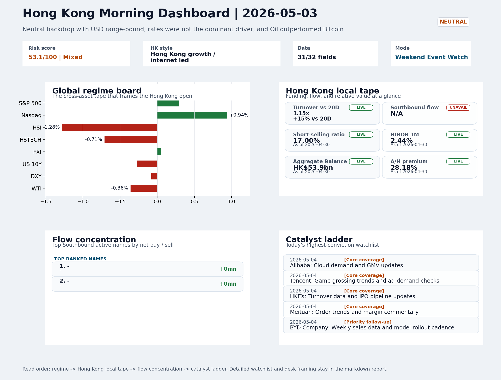
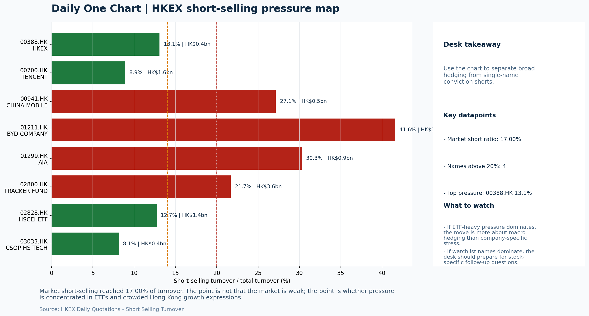
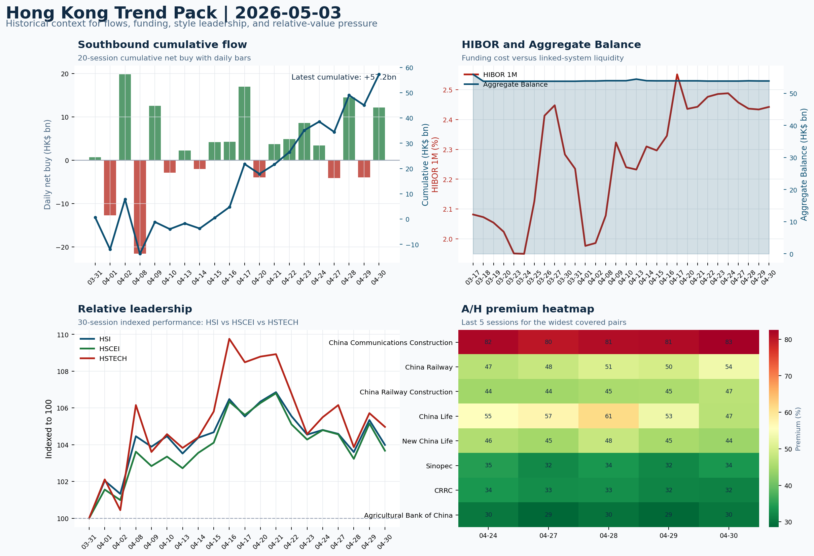

# Morning Research Workbench | 2026-05-04

> Designed for a Hong Kong sell-side commute: Layer 1 `Scan`, Layer 2 `Deep Read`, Layer 3 `Thinking`
> Mode: `Weekend Event Watch` | Track weekend policy, geopolitics, still-moving assets, and Monday open preparation rather than replaying stale cash-market tape.
> Briefing date: `2026-05-04` | Review date: `2026-05-03` | Global request: `2026-05-03` | HK/China request: `2026-05-01` | Market effective date: `2026-05-03` | Generated at: `2026-05-04 07:58:02`
> Date policy: Review date 2026-05-03 is treated as `Weekend Event Watch`. | Global request date is 2026-05-03; adapter effective date is 2026-05-03 and summary date is 2026-05-03. | HK/China local data date is 2026-05-01; role: last completed HK/China cash-market reference tape.

> Market data quality: Coverage: `31/32` | Stale items (>1d): `22` | Missing: `1`

> Report quality: `90.3/100` | Grade `A` | Status `production ready`

## Visual Dashboard

## Layer 1 | Reset (5-10 min)

### 1.1 One-Line Market Pulse
Weekend event flow tilts mildly constructive for Monday's Hong Kong open - oil softness eases input costs, Morgan Stanley's China AI upgrade adds sector narrative, and copper holds positive - but confirmation awaits USD/CNH direction, US futures response to CPI and Treasury issuance guidance, and whether HSTECH can sustain relative outperformance versus the stale May 1 local tape.

### 1.2 Global Asset Price Dashboard

| Asset | Last | 1D move | Read |
| --- | --- | --- | --- |
| S&P 500 | 7,230.12 | +0.29% | US large-cap risk appetite |
| Nasdaq 100 | 27,710.36 | +0.94% | Growth and duration leadership |
| Hang Seng Index | 25,776.53 | -1.28% | Hong Kong broad beta |
| Hang Seng TECH | 4.7760 | -0.71% | Hong Kong growth / platform read-through |
| CSI 300 | 4,807.31 | -0.06% | Mainland large-cap tone |
| US 10Y | 4.3780 | -0.27% | Global discount-rate anchor |
| China 10Y | N/A | | China local rates anchor \| Unavailable \| Eastmoney |
| CN-US 10Y spread | N/A | | Relative carry and macro-pressure gauge \| Unavailable \| Eastmoney |
| DXY | 98.13 | -0.08% | Dollar liquidity impulse |
| USD/CNH | 6.8120 | +0.00% | Offshore China risk appetite |
| USD/HKD | 7.8343 | +0.02% | Linked-exchange regime stress check |
| Brent crude | 108.05 | -0.11% | Energy / geopolitics |
| COMEX gold | 4,627.50 | -0.05% | Hedge demand / real yields |
| Copper | 5.9845 | +0.89% | Global growth proxy |
| VIX | 16.99 | +0.59% | US stress barometer |

### 1.3 Hong Kong Last Cash-Tape Quick Check (Reference)

| Check | Value | Status | Source / as of | Why it matters |
| --- | --- | --- | --- | --- |
| Main Board turnover vs 20D | 1.15x \| +15% vs 20D | Live local | HKEX \| 2026-04-30 | Trailing 20-session average turnover was HK$253.2bn. |
| Southbound / Northbound net flow | N/A | Unavailable | N/A | HKEX Stock Connect daily data could not be retrieved or parsed for the requested date window. |
| Short-selling ratio | 17.00% | Live local | HKEX \| 2026-04-30 | Official HKEX stock-level short-selling table, aggregated as a share of total market turnover. |
| AH premium index | 28.18% | Live public | Yahoo \| 2026-04-30 | Simple average across 20 A/H pairs; use dispersion rather than the average alone. |
| USD/HKD spot vs band | 7.8343 \| band 7.7500 to 7.8500 | Live quote + local | Yahoo \| 2026-05-03 | Inside the linked-exchange band without immediate boundary stress. Official Convertibility Undertakings define the linked-rate stress boundaries for USD/HKD. |
| HIBOR 1M | 2.44% | Live local | HKMA \| 2026-04-30 | 1M HIBOR is the cleanest quick read for Hong Kong funding conditions and equity-duration pressure. |
| Aggregate Balance | HK$53.9bn | Live local | HKMA \| 2026-04-30 | Aggregate Balance helps frame whether linked-rate liquidity conditions are tight or comfortable. |
| Hong Kong leadership | Hong Kong growth / internet led | Proxy fallback | HSI / HSCEI / HSTECH relative perf \| 2026-05-03 | Use HSI / HSCEI / HSTECH relative moves as the opening style read. |

### 1.4 Risk Dashboard
**Composite risk score:** `53.1/100` | **Regime:** `Mixed`

| Component | Score impact | Evidence |
| --- | --- | --- |
| US beta | +1.7 | S&P 500 +0.29% |
| HK growth | -3.5 | HSTECH -0.71% |
| Offshore China proxy | +0.2 | FXI +0.05% |
| Dollar pressure | +0.8 | DXY -0.08% |
| Volatility | -1.2 | VIX +0.59% |
| HK short-selling | +0 | Short-selling ratio 17.00% |

### 1.5 Next Open Checklist
1. **[A] Apple execs to talk China and tariffs, but will avoid discussing foldable iPhone, per traders on Kalshi**
 News / announcements | This can directly reshape earnings forecasts and the valuation framework
2. **[A] Treasury Market on Watch for Shift in Yellen-Era Debt Playbook**
 News / announcements | This can directly reshape earnings forecasts and the valuation framework
3. **Neutral backdrop with USD range-bound, rates were not the dominant driver, and Oil outperformed Bitcoin**
 Still-moving markets | No fresh Hong Kong cash session is assumed; use global active assets and policy/event flow to prepare the next open.
4. **CPI MoM (Released)**
 Macro / policy | Rates expectations, the dollar, and growth-equity valuation | Industries: Technology, Internet, Brokers
5. **Trade Balance (Released)**
 Macro / policy | Watch whether it changes the day's core market narrative | Industries: To be assessed

## Layer 2 | Deep Read (20-30 min)

### 2.1 Still-Moving Global Financial Actions
> Non-trading mode: treat the cash-market tape below as last-available reference, not a fresh trading signal. Priority shifts to policy headlines, geopolitics, central-bank repricing, FX/commodities/crypto, corporate actions, and next-open preparation.

#### Market Setup
**Core tape.** Global markets entered the weekend on a neutral, range-bound footing with USD composite slightly higher and rates not acting as a dominant driver.
**Main driver.** The most notable cross-asset divergence was Oil outperforming Bitcoin by 1.6%, a spread that reflects Iran/Hormuz diplomatic progress easing geopolitical supply risk rather than a clean risk-on/risk-off signal.
**HK relevance.** HK-listed proxies (FXI +0.05%) held relatively steady, but the last completed HK cash session (2026-05-01) showed HSI -1.28% / HSCEI -1.41% / HSTECH -0.71% as stale reference tape.

#### Key Drivers
- Oil retreats on Iran deal and Hormuz reopening signals, easing input-cost pressure for HK energy consumers and China industrials.
- Morgan Stanley upgrades Chinese equities with AI tailwind framing, adding a fresh narrative catalyst for HK internet and tech sentiment.
- USD composite marginally higher with DXY -0.08%; range-bound behavior suggests no dominant FX driver entering the week.
- US 10Y -0.27% to 4.378%, with Treasury refunding review under watch as the key macro wildcard for duration risk transmission.

#### Hong Kong Read-Through
**Desk lens.** Hong Kong growth / internet led.
**Opening implication.** Monday open has a constructive tilt: oil softening reduces cost-input headwinds, Morgan Stanley's China AI upgrade adds sector narrative.
- **Cross-market read:** Hang Seng -1.28% / HSCEI -1.41% / HSTECH -0.71%.
- **Cross-market read:** Offshore China proxy FXI +0.05% and USD/CNH +0.00% frame cross-border risk appetite.
- **Cross-market read:** USD/HKD last traded around 7.8343, which keeps the Hong Kong funding lens in focus.

#### Watch Points
- USD composite moved higher by +0.07pct intraday, with a 0.087pct range.
- Main turning points appeared around 2026-05-04 06:20 peak / 2026-05-04 06:40 trough / 2026-05-04 06:55 trough, suggesting event-driven repricing.
- The biggest cross-asset divergence was Oil versus Bitcoin, a spread of 1.613pct.
- Gold moved -0.16pct intraday with a 0.319pct high-low range.

#### Non-Trading Focus Map
- No fresh Hong Kong cash-market session is assumed for 2026-05-03; HK local tape is last completed HK/China cash-market reference tape from 2026-05-01.

| Monitor | Bucket | Last | Move | Why it matters |
| --- | --- | --- | --- | --- |
| Copper | Commodities | 5.9845 | +0.89% | Keep tracking it to confirm whether the core daily narrative is holding. |
| VIX | Vol | 16.99 | +0.59% | Keep tracking it to confirm whether the core daily narrative is holding. |
| WTI crude | Commodities | 101.57 | -0.36% | Keep tracking it to confirm whether the core daily narrative is holding. |
| US 10Y | Rates | 4.3780 | -0.27% | Keep tracking it to confirm whether the core daily narrative is holding. |
| Bitcoin | Crypto | 78,550.21 | -0.14% | Keep tracking it to confirm whether the core daily narrative is holding. |
| DXY | FX | 98.13 | -0.08% | Keep tracking it to confirm whether the core daily narrative is holding. |

**Weekend / Holiday Event Docket**

| Channel | Signal | Why monitor | Next check |
| --- | --- | --- | --- |
| Commodities | Copper +0.89% | Keep tracking it to confirm whether the core daily narrative is holding. | Keep this as the bridge signal until the next Hong Kong cash close confirms or |
| Vol | VIX +0.59% | Keep tracking it to confirm whether the core daily narrative is holding. | Keep this as the bridge signal until the next Hong Kong cash close confirms or |
| Commodities | WTI crude -0.36% | Keep tracking it to confirm whether the core daily narrative is holding. | Keep this as the bridge signal until the next Hong Kong cash close confirms or |
| Rates | US 10Y -0.27% | Keep tracking it to confirm whether the core daily narrative is holding. | Keep this as the bridge signal until the next Hong Kong cash close confirms or |
| Released | CPI MoM | Rates expectations, the dollar, and growth-equity valuation | Check the rates, FX, and China-proxy reaction after release or official |
| Released | Trade Balance | Watch whether it changes the day's core market narrative | Check the rates, FX, and China-proxy reaction after release or official |
| Upcoming | Retail Sales MoM | Consumer resilience, growth expectations, and risk-asset pricing | Check the rates, FX, and China-proxy reaction after release or official |
| Geopolitics | Middle East: Regional tension remains elevated | Oil, freight costs, and safe-haven demand | Map any escalation first into oil, gold, USD, CNH, and HK growth-beta sensitivity. |

**Still-moving actions to track**
- **Geopolitics:** Middle East: Regional tension remains elevated | Oil, freight costs, and safe-haven demand
- **Geopolitics:** US-China: Technology export-control rhetoric remains active | China internet, semiconductors, and supply chains
- **Policy / company tape:** Apple execs to talk China and tariffs, but will avoid discussing | This can directly reshape earnings forecasts and the valuation framework
- **Policy / company tape:** Treasury Market on Watch for Shift in Yellen-Era Debt Playbook | This can directly reshape earnings forecasts and the valuation framework
- **Policy / company tape:** The market is riding high on an AI spending boom - but what could | This can directly reshape earnings forecasts and the valuation framework

**Next-open preparation**
- First dated catalyst to prepare: 2026-05-04 | Alibaba: Cloud demand and GMV updates.
- Refresh HKEX turnover, Stock Connect, short-selling, and AH dispersion once the next HK cash session closes.
- Use USD/CNH, USD/HKD, DXY, oil, gold, and crypto as bridge signals before cash markets reopen.
- Prepare one base case and one risk case for the next Hong Kong open instead of over-reading stale cash-market moves.

**Curated overnight stories**
1. **Morgan Stanley upgrades Chinese equities; AI tailwind seen lifting internet and tech**
 Why it matters: A top-tier Wall Street house upgrading China AI exposure adds a narrative catalyst ahead of Monday open.
 HK read-through: High relevance for Hang Seng internet, AI-adjacent tech, and offshore China ADRs. A positive framing from a major US house may lift sentiment at Monday open.
2. **Oil retreats on Iran deal and Hormuz reopening signals**
 Why it matters: Prospects of ships resuming transit through the Strait of Hormuz and US-Iran diplomatic progress have pushed crude lower.
 HK read-through: Positive read-through for China-based manufacturers and HK energy consumers. Dampens one of the recent inflation/cost-supply tailwinds.
3. **Apple earnings Thursday after market close; China and tariffs on the call agenda**
 Why it matters: Apple is a bellwether for global consumer electronics demand and US-China trade tensions. Executives have signaled they will address China exposure and tariff impact on.
 HK read-through: Indirect impact through HK-listed Apple suppliers and sentiment linkage to US tech. Risk is skewed to the downside if executives signal tariff-related earnings headwinds.
4. **US Treasury debt issuance under review; dealers watching for Yellen-era playbook shift**
 Why it matters: The Treasury's quarterly refunding announcement will be closely monitored for changes in debt maturity mix or issuance cadence.
 HK read-through: Broad macro relevance. A materially steeper issuance plan could lift US yields and weigh on HK equity multiples via the discount rate channel.
5. **China EV price war evolves into AI capabilities arms race**
 Why it matters: Chinese automakers are shifting competitive emphasis from pricing to AI-driven features and autonomous capability.
 HK read-through: Relevant for HK-listed Chinese EV makers, auto-tech, and related battery/AI hardware names. Validates the Morgan Stanley China AI upgrade theme and adds sector-specific.

### 2.2 Last Available Hong Kong / A-share Tape (Reference Only)
> Non-trading mode: treat the cash-market tape below as last-available reference, not a fresh trading signal. Priority shifts to policy headlines, geopolitics, central-bank repricing, FX/commodities/crypto, corporate actions, and next-open preparation.

#### Local Tape Setup
**Local read.** The weekend event flow is tilted slightly constructive for Monday's Hong Kong open, anchored by Morgan Stanley's China AI equity upgrade and oil retreating on Iran/Hormuz diplomatic progress - each reducing a distinct.
**Verification point.** The last completed HK cash session (2026-05-01) showed HSI -1.28%, HSCEI -1.41%, HSTECH -0.71% as stale reference tape, but notably HSTECH outperformed HSCEI by 70bp, suggesting growth style held better on the tape.
**Risk to watch.** The confirmation picture is incomplete.

#### Style and Local Leadership
**Style leadership.** Hong Kong growth / internet led.
- **Cross-market read:** Hang Seng -1.28% / HSCEI -1.41% / HSTECH -0.71%.
- **Cross-market read:** Offshore China proxy FXI +0.05% and USD/CNH +0.00% frame cross-border risk appetite.
- **Cross-market read:** USD/HKD last traded around 7.8343, which keeps the Hong Kong funding lens in focus.
**LLM local leadership read.** Growth-led if HSTECH and KWEB/FXI inflows outpace HSCEI and 2828.HK at Monday open, confirming the Morgan Stanley AI upgrade narrative displaces last Friday's SOE-heavy decline.

#### Flow Confirmation
Official Stock Connect evidence is available; use Section 2.3 to confirm whether local money supports the price action.

#### Follow-Through Checklist
**Follow-through check.** Test whether HSTECH and CSI 300 confirm the weekend growth/AI narrative by holding positive relative to HSCEI at open, using HKEX turnover above 1.15x 20D as participation confirmation and flagging if 2828.HK short covering reverses the -2.33% outflows.

### 2.3 Flow Tracker and Attribution
#### Cross-Asset Attribution v1

| Driver | Direction | Score | Evidence | HK implication |
| --- | --- | --- | --- | --- |
| Hong Kong participation | supportive | 1.52 | Main Board turnover was 1.15x the 20-session average. | Higher participation makes local price action more credible. |
| US growth-style transmission | supportive | 1.32 | Nasdaq 100 moved +0.94%. | Hong Kong growth and platform names should be tested first at the open. |

#### Flow Tracker
##### Flow Takeaways
- Hong Kong participation is active and short pressure is not excessive, so local confirmation looks healthier.
- AH premium: simple covered-pair average +28.18%; widest premium: China Communications Construction 82.73%.
- ETF flow anomalies were concentrated in: 3033.HK -0.71% / volume ratio 0.81x / outflow; FXI +0.05% / volume ratio 0.83x / inflow; LQD +0.16% / volume ratio 1.16x / inflow.
- HKEX short selling: 17.00% of market turnover (HK$50.9bn short turnover, as of 2026-04-30).

##### Key Flow / Funding Metrics

| Metric | Value | Status | Source / as of | Read |
| --- | --- | --- | --- | --- |
| Southbound / Northbound net flow | N/A | Unavailable | N/A | HKEX Stock Connect daily data could not be retrieved or parsed for the requested date window. |
| Main Board turnover vs 20D | 1.15x \| +15% vs 20D | Live local | HKEX \| 2026-04-30 | Trailing 20-session average turnover was HK$253.2bn. |
| Short-selling ratio | 17.00% | Live local | HKEX \| 2026-04-30 | Official HKEX stock-level short-selling table, aggregated as a share of total market turnover. |
| AH premium index | 28.18% | Live public | Yahoo \| 2026-04-30 | Simple average across 20 A/H pairs; use dispersion rather than the average alone. |
| HIBOR 1M | 2.44% | Live local | HKMA \| 2026-04-30 | 1M HIBOR is the cleanest quick read for Hong Kong funding conditions and equity-duration pressure. |
| Aggregate Balance | HK$53.9bn | Live local | HKMA \| 2026-04-30 | Aggregate Balance helps frame whether linked-rate liquidity conditions are tight or comfortable. |

##### Stock Connect Southbound Active Names

| Rank | Ticker | Name | Buy | Sell | Net buy |
| --- | --- | --- | --- | --- | --- |
| 1 | | - | N/A | N/A | N/A |
| 1 | | - | N/A | N/A | N/A |

##### AH Premium Dispersion

| Name | A ticker | H ticker | Premium | As of |
| --- | --- | --- | --- | --- |
| China Communications Construction | 601800.SS | 1800.HK | +82.73% | 2026-04-30 |
| China Railway | 601390.SS | 0390.HK | +53.74% | 2026-04-30 |
| China Railway Construction | 601186.SS | 1186.HK | +47.19% | 2026-04-30 |
| China Life | 601628.SS | 2628.HK | +46.96% | 2026-04-30 |
| New China Life | 601336.SS | 1336.HK | +44.27% | 2026-04-30 |

##### HKEX Short-Selling Watch

| Ticker | Name | Short ratio | Short turnover | Total turnover |
| --- | --- | --- | --- | --- |
| 00388.HK | HKEX | 13.07% | HK$0.4bn | HK$2.8bn |
| 00700.HK | TENCENT | 8.90% | HK$1.6bn | HK$18.0bn |
| 00941.HK | CHINA MOBILE | 27.15% | HK$0.5bn | HK$1.9bn |
| 01211.HK | BYD COMPANY | 41.60% | HK$1.6bn | HK$3.8bn |
| 01299.HK | AIA | 30.31% | HK$0.9bn | HK$3.1bn |

- **Short-value leaders:** 02800.HK TRACKER FUND (HK$3.6bn); 01810.HK XIAOMI-W (HK$3.0bn); 09988.HK BABA-W (HK$1.9bn); 00700.HK TENCENT (HK$1.6bn).

### 2.4 Macro and Policy Tracking
**Desk read.** On the US calendar, April CPI surprised to the upside at +0.3% MoM versus the +0.2% consensus, with the prior month revised up to +0.4% from an initial +0.4% reading, keeping the prior quarter's trend intact and leaving Fed.

**Market sensitivity.** China's April trade balance then printed at USD 85.2bn, comfortably ahead of the USD 79.0bn forecast and extending the prior USD 80.6bn result, providing a marginally supportive data point for China-risk sentiment ahead of.

**HK implication.** The Monday calendar brings US retail sales (+0.3% f/c vs +0.6% prior), the Loan Prime Rate (expected unchanged at 3.45%).

**Macro watchpoints**
- US 10Y yield and DXY response to CPI upside and Powell remarks - direction will set the dollar and rates backdrop for the HK open.
- USD/CNH and USD/HKD levels as the first FX check on whether the CPI print shifts mainland and Hong Kong risk appetite.
- Copper and WTI crude as commodity bridges - copper's +0.89% run warrants confirmation
- China Trade Balance beat - assess whether the market attaches significance to the export surplus as a domestic-demand or tariff-diversion signal.

| Time | Region | Event | Status | Desk read |
| --- | --- | --- | --- | --- |
| 20:30 | US | CPI MoM | Released | Impact: Rates expectations, the dollar, and growth-equity valuation \| Attention: 5/5 \| Industries: Technology, Internet, Brokers |
| 09:30 | China | Trade Balance | Released | Impact: Watch whether it changes the day's core market narrative \| Attention: 3/5 \| Industries: To be assessed |
| 20:30 | US | Retail Sales MoM | Upcoming | Impact: Consumer resilience, growth expectations, and risk-asset pricing \| Attention: 5/5 \| Industries: Consumer, E-commerce, Consumer discretionary |
| 09:20 | China | Loan Prime Rate | Upcoming | Impact: Watch whether it changes the day's core market narrative \| Attention: 3/5 \| Industries: To be assessed |
| 22:00 | Federal Reserve | Jerome Powell: Economic outlook remarks | Central bank | Impact: Policy path, liquidity conditions, and cross-asset risk appetite \| Attention: 5/5 \| Industries: Technology, Financials, Gold |
| 10:00 | PBOC | Open Market Operations Desk: Daily liquidity operation window | Central bank | Impact: Policy path, liquidity conditions, and cross-asset risk appetite \| Attention: 3/5 \| Industries: Technology, Financials, Gold |

#### Positioning and Risk Backdrop
- Options activity centered on KWEB Call, with Vol/OI at 1.88x and a bullish bias.
- Put/Call structure shows equity 0.68 / index 1.15, implying Single-stock optimism with index hedging.
- Geopolitics: Middle East | Regional tension remains elevated | Impact: Oil, freight costs, and safe-haven demand
- Geopolitics: US-China | Technology export-control rhetoric remains active | Impact: China internet, semiconductors, and supply chains

### 2.5 Key Company and Sector Events

| Grade | Sector | Headline | Why it matters | Horizon |
| --- | --- | --- | --- | --- |
| A | Other | Apple execs to talk China and tariffs, but will avoid discussing | This can directly reshape earnings forecasts and the valuation framework | Short-term catalyst |
| A | Other | Treasury Market on Watch for Shift in Yellen-Era Debt Playbook | This can directly reshape earnings forecasts and the valuation framework | Short-term catalyst |
| A | Autos and EV | The market is riding high on an AI spending boom - but what could | This can directly reshape earnings forecasts and the valuation framework | Short-term catalyst |
| A | Semiconductors and AI | SoFi CEO defends decision to hold guidance steady | This can directly reshape earnings forecasts and the valuation framework | Short-term catalyst |
| A | Semiconductors and AI | Crude Oil Declines With Dollar on Iran Optimism: Markets Wrap | Capital allocation or shareholder-return events can trigger a valuation | Medium-term trend |
| A | Semiconductors and AI | Gold Steady With Focus on Hormuz Reopening, Iran Peace Talks | Capital allocation or shareholder-return events can trigger a valuation | Medium-term trend |
| C | Financials | NAB Profit Misses Estimates as Software Costs Weigh on Bank | This signals a marginal shift in sell-side consensus | Short-term catalyst |
| C | Financials | Aussie Rally May Fade as RBA Set to Temper Hikes, Analysts Say | Assess whether the story can propagate through the Financials value chain | Monitor |

#### HKEX Announcements

| Grade | Ticker | Type | Release time | Title |
| --- | --- | --- | --- | --- |
| A | 08065.HK | Profit warning | 2026-04-30 | Profit warning / alert announcement |
| A | 00948.HK | Profit warning | 2026-04-27 | Profit warning / alert announcement |
| A | 01977.HK | Profit warning | 2026-04-27 | Profit warning / alert announcement |
| A | 01593.HK | Profit warning | 2026-04-24 | Profit warning / alert announcement |

#### Earnings / Results Watch

| Ticker | Company | Timing | Expectation framing |
| --- | --- | --- | --- |
| 0700.HK | Tencent Holdings | After Market Close | EPS est. 4.15 HKD \| revenue est. 163.2bn HKD |
| 0388.HK | Hong Kong Exchanges and Clearing | Before Market Open | EPS est. 2.81 HKD \| revenue est. 6.0bn HKD |

#### Rating Changes
- **9988.HK** | Morgan Stanley | Upgrade | Equal Weight -> Overweight | PT 92 -> 105

#### IPO Watch
- IPO / grey-market / first-day performance should be wired to a dedicated Hong Kong ECM adapter.

### 2.6 Coverage Pools
#### Core coverage

| Name | Ticker | Last | 1D | Range position | Morning note |
| --- | --- | --- | --- | --- | --- |
| Alibaba | 9988.HK | 126.00 | -3.52% | Bottom of range | Short-term pressure is visible; check for a fundamental or regulatory reason. |
| Tencent | 0700.HK | 467.80 | -2.38% | Bottom of range | Short-term pressure is visible; check for a fundamental or regulatory reason. |
| HKEX | 0388.HK | 412.40 | -1.76% | Mid-range | Positioning is neutral for now, so use it mainly to monitor marginal information |
| Meituan | 3690.HK | 83.25 | +0.12% | Mid-range | Positioning is neutral for now, so use it mainly to monitor marginal information |

**Recent headlines for Alibaba:**
- [Hong Kong is the hub for China's AI IPOs. It can be so much more than that](https://finance.yahoo.com/sectors/technology/articles/hong-kong-hub-china-ai-210000699.html) (Fortune)
- [Will Alibaba's Accio Work AI Push Into B2B Commerce Change Alibaba Group Holding's (BABA) Narrative?](https://finance.yahoo.com/markets/stocks/articles/alibaba-accio-ai-push-b2b-180745277.html) (Simply Wall St.)
**Recent headlines for Tencent:**
- [InterDigital (IDCC) Is Down 21.2% After Licensing‑Driven Earnings Beat And Guidance Reaffirmation Has The Bull Case Changed?](https://finance.yahoo.com/markets/stocks/articles/interdigital-idcc-down-21-2-031909031.html) (Simply Wall St.)
- [InterDigital Licensing Wins With Xiaomi Disney And Tencent Reshape Cash Flows](https://finance.yahoo.com/markets/stocks/articles/interdigital-licensing-wins-xiaomi-disney-141620046.html) (Simply Wall St.)
**Recent headlines for HKEX:**
- [Hong Kong Exchange Operator Posts Record Profit on Listings, Trading Growth](https://www.wsj.com/business/earnings/hong-kong-exchange-operator-posts-record-quarterly-profit-revenue-1cc26df8?siteid=yhoof2&yptr=yahoo) (The Wall Street Journal)
- [Has Hong Kong Exchanges And Clearing (SEHK:388) Run Ahead Of Its Recent Share Price Strength?](https://finance.yahoo.com/markets/stocks/articles/hong-kong-exchanges-clearing-sehk-060725066.html) (Simply Wall St.)
**Recent headlines for Meituan:**
- [Alibaba Stock Is Getting Hit Again, but Qwen and Cloud Growth Are Surging](https://www.marketbeat.com/originals/alibaba-stock-is-getting-hit-again-but-qwen-and-cloud-growth-are-surging/?utm_source=yahoofinance&utm_medium=yahoofinance) (MarketBeat)
- [JD.com Stock Falls as Profits Dive Despite Rising Revenue](https://www.barrons.com/articles/jd-com-earnings-stock-price-1dec392c?siteid=yhoof2&yptr=yahoo) (Barrons.com)

#### Priority follow-up

| Name | Ticker | Last | 1D | Range position | Morning note |
| --- | --- | --- | --- | --- | --- |
| BYD Company | 1211.HK | 102.50 | -5.36% | Mid-range | Short-term pressure is visible; check for a fundamental or regulatory reason. |
| China Mobile | 0941.HK | 84.60 | -0.99% | Top of range | The name sits near the top of its recent range, so watch for profit-taking under |
| AIA | 1299.HK | 85.05 | +0.12% | Mid-range | Positioning is neutral for now, so use it mainly to monitor marginal information |

**Recent headlines for BYD Company:**
- [Top Asian Growth Companies With Strong Insider Ownership In May 2026](https://finance.yahoo.com/markets/stocks/articles/top-asian-growth-companies-strong-223754130.html) (Simply Wall St.)
- [BYD Faces China Sales Slump As Overseas Growth Reshapes Investor Debate](https://finance.yahoo.com/markets/stocks/articles/byd-faces-china-sales-slump-011444786.html) (Simply Wall St.)
**Recent headlines for China Mobile:**
- [Deutsche Telekom Weighs Full Combination With T-Mobile](https://finance.yahoo.com/markets/stocks/articles/deutsche-telekom-weighs-full-combination-115107414.html) (Bloomberg)
- [Deutsche Telekom exploring merger with T-Mobile, Bloomberg News reports](https://finance.yahoo.com/markets/stocks/articles/deutsche-telekom-exploring-merger-t-182010144.html) (Reuters)
**Recent headlines for AIA:**
- [Is It Too Late To Consider AIA Group (SEHK:1299) After Its 82% One Year Rally?](https://finance.yahoo.com/markets/stocks/articles/too-consider-aia-group-sehk-042100864.html) (Simply Wall St.)
- [Is AIA (AAGIY) Outperforming Other Finance Stocks This Year?](https://finance.yahoo.com/markets/stocks/articles/aia-aagiy-outperforming-other-finance-134003763.html) (Zacks)

#### Learning watchlist

| Name | Ticker | Last | 1D | Range position | Morning note |
| --- | --- | --- | --- | --- | --- |
| HSCEI ETF | 2828.HK | 88.88 | -2.33% | Mid-range | Short-term pressure is visible; check for a fundamental or regulatory reason. |
| Tracker Fund of Hong Kong | 2800.HK | 25.90 | -1.30% | Mid-range | Positioning is neutral for now, so use it mainly to monitor marginal information |
| Hang Seng TECH ETF | 3033.HK | 4.7800 | -0.71% | Bottom of range | The name sits near the bottom of its recent range and is worth monitoring for a |

## Layer 3 | Thinking (10-15 min)

### 3.1 Rotating Theme Deep Dive

| Field | Read |
| --- | --- |
| Theme | AI and Compute Chain |
| Angle for the day | Track whether global AI capex, semis, cloud, and server demand are still carrying offshore China internet and hardware sentiment. |

**Theme desk read**
**Core thesis.** The AI and Compute Chain theme remains relevant heading into Monday, but with a key distinction.
**Evidence.** The key watch for the offshore China internet names (Alibaba -3.52%, Tencent -2.38%) is whether the global AI narrative still carries them, or whether the AI linkage has decoupled.
**What to test.** On the data calendar, China Trade Balance surprised above forecast at USD 85.2bn versus USD 79.0bn expected, which is mildly constructive for the CNY and China risk assets.

**Signals to keep in mind**
- The market is riding high on an AI spending boom - but what could crack this rally?
- SoFi CEO defends decision to hold guidance steady: This can directly reshape earnings forecasts and the valuation framework
- Copper +0.89%: Keep tracking it to confirm whether the core daily narrative is holding.
- VIX +0.59%: Keep tracking it to confirm whether the core daily narrative is holding.

**LLM watch items:**
- A：（+0.89%）VIX（+0.59%）
- A：/（USD/CNH）A
- A：AIPO。
- A：AIPO
- A：VIX

**Related names to keep close:**

| Name | Ticker | Bucket | Morning read |
| --- | --- | --- | --- |
| Alibaba | 9988.HK | Core coverage | Short-term pressure is visible; check for a fundamental or regulatory reason. |
| Tencent | 0700.HK | Core coverage | Short-term pressure is visible; check for a fundamental or regulatory reason. |
| HKEX | 0388.HK | Core coverage | Positioning is neutral for now, so use it mainly to monitor marginal information |
| Meituan | 3690.HK | Core coverage | Positioning is neutral for now, so use it mainly to monitor marginal information |

**Upcoming catalysts tied to the theme:**
- 2026-05-04 | Alibaba: Cloud demand and GMV updates | Key read-through for China consumption, cloud, and platform regulation
- 2026-05-04 | Tencent: Game grossing trends and ad-demand checks | Core offshore China platform proxy for gaming, ads, and AI monetization
- 2026-05-04 | AIA: NBV trends and agency momentum | Read-through for wealth demand, mainland visitor activity, and HK financial sentiment
- 2026-05-04 | Hang Seng TECH ETF: AI narrative shifts and China platform regulation headlines | Fast proxy for Hong Kong internet and growth leadership

**Relevant headlines:**
- [The market is riding high on an AI spending boom - but what could crack this rally?](https://www.marketwatch.com/story/the-market-is-riding-high-on-an-ai-spending-boom-but-what-could-crack-this-rally-531b0854?mod=mw_rss_topstories)
- [SoFi CEO defends decision to hold guidance steady](https://www.cnbc.com/2026/04/29/sofi-ceo-defends-decision-to-hold-guidance-steady.html)
- [Crude Oil Declines With Dollar on Iran Optimism: Markets Wrap](https://www.bloomberg.com/news/articles/2026-05-03/us-futures-gain-oil-falls-on-signs-of-iran-talks-markets-wrap)

### 3.2 Next Session Outlook and Calendar
- Non-trading review: use today's calendar to prepare the next Hong Kong open rather than treating the last cash tape as a fresh signal.
- Macro: CPI MoM is the first item to anchor the open and the rates/FX response.
- Corporate / event: Alibaba: Cloud demand and GMV updates is the cleanest same-day catalyst to prepare for.

**Same-day macro docket**

| Time | Country | Event | Status | Detail |
| --- | --- | --- | --- | --- |
| 20:30 | US | CPI MoM | Released | Actual 0.3% / Forecast 0.2% / Prior 0.4% |
| 09:30 | China | Trade Balance | Released | Actual USD 85.2bn / Forecast USD 79.0bn / Prior USD 80.6bn |
| 20:30 | US | Retail Sales MoM | Upcoming | Forecast 0.3% / Prior 0.6% |
| 09:20 | China | Loan Prime Rate | Upcoming | Forecast 3.45% / Prior 3.45% |
| 22:00 | Federal Reserve | Jerome Powell: Economic outlook remarks | Central bank | speech |

**Same-day catalyst list**

| Date | Time | Category | Event | Importance |
| --- | --- | --- | --- | --- |
| 2026-05-04 | | Core coverage | Alibaba: Cloud demand and GMV updates | 3 |
| 2026-05-04 | | Core coverage | Tencent: Game grossing trends and ad-demand checks | 3 |
| 2026-05-04 | | Core coverage | HKEX: Turnover data and IPO pipeline updates | 3 |
| 2026-05-04 | | Core coverage | Meituan: Order trends and margin commentary | 3 |
| 2026-05-04 | | Priority follow-up | BYD Company: Weekly sales data and model rollout cadence | 3 |
| 2026-05-04 | | Priority follow-up | China Mobile: Capex updates and dividend policy signals | 3 |

**Next few sessions**

| Date | Category | Event | Impact |
| --- | --- | --- | --- |
| 2026-05-04 | Core coverage | Alibaba: Cloud demand and GMV updates | Key read-through for China consumption, cloud, and platform regulation |
| 2026-05-04 | Core coverage | Tencent: Game grossing trends and ad-demand checks | Core offshore China platform proxy for gaming, ads, and AI monetization |
| 2026-05-04 | Core coverage | HKEX: Turnover data and IPO pipeline updates | Direct proxy for Hong Kong market turnover, listings, and southbound |
| 2026-05-04 | Core coverage | Meituan: Order trends and margin commentary | High-frequency read on local services demand and platform competition |
| 2026-05-04 | Priority follow-up | BYD Company: Weekly sales data and model rollout cadence | Hong Kong-listed proxy for EV volumes, export mix, and price competition |
| 2026-05-04 | Priority follow-up | China Mobile: Capex updates and dividend policy signals | Defensive SOE benchmark for yield trade and domestic |
| 2026-05-04 | Priority follow-up | AIA: NBV trends and agency momentum | Read-through for wealth demand, mainland visitor activity, and HK |
| 2026-05-04 | Learning watchlist | HSCEI ETF: Policy flow-through and financial/energy leadership | Useful proxy for state-owned and old-economy H-share leadership |

### 3.3 Daily One Chart
**Daily One Chart | HKEX short-selling pressure map**

**Chart read.** Market short-selling reached 17.00% of turnover.
**Why it matters.** The point is not that the market is weak; the point is whether pressure is concentrated in ETFs and crowded Hong Kong growth expressions.

_Source: HKEX Daily Quotations - Short Selling Turnover_

### 3.4 Hong Kong Trend Pack
**Hong Kong Trend Pack**

**Trend read.** Four historical lenses: Southbound cumulative flow, HKMA funding and liquidity, HSI/HSCEI/HSTECH relative leadership, and A/H premium dispersion.

_Source: HKEX Stock Connect, HKMA liquidity data, and public Yahoo Finance quotes_

### 3.5 Personal View Pad
- **Thinking note:** Treat Monday's open as a conditional positive rather than confirmed risk-on.
- **Suggested market answer:** The weekend setup is constructive but not decisive - I'm framing Monday as a confirmation test for growth/AI leadership rather than a broad risk-on call.
- **Second sentence:** Whether HSTECH and FXI confirm versus the May 1 tape, combined with USD/CNH stability and US futures reaction to CPI and Treasury guidance, will determine whether this.
- **What could break the view:** A USD резкий рост (CPI upside + hawkish Powell), резкое повышение доходности US 10Y, или отток from HSTECH/ETF proxies would undermine the constructive weekend narrative.
- Does the overnight tape still read as `Neutral`, or do I expect a different Hong Kong cash-session outcome?
- Is today's Hong Kong setup better described as `Hong Kong growth / internet led`, and does that match my current mental model?
- What was the most important overnight surprise, and does it change my base case?
- Which sector or stock view now deserves a tighter follow-up or a revised assumption?
- If I were asked for a two-minute market view this morning, what would my answer be?
- My own view after the commute:
- What changed versus yesterday:
- Which name / sector deserves extra prep before the open:

## Traceable Appendix

### Key Questions to Keep in Mind
- Is risk appetite rising or fading? The overnight tape reads closer to `Neutral`.
- Did rates expectations move? Focus on whether US 10Y, DXY, and growth style moved together.
- Were commodities the real story? Watch WTI and gold for geopolitics versus inflation signals.
- Is Hong Kong setup internet-led, SOE-led, or broad beta-led? Compare HSTECH, HSCEI, and HSI.
- Did offshore markets move China risk appetite? Focus on HSI, FXI, USD/CNH, and USD/HKD.

### Report Quality and Validation
- **Quality score:** 90.3/100 | **Grade:** A | **Status:** production ready

| Component | Score | Weight | Read |
| --- | --- | --- | --- |
| Market data coverage | 96.9 | 0.3 | 31/32 core market fields available. |
| Hong Kong local metrics | 73.2 | 0.25 | 7 live, 3 proxy, 1 unavailable local checks. |
| Key public adapters | 100.0 | 0.2 | 4/4 key adapters were available or partially available. |
| LLM task health | 85.7 | 0.15 | 6/7 LLM tasks succeeded or used validated cache; 1 error(s). |
| Fact-check guardrail | 100.0 | 0.1 | Checked 0 numeric claims; 0 numeric mismatch(es), 0 logic warning(s); 0 critical, 0 review. |

**LLM fact-check guardrail**
- Checked 0 numeric claims; 0 numeric mismatch(es), 0 logic warning(s); 0 critical, 0 review.

**Adapter status**

| Adapter | Status |
| --- | --- |
| Stock Connect | ok |
| A/H premium | ok |
| HKEX announcements | ok |
| China rates | ok |

### Source Links
- [Apple execs to talk China and tariffs, but will avoid discussing foldable iPhone, per traders on Kalshi](https://www.cnbc.com/2026/04/30/what-bettors-think-apple-will-talk-about-on-its-earnings-call.html) (cnbc_markets)
- [Treasury Market on Watch for Shift in Yellen-Era Debt Playbook](https://www.bloomberg.com/news/articles/2026-05-03/treasury-market-on-watch-for-shift-in-yellen-era-debt-playbook) (bloomberg_markets)
- [The market is riding high on an AI spending boom - but what could crack this rally?](https://www.marketwatch.com/story/the-market-is-riding-high-on-an-ai-spending-boom-but-what-could-crack-this-rally-531b0854?mod=mw_rss_topstories) (wsj_markets)
- [SoFi CEO defends decision to hold guidance steady](https://www.cnbc.com/2026/04/29/sofi-ceo-defends-decision-to-hold-guidance-steady.html) (cnbc_markets)
- [Crude Oil Declines With Dollar on Iran Optimism: Markets Wrap](https://www.bloomberg.com/news/articles/2026-05-03/us-futures-gain-oil-falls-on-signs-of-iran-talks-markets-wrap) (bloomberg_markets)
- [Gold Steady With Focus on Hormuz Reopening, Iran Peace Talks](https://www.bloomberg.com/news/articles/2026-05-03/gold-steady-with-focus-on-hormuz-reopening-iran-peace-talks) (bloomberg_markets)
- [NAB Profit Misses Estimates as Software Costs Weigh on Bank](https://www.bloomberg.com/news/articles/2026-05-03/nab-profit-misses-estimates-as-software-costs-weigh-on-bank) (bloomberg_markets)
- [Aussie Rally May Fade as RBA Set to Temper Hikes, Analysts Say](https://www.bloomberg.com/news/articles/2026-05-03/aussie-rally-may-fade-as-rba-set-to-temper-hikes-analysts-say) (bloomberg_markets)
- [ECB's Stournaras Sees Recession Concern, Phileleftheros Says](https://www.bloomberg.com/news/articles/2026-05-03/ecb-s-stournaras-sees-recession-concern-phileleftheros-says) (bloomberg_markets)
- [Rep. Kiley: Iran Cannot Be Allowed To Get A Nuclear Weapon](https://www.bloomberg.com/news/videos/2026-05-03/kiley-iran-cannot-be-allowed-to-get-a-nuclear-weapon-video) (bloomberg_markets)
- [OPEC+ Agrees Symbolic Quota Hike as UAE Touts Oil Investment](https://www.bloomberg.com/news/articles/2026-05-03/opec-agrees-to-symbolic-june-quota-increase-delegates-say) (bloomberg_markets)
- [GameStop Plans to Make $56 Billion Offer for eBay, WSJ Says](https://www.bloomberg.com/news/articles/2026-05-03/gamestop-making-56-billion-offer-to-acquire-ebay-wsj-says) (bloomberg_markets)
- [Hong Kong is the hub for China's AI IPOs. It can be so much more than that](https://finance.yahoo.com/sectors/technology/articles/hong-kong-hub-china-ai-210000699.html) (Fortune)
- [Will Alibaba's Accio Work AI Push Into B2B Commerce Change Alibaba Group Holding's (BABA) Narrative?](https://finance.yahoo.com/markets/stocks/articles/alibaba-accio-ai-push-b2b-180745277.html) (Simply Wall St.)
- [InterDigital (IDCC) Is Down 21.2% After Licensing‑Driven Earnings Beat And Guidance Reaffirmation Has The Bull Case Changed?](https://finance.yahoo.com/markets/stocks/articles/interdigital-idcc-down-21-2-031909031.html) (Simply Wall St.)

## Supplementary Visual Appendix

This appendix is professional-path only. It keeps a traceable index of the report visuals and the deterministic chart cues used to frame the morning note, without injecting the legacy intraday chart pack.

### Visual Index

| Visual | Path | Role |
| --- | --- | --- |
| Visual Dashboard | `charts/dashboard_2026-05-04.png` | Cross-asset regime board and Hong Kong local tape snapshot. |
| Daily One Chart | `charts/daily_one_chart_2026-05-04.png` | Single highest-conviction visual story for the day. |
| Hong Kong Trend Pack | `charts/hk_trend_pack_2026-05-04.png` | Historical context for flows, liquidity, leadership, and A/H dispersion. |

### Deterministic Chart Cues
- FX / liquidity: USD composite moved higher by +0.07pct intraday, with a 0.087pct range.
- FX / liquidity: Main turning points appeared around 2026-05-04 06:20 peak / 2026-05-04 06:40 trough / 2026-05-04 06:55 trough, suggesting event-driven repricing rather than a clean one-way USD move.
- Cross-asset: The biggest cross-asset divergence was Oil versus Bitcoin, a spread of 1.613pct.
- Cross-asset: Gold moved -0.16pct intraday with a 0.319pct high-low range.
- Cross-asset: Oil moved +1.40pct intraday with a 1.417pct high-low range.
- Cross-asset: Bitcoin moved -0.22pct intraday with a 1.561pct high-low range.

### Risk Dashboard Components

| Component | Score impact | Evidence |
| --- | --- | --- |
| US beta | +1.7 | S&P 500 +0.29% |
| HK growth | -3.5 | HSTECH -0.71% |
| Offshore China proxy | +0.2 | FXI +0.05% |
| Dollar pressure | +0.8 | DXY -0.08% |
| Volatility | -1.2 | VIX +0.59% |
| HK short-selling | +0 | Short-selling ratio 17.00% |
