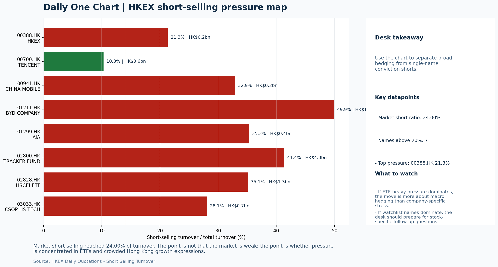
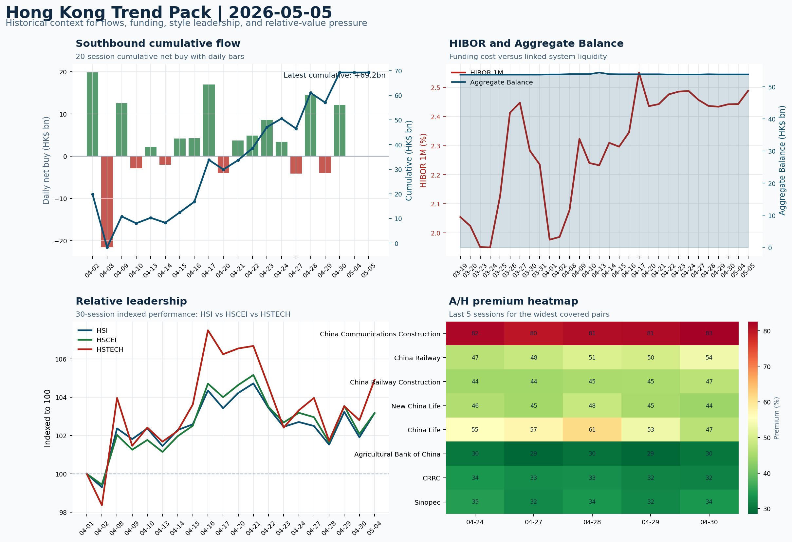

# Morning Research Workbench | 2026-05-06

> Designed for a Hong Kong sell-side commute: Layer 1 `Scan`, Layer 2 `Deep Read`, Layer 3 `Thinking`
> Mode: `Trading Daily` | Keep the report execution-oriented: what mattered in the completed session, what can move Hong Kong leadership, and what needs fast follow-up.
> Briefing date: `2026-05-06` | Review date: `2026-05-05` | Global request: `2026-05-05` | HK/China request: `2026-05-05` | Market effective date: `2026-05-05` | Generated at: `2026-05-06 07:58:02`
> Date policy: Review date 2026-05-05 is treated as `Trading Daily`. | Global request date is 2026-05-05; adapter effective date is 2026-05-05 and summary date is 2026-05-05. | HK/China local data date is 2026-05-05; role: same-session local cash tape.

> Market data quality: Coverage: `31/32` | Stale items (>1d): `4` | Missing: `1`

> Report quality: `89.7/100` | Grade `B` | Status `production ready`

## Visual Dashboard

## Layer 1 | Scan (5-10 min)

### 1.1 One-Line Market Pulse
Growth-led Hong Kong rebound (+2.05% HSTECH) found a tailwind from softer USD and lower yields overnight, but thin turnover (0.49x 20D) and 24% short-selling argue the move still needs flow confirmation before treating it as durable.

### 1.2 Global Asset Price Dashboard

| Asset | Last | 1D move | Read |
| --- | --- | --- | --- |
| S&P 500 | 7,259.22 | +0.81% | US large-cap risk appetite |
| Nasdaq 100 | 28,015.06 | +1.31% | Growth and duration leadership |
| Hang Seng Index | 26,095.88 | +1.24% | Hong Kong broad beta |
| Hang Seng TECH | 4.8740 | **+2.05%** | Hong Kong growth / platform read-through |
| CSI 300 | 4,807.31 | -0.06% | Mainland large-cap tone |
| US 10Y | 4.4160 | -0.67% | Global discount-rate anchor |
| China 10Y | N/A | | China local rates anchor \| Unavailable \| Eastmoney |
| CN-US 10Y spread | N/A | | Relative carry and macro-pressure gauge \| Unavailable \| Eastmoney |
| DXY | 98.30 | -0.17% | Dollar liquidity impulse |
| USD/CNH | 6.8080 | +0.00% | Offshore China risk appetite |
| USD/HKD | 7.8330 | -0.02% | Linked-exchange regime stress check |
| Brent crude | 107.32 | **-6.22%** | Energy / geopolitics |
| COMEX gold | 4,597.10 | **+1.72%** | Hedge demand / real yields |
| Copper | 6.0025 | **+3.58%** | Global growth proxy |
| VIX | 17.38 | **-4.98%** | US stress barometer |

### 1.3 Hong Kong Key Data Quick Check

| Check | Value | Status | Source / as of | Why it matters |
| --- | --- | --- | --- | --- |
| Main Board turnover vs 20D | 0.49x \| -51% vs 20D | Live local | HKEX \| 2026-05-05 | Trailing 20-session average turnover was HK$249.6bn. |
| Southbound / Northbound net flow | Southbound Net HK$0.0bn \| turnover HK$0.0bn \| Northbound N/A | Live local | HKEX Connect \| 2026-05-05 | Southbound net buy is calculated from HKEX disclosed buy and sell turnover. |
| Short-selling ratio | 24.00% | Live local | HKEX \| 2026-05-05 | Official HKEX stock-level short-selling table, aggregated as a share of total market turnover. |
| AH premium index | 28.54% | Stale public | Yahoo \| 2026-04-30 | Simple average across 20 A/H pairs; use dispersion rather than the average alone. |
| USD/HKD spot vs band | 7.8330 \| band 7.7500 to 7.8500 | Live quote + local | Yahoo \| 2026-05-05 | Inside the linked-exchange band without immediate boundary stress. Official Convertibility Undertakings define the linked-rate stress boundaries for USD/HKD. |
| HIBOR 1M | 2.49% | Live local | HKMA \| 2026-05-05 | 1M HIBOR is the cleanest quick read for Hong Kong funding conditions and equity-duration pressure. |
| Aggregate Balance | HK$53.9bn | Live local | HKMA \| 2026-05-05 | Aggregate Balance helps frame whether linked-rate liquidity conditions are tight or comfortable. |
| Hong Kong leadership | Hong Kong growth / internet led | Proxy fallback | HSI / HSCEI / HSTECH relative perf \| 2026-05-05 | Use HSI / HSCEI / HSTECH relative moves as the opening style read. |

### 1.4 Risk Dashboard
**Composite risk score:** `62.7/100` | **Regime:** `Mixed`

| Component | Score impact | Evidence |
| --- | --- | --- |
| US beta | +4.9 | S&P 500 +0.81% |
| HK growth | +10 | HSTECH +2.05% |
| Offshore China proxy | -0.8 | FXI -0.16% |
| Dollar pressure | +1.7 | DXY -0.17% |
| Volatility | +10.0 | VIX -4.98% |
| HK short-selling | -8 | Short-selling ratio 24.00% |

### 1.5 Morning Checklist
1. **[A] Latam Airlines Changes Guidance on Fuel Cost Despite Profit Jump**
 News / announcements | This can directly reshape earnings forecasts and the valuation framework
2. **[A] PayPal's stock falls after earnings. Here's what's spooking Wall Street.**
 News / announcements | This can directly reshape earnings forecasts and the valuation framework
3. **INTC -6.33%**
 Mover attribution | Announcement / expectations | Guidance reset and margin pressure
4. **WTI crude -6.08%**
 High-frequency data | Softer oil argues for a more cautious cyclical-growth read.
5. **Risk-On backdrop with USD softer, lower yields supported duration, and Bitcoin outperformed Oil**
 Overnight regime | Start by deciding whether the day is about Risk-On conditions or a style pivot.

## Layer 2 | Deep Read (20-30 min)

### 2.1 Overnight Overseas Market Review
#### Market Setup
**Core tape.** US equities advanced as the Nasdaq 100 led +1.31% and the S&P 500 gained +0.81%, supported by a softer USD (DXY -0.17%) and lower 10Y yields (-0.67%).
**Main driver.** Euro Stoxx 50 underperformed at -2.0%, while Bitcoin's +1.39% versus WTI crude's -6.08% reflected a notable risk appetite divergence between digital assets and commodities.
**HK relevance.** Intel's -6.33% guidance reset weighed on semiconductor sentiment, and PayPal's weak June guidance added caution on consumer payments.

#### Key Drivers
- Softer USD and lower yields eased duration pressure, supporting growth-style names and tech leadership.
- Nasdaq 100 +1.31% transmitted positive sentiment to Hong Kong growth proxies on the session.
- Bitcoin outperformed oil by 5.37pct, signalling broad risk appetite rather than commodity-driven demand.
- WTI crude -6.08% may signal demand concerns rather than supply normalization; watch for energy/cyclical read-through.

#### Hong Kong Read-Through
**Desk lens.** Hong Kong growth / internet led.
**Opening implication.** A constructive open is plausible given the growth-style tailwind, but thin turnover and 24% short-selling argue for confirmation via HSTECH and broader breadth before positioning aggressively.
- **Cross-market read:** Hang Seng +1.24% / HSCEI +1.07% / HSTECH +2.05%.
- **Cross-market read:** Offshore China proxy FXI -0.16% and USD/CNH +0.00% frame cross-border risk appetite.
- **Cross-market read:** USD/HKD last traded around 7.8330, which keeps the Hong Kong funding lens in focus.

#### Watch Points
- USD composite moved lower by -0.21pct intraday, with a 0.322pct range.
- Main turning points appeared around 2026-05-05 08:05 peak / 2026-05-05 08:30 peak / 2026-05-05 08:50 trough, suggesting event-driven repricing.
- The biggest cross-asset divergence was Bitcoin versus Oil, a spread of 5.37pct.
- Gold moved +1.16pct intraday with a 1.314pct high-low range.

**Curated overnight stories**
1. **WTI crude -6.08% - Softer oil argues for a more cautious cyclical-growth read**
 Why it matters: Sharp oil decline reduces input cost pressures for manufacturers and airlines but may signal weakening demand expectations.
 HK read-through: Energy sector names ( PetroChina, CNOOC) may face pressure from lower crude, but softer oil reduces cost base for industrials and logistics.
2. **INTC -6.33% - Guidance reset and margin pressure**
 Why it matters: Intel's sharp decline signals semiconductor sector headwinds. The guidance reset and margin commentary reflect ongoing competitive pressures, likely weighing on peer.
 HK read-through: Semiconductor and tech names with exposure to compute infrastructure or related to the AI buildout (SMIC, Hua Hong, tech hardware names) may face sentiment spillover.
3. **SEC advances proposal to end mandatory quarterly earnings reports**
 Why it matters: Regulatory change could reduce earnings volatility and short-term forecast focus. Companies would file semiannually instead of quarterly, potentially altering trading.
 HK read-through: Limited near-term impact on HK-listed companies, but if adopted, could shift global investor behavior over medium term.
4. **PayPal stock falls - June-quarter guidance misses expectations**
 Why it matters: Digital payments guidance shortfall suggests consumer spending normalization or competitive pressures. The miss overshadowed recent momentum signals.
 HK read-through: Payment sector sentiment (Tencent, Ant, related fintech names) may face indirect sentiment pressure given thematic overlap.

### 2.2 Hong Kong / A-share Previous-Day Review
#### Local Tape Setup
**Local read.** HSTECH led on the day (+2.05%) with growth outperforming both HSCEI (+1.07%) and HSI (+1.24%), suggesting a style rather than broad-beta signal.
**Verification point.** However, Main Board turnover remained thin at 0.49x the 20D average, and HSCEI ETF (2828.HK) and Hang Seng TECH ETF (3033.HK) both showed outflows on sub-average volume ratios of 0.45x and 0.51x respectively.
**Risk to watch.** FXI declined -0.16%, indicating the offshore China proxy did not confirm the same style read.

#### Style and Local Leadership
**Style leadership.** Hong Kong growth / internet led.
- **Cross-market read:** Hang Seng +1.24% / HSCEI +1.07% / HSTECH +2.05%.
- **Cross-market read:** Offshore China proxy FXI -0.16% and USD/CNH +0.00% frame cross-border risk appetite.
- **Cross-market read:** USD/HKD last traded around 7.8330, which keeps the Hong Kong funding lens in focus.
**LLM local leadership read.** Growth-led; HSTECH outperformed HSCEI and HSI. The confirmation test is whether HSTECH holds relative strength with turnover expansion rather than index direction alone.

#### Flow Confirmation
Official Stock Connect evidence is available; use Section 2.3 to confirm whether local money supports the price action.

#### Follow-Through Checklist
**Follow-through check.** Confirm whether turnover recovers above 0.7x the 20D average on 2026-05-06 and whether short-selling ratio declines from 24%. FXI (+/-) and CSI 300 performance are the cross-market read-throughs for whether the growth-led Hong Kong tape has A-share.

### 2.3 Flow Tracker and Attribution
#### Cross-Asset Attribution v1

| Driver | Direction | Score | Evidence | HK implication |
| --- | --- | --- | --- | --- |
| Short-selling pressure | drag | 6.3 | HKEX short-selling ratio was 24.00%. | Elevated short activity argues for extra confirmation before chasing rebounds. |
| Hong Kong participation | drag | 5.1 | Main Board turnover was 0.49x the 20-session average. | Thin turnover makes index moves easier to fade. |
| Oil and geopolitics | supportive | 4.98 | Oil moved -6.22%. | Split the read between energy/cyclicals support and margin/geopolitical pressure. |
| US growth-style transmission | supportive | 1.83 | Nasdaq 100 moved +1.31%. | Hong Kong growth and platform names should be tested first at the open. |
| Global equity beta | supportive | 0.81 | S&P 500 moved +0.81%. | Broad beta matters if Hong Kong breadth confirms the overseas signal. |
| Rates impulse | supportive | 0.8 | US 10Y yield proxy moved -0.67%. | Lower yields help long-duration growth; higher yields pressure valuation-sensitive |

#### Flow Tracker
##### Flow Takeaways
- Short-selling pressure is elevated, so local rebounds need cleaner breadth and flow confirmation.
- Stock Connect Southbound: net HK$0.0bn on turnover HK$0.0bn (as of 2026-05-05).
- AH premium: simple covered-pair average +28.54%; widest premium: China Communications Construction 82.71%.
- ETF flow anomalies were concentrated in: 2828.HK +nan% / volume ratio 0.45x / outflow; 3033.HK +nan% / volume ratio 0.51x / outflow; HYG +0.15% / volume ratio 0.62x / inflow.

##### Key Flow / Funding Metrics

| Metric | Value | Status | Source / as of | Read |
| --- | --- | --- | --- | --- |
| Southbound / Northbound net flow | Southbound Net HK$0.0bn \| turnover HK$0.0bn \| Northbound N/A | Live local | HKEX Connect \| 2026-05-05 | Southbound net buy is calculated from HKEX disclosed buy and sell turnover. |
| Main Board turnover vs 20D | 0.49x \| -51% vs 20D | Live local | HKEX \| 2026-05-05 | Trailing 20-session average turnover was HK$249.6bn. |
| Short-selling ratio | 24.00% | Live local | HKEX \| 2026-05-05 | Official HKEX stock-level short-selling table, aggregated as a share of total market turnover. |
| AH premium index | 28.54% | Stale public | Yahoo \| 2026-04-30 | Simple average across 20 A/H pairs; use dispersion rather than the average alone. |
| HIBOR 1M | 2.49% | Live local | HKMA \| 2026-05-05 | 1M HIBOR is the cleanest quick read for Hong Kong funding conditions and equity-duration pressure. |
| Aggregate Balance | HK$53.9bn | Live local | HKMA \| 2026-05-05 | Aggregate Balance helps frame whether linked-rate liquidity conditions are tight or comfortable. |

##### Stock Connect Southbound Active Names

| Rank | Ticker | Name | Buy | Sell | Net buy |
| --- | --- | --- | --- | --- | --- |
| 1 | | - | N/A | N/A | N/A |
| 1 | | - | N/A | N/A | N/A |

##### AH Premium Dispersion

| Name | A ticker | H ticker | Premium | As of |
| --- | --- | --- | --- | --- |
| China Communications Construction | 601800.SS | 1800.HK | +82.71% | 2026-04-30 |
| China Railway | 601390.SS | 0390.HK | +54.12% | 2026-04-30 |
| China Railway Construction | 601186.SS | 1186.HK | +47.17% | 2026-04-30 |
| New China Life | 601336.SS | 1336.HK | +44.67% | 2026-04-30 |
| China Life | 601628.SS | 2628.HK | +44.42% | 2026-04-30 |

##### HKEX Short-Selling Watch

| Ticker | Name | Short ratio | Short turnover | Total turnover |
| --- | --- | --- | --- | --- |
| 00388.HK | HKEX | 21.34% | HK$0.2bn | HK$0.8bn |
| 00700.HK | TENCENT | 10.29% | HK$0.6bn | HK$6.1bn |
| 00941.HK | CHINA MOBILE | 32.90% | HK$0.2bn | HK$0.5bn |
| 01211.HK | BYD COMPANY | 49.94% | HK$1.1bn | HK$2.2bn |
| 01299.HK | AIA | 35.31% | HK$0.4bn | HK$1.2bn |

- **Short-value leaders:** 02800.HK TRACKER FUND (HK$4.0bn); 01810.HK XIAOMI-W (HK$1.7bn); 00005.HK HSBC HOLDINGS (HK$1.6bn); 02828.HK HSCEI ETF (HK$1.3bn).

### 2.4 Macro and Policy Tracking
**Desk read.** No LLM macro interpretation was available; rely on the calendar table and released data below.

| Time | Region | Event | Status | Desk read |
| --- | --- | --- | --- | --- |
| 20:30 | US | CPI MoM | Released | Impact: Rates expectations, the dollar, and growth-equity valuation \| Attention: 5/5 \| Industries: Technology, Internet, Brokers |
| 09:30 | China | Trade Balance | Released | Impact: Watch whether it changes the day's core market narrative \| Attention: 3/5 \| Industries: To be assessed |
| 20:30 | US | Retail Sales MoM | Upcoming | Impact: Consumer resilience, growth expectations, and risk-asset pricing \| Attention: 5/5 \| Industries: Consumer, E-commerce, Consumer discretionary |
| 09:20 | China | Loan Prime Rate | Upcoming | Impact: Watch whether it changes the day's core market narrative \| Attention: 3/5 \| Industries: To be assessed |
| 22:00 | Federal Reserve | Jerome Powell: Economic outlook remarks | Central bank | Impact: Policy path, liquidity conditions, and cross-asset risk appetite \| Attention: 5/5 \| Industries: Technology, Financials, Gold |
| 10:00 | PBOC | Open Market Operations Desk: Daily liquidity operation window | Central bank | Impact: Policy path, liquidity conditions, and cross-asset risk appetite \| Attention: 3/5 \| Industries: Technology, Financials, Gold |

#### Positioning and Risk Backdrop
- Options activity centered on KWEB Call, with Vol/OI at 1.88x and a bullish bias.
- Put/Call structure shows equity 0.68 / index 1.15, implying Single-stock optimism with index hedging.
- Geopolitics: Middle East | Regional tension remains elevated | Impact: Oil, freight costs, and safe-haven demand
- Geopolitics: US-China | Technology export-control rhetoric remains active | Impact: China internet, semiconductors, and supply chains

### 2.5 Key Company and Sector Events

| Grade | Sector | Headline | Why it matters | Horizon |
| --- | --- | --- | --- | --- |
| A | Semiconductors and AI | Latam Airlines Changes Guidance on Fuel Cost Despite Profit Jump | This can directly reshape earnings forecasts and the valuation framework | Short-term catalyst |
| A | Other | PayPal's stock falls after earnings. Here's what's spooking Wall | This can directly reshape earnings forecasts and the valuation framework | Short-term catalyst |
| A | Semiconductors and AI | AI Boom Fuels Sterling Infrastructure's Jump to a Record | This can directly reshape earnings forecasts and the valuation framework | Short-term catalyst |
| A | Other | End Quarterly Earnings Reports? Here's the Debate | This can directly reshape earnings forecasts and the valuation framework | Short-term catalyst |
| A | Autos and EV | Berkshire shares trade lower even after Abel scores good marks at | This can directly reshape earnings forecasts and the valuation framework | Short-term catalyst |
| A | Other | SEC advances Trump-backed proposal to end mandatory quarterly | This can directly reshape earnings forecasts and the valuation framework | Short-term catalyst |
| A | Autos and EV | Alphabet Returns to Euro Debt Market for Latest AI Megabond Deal | Capital allocation or shareholder-return events can trigger a valuation | Medium-term trend |
| A | Energy and Materials | Russian Fuel Tanker Stalls Off Cuban Coast Amid US Blockade | Capital allocation or shareholder-return events can trigger a valuation | Medium-term trend |

#### HKEX Announcements

| Grade | Ticker | Type | Release time | Title |
| --- | --- | --- | --- | --- |
| A | 00637.HK | Profit warning | 2026-05-05 | Profit warning / alert announcement |
| A | 01757.HK | Profit warning | 2026-05-05 | Profit warning / alert announcement |
| A | 06080.HK | Profit warning | 2026-05-05 | Profit warning / alert announcement |
| A | 08065.HK | Profit warning | 2026-04-30 | Profit warning / alert announcement |

#### Earnings / Results Watch

| Ticker | Company | Timing | Expectation framing |
| --- | --- | --- | --- |
| 0700.HK | Tencent Holdings | After Market Close | EPS est. 4.15 HKD \| revenue est. 163.2bn HKD |
| 0388.HK | Hong Kong Exchanges and Clearing | Before Market Open | EPS est. 2.81 HKD \| revenue est. 6.0bn HKD |

#### Rating Changes
- **9988.HK** | Morgan Stanley | Upgrade | Equal Weight -> Overweight | PT 92 -> 105

#### IPO Watch
- IPO / grey-market / first-day performance should be wired to a dedicated Hong Kong ECM adapter.

### 2.6 Coverage Pools
#### Core coverage

| Name | Ticker | Last | 1D | Range position | Morning note |
| --- | --- | --- | --- | --- | --- |
| Meituan | 3690.HK | 83.55 | -1.07% | Mid-range | Positioning is neutral for now, so use it mainly to monitor marginal information |
| HKEX | 0388.HK | 418.20 | +0.77% | Top of range | The name sits near the top of its recent range, so watch for profit-taking under |
| Alibaba | 9988.HK | 131.20 | -0.38% | Mid-range | Positioning is neutral for now, so use it mainly to monitor marginal information |
| Tencent | 0700.HK | 472.20 | -0.17% | Bottom of range | The name sits near the bottom of its recent range and is worth monitoring for a |

**Recent headlines for Meituan:**
- [Asian Growth Companies With Insider Ownership As High As 38%](https://finance.yahoo.com/markets/stocks/articles/asian-growth-companies-insider-ownership-043619455.html) (Simply Wall St.)
- [Alibaba Stock Is Getting Hit Again, but Qwen and Cloud Growth Are Surging](https://www.marketbeat.com/originals/alibaba-stock-is-getting-hit-again-but-qwen-and-cloud-growth-are-surging/?utm_source=yahoofinance&utm_medium=yahoofinance) (MarketBeat)
**Recent headlines for HKEX:**
- [Hong Kong Exchange Operator Posts Record Profit on Listings, Trading Growth](https://www.wsj.com/business/earnings/hong-kong-exchange-operator-posts-record-quarterly-profit-revenue-1cc26df8?siteid=yhoof2&yptr=yahoo) (The Wall Street Journal)
- [Has Hong Kong Exchanges And Clearing (SEHK:388) Run Ahead Of Its Recent Share Price Strength?](https://finance.yahoo.com/markets/stocks/articles/hong-kong-exchanges-clearing-sehk-060725066.html) (Simply Wall St.)
**Recent headlines for Alibaba:**
- [Does This $10 Million Bet on New Oriental Education Stock Signal a Potential Turnaround Ahead?](https://www.fool.com/coverage/filings/2026/05/05/does-this-usd10-million-bet-on-new-oriental-education-stock-signal-a-potential-turnaround-ahead/) (Motley Fool)
- [Why This $19 Million Sale in a Stock Up 57% Looks Like Smart Profit Taking](https://www.fool.com/coverage/filings/2026/05/05/why-this-usd19-million-sale-in-a-stock-up-57-looks-like-smart-profit-taking/) (Motley Fool)
**Recent headlines for Tencent:**
- ['Grand Theft Auto' maker Take-Two plots its next move in a consolidating gaming industry](https://www.fastcompany.com/91534908/grand-theft-auto-take-two-next-move-consolidating-gaming-industry) (FastCompany)
- [InterDigital (IDCC) Is Down 21.2% After Licensing‑Driven Earnings Beat And Guidance Reaffirmation Has The Bull Case Changed?](https://finance.yahoo.com/markets/stocks/articles/interdigital-idcc-down-21-2-031909031.html) (Simply Wall St.)

#### Priority follow-up

| Name | Ticker | Last | 1D | Range position | Morning note |
| --- | --- | --- | --- | --- | --- |
| BYD Company | 1211.HK | 101.00 | -1.94% | Mid-range | Positioning is neutral for now, so use it mainly to monitor marginal information |
| China Mobile | 0941.HK | 83.85 | -0.12% | Top of range | The name sits near the top of its recent range, so watch for profit-taking under |
| AIA | 1299.HK | 85.90 | -0.12% | Mid-range | Positioning is neutral for now, so use it mainly to monitor marginal information |

**Recent headlines for BYD Company:**
- [Tesla Registrations In The UK Up 62% In April; Still Short Of BYD](https://www.investors.com/news/tesla-byd-uk-registrations-sales-electric-vehicles-auto-cars/?src=A00220&yptr=yahoo) (Investor's Business Daily)
- [BYD April NEV sales fall 26% year-on-year](https://www.just-auto.com/news/byd-april-nev-sales-fall/) (Just Auto)
**Recent headlines for China Mobile:**
- [Deutsche Telekom Weighs Full Combination With T-Mobile](https://finance.yahoo.com/markets/stocks/articles/deutsche-telekom-weighs-full-combination-115107414.html) (Bloomberg)
- [Deutsche Telekom exploring merger with T-Mobile, Bloomberg News reports](https://finance.yahoo.com/markets/stocks/articles/deutsche-telekom-exploring-merger-t-182010144.html) (Reuters)
**Recent headlines for AIA:**
- [Is It Too Late To Consider AIA Group (SEHK:1299) After Its 82% One Year Rally?](https://finance.yahoo.com/markets/stocks/articles/too-consider-aia-group-sehk-042100864.html) (Simply Wall St.)
- [Is AIA (AAGIY) Outperforming Other Finance Stocks This Year?](https://finance.yahoo.com/markets/stocks/articles/aia-aagiy-outperforming-other-finance-134003763.html) (Zacks)

#### Learning watchlist

| Name | Ticker | Last | 1D | Range position | Morning note |
| --- | --- | --- | --- | --- | --- |
| Hang Seng TECH ETF | 3033.HK | 4.8700 | +2.05% | Mid-range | Short-term price strength is clear; fresh catalysts could trigger broader group |
| Tracker Fund of Hong Kong | 2800.HK | 26.24 | +1.31% | Mid-range | Positioning is neutral for now, so use it mainly to monitor marginal information |
| HSCEI ETF | 2828.HK | 89.98 | +1.24% | Mid-range | Positioning is neutral for now, so use it mainly to monitor marginal information |

## Layer 3 | Thinking (10-15 min)

### 3.1 Rotating Theme Deep Dive

| Field | Read |
| --- | --- |
| Theme | Innovative Biotech and Out-Licensing |
| Angle for the day | Watch whether clinical data, approvals, and licensing momentum are still supporting the innovative-healthcare rerating story. |

**Theme desk read**
**Core thesis.** The innovative-biotech and out-licensing theme remains in a constructive macro environment for 2026-05-05.
**Evidence.** Risk-On conditions - USD softer, lower yields, VIX -4.98% - typically support duration-sensitive growth sectors including pre-revenue or pipeline-heavy healthcare names.
**What to test.** Copper +3.58% and Bitcoin +1.39% reinforce the risk appetite shift, while the firm gold price (+1.72%) suggests real-yield dynamics remain benign.

**Signals to keep in mind**
- WTI crude -6.08%: Softer oil argues for a more cautious cyclical-growth read.
- VIX -4.98%: Lower volatility signals easing stress in the tape.

**LLM watch items:**
- Confirm whether any HK-listed biotech or CRO names enter core coverage to validate the licensing-momentum angle.
- Monitor whether WTI crude -6.08% reversal continues; sustained softness would challenge cyclical-growth reads and healthcare capex assumptions.
- US Retail Sales MoM (2026-05-06, forecast 0.3%) will test whether consumer resilience supports the Risk-On backdrop or triggers a style pivot.
- Track Hang Seng TECH ETF (3033.HK, +2.05%) as a proxy for growth-sector sentiment that also applies to innovative healthcare.
- Watch China Loan Prime Rate decision (2026-05-06, held at 3.45% expected) for any surprise that shifts risk appetite.

**Related names to keep close:**

| Name | Ticker | Bucket | Morning read |
| --- | --- | --- | --- |
| Meituan | 3690.HK | Core coverage | Positioning is neutral for now, so use it mainly to monitor marginal information |
| BYD Company | 1211.HK | Priority follow-up | Positioning is neutral for now, so use it mainly to monitor marginal information |
| Hang Seng TECH ETF | 3033.HK | Learning watchlist | Short-term price strength is clear; fresh catalysts could trigger broader group |

### 3.2 Today Ahead and Trading Calendar
- Macro: CPI MoM is the first item to anchor the open and the rates/FX response.
- Corporate / event: Meituan: Order trends and margin commentary is the cleanest same-day catalyst to prepare for.

**Same-day macro docket**

| Time | Country | Event | Status | Detail |
| --- | --- | --- | --- | --- |
| 20:30 | US | CPI MoM | Released | Actual 0.3% / Forecast 0.2% / Prior 0.4% |
| 09:30 | China | Trade Balance | Released | Actual USD 85.2bn / Forecast USD 79.0bn / Prior USD 80.6bn |
| 20:30 | US | Retail Sales MoM | Upcoming | Forecast 0.3% / Prior 0.6% |
| 09:20 | China | Loan Prime Rate | Upcoming | Forecast 3.45% / Prior 3.45% |
| 22:00 | Federal Reserve | Jerome Powell: Economic outlook remarks | Central bank | speech |

**Same-day catalyst list**

| Date | Time | Category | Event | Importance |
| --- | --- | --- | --- | --- |
| 2026-05-06 | | Core coverage | Meituan: Order trends and margin commentary | 3 |
| 2026-05-06 | | Core coverage | HKEX: Turnover data and IPO pipeline updates | 3 |
| 2026-05-06 | | Core coverage | Alibaba: Cloud demand and GMV updates | 3 |
| 2026-05-06 | | Core coverage | Tencent: Game grossing trends and ad-demand checks | 3 |
| 2026-05-06 | | Priority follow-up | BYD Company: Weekly sales data and model rollout cadence | 3 |
| 2026-05-06 | | Priority follow-up | China Mobile: Capex updates and dividend policy signals | 3 |

**Next few sessions**

| Date | Category | Event | Impact |
| --- | --- | --- | --- |
| 2026-05-06 | Core coverage | Meituan: Order trends and margin commentary | High-frequency read on local services demand and platform competition |
| 2026-05-06 | Core coverage | HKEX: Turnover data and IPO pipeline updates | Direct proxy for Hong Kong market turnover, listings, and southbound |
| 2026-05-06 | Core coverage | Alibaba: Cloud demand and GMV updates | Key read-through for China consumption, cloud, and platform regulation |
| 2026-05-06 | Core coverage | Tencent: Game grossing trends and ad-demand checks | Core offshore China platform proxy for gaming, ads, and AI monetization |
| 2026-05-06 | Priority follow-up | BYD Company: Weekly sales data and model rollout cadence | Hong Kong-listed proxy for EV volumes, export mix, and price competition |
| 2026-05-06 | Priority follow-up | China Mobile: Capex updates and dividend policy signals | Defensive SOE benchmark for yield trade and domestic |
| 2026-05-06 | Priority follow-up | AIA: NBV trends and agency momentum | Read-through for wealth demand, mainland visitor activity, and HK |
| 2026-05-06 | Learning watchlist | Hang Seng TECH ETF: AI narrative shifts and China platform | Fast proxy for Hong Kong internet and growth leadership |

### 3.3 Daily One Chart
**Daily One Chart | HKEX short-selling pressure map**

**Chart read.** Market short-selling reached 24.00% of turnover.
**Why it matters.** The point is not that the market is weak; the point is whether pressure is concentrated in ETFs and crowded Hong Kong growth expressions.

_Source: HKEX Daily Quotations - Short Selling Turnover_

### 3.4 Hong Kong Trend Pack
**Hong Kong Trend Pack**

**Trend read.** Four historical lenses: Southbound cumulative flow, HKMA funding and liquidity, HSI/HSCEI/HSTECH relative leadership, and A/H premium dispersion.

_Source: HKEX Stock Connect, HKMA liquidity data, and public Yahoo Finance quotes_

### 3.5 Personal View Pad
- **Thinking note:** The HSTECH-led session is encouraging for style leadership.
- **Action:** Treat 2026-05-06 as a confirmation test: if turnover recovers above 0.7x 20D average and short-selling ratio drops from 24%, the risk-on narrative becomes investable.
- **Suggested market answer:** The HSTECH-led gain is a constructive signal but the thin turnover and elevated short-selling mean it is a test rather than a confirmed breakout.
- **Second sentence:** I would frame today as needing breadth expansion and turnover recovery to validate the growth leadership thesis, not as a blanket risk-on call.
- **What could break the view:** A WTI crude reversal continuing lower would challenge the cyclical-growth read underpinning the healthcare and tech rerating thesis.
- **Risk trigger:** A fast dollar reversal or spike in HIBOR would undermine the duration-support thesis that is currently holding the growth style.
- Does the overnight tape still read as `Risk-On`, or do I expect a different Hong Kong cash-session outcome?
- Is today's Hong Kong setup better described as `Hong Kong growth / internet led`, and does that match my current mental model?
- What was the most important overnight surprise, and does it change my base case?
- Which sector or stock view now deserves a tighter follow-up or a revised assumption?
- If I were asked for a two-minute market view this morning, what would my answer be?
- My own view after the commute:
- What changed versus yesterday:
- Which name / sector deserves extra prep before the open:

## Traceable Appendix

### Key Questions to Keep in Mind
- Is risk appetite rising or fading? The overnight tape reads closer to `Risk-On`.
- Did rates expectations move? Focus on whether US 10Y, DXY, and growth style moved together.
- Were commodities the real story? Watch WTI and gold for geopolitics versus inflation signals.
- Is Hong Kong setup internet-led, SOE-led, or broad beta-led? Compare HSTECH, HSCEI, and HSI.
- Did offshore markets move China risk appetite? Focus on HSI, FXI, USD/CNH, and USD/HKD.

### Report Quality and Validation
- **Quality score:** 89.7/100 | **Grade:** B | **Status:** production ready

| Component | Score | Weight | Read |
| --- | --- | --- | --- |
| Market data coverage | 96.9 | 0.3 | 31/32 core market fields available. |
| Hong Kong local metrics | 79.5 | 0.25 | 7 live, 3 proxy, 0 unavailable local checks. |
| Key public adapters | 100.0 | 0.2 | 4/4 key adapters were available or partially available. |
| LLM task health | 71.4 | 0.15 | 5/7 LLM tasks succeeded or used validated cache; 2 error(s). |
| Fact-check guardrail | 100.0 | 0.1 | Checked 2 numeric claims; 0 numeric mismatch(es), 0 logic warning(s); 0 critical, 0 review. |

**LLM fact-check guardrail**
- Checked 2 numeric claims; 0 numeric mismatch(es), 0 logic warning(s); 0 critical, 0 review.

**Adapter status**

| Adapter | Status |
| --- | --- |
| Stock Connect | ok |
| A/H premium | ok |
| HKEX announcements | ok |
| China rates | ok |

### Source Links
- [Latam Airlines Changes Guidance on Fuel Cost Despite Profit Jump](https://www.bloomberg.com/news/articles/2026-05-05/latam-airlines-changes-guidance-on-fuel-cost-despite-profit-jump) (bloomberg_markets)
- [PayPal's stock falls after earnings. Here's what's spooking Wall Street.](https://www.marketwatch.com/story/paypals-stock-rallies-after-first-earnings-report-of-the-new-era-heres-what-to-know-4310d291?mod=mw_rss_topstories) (wsj_markets)
- [AI Boom Fuels Sterling Infrastructure's Jump to a Record](https://www.bloomberg.com/news/articles/2026-05-05/ai-boom-sends-sterling-infrastructure-stock-soaring-peers-gain) (bloomberg_markets)
- [End Quarterly Earnings Reports? Here's the Debate](https://www.bloomberg.com/news/articles/2026-05-05/end-quarterly-earnings-reports-here-s-the-debate) (bloomberg_markets)
- [Berkshire shares trade lower even after Abel scores good marks at meeting, earnings jump](https://www.cnbc.com/2026/05/04/berkshire-shares-trade-higher-as-buffett-successor-abel-scores-good-marks-at-meeting-earnings-jump.html) (cnbc_markets)
- [SEC advances Trump-backed proposal to end mandatory quarterly earnings reports](https://www.cnbc.com/2026/05/05/sec-is-close-to-ending-mandatory-quarterly-earnings-reports-that-trump-called-for.html) (cnbc_markets)
- [Alphabet Returns to Euro Debt Market for Latest AI Megabond Deal](https://www.bloomberg.com/news/articles/2026-05-05/alphabet-kicks-off-six-tranche-euro-debt-offering) (bloomberg_markets)
- [Russian Fuel Tanker Stalls Off Cuban Coast Amid US Blockade](https://www.bloomberg.com/news/articles/2026-05-05/russian-fuel-tanker-stalls-off-cuban-coast-amid-us-blockade) (bloomberg_markets)
- [Michael Burry sells GameStop after Ryan Cohen's hefty eBay bid: 'Never confuse debt for creativity'](https://www.cnbc.com/2026/05/05/burry-sells-gamestop-after-cohens-ebay-bid-never-confuse-debt-for-creativity.html) (cnbc_markets)
- [Compass Shares Surge After 2Q Revenue Forecast Beats Estimates](https://www.bloomberg.com/news/articles/2026-05-05/compass-shares-surge-after-2q-revenue-forecast-beats-estimates) (bloomberg_markets)
- [Sydney Hedge Fund Regal Sees Inflows Jump for Inflation Hedges](https://www.bloomberg.com/news/articles/2026-05-05/sydney-hedge-fund-regal-sees-inflows-jump-for-inflation-hedges) (bloomberg_markets)
- [Stock Futures Rise as Trump Cites Progress on Iran: Markets Wrap](https://www.bloomberg.com/news/articles/2026-05-05/asian-stocks-to-track-us-gains-on-truce-optimism-markets-wrap) (bloomberg_markets)
- [Asian Growth Companies With Insider Ownership As High As 38%](https://finance.yahoo.com/markets/stocks/articles/asian-growth-companies-insider-ownership-043619455.html) (Simply Wall St.)
- [Alibaba Stock Is Getting Hit Again, but Qwen and Cloud Growth Are Surging](https://www.marketbeat.com/originals/alibaba-stock-is-getting-hit-again-but-qwen-and-cloud-growth-are-surging/?utm_source=yahoofinance&utm_medium=yahoofinance) (MarketBeat)
- [Hong Kong Exchange Operator Posts Record Profit on Listings, Trading Growth](https://www.wsj.com/business/earnings/hong-kong-exchange-operator-posts-record-quarterly-profit-revenue-1cc26df8?siteid=yhoof2&yptr=yahoo) (The Wall Street Journal)

## Supplementary Visual Appendix

This appendix is professional-path only. It keeps a traceable index of the report visuals and the deterministic chart cues used to frame the morning note, without injecting the legacy intraday chart pack.

### Visual Index

| Visual | Path | Role |
| --- | --- | --- |
| Visual Dashboard | `charts/dashboard_2026-05-06.png` | Cross-asset regime board and Hong Kong local tape snapshot. |
| Daily One Chart | `charts/daily_one_chart_2026-05-06.png` | Single highest-conviction visual story for the day. |
| Hong Kong Trend Pack | `charts/hk_trend_pack_2026-05-06.png` | Historical context for flows, liquidity, leadership, and A/H dispersion. |

### Deterministic Chart Cues
- FX / liquidity: USD composite moved lower by -0.21pct intraday, with a 0.322pct range.
- FX / liquidity: Main turning points appeared around 2026-05-05 08:05 peak / 2026-05-05 08:30 peak / 2026-05-05 08:50 trough, suggesting event-driven repricing rather than a clean one-way USD move.
- Cross-asset: The biggest cross-asset divergence was Bitcoin versus Oil, a spread of 5.37pct.
- Cross-asset: Gold moved +1.16pct intraday with a 1.314pct high-low range.
- Cross-asset: Oil moved -4.20pct intraday with a 5.108pct high-low range.
- Cross-asset: Bitcoin moved +1.17pct intraday with a 2.335pct high-low range.

### Risk Dashboard Components

| Component | Score impact | Evidence |
| --- | --- | --- |
| US beta | +4.9 | S&P 500 +0.81% |
| HK growth | +10 | HSTECH +2.05% |
| Offshore China proxy | -0.8 | FXI -0.16% |
| Dollar pressure | +1.7 | DXY -0.17% |
| Volatility | +10.0 | VIX -4.98% |
| HK short-selling | -8 | Short-selling ratio 24.00% |
