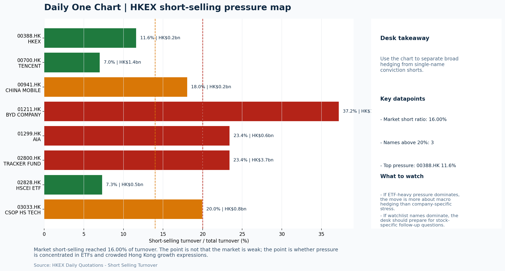
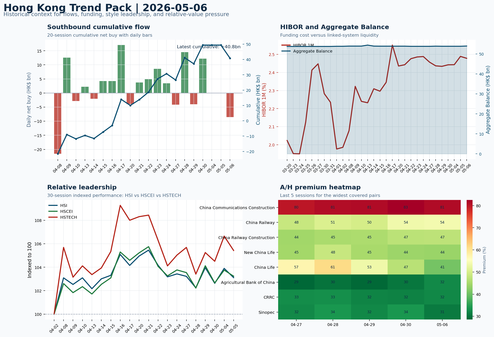

# Morning Research Workbench | 2026-05-07

> Designed for a Hong Kong sell-side commute: Layer 1 `Scan`, Layer 2 `Deep Read`, Layer 3 `Thinking`
> Mode: `Trading Daily` | Keep the report execution-oriented: what mattered in the completed session, what can move Hong Kong leadership, and what needs fast follow-up.
> Briefing date: `2026-05-07` | Review date: `2026-05-06` | Global request: `2026-05-06` | HK/China request: `2026-05-06` | Market effective date: `2026-05-06` | Generated at: `2026-05-07 07:58:34`
> Date policy: Review date 2026-05-06 is treated as `Trading Daily`. | Global request date is 2026-05-06; adapter effective date is 2026-05-06 and summary date is 2026-05-06. | HK/China local data date is 2026-05-06; role: same-session local cash tape.

> Market data quality: Coverage: `31/32` | Stale items (>1d): `3` | Missing: `1`

> Report quality: `94.7/100` | Grade `A` | Status `production ready`

## Visual Dashboard

## Layer 1 | Scan (5-10 min)

### 1.1 One-Line Market Pulse
Risk-On overnight with USD softness and lower yields was a constructive lead for Hong Kong, but the local tape - HSI -0.76%, HSTECH -1.15%, and HK$8.6bn Southbound net sell - failed to confirm, leaving the setup as an offshore China and FXI story pending local follow-through.

### 1.2 Global Asset Price Dashboard

| Asset | Last | 1D move | Read |
| --- | --- | --- | --- |
| S&P 500 | 7,365.12 | +1.46% | US large-cap risk appetite |
| Nasdaq 100 | 28,599.17 | **+2.08%** | Growth and duration leadership |
| Hang Seng Index | 25,898.61 | -0.76% | Hong Kong broad beta |
| Hang Seng TECH | 4.8180 | -1.15% | Hong Kong growth / platform read-through |
| CSI 300 | 4,807.31 | -0.06% | Mainland large-cap tone |
| US 10Y | 4.3560 | -1.36% | Global discount-rate anchor |
| China 10Y | 1.77% | | China local rates anchor \| Live public \| Eastmoney \| 2026-05-06 |
| CN-US 10Y spread | -259.5bp | | Relative carry and macro-pressure gauge \| Live public \| Eastmoney \| 2026-05-06 |
| DXY | 98.03 | -0.46% | Dollar liquidity impulse |
| USD/CNH | 6.7955 | +0.00% | Offshore China risk appetite |
| USD/HKD | 7.8356 | +0.03% | Linked-exchange regime stress check |
| Brent crude | 101.94 | **-7.22%** | Energy / geopolitics |
| COMEX gold | 4,708.30 | **+3.35%** | Hedge demand / real yields |
| Copper | 6.1830 | **+4.04%** | Global growth proxy |
| VIX | 17.39 | +0.06% | US stress barometer |

### 1.3 Hong Kong Key Data Quick Check

| Check | Value | Status | Source / as of | Why it matters |
| --- | --- | --- | --- | --- |
| Main Board turnover vs 20D | 1.26x \| +26% vs 20D | Live local | HKEX \| 2026-05-06 | Trailing 20-session average turnover was HK$241.1bn. |
| Southbound / Northbound net flow | Southbound Net HK$-8.6bn \| turnover HK$138.4bn \| Northbound Turnover HK$414.2bn \| net unavailable | Live local | HKEX Connect \| 2026-05-06 | Southbound net buy is calculated from HKEX disclosed buy and sell turnover. |
| Short-selling ratio | 16.00% | Live local | HKEX \| 2026-05-06 | Official HKEX stock-level short-selling table, aggregated as a share of total market turnover. |
| AH premium index | 26.99% | Live public | Yahoo \| 2026-05-06 | Simple average across 20 A/H pairs; use dispersion rather than the average alone. |
| USD/HKD spot vs band | 7.8356 \| band 7.7500 to 7.8500 | Live quote + local | Yahoo \| 2026-05-06 | Inside the linked-exchange band without immediate boundary stress. Official Convertibility Undertakings define the linked-rate stress boundaries for USD/HKD. |
| HIBOR 1M | 2.48% | Live local | HKMA \| 2026-05-06 | 1M HIBOR is the cleanest quick read for Hong Kong funding conditions and equity-duration pressure. |
| Aggregate Balance | HK$54.0bn | Live local | HKMA \| 2026-05-06 | Aggregate Balance helps frame whether linked-rate liquidity conditions are tight or comfortable. |
| Hong Kong leadership | State-owned / old-economy H-shares led | Proxy fallback | HSI / HSCEI / HSTECH relative perf \| 2026-05-06 | Use HSI / HSCEI / HSTECH relative moves as the opening style read. |

### 1.4 Risk Dashboard
**Composite risk score:** `70.5/100` | **Regime:** `Risk-on`

| Component | Score impact | Evidence |
| --- | --- | --- |
| US beta | +8.8 | S&P 500 +1.46% |
| HK growth | -5.8 | HSTECH -1.15% |
| Offshore China proxy | +8 | FXI +2.74% |
| Dollar pressure | +4.6 | DXY -0.46% |
| Volatility | -0.1 | VIX +0.06% |
| HK short-selling | +0 | Short-selling ratio 16.00% |

### 1.5 Morning Checklist
1. **[A] Elite M&A Lawyers Fed Massive Insider-Trading Ring, US Says**
 News / announcements | Capital allocation or shareholder-return events can trigger a valuation reset
2. **INTC -6.33%**
 Mover attribution | Announcement / expectations | Guidance reset and margin pressure
3. **WTI crude -6.08%**
 High-frequency data | Softer oil argues for a more cautious cyclical-growth read.
4. **Risk-On backdrop with USD softer, lower yields supported duration, and Gold outperformed Oil**
 Overnight regime | Start by deciding whether the day is about Risk-On conditions or a style pivot.
5. **CPI MoM (Released)**
 Macro / policy | Rates expectations, the dollar, and growth-equity valuation | Industries: Technology, Internet, Brokers

## Layer 2 | Deep Read (20-30 min)

### 2.1 Overnight Overseas Market Review
#### Market Setup
**Core tape.** Overnight developed-market equities rallied broadly on a softer dollar and lower US yields, with the Nasdaq 100 outperforming at +2.08% as lower rates re-priced growth duration favorably.
**Main driver.** The key cross-asset signal was Gold (+3.35%) vastly outperforming Oil (-6.08%), suggesting demand caution rather than a clean risk-embrace, even as copper rose +4.04% to test whether the macro narrative is durable.
**HK relevance.** Intel's sharp guidance reset (-6.33%) directly pressured Hong Kong tech and semis proxies at the close, compounding the local underperformance from the prior session.

#### Key Drivers
- Softer DXY (-0.46%) and lower US 10Y (-1.36%) drove rate-sensitive growth leadership; Nasdaq outperformed S&P 500 by 62bp.
- Oil's -6.08% decline (12% intraday range) unwound some geopolitical premium, a headwind for Hong Kong-listed energy names like CNOOC.
- Intel's margin guidance reset signals ongoing semis competitive pressure and creates a direct negative read-through to HK-listed SMIC.
- Hong Kong participation remained healthy with turnover 1.26x the 20-day average and short-selling at 16%, making local confirmation.

#### Hong Kong Read-Through
**Desk lens.** State-owned / old-economy H-shares led.
**Opening implication.** HSTECH and SMIC are the immediate test at the open given Intel's miss; if they hold relative to Nasdaq futures, the growth story is intact. A FXI-led open without HSI/HSTECH confirmation would signal offshore positioning rather than local risk appetite.
- **Cross-market read:** Hang Seng -0.76% / HSCEI -0.50% / HSTECH -1.15%.
- **Cross-market read:** Offshore China proxy FXI +2.74% and USD/CNH +0.00% frame cross-border risk appetite.
- **Cross-market read:** USD/HKD last traded around 7.8356, which keeps the Hong Kong funding lens in focus.

#### Watch Points
- USD composite moved lower by -0.28pct intraday, with a 0.602pct range.
- Main turning points appeared around 2026-05-06 08:05 trough / 2026-05-06 08:20 trough / 2026-05-06 08:40 trough, suggesting event-driven repricing.
- The biggest cross-asset divergence was Gold versus Oil, a spread of 5.738pct.
- Gold moved +1.16pct intraday with a 1.687pct high-low range.

**Curated overnight stories**
1. **INTC -6.33% on guidance reset and margin pressure**
 Why it matters: Intel's sharp miss signals persistent competitive pressure in semis and resets expectations for the group ahead of more earnings from US chip names this week.
 HK read-through: Direct read-through to Hong Kong-listed tech and semiconductor names. Could pressure HSI tech subindex and names with semis exposure such as SMIC and associated supply chain.
2. **Risk-On backdrop with USD softer, lower yields supported duration, Gold outperformed Oil**
 Why it matters: Macro regime shift supports duration and growth assets. Softer dollar is a tailwind for EM and offshore-China positioning.
 HK read-through: Supports Hong Kong growth and internet sentiment. Softer oil eases cost pressures for industrial and logistics names.
3. **WTI crude -6.08% overnight**
 Why it matters: Sharp oil decline argues for a more cautious cyclical-growth read. Iran war headlines had previously supported energy prices.
 HK read-through: Negative for Hong Kong-listed energy names including CNOOC and PetroChina. Positive for airlines and transportation operators with high fuel cost exposure.
4. **Japan to Return With Traders Optimistic on Iran: US-Iran deal hopes lift Asian equities**
 Why it matters: US-Iran de-escalation optimism supports risk appetite across Asia. A potential deal would reduce geopolitical risk premium and improve the supply-demand outlook for oil.
 HK read-through: Regional positive sentiment for Hong Kong. Could support HSI and mainland indices if deal progress is confirmed.
5. **CPI MoM released (data date 2026-05-06)**
 Why it matters: Inflation data informs rates expectations, dollar direction, and growth-equity valuation multiples.
 HK read-through: Lower-than-expected CPI would reinforce Risk-On and USD softness, constructive for Hong Kong internet and growth sectors.

### 2.2 Hong Kong / A-share Previous-Day Review
#### Local Tape Setup
**Local read.** Global Risk-On drove broad offshore sentiment higher (Nasdaq +2.08%, FXI +2.74%) but Hong Kong's local tape failed to confirm, with HSI -0.76%, HSCEI -0.50%, and HSTECH -1.15% lagging the overnight lead.
**Verification point.** Southbound recorded a net sell of HK$8.6bn (turnover HK$138.4bn), with Tencent, SMIC, and Xiaomi consistently net sold on both SSE and SZSE legs.
**Risk to watch.** The Intel miss (-6.33%) is a direct headwind for HK-listed semis proxies (SMIC, Hua Hong Semi), and the 3033.HK outflow proxy (0.87x volume) versus KWEB inflow (2.26x) marks a clean style split.

#### Style and Local Leadership
**Style leadership.** State-owned / old-economy H-shares led.
- **Cross-market read:** Hang Seng -0.76% / HSCEI -0.50% / HSTECH -1.15%.
- **Cross-market read:** Offshore China proxy FXI +2.74% and USD/CNH +0.00% frame cross-border risk appetite.
- **Cross-market read:** USD/HKD last traded around 7.8356, which keeps the Hong Kong funding lens in focus.
**LLM local leadership read.** China SOE / FXI-led; HK growth (HSTECH, 3033.HK) underperformed both overseas growth proxies and the offshore China ETF.

#### Flow Confirmation
Official Stock Connect evidence is available; use Section 2.3 to confirm whether local money supports the price action.

#### Follow-Through Checklist
**Follow-through check.** Confirm whether HSTECH and local tech/semis (SMIC, Hua Hong Semi) can sustain relative strength versus Nasdaq futures - if not, the Risk-On read is offshore positioning and China policy, not local risk appetite.

### 2.3 Flow Tracker and Attribution
#### Cross-Asset Attribution v1

| Driver | Direction | Score | Evidence | HK implication |
| --- | --- | --- | --- | --- |
| Oil and geopolitics | supportive | 5.78 | Oil moved -7.22%. | Split the read between energy/cyclicals support and margin/geopolitical pressure. |
| US growth-style transmission | supportive | 2.91 | Nasdaq 100 moved +2.08%. | Hong Kong growth and platform names should be tested first at the open. |
| Hong Kong participation | supportive | 2.64 | Main Board turnover was 1.26x the 20-session average. | Higher participation makes local price action more credible. |
| Rates impulse | supportive | 1.63 | US 10Y yield proxy moved -1.36%. | Lower yields help long-duration growth; higher yields pressure valuation-sensitive |
| Global equity beta | supportive | 1.46 | S&P 500 moved +1.46%. | Broad beta matters if Hong Kong breadth confirms the overseas signal. |
| Dollar / CNH pressure | supportive | 0.69 | DXY -0.46% / USD-CNH +0.00% | A stable or softer CNH makes Hong Kong follow-through more credible. |

#### Flow Tracker
##### Flow Takeaways
- Hong Kong participation is active and short pressure is not excessive, so local confirmation looks healthier.
- Stock Connect Southbound: net HK$-8.6bn on turnover HK$138.4bn (as of 2026-05-06).
- Stock Connect Northbound: turnover RMB414.2bn; public file provides total turnover/top active names, not full net-buy.
- AH premium: simple covered-pair average +26.99%; widest premium: China Communications Construction 81.19%.

##### Key Flow / Funding Metrics

| Metric | Value | Status | Source / as of | Read |
| --- | --- | --- | --- | --- |
| Southbound / Northbound net flow | Southbound Net HK$-8.6bn \| turnover HK$138.4bn \| Northbound Turnover HK$414.2bn \| net unavailable | Live local | HKEX Connect \| 2026-05-06 | Southbound net buy is calculated from HKEX disclosed buy and sell turnover. |
| Main Board turnover vs 20D | 1.26x \| +26% vs 20D | Live local | HKEX \| 2026-05-06 | Trailing 20-session average turnover was HK$241.1bn. |
| Short-selling ratio | 16.00% | Live local | HKEX \| 2026-05-06 | Official HKEX stock-level short-selling table, aggregated as a share of total market turnover. |
| AH premium index | 26.99% | Live public | Yahoo \| 2026-05-06 | Simple average across 20 A/H pairs; use dispersion rather than the average alone. |
| HIBOR 1M | 2.48% | Live local | HKMA \| 2026-05-06 | 1M HIBOR is the cleanest quick read for Hong Kong funding conditions and equity-duration pressure. |
| Aggregate Balance | HK$54.0bn | Live local | HKMA \| 2026-05-06 | Aggregate Balance helps frame whether linked-rate liquidity conditions are tight or comfortable. |

##### Stock Connect Southbound Active Names

| Rank | Ticker | Name | Buy | Sell | Net buy |
| --- | --- | --- | --- | --- | --- |
| 5 | 02800.HK | TRACKER FUND | HK$5.9mn | HK$3,745.1mn | HK$-3,739.3mn |
| 1 | 00700.HK | TENCENT | HK$3,900.4mn | HK$6,297.2mn | HK$-2,396.8mn |
| 6 | 01810.HK | XIAOMI-W | HK$1,316.5mn | HK$2,365.5mn | HK$-1,049.0mn |
| 9 | 02828.HK | HSCEI ETF | HK$0.0mn | HK$741.3mn | HK$-741.3mn |
| 10 | 09992.HK | POP MART | HK$802.9mn | HK$1,191.6mn | HK$-388.7mn |

##### AH Premium Dispersion

| Name | A ticker | H ticker | Premium | As of |
| --- | --- | --- | --- | --- |
| China Communications Construction | 601800.SS | 1800.HK | +81.19% | 2026-05-06 |
| China Railway | 601390.SS | 0390.HK | +53.85% | 2026-05-06 |
| China Railway Construction | 601186.SS | 1186.HK | +47.11% | 2026-05-06 |
| New China Life | 601336.SS | 1336.HK | +43.79% | 2026-05-06 |
| China Life | 601628.SS | 2628.HK | +40.64% | 2026-05-06 |

##### HKEX Short-Selling Watch

| Ticker | Name | Short ratio | Short turnover | Total turnover |
| --- | --- | --- | --- | --- |
| 00388.HK | HKEX | 11.61% | HK$0.2bn | HK$1.6bn |
| 00700.HK | TENCENT | 7.01% | HK$1.4bn | HK$20.6bn |
| 00941.HK | CHINA MOBILE | 18.04% | HK$0.2bn | HK$1.4bn |
| 01211.HK | BYD COMPANY | 37.20% | HK$1.3bn | HK$3.5bn |
| 01299.HK | AIA | 23.40% | HK$0.6bn | HK$2.6bn |

- **Short-value leaders:** 02800.HK TRACKER FUND (HK$3.7bn); 09988.HK BABA-W (HK$2.9bn); 00981.HK SMIC (HK$1.9bn); 01810.HK XIAOMI-W (HK$1.8bn).

### 2.4 Macro and Policy Tracking
**Desk read.** The completed session on 2026-05-06 confirmed a Risk-On tone with USD softness and falling yields supporting duration and gold.

**Market sensitivity.** Copper's 4.04% gain and gold's 3.35% rally point to a market pricing better growth prospects, while WTI's sharp 6.08% decline to $96.05 is a notable divergence requiring monitoring.

**HK implication.** The US 10Y at 4.356% (down 1.36%) provides a constructive tailwind for growth and rate-sensitive sectors.

**Macro watchpoints**
- US Retail Sales MoM (20:30 HK time): confirm or cap the current Risk-On theme; a material miss could unwind duration and growth equity
- Copper price trajectory: its 4.04% gain is a strong signal but needs confirmation on 2026-05-07 to sustain the materials and export narrative
- WTI crude divergence: the 6.08% decline against Risk-On backdrop warrants monitoring for whether it signals broader macro caution or only
- US 10Y yield and DXY response post-CPI and into Retail Sales: lower yields and softer dollar are structural supports for HK equity and

| Time | Region | Event | Status | Desk read |
| --- | --- | --- | --- | --- |
| 20:30 | US | CPI MoM | Released | Impact: Rates expectations, the dollar, and growth-equity valuation \| Attention: 5/5 \| Industries: Technology, Internet, Brokers |
| 09:30 | China | Trade Balance | Released | Impact: Watch whether it changes the day's core market narrative \| Attention: 3/5 \| Industries: To be assessed |
| 20:30 | US | Retail Sales MoM | Upcoming | Impact: Consumer resilience, growth expectations, and risk-asset pricing \| Attention: 5/5 \| Industries: Consumer, E-commerce, Consumer discretionary |
| 09:20 | China | Loan Prime Rate | Upcoming | Impact: Watch whether it changes the day's core market narrative \| Attention: 3/5 \| Industries: To be assessed |
| 22:00 | Federal Reserve | Jerome Powell: Economic outlook remarks | Central bank | Impact: Policy path, liquidity conditions, and cross-asset risk appetite \| Attention: 5/5 \| Industries: Technology, Financials, Gold |
| 10:00 | PBOC | Open Market Operations Desk: Daily liquidity operation window | Central bank | Impact: Policy path, liquidity conditions, and cross-asset risk appetite \| Attention: 3/5 \| Industries: Technology, Financials, Gold |

#### Positioning and Risk Backdrop
- Options activity centered on KWEB Call, with Vol/OI at 1.88x and a bullish bias.
- Put/Call structure shows equity 0.68 / index 1.15, implying Single-stock optimism with index hedging.
- Geopolitics: Middle East | Regional tension remains elevated | Impact: Oil, freight costs, and safe-haven demand
- Geopolitics: US-China | Technology export-control rhetoric remains active | Impact: China internet, semiconductors, and supply chains

### 2.5 Key Company and Sector Events

| Grade | Sector | Headline | Why it matters | Horizon |
| --- | --- | --- | --- | --- |
| A | Semiconductors and AI | Elite M&A Lawyers Fed Massive Insider-Trading Ring, US Says | Capital allocation or shareholder-return events can trigger a valuation | Medium-term trend |
| A | Financials | Debt Funds Close in on Banks as Biggest UK Real Estate Lenders | Policy and regulation can reshape the Financials industry logic | Medium-term trend |
| A | Semiconductors and AI | Fertilizer Makers See Earnings Windfall as War Disrupts Supplies | This can directly reshape earnings forecasts and the valuation framework | Short-term catalyst |
| A | Energy and Materials | Albemarle Shares Jump as Lithium Recovery Delivers Earnings Beat | This can directly reshape earnings forecasts and the valuation framework | Short-term catalyst |
| A | Autos and EV | Goodbye quarterly earnings? Here's when traders believe this big | This can directly reshape earnings forecasts and the valuation framework | Short-term catalyst |
| A | Semiconductors and AI | Fortinet's stock rockets higher as earnings help dispel fears of AI | This can directly reshape earnings forecasts and the valuation framework | Short-term catalyst |
| A | Other | SEC advances Trump-backed proposal to end mandatory quarterly | This can directly reshape earnings forecasts and the valuation framework | Short-term catalyst |
| A | China Internet | Japan to Return With Traders Optimistic on Iran: Markets Wrap | This can directly reshape earnings forecasts and the valuation framework | Short-term catalyst |

#### Company Event Takeaway
**Desk read.** Risk-On conditions with softer USD and lower yields provided a constructive backdrop for HK equities on May 6.
**Why it matters.** Morgan Stanley's upgrade of Alibaba (9988.HK) to Overweight with a target raise to HKD 105 stands out as the clearest single-driver event, supporting the +2.29% move in the name.
**Follow-up.** The upgrade signals renewed confidence in China internet fundamentals and could catalyze further re-rating among platform names.

#### LLM Quick Takes
- **9988.HK** | Morgan Stanley upgrade from Equal Weight to Overweight with target raised to HKD 105 was the session's most consequential event.
- **0700.HK** | Reports after-market with EPS est. 4.15 HKD and revenue 163.2bn HKD. Sitting at the bottom of its recent range, this is a high-stakes print for sector leadership.
- **0388.HK** | Results before market open with EPS est. 2.81 HKD and revenue est. 6.0bn HKD. Cash-market velocity is the key metric for read-through to HK financial-sector sentiment.
- **1211.HK** | Down 2.08% with no clear fundamental catalyst in recent news flow. Price is mid-range, so this may reflect sector rotation or EV demand concerns rather than a
- **1299.HK** | Up 1.8% and near the upper end of its range; positioning is constructive. No fresh news, but the move aligns with improved risk appetite.
- **01929.HK** | Chow Tai Fook issued a profit warning on May 6. Consumer sentiment and gold-price sensitivity are the relevant frames.

#### HKEX Announcements

| Grade | Ticker | Type | Release time | Title |
| --- | --- | --- | --- | --- |
| A | 00938.HK | Profit warning | 2026-05-06 | Profit warning / alert announcement |
| A | 01929.HK | Profit warning | 2026-05-06 | Profit warning / alert announcement |
| A | 03822.HK | Profit warning | 2026-05-06 | Profit warning / alert announcement |
| A | 00637.HK | Profit warning | 2026-05-05 | Profit warning / alert announcement |
| A | 01757.HK | Profit warning | 2026-05-05 | Profit warning / alert announcement |
| A | 06080.HK | Profit warning | 2026-05-05 | Profit warning / alert announcement |
| A | 08065.HK | Profit warning | 2026-04-30 | Profit warning / alert announcement |

#### Earnings / Results Watch

| Ticker | Company | Timing | Expectation framing |
| --- | --- | --- | --- |
| 0700.HK | Tencent Holdings | After Market Close | EPS est. 4.15 HKD \| revenue est. 163.2bn HKD |
| 0388.HK | Hong Kong Exchanges and Clearing | Before Market Open | EPS est. 2.81 HKD \| revenue est. 6.0bn HKD |

#### Rating Changes
- **9988.HK** | Morgan Stanley | Upgrade | Equal Weight -> Overweight | PT 92 -> 105

#### IPO Watch
- IPO / grey-market / first-day performance should be wired to a dedicated Hong Kong ECM adapter.

### 2.6 Coverage Pools
#### Core coverage

| Name | Ticker | Last | 1D | Range position | Morning note |
| --- | --- | --- | --- | --- | --- |
| Alibaba | 9988.HK | 134.20 | +2.29% | Mid-range | Short-term price strength is clear; fresh catalysts could trigger broader group |
| Tencent | 0700.HK | 463.00 | -1.95% | Bottom of range | The name sits near the bottom of its recent range and is worth monitoring for a |
| Meituan | 3690.HK | 82.50 | -1.26% | Mid-range | Positioning is neutral for now, so use it mainly to monitor marginal information |
| HKEX | 0388.HK | 421.20 | +0.72% | Top of range | The name sits near the top of its recent range, so watch for profit-taking under |

**Recent headlines for Alibaba:**
- [Stock Market Today, May 6: Coupang Shares Slide As the Company's $1.2 Billion Voucher Program Hits Financials](https://www.fool.com/coverage/stock-market-today/2026/05/06/stock-market-today-may-6-coupang-shares-slide-as-the-company-s-usd1-2-billion-voucher-program-hits-financials/) (Motley Fool)
- [Asian Equities Traded in the US as American Depositary Receipts Soar in Wednesday Trading](https://finance.yahoo.com/markets/world-indices/articles/asian-equities-traded-us-american-143341598.html) (MT Newswires)
**Recent headlines for Tencent:**
- [DeepSeek value could be up to $50 billion in first fundraising, sources say](https://finance.yahoo.com/video/deepseek-value-could-50-billion-151730055.html) (Reuters Videos)
- [China's chip fund in talks to lead DeepSeek's first funding round](https://qz.com/deepseek-first-funding-round-china-chip-fund-45-billion-050626) (Quartz)
**Recent headlines for Meituan:**
- [Asian Growth Companies With Insider Ownership As High As 38%](https://finance.yahoo.com/markets/stocks/articles/asian-growth-companies-insider-ownership-043619455.html) (Simply Wall St.)
- [Alibaba Stock Is Getting Hit Again, but Qwen and Cloud Growth Are Surging](https://www.marketbeat.com/originals/alibaba-stock-is-getting-hit-again-but-qwen-and-cloud-growth-are-surging/?utm_source=yahoofinance&utm_medium=yahoofinance) (MarketBeat)
**Recent headlines for HKEX:**
- [Hong Kong Exchange Operator Posts Record Profit on Listings, Trading Growth](https://www.wsj.com/business/earnings/hong-kong-exchange-operator-posts-record-quarterly-profit-revenue-1cc26df8?siteid=yhoof2&yptr=yahoo) (The Wall Street Journal)
- [Has Hong Kong Exchanges And Clearing (SEHK:388) Run Ahead Of Its Recent Share Price Strength?](https://finance.yahoo.com/markets/stocks/articles/hong-kong-exchanges-clearing-sehk-060725066.html) (Simply Wall St.)

#### Priority follow-up

| Name | Ticker | Last | 1D | Range position | Morning note |
| --- | --- | --- | --- | --- | --- |
| BYD Company | 1211.HK | 98.90 | -2.08% | Mid-range | Short-term pressure is visible; check for a fundamental or regulatory reason. |
| AIA | 1299.HK | 87.45 | +1.80% | Mid-range | Positioning is neutral for now, so use it mainly to monitor marginal information |
| China Mobile | 0941.HK | 84.70 | +1.01% | Top of range | The name sits near the top of its recent range, so watch for profit-taking under |

**Recent headlines for BYD Company:**
- [Does The Recent EV Slowdown Create Opportunity In BYD (SEHK:1211) At HK$101?](https://finance.yahoo.com/markets/stocks/articles/does-recent-ev-slowdown-create-031909341.html) (Simply Wall St.)
- [Tesla Registrations In The UK Up 62% In April; Still Short Of BYD](https://www.investors.com/news/tesla-byd-uk-registrations-sales-electric-vehicles-auto-cars/?src=A00220&yptr=yahoo) (Investor's Business Daily)
**Recent headlines for China Mobile:**
- [Deutsche Telekom Weighs Full Combination With T-Mobile](https://finance.yahoo.com/markets/stocks/articles/deutsche-telekom-weighs-full-combination-115107414.html) (Bloomberg)
- [Deutsche Telekom exploring merger with T-Mobile, Bloomberg News reports](https://finance.yahoo.com/markets/stocks/articles/deutsche-telekom-exploring-merger-t-182010144.html) (Reuters)

#### Learning watchlist

| Name | Ticker | Last | 1D | Range position | Morning note |
| --- | --- | --- | --- | --- | --- |
| Hang Seng TECH ETF | 3033.HK | 4.8200 | -1.15% | Mid-range | Positioning is neutral for now, so use it mainly to monitor marginal information |
| Tracker Fund of Hong Kong | 2800.HK | 26.02 | -0.84% | Mid-range | Positioning is neutral for now, so use it mainly to monitor marginal information |
| HSCEI ETF | 2828.HK | 89.54 | -0.49% | Mid-range | Positioning is neutral for now, so use it mainly to monitor marginal information |

## Layer 3 | Thinking (10-15 min)

### 3.1 Rotating Theme Deep Dive

| Field | Read |
| --- | --- |
| Theme | China Exports and Supply-Chain Relocation |
| Angle for the day | Track tariffs, trade policy, shipping, and manufacturing orders to see whether export resilience is still the cleaner China macro expression. |

**Theme desk read**
**Core thesis.** Risk-On conditions held on May 6, with USD softness, a 1.36% decline in the US 10Y yield, and Gold outperforming Oil (WTI -6.08%) the most telling intraday signals.
**Evidence.** Copper's +4.04% rebound keeps the growth-narrative argument alive but is worth monitoring against crude's sharper decline.
**What to test.** BYD (1211.HK) underperformed at -2.08%, sitting in the mid-range at 38.4% - the pullback lacks an obvious catalyst beyond general EV sector caution and may warrant verification against any sector-specific news flow.

**Signals to keep in mind**
- Fertilizer Makers See Earnings Windfall as War Disrupts Supplies: This can directly reshape earnings forecasts and the valuation framework
- Goodbye quarterly earnings? Here's when traders believe this big change will happen
- WTI crude -6.08%: Softer oil argues for a more cautious cyclical-growth read.
- Copper +4.04%: Keep tracking it to confirm whether the core daily narrative is holding.

**LLM watch items:**
- BYD weekly sales data due May 7 - any miss could extend the -2.08% pullback.
- China Trade Balance (actual USD 85.2bn) to confirm export resilience thesis.
- US CPI at 0.3% versus 0.2% forecast - verify duration impact on growth names.
- Copper +4.04% versus WTI -6.08% divergence - watch whether the base-metal signal holds.
- China Mobile near top of range (90.6%) - watch for profit-taking if rates shift.

**Related names to keep close:**

| Name | Ticker | Bucket | Morning read |
| --- | --- | --- | --- |
| BYD Company | 1211.HK | Priority follow-up | Short-term pressure is visible; check for a fundamental or regulatory reason. |
| China Mobile | 0941.HK | Priority follow-up | The name sits near the top of its recent range, so watch for profit-taking under |

**Upcoming catalysts tied to the theme:**
- 2026-05-07 | BYD Company: Weekly sales data and model rollout cadence | Hong Kong-listed proxy for EV volumes, export mix, and price competition
- 2026-05-07 | China Mobile: Capex updates and dividend policy signals | Defensive SOE benchmark for yield trade and domestic digital-infrastructure spend

**Relevant headlines:**
- [Fertilizer Makers See Earnings Windfall as War Disrupts Supplies](https://www.bloomberg.com/news/articles/2026-05-06/fertilizer-makers-see-earnings-windfall-as-war-disrupts-supplies)
- [Goodbye quarterly earnings? Here's when traders believe this big change will happen](https://www.cnbc.com/2026/05/06/kalshi-traders-confident-sec-will-end-mandatory-quarterly-earnings-reports.html)
- [Japan to Return With Traders Optimistic on Iran: Markets Wrap](https://www.bloomberg.com/news/articles/2026-05-06/stocks-bonds-rally-on-hopes-iran-war-nearing-end-markets-wrap)

### 3.2 Today Ahead and Trading Calendar
- Macro: CPI MoM is the first item to anchor the open and the rates/FX response.
- Corporate / event: Alibaba: Cloud demand and GMV updates is the cleanest same-day catalyst to prepare for.

**Same-day macro docket**

| Time | Country | Event | Status | Detail |
| --- | --- | --- | --- | --- |
| 20:30 | US | CPI MoM | Released | Actual 0.3% / Forecast 0.2% / Prior 0.4% |
| 09:30 | China | Trade Balance | Released | Actual USD 85.2bn / Forecast USD 79.0bn / Prior USD 80.6bn |
| 20:30 | US | Retail Sales MoM | Upcoming | Forecast 0.3% / Prior 0.6% |
| 09:20 | China | Loan Prime Rate | Upcoming | Forecast 3.45% / Prior 3.45% |
| 22:00 | Federal Reserve | Jerome Powell: Economic outlook remarks | Central bank | speech |

**Same-day catalyst list**

| Date | Time | Category | Event | Importance |
| --- | --- | --- | --- | --- |
| 2026-05-07 | | Core coverage | Alibaba: Cloud demand and GMV updates | 3 |
| 2026-05-07 | | Core coverage | Tencent: Game grossing trends and ad-demand checks | 3 |
| 2026-05-07 | | Core coverage | Meituan: Order trends and margin commentary | 3 |
| 2026-05-07 | | Core coverage | HKEX: Turnover data and IPO pipeline updates | 3 |
| 2026-05-07 | | Priority follow-up | BYD Company: Weekly sales data and model rollout cadence | 3 |
| 2026-05-07 | | Priority follow-up | AIA: NBV trends and agency momentum | 3 |

**Next few sessions**

| Date | Category | Event | Impact |
| --- | --- | --- | --- |
| 2026-05-07 | Core coverage | Alibaba: Cloud demand and GMV updates | Key read-through for China consumption, cloud, and platform regulation |
| 2026-05-07 | Core coverage | Tencent: Game grossing trends and ad-demand checks | Core offshore China platform proxy for gaming, ads, and AI monetization |
| 2026-05-07 | Core coverage | Meituan: Order trends and margin commentary | High-frequency read on local services demand and platform competition |
| 2026-05-07 | Core coverage | HKEX: Turnover data and IPO pipeline updates | Direct proxy for Hong Kong market turnover, listings, and southbound |
| 2026-05-07 | Priority follow-up | BYD Company: Weekly sales data and model rollout cadence | Hong Kong-listed proxy for EV volumes, export mix, and price competition |
| 2026-05-07 | Priority follow-up | AIA: NBV trends and agency momentum | Read-through for wealth demand, mainland visitor activity, and HK |
| 2026-05-07 | Priority follow-up | China Mobile: Capex updates and dividend policy signals | Defensive SOE benchmark for yield trade and domestic |
| 2026-05-07 | Learning watchlist | Hang Seng TECH ETF: AI narrative shifts and China platform | Fast proxy for Hong Kong internet and growth leadership |

### 3.3 Daily One Chart
**Daily One Chart | HKEX short-selling pressure map**

**Chart read.** Market short-selling reached 16.00% of turnover.
**Why it matters.** The point is not that the market is weak; the point is whether pressure is concentrated in ETFs and crowded Hong Kong growth expressions.

_Source: HKEX Daily Quotations - Short Selling Turnover_

### 3.4 Hong Kong Trend Pack
**Hong Kong Trend Pack**

**Trend read.** Four historical lenses: Southbound cumulative flow, HKMA funding and liquidity, HSI/HSCEI/HSTECH relative leadership, and A/H premium dispersion.

_Source: HKEX Stock Connect, HKMA liquidity data, and public Yahoo Finance quotes_

### 3.5 Personal View Pad
- **Thinking note:** Treat the May 6 session as a conditional setup rather than a confirmed risk-embrace.
- **Action:** The style split between offshore ETF inflows (KWEB 2.26x volume, FXI 1.77x) versus local ETF outflows (3033.HK 0.87x, 2800.HK 1.06x) and elevated short-selling on.
- **Suggested market answer:** The setup is constructive for offshore China positioning but requires local confirmation before treating it as a full Risk-On call for Hong Kong.
- **Second sentence:** Watch whether HSTECH and Tencent can sustain relative strength at the May 7 open - if not, the narrative stays offshore rather than broadening to local growth leadership.
- **What could break the view:** A fast reversal in US yields or a hawkish Powell surprise would unwind the duration tailwind that drove Nasdaq and offshore China outperformance.
- **Risk trigger:** Intel's guidance reset (-6.33%) is a direct negative read-through to SMIC and Hong Kong semis proxies.
- Does the overnight tape still read as `Risk-On`, or do I expect a different Hong Kong cash-session outcome?
- Is today's Hong Kong setup better described as `State-owned / old-economy H-shares led`, and does that match my current mental model?
- What was the most important overnight surprise, and does it change my base case?
- Which sector or stock view now deserves a tighter follow-up or a revised assumption?
- If I were asked for a two-minute market view this morning, what would my answer be?
- My own view after the commute:
- What changed versus yesterday:
- Which name / sector deserves extra prep before the open:

## Traceable Appendix

### Key Questions to Keep in Mind
- Is risk appetite rising or fading? The overnight tape reads closer to `Risk-On`.
- Did rates expectations move? Focus on whether US 10Y, DXY, and growth style moved together.
- Were commodities the real story? Watch WTI and gold for geopolitics versus inflation signals.
- Is Hong Kong setup internet-led, SOE-led, or broad beta-led? Compare HSTECH, HSCEI, and HSI.
- Did offshore markets move China risk appetite? Focus on HSI, FXI, USD/CNH, and USD/HKD.

### Report Quality and Validation
- **Quality score:** 94.7/100 | **Grade:** A | **Status:** production ready

| Component | Score | Weight | Read |
| --- | --- | --- | --- |
| Market data coverage | 96.9 | 0.3 | 31/32 core market fields available. |
| Hong Kong local metrics | 82.3 | 0.25 | 8 live, 3 proxy, 0 unavailable local checks. |
| Key public adapters | 100.0 | 0.2 | 4/4 key adapters were available or partially available. |
| LLM task health | 100.0 | 0.15 | 7/7 LLM tasks succeeded or used validated cache; 0 error(s). |
| Fact-check guardrail | 100.0 | 0.1 | Checked 4 numeric claims; 0 numeric mismatch(es), 0 logic warning(s); 0 critical, 0 review. |

**LLM fact-check guardrail**
- Checked 4 numeric claims; 0 numeric mismatch(es), 0 logic warning(s); 0 critical, 0 review.

**Adapter status**

| Adapter | Status |
| --- | --- |
| Stock Connect | ok |
| A/H premium | ok |
| HKEX announcements | ok |
| China rates | ok |

### Source Links
- [Elite M&A Lawyers Fed Massive Insider-Trading Ring, US Says](https://www.bloomberg.com/news/articles/2026-05-06/elite-m-a-lawyers-fed-massive-insider-trading-ring-us-alleges) (bloomberg_markets)
- [Debt Funds Close in on Banks as Biggest UK Real Estate Lenders](https://www.bloomberg.com/news/articles/2026-05-06/debt-funds-close-in-on-banks-as-biggest-uk-real-estate-lenders) (bloomberg_markets)
- [Fertilizer Makers See Earnings Windfall as War Disrupts Supplies](https://www.bloomberg.com/news/articles/2026-05-06/fertilizer-makers-see-earnings-windfall-as-war-disrupts-supplies) (bloomberg_markets)
- [Albemarle Shares Jump as Lithium Recovery Delivers Earnings Beat](https://www.bloomberg.com/news/articles/2026-05-06/albemarle-shares-jump-as-lithium-recovery-delivers-earnings-beat) (bloomberg_markets)
- [Goodbye quarterly earnings? Here's when traders believe this big change will happen](https://www.cnbc.com/2026/05/06/kalshi-traders-confident-sec-will-end-mandatory-quarterly-earnings-reports.html) (cnbc_markets)
- [Fortinet's stock rockets higher as earnings help dispel fears of AI disruption](https://www.marketwatch.com/story/fortinets-stock-rockets-as-earnings-help-dispel-fears-of-ai-disruption-8a8f0107?mod=mw_rss_topstories) (wsj_markets)
- [SEC advances Trump-backed proposal to end mandatory quarterly earnings reports](https://www.cnbc.com/2026/05/05/sec-is-close-to-ending-mandatory-quarterly-earnings-reports-that-trump-called-for.html) (cnbc_markets)
- [Japan to Return With Traders Optimistic on Iran: Markets Wrap](https://www.bloomberg.com/news/articles/2026-05-06/stocks-bonds-rally-on-hopes-iran-war-nearing-end-markets-wrap) (bloomberg_markets)
- [Optimistic About Private Credit Opportunities: Poli](https://www.bloomberg.com/news/videos/2026-05-06/optimistic-about-private-credit-opportunities-poli-video) (bloomberg_markets)
- [Japan's Stocks Set to Jump on US Tech Rally, Iran Deal Optimism](https://www.bloomberg.com/news/articles/2026-05-06/japan-stocks-set-to-jump-at-market-reopen-on-iran-deal-optimism) (bloomberg_markets)
- [Traders are doubtful Cohen's GameStop can pull off monster eBay acquisition](https://www.cnbc.com/2026/05/04/traders-are-doubtful-cohens-gamestop-can-pull-off-monster-ebay-acquisition.html) (cnbc_markets)
- [Guggenheim 'Leaning Into' BDCs, Dina DiLorenzo Says](https://www.bloomberg.com/news/videos/2026-05-06/guggenheim-leaning-into-bdcs-dina-dilorenzo-says-video) (bloomberg_markets)
- [Stock Market Today, May 6: Coupang Shares Slide As the Company's $1.2 Billion Voucher Program Hits Financials](https://www.fool.com/coverage/stock-market-today/2026/05/06/stock-market-today-may-6-coupang-shares-slide-as-the-company-s-usd1-2-billion-voucher-program-hits-financials/) (Motley Fool)
- [Asian Equities Traded in the US as American Depositary Receipts Soar in Wednesday Trading](https://finance.yahoo.com/markets/world-indices/articles/asian-equities-traded-us-american-143341598.html) (MT Newswires)
- [DeepSeek value could be up to $50 billion in first fundraising, sources say](https://finance.yahoo.com/video/deepseek-value-could-50-billion-151730055.html) (Reuters Videos)

## Supplementary Visual Appendix

This appendix is professional-path only. It keeps a traceable index of the report visuals and the deterministic chart cues used to frame the morning note, without injecting the legacy intraday chart pack.

### Visual Index

| Visual | Path | Role |
| --- | --- | --- |
| Visual Dashboard | `charts/dashboard_2026-05-07.png` | Cross-asset regime board and Hong Kong local tape snapshot. |
| Daily One Chart | `charts/daily_one_chart_2026-05-07.png` | Single highest-conviction visual story for the day. |
| Hong Kong Trend Pack | `charts/hk_trend_pack_2026-05-07.png` | Historical context for flows, liquidity, leadership, and A/H dispersion. |

### Deterministic Chart Cues
- FX / liquidity: USD composite moved lower by -0.28pct intraday, with a 0.602pct range.
- FX / liquidity: Main turning points appeared around 2026-05-06 08:05 trough / 2026-05-06 08:20 trough / 2026-05-06 08:40 trough, suggesting event-driven repricing rather than a clean one-way USD move.
- Cross-asset: The biggest cross-asset divergence was Gold versus Oil, a spread of 5.738pct.
- Cross-asset: Gold moved +1.16pct intraday with a 1.687pct high-low range.
- Cross-asset: Oil moved -4.58pct intraday with a 12.12pct high-low range.
- Cross-asset: Bitcoin moved +0.47pct intraday with a 2.384pct high-low range.

### Risk Dashboard Components

| Component | Score impact | Evidence |
| --- | --- | --- |
| US beta | +8.8 | S&P 500 +1.46% |
| HK growth | -5.8 | HSTECH -1.15% |
| Offshore China proxy | +8 | FXI +2.74% |
| Dollar pressure | +4.6 | DXY -0.46% |
| Volatility | -0.1 | VIX +0.06% |
| HK short-selling | +0 | Short-selling ratio 16.00% |
