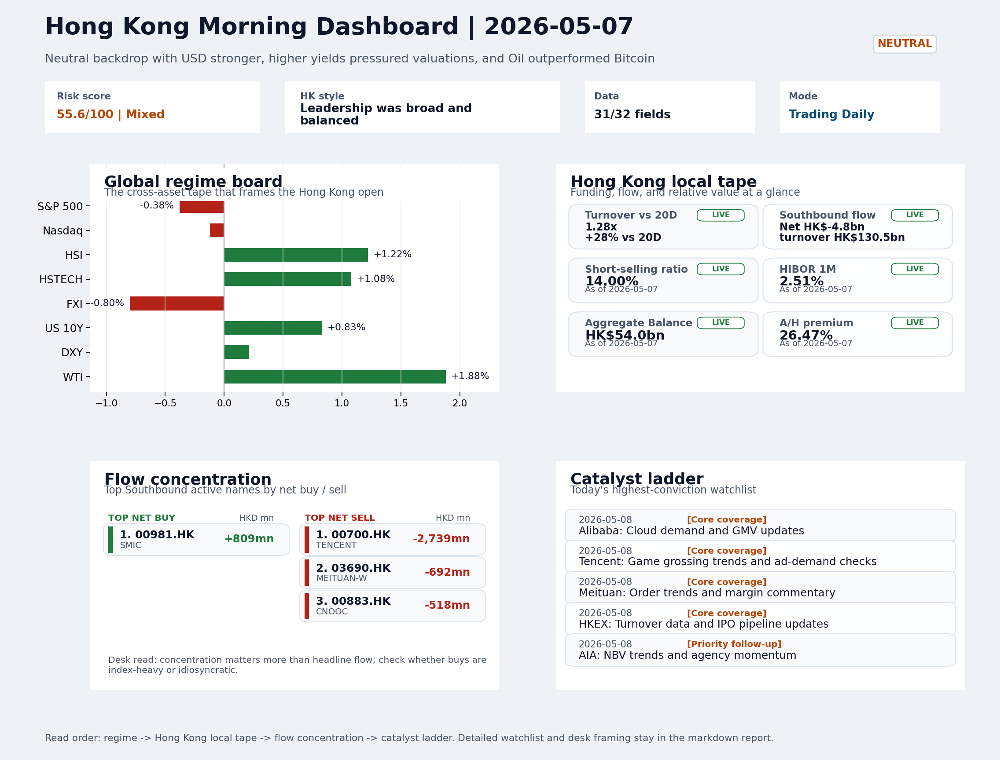
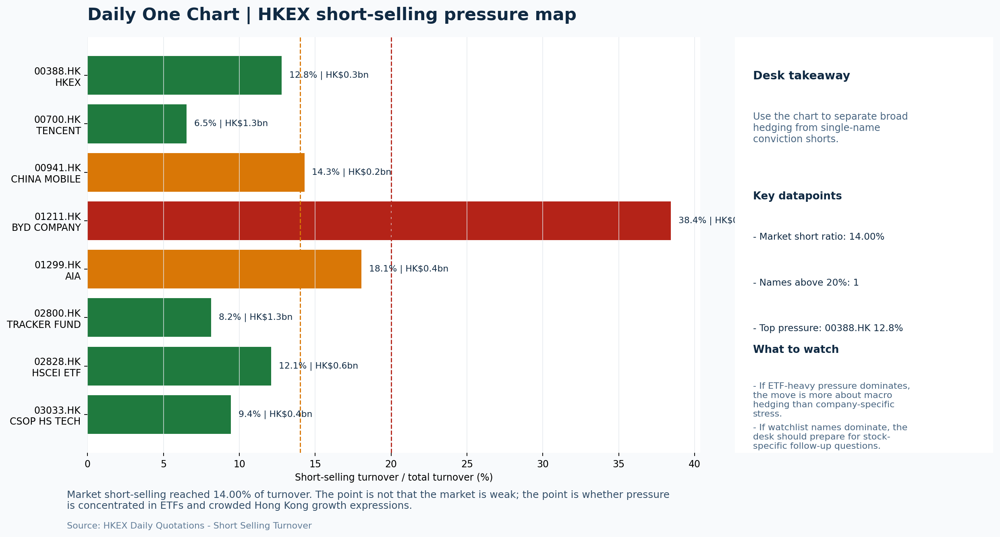
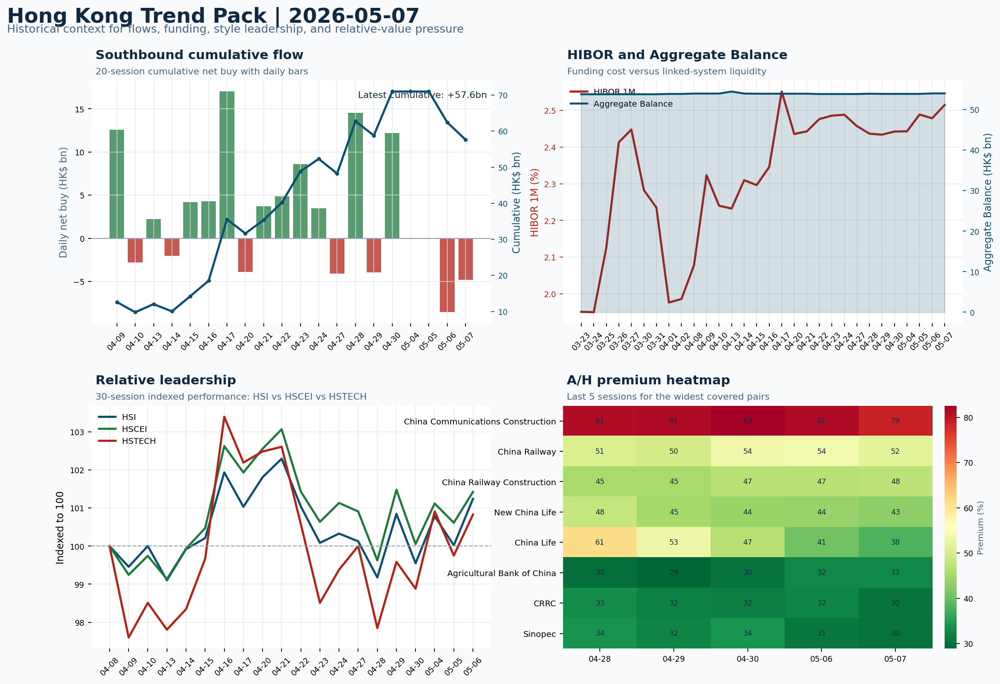

# Morning Research Workbench | 2026-05-08

> Designed for a Hong Kong sell-side commute: Layer 1 `Scan`, Layer 2 `Deep Read`, Layer 3 `Thinking`
> Mode: `Trading Daily` | Keep the report execution-oriented: what mattered in the completed session, what can move Hong Kong leadership, and what needs fast follow-up.
> Briefing date: `2026-05-08` | Review date: `2026-05-07` | Global request: `2026-05-07` | HK/China request: `2026-05-07` | Market effective date: `2026-05-07` | Generated at: `2026-05-08 08:02:18`
> Date policy: Review date 2026-05-07 is treated as `Trading Daily`. | Global request date is 2026-05-07; adapter effective date is 2026-05-07 and summary date is 2026-05-07. | HK/China local data date is 2026-05-07; role: same-session local cash tape.

> Market data quality: Coverage: `31/32` | Stale items (>1d): `1` | Missing: `1`

> Report quality: `90.4/100` | Grade `A` | Status `production ready`

## Visual Dashboard

## Layer 1 | Scan (5-10 min)

### 1.1 One-Line Market Pulse
HK local participation was credible on May 7 (HSI +1.22%, HSTECH +1.08%, turnover 1.28x 20D average) but the offshore China proxy disconnect (FXI -0.80%, KWEB -0.81%, Southbound net selling HK$4.8bn) remains the defining fragility of this tape, and today's China LPR decision and Powell remarks are the next confirmation points.

### 1.2 Global Asset Price Dashboard

| Asset | Last | 1D move | Read |
| --- | --- | --- | --- |
| S&P 500 | 7,337.11 | -0.38% | US large-cap risk appetite |
| Nasdaq 100 | 28,563.95 | -0.12% | Growth and duration leadership |
| Hang Seng Index | 26,213.78 | +1.22% | Hong Kong broad beta |
| Hang Seng TECH | 4.8700 | +1.08% | Hong Kong growth / platform read-through |
| CSI 300 | 4,877.09 | +1.45% | Mainland large-cap tone |
| US 10Y | 4.3920 | +0.83% | Global discount-rate anchor |
| China 10Y | 1.76% | -0.2bp | China local rates anchor \| Live public \| Eastmoney \| 2026-05-07 |
| CN-US 10Y spread | -264.7bp | -5.2bp | Relative carry and macro-pressure gauge \| Live public \| Eastmoney \| 2026-05-07 |
| DXY | 98.22 | +0.21% | Dollar liquidity impulse |
| USD/CNH | 6.7890 | +0.00% | Offshore China risk appetite |
| USD/HKD | 7.8341 | -0.02% | Linked-exchange regime stress check |
| Brent crude | 102.30 | +1.02% | Energy / geopolitics |
| COMEX gold | 4,712.00 | +0.64% | Hedge demand / real yields |
| Copper | 6.1425 | +0.10% | Global growth proxy |
| VIX | 17.08 | **-1.78%** | US stress barometer |

### 1.3 Hong Kong Key Data Quick Check

| Check | Value | Status | Source / as of | Why it matters |
| --- | --- | --- | --- | --- |
| Main Board turnover vs 20D | 1.28x \| +28% vs 20D | Live local | HKEX \| 2026-05-07 | Trailing 20-session average turnover was HK$244.2bn. |
| Southbound / Northbound net flow | Southbound Net HK$-4.8bn \| turnover HK$130.5bn \| Northbound Turnover HK$392.3bn \| net unavailable | Live local | HKEX Connect \| 2026-05-07 | Southbound net buy is calculated from HKEX disclosed buy and sell turnover. |
| Short-selling ratio | 14.00% | Live local | HKEX \| 2026-05-07 | Official HKEX stock-level short-selling table, aggregated as a share of total market turnover. |
| AH premium index | 26.47% | Live public | Yahoo \| 2026-05-07 | Simple average across 20 A/H pairs; use dispersion rather than the average alone. |
| USD/HKD spot vs band | 7.8341 \| band 7.7500 to 7.8500 | Live quote + local | Yahoo \| 2026-05-07 | Inside the linked-exchange band without immediate boundary stress. Official Convertibility Undertakings define the linked-rate stress boundaries for USD/HKD. |
| HIBOR 1M | 2.51% | Live local | HKMA \| 2026-05-07 | 1M HIBOR is the cleanest quick read for Hong Kong funding conditions and equity-duration pressure. |
| Aggregate Balance | HK$54.0bn | Live local | HKMA \| 2026-05-07 | Aggregate Balance helps frame whether linked-rate liquidity conditions are tight or comfortable. |
| Hong Kong leadership | Leadership was broad and balanced | Proxy fallback | HSI / HSCEI / HSTECH relative perf \| 2026-05-07 | Use HSI / HSCEI / HSTECH relative moves as the opening style read. |

### 1.4 Risk Dashboard
**Composite risk score:** `55.6/100` | **Regime:** `Mixed`

| Component | Score impact | Evidence |
| --- | --- | --- |
| US beta | -2.3 | S&P 500 -0.38% |
| HK growth | +5.4 | HSTECH +1.08% |
| Offshore China proxy | -4.0 | FXI -0.80% |
| Dollar pressure | -2.1 | DXY +0.21% |
| Volatility | +3.6 | VIX -1.78% |
| HK short-selling | +0 | Short-selling ratio 14.00% |

### 1.5 Morning Checklist
1. **INTC -6.33%**
 Mover attribution | Announcement / expectations | Guidance reset and margin pressure
2. **Neutral backdrop with USD stronger, higher yields pressured valuations, and Oil outperformed Bitcoin**
 Overnight regime | Start by deciding whether the day is about Neutral conditions or a style pivot.
3. **CPI MoM (Released)**
 Macro / policy | Rates expectations, the dollar, and growth-equity valuation | Industries: Technology, Internet, Brokers
4. **[A] Flex Announces Spin-Off of Cloud, Power Infrastructure Unit**
 News / announcements | This can directly reshape earnings forecasts and the valuation framework
5. **[A] Macquarie Profit Jumps, Commodities Chief Paid $25.5 Million**
 News / announcements | This can directly reshape earnings forecasts and the valuation framework

## Layer 2 | Deep Read (20-30 min)

### 2.1 Overnight Overseas Market Review
#### Market Setup
**Core tape.** Overseas markets showed a split profile on 7 May.
**Main driver.** US indices edged lower as rising yields and a stronger dollar pressured long-duration assets, while Euro Stoxx 50 surged +2.68% on what appeared to be European idiosyncratic strength.
**HK relevance.** Hong Kong local indices outperformed with Hang Seng +1.22% and HSTECH +1.08%, though the offshore China proxy FXI fell -0.80%, suggesting the local rally was domestically driven rather than reflecting broad China sentiment.

#### Key Drivers
- US 10Y yield rose +0.83% to 4.392, putting pressure on rate-sensitive sectors and contributing to the S&P 500 and Nasdaq declines.
- DXY gained +0.21% to 98.224, reducing global liquidity and adding FX headwind for EM assets.
- WTI crude surged +1.88% to $96.87 while Bitcoin fell, creating a 3.03% cross-asset spread that suggests geopolitical or demand-repair.
- Euro Stoxx 50 outperformed materially (+2.68%), adding an alternative explanation for capital flows that does not necessarily filter into.

#### Hong Kong Read-Through
**Desk lens.** Leadership was broad and balanced.
**Opening implication.** The HSI and HSTECH gains look locally credible given turnover.
- **Cross-market read:** Hang Seng +1.22% / HSCEI +0.80% / HSTECH +1.08%.
- **Cross-market read:** Offshore China proxy FXI -0.80% and USD/CNH +0.00% frame cross-border risk appetite.
- **Cross-market read:** USD/HKD last traded around 7.8341, which keeps the Hong Kong funding lens in focus.

#### Watch Points
- USD composite moved higher by +0.20pct intraday, with a 0.392pct range.
- Main turning points appeared around 2026-05-07 08:10 trough / 2026-05-07 08:30 peak / 2026-05-07 09:40 trough, suggesting event-driven repricing.
- The biggest cross-asset divergence was Oil versus Bitcoin, a spread of 3.03pct.
- Gold moved +0.11pct intraday with a 1.714pct high-low range.

### 2.2 Hong Kong / A-share Previous-Day Review
#### Local Tape Setup
**Local read.** Hong Kong local indices outperformed on May 7 (HSI +1.22%, HSTECH +1.08%) with credible participation - turnover ran at 1.28x the 20-session average.
**Verification point.** However, the offshore China proxy FXI fell -0.80% and KWEB dropped -0.81% with matching outflow signatures, while Southbound Connect showed net selling of HK$4.8bn (TENCENT alone accounted for -HK$2.74bn).
**Risk to watch.** The disconnect between domestic HK beta strength and offshore China sentiment is the defining tension of this tape.

#### Style and Local Leadership
**Style leadership.** Leadership was broad and balanced.
- **Cross-market read:** Hang Seng +1.22% / HSCEI +0.80% / HSTECH +1.08%.
- **Cross-market read:** Offshore China proxy FXI -0.80% and USD/CNH +0.00% frame cross-border risk appetite.
- **Cross-market read:** USD/HKD last traded around 7.8341, which keeps the Hong Kong funding lens in focus.
**LLM local leadership read.** Growth-led: HSTECH (+1.08%) outperformed HSCEI (+0.80%); HSI (+1.22%) outperformed both, confirming broad domestic beta but with offshore China (FXI -0.80%) diverging.

#### Flow Confirmation
Official Stock Connect evidence is available; use Section 2.3 to confirm whether local money supports the price action.

#### Follow-Through Checklist
**Follow-through check.** Confirm whether FXI and KWEB stabilize alongside HSTECH on May 8.

### 2.3 Flow Tracker and Attribution
#### Cross-Asset Attribution v1

| Driver | Direction | Score | Evidence | HK implication |
| --- | --- | --- | --- | --- |
| Hong Kong participation | supportive | 2.8 | Main Board turnover was 1.28x the 20-session average. | Higher participation makes local price action more credible. |
| Rates impulse | drag | 1.0 | US 10Y yield proxy moved +0.83%. | Lower yields help long-duration growth; higher yields pressure valuation-sensitive |

#### Flow Tracker
##### Flow Takeaways
- Hong Kong participation is active and short pressure is not excessive, so local confirmation looks healthier.
- Stock Connect Southbound: net HK$-4.8bn on turnover HK$130.5bn (as of 2026-05-07).
- Stock Connect Northbound: turnover RMB392.3bn; public file provides total turnover/top active names, not full net-buy.
- AH premium: simple covered-pair average +26.47%; widest premium: China Communications Construction 78.57%.

##### Key Flow / Funding Metrics

| Metric | Value | Status | Source / as of | Read |
| --- | --- | --- | --- | --- |
| Southbound / Northbound net flow | Southbound Net HK$-4.8bn \| turnover HK$130.5bn \| Northbound Turnover HK$392.3bn \| net unavailable | Live local | HKEX Connect \| 2026-05-07 | Southbound net buy is calculated from HKEX disclosed buy and sell turnover. |
| Main Board turnover vs 20D | 1.28x \| +28% vs 20D | Live local | HKEX \| 2026-05-07 | Trailing 20-session average turnover was HK$244.2bn. |
| Short-selling ratio | 14.00% | Live local | HKEX \| 2026-05-07 | Official HKEX stock-level short-selling table, aggregated as a share of total market turnover. |
| AH premium index | 26.47% | Live public | Yahoo \| 2026-05-07 | Simple average across 20 A/H pairs; use dispersion rather than the average alone. |
| HIBOR 1M | 2.51% | Live local | HKMA \| 2026-05-07 | 1M HIBOR is the cleanest quick read for Hong Kong funding conditions and equity-duration pressure. |
| Aggregate Balance | HK$54.0bn | Live local | HKMA \| 2026-05-07 | Aggregate Balance helps frame whether linked-rate liquidity conditions are tight or comfortable. |

##### Stock Connect Southbound Active Names

| Rank | Ticker | Name | Buy | Sell | Net buy |
| --- | --- | --- | --- | --- | --- |
| 1 | 00700.HK | TENCENT | HK$3,154.6mn | HK$5,894.1mn | HK$-2,739.5mn |
| 1 | 00981.HK | SMIC | HK$5,203.4mn | HK$4,394.5mn | HK$809.0mn |
| 8 | 03690.HK | MEITUAN-W | HK$143.0mn | HK$834.5mn | HK$-691.5mn |
| 4 | 00883.HK | CNOOC | HK$2,244.3mn | HK$2,762.0mn | HK$-517.6mn |
| 6 | 01347.HK | HUA HONG SEMI | HK$1,793.9mn | HK$2,212.5mn | HK$-418.6mn |

##### AH Premium Dispersion

| Name | A ticker | H ticker | Premium | As of |
| --- | --- | --- | --- | --- |
| China Communications Construction | 601800.SS | 1800.HK | +78.57% | 2026-05-07 |
| China Railway | 601390.SS | 0390.HK | +51.86% | 2026-05-07 |
| China Railway Construction | 601186.SS | 1186.HK | +47.53% | 2026-05-07 |
| New China Life | 601336.SS | 1336.HK | +42.98% | 2026-05-07 |
| China Life | 601628.SS | 2628.HK | +38.10% | 2026-05-07 |

##### HKEX Short-Selling Watch

| Ticker | Name | Short ratio | Short turnover | Total turnover |
| --- | --- | --- | --- | --- |
| 00388.HK | HKEX | 12.79% | HK$0.3bn | HK$2.4bn |
| 00700.HK | TENCENT | 6.53% | HK$1.3bn | HK$19.5bn |
| 00941.HK | CHINA MOBILE | 14.29% | HK$0.2bn | HK$1.4bn |
| 01211.HK | BYD COMPANY | 38.44% | HK$0.9bn | HK$2.4bn |
| 01299.HK | AIA | 18.05% | HK$0.4bn | HK$2.3bn |

- **Short-value leaders:** 09988.HK BABA-W (HK$2.2bn); 03750.HK CATL (HK$1.6bn); 07709.HK XL2CSOPHYNIX (HK$1.3bn); 00700.HK TENCENT (HK$1.3bn).

### 2.4 Macro and Policy Tracking
**Desk read.** The completed session and overnight macro picture present a mixed repricing backdrop for HK markets.

**Market sensitivity.** US April CPI came in at +0.3% MoM versus the 0.2% consensus forecast, keeping the higher-for-longer rate narrative live; the US 10Y yield has already moved up 8bps to 4.39% and the dollar is stronger.

**HK implication.** Against that, China's April trade balance printed USD 85.2bn against a USD 79.0bn forecast, a meaningful positive surprise that could provide near-term support to HK sentiment if the market chooses to focus on the demand signal.

**Macro watchpoints**
- US CPI reaction: whether the 0.3% print extends the rates-and-dollar move or gets a 'buy the dip' response in equities.
- US 10Y yield trajectory and DXY direction in the hours before retail sales.
- China trade surplus beat: whether the H-share and HK mainboard tape absorbs this as a macro positive or fades it.
- Oil at USD 96.87: sustained move above USD 97 would shift sector leadership toward energy and materials.

| Time | Region | Event | Status | Desk read |
| --- | --- | --- | --- | --- |
| 20:30 | US | CPI MoM | Released | Impact: Rates expectations, the dollar, and growth-equity valuation \| Attention: 5/5 \| Industries: Technology, Internet, Brokers |
| 09:30 | China | Trade Balance | Released | Impact: Watch whether it changes the day's core market narrative \| Attention: 3/5 \| Industries: To be assessed |
| 20:30 | US | Retail Sales MoM | Upcoming | Impact: Consumer resilience, growth expectations, and risk-asset pricing \| Attention: 5/5 \| Industries: Consumer, E-commerce, Consumer discretionary |
| 09:20 | China | Loan Prime Rate | Upcoming | Impact: Watch whether it changes the day's core market narrative \| Attention: 3/5 \| Industries: To be assessed |
| 22:00 | Federal Reserve | Jerome Powell: Economic outlook remarks | Central bank | Impact: Policy path, liquidity conditions, and cross-asset risk appetite \| Attention: 5/5 \| Industries: Technology, Financials, Gold |
| 10:00 | PBOC | Open Market Operations Desk: Daily liquidity operation window | Central bank | Impact: Policy path, liquidity conditions, and cross-asset risk appetite \| Attention: 3/5 \| Industries: Technology, Financials, Gold |

#### Positioning and Risk Backdrop
- Options activity centered on KWEB Call, with Vol/OI at 1.88x and a bullish bias.
- Put/Call structure shows equity 0.68 / index 1.15, implying Single-stock optimism with index hedging.
- Geopolitics: Middle East | Regional tension remains elevated | Impact: Oil, freight costs, and safe-haven demand
- Geopolitics: US-China | Technology export-control rhetoric remains active | Impact: China internet, semiconductors, and supply chains

### 2.5 Key Company and Sector Events

| Grade | Sector | Headline | Why it matters | Horizon |
| --- | --- | --- | --- | --- |
| A | China Internet | Flex Announces Spin-Off of Cloud, Power Infrastructure Unit | This can directly reshape earnings forecasts and the valuation framework | Short-term catalyst |
| A | Financials | Macquarie Profit Jumps, Commodities Chief Paid $25.5 Million | This can directly reshape earnings forecasts and the valuation framework | Short-term catalyst |
| A | Autos and EV | Goodbye quarterly earnings? Here's when traders believe this big | This can directly reshape earnings forecasts and the valuation framework | Short-term catalyst |
| A | Autos and EV | CoreWeave shares plunge. Revenue doubles but AI costs are rising. | This can directly reshape earnings forecasts and the valuation framework | Short-term catalyst |
| A | Other | SEC advances Trump-backed proposal to end mandatory quarterly | This can directly reshape earnings forecasts and the valuation framework | Short-term catalyst |
| A | Autos and EV | Gold Steady as US-Iran Clashes Dim Truce Prospects in Mideast | Capital allocation or shareholder-return events can trigger a valuation | Medium-term trend |
| A | Semiconductors and AI | Oil Swings on Fading Optimism for Resolution on Iran Conflict | Capital allocation or shareholder-return events can trigger a valuation | Medium-term trend |
| A | Energy and Materials | Oil Climbs Following Fresh Clashes Between US and Iranian Forces | This can directly reshape earnings forecasts and the valuation framework | Short-term catalyst |

#### HKEX Announcements

| Grade | Ticker | Type | Release time | Title |
| --- | --- | --- | --- | --- |
| A | 06063.HK | Profit warning | 2026-05-07 | Profit warning / alert announcement |
| A | 00938.HK | Profit warning | 2026-05-06 | Profit warning / alert announcement |
| A | 01929.HK | Profit warning | 2026-05-06 | Profit warning / alert announcement |
| A | 03822.HK | Profit warning | 2026-05-06 | Profit warning / alert announcement |
| A | 00637.HK | Profit warning | 2026-05-05 | Profit warning / alert announcement |
| A | 01757.HK | Profit warning | 2026-05-05 | Profit warning / alert announcement |
| A | 06080.HK | Profit warning | 2026-05-05 | Profit warning / alert announcement |
| A | 08065.HK | Profit warning | 2026-04-30 | Profit warning / alert announcement |

#### Earnings / Results Watch

| Ticker | Company | Timing | Expectation framing |
| --- | --- | --- | --- |
| 0700.HK | Tencent Holdings | After Market Close | EPS est. 4.15 HKD \| revenue est. 163.2bn HKD |
| 0388.HK | Hong Kong Exchanges and Clearing | Before Market Open | EPS est. 2.81 HKD \| revenue est. 6.0bn HKD |

#### Rating Changes
- **9988.HK** | Morgan Stanley | Upgrade | Equal Weight -> Overweight | PT 92 -> 105

#### IPO Watch
- IPO / grey-market / first-day performance should be wired to a dedicated Hong Kong ECM adapter.

### 2.6 Coverage Pools
#### Core coverage

| Name | Ticker | Last | 1D | Range position | Morning note |
| --- | --- | --- | --- | --- | --- |
| Alibaba | 9988.HK | 140.90 | +4.99% | Mid-range | Short-term price strength is clear; fresh catalysts could trigger broader group |
| Tencent | 0700.HK | 477.40 | +3.11% | Bottom of range | Short-term price strength is clear; fresh catalysts could trigger broader group |
| Meituan | 3690.HK | 84.25 | +2.12% | Mid-range | Short-term price strength is clear; fresh catalysts could trigger broader group |
| HKEX | 0388.HK | 427.00 | +1.38% | Top of range | The name sits near the top of its recent range, so watch for profit-taking under |

**Recent headlines for Alibaba:**
- [BNP Paribas Initiates Coverage of Alibaba Group Holding (BABA), Cites Potential Cloud Revenue Growth Acceleration](https://finance.yahoo.com/markets/stocks/articles/bnp-paribas-initiates-coverage-alibaba-172647778.html) (Insider Monkey)
- [Alibaba Group (BABA) Continues To Be A Top Cloud Computing Choice For Investors](https://finance.yahoo.com/sectors/technology/articles/alibaba-group-baba-continues-top-121139051.html) (Insider Monkey)
**Recent headlines for Tencent:**
- [Tencent Holdings SEHK 700 Valuation Check As Shares Face Multi Timeframe Weakness](https://finance.yahoo.com/markets/stocks/articles/tencent-holdings-sehk-700-valuation-043005426.html) (Simply Wall St.)
- [DeepSeek value could be up to $50 billion in first fundraising, sources say](https://finance.yahoo.com/video/deepseek-value-could-50-billion-151730055.html) (Reuters Videos)
**Recent headlines for Meituan:**
- [Kimi Chatbot Maker Moonshot AI Valued at $20 Billion in Meituan-Led Round](https://finance.yahoo.com/sectors/technology/articles/kimi-chatbot-maker-moonshot-ai-032926690.html) (Bloomberg)
- [Asian Growth Companies With Insider Ownership As High As 38%](https://finance.yahoo.com/markets/stocks/articles/asian-growth-companies-insider-ownership-043619455.html) (Simply Wall St.)
**Recent headlines for HKEX:**
- [Hong Kong Exchange Operator Posts Record Profit on Listings, Trading Growth](https://www.wsj.com/business/earnings/hong-kong-exchange-operator-posts-record-quarterly-profit-revenue-1cc26df8?siteid=yhoof2&yptr=yahoo) (The Wall Street Journal)
- [Has Hong Kong Exchanges And Clearing (SEHK:388) Run Ahead Of Its Recent Share Price Strength?](https://finance.yahoo.com/markets/stocks/articles/hong-kong-exchanges-clearing-sehk-060725066.html) (Simply Wall St.)

#### Priority follow-up

| Name | Ticker | Last | 1D | Range position | Morning note |
| --- | --- | --- | --- | --- | --- |
| AIA | 1299.HK | 89.15 | +1.94% | Top of range | The name sits near the top of its recent range, so watch for profit-taking under |
| BYD Company | 1211.HK | 100.70 | +1.82% | Mid-range | Positioning is neutral for now, so use it mainly to monitor marginal information |
| China Mobile | 0941.HK | 85.30 | +0.71% | Top of range | The name sits near the top of its recent range, so watch for profit-taking under |

**Recent headlines for AIA:**
- [Is It Too Late To Consider AIA Group (SEHK:1299) After Its 82% One Year Rally?](https://finance.yahoo.com/markets/stocks/articles/too-consider-aia-group-sehk-042100864.html) (Simply Wall St.)
- [Is AIA (AAGIY) Outperforming Other Finance Stocks This Year?](https://finance.yahoo.com/markets/stocks/articles/aia-aagiy-outperforming-other-finance-134003763.html) (Zacks)
**Recent headlines for BYD Company:**
- [Tesla Stock Cracked $410. How China Helped.](https://www.barrons.com/articles/tesla-stock-price-china-car-sales-b3f6e475?siteid=yhoof2&yptr=yahoo) (Barrons.com)
- [Cerence (CRNC) Expands BYD Partnership for LLM-Powered In-Car AI](https://finance.yahoo.com/markets/stocks/articles/cerence-crnc-expands-byd-partnership-145922006.html) (Insider Monkey)
**Recent headlines for China Mobile:**
- [Deutsche Telekom Weighs Full Combination With T-Mobile](https://finance.yahoo.com/markets/stocks/articles/deutsche-telekom-weighs-full-combination-115107414.html) (Bloomberg)
- [Deutsche Telekom exploring merger with T-Mobile, Bloomberg News reports](https://finance.yahoo.com/markets/stocks/articles/deutsche-telekom-exploring-merger-t-182010144.html) (Reuters)

#### Learning watchlist

| Name | Ticker | Last | 1D | Range position | Morning note |
| --- | --- | --- | --- | --- | --- |
| Tracker Fund of Hong Kong | 2800.HK | 26.30 | +1.08% | Mid-range | Positioning is neutral for now, so use it mainly to monitor marginal information |
| Hang Seng TECH ETF | 3033.HK | 4.8700 | +1.08% | Mid-range | Positioning is neutral for now, so use it mainly to monitor marginal information |
| HSCEI ETF | 2828.HK | 90.30 | +0.85% | Mid-range | Positioning is neutral for now, so use it mainly to monitor marginal information |

## Layer 3 | Thinking (10-15 min)

### 3.1 Rotating Theme Deep Dive

| Field | Read |
| --- | --- |
| Theme | Hong Kong Market Structure and Flows |
| Angle for the day | Focus on turnover, Stock Connect, ETF flows, HKEX activity, and style leadership to understand whether Hong Kong is being driven by fundamentals or positioning. |

**Theme desk read**
**Core thesis.** The weekly theme on Hong Kong market structure remains the right frame because today's neutral macro backdrop - with USD strength and higher US 10Y yields at 4.392% - adds a valuation headwind for Hong Kong growth.
**Evidence.** HKEX (0388.HK) is the primary name to track.
**What to test.** BYD (1211.HK) added 1.82% despite a mixed April split - Shanghai plant exports +36% YoY but domestic sales -16% YoY - meaning the weekly sales readout tomorrow will test whether the export angle is sustainable and whether.

**Signals to keep in mind**
- WTI crude +1.88%: A strong crude move needs to be split between geopolitics and demand repair.
- VIX -1.78%: Keep tracking it to confirm whether the core daily narrative is holding.

**LLM watch items:**
- HKEX (0388.HK) turnover data and IPO pipeline updates (2026-05-08) - near top of range; verify whether volume justifies.
- BYD (1211.HK) weekly sales data - confirm export strength offset domestic weakness.
- US CPI reaction and 10Y yield direction overnight - higher yields pressure HK growth/tech positioning.
- China Trade Balance beat (USD 85.2bn) - monitor whether it provides any sustained sentiment support.
- VIX direction - tracking for confirmation that core neutral narrative is holding.

**Related names to keep close:**

| Name | Ticker | Bucket | Morning read |
| --- | --- | --- | --- |
| HKEX | 0388.HK | Core coverage | The name sits near the top of its recent range, so watch for profit-taking under |
| BYD Company | 1211.HK | Priority follow-up | Positioning is neutral for now, so use it mainly to monitor marginal information |
| Tracker Fund of Hong Kong | 2800.HK | Learning watchlist | Positioning is neutral for now, so use it mainly to monitor marginal information |
| Hang Seng TECH ETF | 3033.HK | Learning watchlist | Positioning is neutral for now, so use it mainly to monitor marginal information |

**Upcoming catalysts tied to the theme:**
- 2026-05-08 | HKEX: Turnover data and IPO pipeline updates | Direct proxy for Hong Kong market turnover, listings, and southbound interest
- 2026-05-08 | BYD Company: Weekly sales data and model rollout cadence | Hong Kong-listed proxy for EV volumes, export mix, and price competition
- 2026-05-08 | Tracker Fund of Hong Kong: Index-turnover shifts and ETF flows | Clean listed proxy for broad HSI positioning and passive flows
- 2026-05-08 | Hang Seng TECH ETF: AI narrative shifts and China platform regulation headlines | Fast proxy for Hong Kong internet and growth leadership

### 3.2 Today Ahead and Trading Calendar
- Macro: CPI MoM is the first item to anchor the open and the rates/FX response.
- Corporate / event: Alibaba: Cloud demand and GMV updates is the cleanest same-day catalyst to prepare for.

**Same-day macro docket**

| Time | Country | Event | Status | Detail |
| --- | --- | --- | --- | --- |
| 20:30 | US | CPI MoM | Released | Actual 0.3% / Forecast 0.2% / Prior 0.4% |
| 09:30 | China | Trade Balance | Released | Actual USD 85.2bn / Forecast USD 79.0bn / Prior USD 80.6bn |
| 20:30 | US | Retail Sales MoM | Upcoming | Forecast 0.3% / Prior 0.6% |
| 09:20 | China | Loan Prime Rate | Upcoming | Forecast 3.45% / Prior 3.45% |
| 22:00 | Federal Reserve | Jerome Powell: Economic outlook remarks | Central bank | speech |

**Same-day catalyst list**

| Date | Time | Category | Event | Importance |
| --- | --- | --- | --- | --- |
| 2026-05-08 | | Core coverage | Alibaba: Cloud demand and GMV updates | 3 |
| 2026-05-08 | | Core coverage | Tencent: Game grossing trends and ad-demand checks | 3 |
| 2026-05-08 | | Core coverage | Meituan: Order trends and margin commentary | 3 |
| 2026-05-08 | | Core coverage | HKEX: Turnover data and IPO pipeline updates | 3 |
| 2026-05-08 | | Priority follow-up | AIA: NBV trends and agency momentum | 3 |
| 2026-05-08 | | Priority follow-up | BYD Company: Weekly sales data and model rollout cadence | 3 |

**Next few sessions**

| Date | Category | Event | Impact |
| --- | --- | --- | --- |
| 2026-05-08 | Core coverage | Alibaba: Cloud demand and GMV updates | Key read-through for China consumption, cloud, and platform regulation |
| 2026-05-08 | Core coverage | Tencent: Game grossing trends and ad-demand checks | Core offshore China platform proxy for gaming, ads, and AI monetization |
| 2026-05-08 | Core coverage | Meituan: Order trends and margin commentary | High-frequency read on local services demand and platform competition |
| 2026-05-08 | Core coverage | HKEX: Turnover data and IPO pipeline updates | Direct proxy for Hong Kong market turnover, listings, and southbound |
| 2026-05-08 | Priority follow-up | AIA: NBV trends and agency momentum | Read-through for wealth demand, mainland visitor activity, and HK |
| 2026-05-08 | Priority follow-up | BYD Company: Weekly sales data and model rollout cadence | Hong Kong-listed proxy for EV volumes, export mix, and price competition |
| 2026-05-08 | Priority follow-up | China Mobile: Capex updates and dividend policy signals | Defensive SOE benchmark for yield trade and domestic |
| 2026-05-08 | Learning watchlist | Tracker Fund of Hong Kong: Index-turnover shifts and ETF flows | Clean listed proxy for broad HSI positioning and passive flows |

### 3.3 Daily One Chart
**Daily One Chart | HKEX short-selling pressure map**

**Chart read.** Market short-selling reached 14.00% of turnover.
**Why it matters.** The point is not that the market is weak; the point is whether pressure is concentrated in ETFs and crowded Hong Kong growth expressions.

_Source: HKEX Daily Quotations - Short Selling Turnover_

### 3.4 Hong Kong Trend Pack
**Hong Kong Trend Pack**

**Trend read.** Four historical lenses: Southbound cumulative flow, HKMA funding and liquidity, HSI/HSCEI/HSTECH relative leadership, and A/H premium dispersion.

_Source: HKEX Stock Connect, HKMA liquidity data, and public Yahoo Finance quotes_

### 3.5 Personal View Pad
- **Thinking note:** The local tape looks healthier than it did a week ago - turnover confirms genuine participation and HSTECH growth leadership is internally coherent - but this recovery is.
- **Action:** Treat today's opening as conditional: if USD/CNY holds steady and FXI/KWEB stabilize alongside HSTECH strength, the local narrative becomes investable.
- **Suggested market answer:** The setup is constructive but not one-directional: locally credible growth leadership against a background of offshore China skepticism and higher-for-longer rate risk.
- **Second sentence:** Today is a confirmation test for whether HSTECH momentum can hold on its own without broader China sentiment support.
- **What could break the view:** A sharp reversal in USD/CNY, a further leg-up in US 10Y yields, or a continuation of FXI/KWEB outflows alongside sustained Southbound selling.
- **Risk trigger:** LPR unchanged at 3.45% is expected; any surprise or hawkish Powell tone would amplify the rates impulse drag on HK tech valuations.
- Does the overnight tape still read as `Neutral`, or do I expect a different Hong Kong cash-session outcome?
- Is today's Hong Kong setup better described as `Leadership was broad and balanced`, and does that match my current mental model?
- What was the most important overnight surprise, and does it change my base case?
- Which sector or stock view now deserves a tighter follow-up or a revised assumption?
- If I were asked for a two-minute market view this morning, what would my answer be?
- My own view after the commute:
- What changed versus yesterday:
- Which name / sector deserves extra prep before the open:

## Traceable Appendix

### Key Questions to Keep in Mind
- Is risk appetite rising or fading? The overnight tape reads closer to `Neutral`.
- Did rates expectations move? Focus on whether US 10Y, DXY, and growth style moved together.
- Were commodities the real story? Watch WTI and gold for geopolitics versus inflation signals.
- Is Hong Kong setup internet-led, SOE-led, or broad beta-led? Compare HSTECH, HSCEI, and HSI.
- Did offshore markets move China risk appetite? Focus on HSI, FXI, USD/CNH, and USD/HKD.

### Report Quality and Validation
- **Quality score:** 90.4/100 | **Grade:** A | **Status:** production ready

| Component | Score | Weight | Read |
| --- | --- | --- | --- |
| Market data coverage | 96.9 | 0.3 | 31/32 core market fields available. |
| Hong Kong local metrics | 82.3 | 0.25 | 8 live, 3 proxy, 0 unavailable local checks. |
| Key public adapters | 100.0 | 0.2 | 4/4 key adapters were available or partially available. |
| LLM task health | 71.4 | 0.15 | 5/7 LLM tasks succeeded or used validated cache; 2 error(s). |
| Fact-check guardrail | 100.0 | 0.1 | Checked 12 numeric claims; 0 numeric mismatch(es), 0 logic warning(s); 0 critical, 0 review. |

**LLM fact-check guardrail**
- Checked 12 numeric claims; 0 numeric mismatch(es), 0 logic warning(s); 0 critical, 0 review.

**Adapter status**

| Adapter | Status |
| --- | --- |
| Stock Connect | ok |
| A/H premium | ok |
| HKEX announcements | ok |
| China rates | ok |

### Source Links
- [Flex Announces Spin-Off of Cloud, Power Infrastructure Unit](https://www.bloomberg.com/news/videos/2026-05-07/flex-plans-spin-off-of-cloud-power-infrastructure-unit-video) (bloomberg_markets)
- [Macquarie Profit Jumps, Commodities Chief Paid $25.5 Million](https://www.bloomberg.com/news/articles/2026-05-07/macquarie-profit-tops-estimates-on-commodities-markets-activity) (bloomberg_markets)
- [Goodbye quarterly earnings? Here's when traders believe this big change will happen](https://www.cnbc.com/2026/05/06/kalshi-traders-confident-sec-will-end-mandatory-quarterly-earnings-reports.html) (cnbc_markets)
- [CoreWeave shares plunge. Revenue doubles but AI costs are rising.](https://www.marketwatch.com/story/coreweave-reports-unprecedented-100-billion-backlog-but-that-comes-at-a-cost-98b385c7?mod=mw_rss_topstories) (wsj_markets)
- [SEC advances Trump-backed proposal to end mandatory quarterly earnings reports](https://www.cnbc.com/2026/05/05/sec-is-close-to-ending-mandatory-quarterly-earnings-reports-that-trump-called-for.html) (cnbc_markets)
- [Gold Steady as US-Iran Clashes Dim Truce Prospects in Mideast](https://www.bloomberg.com/news/articles/2026-05-07/gold-steadies-as-us-iran-clashes-dim-truce-prospects-in-mideast) (bloomberg_markets)
- [Oil Swings on Fading Optimism for Resolution on Iran Conflict](https://www.bloomberg.com/news/articles/2026-05-06/latest-oil-market-news-and-analysis-for-may-7) (bloomberg_markets)
- [Oil Climbs Following Fresh Clashes Between US and Iranian Forces](https://www.bloomberg.com/news/articles/2026-05-07/latest-oil-market-news-and-analysis-for-may-8) (bloomberg_markets)
- [Ryan Cohen's mysterious bank letter backing GameStop's eBay bid reveals a big issue with deal](https://www.cnbc.com/2026/05/07/ryan-cohens-mysterious-bank-letter-backing-his-ebay-bid-reveals-a-big-issue.html) (cnbc_markets)
- [Kalshi traders see odds rising that a U.S.-Iran nuclear deal will be reached by 2027](https://www.cnbc.com/2026/05/07/kalshi-traders-see-odds-rising-that-a-us-iran-nuclear-deal-will-be-reached-by-2027.html) (cnbc_markets)
- [Oil futures rise after U.S., Iran trade fire; stock futures quiet after court rejects Trump's tariffs](https://www.marketwatch.com/story/oil-futures-rise-after-u-s-iran-trade-fire-stock-futures-quiet-after-court-rejects-trumps-tariffs-4ee86b13?mod=mw_rss_topstories) (wsj_markets)
- [Rocket Lab's stock rises upon new signs its business is expanding rapidly](https://www.marketwatch.com/story/rocket-labs-stock-rises-upon-new-signs-its-business-is-expanding-rapidly-dc7abdfc?mod=mw_rss_topstories) (wsj_markets)
- [BNP Paribas Initiates Coverage of Alibaba Group Holding (BABA), Cites Potential Cloud Revenue Growth Acceleration](https://finance.yahoo.com/markets/stocks/articles/bnp-paribas-initiates-coverage-alibaba-172647778.html) (Insider Monkey)
- [Alibaba Group (BABA) Continues To Be A Top Cloud Computing Choice For Investors](https://finance.yahoo.com/sectors/technology/articles/alibaba-group-baba-continues-top-121139051.html) (Insider Monkey)
- [Tencent Holdings SEHK 700 Valuation Check As Shares Face Multi Timeframe Weakness](https://finance.yahoo.com/markets/stocks/articles/tencent-holdings-sehk-700-valuation-043005426.html) (Simply Wall St.)

## Supplementary Visual Appendix

This appendix is professional-path only. It keeps a traceable index of the report visuals and the deterministic chart cues used to frame the morning note, without injecting the legacy intraday chart pack.

### Visual Index

| Visual | Path | Role |
| --- | --- | --- |
| Visual Dashboard | `charts/dashboard_2026-05-08.png` | Cross-asset regime board and Hong Kong local tape snapshot. |
| Daily One Chart | `charts/daily_one_chart_2026-05-08.png` | Single highest-conviction visual story for the day. |
| Hong Kong Trend Pack | `charts/hk_trend_pack_2026-05-08.png` | Historical context for flows, liquidity, leadership, and A/H dispersion. |

### Deterministic Chart Cues
- FX / liquidity: USD composite moved higher by +0.20pct intraday, with a 0.392pct range.
- FX / liquidity: Main turning points appeared around 2026-05-07 08:10 trough / 2026-05-07 08:30 peak / 2026-05-07 09:40 trough, suggesting event-driven repricing rather than a clean one-way USD move.
- Cross-asset: The biggest cross-asset divergence was Oil versus Bitcoin, a spread of 3.03pct.
- Cross-asset: Gold moved +0.11pct intraday with a 1.714pct high-low range.
- Cross-asset: Oil moved +1.06pct intraday with a 8.247pct high-low range.
- Cross-asset: Bitcoin moved -1.97pct intraday with a 2.449pct high-low range.

### Risk Dashboard Components

| Component | Score impact | Evidence |
| --- | --- | --- |
| US beta | -2.3 | S&P 500 -0.38% |
| HK growth | +5.4 | HSTECH +1.08% |
| Offshore China proxy | -4.0 | FXI -0.80% |
| Dollar pressure | -2.1 | DXY +0.21% |
| Volatility | +3.6 | VIX -1.78% |
| HK short-selling | +0 | Short-selling ratio 14.00% |
