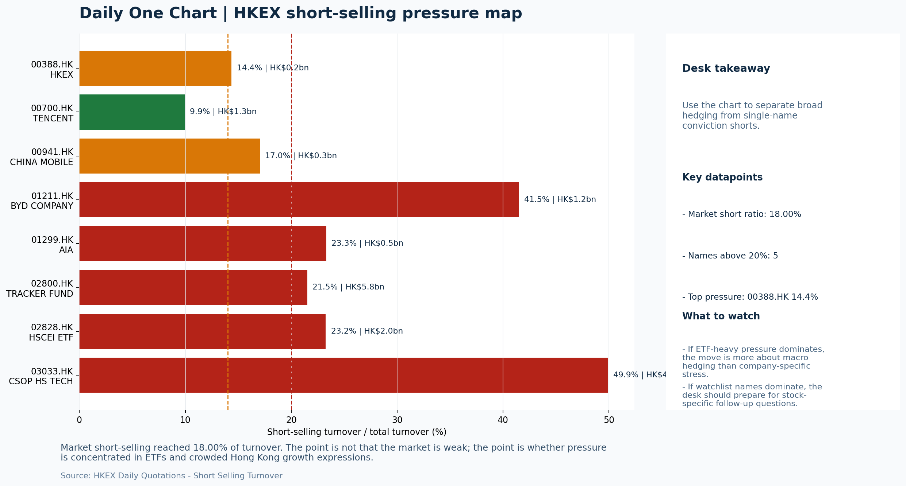

# Morning Research Workbench | 2026-05-19

> Designed for a Hong Kong sell-side commute: Layer 1 `Scan`, Layer 2 `Deep Read`, Layer 3 `Thinking`
> Mode: `Trading Daily` | Keep the report execution-oriented: what mattered in the completed session, what can move Hong Kong leadership, and what needs fast follow-up.
> Briefing date: `2026-05-19` | Review date: `2026-05-18` | Global request: `2026-05-18` | HK/China request: `2026-05-18` | Market effective date: `2026-05-18` | Generated at: `2026-05-19 08:15:57`

## Executive Summary

- **Market pulse:** Risk-off session with growth-led decline (HSTECH -2.62%) and 18% short ratio keeps Hong Kong rebounds conditional pending breadth and flow confirmation on May 19.
- **Hong Kong lens:** Hong Kong growth / internet led. HSTECH leadership and 18% short ratio argue for caution; a credible rebound needs FXI and broader participation to confirm, not just mega-cap tech follow-through.
- **Top catalysts:** INTC -6.33%; [A] White House touts deals on soybeans and rare earths after Trump-Xi summit, while China talks up tariff cuts.

## Visual Dashboard

## Layer 1 | Scan (5-10 min)

### 1.1 One-Line Market Pulse
Risk-off session with growth-led decline (HSTECH -2.62%) and 18% short ratio keeps Hong Kong rebounds conditional pending breadth and flow confirmation on May 19.

### 1.2 Global Asset Price Dashboard

| Asset | Last | 1D move | Read |
| --- | --- | --- | --- |
| S&P 500 | 7,403.05 | -0.07% | US large-cap risk appetite |
| Nasdaq 100 | 28,994.37 | -0.45% | Growth and duration leadership |
| Hang Seng Index | 25,962.73 | **-1.62%** | Hong Kong broad beta |
| Hang Seng TECH | 4.8300 | **-2.62%** | Hong Kong growth / platform read-through |
| CSI 300 | 4,859.59 | -1.12% | Mainland large-cap tone |
| US 10Y | 4.6230 | +0.61% | Global discount-rate anchor |
| China 10Y | 1.76% | -0.7bp | China local rates anchor \| Live public \| Eastmoney \| 2026-05-18 |
| CN-US 10Y spread | -285.2bp | -2.7bp | Relative carry and macro-pressure gauge \| Live public \| Eastmoney \| 2026-05-18 |
| DXY | 99.03 | -0.24% | Dollar liquidity impulse |
| USD/CNH | 6.7885 | +0.00% | Offshore China risk appetite |
| USD/HKD | 7.8301 | -0.03% | Linked-exchange regime stress check |
| Brent crude | 109.46 | +0.18% | Energy / geopolitics |
| COMEX gold | 4,580.90 | +0.55% | Hedge demand / real yields |
| Copper | 6.3245 | +1.17% | Global growth proxy |
| VIX | 17.82 | **-3.31%** | US stress barometer |

### 1.3 Hong Kong Key Data Quick Check

| Check | Value | Status | Source / as of | Why it matters |
| --- | --- | --- | --- | --- |
| Main Board turnover vs 20D | 1.14x \| +14% vs 20D | Live local | HKEX \| 2026-05-18 | Trailing 20-session average turnover was HK$256.3bn. |
| Southbound / Northbound net flow | Southbound Net HK$-7.9bn \| turnover HK$136.5bn \| Northbound Turnover HK$380.4bn \| net not reported | Live local | HKEX Connect \| 2026-05-18 | Southbound net buy is calculated from HKEX disclosed buy and sell turnover. |
| Short-selling ratio | 18.00% | Live local | HKEX \| 2026-05-18 | Official HKEX stock-level short-selling table, aggregated as a share of total market turnover. |
| AH premium index | 23.40% | Live public | Yahoo \| 2026-05-18 | Simple average across 18 A/H pairs; use dispersion rather than the average alone. |
| USD/HKD spot vs band | 7.8301 \| band 7.7500 to 7.8500 | Live quote + local | Yahoo \| 2026-05-18 | Inside the linked-exchange band without immediate boundary stress. Official Convertibility Undertakings define the linked-rate stress boundaries for USD/HKD. |
| HIBOR 1M | 2.63% | Live local | HKMA \| 2026-05-18 | 1M HIBOR is the cleanest quick read for Hong Kong funding conditions and equity-duration pressure. |
| Aggregate Balance | HK$54.0bn | Live local | HKMA \| 2026-05-18 | Aggregate Balance helps frame whether linked-rate liquidity conditions are tight or comfortable. |
| Hong Kong leadership | Hong Kong growth / internet led | Proxy | HSI / HSCEI / HSTECH relative perf \| 2026-05-18 | Use HSI / HSCEI / HSTECH relative moves as the opening style read. |

### 1.4 Risk Dashboard
**Composite risk score:** `45.0/100` | **Regime:** `Mixed`

| Component | Score impact | Evidence |
| --- | --- | --- |
| US beta | -0.4 | S&P 500 -0.07% |
| HK growth | -10 | HSTECH -2.62% |
| Offshore China proxy | -0.6 | FXI -0.11% |
| Dollar pressure | +2.4 | DXY -0.24% |
| Volatility | +6.6 | VIX -3.31% |
| HK short-selling | -8 | Short-selling ratio 18.00% |

### 1.5 Morning Checklist
1. **INTC -6.33%**
 Mover attribution | Announcement / expectations | Guidance reset and margin pressure
2. **[A] White House touts deals on soybeans and rare earths after Trump-Xi summit, while China talks up tariff cuts**
 News / announcements | Capital allocation or shareholder-return events can trigger a valuation reset
3. **Risk-Off backdrop with USD softer, higher yields pressured valuations, and Gold outperformed Oil**
 Overnight regime | Start by deciding whether the day is about Risk-Off conditions or a style pivot.
4. **CPI MoM (Released)**
 Macro / policy | Rates expectations, the dollar, and growth-equity valuation | Industries: Technology, Internet, Brokers
5. **Trade Balance (Released)**
 Macro / policy | Watch whether it changes the day's core market narrative | Industries: Market-wide

## Layer 2 | Deep Read (20-30 min)

### 2.1 Overnight Overseas Market Review
#### Market Setup
**Core tape.** Overnight global equities slipped in a risk-off session where Nasdaq (-0.45%) underperformed S&P 500 (-0.07%), as higher US 10Y yields (+0.61%) pressured duration-sensitive growth names while Intel's -6.33% guidance reset.
**Main driver.** USD softened (DXY -0.24%) providing marginal EM/HK liquidity relief but could not offset the rates headwind, and oil fell -2.64% reinforcing a softer cyclical-growth read.
**HK relevance.** For Hong Kong, the same pattern held with HSTECH (-2.62%) leading the decline, while short-selling at 18% keeps local rebounds conditional on breadth improvement.

#### Key Drivers
- US 10Y yield +0.61% repriced rate-cut expectations lower, particularly hitting growth and duration names.
- Intel guided lower with margin pressure, weighing on global semiconductor sentiment and cascading through Asian supply-chain proxies.
- USD softened (DXY -0.24%) but the offset was insufficient given yield-driven valuation compression.
- Oil -2.64% signals weaker near-term cyclical demand expectations, adding commodity-sector headwind.

#### Hong Kong Read-Through
**Desk lens.** State-owned / old-economy H-shares led.
**Opening implication.** HSTECH leadership and 18% short ratio argue for caution; a credible rebound needs FXI and broader participation to confirm, not just mega-cap tech follow-through.
- **Cross-market read:** Hang Seng -1.62% / HSCEI -1.89% / HSTECH -2.62%.
- **Cross-market read:** Offshore China proxy FXI -0.11% and USD/CNH +0.00% frame cross-border risk appetite.
- **Cross-market read:** USD/HKD last traded around 7.8301, which keeps the Hong Kong funding lens in focus.

#### Watch Points
- USD composite moved lower by -0.29pct intraday, with a 0.377pct range.
- Main turning points appeared around 2026-05-18 08:10 peak / 2026-05-18 08:40 peak / 2026-05-18 08:55 trough, suggesting event-driven repricing.
- The biggest cross-asset divergence was Gold versus Oil, a spread of 1.63pct.
- Gold moved +0.80pct intraday with a 1.224pct high-low range.

**Curated overnight stories**
1. **INTC -6.33% on guidance reset and margin pressure**
 Why it matters: Intel's guidance reset signals persistent competitive pressure in AI-era semis, with margin outlook deterioration adding to sector concerns already elevated by.
 HK read-through: Direct read-through to Hong Kong-listed semis and hardware names; SMIC and related supply-chain stocks may face follow-through selling if US peer commentary signals demand.
2. **White House touts deals on soybeans and rare earths after Trump-Xi summit, while China**
 Why it matters: Differentiated framing between US and China on deal specifics introduces execution uncertainty. Rare-earth cooperation is new, but tariff-cut details remain sparse - market.
 HK read-through: Positive read for China-exposed sentiment and commodity-adjacent names if concrete tariff reductions materialize.
3. **Risk-Off backdrop persists: USD softer, higher yields pressuring valuations, Gold**
 Why it matters: The established risk-off regime keeps growth-oriented and high-duration assets under pressure. USD softness offers some offset for EM/HK liquidity but higher real yields.
 HK read-through: Defensive positioning likely persists. HSI growth leaders (internet, tech) face headwinds from rate sensitivity. Gold and defensive sectors may outperform the cash tape.
4. **Nvidia earnings call: market watching for China-chip commentary post-Xi summit**
 Why it matters: Nvidia remains a bellwether for AI-sector sentiment. Any escalation or de-escalation in China-export restriction commentary will cascade through semis globally.
 HK read-through: Indirect but significant - Nvidia's guidance shapes AI supply-chain sentiment that HK-listed tech and semis names trade off.

### 2.2 Hong Kong / A-share Previous-Day Review
#### Local Tape Setup
**Local read.** Hong Kong underperformed in a risk-off session where growth led the decline - HSTECH (-2.62%) more than HSCEI (-1.89%) more than HSI (-1.62%) - while FXI (-0.11%) showed relative resilience.
**Verification point.** Southbound flow was net selling at HK$7.9bn, with the TRACKER FUND (02800) seeing HK$5.3bn of combined net outflow across exchanges, confirming institutional passive positioning remains pressured.
**Risk to watch.** Short-selling stayed elevated at 18% of turnover, with the highest stock-level short ratios concentrated in levered/hybrid ETF products, which argues for extra caution on any local bounce.

#### Style and Local Leadership
**Style leadership.** Hong Kong growth / internet led.
- **Cross-market read:** Hang Seng -1.62% / HSCEI -1.89% / HSTECH -2.62%.
- **Cross-market read:** Offshore China proxy FXI -0.11% and USD/CNH +0.00% frame cross-border risk appetite.
- **Cross-market read:** USD/HKD last traded around 7.8301, which keeps the Hong Kong funding lens in focus.

#### Flow Confirmation
Official Stock Connect evidence is available; use Section 2.3 to confirm whether local money supports the price action.

#### Follow-Through Checklist
**Follow-through check.** Watch whether FXI outflows stabilize or reverse on 2026-05-19 and whether short-selling ratio drops below 15% as the first signal of short-covering or genuine buy-side conviction. Confirm with northbound net-buy data if available.

### 2.3 Flow Tracker and Attribution
#### Cross-Asset Attribution v1

| Driver | Direction | Score | Evidence | HK implication |
| --- | --- | --- | --- | --- |
| Short-selling pressure | drag | 2.1 | HKEX short-selling ratio was 18.00%. | Elevated short activity argues for extra confirmation before chasing rebounds. |
| Hong Kong participation | supportive | 1.42 | Main Board turnover was 1.14x the 20-session average. | Higher participation makes local price action more credible. |
| Rates impulse | drag | 0.73 | US 10Y yield proxy moved +0.61%. | Lower yields help long-duration growth; higher yields pressure valuation-sensitive |

#### Flow Tracker
##### Flow Takeaways
- Short-selling pressure is elevated, so local rebounds need cleaner breadth and flow confirmation.
- Stock Connect Southbound: net HK$-7.9bn on turnover HK$136.5bn (as of 2026-05-18).
- Stock Connect Northbound: turnover RMB380.4bn; public file provides total turnover/top active names, not full net-buy.
- AH premium: simple covered-pair average +23.40%; widest premium: China Railway 55.32%.

##### Stock Connect Southbound Active Names

| Rank | Ticker | Name | Buy | Sell | Net buy |
| --- | --- | --- | --- | --- | --- |
| 2 | 02800.HK | TRACKER FUND | HK$358.9mn | HK$5,661.0mn | HK$-5,302.1mn |
| 8 | 02628.HK | CHINA LIFE | HK$1,707.8mn | HK$362.9mn | HK$1,344.8mn |
| 4 | 09988.HK | BABA-W | HK$2,133.3mn | HK$3,474.8mn | HK$-1,341.5mn |
| 10 | 02015.HK | LI AUTO-W | HK$1,160.9mn | HK$396.0mn | HK$764.9mn |
| 1 | 00700.HK | TENCENT | HK$3,394.8mn | HK$2,846.1mn | HK$548.7mn |

##### AH Premium Dispersion

| Name | A ticker | H ticker | Premium | As of |
| --- | --- | --- | --- | --- |
| China Railway | 601390.SS | 0390.HK | +55.32% | 2026-05-18 |
| China Communications Construction | 601800.SS | 1800.HK | +48.15% | 2026-05-18 |
| China Railway Construction | 601186.SS | 1186.HK | +45.69% | 2026-05-18 |
| New China Life | 601336.SS | 1336.HK | +40.67% | 2026-05-18 |
| China Life | 601628.SS | 2628.HK | +34.26% | 2026-05-18 |

##### HKEX Short-Selling Watch

| Ticker | Name | Short ratio | Short turnover | Total turnover |
| --- | --- | --- | --- | --- |
| 00388.HK | HKEX | 14.36% | HK$0.2bn | HK$1.6bn |
| 00700.HK | TENCENT | 9.93% | HK$1.3bn | HK$13.3bn |
| 00941.HK | CHINA MOBILE | 17.03% | HK$0.3bn | HK$1.6bn |
| 01211.HK | BYD COMPANY | 41.49% | HK$1.2bn | HK$2.8bn |
| 01299.HK | AIA | 23.31% | HK$0.5bn | HK$2.0bn |

- **Short-value leaders:** 02800.HK TRACKER FUND (HK$5.8bn); 03033.HK CSOP HS TECH (HK$4.3bn); 02828.HK HSCEI ETF (HK$2.0bn); 02015.HK LI AUTO-W (HK$1.8bn).

### 2.4 Macro and Policy Tracking
**Desk read.** The US CPI release today printed hotter-than-expected at 0.3% MoM versus 0.2% forecast, adding a fresh inflation layer to the risk-off backdrop already established by softer oil and a lower VIX at 17.82.

**Market sensitivity.** This combination - hot inflation data arriving alongside easing stress in volatility - creates a nuanced setup for Hong Kong: it reinforces the case for stickier Fed rates.

**HK implication.** China trade balance simultaneously beat at USD 85.2bn versus USD 79.0bn forecast, providing a modest offset to US-driven negative sentiment by reinforcing the yuan's external position.

**Macro watchpoints**
- US 10-year Treasury yield reaction to the CPI confirmation and any Powell commentary.
- DXY trajectory post-Powell - USD softness has been a tailwind; reversal would pressure HKD and risk assets.
- Whether Hong Kong tech/internet proxies hold if yields spike on inflation data.
- China Loan Prime Rate decision at 09:20 - no change expected, but any unexpected cut would signal easing intent.

| Time | Region | Event | Status | Desk read |
| --- | --- | --- | --- | --- |
| 20:30 | US | CPI MoM | Released | Impact: Rates expectations, the dollar, and growth-equity valuation \| Attention: 5/5 \| Industries: Technology, Internet, Brokers |
| 09:30 | China | Trade Balance | Released | Impact: Watch whether it changes the day's core market narrative \| Attention: 3/5 \| Industries: Market-wide |
| 20:30 | US | Retail Sales MoM | Upcoming | Impact: Consumer resilience, growth expectations, and risk-asset pricing \| Attention: 5/5 \| Industries: Consumer, E-commerce, Consumer discretionary |
| 09:20 | China | Loan Prime Rate | Upcoming | Impact: Watch whether it changes the day's core market narrative \| Attention: 3/5 \| Industries: Market-wide |
| 22:00 | Federal Reserve | Jerome Powell: Economic outlook remarks | Central bank | Impact: Policy path, liquidity conditions, and cross-asset risk appetite \| Attention: 5/5 \| Industries: Technology, Financials, Gold |
| 10:00 | PBOC | Open Market Operations Desk: Daily liquidity operation window | Central bank | Impact: Policy path, liquidity conditions, and cross-asset risk appetite \| Attention: 3/5 \| Industries: Technology, Financials, Gold |

#### Positioning and Risk Backdrop
- Options activity centered on KWEB Call, with Vol/OI at 1.88x and a bullish bias.
- Put/Call structure shows equity 0.68 / index 1.15, implying Single-stock optimism with index hedging.
- Geopolitics: Middle East | Regional tension remains elevated | Impact: Oil, freight costs, and safe-haven demand
- Geopolitics: US-China | Technology export-control rhetoric remains active | Impact: China internet, semiconductors, and supply chains

### 2.5 Key Company and Sector Events

| Grade | Sector | Headline | Why it matters | Horizon |
| --- | --- | --- | --- | --- |
| A | Semiconductors and AI | White House touts deals on soybeans and rare earths after Trump-Xi | Capital allocation or shareholder-return events can trigger a valuation | Medium-term trend |
| A | Semiconductors and AI | Nvidia earnings call drama: Will Jensen Huang talk 'Trump' and China | This can directly reshape earnings forecasts and the valuation framework | Short-term catalyst |

#### Company Event Takeaway
**Desk read.** Risk-off sentiment dominated the session with USD softness and elevated yields pressuring broad valuations, while gold outperformed oil.
**Why it matters.** Core coverage names Tencent and HKEX both declined (0700.HK -1.58%, 0388.HK -1.54%) in a weak tape.
**Follow-up.** Tencent's after-market results confirmed a miss on both revenue and EPS versus consensus estimates, which could weigh on internet sector sentiment tomorrow.

#### LLM Quick Takes
- **0700.HK** | Q1 results confirmed miss versus consensus on revenue and EPS. Shares declined post-results. Given the name's weight in the Hang Seng TECH index and broader China
- **0388.HK** | Results released before market open without confirmed beat/miss data in the supplied facts. The stock sits mid-range (61.9%) with neutral positioning.
- **9988.HK** | Morgan Stanley upgrade from Equal Weight to Overweight with target raised HKD 92 to HKD 105. The call stands out as a contrary positive in risk-off session and signals
- **1211.HK** | BYD declined -2.75%, sitting at the bottom of its range (5.8%). The move lacks fundamental news in supplied data but aligns with broader EV sector weakness and tariff
- **1299.HK** | AIA held relatively better, down -1.08% in a risk-off session. The stock is in mid-range (74.5%), and the recent 82% one-year rally suggests limited near-term re-rating
- **09896.HK** | Profit warning issued May 13, grade A. Small-cap name with limited broader index impact but worth flagging for micro-cap screen contamination concerns.

#### HKEX Announcements

| Grade | Ticker | Type | Release time | Title |
| --- | --- | --- | --- | --- |
| A | 01161.HK | Profit warning | 2026-05-18 | Profit warning / alert announcement |
| A | 01451.HK | Profit warning | 2026-05-18 | Profit warning / alert announcement |
| A | 08210.HK | Profit warning | 2026-05-18 | Profit warning / alert announcement |
| A | 01611.HK | Profit warning | 2026-05-15 | Profit warning / alert announcement |
| A | 01319.HK | Profit warning | 2026-05-14 | Profit warning / alert announcement |
| A | 03928.HK | Profit warning | 2026-05-13 | Profit warning / alert announcement |
| A | 08299.HK | Profit warning | 2026-05-13 | Profit warning / alert announcement |
| A | 09896.HK | Profit warning | 2026-05-13 | Profit warning / alert announcement |

#### Earnings / Results Watch

| Ticker | Company | Timing | Expectation framing |
| --- | --- | --- | --- |
| 0700.HK | Tencent Holdings | After Market Close | EPS est. 4.15 HKD \| revenue est. 163.2bn HKD |
| 0388.HK | Hong Kong Exchanges and Clearing | Before Market Open | EPS est. 2.81 HKD \| revenue est. 6.0bn HKD |

#### Rating Changes
- **9988.HK** | Morgan Stanley | Upgrade | Equal Weight -> Overweight | PT 92 -> 105

#### IPO Watch
- IPO and grey-market monitoring is not yet part of the standard production pack.

### 2.6 Today's Core Names
#### Core coverage

| Name | Ticker | Last | 1D | Range position | Morning note |
| --- | --- | --- | --- | --- | --- |
| Tencent | 0700.HK | 449.20 | -1.58% | Bottom of range | The name sits near the bottom of its recent range and is worth monitoring for a catalyst-led reversal. |
| HKEX | 0388.HK | 410.00 | -1.54% | Mid-range | Positioning is neutral for now, so use it mainly to monitor marginal information changes. |

**Recent headlines for Tencent:**
- [TCEHY Stock Declines 4% as Q1 Earnings and Revenues Miss Estimates](https://finance.yahoo.com/markets/stocks/articles/tcehy-stock-declines-4-q1-121300872.html) (Zacks)

#### Priority follow-up

| Name | Ticker | Last | 1D | Range position | Morning note |
| --- | --- | --- | --- | --- | --- |
| BYD Company | 1211.HK | 93.80 | -2.75% | Bottom of range | Short-term pressure is visible; check for a fundamental or regulatory reason. |
| AIA | 1299.HK | 86.65 | -1.08% | Mid-range | Positioning is neutral for now, so use it mainly to monitor marginal information changes. |

**Recent headlines for AIA:**
- [Is It Too Late To Consider AIA Group (SEHK:1299) After Its 82% One Year Rally?](https://finance.yahoo.com/markets/stocks/articles/too-consider-aia-group-sehk-042100864.html) (Simply Wall St.)

## Layer 3 | Thinking (10-15 min)

### 3.1 Rotating Theme Deep Dive

| Field | Read |
| --- | --- |
| Theme | China Consumption Recovery |
| Angle for the day | Focus on whether travel, retail, internet local services, and premium consumption data still support a demand-repair narrative. |

**Theme desk read**
**Core thesis.** The Risk-Off regime remains the dominant tape driver heading into the May 19 session, with USD softer and US 10Y yields +0.61% at 4.623% creating a mixed tailwind/headwind picture.
**Evidence.** VIX declined 3.31% to 17.82, which by historical convention would signal easing stress, but the move needs qualification: WTI crude fell 2.64% concurrently.
**What to test.** The China Consumption Recovery theme links here via two near-term data points.

**Signals to keep in mind**
- VIX -3.31%: Lower volatility signals easing stress in the tape.
- WTI crude -2.64%: Softer oil argues for a more cautious cyclical-growth read.

**LLM watch items:**
- Meituan (3690.HK) order trends and margin commentary on May 19: direct read on local services demand vs. macro headline.
- US Retail Sales MoM (May 19, 20:30): forecast 0.3% vs. prior 0.6% - a downside miss would confirm or deepen the Risk-Off lean.
- Copper price trajectory: hold above +1.17% would challenge the pure Risk-Off read and keep the consumption-recovery angle viable.
- US 10Y yield direction: a move through 4.65% would intensify valuation pressure on long-duration HK internet names.
- China Loan Prime Rate (May 19, 09:20): expected unchanged at 3.45% - watch for any easing signal that could shift the day narrative.

**Related names to keep close:**

| Name | Ticker | Bucket | Morning read |
| --- | --- | --- | --- |
| Meituan | 3690.HK | Core coverage | Positioning is neutral for now, so use it mainly to monitor marginal information changes. |

**Upcoming catalysts tied to the theme:**
- 2026-05-19 | Meituan: Order trends and margin commentary | High-frequency read on local services demand and platform competition
- 2026-05-19 | Retail Sales MoM | Consumer resilience, growth expectations, and risk-asset pricing

### 3.2 Today Ahead and Trading Calendar
- Macro: CPI MoM is the first item to anchor the open and the rates/FX response.
- Corporate / event: Tencent: Game grossing trends and ad-demand checks is the cleanest same-day catalyst to prepare for.

**Same-day macro docket**

| Time | Country | Event | Status | Detail |
| --- | --- | --- | --- | --- |
| 20:30 | US | CPI MoM | Released | Actual 0.3% / Forecast 0.2% / Prior 0.4% |
| 09:30 | China | Trade Balance | Released | Actual USD 85.2bn / Forecast USD 79.0bn / Prior USD 80.6bn |
| 20:30 | US | Retail Sales MoM | Upcoming | Forecast 0.3% / Prior 0.6% |
| 09:20 | China | Loan Prime Rate | Upcoming | Forecast 3.45% / Prior 3.45% |
| 22:00 | Federal Reserve | Jerome Powell: Economic outlook remarks | Central bank | speech |

**Same-day catalyst list**

| Date | Time | Category | Event | Importance |
| --- | --- | --- | --- | --- |
| 2026-05-19 | | Core coverage | Tencent: Game grossing trends and ad-demand checks | 3 |
| 2026-05-19 | | Core coverage | HKEX: Turnover data and IPO pipeline updates | 3 |
| 2026-05-19 | | Core coverage | Meituan: Order trends and margin commentary | 3 |
| 2026-05-19 | | Core coverage | Alibaba: Cloud demand and GMV updates | 3 |

**Next few sessions**

| Date | Category | Event | Impact |
| --- | --- | --- | --- |
| 2026-05-19 | Core coverage | Tencent: Game grossing trends and ad-demand checks | Core offshore China platform proxy for gaming, ads, and AI monetization |
| 2026-05-19 | Core coverage | HKEX: Turnover data and IPO pipeline updates | Direct proxy for Hong Kong market turnover, listings, and southbound |
| 2026-05-19 | Core coverage | Meituan: Order trends and margin commentary | High-frequency read on local services demand and platform competition |
| 2026-05-19 | Core coverage | Alibaba: Cloud demand and GMV updates | Key read-through for China consumption, cloud, and platform regulation |

### 3.3 Daily One Chart
**Daily One Chart | HKEX short-selling pressure map**

**Chart read.** Market short-selling reached 18.00% of turnover.
**Why it matters.** The point is not that the market is weak; the point is whether pressure is concentrated in ETFs and crowded Hong Kong growth expressions.

_Source: HKEX Daily Quotations - Short Selling Turnover_

## Traceable Appendix

### Report Metadata
> Date policy: Review date 2026-05-18 is treated as `Trading Daily`. | Global request date is 2026-05-18; adapter effective date is 2026-05-18 and summary date is 2026-05-18. | HK/China local data date is 2026-05-18; role: same-session local cash tape.
> Market data quality: Coverage: `31/32` | Stale items (>1d): `7` | Missing: `1`
> Report quality: `94.7/100` | Grade `A` | Status `production ready`

### Key Questions to Keep in Mind
- Is risk appetite rising or fading? The overnight tape reads closer to `Risk-Off`.
- Did rates expectations move? Focus on whether US 10Y, DXY, and growth style moved together.
- Were commodities the real story? Watch WTI and gold for geopolitics versus inflation signals.
- Is Hong Kong setup internet-led, SOE-led, or broad beta-led? Compare HSTECH, HSCEI, and HSI.
- Did offshore markets move China risk appetite? Focus on HSI, FXI, USD/CNH, and USD/HKD.

### Report Quality and Validation
- **Quality score:** 94.7/100 | **Grade:** A | **Status:** production ready
- **Run summary:** 8 healthy | 0 caveat | 0 failed
- **Release recommendation:** Send | All monitored sources were healthy, so the report is fit for normal distribution.

| Source | Status | Bucket |
| --- | --- | --- |
| Market data | ok | healthy |
| Sector and company news | ok | healthy |
| Movers and short selling | ok | healthy |
| Stock Connect | ok | healthy |
| A/H premium | ok | healthy |
| Hong Kong local package | ok | healthy |
| China rates | ok | healthy |
| Narrative overlay | ok | healthy |

**Desk-use guidance summary:** 0 blocking | 1 advisory

**Desk-use guidance**
- **Advisory:** All monitored sources were healthy for this run; the report can be used as a normal desk-starting point.

| Component | Score | Weight | Read |
| --- | --- | --- | --- |
| Market data coverage | 96.9 | 0.3 | 31/32 core market fields available. |
| Hong Kong local metrics | 82.3 | 0.25 | 8 live, 3 proxy, 0 unavailable local checks. |
| Key public adapters | 100.0 | 0.2 | 4/4 key adapters were available or partially available. |
| Narrative overlay health | 100.0 | 0.15 | 7/7 narrative overlay tasks succeeded or used validated cache; 0 error(s). |
| Fact-check guardrail | 100.0 | 0.1 | Checked 0 numeric claims; 0 numeric mismatch(es), 0 logic warning(s); 0 critical, 0 review. |

**Narrative fact-check guardrail**
- Checked 0 numeric claims; 0 numeric mismatch(es), 0 logic warning(s); 0 critical, 0 review.

**Adapter status**

| Adapter | Status |
| --- | --- |
| Stock Connect | ok |
| A/H premium | ok |
| HKEX announcements | ok |
| China rates | ok |

### Source Links
- [White House touts deals on soybeans and rare earths after Trump-Xi summit, while China talks up tariff cuts](https://www.cnbc.com/2026/05/18/us-china-announce-deals-after-trump-xi-summit.html) (cnbc_markets)
- [Nvidia earnings call drama: Will Jensen Huang talk 'Trump' and China chips after Xi summit?](https://www.cnbc.com/2026/05/18/nvidia-earnings-call-drama-will-jensen-huang-talk-trump-and-china-chips-after-xi-summit.html) (cnbc_markets)
- [TCEHY Stock Declines 4% as Q1 Earnings and Revenues Miss Estimates](https://finance.yahoo.com/markets/stocks/articles/tcehy-stock-declines-4-q1-121300872.html) (Zacks)
- [Assessing Meituan (SEHK:3690) Valuation After Recent Share Price Weakness And Ongoing Losses](https://finance.yahoo.com/markets/stocks/articles/assessing-meituan-sehk-3690-valuation-151405137.html) (Simply Wall St.)
- [Prediction: Alibaba Stock May Be Entering a New Era](https://247wallst.com/investing/2026/05/18/prediction-alibaba-stock-may-be-entering-a-new-era/) (24/7 Wall St.)
- [Is It Too Late To Consider AIA Group (SEHK:1299) After Its 82% One Year Rally?](https://finance.yahoo.com/markets/stocks/articles/too-consider-aia-group-sehk-042100864.html) (Simply Wall St.)
- [01161.HK Profit warning / alert announcement](http://www1.hkexnews.hk/listedco/listconews/sehk/2026/0518/2026051800946.pdf) (HKEXnews)
- [01451.HK Profit warning / alert announcement](http://www1.hkexnews.hk/listedco/listconews/sehk/2026/0518/2026051800900.pdf) (HKEXnews)
- [08210.HK Profit warning / alert announcement](http://www1.hkexnews.hk/listedco/listconews/gem/2026/0518/2026051800436.pdf) (HKEXnews)
- [01611.HK Profit warning / alert announcement](http://www1.hkexnews.hk/listedco/listconews/sehk/2026/0515/2026051501537.pdf) (HKEXnews)
- [01319.HK Profit warning / alert announcement](http://www1.hkexnews.hk/listedco/listconews/sehk/2026/0514/2026051401100.pdf) (HKEXnews)
- [03928.HK Profit warning / alert announcement](http://www1.hkexnews.hk/listedco/listconews/sehk/2026/0513/2026051301392.pdf) (HKEXnews)
- [08299.HK Profit warning / alert announcement](http://www1.hkexnews.hk/listedco/listconews/gem/2026/0513/2026051301354.pdf) (HKEXnews)
- [09896.HK Profit warning / alert announcement](http://www1.hkexnews.hk/listedco/listconews/sehk/2026/0513/2026051300219.pdf) (HKEXnews)

## Supplementary Visual Appendix

This appendix is professional-path only. It keeps a traceable index of the report visuals and the deterministic chart cues used to frame the morning note, without injecting the legacy intraday chart pack.

### Visual Index

| Visual | Path | Role |
| --- | --- | --- |
| Visual Dashboard | `charts/dashboard_2026-05-19.png` | Cross-asset regime board and Hong Kong local tape snapshot. |
| Daily One Chart | `charts/daily_one_chart_2026-05-19.png` | Single highest-conviction visual story for the day. |

### Deterministic Chart Cues
- FX / liquidity: USD composite moved lower by -0.29pct intraday, with a 0.377pct range.
- FX / liquidity: Main turning points appeared around 2026-05-18 08:10 peak / 2026-05-18 08:40 peak / 2026-05-18 08:55 trough, suggesting event-driven repricing rather than a clean one-way USD move.
- Cross-asset: The biggest cross-asset divergence was Gold versus Oil, a spread of 1.63pct.
- Cross-asset: Gold moved +0.80pct intraday with a 1.224pct high-low range.
- Cross-asset: Oil moved -0.83pct intraday with a 5.574pct high-low range.
- Cross-asset: Bitcoin moved -0.59pct intraday with a 2.147pct high-low range.

### Risk Dashboard Components

| Component | Score impact | Evidence |
| --- | --- | --- |
| US beta | -0.4 | S&P 500 -0.07% |
| HK growth | -10 | HSTECH -2.62% |
| Offshore China proxy | -0.6 | FXI -0.11% |
| Dollar pressure | +2.4 | DXY -0.24% |
| Volatility | +6.6 | VIX -3.31% |
| HK short-selling | -8 | Short-selling ratio 18.00% |
