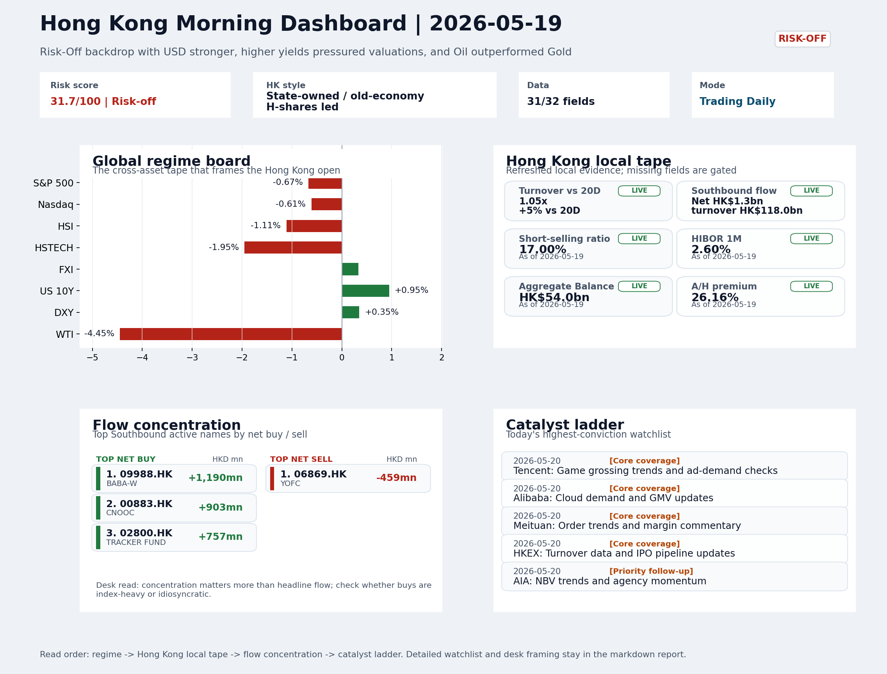
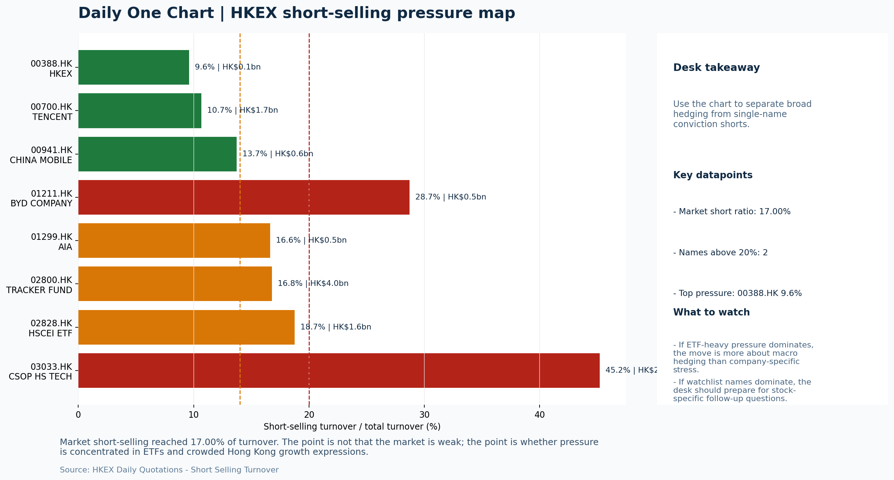

# Morning Research Workbench | 2026-05-20

> Designed for a Hong Kong sell-side commute: Layer 1 `Scan`, Layer 2 `Deep Read`, Layer 3 `Thinking`
> Mode: `Trading Daily` | Keep the report execution-oriented: what mattered in the completed session, what can move Hong Kong leadership, and what needs fast follow-up.
> Briefing date: `2026-05-20` | Review date: `2026-05-19` | Global request: `2026-05-19` | HK/China request: `2026-05-19` | Market effective date: `2026-05-19` | Generated at: `2026-05-20 08:15:21`

## Executive Summary

- **Market pulse:** Risk-Off remains the dominant frame heading into Wednesday: elevated yields and a hot US CPI have reinforced dollar strength, leaving growth-heavy Hong Kong underperformers - HSTECH (-1.95%).
- **Hong Kong lens:** Hong Kong growth / internet led. Risk-Off framing is intact: higher yields, USD strength, and tech caution all point to a soft open. HSTECH underperformance (-1.95%) versus FXI (+0.33%) suggests the pressure is.
- **Top catalysts:** INTC -6.33%; [A] White House touts deals on soybeans and rare earths after Trump-Xi summit, while China talks up tariff cuts.

## Visual Dashboard

## Layer 1 | Scan (5-10 min)

### 1.1 One-Line Market Pulse
Risk-Off remains the dominant frame heading into Wednesday: elevated yields and a hot US CPI have reinforced dollar strength, leaving growth-heavy Hong Kong underperformers - HSTECH (-1.95%) in particular - without a local catalyst to offset the cross-asset headwind while Nvidia earnings and Powell await.

### 1.2 Global Asset Price Dashboard

| Asset | Last | 1D move | Read |
| --- | --- | --- | --- |
| S&P 500 | 7,353.61 | -0.67% | US large-cap risk appetite |
| Nasdaq 100 | 28,818.84 | -0.61% | Growth and duration leadership |
| Hang Seng Index | 25,675.18 | -1.11% | Hong Kong broad beta |
| Hang Seng TECH | 4.7360 | **-1.95%** | Hong Kong growth / platform read-through |
| CSI 300 | 4,833.52 | -0.54% | Mainland large-cap tone |
| US 10Y | 4.6670 | +0.95% | Global discount-rate anchor |
| China 10Y | 1.73% | -2.4bp | China local rates anchor \| Live public \| Eastmoney \| 2026-05-19 |
| CN-US 10Y spread | -293.6bp | -8.4bp | Relative carry and macro-pressure gauge \| Live public \| Eastmoney \| 2026-05-19 |
| DXY | 99.31 | +0.35% | Dollar liquidity impulse |
| USD/CNH | 6.8035 | +0.20% | Offshore China risk appetite |
| USD/HKD | 7.8303 | +0.00% | Linked-exchange regime stress check |
| Brent crude | 110.74 | -1.21% | Energy / geopolitics |
| COMEX gold | 4,490.10 | -1.37% | Hedge demand / real yields |
| Copper | 6.1995 | -1.16% | Global growth proxy |
| VIX | 18.06 | +1.35% | US stress barometer |

### 1.3 Hong Kong Key Data Quick Check

| Check | Value | Status | Source / as of | Why it matters |
| --- | --- | --- | --- | --- |
| Main Board turnover vs 20D | 1.05x \| +5% vs 20D | Live local | HKEX \| 2026-05-19 | Trailing 20-session average turnover was HK$259.0bn. |
| Southbound / Northbound net flow | Southbound Net HK$1.3bn \| turnover HK$118.0bn \| Northbound Turnover HK$358.7bn \| net not reported | Live local | HKEX Connect \| 2026-05-19 | Southbound net buy is calculated from HKEX disclosed buy and sell turnover. |
| Short-selling ratio | 17.00% | Live local | HKEX \| 2026-05-19 | Official HKEX stock-level short-selling table, aggregated as a share of total market turnover. |
| AH premium index | 26.16% | Live public | Yahoo \| 2026-05-19 | Simple average across 18 A/H pairs; use dispersion rather than the average alone. |
| USD/HKD spot vs band | 7.8303 \| band 7.7500 to 7.8500 | Live quote + local | Yahoo \| 2026-05-19 | Inside the linked-exchange band without immediate boundary stress. Official Convertibility Undertakings define the linked-rate stress boundaries for USD/HKD. |
| HIBOR 1M | 2.60% | Live local | HKMA \| 2026-05-19 | 1M HIBOR is the cleanest quick read for Hong Kong funding conditions and equity-duration pressure. |
| Aggregate Balance | HK$54.0bn | Live local | HKMA \| 2026-05-19 | Aggregate Balance helps frame whether linked-rate liquidity conditions are tight or comfortable. |
| Hong Kong leadership | Hong Kong growth / internet led | Proxy | HSI / HSCEI / HSTECH relative perf \| 2026-05-19 | Use HSI / HSCEI / HSTECH relative moves as the opening style read. |

### 1.4 Risk Dashboard
**Composite risk score:** `31.7/100` | **Regime:** `Risk-off`

| Component | Score impact | Evidence |
| --- | --- | --- |
| US beta | -4.0 | S&P 500 -0.67% |
| HK growth | -9.8 | HSTECH -1.95% |
| Offshore China proxy | +1.7 | FXI +0.33% |
| Dollar pressure | -3.5 | DXY +0.35% |
| Volatility | -2.7 | VIX +1.35% |
| HK short-selling | +0 | Short-selling ratio 17.00% |

### 1.5 Morning Checklist
1. **INTC -6.33%**
 Mover attribution | Announcement / expectations | Guidance reset and margin pressure
2. **[A] White House touts deals on soybeans and rare earths after Trump-Xi summit, while China talks up tariff cuts**
 News / announcements | Capital allocation or shareholder-return events can trigger a valuation reset
3. **Risk-Off backdrop with USD stronger, higher yields pressured valuations, and Oil outperformed Gold**
 Overnight regime | Start by deciding whether the day is about Risk-Off conditions or a style pivot.
4. **CPI MoM (Released)**
 Macro / policy | Rates expectations, the dollar, and growth-equity valuation | Industries: Technology, Internet, Brokers
5. **Trade Balance (Released)**
 Macro / policy | Watch whether it changes the day's core market narrative | Industries: Market-wide

## Layer 2 | Deep Read (20-30 min)

### 2.1 Overnight Overseas Market Review
#### Market Setup
**Core tape.** US equities fell as higher yields and a stronger dollar weighed on rate-sensitive growth sectors, with Intel's guidance reset (-6.33%) reinforcing caution around the tech hardware complex.
**Main driver.** Offshore China sentiment held better than the HK tape, with FXI +0.33% suggesting mainland equities absorbed some of the Risk-Off pressure independently.
**HK relevance.** The combination of USD strength and rising yields sets a defensive tone for Hong Kong heading into Wednesday's Nvidia earnings call.

#### Key Drivers
- US 10Y yield +0.95% raised valuation pressure on growth-heavy indices, dragging S&P 500 -0.67% and Nasdaq -0.61%.
- DXY +0.35% and USD/CNH +0.20% signal dollar liquidity tightness that typically weighs on EM and HK leadership.
- Intel -6.33% adds semiconductor sector caution that could transfer to HK-listed hardware and supply-chain names.
- FXI +0.33% shows offshore China held firmer, which limits spillover severity but is not strong enough to offset the macro headwind.

#### Hong Kong Read-Through
**Desk lens.** State-owned / old-economy H-shares led.
**Opening implication.** Risk-Off framing is intact: higher yields, USD strength.
- **Cross-market read:** Hang Seng -1.11% / HSCEI -1.07% / HSTECH -1.95%.
- **Cross-market read:** Offshore China proxy FXI +0.33% and USD/CNH +0.20% frame cross-border risk appetite.
- **Cross-market read:** USD/HKD last traded around 7.8303, which keeps the Hong Kong funding lens in focus.

#### Watch Points
- USD composite moved higher by +0.19pct intraday, with a 0.241pct range.
- Main turning points appeared around 2026-05-19 08:05 peak / 2026-05-19 08:20 trough / 2026-05-19 08:40 peak, suggesting event-driven repricing.
- The biggest cross-asset divergence was Oil versus Gold, a spread of 2.305pct.
- Gold moved -1.22pct intraday with a 1.808pct high-low range.

**Curated overnight stories**
1. **White House touts deals on soybeans and rare earths after Trump-Xi summit, while China**
 Why it matters: Confirms de-escalation tone from the summit; rare-earth deal language and tariff-cut talk reshape the medium-term policy uncertainty premium for China-linked tech.
 HK read-through: Most relevant for HK-listed semiconductors and AI peers, and consumer discretionary names if tariff relief is genuine.
2. **Nvidia earnings call drama: Will Jensen Huang talk 'Trump' and China chips after Xi**
 Why it matters: Nvidia guidance and any commentary on China chip-export restrictions directly affect HK-listed AI and semiconductor. Market watches for any shift in US policy framing.
 HK read-through: High sensitivity for HK tech and AI-adjacent names; the call outcome on May 19 could set risk appetite or caution for HK growth indices on May 20.
3. **INTC -6.33% - Announcement / expectations: Guidance reset and margin pressure**
 Why it matters: Intel's reset signals ongoing competitive pressure in the AI chip landscape. For HK investors, this reinforces risk-awareness around US semiconductor peers.
 HK read-through: Most relevant for HK-listed tech hardware and semiconductor. Adds to the cautious tone already set by Risk-Off overnight regime.
4. **Risk-Off backdrop with USD stronger, higher yields pressured valuations, and Oil**
 Why it matters: Sets the overnight session context: USD strength and rising yields are a headwind for growth-valuation-heavy HK indices, while Oil outperforming Gold signals defensive.
 HK read-through: Broad, negative read-across for HK equities; rate-sensitive sectors (REITs, property) and growth names face elevated valuation pressure.

### 2.2 Hong Kong / A-share Previous-Day Review
#### Local Tape Setup
**Local read.** Hong Kong followed through on the Risk-Off overnight with HSTECH (-1.95%) bearing the heaviest growth pain, underperforming both HSCEI (-1.07%) and the broader HSI (-1.11%).
**Verification point.** The divergence is clear: FXI held +0.33% while HK growth sold off, confirming the pressure is style-specific rather than a broad China sentiment break.
**Risk to watch.** Southbound buyers leaned on energy (CNOOC net +HK$903m) and defensive SOEs (China Mobile net +HK$746m), while Tencent showed mixed positioning across venues (SSE net -HK$413m, SZSE net +HK$649m).

#### Style and Local Leadership
**Style leadership.** Hong Kong growth / internet led.
- **Cross-market read:** Hang Seng -1.11% / HSCEI -1.07% / HSTECH -1.95%.
- **Cross-market read:** Offshore China proxy FXI +0.33% and USD/CNH +0.20% frame cross-border risk appetite.
- **Cross-market read:** USD/HKD last traded around 7.8303, which keeps the Hong Kong funding lens in focus.

#### Flow Confirmation
Official Stock Connect evidence is available; use Section 2.3 to confirm whether local money supports the price action.

#### Follow-Through Checklist
**Follow-through check.** Watch whether 3033.HK and 2800.HK turnover ratio snaps back above 1.0x as a confirmation of passive buy-side support.

### 2.3 Flow Tracker and Attribution
#### Cross-Asset Attribution v1

| Driver | Direction | Score | Evidence | HK implication |
| --- | --- | --- | --- | --- |
| Rates impulse | drag | 1.14 | US 10Y yield proxy moved +0.95%. | Lower yields help long-duration growth; higher yields pressure valuation-sensitive |
| Dollar / CNH pressure | drag | 0.52 | DXY +0.35% / USD-CNH +0.20% | A stable or softer CNH makes Hong Kong follow-through more credible. |

#### Flow Tracker
##### Flow Takeaways
- Local flow evidence is not yet strong enough to override the cross-asset setup.
- Stock Connect Southbound: net HK$1.3bn on turnover HK$118.0bn (as of 2026-05-19).
- Stock Connect Northbound: turnover RMB358.7bn; public file provides total turnover/top active names, not full net-buy.
- AH premium: simple covered-pair average +26.16%; widest premium: China Communications Construction 70.66%.

##### Stock Connect Southbound Active Names

| Rank | Ticker | Name | Buy | Sell | Net buy |
| --- | --- | --- | --- | --- | --- |
| 2 | 09988.HK | BABA-W | HK$3,173.2mn | HK$1,983.7mn | HK$1,189.5mn |
| 5 | 00883.HK | CNOOC | HK$1,808.0mn | HK$905.3mn | HK$902.7mn |
| 7 | 02800.HK | TRACKER FUND | HK$759.1mn | HK$1.8mn | HK$757.3mn |
| 4 | 00941.HK | CHINA MOBILE | HK$1,675.1mn | HK$929.1mn | HK$746.0mn |
| 8 | 02476.HK | VGT | HK$682.0mn | HK$54.0mn | HK$628.0mn |

##### AH Premium Dispersion

| Name | A ticker | H ticker | Premium | As of |
| --- | --- | --- | --- | --- |
| China Communications Construction | 601800.SS | 1800.HK | +70.66% | 2026-05-19 |
| China Railway | 601390.SS | 0390.HK | +58.58% | 2026-05-19 |
| China Railway Construction | 601186.SS | 1186.HK | +49.09% | 2026-05-19 |
| China Life | 601628.SS | 2628.HK | +34.94% | 2026-05-19 |
| Sinopec | 600028.SS | 0386.HK | +31.27% | 2026-05-19 |

##### HKEX Short-Selling Watch

| Ticker | Name | Short ratio | Short turnover | Total turnover |
| --- | --- | --- | --- | --- |
| 00388.HK | HKEX | 9.62% | HK$0.1bn | HK$1.4bn |
| 00700.HK | TENCENT | 10.66% | HK$1.7bn | HK$15.6bn |
| 00941.HK | CHINA MOBILE | 13.74% | HK$0.6bn | HK$4.2bn |
| 01211.HK | BYD COMPANY | 28.70% | HK$0.5bn | HK$1.7bn |
| 01299.HK | AIA | 16.64% | HK$0.5bn | HK$3.0bn |

- **Short-value leaders:** 02800.HK TRACKER FUND (HK$4.0bn); 07709.HK XL2CSOPHYNIX (HK$2.9bn); 03033.HK CSOP HS TECH (HK$2.4bn); 00700.HK TENCENT (HK$1.7bn).

### 2.4 Macro and Policy Tracking
**Desk read.** The completed session (2026-05-19) established a Risk-Off base: USD bid, yields elevated, and commodities under broad pressure (WTI -4.45%, Gold -1.37%, Copper -1.16%), with VIX at 18.06.

**Market sensitivity.** For the 2026-05-20 Hong Kong trading day, the macro calendar is dense and could reprice the rates-and-FX backdrop quickly.

**HK implication.** US CPI MoM for April came in hot at +0.3% (vs. +0.2% expected), a release that is already in the tape and has likely strengthened the dollar and pressured duration assets - adding caution to technology and growth-sector valuations.

**Macro watchpoints**
- DXY and USD/HKD direction after the hot CPI release; whether the dollar maintains strength through Asian hours.
- Hong Kong technology and growth proxies opening tone - rates pressure is a near-term risk.
- US Retail Sales at 20:30 HK time: a beat could extend dollar strength and growth-equity caution.
- Fed Chair Powell at 22:00: any hawkish tilt would amplify the Risk-Off theme and reprice rate-sensitive sectors.

| Time | Region | Event | Status | Desk read |
| --- | --- | --- | --- | --- |
| 20:30 | US | CPI MoM | Released | Impact: Rates expectations, the dollar, and growth-equity valuation \| Attention: 5/5 \| Industries: Technology, Internet, Brokers |
| 09:30 | China | Trade Balance | Released | Impact: Watch whether it changes the day's core market narrative \| Attention: 3/5 \| Industries: Market-wide |
| 20:30 | US | Retail Sales MoM | Upcoming | Impact: Consumer resilience, growth expectations, and risk-asset pricing \| Attention: 5/5 \| Industries: Consumer, E-commerce, Consumer discretionary |
| 09:20 | China | Loan Prime Rate | Upcoming | Impact: Watch whether it changes the day's core market narrative \| Attention: 3/5 \| Industries: Market-wide |
| 22:00 | Federal Reserve | Jerome Powell: Economic outlook remarks | Central bank | Impact: Policy path, liquidity conditions, and cross-asset risk appetite \| Attention: 5/5 \| Industries: Technology, Financials, Gold |
| 10:00 | PBOC | Open Market Operations Desk: Daily liquidity operation window | Central bank | Impact: Policy path, liquidity conditions, and cross-asset risk appetite \| Attention: 3/5 \| Industries: Technology, Financials, Gold |

#### Positioning and Risk Backdrop
- Options activity centered on KWEB Call, with Vol/OI at 1.88x and a bullish bias.
- Put/Call structure shows equity 0.68 / index 1.15, implying Single-stock optimism with index hedging.
- Geopolitics: Middle East | Regional tension remains elevated | Impact: Oil, freight costs, and safe-haven demand
- Geopolitics: US-China | Technology export-control rhetoric remains active | Impact: China internet, semiconductors, and supply chains

### 2.5 Key Company and Sector Events

| Grade | Sector | Headline | Why it matters | Horizon |
| --- | --- | --- | --- | --- |
| A | Semiconductors and AI | White House touts deals on soybeans and rare earths after Trump-Xi | Capital allocation or shareholder-return events can trigger a valuation | Medium-term trend |
| A | Semiconductors and AI | Nvidia earnings call drama: Will Jensen Huang talk 'Trump' and China | This can directly reshape earnings forecasts and the valuation framework | Short-term catalyst |

#### HKEX Announcements

| Grade | Ticker | Type | Release time | Title |
| --- | --- | --- | --- | --- |
| A | 00852.HK | Profit warning | 2026-05-19 | Profit warning / alert announcement |
| A | 01953.HK | Profit warning | 2026-05-19 | Profit warning / alert announcement |
| A | 02680.HK | Profit warning | 2026-05-19 | Profit warning / alert announcement |
| A | 01161.HK | Profit warning | 2026-05-18 | Profit warning / alert announcement |
| A | 01451.HK | Profit warning | 2026-05-18 | Profit warning / alert announcement |
| A | 08210.HK | Profit warning | 2026-05-18 | Profit warning / alert announcement |
| A | 01611.HK | Profit warning | 2026-05-15 | Profit warning / alert announcement |
| A | 01319.HK | Profit warning | 2026-05-14 | Profit warning / alert announcement |

#### Earnings / Results Watch

| Ticker | Company | Timing | Expectation framing |
| --- | --- | --- | --- |
| 0700.HK | Tencent Holdings | After Market Close | EPS est. 4.15 HKD \| revenue est. 163.2bn HKD |
| 0388.HK | Hong Kong Exchanges and Clearing | Before Market Open | EPS est. 2.81 HKD \| revenue est. 6.0bn HKD |

#### Rating Changes
- **9988.HK** | Morgan Stanley | Upgrade | Equal Weight -> Overweight | PT 92 -> 105

#### IPO Watch
- IPO and grey-market monitoring is not yet part of the standard production pack.

### 2.6 Today's Core Names
#### Core coverage

| Name | Ticker | Last | 1D | Range position | Morning note |
| --- | --- | --- | --- | --- | --- |
| Tencent | 0700.HK | 460.00 | +2.40% | Bottom of range | Short-term price strength is clear; fresh catalysts could trigger broader group follow-through. |
| Alibaba | 9988.HK | 133.30 | +1.21% | Mid-range | Positioning is neutral for now, so use it mainly to monitor marginal information changes. |

#### Priority follow-up

| Name | Ticker | Last | 1D | Range position | Morning note |
| --- | --- | --- | --- | --- | --- |
| AIA | 1299.HK | 85.95 | -0.81% | Mid-range | Positioning is neutral for now, so use it mainly to monitor marginal information changes. |
| China Mobile | 0941.HK | 86.80 | +0.46% | Top of range | The name sits near the top of its recent range, so watch for profit-taking under high expectations. |

**Recent headlines for AIA:**
- [Is It Too Late To Consider AIA Group (SEHK:1299) After Its 82% One Year Rally?](https://finance.yahoo.com/markets/stocks/articles/too-consider-aia-group-sehk-042100864.html) (Simply Wall St.)

## Layer 3 | Thinking (10-15 min)

### 3.1 Rotating Theme Deep Dive

| Field | Read |
| --- | --- |
| Theme | Innovative Biotech and Out-Licensing |
| Angle for the day | Watch whether clinical data, approvals, and licensing momentum are still supporting the innovative-healthcare rerating story. |

**Theme desk read**
**Core thesis.** The weekly theme of innovative biotech and out-licensing faces a challenging near-term setup as macro cross-currents reshape the landscape.
**Evidence.** Oil's sharp 4.45% drop and copper's 1.16% decline reinforce a cautious cyclical-growth read, while gold's 1.37% pullback and the VIX climbing to 18.06 keep the risk-off regime intact.
**What to test.** Higher US yields at 4.667% add valuation pressure on long-duration names.

**Signals to keep in mind**
- WTI crude -4.45%: Softer oil argues for a more cautious cyclical-growth read.
- Gold -1.37%: Keep tracking it to confirm whether the core daily narrative is holding.

**LLM watch items:**
- US Retail Sales MoM (2026-05-20 20:30): Consumer resilience test under risk-off and rate-pressure conditions.
- China Loan Prime Rate (2026-05-20 09:20): Forecast steady at 3.45%, but any surprise could shift the day's narrative.
- INTC -6.33%: Guidance reset and margin pressure - watch for spillover into tech sentiment and China internet positioning.
- VIX trajectory: Confirm whether 18.06 holds or breaks higher, which would deepen the risk-off read for high-growth sectors.
- Tencent (0700.HK) range break: Bottom of range with 2.4% intraday strength - catalyst-dependent; monitor game and ad-demand data.

**Related names to keep close:**

| Name | Ticker | Bucket | Morning read |
| --- | --- | --- | --- |
| Tencent | 0700.HK | Core coverage | Short-term price strength is clear; fresh catalysts could trigger broader group follow-through. |
| AIA | 1299.HK | Priority follow-up | Positioning is neutral for now, so use it mainly to monitor marginal information changes. |

### 3.2 Today Ahead and Trading Calendar
- Macro: CPI MoM is the first item to anchor the open and the rates/FX response.
- Corporate / event: Tencent: Game grossing trends and ad-demand checks is the cleanest same-day catalyst to prepare for.

**Same-day macro docket**

| Time | Country | Event | Status | Detail |
| --- | --- | --- | --- | --- |
| 20:30 | US | CPI MoM | Released | Actual 0.3% / Forecast 0.2% / Prior 0.4% |
| 09:30 | China | Trade Balance | Released | Actual USD 85.2bn / Forecast USD 79.0bn / Prior USD 80.6bn |
| 20:30 | US | Retail Sales MoM | Upcoming | Forecast 0.3% / Prior 0.6% |
| 09:20 | China | Loan Prime Rate | Upcoming | Forecast 3.45% / Prior 3.45% |
| 22:00 | Federal Reserve | Jerome Powell: Economic outlook remarks | Central bank | speech |

**Same-day catalyst list**

| Date | Time | Category | Event | Importance |
| --- | --- | --- | --- | --- |
| 2026-05-20 | | Core coverage | Tencent: Game grossing trends and ad-demand checks | 3 |
| 2026-05-20 | | Core coverage | Alibaba: Cloud demand and GMV updates | 3 |
| 2026-05-20 | | Core coverage | Meituan: Order trends and margin commentary | 3 |
| 2026-05-20 | | Core coverage | HKEX: Turnover data and IPO pipeline updates | 3 |

**Next few sessions**

| Date | Category | Event | Impact |
| --- | --- | --- | --- |
| 2026-05-20 | Core coverage | Tencent: Game grossing trends and ad-demand checks | Core offshore China platform proxy for gaming, ads, and AI monetization |
| 2026-05-20 | Core coverage | Alibaba: Cloud demand and GMV updates | Key read-through for China consumption, cloud, and platform regulation |
| 2026-05-20 | Core coverage | Meituan: Order trends and margin commentary | High-frequency read on local services demand and platform competition |
| 2026-05-20 | Core coverage | HKEX: Turnover data and IPO pipeline updates | Direct proxy for Hong Kong market turnover, listings, and southbound |

### 3.3 Daily One Chart
**Daily One Chart | HKEX short-selling pressure map**

**Chart read.** Market short-selling reached 17.00% of turnover.
**Why it matters.** The point is not that the market is weak; the point is whether pressure is concentrated in ETFs and crowded Hong Kong growth expressions.

_Source: HKEX Daily Quotations - Short Selling Turnover_

## Traceable Appendix

### Report Metadata
> Date policy: Review date 2026-05-19 is treated as `Trading Daily`. | Global request date is 2026-05-19; adapter effective date is 2026-05-19 and summary date is 2026-05-19. | HK/China local data date is 2026-05-19; role: same-session local cash tape.
> Market data quality: Coverage: `31/32` | Missing: `1`
> Report quality: `92.6/100` | Grade `A` | Status `production ready`

### Key Questions to Keep in Mind
- Is risk appetite rising or fading? The overnight tape reads closer to `Risk-Off`.
- Did rates expectations move? Focus on whether US 10Y, DXY, and growth style moved together.
- Were commodities the real story? Watch WTI and gold for geopolitics versus inflation signals.
- Is Hong Kong setup internet-led, SOE-led, or broad beta-led? Compare HSTECH, HSCEI, and HSI.
- Did offshore markets move China risk appetite? Focus on HSI, FXI, USD/CNH, and USD/HKD.

### Report Quality and Validation
- **Quality score:** 92.6/100 | **Grade:** A | **Status:** production ready
- **Run summary:** 7 healthy | 1 caveat | 0 failed
- **Release recommendation:** Send with caveats | The report is usable, but the advisory guidance should travel with it so readers understand the data gaps.

| Source | Status | Bucket |
| --- | --- | --- |
| Market data | ok | healthy |
| Sector and company news | ok | healthy |
| Movers and short selling | ok | healthy |
| Stock Connect | ok | healthy |
| A/H premium | ok | healthy |
| Hong Kong local package | ok | healthy |
| China rates | ok | healthy |
| Narrative overlay | partial | caveat |

**Desk-use guidance summary:** 0 blocking | 1 advisory

**Desk-use guidance**
- **Advisory:** Use deterministic sections as primary support; the narrative overlay was partial or unavailable on this run.

| Component | Score | Weight | Read |
| --- | --- | --- | --- |
| Market data coverage | 96.9 | 0.3 | 31/32 core market fields available. |
| Hong Kong local metrics | 82.3 | 0.25 | 8 live, 3 proxy, 0 unavailable local checks. |
| Key public adapters | 100.0 | 0.2 | 4/4 key adapters were available or partially available. |
| Narrative overlay health | 85.7 | 0.15 | 6/7 narrative overlay tasks succeeded or used validated cache; 1 error(s). |
| Fact-check guardrail | 100.0 | 0.1 | Checked 2 numeric claims; 0 numeric mismatch(es), 0 logic warning(s); 0 critical, 0 review. |

**Narrative fact-check guardrail**
- Checked 2 numeric claims; 0 numeric mismatch(es), 0 logic warning(s); 0 critical, 0 review.

**Adapter status**

| Adapter | Status |
| --- | --- |
| Stock Connect | ok |
| A/H premium | ok |
| HKEX announcements | ok |
| China rates | ok |

### Source Links
- [White House touts deals on soybeans and rare earths after Trump-Xi summit, while China talks up tariff cuts](https://www.cnbc.com/2026/05/18/us-china-announce-deals-after-trump-xi-summit.html) (cnbc_markets)
- [Nvidia earnings call drama: Will Jensen Huang talk 'Trump' and China chips after Xi summit?](https://www.cnbc.com/2026/05/18/nvidia-earnings-call-drama-will-jensen-huang-talk-trump-and-china-chips-after-xi-summit.html) (cnbc_markets)
- [Assessing Meituan (SEHK:3690) Valuation After Recent Share Price Weakness And Ongoing Losses](https://finance.yahoo.com/markets/stocks/articles/assessing-meituan-sehk-3690-valuation-151405137.html) (Simply Wall St.)
- [Is It Too Late To Consider AIA Group (SEHK:1299) After Its 82% One Year Rally?](https://finance.yahoo.com/markets/stocks/articles/too-consider-aia-group-sehk-042100864.html) (Simply Wall St.)
- [00852.HK Profit warning / alert announcement](http://www1.hkexnews.hk/listedco/listconews/sehk/2026/0519/2026051901269.pdf) (HKEXnews)
- [01953.HK Profit warning / alert announcement](http://www1.hkexnews.hk/listedco/listconews/sehk/2026/0519/2026051901077.pdf) (HKEXnews)
- [02680.HK Profit warning / alert announcement](http://www1.hkexnews.hk/listedco/listconews/sehk/2026/0519/2026051900995.pdf) (HKEXnews)
- [01161.HK Profit warning / alert announcement](http://www1.hkexnews.hk/listedco/listconews/sehk/2026/0518/2026051800946.pdf) (HKEXnews)
- [01451.HK Profit warning / alert announcement](http://www1.hkexnews.hk/listedco/listconews/sehk/2026/0518/2026051800900.pdf) (HKEXnews)
- [08210.HK Profit warning / alert announcement](http://www1.hkexnews.hk/listedco/listconews/gem/2026/0518/2026051800436.pdf) (HKEXnews)
- [01611.HK Profit warning / alert announcement](http://www1.hkexnews.hk/listedco/listconews/sehk/2026/0515/2026051501537.pdf) (HKEXnews)
- [01319.HK Profit warning / alert announcement](http://www1.hkexnews.hk/listedco/listconews/sehk/2026/0514/2026051401100.pdf) (HKEXnews)

## Supplementary Visual Appendix

This appendix is professional-path only. It keeps a traceable index of the report visuals and the deterministic chart cues used to frame the morning note, without injecting the legacy intraday chart pack.

### Visual Index

| Visual | Path | Role |
| --- | --- | --- |
| Visual Dashboard | `charts/dashboard_2026-05-20.png` | Cross-asset regime board and Hong Kong local tape snapshot. |
| Daily One Chart | `charts/daily_one_chart_2026-05-20.png` | Single highest-conviction visual story for the day. |

### Deterministic Chart Cues
- FX / liquidity: USD composite moved higher by +0.19pct intraday, with a 0.241pct range.
- FX / liquidity: Main turning points appeared around 2026-05-19 08:05 peak / 2026-05-19 08:20 trough / 2026-05-19 08:40 peak, suggesting event-driven repricing rather than a clean one-way USD move.
- Cross-asset: The biggest cross-asset divergence was Oil versus Gold, a spread of 2.305pct.
- Cross-asset: Gold moved -1.22pct intraday with a 1.808pct high-low range.
- Cross-asset: Oil moved +1.09pct intraday with a 2.033pct high-low range.
- Cross-asset: Bitcoin moved -0.27pct intraday with a 1.318pct high-low range.

### Risk Dashboard Components

| Component | Score impact | Evidence |
| --- | --- | --- |
| US beta | -4.0 | S&P 500 -0.67% |
| HK growth | -9.8 | HSTECH -1.95% |
| Offshore China proxy | +1.7 | FXI +0.33% |
| Dollar pressure | -3.5 | DXY +0.35% |
| Volatility | -2.7 | VIX +1.35% |
| HK short-selling | +0 | Short-selling ratio 17.00% |
