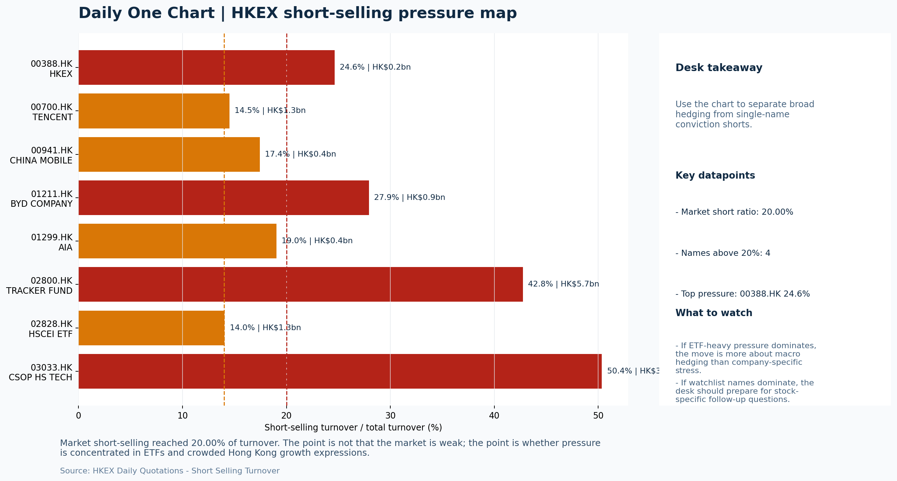

# Morning Research Workbench | 2026-05-21

> Designed for a Hong Kong sell-side commute: Layer 1 `Scan`, Layer 2 `Deep Read`, Layer 3 `Thinking`
> Mode: `Trading Daily` | Keep the report execution-oriented: what mattered in the completed session, what can move Hong Kong leadership, and what needs fast follow-up.
> Briefing date: `2026-05-21` | Review date: `2026-05-20` | Global request: `2026-05-20` | HK/China request: `2026-05-20` | Market effective date: `2026-05-20` | Generated at: `2026-05-21 08:15:14`

## Executive Summary

- **Market pulse:** Risk-On backdrop with USD softer and lower yields supported a marginal HSTECH-led rally on May 20, but the offshore China proxy FXI lagging, elevated 20% short-selling ratio, and sharp oil.
- **Hong Kong lens:** Hong Kong growth / internet led. A constructive open is plausible given the US rally and trade deal framing, but FXI lagging, elevated short-selling, and the oil-growth ambiguity warrant confirmation from HSTECH.
- **Top catalysts:** WTI crude -8.01%; INTC -6.33%.

## Visual Dashboard

## Layer 1 | Scan (5-10 min)

### 1.1 One-Line Market Pulse
Risk-On backdrop with USD softer and lower yields supported a marginal HSTECH-led rally on May 20, but the offshore China proxy FXI lagging, elevated 20% short-selling ratio, and sharp oil drop argue against aggressive position-building without cleaner breadth confirmation at the May 21 open.

### 1.2 Global Asset Price Dashboard

| Asset | Last | 1D move | Read |
| --- | --- | --- | --- |
| S&P 500 | 7,432.97 | +1.08% | US large-cap risk appetite |
| Nasdaq 100 | 29,297.70 | **+1.66%** | Growth and duration leadership |
| Hang Seng Index | 25,797.85 | +0.48% | Hong Kong broad beta |
| Hang Seng TECH | 4.7600 | +0.51% | Hong Kong growth / platform read-through |
| CSI 300 | 4,852.88 | +0.40% | Mainland large-cap tone |
| US 10Y | 4.5720 | **-2.04%** | Global discount-rate anchor |
| China 10Y | 1.74% | +0.4bp | China local rates anchor \| Live public \| Eastmoney \| 2026-05-20 |
| CN-US 10Y spread | -283.2bp | +10.4bp | Relative carry and macro-pressure gauge \| Live public \| Eastmoney \| 2026-05-20 |
| DXY | 99.14 | -0.16% | Dollar liquidity impulse |
| USD/CNH | 6.7900 | -0.22% | Offshore China risk appetite |
| USD/HKD | 7.8327 | +0.03% | Linked-exchange regime stress check |
| Brent crude | 105.71 | **-5.01%** | Energy / geopolitics |
| COMEX gold | 4,543.70 | +0.83% | Hedge demand / real yields |
| Copper | 6.3250 | **+2.60%** | Global growth proxy |
| VIX | 17.44 | **-3.43%** | US stress barometer |

### 1.3 Hong Kong Key Data Quick Check

| Check | Value | Status | Source / as of | Why it matters |
| --- | --- | --- | --- | --- |
| Main Board turnover vs 20D | 1.01x \| +1% vs 20D | Live local | HKEX \| 2026-05-20 | Trailing 20-session average turnover was HK$260.6bn. |
| Southbound / Northbound net flow | Southbound Net HK$5.7bn \| turnover HK$115.6bn \| Northbound Turnover HK$353.2bn \| net not reported | Live local | HKEX Connect \| 2026-05-20 | Southbound net buy is calculated from HKEX disclosed buy and sell turnover. |
| Short-selling ratio | 20.00% | Live local | HKEX \| 2026-05-20 | Official HKEX stock-level short-selling table, aggregated as a share of total market turnover. |
| AH premium index | 29.35% | Live public | Yahoo \| 2026-05-20 | Simple average across 17 A/H pairs; use dispersion rather than the average alone. |
| USD/HKD spot vs band | 7.8327 \| band 7.7500 to 7.8500 | Live quote + local | Yahoo \| 2026-05-20 | Inside the linked-exchange band without immediate boundary stress. Official Convertibility Undertakings define the linked-rate stress boundaries for USD/HKD. |
| HIBOR 1M | 2.57% | Live local | HKMA \| 2026-05-20 | 1M HIBOR is the cleanest quick read for Hong Kong funding conditions and equity-duration pressure. |
| Aggregate Balance | HK$53.9bn | Live local | HKMA \| 2026-05-20 | Aggregate Balance helps frame whether linked-rate liquidity conditions are tight or comfortable. |
| Hong Kong leadership | Hong Kong growth / internet led | Proxy | HSI / HSCEI / HSTECH relative perf \| 2026-05-20 | Use HSI / HSCEI / HSTECH relative moves as the opening style read. |

### 1.4 Risk Dashboard
**Composite risk score:** `58.9/100` | **Regime:** `Mixed`

| Component | Score impact | Evidence |
| --- | --- | --- |
| US beta | +6.5 | S&P 500 +1.08% |
| HK growth | +2.5 | HSTECH +0.51% |
| Offshore China proxy | -0.6 | FXI -0.11% |
| Dollar pressure | +1.6 | DXY -0.16% |
| Volatility | +6.9 | VIX -3.43% |
| HK short-selling | -8 | Short-selling ratio 20.00% |

### 1.5 Morning Checklist
1. **WTI crude -8.01%**
 High-frequency data | Softer oil argues for a more cautious cyclical-growth read.
2. **INTC -6.33%**
 Mover attribution | Announcement / expectations | Guidance reset and margin pressure
3. **[A] White House touts deals on soybeans and rare earths after Trump-Xi summit, while China talks up tariff cuts**
 News / announcements | Capital allocation or shareholder-return events can trigger a valuation reset
4. **Risk-On backdrop with USD softer, lower yields supported duration, and Gold outperformed Oil**
 Overnight regime | Start by deciding whether the day is about Risk-On conditions or a style pivot.
5. **CPI MoM (Released)**
 Macro / policy | Rates expectations, the dollar, and growth-equity valuation | Industries: Technology, Internet, Brokers

## Layer 2 | Deep Read (20-30 min)

### 2.1 Overnight Overseas Market Review
#### Market Setup
**Core tape.** US equities extended gains with Nasdaq +1.66% as lower yields and softer USD supported growth style.
**Main driver.** The sharp divergence of Gold (+0.83%) versus Oil (-8.01%) captures the split narrative: lower oil supports duration and input costs but raises a growth question.
**HK relevance.** Offshore China proxy FXI (-0.11%) lagged the HK local tape, and the 20% short-selling ratio argues against chasing the local rebound without cleaner breadth confirmation.

#### Key Drivers
- Trump-Xi summit concrete trade deals reduced immediate tariff escalation risk, supporting China ADR and HK blue-chip sentiment.
- Lower US yields (-2.04%) and softer USD (-0.16%) supported duration-sensitive growth names, lifting Nasdaq disproportionately.
- Oil -8.01% is a mixed signal: softer energy input helps industrials, but a weak cyclical-growth read raises demand concerns.
- Intel guidance reset (-6.33%) adds semiconductor sector caution ahead of Nvidia earnings on May 21, a key near-term catalyst for HK-listed.

#### Hong Kong Read-Through
**Desk lens.** Leadership was broad and balanced.
**Opening implication.** A constructive open is plausible given the US rally and trade deal framing, but FXI lagging, elevated short-selling.
- **Cross-market read:** Hang Seng +0.48% / HSCEI +0.49% / HSTECH +0.51%.
- **Cross-market read:** Offshore China proxy FXI -0.11% and USD/CNH -0.22% frame cross-border risk appetite.
- **Cross-market read:** USD/HKD last traded around 7.8327, which keeps the Hong Kong funding lens in focus.

#### Watch Points
- USD composite moved lower by -0.15pct intraday, with a 0.249pct range.
- Main turning points appeared around 2026-05-20 08:10 peak / 2026-05-20 08:25 trough / 2026-05-20 08:40 peak, suggesting event-driven repricing.
- The biggest cross-asset divergence was Gold versus Oil, a spread of 6.135pct.
- Gold moved +1.73pct intraday with a 2.002pct high-low range.

**Curated overnight stories**
1. **China confirms order for 200 Boeing planes, calls aviation key area for U.S. cooperation**
 Why it matters: Concrete bilateral trade deal from the Trump-Xi summit signals de-escalation intent. Boeing deal and rare earth agreements reduce the immediate risk of tariff escalation.
 HK read-through: Positive for aerospace exposure and China-U.S. trade sentiment. Supports risk appetite for HK-listed China names and ADRs. Reduces tail-risk premium in the near term.
2. **White House touts deals on soybeans and rare earths after Trump-Xi summit**
 Why it matters: Tariff-cut framing shifts the narrative from escalation to potential relief. Rare earth deals have medium-term supply chain implications for tech hardware.
 HK read-through: Most relevant for China tech and semiconductor supply-chain names listed in Hong Kong. Reduces uncertainty premium that has weighed on China growth stocks.
3. **Nvidia earnings call drama: Will Jensen Huang talk 'Trump' and China chips after Xi**
 Why it matters: Nvidia's earnings and forward guidance are a key test for global AI equity sentiment. Commentary on export controls and China chip policy post-Xi summit.
 HK read-through: High conviction read-through to SMIC, HON HAI, and broader China tech hardware sentiment. A cautious tone would pressure the sector in Hong Kong.
4. **WTI crude -8.01%**
 Why it matters: Sharp oil drop signals softer inflation input but also weaker cyclical-growth read. Complicates the energy sector outlook and may reduce input cost pressures for Chinese.
 HK read-through: Mixed: supports duration and lowers input costs for manufacturers, but raises growth worry. Energy sector weakness could pressure PetroChina, CNOOC.
5. **INTC -6.33%, guidance reset and margin pressure**
 Why it matters: Intel's guidance reset reflects competitive pressures in the AI chip landscape and margin compression. Adds caution to semiconductor sector sentiment ahead of Nvidia.
 HK read-through: Sector-level caution for HK semiconductor names. SMIC and other chip-related equities may face indirect pressure if Nvidia also signals caution.

### 2.2 Hong Kong / A-share Previous-Day Review
#### Local Tape Setup
**Local read.** Hong Kong followed the overnight Risk-On tone with HSTECH (+0.51%) slightly leading HSCEI (+0.49%).
**Verification point.** Southbound flows were solid at HK$5.7bn net, with SMIC as the top net buyer at HK$2.17bn combining SSE and SZSE legs, while BABA showed minor net selling.
**Risk to watch.** The 20% short-selling ratio and elevated ETF-product short activity (A-share trackers at 68-100% of turnover) argue that local rebounds need broader participation to be sustained.

#### Style and Local Leadership
**Style leadership.** Hong Kong growth / internet led.
- **Cross-market read:** Hang Seng +0.48% / HSCEI +0.49% / HSTECH +0.51%.
- **Cross-market read:** Offshore China proxy FXI -0.11% and USD/CNH -0.22% frame cross-border risk appetite.
- **Cross-market read:** USD/HKD last traded around 7.8327, which keeps the Hong Kong funding lens in focus.

#### Flow Confirmation
Official Stock Connect evidence is available; use Section 2.3 to confirm whether local money supports the price action.

#### Follow-Through Checklist
**Follow-through check.** Confirm whether HSTECH holds its leadership advantage over HSCEI at the May 21 open, and whether 3033.HK (Hang Seng TECH ETF) ETF flows shift from outflow to neutral; Nvidia earnings tonight are the key near-term catalyst for HK semiconductor sentiment.

### 2.3 Flow Tracker and Attribution
#### Cross-Asset Attribution v1

| Driver | Direction | Score | Evidence | HK implication |
| --- | --- | --- | --- | --- |
| Oil and geopolitics | supportive | 4.01 | Oil moved -5.01%. | Split the read between energy/cyclicals support and margin/geopolitical pressure. |
| Short-selling pressure | drag | 3.5 | HKEX short-selling ratio was 20.00%. | Elevated short activity argues for extra confirmation before chasing rebounds. |
| Rates impulse | supportive | 2.45 | US 10Y yield proxy moved -2.04%. | Lower yields help long-duration growth; higher yields pressure valuation-sensitive |
| US growth-style transmission | supportive | 2.32 | Nasdaq 100 moved +1.66%. | Hong Kong growth and platform names should be tested first at the open. |
| Global equity beta | supportive | 1.08 | S&P 500 moved +1.08%. | Broad beta matters if Hong Kong breadth confirms the overseas signal. |

#### Flow Tracker
##### Flow Takeaways
- Short-selling pressure is elevated, so local rebounds need cleaner breadth and flow confirmation.
- Stock Connect Southbound: net HK$5.7bn on turnover HK$115.6bn (as of 2026-05-20).
- Stock Connect Northbound: turnover RMB353.2bn; public file provides total turnover/top active names, not full net-buy.
- AH premium: simple covered-pair average +29.35%; widest premium: Everbright Bank 86.81%.

##### Stock Connect Southbound Active Names

| Rank | Ticker | Name | Buy | Sell | Net buy |
| --- | --- | --- | --- | --- | --- |
| 1 | 00981.HK | SMIC | HK$9,093.8mn | HK$6,927.4mn | HK$2,166.4mn |
| 9 | 00941.HK | CHINA MOBILE | HK$1,938.0mn | HK$374.5mn | HK$1,563.6mn |
| 2 | 01347.HK | HUA HONG SEMI | HK$3,066.9mn | HK$2,268.5mn | HK$798.4mn |
| 8 | 03986.HK | GIGADEVICE | HK$998.4mn | HK$1,468.5mn | HK$-470.1mn |
| 4 | 00700.HK | TENCENT | HK$1,672.5mn | HK$1,263.4mn | HK$409.1mn |

##### AH Premium Dispersion

| Name | A ticker | H ticker | Premium | As of |
| --- | --- | --- | --- | --- |
| Everbright Bank | 601818.SS | 6818.HK | +86.81% | 2026-05-20 |
| China Railway | 601390.SS | 0390.HK | +55.93% | 2026-05-20 |
| China Railway Construction | 601186.SS | 1186.HK | +49.48% | 2026-05-20 |
| China Communications Construction | 601800.SS | 1800.HK | +48.56% | 2026-05-20 |
| New China Life | 601336.SS | 1336.HK | +42.14% | 2026-05-20 |

##### HKEX Short-Selling Watch

| Ticker | Name | Short ratio | Short turnover | Total turnover |
| --- | --- | --- | --- | --- |
| 00388.HK | HKEX | 24.63% | HK$0.2bn | HK$0.9bn |
| 00700.HK | TENCENT | 14.51% | HK$1.3bn | HK$8.7bn |
| 00941.HK | CHINA MOBILE | 17.43% | HK$0.4bn | HK$2.5bn |
| 01211.HK | BYD COMPANY | 27.94% | HK$0.9bn | HK$3.1bn |
| 01299.HK | AIA | 19.03% | HK$0.4bn | HK$2.2bn |

- **Short-value leaders:** 02800.HK TRACKER FUND (HK$5.7bn); 03033.HK CSOP HS TECH (HK$3.8bn); 07709.HK XL2CSOPHYNIX (HK$3.5bn); 00981.HK SMIC (HK$2.0bn).

### 2.4 Macro and Policy Tracking
**Desk read.** Today's macro calendar is dense for Hong Kong positioning.

**Market sensitivity.** US CPI released at +0.3% MoM, above the 0.2% consensus and below the prior 0.4% - a print that is neither a clean beat nor a disinflation confirmation.

**HK implication.** This keeps the Fed on an uncertain path heading into Powell's remarks at 22:00 HKT.

**Macro watchpoints**
- US 10Y yield direction after the CPI release; whether 4.572% support holds.
- WTI crude trajectory - the -8.01% drop could pressure HK energy and materials proxies if sustained.
- USD/DXY response to CPI; USD softness is currently positive for HK growth names but can reverse fast.
- US Retail Sales at 20:30 HKT - forecast 0.3% vs prior 0.6%; any miss could test the Risk-On tape.

| Time | Region | Event | Status | Desk read |
| --- | --- | --- | --- | --- |
| 20:30 | US | CPI MoM | Released | Impact: Rates expectations, the dollar, and growth-equity valuation \| Attention: 5/5 \| Industries: Technology, Internet, Brokers |
| 09:30 | China | Trade Balance | Released | Impact: Watch whether it changes the day's core market narrative \| Attention: 3/5 \| Industries: Market-wide |
| 20:30 | US | Retail Sales MoM | Upcoming | Impact: Consumer resilience, growth expectations, and risk-asset pricing \| Attention: 5/5 \| Industries: Consumer, E-commerce, Consumer discretionary |
| 09:20 | China | Loan Prime Rate | Upcoming | Impact: Watch whether it changes the day's core market narrative \| Attention: 3/5 \| Industries: Market-wide |
| 22:00 | Federal Reserve | Jerome Powell: Economic outlook remarks | Central bank | Impact: Policy path, liquidity conditions, and cross-asset risk appetite \| Attention: 5/5 \| Industries: Technology, Financials, Gold |
| 10:00 | PBOC | Open Market Operations Desk: Daily liquidity operation window | Central bank | Impact: Policy path, liquidity conditions, and cross-asset risk appetite \| Attention: 3/5 \| Industries: Technology, Financials, Gold |

#### Positioning and Risk Backdrop
- Options activity centered on KWEB Call, with Vol/OI at 1.88x and a bullish bias.
- Put/Call structure shows equity 0.68 / index 1.15, implying Single-stock optimism with index hedging.
- Geopolitics: Middle East | Regional tension remains elevated | Impact: Oil, freight costs, and safe-haven demand
- Geopolitics: US-China | Technology export-control rhetoric remains active | Impact: China internet, semiconductors, and supply chains

### 2.5 Key Company and Sector Events

| Grade | Sector | Headline | Why it matters | Horizon |
| --- | --- | --- | --- | --- |
| A | Semiconductors and AI | White House touts deals on soybeans and rare earths after Trump-Xi | Capital allocation or shareholder-return events can trigger a valuation | Medium-term trend |
| A | Semiconductors and AI | Nvidia earnings call drama: Will Jensen Huang talk 'Trump' and China | This can directly reshape earnings forecasts and the valuation framework | Short-term catalyst |
| B | China Internet | Alibaba reveals more powerful Zhenwu AI chip, new LLM | Assess whether the story can propagate through the China Internet value | Monitor |

#### Company Event Takeaway
**Desk read.** Risk-on conditions with softer USD and lower yields provided a constructive backdrop for Hong Kong equity flows on May 20.
**Why it matters.** Key catalysts are queued: Morgan Stanley's upgrade of Alibaba (9988.HK) to Overweight with a target raise to HKD 105 is the most immediate driver for internet leadership.
**Follow-up.** The Trump-Xi summit outcome and Nvidia's earnings call commentary carry medium-term implications for Semiconductors and AI leadership and their Hong Kong peers.

#### LLM Quick Takes
- **9988.HK** | Morgan Stanley upgrade from Equal Weight to Overweight with target raised to HKD 105 (from 92) is a meaningful signal for internet sector leadership.
- **0700.HK** | Tencent reports after market close on May 20. Consensus estimates: EPS HKD 4.15, revenue HKD 163.2bn.
- **0388.HK** | HKEX reports before market open on May 21. Consensus estimates: EPS HKD 2.81, revenue HKD 6.0bn.
- **1211.HK** | BYD is under pressure at the bottom of its recent range (0.0% position) with a -3.94% daily decline.
- **1299.HK** | AIA sits at mid-range (50.0%) with a -1.98% daily decline. Despite a strong 82.2% one-year return, the stock shows modest recent underperformance.
- **08279.HK** | AGTECH HOLDINGS issued a profit warning on May 20 (Grade A). One of eight Grade A profit warnings identified across the session.

#### HKEX Announcements

| Grade | Ticker | Type | Release time | Title |
| --- | --- | --- | --- | --- |
| A | 08279.HK | Profit warning | 2026-05-20 | Profit warning / alert announcement |
| A | 00852.HK | Profit warning | 2026-05-19 | Profit warning / alert announcement |
| A | 01953.HK | Profit warning | 2026-05-19 | Profit warning / alert announcement |
| A | 02680.HK | Profit warning | 2026-05-19 | Profit warning / alert announcement |
| A | 01161.HK | Profit warning | 2026-05-18 | Profit warning / alert announcement |
| A | 01451.HK | Profit warning | 2026-05-18 | Profit warning / alert announcement |
| A | 08210.HK | Profit warning | 2026-05-18 | Profit warning / alert announcement |
| A | 01611.HK | Profit warning | 2026-05-15 | Profit warning / alert announcement |

#### Earnings / Results Watch

| Ticker | Company | Timing | Expectation framing |
| --- | --- | --- | --- |
| 0700.HK | Tencent Holdings | After Market Close | EPS est. 4.15 HKD \| revenue est. 163.2bn HKD |
| 0388.HK | Hong Kong Exchanges and Clearing | Before Market Open | EPS est. 2.81 HKD \| revenue est. 6.0bn HKD |

#### Rating Changes
- **9988.HK** | Morgan Stanley | Upgrade | Equal Weight -> Overweight | PT 92 -> 105

#### IPO Watch
- IPO and grey-market monitoring is not yet part of the standard production pack.

### 2.6 Today's Core Names
#### Core coverage

| Name | Ticker | Last | 1D | Range position | Morning note |
| --- | --- | --- | --- | --- | --- |
| Alibaba | 9988.HK | 131.90 | -1.05% | Mid-range | Positioning is neutral for now, so use it mainly to monitor marginal information changes. |
| Tencent | 0700.HK | 455.20 | -1.04% | Bottom of range | The name sits near the bottom of its recent range and is worth monitoring for a catalyst-led reversal. |

#### Priority follow-up

| Name | Ticker | Last | 1D | Range position | Morning note |
| --- | --- | --- | --- | --- | --- |
| BYD Company | 1211.HK | 90.20 | -3.94% | Bottom of range | Short-term pressure is visible; check for a fundamental or regulatory reason. |
| AIA | 1299.HK | 84.25 | -1.98% | Mid-range | Positioning is neutral for now, so use it mainly to monitor marginal information changes. |

**Recent headlines for BYD Company:**
- [BYD's UK Showroom Surge Tests Profitability And European Growth Ambitions](https://finance.yahoo.com/markets/stocks/articles/byd-uk-showroom-surge-tests-080544234.html) (Simply Wall St.)
**Recent headlines for AIA:**
- [Is It Too Late To Consider AIA Group (SEHK:1299) After Its 82% One Year Rally?](https://finance.yahoo.com/markets/stocks/articles/too-consider-aia-group-sehk-042100864.html) (Simply Wall St.)

## Layer 3 | Thinking (10-15 min)

### 3.1 Rotating Theme Deep Dive

| Field | Read |
| --- | --- |
| Theme | China Exports and Supply-Chain Relocation |
| Angle for the day | Track tariffs, trade policy, shipping, and manufacturing orders to see whether export resilience is still the cleaner China macro expression. |

**Theme desk read**
**Core thesis.** Risk-On conditions persist with USD softer and yields lower, but the overnight session delivered a split signal worth watching.
**Evidence.** US CPI came in hot at 0.3% MoM versus 0.2% forecast, which complicates the rate-cut narrative even as the VIX compressed -3.43%.
**What to test.** China Trade Balance beat at USD 85.2bn, offering a constructive read on export resilience.

**Signals to keep in mind**
- White House touts deals on soybeans and rare earths after Trump-Xi summit, while China talks up tariff cuts
- WTI crude -8.01%: Softer oil argues for a more cautious cyclical-growth read.
- VIX -3.43%: Lower volatility signals easing stress in the tape.

**LLM watch items:**
- US Retail Sales MoM tonight - determines whether consumer resilience supports the risk-on frame or forces a reset
- China Trade Balance beat at USD 85.2bn - watch whether the market reprices export resilience materially on this data
- BYD weekly sales data on May 21 - confirm whether volume and export mix hold up given -3.94% decline and range-bottom position
- INTC -6.33% guidance reset - monitor whether the tech sector narrative shifts for Hong Kong-listed semiconductor and AI names
- CPI follow-through on rates and duration - if hot print holds, duration assets and growth style valuations face pressure

**Related names to keep close:**

| Name | Ticker | Bucket | Morning read |
| --- | --- | --- | --- |
| BYD Company | 1211.HK | Priority follow-up | Short-term pressure is visible; check for a fundamental or regulatory reason. |
| China Mobile | 0941.HK | Priority follow-up | The name sits near the top of its recent range, so watch for profit-taking under high expectations. |

**Upcoming catalysts tied to the theme:**
- 2026-05-21 | BYD Company: Weekly sales data and model rollout cadence | Hong Kong-listed proxy for EV volumes, export mix, and price competition
- 2026-05-21 | China Mobile: Capex updates and dividend policy signals | Defensive SOE benchmark for yield trade and domestic digital-infrastructure spend

**Relevant headlines:**
- [White House touts deals on soybeans and rare earths after Trump-Xi summit, while China talks up tariff cuts](https://www.cnbc.com/2026/05/18/us-china-announce-deals-after-trump-xi-summit.html)

### 3.2 Today Ahead and Trading Calendar
- Macro: CPI MoM is the first item to anchor the open and the rates/FX response.
- Corporate / event: Alibaba: Cloud demand and GMV updates is the cleanest same-day catalyst to prepare for.

**Same-day macro docket**

| Time | Country | Event | Status | Detail |
| --- | --- | --- | --- | --- |
| 20:30 | US | CPI MoM | Released | Actual 0.3% / Forecast 0.2% / Prior 0.4% |
| 09:30 | China | Trade Balance | Released | Actual USD 85.2bn / Forecast USD 79.0bn / Prior USD 80.6bn |
| 20:30 | US | Retail Sales MoM | Upcoming | Forecast 0.3% / Prior 0.6% |
| 09:20 | China | Loan Prime Rate | Upcoming | Forecast 3.45% / Prior 3.45% |
| 22:00 | Federal Reserve | Jerome Powell: Economic outlook remarks | Central bank | speech |

**Same-day catalyst list**

| Date | Time | Category | Event | Importance |
| --- | --- | --- | --- | --- |
| 2026-05-21 | | Core coverage | Alibaba: Cloud demand and GMV updates | 3 |
| 2026-05-21 | | Core coverage | Tencent: Game grossing trends and ad-demand checks | 3 |
| 2026-05-21 | | Core coverage | HKEX: Turnover data and IPO pipeline updates | 3 |
| 2026-05-21 | | Core coverage | Meituan: Order trends and margin commentary | 3 |

**Next few sessions**

| Date | Category | Event | Impact |
| --- | --- | --- | --- |
| 2026-05-21 | Core coverage | Alibaba: Cloud demand and GMV updates | Key read-through for China consumption, cloud, and platform regulation |
| 2026-05-21 | Core coverage | Tencent: Game grossing trends and ad-demand checks | Core offshore China platform proxy for gaming, ads, and AI monetization |
| 2026-05-21 | Core coverage | HKEX: Turnover data and IPO pipeline updates | Direct proxy for Hong Kong market turnover, listings, and southbound |
| 2026-05-21 | Core coverage | Meituan: Order trends and margin commentary | High-frequency read on local services demand and platform competition |

### 3.3 Daily One Chart
**Daily One Chart | HKEX short-selling pressure map**

**Chart read.** Market short-selling reached 20.00% of turnover.
**Why it matters.** The point is not that the market is weak; the point is whether pressure is concentrated in ETFs and crowded Hong Kong growth expressions.

_Source: HKEX Daily Quotations - Short Selling Turnover_

## Traceable Appendix

### Report Metadata
> Date policy: Review date 2026-05-20 is treated as `Trading Daily`. | Global request date is 2026-05-20; adapter effective date is 2026-05-20 and summary date is 2026-05-20. | HK/China local data date is 2026-05-20; role: same-session local cash tape.
> Market data quality: Coverage: `31/32` | Missing: `1`
> Report quality: `94.7/100` | Grade `A` | Status `production ready`

### Key Questions to Keep in Mind
- Is risk appetite rising or fading? The overnight tape reads closer to `Risk-On`.
- Did rates expectations move? Focus on whether US 10Y, DXY, and growth style moved together.
- Were commodities the real story? Watch WTI and gold for geopolitics versus inflation signals.
- Is Hong Kong setup internet-led, SOE-led, or broad beta-led? Compare HSTECH, HSCEI, and HSI.
- Did offshore markets move China risk appetite? Focus on HSI, FXI, USD/CNH, and USD/HKD.

### Report Quality and Validation
- **Quality score:** 94.7/100 | **Grade:** A | **Status:** production ready
- **Run summary:** 8 healthy | 0 caveat | 0 failed
- **Release recommendation:** Send | All monitored sources were healthy, so the report is fit for normal distribution.

| Source | Status | Bucket |
| --- | --- | --- |
| Market data | ok | healthy |
| Sector and company news | ok | healthy |
| Movers and short selling | ok | healthy |
| Stock Connect | ok | healthy |
| A/H premium | ok | healthy |
| Hong Kong local package | ok | healthy |
| China rates | ok | healthy |
| Narrative overlay | ok | healthy |

**Desk-use guidance summary:** 0 blocking | 1 advisory

**Desk-use guidance**
- **Advisory:** All monitored sources were healthy for this run; the report can be used as a normal desk-starting point.

| Component | Score | Weight | Read |
| --- | --- | --- | --- |
| Market data coverage | 96.9 | 0.3 | 31/32 core market fields available. |
| Hong Kong local metrics | 82.3 | 0.25 | 8 live, 3 proxy, 0 unavailable local checks. |
| Key public adapters | 100.0 | 0.2 | 4/4 key adapters were available or partially available. |
| Narrative overlay health | 100.0 | 0.15 | 7/7 narrative overlay tasks succeeded or used validated cache; 0 error(s). |
| Fact-check guardrail | 100.0 | 0.1 | Checked 2 numeric claims; 0 numeric mismatch(es), 0 logic warning(s); 0 critical, 0 review. |

**Narrative fact-check guardrail**
- Checked 2 numeric claims; 0 numeric mismatch(es), 0 logic warning(s); 0 critical, 0 review.

**Adapter status**

| Adapter | Status |
| --- | --- |
| Stock Connect | ok |
| A/H premium | ok |
| HKEX announcements | ok |
| China rates | ok |

### Source Links
- [White House touts deals on soybeans and rare earths after Trump-Xi summit, while China talks up tariff cuts](https://www.cnbc.com/2026/05/18/us-china-announce-deals-after-trump-xi-summit.html) (cnbc_markets)
- [Nvidia earnings call drama: Will Jensen Huang talk 'Trump' and China chips after Xi summit?](https://www.cnbc.com/2026/05/18/nvidia-earnings-call-drama-will-jensen-huang-talk-trump-and-china-chips-after-xi-summit.html) (cnbc_markets)
- [Alibaba reveals more powerful Zhenwu AI chip, new LLM](https://www.cnbc.com/2026/05/19/alibaba-reveals-more-powerful-zhenwu-ai-chip-new-llm.html) (cnbc_markets)
- [Assessing Meituan (SEHK:3690) Valuation After Recent Share Price Weakness And Ongoing Losses](https://finance.yahoo.com/markets/stocks/articles/assessing-meituan-sehk-3690-valuation-151405137.html) (Simply Wall St.)
- [BYD's UK Showroom Surge Tests Profitability And European Growth Ambitions](https://finance.yahoo.com/markets/stocks/articles/byd-uk-showroom-surge-tests-080544234.html) (Simply Wall St.)
- [Is It Too Late To Consider AIA Group (SEHK:1299) After Its 82% One Year Rally?](https://finance.yahoo.com/markets/stocks/articles/too-consider-aia-group-sehk-042100864.html) (Simply Wall St.)
- [08279.HK Profit warning / alert announcement](http://www1.hkexnews.hk/listedco/listconews/gem/2026/0520/2026052000807.pdf) (HKEXnews)
- [00852.HK Profit warning / alert announcement](http://www1.hkexnews.hk/listedco/listconews/sehk/2026/0519/2026051901269.pdf) (HKEXnews)
- [01953.HK Profit warning / alert announcement](http://www1.hkexnews.hk/listedco/listconews/sehk/2026/0519/2026051901077.pdf) (HKEXnews)
- [02680.HK Profit warning / alert announcement](http://www1.hkexnews.hk/listedco/listconews/sehk/2026/0519/2026051900995.pdf) (HKEXnews)
- [01161.HK Profit warning / alert announcement](http://www1.hkexnews.hk/listedco/listconews/sehk/2026/0518/2026051800946.pdf) (HKEXnews)
- [01451.HK Profit warning / alert announcement](http://www1.hkexnews.hk/listedco/listconews/sehk/2026/0518/2026051800900.pdf) (HKEXnews)
- [08210.HK Profit warning / alert announcement](http://www1.hkexnews.hk/listedco/listconews/gem/2026/0518/2026051800436.pdf) (HKEXnews)
- [01611.HK Profit warning / alert announcement](http://www1.hkexnews.hk/listedco/listconews/sehk/2026/0515/2026051501537.pdf) (HKEXnews)

## Supplementary Visual Appendix

This appendix is professional-path only. It keeps a traceable index of the report visuals and the deterministic chart cues used to frame the morning note, without injecting the legacy intraday chart pack.

### Visual Index

| Visual | Path | Role |
| --- | --- | --- |
| Visual Dashboard | `charts/dashboard_2026-05-21.png` | Cross-asset regime board and Hong Kong local tape snapshot. |
| Daily One Chart | `charts/daily_one_chart_2026-05-21.png` | Single highest-conviction visual story for the day. |

### Deterministic Chart Cues
- FX / liquidity: USD composite moved lower by -0.15pct intraday, with a 0.249pct range.
- FX / liquidity: Main turning points appeared around 2026-05-20 08:10 peak / 2026-05-20 08:25 trough / 2026-05-20 08:40 peak, suggesting event-driven repricing rather than a clean one-way USD move.
- Cross-asset: The biggest cross-asset divergence was Gold versus Oil, a spread of 6.135pct.
- Cross-asset: Gold moved +1.73pct intraday with a 2.002pct high-low range.
- Cross-asset: Oil moved -4.41pct intraday with a 6.603pct high-low range.
- Cross-asset: Bitcoin moved +0.89pct intraday with a 1.56pct high-low range.

### Risk Dashboard Components

| Component | Score impact | Evidence |
| --- | --- | --- |
| US beta | +6.5 | S&P 500 +1.08% |
| HK growth | +2.5 | HSTECH +0.51% |
| Offshore China proxy | -0.6 | FXI -0.11% |
| Dollar pressure | +1.6 | DXY -0.16% |
| Volatility | +6.9 | VIX -3.43% |
| HK short-selling | -8 | Short-selling ratio 20.00% |
