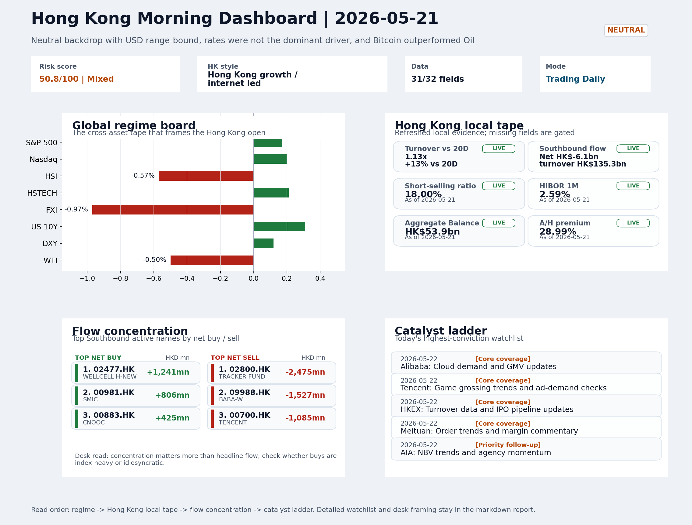
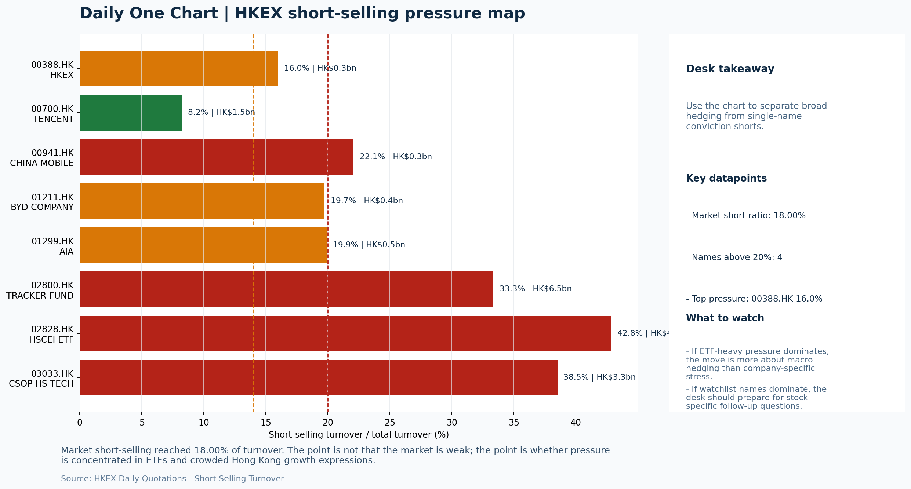

# Morning Research Workbench | 2026-05-22

> Designed for a Hong Kong sell-side commute: Layer 1 `Scan`, Layer 2 `Deep Read`, Layer 3 `Thinking`
> Mode: `Trading Daily` | Keep the report execution-oriented: what mattered in the completed session, what can move Hong Kong leadership, and what needs fast follow-up.
> Briefing date: `2026-05-22` | Review date: `2026-05-21` | Global request: `2026-05-21` | HK/China request: `2026-05-21` | Market effective date: `2026-05-21` | Generated at: `2026-05-22 08:13:27`

## Executive Summary

- **Market pulse:** A neutral, range-bound session with easing VIX and growth-led internal tape held, but elevated 18% short-selling, Southbound outflows of HK$6.1bn, and FXI's -0.97% lag argue for requiring.
- **Hong Kong lens:** Hong Kong growth / internet led. Friday's open is likely directionless to slightly soft given FXI's -0.97% weakness and the INTC guidance overhang on tech names, though the VIX decline and solid 1.13x turnover.
- **Top catalysts:** INTC -6.33%; Neutral backdrop with USD range-bound, rates were not the dominant driver, and Bitcoin outperformed Oil.

## Visual Dashboard

## Layer 1 | Scan (5-10 min)

### 1.1 One-Line Market Pulse
A neutral, range-bound session with easing VIX and growth-led internal tape held, but elevated 18% short-selling, Southbound outflows of HK$6.1bn, and FXI's -0.97% lag argue for requiring breadth confirmation before treating local rebounds as durable.

### 1.2 Global Asset Price Dashboard

| Asset | Last | 1D move | Read |
| --- | --- | --- | --- |
| S&P 500 | 7,445.72 | +0.17% | US large-cap risk appetite |
| Nasdaq 100 | 29,357.27 | +0.20% | Growth and duration leadership |
| Hang Seng Index | 25,651.12 | -0.57% | Hong Kong broad beta |
| Hang Seng TECH | 4.7700 | +0.21% | Hong Kong growth / platform read-through |
| CSI 300 | 4,850.70 | -0.04% | Mainland large-cap tone |
| US 10Y | 4.5860 | +0.31% | Global discount-rate anchor |
| China 10Y | 1.74% | +0.7bp | China local rates anchor \| Live public \| Eastmoney \| 2026-05-21 |
| CN-US 10Y spread | -282.5bp | +0.7bp | Relative carry and macro-pressure gauge \| Live public \| Eastmoney \| 2026-05-21 |
| DXY | 99.23 | +0.12% | Dollar liquidity impulse |
| USD/CNH | 6.7895 | +0.01% | Offshore China risk appetite |
| USD/HKD | 7.8314 | -0.02% | Linked-exchange regime stress check |
| Brent crude | 104.62 | -0.38% | Energy / geopolitics |
| COMEX gold | 4,533.20 | +0.04% | Hedge demand / real yields |
| Copper | 6.3455 | +0.87% | Global growth proxy |
| VIX | 16.76 | **-3.90%** | US stress barometer |

### 1.3 Hong Kong Key Data Quick Check

| Check | Value | Status | Source / as of | Why it matters |
| --- | --- | --- | --- | --- |
| Main Board turnover vs 20D | 1.13x \| +13% vs 20D | Live local | HKEX \| 2026-05-21 | Trailing 20-session average turnover was HK$263.4bn. |
| Southbound / Northbound net flow | Southbound Net HK$-6.1bn \| turnover HK$135.3bn \| Northbound Turnover HK$400.5bn \| net not reported | Live local | HKEX Connect \| 2026-05-21 | Southbound net buy is calculated from HKEX disclosed buy and sell turnover. |
| Short-selling ratio | 18.00% | Live local | HKEX \| 2026-05-21 | Official HKEX stock-level short-selling table, aggregated as a share of total market turnover. |
| AH premium index | 28.99% | Live public | Yahoo \| 2026-05-21 | Simple average across 19 A/H pairs; use dispersion rather than the average alone. |
| USD/HKD spot vs band | 7.8314 \| band 7.7500 to 7.8500 | Live quote + local | Yahoo \| 2026-05-21 | Inside the linked-exchange band without immediate boundary stress. Official Convertibility Undertakings define the linked-rate stress boundaries for USD/HKD. |
| HIBOR 1M | 2.59% | Live local | HKMA \| 2026-05-21 | 1M HIBOR is the cleanest quick read for Hong Kong funding conditions and equity-duration pressure. |
| Aggregate Balance | HK$53.9bn | Live local | HKMA \| 2026-05-21 | Aggregate Balance helps frame whether linked-rate liquidity conditions are tight or comfortable. |
| Hong Kong leadership | Hong Kong growth / internet led | Proxy | HSI / HSCEI / HSTECH relative perf \| 2026-05-21 | Use HSI / HSCEI / HSTECH relative moves as the opening style read. |

### 1.4 Risk Dashboard
**Composite risk score:** `50.8/100` | **Regime:** `Mixed`

| Component | Score impact | Evidence |
| --- | --- | --- |
| US beta | +1.0 | S&P 500 +0.17% |
| HK growth | +1.1 | HSTECH +0.21% |
| Offshore China proxy | -4.8 | FXI -0.97% |
| Dollar pressure | -1.2 | DXY +0.12% |
| Volatility | +7.8 | VIX -3.90% |
| HK short-selling | -8 | Short-selling ratio 18.00% |

### 1.5 Morning Checklist
1. **INTC -6.33%**
 Mover attribution | Announcement / expectations | Guidance reset and margin pressure
2. **Neutral backdrop with USD range-bound, rates were not the dominant driver, and Bitcoin outperformed Oil**
 Overnight regime | Start by deciding whether the day is about Neutral conditions or a style pivot.
3. **CPI MoM (Released)**
 Macro / policy | Rates expectations, the dollar, and growth-equity valuation | Industries: Technology, Internet, Brokers
4. **Trade Balance (Released)**
 Macro / policy | Watch whether it changes the day's core market narrative | Industries: Market-wide
5. **Retail Sales MoM (Upcoming)**
 Macro / policy | Consumer resilience, growth expectations, and risk-asset pricing | Industries: Consumer, E-commerce, Consumer discretionary

## Layer 2 | Deep Read (20-30 min)

### 2.1 Overnight Overseas Market Review
#### Market Setup
**Core tape.** Overnight global markets saw a neutral, range-bound session with USD directionality muted and rates not acting as the dominant driver.
**Main driver.** US equities edged slightly higher while Euro Stoxx 50 outperformed significantly on easing volatility (VIX -3.90%).
**HK relevance.** Hong Kong's domestic tape showed mixed internal mechanics: HSTECH held +0.21% while FXI declined -0.97%.

#### Key Drivers
- VIX fell -3.90% to 16.76, easing stress signals and providing a constructive backdrop for risk appetite rather than triggering.
- Intel's after-hours guidance cut (INTC -6.33%) introduces semiconductor sector uncertainty that could pressure SMIC, Hua Hong.
- Euro Stoxx 50 surged +2.13%, reflecting European-specific flows rather than a broad global risk-on signal, limiting positive spillover.
- FXI declined -0.97% as the offshore China proxy, flagging cross-border risk appetite concerns that contrast with the more resilient HSTECH.

#### Hong Kong Read-Through
**Desk lens.** Hong Kong growth / internet led.
**Opening implication.** Friday's open is likely directionless to slightly soft given FXI's -0.97% weakness and the INTC guidance overhang on tech names, though the VIX decline and solid 1.13x turnover ratio provide some cushion. A weak Retail Sales print would compound pressure.
- **Cross-market read:** Hang Seng -0.57% / HSCEI -0.40% / HSTECH +0.21%.
- **Cross-market read:** Offshore China proxy FXI -0.97% and USD/CNH +0.01% frame cross-border risk appetite.
- **Cross-market read:** USD/HKD last traded around 7.8314, which keeps the Hong Kong funding lens in focus.

#### Watch Points
- USD composite moved higher by +0.02pct intraday, with a 0.262pct range.
- Main turning points appeared around 2026-05-21 08:05 trough / 2026-05-21 08:30 trough / 2026-05-21 09:05 trough, suggesting event-driven repricing.
- The biggest cross-asset divergence was Bitcoin versus Oil, a spread of 1.489pct.
- Gold moved +0.06pct intraday with a 1.454pct high-low range.

**Curated overnight stories**
1. **INTC -6.33% after hours; guidance reset and margin pressure cited**
 Why it matters: Intel's guidance reset signals sustained margin pressure in the semiconductor space. This could weigh on related HK-listed peers (SMIC, Hua Hong) and broader tech/growth.
 HK read-through: Most relevant for HK semiconductors and growth-equity positioning. Could prompt near-term de-risking in tech names.
2. **Alibaba reveals more powerful Zhenwu AI chip, new LLM**
 Why it matters: Direct HK-listed name with tangible AI product advancement. Grade B story with score 2.5 suggests meaningful but not category-defining development for the China internet.
 HK read-through: Positive read-through for Alibaba and China internet peers listed in Hong Kong. Supports AI narrative but limited without additional detail on commercialization timelines.
3. **CPI MoM released (must-watch indicator)**
 Why it matters: Rates expectations, USD direction, and growth-equity valuation sensitivities all tied to this release.
 HK read-through: Market-wide relevance but already incorporated into current regime. Retail Sales (upcoming) remains the more likely near-term catalyst for Friday's session.
4. **Zhipu, Minimax seen joining HK tech gauge, luring more AI bets**
 Why it matters: Potential index inclusion of China's leading AI startups in Hong Kong gauges could trigger significant inflows via trading links.
 HK read-through: Longer-term structural theme for HK market. If confirmed, would support AI-sector sentiment and index-related buying.
5. **Retail Sales MoM upcoming (Friday release)**
 Why it matters: Consumer resilience, growth expectations, and risk-asset pricing implications. With today showing neutral backdrop, this data point could pivot the narrative if it surprises.
 HK read-through: Relevant for consumer, e-commerce, and consumer discretionary names in Hong Kong. A strong print would reinforce growth sentiment.

### 2.2 Hong Kong / A-share Previous-Day Review
#### Local Tape Setup
**Local read.** Hong Kong followed through on a mixed internal tape, with HSTECH (+0.21%) outperforming HSCEI (-0.40%) and FXI (-0.97%) widening the divergence.
**Verification point.** The style leadership signal is constructive.
**Risk to watch.** Northbound turnover was RMB400.5bn with semiconductor names dominant (MONTAGE TECH, AMEC, Cambricon top active), but net-buy is unavailable from the current HKEX disclosure, making attribution incomplete.

#### Style and Local Leadership
**Style leadership.** Hong Kong growth / internet led.
- **Cross-market read:** Hang Seng -0.57% / HSCEI -0.40% / HSTECH +0.21%.
- **Cross-market read:** Offshore China proxy FXI -0.97% and USD/CNH +0.01% frame cross-border risk appetite.
- **Cross-market read:** USD/HKD last traded around 7.8314, which keeps the Hong Kong funding lens in focus.

#### Flow Confirmation
Official Stock Connect evidence is available; use Section 2.3 to confirm whether local money supports the price action.

#### Follow-Through Checklist
**Follow-through check.** Confirm whether 2800.HK and HSCEI ETF short ratios (33% and 43%) compress as the session extends, indicating short covering rather than fresh longs.

### 2.3 Flow Tracker and Attribution
#### Cross-Asset Attribution v1

| Driver | Direction | Score | Evidence | HK implication |
| --- | --- | --- | --- | --- |
| Short-selling pressure | drag | 2.1 | HKEX short-selling ratio was 18.00%. | Elevated short activity argues for extra confirmation before chasing rebounds. |
| Hong Kong participation | supportive | 1.33 | Main Board turnover was 1.13x the 20-session average. | Higher participation makes local price action more credible. |

#### Flow Tracker
##### Flow Takeaways
- Short-selling pressure is elevated, so local rebounds need cleaner breadth and flow confirmation.
- Stock Connect Southbound: net HK$-6.1bn on turnover HK$135.3bn (as of 2026-05-21).
- Stock Connect Northbound: turnover RMB400.5bn; public file provides total turnover/top active names, not full net-buy.
- AH premium: simple covered-pair average +28.99%; widest premium: China Pacific Insurance 72.18%.

##### Stock Connect Southbound Active Names

| Rank | Ticker | Name | Buy | Sell | Net buy |
| --- | --- | --- | --- | --- | --- |
| 8 | 02800.HK | TRACKER FUND | HK$196.1mn | HK$2,670.8mn | HK$-2,474.7mn |
| 3 | 09988.HK | BABA-W | HK$3,629.3mn | HK$5,156.0mn | HK$-1,526.7mn |
| 5 | 02477.HK | WELLCELL H-NEW | HK$2,360.7mn | HK$1,120.1mn | HK$1,240.6mn |
| 1 | 00700.HK | TENCENT | HK$4,778.2mn | HK$5,862.9mn | HK$-1,084.7mn |
| 2 | 00981.HK | SMIC | HK$5,493.6mn | HK$4,687.6mn | HK$805.9mn |

##### AH Premium Dispersion

| Name | A ticker | H ticker | Premium | As of |
| --- | --- | --- | --- | --- |
| China Pacific Insurance | 601601.SS | 2601.HK | +72.18% | 2026-05-21 |
| China Railway | 601390.SS | 0390.HK | +56.57% | 2026-05-21 |
| China Railway Construction | 601186.SS | 1186.HK | +49.92% | 2026-05-21 |
| China Communications Construction | 601800.SS | 1800.HK | +49.45% | 2026-05-21 |
| New China Life | 601336.SS | 1336.HK | +41.67% | 2026-05-21 |

##### HKEX Short-Selling Watch

| Ticker | Name | Short ratio | Short turnover | Total turnover |
| --- | --- | --- | --- | --- |
| 00388.HK | HKEX | 15.98% | HK$0.3bn | HK$1.7bn |
| 00700.HK | TENCENT | 8.23% | HK$1.5bn | HK$17.6bn |
| 00941.HK | CHINA MOBILE | 22.06% | HK$0.3bn | HK$1.5bn |
| 01211.HK | BYD COMPANY | 19.72% | HK$0.4bn | HK$2.0bn |
| 01299.HK | AIA | 19.91% | HK$0.5bn | HK$2.3bn |

- **Short-value leaders:** 02800.HK TRACKER FUND (HK$6.5bn); 02828.HK HSCEI ETF (HK$4.0bn); 03033.HK CSOP HS TECH (HK$3.3bn); 09988.HK BABA-W (HK$2.0bn).

### 2.4 Macro and Policy Tracking
**Desk read.** The completed session shows a neutral macro backdrop where USD is range-bound and rates are not the dominant intraday driver.

**Market sensitivity.** VIX compressed 3.9% to 16.76, suggesting easing tape stress, while Bitcoin (+0.92%) outperformed WTI crude (-0.5%).

**HK implication.** Copper rose 0.87%, hinting at mild growth re-pricing.

**Macro watchpoints**
- US Treasury yields and DXY reaction to the hot CPI print (0.3% vs 0.2% forecast).
- Whether HKD-linked rate proxies (HIBOR-sensitive names, property, financials) hold the opening tone or compress on CPI-driven duration pressure.
- China trade balance outperformance (USD 85.2bn beat) - does it shift sector leadership toward export-linked names and tech hardware?
- HK equity leadership response: whether the neutral tape sustains or risk-off tilts if retail sales come in soft.

| Time | Region | Event | Status | Desk read |
| --- | --- | --- | --- | --- |
| 20:30 | US | CPI MoM | Released | Impact: Rates expectations, the dollar, and growth-equity valuation \| Attention: 5/5 \| Industries: Technology, Internet, Brokers |
| 09:30 | China | Trade Balance | Released | Impact: Watch whether it changes the day's core market narrative \| Attention: 3/5 \| Industries: Market-wide |
| 20:30 | US | Retail Sales MoM | Upcoming | Impact: Consumer resilience, growth expectations, and risk-asset pricing \| Attention: 5/5 \| Industries: Consumer, E-commerce, Consumer discretionary |
| 09:20 | China | Loan Prime Rate | Upcoming | Impact: Watch whether it changes the day's core market narrative \| Attention: 3/5 \| Industries: Market-wide |
| 22:00 | Federal Reserve | Jerome Powell: Economic outlook remarks | Central bank | Impact: Policy path, liquidity conditions, and cross-asset risk appetite \| Attention: 5/5 \| Industries: Technology, Financials, Gold |
| 10:00 | PBOC | Open Market Operations Desk: Daily liquidity operation window | Central bank | Impact: Policy path, liquidity conditions, and cross-asset risk appetite \| Attention: 3/5 \| Industries: Technology, Financials, Gold |

#### Positioning and Risk Backdrop
- Options activity centered on KWEB Call, with Vol/OI at 1.88x and a bullish bias.
- Put/Call structure shows equity 0.68 / index 1.15, implying Single-stock optimism with index hedging.
- Geopolitics: Middle East | Regional tension remains elevated | Impact: Oil, freight costs, and safe-haven demand
- Geopolitics: US-China | Technology export-control rhetoric remains active | Impact: China internet, semiconductors, and supply chains

### 2.5 Key Company and Sector Events

| Grade | Sector | Headline | Why it matters | Horizon |
| --- | --- | --- | --- | --- |
| B | China Internet | Alibaba reveals more powerful Zhenwu AI chip, new LLM | Assess whether the story can propagate through the China Internet value | Monitor |

#### Company Event Takeaway
**Desk read.** Morgan Stanley's upgrade of 9988.HK to Overweight (target raised to 105 from 92) is the headline catalyst.
**Why it matters.** The timing is notable: the stock closed down 4.47% at the bottom of its range, suggesting street upgrades are lagging a price draw that may reflect short-term macro or regulatory overhang rather than fundamental.
**Follow-up.** Assess whether the upgrade signals a view that current weakness is excessive, which could reset sentiment for China Internet broadly if Tencent's after-market results tonight do not disappoint.

#### LLM Quick Takes
- **9988.HK** | Morgan Stanley upgrade (Equal Weight to Overweight, target 92 to 105) is the primary event. The stock fell 4.47% into the upgrade, sitting at the bottom of its range.
- **0700.HK** | Reports after market close with EPS consensus at 4.15 HKD and revenue at 163.2bn HKD. The stock is at the bottom of its range and down 3.56% today, raising the bar for
- **0388.HK** | Reports before market open with EPS est. 2.81 HKD and revenue est. 6.0bn HKD. HKEX is the session opener catalyst.
- **0941.HK** | Near the top of its range at 91.9% and down only 0.58% today, suggesting it is acting as a defensive anchor rather than a risk-on driver.
- **1299.HK** | Up 0.89% in a day where internet names fell sharply, suggesting it is functioning as a defensive rotation beneficiary.

#### HKEX Announcements

| Grade | Ticker | Type | Release time | Title |
| --- | --- | --- | --- | --- |
| A | 02863.HK | Profit warning | 2026-05-21 | Profit warning / alert announcement |
| A | 08279.HK | Profit warning | 2026-05-20 | Profit warning / alert announcement |
| A | 00852.HK | Profit warning | 2026-05-19 | Profit warning / alert announcement |
| A | 01953.HK | Profit warning | 2026-05-19 | Profit warning / alert announcement |
| A | 02680.HK | Profit warning | 2026-05-19 | Profit warning / alert announcement |
| A | 01161.HK | Profit warning | 2026-05-18 | Profit warning / alert announcement |
| A | 01451.HK | Profit warning | 2026-05-18 | Profit warning / alert announcement |
| A | 08210.HK | Profit warning | 2026-05-18 | Profit warning / alert announcement |

#### Earnings / Results Watch

| Ticker | Company | Timing | Expectation framing |
| --- | --- | --- | --- |
| 0700.HK | Tencent Holdings | After Market Close | EPS est. 4.15 HKD \| revenue est. 163.2bn HKD |
| 0388.HK | Hong Kong Exchanges and Clearing | Before Market Open | EPS est. 2.81 HKD \| revenue est. 6.0bn HKD |

#### Rating Changes
- **9988.HK** | Morgan Stanley | Upgrade | Equal Weight -> Overweight | PT 92 -> 105

#### IPO Watch
- IPO and grey-market monitoring is not yet part of the standard production pack.

### 2.6 Today's Core Names
#### Core coverage

| Name | Ticker | Last | 1D | Range position | Morning note |
| --- | --- | --- | --- | --- | --- |
| Alibaba | 9988.HK | 126.00 | -4.47% | Bottom of range | Short-term pressure is visible; check for a fundamental or regulatory reason. |
| Tencent | 0700.HK | 439.00 | -3.56% | Bottom of range | Short-term pressure is visible; check for a fundamental or regulatory reason. |

**Recent headlines for Alibaba:**
- [Alibaba (BABA) Price Target Raised to $185 by Susquehanna](https://finance.yahoo.com/markets/stocks/articles/alibaba-baba-price-target-raised-211011050.html) (Insider Monkey)

#### Priority follow-up

| Name | Ticker | Last | 1D | Range position | Morning note |
| --- | --- | --- | --- | --- | --- |
| AIA | 1299.HK | 85.00 | +0.89% | Mid-range | Positioning is neutral for now, so use it mainly to monitor marginal information changes. |
| China Mobile | 0941.HK | 86.05 | -0.58% | Top of range | The name sits near the top of its recent range, so watch for profit-taking under high expectations. |

**Recent headlines for AIA:**
- [Is It Too Late To Consider AIA Group (SEHK:1299) After Its 82% One Year Rally?](https://finance.yahoo.com/markets/stocks/articles/too-consider-aia-group-sehk-042100864.html) (Simply Wall St.)

## Layer 3 | Thinking (10-15 min)

### 3.1 Rotating Theme Deep Dive

| Field | Read |
| --- | --- |
| Theme | Hong Kong Market Structure and Flows |
| Angle for the day | Focus on turnover, Stock Connect, ETF flows, HKEX activity, and style leadership to understand whether Hong Kong is being driven by fundamentals or positioning. |

**Theme desk read**
**Core thesis.** The Hong Kong Market Structure and Flows theme merits continued attention as a clearer macro regime has emerged post-US CPI.
**Evidence.** Actual CPI at +0.3% versus forecast +0.2% (prior +0.4%) tilts toward hotter inflation, which anchors the USD and keeps the neutral backdrop intact rather than forcing a style pivot.
**What to test.** Within that framework, the VIX decline of 3.9% signals easing tape stress, while Bitcoin outperforming WTI crude aligns with the risk-on, reflation-lite narrative.

**Signals to keep in mind**
- Zhipu, Minimax Seen Joining HK Tech Gauge, Luring More AI Bets: Assess whether the story can propagate through the Semiconductors and AI
- VIX -3.90%: Lower volatility signals easing stress in the tape.
- Bitcoin +0.92%: Keep tracking it to confirm whether the core daily narrative is holding.

**LLM watch items:**
- 2026-05-22 20:30 US Retail Sales MoM: whether consumer resilience print shifts the neutral backdrop or keeps it intact
- 2026-05-22 HKEX turnover data and IPO pipeline updates: directional cue for market structure theme positioning
- 2026-05-22 BYD weekly sales data: potential catalyst for range-bottom reversal candidate
- Tracker Fund and HSCEI ETF flow shifts: passive positioning signal for broad HSI and H-share style leadership
- Zhipu/Minimax inclusion narrative propagation: verify whether Semiconductors and AI value chain responds

**Related names to keep close:**

| Name | Ticker | Bucket | Morning read |
| --- | --- | --- | --- |
| HKEX | 0388.HK | Core coverage | Positioning is neutral for now, so use it mainly to monitor marginal information changes. |
| BYD Company | 1211.HK | Priority follow-up | The name sits near the bottom of its recent range and is worth monitoring for a catalyst-led reversal. |

**Upcoming catalysts tied to the theme:**
- 2026-05-22 | HKEX: Turnover data and IPO pipeline updates | Direct proxy for Hong Kong market turnover, listings, and southbound interest
- 2026-05-22 | BYD Company: Weekly sales data and model rollout cadence | Hong Kong-listed proxy for EV volumes, export mix, and price competition
- 2026-05-22 | Tracker Fund of Hong Kong: Index-turnover shifts and ETF flows | Clean listed proxy for broad HSI positioning and passive flows
- 2026-05-22 | HSCEI ETF: Policy flow-through and financial/energy leadership | Useful proxy for state-owned and old-economy H-share leadership

**Relevant headlines:**
- [Zhipu, Minimax Seen Joining HK Tech Gauge, Luring More AI Bets](https://www.bloomberg.com/news/articles/2026-05-21/zhipu-minimax-seen-joining-hk-tech-gauge-luring-more-ai-bets)

### 3.2 Today Ahead and Trading Calendar
- Macro: CPI MoM is the first item to anchor the open and the rates/FX response.
- Corporate / event: Alibaba: Cloud demand and GMV updates is the cleanest same-day catalyst to prepare for.

**Same-day macro docket**

| Time | Country | Event | Status | Detail |
| --- | --- | --- | --- | --- |
| 20:30 | US | CPI MoM | Released | Actual 0.3% / Forecast 0.2% / Prior 0.4% |
| 09:30 | China | Trade Balance | Released | Actual USD 85.2bn / Forecast USD 79.0bn / Prior USD 80.6bn |
| 20:30 | US | Retail Sales MoM | Upcoming | Forecast 0.3% / Prior 0.6% |
| 09:20 | China | Loan Prime Rate | Upcoming | Forecast 3.45% / Prior 3.45% |
| 22:00 | Federal Reserve | Jerome Powell: Economic outlook remarks | Central bank | speech |

**Same-day catalyst list**

| Date | Time | Category | Event | Importance |
| --- | --- | --- | --- | --- |
| 2026-05-22 | | Core coverage | Alibaba: Cloud demand and GMV updates | 3 |
| 2026-05-22 | | Core coverage | Tencent: Game grossing trends and ad-demand checks | 3 |
| 2026-05-22 | | Core coverage | HKEX: Turnover data and IPO pipeline updates | 3 |
| 2026-05-22 | | Core coverage | Meituan: Order trends and margin commentary | 3 |

**Next few sessions**

| Date | Category | Event | Impact |
| --- | --- | --- | --- |
| 2026-05-22 | Core coverage | Alibaba: Cloud demand and GMV updates | Key read-through for China consumption, cloud, and platform regulation |
| 2026-05-22 | Core coverage | Tencent: Game grossing trends and ad-demand checks | Core offshore China platform proxy for gaming, ads, and AI monetization |
| 2026-05-22 | Core coverage | HKEX: Turnover data and IPO pipeline updates | Direct proxy for Hong Kong market turnover, listings, and southbound |
| 2026-05-22 | Core coverage | Meituan: Order trends and margin commentary | High-frequency read on local services demand and platform competition |

### 3.3 Daily One Chart
**Daily One Chart | HKEX short-selling pressure map**

**Chart read.** Market short-selling reached 18.00% of turnover.
**Why it matters.** The point is not that the market is weak; the point is whether pressure is concentrated in ETFs and crowded Hong Kong growth expressions.

_Source: HKEX Daily Quotations - Short Selling Turnover_

## Traceable Appendix

### Report Metadata
> Date policy: Review date 2026-05-21 is treated as `Trading Daily`. | Global request date is 2026-05-21; adapter effective date is 2026-05-21 and summary date is 2026-05-21. | HK/China local data date is 2026-05-21; role: same-session local cash tape.
> Market data quality: Coverage: `31/32` | Missing: `1`
> Report quality: `94.7/100` | Grade `A` | Status `production ready`

### Key Questions to Keep in Mind
- Is risk appetite rising or fading? The overnight tape reads closer to `Neutral`.
- Did rates expectations move? Focus on whether US 10Y, DXY, and growth style moved together.
- Were commodities the real story? Watch WTI and gold for geopolitics versus inflation signals.
- Is Hong Kong setup internet-led, SOE-led, or broad beta-led? Compare HSTECH, HSCEI, and HSI.
- Did offshore markets move China risk appetite? Focus on HSI, FXI, USD/CNH, and USD/HKD.

### Report Quality and Validation
- **Quality score:** 94.7/100 | **Grade:** A | **Status:** production ready
- **Run summary:** 8 healthy | 0 caveat | 0 failed
- **Release recommendation:** Send | All monitored sources were healthy, so the report is fit for normal distribution.

| Source | Status | Bucket |
| --- | --- | --- |
| Market data | ok | healthy |
| Sector and company news | ok | healthy |
| Movers and short selling | ok | healthy |
| Stock Connect | ok | healthy |
| A/H premium | ok | healthy |
| Hong Kong local package | ok | healthy |
| China rates | ok | healthy |
| Narrative overlay | ok | healthy |

**Desk-use guidance summary:** 0 blocking | 1 advisory

**Desk-use guidance**
- **Advisory:** All monitored sources were healthy for this run; the report can be used as a normal desk-starting point.

| Component | Score | Weight | Read |
| --- | --- | --- | --- |
| Market data coverage | 96.9 | 0.3 | 31/32 core market fields available. |
| Hong Kong local metrics | 82.3 | 0.25 | 8 live, 3 proxy, 0 unavailable local checks. |
| Key public adapters | 100.0 | 0.2 | 4/4 key adapters were available or partially available. |
| Narrative overlay health | 100.0 | 0.15 | 7/7 narrative overlay tasks succeeded or used validated cache; 0 error(s). |
| Fact-check guardrail | 100.0 | 0.1 | Checked 2 numeric claims; 0 numeric mismatch(es), 0 logic warning(s); 0 critical, 0 review. |

**Narrative fact-check guardrail**
- Checked 2 numeric claims; 0 numeric mismatch(es), 0 logic warning(s); 0 critical, 0 review.

**Adapter status**

| Adapter | Status |
| --- | --- |
| Stock Connect | ok |
| A/H premium | ok |
| HKEX announcements | ok |
| China rates | ok |

### Source Links
- [Alibaba reveals more powerful Zhenwu AI chip, new LLM](https://www.cnbc.com/2026/05/19/alibaba-reveals-more-powerful-zhenwu-ai-chip-new-llm.html) (cnbc_markets)
- [Alibaba (BABA) Price Target Raised to $185 by Susquehanna](https://finance.yahoo.com/markets/stocks/articles/alibaba-baba-price-target-raised-211011050.html) (Insider Monkey)
- [Alibaba's New Zhenwu AI Chip Reshapes Cloud Margins And Hardware Risk](https://finance.yahoo.com/sectors/technology/articles/alibaba-zhenwu-ai-chip-reshapes-200856658.html) (Simply Wall St.)
- [Assessing Meituan (SEHK:3690) Valuation After Recent Share Price Weakness And Ongoing Losses](https://finance.yahoo.com/markets/stocks/articles/assessing-meituan-sehk-3690-valuation-151405137.html) (Simply Wall St.)
- [Is It Too Late To Consider AIA Group (SEHK:1299) After Its 82% One Year Rally?](https://finance.yahoo.com/markets/stocks/articles/too-consider-aia-group-sehk-042100864.html) (Simply Wall St.)
- [02863.HK Profit warning / alert announcement](http://www1.hkexnews.hk/listedco/listconews/sehk/2026/0521/2026052101268.pdf) (HKEXnews)
- [08279.HK Profit warning / alert announcement](http://www1.hkexnews.hk/listedco/listconews/gem/2026/0520/2026052000807.pdf) (HKEXnews)
- [00852.HK Profit warning / alert announcement](http://www1.hkexnews.hk/listedco/listconews/sehk/2026/0519/2026051901269.pdf) (HKEXnews)
- [01953.HK Profit warning / alert announcement](http://www1.hkexnews.hk/listedco/listconews/sehk/2026/0519/2026051901077.pdf) (HKEXnews)
- [02680.HK Profit warning / alert announcement](http://www1.hkexnews.hk/listedco/listconews/sehk/2026/0519/2026051900995.pdf) (HKEXnews)
- [01161.HK Profit warning / alert announcement](http://www1.hkexnews.hk/listedco/listconews/sehk/2026/0518/2026051800946.pdf) (HKEXnews)
- [01451.HK Profit warning / alert announcement](http://www1.hkexnews.hk/listedco/listconews/sehk/2026/0518/2026051800900.pdf) (HKEXnews)
- [08210.HK Profit warning / alert announcement](http://www1.hkexnews.hk/listedco/listconews/gem/2026/0518/2026051800436.pdf) (HKEXnews)

## Supplementary Visual Appendix

This appendix is professional-path only. It keeps a traceable index of the report visuals and the deterministic chart cues used to frame the morning note, without injecting the legacy intraday chart pack.

### Visual Index

| Visual | Path | Role |
| --- | --- | --- |
| Visual Dashboard | `charts/dashboard_2026-05-22.png` | Cross-asset regime board and Hong Kong local tape snapshot. |
| Daily One Chart | `charts/daily_one_chart_2026-05-22.png` | Single highest-conviction visual story for the day. |

### Deterministic Chart Cues
- FX / liquidity: USD composite moved higher by +0.02pct intraday, with a 0.262pct range.
- FX / liquidity: Main turning points appeared around 2026-05-21 08:05 trough / 2026-05-21 08:30 trough / 2026-05-21 09:05 trough, suggesting event-driven repricing rather than a clean one-way USD move.
- Cross-asset: The biggest cross-asset divergence was Bitcoin versus Oil, a spread of 1.489pct.
- Cross-asset: Gold moved +0.06pct intraday with a 1.454pct high-low range.
- Cross-asset: Oil moved -1.40pct intraday with a 6.456pct high-low range.
- Cross-asset: Bitcoin moved +0.09pct intraday with a 1.794pct high-low range.

### Risk Dashboard Components

| Component | Score impact | Evidence |
| --- | --- | --- |
| US beta | +1.0 | S&P 500 +0.17% |
| HK growth | +1.1 | HSTECH +0.21% |
| Offshore China proxy | -4.8 | FXI -0.97% |
| Dollar pressure | -1.2 | DXY +0.12% |
| Volatility | +7.8 | VIX -3.90% |
| HK short-selling | -8 | Short-selling ratio 18.00% |
