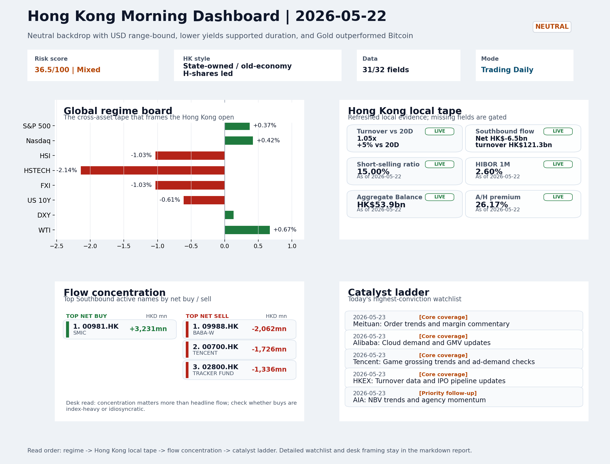
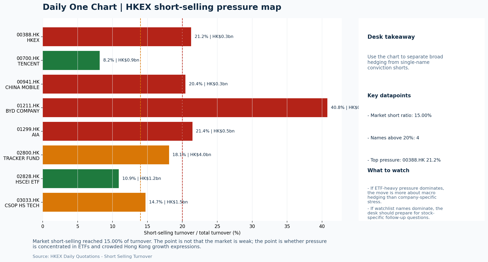

# Morning Research Workbench | 2026-05-23

> Designed for a Hong Kong sell-side commute: Layer 1 `Scan`, Layer 2 `Deep Read`, Layer 3 `Thinking`
> Mode: `Trading Daily` | Keep the report execution-oriented: what mattered in the completed session, what can move Hong Kong leadership, and what needs fast follow-up.
> Briefing date: `2026-05-23` | Review date: `2026-05-22` | Global request: `2026-05-22` | HK/China request: `2026-05-22` | Market effective date: `2026-05-22` | Generated at: `2026-05-23 08:14:31`

## Executive Summary

- **Market pulse:** Intel's -6.33% guidance reset dominated the completed session while copper's +1.97% held the China risk theme, leaving a neutral but copper-reinforced backdrop for Hong Kong's three-day.
- **Hong Kong lens:** Hong Kong growth / internet led. HSTECH -2.14% and HSCEI -1.51% on Thursday set a defensive tone; the Intel guidance reset and neutral global risk regime suggest the open favors SOE/oil over tech.
- **Top catalysts:** INTC -6.33%; Neutral backdrop with USD range-bound, lower yields supported duration, and Gold outperformed Bitcoin.

## Visual Dashboard

## Layer 1 | Scan (5-10 min)

### 1.1 One-Line Market Pulse
Intel's -6.33% guidance reset dominated the completed session while copper's +1.97% held the China risk theme, leaving a neutral but copper-reinforced backdrop for Hong Kong's three-day weekend close, with HSTECH lagging confirming defensive leadership into the weekend break.

### 1.2 Global Asset Price Dashboard

| Asset | Last | 1D move | Read |
| --- | --- | --- | --- |
| S&P 500 | 7,473.47 | +0.37% | US large-cap risk appetite |
| Nasdaq 100 | 29,481.64 | +0.42% | Growth and duration leadership |
| Hang Seng Index | 25,386.52 | -1.03% | Hong Kong broad beta |
| Hang Seng TECH | 4.6680 | **-2.14%** | Hong Kong growth / platform read-through |
| CSI 300 | 4,783.10 | -1.39% | Mainland large-cap tone |
| US 10Y | 4.5580 | -0.61% | Global discount-rate anchor |
| China 10Y | 1.75% | +0.7bp | China local rates anchor \| Live public \| Eastmoney \| 2026-05-22 |
| CN-US 10Y spread | -280.8bp | +1.7bp | Relative carry and macro-pressure gauge \| Live public \| Eastmoney \| 2026-05-22 |
| DXY | 99.32 | +0.13% | Dollar liquidity impulse |
| USD/CNH | 6.7885 | -0.04% | Offshore China risk appetite |
| USD/HKD | 7.8339 | +0.03% | Linked-exchange regime stress check |
| Brent crude | 103.94 | +1.33% | Energy / geopolitics |
| COMEX gold | 4,510.50 | -0.65% | Hedge demand / real yields |
| Copper | 6.3805 | **+1.97%** | Global growth proxy |
| VIX | 16.70 | -0.36% | US stress barometer |

### 1.3 Hong Kong Key Data Quick Check

| Check | Value | Status | Source / as of | Why it matters |
| --- | --- | --- | --- | --- |
| Main Board turnover vs 20D | 1.05x \| +5% vs 20D | Live local | HKEX \| 2026-05-22 | Trailing 20-session average turnover was HK$266.9bn. |
| Southbound / Northbound net flow | Southbound Net HK$-6.5bn \| turnover HK$121.3bn \| Northbound Turnover HK$332.6bn \| net not reported | Live local | HKEX Connect \| 2026-05-22 | Southbound net buy is calculated from HKEX disclosed buy and sell turnover. |
| Short-selling ratio | 15.00% | Live local | HKEX \| 2026-05-22 | Official HKEX stock-level short-selling table, aggregated as a share of total market turnover. |
| AH premium index | 26.17% | Live public | Yahoo \| 2026-05-22 | Simple average across 17 A/H pairs; use dispersion rather than the average alone. |
| USD/HKD spot vs band | 7.8339 \| band 7.7500 to 7.8500 | Live quote + local | Yahoo \| 2026-05-22 | Inside the linked-exchange band without immediate boundary stress. Official Convertibility Undertakings define the linked-rate stress boundaries for USD/HKD. |
| HIBOR 1M | 2.60% | Live local | HKMA \| 2026-05-22 | 1M HIBOR is the cleanest quick read for Hong Kong funding conditions and equity-duration pressure. |
| Aggregate Balance | HK$53.9bn | Live local | HKMA \| 2026-05-22 | Aggregate Balance helps frame whether linked-rate liquidity conditions are tight or comfortable. |
| Hong Kong leadership | Hong Kong growth / internet led | Proxy | HSI / HSCEI / HSTECH relative perf \| 2026-05-22 | Use HSI / HSCEI / HSTECH relative moves as the opening style read. |

### 1.4 Risk Dashboard
**Composite risk score:** `36.5/100` | **Regime:** `Mixed`

| Component | Score impact | Evidence |
| --- | --- | --- |
| US beta | +2.2 | S&P 500 +0.37% |
| HK growth | -10 | HSTECH -2.14% |
| Offshore China proxy | -5.2 | FXI -1.03% |
| Dollar pressure | -1.3 | DXY +0.13% |
| Volatility | +0.7 | VIX -0.36% |
| HK short-selling | +0 | Short-selling ratio 15.00% |

### 1.5 Morning Checklist
1. **INTC -6.33%**
 Mover attribution | Announcement / expectations | Guidance reset and margin pressure
2. **Neutral backdrop with USD range-bound, lower yields supported duration, and Gold outperformed Bitcoin**
 Overnight regime | Start by deciding whether the day is about Neutral conditions or a style pivot.
3. **CPI MoM (Released)**
 Macro / policy | Rates expectations, the dollar, and growth-equity valuation | Industries: Technology, Internet, Brokers
4. **Trade Balance (Released)**
 Macro / policy | Watch whether it changes the day's core market narrative | Industries: Market-wide
5. **Retail Sales MoM (Upcoming)**
 Macro / policy | Consumer resilience, growth expectations, and risk-asset pricing | Industries: Consumer, E-commerce, Consumer discretionary

## Layer 2 | Deep Read (20-30 min)

### 2.1 Overnight Overseas Market Review
#### Market Setup
**Core tape.** US equities closed modestly higher as lower yields supported growth and duration, but the session was dominated by Intel's 6.33% guidance reset, which weighs on semiconductor sentiment broadly.
**Main driver.** Euro Stoxx fell on mixed European data while gold held its ground against bitcoin's decline, confirming the neutral risk regime.
**HK relevance.** USD was range-bound with a modest positive bias given the stable CPI print and no narrative shift from Trade Balance data.

#### Key Drivers
- Intel guidance reset (attribution score 108) is the dominant single-stock driver.
- US 10Y yield -0.61% helped Nasdaq outperform S&P, supporting duration-sensitive names.
- CPI as expected anchors Fed rate expectations; Trade Balance adds no new macro narrative, keeping the macro backdrop stable but not bullish.
- Gold outperformed Bitcoin by ~1.6pct, confirming a neutral-not-risk-on regime where safe-haven demand replaces growth momentum.

#### Hong Kong Read-Through
**Desk lens.** State-owned / old-economy H-shares led.
**Opening implication.** HSTECH -2.14% and HSCEI -1.51% on Thursday set a defensive tone.
- **Cross-market read:** Hang Seng -1.03% / HSCEI -1.51% / HSTECH -2.14%.
- **Cross-market read:** Offshore China proxy FXI -1.03% and USD/CNH -0.04% frame cross-border risk appetite.
- **Cross-market read:** USD/HKD last traded around 7.8339, which keeps the Hong Kong funding lens in focus.

#### Watch Points
- USD composite moved higher by +0.12pct intraday, with a 0.139pct range.
- Main turning points appeared around 2026-05-22 08:05 trough / 2026-05-22 08:20 trough / 2026-05-22 08:45 trough, suggesting event-driven repricing.
- The biggest cross-asset divergence was Gold versus Bitcoin, a spread of 1.632pct.
- Gold moved -0.42pct intraday with a 0.912pct high-low range.

**Curated overnight stories**
1. **INTC falls 6.33% on guidance reset and margin pressure**
 Why it matters: Intel issued a guidance revision signaling demand softness or margin compression, which weighs on semiconductor sentiment more broadly.
 HK read-through: Relevant for Hong Kong tech and semiconductor-linked names; could pressure the Hang Seng Tech Index on Monday given offshore-listed Chinese tech often moves with US sector.
2. **CPI MoM data released; dollar and rates expectations remain anchored**
 Why it matters: May inflation data came in as expected, keeping Federal Reserve rate-cut timing unchanged. This sustained the neutral macro backdrop where lower yields support duration.
 HK read-through: Constructive for Hong Kong interest rate-sensitive sectors (REITs, utilities) and reduces pressure on growth-equity valuations.
3. **Trade Balance released; no narrative shift**
 Why it matters: Trade data did not materially alter the market's macro framing. US trade deficit dynamics remain secondary to rate and inflation signals for near-term equity pricing.
 HK read-through: Market-wide relevance is contained; no immediate read-through for China-exports or HK-reexport plays. Watch if subsequent data revisions change the picture.
4. **Gold outperforms Bitcoin; neutral risk regime confirmed**
 Why it matters: The overnight regime note confirms risk appetite is neither risk-on nor risk-off. Gold's strength reflects uncertainty hedging rather than growth optimism.
 HK read-through: Suggests Hong Kong growth and consumer discretionary names lack strong momentum triggers. Safe-haven flows to gold-linked HK-listed miners or gold stocks.
5. **U.S. pushes AI in China and Asia after Trump-Xi meeting**
 Why it matters: US AI policy is expanding into China and Asia markets, which may affect technology supply chains, cloud competition, and AI-related capital flows.
 HK read-through: Longer-term relevance for Hong Kong-listed tech and AI-adjacent firms. Could frame sentiment on China tech policy direction when markets reopen.

### 2.2 Hong Kong / A-share Previous-Day Review
#### Local Tape Setup
**Local read.** HSTECH underperformed both HSI (-1.03%) and HSCEI (-1.51%) on Thursday, confirming that the US yield drop and neutral macro backdrop did not rotate into Hong Kong growth.
**Verification point.** Southbound Stock Connect saw HK$6.5bn net selling, with KWEB outflow (volume ratio 1.61x) and 3033.HK outflow (volume ratio 1.25x) aligned.
**Risk to watch.** Northbound turnover RMB332.6bn is available, but net-buy attribution is unavailable, limiting full cross-market confirmation.

#### Style and Local Leadership
**Style leadership.** Hong Kong growth / internet led.
- **Cross-market read:** Hang Seng -1.03% / HSCEI -1.51% / HSTECH -2.14%.
- **Cross-market read:** Offshore China proxy FXI -1.03% and USD/CNH -0.04% frame cross-border risk appetite.
- **Cross-market read:** USD/HKD last traded around 7.8339, which keeps the Hong Kong funding lens in focus.

#### Flow Confirmation
Official Stock Connect evidence is available; use Section 2.3 to confirm whether local money supports the price action.

#### Follow-Through Checklist
**Follow-through check.** Watch HSTECH vs HSCEI spread on any Monday bounce.

### 2.3 Flow Tracker and Attribution
#### Cross-Asset Attribution v1

| Driver | Direction | Score | Evidence | HK implication |
| --- | --- | --- | --- | --- |
| Rates impulse | supportive | 0.73 | US 10Y yield proxy moved -0.61%. | Lower yields help long-duration growth; higher yields pressure valuation-sensitive |

#### Flow Tracker
##### Flow Takeaways
- Local flow evidence is not yet strong enough to override the cross-asset setup.
- Stock Connect Southbound: net HK$-6.5bn on turnover HK$121.3bn (as of 2026-05-22).
- Stock Connect Northbound: turnover RMB332.6bn; public file provides total turnover/top active names, not full net-buy.
- AH premium: simple covered-pair average +26.17%; widest premium: China Communications Construction 66.84%.

##### Stock Connect Southbound Active Names

| Rank | Ticker | Name | Buy | Sell | Net buy |
| --- | --- | --- | --- | --- | --- |
| 1 | 00981.HK | SMIC | HK$7,939.3mn | HK$4,708.3mn | HK$3,231.0mn |
| 3 | 09988.HK | BABA-W | HK$1,312.2mn | HK$3,374.2mn | HK$-2,062.0mn |
| 2 | 00700.HK | TENCENT | HK$1,824.8mn | HK$3,551.2mn | HK$-1,726.4mn |
| 7 | 02800.HK | TRACKER FUND | HK$224.4mn | HK$1,560.6mn | HK$-1,336.1mn |
| 9 | 02828.HK | HSCEI ETF | HK$173.4mn | HK$1,445.8mn | HK$-1,272.4mn |

##### AH Premium Dispersion

| Name | A ticker | H ticker | Premium | As of |
| --- | --- | --- | --- | --- |
| China Communications Construction | 601800.SS | 1800.HK | +66.84% | 2026-05-22 |
| China Railway | 601390.SS | 0390.HK | +55.79% | 2026-05-22 |
| China Railway Construction | 601186.SS | 1186.HK | +50.17% | 2026-05-22 |
| China Life | 601628.SS | 2628.HK | +34.81% | 2026-05-22 |
| China Construction Bank | 601939.SS | 0939.HK | +32.76% | 2026-05-22 |

##### HKEX Short-Selling Watch

| Ticker | Name | Short ratio | Short turnover | Total turnover |
| --- | --- | --- | --- | --- |
| 00388.HK | HKEX | 21.25% | HK$0.3bn | HK$1.3bn |
| 00700.HK | TENCENT | 8.16% | HK$0.9bn | HK$10.6bn |
| 00941.HK | CHINA MOBILE | 20.44% | HK$0.3bn | HK$1.6bn |
| 01211.HK | BYD COMPANY | 40.78% | HK$0.7bn | HK$1.7bn |
| 01299.HK | AIA | 21.44% | HK$0.5bn | HK$2.3bn |

- **Short-value leaders:** 02800.HK TRACKER FUND (HK$4.0bn); 00992.HK LENOVO GROUP (HK$2.8bn); 03033.HK CSOP HS TECH (HK$1.5bn); 00981.HK SMIC (HK$1.3bn).

### 2.4 Macro and Policy Tracking
**Desk read.** The completed session shows a neutral backdrop where lower US yields (+0.61% decline in the 10Y) are supporting duration assets.

**Market sensitivity.** Hotter-than-expected US CPI (0.3% actual vs 0.2% forecast) initially raised duration pressure.

**HK implication.** China trade balance also beat (USD 85.2bn vs USD 79.0bn forecast), reinforcing the commodity-led risk tone.

**Macro watchpoints**
- US 10Y yield reaction to retail sales data - if the print misses, the rate relief trade extends and growth styles outperform.
- DXY trajectory after Powell's remarks - hawkish language would pressure HKD-linked assets and risk sentiment.
- Whether copper holds above 6.38 and supports China/HK commodity-linked names and Hang Seng tech.
- PBOC liquidity operation sizing - any unexpected injection would reinforce the lower-yield, risk-on framing.

| Time | Region | Event | Status | Desk read |
| --- | --- | --- | --- | --- |
| 20:30 | US | CPI MoM | Released | Impact: Rates expectations, the dollar, and growth-equity valuation \| Attention: 5/5 \| Industries: Technology, Internet, Brokers |
| 09:30 | China | Trade Balance | Released | Impact: Watch whether it changes the day's core market narrative \| Attention: 3/5 \| Industries: Market-wide |
| 20:30 | US | Retail Sales MoM | Upcoming | Impact: Consumer resilience, growth expectations, and risk-asset pricing \| Attention: 5/5 \| Industries: Consumer, E-commerce, Consumer discretionary |
| 09:20 | China | Loan Prime Rate | Upcoming | Impact: Watch whether it changes the day's core market narrative \| Attention: 3/5 \| Industries: Market-wide |
| 22:00 | Federal Reserve | Jerome Powell: Economic outlook remarks | Central bank | Impact: Policy path, liquidity conditions, and cross-asset risk appetite \| Attention: 5/5 \| Industries: Technology, Financials, Gold |
| 10:00 | PBOC | Open Market Operations Desk: Daily liquidity operation window | Central bank | Impact: Policy path, liquidity conditions, and cross-asset risk appetite \| Attention: 3/5 \| Industries: Technology, Financials, Gold |

#### Positioning and Risk Backdrop
- Options activity centered on KWEB Call, with Vol/OI at 1.88x and a bullish bias.
- Put/Call structure shows equity 0.68 / index 1.15, implying Single-stock optimism with index hedging.
- Geopolitics: Middle East | Regional tension remains elevated | Impact: Oil, freight costs, and safe-haven demand
- Geopolitics: US-China | Technology export-control rhetoric remains active | Impact: China internet, semiconductors, and supply chains

### 2.5 Key Company and Sector Events
No high-conviction sector story cleared the main-report relevance gate for this run.

#### HKEX Announcements

| Grade | Ticker | Type | Release time | Title |
| --- | --- | --- | --- | --- |
| A | 00320.HK | Profit warning | 2026-05-22 | Profit warning / alert announcement |
| A | 01402.HK | Profit warning | 2026-05-22 | Profit warning / alert announcement |
| A | 01416.HK | Profit warning | 2026-05-22 | Profit warning / alert announcement |
| A | 02368.HK | Profit warning | 2026-05-22 | Profit warning / alert announcement |
| A | 02863.HK | Profit warning | 2026-05-21 | Profit warning / alert announcement |
| A | 08279.HK | Profit warning | 2026-05-20 | Profit warning / alert announcement |
| A | 00852.HK | Profit warning | 2026-05-19 | Profit warning / alert announcement |
| A | 01953.HK | Profit warning | 2026-05-19 | Profit warning / alert announcement |

#### Earnings / Results Watch

| Ticker | Company | Timing | Expectation framing |
| --- | --- | --- | --- |
| 0700.HK | Tencent Holdings | After Market Close | EPS est. 4.15 HKD \| revenue est. 163.2bn HKD |
| 0388.HK | Hong Kong Exchanges and Clearing | Before Market Open | EPS est. 2.81 HKD \| revenue est. 6.0bn HKD |

#### Rating Changes
- **9988.HK** | Morgan Stanley | Upgrade | Equal Weight -> Overweight | PT 92 -> 105

#### IPO Watch
- IPO and grey-market monitoring is not yet part of the standard production pack.

### 2.6 Today's Core Names
#### Core coverage

| Name | Ticker | Last | 1D | Range position | Morning note |
| --- | --- | --- | --- | --- | --- |
| Meituan | 3690.HK | 81.35 | -0.91% | Mid-range | Positioning is neutral for now, so use it mainly to monitor marginal information changes. |
| Alibaba | 9988.HK | 127.00 | +0.79% | Mid-range | Positioning is neutral for now, so use it mainly to monitor marginal information changes. |

**Recent headlines for Meituan:**
- [Assessing Meituan (SEHK:3690) Valuation After Recent Share Price Weakness And Ongoing Losses](https://finance.yahoo.com/markets/stocks/articles/assessing-meituan-sehk-3690-valuation-151405137.html) (Simply Wall St.)

#### Priority follow-up

| Name | Ticker | Last | 1D | Range position | Morning note |
| --- | --- | --- | --- | --- | --- |
| AIA | 1299.HK | 86.05 | +1.24% | Mid-range | Positioning is neutral for now, so use it mainly to monitor marginal information changes. |
| BYD Company | 1211.HK | 91.60 | +1.16% | Bottom of range | The name sits near the bottom of its recent range and is worth monitoring for a catalyst-led reversal. |

**Recent headlines for AIA:**
- [Is It Too Late To Consider AIA Group (SEHK:1299) After Its 82% One Year Rally?](https://finance.yahoo.com/markets/stocks/articles/too-consider-aia-group-sehk-042100864.html) (Simply Wall St.)

## Layer 3 | Thinking (10-15 min)

### 3.1 Rotating Theme Deep Dive

| Field | Read |
| --- | --- |
| Theme | AI and Compute Chain |
| Angle for the day | Track whether global AI capex, semis, cloud, and server demand are still carrying offshore China internet and hardware sentiment. |

**Theme desk read**
**Core thesis.** The AI and Compute Chain theme remains relevant but faces a nuanced setup heading into Friday's US data.
**Evidence.** Intel's -6.33% guidance reset adds a cautionary signal for semis and compute names, raising the question of whether AI capex momentum can sustain if downstream semiconductor names show margin pressure.
**What to test.** Copper is running +1.97%, which helps sustain the broader risk-on tone, but the neutral backdrop with range-bound USD and lower yields suggests no strong style conviction either way.

**Signals to keep in mind**
- Copper +1.97%: Keep tracking it to confirm whether the core daily narrative is holding.
- WTI crude +0.67%: Keep tracking it to confirm whether the core daily narrative is holding.

**LLM watch items:**
- INTC guidance reset: does the semis weakness spread to cloud capex commentary?
- Copper +1.97%: sustain or reverse - keeps the risk-on tone alive if it holds.
- Tencent at bottom of range (2.1%): watch for reversal signals if game grossing data surprises.
- Futu/regulation headline risk: CSRC crackdown could weigh on Tencent near-term.
- CPI 0.3% vs forecast 0.2%: confirms slightly hotter inflation; USD and rates reaction matters.

**Related names to keep close:**

| Name | Ticker | Bucket | Morning read |
| --- | --- | --- | --- |
| Meituan | 3690.HK | Core coverage | Positioning is neutral for now, so use it mainly to monitor marginal information changes. |
| Alibaba | 9988.HK | Core coverage | Positioning is neutral for now, so use it mainly to monitor marginal information changes. |
| Tencent | 0700.HK | Core coverage | The name sits near the bottom of its recent range and is worth monitoring for a catalyst-led reversal. |
| HKEX | 0388.HK | Core coverage | Positioning is neutral for now, so use it mainly to monitor marginal information changes. |

**Upcoming catalysts tied to the theme:**
- 2026-05-23 | Alibaba: Cloud demand and GMV updates | Key read-through for China consumption, cloud, and platform regulation
- 2026-05-23 | Tencent: Game grossing trends and ad-demand checks | Core offshore China platform proxy for gaming, ads, and AI monetization
- 2026-05-23 | AIA: NBV trends and agency momentum | Read-through for wealth demand, mainland visitor activity, and HK financial sentiment
- 2026-05-23 | Hang Seng TECH ETF: AI narrative shifts and China platform regulation headlines | Fast proxy for Hong Kong internet and growth leadership

### 3.2 Today Ahead and Trading Calendar
- Macro: CPI MoM is the first item to anchor the open and the rates/FX response.
- Corporate / event: Meituan: Order trends and margin commentary is the cleanest same-day catalyst to prepare for.

**Same-day macro docket**

| Time | Country | Event | Status | Detail |
| --- | --- | --- | --- | --- |
| 20:30 | US | CPI MoM | Released | Actual 0.3% / Forecast 0.2% / Prior 0.4% |
| 09:30 | China | Trade Balance | Released | Actual USD 85.2bn / Forecast USD 79.0bn / Prior USD 80.6bn |
| 20:30 | US | Retail Sales MoM | Upcoming | Forecast 0.3% / Prior 0.6% |
| 09:20 | China | Loan Prime Rate | Upcoming | Forecast 3.45% / Prior 3.45% |
| 22:00 | Federal Reserve | Jerome Powell: Economic outlook remarks | Central bank | speech |

**Same-day catalyst list**

| Date | Time | Category | Event | Importance |
| --- | --- | --- | --- | --- |
| 2026-05-23 | | Core coverage | Meituan: Order trends and margin commentary | 3 |
| 2026-05-23 | | Core coverage | Alibaba: Cloud demand and GMV updates | 3 |
| 2026-05-23 | | Core coverage | Tencent: Game grossing trends and ad-demand checks | 3 |
| 2026-05-23 | | Core coverage | HKEX: Turnover data and IPO pipeline updates | 3 |

**Next few sessions**

| Date | Category | Event | Impact |
| --- | --- | --- | --- |
| 2026-05-23 | Core coverage | Meituan: Order trends and margin commentary | High-frequency read on local services demand and platform competition |
| 2026-05-23 | Core coverage | Alibaba: Cloud demand and GMV updates | Key read-through for China consumption, cloud, and platform regulation |
| 2026-05-23 | Core coverage | Tencent: Game grossing trends and ad-demand checks | Core offshore China platform proxy for gaming, ads, and AI monetization |
| 2026-05-23 | Core coverage | HKEX: Turnover data and IPO pipeline updates | Direct proxy for Hong Kong market turnover, listings, and southbound |

### 3.3 Daily One Chart
**Daily One Chart | HKEX short-selling pressure map**

**Chart read.** Market short-selling reached 15.00% of turnover.
**Why it matters.** The point is not that the market is weak; the point is whether pressure is concentrated in ETFs and crowded Hong Kong growth expressions.

_Source: HKEX Daily Quotations - Short Selling Turnover_

## Traceable Appendix

### Report Metadata
> Date policy: Review date 2026-05-22 is treated as `Trading Daily`. | Global request date is 2026-05-22; adapter effective date is 2026-05-22 and summary date is 2026-05-22. | HK/China local data date is 2026-05-22; role: same-session local cash tape.
> Market data quality: Coverage: `31/32` | Missing: `1`
> Report quality: `92.6/100` | Grade `A` | Status `production ready`

### Key Questions to Keep in Mind
- Is risk appetite rising or fading? The overnight tape reads closer to `Neutral`.
- Did rates expectations move? Focus on whether US 10Y, DXY, and growth style moved together.
- Were commodities the real story? Watch WTI and gold for geopolitics versus inflation signals.
- Is Hong Kong setup internet-led, SOE-led, or broad beta-led? Compare HSTECH, HSCEI, and HSI.
- Did offshore markets move China risk appetite? Focus on HSI, FXI, USD/CNH, and USD/HKD.

### Report Quality and Validation
- **Quality score:** 92.6/100 | **Grade:** A | **Status:** production ready
- **Run summary:** 7 healthy | 1 caveat | 0 failed
- **Release recommendation:** Send with caveats | The report is usable, but the advisory guidance should travel with it so readers understand the data gaps.

| Source | Status | Bucket |
| --- | --- | --- |
| Market data | ok | healthy |
| Sector and company news | ok | healthy |
| Movers and short selling | ok | healthy |
| Stock Connect | ok | healthy |
| A/H premium | ok | healthy |
| Hong Kong local package | ok | healthy |
| China rates | ok | healthy |
| Narrative overlay | partial | caveat |

**Desk-use guidance summary:** 0 blocking | 1 advisory

**Desk-use guidance**
- **Advisory:** Use deterministic sections as primary support; the narrative overlay was partial or unavailable on this run.

| Component | Score | Weight | Read |
| --- | --- | --- | --- |
| Market data coverage | 96.9 | 0.3 | 31/32 core market fields available. |
| Hong Kong local metrics | 82.3 | 0.25 | 8 live, 3 proxy, 0 unavailable local checks. |
| Key public adapters | 100.0 | 0.2 | 4/4 key adapters were available or partially available. |
| Narrative overlay health | 85.7 | 0.15 | 6/7 narrative overlay tasks succeeded or used validated cache; 1 error(s). |
| Fact-check guardrail | 100.0 | 0.1 | Checked 0 numeric claims; 0 numeric mismatch(es), 0 logic warning(s); 0 critical, 0 review. |

**Narrative fact-check guardrail**
- Checked 0 numeric claims; 0 numeric mismatch(es), 0 logic warning(s); 0 critical, 0 review.

**Adapter status**

| Adapter | Status |
| --- | --- |
| Stock Connect | ok |
| A/H premium | ok |
| HKEX announcements | ok |
| China rates | ok |

### Source Links
- [Assessing Meituan (SEHK:3690) Valuation After Recent Share Price Weakness And Ongoing Losses](https://finance.yahoo.com/markets/stocks/articles/assessing-meituan-sehk-3690-valuation-151405137.html) (Simply Wall St.)
- [Alibaba, U.S.-Listed Chinese Stocks Fall On Cross-Border Crackdown; Futu Crashes](https://www.investors.com/news/alibaba-stock-chinese-adrs-cross-border-trading-futu-tigr/?src=A00220&yptr=yahoo) (Investor's Business Daily)
- [Is It Too Late To Consider AIA Group (SEHK:1299) After Its 82% One Year Rally?](https://finance.yahoo.com/markets/stocks/articles/too-consider-aia-group-sehk-042100864.html) (Simply Wall St.)
- [China Mobile (SEHK:941): A Closer Look at Valuation After Steady Share Price Gains This Year](https://finance.yahoo.com/news/china-mobile-sehk-941-closer-154022664.html) (Simply Wall St.)
- [00320.HK Profit warning / alert announcement](http://www1.hkexnews.hk/listedco/listconews/sehk/2026/0522/2026052200416.pdf) (HKEXnews)
- [01402.HK Profit warning / alert announcement](http://www1.hkexnews.hk/listedco/listconews/sehk/2026/0522/2026052201114.pdf) (HKEXnews)
- [01416.HK Profit warning / alert announcement](http://www1.hkexnews.hk/listedco/listconews/sehk/2026/0522/2026052200823.pdf) (HKEXnews)
- [02368.HK Profit warning / alert announcement](http://www1.hkexnews.hk/listedco/listconews/sehk/2026/0522/2026052200502.pdf) (HKEXnews)
- [02863.HK Profit warning / alert announcement](http://www1.hkexnews.hk/listedco/listconews/sehk/2026/0521/2026052101268.pdf) (HKEXnews)
- [08279.HK Profit warning / alert announcement](http://www1.hkexnews.hk/listedco/listconews/gem/2026/0520/2026052000807.pdf) (HKEXnews)
- [00852.HK Profit warning / alert announcement](http://www1.hkexnews.hk/listedco/listconews/sehk/2026/0519/2026051901269.pdf) (HKEXnews)
- [01953.HK Profit warning / alert announcement](http://www1.hkexnews.hk/listedco/listconews/sehk/2026/0519/2026051901077.pdf) (HKEXnews)

## Supplementary Visual Appendix

This appendix is professional-path only. It keeps a traceable index of the report visuals and the deterministic chart cues used to frame the morning note, without injecting the legacy intraday chart pack.

### Visual Index

| Visual | Path | Role |
| --- | --- | --- |
| Visual Dashboard | `charts/dashboard_2026-05-23.png` | Cross-asset regime board and Hong Kong local tape snapshot. |
| Daily One Chart | `charts/daily_one_chart_2026-05-23.png` | Single highest-conviction visual story for the day. |

### Deterministic Chart Cues
- FX / liquidity: USD composite moved higher by +0.12pct intraday, with a 0.139pct range.
- FX / liquidity: Main turning points appeared around 2026-05-22 08:05 trough / 2026-05-22 08:20 trough / 2026-05-22 08:45 trough, suggesting event-driven repricing rather than a clean one-way USD move.
- Cross-asset: The biggest cross-asset divergence was Gold versus Bitcoin, a spread of 1.632pct.
- Cross-asset: Gold moved -0.42pct intraday with a 0.912pct high-low range.
- Cross-asset: Oil moved -0.44pct intraday with a 4.29pct high-low range.
- Cross-asset: Bitcoin moved -2.05pct intraday with a 2.799pct high-low range.

### Risk Dashboard Components

| Component | Score impact | Evidence |
| --- | --- | --- |
| US beta | +2.2 | S&P 500 +0.37% |
| HK growth | -10 | HSTECH -2.14% |
| Offshore China proxy | -5.2 | FXI -1.03% |
| Dollar pressure | -1.3 | DXY +0.13% |
| Volatility | +0.7 | VIX -0.36% |
| HK short-selling | +0 | Short-selling ratio 15.00% |
