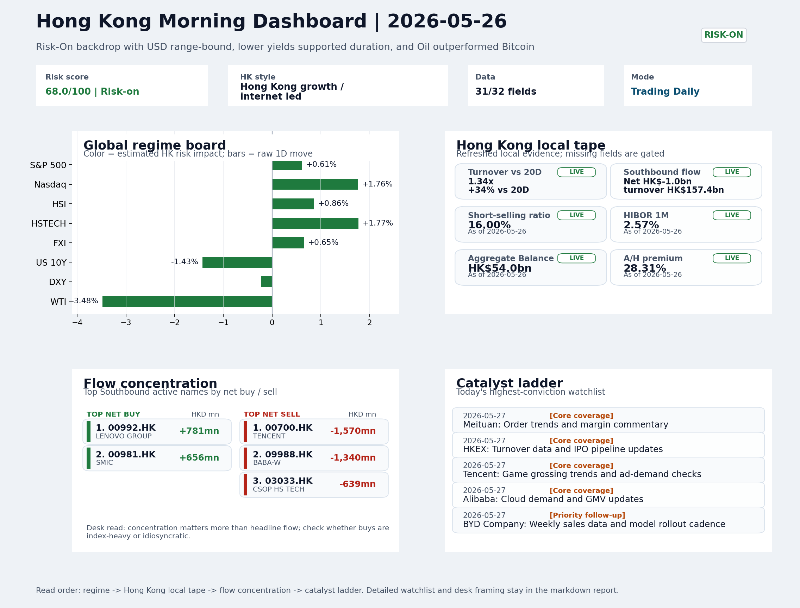
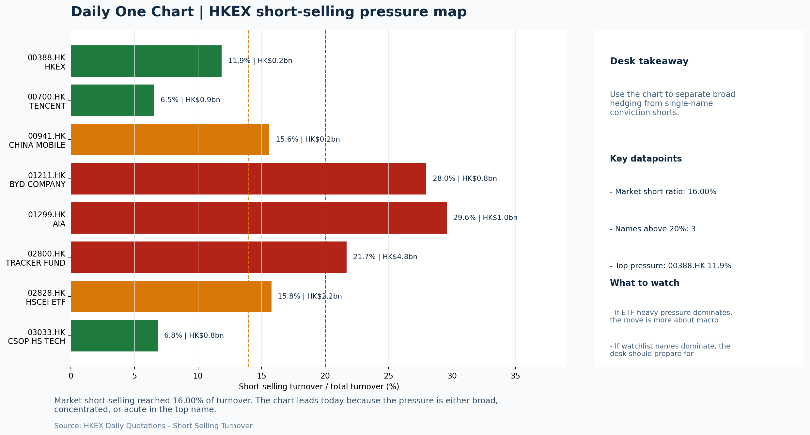

# Morning Research Workbench | 2026-05-27

> Designed for a Hong Kong sell-side commute: Layer 1 `Scan`, Layer 2 `Deep Read`, Layer 3 `Thinking`
> Mode: `Trading Daily` | Keep the report execution-oriented: what mattered in the completed session, what can move Hong Kong leadership, and what needs fast follow-up.
> Briefing date: `2026-05-27` | Review date: `2026-05-26` | Global request: `2026-05-26` | HK/China request: `2026-05-26` | Market effective date: `2026-05-26` | Generated at: `2026-05-27 08:17:05`

## Executive Summary

- **Market pulse:** The Nasdaq 100's +1.76% overnight gain transmitted cleanly into Hong Kong growth proxies with HSTECH outperforming HSCEI and Main Board turnover at 1.34x the 20-day average confirming.
- **Hong Kong lens:** Hong Kong growth / internet led. A constructive open is more credible if HSTECH and FXI confirm the Nasdaq-led growth leg at the open.
- **Top catalysts:** INTC -6.33%; Risk-On backdrop with USD range-bound, lower yields supported duration, and Oil outperformed Bitcoin.

## Visual Dashboard

## Layer 1 | Scan (5-10 min)

### 1.1 One-Line Market Pulse
The Nasdaq 100's +1.76% overnight gain transmitted cleanly into Hong Kong growth proxies with HSTECH outperforming HSCEI and Main Board turnover at 1.34x the 20-day average confirming breadth, but a hotter-than-expected US CPI (+0.3% MoM vs 0.2% forecast) and Intel's -6.33% guidance cut introduce near-term caution for the growth-led Risk-On thesis.

### 1.2 Global Asset Price Dashboard

| Asset | Last | 1D move | Read |
| --- | --- | --- | --- |
| S&P 500 | 7,519.12 | +0.61% | US large-cap risk appetite |
| Nasdaq 100 | 30,001.32 | **+1.76%** | Growth and duration leadership |
| Hang Seng Index | 25,606.03 | +0.86% | Hong Kong broad beta |
| Hang Seng TECH | 4.8400 | **+1.77%** | Hong Kong growth / platform read-through |
| CSI 300 | 4,921.60 | **+1.58%** | Mainland large-cap tone |
| US 10Y | 4.4930 | -1.43% | Global discount-rate anchor |
| China 10Y | 1.74% | -0.8bp | China local rates anchor \| Live public \| Eastmoney \| 2026-05-26 |
| CN-US 10Y spread | -275.9bp | | Relative carry and macro-pressure gauge \| Live public \| Eastmoney \| 2026-05-26 |
| DXY | 99.09 | -0.23% | Dollar liquidity impulse |
| USD/CNH | 6.7745 | -0.18% | Offshore China risk appetite |
| USD/HKD | 7.8343 | -0.01% | Linked-exchange regime stress check |
| Brent crude | 96.33 | **-6.96%** | Energy / geopolitics |
| COMEX gold | 4,521.70 | +0.02% | Hedge demand / real yields |
| Copper | 6.4425 | **+1.58%** | Global growth proxy |
| VIX | 17.01 | **+2.53%** | US stress barometer |

### 1.3 Hong Kong Key Data Quick Check

| Check | Value | Status | Source / as of | Why it matters |
| --- | --- | --- | --- | --- |
| Main Board turnover vs 20D | 1.34x \| +34% vs 20D | Live local | HKEX \| 2026-05-26 | Trailing 20-session average turnover was HK$268.2bn. |
| Southbound / Northbound net flow | Southbound Net HK$-1.0bn \| turnover HK$157.4bn \| Northbound Turnover HK$394.7bn \| net not reported | Live local | HKEX Connect \| 2026-05-26 | Southbound net buy is calculated from HKEX disclosed buy and sell turnover. |
| Short-selling ratio | 16.00% | Live local | HKEX \| 2026-05-26 | Official HKEX stock-level short-selling table, aggregated as a share of total market turnover. |
| AH premium index | 28.31% | Live public | Yahoo \| 2026-05-26 | Simple average across 16 A/H pairs; use dispersion rather than the average alone. |
| USD/HKD spot vs band | 7.8343 \| band 7.7500 to 7.8500 | Live quote + local | Yahoo \| 2026-05-26 | Inside the linked-exchange band without immediate boundary stress. Official Convertibility Undertakings define the linked-rate stress boundaries for USD/HKD. |
| HIBOR 1M | 2.57% | Live local | HKMA \| 2026-05-26 | 1M HIBOR is the cleanest quick read for Hong Kong funding conditions and equity-duration pressure. |
| Aggregate Balance | HK$54.0bn | Live local | HKMA \| 2026-05-26 | Aggregate Balance helps frame whether linked-rate liquidity conditions are tight or comfortable. |
| Hong Kong leadership | Hong Kong growth / internet led | Proxy | HSI / HSCEI / HSTECH relative perf \| 2026-05-26 | Use HSI / HSCEI / HSTECH relative moves as the opening style read. |

### 1.4 Risk Dashboard
**Composite risk score:** `68.0/100` | **Regime:** `Risk-on`

| Component | Score impact | Evidence |
| --- | --- | --- |
| US beta | +3.7 | S&P 500 +0.61% |
| HK growth | +8.8 | HSTECH +1.77% |
| Offshore China proxy | +3.2 | FXI +0.65% |
| Dollar pressure | +2.3 | DXY -0.23% |
| Volatility | -5.1 | VIX +2.53% |
| HK short-selling | +0 | Short-selling ratio 16.00% |

### 1.5 Morning Checklist
1. **INTC -6.33%**
 Mover attribution | Announcement / expectations | Guidance reset and margin pressure
2. **Risk-On backdrop with USD range-bound, lower yields supported duration, and Oil outperformed Bitcoin**
 Overnight regime | Start by deciding whether the day is about Risk-On conditions or a style pivot.
3. **CPI MoM (Released)**
 Macro / policy | Rates expectations, the dollar, and growth-equity valuation | Industries: Technology, Internet, Brokers
4. **Trade Balance (Released)**
 Macro / policy | Watch whether it changes the day's core market narrative | Industries: Market-wide
5. **Retail Sales MoM (Upcoming)**
 Macro / policy | Consumer resilience, growth expectations, and risk-asset pricing | Industries: Consumer, E-commerce, Consumer discretionary

## Layer 2 | Deep Read (20-30 min)

### 2.1 Overnight Overseas Market Review
#### Market Setup
**Core tape.** Global equities extended gains on lower US yields and a weaker dollar, with the Nasdaq 100 (+1.76%) leading on growth-style leadership that filtered into Hong Kong growth names.
**Main driver.** The Hang Seng (+0.86%) and HSTECH (+1.77%) held their risk-on tone despite oil's sharp -3.48% drop, suggesting that cyclical-energy selling was not contagious to broader risk appetite.
**HK relevance.** Offshore China proxy FXI (+0.65%) and a calmer USD/CNH (-0.18%) together indicate that the move is cross-asset rather than narrow US mega-cap only.

#### Key Drivers
- Nasdaq 100 +1.76% transmitted to Hong Kong tech/growth proxies via duration-sensitive sectors and platform names.
- US 10Y yield -1.43% lowered discount-rate pressure on long-duration growth, supporting tech multiples in a lower-rate environment.
- USD/CNH -0.18% and DXY -0.23% eased offshore China sentiment and reduced cross-border funding stress for HK equities.
- WTI crude -3.48% was the main divergence asset.

#### Hong Kong Read-Through
**Desk lens.** Hong Kong growth / internet led.
**Opening implication.** A constructive open is more credible if HSTECH and FXI confirm the Nasdaq-led growth leg at the open; oil-related pressure on energy and airline names should be monitored but is not the dominant signal.
- **Cross-market read:** Hang Seng +0.86% / HSCEI +0.89% / HSTECH +1.77%.
- **Cross-market read:** Offshore China proxy FXI +0.65% and USD/CNH -0.18% frame cross-border risk appetite.
- **Cross-market read:** USD/HKD last traded around 7.8343, which keeps the Hong Kong funding lens in focus.

#### Watch Points
- USD composite moved higher by +0.05pct intraday, with a 0.135pct range.
- Main turning points appeared around 2026-05-26 08:20 peak / 2026-05-26 08:35 peak / 2026-05-26 08:50 peak, suggesting event-driven repricing rather.
- The biggest cross-asset divergence was Oil versus Bitcoin, a spread of 3.558pct.
- Gold moved -0.47pct intraday with a 1.2pct high-low range.

**Curated overnight stories**
1. **Huawei plans new smartphone chips this fall as rivalry with Nvidia and Apple heats up**
 Why it matters: Signals accelerated China tech self-sufficiency in advanced chips, intensifying competitive pressure on Western semiconductor peers and reinforcing the AI compute divide.
 HK read-through: Directly relevant for HK-listed tech hardware and semiconductor names; supports China tech self-reliance thematic but may weigh on offshore China sentiment if escalation.
2. **INTC -6.33%: Guidance reset and margin pressure**
 Why it matters: Large guidance cut signals deeper structural challenges in the CPU/AI chip space, with downstream effects on server demand and enterprise spending estimates.
 HK read-through: Contagion risk for HK semiconductor and AI-infrastructure adjacents; if the sell-off continues, could pressure the tech/growth leg within HSI.
3. **Piper Sandler says Strait of Hormuz to remain closed for months and oil to hit new highs**
 Why it matters: Sustained oil supply shock would reprice energy inflation, complicate Fed rate path, and raise input costs for Asia industrials and airlines.
 HK read-through: Positive for energy names (CNOOC, PetroChina), negative for margin-sensitive users; oil-linked ETP and commodities desks should flag for clients.
4. **Three signs from APEC that the U.S. and China remain far apart on trade**
 Why it matters: Reinforces the structural trade friction theme; any tariff escalation or tech export tightening would directly hit China export-oriented sectors.
 HK read-through: Persistent headwind for HK/China macro sentiment and export-linked names; keeps hedging demand elevated for China equities.
5. **Micron's stock reaches a major milestone as UBS slaps on an out-of-sight price target**
 Why it matters: Memory cycle recovery narrative gains institutional endorsement; enhanced long-term agreements support earnings visibility for the memory sector.
 HK read-through: Positive read-through for SK Hynix exposure via HK synthetics and Korea-linked ETFs; reinforces tech/duration support within growth portfolios.

### 2.2 Hong Kong / A-share Previous-Day Review
#### Local Tape Setup
**Local read.** Hong Kong's May 26 session closed with clear growth-style leadership: HSTECH +1.77% vs. HSCEI +0.89%, tracking the Nasdaq 100's +1.76% overnight move while USD/CNH stayed stable at -0.18%.
**Verification point.** Main Board turnover ran at 1.34x the 20-day average and short-selling stayed at 16%, making the local tape credible; Southbound netted a marginal HK$-0.97bn outflow, which is not large enough to derail the risk-on read.

#### Style and Local Leadership
**Style leadership.** Hong Kong growth / internet led.
- **Cross-market read:** Hang Seng +0.86% / HSCEI +0.89% / HSTECH +1.77%.
- **Cross-market read:** Offshore China proxy FXI +0.65% and USD/CNH -0.18% frame cross-border risk appetite.
- **Cross-market read:** USD/HKD last traded around 7.8343, which keeps the Hong Kong funding lens in focus.

#### Flow Confirmation
Official Stock Connect evidence is available; use Section 2.3 to confirm whether local money supports the price action.

#### Follow-Through Checklist
**Follow-through check.** Watch whether CSI 300 and the FXI offshore proxy confirm the same growth-style thrust. Southbound net flow stability is needed; Northbound net-buy data is absent, so cross-market flow confirmation is incomplete.

### 2.3 Flow Tracker and Attribution
#### Cross-Asset Attribution v1

| Driver | Direction | Score | Evidence | HK implication |
| --- | --- | --- | --- | --- |
| Oil and geopolitics | supportive | 5.57 | Oil moved -6.96%. | Split the read between energy/cyclicals support and margin/geopolitical pressure. |
| Hong Kong participation | supportive | 3.4 | Main Board turnover was 1.34x the 20-session average. | Higher participation makes local price action more credible. |
| US growth-style transmission | supportive | 2.46 | Nasdaq 100 moved +1.76%. | Hong Kong growth and platform names should be tested first at the open. |
| Rates impulse | supportive | 1.72 | US 10Y yield proxy moved -1.43%. | Lower yields help long-duration growth; higher yields pressure valuation-sensitive |

#### Flow Tracker
##### Flow Takeaways
- Hong Kong participation is active and short pressure is not excessive, so local confirmation looks healthier.
- Stock Connect Southbound: net HK$-1.0bn on turnover HK$157.4bn (as of 2026-05-26).
- Stock Connect Northbound: turnover RMB394.7bn; public file provides total turnover/top active names, not full net-buy.
- AH premium: simple covered-pair average +28.31%; widest premium: China Railway 55.02%.

##### Stock Connect Southbound Active Names

| Rank | Ticker | Name | Buy | Sell | Net buy |
| --- | --- | --- | --- | --- | --- |
| 4 | 00700.HK | TENCENT | HK$2,202.3mn | HK$3,772.3mn | HK$-1,570.0mn |
| 3 | 09988.HK | BABA-W | HK$1,994.7mn | HK$3,334.9mn | HK$-1,340.2mn |
| 8 | 00992.HK | LENOVO GROUP | HK$1,844.7mn | HK$1,064.1mn | HK$780.6mn |
| 1 | 00981.HK | SMIC | HK$11,886.2mn | HK$11,230.5mn | HK$655.8mn |
| 10 | 03033.HK | CSOP HS TECH | HK$66.5mn | HK$705.1mn | HK$-638.6mn |

##### AH Premium Dispersion

| Name | A ticker | H ticker | Premium | As of |
| --- | --- | --- | --- | --- |
| China Railway | 601390.SS | 0390.HK | +55.02% | 2026-05-26 |
| China Railway Construction | 601186.SS | 1186.HK | +51.97% | 2026-05-26 |
| China Communications Construction | 601800.SS | 1800.HK | +51.01% | 2026-05-26 |
| New China Life | 601336.SS | 1336.HK | +40.75% | 2026-05-26 |
| China Construction Bank | 601939.SS | 0939.HK | +36.16% | 2026-05-26 |

##### HKEX Short-Selling Watch

| Ticker | Name | Short ratio | Short turnover | Total turnover |
| --- | --- | --- | --- | --- |
| 00388.HK | HKEX | 11.87% | HK$0.2bn | HK$1.8bn |
| 00700.HK | TENCENT | 6.55% | HK$0.9bn | HK$14.3bn |
| 00941.HK | CHINA MOBILE | 15.62% | HK$0.2bn | HK$1.3bn |
| 01211.HK | BYD COMPANY | 27.97% | HK$0.8bn | HK$3.0bn |
| 01299.HK | AIA | 29.59% | HK$1.0bn | HK$3.2bn |

- **Short-value leaders:** 02800.HK TRACKER FUND (HK$4.8bn); 00981.HK SMIC (HK$3.5bn); 00992.HK LENOVO GROUP (HK$2.8bn); 01347.HK HUA HONG SEMI (HK$2.3bn).

### 2.4 Macro and Policy Tracking
**Desk read.** The macro calendar remains dense.

**Market sensitivity.** The US May CPI print (0.3% MoM vs 0.2% forecast) already injects a hawkish rates impulse that can challenge the duration-supportive, Risk-On backdrop.

**HK implication.** China's trade surplus beat (USD 85.2bn vs 79.0bn expected) offers a modest offset to external demand worries but has yet to reprice the local growth proxy.

**Macro watchpoints**
- US 10Y yield and DXY movement after Retail Sales and Powell's remarks.
- HK-listed Technology and Internet names sustaining their opening tone against the hot CPI backdrop.
- Whether China's trade beat translates into cyclical outperformance in local industrials or consumers.
- PBOC Loan Prime Rate deviation from 3.45% forecast.

| Time | Region | Event | Status | Desk read |
| --- | --- | --- | --- | --- |
| 20:30 | US | CPI MoM | Released | Impact: Rates expectations, the dollar, and growth-equity valuation \| Attention: 5/5 \| Industries: Technology, Internet, Brokers |
| 09:30 | China | Trade Balance | Released | Impact: Watch whether it changes the day's core market narrative \| Attention: 3/5 \| Industries: Market-wide |
| 20:30 | US | Retail Sales MoM | Upcoming | Impact: Consumer resilience, growth expectations, and risk-asset pricing \| Attention: 5/5 \| Industries: Consumer, E-commerce, Consumer discretionary |
| 09:20 | China | Loan Prime Rate | Upcoming | Impact: Watch whether it changes the day's core market narrative \| Attention: 3/5 \| Industries: Market-wide |
| 22:00 | Federal Reserve | Jerome Powell: Economic outlook remarks | Central bank | Impact: Policy path, liquidity conditions, and cross-asset risk appetite \| Attention: 5/5 \| Industries: Technology, Financials, Gold |
| 10:00 | PBOC | Open Market Operations Desk: Daily liquidity operation window | Central bank | Impact: Policy path, liquidity conditions, and cross-asset risk appetite \| Attention: 3/5 \| Industries: Technology, Financials, Gold |

#### Positioning and Risk Backdrop
- Options activity centered on KWEB Call, with Vol/OI at 1.88x and a bullish bias.
- Put/Call structure shows equity 0.68 / index 1.15, implying Single-stock optimism with index hedging.
- Geopolitics: Middle East | Regional tension remains elevated | Impact: Oil, freight costs, and safe-haven demand
- Geopolitics: US-China | Technology export-control rhetoric remains active | Impact: China internet, semiconductors, and supply chains

### 2.5 Key Company and Sector Events

| Grade | Sector | Headline | Why it matters | Horizon |
| --- | --- | --- | --- | --- |
| A | Semiconductors and AI | Micron's stock reaches a major milestone as UBS slaps on an | This can directly reshape earnings forecasts and the valuation framework | Short-term catalyst |

#### HKEX Announcements

| Grade | Ticker | Type | Release time | Title |
| --- | --- | --- | --- | --- |
| A | 08168.HK | Profit warning | 2026-05-26 | Profit warning / alert announcement |
| A | 03315.HK | Profit warning | 2026-05-25 | Profit warning / alert announcement |
| A | 00320.HK | Profit warning | 2026-05-22 | Profit warning / alert announcement |
| A | 01402.HK | Profit warning | 2026-05-22 | Profit warning / alert announcement |
| A | 01416.HK | Profit warning | 2026-05-22 | Profit warning / alert announcement |
| A | 02368.HK | Profit warning | 2026-05-22 | Profit warning / alert announcement |
| A | 02863.HK | Profit warning | 2026-05-21 | Profit warning / alert announcement |
| A | 08279.HK | Profit warning | 2026-05-20 | Profit warning / alert announcement |

#### Earnings / Results Watch

| Ticker | Company | Timing | Expectation framing |
| --- | --- | --- | --- |
| 0700.HK | Tencent Holdings | After Market Close | EPS est. 4.15 HKD \| revenue est. 163.2bn HKD |
| 0388.HK | Hong Kong Exchanges and Clearing | Before Market Open | EPS est. 2.81 HKD \| revenue est. 6.0bn HKD |

#### Rating Changes
- **9988.HK** | Morgan Stanley | Upgrade | Equal Weight -> Overweight | PT 92 -> 105

#### IPO Watch
- IPO and grey-market monitoring is not yet part of the standard production pack.

### 2.6 Today's Core Names
#### Core coverage

| Name | Ticker | Last | 1D | Range position | Morning note |
| --- | --- | --- | --- | --- | --- |
| Meituan | 3690.HK | 78.80 | -3.13% | Mid-range | Short-term pressure is visible; check for a fundamental or regulatory reason. |
| HKEX | 0388.HK | 405.60 | -0.88% | Mid-range | Positioning is neutral for now, so use it mainly to monitor marginal information changes. |

**Recent headlines for Meituan:**
- [China Is Moving Quickly to 'Instant Retail.' 3 Stocks to Watch.](https://www.barrons.com/articles/china-instant-delivery-retail-e814ddbe?siteid=yhoof2&yptr=yahoo) (Barrons.com)

#### Priority follow-up

| Name | Ticker | Last | 1D | Range position | Morning note |
| --- | --- | --- | --- | --- | --- |
| BYD Company | 1211.HK | 93.65 | +2.24% | Bottom of range | Short-term price strength is clear; fresh catalysts could trigger broader group follow-through. |
| AIA | 1299.HK | 84.30 | -2.03% | Mid-range | Short-term pressure is visible; check for a fundamental or regulatory reason. |

**Recent headlines for AIA:**
- [Is It Too Late To Consider AIA Group (SEHK:1299) After Its 82% One Year Rally?](https://finance.yahoo.com/markets/stocks/articles/too-consider-aia-group-sehk-042100864.html) (Simply Wall St.)

## Layer 3 | Thinking (10-15 min)

### 3.1 Rotating Theme Deep Dive

| Field | Read |
| --- | --- |
| Theme | Innovative Biotech and Out-Licensing |
| Angle for the day | Watch whether clinical data, approvals, and licensing momentum are still supporting the innovative-healthcare rerating story. |

**Theme desk read**
**Core thesis.** The weekly innovative-biotech theme sits awkwardly against today's deck, where no biotech names appear among the related stocks and the two highlighted names - Meituan and BYD - belong to internet and autos.
**Evidence.** The Risk-On backdrop with lower yields would normally support duration-sensitive healthcare, but the VIX pop and the WTI slide argue for tighter sizing and a more cautious cyclical read.
**What to test.** Until fresh clinical data, approval news, or out-licensing deals surface, the rerating story lacks a tangible local catalyst to act on.

**Signals to keep in mind**
- WTI crude -3.48%: Softer oil argues for a more cautious cyclical-growth read.
- VIX +2.53%: Higher volatility argues for tighter sizing and tighter stops.

**LLM watch items:**
- Watch for any biotech-specific licensing or clinical updates that could bring the theme back into near-term focus.
- Monitor US Retail Sales MoM tonight for consumer resilience signals that may affect risk appetite for growth-equity sectors including healthcare.
- Track the LPR fix today; any easing surprise could support growth-style positioning, including innovative healthcare.

**Related names to keep close:**

| Name | Ticker | Bucket | Morning read |
| --- | --- | --- | --- |
| Meituan | 3690.HK | Core coverage | Short-term pressure is visible; check for a fundamental or regulatory reason. |
| BYD Company | 1211.HK | Priority follow-up | Short-term price strength is clear; fresh catalysts could trigger broader group follow-through. |

### 3.2 Today Ahead and Trading Calendar
- Macro: CPI MoM is the first item to anchor the open and the rates/FX response.
- Corporate / event: Meituan: Order trends and margin commentary is the cleanest same-day catalyst to prepare for.

**Same-day macro docket**

| Time | Country | Event | Status | Detail |
| --- | --- | --- | --- | --- |
| 20:30 | US | CPI MoM | Released | Actual 0.3% / Forecast 0.2% / Prior 0.4% |
| 09:30 | China | Trade Balance | Released | Actual USD 85.2bn / Forecast USD 79.0bn / Prior USD 80.6bn |
| 20:30 | US | Retail Sales MoM | Upcoming | Forecast 0.3% / Prior 0.6% |
| 09:20 | China | Loan Prime Rate | Upcoming | Forecast 3.45% / Prior 3.45% |
| 22:00 | Federal Reserve | Jerome Powell: Economic outlook remarks | Central bank | speech |

**Same-day catalyst list**

| Date | Time | Category | Event | Importance |
| --- | --- | --- | --- | --- |
| 2026-05-27 | | Core coverage | Meituan: Order trends and margin commentary | 3 |
| 2026-05-27 | | Core coverage | HKEX: Turnover data and IPO pipeline updates | 3 |
| 2026-05-27 | | Core coverage | Tencent: Game grossing trends and ad-demand checks | 3 |
| 2026-05-27 | | Core coverage | Alibaba: Cloud demand and GMV updates | 3 |

**Next few sessions**

| Date | Category | Event | Impact |
| --- | --- | --- | --- |
| 2026-05-27 | Core coverage | Meituan: Order trends and margin commentary | High-frequency read on local services demand and platform competition |
| 2026-05-27 | Core coverage | HKEX: Turnover data and IPO pipeline updates | Direct proxy for Hong Kong market turnover, listings, and southbound |
| 2026-05-27 | Core coverage | Tencent: Game grossing trends and ad-demand checks | Core offshore China platform proxy for gaming, ads, and AI monetization |
| 2026-05-27 | Core coverage | Alibaba: Cloud demand and GMV updates | Key read-through for China consumption, cloud, and platform regulation |

### 3.3 Daily One Chart
**Daily One Chart | HKEX short-selling pressure map**

**Chart read.** Market short-selling reached 16.00% of turnover.
**Why it matters.** The chart leads today because the pressure is either broad, concentrated, or acute in the top name.

_Source: HKEX Daily Quotations - Short Selling Turnover_

## Traceable Appendix

### Report Metadata
> Date policy: Review date 2026-05-26 is treated as `Trading Daily`. | Global request date is 2026-05-26; adapter effective date is 2026-05-26 and summary date is 2026-05-26. | HK/China local data date is 2026-05-26; role: same-session local cash tape.
> Market data quality: Coverage: `31/32` | Stale items (>1d): `2` | Missing: `1`
> Report quality: `88.7/100` | Grade `B` | Status `production ready`

### Key Questions to Keep in Mind
- Is risk appetite rising or fading? The overnight tape reads closer to `Risk-On`.
- Did rates expectations move? Focus on whether US 10Y, DXY, and growth style moved together.
- Were commodities the real story? Watch WTI and gold for geopolitics versus inflation signals.
- Is Hong Kong setup internet-led, SOE-led, or broad beta-led? Compare HSTECH, HSCEI, and HSI.
- Did offshore markets move China risk appetite? Focus on HSI, FXI, USD/CNH, and USD/HKD.

### Report Quality and Validation
- **Quality score:** 88.7/100 | **Grade:** B | **Status:** production ready
- **Run summary:** 7 healthy | 1 caveat | 0 failed
- **Release recommendation:** Send with caveats | The report is usable, but the advisory guidance should travel with it so readers understand the data gaps.

| Source | Status | Bucket |
| --- | --- | --- |
| Market data | ok | healthy |
| Sector and company news | ok | healthy |
| Movers and short selling | ok | healthy |
| Stock Connect | ok | healthy |
| A/H premium | ok | healthy |
| Hong Kong local package | ok | healthy |
| China rates | ok | healthy |
| Narrative overlay | partial | caveat |

**Desk-use guidance summary:** 0 blocking | 1 advisory

**Desk-use guidance**
- **Advisory:** Use deterministic sections as primary support; the narrative overlay was partial or unavailable on this run.

| Component | Score | Weight | Read |
| --- | --- | --- | --- |
| Market data coverage | 96.9 | 0.3 | 31/32 core market fields available. |
| Hong Kong local metrics | 82.3 | 0.25 | 8 live, 3 proxy, 0 unavailable local checks. |
| Key public adapters | 100.0 | 0.2 | 4/4 key adapters were available or partially available. |
| Narrative overlay health | 60.0 | 0.15 | 3/7 narrative overlay tasks succeeded or used validated cache; 1 error(s). |
| Fact-check guardrail | 100.0 | 0.1 | Checked 0 numeric claims; 0 numeric mismatch(es), 0 logic warning(s); 0 critical, 0 review. |

**Narrative fact-check guardrail**
- Checked 0 numeric claims; 0 numeric mismatch(es), 0 logic warning(s); 0 critical, 0 review.

**Adapter status**

| Adapter | Status |
| --- | --- |
| Stock Connect | ok |
| A/H premium | ok |
| HKEX announcements | ok |
| China rates | ok |

### Source Links
- [Micron's stock reaches a major milestone as UBS slaps on an out-of-sight price target](https://www.marketwatch.com/story/microns-stock-soars-as-ubs-slaps-on-an-out-of-sight-price-target-77e75b8e?mod=mw_rss_topstories) (wsj_markets)
- [China Is Moving Quickly to 'Instant Retail.' 3 Stocks to Watch.](https://www.barrons.com/articles/china-instant-delivery-retail-e814ddbe?siteid=yhoof2&yptr=yahoo) (Barrons.com)
- [Assessing Meituan (SEHK:3690) Valuation After Recent Share Price Weakness And Ongoing Losses](https://finance.yahoo.com/markets/stocks/articles/assessing-meituan-sehk-3690-valuation-151405137.html) (Simply Wall St.)
- [Is It Too Late To Consider AIA Group (SEHK:1299) After Its 82% One Year Rally?](https://finance.yahoo.com/markets/stocks/articles/too-consider-aia-group-sehk-042100864.html) (Simply Wall St.)
- [China Mobile (SEHK:941): A Closer Look at Valuation After Steady Share Price Gains This Year](https://finance.yahoo.com/news/china-mobile-sehk-941-closer-154022664.html) (Simply Wall St.)
- [08168.HK Profit warning / alert announcement](http://www1.hkexnews.hk/listedco/listconews/gem/2026/0526/2026052602040.pdf) (HKEXnews)
- [03315.HK Profit warning / alert announcement](http://www1.hkexnews.hk/listedco/listconews/sehk/2026/0525/2026052500153.pdf) (HKEXnews)
- [00320.HK Profit warning / alert announcement](http://www1.hkexnews.hk/listedco/listconews/sehk/2026/0522/2026052200416.pdf) (HKEXnews)
- [01402.HK Profit warning / alert announcement](http://www1.hkexnews.hk/listedco/listconews/sehk/2026/0522/2026052201114.pdf) (HKEXnews)
- [01416.HK Profit warning / alert announcement](http://www1.hkexnews.hk/listedco/listconews/sehk/2026/0522/2026052200823.pdf) (HKEXnews)
- [02368.HK Profit warning / alert announcement](http://www1.hkexnews.hk/listedco/listconews/sehk/2026/0522/2026052200502.pdf) (HKEXnews)
- [02863.HK Profit warning / alert announcement](http://www1.hkexnews.hk/listedco/listconews/sehk/2026/0521/2026052101268.pdf) (HKEXnews)
- [08279.HK Profit warning / alert announcement](http://www1.hkexnews.hk/listedco/listconews/gem/2026/0520/2026052000807.pdf) (HKEXnews)

## Supplementary Visual Appendix

This appendix is professional-path only. It keeps a traceable index of the report visuals and the deterministic chart cues used to frame the morning note, without injecting the legacy intraday chart pack.

### Visual Index

| Visual | Path | Role |
| --- | --- | --- |
| Visual Dashboard | `charts/dashboard_2026-05-27.png` | Cross-asset regime board and Hong Kong local tape snapshot. |
| Daily One Chart | `charts/daily_one_chart_2026-05-27.png` | Single highest-conviction visual story for the day. |

### Deterministic Chart Cues
- FX / liquidity: USD composite moved higher by +0.05pct intraday, with a 0.135pct range.
- FX / liquidity: Main turning points appeared around 2026-05-26 08:20 peak / 2026-05-26 08:35 peak / 2026-05-26 08:50 peak, suggesting event-driven repricing rather than a clean one-way USD move.
- Cross-asset: The biggest cross-asset divergence was Oil versus Bitcoin, a spread of 3.558pct.
- Cross-asset: Gold moved -0.47pct intraday with a 1.2pct high-low range.
- Cross-asset: Oil moved +1.67pct intraday with a 3.41pct high-low range.
- Cross-asset: Bitcoin moved -1.89pct intraday with a 2.853pct high-low range.

### Risk Dashboard Components

| Component | Score impact | Evidence |
| --- | --- | --- |
| US beta | +3.7 | S&P 500 +0.61% |
| HK growth | +8.8 | HSTECH +1.77% |
| Offshore China proxy | +3.2 | FXI +0.65% |
| Dollar pressure | +2.3 | DXY -0.23% |
| Volatility | -5.1 | VIX +2.53% |
| HK short-selling | +0 | Short-selling ratio 16.00% |
