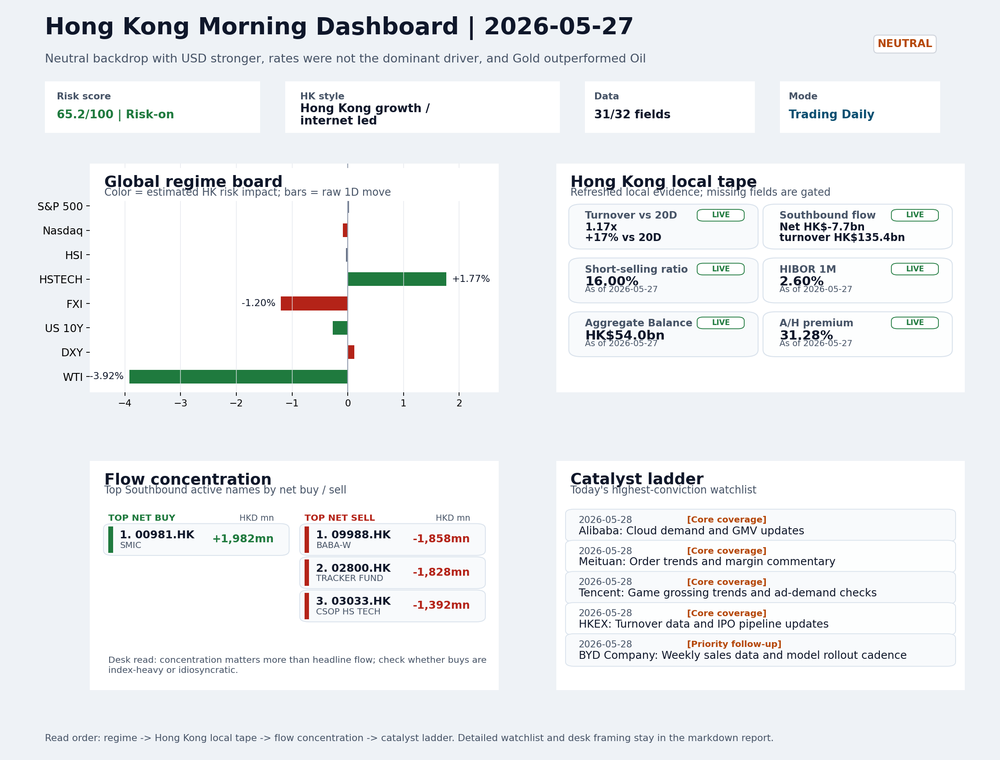
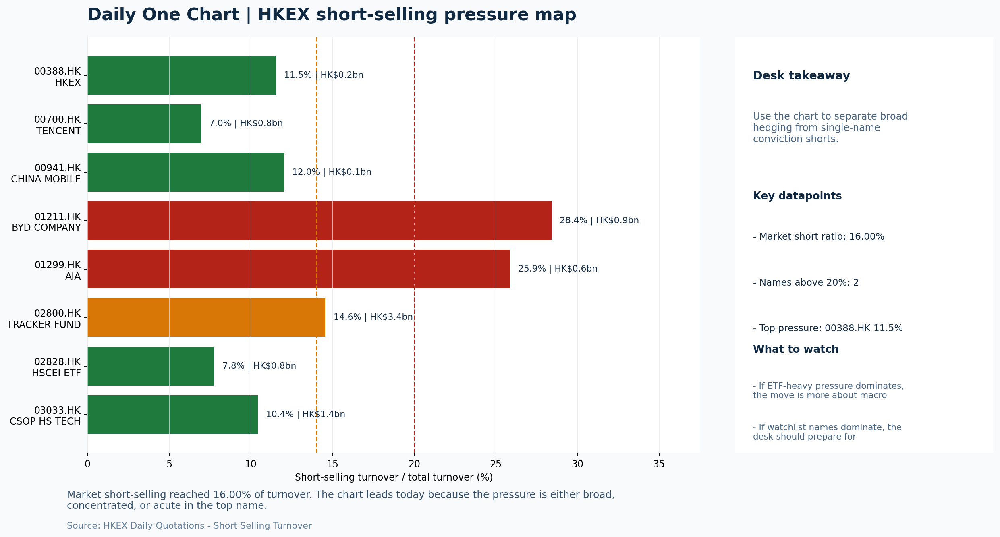

# Morning Research Workbench | 2026-05-28

> Designed for a Hong Kong sell-side commute: Layer 1 `Scan`, Layer 2 `Deep Read`, Layer 3 `Thinking`
> Mode: `Trading Daily` | Keep the report execution-oriented: what mattered in the completed session, what can move Hong Kong leadership, and what needs fast follow-up.
> Briefing date: `2026-05-28` | Review date: `2026-05-27` | Global request: `2026-05-27` | HK/China request: `2026-05-27` | Market effective date: `2026-05-27` | Generated at: `2026-05-28 08:07:11`

## Executive Summary

- **Market pulse:** HSTECH's +1.77% leadership against a weaker FXI (-1.20%) and stronger USD creates a constructive internal tape for Hong Kong growth names, but the FXI-HSTECH divergence and upcoming US.
- **Hong Kong lens:** Hong Kong growth / internet led. The HK open is braced for USD strength and oil softness as external headwinds, but local HSTECH leadership and 1.17x turnover provide a constructive internal tape.
- **Top catalysts:** INTC -6.33%; Neutral backdrop with USD stronger, rates were not the dominant driver, and Gold outperformed Oil.

## Visual Dashboard

## Layer 1 | Scan (5-10 min)

### 1.1 One-Line Market Pulse
HSTECH's +1.77% leadership against a weaker FXI (-1.20%) and stronger USD creates a constructive internal tape for Hong Kong growth names, but the FXI-HSTECH divergence and upcoming US data are the confirmation tests for the open.

### 1.2 Global Asset Price Dashboard

| Asset | Last | 1D move | Read |
| --- | --- | --- | --- |
| S&P 500 | 7,520.36 | +0.02% | US large-cap risk appetite |
| Nasdaq 100 | 29,973.57 | -0.09% | Growth and duration leadership |
| Hang Seng Index | 25,599.45 | -0.03% | Hong Kong broad beta |
| Hang Seng TECH | 4.8400 | **+1.77%** | Hong Kong growth / platform read-through |
| CSI 300 | 4,947.85 | +0.53% | Mainland large-cap tone |
| US 10Y | 4.4810 | -0.27% | Global discount-rate anchor |
| China 10Y | 1.72% | -1.9bp | China local rates anchor \| Live public \| Eastmoney \| 2026-05-27 |
| CN-US 10Y spread | -275.8bp | +0.1bp | Relative carry and macro-pressure gauge \| Live public \| Eastmoney \| 2026-05-27 |
| DXY | 99.29 | +0.12% | Dollar liquidity impulse |
| USD/CNH | 6.7690 | -0.12% | Offshore China risk appetite |
| USD/HKD | 7.8358 | +0.02% | Linked-exchange regime stress check |
| Brent crude | 93.78 | **-5.82%** | Energy / geopolitics |
| COMEX gold | 4,479.30 | -0.47% | Hedge demand / real yields |
| Copper | 6.3305 | -0.48% | Global growth proxy |
| VIX | 16.29 | **-4.23%** | US stress barometer |

### 1.3 Hong Kong Key Data Quick Check

| Check | Value | Status | Source / as of | Why it matters |
| --- | --- | --- | --- | --- |
| Main Board turnover vs 20D | 1.17x \| +17% vs 20D | Live local | HKEX \| 2026-05-27 | Trailing 20-session average turnover was HK$274.4bn. |
| Southbound / Northbound net flow | Southbound Net HK$-7.7bn \| turnover HK$135.4bn \| Northbound Turnover HK$407.5bn \| net not reported | Live local | HKEX Connect \| 2026-05-27 | Southbound net buy is calculated from HKEX disclosed buy and sell turnover. |
| Short-selling ratio | 16.00% | Live local | HKEX \| 2026-05-27 | Official HKEX stock-level short-selling table, aggregated as a share of total market turnover. |
| AH premium index | 31.28% | Live public | Yahoo \| 2026-05-27 | Simple average across 18 A/H pairs; use dispersion rather than the average alone. |
| USD/HKD spot vs band | 7.8358 \| band 7.7500 to 7.8500 | Live quote + local | Yahoo \| 2026-05-27 | Inside the linked-exchange band without immediate boundary stress. Official Convertibility Undertakings define the linked-rate stress boundaries for USD/HKD. |
| HIBOR 1M | 2.60% | Live local | HKMA \| 2026-05-27 | 1M HIBOR is the cleanest quick read for Hong Kong funding conditions and equity-duration pressure. |
| Aggregate Balance | HK$54.0bn | Live local | HKMA \| 2026-05-27 | Aggregate Balance helps frame whether linked-rate liquidity conditions are tight or comfortable. |
| Hong Kong leadership | Hong Kong growth / internet led | Proxy | HSI / HSCEI / HSTECH relative perf \| 2026-05-27 | Use HSI / HSCEI / HSTECH relative moves as the opening style read. |

### 1.4 Risk Dashboard
**Composite risk score:** `65.2/100` | **Regime:** `Risk-on`

| Component | Score impact | Evidence |
| --- | --- | --- |
| US beta | +0.1 | S&P 500 +0.02% |
| HK growth | +8.8 | HSTECH +1.77% |
| Offshore China proxy | -6.0 | FXI -1.20% |
| Dollar pressure | -1.2 | DXY +0.12% |
| Volatility | +8.5 | VIX -4.23% |
| HK short-selling | +0 | Short-selling ratio 16.00% |

### 1.5 Morning Checklist
1. **INTC -6.33%**
 Mover attribution | Announcement / expectations | Guidance reset and margin pressure
2. **Neutral backdrop with USD stronger, rates were not the dominant driver, and Gold outperformed Oil**
 Overnight regime | Start by deciding whether the day is about Neutral conditions or a style pivot.
3. **CPI MoM (Released)**
 Macro / policy | Rates expectations, the dollar, and growth-equity valuation | Industries: Technology, Internet, Brokers
4. **Trade Balance (Released)**
 Macro / policy | Watch whether it changes the day's core market narrative | Industries: Market-wide
5. **Retail Sales MoM (Upcoming)**
 Macro / policy | Consumer resilience, growth expectations, and risk-asset pricing | Industries: Consumer, E-commerce, Consumer discretionary

## Layer 2 | Deep Read (20-30 min)

### 2.1 Overnight Overseas Market Review
#### Market Setup
**Core tape.** Overnight overseas markets ended mixed with Euro Stoxx 50 (+0.74%) outperforming a flat S&P 500 (+0.02%) while Nasdaq 100 dipped (-0.09%).
**Main driver.** The dominant cross-asset signal was Gold outperforming Oil by 1.65 percentage points, a spread that split the read between cyclical caution and geopolitical risk reduction.
**HK relevance.** USD strengthened modestly (DXY +0.12%), rates fell slightly (US 10Y -4.27bp), and VIX compressed -4.23% to 16.29, suggesting the move was not a risk-off event but rather a rotation away from energy and cyclicals.

#### Key Drivers
- Oil declined -3.92% (WTI to $90.21), removing a geopolitical risk premium and reducing tailwind for energy and cyclicals.
- Gold fell only -0.47% while Oil fell -3.92%, a 1.65pct spread that argues for demand-caution rather than safe-haven bid.
- VIX fell -4.23% to 16.29, confirming the market move was not risk-off stress but rather a rotation away from high-beta cyclical names.
- USD strengthened (DXY +0.12%), keeping USD/CNH near 6.769 and maintaining marginal pressure on offshore China asset sentiment.

#### Hong Kong Read-Through
**Desk lens.** Hong Kong growth / internet led.
**Opening implication.** The HK open is braced for USD strength and oil softness as external headwinds, but local HSTECH leadership and 1.17x turnover provide a constructive internal tape. FXI (-1.20%) vs HSTECH (+1.77%) divergence is the key intra-day risk.
- **Cross-market read:** Hang Seng -0.03% / HSCEI +0.30% / HSTECH +1.77%.
- **Cross-market read:** Offshore China proxy FXI -1.20% and USD/CNH -0.12% frame cross-border risk appetite.
- **Cross-market read:** USD/HKD last traded around 7.8358, which keeps the Hong Kong funding lens in focus.

#### Watch Points
- USD composite moved higher by +0.20pct intraday, with a 0.242pct range.
- Main turning points appeared around 2026-05-27 08:05 peak / 2026-05-27 08:20 trough / 2026-05-27 08:35 peak, suggesting event-driven repricing.
- The biggest cross-asset divergence was Gold versus Oil, a spread of 1.651pct.
- Gold moved -0.42pct intraday with a 2.11pct high-low range.

**Curated overnight stories**
1. **China industrial profits jump 24.7% in April, fastest gain in over two years despite**
 Why it matters: Confirms a recovery trajectory in China's industrial sector, suggesting policy support and demand stabilization are filtering into corporate earnings.
 HK read-through: Most directly relevant for HK Materials, Energy, and State-linked industrials with mainland operations.
2. **INTC -6.33%: Guidance reset and margin pressure**
 Why it matters: Intel's guidance cut signals persistent competitive pressure in semiconductors and data center. The margin guidance reset could reset investor expectations for PC and server.
 HK read-through: Drag on Asia semiconductor supply chain names. Relevant for any HK-listed or cross-listed tech with PC/server exposure.
3. **Taiwan chip stocks climb after Nvidia announces $150 billion spending plans**
 Why it matters: Nvidia's aggressive capex guidance validates the AI infrastructure build-out cycle and confirms sustained demand for advanced packaging and foundry services.
 HK read-through: Supports Taiwan-focused tech sentiment and indirectly reinforces the 'AI infrastructure' theme for HK-listed tech.
4. **European companies double down on China manufacturing despite EU de-risking push**
 Why it matters: Counter-narrative to 'decoupling' thesis. European corporate commitment to China manufacturing capacity signals resilience in supply chain localization.
 HK read-through: Modest positive for HK industrials with export or manufacturing partnerships exposure. Reduces one element of geopolitical tail risk premium embedded in China manufacturing.
5. **Hong Kong Seeks Dominant Asia Gold Hub With New Clearing System (B-graded news)**
 Why it matters: HKMA's gold clearing infrastructure launch in coming months is a first-mover advantage play for Asian precious metals settlement.
 HK read-through: Long-term structural positive for HK's commodity marketplace ambition. Limited near-term earnings impact but could attract institutional flow to HK-listed commodity.

### 2.2 Hong Kong / A-share Previous-Day Review
#### Local Tape Setup
**Local read.** HSTECH led the session (+1.77%) while HSCEI lagged (+0.30%) and FXI fell -1.20%, creating a clear growth-versus-value and offshore-versus-onshore internal divergence.
**Verification point.** Main Board turnover was 1.17x the 20-session average and short pressure was moderate at 16.00% of turnover, so the local tape is credible rather than thin.
**Risk to watch.** Southbound showed net selling of HK$7.7bn, but the flow was concentrated in index ETFs (2800.HK, 3033.HK, 02828.HK outflows) rather than broad selling of individual names, which limits the negative read-through.

#### Style and Local Leadership
**Style leadership.** Hong Kong growth / internet led.
- **Cross-market read:** Hang Seng -0.03% / HSCEI +0.30% / HSTECH +1.77%.
- **Cross-market read:** Offshore China proxy FXI -1.20% and USD/CNH -0.12% frame cross-border risk appetite.
- **Cross-market read:** USD/HKD last traded around 7.8358, which keeps the Hong Kong funding lens in focus.

#### Flow Confirmation
Official Stock Connect evidence is available; use Section 2.3 to confirm whether local money supports the price action.

#### Follow-Through Checklist
**Follow-through check.** Watch whether CSI 300 or KWEB confirm the growth read if HSTECH holds its lead on 2026-05-28.

### 2.3 Flow Tracker and Attribution
#### Cross-Asset Attribution v1

| Driver | Direction | Score | Evidence | HK implication |
| --- | --- | --- | --- | --- |
| Oil and geopolitics | supportive | 4.66 | Oil moved -5.82%. | Split the read between energy/cyclicals support and margin/geopolitical pressure. |
| Hong Kong participation | supportive | 1.69 | Main Board turnover was 1.17x the 20-session average. | Higher participation makes local price action more credible. |

#### Flow Tracker
##### Flow Takeaways
- Hong Kong participation is active and short pressure is not excessive, so local confirmation looks healthier.
- Stock Connect Southbound: net HK$-7.7bn on turnover HK$135.4bn (as of 2026-05-27).
- Stock Connect Northbound: turnover RMB407.5bn; public file provides total turnover/top active names, not full net-buy.
- AH premium: simple covered-pair average +31.28%; widest premium: China Communications Construction 69.01%.

##### Stock Connect Southbound Active Names

| Rank | Ticker | Name | Buy | Sell | Net buy |
| --- | --- | --- | --- | --- | --- |
| 1 | 00981.HK | SMIC | HK$8,099.0mn | HK$6,117.4mn | HK$1,981.6mn |
| 2 | 09988.HK | BABA-W | HK$2,025.9mn | HK$3,883.9mn | HK$-1,857.9mn |
| 5 | 02800.HK | TRACKER FUND | HK$1.6mn | HK$1,830.0mn | HK$-1,828.4mn |
| 8 | 03033.HK | CSOP HS TECH | HK$2.5mn | HK$1,394.6mn | HK$-1,392.1mn |
| 9 | 02828.HK | HSCEI ETF | HK$0.0mn | HK$1,379.0mn | HK$-1,379.0mn |

##### AH Premium Dispersion

| Name | A ticker | H ticker | Premium | As of |
| --- | --- | --- | --- | --- |
| China Communications Construction | 601800.SS | 1800.HK | +69.01% | 2026-05-27 |
| China Railway | 601390.SS | 0390.HK | +56.48% | 2026-05-27 |
| Zijin Mining | 601899.SS | 2899.HK | +55.72% | 2026-05-27 |
| China Railway Construction | 601186.SS | 1186.HK | +49.95% | 2026-05-27 |
| New China Life | 601336.SS | 1336.HK | +40.36% | 2026-05-27 |

##### HKEX Short-Selling Watch

| Ticker | Name | Short ratio | Short turnover | Total turnover |
| --- | --- | --- | --- | --- |
| 00388.HK | HKEX | 11.53% | HK$0.2bn | HK$1.7bn |
| 00700.HK | TENCENT | 6.95% | HK$0.8bn | HK$10.8bn |
| 00941.HK | CHINA MOBILE | 12.02% | HK$0.1bn | HK$1.1bn |
| 01211.HK | BYD COMPANY | 28.42% | HK$0.9bn | HK$3.0bn |
| 01299.HK | AIA | 25.88% | HK$0.6bn | HK$2.5bn |

- **Short-value leaders:** 02800.HK TRACKER FUND (HK$3.4bn); 07709.HK XL2CSOPHYNIX (HK$3.1bn); 01810.HK XIAOMI-W (HK$2.3bn); 00981.HK SMIC (HK$2.3bn).

### 2.4 Macro and Policy Tracking
**Desk read.** The May 27 session closed with a neutral risk regime and USD strength as the primary macro driver.

**Market sensitivity.** VIX declined 4.2% to 16.29, indicating easing stress, while gold outperformed oil on the commodity tape.

**HK implication.** Looking ahead to May 28, the repricing catalysts are stacked: US CPI came in hot at +0.3% versus the 0.2% forecast, which if sustained could unfix rate expectations and extend USD strength.

**Macro watchpoints**
- DXY and USD/HKD basis after the CPI confirmation and ahead of Powell remarks.
- Whether HSI and local growth proxies hold if rates reprice higher on the hot CPI print.
- Tech and financials sensitivity to any hawkish lean in Powell's economic outlook comments.
- US retail sales at 20:30 HKT; a beat extends the neutral-to-risk-on theme, a miss tests the tape.

| Time | Region | Event | Status | Desk read |
| --- | --- | --- | --- | --- |
| 20:30 | US | CPI MoM | Released | Impact: Rates expectations, the dollar, and growth-equity valuation \| Attention: 5/5 \| Industries: Technology, Internet, Brokers |
| 09:30 | China | Trade Balance | Released | Impact: Watch whether it changes the day's core market narrative \| Attention: 3/5 \| Industries: Market-wide |
| 20:30 | US | Retail Sales MoM | Upcoming | Impact: Consumer resilience, growth expectations, and risk-asset pricing \| Attention: 5/5 \| Industries: Consumer, E-commerce, Consumer discretionary |
| 09:20 | China | Loan Prime Rate | Upcoming | Impact: Watch whether it changes the day's core market narrative \| Attention: 3/5 \| Industries: Market-wide |
| 22:00 | Federal Reserve | Jerome Powell: Economic outlook remarks | Central bank | Impact: Policy path, liquidity conditions, and cross-asset risk appetite \| Attention: 5/5 \| Industries: Technology, Financials, Gold |
| 10:00 | PBOC | Open Market Operations Desk: Daily liquidity operation window | Central bank | Impact: Policy path, liquidity conditions, and cross-asset risk appetite \| Attention: 3/5 \| Industries: Technology, Financials, Gold |

#### Positioning and Risk Backdrop
- Options activity centered on KWEB Call, with Vol/OI at 1.88x and a bullish bias.
- Put/Call structure shows equity 0.68 / index 1.15, implying Single-stock optimism with index hedging.
- Geopolitics: Middle East | Regional tension remains elevated | Impact: Oil, freight costs, and safe-haven demand
- Geopolitics: US-China | Technology export-control rhetoric remains active | Impact: China internet, semiconductors, and supply chains

### 2.5 Key Company and Sector Events
No high-conviction sector story cleared the main-report relevance gate for this run.

#### Company Event Takeaway
**Desk read.** Neutral backdrop with USD stronger, rates not dominant, Gold outperforming Oil.
**Why it matters.** The most consequential near-term event is Tencent (0700.HK) reporting after market close with EPS est.
**Follow-up.** 4.15 HKD and revenue est.

#### LLM Quick Takes
- **0700.HK** | Earnings after market close with EPS est. 4.15 HKD and revenue est. 163.2bn HKD - beat or miss will anchor sector leadership for HK internet names.
- **9988.HK** | Morgan Stanley upgrade Equal Weight to Overweight, target 92 to 105. Contrarian signal against -2.59% daily move and bottom-of-range (23.7%) positioning.
- **0388.HK** | Results before open with EPS est. 2.81 HKD, revenue est. 6.0bn HKD. Sets the financial sector earnings benchmark for the session.
- **00321.HK** | Grade-A profit warning released 2026-05-27. One of eight Grade-A profit warnings on the HKEX tape this session - confirms micro-distress in small-caps, consistent with
- **1211.HK** | Down -3.15% and at 2.2% range position - the most bottom-of-range name in core coverage. Weekly sales data and model rollout cadence are the primary follow-up items.
- **0941.HK** | At 82.8% range position near top of range. Defensive SOE benchmark for yield trade; watch for profit-taking under elevated expectations.

#### HKEX Announcements

| Grade | Ticker | Type | Release time | Title |
| --- | --- | --- | --- | --- |
| A | 00321.HK | Profit warning | 2026-05-27 | Profit warning / alert announcement |
| A | 08168.HK | Profit warning | 2026-05-27 | Profit warning / alert announcement |
| A | 03315.HK | Profit warning | 2026-05-25 | Profit warning / alert announcement |
| A | 00320.HK | Profit warning | 2026-05-22 | Profit warning / alert announcement |
| A | 01402.HK | Profit warning | 2026-05-22 | Profit warning / alert announcement |
| A | 01416.HK | Profit warning | 2026-05-22 | Profit warning / alert announcement |
| A | 02368.HK | Profit warning | 2026-05-22 | Profit warning / alert announcement |
| A | 02863.HK | Profit warning | 2026-05-21 | Profit warning / alert announcement |

#### Earnings / Results Watch

| Ticker | Company | Timing | Expectation framing |
| --- | --- | --- | --- |
| 0700.HK | Tencent Holdings | After Market Close | EPS est. 4.15 HKD \| revenue est. 163.2bn HKD |
| 0388.HK | Hong Kong Exchanges and Clearing | Before Market Open | EPS est. 2.81 HKD \| revenue est. 6.0bn HKD |

#### Rating Changes
- **9988.HK** | Morgan Stanley | Upgrade | Equal Weight -> Overweight | PT 92 -> 105

#### IPO Watch
- IPO and grey-market monitoring is not yet part of the standard production pack.

### 2.6 Today's Core Names
#### Core coverage

| Name | Ticker | Last | 1D | Range position | Morning note |
| --- | --- | --- | --- | --- | --- |
| Alibaba | 9988.HK | 124.30 | -2.59% | Bottom of range | Short-term pressure is visible; check for a fundamental or regulatory reason. |
| Meituan | 3690.HK | 77.70 | -1.40% | Bottom of range | The name sits near the bottom of its recent range and is worth monitoring for a catalyst-led reversal. |

**Recent headlines for Alibaba:**
- [Can Alibaba Stock Recover as Cloud & International Growth Accelerates?](https://finance.yahoo.com/markets/stocks/articles/alibaba-stock-recover-cloud-international-143500891.html) (Zacks)
**Recent headlines for Meituan:**
- [China Is Moving Quickly to 'Instant Retail.' 3 Stocks to Watch.](https://www.barrons.com/articles/china-instant-delivery-retail-e814ddbe?siteid=yhoof2&yptr=yahoo) (Barrons.com)

#### Priority follow-up

| Name | Ticker | Last | 1D | Range position | Morning note |
| --- | --- | --- | --- | --- | --- |
| BYD Company | 1211.HK | 90.70 | -3.15% | Bottom of range | Short-term pressure is visible; check for a fundamental or regulatory reason. |
| China Mobile | 0941.HK | 85.20 | -0.47% | Top of range | The name sits near the top of its recent range, so watch for profit-taking under high expectations. |

## Layer 3 | Thinking (10-15 min)

### 3.1 Rotating Theme Deep Dive

| Field | Read |
| --- | --- |
| Theme | China Exports and Supply-Chain Relocation |
| Angle for the day | Track tariffs, trade policy, shipping, and manufacturing orders to see whether export resilience is still the cleaner China macro expression. |

**Theme desk read**
**Core thesis.** The weekly theme of export resilience gets a concrete data point after China's May trade surplus came in at USD 85.2bn, well above the USD 79.0bn consensus.
**Evidence.** That print offers a cleaner macro expression for the supply-chain relocation angle, but we still need to square it with softer WTI (-3.92%) and BYD's 3.15% slide to the bottom of its range.
**What to test.** So far, the market is not giving a one-way green light.

**Signals to keep in mind**
- VIX -4.23%: Lower volatility signals easing stress in the tape.
- WTI crude -3.92%: Softer oil argues for a more cautious cyclical-growth read.

**LLM watch items:**
- BYD weekly sales data (May 28) - whether it shows sustained export momentum or domestic price pressure.
- China Mobile capex and dividend signals - to gauge rotation preference between export cyclicals and defensive yield.
- Copper and shipping rates - need corroboration of trade strength beyond the headline surplus.
- US retail sales tonight - will set the demand-side tone for Asian exporters.

**Related names to keep close:**

| Name | Ticker | Bucket | Morning read |
| --- | --- | --- | --- |
| BYD Company | 1211.HK | Priority follow-up | Short-term pressure is visible; check for a fundamental or regulatory reason. |
| China Mobile | 0941.HK | Priority follow-up | The name sits near the top of its recent range, so watch for profit-taking under high expectations. |

**Upcoming catalysts tied to the theme:**
- 2026-05-28 | BYD Company: Weekly sales data and model rollout cadence | Hong Kong-listed proxy for EV volumes, export mix, and price competition
- 2026-05-28 | China Mobile: Capex updates and dividend policy signals | Defensive SOE benchmark for yield trade and domestic digital-infrastructure spend

### 3.2 Today Ahead and Trading Calendar
- Macro: CPI MoM is the first item to anchor the open and the rates/FX response.
- Corporate / event: Alibaba: Cloud demand and GMV updates is the cleanest same-day catalyst to prepare for.

**Same-day macro docket**

| Time | Country | Event | Status | Detail |
| --- | --- | --- | --- | --- |
| 20:30 | US | CPI MoM | Released | Actual 0.3% / Forecast 0.2% / Prior 0.4% |
| 09:30 | China | Trade Balance | Released | Actual USD 85.2bn / Forecast USD 79.0bn / Prior USD 80.6bn |
| 20:30 | US | Retail Sales MoM | Upcoming | Forecast 0.3% / Prior 0.6% |
| 09:20 | China | Loan Prime Rate | Upcoming | Forecast 3.45% / Prior 3.45% |
| 22:00 | Federal Reserve | Jerome Powell: Economic outlook remarks | Central bank | speech |

**Same-day catalyst list**

| Date | Time | Category | Event | Importance |
| --- | --- | --- | --- | --- |
| 2026-05-28 | | Core coverage | Alibaba: Cloud demand and GMV updates | 3 |
| 2026-05-28 | | Core coverage | Meituan: Order trends and margin commentary | 3 |
| 2026-05-28 | | Core coverage | Tencent: Game grossing trends and ad-demand checks | 3 |
| 2026-05-28 | | Core coverage | HKEX: Turnover data and IPO pipeline updates | 3 |

**Next few sessions**

| Date | Category | Event | Impact |
| --- | --- | --- | --- |
| 2026-05-28 | Core coverage | Alibaba: Cloud demand and GMV updates | Key read-through for China consumption, cloud, and platform regulation |
| 2026-05-28 | Core coverage | Meituan: Order trends and margin commentary | High-frequency read on local services demand and platform competition |
| 2026-05-28 | Core coverage | Tencent: Game grossing trends and ad-demand checks | Core offshore China platform proxy for gaming, ads, and AI monetization |
| 2026-05-28 | Core coverage | HKEX: Turnover data and IPO pipeline updates | Direct proxy for Hong Kong market turnover, listings, and southbound |

### 3.3 Daily One Chart
**Daily One Chart | HKEX short-selling pressure map**

**Chart read.** Market short-selling reached 16.00% of turnover.
**Why it matters.** The chart leads today because the pressure is either broad, concentrated, or acute in the top name.

_Source: HKEX Daily Quotations - Short Selling Turnover_

## Traceable Appendix

### Report Metadata
> Date policy: Review date 2026-05-27 is treated as `Trading Daily`. | Global request date is 2026-05-27; adapter effective date is 2026-05-27 and summary date is 2026-05-27. | HK/China local data date is 2026-05-27; role: same-session local cash tape.
> Market data quality: Coverage: `31/32` | Missing: `1`
> Report quality: `87.0/100` | Grade `B` | Status `production ready`

### Key Questions to Keep in Mind
- Is risk appetite rising or fading? The overnight tape reads closer to `Neutral`.
- Did rates expectations move? Focus on whether US 10Y, DXY, and growth style moved together.
- Were commodities the real story? Watch WTI and gold for geopolitics versus inflation signals.
- Is Hong Kong setup internet-led, SOE-led, or broad beta-led? Compare HSTECH, HSCEI, and HSI.
- Did offshore markets move China risk appetite? Focus on HSI, FXI, USD/CNH, and USD/HKD.

### Report Quality and Validation
- **Quality score:** 87.0/100 | **Grade:** B | **Status:** production ready
- **Run summary:** 8 healthy | 0 caveat | 0 failed
- **Release recommendation:** Send | All monitored sources were healthy, so the report is fit for normal distribution.

| Source | Status | Bucket |
| --- | --- | --- |
| Market data | ok | healthy |
| Sector and company news | ok | healthy |
| Movers and short selling | ok | healthy |
| Stock Connect | ok | healthy |
| A/H premium | ok | healthy |
| Hong Kong local package | ok | healthy |
| China rates | ok | healthy |
| Narrative overlay | ok | healthy |

**Desk-use guidance summary:** 0 blocking | 1 advisory

**Desk-use guidance**
- **Advisory:** All monitored sources were healthy for this run; the report can be used as a normal desk-starting point.

| Component | Score | Weight | Read |
| --- | --- | --- | --- |
| Market data coverage | 96.9 | 0.3 | 31/32 core market fields available. |
| Hong Kong local metrics | 82.3 | 0.25 | 8 live, 3 proxy, 0 unavailable local checks. |
| Key public adapters | 100.0 | 0.2 | 4/4 key adapters were available or partially available. |
| Narrative overlay health | 48.6 | 0.15 | 1/7 narrative overlay tasks succeeded or used validated cache; 0 error(s). |
| Fact-check guardrail | 100.0 | 0.1 | Checked 12 numeric claims; 0 numeric mismatch(es), 0 logic warning(s); 0 critical, 0 review. |

**Quality warnings**
- Narrative overlay health is weak: 1/7 narrative overlay tasks succeeded or used validated cache; 0 error(s).

**Narrative fact-check guardrail**
- Checked 12 numeric claims; 0 numeric mismatch(es), 0 logic warning(s); 0 critical, 0 review.

**Adapter status**

| Adapter | Status |
| --- | --- |
| Stock Connect | ok |
| A/H premium | ok |
| HKEX announcements | ok |
| China rates | ok |

### Source Links
- [Can Alibaba Stock Recover as Cloud & International Growth Accelerates?](https://finance.yahoo.com/markets/stocks/articles/alibaba-stock-recover-cloud-international-143500891.html) (Zacks)
- [China Is Moving Quickly to 'Instant Retail.' 3 Stocks to Watch.](https://www.barrons.com/articles/china-instant-delivery-retail-e814ddbe?siteid=yhoof2&yptr=yahoo) (Barrons.com)
- [Assessing Meituan (SEHK:3690) Valuation After Recent Share Price Weakness And Ongoing Losses](https://finance.yahoo.com/markets/stocks/articles/assessing-meituan-sehk-3690-valuation-151405137.html) (Simply Wall St.)
- [Tencent links PayPal to WeChat Pay network, enabling US users to spend across China](https://finance.yahoo.com/markets/crypto/articles/tencent-links-paypal-wechat-pay-115346909.html) (Reuters)
- [Is It Too Late To Consider AIA Group (SEHK:1299) After Its 82% One Year Rally?](https://finance.yahoo.com/markets/stocks/articles/too-consider-aia-group-sehk-042100864.html) (Simply Wall St.)
- [00321.HK Profit warning / alert announcement](http://www1.hkexnews.hk/listedco/listconews/sehk/2026/0527/2026052700987.pdf) (HKEXnews)
- [08168.HK Profit warning / alert announcement](http://www1.hkexnews.hk/listedco/listconews/gem/2026/0527/2026052602040.pdf) (HKEXnews)
- [03315.HK Profit warning / alert announcement](http://www1.hkexnews.hk/listedco/listconews/sehk/2026/0525/2026052500153.pdf) (HKEXnews)
- [00320.HK Profit warning / alert announcement](http://www1.hkexnews.hk/listedco/listconews/sehk/2026/0522/2026052200416.pdf) (HKEXnews)
- [01402.HK Profit warning / alert announcement](http://www1.hkexnews.hk/listedco/listconews/sehk/2026/0522/2026052201114.pdf) (HKEXnews)
- [01416.HK Profit warning / alert announcement](http://www1.hkexnews.hk/listedco/listconews/sehk/2026/0522/2026052200823.pdf) (HKEXnews)
- [02368.HK Profit warning / alert announcement](http://www1.hkexnews.hk/listedco/listconews/sehk/2026/0522/2026052200502.pdf) (HKEXnews)
- [02863.HK Profit warning / alert announcement](http://www1.hkexnews.hk/listedco/listconews/sehk/2026/0521/2026052101268.pdf) (HKEXnews)

## Supplementary Visual Appendix

This appendix is professional-path only. It keeps a traceable index of the report visuals and the deterministic chart cues used to frame the morning note, without injecting the legacy intraday chart pack.

### Visual Index

| Visual | Path | Role |
| --- | --- | --- |
| Visual Dashboard | `charts/dashboard_2026-05-28.png` | Cross-asset regime board and Hong Kong local tape snapshot. |
| Daily One Chart | `charts/daily_one_chart_2026-05-28.png` | Single highest-conviction visual story for the day. |

### Deterministic Chart Cues
- FX / liquidity: USD composite moved higher by +0.20pct intraday, with a 0.242pct range.
- FX / liquidity: Main turning points appeared around 2026-05-27 08:05 peak / 2026-05-27 08:20 trough / 2026-05-27 08:35 peak, suggesting event-driven repricing rather than a clean one-way USD move.
- Cross-asset: The biggest cross-asset divergence was Gold versus Oil, a spread of 1.651pct.
- Cross-asset: Gold moved -0.42pct intraday with a 2.11pct high-low range.
- Cross-asset: Oil moved -2.07pct intraday with a 4.136pct high-low range.
- Cross-asset: Bitcoin moved -1.96pct intraday with a 2.367pct high-low range.

### Risk Dashboard Components

| Component | Score impact | Evidence |
| --- | --- | --- |
| US beta | +0.1 | S&P 500 +0.02% |
| HK growth | +8.8 | HSTECH +1.77% |
| Offshore China proxy | -6.0 | FXI -1.20% |
| Dollar pressure | -1.2 | DXY +0.12% |
| Volatility | +8.5 | VIX -4.23% |
| HK short-selling | +0 | Short-selling ratio 16.00% |
