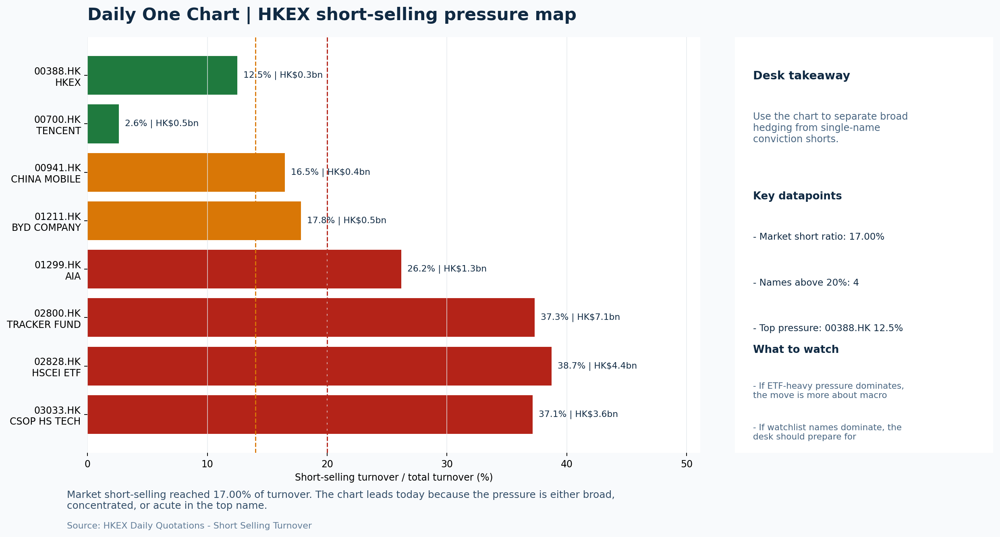

# Morning Research Workbench | 2026-05-29

> Designed for a Hong Kong sell-side commute: Layer 1 `Scan`, Layer 2 `Deep Read`, Layer 3 `Thinking`
> Mode: `Trading Daily` | Keep the report execution-oriented: what mattered in the completed session, what can move Hong Kong leadership, and what needs fast follow-up.
> Briefing date: `2026-05-29` | Review date: `2026-05-28` | Global request: `2026-05-28` | HK/China request: `2026-05-28` | Market effective date: `2026-05-28` | Generated at: `2026-05-29 08:17:20`

## Executive Summary

- **Market pulse:** Softer USD and lower yields offered a constructive overnight backdrop, but Hong Kong's lower close despite that signal - alongside FXI underperforming - limits credibility without FXI.
- **Hong Kong lens:** Hong Kong growth / internet led. The absence of offshore China conviction limits upside credibility for Hang Seng and HSTECH despite lower USD and yields.
- **Top catalysts:** INTC -6.33%; Neutral backdrop with USD softer, lower yields supported duration, and Gold outperformed Oil.

## Visual Dashboard

## Layer 1 | Scan (5-10 min)

### 1.1 One-Line Market Pulse
Softer USD and lower yields offered a constructive overnight backdrop, but Hong Kong's lower close despite that signal - alongside FXI underperforming - limits credibility without FXI stabilization and confirms today is a test of local leadership rather than a broad risk-on call.

### 1.2 Global Asset Price Dashboard

| Asset | Last | 1D move | Read |
| --- | --- | --- | --- |
| S&P 500 | 7,563.63 | +0.58% | US large-cap risk appetite |
| Nasdaq 100 | 30,223.89 | +0.84% | Growth and duration leadership |
| Hang Seng Index | 25,328.23 | -1.06% | Hong Kong broad beta |
| Hang Seng TECH | 4.8020 | -0.79% | Hong Kong growth / platform read-through |
| CSI 300 | 4,908.17 | -0.80% | Mainland large-cap tone |
| US 10Y | 4.4550 | -0.58% | Global discount-rate anchor |
| China 10Y | 1.72% | -0.2bp | China local rates anchor \| Live public \| Eastmoney \| 2026-05-28 |
| CN-US 10Y spread | -273.1bp | +2.8bp | Relative carry and macro-pressure gauge \| Live public \| Eastmoney \| 2026-05-28 |
| DXY | 98.98 | -0.23% | Dollar liquidity impulse |
| USD/CNH | 6.7655 | -0.08% | Offshore China risk appetite |
| USD/HKD | 7.8337 | -0.03% | Linked-exchange regime stress check |
| Brent crude | 92.12 | **-2.30%** | Energy / geopolitics |
| COMEX gold | 4,525.00 | **+1.74%** | Hedge demand / real yields |
| Copper | 6.4175 | **+1.78%** | Global growth proxy |
| VIX | 15.74 | **-3.38%** | US stress barometer |

### 1.3 Hong Kong Key Data Quick Check

| Check | Value | Status | Source / as of | Why it matters |
| --- | --- | --- | --- | --- |
| Main Board turnover vs 20D | 1.28x \| +28% vs 20D | Live local | HKEX \| 2026-05-28 | Trailing 20-session average turnover was HK$277.8bn. |
| Southbound / Northbound net flow | Southbound Net HK$7.6bn \| turnover HK$149.9bn \| Northbound Turnover HK$383.5bn \| net not reported | Live local | HKEX Connect \| 2026-05-28 | Southbound net buy is calculated from HKEX disclosed buy and sell turnover. |
| Short-selling ratio | 17.00% | Live local | HKEX \| 2026-05-28 | Official HKEX stock-level short-selling table, aggregated as a share of total market turnover. |
| AH premium index | 27.39% | Live public | Yahoo \| 2026-05-28 | Simple average across 18 A/H pairs; use dispersion rather than the average alone. |
| USD/HKD spot vs band | 7.8337 \| band 7.7500 to 7.8500 | Live quote + local | Yahoo \| 2026-05-28 | Inside the linked-exchange band without immediate boundary stress. Official Convertibility Undertakings define the linked-rate stress boundaries for USD/HKD. |
| HIBOR 1M | 2.65% | Live local | HKMA \| 2026-05-28 | 1M HIBOR is the cleanest quick read for Hong Kong funding conditions and equity-duration pressure. |
| Aggregate Balance | HK$54.0bn | Live local | HKMA \| 2026-05-28 | Aggregate Balance helps frame whether linked-rate liquidity conditions are tight or comfortable. |
| Hong Kong leadership | Hong Kong growth / internet led | Proxy | HSI / HSCEI / HSTECH relative perf \| 2026-05-28 | Use HSI / HSCEI / HSTECH relative moves as the opening style read. |

### 1.4 Risk Dashboard
**Composite risk score:** `58.9/100` | **Regime:** `Mixed`

| Component | Score impact | Evidence |
| --- | --- | --- |
| US beta | +3.5 | S&P 500 +0.58% |
| HK growth | -4.0 | HSTECH -0.79% |
| Offshore China proxy | -4.7 | FXI -0.93% |
| Dollar pressure | +2.3 | DXY -0.23% |
| Volatility | +6.8 | VIX -3.38% |
| HK short-selling | +0 | Short-selling ratio 17.00% |

### 1.5 Morning Checklist
1. **INTC -6.33%**
 Mover attribution | Announcement / expectations | Guidance reset and margin pressure
2. **Neutral backdrop with USD softer, lower yields supported duration, and Gold outperformed Oil**
 Overnight regime | Start by deciding whether the day is about Neutral conditions or a style pivot.
3. **CPI MoM (Released)**
 Macro / policy | Rates expectations, the dollar, and growth-equity valuation | Industries: Technology, Internet, Brokers
4. **Trade Balance (Released)**
 Macro / policy | Watch whether it changes the day's core market narrative | Industries: Market-wide
5. **Retail Sales MoM (Upcoming)**
 Macro / policy | Consumer resilience, growth expectations, and risk-asset pricing | Industries: Consumer, E-commerce, Consumer discretionary

## Layer 2 | Deep Read (20-30 min)

### 2.1 Overnight Overseas Market Review
#### Market Setup
**Core tape.** Overnight overseas markets showed a neutral-to-positive tilt with US equities gaining modestly while Gold outperformed Oil by nearly 7 percentage points.
**Main driver.** USD softened and the US 10Y yield fell, a combination that typically supports duration-sensitive assets, yet Hong Kong and the China proxy (FXI) both closed lower - a divergence worth monitoring on the open.

#### Key Drivers
- USD composite slipped -0.54% intraday with DXY down -0.23%, suggesting easing global dollar liquidity pressure.
- US 10Y yield fell -0.58%, which historically supports growth-style and long-duration names; Nasdaq 100 led with +0.84%.
- Gold surged +2.75% intraday versus WTI crude's -4.12% drop, a cross-asset spread that points to hedge demand rather than reflation trading.
- VIX fell -3.38% to 15.74, the lowest since the prior session, indicating stress easing without a clear risk-on commitment.

#### Hong Kong Read-Through
**Desk lens.** Hong Kong growth / internet led.
**Opening implication.** The absence of offshore China conviction limits upside credibility for Hang Seng and HSTECH despite lower USD and yields. Nio's +10% move may offer a localized EV/consumer discretionary catalyst on the open.
- **Cross-market read:** Hang Seng -1.06% / HSCEI -1.33% / HSTECH -0.79%.
- **Cross-market read:** Offshore China proxy FXI -0.93% and USD/CNH -0.08% frame cross-border risk appetite.
- **Cross-market read:** USD/HKD last traded around 7.8337, which keeps the Hong Kong funding lens in focus.

#### Watch Points
- USD composite moved lower by -0.54pct intraday, with a 0.636pct range.
- Main turning points appeared around 2026-05-28 08:05 trough / 2026-05-28 08:25 trough / 2026-05-28 08:40 trough, suggesting event-driven repricing.
- The biggest cross-asset divergence was Gold versus Oil, a spread of 6.868pct.
- Gold moved +2.75pct intraday with a 3.306pct high-low range.

**Curated overnight stories**
1. **Nio shares jump 10% after releasing first flagship EV in more than two years**
 Why it matters: Directly lifts sentiment for the Chinese EV sector and Nio's own Hong Kong-listed shares (9866.HK); may prompt a re-rating of product-cycle momentum.
 HK read-through: Positive spillover for Hong Kong-listed EV and auto names; likely bid for Nio HK and supportive tone across consumer discretionary and new energy vehicle themes.

### 2.2 Hong Kong / A-share Previous-Day Review
#### Local Tape Setup
**Local read.** Hong Kong's major indices closed lower on 2026-05-28, with Hang Seng Index down 1.06%.
**Verification point.** Style divergence was visible: HSTECH fell only 0.79% while HSCEI lost 1.33%, indicating growth names held up better than state-owned and old-economy H-shares.
**Risk to watch.** Local turnover was 1.28x the 20-day average and the short-selling ratio was 17.00%, not excessive, which adds some credibility to the growth-outperformance signal.

#### Style and Local Leadership
**Style leadership.** Hong Kong growth / internet led.
- **Cross-market read:** Hang Seng -1.06% / HSCEI -1.33% / HSTECH -0.79%.
- **Cross-market read:** Offshore China proxy FXI -0.93% and USD/CNH -0.08% frame cross-border risk appetite.
- **Cross-market read:** USD/HKD last traded around 7.8337, which keeps the Hong Kong funding lens in focus.

#### Flow Confirmation
Official Stock Connect evidence is available; use Section 2.3 to confirm whether local money supports the price action.

#### Follow-Through Checklist
**Follow-through check.** Watch whether HSTECH sustains its relative outperformance versus HSCEI at the next open and whether the offshore China proxy (FXI) stabilizes. If both hold while USD/CNH stays calm, the growth-led style read gains credibility.

### 2.3 Flow Tracker and Attribution
#### Cross-Asset Attribution v1

| Driver | Direction | Score | Evidence | HK implication |
| --- | --- | --- | --- | --- |
| Hong Kong participation | supportive | 2.83 | Main Board turnover was 1.28x the 20-session average. | Higher participation makes local price action more credible. |
| Oil and geopolitics | supportive | 1.84 | Oil moved -2.30%. | Split the read between energy/cyclicals support and margin/geopolitical pressure. |
| US growth-style transmission | supportive | 1.18 | Nasdaq 100 moved +0.84%. | Hong Kong growth and platform names should be tested first at the open. |
| Rates impulse | supportive | 0.7 | US 10Y yield proxy moved -0.58%. | Lower yields help long-duration growth; higher yields pressure valuation-sensitive |

#### Flow Tracker
##### Flow Takeaways
- Hong Kong participation is active and short pressure is not excessive, so local confirmation looks healthier.
- Stock Connect Southbound: net HK$7.6bn on turnover HK$149.9bn (as of 2026-05-28).
- Stock Connect Northbound: turnover RMB383.5bn; public file provides total turnover/top active names, not full net-buy.
- AH premium: simple covered-pair average +27.39%; widest premium: China Railway 56.4%.

##### Stock Connect Southbound Active Names

| Rank | Ticker | Name | Buy | Sell | Net buy |
| --- | --- | --- | --- | --- | --- |
| 1 | 00981.HK | SMIC | HK$11,650.8mn | HK$7,476.4mn | HK$4,174.4mn |
| 3 | 09988.HK | BABA-W | HK$2,403.6mn | HK$3,706.6mn | HK$-1,303.1mn |
| 5 | 09992.HK | POP MART | HK$2,581.1mn | HK$1,460.6mn | HK$1,120.5mn |
| 3 | 01347.HK | HUA HONG SEMI | HK$3,749.8mn | HK$2,938.4mn | HK$811.4mn |
| 8 | 03690.HK | MEITUAN-W | HK$1,743.5mn | HK$1,070.6mn | HK$672.9mn |

##### AH Premium Dispersion

| Name | A ticker | H ticker | Premium | As of |
| --- | --- | --- | --- | --- |
| China Railway | 601390.SS | 0390.HK | +56.40% | 2026-05-28 |
| China Communications Construction | 601800.SS | 1800.HK | +51.87% | 2026-05-28 |
| China Railway Construction | 601186.SS | 1186.HK | +50.90% | 2026-05-28 |
| New China Life | 601336.SS | 1336.HK | +41.97% | 2026-05-28 |
| China Construction Bank | 601939.SS | 0939.HK | +37.47% | 2026-05-28 |

##### HKEX Short-Selling Watch

| Ticker | Name | Short ratio | Short turnover | Total turnover |
| --- | --- | --- | --- | --- |
| 00388.HK | HKEX | 12.51% | HK$0.3bn | HK$2.8bn |
| 00700.HK | TENCENT | 2.62% | HK$0.5bn | HK$17.9bn |
| 00941.HK | CHINA MOBILE | 16.48% | HK$0.4bn | HK$2.5bn |
| 01211.HK | BYD COMPANY | 17.81% | HK$0.5bn | HK$2.7bn |
| 01299.HK | AIA | 26.18% | HK$1.3bn | HK$5.0bn |

- **Short-value leaders:** 02800.HK TRACKER FUND (HK$7.1bn); 02828.HK HSCEI ETF (HK$4.4bn); 03033.HK CSOP HS TECH (HK$3.6bn); 07709.HK XL2CSOPHYNIX (HK$2.5bn).

### 2.4 Macro and Policy Tracking
**Desk read.** The completed session settled into a neutral posture with USD softer and lower yields supporting duration.

**Market sensitivity.** Gold outperformed Oil, while VIX compressed to 15.74, suggesting modest easing of systemic stress.

**HK implication.** Copper gained 1.78%, hinting at incremental improvement in growth proxies.

**Macro watchpoints**
- DXY and US 2-year/10-year yield reaction to the hot CPI print before Retail Sales.
- US Retail Sales MoM at 20:30: consensus at 0.3% versus prior 0.6% - a miss would reinforce growth anxiety, a beat would maintain the
- Jerome Powell remarks at 22:00: any hawkish deviation from recent guidance could spike vol and pressure tech and growth proxies in HK.
- PBOC liquidity operations and whether the OMO desk signals any tightening or easing bias.

| Time | Region | Event | Status | Desk read |
| --- | --- | --- | --- | --- |
| 20:30 | US | CPI MoM | Released | Impact: Rates expectations, the dollar, and growth-equity valuation \| Attention: 5/5 \| Industries: Technology, Internet, Brokers |
| 09:30 | China | Trade Balance | Released | Impact: Watch whether it changes the day's core market narrative \| Attention: 3/5 \| Industries: Market-wide |
| 20:30 | US | Retail Sales MoM | Upcoming | Impact: Consumer resilience, growth expectations, and risk-asset pricing \| Attention: 5/5 \| Industries: Consumer, E-commerce, Consumer discretionary |
| 09:20 | China | Loan Prime Rate | Upcoming | Impact: Watch whether it changes the day's core market narrative \| Attention: 3/5 \| Industries: Market-wide |
| 22:00 | Federal Reserve | Jerome Powell: Economic outlook remarks | Central bank | Impact: Policy path, liquidity conditions, and cross-asset risk appetite \| Attention: 5/5 \| Industries: Technology, Financials, Gold |
| 10:00 | PBOC | Open Market Operations Desk: Daily liquidity operation window | Central bank | Impact: Policy path, liquidity conditions, and cross-asset risk appetite \| Attention: 3/5 \| Industries: Technology, Financials, Gold |

#### Positioning and Risk Backdrop
- Options activity centered on KWEB Call, with Vol/OI at 1.88x and a bullish bias.
- Put/Call structure shows equity 0.68 / index 1.15, implying Single-stock optimism with index hedging.
- Geopolitics: Middle East | Regional tension remains elevated | Impact: Oil, freight costs, and safe-haven demand
- Geopolitics: US-China | Technology export-control rhetoric remains active | Impact: China internet, semiconductors, and supply chains

### 2.5 Key Company and Sector Events
No high-conviction sector story cleared the main-report relevance gate for this run.

#### Company Event Takeaway
**Desk read.** Morgan Stanley's upgrade of Alibaba (9988.HK) to Overweight with a target raise to 105 is the session's primary ratings catalyst and provides a constructive signal for Chinese internet sentiment heading into Tencent's.
**Why it matters.** Tencent reports AMC with EPS est.
**Follow-up.** 4.15 HKD and revenue est.

#### LLM Quick Takes
- **9988.HK** | Morgan Stanley's Equal Weight to Overweight upgrade with target 92 to 105 is the standout ratings event.
- **0700.HK** | Reports after market close with EPS est. 4.15 HKD and revenue est. 163.2bn HKD. Analyst price targets are split on AI spending payback
- **0388.HK** | Reports before market open with EPS est. 2.81 HKD and revenue est. 6.0bn HKD. Given recent cash-market turnover trends, a beat or miss here will directly inform
- **3690.HK** | Down 5.66% to bottom of range at HK$73.3. The instant-retail growth story is legitimate but near-term pressure is visible
- **1211.HK** | Down 0.44% near bottom of range at HK$90.3. Weekly sales data and model cadence remain the primary near-term catalysts

#### HKEX Announcements

| Grade | Ticker | Type | Release time | Title |
| --- | --- | --- | --- | --- |
| A | 01473.HK | Profit warning | 2026-05-28 | Profit warning / alert announcement |
| A | 01709.HK | Profit warning | 2026-05-28 | Profit warning / alert announcement |
| A | 01711.HK | Profit warning | 2026-05-28 | Profit warning / alert announcement |
| A | 00321.HK | Profit warning | 2026-05-27 | Profit warning / alert announcement |
| A | 08168.HK | Profit warning | 2026-05-27 | Profit warning / alert announcement |
| A | 03315.HK | Profit warning | 2026-05-25 | Profit warning / alert announcement |
| A | 00320.HK | Profit warning | 2026-05-22 | Profit warning / alert announcement |
| A | 01402.HK | Profit warning | 2026-05-22 | Profit warning / alert announcement |

#### Earnings / Results Watch

| Ticker | Company | Timing | Expectation framing |
| --- | --- | --- | --- |
| 0700.HK | Tencent Holdings | After Market Close | EPS est. 4.15 HKD \| revenue est. 163.2bn HKD |
| 0388.HK | Hong Kong Exchanges and Clearing | Before Market Open | EPS est. 2.81 HKD \| revenue est. 6.0bn HKD |

#### Rating Changes
- **9988.HK** | Morgan Stanley | Upgrade | Equal Weight -> Overweight | PT 92 -> 105

#### IPO Watch
- IPO and grey-market monitoring is not yet part of the standard production pack.

### 2.6 Today's Core Names
#### Core coverage

| Name | Ticker | Last | 1D | Range position | Morning note |
| --- | --- | --- | --- | --- | --- |
| Meituan | 3690.HK | 73.30 | -5.66% | Bottom of range | Short-term pressure is visible; check for a fundamental or regulatory reason. |
| Tencent | 0700.HK | 425.00 | -2.16% | Bottom of range | Short-term pressure is visible; check for a fundamental or regulatory reason. |

**Recent headlines for Meituan:**
- [China Is Moving Quickly to 'Instant Retail.' 3 Stocks to Watch.](https://www.barrons.com/articles/china-instant-delivery-retail-e814ddbe?siteid=yhoof2&yptr=yahoo) (Barrons.com)
**Recent headlines for Tencent:**
- [How The Tencent Holdings (SEHK:700) Story Is Shifting With AI Spending And Split Price Targets](https://finance.yahoo.com/markets/stocks/articles/tencent-holdings-sehk-700-story-211316189.html) (Simply Wall St.)

#### Priority follow-up

| Name | Ticker | Last | 1D | Range position | Morning note |
| --- | --- | --- | --- | --- | --- |
| AIA | 1299.HK | 82.15 | -1.15% | Mid-range | Positioning is neutral for now, so use it mainly to monitor marginal information changes. |
| BYD Company | 1211.HK | 90.30 | -0.44% | Bottom of range | The name sits near the bottom of its recent range and is worth monitoring for a catalyst-led reversal. |

**Recent headlines for AIA:**
- [Is It Too Late To Consider AIA Group (SEHK:1299) After Its 82% One Year Rally?](https://finance.yahoo.com/markets/stocks/articles/too-consider-aia-group-sehk-042100864.html) (Simply Wall St.)

## Layer 3 | Thinking (10-15 min)

### 3.1 Rotating Theme Deep Dive

| Field | Read |
| --- | --- |
| Theme | Hong Kong Market Structure and Flows |
| Angle for the day | Focus on turnover, Stock Connect, ETF flows, HKEX activity, and style leadership to understand whether Hong Kong is being driven by fundamentals or positioning. |

**Theme desk read**
**Core thesis.** The weekly theme on Hong Kong market structure and flows warrants attention as several near-term catalysts converge under a neutral but not stress-free backdrop.
**Evidence.** Lower VIX and a softer USD alongside a dip in US 10Y yields provided some support for duration, while Gold outperformed Oil, hinting at cautious positioning.
**What to test.** Within the local tape, HKEX closed down 1.49% at 396.2, sitting mid-range, and BYD slipped 0.44% to 90.3, hugging the bottom of its recent range, suggesting limited conviction ahead of data.

**Signals to keep in mind**
- VIX -3.38%: Lower volatility signals easing stress in the tape.
- Bitcoin -1.95%: Keep tracking it to confirm whether the core daily narrative is holding.

**LLM watch items:**
- HKEX turnover data and IPO pipeline news (29 May) to gauge whether activity levels support the mid-range consolidation or signal a shift.
- BYD weekly sales data (29 May) to confirm if EV demand can spark a catalyst-led reversal from the bottom of the range.
- China Loan Prime Rate decision (29 May 09:20) - consensus expects no change at 3.45%, but any surprise could swing financials and southbound
- US retail sales for May (forecast 0.3%, prior 0.6%) due later tonight - a miss would challenge the consumer resilience narrative supporting risk

**Related names to keep close:**

| Name | Ticker | Bucket | Morning read |
| --- | --- | --- | --- |
| HKEX | 0388.HK | Core coverage | Positioning is neutral for now, so use it mainly to monitor marginal information changes. |
| BYD Company | 1211.HK | Priority follow-up | The name sits near the bottom of its recent range and is worth monitoring for a catalyst-led reversal. |

**Upcoming catalysts tied to the theme:**
- 2026-05-29 | HKEX: Turnover data and IPO pipeline updates | Direct proxy for Hong Kong market turnover, listings, and southbound interest
- 2026-05-29 | BYD Company: Weekly sales data and model rollout cadence | Hong Kong-listed proxy for EV volumes, export mix, and price competition
- 2026-05-29 | HSCEI ETF: Policy flow-through and financial/energy leadership | Useful proxy for state-owned and old-economy H-share leadership
- 2026-05-29 | Tracker Fund of Hong Kong: Index-turnover shifts and ETF flows | Clean listed proxy for broad HSI positioning and passive flows

### 3.2 Today Ahead and Trading Calendar
- Macro: CPI MoM is the first item to anchor the open and the rates/FX response.
- Corporate / event: Meituan: Order trends and margin commentary is the cleanest same-day catalyst to prepare for.

**Same-day macro docket**

| Time | Country | Event | Status | Detail |
| --- | --- | --- | --- | --- |
| 20:30 | US | CPI MoM | Released | Actual 0.3% / Forecast 0.2% / Prior 0.4% |
| 09:30 | China | Trade Balance | Released | Actual USD 85.2bn / Forecast USD 79.0bn / Prior USD 80.6bn |
| 20:30 | US | Retail Sales MoM | Upcoming | Forecast 0.3% / Prior 0.6% |
| 09:20 | China | Loan Prime Rate | Upcoming | Forecast 3.45% / Prior 3.45% |
| 22:00 | Federal Reserve | Jerome Powell: Economic outlook remarks | Central bank | speech |

**Same-day catalyst list**

| Date | Time | Category | Event | Importance |
| --- | --- | --- | --- | --- |
| 2026-05-29 | | Core coverage | Meituan: Order trends and margin commentary | 3 |
| 2026-05-29 | | Core coverage | Tencent: Game grossing trends and ad-demand checks | 3 |
| 2026-05-29 | | Core coverage | Alibaba: Cloud demand and GMV updates | 3 |
| 2026-05-29 | | Core coverage | HKEX: Turnover data and IPO pipeline updates | 3 |

**Next few sessions**

| Date | Category | Event | Impact |
| --- | --- | --- | --- |
| 2026-05-29 | Core coverage | Meituan: Order trends and margin commentary | High-frequency read on local services demand and platform competition |
| 2026-05-29 | Core coverage | Tencent: Game grossing trends and ad-demand checks | Core offshore China platform proxy for gaming, ads, and AI monetization |
| 2026-05-29 | Core coverage | Alibaba: Cloud demand and GMV updates | Key read-through for China consumption, cloud, and platform regulation |
| 2026-05-29 | Core coverage | HKEX: Turnover data and IPO pipeline updates | Direct proxy for Hong Kong market turnover, listings, and southbound |

### 3.3 Daily One Chart
**Daily One Chart | HKEX short-selling pressure map**

**Chart read.** Market short-selling reached 17.00% of turnover.
**Why it matters.** The chart leads today because the pressure is either broad, concentrated, or acute in the top name.

_Source: HKEX Daily Quotations - Short Selling Turnover_

## Traceable Appendix

### Report Metadata
> Date policy: Review date 2026-05-28 is treated as `Trading Daily`. | Global request date is 2026-05-28; adapter effective date is 2026-05-28 and summary date is 2026-05-28. | HK/China local data date is 2026-05-28; role: same-session local cash tape.
> Market data quality: Coverage: `31/32` | Missing: `1`
> Report quality: `84.6/100` | Grade `B` | Status `usable with caveats`

### Key Questions to Keep in Mind
- Is risk appetite rising or fading? The overnight tape reads closer to `Neutral`.
- Did rates expectations move? Focus on whether US 10Y, DXY, and growth style moved together.
- Were commodities the real story? Watch WTI and gold for geopolitics versus inflation signals.
- Is Hong Kong setup internet-led, SOE-led, or broad beta-led? Compare HSTECH, HSCEI, and HSI.
- Did offshore markets move China risk appetite? Focus on HSI, FXI, USD/CNH, and USD/HKD.

### Report Quality and Validation
- **Quality score:** 84.6/100 | **Grade:** B | **Status:** usable with caveats
- **Run summary:** 8 healthy | 0 caveat | 0 failed
- **Release recommendation:** Send | All monitored sources were healthy, so the report is fit for normal distribution.

| Source | Status | Bucket |
| --- | --- | --- |
| Market data | ok | healthy |
| Sector and company news | ok | healthy |
| Movers and short selling | ok | healthy |
| Stock Connect | ok | healthy |
| A/H premium | ok | healthy |
| Hong Kong local package | ok | healthy |
| China rates | ok | healthy |
| Narrative overlay | ok | healthy |

**Desk-use guidance summary:** 0 blocking | 1 advisory

**Desk-use guidance**
- **Advisory:** All monitored sources were healthy for this run; the report can be used as a normal desk-starting point.

| Component | Score | Weight | Read |
| --- | --- | --- | --- |
| Market data coverage | 96.9 | 0.3 | 31/32 core market fields available. |
| Hong Kong local metrics | 82.3 | 0.25 | 8 live, 3 proxy, 0 unavailable local checks. |
| Key public adapters | 100.0 | 0.2 | 4/4 key adapters were available or partially available. |
| Narrative overlay health | 65.7 | 0.15 | 3/7 narrative overlay tasks succeeded or used validated cache; 0 error(s). |
| Fact-check guardrail | 50.0 | 0.1 | Checked 12 numeric claims; 2 numeric mismatch(es), 0 logic warning(s); 2 critical, 0 review. |

**Quality warnings**
- Fact-check guardrail is weak: Checked 12 numeric claims; 2 numeric mismatch(es), 0 logic warning(s); 2 critical, 0 review.
- Narrative fact-check guardrail produced warnings; review the validation table before relying on narrative sections.

**Narrative fact-check guardrail**
- Checked 12 numeric claims; 2 numeric mismatch(es), 0 logic warning(s); 2 critical, 0 review.

| Severity | Field | Claim | Type | Claimed | Expected | Snippet |
| --- | --- | --- | --- | --- | --- | --- |
| critical | tasks.hk_review.paragraph | Hang Seng Index | change_pct | 1.06 | -1.06 | losed lower on 2026-05-28, with Hang Seng Index down [trimmed] |
| critical | tasks.hk_review.paragraph | Hang Seng TECH | change_pct | 0.79 | -0.79 | . Style divergence was visible: HSTECH fell only 0.79% [trimmed] |

**Adapter status**

| Adapter | Status |
| --- | --- |
| Stock Connect | ok |
| A/H premium | ok |
| HKEX announcements | ok |
| China rates | ok |

### Source Links
- [China Is Moving Quickly to 'Instant Retail.' 3 Stocks to Watch.](https://www.barrons.com/articles/china-instant-delivery-retail-e814ddbe?siteid=yhoof2&yptr=yahoo) (Barrons.com)
- [Assessing Meituan (SEHK:3690) Valuation After Recent Share Price Weakness And Ongoing Losses](https://finance.yahoo.com/markets/stocks/articles/assessing-meituan-sehk-3690-valuation-151405137.html) (Simply Wall St.)
- [How The Tencent Holdings (SEHK:700) Story Is Shifting With AI Spending And Split Price Targets](https://finance.yahoo.com/markets/stocks/articles/tencent-holdings-sehk-700-story-211316189.html) (Simply Wall St.)
- [Small biotech firms quicker to 'latch onto' AI than big ones, says Tencent Healthcare President](https://finance.yahoo.com/sectors/healthcare/articles/small-biotech-firms-quicker-latch-113344052.html) (Reuters)
- [BABA vs. META: Which AI Data Center Giant Is the Better Bet?](https://finance.yahoo.com/markets/stocks/articles/baba-vs-meta-ai-data-144700544.html) (Zacks)
- [Is It Too Late To Consider AIA Group (SEHK:1299) After Its 82% One Year Rally?](https://finance.yahoo.com/markets/stocks/articles/too-consider-aia-group-sehk-042100864.html) (Simply Wall St.)
- [01473.HK Profit warning / alert announcement](http://www1.hkexnews.hk/listedco/listconews/sehk/2026/0528/2026052801839.pdf) (HKEXnews)
- [01709.HK Profit warning / alert announcement](http://www1.hkexnews.hk/listedco/listconews/sehk/2026/0528/2026052800537.pdf) (HKEXnews)
- [01711.HK Profit warning / alert announcement](http://www1.hkexnews.hk/listedco/listconews/sehk/2026/0528/2026052802007.pdf) (HKEXnews)
- [00321.HK Profit warning / alert announcement](http://www1.hkexnews.hk/listedco/listconews/sehk/2026/0527/2026052700987.pdf) (HKEXnews)
- [08168.HK Profit warning / alert announcement](http://www1.hkexnews.hk/listedco/listconews/gem/2026/0527/2026052602040.pdf) (HKEXnews)
- [03315.HK Profit warning / alert announcement](http://www1.hkexnews.hk/listedco/listconews/sehk/2026/0525/2026052500153.pdf) (HKEXnews)
- [00320.HK Profit warning / alert announcement](http://www1.hkexnews.hk/listedco/listconews/sehk/2026/0522/2026052200416.pdf) (HKEXnews)
- [01402.HK Profit warning / alert announcement](http://www1.hkexnews.hk/listedco/listconews/sehk/2026/0522/2026052201114.pdf) (HKEXnews)

## Supplementary Visual Appendix

This appendix is professional-path only. It keeps a traceable index of the report visuals and the deterministic chart cues used to frame the morning note, without injecting the legacy intraday chart pack.

### Visual Index

| Visual | Path | Role |
| --- | --- | --- |
| Visual Dashboard | `charts/dashboard_2026-05-29.png` | Cross-asset regime board and Hong Kong local tape snapshot. |
| Daily One Chart | `charts/daily_one_chart_2026-05-29.png` | Single highest-conviction visual story for the day. |

### Deterministic Chart Cues
- FX / liquidity: USD composite moved lower by -0.54pct intraday, with a 0.636pct range.
- FX / liquidity: Main turning points appeared around 2026-05-28 08:05 trough / 2026-05-28 08:25 trough / 2026-05-28 08:40 trough, suggesting event-driven repricing rather than a clean one-way USD move.
- Cross-asset: The biggest cross-asset divergence was Gold versus Oil, a spread of 6.868pct.
- Cross-asset: Gold moved +2.75pct intraday with a 3.306pct high-low range.
- Cross-asset: Oil moved -4.12pct intraday with a 4.527pct high-low range.
- Cross-asset: Bitcoin moved -1.20pct intraday with a 2.444pct high-low range.

### Risk Dashboard Components

| Component | Score impact | Evidence |
| --- | --- | --- |
| US beta | +3.5 | S&P 500 +0.58% |
| HK growth | -4.0 | HSTECH -0.79% |
| Offshore China proxy | -4.7 | FXI -0.93% |
| Dollar pressure | +2.3 | DXY -0.23% |
| Volatility | +6.8 | VIX -3.38% |
| HK short-selling | +0 | Short-selling ratio 17.00% |
