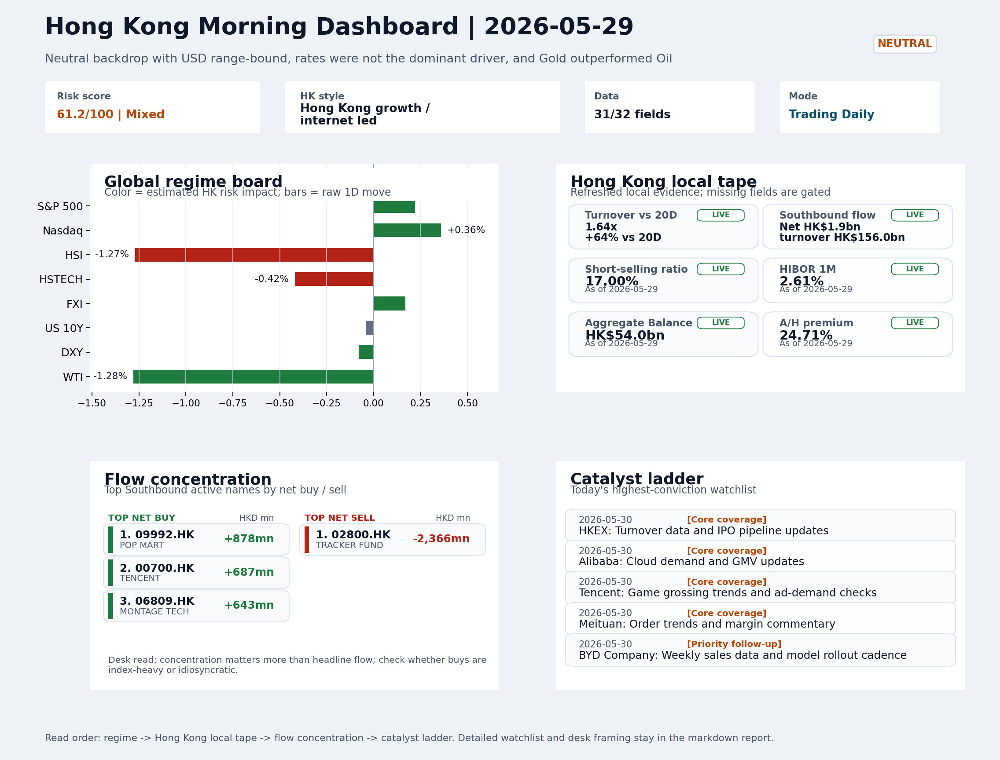
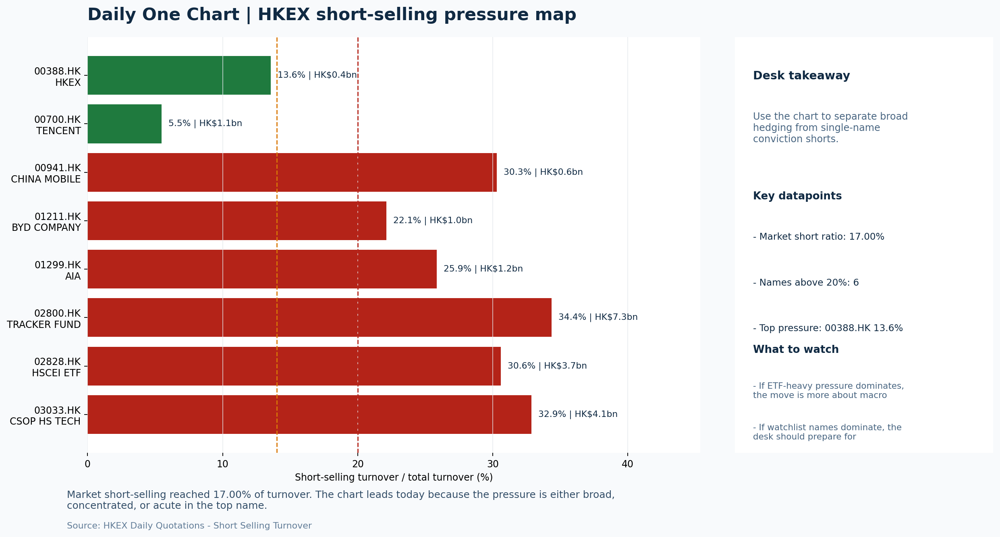

# Morning Research Workbench | 2026-05-30

> Designed for a Hong Kong sell-side commute: Layer 1 `Scan`, Layer 2 `Deep Read`, Layer 3 `Thinking`
> Mode: `Trading Daily` | Keep the report execution-oriented: what mattered in the completed session, what can move Hong Kong leadership, and what needs fast follow-up.
> Briefing date: `2026-05-30` | Review date: `2026-05-29` | Global request: `2026-05-29` | HK/China request: `2026-05-29` | Market effective date: `2026-05-29` | Generated at: `2026-05-30 08:16:30`

## Executive Summary

- **Market pulse:** A neutral cross-asset backdrop with active Hong Kong participation and intact offshore China proxies supports a selectively constructive open, though Intel's guidance reset caps.
- **Hong Kong lens:** Hong Kong growth / internet led. The Intel reset and semiconductor sentiment drag make an immediate recovery in HSTECH unlikely, but the intact FXI and USD/CNH reads keep the offshore China narrative.
- **Top catalysts:** INTC -6.33%; Neutral backdrop with USD range-bound, rates were not the dominant driver, and Gold outperformed Oil.

## Visual Dashboard

## Layer 1 | Scan (5-10 min)

### 1.1 One-Line Market Pulse
A neutral cross-asset backdrop with active Hong Kong participation and intact offshore China proxies supports a selectively constructive open, though Intel's guidance reset caps semiconductor sentiment and keeps the tape a confirmation exercise.

### 1.2 Global Asset Price Dashboard

| Asset | Last | 1D move | Read |
| --- | --- | --- | --- |
| S&P 500 | 7,580.06 | +0.22% | US large-cap risk appetite |
| Nasdaq 100 | 30,333.18 | +0.36% | Growth and duration leadership |
| Hang Seng Index | 25,006.16 | -1.27% | Hong Kong broad beta |
| Hang Seng TECH | 4.7820 | -0.42% | Hong Kong growth / platform read-through |
| CSI 300 | 4,914.21 | +0.12% | Mainland large-cap tone |
| US 10Y | 4.4530 | -0.04% | Global discount-rate anchor |
| China 10Y | 1.71% | -1.0bp | China local rates anchor \| Live public \| Eastmoney \| 2026-05-29 |
| CN-US 10Y spread | -274.1bp | -1.0bp | Relative carry and macro-pressure gauge \| Live public \| Eastmoney \| 2026-05-29 |
| DXY | 98.94 | -0.08% | Dollar liquidity impulse |
| USD/CNH | 6.7575 | -0.13% | Offshore China risk appetite |
| USD/HKD | 7.8359 | +0.03% | Linked-exchange regime stress check |
| Brent crude | 91.70 | **-2.14%** | Energy / geopolitics |
| COMEX gold | 4,569.90 | **+1.57%** | Hedge demand / real yields |
| Copper | 6.3940 | -0.03% | Global growth proxy |
| VIX | 15.32 | **-2.67%** | US stress barometer |

### 1.3 Hong Kong Key Data Quick Check

| Check | Value | Status | Source / as of | Why it matters |
| --- | --- | --- | --- | --- |
| Main Board turnover vs 20D | 1.64x \| +64% vs 20D | Live local | HKEX \| 2026-05-29 | Trailing 20-session average turnover was HK$282.5bn. |
| Southbound / Northbound net flow | Southbound Net HK$1.9bn \| turnover HK$156.0bn \| Northbound Turnover HK$473.4bn \| net not reported | Live local | HKEX Connect \| 2026-05-29 | Southbound net buy is calculated from HKEX disclosed buy and sell turnover. |
| Short-selling ratio | 17.00% | Live local | HKEX \| 2026-05-29 | Official HKEX stock-level short-selling table, aggregated as a share of total market turnover. |
| AH premium index | 24.71% | Live public | Yahoo \| 2026-05-29 | Simple average across 18 A/H pairs; use dispersion rather than the average alone. |
| USD/HKD spot vs band | 7.8359 \| band 7.7500 to 7.8500 | Live quote + local | Yahoo \| 2026-05-29 | Inside the linked-exchange band without immediate boundary stress. Official Convertibility Undertakings define the linked-rate stress boundaries for USD/HKD. |
| HIBOR 1M | 2.61% | Live local | HKMA \| 2026-05-29 | 1M HIBOR is the cleanest quick read for Hong Kong funding conditions and equity-duration pressure. |
| Aggregate Balance | HK$54.0bn | Live local | HKMA \| 2026-05-29 | Aggregate Balance helps frame whether linked-rate liquidity conditions are tight or comfortable. |
| Hong Kong leadership | Hong Kong growth / internet led | Proxy | HSI / HSCEI / HSTECH relative perf \| 2026-05-29 | Use HSI / HSCEI / HSTECH relative moves as the opening style read. |

### 1.4 Risk Dashboard
**Composite risk score:** `61.2/100` | **Regime:** `Mixed`

| Component | Score impact | Evidence |
| --- | --- | --- |
| US beta | +1.3 | S&P 500 +0.22% |
| HK growth | -2.1 | HSTECH -0.42% |
| Offshore China proxy | +0.9 | FXI +0.17% |
| Dollar pressure | +0.8 | DXY -0.08% |
| Volatility | +5.3 | VIX -2.67% |
| HK short-selling | +0 | Short-selling ratio 17.00% |

### 1.5 Morning Checklist
1. **INTC -6.33%**
 Mover attribution | Announcement / expectations | Guidance reset and margin pressure
2. **Neutral backdrop with USD range-bound, rates were not the dominant driver, and Gold outperformed Oil**
 Overnight regime | Start by deciding whether the day is about Neutral conditions or a style pivot.
3. **CPI MoM (Released)**
 Macro / policy | Rates expectations, the dollar, and growth-equity valuation | Industries: Technology, Internet, Brokers
4. **Trade Balance (Released)**
 Macro / policy | Watch whether it changes the day's core market narrative | Industries: Market-wide
5. **Retail Sales MoM (Upcoming)**
 Macro / policy | Consumer resilience, growth expectations, and risk-asset pricing | Industries: Consumer, E-commerce, Consumer discretionary

## Layer 2 | Deep Read (20-30 min)

### 2.1 Overnight Overseas Market Review
#### Market Setup
**Core tape.** Overnight US equities eked out modest gains (S&P 500 +0.22%, Nasdaq +0.36%) amid a neutral backdrop where rates and the dollar were not dominant drivers.
**Main driver.** Intel's guidance reset (-6.33%, importance A) overshadowed other events, weighing on semiconductor and hardware sentiment globally and raising questions about near-term demand visibility.
**HK relevance.** The cross-asset divergence of Gold (+1.57%) versus Oil (-1.28%) reflects a risk-neutral, non-directional tape rather than a clean risk-on or risk-off read.

#### Key Drivers
- Intel's -6.33% guidance reset signals margin pressure and potential demand concerns in semiconductors, with spillover implications.
- Gold outperforming Oil (spread +1.153%) frames a risk-neutral, non-directional backdrop rather than a directional risk move, keeping.
- USD/CNH -0.13% and FXI +0.17% confirm cross-border China risk appetite is not breaking down, even as local Hong Kong indices.
- Pending US Retail Sales (importance B, score 85) remains a wildcard for risk sentiment before the weekend.

#### Hong Kong Read-Through
**Desk lens.** Hong Kong growth / internet led.
**Opening implication.** The Intel reset and semiconductor sentiment drag make an immediate recovery in HSTECH unlikely, but the intact FXI and USD/CNH reads keep the offshore China narrative from breaking. A constructive open requires FXI to hold and VIX to stay subdued.
- **Cross-market read:** Hang Seng -1.27% / HSCEI -1.17% / HSTECH -0.42%.
- **Cross-market read:** Offshore China proxy FXI +0.17% and USD/CNH -0.13% frame cross-border risk appetite.
- **Cross-market read:** USD/HKD last traded around 7.8359, which keeps the Hong Kong funding lens in focus.

#### Watch Points
- USD composite moved higher by +0.03pct intraday, with a 0.21pct range.
- Main turning points appeared around 2026-05-29 08:05 peak / 2026-05-29 08:20 trough / 2026-05-29 08:40 trough, suggesting event-driven repricing.
- The biggest cross-asset divergence was Gold versus Oil, a spread of 1.153pct.
- Gold moved +0.81pct intraday with a 1.961pct high-low range.

**Curated overnight stories**
1. **INTC slides 6.33% on guidance reset and margin pressure**
 Why it matters: Intel's guidance reset signals potential demand concerns in semiconductors and raises margin questions for the broader hardware ecosystem.
 HK read-through: Most relevant for HK-listed semiconductor names, hardware manufacturers, and China tech sentiment. Could weigh on EV/tech hardware proxies.
2. **US CPI MoM released - affects Fed path and USD direction**
 Why it matters: Fed Governor Michelle Bowman flagged concerns over inflation spikes, reinforcing a 'cautious hold' stance.
 HK read-through: Rates expectations, USD movement, and growth-valuation sensitivity directly affect HK internet companies, technology, and brokers.
3. **US Trade Balance released - watch for shift in core narrative**
 Why it matters: Trade Balance data was flagged as a watch item (score 88) for potential to alter the session's core market narrative.
 HK read-through: Relevant for HK-listed manufacturers and trade-linked names. A weaker or stronger-than-expected figure changes China macro narrative heading into the weekend.
4. **Nio shares jump 10% after flagship EV release - first in over two years**
 Why it matters: Product-cycle validation for Nio. Launch of two lower-priced brands signals strategy to broaden customer base amid sluggish consumer demand.
 HK read-through: First-mapping into Autos and EV leaders. BYD, Geely, and other HK-listed EV peers may see sentiment lift from sector leadership move.
5. **US Retail Sales MoM upcoming - consumer resilience in focus**
 Why it matters: Retail Sales data (score 85) remains outstanding and could shift risk sentiment before the weekend.
 HK read-through: Primary relevance for HK consumer, e-commerce, and consumer discretionary names. Weak data would reinforce cautious consumption narrative for China-linked names.

### 2.2 Hong Kong / A-share Previous-Day Review
#### Local Tape Setup
**Local read.** HSTECH fell -0.42% on the session, outperforming both HSI (-1.27%) and HSCEI (-1.17%), a relative display that suggests growth/quality names held better in the down day.
**Verification point.** Southbound net was HK$1.9bn (SSE Southbound +HK$4.2bn, SZSE Southbound -HK$2.3bn) with turnover at HK$156bn; the net and turnover confirmation is complete for southbound.
**Risk to watch.** Short-selling was 17% of Main Board turnover (HK$80.6bn short); tracker-fund short ratios were elevated (TRACKER FUND 34%, HSCEI ETF 31%) without extreme dislocation.

#### Style and Local Leadership
**Style leadership.** Hong Kong growth / internet led.
- **Cross-market read:** Hang Seng -1.27% / HSCEI -1.17% / HSTECH -0.42%.
- **Cross-market read:** Offshore China proxy FXI +0.17% and USD/CNH -0.13% frame cross-border risk appetite.
- **Cross-market read:** USD/HKD last traded around 7.8359, which keeps the Hong Kong funding lens in focus.

#### Flow Confirmation
Official Stock Connect evidence is available; use Section 2.3 to confirm whether local money supports the price action.

#### Follow-Through Checklist
**Follow-through check.** Watch whether HSTECH and FXI both hold or the relative gap compresses if HSI/HSCEI sell further. Northbound net-buy confirmation is incomplete per HKEX daily file limitations.

### 2.3 Flow Tracker and Attribution
#### Cross-Asset Attribution v1

| Driver | Direction | Score | Evidence | HK implication |
| --- | --- | --- | --- | --- |
| Hong Kong participation | supportive | 6.36 | Main Board turnover was 1.64x the 20-session average. | Higher participation makes local price action more credible. |
| Oil and geopolitics | supportive | 1.71 | Oil moved -2.14%. | Split the read between energy/cyclicals support and margin/geopolitical pressure. |

#### Flow Tracker
##### Flow Takeaways
- Hong Kong participation is active and short pressure is not excessive, so local confirmation looks healthier.
- Stock Connect Southbound: net HK$1.9bn on turnover HK$156.0bn (as of 2026-05-29).
- Stock Connect Northbound: turnover RMB473.4bn; public file provides total turnover/top active names, not full net-buy.
- AH premium: simple covered-pair average +24.71%; widest premium: China Railway 57.33%.

##### Stock Connect Southbound Active Names

| Rank | Ticker | Name | Buy | Sell | Net buy |
| --- | --- | --- | --- | --- | --- |
| 8 | 02800.HK | TRACKER FUND | HK$2.3mn | HK$2,368.2mn | HK$-2,365.9mn |
| 2 | 09992.HK | POP MART | HK$4,523.2mn | HK$3,645.3mn | HK$878.0mn |
| 3 | 00700.HK | TENCENT | HK$3,351.5mn | HK$2,664.0mn | HK$687.5mn |
| 9 | 06809.HK | MONTAGE TECH | HK$1,353.8mn | HK$710.7mn | HK$643.2mn |
| 1 | 00981.HK | SMIC | HK$7,489.7mn | HK$6,949.3mn | HK$540.4mn |

##### AH Premium Dispersion

| Name | A ticker | H ticker | Premium | As of |
| --- | --- | --- | --- | --- |
| China Railway | 601390.SS | 0390.HK | +57.33% | 2026-05-29 |
| China Communications Construction | 601800.SS | 1800.HK | +53.96% | 2026-05-29 |
| China Railway Construction | 601186.SS | 1186.HK | +52.77% | 2026-05-29 |
| China Construction Bank | 601939.SS | 0939.HK | +35.81% | 2026-05-29 |
| China Life | 601628.SS | 2628.HK | +35.61% | 2026-05-29 |

##### HKEX Short-Selling Watch

| Ticker | Name | Short ratio | Short turnover | Total turnover |
| --- | --- | --- | --- | --- |
| 00388.HK | HKEX | 13.57% | HK$0.4bn | HK$2.6bn |
| 00700.HK | TENCENT | 5.48% | HK$1.1bn | HK$20.6bn |
| 00941.HK | CHINA MOBILE | 30.31% | HK$0.6bn | HK$1.8bn |
| 01211.HK | BYD COMPANY | 22.12% | HK$1.0bn | HK$4.6bn |
| 01299.HK | AIA | 25.85% | HK$1.2bn | HK$4.7bn |

- **Short-value leaders:** 02800.HK TRACKER FUND (HK$7.3bn); 03033.HK CSOP HS TECH (HK$4.1bn); 02828.HK HSCEI ETF (HK$3.7bn); 00992.HK LENOVO GROUP (HK$3.6bn).

### 2.4 Macro and Policy Tracking
**Desk read.** The completed session closed with a neutral tone as USD ranged and rates did not dominate.

**Market sensitivity.** However, the US CPI release at 20:30 on the briefing date (Actual 0.3% vs Forecast 0.2%, Prior 0.4%) is the first test of that restraint.

**HK implication.** A hotter-than-expected print can rapidly reprice duration, the dollar, and tech/Internet sector multiples that Hong Kong leadership depends on.

**Macro watchpoints**
- US 10-year yield and DXY reaction following the CPI release (20:30).
- Whether HK tech and broker proxies hold if rates reprice higher.
- US Retail Sales actual vs 0.3% forecast - growth caution vs resilience.
- Powell remarks at 22:00 - any hawkish pivot could reverse the VIX decline.

| Time | Region | Event | Status | Desk read |
| --- | --- | --- | --- | --- |
| 20:30 | US | CPI MoM | Released | Impact: Rates expectations, the dollar, and growth-equity valuation \| Attention: 5/5 \| Industries: Technology, Internet, Brokers |
| 09:30 | China | Trade Balance | Released | Impact: Watch whether it changes the day's core market narrative \| Attention: 3/5 \| Industries: Market-wide |
| 20:30 | US | Retail Sales MoM | Upcoming | Impact: Consumer resilience, growth expectations, and risk-asset pricing \| Attention: 5/5 \| Industries: Consumer, E-commerce, Consumer discretionary |
| 09:20 | China | Loan Prime Rate | Upcoming | Impact: Watch whether it changes the day's core market narrative \| Attention: 3/5 \| Industries: Market-wide |
| 22:00 | Federal Reserve | Jerome Powell: Economic outlook remarks | Central bank | Impact: Policy path, liquidity conditions, and cross-asset risk appetite \| Attention: 5/5 \| Industries: Technology, Financials, Gold |
| 10:00 | PBOC | Open Market Operations Desk: Daily liquidity operation window | Central bank | Impact: Policy path, liquidity conditions, and cross-asset risk appetite \| Attention: 3/5 \| Industries: Technology, Financials, Gold |

#### Positioning and Risk Backdrop
- Options activity centered on KWEB Call, with Vol/OI at 1.88x and a bullish bias.
- Put/Call structure shows equity 0.68 / index 1.15, implying Single-stock optimism with index hedging.
- Geopolitics: Middle East | Regional tension remains elevated | Impact: Oil, freight costs, and safe-haven demand
- Geopolitics: US-China | Technology export-control rhetoric remains active | Impact: China internet, semiconductors, and supply chains

### 2.5 Key Company and Sector Events

| Grade | Sector | Headline | Why it matters | Horizon |
| --- | --- | --- | --- | --- |
| B | Autos and EV | Nio shares jump 10% after releasing first flagship EV in more than | This is more about order visibility and product-cycle validation | Short-term catalyst |

#### HKEX Announcements

| Grade | Ticker | Type | Release time | Title |
| --- | --- | --- | --- | --- |
| A | 00852.HK | Profit warning | 2026-05-29 | Profit warning / alert announcement |
| A | 02193.HK | Profit warning | 2026-05-29 | Profit warning / alert announcement |
| A | 01473.HK | Profit warning | 2026-05-28 | Profit warning / alert announcement |
| A | 01709.HK | Profit warning | 2026-05-28 | Profit warning / alert announcement |
| A | 01711.HK | Profit warning | 2026-05-28 | Profit warning / alert announcement |
| A | 00321.HK | Profit warning | 2026-05-27 | Profit warning / alert announcement |
| A | 08168.HK | Profit warning | 2026-05-27 | Profit warning / alert announcement |
| A | 03315.HK | Profit warning | 2026-05-25 | Profit warning / alert announcement |

#### Earnings / Results Watch

| Ticker | Company | Timing | Expectation framing |
| --- | --- | --- | --- |
| 0700.HK | Tencent Holdings | After Market Close | EPS est. 4.15 HKD \| revenue est. 163.2bn HKD |
| 0388.HK | Hong Kong Exchanges and Clearing | Before Market Open | EPS est. 2.81 HKD \| revenue est. 6.0bn HKD |

#### Rating Changes
- **9988.HK** | Morgan Stanley | Upgrade | Equal Weight -> Overweight | PT 92 -> 105

#### IPO Watch
- IPO and grey-market monitoring is not yet part of the standard production pack.

### 2.6 Today's Core Names
#### Core coverage

| Name | Ticker | Last | 1D | Range position | Morning note |
| --- | --- | --- | --- | --- | --- |
| HKEX | 0388.HK | 399.80 | +0.91% | Mid-range | Positioning is neutral for now, so use it mainly to monitor marginal information changes. |
| Alibaba | 9988.HK | 120.90 | -0.74% | Bottom of range | The name sits near the bottom of its recent range and is worth monitoring for a catalyst-led reversal. |

**Recent headlines for Alibaba:**
- [Alibaba's Blockchain Lending And Smart City Push Versus Current Valuation](https://finance.yahoo.com/markets/stocks/articles/alibaba-blockchain-lending-smart-city-131050344.html) (Simply Wall St.)

#### Priority follow-up

| Name | Ticker | Last | 1D | Range position | Morning note |
| --- | --- | --- | --- | --- | --- |
| BYD Company | 1211.HK | 91.30 | +1.11% | Bottom of range | The name sits near the bottom of its recent range and is worth monitoring for a catalyst-led reversal. |
| China Mobile | 0941.HK | 85.15 | +0.35% | Top of range | The name sits near the top of its recent range, so watch for profit-taking under high expectations. |

## Layer 3 | Thinking (10-15 min)

### 3.1 Rotating Theme Deep Dive

| Field | Read |
| --- | --- |
| Theme | AI and Compute Chain |
| Angle for the day | Track whether global AI capex, semis, cloud, and server demand are still carrying offshore China internet and hardware sentiment. |

**Theme desk read**
**Core thesis.** The AI and Compute Chain weekly theme still warrants attention because the overnight session delivered a direct stress test from INTC -6.33% on a guidance reset and margin pressure, challenging the smooth global capex story.
**Evidence.** With Alibaba and Tencent both sitting near the bottom of their recent ranges, the question is whether the soft hardware signal spills over or whether stock-specific catalysts - cloud demand and GMV updates for Alibaba, game.
**What to test.** The VIX lower and gold higher alongside the dollar suggest no immediate regime shift, so these upcoming checks and the US Retail Sales print become the near-term decision points for positioning.

**Signals to keep in mind**
- VIX -2.67%: Lower volatility signals easing stress in the tape.
- Gold +1.57%: Gold rising with the dollar looks more like geopolitical or pure hedge demand.

**LLM watch items:**
- INTC -6.33%: monitor whether the guidance reset and margin pressure cascade into Asian semis and cloud server supply chains in the Hong Kong session.
- Alibaba: cloud demand and GMV updates (May 30) to gauge whether China AI-related services can offset broader hardware caution.
- Tencent: game grossing trends and ad-demand checks (May 30) as real-time proxies for AI monetization and ad-dependency in a mixed macro environment.
- US Retail Sales MoM (upcoming): a hot or cold print could reshape consumer-linked AI capex assumptions for e-commerce and cloud end-markets.

**Related names to keep close:**

| Name | Ticker | Bucket | Morning read |
| --- | --- | --- | --- |
| HKEX | 0388.HK | Core coverage | Positioning is neutral for now, so use it mainly to monitor marginal information changes. |
| Alibaba | 9988.HK | Core coverage | The name sits near the bottom of its recent range and is worth monitoring for a catalyst-led reversal. |
| Tencent | 0700.HK | Core coverage | The name sits near the bottom of its recent range and is worth monitoring for a catalyst-led reversal. |
| AIA | 1299.HK | Priority follow-up | Positioning is neutral for now, so use it mainly to monitor marginal information changes. |

**Upcoming catalysts tied to the theme:**
- 2026-05-30 | Alibaba: Cloud demand and GMV updates | Key read-through for China consumption, cloud, and platform regulation
- 2026-05-30 | Tencent: Game grossing trends and ad-demand checks | Core offshore China platform proxy for gaming, ads, and AI monetization
- 2026-05-30 | AIA: NBV trends and agency momentum | Read-through for wealth demand, mainland visitor activity, and HK financial sentiment
- 2026-05-30 | Hang Seng TECH ETF: AI narrative shifts and China platform regulation headlines | Fast proxy for Hong Kong internet and growth leadership

### 3.2 Today Ahead and Trading Calendar
- Macro: CPI MoM is the first item to anchor the open and the rates/FX response.
- Corporate / event: HKEX: Turnover data and IPO pipeline updates is the cleanest same-day catalyst to prepare for.

**Same-day macro docket**

| Time | Country | Event | Status | Detail |
| --- | --- | --- | --- | --- |
| 20:30 | US | CPI MoM | Released | Actual 0.3% / Forecast 0.2% / Prior 0.4% |
| 09:30 | China | Trade Balance | Released | Actual USD 85.2bn / Forecast USD 79.0bn / Prior USD 80.6bn |
| 20:30 | US | Retail Sales MoM | Upcoming | Forecast 0.3% / Prior 0.6% |
| 09:20 | China | Loan Prime Rate | Upcoming | Forecast 3.45% / Prior 3.45% |
| 22:00 | Federal Reserve | Jerome Powell: Economic outlook remarks | Central bank | speech |

**Same-day catalyst list**

| Date | Time | Category | Event | Importance |
| --- | --- | --- | --- | --- |
| 2026-05-30 | | Core coverage | HKEX: Turnover data and IPO pipeline updates | 3 |
| 2026-05-30 | | Core coverage | Alibaba: Cloud demand and GMV updates | 3 |
| 2026-05-30 | | Core coverage | Tencent: Game grossing trends and ad-demand checks | 3 |
| 2026-05-30 | | Core coverage | Meituan: Order trends and margin commentary | 3 |

**Next few sessions**

| Date | Category | Event | Impact |
| --- | --- | --- | --- |
| 2026-05-30 | Core coverage | HKEX: Turnover data and IPO pipeline updates | Direct proxy for Hong Kong market turnover, listings, and southbound |
| 2026-05-30 | Core coverage | Alibaba: Cloud demand and GMV updates | Key read-through for China consumption, cloud, and platform regulation |
| 2026-05-30 | Core coverage | Tencent: Game grossing trends and ad-demand checks | Core offshore China platform proxy for gaming, ads, and AI monetization |
| 2026-05-30 | Core coverage | Meituan: Order trends and margin commentary | High-frequency read on local services demand and platform competition |

### 3.3 Daily One Chart
**Daily One Chart | HKEX short-selling pressure map**

**Chart read.** Market short-selling reached 17.00% of turnover.
**Why it matters.** The chart leads today because the pressure is either broad, concentrated, or acute in the top name.

_Source: HKEX Daily Quotations - Short Selling Turnover_

## Traceable Appendix

### Report Metadata
> Date policy: Review date 2026-05-29 is treated as `Trading Daily`. | Global request date is 2026-05-29; adapter effective date is 2026-05-29 and summary date is 2026-05-29. | HK/China local data date is 2026-05-29; role: same-session local cash tape.
> Market data quality: Coverage: `31/32` | Missing: `1`
> Report quality: `87.4/100` | Grade `B` | Status `production ready`

### Key Questions to Keep in Mind
- Is risk appetite rising or fading? The overnight tape reads closer to `Neutral`.
- Did rates expectations move? Focus on whether US 10Y, DXY, and growth style moved together.
- Were commodities the real story? Watch WTI and gold for geopolitics versus inflation signals.
- Is Hong Kong setup internet-led, SOE-led, or broad beta-led? Compare HSTECH, HSCEI, and HSI.
- Did offshore markets move China risk appetite? Focus on HSI, FXI, USD/CNH, and USD/HKD.

### Report Quality and Validation
- **Quality score:** 87.4/100 | **Grade:** B | **Status:** production ready
- **Run summary:** 7 healthy | 1 caveat | 0 failed
- **Release recommendation:** Send with caveats | The report is usable, but the advisory guidance should travel with it so readers understand the data gaps.

| Source | Status | Bucket |
| --- | --- | --- |
| Market data | ok | healthy |
| Sector and company news | ok | healthy |
| Movers and short selling | ok | healthy |
| Stock Connect | ok | healthy |
| A/H premium | ok | healthy |
| Hong Kong local package | ok | healthy |
| China rates | ok | healthy |
| Narrative overlay | partial | caveat |

**Desk-use guidance summary:** 0 blocking | 1 advisory

**Desk-use guidance**
- **Advisory:** Use deterministic sections as primary support; the narrative overlay was partial or unavailable on this run.

| Component | Score | Weight | Read |
| --- | --- | --- | --- |
| Market data coverage | 96.9 | 0.3 | 31/32 core market fields available. |
| Hong Kong local metrics | 82.3 | 0.25 | 8 live, 3 proxy, 0 unavailable local checks. |
| Key public adapters | 100.0 | 0.2 | 4/4 key adapters were available or partially available. |
| Narrative overlay health | 51.4 | 0.15 | 2/7 narrative overlay tasks succeeded or used validated cache; 1 error(s). |
| Fact-check guardrail | 100.0 | 0.1 | Checked 6 numeric claims; 0 numeric mismatch(es), 0 logic warning(s); 0 critical, 0 review. |

**Quality warnings**
- Narrative overlay health is weak: 2/7 narrative overlay tasks succeeded or used validated cache; 1 error(s).

**Narrative fact-check guardrail**
- Checked 6 numeric claims; 0 numeric mismatch(es), 0 logic warning(s); 0 critical, 0 review.

**Adapter status**

| Adapter | Status |
| --- | --- |
| Stock Connect | ok |
| A/H premium | ok |
| HKEX announcements | ok |
| China rates | ok |

### Source Links
- [Nio shares jump 10% after releasing first flagship EV in more than two years](https://www.cnbc.com/2026/05/28/nio-surges-9percent-after-releasing-first-flagship-ev-in-more-than-two-years.html) (cnbc_markets)
- [Alibaba's Blockchain Lending And Smart City Push Versus Current Valuation](https://finance.yahoo.com/markets/stocks/articles/alibaba-blockchain-lending-smart-city-131050344.html) (Simply Wall St.)
- [Here is What to Know Beyond Why Alibaba Group Holding Limited (BABA) is a Trending Stock](https://finance.yahoo.com/markets/stocks/articles/know-beyond-why-alibaba-group-130005086.html) (Zacks)
- [Tencent rolls out inbound payments upgrades, adds PayPal QR support](https://www.electronicpaymentsinternational.com/news/tencent-rolls-out-inbound-payments-upgrades/) (Electronic Payments)
- [How The Tencent Holdings (SEHK:700) Story Is Shifting With AI Spending And Split Price Targets](https://finance.yahoo.com/markets/stocks/articles/tencent-holdings-sehk-700-story-211316189.html) (Simply Wall St.)
- [China Is Moving Quickly to 'Instant Retail.' 3 Stocks to Watch.](https://www.barrons.com/articles/china-instant-delivery-retail-e814ddbe?siteid=yhoof2&yptr=yahoo) (Barrons.com)
- [Assessing Meituan (SEHK:3690) Valuation After Recent Share Price Weakness And Ongoing Losses](https://finance.yahoo.com/markets/stocks/articles/assessing-meituan-sehk-3690-valuation-151405137.html) (Simply Wall St.)
- [Is It Too Late To Consider AIA Group (SEHK:1299) After Its 82% One Year Rally?](https://finance.yahoo.com/markets/stocks/articles/too-consider-aia-group-sehk-042100864.html) (Simply Wall St.)
- [00852.HK Profit warning / alert announcement](http://www1.hkexnews.hk/listedco/listconews/sehk/2026/0529/2026052900279.pdf) (HKEXnews)
- [02193.HK Profit warning / alert announcement](http://www1.hkexnews.hk/listedco/listconews/sehk/2026/0529/2026052901653.pdf) (HKEXnews)
- [01473.HK Profit warning / alert announcement](http://www1.hkexnews.hk/listedco/listconews/sehk/2026/0528/2026052801839.pdf) (HKEXnews)
- [01709.HK Profit warning / alert announcement](http://www1.hkexnews.hk/listedco/listconews/sehk/2026/0528/2026052800537.pdf) (HKEXnews)
- [01711.HK Profit warning / alert announcement](http://www1.hkexnews.hk/listedco/listconews/sehk/2026/0528/2026052802007.pdf) (HKEXnews)
- [00321.HK Profit warning / alert announcement](http://www1.hkexnews.hk/listedco/listconews/sehk/2026/0527/2026052700987.pdf) (HKEXnews)
- [08168.HK Profit warning / alert announcement](http://www1.hkexnews.hk/listedco/listconews/gem/2026/0527/2026052602040.pdf) (HKEXnews)

## Supplementary Visual Appendix

This appendix is professional-path only. It keeps a traceable index of the report visuals and the deterministic chart cues used to frame the morning note, without injecting the legacy intraday chart pack.

### Visual Index

| Visual | Path | Role |
| --- | --- | --- |
| Visual Dashboard | `charts/dashboard_2026-05-30.png` | Cross-asset regime board and Hong Kong local tape snapshot. |
| Daily One Chart | `charts/daily_one_chart_2026-05-30.png` | Single highest-conviction visual story for the day. |

### Deterministic Chart Cues
- FX / liquidity: USD composite moved higher by +0.03pct intraday, with a 0.21pct range.
- FX / liquidity: Main turning points appeared around 2026-05-29 08:05 peak / 2026-05-29 08:20 trough / 2026-05-29 08:40 trough, suggesting event-driven repricing rather than a clean one-way USD move.
- Cross-asset: The biggest cross-asset divergence was Gold versus Oil, a spread of 1.153pct.
- Cross-asset: Gold moved +0.81pct intraday with a 1.961pct high-low range.
- Cross-asset: Oil moved -0.34pct intraday with a 2.782pct high-low range.
- Cross-asset: Bitcoin moved -0.34pct intraday with a 2.277pct high-low range.

### Risk Dashboard Components

| Component | Score impact | Evidence |
| --- | --- | --- |
| US beta | +1.3 | S&P 500 +0.22% |
| HK growth | -2.1 | HSTECH -0.42% |
| Offshore China proxy | +0.9 | FXI +0.17% |
| Dollar pressure | +0.8 | DXY -0.08% |
| Volatility | +5.3 | VIX -2.67% |
| HK short-selling | +0 | Short-selling ratio 17.00% |
