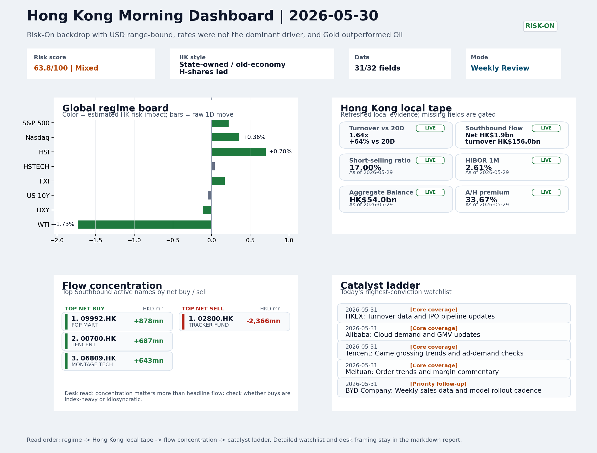
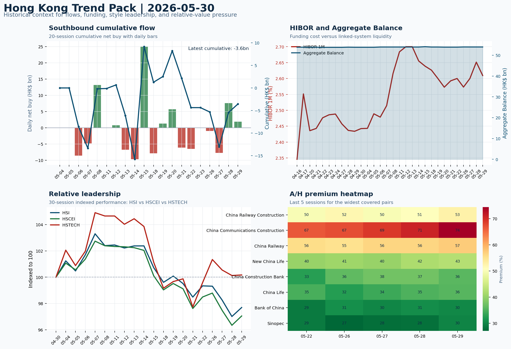

# Morning Research Workbench | 2026-05-31

> Designed for a Hong Kong sell-side commute: Layer 1 `Scan`, Layer 2 `Deep Read`, Layer 3 `Thinking`
> Mode: `Weekly Review` | Use Saturday's non-trading review date to synthesize the completed Hong Kong week and prepare next week's work plan.
> Briefing date: `2026-05-31` | Review date: `2026-05-30` | Global request: `2026-05-30` | HK/China request: `2026-05-29` | Market effective date: `2026-05-29` | Generated at: `2026-05-31 08:10:13`

## Executive Summary

- **Market pulse:** The completed week delivered a Risk-On frame with active turnover and stable funding, but value/OE leadership over growth and the SZSE leg's net selling raise the question of whether.
- **Hong Kong lens:** Hong Kong growth / internet led. The overnight risk-on tone and lower yields are broadly supportive for Hong Kong ahead of Monday. However, last week's HSCEI leadership and HSTECH's mere 0.04% gain suggest that.
- **Top catalysts:** Risk-On backdrop with USD range-bound, rates were not the dominant driver, and Gold outperformed Oil; CPI MoM (Released).

## Visual Dashboard

## Layer 1 | Weekly Scan (5-10 min)

### 1.1 One-Line Market Pulse
The completed week delivered a Risk-On frame with active turnover and stable funding, but value/OE leadership over growth and the SZSE leg's net selling raise the question of whether the move was conviction-driven or mainly broad-beta rotation that needs confirmation early next week.

### 1.2 Global Asset Price Dashboard

| Asset | Last | 1D move | Read |
| --- | --- | --- | --- |
| S&P 500 | 7,580.06 | +0.22% | US large-cap risk appetite |
| Nasdaq 100 | 30,333.18 | +0.36% | Growth and duration leadership |
| Hang Seng Index | 25,182.39 | +0.70% | Hong Kong broad beta |
| Hang Seng TECH | 4.7840 | +0.04% | Hong Kong growth / platform read-through |
| CSI 300 | 4,892.12 | -0.45% | Mainland large-cap tone |
| US 10Y | 4.4530 | -0.04% | Global discount-rate anchor |
| China 10Y | 1.71% | -1.0bp | China local rates anchor \| Live public \| Eastmoney \| 2026-05-29 |
| CN-US 10Y spread | -274.1bp | -1.0bp | Relative carry and macro-pressure gauge \| Live public \| Eastmoney \| 2026-05-29 |
| DXY | 98.91 | -0.11% | Dollar liquidity impulse |
| USD/CNH | 6.7590 | -0.10% | Offshore China risk appetite |
| USD/HKD | 7.8333 | -0.00% | Linked-exchange regime stress check |
| Brent crude | 92.05 | **-1.77%** | Energy / geopolitics |
| COMEX gold | 4,560.50 | +1.36% | Hedge demand / real yields |
| Copper | 6.3595 | -0.57% | Global growth proxy |
| VIX | 15.32 | **-2.67%** | US stress barometer |

### 1.3 Hong Kong Weekly Tape Quick Check

| Check | Value | Status | Source / as of | Why it matters |
| --- | --- | --- | --- | --- |
| Main Board turnover vs 20D | 1.64x \| +64% vs 20D | Live local | HKEX \| 2026-05-29 | Trailing 20-session average turnover was HK$282.5bn. |
| Southbound / Northbound net flow | Southbound Net HK$1.9bn \| turnover HK$156.0bn \| Northbound Turnover HK$473.4bn \| net not reported | Live local | HKEX Connect \| 2026-05-29 | Southbound net buy is calculated from HKEX disclosed buy and sell turnover. |
| Short-selling ratio | 17.00% | Live local | HKEX \| 2026-05-29 | Official HKEX stock-level short-selling table, aggregated as a share of total market turnover. |
| AH premium index | 33.67% | Live public | Yahoo \| 2026-05-29 | Simple average across 16 A/H pairs; use dispersion rather than the average alone. |
| USD/HKD spot vs band | 7.8333 \| band 7.7500 to 7.8500 | Live quote + local | Yahoo \| 2026-05-29 | Inside the linked-exchange band without immediate boundary stress. Official Convertibility Undertakings define the linked-rate stress boundaries for USD/HKD. |
| HIBOR 1M | 2.61% | Live local | HKMA \| 2026-05-29 | 1M HIBOR is the cleanest quick read for Hong Kong funding conditions and equity-duration pressure. |
| Aggregate Balance | HK$54.0bn | Live local | HKMA \| 2026-05-29 | Aggregate Balance helps frame whether linked-rate liquidity conditions are tight or comfortable. |
| Hong Kong leadership | Hong Kong growth / internet led | Proxy | HSI / HSCEI / HSTECH relative perf \| 2026-05-29 | Use HSI / HSCEI / HSTECH relative moves as the opening style read. |

### 1.4 Risk Dashboard
**Composite risk score:** `63.8/100` | **Regime:** `Mixed`

| Component | Score impact | Evidence |
| --- | --- | --- |
| US beta | +1.3 | S&P 500 +0.22% |
| HK growth | +0.2 | HSTECH +0.04% |
| Offshore China proxy | +0.9 | FXI +0.17% |
| Dollar pressure | +1.1 | DXY -0.11% |
| Volatility | +5.3 | VIX -2.67% |
| HK short-selling | +0 | Short-selling ratio 17.00% |

### 1.5 Next Week Checklist
1. **Risk-On backdrop with USD range-bound, rates were not the dominant driver, and Gold outperformed Oil**
 Still-moving markets | No fresh Hong Kong cash session is assumed; use global active assets and policy/event flow to prepare the next open.
2. **CPI MoM (Released)**
 Macro / policy | Rates expectations, the dollar, and growth-equity valuation | Industries: Technology, Internet, Brokers
3. **Trade Balance (Released)**
 Macro / policy | Watch whether it changes the day's core market narrative | Industries: Market-wide
4. **Retail Sales MoM (Upcoming)**
 Macro / policy | Consumer resilience, growth expectations, and risk-asset pricing | Industries: Consumer, E-commerce, Consumer discretionary
5. **Loan Prime Rate (Upcoming)**
 Macro / policy | Watch whether it changes the day's core market narrative | Industries: Market-wide

## Layer 2 | Deep Read (20-30 min)

### 2.1 Weekly Cross-Asset Review
> Weekly review mode: synthesize the completed Hong Kong week, retain the main cross-asset and policy lessons, and convert them into next-week preparation rather than treating Saturday as a fresh cash-market session.

#### Market Setup
**Core tape.** US equities pushed higher with the S&P up 0.22% and Nasdaq 0.36% as a 4bp drop in 10Y yields to 4.453% and a softer dollar supported growth shares, while WTI crude's 1.73% decline eased energy-cost pressure.
**Main driver.** Gold rallied 1.36% even as equities rose, a divergence that points to cautious hedging within the risk-on frame.
**HK relevance.** European shares were near flat, failing to amplify the positive tone.

#### Key Drivers
- Declining 10Y Treasury yields (down 4bp) lowered discount-rate pressure for growth/tech.
- DXY slipped 0.11%, removing a minor headwind for risk assets.
- Oil dropped 1.73%, trimming inflation-sensitive input-cost fears.
- Gold's +1.36% move alongside equity gains signals defensive demand is not fully absent from the risk-on backdrop.

#### Hong Kong Read-Through
**Desk lens.** State-owned / old-economy H-shares led.
**Opening implication.** The overnight risk-on tone and lower yields are broadly supportive for Hong Kong ahead of Monday. However, last week's HSCEI leadership and HSTECH's mere 0.04% gain suggest that the rotation into SOE H-shares may persist unless next week's catalysts - US CPI.
- **Cross-market read:** Hang Seng +0.70% / HSCEI +0.73% / HSTECH +0.04%.
- **Cross-market read:** Offshore China proxy FXI +0.17% and USD/CNH -0.10% frame cross-border risk appetite.
- **Cross-market read:** USD/HKD last traded around 7.8333, which keeps the Hong Kong funding lens in focus.

#### Watch Points
- USD composite moved higher by +0.03pct intraday, with a 0.21pct range.
- Main turning points appeared around 2026-05-29 08:05 peak / 2026-05-29 08:20 trough / 2026-05-29 08:40 trough, suggesting event-driven repricing.
- The biggest cross-asset divergence was Gold versus Oil, a spread of 2.116pct.
- Gold moved +1.32pct intraday with a 1.961pct high-low range.

#### Weekly Review Map
- Weekly review window: 2026-05-25 to 2026-05-29. Core regime: Risk-On backdrop with USD range-bound, rates were not the dominant driver, and Gold outperformed Oil. Hong Kong leadership: State-owned / old-economy H-shares led.
- Method note: Trend summary uses the latest available five observations from the Hong Kong Trend Pack inputs.

**Cross-asset weekly dashboard**

| Asset | Latest move | Weekly read |
| --- | --- | --- |
| S&P 500 | +0.22% | Risk appetite |
| Nasdaq 100 | +0.36% | Growth style |
| Hang Seng Index | +0.70% | Hong Kong beta |
| Hang Seng TECH | +0.04% | Hong Kong growth / internet tone |
| DXY | -0.11% | Global liquidity |
| US 10Y | -0.04% | Rates path |
| Gold | +1.36% | Hedge / real yields |
| VIX | -2.67% | Volatility and hedging |

**Hong Kong / China weekly tape**

| Signal | Latest move | Read |
| --- | --- | --- |
| Hang Seng Index | +0.70% | Hong Kong beta |
| HSCEI | +0.73% | China SOE / H-share tone |
| Hang Seng TECH | +0.04% | Hong Kong growth / internet tone |
| China proxy (FXI) | +0.17% | China sentiment |
| USD/CNH | -0.10% | China FX sentiment |
| USD/HKD | -0.00% | Hong Kong funding lens |

**Five-session trend evidence**
_Window: 2026-05-22 to 2026-05-29_

| Signal | Five-session change | Latest | Desk read |
| --- | --- | --- | --- |
| Southbound flow | +0.8bn over 5 sessions | +1.9bn | 2/5 positive sessions; cumulative buying is the flow-confirmation test for next week. |
| HKD funding | HIBOR +1bp; Aggregate Balance +0.1bn | 2.61% / HK$54.0bn | Funding stress matters if HIBOR rises while Aggregate Balance contracts. |
| HK style leadership | HSTECH led (+0.6pp); HSI lagged (-1.6pp) | HSTECH leadership | Use HSI / HSCEI / HSTECH spread to separate broad beta from growth-led rerating. |
| A/H premium dispersion | +2.6pp average change | 44.9% average premium | Premium narrowing can support H-share relative demand |

**Flow and attribution clues**
- :
- :

**Next-week desk questions**
- Did Southbound flow confirm the index move, or was the week mainly offshore beta without local money follow-through?
- Did HIBOR and Aggregate Balance point to benign funding, or should tighter HKD liquidity be part of next week's risk case?
- Was leadership broad enough beyond HSTECH / platform beta, or was the week concentrated in a narrow style pocket?
- Which dated macro, policy, earnings, or IPO catalyst can realistically change the next-week narrative?
- What single data point would invalidate the base-case market pulse by Monday or Tuesday morning?

**Key developments to retain**

| Bucket | Item | Why it matters |
| --- | --- | --- |
| B | Nio shares jump 10% after releasing first flagship EV in more | This is more about order visibility and product-cycle validation |
| Released | CPI MoM | Rates expectations, the dollar, and growth-equity valuation |
| Released | Trade Balance | Watch whether it changes the day's core market narrative |
| Upcoming | Retail Sales MoM | Consumer resilience, growth expectations, and risk-asset pricing |

**Next-week playbook**

| Date | Catalyst | Desk read |
| --- | --- | --- |
| 2026-05-31 | HKEX: Turnover data and IPO pipeline updates | Direct proxy for Hong Kong market turnover, listings, and southbound interest |
| 2026-05-31 | Alibaba: Cloud demand and GMV updates | Key read-through for China consumption, cloud, and platform regulation |
| 2026-05-31 | Tencent: Game grossing trends and ad-demand checks | Core offshore China platform proxy for gaming, ads, and AI monetization |
| 2026-05-31 | Meituan: Order trends and margin commentary | High-frequency read on local services demand and platform competition |
| 2026-05-31 | BYD Company: Weekly sales data and model rollout cadence | Hong Kong-listed proxy for EV volumes, export mix, and price competition |
| 2026-05-31 | China Mobile: Capex updates and dividend policy signals | Defensive SOE benchmark for yield trade and domestic digital-infrastructure spend |
| 2026-05-31 | AIA: NBV trends and agency momentum | Read-through for wealth demand, mainland visitor activity, and HK financial sentiment |
| 2026-05-31 | HSCEI ETF: Policy flow-through and financial/energy leadership | Useful proxy for state-owned and old-economy H-share leadership |

**Curated overnight stories**
1. **Nio shares jump 10% after releasing first flagship EV in more than two years**
 Why it matters: Validates Nio's flagship product cycle after an extended quiet period; the 10% move signals investor appetite for China EV order-recovery narratives.
 HK read-through: Direct read-through to Hong Kong-listed China EV names and EV supply chain; reinforces broader consumer discretionary sentiment if follow-through holds.
2. **Risk-On backdrop with USD range-bound, rates were not the dominant driver, and Gold**
 Why it matters: Defines the market frame for the completed week; range-bound USD limits FX-driven volatility for HK dollar-linked assets and H-share earnings translation.
 HK read-through: Supports growth-equity and internet-sector bias; Gold/Oil divergence suggests cautious positioning within Risk-On, not a reversal signal.
3. **CPI MoM (Released) - upcoming watch for next week**
 Why it matters: Released CPI data enters the must-watch list at score 95; a print above/below expectations could shift the day's core narrative and rate-pricing globally.
 HK read-through: Rates expectations affect Technology, Internet, and Broker sectors most; HK growth-equity valuation sensitivity is elevated if CPI surprises.
4. **Retail Sales MoM (Upcoming) - upcoming watch for next week**
 Why it matters: Consumer-resilience data at score 85; will test whether spending data supports the Risk-On frame or shows fatigue.
 HK read-through: Directly relevant to Consumer, E-commerce, and Consumer Discretionary sectors listed in Hong Kong and offshore-China ADRs.
5. **Loan Prime Rate (Upcoming) - upcoming watch for next week**
 Why it matters: China's benchmark lending rate decision at score 78; any cut or hold signals PBOC policy bias for the quarter.
 HK read-through: Market-wide sensitivity; affects bank earnings, property-sector refinancing conditions, and broader China growth expectations.

### 2.2 Hong Kong / A-share Weekly Review
> Weekly review mode: synthesize the completed Hong Kong week, retain the main cross-asset and policy lessons, and convert them into next-week preparation rather than treating Saturday as a fresh cash-market session.

#### Local Tape Setup
**Local read.** The completed HK week delivered a Risk-On frame but with a conspicuous style disconnect: HSCEI rose 0.73% while HSTECH gained only 0.04%, suggesting state-owned and old-economy H-shares - not growth names - led the tape.
**Verification point.** Southbound netted HK$1.9bn, but the SZSE leg showed net selling (-HK$2.3bn).
**Risk to watch.** The KWEB call skew (Vol/OI 1.88x) signals offshore China growth optimism.

#### Style and Local Leadership
**Style leadership.** Hong Kong growth / internet led.
- **Cross-market read:** Hang Seng +0.70% / HSCEI +0.73% / HSTECH +0.04%.
- **Cross-market read:** Offshore China proxy FXI +0.17% and USD/CNH -0.10% frame cross-border risk appetite.
- **Cross-market read:** USD/HKD last traded around 7.8333, which keeps the Hong Kong funding lens in focus.

#### Flow Confirmation
Official Stock Connect evidence is available; use Section 2.3 to confirm whether local money supports the price action.

#### Follow-Through Checklist
**Follow-through check.** Watch HSTECH vs HSCEI spread and Southbound cumulative net flow. If HSTECH reclaims leadership and Southbound stays positive across the next two sessions, the growth-led read is confirmed.

### 2.3 Flow Tracker and Attribution
#### Cross-Asset Attribution v1

| Driver | Direction | Score | Evidence | HK implication |
| --- | --- | --- | --- | --- |
| Hong Kong participation | supportive | 6.36 | Main Board turnover was 1.64x the 20-session average. | Higher participation makes local price action more credible. |
| Oil and geopolitics | supportive | 1.42 | Oil moved -1.77%. | Split the read between energy/cyclicals support and margin/geopolitical pressure. |

#### Flow Tracker
##### Flow Takeaways
- Hong Kong participation is active and short pressure is not excessive, so local confirmation looks healthier.
- Stock Connect Southbound: net HK$1.9bn on turnover HK$156.0bn (as of 2026-05-29).
- Stock Connect Northbound: turnover RMB473.4bn; public file provides total turnover/top active names, not full net-buy.
- AH premium: simple covered-pair average +33.67%; widest premium: China Railway Construction 111.09%.

##### Stock Connect Southbound Active Names

| Rank | Ticker | Name | Buy | Sell | Net buy |
| --- | --- | --- | --- | --- | --- |
| 8 | 02800.HK | TRACKER FUND | HK$2.3mn | HK$2,368.2mn | HK$-2,365.9mn |
| 2 | 09992.HK | POP MART | HK$4,523.2mn | HK$3,645.3mn | HK$878.0mn |
| 3 | 00700.HK | TENCENT | HK$3,351.5mn | HK$2,664.0mn | HK$687.5mn |
| 9 | 06809.HK | MONTAGE TECH | HK$1,353.8mn | HK$710.7mn | HK$643.2mn |
| 1 | 00981.HK | SMIC | HK$7,489.7mn | HK$6,949.3mn | HK$540.4mn |

##### AH Premium Dispersion

| Name | A ticker | H ticker | Premium | As of |
| --- | --- | --- | --- | --- |
| China Railway Construction | 601186.SS | 1186.HK | +111.09% | 2026-05-29 |
| China Communications Construction | 601800.SS | 1800.HK | +74.47% | 2026-05-29 |
| China Railway | 601390.SS | 0390.HK | +57.33% | 2026-05-29 |
| New China Life | 601336.SS | 1336.HK | +42.62% | 2026-05-29 |
| China Construction Bank | 601939.SS | 0939.HK | +35.81% | 2026-05-29 |

##### HKEX Short-Selling Watch

| Ticker | Name | Short ratio | Short turnover | Total turnover |
| --- | --- | --- | --- | --- |
| 00388.HK | HKEX | 13.57% | HK$0.4bn | HK$2.6bn |
| 00700.HK | TENCENT | 5.48% | HK$1.1bn | HK$20.6bn |
| 00941.HK | CHINA MOBILE | 30.31% | HK$0.6bn | HK$1.8bn |
| 01211.HK | BYD COMPANY | 22.12% | HK$1.0bn | HK$4.6bn |
| 01299.HK | AIA | 25.85% | HK$1.2bn | HK$4.7bn |

- **Short-value leaders:** 02800.HK TRACKER FUND (HK$7.3bn); 03033.HK CSOP HS TECH (HK$4.1bn); 02828.HK HSCEI ETF (HK$3.7bn); 00992.HK LENOVO GROUP (HK$3.6bn).

### 2.4 Macro and Policy Tracking
**Desk read.** Use the calendar table and released data below as the primary macro read.

| Time | Region | Event | Status | Desk read |
| --- | --- | --- | --- | --- |
| 20:30 | US | CPI MoM | Released | Impact: Rates expectations, the dollar, and growth-equity valuation \| Attention: 5/5 \| Industries: Technology, Internet, Brokers |
| 09:30 | China | Trade Balance | Released | Impact: Watch whether it changes the day's core market narrative \| Attention: 3/5 \| Industries: Market-wide |
| 20:30 | US | Retail Sales MoM | Upcoming | Impact: Consumer resilience, growth expectations, and risk-asset pricing \| Attention: 5/5 \| Industries: Consumer, E-commerce, Consumer discretionary |
| 09:20 | China | Loan Prime Rate | Upcoming | Impact: Watch whether it changes the day's core market narrative \| Attention: 3/5 \| Industries: Market-wide |
| 22:00 | Federal Reserve | Jerome Powell: Economic outlook remarks | Central bank | Impact: Policy path, liquidity conditions, and cross-asset risk appetite \| Attention: 5/5 \| Industries: Technology, Financials, Gold |
| 10:00 | PBOC | Open Market Operations Desk: Daily liquidity operation window | Central bank | Impact: Policy path, liquidity conditions, and cross-asset risk appetite \| Attention: 3/5 \| Industries: Technology, Financials, Gold |

#### Positioning and Risk Backdrop
- Options activity centered on KWEB Call, with Vol/OI at 1.88x and a bullish bias.
- Put/Call structure shows equity 0.68 / index 1.15, implying Single-stock optimism with index hedging.
- Geopolitics: Middle East | Regional tension remains elevated | Impact: Oil, freight costs, and safe-haven demand
- Geopolitics: US-China | Technology export-control rhetoric remains active | Impact: China internet, semiconductors, and supply chains

### 2.5 Key Company and Sector Events

| Grade | Sector | Headline | Why it matters | Horizon |
| --- | --- | --- | --- | --- |
| B | Autos and EV | Nio shares jump 10% after releasing first flagship EV in more than | This is more about order visibility and product-cycle validation | Short-term catalyst |

#### HKEX Announcements

| Grade | Ticker | Type | Release time | Title |
| --- | --- | --- | --- | --- |
| A | 00852.HK | Profit warning | 2026-05-29 | Profit warning / alert announcement |
| A | 02193.HK | Profit warning | 2026-05-29 | Profit warning / alert announcement |
| A | 01473.HK | Profit warning | 2026-05-28 | Profit warning / alert announcement |
| A | 01709.HK | Profit warning | 2026-05-28 | Profit warning / alert announcement |
| A | 01711.HK | Profit warning | 2026-05-28 | Profit warning / alert announcement |
| A | 00321.HK | Profit warning | 2026-05-27 | Profit warning / alert announcement |
| A | 08168.HK | Profit warning | 2026-05-27 | Profit warning / alert announcement |
| A | 03315.HK | Profit warning | 2026-05-25 | Profit warning / alert announcement |

#### Earnings / Results Watch

| Ticker | Company | Timing | Expectation framing |
| --- | --- | --- | --- |
| 0700.HK | Tencent Holdings | After Market Close | EPS est. 4.15 HKD \| revenue est. 163.2bn HKD |
| 0388.HK | Hong Kong Exchanges and Clearing | Before Market Open | EPS est. 2.81 HKD \| revenue est. 6.0bn HKD |

#### Rating Changes
- **9988.HK** | Morgan Stanley | Upgrade | Equal Weight -> Overweight | PT 92 -> 105

#### IPO Watch
- IPO and grey-market monitoring is not yet part of the standard production pack.

### 2.6 Today's Core Names
#### Core coverage

| Name | Ticker | Last | 1D | Range position | Morning note |
| --- | --- | --- | --- | --- | --- |
| HKEX | 0388.HK | 399.80 | +0.91% | Mid-range | Positioning is neutral for now, so use it mainly to monitor marginal information changes. |
| Alibaba | 9988.HK | 120.90 | -0.74% | Bottom of range | The name sits near the bottom of its recent range and is worth monitoring for a catalyst-led reversal. |

**Recent headlines for Alibaba:**
- [Alibaba's Blockchain Lending And Smart City Push Versus Current Valuation](https://finance.yahoo.com/markets/stocks/articles/alibaba-blockchain-lending-smart-city-131050344.html) (Simply Wall St.)

#### Priority follow-up

| Name | Ticker | Last | 1D | Range position | Morning note |
| --- | --- | --- | --- | --- | --- |
| BYD Company | 1211.HK | 91.30 | +1.11% | Bottom of range | The name sits near the bottom of its recent range and is worth monitoring for a catalyst-led reversal. |
| China Mobile | 0941.HK | 85.15 | +0.35% | Top of range | The name sits near the top of its recent range, so watch for profit-taking under high expectations. |

## Layer 3 | Thinking (10-15 min)

### 3.1 Rotating Theme Deep Dive

| Field | Read |
| --- | --- |
| Theme | AI and Compute Chain |
| Angle for the day | Track whether global AI capex, semis, cloud, and server demand are still carrying offshore China internet and hardware sentiment. |

**Theme desk read**
**Core thesis.** The weekly AI/Compute theme still deserves attention despite a week where direct hardware signals were absent.
**Evidence.** Alibaba (9988.HK) and Tencent (0700.HK) both closed near the bottom of their recent ranges, while HKEX (0388.HK) sat mid-range, suggesting that AI-related rerating has yet to pull these names materially higher.
**What to test.** Southbound flow added only +0.8bn over five sessions and was positive in just two, providing limited local-money confirmation.

**Signals to keep in mind**
- VIX -2.67%: Lower volatility signals easing stress in the tape.
- WTI crude -1.73%: Softer oil argues for a more cautious cyclical-growth read.

**LLM watch items:**
- Alibaba (9988.HK) cloud demand and GMV updates - first direct read on whether cloud compute demand is inflecting enough to lift the stock off its
- Tencent (0700.HK) game grossing and ad-demand checks - gauge AI monetisation progress and whether spending flows into domestic ad-tech and game
- HSTECH/HSI spread and Southbound flow - monitor if the growth proxy widens its leadership and if local money begins to chase the AI theme beyond a

**Related names to keep close:**

| Name | Ticker | Bucket | Morning read |
| --- | --- | --- | --- |
| HKEX | 0388.HK | Core coverage | Positioning is neutral for now, so use it mainly to monitor marginal information changes. |
| Alibaba | 9988.HK | Core coverage | The name sits near the bottom of its recent range and is worth monitoring for a catalyst-led reversal. |
| Tencent | 0700.HK | Core coverage | The name sits near the bottom of its recent range and is worth monitoring for a catalyst-led reversal. |
| AIA | 1299.HK | Priority follow-up | Positioning is neutral for now, so use it mainly to monitor marginal information changes. |

**Upcoming catalysts tied to the theme:**
- 2026-05-31 | Alibaba: Cloud demand and GMV updates | Key read-through for China consumption, cloud, and platform regulation
- 2026-05-31 | Tencent: Game grossing trends and ad-demand checks | Core offshore China platform proxy for gaming, ads, and AI monetization
- 2026-05-31 | AIA: NBV trends and agency momentum | Read-through for wealth demand, mainland visitor activity, and HK financial sentiment
- 2026-05-31 | Hang Seng TECH ETF: AI narrative shifts and China platform regulation headlines | Fast proxy for Hong Kong internet and growth leadership

### 3.2 Next Week Calendar and Reopen Prep
- Non-trading review: use today's calendar to prepare the next Hong Kong open rather than treating the last cash tape as a fresh signal.
- Macro: CPI MoM is the first item to anchor the open and the rates/FX response.
- Corporate / event: HKEX: Turnover data and IPO pipeline updates is the cleanest same-day catalyst to prepare for.

**Same-day macro docket**

| Time | Country | Event | Status | Detail |
| --- | --- | --- | --- | --- |
| 20:30 | US | CPI MoM | Released | Actual 0.3% / Forecast 0.2% / Prior 0.4% |
| 09:30 | China | Trade Balance | Released | Actual USD 85.2bn / Forecast USD 79.0bn / Prior USD 80.6bn |
| 20:30 | US | Retail Sales MoM | Upcoming | Forecast 0.3% / Prior 0.6% |
| 09:20 | China | Loan Prime Rate | Upcoming | Forecast 3.45% / Prior 3.45% |
| 22:00 | Federal Reserve | Jerome Powell: Economic outlook remarks | Central bank | speech |

**Same-day catalyst list**

| Date | Time | Category | Event | Importance |
| --- | --- | --- | --- | --- |
| 2026-05-31 | | Core coverage | HKEX: Turnover data and IPO pipeline updates | 3 |
| 2026-05-31 | | Core coverage | Alibaba: Cloud demand and GMV updates | 3 |
| 2026-05-31 | | Core coverage | Tencent: Game grossing trends and ad-demand checks | 3 |
| 2026-05-31 | | Core coverage | Meituan: Order trends and margin commentary | 3 |

**Next few sessions**

| Date | Category | Event | Impact |
| --- | --- | --- | --- |
| 2026-05-31 | Core coverage | HKEX: Turnover data and IPO pipeline updates | Direct proxy for Hong Kong market turnover, listings, and southbound |
| 2026-05-31 | Core coverage | Alibaba: Cloud demand and GMV updates | Key read-through for China consumption, cloud, and platform regulation |
| 2026-05-31 | Core coverage | Tencent: Game grossing trends and ad-demand checks | Core offshore China platform proxy for gaming, ads, and AI monetization |
| 2026-05-31 | Core coverage | Meituan: Order trends and margin commentary | High-frequency read on local services demand and platform competition |

### 3.3 Daily One Chart
**Daily One Chart | HKEX short-selling pressure map**

**Chart read.** Market short-selling reached 17.00% of turnover.
**Why it matters.** The chart leads today because the pressure is either broad, concentrated, or acute in the top name.

_Source: HKEX Daily Quotations - Short Selling Turnover_

### 3.4 Hong Kong Trend Pack
**Hong Kong Trend Pack**

**Trend read.** Four historical lenses: Southbound cumulative flow, HKMA funding and liquidity, HSI/HSCEI/HSTECH relative leadership, and A/H premium dispersion.

_Source: HKEX Stock Connect, HKMA liquidity data, and public Yahoo Finance quotes_

## Traceable Appendix

### Report Metadata
> Date policy: Review date 2026-05-30 is treated as `Weekly Review`. | Global request date is 2026-05-30; adapter effective date is 2026-05-29 and summary date is 2026-05-29. | HK/China local data date is 2026-05-29; role: last completed HK/China cash-market reference tape.
> Market data quality: Coverage: `31/32` | Missing: `1`
> Report quality: `86.6/100` | Grade `B` | Status `production ready`

### Key Questions to Keep in Mind
- Is risk appetite rising or fading? The overnight tape reads closer to `Risk-On`.
- Did rates expectations move? Focus on whether US 10Y, DXY, and growth style moved together.
- Were commodities the real story? Watch WTI and gold for geopolitics versus inflation signals.
- Is Hong Kong setup internet-led, SOE-led, or broad beta-led? Compare HSTECH, HSCEI, and HSI.
- Did offshore markets move China risk appetite? Focus on HSI, FXI, USD/CNH, and USD/HKD.

### Report Quality and Validation
- **Quality score:** 86.6/100 | **Grade:** B | **Status:** production ready
- **Run summary:** 7 healthy | 1 caveat | 0 failed
- **Release recommendation:** Send with caveats | The report is usable, but the advisory guidance should travel with it so readers understand the data gaps.

| Source | Status | Bucket |
| --- | --- | --- |
| Market data | ok | healthy |
| Sector and company news | ok | healthy |
| Movers and short selling | ok | healthy |
| Stock Connect | ok | healthy |
| A/H premium | ok | healthy |
| Hong Kong local package | ok | healthy |
| China rates | ok | healthy |
| Narrative overlay | partial | caveat |

**Desk-use guidance summary:** 0 blocking | 1 advisory

**Desk-use guidance**
- **Advisory:** Use deterministic sections as primary support; the narrative overlay was partial or unavailable on this run.

| Component | Score | Weight | Read |
| --- | --- | --- | --- |
| Market data coverage | 96.9 | 0.3 | 31/32 core market fields available. |
| Hong Kong local metrics | 82.3 | 0.25 | 8 live, 3 proxy, 0 unavailable local checks. |
| Key public adapters | 100.0 | 0.2 | 4/4 key adapters were available or partially available. |
| Narrative overlay health | 45.7 | 0.15 | 2/7 narrative overlay tasks succeeded or used validated cache; 2 error(s). |
| Fact-check guardrail | 100.0 | 0.1 | Checked 4 numeric claims; 0 numeric mismatch(es), 0 logic warning(s); 0 critical, 0 review. |

**Quality warnings**
- Narrative overlay health is weak: 2/7 narrative overlay tasks succeeded or used validated cache; 2 error(s).

**Narrative fact-check guardrail**
- Checked 4 numeric claims; 0 numeric mismatch(es), 0 logic warning(s); 0 critical, 0 review.

**Adapter status**

| Adapter | Status |
| --- | --- |
| Stock Connect | ok |
| A/H premium | ok |
| HKEX announcements | ok |
| China rates | ok |

### Source Links
- [Nio shares jump 10% after releasing first flagship EV in more than two years](https://www.cnbc.com/2026/05/28/nio-surges-9percent-after-releasing-first-flagship-ev-in-more-than-two-years.html) (cnbc_markets)
- [Alibaba's Blockchain Lending And Smart City Push Versus Current Valuation](https://finance.yahoo.com/markets/stocks/articles/alibaba-blockchain-lending-smart-city-131050344.html) (Simply Wall St.)
- [Here is What to Know Beyond Why Alibaba Group Holding Limited (BABA) is a Trending Stock](https://finance.yahoo.com/markets/stocks/articles/know-beyond-why-alibaba-group-130005086.html) (Zacks)
- [Tencent rolls out inbound payments upgrades, adds PayPal QR support](https://www.electronicpaymentsinternational.com/news/tencent-rolls-out-inbound-payments-upgrades/) (Electronic Payments)
- [How The Tencent Holdings (SEHK:700) Story Is Shifting With AI Spending And Split Price Targets](https://finance.yahoo.com/markets/stocks/articles/tencent-holdings-sehk-700-story-211316189.html) (Simply Wall St.)
- [China Is Moving Quickly to 'Instant Retail.' 3 Stocks to Watch.](https://www.barrons.com/articles/china-instant-delivery-retail-e814ddbe?siteid=yhoof2&yptr=yahoo) (Barrons.com)
- [Assessing Meituan (SEHK:3690) Valuation After Recent Share Price Weakness And Ongoing Losses](https://finance.yahoo.com/markets/stocks/articles/assessing-meituan-sehk-3690-valuation-151405137.html) (Simply Wall St.)
- [Is It Too Late To Consider AIA Group (SEHK:1299) After Its 82% One Year Rally?](https://finance.yahoo.com/markets/stocks/articles/too-consider-aia-group-sehk-042100864.html) (Simply Wall St.)
- [00852.HK Profit warning / alert announcement](http://www1.hkexnews.hk/listedco/listconews/sehk/2026/0529/2026052900279.pdf) (HKEXnews)
- [02193.HK Profit warning / alert announcement](http://www1.hkexnews.hk/listedco/listconews/sehk/2026/0529/2026052901653.pdf) (HKEXnews)
- [01473.HK Profit warning / alert announcement](http://www1.hkexnews.hk/listedco/listconews/sehk/2026/0528/2026052801839.pdf) (HKEXnews)
- [01709.HK Profit warning / alert announcement](http://www1.hkexnews.hk/listedco/listconews/sehk/2026/0528/2026052800537.pdf) (HKEXnews)
- [01711.HK Profit warning / alert announcement](http://www1.hkexnews.hk/listedco/listconews/sehk/2026/0528/2026052802007.pdf) (HKEXnews)
- [00321.HK Profit warning / alert announcement](http://www1.hkexnews.hk/listedco/listconews/sehk/2026/0527/2026052700987.pdf) (HKEXnews)
- [08168.HK Profit warning / alert announcement](http://www1.hkexnews.hk/listedco/listconews/gem/2026/0527/2026052602040.pdf) (HKEXnews)

## Supplementary Visual Appendix

This appendix is professional-path only. It keeps a traceable index of the report visuals and the deterministic chart cues used to frame the morning note, without injecting the legacy intraday chart pack.

### Visual Index

| Visual | Path | Role |
| --- | --- | --- |
| Visual Dashboard | `charts/dashboard_2026-05-31.png` | Cross-asset regime board and Hong Kong local tape snapshot. |
| Daily One Chart | `charts/daily_one_chart_2026-05-31.png` | Single highest-conviction visual story for the day. |
| Hong Kong Trend Pack | `charts/hk_trend_pack_2026-05-31.png` | Historical context for flows, liquidity, leadership, and A/H dispersion. |

### Deterministic Chart Cues
- FX / liquidity: USD composite moved higher by +0.03pct intraday, with a 0.21pct range.
- FX / liquidity: Main turning points appeared around 2026-05-29 08:05 peak / 2026-05-29 08:20 trough / 2026-05-29 08:40 trough, suggesting event-driven repricing rather than a clean one-way USD move.
- Cross-asset: The biggest cross-asset divergence was Gold versus Oil, a spread of 2.116pct.
- Cross-asset: Gold moved +1.32pct intraday with a 1.961pct high-low range.
- Cross-asset: Oil moved -0.80pct intraday with a 2.782pct high-low range.
- Cross-asset: Bitcoin moved -0.25pct intraday with a 2.277pct high-low range.

### Risk Dashboard Components

| Component | Score impact | Evidence |
| --- | --- | --- |
| US beta | +1.3 | S&P 500 +0.22% |
| HK growth | +0.2 | HSTECH +0.04% |
| Offshore China proxy | +0.9 | FXI +0.17% |
| Dollar pressure | +1.1 | DXY -0.11% |
| Volatility | +5.3 | VIX -2.67% |
| HK short-selling | +0 | Short-selling ratio 17.00% |
