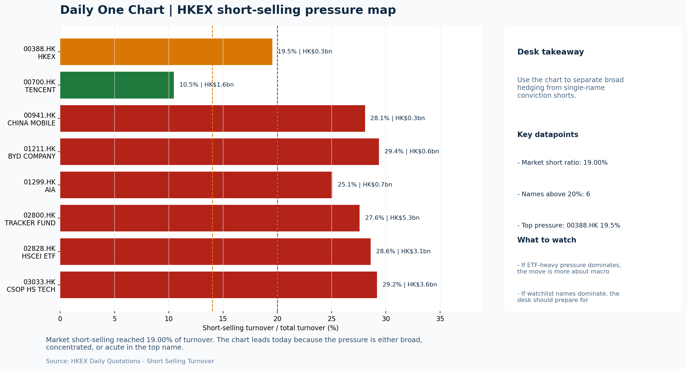

# Morning Research Workbench | 2026-06-02

> Designed for a Hong Kong sell-side commute: Layer 1 `Scan`, Layer 2 `Deep Read`, Layer 3 `Thinking`
> Mode: `Trading Daily` | Keep the report execution-oriented: what mattered in the completed session, what can move Hong Kong leadership, and what needs fast follow-up.
> Briefing date: `2026-06-02` | Review date: `2026-06-01` | Global request: `2026-06-01` | HK/China request: `2026-06-01` | Market effective date: `2026-06-01` | Generated at: `2026-06-02 08:21:58`

## Executive Summary

- **Market pulse:** Risk-On conditions with oil strength support the HK energy and cyclical trade, but Intel's guidance reset and a 19% short-selling ratio combined with VIX at 16.05 temper the constructive.
- **Hong Kong lens:** SOE/cyclical-led; HSTECH flat (+0.04%) while HSCEI (+0.73%) and energy proxies benefited from the WTI crude spike.. A constructive open is more credible if HSTECH and FXI confirm today's move rather than leaving the recovery to state-owned H-shares alone.
- **Top catalysts:** INTC -6.33%; Risk-On backdrop with USD range-bound, rates were not the dominant driver, and Oil outperformed Bitcoin.

## Visual Dashboard

## Layer 1 | Scan (5-10 min)

### 1.1 One-Line Market Pulse
Risk-On conditions with oil strength support the HK energy and cyclical trade, but Intel's guidance reset and a 19% short-selling ratio combined with VIX at 16.05 temper the constructive read for tech leadership.

### 1.2 Global Asset Price Dashboard

| Asset | Last | 1D move | Read |
| --- | --- | --- | --- |
| S&P 500 | 7,599.96 | +0.26% | US large-cap risk appetite |
| Nasdaq 100 | 30,513.86 | +0.60% | Growth and duration leadership |
| Hang Seng Index | 25,182.39 | +0.70% | Hong Kong broad beta |
| Hang Seng TECH | 4.7840 | +0.04% | Hong Kong growth / platform read-through |
| CSI 300 | 4,892.12 | -0.45% | Mainland large-cap tone |
| US 10Y | 4.4750 | +0.49% | Global discount-rate anchor |
| China 10Y | 1.70% | -0.8bp | China local rates anchor \| Live public \| Eastmoney \| 2026-06-01 |
| CN-US 10Y spread | -276.9bp | -2.8bp | Relative carry and macro-pressure gauge \| Live public \| Eastmoney \| 2026-06-01 |
| DXY | 99.19 | +0.29% | Dollar liquidity impulse |
| USD/CNH | 6.7585 | -0.01% | Offshore China risk appetite |
| USD/HKD | 7.8358 | +0.03% | Linked-exchange regime stress check |
| Brent crude | 95.04 | **+3.25%** | Energy / geopolitics |
| COMEX gold | 4,507.90 | -1.15% | Hedge demand / real yields |
| Copper | 6.5650 | **+3.23%** | Global growth proxy |
| VIX | 16.05 | **+4.77%** | US stress barometer |

### 1.3 Hong Kong Key Data Quick Check

| Check | Value | Status | Source / as of | Why it matters |
| --- | --- | --- | --- | --- |
| Main Board turnover vs 20D | 1.13x \| +13% vs 20D | Live local | HKEX \| 2026-06-01 | Trailing 20-session average turnover was HK$292.7bn. |
| Southbound / Northbound net flow | Southbound Net HK$4.7bn \| turnover HK$132.9bn \| Northbound Turnover HK$407.4bn \| net not reported | Live local | HKEX Connect \| 2026-06-01 | Southbound net buy is calculated from HKEX disclosed buy and sell turnover. |
| Short-selling ratio | 19.00% | Live local | HKEX \| 2026-06-01 | Official HKEX stock-level short-selling table, aggregated as a share of total market turnover. |
| AH premium index | 27.50% | Live public | Yahoo \| 2026-06-01 | Simple average across 16 A/H pairs; use dispersion rather than the average alone. |
| USD/HKD spot vs band | 7.8358 \| band 7.7500 to 7.8500 | Live quote + local | Yahoo \| 2026-06-01 | Inside the linked-exchange band without immediate boundary stress. Official Convertibility Undertakings define the linked-rate stress boundaries for USD/HKD. |
| HIBOR 1M | 2.57% | Live local | HKMA \| 2026-06-01 | 1M HIBOR is the cleanest quick read for Hong Kong funding conditions and equity-duration pressure. |
| Aggregate Balance | HK$54.0bn | Live local | HKMA \| 2026-06-01 | Aggregate Balance helps frame whether linked-rate liquidity conditions are tight or comfortable. |
| Hong Kong leadership | SOE/cyclical-led; HSTECH flat (+0.04%) while HSCEI (+0.73%) and energy proxies benefited from the WTI crude spike. | Proxy | HSI / HSCEI / HSTECH relative perf \| 2026-06-01 | Use HSI / HSCEI / HSTECH relative moves as the opening style read. |

### 1.4 Risk Dashboard
**Composite risk score:** `40.5/100` | **Regime:** `Mixed`

| Component | Score impact | Evidence |
| --- | --- | --- |
| US beta | +1.6 | S&P 500 +0.26% |
| HK growth | +0.2 | HSTECH +0.04% |
| Offshore China proxy | +4.1 | FXI +0.83% |
| Dollar pressure | -2.9 | DXY +0.29% |
| Volatility | -9.5 | VIX +4.77% |
| HK short-selling | -8 | Short-selling ratio 19.00% |

### 1.5 Morning Checklist
1. **INTC -6.33%**
 Mover attribution | Announcement / expectations | Guidance reset and margin pressure
2. **Risk-On backdrop with USD range-bound, rates were not the dominant driver, and Oil outperformed Bitcoin**
 Overnight regime | Start by deciding whether the day is about Risk-On conditions or a style pivot.
3. **CPI MoM (Released)**
 Macro / policy | Rates expectations, the dollar, and growth-equity valuation | Industries: Technology, Internet, Brokers
4. **WTI crude +5.25%**
 High-frequency data | A strong crude move needs to be split between geopolitics and demand repair.
5. **Trade Balance (Released)**
 Macro / policy | Watch whether it changes the day's core market narrative | Industries: Market-wide

## Layer 2 | Deep Read (20-30 min)

### 2.1 Overnight Overseas Market Review
#### Market Setup
**Core tape.** Overnight markets settled into a Risk-On posture with the dominant theme being a sharp divergence between Oil (+5.25%) and Bitcoin (-3.27%), a 5.7pct spread that anchored the energy and geopolitics narrative.
**Main driver.** Intel's guidance reset (-6.33%) was the most actionable event, repricing semiconductor earnings expectations before HK open, while US indices showed modest breadth with Nasdaq outperforming (+0.60%) and VIX rising +4.77%.
**HK relevance.** Rates were not the dominant driver as CPI did not alter the Fed path, leaving the dollar marginally firmer (DXY +0.29%) but range-bound, which kept USD/CNH essentially flat (-0.01%).

#### Key Drivers
- WTI crude +5.25% splits the read between geopolitics and demand repair, supporting HK-listed energy majors and transport operators while.
- Intel guidance reset (-6.33%) reprices semiconductor earnings expectations and may trigger attribution reads in HK-listed tech names.
- Short-selling ratio at 19.00% elevates the risk dashboard score to 40.5 (Mixed) and argues for tighter sizing before chasing the local.
- VIX +4.77% suggests the Risk-On framing is not clean.

#### Hong Kong Read-Through
**Desk lens.** State-owned / old-economy H-shares led.
**Opening implication.** A constructive open is more credible if HSTECH and FXI confirm today's move rather than leaving the recovery to state-owned H-shares alone. Elevated short-selling at 19% and VIX at 16.05 warrant tighter sizing and stops.
- **Cross-market read:** Hang Seng +0.70% / HSCEI +0.73% / HSTECH +0.04%.
- **Cross-market read:** Offshore China proxy FXI +0.83% and USD/CNH -0.01% frame cross-border risk appetite.
- **Cross-market read:** USD/HKD last traded around 7.8358, which keeps the Hong Kong funding lens in focus.

#### Watch Points
- USD composite moved higher by +0.11pct intraday, with a 0.242pct range.
- Main turning points appeared around 2026-06-01 08:05 trough / 2026-06-01 08:30 peak / 2026-06-01 08:50 peak, suggesting event-driven repricing.
- The biggest cross-asset divergence was Oil versus Bitcoin, a spread of 5.7pct.
- Gold moved -0.72pct intraday with a 1.632pct high-low range.

**Curated overnight stories**
1. **INTC -6.33% on guidance reset and margin pressure**
 Why it matters: A large-cap guidance reset in a key tech sub-sector crosses the tape before HK open. It reprices semiconductor earnings expectations for the session.
 HK read-through: Relevant for Hong Kong internet and technology sentiment; watch for AI-chip adjacent names to follow or diverge.
2. **WTI crude +5.25% - demand repair or geopolitics split needed**
 Why it matters: A sharp energy move this size reshapes cost inputs for transport, chemicals, and industrials. Oil outperforming Bitcoin confirms the Risk-On regime noted in must-watch.
 HK read-through: Most direct impact on HK-listed energy majors and transport operators; also affects、 and shipping proxies.
3. **Trade Balance released**
 Why it matters: US trade flow data can reset the day's core narrative. If the print widens, trade-tension headlines may reassert themselves over the Risk-On framing.
 HK read-through: Industries with high US-exposure or export revenue streams in HK are most sensitive. Monitor for narrative shifts intra-session.

### 2.2 Hong Kong / A-share Previous-Day Review
#### Local Tape Setup
**Local read.** Hong Kong's session ended with a clear style split: the Hang Seng China Enterprises Index rose 0.73%, led by state-owned energy and financial heavyweights, while Hang Seng TECH was essentially flat at +0.04%.
**Verification point.** Turnover ran at 1.13x the 20-day average and Southbound net buying reached HK$4.7bn, but the official short-selling ratio remained elevated at 19.00%, tempering conviction on a durable rotation.
**Risk to watch.** Northbound net flow data is unavailable, so cross-market confirmation from A-shares remains incomplete.

#### Style and Local Leadership
**Style leadership.** SOE/cyclical-led; HSTECH flat (+0.04%) while HSCEI (+0.73%) and energy proxies benefited from the WTI crude spike..
- **Cross-market read:** Hang Seng +0.70% / HSCEI +0.73% / HSTECH +0.04%.
- **Cross-market read:** Offshore China proxy FXI +0.83% and USD/CNH -0.01% frame cross-border risk appetite.
- **Cross-market read:** USD/HKD last traded around 7.8358, which keeps the Hong Kong funding lens in focus.

#### Flow Confirmation
Official Stock Connect evidence is available; use Section 2.3 to confirm whether local money supports the price action.

#### Follow-Through Checklist
**Follow-through check.** Watch whether the CSI 300 and Northbound turnover names in semiconductors and industrials sustain the old-economy bid.

### 2.3 Flow Tracker and Attribution
#### Cross-Asset Attribution v1

| Driver | Direction | Score | Evidence | HK implication |
| --- | --- | --- | --- | --- |
| Short-selling pressure | drag | 2.8 | HKEX short-selling ratio was 19.00%. | Elevated short activity argues for extra confirmation before chasing rebounds. |
| Oil and geopolitics | mixed | 2.6 | Oil moved +3.25%. | Split the read between energy/cyclicals support and margin/geopolitical pressure. |
| Hong Kong participation | supportive | 1.31 | Main Board turnover was 1.13x the 20-session average. | Higher participation makes local price action more credible. |
| Dollar / CNH pressure | drag | 0.43 | DXY +0.29% / USD-CNH -0.01% | A stable or softer CNH makes Hong Kong follow-through more credible. |

#### Flow Tracker
##### Flow Takeaways
- Short-selling pressure is elevated, so local rebounds need cleaner breadth and flow confirmation.
- Stock Connect Southbound: net HK$4.7bn on turnover HK$132.9bn (as of 2026-06-01).
- Stock Connect Northbound: turnover RMB407.4bn; public file provides total turnover/top active names, not full net-buy.
- AH premium: simple covered-pair average +27.50%; widest premium: China Railway 55.92%.

##### Stock Connect Southbound Active Names

| Rank | Ticker | Name | Buy | Sell | Net buy |
| --- | --- | --- | --- | --- | --- |
| 3 | 09926.HK | AKESO | HK$4,261.5mn | HK$1,554.3mn | HK$2,707.1mn |
| 2 | 00700.HK | TENCENT | HK$3,524.9mn | HK$2,501.1mn | HK$1,023.8mn |
| 2 | 09992.HK | POP MART | HK$3,287.2mn | HK$2,486.3mn | HK$800.9mn |
| 5 | 00992.HK | LENOVO GROUP | HK$1,723.8mn | HK$2,271.3mn | HK$-547.5mn |
| 7 | 00883.HK | CNOOC | HK$954.7mn | HK$452.5mn | HK$502.2mn |

##### AH Premium Dispersion

| Name | A ticker | H ticker | Premium | As of |
| --- | --- | --- | --- | --- |
| China Railway | 601390.SS | 0390.HK | +55.92% | 2026-06-01 |
| China Communications Construction | 601800.SS | 1800.HK | +54.09% | 2026-06-01 |
| China Railway Construction | 601186.SS | 1186.HK | +53.38% | 2026-06-01 |
| China Construction Bank | 601939.SS | 0939.HK | +36.85% | 2026-06-01 |
| China Life | 601628.SS | 2628.HK | +34.56% | 2026-06-01 |

##### HKEX Short-Selling Watch

| Ticker | Name | Short ratio | Short turnover | Total turnover |
| --- | --- | --- | --- | --- |
| 00388.HK | HKEX | 19.53% | HK$0.3bn | HK$1.4bn |
| 00700.HK | TENCENT | 10.47% | HK$1.6bn | HK$15.3bn |
| 00941.HK | CHINA MOBILE | 28.07% | HK$0.3bn | HK$0.9bn |
| 01211.HK | BYD COMPANY | 29.36% | HK$0.6bn | HK$2.2bn |
| 01299.HK | AIA | 25.05% | HK$0.7bn | HK$2.7bn |

- **Short-value leaders:** 02800.HK TRACKER FUND (HK$5.3bn); 03033.HK CSOP HS TECH (HK$3.6bn); 02828.HK HSCEI ETF (HK$3.1bn); 07709.HK XL2CSOPHYNIX (HK$2.7bn).

### 2.4 Macro and Policy Tracking
**Desk read.** The completed session's risk-on setup faces a direct test from tonight's US data calendar.

**Market sensitivity.** US CPI MoM came in hotter than expected at 0.3% (vs 0.2% consensus, down from 0.4% prior), which may reprice Fed rate-cut expectations and pressure duration assets - particularly relevant for HK financials and real estate proxies.

**HK implication.** China Trade Balance beat at USD 85.2bn (vs USD 79.0bn forecast), providing a constructive anchor for regional sentiment.

**Macro watchpoints**
- US Retail Sales actual vs 0.3% forecast and whether the prior 0.6% is revised.
- Powell tone at 22:00 - any hawkish lean after the CPI beat will pressure HK rate-sensitive sectors.
- VIX direction - if 16.05 level holds or climbs further, risk sizing should stay disciplined.
- WTI crude at 91.95 - sustained above 90 supports energy sector leadership in HK.

| Time | Region | Event | Status | Desk read |
| --- | --- | --- | --- | --- |
| 20:30 | US | CPI MoM | Released | Impact: Rates expectations, the dollar, and growth-equity valuation \| Attention: 5/5 \| Industries: Technology, Internet, Brokers |
| 09:30 | China | Trade Balance | Released | Impact: Watch whether it changes the day's core market narrative \| Attention: 3/5 \| Industries: Market-wide |
| 20:30 | US | Retail Sales MoM | Upcoming | Impact: Consumer resilience, growth expectations, and risk-asset pricing \| Attention: 5/5 \| Industries: Consumer, E-commerce, Consumer discretionary |
| 09:20 | China | Loan Prime Rate | Upcoming | Impact: Watch whether it changes the day's core market narrative \| Attention: 3/5 \| Industries: Market-wide |
| 22:00 | Federal Reserve | Jerome Powell: Economic outlook remarks | Central bank | Impact: Policy path, liquidity conditions, and cross-asset risk appetite \| Attention: 5/5 \| Industries: Technology, Financials, Gold |
| 10:00 | PBOC | Open Market Operations Desk: Daily liquidity operation window | Central bank | Impact: Policy path, liquidity conditions, and cross-asset risk appetite \| Attention: 3/5 \| Industries: Technology, Financials, Gold |

#### Positioning and Risk Backdrop
- Options activity centered on KWEB Call, with Vol/OI at 1.88x and a bullish bias.
- Put/Call structure shows equity 0.68 / index 1.15, implying Single-stock optimism with index hedging.
- Geopolitics: Middle East | Regional tension remains elevated | Impact: Oil, freight costs, and safe-haven demand
- Geopolitics: US-China | Technology export-control rhetoric remains active | Impact: China internet, semiconductors, and supply chains

### 2.5 Key Company and Sector Events
No high-conviction sector story cleared the main-report relevance gate for this run.

#### Company Event Takeaway
**Desk read.** Risk-on conditions persist with USD range-bound and rates sidelined, supporting broad HK equity sentiment.
**Why it matters.** The most consequential single-event risk is Tencent (0700.HK) reporting after today's close - EPS est.
**Follow-up.** 4.15 HKD, revenue est.

#### LLM Quick Takes
- **0700.HK** | Reports after market close on 2026-06-02; EPS est. 4.15 HKD, revenue est. 163.2bn HKD. Core coverage - game grossing and ad-demand commentary will anchor internet sector
- **9988.HK** | Morgan Stanley upgraded from Equal Weight to Overweight; target raised from 92 to 105 (approx. 14% upside).
- **0388.HK** | Reports before market open on 2026-06-02; EPS est. 2.81 HKD, revenue est. 6.0bn HKD. Fee recovery and turnover guidance will test whether financials leadership can
- **3690.HK** | Up 6.54% on session; results better than feared despite third consecutive loss. Food-delivery price war persists
- **1211.HK** | Down 0.6%, sitting near bottom of range (2.4%). No fresh catalyst; monitor weekly sales data for reversal setup.
- **1299.HK** | Down 0.3%, mid-range (41.5%). Neutral positioning; upcoming NBV and agency data are marginal information triggers for wealth/insurance sentiment.

#### HKEX Announcements

| Grade | Ticker | Type | Release time | Title |
| --- | --- | --- | --- | --- |
| A | 00234.HK | Profit warning | 2026-06-01 | Profit warning / alert announcement |
| A | 01050.HK | Profit warning | 2026-06-01 | Profit warning / alert announcement |
| A | 00852.HK | Profit warning | 2026-05-29 | Profit warning / alert announcement |
| A | 02193.HK | Profit warning | 2026-05-29 | Profit warning / alert announcement |
| A | 01473.HK | Profit warning | 2026-05-28 | Profit warning / alert announcement |
| A | 01709.HK | Profit warning | 2026-05-28 | Profit warning / alert announcement |
| A | 01711.HK | Profit warning | 2026-05-28 | Profit warning / alert announcement |
| A | 00321.HK | Profit warning | 2026-05-27 | Profit warning / alert announcement |

#### Earnings / Results Watch

| Ticker | Company | Timing | Expectation framing |
| --- | --- | --- | --- |
| 0700.HK | Tencent Holdings | After Market Close | EPS est. 4.15 HKD \| revenue est. 163.2bn HKD |
| 0388.HK | Hong Kong Exchanges and Clearing | Before Market Open | EPS est. 2.81 HKD \| revenue est. 6.0bn HKD |

#### Rating Changes
- **9988.HK** | Morgan Stanley | Upgrade | Equal Weight -> Overweight | PT 92 -> 105

#### IPO Watch
- IPO and grey-market monitoring is not yet part of the standard production pack.

### 2.6 Today's Core Names
#### Core coverage

| Name | Ticker | Last | 1D | Range position | Morning note |
| --- | --- | --- | --- | --- | --- |
| Meituan | 3690.HK | 78.25 | +6.54% | Mid-range | Short-term price strength is clear; fresh catalysts could trigger broader group follow-through. |
| Tencent | 0700.HK | 436.00 | +2.06% | Bottom of range | Short-term price strength is clear; fresh catalysts could trigger broader group follow-through. |

**Recent headlines for Meituan:**
- [Meituan Logs Another Loss Amid Food-Delivery Price War](https://www.wsj.com/business/earnings/meituan-logs-another-loss-amid-food-delivery-price-war-fef4c703?siteid=yhoof2&yptr=yahoo) (The Wall Street Journal)
**Recent headlines for Tencent:**
- [Tencent rolls out inbound payments upgrades, adds PayPal QR support](https://www.electronicpaymentsinternational.com/news/tencent-rolls-out-inbound-payments-upgrades/) (Electronic Payments)

#### Priority follow-up

| Name | Ticker | Last | 1D | Range position | Morning note |
| --- | --- | --- | --- | --- | --- |
| BYD Company | 1211.HK | 90.75 | -0.60% | Bottom of range | The name sits near the bottom of its recent range and is worth monitoring for a catalyst-led reversal. |
| AIA | 1299.HK | 82.00 | -0.30% | Mid-range | Positioning is neutral for now, so use it mainly to monitor marginal information changes. |

**Recent headlines for AIA:**
- [Is It Too Late To Consider AIA Group (SEHK:1299) After Its 82% One Year Rally?](https://finance.yahoo.com/markets/stocks/articles/too-consider-aia-group-sehk-042100864.html) (Simply Wall St.)

## Layer 3 | Thinking (10-15 min)

### 3.1 Rotating Theme Deep Dive

| Field | Read |
| --- | --- |
| Theme | China Consumption Recovery |
| Angle for the day | Focus on whether travel, retail, internet local services, and premium consumption data still support a demand-repair narrative. |

**Theme desk read**
**Core thesis.** The China consumption recovery theme faces a near-term credibility test with Meituan's order trends and margin update due tomorrow, while the US retail sales print will provide a global consumer demand read-across.
**Evidence.** WTI crude's +5.25% rise is directionally supportive if demand repair is the driver, but attribution between geopolitics and consumption remains unclear.
**What to test.** Meituan's +6.54% session gain offers price evidence of repositioning ahead of the event, but with VIX +4.77% higher, tight stops are warranted.

**Signals to keep in mind**
- WTI crude +5.25%: A strong crude move needs to be split between geopolitics and demand repair.
- VIX +4.77%: Higher volatility argues for tighter sizing and tighter stops.

**LLM watch items:**
- Meituan order trends and margin commentary (June 2)
- US Retail Sales MoM (June 2) - verify consumer resilience
- WTI crude demand-repair vs. geopolitics attribution

**Related names to keep close:**

| Name | Ticker | Bucket | Morning read |
| --- | --- | --- | --- |
| Meituan | 3690.HK | Core coverage | Short-term price strength is clear; fresh catalysts could trigger broader group follow-through. |

**Upcoming catalysts tied to the theme:**
- 2026-06-02 | Meituan: Order trends and margin commentary | High-frequency read on local services demand and platform competition
- 2026-06-02 | Retail Sales MoM | Consumer resilience, growth expectations, and risk-asset pricing

### 3.2 Today Ahead and Trading Calendar
- Macro: CPI MoM is the first item to anchor the open and the rates/FX response.
- Corporate / event: Meituan: Order trends and margin commentary is the cleanest same-day catalyst to prepare for.

**Same-day macro docket**

| Time | Country | Event | Status | Detail |
| --- | --- | --- | --- | --- |
| 20:30 | US | CPI MoM | Released | Actual 0.3% / Forecast 0.2% / Prior 0.4% |
| 09:30 | China | Trade Balance | Released | Actual USD 85.2bn / Forecast USD 79.0bn / Prior USD 80.6bn |
| 20:30 | US | Retail Sales MoM | Upcoming | Forecast 0.3% / Prior 0.6% |
| 09:20 | China | Loan Prime Rate | Upcoming | Forecast 3.45% / Prior 3.45% |
| 22:00 | Federal Reserve | Jerome Powell: Economic outlook remarks | Central bank | speech |

**Same-day catalyst list**

| Date | Time | Category | Event | Importance |
| --- | --- | --- | --- | --- |
| 2026-06-02 | | Core coverage | Meituan: Order trends and margin commentary | 3 |
| 2026-06-02 | | Core coverage | Tencent: Game grossing trends and ad-demand checks | 3 |
| 2026-06-02 | | Core coverage | Alibaba: Cloud demand and GMV updates | 3 |
| 2026-06-02 | | Core coverage | HKEX: Turnover data and IPO pipeline updates | 3 |

**Next few sessions**

| Date | Category | Event | Impact |
| --- | --- | --- | --- |
| 2026-06-02 | Core coverage | Meituan: Order trends and margin commentary | High-frequency read on local services demand and platform competition |
| 2026-06-02 | Core coverage | Tencent: Game grossing trends and ad-demand checks | Core offshore China platform proxy for gaming, ads, and AI monetization |
| 2026-06-02 | Core coverage | Alibaba: Cloud demand and GMV updates | Key read-through for China consumption, cloud, and platform regulation |
| 2026-06-02 | Core coverage | HKEX: Turnover data and IPO pipeline updates | Direct proxy for Hong Kong market turnover, listings, and southbound |

### 3.3 Daily One Chart
**Daily One Chart | HKEX short-selling pressure map**

**Chart read.** Market short-selling reached 19.00% of turnover.
**Why it matters.** The chart leads today because the pressure is either broad, concentrated, or acute in the top name.

_Source: HKEX Daily Quotations - Short Selling Turnover_

## Traceable Appendix

### Report Metadata
> Date policy: Review date 2026-06-01 is treated as `Trading Daily`. | Global request date is 2026-06-01; adapter effective date is 2026-06-01 and summary date is 2026-06-01. | HK/China local data date is 2026-06-01; role: same-session local cash tape.
> Market data quality: Coverage: `31/32` | Stale items (>1d): `7` | Missing: `1`
> Report quality: `85.8/100` | Grade `B` | Status `production ready`

### Key Questions to Keep in Mind
- Is risk appetite rising or fading? The overnight tape reads closer to `Risk-On`.
- Did rates expectations move? Focus on whether US 10Y, DXY, and growth style moved together.
- Were commodities the real story? Watch WTI and gold for geopolitics versus inflation signals.
- Is Hong Kong setup internet-led, SOE-led, or broad beta-led? Compare HSTECH, HSCEI, and HSI.
- Did offshore markets move China risk appetite? Focus on HSI, FXI, USD/CNH, and USD/HKD.

### Report Quality and Validation
- **Quality score:** 85.8/100 | **Grade:** B | **Status:** production ready
- **Run summary:** 8 healthy | 0 caveat | 0 failed
- **Release recommendation:** Send | All monitored sources were healthy, so the report is fit for normal distribution.

| Source | Status | Bucket |
| --- | --- | --- |
| Market data | ok | healthy |
| Sector and company news | ok | healthy |
| Movers and short selling | ok | healthy |
| Stock Connect | ok | healthy |
| A/H premium | ok | healthy |
| Hong Kong local package | ok | healthy |
| China rates | ok | healthy |
| Narrative overlay | ok | healthy |

**Desk-use guidance summary:** 0 blocking | 1 advisory

**Desk-use guidance**
- **Advisory:** All monitored sources were healthy for this run; the report can be used as a normal desk-starting point.

| Component | Score | Weight | Read |
| --- | --- | --- | --- |
| Market data coverage | 96.9 | 0.3 | 31/32 core market fields available. |
| Hong Kong local metrics | 82.3 | 0.25 | 8 live, 3 proxy, 0 unavailable local checks. |
| Key public adapters | 100.0 | 0.2 | 4/4 key adapters were available or partially available. |
| Narrative overlay health | 57.1 | 0.15 | 2/7 narrative overlay tasks succeeded or used validated cache; 0 error(s). |
| Fact-check guardrail | 75.0 | 0.1 | Checked 6 numeric claims; 1 numeric mismatch(es), 0 logic warning(s); 1 critical, 0 review. |

**Quality warnings**
- Narrative overlay health is weak: 2/7 narrative overlay tasks succeeded or used validated cache; 0 error(s).
- Narrative fact-check guardrail produced warnings; review the validation table before relying on narrative sections.

**Narrative fact-check guardrail**
- Checked 6 numeric claims; 1 numeric mismatch(es), 0 logic warning(s); 1 critical, 0 review.

| Severity | Field | Claim | Type | Claimed | Expected | Snippet |
| --- | --- | --- | --- | --- | --- | --- |
| critical | tasks.macro_interpretation.paragraph | Gold | change_pct | 1.15 | -1.15 | ined 3.23%, while the VIX rose 4.77% to 16.05 and gold slipped 1.15%. This combination - strong oil, elevated vol, and g |

**Adapter status**

| Adapter | Status |
| --- | --- |
| Stock Connect | ok |
| A/H premium | ok |
| HKEX announcements | ok |
| China rates | ok |

### Source Links
- [Meituan Logs Another Loss Amid Food-Delivery Price War](https://www.wsj.com/business/earnings/meituan-logs-another-loss-amid-food-delivery-price-war-fef4c703?siteid=yhoof2&yptr=yahoo) (The Wall Street Journal)
- [China Is Moving Quickly to 'Instant Retail.' 3 Stocks to Watch.](https://www.barrons.com/articles/china-instant-delivery-retail-e814ddbe?siteid=yhoof2&yptr=yahoo) (Barrons.com)
- [Tencent rolls out inbound payments upgrades, adds PayPal QR support](https://www.electronicpaymentsinternational.com/news/tencent-rolls-out-inbound-payments-upgrades/) (Electronic Payments)
- [Is It Too Late To Consider Alibaba Group Holding (NYSE:BABA) After Recent Share Price Weakness](https://finance.yahoo.com/markets/stocks/articles/too-consider-alibaba-group-holding-200746895.html) (Simply Wall St.)
- [Is It Too Late To Consider AIA Group (SEHK:1299) After Its 82% One Year Rally?](https://finance.yahoo.com/markets/stocks/articles/too-consider-aia-group-sehk-042100864.html) (Simply Wall St.)
- [00234.HK Profit warning / alert announcement](http://www1.hkexnews.hk/listedco/listconews/sehk/2026/0601/2026060102974.pdf) (HKEXnews)
- [01050.HK Profit warning / alert announcement](http://www1.hkexnews.hk/listedco/listconews/sehk/2026/0601/2026060101420.pdf) (HKEXnews)
- [00852.HK Profit warning / alert announcement](http://www1.hkexnews.hk/listedco/listconews/sehk/2026/0529/2026052900279.pdf) (HKEXnews)
- [02193.HK Profit warning / alert announcement](http://www1.hkexnews.hk/listedco/listconews/sehk/2026/0529/2026052901653.pdf) (HKEXnews)
- [01473.HK Profit warning / alert announcement](http://www1.hkexnews.hk/listedco/listconews/sehk/2026/0528/2026052801839.pdf) (HKEXnews)
- [01709.HK Profit warning / alert announcement](http://www1.hkexnews.hk/listedco/listconews/sehk/2026/0528/2026052800537.pdf) (HKEXnews)
- [01711.HK Profit warning / alert announcement](http://www1.hkexnews.hk/listedco/listconews/sehk/2026/0528/2026052802007.pdf) (HKEXnews)
- [00321.HK Profit warning / alert announcement](http://www1.hkexnews.hk/listedco/listconews/sehk/2026/0527/2026052700987.pdf) (HKEXnews)

## Supplementary Visual Appendix

This appendix is professional-path only. It keeps a traceable index of the report visuals and the deterministic chart cues used to frame the morning note, without injecting the legacy intraday chart pack.

### Visual Index

| Visual | Path | Role |
| --- | --- | --- |
| Visual Dashboard | `charts/dashboard_2026-06-02.png` | Cross-asset regime board and Hong Kong local tape snapshot. |
| Daily One Chart | `charts/daily_one_chart_2026-06-02.png` | Single highest-conviction visual story for the day. |

### Deterministic Chart Cues
- FX / liquidity: USD composite moved higher by +0.11pct intraday, with a 0.242pct range.
- FX / liquidity: Main turning points appeared around 2026-06-01 08:05 trough / 2026-06-01 08:30 peak / 2026-06-01 08:50 peak, suggesting event-driven repricing rather than a clean one-way USD move.
- Cross-asset: The biggest cross-asset divergence was Oil versus Bitcoin, a spread of 5.7pct.
- Cross-asset: Gold moved -0.72pct intraday with a 1.632pct high-low range.
- Cross-asset: Oil moved +2.43pct intraday with a 5.749pct high-low range.
- Cross-asset: Bitcoin moved -3.27pct intraday with a 4.205pct high-low range.

### Risk Dashboard Components

| Component | Score impact | Evidence |
| --- | --- | --- |
| US beta | +1.6 | S&P 500 +0.26% |
| HK growth | +0.2 | HSTECH +0.04% |
| Offshore China proxy | +4.1 | FXI +0.83% |
| Dollar pressure | -2.9 | DXY +0.29% |
| Volatility | -9.5 | VIX +4.77% |
| HK short-selling | -8 | Short-selling ratio 19.00% |
