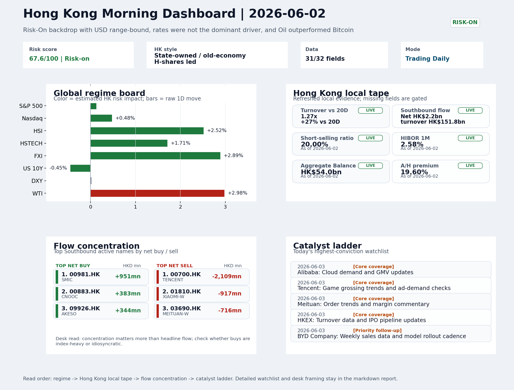
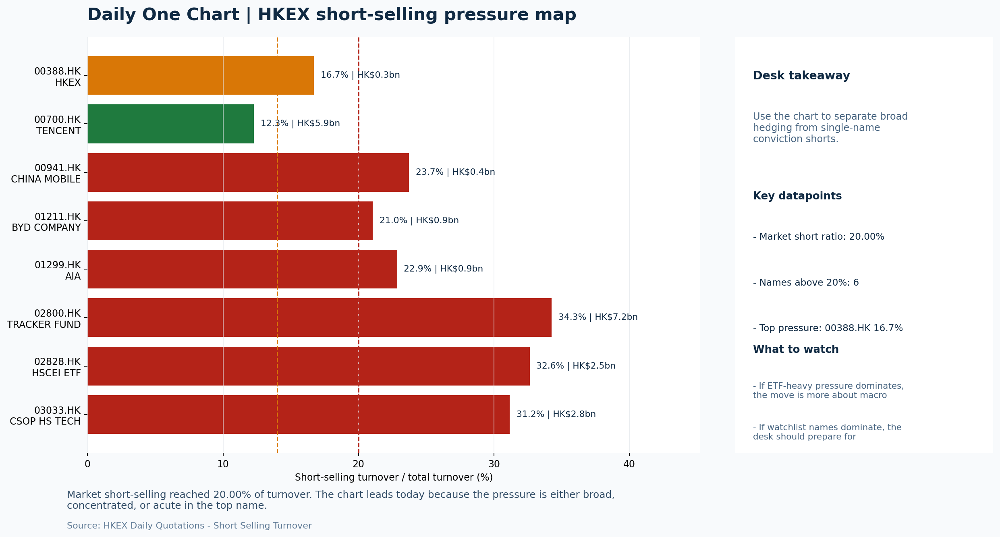

# Morning Research Workbench | 2026-06-03

> Designed for a Hong Kong sell-side commute: Layer 1 `Scan`, Layer 2 `Deep Read`, Layer 3 `Thinking`
> Mode: `Trading Daily` | Keep the report execution-oriented: what mattered in the completed session, what can move Hong Kong leadership, and what needs fast follow-up.
> Briefing date: `2026-06-03` | Review date: `2026-06-02` | Global request: `2026-06-02` | HK/China request: `2026-06-02` | Market effective date: `2026-06-02` | Generated at: `2026-06-03 09:45:28`

## Executive Summary

- **Market pulse:** Hong Kong's +2.52% session confirmed a Risk-On backdrop with credible turnover and offshore China proxy leadership, but SOE/value leadership, the 20% short-selling ratio, and HSTECH.
- **Hong Kong lens:** State-owned / old-economy H-shares led. The +3.00% HSCEI and +2.89% FXI move is credible given 1.27x 20D turnover, but SOE/value leadership and the 20% short-selling ratio mean the open needs cleaner breadth.
- **Top catalysts:** INTC -6.33%; Risk-On backdrop with USD range-bound, rates were not the dominant driver, and Oil outperformed Bitcoin.

## Visual Dashboard

## Layer 1 | Scan (5-10 min)

### 1.1 One-Line Market Pulse
Hong Kong's +2.52% session confirmed a Risk-On backdrop with credible turnover and offshore China proxy leadership, but SOE/value leadership, the 20% short-selling ratio, and HSTECH lagging HSCEI by 1.29pp argue for confirming breadth before treating today's tape as durable growth-risk momentum.

### 1.2 Global Asset Price Dashboard

| Asset | Last | 1D move | Read |
| --- | --- | --- | --- |
| S&P 500 | 7,609.78 | +0.13% | US large-cap risk appetite |
| Nasdaq 100 | 30,660.60 | +0.48% | Growth and duration leadership |
| Hang Seng Index | 26,038.32 | **+2.52%** | Hong Kong broad beta |
| Hang Seng TECH | 4.8660 | **+1.71%** | Hong Kong growth / platform read-through |
| CSI 300 | 4,914.56 | +1.45% | Mainland large-cap tone |
| US 10Y | 4.4550 | -0.45% | Global discount-rate anchor |
| China 10Y | 1.70% | +0.3bp | China local rates anchor \| Live public \| Eastmoney \| 2026-06-02 |
| CN-US 10Y spread | -275.6bp | +1.3bp | Relative carry and macro-pressure gauge \| Live public \| Eastmoney \| 2026-06-02 |
| DXY | 99.22 | +0.02% | Dollar liquidity impulse |
| USD/CNH | 6.7595 | +0.00% | Offshore China risk appetite |
| USD/HKD | 7.8370 | +0.02% | Linked-exchange regime stress check |
| Brent crude | 97.03 | **+2.16%** | Energy / geopolitics |
| COMEX gold | 4,498.40 | +0.52% | Hedge demand / real yields |
| Copper | 6.6410 | **+1.79%** | Global growth proxy |
| VIX | 15.77 | **-1.74%** | US stress barometer |

### 1.3 Hong Kong Key Data Quick Check

| Check | Value | Status | Source / as of | Why it matters |
| --- | --- | --- | --- | --- |
| Main Board turnover vs 20D | 1.27x \| +27% vs 20D | Live local | HKEX \| 2026-06-02 | Trailing 20-session average turnover was HK$294.7bn. |
| Southbound / Northbound net flow | Southbound Net HK$2.2bn \| turnover HK$151.8bn \| Northbound Turnover HK$376.2bn \| net not reported | Live local | HKEX Connect \| 2026-06-02 | Southbound net buy is calculated from HKEX disclosed buy and sell turnover. |
| Short-selling ratio | 20.00% | Live local | HKEX \| 2026-06-02 | Official HKEX stock-level short-selling table, aggregated as a share of total market turnover. |
| AH premium index | 19.60% | Live public | Yahoo \| 2026-06-02 | Simple average across 18 A/H pairs; use dispersion rather than the average alone. |
| USD/HKD spot vs band | 7.8370 \| band 7.7500 to 7.8500 | Live quote + local | Yahoo \| 2026-06-02 | Inside the linked-exchange band without immediate boundary stress. Official Convertibility Undertakings define the linked-rate stress boundaries for USD/HKD. |
| HIBOR 1M | 2.58% | Live local | HKMA \| 2026-06-02 | 1M HIBOR is the cleanest quick read for Hong Kong funding conditions and equity-duration pressure. |
| Aggregate Balance | HK$54.0bn | Live local | HKMA \| 2026-06-02 | Aggregate Balance helps frame whether linked-rate liquidity conditions are tight or comfortable. |
| Hong Kong leadership | State-owned / old-economy H-shares led | Proxy | HSI / HSCEI / HSTECH relative perf \| 2026-06-02 | Use HSI / HSCEI / HSTECH relative moves as the opening style read. |

### 1.4 Risk Dashboard
**Composite risk score:** `67.6/100` | **Regime:** `Risk-on`

| Component | Score impact | Evidence |
| --- | --- | --- |
| US beta | +0.8 | S&P 500 +0.13% |
| HK growth | +8.6 | HSTECH +1.71% |
| Offshore China proxy | +8 | FXI +2.89% |
| Dollar pressure | -0.2 | DXY +0.02% |
| Volatility | +3.5 | VIX -1.74% |
| HK short-selling | -8 | Short-selling ratio 20.00% |

### 1.5 Morning Checklist
1. **INTC -6.33%**
 Mover attribution | Announcement / expectations | Guidance reset and margin pressure
2. **Risk-On backdrop with USD range-bound, rates were not the dominant driver, and Oil outperformed Bitcoin**
 Overnight regime | Start by deciding whether the day is about Risk-On conditions or a style pivot.
3. **CPI MoM (Released)**
 Macro / policy | Rates expectations, the dollar, and growth-equity valuation | Industries: Technology, Internet, Brokers
4. **Trade Balance (Released)**
 Macro / policy | Watch whether it changes the day's core market narrative | Industries: Market-wide
5. **Retail Sales MoM (Upcoming)**
 Macro / policy | Consumer resilience, growth expectations, and risk-asset pricing | Industries: Consumer, E-commerce, Consumer discretionary

## Layer 2 | Deep Read (20-30 min)

### 2.1 Overnight Overseas Market Review
#### Market Setup
**Core tape.** Overnight markets settled into a Risk-On regime as USD held range-bound, reducing FX-driven headwinds and allowing domestic and regional catalysts to dominate.
**Main driver.** The sharp divergence between Oil (+2.98%) and Bitcoin (-3.07%) is the most instructive cross-asset signal: energy and geopolitics drove commodity demand, while speculative risk rotated out.
**HK relevance.** Intel's guidance reset (-6.33%) is a cautionary flag for semiconductor supply chains, yet the broader tape held because CPI anchored rate expectations and Euro Stoxx (+1.21%) outperformed the US, suggesting the move was.

#### Key Drivers
- Oil surged on geopolitical and demand-repair framing, splitting the Risk-On read between energy/cyclical support and margin pressure.
- Bitcoin's sharp decline (-3.07%, 6.731% intraday range) suggests speculative positioning rotated out.
- Intel's guidance reset (-6.33%) signals margin compression in semiconductors, with direct relevance to Asian supply-chain proxies.
- Euro Stoxx 50 outperformed (+1.21%) relative to S&P 500 (+0.13%), indicating the Risk-On tone was not solely US mega-cap leadership.

#### Hong Kong Read-Through
**Desk lens.** State-owned / old-economy H-shares led.
**Opening implication.** The +3.00% HSCEI and +2.89% FXI move is credible given 1.27x 20D turnover.
- **Cross-market read:** Hang Seng +2.52% / HSCEI +3.00% / HSTECH +1.71%.
- **Cross-market read:** Offshore China proxy FXI +2.89% and USD/CNH +0.00% frame cross-border risk appetite.
- **Cross-market read:** USD/HKD last traded around 7.8370, which keeps the Hong Kong funding lens in focus.

#### Watch Points
- USD composite moved higher by +0.12pct intraday, with a 0.173pct range.
- Main turning points appeared around 2026-06-02 08:05 peak / 2026-06-02 08:25 peak / 2026-06-02 08:40 peak, suggesting event-driven repricing rather.
- The biggest cross-asset divergence was Oil versus Bitcoin, a spread of 9.684pct.
- Gold moved -0.61pct intraday with a 1.669pct high-low range.

**Curated overnight stories**
1. **INTC -6.33% premarket after guidance reset and margin pressure announcement**
 Why it matters: Intel's guidance reset signals sustained margin compression in the semiconductor complex, which has direct knock-on implications for Asian semiconductor supply chains.
 HK read-through: Relevant for HK tech and semiconductor proxies (e.g., SMIC, Hua Hong). Could pressure chip designers and related hardware names if US weakness spills over.
2. **CPI MoM (Released) - impacts Fed rate expectations and growth-equity valuation**
 Why it matters: CPI release anchors US inflation trajectory. Markets had flagged this as a key rates-input item. Direction matters for USD positioning and risk-asset duration.
 HK read-through: Most relevant for Hong Kong internet and growth-equity sectors. Softer print would ease rate pressure on HK tech valuations; firmer print tightens conditions.
3. **Trade Balance (Released) - watch whether it changes the day's core market narrative**
 Why it matters: US trade data is a market-wide input. Any surprise in goods trade or deficit widening affects USD, rates, and China-export narratives.
 HK read-through: Watches China-manufacturing and export-linked names. A deficit widening could signal tariff or demand-related headwinds for Chinese goods.
4. **Risk-On backdrop with USD range-bound, rates not dominant driver, Oil outperformed Bitcoin**
 Why it matters: Establishes the overnight regime. Risk-On with range-bound USD reduces FX-driven headwinds for HK equities and supports commodity-linked names.
 HK read-through: Supports domestic growth positioning and reduces safe-haven rotation. Oil outperformance is a marginal tailwind for energy-heavy HK proxies.
5. **Retail Sales MoM (Upcoming) - signals consumer resilience and growth expectations**
 Why it matters: Upcoming release is flagged as a key consumer-resilience indicator. Outcome will shape risk-asset pricing for consumer and discretionary sectors.
 HK read-through: Direct read-through to HK e-commerce and consumer discretionary names. Strong print reinforces Risk-On; weak print requires reassessment.

### 2.2 Hong Kong / A-share Previous-Day Review
#### Local Tape Setup
**Local read.** Hong Kong's session on 2 June pushed the Hang Seng Index +2.52% on turnover 1.27x the 20-day average, but the rally was concentrated in HSCEI (+3.0%) while HSTECH (+1.71%) lagged, marking clear value/SOE leadership.
**Verification point.** Elevated short-selling at 20% of market turnover and index put/call skew at 1.15x argue for confirming breadth before treating the move as durable growth risk-taking.
**Risk to watch.** Northbound net-buy is unavailable, so A-share flow signals remain incomplete.

#### Style and Local Leadership
**Style leadership.** State-owned / old-economy H-shares led.
- **Cross-market read:** Hang Seng +2.52% / HSCEI +3.00% / HSTECH +1.71%.
- **Cross-market read:** Offshore China proxy FXI +2.89% and USD/CNH +0.00% frame cross-border risk appetite.
- **Cross-market read:** USD/HKD last traded around 7.8370, which keeps the Hong Kong funding lens in focus.

#### Flow Confirmation
Official Stock Connect evidence is available; use Section 2.3 to confirm whether local money supports the price action.

#### Follow-Through Checklist
**Follow-through check.** Watch whether HSTECH catches up with HSCEI and whether Northbound net flow data (if subsequently reported) shows A-share accumulation in the same sectors.

### 2.3 Flow Tracker and Attribution
#### Cross-Asset Attribution v1

| Driver | Direction | Score | Evidence | HK implication |
| --- | --- | --- | --- | --- |
| Short-selling pressure | drag | 3.5 | HKEX short-selling ratio was 20.00%. | Elevated short activity argues for extra confirmation before chasing rebounds. |
| Hong Kong participation | supportive | 2.68 | Main Board turnover was 1.27x the 20-session average. | Higher participation makes local price action more credible. |
| Oil and geopolitics | mixed | 1.73 | Oil moved +2.16%. | Split the read between energy/cyclicals support and margin/geopolitical pressure. |

#### Flow Tracker
##### Flow Takeaways
- Short-selling pressure is elevated, so local rebounds need cleaner breadth and flow confirmation.
- Stock Connect Southbound: net HK$2.2bn on turnover HK$151.8bn (as of 2026-06-02).
- Stock Connect Northbound: turnover RMB376.2bn; public file provides total turnover/top active names, not full net-buy.
- AH premium: simple covered-pair average +19.60%; widest premium: China Railway 51.61%.

##### Stock Connect Southbound Active Names

| Rank | Ticker | Name | Buy | Sell | Net buy |
| --- | --- | --- | --- | --- | --- |
| 1 | 00700.HK | TENCENT | HK$10,519.2mn | HK$12,628.2mn | HK$-2,109.1mn |
| 3 | 00981.HK | SMIC | HK$3,969.7mn | HK$3,018.9mn | HK$950.8mn |
| 9 | 01810.HK | XIAOMI-W | HK$984.2mn | HK$1,900.8mn | HK$-916.6mn |
| 4 | 03690.HK | MEITUAN-W | HK$1,692.0mn | HK$2,408.4mn | HK$-716.4mn |
| 8 | 00883.HK | CNOOC | HK$759.9mn | HK$376.7mn | HK$383.1mn |

##### AH Premium Dispersion

| Name | A ticker | H ticker | Premium | As of |
| --- | --- | --- | --- | --- |
| China Railway | 601390.SS | 0390.HK | +51.61% | 2026-06-02 |
| China Railway Construction | 601186.SS | 1186.HK | +50.41% | 2026-06-02 |
| New China Life | 601336.SS | 1336.HK | +38.07% | 2026-06-02 |
| China Construction Bank | 601939.SS | 0939.HK | +36.17% | 2026-06-02 |
| China Life | 601628.SS | 2628.HK | +35.20% | 2026-06-02 |

##### HKEX Short-Selling Watch

| Ticker | Name | Short ratio | Short turnover | Total turnover |
| --- | --- | --- | --- | --- |
| 00388.HK | HKEX | 16.71% | HK$0.3bn | HK$1.9bn |
| 00700.HK | TENCENT | 12.28% | HK$5.9bn | HK$47.8bn |
| 00941.HK | CHINA MOBILE | 23.72% | HK$0.4bn | HK$1.8bn |
| 01211.HK | BYD COMPANY | 21.04% | HK$0.9bn | HK$4.3bn |
| 01299.HK | AIA | 22.85% | HK$0.9bn | HK$4.0bn |

- **Short-value leaders:** 02800.HK TRACKER FUND (HK$7.2bn); 07709.HK XL2CSOPHYNIX (HK$5.9bn); 00700.HK TENCENT (HK$5.9bn); 03033.HK CSOP HS TECH (HK$2.8bn).

### 2.4 Macro and Policy Tracking
**Desk read.** The completed session confirmed a risk-on backdrop with USD range-bound and rates not the dominant driver.

**Market sensitivity.** Oil outperformed Bitcoin, a configuration that typically signals rotation into growth assets rather than pure risk-off.

**HK implication.** The macro agenda for June 3 is dense: US May CPI came in hot at +0.3% versus a 0.2% forecast, which has repriced rate expectations and will pressure duration assets early in the session.

**Macro watchpoints**
- US 10-year yield reaction to the hot CPI print (85bps area is the test level)
- DXY trajectory post-CPI and whether the range-bound profile holds
- HK and China equity tape response to the trade balance beat - check volume and sector leadership
- Whether WTI crude at USD 94.91 can sustain and support energy names

| Time | Region | Event | Status | Desk read |
| --- | --- | --- | --- | --- |
| 20:30 | US | CPI MoM | Released | Impact: Rates expectations, the dollar, and growth-equity valuation \| Attention: 5/5 \| Industries: Technology, Internet, Brokers |
| 09:30 | China | Trade Balance | Released | Impact: Watch whether it changes the day's core market narrative \| Attention: 3/5 \| Industries: Market-wide |
| 20:30 | US | Retail Sales MoM | Upcoming | Impact: Consumer resilience, growth expectations, and risk-asset pricing \| Attention: 5/5 \| Industries: Consumer, E-commerce, Consumer discretionary |
| 09:20 | China | Loan Prime Rate | Upcoming | Impact: Watch whether it changes the day's core market narrative \| Attention: 3/5 \| Industries: Market-wide |
| 22:00 | Federal Reserve | Jerome Powell: Economic outlook remarks | Central bank | Impact: Policy path, liquidity conditions, and cross-asset risk appetite \| Attention: 5/5 \| Industries: Technology, Financials, Gold |
| 10:00 | PBOC | Open Market Operations Desk: Daily liquidity operation window | Central bank | Impact: Policy path, liquidity conditions, and cross-asset risk appetite \| Attention: 3/5 \| Industries: Technology, Financials, Gold |

#### Positioning and Risk Backdrop
- Options activity centered on KWEB Call, with Vol/OI at 1.88x and a bullish bias.
- Put/Call structure shows equity 0.68 / index 1.15, implying Single-stock optimism with index hedging.
- Geopolitics: Middle East | Regional tension remains elevated | Impact: Oil, freight costs, and safe-haven demand
- Geopolitics: US-China | Technology export-control rhetoric remains active | Impact: China internet, semiconductors, and supply chains

### 2.5 Key Company and Sector Events
No high-conviction sector story cleared the main-report relevance gate for this run.

#### HKEX Announcements

| Grade | Ticker | Type | Release time | Title |
| --- | --- | --- | --- | --- |
| A | 00599.HK | Profit warning | 2026-06-02 | Profit warning / alert announcement |
| A | 00927.HK | Profit warning | 2026-06-02 | Profit warning / alert announcement |
| A | 03860.HK | Profit warning | 2026-06-02 | Profit warning / alert announcement |
| A | 00234.HK | Profit warning | 2026-06-01 | Profit warning / alert announcement |
| A | 01050.HK | Profit warning | 2026-06-01 | Profit warning / alert announcement |
| A | 00852.HK | Profit warning | 2026-05-29 | Profit warning / alert announcement |
| A | 02193.HK | Profit warning | 2026-05-29 | Profit warning / alert announcement |
| A | 01473.HK | Profit warning | 2026-05-28 | Profit warning / alert announcement |

#### Earnings / Results Watch

| Ticker | Company | Timing | Expectation framing |
| --- | --- | --- | --- |
| 0700.HK | Tencent Holdings | After Market Close | EPS est. 4.15 HKD \| revenue est. 163.2bn HKD |
| 0388.HK | Hong Kong Exchanges and Clearing | Before Market Open | EPS est. 2.81 HKD \| revenue est. 6.0bn HKD |

#### Rating Changes
- **9988.HK** | Morgan Stanley | Upgrade | Equal Weight -> Overweight | PT 92 -> 105

#### IPO Watch
- IPO and grey-market monitoring is not yet part of the standard production pack.

### 2.6 Today's Core Names
#### Core coverage

| Name | Ticker | Last | 1D | Range position | Morning note |
| --- | --- | --- | --- | --- | --- |
| Alibaba | 9988.HK | 129.10 | -1.38% | Mid-range | Positioning is neutral for now, so use it mainly to monitor marginal information changes. |
| Tencent | 0700.HK | 476.00 | -1.16% | Mid-range | Positioning is neutral for now, so use it mainly to monitor marginal information changes. |

**Recent headlines for Alibaba:**
- [Alibaba's UEFA Deal Connects AI, Cloud And E-Commerce To Valuation Story](https://finance.yahoo.com/markets/stocks/articles/alibaba-uefa-deal-connects-ai-191227387.html) (Simply Wall St.)
**Recent headlines for Tencent:**
- [Tencent Shares Jump as Company Advances AI Agent Development (TME)](https://investorshub.advfn.com/market-news/article/29511/tencent-shares-jump-as-company-advances-ai-agent-development-tme) (InvestorsHub)

#### Priority follow-up

| Name | Ticker | Last | 1D | Range position | Morning note |
| --- | --- | --- | --- | --- | --- |
| BYD Company | 1211.HK | 95.55 | -1.24% | Bottom of range | The name sits near the bottom of its recent range and is worth monitoring for a catalyst-led reversal. |
| AIA | 1299.HK | 81.60 | -0.61% | Mid-range | Positioning is neutral for now, so use it mainly to monitor marginal information changes. |

## Layer 3 | Thinking (10-15 min)

### 3.1 Rotating Theme Deep Dive

| Field | Read |
| --- | --- |
| Theme | Innovative Biotech and Out-Licensing |
| Angle for the day | Watch whether clinical data, approvals, and licensing momentum are still supporting the innovative-healthcare rerating story. |

**Theme desk read**
**Core thesis.** The rotating weekly theme of innovative biotech and out-licensing sits quietly behind a session that was less about sector fundamentals and more about the broader risk-on backdrop.
**Evidence.** Oil's strong +2.98% outperformance versus Bitcoin's -3.07% drop suggests commodity strength is partly offsetting crypto weakness, keeping the aggregate risk regime supportive.
**What to test.** Alibaba (-1.38%) and BYD (-1.24%) both traded lower, so China's growth-proxy sentiment is not currently providing a clear tailwind for a high-beta healthcare rerating story.

**Signals to keep in mind**
- Bitcoin -3.07%: Keep tracking it to confirm whether the core daily narrative is holding.
- WTI crude +2.98%: A strong crude move needs to be split between geopolitics and demand repair.

**LLM watch items:**
- Monitor upcoming clinical trial readouts or out-licensing announcements from Hong Kong-listed innovative biotech names to validate the rerating story.
- Check if the risk-on regime holds through US retail sales (forecast 0.3%), as a shift in growth expectations could alter the appetite for pre-profit
- Track Alibaba and BYD price action for signs of broader China equity sentiment spillover into high-beta sectors like biotech.

**Related names to keep close:**

| Name | Ticker | Bucket | Morning read |
| --- | --- | --- | --- |
| Alibaba | 9988.HK | Core coverage | Positioning is neutral for now, so use it mainly to monitor marginal information changes. |
| BYD Company | 1211.HK | Priority follow-up | The name sits near the bottom of its recent range and is worth monitoring for a catalyst-led reversal. |

### 3.2 Today Ahead and Trading Calendar
- Macro: CPI MoM is the first item to anchor the open and the rates/FX response.
- Corporate / event: Alibaba: Cloud demand and GMV updates is the cleanest same-day catalyst to prepare for.

**Same-day macro docket**

| Time | Country | Event | Status | Detail |
| --- | --- | --- | --- | --- |
| 20:30 | US | CPI MoM | Released | Actual 0.3% / Forecast 0.2% / Prior 0.4% |
| 09:30 | China | Trade Balance | Released | Actual USD 85.2bn / Forecast USD 79.0bn / Prior USD 80.6bn |
| 20:30 | US | Retail Sales MoM | Upcoming | Forecast 0.3% / Prior 0.6% |
| 09:20 | China | Loan Prime Rate | Upcoming | Forecast 3.45% / Prior 3.45% |
| 22:00 | Federal Reserve | Jerome Powell: Economic outlook remarks | Central bank | speech |

**Same-day catalyst list**

| Date | Time | Category | Event | Importance |
| --- | --- | --- | --- | --- |
| 2026-06-03 | | Core coverage | Alibaba: Cloud demand and GMV updates | 3 |
| 2026-06-03 | | Core coverage | Tencent: Game grossing trends and ad-demand checks | 3 |
| 2026-06-03 | | Core coverage | Meituan: Order trends and margin commentary | 3 |
| 2026-06-03 | | Core coverage | HKEX: Turnover data and IPO pipeline updates | 3 |

**Next few sessions**

| Date | Category | Event | Impact |
| --- | --- | --- | --- |
| 2026-06-03 | Core coverage | Alibaba: Cloud demand and GMV updates | Key read-through for China consumption, cloud, and platform regulation |
| 2026-06-03 | Core coverage | Tencent: Game grossing trends and ad-demand checks | Core offshore China platform proxy for gaming, ads, and AI monetization |
| 2026-06-03 | Core coverage | Meituan: Order trends and margin commentary | High-frequency read on local services demand and platform competition |
| 2026-06-03 | Core coverage | HKEX: Turnover data and IPO pipeline updates | Direct proxy for Hong Kong market turnover, listings, and southbound |

### 3.3 Daily One Chart
**Daily One Chart | HKEX short-selling pressure map**

**Chart read.** Market short-selling reached 20.00% of turnover.
**Why it matters.** The chart leads today because the pressure is either broad, concentrated, or acute in the top name.

_Source: HKEX Daily Quotations - Short Selling Turnover_

## Traceable Appendix

### Report Metadata
> Date policy: Review date 2026-06-02 is treated as `Trading Daily`. | Global request date is 2026-06-02; adapter effective date is 2026-06-02 and summary date is 2026-06-02. | HK/China local data date is 2026-06-02; role: same-session local cash tape.
> Market data quality: Coverage: `31/32` | Fallbacks used: `1` | Missing: `1`
> Report quality: `87.4/100` | Grade `B` | Status `production ready`

### Key Questions to Keep in Mind
- Is risk appetite rising or fading? The overnight tape reads closer to `Risk-On`.
- Did rates expectations move? Focus on whether US 10Y, DXY, and growth style moved together.
- Were commodities the real story? Watch WTI and gold for geopolitics versus inflation signals.
- Is Hong Kong setup internet-led, SOE-led, or broad beta-led? Compare HSTECH, HSCEI, and HSI.
- Did offshore markets move China risk appetite? Focus on HSI, FXI, USD/CNH, and USD/HKD.

### Report Quality and Validation
- **Quality score:** 87.4/100 | **Grade:** B | **Status:** production ready
- **Run summary:** 7 healthy | 1 caveat | 0 failed
- **Release recommendation:** Send with caveats | The report is usable, but the advisory guidance should travel with it so readers understand the data gaps.

| Source | Status | Bucket |
| --- | --- | --- |
| Market data | ok | healthy |
| Sector and company news | ok | healthy |
| Movers and short selling | ok | healthy |
| Stock Connect | ok | healthy |
| A/H premium | ok | healthy |
| Hong Kong local package | ok | healthy |
| China rates | ok | healthy |
| Narrative overlay | partial | caveat |

**Desk-use guidance summary:** 0 blocking | 1 advisory

**Desk-use guidance**
- **Advisory:** Use deterministic sections as primary support; the narrative overlay was partial or unavailable on this run.

| Component | Score | Weight | Read |
| --- | --- | --- | --- |
| Market data coverage | 96.9 | 0.3 | 31/32 core market fields available. |
| Hong Kong local metrics | 82.3 | 0.25 | 8 live, 3 proxy, 0 unavailable local checks. |
| Key public adapters | 100.0 | 0.2 | 4/4 key adapters were available or partially available. |
| Narrative overlay health | 51.4 | 0.15 | 2/7 narrative overlay tasks succeeded or used validated cache; 1 error(s). |
| Fact-check guardrail | 100.0 | 0.1 | Checked 0 numeric claims; 0 numeric mismatch(es), 0 logic warning(s); 0 critical, 0 review. |

**Quality warnings**
- Narrative overlay health is weak: 2/7 narrative overlay tasks succeeded or used validated cache; 1 error(s).

**Narrative fact-check guardrail**
- Checked 0 numeric claims; 0 numeric mismatch(es), 0 logic warning(s); 0 critical, 0 review.

**Adapter status**

| Adapter | Status |
| --- | --- |
| Stock Connect | ok |
| A/H premium | ok |
| HKEX announcements | ok |
| China rates | ok |

### Source Links
- [Alibaba's UEFA Deal Connects AI, Cloud And E-Commerce To Valuation Story](https://finance.yahoo.com/markets/stocks/articles/alibaba-uefa-deal-connects-ai-191227387.html) (Simply Wall St.)
- [Tencent Shares Jump as Company Advances AI Agent Development (TME)](https://investorshub.advfn.com/market-news/article/29511/tencent-shares-jump-as-company-advances-ai-agent-development-tme) (InvestorsHub)
- [Tencent Cloud Speech AI Push Adds New Dimension To Growth Story](https://finance.yahoo.com/markets/stocks/articles/tencent-cloud-speech-ai-push-080852546.html) (Simply Wall St.)
- [Meituan Logs Another Loss Amid Food-Delivery Price War](https://www.wsj.com/business/earnings/meituan-logs-another-loss-amid-food-delivery-price-war-fef4c703?siteid=yhoof2&yptr=yahoo) (The Wall Street Journal)
- [00599.HK Profit warning / alert announcement](http://www1.hkexnews.hk/listedco/listconews/sehk/2026/0602/2026060202380.pdf) (HKEXnews)
- [00927.HK Profit warning / alert announcement](http://www1.hkexnews.hk/listedco/listconews/sehk/2026/0602/2026060201778.pdf) (HKEXnews)
- [03860.HK Profit warning / alert announcement](http://www1.hkexnews.hk/listedco/listconews/sehk/2026/0602/2026060201418.pdf) (HKEXnews)
- [00234.HK Profit warning / alert announcement](http://www1.hkexnews.hk/listedco/listconews/sehk/2026/0601/2026060102974.pdf) (HKEXnews)
- [01050.HK Profit warning / alert announcement](http://www1.hkexnews.hk/listedco/listconews/sehk/2026/0601/2026060101420.pdf) (HKEXnews)
- [00852.HK Profit warning / alert announcement](http://www1.hkexnews.hk/listedco/listconews/sehk/2026/0529/2026052900279.pdf) (HKEXnews)
- [02193.HK Profit warning / alert announcement](http://www1.hkexnews.hk/listedco/listconews/sehk/2026/0529/2026052901653.pdf) (HKEXnews)
- [01473.HK Profit warning / alert announcement](http://www1.hkexnews.hk/listedco/listconews/sehk/2026/0528/2026052801839.pdf) (HKEXnews)

## Supplementary Visual Appendix

This appendix is professional-path only. It keeps a traceable index of the report visuals and the deterministic chart cues used to frame the morning note, without injecting the legacy intraday chart pack.

### Visual Index

| Visual | Path | Role |
| --- | --- | --- |
| Visual Dashboard | `charts/dashboard_2026-06-03.png` | Cross-asset regime board and Hong Kong local tape snapshot. |
| Daily One Chart | `charts/daily_one_chart_2026-06-03.png` | Single highest-conviction visual story for the day. |

### Deterministic Chart Cues
- FX / liquidity: USD composite moved higher by +0.12pct intraday, with a 0.173pct range.
- FX / liquidity: Main turning points appeared around 2026-06-02 08:05 peak / 2026-06-02 08:25 peak / 2026-06-02 08:40 peak, suggesting event-driven repricing rather than a clean one-way USD move.
- Cross-asset: The biggest cross-asset divergence was Oil versus Bitcoin, a spread of 9.684pct.
- Cross-asset: Gold moved -0.61pct intraday with a 1.669pct high-low range.
- Cross-asset: Oil moved +3.46pct intraday with a 6.102pct high-low range.
- Cross-asset: Bitcoin moved -6.23pct intraday with a 6.731pct high-low range.

### Risk Dashboard Components

| Component | Score impact | Evidence |
| --- | --- | --- |
| US beta | +0.8 | S&P 500 +0.13% |
| HK growth | +8.6 | HSTECH +1.71% |
| Offshore China proxy | +8 | FXI +2.89% |
| Dollar pressure | -0.2 | DXY +0.02% |
| Volatility | +3.5 | VIX -1.74% |
| HK short-selling | -8 | Short-selling ratio 20.00% |
