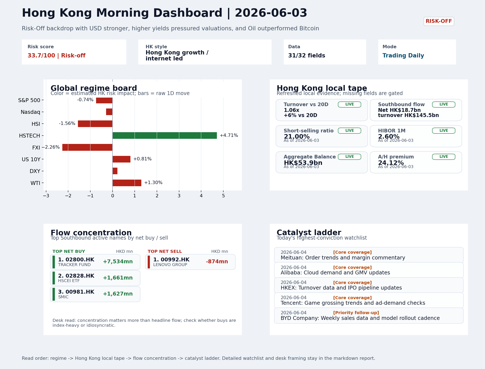
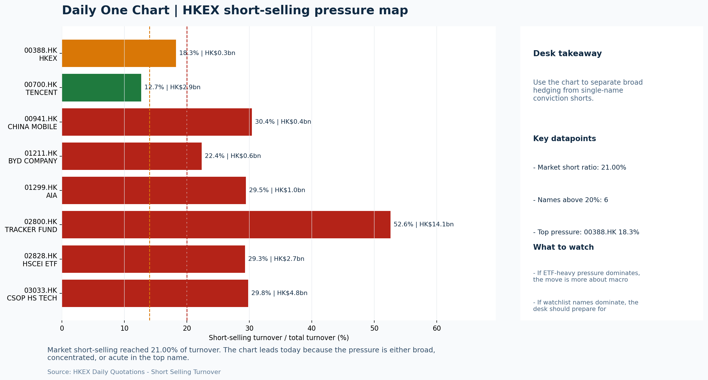

# Morning Research Workbench | 2026-06-04

> Designed for a Hong Kong sell-side commute: Layer 1 `Scan`, Layer 2 `Deep Read`, Layer 3 `Thinking`
> Mode: `Trading Daily` | Keep the report execution-oriented: what mattered in the completed session, what can move Hong Kong leadership, and what needs fast follow-up.
> Briefing date: `2026-06-04` | Review date: `2026-06-03` | Global request: `2026-06-03` | HK/China request: `2026-06-03` | Market effective date: `2026-06-03` | Generated at: `2026-06-04 09:48:35`

## Executive Summary

- **Market pulse:** Risk-off pressure from a firmer USD, higher yields, and a 21% short-selling ratio challenges the HSTECH rebound; today's session is a confirmation test for southbound-driven tech leadership.
- **Hong Kong lens:** Hong Kong growth / internet led. The HSTECH-led bounce will be tested today. A credible open requires HSTECH to hold above 5.0 with FXI confirming rather than diverging further.
- **Top catalysts:** INTC -6.33%; Bitcoin -6.47%.

## Visual Dashboard

## Layer 1 | Scan (5-10 min)

### 1.1 One-Line Market Pulse
Risk-off pressure from a firmer USD, higher yields, and a 21% short-selling ratio challenges the HSTECH rebound; today's session is a confirmation test for southbound-driven tech leadership.

### 1.2 Global Asset Price Dashboard

| Asset | Last | 1D move | Read |
| --- | --- | --- | --- |
| S&P 500 | 7,553.68 | -0.74% | US large-cap risk appetite |
| Nasdaq 100 | 30,571.24 | -0.29% | Growth and duration leadership |
| Hang Seng Index | 25,633.21 | **-1.56%** | Hong Kong broad beta |
| Hang Seng TECH | 5.0950 | **+4.71%** | Hong Kong growth / platform read-through |
| CSI 300 | 4,938.81 | +0.49% | Mainland large-cap tone |
| US 10Y | 4.4910 | +0.81% | Global discount-rate anchor |
| China 10Y | 1.71% | +0.9bp | China local rates anchor \| Live public \| Eastmoney \| 2026-06-03 |
| CN-US 10Y spread | -277.7bp | -2.1bp | Relative carry and macro-pressure gauge \| Live public \| Eastmoney \| 2026-06-03 |
| DXY | 99.44 | +0.22% | Dollar liquidity impulse |
| USD/CNH | 6.7725 | +0.20% | Offshore China risk appetite |
| USD/HKD | 7.8369 | -0.00% | Linked-exchange regime stress check |
| Brent crude | 96.53 | +0.55% | Energy / geopolitics |
| COMEX gold | 4,493.80 | +0.10% | Hedge demand / real yields |
| Copper | 6.4755 | **-2.62%** | Global growth proxy |
| VIX | 16.06 | **+1.84%** | US stress barometer |

### 1.3 Hong Kong Key Data Quick Check

| Check | Value | Status | Source / as of | Why it matters |
| --- | --- | --- | --- | --- |
| Main Board turnover vs 20D | 1.06x \| +6% vs 20D | Live local | HKEX \| 2026-06-03 | Trailing 20-session average turnover was HK$304.5bn. |
| Southbound / Northbound net flow | Southbound Net HK$18.7bn \| turnover HK$145.5bn \| Northbound Turnover HK$414.7bn \| net not reported | Live local | HKEX Connect \| 2026-06-03 | Southbound net buy is calculated from HKEX disclosed buy and sell turnover. |
| Short-selling ratio | 21.00% | Live local | HKEX \| 2026-06-03 | Official HKEX stock-level short-selling table, aggregated as a share of total market turnover. |
| AH premium index | 24.12% | Live public | Yahoo \| 2026-06-03 | Simple average across 17 A/H pairs; use dispersion rather than the average alone. |
| USD/HKD spot vs band | 7.8369 \| band 7.7500 to 7.8500 | Live quote + local | Yahoo \| 2026-06-03 | Inside the linked-exchange band without immediate boundary stress. Official Convertibility Undertakings define the linked-rate stress boundaries for USD/HKD. |
| HIBOR 1M | 2.60% | Live local | HKMA \| 2026-06-03 | 1M HIBOR is the cleanest quick read for Hong Kong funding conditions and equity-duration pressure. |
| Aggregate Balance | HK$53.9bn | Live local | HKMA \| 2026-06-03 | Aggregate Balance helps frame whether linked-rate liquidity conditions are tight or comfortable. |
| Hong Kong leadership | Hong Kong growth / internet led | Proxy | HSI / HSCEI / HSTECH relative perf \| 2026-06-03 | Use HSI / HSCEI / HSTECH relative moves as the opening style read. |

### 1.4 Risk Dashboard
**Composite risk score:** `33.7/100` | **Regime:** `Risk-off`

| Component | Score impact | Evidence |
| --- | --- | --- |
| US beta | -4.4 | S&P 500 -0.74% |
| HK growth | +10 | HSTECH +4.71% |
| Offshore China proxy | -8 | FXI -2.26% |
| Dollar pressure | -2.2 | DXY +0.22% |
| Volatility | -3.7 | VIX +1.84% |
| HK short-selling | -8 | Short-selling ratio 21.00% |

### 1.5 Morning Checklist
1. **INTC -6.33%**
 Mover attribution | Announcement / expectations | Guidance reset and margin pressure
2. **Bitcoin -6.47%**
 High-frequency data | Keep tracking it to confirm whether the core daily narrative is holding.
3. **Risk-Off backdrop with USD stronger, higher yields pressured valuations, and Oil outperformed Bitcoin**
 Overnight regime | Start by deciding whether the day is about Risk-Off conditions or a style pivot.
4. **CPI MoM (Released)**
 Macro / policy | Rates expectations, the dollar, and growth-equity valuation | Industries: Technology, Internet, Brokers
5. **Trade Balance (Released)**
 Macro / policy | Watch whether it changes the day's core market narrative | Industries: Market-wide

## Layer 2 | Deep Read (20-30 min)

### 2.1 Overnight Overseas Market Review
#### Market Setup
**Core tape.** Overnight markets settled into a risk-off posture as USD firmed and US 10Y yields rose +0.81%, dragging S&P 500 -0.74% and Euro Stoxx 50 -0.89%.
**Main driver.** The dominant cross-asset signal was the Oil-versus-Bitcoin spread of 4.57pp, with crude holding +1.30% on geopolitical support while Bitcoin extended its slide at -6.47%.
**HK relevance.** Hong Kong's session delivered an unusual divergence - Hang Seng -1.56% and HSCEI -1.90% alongside a sharp HSTECH rebound of +4.71%, though this was paired with FXI -2.26% and USD/CNH +0.20% that signal offshore China.

#### Key Drivers
- Goldman Sachs cutting Hong Kong stocks in favor of mainland China AI hardware is the most direct HK catalyst, with potential follow-on.
- Intel's guidance reset and margin pressure (INTC -6.33% premarket) extended semiconductor sector weakness with knock-on risk for Asia tech.
- Fed Chair Warsh's first hires include a 'Project 2025' author, introducing policy-uncertainty that has hawkish repricing implications.
- Elevated HK short-selling ratio of 21.00% argues for extra confirmation before treating the HSTECH rebound as durable leadership rotation.

#### Hong Kong Read-Through
**Desk lens.** Hong Kong growth / internet led.
**Opening implication.** The HSTECH-led bounce will be tested today. A credible open requires HSTECH to hold above 5.0 with FXI confirming rather than diverging further.
- **Cross-market read:** Hang Seng -1.56% / HSCEI -1.90% / HSTECH +4.71%.
- **Cross-market read:** Offshore China proxy FXI -2.26% and USD/CNH +0.20% frame cross-border risk appetite.
- **Cross-market read:** USD/HKD last traded around 7.8369, which keeps the Hong Kong funding lens in focus.

#### Watch Points
- USD composite moved higher by +0.21pct intraday, with a 0.371pct range.
- Main turning points appeared around 2026-06-03 08:05 peak / 2026-06-03 08:35 trough / 2026-06-03 08:50 peak, suggesting event-driven repricing.
- The biggest cross-asset divergence was Oil versus Bitcoin, a spread of 4.566pct.
- Gold moved -0.68pct intraday with a 1.34pct high-low range.

**Curated overnight stories**
1. **Goldman Sachs cuts Hong Kong stocks in favor of mainland China AI hardware plays**
 Why it matters: A top-tier Western house shifting allocation preference away from Hong Kong-listed equities toward mainland AI hardware signals institutional positioning is rotating out.
 HK read-through: Most relevant for Hong Kong internet, tech platform, and growth-oriented names. If other banks follow Goldman, H-share tech could face sustained selling pressure from global.
2. **INTC -6.33% premarket after guidance reset and margin pressure**
 Why it matters: Intel's guidance cut and margin concerns extend the semiconductor sector weakness seen overnight.
 HK read-through: Relevant for Hong Kong semiconductor, hardware, and tech manufacturing names linked to global chip sentiment. Could weigh on Hang Seng Tech Index components.
3. **Bitcoin -6.47% overnight; traders forecast further lows for 2026**
 Why it matters: Bitcoin's continued sell-off confirms the risk-off regime is holding. The correlation between crypto weakness and risk-asset sentiment remains high for Hong Kong equity.
 HK read-through: Affecting Hong Kong digital asset-adjacent plays and risk appetite for growth equities. The oil-over-Bitcoin dynamic noted in the market theme reinforces the defensive tilt.
4. **Fed Chair Warsh makes first hires at central bank, including 'Project 2025' author**
 Why it matters: A new Fed chair appointing staff with politically charged backgrounds introduces uncertainty around the Fed's policy trajectory. Markets had been pricing gradual easing.
 HK read-through: USD strength and higher yields overnight are consistent with this development. Any hawkish repricing of Fed policy would be dollar-supportive and headwind for HK and China.
5. **China's factory activity beats forecasts in May, private survey shows**
 Why it matters: Private PMI showed faster-than-expected manufacturing expansion despite softer official data. This divergence is worth tracking but the grade C and score 1.0 suggest limited.
 HK read-through: Modestly supportive for Hong Kong industrial and manufacturing names if confirmed, but insufficient alone to offset the risk-off backdrop driven by rates and USD strength.

### 2.2 Hong Kong / A-share Previous-Day Review
#### Local Tape Setup
**Local read.** Hong Kong's session delivered a rare style divergence.
**Verification point.** Southbound flows concentrated into tech and benchmark ETFs - CSOP HS TECH (3033.HK) net buying HK$1.23bn, Tracker Fund (2800.HK) HK$7.53bn - providing the only supportive local flow story.
**Risk to watch.** USD/CNH moved +0.20% to 6.7725, adding a mild FX headwind.

#### Style and Local Leadership
**Style leadership.** Hong Kong growth / internet led.
- **Cross-market read:** Hang Seng -1.56% / HSCEI -1.90% / HSTECH +4.71%.
- **Cross-market read:** Offshore China proxy FXI -2.26% and USD/CNH +0.20% frame cross-border risk appetite.
- **Cross-market read:** USD/HKD last traded around 7.8369, which keeps the Hong Kong funding lens in focus.

#### Flow Confirmation
Official Stock Connect evidence is available; use Section 2.3 to confirm whether local money supports the price action.

#### Follow-Through Checklist
**Follow-through check.** Watch whether CSI 300 and offshore China ETFs (FXI, KWEB) reprice to confirm tech leadership; if they do not, the HSTECH bounce is likely a short-covering event. Monitor southbound persistence in 3033.HK and 2800.HK.

### 2.3 Flow Tracker and Attribution
#### Cross-Asset Attribution v1

| Driver | Direction | Score | Evidence | HK implication |
| --- | --- | --- | --- | --- |
| Short-selling pressure | drag | 4.2 | HKEX short-selling ratio was 21.00%. | Elevated short activity argues for extra confirmation before chasing rebounds. |
| Rates impulse | drag | 0.97 | US 10Y yield proxy moved +0.81%. | Lower yields help long-duration growth; higher yields pressure valuation-sensitive |
| Global equity beta | drag | 0.74 | S&P 500 moved -0.74%. | Broad beta matters if Hong Kong breadth confirms the overseas signal. |

#### Flow Tracker
##### Flow Takeaways
- Short-selling pressure is elevated, so local rebounds need cleaner breadth and flow confirmation.
- Stock Connect Southbound: net HK$18.7bn on turnover HK$145.5bn (as of 2026-06-03).
- Stock Connect Northbound: turnover RMB414.7bn; public file provides total turnover/top active names, not full net-buy.
- AH premium: simple covered-pair average +24.12%; widest premium: China Railway 50.17%.

##### Stock Connect Southbound Active Names

| Rank | Ticker | Name | Buy | Sell | Net buy |
| --- | --- | --- | --- | --- | --- |
| 2 | 02800.HK | TRACKER FUND | HK$7,576.2mn | HK$42.4mn | HK$7,533.8mn |
| 7 | 02828.HK | HSCEI ETF | HK$1,661.5mn | HK$0.1mn | HK$1,661.5mn |
| 2 | 00981.HK | SMIC | HK$4,882.8mn | HK$3,256.2mn | HK$1,626.7mn |
| 4 | 03033.HK | CSOP HS TECH | HK$1,611.3mn | HK$378.1mn | HK$1,233.2mn |
| 1 | 00700.HK | TENCENT | HK$5,696.8mn | HK$4,496.7mn | HK$1,200.1mn |

##### AH Premium Dispersion

| Name | A ticker | H ticker | Premium | As of |
| --- | --- | --- | --- | --- |
| China Railway | 601390.SS | 0390.HK | +50.17% | 2026-06-03 |
| China Railway Construction | 601186.SS | 1186.HK | +48.69% | 2026-06-03 |
| China Communications Construction | 601800.SS | 1800.HK | +47.99% | 2026-06-03 |
| China Construction Bank | 601939.SS | 0939.HK | +36.03% | 2026-06-03 |
| Bank of China | 601988.SS | 3988.HK | +30.83% | 2026-06-03 |

##### HKEX Short-Selling Watch

| Ticker | Name | Short ratio | Short turnover | Total turnover |
| --- | --- | --- | --- | --- |
| 00388.HK | HKEX | 18.27% | HK$0.3bn | HK$1.4bn |
| 00700.HK | TENCENT | 12.67% | HK$2.9bn | HK$23.0bn |
| 00941.HK | CHINA MOBILE | 30.40% | HK$0.4bn | HK$1.5bn |
| 01211.HK | BYD COMPANY | 22.35% | HK$0.6bn | HK$2.6bn |
| 01299.HK | AIA | 29.46% | HK$1.0bn | HK$3.4bn |

- **Short-value leaders:** 02800.HK TRACKER FUND (HK$14.1bn); 03033.HK CSOP HS TECH (HK$4.8bn); 00700.HK TENCENT (HK$2.9bn); 03690.HK MEITUAN-W (HK$2.8bn).

### 2.4 Macro and Policy Tracking
**Desk read.** The overnight risk-off move - stronger USD, higher yields, and commodity divergence - sets a cautious tone for Hong Kong.

**Market sensitivity.** The 2026-06-04 agenda can quickly reprice rates, FX, and sector leadership.

**HK implication.** Upcoming US retail sales (forecast 0.3%), Fed Chair Powell's remarks, China's LPR decision (expected unchanged), and PBOC liquidity operations will either extend the defensive rotation or offer a growth-policy offset.

**Macro watchpoints**
- US 10-year yield and DXY response after retail sales and Powell remarks.
- Whether China LPR and PBOC liquidity signal easing; watch CNH and HK interbank rates.
- Hong Kong tech and broker stocks reaction to CPI-driven rates repricing.
- Copper and Bitcoin as real-time cyclical risk appetite gauges.

| Time | Region | Event | Status | Desk read |
| --- | --- | --- | --- | --- |
| 20:30 | US | CPI MoM | Released | Impact: Rates expectations, the dollar, and growth-equity valuation \| Attention: 5/5 \| Industries: Technology, Internet, Brokers |
| 09:30 | China | Trade Balance | Released | Impact: Watch whether it changes the day's core market narrative \| Attention: 3/5 \| Industries: Market-wide |
| 20:30 | US | Retail Sales MoM | Upcoming | Impact: Consumer resilience, growth expectations, and risk-asset pricing \| Attention: 5/5 \| Industries: Consumer, E-commerce, Consumer discretionary |
| 09:20 | China | Loan Prime Rate | Upcoming | Impact: Watch whether it changes the day's core market narrative \| Attention: 3/5 \| Industries: Market-wide |
| 22:00 | Federal Reserve | Jerome Powell: Economic outlook remarks | Central bank | Impact: Policy path, liquidity conditions, and cross-asset risk appetite \| Attention: 5/5 \| Industries: Technology, Financials, Gold |
| 10:00 | PBOC | Open Market Operations Desk: Daily liquidity operation window | Central bank | Impact: Policy path, liquidity conditions, and cross-asset risk appetite \| Attention: 3/5 \| Industries: Technology, Financials, Gold |

#### Positioning and Risk Backdrop
- Options activity centered on KWEB Call, with Vol/OI at 1.88x and a bullish bias.
- Put/Call structure shows equity 0.68 / index 1.15, implying Single-stock optimism with index hedging.
- Geopolitics: Middle East | Regional tension remains elevated | Impact: Oil, freight costs, and safe-haven demand
- Geopolitics: US-China | Technology export-control rhetoric remains active | Impact: China internet, semiconductors, and supply chains

### 2.5 Key Company and Sector Events
No high-conviction sector story cleared the main-report relevance gate for this run.

#### HKEX Announcements

| Grade | Ticker | Type | Release time | Title |
| --- | --- | --- | --- | --- |
| A | 00599.HK | Profit warning | 2026-06-02 | Profit warning / alert announcement |
| A | 00927.HK | Profit warning | 2026-06-02 | Profit warning / alert announcement |
| A | 03860.HK | Profit warning | 2026-06-02 | Profit warning / alert announcement |
| A | 00234.HK | Profit warning | 2026-06-01 | Profit warning / alert announcement |
| A | 01050.HK | Profit warning | 2026-06-01 | Profit warning / alert announcement |
| A | 00852.HK | Profit warning | 2026-05-29 | Profit warning / alert announcement |
| A | 02193.HK | Profit warning | 2026-05-29 | Profit warning / alert announcement |
| A | 01473.HK | Profit warning | 2026-05-28 | Profit warning / alert announcement |

#### Earnings / Results Watch

| Ticker | Company | Timing | Expectation framing |
| --- | --- | --- | --- |
| 0700.HK | Tencent Holdings | After Market Close | EPS est. 4.15 HKD \| revenue est. 163.2bn HKD |
| 0388.HK | Hong Kong Exchanges and Clearing | Before Market Open | EPS est. 2.81 HKD \| revenue est. 6.0bn HKD |

#### Rating Changes
- **9988.HK** | Morgan Stanley | Upgrade | Equal Weight -> Overweight | PT 92 -> 105

#### IPO Watch
- IPO and grey-market monitoring is not yet part of the standard production pack.

### 2.6 Today's Core Names
#### Core coverage

| Name | Ticker | Last | 1D | Range position | Morning note |
| --- | --- | --- | --- | --- | --- |
| Meituan | 3690.HK | 78.90 | -1.87% | Mid-range | Positioning is neutral for now, so use it mainly to monitor marginal information changes. |
| Alibaba | 9988.HK | 124.90 | -1.34% | Mid-range | Positioning is neutral for now, so use it mainly to monitor marginal information changes. |

**Recent headlines for Meituan:**
- [Meituan Logs Another Loss Amid Food-Delivery Price War](https://www.wsj.com/business/earnings/meituan-logs-another-loss-amid-food-delivery-price-war-fef4c703?siteid=yhoof2&yptr=yahoo) (The Wall Street Journal)
**Recent headlines for Alibaba:**
- [Top Stock Reports for Broadcom, Cisco & Alibaba](https://finance.yahoo.com/markets/stocks/articles/top-stock-reports-broadcom-cisco-201500971.html) (Zacks)

#### Priority follow-up

| Name | Ticker | Last | 1D | Range position | Morning note |
| --- | --- | --- | --- | --- | --- |
| BYD Company | 1211.HK | 91.65 | -1.72% | Bottom of range | The name sits near the bottom of its recent range and is worth monitoring for a catalyst-led reversal. |
| AIA | 1299.HK | 81.40 | -1.03% | Mid-range | Positioning is neutral for now, so use it mainly to monitor marginal information changes. |

## Layer 3 | Thinking (10-15 min)

### 3.1 Rotating Theme Deep Dive

| Field | Read |
| --- | --- |
| Theme | China Exports and Supply-Chain Relocation |
| Angle for the day | Track tariffs, trade policy, shipping, and manufacturing orders to see whether export resilience is still the cleaner China macro expression. |

**Theme desk read**
**Core thesis.** The weekly theme of China exports and supply-chain relocation is receiving a fresh test.
**Evidence.** The Caixin manufacturing PMI beat forecasts, and the May trade balance printed at USD 85.2bn, well above the USD 79.0bn consensus, reinforcing the narrative of export resilience as the cleaner macro expression for China.
**What to test.** Yet overnight signals urge caution: copper fell 2.6%, Bitcoin dropped 6.5%, and the broader risk-off tone - with a stronger USD and higher US yields - pressures cyclical positioning.

**Signals to keep in mind**
- China's factory activity beats forecasts in May, private survey shows, despite softer official data
- Bitcoin -6.47%: Keep tracking it to confirm whether the core daily narrative is holding.
- Copper -2.62%: Weak copper argues for more caution on cyclical growth.

**LLM watch items:**
- Copper trajectory as a real-time check on cyclical demand assumptions
- BYD weekly sales data to confirm EV export momentum and price-competition dynamics
- Whether the May trade surplus strength is sustained in coming months
- China LPR decision for any policy easing signal that could support domestic growth rotation
- US Retail Sales to gauge external demand impetus and risk appetite

**Related names to keep close:**

| Name | Ticker | Bucket | Morning read |
| --- | --- | --- | --- |
| BYD Company | 1211.HK | Priority follow-up | The name sits near the bottom of its recent range and is worth monitoring for a catalyst-led reversal. |
| China Mobile | 0941.HK | Priority follow-up | The name sits near the top of its recent range, so watch for profit-taking under high expectations. |

**Upcoming catalysts tied to the theme:**
- 2026-06-04 | BYD Company: Weekly sales data and model rollout cadence | Hong Kong-listed proxy for EV volumes, export mix, and price competition
- 2026-06-04 | China Mobile: Capex updates and dividend policy signals | Defensive SOE benchmark for yield trade and domestic digital-infrastructure spend

**Relevant headlines:**
- [China's factory activity beats forecasts in May, private survey shows, despite softer official data](https://www.cnbc.com/2026/06/01/chinas-factory-activity-beats-forecasts-in-may-private-survey-shows-despite-softer-official-data.html)

### 3.2 Today Ahead and Trading Calendar
- Macro: CPI MoM is the first item to anchor the open and the rates/FX response.
- Corporate / event: Meituan: Order trends and margin commentary is the cleanest same-day catalyst to prepare for.

**Same-day macro docket**

| Time | Country | Event | Status | Detail |
| --- | --- | --- | --- | --- |
| 20:30 | US | CPI MoM | Released | Actual 0.3% / Forecast 0.2% / Prior 0.4% |
| 09:30 | China | Trade Balance | Released | Actual USD 85.2bn / Forecast USD 79.0bn / Prior USD 80.6bn |
| 20:30 | US | Retail Sales MoM | Upcoming | Forecast 0.3% / Prior 0.6% |
| 09:20 | China | Loan Prime Rate | Upcoming | Forecast 3.45% / Prior 3.45% |
| 22:00 | Federal Reserve | Jerome Powell: Economic outlook remarks | Central bank | speech |

**Same-day catalyst list**

| Date | Time | Category | Event | Importance |
| --- | --- | --- | --- | --- |
| 2026-06-04 | | Core coverage | Meituan: Order trends and margin commentary | 3 |
| 2026-06-04 | | Core coverage | Alibaba: Cloud demand and GMV updates | 3 |
| 2026-06-04 | | Core coverage | HKEX: Turnover data and IPO pipeline updates | 3 |
| 2026-06-04 | | Core coverage | Tencent: Game grossing trends and ad-demand checks | 3 |

**Next few sessions**

| Date | Category | Event | Impact |
| --- | --- | --- | --- |
| 2026-06-04 | Core coverage | Meituan: Order trends and margin commentary | High-frequency read on local services demand and platform competition |
| 2026-06-04 | Core coverage | Alibaba: Cloud demand and GMV updates | Key read-through for China consumption, cloud, and platform regulation |
| 2026-06-04 | Core coverage | HKEX: Turnover data and IPO pipeline updates | Direct proxy for Hong Kong market turnover, listings, and southbound |
| 2026-06-04 | Core coverage | Tencent: Game grossing trends and ad-demand checks | Core offshore China platform proxy for gaming, ads, and AI monetization |

### 3.3 Daily One Chart
**Daily One Chart | HKEX short-selling pressure map**

**Chart read.** Market short-selling reached 21.00% of turnover.
**Why it matters.** The chart leads today because the pressure is either broad, concentrated, or acute in the top name.

_Source: HKEX Daily Quotations - Short Selling Turnover_

## Traceable Appendix

### Report Metadata
> Date policy: Review date 2026-06-03 is treated as `Trading Daily`. | Global request date is 2026-06-03; adapter effective date is 2026-06-03 and summary date is 2026-06-03. | HK/China local data date is 2026-06-03; role: same-session local cash tape.
> Market data quality: Coverage: `31/32` | Fallbacks used: `1` | Missing: `1`
> Report quality: `90.0/100` | Grade `A` | Status `production ready`

### Key Questions to Keep in Mind
- Is risk appetite rising or fading? The overnight tape reads closer to `Risk-Off`.
- Did rates expectations move? Focus on whether US 10Y, DXY, and growth style moved together.
- Were commodities the real story? Watch WTI and gold for geopolitics versus inflation signals.
- Is Hong Kong setup internet-led, SOE-led, or broad beta-led? Compare HSTECH, HSCEI, and HSI.
- Did offshore markets move China risk appetite? Focus on HSI, FXI, USD/CNH, and USD/HKD.

### Report Quality and Validation
- **Quality score:** 90.0/100 | **Grade:** A | **Status:** production ready
- **Run summary:** 7 healthy | 1 caveat | 0 failed
- **Release recommendation:** Send with caveats | The report is usable, but the advisory guidance should travel with it so readers understand the data gaps.

| Source | Status | Bucket |
| --- | --- | --- |
| Market data | ok | healthy |
| Sector and company news | ok | healthy |
| Movers and short selling | ok | healthy |
| Stock Connect | ok | healthy |
| A/H premium | ok | healthy |
| Hong Kong local package | ok | healthy |
| China rates | ok | healthy |
| Narrative overlay | partial | caveat |

**Desk-use guidance summary:** 0 blocking | 1 advisory

**Desk-use guidance**
- **Advisory:** Use deterministic sections as primary support; the narrative overlay was partial or unavailable on this run.

| Component | Score | Weight | Read |
| --- | --- | --- | --- |
| Market data coverage | 96.9 | 0.3 | 31/32 core market fields available. |
| Hong Kong local metrics | 82.3 | 0.25 | 8 live, 3 proxy, 0 unavailable local checks. |
| Key public adapters | 100.0 | 0.2 | 4/4 key adapters were available or partially available. |
| Narrative overlay health | 68.6 | 0.15 | 4/7 narrative overlay tasks succeeded or used validated cache; 1 error(s). |
| Fact-check guardrail | 100.0 | 0.1 | Checked 6 numeric claims; 0 numeric mismatch(es), 0 logic warning(s); 0 critical, 0 review. |

**Narrative fact-check guardrail**
- Checked 6 numeric claims; 0 numeric mismatch(es), 0 logic warning(s); 0 critical, 0 review.

**Adapter status**

| Adapter | Status |
| --- | --- |
| Stock Connect | ok |
| A/H premium | ok |
| HKEX announcements | ok |
| China rates | ok |

### Source Links
- [Meituan Logs Another Loss Amid Food-Delivery Price War](https://www.wsj.com/business/earnings/meituan-logs-another-loss-amid-food-delivery-price-war-fef4c703?siteid=yhoof2&yptr=yahoo) (The Wall Street Journal)
- [Top Stock Reports for Broadcom, Cisco & Alibaba](https://finance.yahoo.com/markets/stocks/articles/top-stock-reports-broadcom-cisco-201500971.html) (Zacks)
- [Tencent Holdings (SEHK:700) Valuation Check After Recent Share Price Swings](https://finance.yahoo.com/markets/stocks/articles/tencent-holdings-sehk-700-valuation-211732962.html) (Simply Wall St.)
- [DeepSeek Nears $7.4 Billion Raise In Major China AI Financing](https://finance.yahoo.com/sectors/technology/articles/deepseek-nears-7-4-billion-201330922.html) (GuruFocus.com)
- [00599.HK Profit warning / alert announcement](http://www1.hkexnews.hk/listedco/listconews/sehk/2026/0602/2026060202380.pdf) (HKEXnews)
- [00927.HK Profit warning / alert announcement](http://www1.hkexnews.hk/listedco/listconews/sehk/2026/0602/2026060201778.pdf) (HKEXnews)
- [03860.HK Profit warning / alert announcement](http://www1.hkexnews.hk/listedco/listconews/sehk/2026/0602/2026060201418.pdf) (HKEXnews)
- [00234.HK Profit warning / alert announcement](http://www1.hkexnews.hk/listedco/listconews/sehk/2026/0601/2026060102974.pdf) (HKEXnews)
- [01050.HK Profit warning / alert announcement](http://www1.hkexnews.hk/listedco/listconews/sehk/2026/0601/2026060101420.pdf) (HKEXnews)
- [00852.HK Profit warning / alert announcement](http://www1.hkexnews.hk/listedco/listconews/sehk/2026/0529/2026052900279.pdf) (HKEXnews)
- [02193.HK Profit warning / alert announcement](http://www1.hkexnews.hk/listedco/listconews/sehk/2026/0529/2026052901653.pdf) (HKEXnews)
- [01473.HK Profit warning / alert announcement](http://www1.hkexnews.hk/listedco/listconews/sehk/2026/0528/2026052801839.pdf) (HKEXnews)

## Supplementary Visual Appendix

This appendix is professional-path only. It keeps a traceable index of the report visuals and the deterministic chart cues used to frame the morning note, without injecting the legacy intraday chart pack.

### Visual Index

| Visual | Path | Role |
| --- | --- | --- |
| Visual Dashboard | `charts/dashboard_2026-06-04.png` | Cross-asset regime board and Hong Kong local tape snapshot. |
| Daily One Chart | `charts/daily_one_chart_2026-06-04.png` | Single highest-conviction visual story for the day. |

### Deterministic Chart Cues
- FX / liquidity: USD composite moved higher by +0.21pct intraday, with a 0.371pct range.
- FX / liquidity: Main turning points appeared around 2026-06-03 08:05 peak / 2026-06-03 08:35 trough / 2026-06-03 08:50 peak, suggesting event-driven repricing rather than a clean one-way USD move.
- Cross-asset: The biggest cross-asset divergence was Oil versus Bitcoin, a spread of 4.566pct.
- Cross-asset: Gold moved -0.68pct intraday with a 1.34pct high-low range.
- Cross-asset: Oil moved +0.67pct intraday with a 2.575pct high-low range.
- Cross-asset: Bitcoin moved -3.90pct intraday with a 5.083pct high-low range.

### Risk Dashboard Components

| Component | Score impact | Evidence |
| --- | --- | --- |
| US beta | -4.4 | S&P 500 -0.74% |
| HK growth | +10 | HSTECH +4.71% |
| Offshore China proxy | -8 | FXI -2.26% |
| Dollar pressure | -2.2 | DXY +0.22% |
| Volatility | -3.7 | VIX +1.84% |
| HK short-selling | -8 | Short-selling ratio 21.00% |
