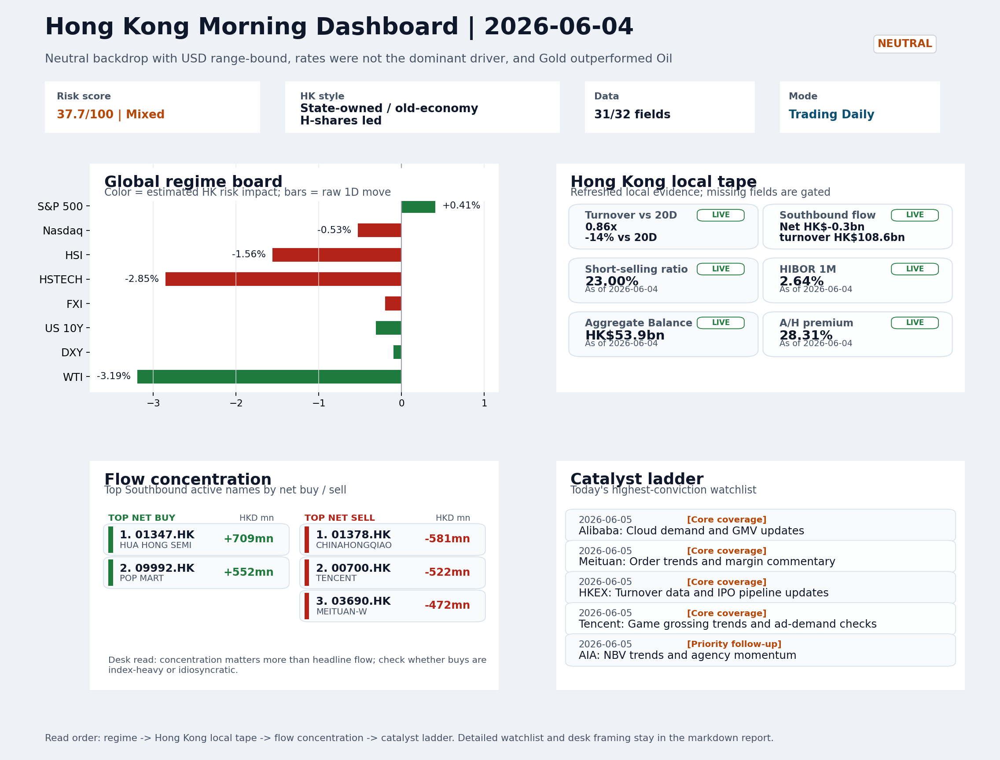
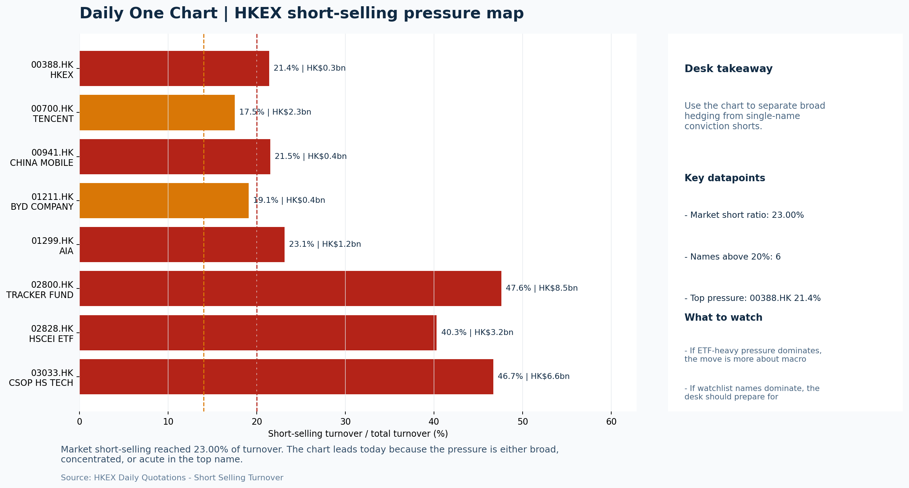

# Morning Research Workbench | 2026-06-05

> Designed for a Hong Kong sell-side commute: Layer 1 `Scan`, Layer 2 `Deep Read`, Layer 3 `Thinking`
> Mode: `Trading Daily` | Keep the report execution-oriented: what mattered in the completed session, what can move Hong Kong leadership, and what needs fast follow-up.
> Briefing date: `2026-06-05` | Review date: `2026-06-04` | Global request: `2026-06-04` | HK/China request: `2026-06-04` | Market effective date: `2026-06-04` | Generated at: `2026-06-05 08:18:25`

## Executive Summary

- **Market pulse:** Elevated short-selling at 23% and the Goldman Sachs downgrade keep Hong Kong opening pressure intact, while the Gold/Oil divergence argues against chasing early rebounds without cleaner.
- **Hong Kong lens:** Hong Kong growth / internet led. The HK session will likely open under pressure given HSTECH's -2.85% and the Gold/Oil divergence as a risk-off signal.
- **Top catalysts:** INTC -6.33%; Neutral backdrop with USD range-bound, rates were not the dominant driver, and Gold outperformed Oil.

## Visual Dashboard

## Layer 1 | Scan (5-10 min)

### 1.1 One-Line Market Pulse
Elevated short-selling at 23% and the Goldman Sachs downgrade keep Hong Kong opening pressure intact, while the Gold/Oil divergence argues against chasing early rebounds without cleaner breadth and flow confirmation.

### 1.2 Global Asset Price Dashboard

| Asset | Last | 1D move | Read |
| --- | --- | --- | --- |
| S&P 500 | 7,584.31 | +0.41% | US large-cap risk appetite |
| Nasdaq 100 | 30,407.81 | -0.53% | Growth and duration leadership |
| Hang Seng Index | 25,633.21 | **-1.56%** | Hong Kong broad beta |
| Hang Seng TECH | 4.9500 | **-2.85%** | Hong Kong growth / platform read-through |
| CSI 300 | 4,938.81 | +0.49% | Mainland large-cap tone |
| US 10Y | 4.4770 | -0.31% | Global discount-rate anchor |
| China 10Y | 1.71% | -0.5bp | China local rates anchor \| Live public \| Eastmoney \| 2026-06-04 |
| CN-US 10Y spread | -276.2bp | +1.5bp | Relative carry and macro-pressure gauge \| Live public \| Eastmoney \| 2026-06-04 |
| DXY | 99.43 | -0.10% | Dollar liquidity impulse |
| USD/CNH | 6.7740 | -0.03% | Offshore China risk appetite |
| USD/HKD | 7.8357 | -0.01% | Linked-exchange regime stress check |
| Brent crude | 95.24 | **-2.63%** | Energy / geopolitics |
| COMEX gold | 4,488.70 | +1.17% | Hedge demand / real yields |
| Copper | 6.5070 | +0.40% | Global growth proxy |
| VIX | 15.40 | **-4.11%** | US stress barometer |

### 1.3 Hong Kong Key Data Quick Check

| Check | Value | Status | Source / as of | Why it matters |
| --- | --- | --- | --- | --- |
| Main Board turnover vs 20D | 0.86x \| -14% vs 20D | Live local | HKEX \| 2026-06-04 | Trailing 20-session average turnover was HK$314.6bn. |
| Southbound / Northbound net flow | Southbound Net HK$-0.3bn \| turnover HK$108.6bn \| Northbound Turnover HK$365.2bn \| net not reported | Live local | HKEX Connect \| 2026-06-04 | Southbound net buy is calculated from HKEX disclosed buy and sell turnover. |
| Short-selling ratio | 23.00% | Live local | HKEX \| 2026-06-04 | Official HKEX stock-level short-selling table, aggregated as a share of total market turnover. |
| AH premium index | 28.31% | Live public | Yahoo \| 2026-06-04 | Simple average across 20 A/H pairs; use dispersion rather than the average alone. |
| USD/HKD spot vs band | 7.8357 \| band 7.7500 to 7.8500 | Live quote + local | Yahoo \| 2026-06-04 | Inside the linked-exchange band without immediate boundary stress. Official Convertibility Undertakings define the linked-rate stress boundaries for USD/HKD. |
| HIBOR 1M | 2.64% | Live local | HKMA \| 2026-06-04 | 1M HIBOR is the cleanest quick read for Hong Kong funding conditions and equity-duration pressure. |
| Aggregate Balance | HK$53.9bn | Live local | HKMA \| 2026-06-04 | Aggregate Balance helps frame whether linked-rate liquidity conditions are tight or comfortable. |
| Hong Kong leadership | Hong Kong growth / internet led | Proxy | HSI / HSCEI / HSTECH relative perf \| 2026-06-04 | Use HSI / HSCEI / HSTECH relative moves as the opening style read. |

### 1.4 Risk Dashboard
**Composite risk score:** `37.7/100` | **Regime:** `Mixed`

| Component | Score impact | Evidence |
| --- | --- | --- |
| US beta | +2.5 | S&P 500 +0.41% |
| HK growth | -10 | HSTECH -2.85% |
| Offshore China proxy | -1.0 | FXI -0.20% |
| Dollar pressure | +1.0 | DXY -0.10% |
| Volatility | +8.2 | VIX -4.11% |
| HK short-selling | -8 | Short-selling ratio 23.00% |

### 1.5 Morning Checklist
1. **INTC -6.33%**
 Mover attribution | Announcement / expectations | Guidance reset and margin pressure
2. **Neutral backdrop with USD range-bound, rates were not the dominant driver, and Gold outperformed Oil**
 Overnight regime | Start by deciding whether the day is about Neutral conditions or a style pivot.
3. **CPI MoM (Released)**
 Macro / policy | Rates expectations, the dollar, and growth-equity valuation | Industries: Technology, Internet, Brokers
4. **Trade Balance (Released)**
 Macro / policy | Watch whether it changes the day's core market narrative | Industries: Market-wide
5. **Retail Sales MoM (Upcoming)**
 Macro / policy | Consumer resilience, growth expectations, and risk-asset pricing | Industries: Consumer, E-commerce, Consumer discretionary

## Layer 2 | Deep Read (20-30 min)

### 2.1 Overnight Overseas Market Review
#### Market Setup
**Core tape.** US equities showed a split between broad indices and growth, with S&P 500 edging up while Nasdaq fell, as softer oil and lower volatility provided a partial counterweight to Intel's guidance reset and Goldman Sachs's.
**Main driver.** Hong Kong underperformed with the HSI, HSCEI, and HSTECH all down over 1.5%, led by state-owned and old-economy H-shares, while the 23% short-selling ratio confirms elevated intraday pressure.
**HK relevance.** Gold's outperformance over oil by over 2% and the DXY's -0.1% decline frame a risk-off environment that favors defensive positioning over cyclical re-entry.

#### Key Drivers
- Goldman Sachs downgrade from overweight to market-weight on HK stocks is a visible positioning shift that will attract flow.
- Intel guidance reset weighed on semiconductor sentiment, adding noise to tech and hardware-linked names in HK.
- 23% short-selling ratio makes index moves easier to fade and argues against chasing local rebounds without cleaner breadth.
- Oil -3.19% and gold +1.17% reflect a Gold-outperforming-Oil spread of 2.2%, a classic risk-off signal that diverges from the previous.

#### Hong Kong Read-Through
**Desk lens.** State-owned / old-economy H-shares led.
**Opening implication.** The HK session will likely open under pressure given HSTECH's -2.85% and the Gold/Oil divergence as a risk-off signal. Confirmation from FXI and lower short-selling activity is needed before treating any bounce as durable rather than a fade.
- **Cross-market read:** Hang Seng -1.56% / HSCEI -1.90% / HSTECH -2.85%.
- **Cross-market read:** Offshore China proxy FXI -0.20% and USD/CNH -0.03% frame cross-border risk appetite.
- **Cross-market read:** USD/HKD last traded around 7.8357, which keeps the Hong Kong funding lens in focus.

#### Watch Points
- USD composite moved lower by -0.04pct intraday, with a 0.188pct range.
- Main turning points appeared around 2026-06-04 08:05 peak / 2026-06-04 08:25 peak / 2026-06-04 08:40 trough, suggesting event-driven repricing.
- The biggest cross-asset divergence was Gold versus Oil, a spread of 2.199pct.
- Gold moved -0.05pct intraday with a 1.245pct high-low range.

**Curated overnight stories**
1. **Goldman Sachs cuts Hong Kong stocks to market-weight from overweight**
 Why it matters: Marks a visible shift in sell-side positioning from HK to mainland AI hardware. The framing is selective rotation, not a bullish signal on mainland tech or a bearish call on.
 HK read-through: Direct read-through for HK-index-heavy sectors (financials, consumer) and any passive flows linked to overweight thesis. Risk-reducing rather than a structural bearish call.
2. **INTC -6.33% after hours; guidance reset and margin pressure cited**
 Why it matters: Intel's guidance reset adds noise to an already-sensitive semiconductor complex. For Hong Kong-listed tech and semiconductor-linked names, the sector narrative (AI hardware.
 HK read-through: Relevant for HK-listed chip designers, EMS, and tech hardware sentiment. Not a direct earnings linkage but contributes to sector risk-off in early Asian session.
3. **Fed Chair Warsh makes first hires at central bank, including 'Project 2025' author**
 Why it matters: Personnel choices at the Fed signal institutional continuity or directional lean. 'Project 2025' association carries policy signaling weight for rates markets and dollar.
 HK read-through: Indirect via USD path; if Warsh staffing signals hawkish lean, USD could strengthen, pressuring HK dollar peg dynamics and CNH, which in turn affects HK-listed China asset.

### 2.2 Hong Kong / A-share Previous-Day Review
#### Local Tape Setup
**Local read.** Overnight US equities split with S&P 500 +0.41% but Nasdaq -0.53%, and Gold outperforming Oil reinforced a growth-averse backdrop.
**Verification point.** In Hong Kong, HSTECH fell 2.85% versus HSCEI -1.9%, with short-selling at 23% of turnover and Main Board volume 0.86x the 20-day average, signaling low-conviction selling and easy-fading conditions.
**Risk to watch.** Goldman Sachs's downgrade of HK stocks adds risk-reduction flow risk, while offshore proxies (FXI -0.2%) confirm cautious positioning.

#### Style and Local Leadership
**Style leadership.** Hong Kong growth / internet led.
- **Cross-market read:** Hang Seng -1.56% / HSCEI -1.90% / HSTECH -2.85%.
- **Cross-market read:** Offshore China proxy FXI -0.20% and USD/CNH -0.03% frame cross-border risk appetite.
- **Cross-market read:** USD/HKD last traded around 7.8357, which keeps the Hong Kong funding lens in focus.

#### Flow Confirmation
Official Stock Connect evidence is available; use Section 2.3 to confirm whether local money supports the price action.

#### Follow-Through Checklist
**Follow-through check.** Watch whether offshore proxies (FXI, KWEB) and onshore tech vs SOE indices confirm continuing growth underperformance, and monitor for a short-selling ratio drop below 20% as a cleaner entry signal.

### 2.3 Flow Tracker and Attribution
#### Cross-Asset Attribution v1

| Driver | Direction | Score | Evidence | HK implication |
| --- | --- | --- | --- | --- |
| Short-selling pressure | drag | 5.6 | HKEX short-selling ratio was 23.00%. | Elevated short activity argues for extra confirmation before chasing rebounds. |
| Oil and geopolitics | supportive | 2.1 | Oil moved -2.63%. | Split the read between energy/cyclicals support and margin/geopolitical pressure. |
| Hong Kong participation | drag | 1.41 | Main Board turnover was 0.86x the 20-session average. | Thin turnover makes index moves easier to fade. |

#### Flow Tracker
##### Flow Takeaways
- Short-selling pressure is elevated, so local rebounds need cleaner breadth and flow confirmation.
- Stock Connect Southbound: net HK$-0.3bn on turnover HK$108.6bn (as of 2026-06-04).
- Stock Connect Northbound: turnover RMB365.2bn; public file provides total turnover/top active names, not full net-buy.
- AH premium: simple covered-pair average +28.31%; widest premium: Everbright Bank 73.65%.

##### Stock Connect Southbound Active Names

| Rank | Ticker | Name | Buy | Sell | Net buy |
| --- | --- | --- | --- | --- | --- |
| 5 | 01347.HK | HUA HONG SEMI | HK$2,406.7mn | HK$1,698.2mn | HK$708.5mn |
| 10 | 01378.HK | CHINAHONGQIAO | HK$37.0mn | HK$617.7mn | HK$-580.8mn |
| 6 | 09992.HK | POP MART | HK$1,663.3mn | HK$1,111.1mn | HK$552.2mn |
| 2 | 00700.HK | TENCENT | HK$2,466.7mn | HK$2,988.6mn | HK$-522.0mn |
| 9 | 03690.HK | MEITUAN-W | HK$185.4mn | HK$657.0mn | HK$-471.6mn |

##### AH Premium Dispersion

| Name | A ticker | H ticker | Premium | As of |
| --- | --- | --- | --- | --- |
| Everbright Bank | 601818.SS | 6818.HK | +73.65% | 2026-06-04 |
| China Communications Construction | 601800.SS | 1800.HK | +68.64% | 2026-06-04 |
| China Railway | 601390.SS | 0390.HK | +49.82% | 2026-06-04 |
| China Railway Construction | 601186.SS | 1186.HK | +46.65% | 2026-06-04 |
| New China Life | 601336.SS | 1336.HK | +37.92% | 2026-06-04 |

##### HKEX Short-Selling Watch

| Ticker | Name | Short ratio | Short turnover | Total turnover |
| --- | --- | --- | --- | --- |
| 00388.HK | HKEX | 21.38% | HK$0.3bn | HK$1.6bn |
| 00700.HK | TENCENT | 17.50% | HK$2.3bn | HK$13.3bn |
| 00941.HK | CHINA MOBILE | 21.53% | HK$0.4bn | HK$1.8bn |
| 01211.HK | BYD COMPANY | 19.07% | HK$0.4bn | HK$2.3bn |
| 01299.HK | AIA | 23.14% | HK$1.2bn | HK$5.0bn |

- **Short-value leaders:** 02800.HK TRACKER FUND (HK$8.5bn); 03033.HK CSOP HS TECH (HK$6.6bn); 07709.HK XL2CSOPHYNIX (HK$3.8bn); 02828.HK HSCEI ETF (HK$3.2bn).

### 2.4 Macro and Policy Tracking
**Desk read.** The session absorbed a slightly above-consensus US CPI (0.3% m/m vs 0.2% est) that was cooler than the prior 0.4%, alongside a well-above-forecast China trade surplus of $85.2bn.

**Market sensitivity.** The mix leaves Hong Kong risk appetite in a neutral posture for now: the CPI print was not hot enough to force a dollar repricing, but it keeps the rate path finely balanced ahead of tonight's retail sales and Powell's speech.

**HK implication.** Gold's outperformance and oil's retreat add a defensive tint to commodity leadership, while Chinese trade strength offers a selective tailwind for exporters.

**Macro watchpoints**
- US 10-year yield and DXY move after May retail sales and Powell's economic outlook remarks.
- Whether Hang Seng Tech and H-share brokers can sustain early gains or begin to discount a 'higher-for-longer' rates risk.
- CNH and HKD fix and spot movements as a real-time gauge of cross-border flow sentiment.
- PBOC OMO volume and LPR decision - any surprise signaling looser liquidity or a rate shift.

| Time | Region | Event | Status | Desk read |
| --- | --- | --- | --- | --- |
| 20:30 | US | CPI MoM | Released | Impact: Rates expectations, the dollar, and growth-equity valuation \| Attention: 5/5 \| Industries: Technology, Internet, Brokers |
| 09:30 | China | Trade Balance | Released | Impact: Watch whether it changes the day's core market narrative \| Attention: 3/5 \| Industries: Market-wide |
| 20:30 | US | Retail Sales MoM | Upcoming | Impact: Consumer resilience, growth expectations, and risk-asset pricing \| Attention: 5/5 \| Industries: Consumer, E-commerce, Consumer discretionary |
| 09:20 | China | Loan Prime Rate | Upcoming | Impact: Watch whether it changes the day's core market narrative \| Attention: 3/5 \| Industries: Market-wide |
| 22:00 | Federal Reserve | Jerome Powell: Economic outlook remarks | Central bank | Impact: Policy path, liquidity conditions, and cross-asset risk appetite \| Attention: 5/5 \| Industries: Technology, Financials, Gold |
| 10:00 | PBOC | Open Market Operations Desk: Daily liquidity operation window | Central bank | Impact: Policy path, liquidity conditions, and cross-asset risk appetite \| Attention: 3/5 \| Industries: Technology, Financials, Gold |

#### Positioning and Risk Backdrop
- Options activity centered on KWEB Call, with Vol/OI at 1.88x and a bullish bias.
- Put/Call structure shows equity 0.68 / index 1.15, implying Single-stock optimism with index hedging.
- Geopolitics: Middle East | Regional tension remains elevated | Impact: Oil, freight costs, and safe-haven demand
- Geopolitics: US-China | Technology export-control rhetoric remains active | Impact: China internet, semiconductors, and supply chains

### 2.5 Key Company and Sector Events

| Grade | Sector | Headline | Why it matters | Horizon |
| --- | --- | --- | --- | --- |
| B | Semiconductors and AI | This investing strategy digs deeper to find hidden stocks riding the | Assess whether the story can propagate through the Semiconductors and AI | Monitor |

#### HKEX Announcements

| Grade | Ticker | Type | Release time | Title |
| --- | --- | --- | --- | --- |
| A | 00296.HK | Profit warning | 2026-06-04 | Profit warning / alert announcement |
| A | 00595.HK | Profit warning | 2026-06-04 | Profit warning / alert announcement |
| A | 00923.HK | Profit warning | 2026-06-04 | Profit warning / alert announcement |
| A | 00599.HK | Profit warning | 2026-06-02 | Profit warning / alert announcement |
| A | 00927.HK | Profit warning | 2026-06-02 | Profit warning / alert announcement |
| A | 03860.HK | Profit warning | 2026-06-02 | Profit warning / alert announcement |
| A | 00234.HK | Profit warning | 2026-06-01 | Profit warning / alert announcement |
| A | 01050.HK | Profit warning | 2026-06-01 | Profit warning / alert announcement |

#### Earnings / Results Watch

| Ticker | Company | Timing | Expectation framing |
| --- | --- | --- | --- |
| 0700.HK | Tencent Holdings | After Market Close | EPS est. 4.15 HKD \| revenue est. 163.2bn HKD |
| 0388.HK | Hong Kong Exchanges and Clearing | Before Market Open | EPS est. 2.81 HKD \| revenue est. 6.0bn HKD |

#### Rating Changes
- **9988.HK** | Morgan Stanley | Upgrade | Equal Weight -> Overweight | PT 92 -> 105

#### IPO Watch
- IPO and grey-market monitoring is not yet part of the standard production pack.

### 2.6 Today's Core Names
#### Core coverage

| Name | Ticker | Last | 1D | Range position | Morning note |
| --- | --- | --- | --- | --- | --- |
| Alibaba | 9988.HK | 123.50 | -2.45% | Bottom of range | Short-term pressure is visible; check for a fundamental or regulatory reason. |
| Meituan | 3690.HK | 78.60 | -2.24% | Mid-range | Short-term pressure is visible; check for a fundamental or regulatory reason. |

**Recent headlines for Alibaba:**
- [Alibaba Weighs Homeplus Bid To Shape Offline Retail Expansion Abroad](https://finance.yahoo.com/markets/stocks/articles/alibaba-weighs-homeplus-bid-shape-180942186.html) (Simply Wall St.)
**Recent headlines for Meituan:**
- [Meituan Logs Another Loss Amid Food-Delivery Price War](https://www.wsj.com/business/earnings/meituan-logs-another-loss-amid-food-delivery-price-war-fef4c703?siteid=yhoof2&yptr=yahoo) (The Wall Street Journal)

#### Priority follow-up

| Name | Ticker | Last | 1D | Range position | Morning note |
| --- | --- | --- | --- | --- | --- |
| AIA | 1299.HK | 76.70 | -6.75% | Bottom of range | Short-term pressure is visible; check for a fundamental or regulatory reason. |
| BYD Company | 1211.HK | 91.80 | -1.55% | Bottom of range | The name sits near the bottom of its recent range and is worth monitoring for a catalyst-led reversal. |

## Layer 3 | Thinking (10-15 min)

### 3.1 Rotating Theme Deep Dive

| Field | Read |
| --- | --- |
| Theme | Hong Kong Market Structure and Flows |
| Angle for the day | Focus on turnover, Stock Connect, ETF flows, HKEX activity, and style leadership to understand whether Hong Kong is being driven by fundamentals or positioning. |

**Theme desk read**
**Core thesis.** The Hong Kong market structure and flows theme stays relevant as positioning signals multiply.
**Evidence.** Goldman Sachs downgraded HK equities to market-weight while staying overweight A-shares, citing a preference for mainland AI hardware exposure - a marginal but high-profile consensus shift.
**What to test.** HKEX closed down 2.1% at 400.8 (mid-range), and the upcoming turnover data plus IPO pipeline update (5 Jun) will help gauge whether southbound appetite is fading or merely pausing.

**Signals to keep in mind**
- Goldman Sachs cuts Hong Kong stocks in favor of mainland China AI hardware plays: This signals a marginal shift in sell-side consensus
- VIX -4.11%: Lower volatility signals easing stress in the tape.
- Bitcoin -4.03%: Keep tracking it to confirm whether the core daily narrative is holding.

**LLM watch items:**
- HKEX turnover data and IPO pipeline (5 Jun) - confirm whether sequential activity is weakening.
- BYD weekly sales and model rollout cadence - watch for a catalyst‑led reversal from the bottom of the range.
- Hang Seng TECH ETF and HSCEI ETF price action - gauge whether the Goldman note triggers a style rotation between AI hardware and old‑economy H‑shares.
- Southbound flow direction and VIX - check if lower volatility supports a stabilisation in HK positioning after the Goldman downgrade.

**Related names to keep close:**

| Name | Ticker | Bucket | Morning read |
| --- | --- | --- | --- |
| HKEX | 0388.HK | Core coverage | Short-term pressure is visible; check for a fundamental or regulatory reason. |
| BYD Company | 1211.HK | Priority follow-up | The name sits near the bottom of its recent range and is worth monitoring for a catalyst-led reversal. |

**Upcoming catalysts tied to the theme:**
- 2026-06-05 | HKEX: Turnover data and IPO pipeline updates | Direct proxy for Hong Kong market turnover, listings, and southbound interest
- 2026-06-05 | BYD Company: Weekly sales data and model rollout cadence | Hong Kong-listed proxy for EV volumes, export mix, and price competition
- 2026-06-05 | Hang Seng TECH ETF: AI narrative shifts and China platform regulation headlines | Fast proxy for Hong Kong internet and growth leadership
- 2026-06-05 | HSCEI ETF: Policy flow-through and financial/energy leadership | Useful proxy for state-owned and old-economy H-share leadership

**Relevant headlines:**
- [Goldman Sachs cuts Hong Kong stocks in favor of mainland China AI hardware plays](https://www.cnbc.com/2026/06/03/goldman-sachs-cuts-hong-kong-stocks-to-ne.html)

### 3.2 Today Ahead and Trading Calendar
- Macro: CPI MoM is the first item to anchor the open and the rates/FX response.
- Corporate / event: Alibaba: Cloud demand and GMV updates is the cleanest same-day catalyst to prepare for.

**Same-day macro docket**

| Time | Country | Event | Status | Detail |
| --- | --- | --- | --- | --- |
| 20:30 | US | CPI MoM | Released | Actual 0.3% / Forecast 0.2% / Prior 0.4% |
| 09:30 | China | Trade Balance | Released | Actual USD 85.2bn / Forecast USD 79.0bn / Prior USD 80.6bn |
| 20:30 | US | Retail Sales MoM | Upcoming | Forecast 0.3% / Prior 0.6% |
| 09:20 | China | Loan Prime Rate | Upcoming | Forecast 3.45% / Prior 3.45% |
| 22:00 | Federal Reserve | Jerome Powell: Economic outlook remarks | Central bank | speech |

**Same-day catalyst list**

| Date | Time | Category | Event | Importance |
| --- | --- | --- | --- | --- |
| 2026-06-05 | | Core coverage | Alibaba: Cloud demand and GMV updates | 3 |
| 2026-06-05 | | Core coverage | Meituan: Order trends and margin commentary | 3 |
| 2026-06-05 | | Core coverage | HKEX: Turnover data and IPO pipeline updates | 3 |
| 2026-06-05 | | Core coverage | Tencent: Game grossing trends and ad-demand checks | 3 |

**Next few sessions**

| Date | Category | Event | Impact |
| --- | --- | --- | --- |
| 2026-06-05 | Core coverage | Alibaba: Cloud demand and GMV updates | Key read-through for China consumption, cloud, and platform regulation |
| 2026-06-05 | Core coverage | Meituan: Order trends and margin commentary | High-frequency read on local services demand and platform competition |
| 2026-06-05 | Core coverage | HKEX: Turnover data and IPO pipeline updates | Direct proxy for Hong Kong market turnover, listings, and southbound |
| 2026-06-05 | Core coverage | Tencent: Game grossing trends and ad-demand checks | Core offshore China platform proxy for gaming, ads, and AI monetization |

### 3.3 Daily One Chart
**Daily One Chart | HKEX short-selling pressure map**

**Chart read.** Market short-selling reached 23.00% of turnover.
**Why it matters.** The chart leads today because the pressure is either broad, concentrated, or acute in the top name.

_Source: HKEX Daily Quotations - Short Selling Turnover_

## Traceable Appendix

### Report Metadata
> Date policy: Review date 2026-06-04 is treated as `Trading Daily`. | Global request date is 2026-06-04; adapter effective date is 2026-06-04 and summary date is 2026-06-04. | HK/China local data date is 2026-06-04; role: same-session local cash tape.
> Market data quality: Coverage: `31/32` | Missing: `1`
> Report quality: `85.0/100` | Grade `B` | Status `production ready`

### Key Questions to Keep in Mind
- Is risk appetite rising or fading? The overnight tape reads closer to `Neutral`.
- Did rates expectations move? Focus on whether US 10Y, DXY, and growth style moved together.
- Were commodities the real story? Watch WTI and gold for geopolitics versus inflation signals.
- Is Hong Kong setup internet-led, SOE-led, or broad beta-led? Compare HSTECH, HSCEI, and HSI.
- Did offshore markets move China risk appetite? Focus on HSI, FXI, USD/CNH, and USD/HKD.

### Report Quality and Validation
- **Quality score:** 85.0/100 | **Grade:** B | **Status:** production ready
- **Run summary:** 7 healthy | 1 caveat | 0 failed
- **Release recommendation:** Send with caveats | The report is usable, but the advisory guidance should travel with it so readers understand the data gaps.

| Source | Status | Bucket |
| --- | --- | --- |
| Market data | ok | healthy |
| Sector and company news | ok | healthy |
| Movers and short selling | ok | healthy |
| Stock Connect | ok | healthy |
| A/H premium | ok | healthy |
| Hong Kong local package | ok | healthy |
| China rates | ok | healthy |
| Narrative overlay | partial | caveat |

**Desk-use guidance summary:** 0 blocking | 1 advisory

**Desk-use guidance**
- **Advisory:** Use deterministic sections as primary support; the narrative overlay was partial or unavailable on this run.

| Component | Score | Weight | Read |
| --- | --- | --- | --- |
| Market data coverage | 96.9 | 0.3 | 31/32 core market fields available. |
| Hong Kong local metrics | 82.3 | 0.25 | 8 live, 3 proxy, 0 unavailable local checks. |
| Key public adapters | 100.0 | 0.2 | 4/4 key adapters were available or partially available. |
| Narrative overlay health | 68.6 | 0.15 | 4/7 narrative overlay tasks succeeded or used validated cache; 1 error(s). |
| Fact-check guardrail | 50.0 | 0.1 | Checked 4 numeric claims; 2 numeric mismatch(es), 0 logic warning(s); 2 critical, 0 review. |

**Quality warnings**
- Fact-check guardrail is weak: Checked 4 numeric claims; 2 numeric mismatch(es), 0 logic warning(s); 2 critical, 0 review.
- Narrative fact-check guardrail produced warnings; review the validation table before relying on narrative sections.

**Narrative fact-check guardrail**
- Checked 4 numeric claims; 2 numeric mismatch(es), 0 logic warning(s); 2 critical, 0 review.

| Severity | Field | Claim | Type | Claimed | Expected | Snippet |
| --- | --- | --- | --- | --- | --- | --- |
| critical | tasks.overnight_review.paragraph | Hang Seng TECH | change_pct | 1.5 | -2.85 | Hong Kong underperformed with the HSI, HSCEI, and HSTECH all down over 1.5%, led by state-owned and old-economy H-shares, whi |
| critical | tasks.hk_review.paragraph | Hang Seng TECH | change_pct | 2.85 | -2.85 | einforced a growth-averse backdrop. In Hong Kong, HSTECH fell 2.85% versus HSCEI -1.9%, with short-selling at 23% of |

**Adapter status**

| Adapter | Status |
| --- | --- |
| Stock Connect | ok |
| A/H premium | ok |
| HKEX announcements | ok |
| China rates | ok |

### Source Links
- [This investing strategy digs deeper to find hidden stocks riding the AI wave](https://www.marketwatch.com/story/this-investing-strategy-digs-deeper-to-find-hidden-stocks-riding-the-ai-wave-2cfcccd9?mod=mw_rss_topstories) (wsj_markets)
- [Alibaba Weighs Homeplus Bid To Shape Offline Retail Expansion Abroad](https://finance.yahoo.com/markets/stocks/articles/alibaba-weighs-homeplus-bid-shape-180942186.html) (Simply Wall St.)
- [Meituan Logs Another Loss Amid Food-Delivery Price War](https://www.wsj.com/business/earnings/meituan-logs-another-loss-amid-food-delivery-price-war-fef4c703?siteid=yhoof2&yptr=yahoo) (The Wall Street Journal)
- [DeepSeek Eyes $7.4 Billion Funding Round At Up To $59 Billion Valuation As Tencent, CATL Back China's AI Champion: Report](https://finance.yahoo.com/sectors/technology/articles/deepseek-eyes-7-4-billion-123039218.html) (Benzinga)
- [Tencent Holdings (SEHK:700) Valuation Check After Recent Share Price Swings](https://finance.yahoo.com/markets/stocks/articles/tencent-holdings-sehk-700-valuation-211732962.html) (Simply Wall St.)
- [00296.HK Profit warning / alert announcement](http://www1.hkexnews.hk/listedco/listconews/sehk/2026/0604/2026060402697.pdf) (HKEXnews)
- [00595.HK Profit warning / alert announcement](http://www1.hkexnews.hk/listedco/listconews/sehk/2026/0604/2026060402575.pdf) (HKEXnews)
- [00923.HK Profit warning / alert announcement](http://www1.hkexnews.hk/listedco/listconews/sehk/2026/0604/2026060401479.pdf) (HKEXnews)
- [00599.HK Profit warning / alert announcement](http://www1.hkexnews.hk/listedco/listconews/sehk/2026/0602/2026060202380.pdf) (HKEXnews)
- [00927.HK Profit warning / alert announcement](http://www1.hkexnews.hk/listedco/listconews/sehk/2026/0602/2026060201778.pdf) (HKEXnews)
- [03860.HK Profit warning / alert announcement](http://www1.hkexnews.hk/listedco/listconews/sehk/2026/0602/2026060201418.pdf) (HKEXnews)
- [00234.HK Profit warning / alert announcement](http://www1.hkexnews.hk/listedco/listconews/sehk/2026/0601/2026060102974.pdf) (HKEXnews)
- [01050.HK Profit warning / alert announcement](http://www1.hkexnews.hk/listedco/listconews/sehk/2026/0601/2026060101420.pdf) (HKEXnews)

## Supplementary Visual Appendix

This appendix is professional-path only. It keeps a traceable index of the report visuals and the deterministic chart cues used to frame the morning note, without injecting the legacy intraday chart pack.

### Visual Index

| Visual | Path | Role |
| --- | --- | --- |
| Visual Dashboard | `charts/dashboard_2026-06-05.png` | Cross-asset regime board and Hong Kong local tape snapshot. |
| Daily One Chart | `charts/daily_one_chart_2026-06-05.png` | Single highest-conviction visual story for the day. |

### Deterministic Chart Cues
- FX / liquidity: USD composite moved lower by -0.04pct intraday, with a 0.188pct range.
- FX / liquidity: Main turning points appeared around 2026-06-04 08:05 peak / 2026-06-04 08:25 peak / 2026-06-04 08:40 trough, suggesting event-driven repricing rather than a clean one-way USD move.
- Cross-asset: The biggest cross-asset divergence was Gold versus Oil, a spread of 2.199pct.
- Cross-asset: Gold moved -0.05pct intraday with a 1.245pct high-low range.
- Cross-asset: Oil moved -2.25pct intraday with a 3.722pct high-low range.
- Cross-asset: Bitcoin moved -1.09pct intraday with a 5.189pct high-low range.

### Risk Dashboard Components

| Component | Score impact | Evidence |
| --- | --- | --- |
| US beta | +2.5 | S&P 500 +0.41% |
| HK growth | -10 | HSTECH -2.85% |
| Offshore China proxy | -1.0 | FXI -0.20% |
| Dollar pressure | +1.0 | DXY -0.10% |
| Volatility | +8.2 | VIX -4.11% |
| HK short-selling | -8 | Short-selling ratio 23.00% |
