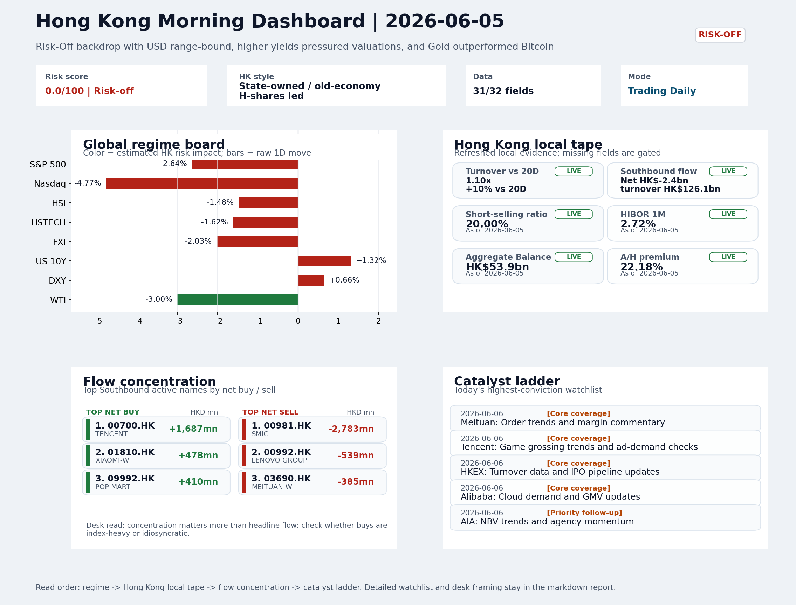
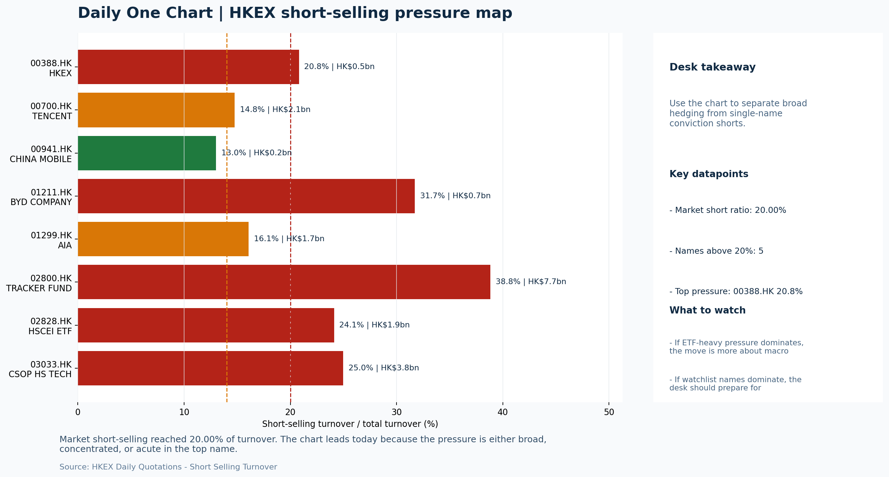

# Morning Research Workbench | 2026-06-06

> Designed for a Hong Kong sell-side commute: Layer 1 `Scan`, Layer 2 `Deep Read`, Layer 3 `Thinking`
> Mode: `Trading Daily` | Keep the report execution-oriented: what mattered in the completed session, what can move Hong Kong leadership, and what needs fast follow-up.
> Briefing date: `2026-06-06` | Review date: `2026-06-05` | Global request: `2026-06-05` | HK/China request: `2026-06-05` | Market effective date: `2026-06-05` | Generated at: `2026-06-06 08:17:06`

## Executive Summary

- **Market pulse:** The overnight hawkish CPI and Goldman Sachs HK downgrade deepen the Risk-Off regime, so the open hinges on defensive leadership holding and FXI/HSTECH confirming any bounce with cleaner.
- **Hong Kong lens:** Hong Kong growth / internet led. The Risk-Off setup argues for defensive leadership at the open; H-share state-owned names with low duration sensitivity are better positioned than HSTECH or platform names.
- **Top catalysts:** VIX +39.68%; INTC -6.33%.

## Visual Dashboard

## Layer 1 | Scan (5-10 min)

### 1.1 One-Line Market Pulse
The overnight hawkish CPI and Goldman Sachs HK downgrade deepen the Risk-Off regime, so the open hinges on defensive leadership holding and FXI/HSTECH confirming any bounce with cleaner breadth.

### 1.2 Global Asset Price Dashboard

| Asset | Last | 1D move | Read |
| --- | --- | --- | --- |
| S&P 500 | 7,383.74 | **-2.64%** | US large-cap risk appetite |
| Nasdaq 100 | 28,957.60 | **-4.77%** | Growth and duration leadership |
| Hang Seng Index | 25,253.40 | -1.48% | Hong Kong broad beta |
| Hang Seng TECH | 4.8700 | **-1.62%** | Hong Kong growth / platform read-through |
| CSI 300 | 4,904.75 | -0.69% | Mainland large-cap tone |
| US 10Y | 4.5360 | +1.32% | Global discount-rate anchor |
| China 10Y | 1.72% | +1.3bp | China local rates anchor \| Live public \| Eastmoney \| 2026-06-05 |
| CN-US 10Y spread | -282.9bp | -6.7bp | Relative carry and macro-pressure gauge \| Live public \| Eastmoney \| 2026-06-05 |
| DXY | 100.07 | +0.66% | Dollar liquidity impulse |
| USD/CNH | 6.7870 | +0.20% | Offshore China risk appetite |
| USD/HKD | 7.8343 | -0.02% | Linked-exchange regime stress check |
| Brent crude | 92.87 | **-2.27%** | Energy / geopolitics |
| COMEX gold | 4,353.90 | **-2.72%** | Hedge demand / real yields |
| Copper | 6.2755 | **-3.62%** | Global growth proxy |
| VIX | 21.51 | **+39.68%** | US stress barometer |

### 1.3 Hong Kong Key Data Quick Check

| Check | Value | Status | Source / as of | Why it matters |
| --- | --- | --- | --- | --- |
| Main Board turnover vs 20D | 1.10x \| +10% vs 20D | Live local | HKEX \| 2026-06-05 | Trailing 20-session average turnover was HK$312.8bn. |
| Southbound / Northbound net flow | Southbound Net HK$-2.4bn \| turnover HK$126.1bn \| Northbound Turnover HK$404.8bn \| net not reported | Live local | HKEX Connect \| 2026-06-05 | Southbound net buy is calculated from HKEX disclosed buy and sell turnover. |
| Short-selling ratio | 20.00% | Live local | HKEX \| 2026-06-05 | Official HKEX stock-level short-selling table, aggregated as a share of total market turnover. |
| AH premium index | 22.18% | Live public | Yahoo \| 2026-06-05 | Simple average across 19 A/H pairs; use dispersion rather than the average alone. |
| USD/HKD spot vs band | 7.8343 \| band 7.7500 to 7.8500 | Live quote + local | Yahoo \| 2026-06-05 | Inside the linked-exchange band without immediate boundary stress. Official Convertibility Undertakings define the linked-rate stress boundaries for USD/HKD. |
| HIBOR 1M | 2.72% | Live local | HKMA \| 2026-06-05 | 1M HIBOR is the cleanest quick read for Hong Kong funding conditions and equity-duration pressure. |
| Aggregate Balance | HK$53.9bn | Live local | HKMA \| 2026-06-05 | Aggregate Balance helps frame whether linked-rate liquidity conditions are tight or comfortable. |
| Hong Kong leadership | Hong Kong growth / internet led | Proxy | HSI / HSCEI / HSTECH relative perf \| 2026-06-05 | Use HSI / HSCEI / HSTECH relative moves as the opening style read. |

### 1.4 Risk Dashboard
**Composite risk score:** `0.0/100` | **Regime:** `Risk-off`

| Component | Score impact | Evidence |
| --- | --- | --- |
| US beta | -10 | S&P 500 -2.64% |
| HK growth | -8.1 | HSTECH -1.62% |
| Offshore China proxy | -8 | FXI -2.03% |
| Dollar pressure | -6.6 | DXY +0.66% |
| Volatility | -10 | VIX +39.68% |
| HK short-selling | -8 | Short-selling ratio 20.00% |

### 1.5 Morning Checklist
1. **VIX +39.68%**
 High-frequency data | Higher volatility argues for tighter sizing and tighter stops.
2. **INTC -6.33%**
 Mover attribution | Announcement / expectations | Guidance reset and margin pressure
3. **Risk-Off backdrop with USD range-bound, higher yields pressured valuations, and Gold outperformed Bitcoin**
 Overnight regime | Start by deciding whether the day is about Risk-Off conditions or a style pivot.
4. **CPI MoM (Released)**
 Macro / policy | Rates expectations, the dollar, and growth-equity valuation | Industries: Technology, Internet, Brokers
5. **Trade Balance (Released)**
 Macro / policy | Watch whether it changes the day's core market narrative | Industries: Market-wide

## Layer 2 | Deep Read (20-30 min)

### 2.1 Overnight Overseas Market Review
#### Market Setup
**Core tape.** Overnight markets experienced a sharp Risk-Off rotation driven by a hawkish CPI surprise that pushed Fed rate-cut expectations further out, with the Nasdaq 100 bearing the heaviest damage at -4.77% as higher yields repriced.
**Main driver.** Goldman Sachs downgrading HK stocks to market-weight from overweight added a layer of institutional positioning concern for H-share leaders.
**HK relevance.** VIX surged +39.68%, forcing systematic and discretionary managers to reduce exposure and tighten stops, while the Gold versus Bitcoin spread of 0.713% confirmed safe-haven demand replacing speculative risk appetite.

#### Key Drivers
- Hotter-than-expected CPI delays Fed easing, pushing US 10Y +1.32% and pressuring growth-valuation multiples directly on Nasdaq.
- Nasdaq 100 -4.77% was the largest single-day move and the dominant cross-asset driver.
- Goldman Sachs downgraded HK stocks to market-weight, shifting marginal institutional preference away from H-shares toward A-share AI.
- VIX +39.68% forces systematic and discretionary managers to reduce exposure and tighten stops, increasing short-term selling pressure.

#### Hong Kong Read-Through
**Desk lens.** State-owned / old-economy H-shares led.
**Opening implication.** The Risk-Off setup argues for defensive leadership at the open.
- **Cross-market read:** Hang Seng -1.48% / HSCEI -1.10% / HSTECH -1.62%.
- **Cross-market read:** Offshore China proxy FXI -2.03% and USD/CNH +0.20% frame cross-border risk appetite.
- **Cross-market read:** USD/HKD last traded around 7.8343, which keeps the Hong Kong funding lens in focus.

#### Watch Points
- USD composite moved lower by -0.01pct intraday, with a 0.546pct range.
- Main turning points appeared around 2026-06-05 08:10 peak / 2026-06-05 08:25 trough / 2026-06-05 08:40 peak, suggesting event-driven repricing.
- The biggest cross-asset divergence was Gold versus Bitcoin, a spread of 0.713pct.
- Gold moved -2.57pct intraday with a 3.614pct high-low range.

**Curated overnight stories**
1. **VIX +39.68%**
 Why it matters: Volatility has spiked sharply, reversing the prior session's calm. Elevated VIX typically forces systematic and discretionary managers to reduce exposure, tighten stops.
 HK read-through: High direct impact on HK market leadership. Growth-oriented names, high-beta tech, and leveraged products face forced selling. Index support levels become the focus.
2. **CPI MoM (Released) - higher-than-expected print**
 Why it matters: The hot inflation print delays Fed easing, sustaining higher-for-longer rates. This repricing extends duration pressure on growth-equity valuations and strengthens the USD.
 HK read-through: Directly pressures HK internet, growth, and technology names via higher discount rates. USD strength also weighs on offshore-China sentiment.
3. **Goldman Sachs cuts Hong Kong stocks to market-weight from overweight**
 Why it matters: A notable sell-side consensus shift. Goldman is moving offshore-China AI hardware plays (A-share overweight) above HK-listed names, signaling marginal institutional.
 HK read-through: Direct FX/positioning impact on HK Financials leaders. The downgrade reinforces Risk-Off positioning and may prompt other institutions to reassess HK allocation.
4. **Risk-Off backdrop: Gold outperformed Bitcoin, USD range-bound, higher yields pressured**
 Why it matters: This is the overnight regime narrative. Gold's outperformance confirms safe-haven demand; Bitcoin's underperformance signals liquidity withdrawal from risk assets.
 HK read-through: Sets the macro backdrop for the HK open. Defensive sectors (utilities, gold miners, staples) likely outperform.
5. **INTC -6.33% - guidance reset and margin pressure**
 Why it matters: Intel's guidance cut reflects continued execution challenges in AI hardware. The move signals ongoing competitive pressure across semiconductors and raises questions about.
 HK read-through: Indirect but notable for HK-listed semiconductor names and AI-adjacent plays via sentiment linkage. If US semis de-rate, risk-off positioning may extend to HK tech hardware.

### 2.2 Hong Kong / A-share Previous-Day Review
#### Local Tape Setup
**Local read.** The June 5 session confirmed a Risk-Off regime with Nasdaq's -4.77% as the dominant cross-market driver, transmitting growth-style pressure directly to Hong Kong tech names.
**Verification point.** Style leadership matters here: HSTECH underperformed HSCEI (-1.62% vs -1.10%), suggesting that higher US rates and elevated VIX are pressuring duration-sensitive growth names more than low-beta SOE proxies.
**Risk to watch.** The AH premium at 22.18% and the Goldman Sachs downgrade add a structural layer - marginal institutional preference is shifting toward A-share AI hardware rather than H-share platforms.

#### Style and Local Leadership
**Style leadership.** Hong Kong growth / internet led.
- **Cross-market read:** Hang Seng -1.48% / HSCEI -1.10% / HSTECH -1.62%.
- **Cross-market read:** Offshore China proxy FXI -2.03% and USD/CNH +0.20% frame cross-border risk appetite.
- **Cross-market read:** USD/HKD last traded around 7.8343, which keeps the Hong Kong funding lens in focus.

#### Flow Confirmation
Official Stock Connect evidence is available; use Section 2.3 to confirm whether local money supports the price action.

#### Follow-Through Checklist
**Follow-through check.** Watch whether FXI and HSTECH confirm the same style read as the overnight tape. A clean breadth test requires Southbound net flow to stabilize or turn positive, short-selling ratio to decline below 20%.

### 2.3 Flow Tracker and Attribution
#### Cross-Asset Attribution v1

| Driver | Direction | Score | Evidence | HK implication |
| --- | --- | --- | --- | --- |
| US growth-style transmission | drag | 6.68 | Nasdaq 100 moved -4.77%. | Hong Kong growth and platform names should be tested first at the open. |
| Short-selling pressure | drag | 3.5 | HKEX short-selling ratio was 20.00%. | Elevated short activity argues for extra confirmation before chasing rebounds. |
| Global equity beta | drag | 2.64 | S&P 500 moved -2.64%. | Broad beta matters if Hong Kong breadth confirms the overseas signal. |
| Oil and geopolitics | supportive | 1.82 | Oil moved -2.27%. | Split the read between energy/cyclicals support and margin/geopolitical pressure. |
| Rates impulse | drag | 1.58 | US 10Y yield proxy moved +1.32%. | Lower yields help long-duration growth; higher yields pressure valuation-sensitive |
| Dollar / CNH pressure | drag | 0.99 | DXY +0.66% / USD-CNH +0.20% | A stable or softer CNH makes Hong Kong follow-through more credible. |

#### Flow Tracker
##### Flow Takeaways
- Short-selling pressure is elevated, so local rebounds need cleaner breadth and flow confirmation.
- Stock Connect Southbound: net HK$-2.4bn on turnover HK$126.1bn (as of 2026-06-05).
- Stock Connect Northbound: turnover RMB404.8bn; public file provides total turnover/top active names, not full net-buy.
- AH premium: simple covered-pair average +22.18%; widest premium: China Communications Construction 72.51%.

##### Stock Connect Southbound Active Names

| Rank | Ticker | Name | Buy | Sell | Net buy |
| --- | --- | --- | --- | --- | --- |
| 1 | 00981.HK | SMIC | HK$4,498.3mn | HK$7,281.8mn | HK$-2,783.5mn |
| 2 | 00700.HK | TENCENT | HK$3,835.7mn | HK$2,149.0mn | HK$1,686.6mn |
| 8 | 00992.HK | LENOVO GROUP | HK$355.6mn | HK$894.9mn | HK$-539.3mn |
| 6 | 01810.HK | XIAOMI-W | HK$954.7mn | HK$476.7mn | HK$478.0mn |
| 10 | 09992.HK | POP MART | HK$693.5mn | HK$283.5mn | HK$410.0mn |

##### AH Premium Dispersion

| Name | A ticker | H ticker | Premium | As of |
| --- | --- | --- | --- | --- |
| China Communications Construction | 601800.SS | 1800.HK | +72.51% | 2026-06-05 |
| China Railway | 601390.SS | 0390.HK | +49.01% | 2026-06-05 |
| China Railway Construction | 601186.SS | 1186.HK | +46.23% | 2026-06-05 |
| China Life | 601628.SS | 2628.HK | +35.56% | 2026-06-05 |
| China Construction Bank | 601939.SS | 0939.HK | +35.54% | 2026-06-05 |

##### HKEX Short-Selling Watch

| Ticker | Name | Short ratio | Short turnover | Total turnover |
| --- | --- | --- | --- | --- |
| 00388.HK | HKEX | 20.81% | HK$0.5bn | HK$2.3bn |
| 00700.HK | TENCENT | 14.77% | HK$2.1bn | HK$14.5bn |
| 00941.HK | CHINA MOBILE | 13.00% | HK$0.2bn | HK$1.6bn |
| 01211.HK | BYD COMPANY | 31.71% | HK$0.7bn | HK$2.4bn |
| 01299.HK | AIA | 16.08% | HK$1.7bn | HK$10.9bn |

- **Short-value leaders:** 02800.HK TRACKER FUND (HK$7.7bn); 07709.HK XL2CSOPHYNIX (HK$7.3bn); 03033.HK CSOP HS TECH (HK$3.8bn); 07747.HK XL2CSOPSMSN (HK$2.5bn).

### 2.4 Macro and Policy Tracking
**Desk read.** The completed session registered a sharp Risk-Off shift, with VIX spiking 39.68% to 21.51 - a level that argues for tighter sizing and disciplined stop discipline.

**Market sensitivity.** The macro calendar for 2026-06-06 is high-impact: US CPI already released at 0.3% MoM (forecast 0.2%).

**HK implication.** China Trade Balance printed USD 85.2bn (forecast USD 79.0bn), a beat that may limit downside for risk assets but will not offset the inflation-driven rates shock.

**Macro watchpoints**
- DXY and US 2-year/10-year yields reaction to CPI print - further upside would intensify pressure on Tech and Internet valuations.
- HK equity proxy performance at open: whether defensive names stabilize or if the Risk-Off tone broadens.
- US Retail Sales actual vs 0.3% forecast - weakness could temporarily ease the inflation narrative but signals consumer stress.
- Jerome Powell tone at 22:00 - any hawkish shift on inflation or policy delay would amplify the Risk-Off regime.

| Time | Region | Event | Status | Desk read |
| --- | --- | --- | --- | --- |
| 20:30 | US | CPI MoM | Released | Impact: Rates expectations, the dollar, and growth-equity valuation \| Attention: 5/5 \| Industries: Technology, Internet, Brokers |
| 09:30 | China | Trade Balance | Released | Impact: Watch whether it changes the day's core market narrative \| Attention: 3/5 \| Industries: Market-wide |
| 20:30 | US | Retail Sales MoM | Upcoming | Impact: Consumer resilience, growth expectations, and risk-asset pricing \| Attention: 5/5 \| Industries: Consumer, E-commerce, Consumer discretionary |
| 09:20 | China | Loan Prime Rate | Upcoming | Impact: Watch whether it changes the day's core market narrative \| Attention: 3/5 \| Industries: Market-wide |
| 22:00 | Federal Reserve | Jerome Powell: Economic outlook remarks | Central bank | Impact: Policy path, liquidity conditions, and cross-asset risk appetite \| Attention: 5/5 \| Industries: Technology, Financials, Gold |
| 10:00 | PBOC | Open Market Operations Desk: Daily liquidity operation window | Central bank | Impact: Policy path, liquidity conditions, and cross-asset risk appetite \| Attention: 3/5 \| Industries: Technology, Financials, Gold |

#### Positioning and Risk Backdrop
- Options activity centered on KWEB Call, with Vol/OI at 1.88x and a bullish bias.
- Put/Call structure shows equity 0.68 / index 1.15, implying Single-stock optimism with index hedging.
- Geopolitics: Middle East | Regional tension remains elevated | Impact: Oil, freight costs, and safe-haven demand
- Geopolitics: US-China | Technology export-control rhetoric remains active | Impact: China internet, semiconductors, and supply chains

### 2.5 Key Company and Sector Events

| Grade | Sector | Headline | Why it matters | Horizon |
| --- | --- | --- | --- | --- |
| B | China Internet | China poaches more AI talent from the U.S. | Assess whether the story can propagate through the China Internet value | Monitor |

#### Company Event Takeaway
**Desk read.** Risk-off positioning dominated the session, with Gold outperforming Bitcoin and higher yields pressuring valuations broadly.
**Why it matters.** The Morgan Stanley upgrade on Alibaba (9988.HK) from Equal Weight to Overweight, with target raised from 92 to 105, is the most actionable near-term catalyst for Hong Kong internet peers.
**Follow-up.** Tencent (0700.HK) reports after market close with est.

#### LLM Quick Takes
- **9988.HK** | Morgan Stanley upgrade to Overweight with target 92→105 is a constructive signal for China Internet sector sentiment and could anchor near-term valuation expectations
- **0700.HK** | Reports after close; est. EPS 4.15 HKD, revenue 163.2bn HKD. Trading near bottom of range (22.2%) - a beat could catalyze a reversal for China Internet leadership.
- **0388.HK** | Reports before open; est. EPS 2.81 HKD, revenue 6.0bn HKD. Results set the tone for Hong Kong financial sector sentiment and passive flow dynamics.
- **3690.HK** | Recent results showed narrower-than-expected loss with faster revenue growth; third consecutive quarter of net losses reflects ongoing food-delivery price war.
- **1299.HK** | Down -3.52% and sitting at bottom of range (0.0%). Short-term pressure is visible; no recent news available to attribute the move.
- **1211.HK** | Down -2.29% and at bottom of range (0.0%). No recent news; confirm whether move is sector-wide or stock-specific ahead of weekly sales data.

#### HKEX Announcements

| Grade | Ticker | Type | Release time | Title |
| --- | --- | --- | --- | --- |
| A | 00084.HK | Profit warning | 2026-06-05 | Profit warning / alert announcement |
| A | 00922.HK | Profit warning | 2026-06-05 | Profit warning / alert announcement |
| A | 01226.HK | Profit warning | 2026-06-05 | Profit warning / alert announcement |
| A | 01547.HK | Profit warning | 2026-06-05 | Profit warning / alert announcement |
| A | 01955.HK | Profit warning | 2026-06-05 | Profit warning / alert announcement |
| A | 00296.HK | Profit warning | 2026-06-04 | Profit warning / alert announcement |
| A | 00595.HK | Profit warning | 2026-06-04 | Profit warning / alert announcement |
| A | 00923.HK | Profit warning | 2026-06-04 | Profit warning / alert announcement |

#### Earnings / Results Watch

| Ticker | Company | Timing | Expectation framing |
| --- | --- | --- | --- |
| 0700.HK | Tencent Holdings | After Market Close | EPS est. 4.15 HKD \| revenue est. 163.2bn HKD |
| 0388.HK | Hong Kong Exchanges and Clearing | Before Market Open | EPS est. 2.81 HKD \| revenue est. 6.0bn HKD |

#### Rating Changes
- **9988.HK** | Morgan Stanley | Upgrade | Equal Weight -> Overweight | PT 92 -> 105

#### IPO Watch
- IPO and grey-market monitoring is not yet part of the standard production pack.

### 2.6 Today's Core Names
#### Core coverage

| Name | Ticker | Last | 1D | Range position | Morning note |
| --- | --- | --- | --- | --- | --- |
| Meituan | 3690.HK | 79.95 | +1.72% | Mid-range | Positioning is neutral for now, so use it mainly to monitor marginal information changes. |
| Tencent | 0700.HK | 453.20 | -1.26% | Bottom of range | The name sits near the bottom of its recent range and is worth monitoring for a catalyst-led reversal. |

**Recent headlines for Meituan:**
- [Meituan Logs Another Loss Amid Food-Delivery Price War](https://www.wsj.com/business/earnings/meituan-logs-another-loss-amid-food-delivery-price-war-fef4c703?siteid=yhoof2&yptr=yahoo) (The Wall Street Journal)
**Recent headlines for Tencent:**
- [DeepSeek Eyes $7.4 Billion Funding Round At Up To $59 Billion Valuation As Tencent, CATL Back China's AI Champion: Report](https://finance.yahoo.com/sectors/technology/articles/deepseek-eyes-7-4-billion-123039218.html) (Benzinga)

#### Priority follow-up

| Name | Ticker | Last | 1D | Range position | Morning note |
| --- | --- | --- | --- | --- | --- |
| AIA | 1299.HK | 74.00 | -3.52% | Bottom of range | Short-term pressure is visible; check for a fundamental or regulatory reason. |
| BYD Company | 1211.HK | 89.70 | -2.29% | Bottom of range | Short-term pressure is visible; check for a fundamental or regulatory reason. |

## Layer 3 | Thinking (10-15 min)

### 3.1 Rotating Theme Deep Dive

| Field | Read |
| --- | --- |
| Theme | AI and Compute Chain |
| Angle for the day | Track whether global AI capex, semis, cloud, and server demand are still carrying offshore China internet and hardware sentiment. |

**Theme desk read**
**Core thesis.** The AI and Compute Chain theme faces a critical test as conflicting signals emerge alongside a risk-off macro backdrop.
**Evidence.** On one hand, the CNBC report of China poaching US AI talent (Tencent's chief AI scientist from OpenAI) potentially bolsters the domestic AI narrative and could propagate through internet names like Tencent.
**What to test.** On the other hand, Goldman Sachs' downgrade of H-shares in favor of mainland AI hardware suggests a rotational headwind for offshore China internet stocks.

**Signals to keep in mind**
- China poaches more AI talent from the U.S. as it eyes the next 'super-app': Assess whether the story can propagate through the China
- Goldman Sachs cuts Hong Kong stocks in favor of mainland China AI hardware plays: This signals a marginal shift in sell-side consensus
- VIX +39.68%: Higher volatility argues for tighter sizing and tighter stops.
- Copper -3.62%: Weak copper argues for more caution on cyclical growth.

**LLM watch items:**
- Tencent game grossing trends and ad-demand checks - any AI-driven ad uplift or cloud monetization hints
- Alibaba Cloud demand signals and GMV updates - read on AI infrastructure adoption and consumption resilience
- Follow-up on Goldman Sachs downgrade: any further broker notes or client flow shifts from H-share internet to A-share hardware
- VIX level post-CPI - sustained above 20 would keep pressure on growth positioning
- US Retail Sales (forecast 0.3% MoM) and 10Y yield reaction - strong print could reinforce risk-off and hit Alibaba/Tencent

**Related names to keep close:**

| Name | Ticker | Bucket | Morning read |
| --- | --- | --- | --- |
| Meituan | 3690.HK | Core coverage | Positioning is neutral for now, so use it mainly to monitor marginal information changes. |
| Tencent | 0700.HK | Core coverage | The name sits near the bottom of its recent range and is worth monitoring for a catalyst-led reversal. |
| HKEX | 0388.HK | Core coverage | Positioning is neutral for now, so use it mainly to monitor marginal information changes. |
| Alibaba | 9988.HK | Core coverage | The name sits near the bottom of its recent range and is worth monitoring for a catalyst-led reversal. |

**Upcoming catalysts tied to the theme:**
- 2026-06-06 | Tencent: Game grossing trends and ad-demand checks | Core offshore China platform proxy for gaming, ads, and AI monetization
- 2026-06-06 | Alibaba: Cloud demand and GMV updates | Key read-through for China consumption, cloud, and platform regulation
- 2026-06-06 | AIA: NBV trends and agency momentum | Read-through for wealth demand, mainland visitor activity, and HK financial sentiment
- 2026-06-06 | Hang Seng TECH ETF: AI narrative shifts and China platform regulation headlines | Fast proxy for Hong Kong internet and growth leadership

**Relevant headlines:**
- [China poaches more AI talent from the U.S. as it eyes the next 'super-app'](https://www.cnbc.com/2026/06/05/china-may-move-toward-us-path-on-ai-as-firms-poach-employees.html)
- [Goldman Sachs cuts Hong Kong stocks in favor of mainland China AI hardware plays](https://www.cnbc.com/2026/06/03/goldman-sachs-cuts-hong-kong-stocks-to-ne.html)

### 3.2 Today Ahead and Trading Calendar
- Macro: CPI MoM is the first item to anchor the open and the rates/FX response.
- Corporate / event: Meituan: Order trends and margin commentary is the cleanest same-day catalyst to prepare for.

**Same-day macro docket**

| Time | Country | Event | Status | Detail |
| --- | --- | --- | --- | --- |
| 20:30 | US | CPI MoM | Released | Actual 0.3% / Forecast 0.2% / Prior 0.4% |
| 09:30 | China | Trade Balance | Released | Actual USD 85.2bn / Forecast USD 79.0bn / Prior USD 80.6bn |
| 20:30 | US | Retail Sales MoM | Upcoming | Forecast 0.3% / Prior 0.6% |
| 09:20 | China | Loan Prime Rate | Upcoming | Forecast 3.45% / Prior 3.45% |
| 22:00 | Federal Reserve | Jerome Powell: Economic outlook remarks | Central bank | speech |

**Same-day catalyst list**

| Date | Time | Category | Event | Importance |
| --- | --- | --- | --- | --- |
| 2026-06-06 | | Core coverage | Meituan: Order trends and margin commentary | 3 |
| 2026-06-06 | | Core coverage | Tencent: Game grossing trends and ad-demand checks | 3 |
| 2026-06-06 | | Core coverage | HKEX: Turnover data and IPO pipeline updates | 3 |
| 2026-06-06 | | Core coverage | Alibaba: Cloud demand and GMV updates | 3 |

**Next few sessions**

| Date | Category | Event | Impact |
| --- | --- | --- | --- |
| 2026-06-06 | Core coverage | Meituan: Order trends and margin commentary | High-frequency read on local services demand and platform competition |
| 2026-06-06 | Core coverage | Tencent: Game grossing trends and ad-demand checks | Core offshore China platform proxy for gaming, ads, and AI monetization |
| 2026-06-06 | Core coverage | HKEX: Turnover data and IPO pipeline updates | Direct proxy for Hong Kong market turnover, listings, and southbound |
| 2026-06-06 | Core coverage | Alibaba: Cloud demand and GMV updates | Key read-through for China consumption, cloud, and platform regulation |

### 3.3 Daily One Chart
**Daily One Chart | HKEX short-selling pressure map**

**Chart read.** Market short-selling reached 20.00% of turnover.
**Why it matters.** The chart leads today because the pressure is either broad, concentrated, or acute in the top name.

_Source: HKEX Daily Quotations - Short Selling Turnover_

## Traceable Appendix

### Report Metadata
> Date policy: Review date 2026-06-05 is treated as `Trading Daily`. | Global request date is 2026-06-05; adapter effective date is 2026-06-05 and summary date is 2026-06-05. | HK/China local data date is 2026-06-05; role: same-session local cash tape.
> Market data quality: Coverage: `31/32` | Missing: `1`
> Report quality: `88.3/100` | Grade `B` | Status `production ready`

### Key Questions to Keep in Mind
- Is risk appetite rising or fading? The overnight tape reads closer to `Risk-Off`.
- Did rates expectations move? Focus on whether US 10Y, DXY, and growth style moved together.
- Were commodities the real story? Watch WTI and gold for geopolitics versus inflation signals.
- Is Hong Kong setup internet-led, SOE-led, or broad beta-led? Compare HSTECH, HSCEI, and HSI.
- Did offshore markets move China risk appetite? Focus on HSI, FXI, USD/CNH, and USD/HKD.

### Report Quality and Validation
- **Quality score:** 88.3/100 | **Grade:** B | **Status:** production ready
- **Run summary:** 8 healthy | 0 caveat | 0 failed
- **Release recommendation:** Send | All monitored sources were healthy, so the report is fit for normal distribution.

| Source | Status | Bucket |
| --- | --- | --- |
| Market data | ok | healthy |
| Sector and company news | ok | healthy |
| Movers and short selling | ok | healthy |
| Stock Connect | ok | healthy |
| A/H premium | ok | healthy |
| Hong Kong local package | ok | healthy |
| China rates | ok | healthy |
| Narrative overlay | ok | healthy |

**Desk-use guidance summary:** 0 blocking | 1 advisory

**Desk-use guidance**
- **Advisory:** All monitored sources were healthy for this run; the report can be used as a normal desk-starting point.

| Component | Score | Weight | Read |
| --- | --- | --- | --- |
| Market data coverage | 96.9 | 0.3 | 31/32 core market fields available. |
| Hong Kong local metrics | 82.3 | 0.25 | 8 live, 3 proxy, 0 unavailable local checks. |
| Key public adapters | 100.0 | 0.2 | 4/4 key adapters were available or partially available. |
| Narrative overlay health | 57.1 | 0.15 | 2/7 narrative overlay tasks succeeded or used validated cache; 0 error(s). |
| Fact-check guardrail | 100.0 | 0.1 | Checked 2 numeric claims; 0 numeric mismatch(es), 0 logic warning(s); 0 critical, 0 review. |

**Quality warnings**
- Narrative overlay health is weak: 2/7 narrative overlay tasks succeeded or used validated cache; 0 error(s).

**Narrative fact-check guardrail**
- Checked 2 numeric claims; 0 numeric mismatch(es), 0 logic warning(s); 0 critical, 0 review.

**Adapter status**

| Adapter | Status |
| --- | --- |
| Stock Connect | ok |
| A/H premium | ok |
| HKEX announcements | ok |
| China rates | ok |

### Source Links
- [China poaches more AI talent from the U.S. as it eyes the next 'super-app'](https://www.cnbc.com/2026/06/05/china-may-move-toward-us-path-on-ai-as-firms-poach-employees.html) (cnbc_markets)
- [Meituan Logs Another Loss Amid Food-Delivery Price War](https://www.wsj.com/business/earnings/meituan-logs-another-loss-amid-food-delivery-price-war-fef4c703?siteid=yhoof2&yptr=yahoo) (The Wall Street Journal)
- [DeepSeek Eyes $7.4 Billion Funding Round At Up To $59 Billion Valuation As Tencent, CATL Back China's AI Champion: Report](https://finance.yahoo.com/sectors/technology/articles/deepseek-eyes-7-4-billion-123039218.html) (Benzinga)
- [00084.HK Profit warning / alert announcement](http://www1.hkexnews.hk/listedco/listconews/sehk/2026/0605/2026060500331.pdf) (HKEXnews)
- [00922.HK Profit warning / alert announcement](http://www1.hkexnews.hk/listedco/listconews/sehk/2026/0605/2026060501988.pdf) (HKEXnews)
- [01226.HK Profit warning / alert announcement](http://www1.hkexnews.hk/listedco/listconews/sehk/2026/0605/2026060500471.pdf) (HKEXnews)
- [01547.HK Profit warning / alert announcement](http://www1.hkexnews.hk/listedco/listconews/sehk/2026/0605/2026060502428.pdf) (HKEXnews)
- [01955.HK Profit warning / alert announcement](http://www1.hkexnews.hk/listedco/listconews/sehk/2026/0605/2026060501582.pdf) (HKEXnews)
- [00296.HK Profit warning / alert announcement](http://www1.hkexnews.hk/listedco/listconews/sehk/2026/0604/2026060402697.pdf) (HKEXnews)
- [00595.HK Profit warning / alert announcement](http://www1.hkexnews.hk/listedco/listconews/sehk/2026/0604/2026060402575.pdf) (HKEXnews)
- [00923.HK Profit warning / alert announcement](http://www1.hkexnews.hk/listedco/listconews/sehk/2026/0604/2026060401479.pdf) (HKEXnews)

## Supplementary Visual Appendix

This appendix is professional-path only. It keeps a traceable index of the report visuals and the deterministic chart cues used to frame the morning note, without injecting the legacy intraday chart pack.

### Visual Index

| Visual | Path | Role |
| --- | --- | --- |
| Visual Dashboard | `charts/dashboard_2026-06-06.png` | Cross-asset regime board and Hong Kong local tape snapshot. |
| Daily One Chart | `charts/daily_one_chart_2026-06-06.png` | Single highest-conviction visual story for the day. |

### Deterministic Chart Cues
- FX / liquidity: USD composite moved lower by -0.01pct intraday, with a 0.546pct range.
- FX / liquidity: Main turning points appeared around 2026-06-05 08:10 peak / 2026-06-05 08:25 trough / 2026-06-05 08:40 peak, suggesting event-driven repricing rather than a clean one-way USD move.
- Cross-asset: The biggest cross-asset divergence was Gold versus Bitcoin, a spread of 0.713pct.
- Cross-asset: Gold moved -2.57pct intraday with a 3.614pct high-low range.
- Cross-asset: Oil moved -3.01pct intraday with a 3.847pct high-low range.
- Cross-asset: Bitcoin moved -3.28pct intraday with a 7.327pct high-low range.

### Risk Dashboard Components

| Component | Score impact | Evidence |
| --- | --- | --- |
| US beta | -10 | S&P 500 -2.64% |
| HK growth | -8.1 | HSTECH -1.62% |
| Offshore China proxy | -8 | FXI -2.03% |
| Dollar pressure | -6.6 | DXY +0.66% |
| Volatility | -10 | VIX +39.68% |
| HK short-selling | -8 | Short-selling ratio 20.00% |
