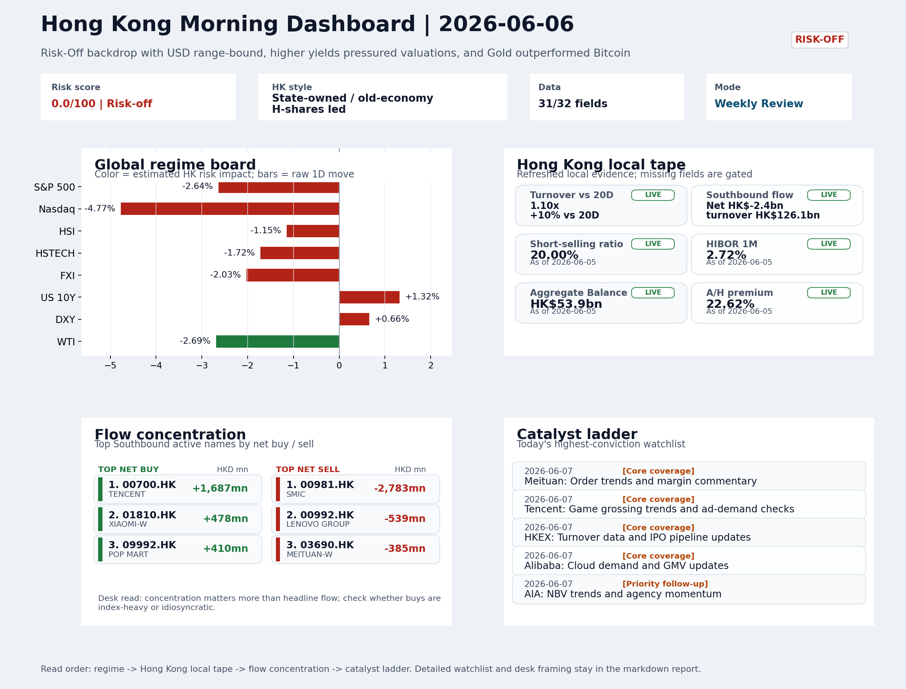
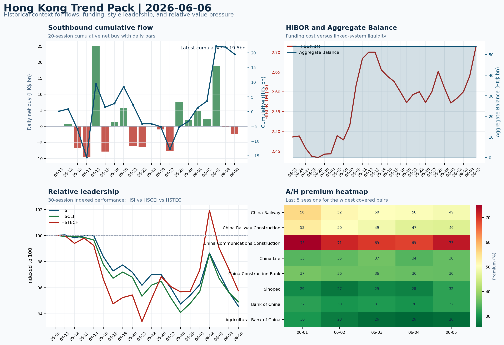

# Morning Research Workbench | 2026-06-07

> Designed for a Hong Kong sell-side commute: Layer 1 `Scan`, Layer 2 `Deep Read`, Layer 3 `Thinking`
> Mode: `Weekly Review` | Use Saturday's non-trading review date to synthesize the completed Hong Kong week and prepare next week's work plan.
> Briefing date: `2026-06-07` | Review date: `2026-06-06` | Global request: `2026-06-06` | HK/China request: `2026-06-05` | Market effective date: `2026-06-05` | Generated at: `2026-06-07 08:14:14`

## Executive Summary

- **Market pulse:** Hong Kong's week closed with a clear Risk-Off tone - VIX spiked +39.68% to 21.51, Nasdaq fell -4.77% versus S&P -2.64%, short-selling held at 20% of turnover, and the HSCEI outperformed.
- **Hong Kong lens:** State-owned / old-economy H-shares led. Monday's open inherits elevated VIX and a rates overhang; a constructive read requires HSTECH and FXI to confirm the move rather than only HSCEI/SOE leadership holding.
- **Top catalysts:** VIX +39.68%; Risk-Off backdrop with USD range-bound, higher yields pressured valuations, and Gold outperformed Bitcoin.

## Visual Dashboard

## Layer 1 | Weekly Scan (5-10 min)

### 1.1 One-Line Market Pulse
Hong Kong's week closed with a clear Risk-Off tone - VIX spiked +39.68% to 21.51, Nasdaq fell -4.77% versus S&P -2.64%, short-selling held at 20% of turnover, and the HSCEI outperformed HSTECH by nearly one percentage point, confirming a defensive rotation that makes next week's open a confirmation test rather than a reflexive buy-the-dip call.

### 1.2 Global Asset Price Dashboard

| Asset | Last | 1D move | Read |
| --- | --- | --- | --- |
| S&P 500 | 7,383.74 | **-2.64%** | US large-cap risk appetite |
| Nasdaq 100 | 28,957.60 | **-4.77%** | Growth and duration leadership |
| Hang Seng Index | 24,961.95 | -1.15% | Hong Kong broad beta |
| Hang Seng TECH | 4.7860 | **-1.72%** | Hong Kong growth / platform read-through |
| CSI 300 | 4,816.92 | **-1.79%** | Mainland large-cap tone |
| US 10Y | 4.5360 | +1.32% | Global discount-rate anchor |
| China 10Y | 1.72% | +1.3bp | China local rates anchor \| Live public \| Eastmoney \| 2026-06-05 |
| CN-US 10Y spread | -282.9bp | -6.7bp | Relative carry and macro-pressure gauge \| Live public \| Eastmoney \| 2026-06-05 |
| DXY | 100.07 | +0.66% | Dollar liquidity impulse |
| USD/CNH | 6.7890 | +0.23% | Offshore China risk appetite |
| USD/HKD | 7.8343 | -0.02% | Linked-exchange regime stress check |
| Brent crude | 93.09 | **-2.04%** | Energy / geopolitics |
| COMEX gold | 4,337.10 | **-3.10%** | Hedge demand / real yields |
| Copper | 6.2635 | **-3.80%** | Global growth proxy |
| VIX | 21.51 | **+39.68%** | US stress barometer |

### 1.3 Hong Kong Weekly Tape Quick Check

| Check | Value | Status | Source / as of | Why it matters |
| --- | --- | --- | --- | --- |
| Main Board turnover vs 20D | 1.10x \| +10% vs 20D | Live local | HKEX \| 2026-06-05 | Trailing 20-session average turnover was HK$312.8bn. |
| Southbound / Northbound net flow | Southbound Net HK$-2.4bn \| turnover HK$126.1bn \| Northbound Turnover HK$404.8bn \| net not reported | Live local | HKEX Connect \| 2026-06-05 | Southbound net buy is calculated from HKEX disclosed buy and sell turnover. |
| Short-selling ratio | 20.00% | Live local | HKEX \| 2026-06-05 | Official HKEX stock-level short-selling table, aggregated as a share of total market turnover. |
| AH premium index | 22.62% | Live public | Yahoo \| 2026-06-05 | Simple average across 19 A/H pairs; use dispersion rather than the average alone. |
| USD/HKD spot vs band | 7.8343 \| band 7.7500 to 7.8500 | Live quote + local | Yahoo \| 2026-06-05 | Inside the linked-exchange band without immediate boundary stress. Official Convertibility Undertakings define the linked-rate stress boundaries for USD/HKD. |
| HIBOR 1M | 2.72% | Live local | HKMA \| 2026-06-05 | 1M HIBOR is the cleanest quick read for Hong Kong funding conditions and equity-duration pressure. |
| Aggregate Balance | HK$53.9bn | Live local | HKMA \| 2026-06-05 | Aggregate Balance helps frame whether linked-rate liquidity conditions are tight or comfortable. |
| Hong Kong leadership | State-owned / old-economy H-shares led | Proxy | HSI / HSCEI / HSTECH relative perf \| 2026-06-05 | Use HSI / HSCEI / HSTECH relative moves as the opening style read. |

### 1.4 Risk Dashboard
**Composite risk score:** `0.0/100` | **Regime:** `Risk-off`

| Component | Score impact | Evidence |
| --- | --- | --- |
| US beta | -10 | S&P 500 -2.64% |
| HK growth | -8.6 | HSTECH -1.72% |
| Offshore China proxy | -8 | FXI -2.03% |
| Dollar pressure | -6.6 | DXY +0.66% |
| Volatility | -10 | VIX +39.68% |
| HK short-selling | -8 | Short-selling ratio 20.00% |

### 1.5 Next Week Checklist
1. **VIX +39.68%**
 High-frequency data | Higher volatility argues for tighter sizing and tighter stops.
2. **Risk-Off backdrop with USD range-bound, higher yields pressured valuations, and Gold outperformed Bitcoin**
 Still-moving markets | No fresh Hong Kong cash session is assumed; use global active assets and policy/event flow to prepare the next open.
3. **CPI MoM (Released)**
 Macro / policy | Rates expectations, the dollar, and growth-equity valuation | Industries: Technology, Internet, Brokers
4. **Trade Balance (Released)**
 Macro / policy | Watch whether it changes the day's core market narrative | Industries: Market-wide
5. **Retail Sales MoM (Upcoming)**
 Macro / policy | Consumer resilience, growth expectations, and risk-asset pricing | Industries: Consumer, E-commerce, Consumer discretionary

## Layer 2 | Deep Read (20-30 min)

### 2.1 Weekly Cross-Asset Review
> Weekly review mode: synthesize the completed Hong Kong week, retain the main cross-asset and policy lessons, and convert them into next-week preparation rather than treating Saturday as a fresh cash-market session.

#### Market Setup
**Core tape.** Overnight overseas markets ended the week on a Risk-Off note, with a hot US jobs report reinforcing the higher-for-longer rate narrative and pushing Fed-cut expectations further out.
**Main driver.** The S&P 500 fell -2.64% and the Nasdaq 100 dropped -4.77%, a -1.7pp gap that points to growth-style repricing rather than broad beta collapse.
**HK relevance.** VIX spiked +39.68% to 21.51, marking the dominant risk-management signal heading into the weekend.

#### Key Drivers
- Hot US payrolls reinforced higher-for-longer Fed rates, extending the rates impulse that pressured Nasdaq and growth-style names.
- Nasdaq -4.77% vs S&P -2.64% signals a valuation-repricing episode in duration-sensitive tech rather than broad systemic risk.
- VIX +39.68% to 21.51 sets a higher baseline for implied volatility premia and raises cost of carry for leveraged HK positions.
- USD/CNH +0.23% keeps offshore China sentiment under marginal pressure without a clean one-way dollar break.

#### Hong Kong Read-Through
**Desk lens.** State-owned / old-economy H-shares led.
**Opening implication.** Monday's open inherits elevated VIX and a rates overhang.
- **Cross-market read:** Hang Seng -1.15% / HSCEI -0.77% / HSTECH -1.72%.
- **Cross-market read:** Offshore China proxy FXI -2.03% and USD/CNH +0.23% frame cross-border risk appetite.
- **Cross-market read:** USD/HKD last traded around 7.8343, which keeps the Hong Kong funding lens in focus.

#### Watch Points
- USD composite moved lower by -0.01pct intraday, with a 0.546pct range.
- Main turning points appeared around 2026-06-05 08:10 peak / 2026-06-05 08:25 trough / 2026-06-05 08:40 peak, suggesting event-driven repricing.
- The biggest cross-asset divergence was Gold versus Bitcoin, a spread of 1.831pct.
- Gold moved -2.31pct intraday with a 3.614pct high-low range.

#### Weekly Review Map
- Weekly review window: 2026-06-01 to 2026-06-05. Core regime: Risk-Off backdrop with USD range-bound, higher yields pressured valuations, and Gold outperformed Bitcoin. Hong Kong leadership: State-owned / old-economy H-shares led.
- Method note: Trend summary uses the latest available five observations from the Hong Kong Trend Pack inputs.

**Cross-asset weekly dashboard**

| Asset | Latest move | Weekly read |
| --- | --- | --- |
| S&P 500 | -2.64% | Risk appetite |
| Nasdaq 100 | -4.77% | Growth style |
| Hang Seng Index | -1.15% | Hong Kong beta |
| Hang Seng TECH | -1.72% | Hong Kong growth / internet tone |
| DXY | +0.66% | Global liquidity |
| US 10Y | +1.32% | Rates path |
| Gold | -3.10% | Hedge / real yields |
| VIX | +39.68% | Volatility and hedging |

**Hong Kong / China weekly tape**

| Signal | Latest move | Read |
| --- | --- | --- |
| Hang Seng Index | -1.15% | Hong Kong beta |
| HSCEI | -0.77% | China SOE / H-share tone |
| Hang Seng TECH | -1.72% | Hong Kong growth / internet tone |
| China proxy (FXI) | -2.03% | China sentiment |
| USD/CNH | +0.23% | China FX sentiment |
| USD/HKD | -0.02% | Hong Kong funding lens |

**Five-session trend evidence**
_Window: 2026-06-01 to 2026-06-05_

| Signal | Five-session change | Latest | Desk read |
| --- | --- | --- | --- |
| Southbound flow | +22.8bn over 5 sessions | -2.4bn | 3/5 positive sessions; cumulative buying is the flow-confirmation test for next week. |
| HKD funding | HIBOR +14bp; Aggregate Balance -0.0bn | 2.72% / HK$53.9bn | Funding stress matters if HIBOR rises while Aggregate Balance contracts. |
| HK style leadership | HSCEI led (-0.8pp); HSI lagged (-1.7pp) | HSCEI leadership | Use HSI / HSCEI / HSTECH spread to separate broad beta from growth-led rerating. |
| A/H premium dispersion | -2.3pp average change | 41.1% average premium | Premium narrowing can support H-share relative demand |

**Flow and attribution clues**
- :
- :
- :

**Next-week desk questions**
- Did Southbound flow confirm the index move, or was the week mainly offshore beta without local money follow-through?
- Did HIBOR and Aggregate Balance point to benign funding, or should tighter HKD liquidity be part of next week's risk case?
- Was leadership broad enough beyond HSTECH / platform beta, or was the week concentrated in a narrow style pocket?
- Which dated macro, policy, earnings, or IPO catalyst can realistically change the next-week narrative?
- What single data point would invalidate the base-case market pulse by Monday or Tuesday morning?

**Key developments to retain**

| Bucket | Item | Why it matters |
| --- | --- | --- |
| B | China poaches more AI talent from the U.S. | Assess whether the story can propagate through the China Internet value chain |
| Released | CPI MoM | Rates expectations, the dollar, and growth-equity valuation |
| Released | Trade Balance | Watch whether it changes the day's core market narrative |
| Upcoming | Retail Sales MoM | Consumer resilience, growth expectations, and risk-asset pricing |

**Next-week playbook**

| Date | Catalyst | Desk read |
| --- | --- | --- |
| 2026-06-07 | Meituan: Order trends and margin commentary | High-frequency read on local services demand and platform competition |
| 2026-06-07 | Tencent: Game grossing trends and ad-demand checks | Core offshore China platform proxy for gaming, ads, and AI monetization |
| 2026-06-07 | HKEX: Turnover data and IPO pipeline updates | Direct proxy for Hong Kong market turnover, listings, and southbound interest |
| 2026-06-07 | Alibaba: Cloud demand and GMV updates | Key read-through for China consumption, cloud, and platform regulation |
| 2026-06-07 | AIA: NBV trends and agency momentum | Read-through for wealth demand, mainland visitor activity, and HK financial sentiment |
| 2026-06-07 | BYD Company: Weekly sales data and model rollout cadence | Hong Kong-listed proxy for EV volumes, export mix, and price competition |
| 2026-06-07 | China Mobile: Capex updates and dividend policy signals | Defensive SOE benchmark for yield trade and domestic digital-infrastructure spend |
| 2026-06-07 | Hang Seng TECH ETF: AI narrative shifts and China platform | Fast proxy for Hong Kong internet and growth leadership |

**Curated overnight stories**
1. **VIX surges +39.68%, signalling elevated volatility regime**
 Why it matters: A sharp VIX spike is the dominant risk-management signal heading into the weekend. It directly informs stop-loss discipline, position sizing, and options-hedging activity.
 HK read-through: Broad HK/China market impact. Elevated volatility historically compresses HSI implied volatility premia and raises cost of carry for leveraged positions.
2. **US jobs report comes in hot, pushing Fed rate cuts further out of reach**
 Why it matters: A stronger-than-expected payrolls reading reinforces higher-for-longer US rates under Chair Warsh.
 HK read-through: High relevance for Hong Kong. Higher US rates tighten financial conditions globally, weighing on HK/China growth-sensitive names (internet, tech, consumer discretionary).
3. **CPI MoM released alongside Trade Balance - rates narrative confirmed**
 Why it matters: The CPI release (released Friday) alongside Trade Balance data provides a cross-check on the inflation-and-growth mix.
 HK read-through: Confirms macro backdrop for HK market participants. Technology and internet sectors, which trade heavily on discount-rate assumptions and offshore funding costs, are most.
4. **Risk-Off backdrop: Gold outperforms Bitcoin through the week**
 Why it matters: Gold's outperformance over Bitcoin throughout the week is a structural Risk-Off signal. It reflects de-risking of speculative digital assets and flight to traditional safe.
 HK read-through: Relevant for Hong Kong commodity and precious-metals plays (e.g., Zijin Mining, Shandong Gold listings).
5. **China poaches more AI talent from the U.S.; Tencent's Chief AI Scientist targets AGI**
 Why it matters: One of two China-originating stories in the overnight tape. Tencent poaching from OpenAI signals continued investment intent in frontier AI within large-cap China internet.
 HK read-through: Map first into China Internet leaders (Tencent, Alibaba, Baidu) and close AI-adjacent peers. Under current risk backdrop the story is more signal for sector monitoring than.

### 2.2 Hong Kong / A-share Weekly Review
> Weekly review mode: synthesize the completed Hong Kong week, retain the main cross-asset and policy lessons, and convert them into next-week preparation rather than treating Saturday as a fresh cash-market session.

#### Local Tape Setup
**Local read.** Hong Kong's week ended with clear style rotation: the HSCEI lost only 0.77%, outperforming HSTECH (-1.72%) by nearly one percentage point, consistent with the week's defensive, old-economy leadership.
**Verification point.** Southbound flow delivered cumulative buying of HK$22.8bn over five sessions but turned net-sell on Friday.
**Risk to watch.** Overseas, a hot US jobs report and a 4.77% Nasdaq drop reinforced a rates-driven growth repricing; when markets reopen on 8 June, the test is whether Hong Kong growth names break the week's defensive pattern.

#### Style and Local Leadership
**Style leadership.** State-owned / old-economy H-shares led.
- **Cross-market read:** Hang Seng -1.15% / HSCEI -0.77% / HSTECH -1.72%.
- **Cross-market read:** Offshore China proxy FXI -2.03% and USD/CNH +0.23% frame cross-border risk appetite.
- **Cross-market read:** USD/HKD last traded around 7.8343, which keeps the Hong Kong funding lens in focus.

#### Flow Confirmation
Official Stock Connect evidence is available; use Section 2.3 to confirm whether local money supports the price action.

#### Follow-Through Checklist
**Follow-through check.** Watch whether Southbound resumes net buying, the short-selling ratio falls below 18%, and key growth names (Tencent, Meituan) begin closing the gap with HSCEI on Monday. If HSTECH lags again while HIBOR stays above 2.7%, the defensive rotation likely extends.

### 2.3 Flow Tracker and Attribution
#### Cross-Asset Attribution v1

| Driver | Direction | Score | Evidence | HK implication |
| --- | --- | --- | --- | --- |
| US growth-style transmission | drag | 6.68 | Nasdaq 100 moved -4.77%. | Hong Kong growth and platform names should be tested first at the open. |
| Short-selling pressure | drag | 3.5 | HKEX short-selling ratio was 20.00%. | Elevated short activity argues for extra confirmation before chasing rebounds. |
| Global equity beta | drag | 2.64 | S&P 500 moved -2.64%. | Broad beta matters if Hong Kong breadth confirms the overseas signal. |
| Oil and geopolitics | supportive | 1.63 | Oil moved -2.04%. | Split the read between energy/cyclicals support and margin/geopolitical pressure. |
| Rates impulse | drag | 1.58 | US 10Y yield proxy moved +1.32%. | Lower yields help long-duration growth; higher yields pressure valuation-sensitive |
| Dollar / CNH pressure | drag | 0.99 | DXY +0.66% / USD-CNH +0.23% | A stable or softer CNH makes Hong Kong follow-through more credible. |

#### Flow Tracker
##### Flow Takeaways
- Short-selling pressure is elevated, so local rebounds need cleaner breadth and flow confirmation.
- Stock Connect Southbound: net HK$-2.4bn on turnover HK$126.1bn (as of 2026-06-05).
- Stock Connect Northbound: turnover RMB404.8bn; public file provides total turnover/top active names, not full net-buy.
- AH premium: simple covered-pair average +22.62%; widest premium: China Railway 49.01%.

##### Stock Connect Southbound Active Names

| Rank | Ticker | Name | Buy | Sell | Net buy |
| --- | --- | --- | --- | --- | --- |
| 1 | 00981.HK | SMIC | HK$4,498.3mn | HK$7,281.8mn | HK$-2,783.5mn |
| 2 | 00700.HK | TENCENT | HK$3,835.7mn | HK$2,149.0mn | HK$1,686.6mn |
| 8 | 00992.HK | LENOVO GROUP | HK$355.6mn | HK$894.9mn | HK$-539.3mn |
| 6 | 01810.HK | XIAOMI-W | HK$954.7mn | HK$476.7mn | HK$478.0mn |
| 10 | 09992.HK | POP MART | HK$693.5mn | HK$283.5mn | HK$410.0mn |

##### AH Premium Dispersion

| Name | A ticker | H ticker | Premium | As of |
| --- | --- | --- | --- | --- |
| China Railway | 601390.SS | 0390.HK | +49.01% | 2026-06-05 |
| China Railway Construction | 601186.SS | 1186.HK | +46.23% | 2026-06-05 |
| China Communications Construction | 601800.SS | 1800.HK | +44.39% | 2026-06-05 |
| China Life | 601628.SS | 2628.HK | +35.56% | 2026-06-05 |
| China Construction Bank | 601939.SS | 0939.HK | +35.54% | 2026-06-05 |

##### HKEX Short-Selling Watch

| Ticker | Name | Short ratio | Short turnover | Total turnover |
| --- | --- | --- | --- | --- |
| 00388.HK | HKEX | 20.81% | HK$0.5bn | HK$2.3bn |
| 00700.HK | TENCENT | 14.77% | HK$2.1bn | HK$14.5bn |
| 00941.HK | CHINA MOBILE | 13.00% | HK$0.2bn | HK$1.6bn |
| 01211.HK | BYD COMPANY | 31.71% | HK$0.7bn | HK$2.4bn |
| 01299.HK | AIA | 16.08% | HK$1.7bn | HK$10.9bn |

- **Short-value leaders:** 02800.HK TRACKER FUND (HK$7.7bn); 07709.HK XL2CSOPHYNIX (HK$7.3bn); 03033.HK CSOP HS TECH (HK$3.8bn); 07747.HK XL2CSOPSMSN (HK$2.5bn).

### 2.4 Macro and Policy Tracking
**Desk read.** This week's Hong Kong tape (2026-06-01 - 05) was built on a Risk-Off backdrop: USD range-bound, rising yields pressured multiples, and Gold held its relative position versus Bitcoin.

**Market sensitivity.** State-owned and old-economy H-shares led, with HSCEI outperforming HSI by roughly 0.9pp over the window - a leadership style that argues against broad growth-led rerating.

**HK implication.** Southbound flow delivered +22.8bn over five sessions (3/5 positive), providing cumulative buying confirmation; the -2.4bn drag on the final session is a mild risk flag heading into next week.

**Macro watchpoints**
- VIX at 21.51 (+39.68%): elevated volatility warrants tighter sizing and stop discipline.
- Southbound flow: whether the final-session -2.4bn was a one-day pullback or a reversal signal.
- HIBOR trajectory: +14bp week-over-week with flat Aggregate Balance - benign or a building funding constraint?
- US CPI (actual +0.3% vs forecast +0.2%): already released; check whether it reprices Fed pricing and DXY before Hong Kong open on 2026-06-08.

| Time | Region | Event | Status | Desk read |
| --- | --- | --- | --- | --- |
| 20:30 | US | CPI MoM | Released | Impact: Rates expectations, the dollar, and growth-equity valuation \| Attention: 5/5 \| Industries: Technology, Internet, Brokers |
| 09:30 | China | Trade Balance | Released | Impact: Watch whether it changes the day's core market narrative \| Attention: 3/5 \| Industries: Market-wide |
| 20:30 | US | Retail Sales MoM | Upcoming | Impact: Consumer resilience, growth expectations, and risk-asset pricing \| Attention: 5/5 \| Industries: Consumer, E-commerce, Consumer discretionary |
| 09:20 | China | Loan Prime Rate | Upcoming | Impact: Watch whether it changes the day's core market narrative \| Attention: 3/5 \| Industries: Market-wide |
| 22:00 | Federal Reserve | Jerome Powell: Economic outlook remarks | Central bank | Impact: Policy path, liquidity conditions, and cross-asset risk appetite \| Attention: 5/5 \| Industries: Technology, Financials, Gold |
| 10:00 | PBOC | Open Market Operations Desk: Daily liquidity operation window | Central bank | Impact: Policy path, liquidity conditions, and cross-asset risk appetite \| Attention: 3/5 \| Industries: Technology, Financials, Gold |

#### Positioning and Risk Backdrop
- Options activity centered on KWEB Call, with Vol/OI at 1.88x and a bullish bias.
- Put/Call structure shows equity 0.68 / index 1.15, implying Single-stock optimism with index hedging.
- Geopolitics: Middle East | Regional tension remains elevated | Impact: Oil, freight costs, and safe-haven demand
- Geopolitics: US-China | Technology export-control rhetoric remains active | Impact: China internet, semiconductors, and supply chains

### 2.5 Key Company and Sector Events

| Grade | Sector | Headline | Why it matters | Horizon |
| --- | --- | --- | --- | --- |
| B | China Internet | China poaches more AI talent from the U.S. | Assess whether the story can propagate through the China Internet value | Monitor |

#### HKEX Announcements

| Grade | Ticker | Type | Release time | Title |
| --- | --- | --- | --- | --- |
| A | 00084.HK | Profit warning | 2026-06-05 | Profit warning / alert announcement |
| A | 00922.HK | Profit warning | 2026-06-05 | Profit warning / alert announcement |
| A | 01226.HK | Profit warning | 2026-06-05 | Profit warning / alert announcement |
| A | 01547.HK | Profit warning | 2026-06-05 | Profit warning / alert announcement |
| A | 01955.HK | Profit warning | 2026-06-05 | Profit warning / alert announcement |
| A | 00296.HK | Profit warning | 2026-06-04 | Profit warning / alert announcement |
| A | 00595.HK | Profit warning | 2026-06-04 | Profit warning / alert announcement |
| A | 00923.HK | Profit warning | 2026-06-04 | Profit warning / alert announcement |

#### Earnings / Results Watch

| Ticker | Company | Timing | Expectation framing |
| --- | --- | --- | --- |
| 0700.HK | Tencent Holdings | After Market Close | EPS est. 4.15 HKD \| revenue est. 163.2bn HKD |
| 0388.HK | Hong Kong Exchanges and Clearing | Before Market Open | EPS est. 2.81 HKD \| revenue est. 6.0bn HKD |

#### Rating Changes
- **9988.HK** | Morgan Stanley | Upgrade | Equal Weight -> Overweight | PT 92 -> 105

#### IPO Watch
- IPO and grey-market monitoring is not yet part of the standard production pack.

### 2.6 Today's Core Names
#### Core coverage

| Name | Ticker | Last | 1D | Range position | Morning note |
| --- | --- | --- | --- | --- | --- |
| Meituan | 3690.HK | 79.95 | +1.72% | Mid-range | Positioning is neutral for now, so use it mainly to monitor marginal information changes. |
| Tencent | 0700.HK | 453.20 | -1.26% | Bottom of range | The name sits near the bottom of its recent range and is worth monitoring for a catalyst-led reversal. |

**Recent headlines for Meituan:**
- [Meituan Logs Another Loss Amid Food-Delivery Price War](https://www.wsj.com/business/earnings/meituan-logs-another-loss-amid-food-delivery-price-war-fef4c703?siteid=yhoof2&yptr=yahoo) (The Wall Street Journal)
**Recent headlines for Tencent:**
- [DeepSeek Eyes $7.4 Billion Funding Round At Up To $59 Billion Valuation As Tencent, CATL Back China's AI Champion: Report](https://finance.yahoo.com/sectors/technology/articles/deepseek-eyes-7-4-billion-123039218.html) (Benzinga)

#### Priority follow-up

| Name | Ticker | Last | 1D | Range position | Morning note |
| --- | --- | --- | --- | --- | --- |
| AIA | 1299.HK | 74.00 | -3.52% | Bottom of range | Short-term pressure is visible; check for a fundamental or regulatory reason. |
| BYD Company | 1211.HK | 89.70 | -2.29% | Bottom of range | Short-term pressure is visible; check for a fundamental or regulatory reason. |

**Recent headlines for BYD Company:**
- [BYD Overseas EV Records And Battery Plans Versus Depressed Share Price](https://finance.yahoo.com/markets/stocks/articles/byd-overseas-ev-records-battery-151152634.html) (Simply Wall St.)

## Layer 3 | Thinking (10-15 min)

### 3.1 Rotating Theme Deep Dive

| Field | Read |
| --- | --- |
| Theme | AI and Compute Chain |
| Angle for the day | Track whether global AI capex, semis, cloud, and server demand are still carrying offshore China internet and hardware sentiment. |

**Theme desk read**
**Core thesis.** The AI and Compute Chain theme registered limited positive traction in Hong Kong this week, as a risk-off backdrop - VIX surged 39.68%, Bitcoin fell 4.51%, copper lost 3.8% - kept growth-sensitive internet names under pressure.
**Evidence.** The AI talent poaching narrative (Tencent's hire of a chief AI scientist from OpenAI) provided a selective boost to Tencent sentiment, but Tencent shares ended the week 1.26% lower and near the bottom of its recent range.
**What to test.** Meituan outperformed (+1.72%) following better‑than‑feared quarterly results, though the ongoing delivery price war limited conviction.

**Signals to keep in mind**
- China poaches more AI talent from the U.S. as it eyes the next 'super-app': Assess whether the story can propagate through the China
- VIX +39.68%: Higher volatility argues for tighter sizing and tighter stops.
- Bitcoin -4.51%: Keep tracking it to confirm whether the core daily narrative is holding.

**LLM watch items:**
- US Retail Sales (Jun 7): forecast 0.3%, prior 0.6% - a miss could reinforce growth-equity caution
- China Loan Prime Rate (Jun 7): unchanged expected; any cut would shift the macro narrative for H-shares
- Tencent 0700.HK: game grossing trends and ad-demand checks - verify if AI hiring news translates into monetisation expectations
- Alibaba 9988.HK: cloud demand and GMV updates - sensitivity to US chip scrutiny headlines remains elevated
- Meituan 3690.HK: order volume and margin commentary - assess whether price‑war intensity is easing post‑results

**Related names to keep close:**

| Name | Ticker | Bucket | Morning read |
| --- | --- | --- | --- |
| Meituan | 3690.HK | Core coverage | Positioning is neutral for now, so use it mainly to monitor marginal information changes. |
| Tencent | 0700.HK | Core coverage | The name sits near the bottom of its recent range and is worth monitoring for a catalyst-led reversal. |
| HKEX | 0388.HK | Core coverage | Positioning is neutral for now, so use it mainly to monitor marginal information changes. |
| Alibaba | 9988.HK | Core coverage | The name sits near the bottom of its recent range and is worth monitoring for a catalyst-led reversal. |

**Upcoming catalysts tied to the theme:**
- 2026-06-07 | Tencent: Game grossing trends and ad-demand checks | Core offshore China platform proxy for gaming, ads, and AI monetization
- 2026-06-07 | Alibaba: Cloud demand and GMV updates | Key read-through for China consumption, cloud, and platform regulation
- 2026-06-07 | AIA: NBV trends and agency momentum | Read-through for wealth demand, mainland visitor activity, and HK financial sentiment
- 2026-06-07 | Hang Seng TECH ETF: AI narrative shifts and China platform regulation headlines | Fast proxy for Hong Kong internet and growth leadership

**Relevant headlines:**
- [China poaches more AI talent from the U.S. as it eyes the next 'super-app'](https://www.cnbc.com/2026/06/05/china-may-move-toward-us-path-on-ai-as-firms-poach-employees.html)

### 3.2 Next Week Calendar and Reopen Prep
- Non-trading review: use today's calendar to prepare the next Hong Kong open rather than treating the last cash tape as a fresh signal.
- Macro: CPI MoM is the first item to anchor the open and the rates/FX response.
- Corporate / event: Meituan: Order trends and margin commentary is the cleanest same-day catalyst to prepare for.

**Same-day macro docket**

| Time | Country | Event | Status | Detail |
| --- | --- | --- | --- | --- |
| 20:30 | US | CPI MoM | Released | Actual 0.3% / Forecast 0.2% / Prior 0.4% |
| 09:30 | China | Trade Balance | Released | Actual USD 85.2bn / Forecast USD 79.0bn / Prior USD 80.6bn |
| 20:30 | US | Retail Sales MoM | Upcoming | Forecast 0.3% / Prior 0.6% |
| 09:20 | China | Loan Prime Rate | Upcoming | Forecast 3.45% / Prior 3.45% |
| 22:00 | Federal Reserve | Jerome Powell: Economic outlook remarks | Central bank | speech |

**Same-day catalyst list**

| Date | Time | Category | Event | Importance |
| --- | --- | --- | --- | --- |
| 2026-06-07 | | Core coverage | Meituan: Order trends and margin commentary | 3 |
| 2026-06-07 | | Core coverage | Tencent: Game grossing trends and ad-demand checks | 3 |
| 2026-06-07 | | Core coverage | HKEX: Turnover data and IPO pipeline updates | 3 |
| 2026-06-07 | | Core coverage | Alibaba: Cloud demand and GMV updates | 3 |

**Next few sessions**

| Date | Category | Event | Impact |
| --- | --- | --- | --- |
| 2026-06-07 | Core coverage | Meituan: Order trends and margin commentary | High-frequency read on local services demand and platform competition |
| 2026-06-07 | Core coverage | Tencent: Game grossing trends and ad-demand checks | Core offshore China platform proxy for gaming, ads, and AI monetization |
| 2026-06-07 | Core coverage | HKEX: Turnover data and IPO pipeline updates | Direct proxy for Hong Kong market turnover, listings, and southbound |
| 2026-06-07 | Core coverage | Alibaba: Cloud demand and GMV updates | Key read-through for China consumption, cloud, and platform regulation |

### 3.3 Daily One Chart
**Daily One Chart | HKEX short-selling pressure map**

**Chart read.** Market short-selling reached 20.00% of turnover.
**Why it matters.** The chart leads today because the pressure is either broad, concentrated, or acute in the top name.

_Source: HKEX Daily Quotations - Short Selling Turnover_

### 3.4 Hong Kong Trend Pack
**Hong Kong Trend Pack**

**Trend read.** Four historical lenses: Southbound cumulative flow, HKMA funding and liquidity, HSI/HSCEI/HSTECH relative leadership, and A/H premium dispersion.

_Source: HKEX Stock Connect, HKMA liquidity data, and public Yahoo Finance quotes_

## Traceable Appendix

### Report Metadata
> Date policy: Review date 2026-06-06 is treated as `Weekly Review`. | Global request date is 2026-06-06; adapter effective date is 2026-06-05 and summary date is 2026-06-05. | HK/China local data date is 2026-06-05; role: last completed HK/China cash-market reference tape.
> Market data quality: Coverage: `31/32` | Missing: `1`
> Report quality: `87.4/100` | Grade `B` | Status `production ready`

### Key Questions to Keep in Mind
- Is risk appetite rising or fading? The overnight tape reads closer to `Risk-Off`.
- Did rates expectations move? Focus on whether US 10Y, DXY, and growth style moved together.
- Were commodities the real story? Watch WTI and gold for geopolitics versus inflation signals.
- Is Hong Kong setup internet-led, SOE-led, or broad beta-led? Compare HSTECH, HSCEI, and HSI.
- Did offshore markets move China risk appetite? Focus on HSI, FXI, USD/CNH, and USD/HKD.

### Report Quality and Validation
- **Quality score:** 87.4/100 | **Grade:** B | **Status:** production ready
- **Run summary:** 7 healthy | 1 caveat | 0 failed
- **Release recommendation:** Send with caveats | The report is usable, but the advisory guidance should travel with it so readers understand the data gaps.

| Source | Status | Bucket |
| --- | --- | --- |
| Market data | ok | healthy |
| Sector and company news | ok | healthy |
| Movers and short selling | ok | healthy |
| Stock Connect | ok | healthy |
| A/H premium | ok | healthy |
| Hong Kong local package | ok | healthy |
| China rates | ok | healthy |
| Narrative overlay | partial | caveat |

**Desk-use guidance summary:** 0 blocking | 1 advisory

**Desk-use guidance**
- **Advisory:** Use deterministic sections as primary support; the narrative overlay was partial or unavailable on this run.

| Component | Score | Weight | Read |
| --- | --- | --- | --- |
| Market data coverage | 96.9 | 0.3 | 31/32 core market fields available. |
| Hong Kong local metrics | 82.3 | 0.25 | 8 live, 3 proxy, 0 unavailable local checks. |
| Key public adapters | 100.0 | 0.2 | 4/4 key adapters were available or partially available. |
| Narrative overlay health | 51.4 | 0.15 | 2/7 narrative overlay tasks succeeded or used validated cache; 1 error(s). |
| Fact-check guardrail | 100.0 | 0.1 | Checked 8 numeric claims; 0 numeric mismatch(es), 0 logic warning(s); 0 critical, 0 review. |

**Quality warnings**
- Narrative overlay health is weak: 2/7 narrative overlay tasks succeeded or used validated cache; 1 error(s).

**Narrative fact-check guardrail**
- Checked 8 numeric claims; 0 numeric mismatch(es), 0 logic warning(s); 0 critical, 0 review.

**Adapter status**

| Adapter | Status |
| --- | --- |
| Stock Connect | ok |
| A/H premium | ok |
| HKEX announcements | ok |
| China rates | ok |

### Source Links
- [China poaches more AI talent from the U.S. as it eyes the next 'super-app'](https://www.cnbc.com/2026/06/05/china-may-move-toward-us-path-on-ai-as-firms-poach-employees.html) (cnbc_markets)
- [Meituan Logs Another Loss Amid Food-Delivery Price War](https://www.wsj.com/business/earnings/meituan-logs-another-loss-amid-food-delivery-price-war-fef4c703?siteid=yhoof2&yptr=yahoo) (The Wall Street Journal)
- [DeepSeek Eyes $7.4 Billion Funding Round At Up To $59 Billion Valuation As Tencent, CATL Back China's AI Champion: Report](https://finance.yahoo.com/sectors/technology/articles/deepseek-eyes-7-4-billion-123039218.html) (Benzinga)
- [US Chip Scrutiny Puts Alibaba AI And Cloud Growth In Focus](https://finance.yahoo.com/markets/stocks/articles/us-chip-scrutiny-puts-alibaba-100712921.html) (Simply Wall St.)
- [BYD Overseas EV Records And Battery Plans Versus Depressed Share Price](https://finance.yahoo.com/markets/stocks/articles/byd-overseas-ev-records-battery-151152634.html) (Simply Wall St.)
- [00084.HK Profit warning / alert announcement](http://www1.hkexnews.hk/listedco/listconews/sehk/2026/0605/2026060500331.pdf) (HKEXnews)
- [00922.HK Profit warning / alert announcement](http://www1.hkexnews.hk/listedco/listconews/sehk/2026/0605/2026060501988.pdf) (HKEXnews)
- [01226.HK Profit warning / alert announcement](http://www1.hkexnews.hk/listedco/listconews/sehk/2026/0605/2026060500471.pdf) (HKEXnews)
- [01547.HK Profit warning / alert announcement](http://www1.hkexnews.hk/listedco/listconews/sehk/2026/0605/2026060502428.pdf) (HKEXnews)
- [01955.HK Profit warning / alert announcement](http://www1.hkexnews.hk/listedco/listconews/sehk/2026/0605/2026060501582.pdf) (HKEXnews)
- [00296.HK Profit warning / alert announcement](http://www1.hkexnews.hk/listedco/listconews/sehk/2026/0604/2026060402697.pdf) (HKEXnews)
- [00595.HK Profit warning / alert announcement](http://www1.hkexnews.hk/listedco/listconews/sehk/2026/0604/2026060402575.pdf) (HKEXnews)
- [00923.HK Profit warning / alert announcement](http://www1.hkexnews.hk/listedco/listconews/sehk/2026/0604/2026060401479.pdf) (HKEXnews)

## Supplementary Visual Appendix

This appendix is professional-path only. It keeps a traceable index of the report visuals and the deterministic chart cues used to frame the morning note, without injecting the legacy intraday chart pack.

### Visual Index

| Visual | Path | Role |
| --- | --- | --- |
| Visual Dashboard | `charts/dashboard_2026-06-07.png` | Cross-asset regime board and Hong Kong local tape snapshot. |
| Daily One Chart | `charts/daily_one_chart_2026-06-07.png` | Single highest-conviction visual story for the day. |
| Hong Kong Trend Pack | `charts/hk_trend_pack_2026-06-07.png` | Historical context for flows, liquidity, leadership, and A/H dispersion. |

### Deterministic Chart Cues
- FX / liquidity: USD composite moved lower by -0.01pct intraday, with a 0.546pct range.
- FX / liquidity: Main turning points appeared around 2026-06-05 08:10 peak / 2026-06-05 08:25 trough / 2026-06-05 08:40 peak, suggesting event-driven repricing rather than a clean one-way USD move.
- Cross-asset: The biggest cross-asset divergence was Gold versus Bitcoin, a spread of 1.831pct.
- Cross-asset: Gold moved -2.31pct intraday with a 3.614pct high-low range.
- Cross-asset: Oil moved -2.70pct intraday with a 3.847pct high-low range.
- Cross-asset: Bitcoin moved -4.14pct intraday with a 7.327pct high-low range.

### Risk Dashboard Components

| Component | Score impact | Evidence |
| --- | --- | --- |
| US beta | -10 | S&P 500 -2.64% |
| HK growth | -8.6 | HSTECH -1.72% |
| Offshore China proxy | -8 | FXI -2.03% |
| Dollar pressure | -6.6 | DXY +0.66% |
| Volatility | -10 | VIX +39.68% |
| HK short-selling | -8 | Short-selling ratio 20.00% |
