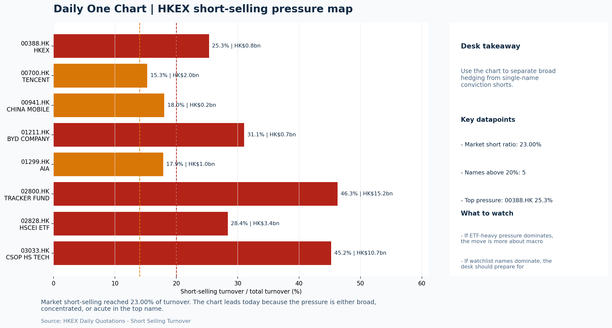

# Morning Research Workbench | 2026-06-09

> Designed for a Hong Kong sell-side commute: Layer 1 `Scan`, Layer 2 `Deep Read`, Layer 3 `Thinking`
> Mode: `Trading Daily` | Keep the report execution-oriented: what mattered in the completed session, what can move Hong Kong leadership, and what needs fast follow-up.
> Briefing date: `2026-06-09` | Review date: `2026-06-08` | Global request: `2026-06-08` | HK/China request: `2026-06-08` | Market effective date: `2026-06-08` | Generated at: `2026-06-09 08:13:20`

## Executive Summary

- **Market pulse:** Nasdaq's +1.58% lead and a sharp VIX compression create a mildly constructive overnight setup for Hong Kong, but the 23.00% short-selling ratio and FXI's -0.20% decline argue against.
- **Hong Kong lens:** Hong Kong growth / internet led. The Nasdaq lead (+1.58%) and VIX compression provide a constructive signal for Hong Kong growth and internet names, but the 23.00% short-selling ratio and FXI -0.20% argue.
- **Top catalysts:** VIX -12.04%; INTC -6.33%.

## Visual Dashboard

## Layer 1 | Scan (5-10 min)

### 1.1 One-Line Market Pulse
Nasdaq's +1.58% lead and a sharp VIX compression create a mildly constructive overnight setup for Hong Kong, but the 23.00% short-selling ratio and FXI's -0.20% decline argue against aggressive positioning until local breadth confirms.

### 1.2 Global Asset Price Dashboard

| Asset | Last | 1D move | Read |
| --- | --- | --- | --- |
| S&P 500 | 7,405.73 | +0.30% | US large-cap risk appetite |
| Nasdaq 100 | 29,414.26 | **+1.58%** | Growth and duration leadership |
| Hang Seng Index | 24,961.95 | -1.15% | Hong Kong broad beta |
| Hang Seng TECH | 4.7860 | **-1.72%** | Hong Kong growth / platform read-through |
| CSI 300 | 4,816.92 | **-1.79%** | Mainland large-cap tone |
| US 10Y | 4.5520 | +0.35% | Global discount-rate anchor |
| China 10Y | 1.73% | +0.7bp | China local rates anchor \| Live public \| Eastmoney \| 2026-06-08 |
| CN-US 10Y spread | -283.2bp | -0.3bp | Relative carry and macro-pressure gauge \| Live public \| Eastmoney \| 2026-06-08 |
| DXY | 100.05 | -0.02% | Dollar liquidity impulse |
| USD/CNH | 6.7820 | -0.10% | Offshore China risk appetite |
| USD/HKD | 7.8341 | -0.00% | Linked-exchange regime stress check |
| Brent crude | 94.40 | +1.41% | Energy / geopolitics |
| COMEX gold | 4,341.50 | +0.10% | Hedge demand / real yields |
| Copper | 6.3250 | +0.98% | Global growth proxy |
| VIX | 18.92 | **-12.04%** | US stress barometer |

### 1.3 Hong Kong Key Data Quick Check

| Check | Value | Status | Source / as of | Why it matters |
| --- | --- | --- | --- | --- |
| Main Board turnover vs 20D | 1.16x \| +16% vs 20D | Live local | HKEX \| 2026-06-08 | Trailing 20-session average turnover was HK$314.3bn. |
| Southbound / Northbound net flow | Southbound Net HK$11.3bn \| turnover HK$123.4bn \| Northbound Turnover HK$370.1bn \| net not reported | Live local | HKEX Connect \| 2026-06-08 | Southbound net buy is calculated from HKEX disclosed buy and sell turnover. |
| Short-selling ratio | 23.00% | Live local | HKEX \| 2026-06-08 | Official HKEX stock-level short-selling table, aggregated as a share of total market turnover. |
| AH premium index | 27.32% | Live public | Yahoo \| 2026-06-08 | Simple average across 17 A/H pairs; use dispersion rather than the average alone. |
| USD/HKD spot vs band | 7.8341 \| band 7.7500 to 7.8500 | Live quote + local | Yahoo \| 2026-06-08 | Inside the linked-exchange band without immediate boundary stress. Official Convertibility Undertakings define the linked-rate stress boundaries for USD/HKD. |
| HIBOR 1M | 2.74% | Live local | HKMA \| 2026-06-08 | 1M HIBOR is the cleanest quick read for Hong Kong funding conditions and equity-duration pressure. |
| Aggregate Balance | HK$54.9bn | Live local | HKMA \| 2026-06-08 | Aggregate Balance helps frame whether linked-rate liquidity conditions are tight or comfortable. |
| Hong Kong leadership | Hong Kong growth / internet led | Proxy | HSI / HSCEI / HSTECH relative perf \| 2026-06-08 | Use HSI / HSCEI / HSTECH relative moves as the opening style read. |

### 1.4 Risk Dashboard
**Composite risk score:** `49.4/100` | **Regime:** `Mixed`

| Component | Score impact | Evidence |
| --- | --- | --- |
| US beta | +1.8 | S&P 500 +0.30% |
| HK growth | -8.6 | HSTECH -1.72% |
| Offshore China proxy | -1.0 | FXI -0.20% |
| Dollar pressure | +0.2 | DXY -0.02% |
| Volatility | +10 | VIX -12.04% |
| HK short-selling | -8 | Short-selling ratio 23.00% |

### 1.5 Morning Checklist
1. **VIX -12.04%**
 High-frequency data | Lower volatility signals easing stress in the tape.
2. **INTC -6.33%**
 Mover attribution | Announcement / expectations | Guidance reset and margin pressure
3. **Neutral backdrop with USD range-bound, rates were not the dominant driver, and Bitcoin outperformed Oil**
 Overnight regime | Start by deciding whether the day is about Neutral conditions or a style pivot.
4. **CPI MoM (Released)**
 Macro / policy | Rates expectations, the dollar, and growth-equity valuation | Industries: Technology, Internet, Brokers
5. **Trade Balance (Released)**
 Macro / policy | Watch whether it changes the day's core market narrative | Industries: Market-wide

## Layer 2 | Deep Read (20-30 min)

### 2.1 Overnight Overseas Market Review
#### Market Setup
**Core tape.** Overnight US session delivered mixed signals: Nasdaq 100 outperformed with +1.58% while S&P 500 closed modestly higher at +0.30%, supported by a sharp VIX compression of -12.04% that eased intraday stress.
**Main driver.** Euro Stoxx 50 lagged at -0.68%, and offshore China proxy FXI slipped -0.20%, keeping the broader Asia sentiment subdued ahead of Tuesday's Hong Kong open.
**HK relevance.** Bitcoin surged +3.9%, providing the clearest risk-on signal, but this divergence versus Oil was the dominant cross-asset theme on a day when rates were not the central driver.

#### Key Drivers
- Hot May jobs data and confirmed CPI tightened the Fed reaction function, extending the window before any rate cut and keeping USD supported.
- Intel's -6.33% guidance reset weighed on semiconductor sentiment with supply-chain read-through risk for HK chip-adjacent names.
- Short-selling ratio at 23.00% signals elevated HK bear activity; rebounds require cleaner breadth confirmation before chasing.
- Bitcoin outperformed Oil by 2.93pct on the day, reflecting crypto risk appetite rather than commodity-driven macro.

#### Hong Kong Read-Through
**Desk lens.** State-owned / old-economy H-shares led.
**Opening implication.** The Nasdaq lead (+1.58%) and VIX compression provide a constructive signal for Hong Kong growth and internet names, but the 23.00% short-selling ratio and FXI -0.20% argue against aggressive chasing at the open. HSTECH at -1.72% is the key test.
- **Cross-market read:** Hang Seng -1.15% / HSCEI -0.77% / HSTECH -1.72%.
- **Cross-market read:** Offshore China proxy FXI -0.20% and USD/CNH -0.10% frame cross-border risk appetite.
- **Cross-market read:** USD/HKD last traded around 7.8341, which keeps the Hong Kong funding lens in focus.

#### Watch Points
- USD composite moved higher by +0.01pct intraday, with a 0.194pct range.
- Main turning points appeared around 2026-06-08 08:05 trough / 2026-06-08 08:45 trough / 2026-06-08 09:05 trough, suggesting event-driven repricing.
- The biggest cross-asset divergence was Bitcoin versus Oil, a spread of 2.933pct.
- Gold moved +0.04pct intraday with a 1.657pct high-low range.

**Curated overnight stories**
1. **Hot jobs report puts Fed cuts further out of reach as Chair Warsh faces policy tests**
 Why it matters: Strong US employment data extends the window before any Fed rate reduction. This keeps USD supported and compresses multiples for rate-sensitive HK growth names.
 HK read-through: High. Directly affects cost-of-capital assumptions for Hong Kong internet, property, and high-beta tech names. USD direction shifts capital flow expectations.
2. **INTC -6.33%**
 Why it matters: Intel announced guidance reset with margin pressure. This is a specific semiconductor earnings event with direct supply-chain read-through and indirect sentiment linkage.
 HK read-through: Moderate-High. Semi supply-chain and related tech names on HKEX may face sentiment contagion if US semis continue selling.
3. **Hong Kong's IPO boom is developing a performance problem**
 Why it matters: A growing share of HK IPOs are trading below issue price post-debut, raising questions about listing quality, investor allocation practices, and pipeline sustainability.
 HK read-through: Moderate locally. Directly relevant to HKEX valuation premium and sentiment toward new issuances. May weigh on exchange-operator and capital markets-adjacent names.

### 2.2 Hong Kong / A-share Previous-Day Review
#### Local Tape Setup
**Local read.** Hong Kong's Monday session ended with growth underperforming SOE/value: HSTECH fell 1.72% versus HSCEI -0.77%, even as overnight Nasdaq 100 gained 1.58% and VIX compressed.
**Verification point.** Southbound flow was net buying HK$11.3bn, but major onshore and offshore China ETFs saw outflows and the short-selling ratio held at an elevated 23.00%, leaving local breadth unconvincing.
**Risk to watch.** The cross-market style divergence - US growth strength against HK growth weakness - sets up a clear leadership test at Tuesday's open.

#### Style and Local Leadership
**Style leadership.** Hong Kong growth / internet led.
- **Cross-market read:** Hang Seng -1.15% / HSCEI -0.77% / HSTECH -1.72%.
- **Cross-market read:** Offshore China proxy FXI -0.20% and USD/CNH -0.10% frame cross-border risk appetite.
- **Cross-market read:** USD/HKD last traded around 7.8341, which keeps the Hong Kong funding lens in focus.

#### Flow Confirmation
Official Stock Connect evidence is available; use Section 2.3 to confirm whether local money supports the price action.

#### Follow-Through Checklist
**Follow-through check.** Watch whether HSTECH opens above flat and begins to close the overnight gap with Nasdaq 100.

### 2.3 Flow Tracker and Attribution
#### Cross-Asset Attribution v1

| Driver | Direction | Score | Evidence | HK implication |
| --- | --- | --- | --- | --- |
| Short-selling pressure | drag | 5.6 | HKEX short-selling ratio was 23.00%. | Elevated short activity argues for extra confirmation before chasing rebounds. |
| US growth-style transmission | supportive | 2.21 | Nasdaq 100 moved +1.58%. | Hong Kong growth and platform names should be tested first at the open. |
| Hong Kong participation | supportive | 1.58 | Main Board turnover was 1.16x the 20-session average. | Higher participation makes local price action more credible. |

#### Flow Tracker
##### Flow Takeaways
- Short-selling pressure is elevated, so local rebounds need cleaner breadth and flow confirmation.
- Stock Connect Southbound: net HK$11.3bn on turnover HK$123.4bn (as of 2026-06-08).
- Stock Connect Northbound: turnover RMB370.1bn; public file provides total turnover/top active names, not full net-buy.
- AH premium: simple covered-pair average +27.32%; widest premium: China Communications Construction 69.9%.

##### Stock Connect Southbound Active Names

| Rank | Ticker | Name | Buy | Sell | Net buy |
| --- | --- | --- | --- | --- | --- |
| 2 | 02800.HK | TRACKER FUND | HK$5,630.0mn | HK$35.0mn | HK$5,595.0mn |
| 3 | 00700.HK | TENCENT | HK$3,303.4mn | HK$2,141.3mn | HK$1,162.1mn |
| 1 | 00981.HK | SMIC | HK$3,808.0mn | HK$4,733.3mn | HK$-925.4mn |
| 10 | 02513.HK | KNOWLEDGE ATLAS | HK$960.6mn | HK$41.0mn | HK$919.7mn |
| 6 | 03033.HK | CSOP HS TECH | HK$990.1mn | HK$350.8mn | HK$639.4mn |

##### AH Premium Dispersion

| Name | A ticker | H ticker | Premium | As of |
| --- | --- | --- | --- | --- |
| China Communications Construction | 601800.SS | 1800.HK | +69.90% | 2026-06-08 |
| China Railway | 601390.SS | 0390.HK | +48.05% | 2026-06-08 |
| China Railway Construction | 601186.SS | 1186.HK | +46.76% | 2026-06-08 |
| China Life | 601628.SS | 2628.HK | +39.02% | 2026-06-08 |
| Sinopec | 600028.SS | 0386.HK | +37.35% | 2026-06-08 |

##### HKEX Short-Selling Watch

| Ticker | Name | Short ratio | Short turnover | Total turnover |
| --- | --- | --- | --- | --- |
| 00388.HK | HKEX | 25.34% | HK$0.8bn | HK$3.0bn |
| 00700.HK | TENCENT | 15.27% | HK$2.0bn | HK$13.0bn |
| 00941.HK | CHINA MOBILE | 18.04% | HK$0.2bn | HK$1.2bn |
| 01211.HK | BYD COMPANY | 31.06% | HK$0.7bn | HK$2.3bn |
| 01299.HK | AIA | 17.86% | HK$1.0bn | HK$5.7bn |

- **Short-value leaders:** 02800.HK TRACKER FUND (HK$15.2bn); 03033.HK CSOP HS TECH (HK$10.7bn); 07709.HK XL2CSOPHYNIX (HK$9.8bn); 07747.HK XL2CSOPSMSN (HK$4.2bn).

### 2.4 Macro and Policy Tracking
**Desk read.** The completed session settled into a neutral backdrop with a range-bound USD, rates not dominating, and Bitcoin outperforming oil - a configuration that suggests modest risk appetite without a clear catalyst.

**Market sensitivity.** For the 2026-06-09 session, the macro calendar is front-loaded and consequential.

**HK implication.** US CPI MoM released at 20:30 came in hotter than expected at 0.3% (forecast: 0.2%, prior: 0.4%), which may pressure duration assets and the dollar if repriced on the open.

**Macro watchpoints**
- USD strength and US Treasury yields after the hotter-than-expected CPI print (0.3% actual vs 0.2% forecast).
- HK and China equities early-session response to the China Trade Balance beat (USD 85.2bn vs USD 79.0bn forecast).
- US Retail Sales MoM print at 20:30 - whether a slowdown from 0.6% prior to 0.3% forecast changes growth expectations.
- Fed Chair Powell remarks at 22:00 - any hawkish lean following the CPI surprise could reprice duration and financials.

| Time | Region | Event | Status | Desk read |
| --- | --- | --- | --- | --- |
| 20:30 | US | CPI MoM | Released | Impact: Rates expectations, the dollar, and growth-equity valuation \| Attention: 5/5 \| Industries: Technology, Internet, Brokers |
| 09:30 | China | Trade Balance | Released | Impact: Watch whether it changes the day's core market narrative \| Attention: 3/5 \| Industries: Market-wide |
| 20:30 | US | Retail Sales MoM | Upcoming | Impact: Consumer resilience, growth expectations, and risk-asset pricing \| Attention: 5/5 \| Industries: Consumer, E-commerce, Consumer discretionary |
| 09:20 | China | Loan Prime Rate | Upcoming | Impact: Watch whether it changes the day's core market narrative \| Attention: 3/5 \| Industries: Market-wide |
| 22:00 | Federal Reserve | Jerome Powell: Economic outlook remarks | Central bank | Impact: Policy path, liquidity conditions, and cross-asset risk appetite \| Attention: 5/5 \| Industries: Technology, Financials, Gold |
| 10:00 | PBOC | Open Market Operations Desk: Daily liquidity operation window | Central bank | Impact: Policy path, liquidity conditions, and cross-asset risk appetite \| Attention: 3/5 \| Industries: Technology, Financials, Gold |

#### Positioning and Risk Backdrop
- Options activity centered on KWEB Call, with Vol/OI at 1.88x and a bullish bias.
- Put/Call structure shows equity 0.68 / index 1.15, implying Single-stock optimism with index hedging.
- Geopolitics: Middle East | Regional tension remains elevated | Impact: Oil, freight costs, and safe-haven demand
- Geopolitics: US-China | Technology export-control rhetoric remains active | Impact: China internet, semiconductors, and supply chains

### 2.5 Key Company and Sector Events

| Grade | Sector | Headline | Why it matters | Horizon |
| --- | --- | --- | --- | --- |
| B | China Internet | China poaches more AI talent from the U.S. | Assess whether the story can propagate through the China Internet value | Monitor |

#### HKEX Announcements

| Grade | Ticker | Type | Release time | Title |
| --- | --- | --- | --- | --- |
| A | 00277.HK | Profit warning | 2026-06-08 | Profit warning / alert announcement |
| A | 00852.HK | Profit warning | 2026-06-08 | Profit warning / alert announcement |
| A | 01123.HK | Profit warning | 2026-06-08 | Profit warning / alert announcement |
| A | 01455.HK | Profit warning | 2026-06-08 | Profit warning / alert announcement |
| A | 01489.HK | Profit warning | 2026-06-08 | Profit warning / alert announcement |
| A | 08316.HK | Profit warning | 2026-06-08 | Profit warning / alert announcement |
| A | 08473.HK | Profit warning | 2026-06-08 | Profit warning / alert announcement |
| A | 08635.HK | Profit warning | 2026-06-08 | Profit warning / alert announcement |

#### Earnings / Results Watch

| Ticker | Company | Timing | Expectation framing |
| --- | --- | --- | --- |
| 0700.HK | Tencent Holdings | After Market Close | EPS est. 4.15 HKD \| revenue est. 163.2bn HKD |
| 0388.HK | Hong Kong Exchanges and Clearing | Before Market Open | EPS est. 2.81 HKD \| revenue est. 6.0bn HKD |

#### Rating Changes
- **9988.HK** | Morgan Stanley | Upgrade | Equal Weight -> Overweight | PT 92 -> 105

#### IPO Watch
- IPO and grey-market monitoring is not yet part of the standard production pack.

### 2.6 Today's Core Names
#### Core coverage

| Name | Ticker | Last | 1D | Range position | Morning note |
| --- | --- | --- | --- | --- | --- |
| Meituan | 3690.HK | 76.25 | -4.63% | Bottom of range | Short-term pressure is visible; check for a fundamental or regulatory reason. |
| Alibaba | 9988.HK | 118.80 | -2.94% | Bottom of range | Short-term pressure is visible; check for a fundamental or regulatory reason. |

**Recent headlines for Meituan:**
- [Meituan Logs Another Loss Amid Food-Delivery Price War](https://www.wsj.com/business/earnings/meituan-logs-another-loss-amid-food-delivery-price-war-fef4c703?siteid=yhoof2&yptr=yahoo) (The Wall Street Journal)
**Recent headlines for Alibaba:**
- [BYD, BABA, BIDU In Focus - Pentagon Accuses Firms Of Aiding China's Military](https://stocktwits.com/news-articles/markets/equity/byd-baba-bidu-in-focus-pentagon-accuses-firms-of-aiding-china-s-military/cZ0vXt9R7GH) (Stocktwits)

#### Priority follow-up

| Name | Ticker | Last | 1D | Range position | Morning note |
| --- | --- | --- | --- | --- | --- |
| BYD Company | 1211.HK | 88.05 | -1.84% | Bottom of range | The name sits near the bottom of its recent range and is worth monitoring for a catalyst-led reversal. |
| AIA | 1299.HK | 72.65 | -1.82% | Bottom of range | The name sits near the bottom of its recent range and is worth monitoring for a catalyst-led reversal. |

## Layer 3 | Thinking (10-15 min)

### 3.1 Rotating Theme Deep Dive

| Field | Read |
| --- | --- |
| Theme | China Consumption Recovery |
| Angle for the day | Focus on whether travel, retail, internet local services, and premium consumption data still support a demand-repair narrative. |

**Theme desk read**
**Core thesis.** The weekly theme of China consumption recovery remains testable near-term.
**Evidence.** Meituan (3690.HK) closed at HK$76.25, down 4.6% on the session and sitting at the bottom of its range, pressured by a continued food-delivery price war that drove another quarterly loss.
**What to test.** While low VIX and a strong Bitcoin tape signal a risk-on backdrop, the demand-repair narrative for China local services hinges on whether Meituan's upcoming order trends and margin commentary (June 9) can show volume growth.

**Signals to keep in mind**
- VIX -12.04%: Lower volatility signals easing stress in the tape.
- Bitcoin +3.90%: A strong crypto tape reinforces the risk-on read.

**LLM watch items:**
- Meituan order trends and margin commentary (June 9) - crucial for confirming if local services demand is holding up despite the price war.
- US Retail Sales MoM (June 9) - high-impact read on consumer resilience, with potential to shift risk-asset pricing.
- Monitor VIX and Bitcoin for continued risk-on signal strength.

**Related names to keep close:**

| Name | Ticker | Bucket | Morning read |
| --- | --- | --- | --- |
| Meituan | 3690.HK | Core coverage | Short-term pressure is visible; check for a fundamental or regulatory reason. |

**Upcoming catalysts tied to the theme:**
- 2026-06-09 | Meituan: Order trends and margin commentary | High-frequency read on local services demand and platform competition
- 2026-06-09 | Retail Sales MoM | Consumer resilience, growth expectations, and risk-asset pricing

### 3.2 Today Ahead and Trading Calendar
- Macro: CPI MoM is the first item to anchor the open and the rates/FX response.
- Corporate / event: Meituan: Order trends and margin commentary is the cleanest same-day catalyst to prepare for.

**Same-day macro docket**

| Time | Country | Event | Status | Detail |
| --- | --- | --- | --- | --- |
| 20:30 | US | CPI MoM | Released | Actual 0.3% / Forecast 0.2% / Prior 0.4% |
| 09:30 | China | Trade Balance | Released | Actual USD 85.2bn / Forecast USD 79.0bn / Prior USD 80.6bn |
| 20:30 | US | Retail Sales MoM | Upcoming | Forecast 0.3% / Prior 0.6% |
| 09:20 | China | Loan Prime Rate | Upcoming | Forecast 3.45% / Prior 3.45% |
| 22:00 | Federal Reserve | Jerome Powell: Economic outlook remarks | Central bank | speech |

**Same-day catalyst list**

| Date | Time | Category | Event | Importance |
| --- | --- | --- | --- | --- |
| 2026-06-09 | | Core coverage | Meituan: Order trends and margin commentary | 3 |
| 2026-06-09 | | Core coverage | Alibaba: Cloud demand and GMV updates | 3 |
| 2026-06-09 | | Core coverage | HKEX: Turnover data and IPO pipeline updates | 3 |
| 2026-06-09 | | Core coverage | Tencent: Game grossing trends and ad-demand checks | 3 |

**Next few sessions**

| Date | Category | Event | Impact |
| --- | --- | --- | --- |
| 2026-06-09 | Core coverage | Meituan: Order trends and margin commentary | High-frequency read on local services demand and platform competition |
| 2026-06-09 | Core coverage | Alibaba: Cloud demand and GMV updates | Key read-through for China consumption, cloud, and platform regulation |
| 2026-06-09 | Core coverage | HKEX: Turnover data and IPO pipeline updates | Direct proxy for Hong Kong market turnover, listings, and southbound |
| 2026-06-09 | Core coverage | Tencent: Game grossing trends and ad-demand checks | Core offshore China platform proxy for gaming, ads, and AI monetization |

### 3.3 Daily One Chart
**Daily One Chart | HKEX short-selling pressure map**

**Chart read.** Market short-selling reached 23.00% of turnover.
**Why it matters.** The chart leads today because the pressure is either broad, concentrated, or acute in the top name.

_Source: HKEX Daily Quotations - Short Selling Turnover_

## Traceable Appendix

### Report Metadata
> Date policy: Review date 2026-06-08 is treated as `Trading Daily`. | Global request date is 2026-06-08; adapter effective date is 2026-06-08 and summary date is 2026-06-08. | HK/China local data date is 2026-06-08; role: same-session local cash tape.
> Market data quality: Coverage: `31/32` | Stale items (>1d): `7` | Missing: `1`
> Report quality: `82.4/100` | Grade `B` | Status `usable with caveats`

### Key Questions to Keep in Mind
- Is risk appetite rising or fading? The overnight tape reads closer to `Neutral`.
- Did rates expectations move? Focus on whether US 10Y, DXY, and growth style moved together.
- Were commodities the real story? Watch WTI and gold for geopolitics versus inflation signals.
- Is Hong Kong setup internet-led, SOE-led, or broad beta-led? Compare HSTECH, HSCEI, and HSI.
- Did offshore markets move China risk appetite? Focus on HSI, FXI, USD/CNH, and USD/HKD.

### Report Quality and Validation
- **Quality score:** 82.4/100 | **Grade:** B | **Status:** usable with caveats
- **Run summary:** 7 healthy | 1 caveat | 0 failed
- **Release recommendation:** Send with caveats | The report is usable, but the advisory guidance should travel with it so readers understand the data gaps.

| Source | Status | Bucket |
| --- | --- | --- |
| Market data | ok | healthy |
| Sector and company news | ok | healthy |
| Movers and short selling | ok | healthy |
| Stock Connect | ok | healthy |
| A/H premium | ok | healthy |
| Hong Kong local package | ok | healthy |
| China rates | ok | healthy |
| Narrative overlay | partial | caveat |

**Desk-use guidance summary:** 0 blocking | 1 advisory

**Desk-use guidance**
- **Advisory:** Use deterministic sections as primary support; the narrative overlay was partial or unavailable on this run.

| Component | Score | Weight | Read |
| --- | --- | --- | --- |
| Market data coverage | 96.9 | 0.3 | 31/32 core market fields available. |
| Hong Kong local metrics | 82.3 | 0.25 | 8 live, 3 proxy, 0 unavailable local checks. |
| Key public adapters | 100.0 | 0.2 | 4/4 key adapters were available or partially available. |
| Narrative overlay health | 51.4 | 0.15 | 2/7 narrative overlay tasks succeeded or used validated cache; 1 error(s). |
| Fact-check guardrail | 50.0 | 0.1 | Checked 12 numeric claims; 2 numeric mismatch(es), 0 logic warning(s); 2 critical, 0 review. |

**Quality warnings**
- Narrative overlay health is weak: 2/7 narrative overlay tasks succeeded or used validated cache; 1 error(s).
- Fact-check guardrail is weak: Checked 12 numeric claims; 2 numeric mismatch(es), 0 logic warning(s); 2 critical, 0 review.
- Narrative fact-check guardrail produced warnings; review the validation table before relying on narrative sections.

**Narrative fact-check guardrail**
- Checked 12 numeric claims; 2 numeric mismatch(es), 0 logic warning(s); 2 critical, 0 review.

| Severity | Field | Claim | Type | Claimed | Expected | Snippet |
| --- | --- | --- | --- | --- | --- | --- |
| critical | tasks.hk_review.paragraph | Hang Seng TECH | change_pct | 1.72 | -1.72 | sion ended with growth underperforming SOE/value: HSTECH fell 1.72% versus HSCEI -0.77%, even as overnight Nasdaq 100 |
| critical | tasks.macro_interpretation.paragraph | VIX | change_pct | 12.04 | -12.04 | nals from the completed session are constructive: VIX down 12.04% signals easing stress, and Bitcoin up 3.9% reinfo |

**Adapter status**

| Adapter | Status |
| --- | --- |
| Stock Connect | ok |
| A/H premium | ok |
| HKEX announcements | ok |
| China rates | ok |

### Source Links
- [China poaches more AI talent from the U.S. as it eyes the next 'super-app'](https://www.cnbc.com/2026/06/05/china-may-move-toward-us-path-on-ai-as-firms-poach-employees.html) (cnbc_markets)
- [Meituan Logs Another Loss Amid Food-Delivery Price War](https://www.wsj.com/business/earnings/meituan-logs-another-loss-amid-food-delivery-price-war-fef4c703?siteid=yhoof2&yptr=yahoo) (The Wall Street Journal)
- [BYD, BABA, BIDU In Focus - Pentagon Accuses Firms Of Aiding China's Military](https://stocktwits.com/news-articles/markets/equity/byd-baba-bidu-in-focus-pentagon-accuses-firms-of-aiding-china-s-military/cZ0vXt9R7GH) (Stocktwits)
- [Tencent Targets $3 Billion Bond Sale As AI Spending Accelerates](https://finance.yahoo.com/sectors/technology/articles/tencent-targets-3-billion-bond-194014953.html) (GuruFocus.com)
- [00277.HK Profit warning / alert announcement](http://www1.hkexnews.hk/listedco/listconews/sehk/2026/0608/2026060800494.pdf) (HKEXnews)
- [00852.HK Profit warning / alert announcement](http://www1.hkexnews.hk/listedco/listconews/sehk/2026/0608/2026060801774.pdf) (HKEXnews)
- [01123.HK Profit warning / alert announcement](http://www1.hkexnews.hk/listedco/listconews/sehk/2026/0608/2026060800440.pdf) (HKEXnews)
- [01455.HK Profit warning / alert announcement](http://www1.hkexnews.hk/listedco/listconews/sehk/2026/0608/2026060800618.pdf) (HKEXnews)
- [01489.HK Profit warning / alert announcement](http://www1.hkexnews.hk/listedco/listconews/sehk/2026/0608/2026060801592.pdf) (HKEXnews)
- [08316.HK Profit warning / alert announcement](http://www1.hkexnews.hk/listedco/listconews/gem/2026/0608/2026060801802.pdf) (HKEXnews)
- [08473.HK Profit warning / alert announcement](http://www1.hkexnews.hk/listedco/listconews/gem/2026/0608/2026060801079.pdf) (HKEXnews)
- [08635.HK Profit warning / alert announcement](http://www1.hkexnews.hk/listedco/listconews/gem/2026/0608/2026060801095.pdf) (HKEXnews)

## Supplementary Visual Appendix

This appendix is professional-path only. It keeps a traceable index of the report visuals and the deterministic chart cues used to frame the morning note, without injecting the legacy intraday chart pack.

### Visual Index

| Visual | Path | Role |
| --- | --- | --- |
| Visual Dashboard | `charts/dashboard_2026-06-09.png` | Cross-asset regime board and Hong Kong local tape snapshot. |
| Daily One Chart | `charts/daily_one_chart_2026-06-09.png` | Single highest-conviction visual story for the day. |

### Deterministic Chart Cues
- FX / liquidity: USD composite moved higher by +0.01pct intraday, with a 0.194pct range.
- FX / liquidity: Main turning points appeared around 2026-06-08 08:05 trough / 2026-06-08 08:45 trough / 2026-06-08 09:05 trough, suggesting event-driven repricing rather than a clean one-way USD move.
- Cross-asset: The biggest cross-asset divergence was Bitcoin versus Oil, a spread of 2.933pct.
- Cross-asset: Gold moved +0.04pct intraday with a 1.657pct high-low range.
- Cross-asset: Oil moved -2.46pct intraday with a 4.814pct high-low range.
- Cross-asset: Bitcoin moved +0.48pct intraday with a 2.737pct high-low range.

### Risk Dashboard Components

| Component | Score impact | Evidence |
| --- | --- | --- |
| US beta | +1.8 | S&P 500 +0.30% |
| HK growth | -8.6 | HSTECH -1.72% |
| Offshore China proxy | -1.0 | FXI -0.20% |
| Dollar pressure | +0.2 | DXY -0.02% |
| Volatility | +10 | VIX -12.04% |
| HK short-selling | -8 | Short-selling ratio 23.00% |
