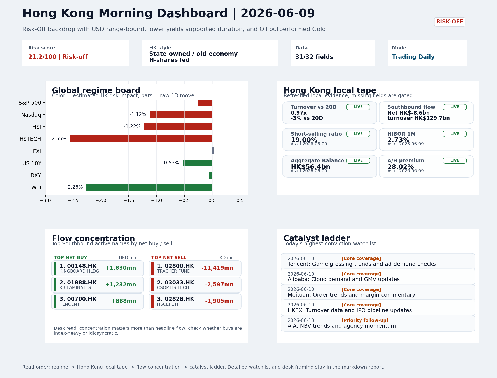

# Archived Professional Report | 2026-06-10

This is the GitHub landing page for the archived report dated `2026-06-10`.

- Report date: `2026-06-10`
- Report mode: `Trading Daily`
- Quality: `77.4/100`
- One-line pulse: Risk-off session with VIX spiking to 19.87 and HSTECH falling 2.55% reflects elevated caution, but FXI's flat print...
- Latest published entry: [latest/README.md](../../latest/README.md)
- Archive gallery: [archive/README.md](../README.md)
- Direct markdown file: [morning_briefing.md](./morning_briefing.md)
- Dashboard: [Open image](charts/dashboard_2026-06-10.png)
- Catalyst & Event Radar: N/A
- Daily One Chart: [Open image](charts/daily_one_chart_2026-06-10.png)
- Trend Pack: N/A
- Raw bundle: N/A
- Integrity manifest: [Verify SHA-256 payload](manifest.json)

## Dashboard Preview

## How to use this folder

1. Start with the dashboard preview for a quick visual read.
2. Open [morning_briefing.md](./morning_briefing.md) for the full report text.
3. Use `charts/` and `raw/` only when you need supporting assets or audit data.
