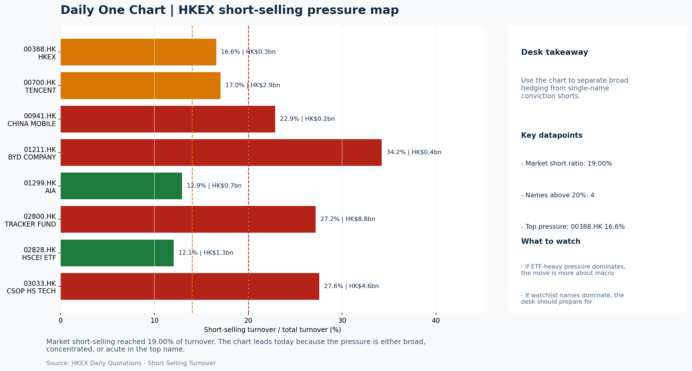

# Morning Research Workbench | 2026-06-10

> Designed for a Hong Kong sell-side commute: Layer 1 `Scan`, Layer 2 `Deep Read`, Layer 3 `Thinking`
> Mode: `Trading Daily` | Keep the report execution-oriented: what mattered in the completed session, what can move Hong Kong leadership, and what needs fast follow-up.
> Briefing date: `2026-06-10` | Review date: `2026-06-09` | Global request: `2026-06-09` | HK/China request: `2026-06-09` | Market effective date: `2026-06-09` | Generated at: `2026-06-10 08:22:01`

## Executive Summary

- **Market pulse:** Risk-off session with VIX spiking to 19.87 and HSTECH falling 2.55% reflects elevated caution, but FXI's flat print and the 10Y yield decline to 4.528% offer conditional support for.
- **Hong Kong lens:** State-owned / old-economy H-shares led. A cautious open is likely given VIX elevation, Nasdaq weakness, and HSTECH's 2.55% drop. State-owned H-shares held better on the local tape, so leadership quality at the open.
- **Top catalysts:** INTC -6.33%; Risk-Off backdrop with USD range-bound, lower yields supported duration, and Oil outperformed Gold.

## Visual Dashboard

## Layer 1 | Scan (5-10 min)

### 1.1 One-Line Market Pulse
Risk-off session with VIX spiking to 19.87 and HSTECH falling 2.55% reflects elevated caution, but FXI's flat print and the 10Y yield decline to 4.528% offer conditional support for a cautious open rather than a capitulation signal.

### 1.2 Global Asset Price Dashboard

| Asset | Last | 1D move | Read |
| --- | --- | --- | --- |
| S&P 500 | 7,386.65 | -0.26% | US large-cap risk appetite |
| Nasdaq 100 | 29,084.50 | -1.12% | Growth and duration leadership |
| Hang Seng Index | 24,657.06 | -1.22% | Hong Kong broad beta |
| Hang Seng TECH | 4.6640 | **-2.55%** | Hong Kong growth / platform read-through |
| CSI 300 | 4,713.64 | **-2.14%** | Mainland large-cap tone |
| US 10Y | 4.5280 | -0.53% | Global discount-rate anchor |
| China 10Y | 1.74% | +1.0bp | China local rates anchor \| Live public \| Eastmoney \| 2026-06-09 |
| CN-US 10Y spread | -279.2bp | +4.0bp | Relative carry and macro-pressure gauge \| Live public \| Eastmoney \| 2026-06-09 |
| DXY | 99.99 | -0.06% | Dollar liquidity impulse |
| USD/CNH | 6.7760 | -0.09% | Offshore China risk appetite |
| USD/HKD | 7.8361 | +0.03% | Linked-exchange regime stress check |
| Brent crude | 92.46 | **-1.90%** | Energy / geopolitics |
| COMEX gold | 4,245.30 | **-2.09%** | Hedge demand / real yields |
| Copper | 6.3375 | +0.13% | Global growth proxy |
| VIX | 19.87 | **+5.02%** | US stress barometer |

### 1.3 Hong Kong Key Data Quick Check

| Check | Value | Status | Source / as of | Why it matters |
| --- | --- | --- | --- | --- |
| Main Board turnover vs 20D | 0.97x \| -3% vs 20D | Live local | HKEX \| 2026-06-09 | Trailing 20-session average turnover was HK$318.6bn. |
| Southbound / Northbound net flow | Southbound Net HK$-8.6bn \| turnover HK$129.7bn \| Northbound Turnover HK$360.9bn \| net not reported | Live local | HKEX Connect \| 2026-06-09 | Southbound net buy is calculated from HKEX disclosed buy and sell turnover. |
| Short-selling ratio | 19.00% | Live local | HKEX \| 2026-06-09 | Official HKEX stock-level short-selling table, aggregated as a share of total market turnover. |
| AH premium index | 28.02% | Live public | Yahoo \| 2026-06-09 | Simple average across 16 A/H pairs; use dispersion rather than the average alone. |
| USD/HKD spot vs band | 7.8361 \| band 7.7500 to 7.8500 | Live quote + local | Yahoo \| 2026-06-09 | Inside the linked-exchange band without immediate boundary stress. Official Convertibility Undertakings define the linked-rate stress boundaries for USD/HKD. |
| HIBOR 1M | 2.73% | Live local | HKMA \| 2026-06-09 | 1M HIBOR is the cleanest quick read for Hong Kong funding conditions and equity-duration pressure. |
| Aggregate Balance | HK$56.4bn | Live local | HKMA \| 2026-06-09 | Aggregate Balance helps frame whether linked-rate liquidity conditions are tight or comfortable. |
| Hong Kong leadership | State-owned / old-economy H-shares led | Proxy | HSI / HSCEI / HSTECH relative perf \| 2026-06-09 | Use HSI / HSCEI / HSTECH relative moves as the opening style read. |

### 1.4 Risk Dashboard
**Composite risk score:** `21.2/100` | **Regime:** `Risk-off`

| Component | Score impact | Evidence |
| --- | --- | --- |
| US beta | -1.6 | S&P 500 -0.26% |
| HK growth | -10 | HSTECH -2.55% |
| Offshore China proxy | +0.1 | FXI +0.03% |
| Dollar pressure | +0.6 | DXY -0.06% |
| Volatility | -10 | VIX +5.02% |
| HK short-selling | -8 | Short-selling ratio 19.00% |

### 1.5 Morning Checklist
1. **INTC -6.33%**
 Mover attribution | Announcement / expectations | Guidance reset and margin pressure
2. **Risk-Off backdrop with USD range-bound, lower yields supported duration, and Oil outperformed Gold**
 Overnight regime | Start by deciding whether the day is about Risk-Off conditions or a style pivot.
3. **CPI MoM (Released)**
 Macro / policy | Rates expectations, the dollar, and growth-equity valuation | Industries: Technology, Internet, Brokers
4. **VIX +5.02%**
 High-frequency data | Higher volatility argues for tighter sizing and tighter stops.
5. **Trade Balance (Released)**
 Macro / policy | Watch whether it changes the day's core market narrative | Industries: Market-wide

## Layer 2 | Deep Read (20-30 min)

### 2.1 Overnight Overseas Market Review
#### Market Setup
**Core tape.** Overnight US trading confirmed a risk-off session: Nasdaq fell 1.12% on Intel's sharp guidance reset (-6.3%), dragging HK tech proxies lower in the Asia close.
**Main driver.** VIX spiked to 19.87 (+5.02%), but the 10Y yield also fell to 4.528% (-0.53%), creating a split between growth-pressure and duration-support dynamics.
**HK relevance.** USD was range-bound (DXY -0.06%), and USD/CNH tightened to 6.776, keeping cross-border flow signals mixed rather than decisively negative.

#### Key Drivers
- Intel's guidance reset signals ongoing semiconductor competitive pressure, with broader AI infrastructure fatigue affecting HK tech.
- VIX spike to 19.87 raises the cost of hedging and argues for tighter sizing across HK growth positioning.
- US 10Y yield fall to 4.528% offers marginal relief for rate-sensitive HK sectors but is offset by higher-for-longer Fed narrative from CPI.
- Oil's 4.618% intraday range reflects geopolitical uncertainty, creating headwinds for energy and cyclical names but also a potential.

#### Hong Kong Read-Through
**Desk lens.** State-owned / old-economy H-shares led.
**Opening implication.** A cautious open is likely given VIX elevation, Nasdaq weakness.
- **Cross-market read:** Hang Seng -1.22% / HSCEI -1.13% / HSTECH -2.55%.
- **Cross-market read:** Offshore China proxy FXI +0.03% and USD/CNH -0.09% frame cross-border risk appetite.
- **Cross-market read:** USD/HKD last traded around 7.8361, which keeps the Hong Kong funding lens in focus.

#### Watch Points
- USD composite moved higher by +0.01pct intraday, with a 0.198pct range.
- Main turning points appeared around 2026-06-09 08:05 trough / 2026-06-09 08:20 peak / 2026-06-09 08:35 trough, suggesting event-driven repricing.
- The biggest cross-asset divergence was Oil versus Gold, a spread of 1.621pct.
- Gold moved -2.63pct intraday with a 3.243pct high-low range.

**Curated overnight stories**
1. **INTC guidance reset: margin pressure and downward revision**
 Why it matters: Intel's sharp guidance cut signals ongoing competitive pressure in semis. With Nvidia and Marvell also in premarket movers, the AI infrastructure trade is showing fatigue.
 HK read-through: Direct read-through for HK tech/growth positioning. Semi and AI-adjacent names could face initial pressure. Watch whether HKAD correlates or decouples.
2. **VIX +5.02% amid risk-off backdrop; USD range-bound, lower yields**
 Why it matters: Elevated volatility in a risk-off session argues for tighter sizing and defensive positioning. Lower yields supported duration, but this is conditional on the risk-off.
 HK read-through: Risk-off framing typically pressures HK growth/tech names. Duration support is marginally helpful for HYS and China property, but VIX spike is the dominant signal.
3. **CPI MoM released; hot jobs report pushes Fed cuts further out**
 Why it matters: Persistent inflation data and strong employment keep the Fed on a higher-for-longer trajectory. This extends the window of elevated Treasury yields, which directly pressures.
 HK read-through: Elevated US rates maintain portfolio flow headwinds for HK. China internet, brokers, and property remain under pressure.
4. **BYD predicts 80% of China car sales will soon be electric**
 Why it matters: BYD's structural EV forecast reinforces the pace of China auto electrification. This has second-order effects on EV supply chains, battery makers, and charging.
 HK read-through: Incremental positive for China EV/adoption theme. However, the broader risk-off backdrop may limit how much EV names outperform on the day.
5. **Hong Kong's IPO boom developing a performance problem**
 Why it matters: Direct structural concern for HK capital markets. If IPO performance deteriorates, this affects underwriting fees, market share, and sentiment toward HK as a listing venue.
 HK read-through: Specific to HK Financials: HKEX and local brokerages face potential earnings and flow headwinds. May reinforce existing HK market sentiment weakness.

### 2.2 Hong Kong / A-share Previous-Day Review
#### Local Tape Setup
**Local read.** The Hong Kong session on 9 June showed a clear style gap: HSTECH dropped 2.55% while HSCEI lost only 1.13%, a defensive rotation into state-owned/value H-shares.
**Verification point.** Southbound flows turned net seller at HK$-8.6bn and the short-selling ratio stayed at 19.00%, confirming domestic caution.
**Risk to watch.** US overnight signals - Nasdaq -1.12%, VIX +5.02% - extend this growth-to-value pressure, though the absence of Northbound net-buy data makes the full cross-border flow picture incomplete.

#### Style and Local Leadership
**Style leadership.** State-owned / old-economy H-shares led.
- **Cross-market read:** Hang Seng -1.22% / HSCEI -1.13% / HSTECH -2.55%.
- **Cross-market read:** Offshore China proxy FXI +0.03% and USD/CNH -0.09% frame cross-border risk appetite.
- **Cross-market read:** USD/HKD last traded around 7.8361, which keeps the Hong Kong funding lens in focus.

#### Flow Confirmation
Official Stock Connect evidence is available; use Section 2.3 to confirm whether local money supports the price action.

#### Follow-Through Checklist
**Follow-through check.** Watch for Southbound net buying resumption, a short-selling ratio drop below 15%, and whether CSI 300 and FXI confirm defensive/value leadership rather than just an index bounce.

### 2.3 Flow Tracker and Attribution
#### Cross-Asset Attribution v1

| Driver | Direction | Score | Evidence | HK implication |
| --- | --- | --- | --- | --- |
| Short-selling pressure | drag | 2.8 | HKEX short-selling ratio was 19.00%. | Elevated short activity argues for extra confirmation before chasing rebounds. |
| US growth-style transmission | drag | 1.57 | Nasdaq 100 moved -1.12%. | Hong Kong growth and platform names should be tested first at the open. |
| Oil and geopolitics | supportive | 1.52 | Oil moved -1.90%. | Split the read between energy/cyclicals support and margin/geopolitical pressure. |
| Rates impulse | supportive | 0.64 | US 10Y yield proxy moved -0.53%. | Lower yields help long-duration growth; higher yields pressure valuation-sensitive |

#### Flow Tracker
##### Flow Takeaways
- Short-selling pressure is elevated, so local rebounds need cleaner breadth and flow confirmation.
- Stock Connect Southbound: net HK$-8.6bn on turnover HK$129.7bn (as of 2026-06-09).
- Stock Connect Northbound: turnover RMB360.9bn; public file provides total turnover/top active names, not full net-buy.
- AH premium: simple covered-pair average +28.02%; widest premium: China Communications Construction 100.05%.

##### Stock Connect Southbound Active Names

| Rank | Ticker | Name | Buy | Sell | Net buy |
| --- | --- | --- | --- | --- | --- |
| 1 | 02800.HK | TRACKER FUND | HK$17.8mn | HK$11,436.9mn | HK$-11,419.1mn |
| 3 | 03033.HK | CSOP HS TECH | HK$6.2mn | HK$2,603.2mn | HK$-2,597.1mn |
| 7 | 02828.HK | HSCEI ETF | HK$0.1mn | HK$1,905.2mn | HK$-1,905.1mn |
| 6 | 00148.HK | KINGBOARD HLDG | HK$2,943.2mn | HK$1,112.8mn | HK$1,830.4mn |
| 8 | 01888.HK | KB LAMINATES | HK$2,165.4mn | HK$932.9mn | HK$1,232.5mn |

##### AH Premium Dispersion

| Name | A ticker | H ticker | Premium | As of |
| --- | --- | --- | --- | --- |
| China Communications Construction | 601800.SS | 1800.HK | +100.05% | 2026-06-09 |
| China Railway | 601390.SS | 0390.HK | +47.03% | 2026-06-09 |
| China Railway Construction | 601186.SS | 1186.HK | +43.78% | 2026-06-09 |
| China Life | 601628.SS | 2628.HK | +40.16% | 2026-06-09 |
| Sinopec | 600028.SS | 0386.HK | +35.29% | 2026-06-09 |

##### HKEX Short-Selling Watch

| Ticker | Name | Short ratio | Short turnover | Total turnover |
| --- | --- | --- | --- | --- |
| 00388.HK | HKEX | 16.58% | HK$0.3bn | HK$1.6bn |
| 00700.HK | TENCENT | 17.03% | HK$2.9bn | HK$17.2bn |
| 00941.HK | CHINA MOBILE | 22.86% | HK$0.2bn | HK$0.9bn |
| 01211.HK | BYD COMPANY | 34.21% | HK$0.4bn | HK$1.3bn |
| 01299.HK | AIA | 12.94% | HK$0.7bn | HK$5.5bn |

- **Short-value leaders:** 02800.HK TRACKER FUND (HK$8.8bn); 07709.HK XL2CSOPHYNIX (HK$4.9bn); 03033.HK CSOP HS TECH (HK$4.6bn); 00700.HK TENCENT (HK$2.9bn).

### 2.4 Macro and Policy Tracking
**Desk read.** The completed session reflects a risk-off read, confirmed by VIX climbing 5.02% to 19.87 and Gold down 2.09%.

**Market sensitivity.** US CPI, released at 20:30, printed hot at 0.3% MoM against a 0.2% forecast, repricing rate expectations and adding pressure on duration.

**HK implication.** China Trade Balance, released at 09:30, beat at USD 85.2bn versus USD 79.0bn forecast, offering a partial offset to the growth narrative but unlikely to reverse the risk-off tilt on its own.

**Macro watchpoints**
- US 10Y yield direction following the hot CPI print and ahead of Powell remarks.
- DXY trajectory - range-bound assumption under test if CPI forces dollar bid.
- US Retail Sales MoM actual vs 0.3% forecast; any shortfall would reinforce risk-off and add pressure on consumer-linked HK proxies.
- HK Technology and Internet sector tone on open - whether duration relief stabilizes or if risk-off overrides.

| Time | Region | Event | Status | Desk read |
| --- | --- | --- | --- | --- |
| 20:30 | US | CPI MoM | Released | Impact: Rates expectations, the dollar, and growth-equity valuation \| Attention: 5/5 \| Industries: Technology, Internet, Brokers |
| 09:30 | China | Trade Balance | Released | Impact: Watch whether it changes the day's core market narrative \| Attention: 3/5 \| Industries: Market-wide |
| 20:30 | US | Retail Sales MoM | Upcoming | Impact: Consumer resilience, growth expectations, and risk-asset pricing \| Attention: 5/5 \| Industries: Consumer, E-commerce, Consumer discretionary |
| 09:20 | China | Loan Prime Rate | Upcoming | Impact: Watch whether it changes the day's core market narrative \| Attention: 3/5 \| Industries: Market-wide |
| 22:00 | Federal Reserve | Jerome Powell: Economic outlook remarks | Central bank | Impact: Policy path, liquidity conditions, and cross-asset risk appetite \| Attention: 5/5 \| Industries: Technology, Financials, Gold |
| 10:00 | PBOC | Open Market Operations Desk: Daily liquidity operation window | Central bank | Impact: Policy path, liquidity conditions, and cross-asset risk appetite \| Attention: 3/5 \| Industries: Technology, Financials, Gold |

#### Positioning and Risk Backdrop
- Options activity centered on KWEB Call, with Vol/OI at 1.88x and a bullish bias.
- Put/Call structure shows equity 0.68 / index 1.15, implying Single-stock optimism with index hedging.
- Geopolitics: Middle East | Regional tension remains elevated | Impact: Oil, freight costs, and safe-haven demand
- Geopolitics: US-China | Technology export-control rhetoric remains active | Impact: China internet, semiconductors, and supply chains

### 2.5 Key Company and Sector Events

| Grade | Sector | Headline | Why it matters | Horizon |
| --- | --- | --- | --- | --- |
| B | China Internet | China poaches more AI talent from the U.S. | Assess whether the story can propagate through the China Internet value | Monitor |

#### HKEX Announcements

| Grade | Ticker | Type | Release time | Title |
| --- | --- | --- | --- | --- |
| A | 03818.HK | Profit warning | 2026-06-09 | Profit warning / alert announcement |
| A | 08121.HK | Profit warning | 2026-06-09 | Profit warning / alert announcement |
| A | 08392.HK | Profit warning | 2026-06-09 | Profit warning / alert announcement |
| A | 00277.HK | Profit warning | 2026-06-08 | Profit warning / alert announcement |
| A | 00852.HK | Profit warning | 2026-06-08 | Profit warning / alert announcement |
| A | 01123.HK | Profit warning | 2026-06-08 | Profit warning / alert announcement |
| A | 01455.HK | Profit warning | 2026-06-08 | Profit warning / alert announcement |
| A | 01489.HK | Profit warning | 2026-06-08 | Profit warning / alert announcement |

#### Earnings / Results Watch

| Ticker | Company | Timing | Expectation framing |
| --- | --- | --- | --- |
| 0700.HK | Tencent Holdings | After Market Close | EPS est. 4.15 HKD \| revenue est. 163.2bn HKD |
| 0388.HK | Hong Kong Exchanges and Clearing | Before Market Open | EPS est. 2.81 HKD \| revenue est. 6.0bn HKD |

#### Rating Changes
- **9988.HK** | Morgan Stanley | Upgrade | Equal Weight -> Overweight | PT 92 -> 105

#### IPO Watch
- IPO and grey-market monitoring is not yet part of the standard production pack.

### 2.6 Today's Core Names
#### Core coverage

| Name | Ticker | Last | 1D | Range position | Morning note |
| --- | --- | --- | --- | --- | --- |
| Tencent | 0700.HK | 453.20 | +1.52% | Bottom of range | The name sits near the bottom of its recent range and is worth monitoring for a catalyst-led reversal. |
| Alibaba | 9988.HK | 116.97 | -1.43% | Bottom of range | The name sits near the bottom of its recent range and is worth monitoring for a catalyst-led reversal. |

**Recent headlines for Tencent:**
- [Is Tencent (TCEHY) a Solid Growth Stock? 3 Reasons to Think "Yes"](https://finance.yahoo.com/markets/stocks/articles/tencent-tcehy-solid-growth-stock-164502369.html) (Zacks)
**Recent headlines for Alibaba:**
- [Alibaba Stock Has Bigger Problems Than the Pentagon's China List](https://www.barrons.com/articles/alibaba-stock-price-pentagon-china-list-6bde38db?siteid=yhoof2&yptr=yahoo) (Barrons.com)

#### Priority follow-up

| Name | Ticker | Last | 1D | Range position | Morning note |
| --- | --- | --- | --- | --- | --- |
| AIA | 1299.HK | 71.00 | -2.27% | Bottom of range | Short-term pressure is visible; check for a fundamental or regulatory reason. |
| BYD Company | 1211.HK | 88.40 | +0.40% | Bottom of range | The name sits near the bottom of its recent range and is worth monitoring for a catalyst-led reversal. |

## Layer 3 | Thinking (10-15 min)

### 3.1 Rotating Theme Deep Dive

| Field | Read |
| --- | --- |
| Theme | Innovative Biotech and Out-Licensing |
| Angle for the day | Watch whether clinical data, approvals, and licensing momentum are still supporting the innovative-healthcare rerating story. |

**Theme desk read**
**Core thesis.** The weekly Innovative Biotech and Out-Licensing theme remains relevant as a structural story, but today's risk-off tape - with VIX rising over 5% and WTI crude down 2.3% - argues for tighter sizing on high-beta healthcare names.
**Evidence.** While Tencent and AIA sit near the bottom of their ranges, they are not direct biotech proxies; however, their price action reflects the same cautious sentiment that could delay the innovative-healthcare rerating.
**What to test.** The angle's catalyst path still hinges on upcoming clinical data and licensing deal flow, which remain absent from today's local catalyst calendar.

**Signals to keep in mind**
- VIX +5.02%: Higher volatility argues for tighter sizing and tighter stops.
- WTI crude -2.26%: Softer oil argues for a more cautious cyclical-growth read.

**LLM watch items:**
- Confirm whether any HK-listed biotech out-licensing announcements surface overnight.
- Monitor Tencent and AIA for a catalyst-led reversal as a broader sentiment signal.
- Watch for a sustained drop in VIX to support innovative-growth repositioning.

**Related names to keep close:**

| Name | Ticker | Bucket | Morning read |
| --- | --- | --- | --- |
| Tencent | 0700.HK | Core coverage | The name sits near the bottom of its recent range and is worth monitoring for a catalyst-led reversal. |
| AIA | 1299.HK | Priority follow-up | Short-term pressure is visible; check for a fundamental or regulatory reason. |

### 3.2 Today Ahead and Trading Calendar
- Macro: CPI MoM is the first item to anchor the open and the rates/FX response.
- Corporate / event: Tencent: Game grossing trends and ad-demand checks is the cleanest same-day catalyst to prepare for.

**Same-day macro docket**

| Time | Country | Event | Status | Detail |
| --- | --- | --- | --- | --- |
| 20:30 | US | CPI MoM | Released | Actual 0.3% / Forecast 0.2% / Prior 0.4% |
| 09:30 | China | Trade Balance | Released | Actual USD 85.2bn / Forecast USD 79.0bn / Prior USD 80.6bn |
| 20:30 | US | Retail Sales MoM | Upcoming | Forecast 0.3% / Prior 0.6% |
| 09:20 | China | Loan Prime Rate | Upcoming | Forecast 3.45% / Prior 3.45% |
| 22:00 | Federal Reserve | Jerome Powell: Economic outlook remarks | Central bank | speech |

**Same-day catalyst list**

| Date | Time | Category | Event | Importance |
| --- | --- | --- | --- | --- |
| 2026-06-10 | | Core coverage | Tencent: Game grossing trends and ad-demand checks | 3 |
| 2026-06-10 | | Core coverage | Alibaba: Cloud demand and GMV updates | 3 |
| 2026-06-10 | | Core coverage | Meituan: Order trends and margin commentary | 3 |
| 2026-06-10 | | Core coverage | HKEX: Turnover data and IPO pipeline updates | 3 |

**Next few sessions**

| Date | Category | Event | Impact |
| --- | --- | --- | --- |
| 2026-06-10 | Core coverage | Tencent: Game grossing trends and ad-demand checks | Core offshore China platform proxy for gaming, ads, and AI monetization |
| 2026-06-10 | Core coverage | Alibaba: Cloud demand and GMV updates | Key read-through for China consumption, cloud, and platform regulation |
| 2026-06-10 | Core coverage | Meituan: Order trends and margin commentary | High-frequency read on local services demand and platform competition |
| 2026-06-10 | Core coverage | HKEX: Turnover data and IPO pipeline updates | Direct proxy for Hong Kong market turnover, listings, and southbound |

### 3.3 Daily One Chart
**Daily One Chart | HKEX short-selling pressure map**

**Chart read.** Market short-selling reached 19.00% of turnover.
**Why it matters.** The chart leads today because the pressure is either broad, concentrated, or acute in the top name.

_Source: HKEX Daily Quotations - Short Selling Turnover_

## Traceable Appendix

### Report Metadata
> Date policy: Review date 2026-06-09 is treated as `Trading Daily`. | Global request date is 2026-06-09; adapter effective date is 2026-06-09 and summary date is 2026-06-09. | HK/China local data date is 2026-06-09; role: same-session local cash tape.
> Market data quality: Coverage: `31/32` | Missing: `1`
> Report quality: `77.4/100` | Grade `C` | Status `usable with caveats`

### Key Questions to Keep in Mind
- Is risk appetite rising or fading? The overnight tape reads closer to `Risk-Off`.
- Did rates expectations move? Focus on whether US 10Y, DXY, and growth style moved together.
- Were commodities the real story? Watch WTI and gold for geopolitics versus inflation signals.
- Is Hong Kong setup internet-led, SOE-led, or broad beta-led? Compare HSTECH, HSCEI, and HSI.
- Did offshore markets move China risk appetite? Focus on HSI, FXI, USD/CNH, and USD/HKD.

### Report Quality and Validation
- **Quality score:** 77.4/100 | **Grade:** C | **Status:** usable with caveats
- **Run summary:** 7 healthy | 1 caveat | 0 failed
- **Release recommendation:** Send with caveats | The report is usable, but the advisory guidance should travel with it so readers understand the data gaps.

| Source | Status | Bucket |
| --- | --- | --- |
| Market data | ok | healthy |
| Sector and company news | ok | healthy |
| Movers and short selling | ok | healthy |
| Stock Connect | ok | healthy |
| A/H premium | ok | healthy |
| Hong Kong local package | ok | healthy |
| China rates | ok | healthy |
| Narrative overlay | partial | caveat |

**Desk-use guidance summary:** 0 blocking | 1 advisory

**Desk-use guidance**
- **Advisory:** Use deterministic sections as primary support; the narrative overlay was partial or unavailable on this run.

| Component | Score | Weight | Read |
| --- | --- | --- | --- |
| Market data coverage | 96.9 | 0.3 | 31/32 core market fields available. |
| Hong Kong local metrics | 82.3 | 0.25 | 8 live, 3 proxy, 0 unavailable local checks. |
| Key public adapters | 100.0 | 0.2 | 4/4 key adapters were available or partially available. |
| Narrative overlay health | 51.4 | 0.15 | 2/7 narrative overlay tasks succeeded or used validated cache; 1 error(s). |
| Fact-check guardrail | 0.0 | 0.1 | Checked 12 numeric claims; 4 numeric mismatch(es), 0 logic warning(s); 4 critical, 0 review. |

**Quality warnings**
- Narrative overlay health is weak: 2/7 narrative overlay tasks succeeded or used validated cache; 1 error(s).
- Fact-check guardrail is weak: Checked 12 numeric claims; 4 numeric mismatch(es), 0 logic warning(s); 4 critical, 0 review.
- Narrative fact-check guardrail produced warnings; review the validation table before relying on narrative sections.

**Narrative fact-check guardrail**
- Checked 12 numeric claims; 4 numeric mismatch(es), 0 logic warning(s); 4 critical, 0 review.

| Severity | Field | Claim | Type | Claimed | Expected | Snippet |
| --- | --- | --- | --- | --- | --- | --- |
| critical | tasks.overnight_review.paragraph | Nasdaq 100 | change_pct | 1.12 | -1.12 | vernight US trading confirmed a risk-off session: Nasdaq fell 1.12% on Intel's sharp guidance reset (-6.3%), dragging |
| critical | tasks.hk_review.paragraph | Hang Seng TECH | change_pct | 2.55 | -2.55 | Kong session on 9 June showed a clear style gap: HSTECH dropped 2.55% while HSCEI lost only 1.13%, a defensive rotation |
| critical | tasks.overnight_review.paragraph | Gold | change_pct | 2.09 | -2.09 | intraday with a wide 4.618% high-low range, while Gold fell 2.09% - an unusual divergence that suggests the safe-have |
| critical | tasks.macro_interpretation.paragraph | Gold | change_pct | 2.09 | -2.09 | ead, confirmed by VIX climbing 5.02% to 19.87 and Gold down 2.09%. US CPI, released at 20:30, printed hot at 0.3% M |

**Adapter status**

| Adapter | Status |
| --- | --- |
| Stock Connect | ok |
| A/H premium | ok |
| HKEX announcements | ok |
| China rates | ok |

### Source Links
- [China poaches more AI talent from the U.S. as it eyes the next 'super-app'](https://www.cnbc.com/2026/06/05/china-may-move-toward-us-path-on-ai-as-firms-poach-employees.html) (cnbc_markets)
- [Is Tencent (TCEHY) a Solid Growth Stock? 3 Reasons to Think "Yes"](https://finance.yahoo.com/markets/stocks/articles/tencent-tcehy-solid-growth-stock-164502369.html) (Zacks)
- [Alibaba Stock Has Bigger Problems Than the Pentagon's China List](https://www.barrons.com/articles/alibaba-stock-price-pentagon-china-list-6bde38db?siteid=yhoof2&yptr=yahoo) (Barrons.com)
- [A Look At Alibaba Group Holding's Valuation After Recent Share Price Weakness](https://finance.yahoo.com/markets/stocks/articles/look-alibaba-group-holding-valuation-141249963.html) (Simply Wall St.)
- [Meituan Logs Another Loss Amid Food-Delivery Price War](https://www.wsj.com/business/earnings/meituan-logs-another-loss-amid-food-delivery-price-war-fef4c703?siteid=yhoof2&yptr=yahoo) (The Wall Street Journal)
- [03818.HK Profit warning / alert announcement](http://www1.hkexnews.hk/listedco/listconews/sehk/2026/0609/2026060900329.pdf) (HKEXnews)
- [08121.HK Profit warning / alert announcement](http://www1.hkexnews.hk/listedco/listconews/gem/2026/0609/2026060900586.pdf) (HKEXnews)
- [08392.HK Profit warning / alert announcement](http://www1.hkexnews.hk/listedco/listconews/gem/2026/0609/2026060901462.pdf) (HKEXnews)
- [00277.HK Profit warning / alert announcement](http://www1.hkexnews.hk/listedco/listconews/sehk/2026/0608/2026060800494.pdf) (HKEXnews)
- [00852.HK Profit warning / alert announcement](http://www1.hkexnews.hk/listedco/listconews/sehk/2026/0608/2026060801774.pdf) (HKEXnews)
- [01123.HK Profit warning / alert announcement](http://www1.hkexnews.hk/listedco/listconews/sehk/2026/0608/2026060800440.pdf) (HKEXnews)
- [01455.HK Profit warning / alert announcement](http://www1.hkexnews.hk/listedco/listconews/sehk/2026/0608/2026060800618.pdf) (HKEXnews)
- [01489.HK Profit warning / alert announcement](http://www1.hkexnews.hk/listedco/listconews/sehk/2026/0608/2026060801592.pdf) (HKEXnews)

## Supplementary Visual Appendix

This appendix is professional-path only. It keeps a traceable index of the report visuals and the deterministic chart cues used to frame the morning note, without injecting the legacy intraday chart pack.

### Visual Index

| Visual | Path | Role |
| --- | --- | --- |
| Visual Dashboard | `charts/dashboard_2026-06-10.png` | Cross-asset regime board and Hong Kong local tape snapshot. |
| Daily One Chart | `charts/daily_one_chart_2026-06-10.png` | Single highest-conviction visual story for the day. |

### Deterministic Chart Cues
- FX / liquidity: USD composite moved higher by +0.01pct intraday, with a 0.198pct range.
- FX / liquidity: Main turning points appeared around 2026-06-09 08:05 trough / 2026-06-09 08:20 peak / 2026-06-09 08:35 trough, suggesting event-driven repricing rather than a clean one-way USD move.
- Cross-asset: The biggest cross-asset divergence was Oil versus Gold, a spread of 1.621pct.
- Cross-asset: Gold moved -2.63pct intraday with a 3.243pct high-low range.
- Cross-asset: Oil moved -1.01pct intraday with a 4.618pct high-low range.
- Cross-asset: Bitcoin moved -1.99pct intraday with a 4.311pct high-low range.

### Risk Dashboard Components

| Component | Score impact | Evidence |
| --- | --- | --- |
| US beta | -1.6 | S&P 500 -0.26% |
| HK growth | -10 | HSTECH -2.55% |
| Offshore China proxy | +0.1 | FXI +0.03% |
| Dollar pressure | +0.6 | DXY -0.06% |
| Volatility | -10 | VIX +5.02% |
| HK short-selling | -8 | Short-selling ratio 19.00% |
