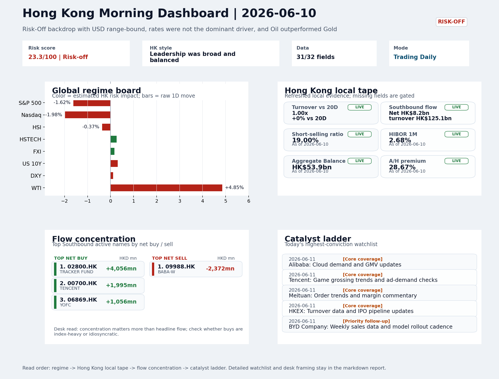
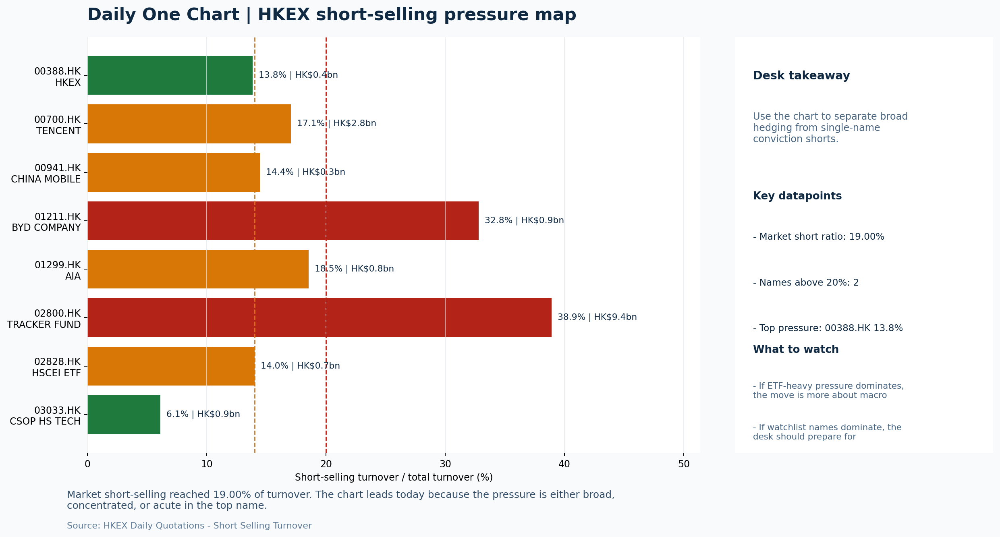

# Morning Research Workbench | 2026-06-11

> Designed for a Hong Kong sell-side commute: Layer 1 `Scan`, Layer 2 `Deep Read`, Layer 3 `Thinking`
> Mode: `Trading Daily` | Keep the report execution-oriented: what mattered in the completed session, what can move Hong Kong leadership, and what needs fast follow-up.
> Briefing date: `2026-06-11` | Review date: `2026-06-10` | Global request: `2026-06-10` | HK/China request: `2026-06-10` | Market effective date: `2026-06-10` | Generated at: `2026-06-11 08:25:08`

## Executive Summary

- **Market pulse:** Overnight risk-off was partly offset by Hong Kong's relative resilience and southbound support, but elevated short-selling at 19% leaves any rebound contingent on clean breadth confirmation.
- **Hong Kong lens:** Hong Kong growth / internet led. Expect a cautious open that tests HSTECH resilience. A credible recovery needs FXI and breadth confirmation; without it, defensive positioning and tight stops remain appropriate.
- **Top catalysts:** VIX +11.83%; INTC -6.33%.

## Visual Dashboard

## Layer 1 | Scan (5-10 min)

### 1.1 One-Line Market Pulse
Overnight risk-off was partly offset by Hong Kong's relative resilience and southbound support, but elevated short-selling at 19% leaves any rebound contingent on clean breadth confirmation.

### 1.2 Global Asset Price Dashboard

| Asset | Last | 1D move | Read |
| --- | --- | --- | --- |
| S&P 500 | 7,266.99 | **-1.62%** | US large-cap risk appetite |
| Nasdaq 100 | 28,508.03 | **-1.98%** | Growth and duration leadership |
| Hang Seng Index | 24,565.90 | -0.37% | Hong Kong broad beta |
| Hang Seng TECH | 4.6760 | +0.26% | Hong Kong growth / platform read-through |
| CSI 300 | 4,801.81 | **+1.87%** | Mainland large-cap tone |
| US 10Y | 4.5420 | +0.31% | Global discount-rate anchor |
| China 10Y | 1.75% | +1.0bp | China local rates anchor \| Live public \| Eastmoney \| 2026-06-10 |
| CN-US 10Y spread | -280.2bp | -1.0bp | Relative carry and macro-pressure gauge \| Live public \| Eastmoney \| 2026-06-10 |
| DXY | 100.02 | +0.11% | Dollar liquidity impulse |
| USD/CNH | 6.7795 | +0.06% | Offshore China risk appetite |
| USD/HKD | 7.8373 | +0.02% | Linked-exchange regime stress check |
| Brent crude | 95.22 | **+4.12%** | Energy / geopolitics |
| COMEX gold | 4,072.60 | **-4.40%** | Hedge demand / real yields |
| Copper | 6.1985 | **-1.65%** | Global growth proxy |
| VIX | 22.22 | **+11.83%** | US stress barometer |

### 1.3 Hong Kong Key Data Quick Check

| Check | Value | Status | Source / as of | Why it matters |
| --- | --- | --- | --- | --- |
| Main Board turnover vs 20D | 1.00x \| +0% vs 20D | Live local | HKEX \| 2026-06-10 | Trailing 20-session average turnover was HK$319.6bn. |
| Southbound / Northbound net flow | Southbound Net HK$8.2bn \| turnover HK$125.1bn \| Northbound Turnover HK$349.9bn \| net not reported | Live local | HKEX Connect \| 2026-06-10 | Southbound net buy is calculated from HKEX disclosed buy and sell turnover. |
| Short-selling ratio | 19.00% | Live local | HKEX \| 2026-06-10 | Official HKEX stock-level short-selling table, aggregated as a share of total market turnover. |
| AH premium index | 28.67% | Live public | Yahoo \| 2026-06-10 | Simple average across 18 A/H pairs; use dispersion rather than the average alone. |
| USD/HKD spot vs band | 7.8373 \| band 7.7500 to 7.8500 | Live quote + local | Yahoo \| 2026-06-10 | Inside the linked-exchange band without immediate boundary stress. Official Convertibility Undertakings define the linked-rate stress boundaries for USD/HKD. |
| HIBOR 1M | 2.68% | Live local | HKMA \| 2026-06-10 | 1M HIBOR is the cleanest quick read for Hong Kong funding conditions and equity-duration pressure. |
| Aggregate Balance | HK$53.9bn | Live local | HKMA \| 2026-06-10 | Aggregate Balance helps frame whether linked-rate liquidity conditions are tight or comfortable. |
| Hong Kong leadership | Hong Kong growth / internet led | Proxy | HSI / HSCEI / HSTECH relative perf \| 2026-06-10 | Use HSI / HSCEI / HSTECH relative moves as the opening style read. |

### 1.4 Risk Dashboard
**Composite risk score:** `23.3/100` | **Regime:** `Risk-off`

| Component | Score impact | Evidence |
| --- | --- | --- |
| US beta | -9.7 | S&P 500 -1.62% |
| HK growth | +1.3 | HSTECH +0.26% |
| Offshore China proxy | +0.9 | FXI +0.17% |
| Dollar pressure | -1.1 | DXY +0.11% |
| Volatility | -10 | VIX +11.83% |
| HK short-selling | -8 | Short-selling ratio 19.00% |

### 1.5 Morning Checklist
1. **VIX +11.83%**
 High-frequency data | Higher volatility argues for tighter sizing and tighter stops.
2. **INTC -6.33%**
 Mover attribution | Announcement / expectations | Guidance reset and margin pressure
3. **Risk-Off backdrop with USD range-bound, rates were not the dominant driver, and Oil outperformed Gold**
 Overnight regime | Start by deciding whether the day is about Risk-Off conditions or a style pivot.
4. **CPI MoM (Released)**
 Macro / policy | Rates expectations, the dollar, and growth-equity valuation | Industries: Technology, Internet, Brokers
5. **Trade Balance (Released)**
 Macro / policy | Watch whether it changes the day's core market narrative | Industries: Market-wide

## Layer 2 | Deep Read (20-30 min)

### 2.1 Overnight Overseas Market Review
#### Market Setup
**Core tape.** Overnight markets operated under a confirmed Risk-Off regime, with VIX surging +11.83% to 22.22 and Nasdaq 100 leading declines at -1.98%.
**Main driver.** The most notable cross-asset divergence was Oil (+4.85%) versus Gold (-4.4%), a 7.5pct spread suggesting geopolitical risk premia shifted into energy rather than classic safe havens.
**HK relevance.** Hong Kong held relatively better, with HSTECH +0.26% and FXI +0.17% showing some insulation, but elevated local short-selling at 19% means any rebounds need clean breadth confirmation before being treated as durable.

#### Key Drivers
- VIX spike to 22.22 confirms Risk-Off regime is active; higher volatility argues for tighter sizing and tighter stops.
- Intel's guidance reset (-6.33%) was the top mover, weighing on semiconductor names and US growth style.
- Oil outperformed Gold by 7.5pct, suggesting geopolitical risk premium is channeling into energy rather than classic safe havens.
- US growth-style transmission: Nasdaq -1.98% creates a test for Hong Kong tech and internet names at the open.

#### Hong Kong Read-Through
**Desk lens.** Leadership was broad and balanced.
**Opening implication.** Expect a cautious open that tests HSTECH resilience. A credible recovery needs FXI and breadth confirmation; without it, defensive positioning and tight stops remain appropriate.
- **Cross-market read:** Hang Seng -0.37% / HSCEI -0.20% / HSTECH +0.26%.
- **Cross-market read:** Offshore China proxy FXI +0.17% and USD/CNH +0.06% frame cross-border risk appetite.
- **Cross-market read:** USD/HKD last traded around 7.8373, which keeps the Hong Kong funding lens in focus.

#### Watch Points
- USD composite moved higher by +0.11pct intraday, with a 0.357pct range.
- Main turning points appeared around 2026-06-10 08:10 trough / 2026-06-10 08:30 peak / 2026-06-10 08:45 peak, suggesting event-driven repricing.
- The biggest cross-asset divergence was Oil versus Gold, a spread of 7.505pct.
- Gold moved -3.34pct intraday with a 4.377pct high-low range.

**Curated overnight stories**
1. **VIX +11.83% - Elevated volatility**
 Why it matters: Surging VIX confirms Risk-Off regime is active. Higher volatility argues for tighter sizing and tighter stops across Hong Kong-exposed positions.
 HK read-through: Most relevant for risk-sensitive Hong Kong equities, especially growth and internet names. Volatility spike typically pressures HSI derivatives and increases intraday.
2. **INTC -6.33% - Guidance reset and margin pressure**
 Why it matters: Intel's sharp decline reflects a guidance reset and margin pressure, dragging semiconductor sentiment globally. This is the top mover attribution for the session (score 108).
 HK read-through: Directly relevant for Hong Kong-listed tech hardware, semiconductor names, and related supply chain stocks.
3. **CPI MoM (Released) - Inflation data adds uncertainty**
 Why it matters: Released CPI data affects rates expectations, the dollar, and growth-equity valuation. The outcome shapes whether Fed rate path remains a tailwind or becomes a headwind.
 HK read-through: Relevant for Technology, Internet, and Brokers sectors in Hong Kong. Inflation surprise could shift USD direction and affect offshore China sentiment and H-share valuation.
4. **Risk-Off backdrop with USD range-bound, rates not dominant driver**
 Why it matters: The overnight regime is Risk-Off. When rates are not the dominant driver, equity sentiment and macro surprises carry more weight for positioning.
 HK read-through: Signals a day where Hong Kong equities should be managed defensively. Range-bound USD limits currency escape valve, making local equity price discovery more sensitive.
5. **BYD predicts 80% of China car sales will soon be electric**
 Why it matters: BYD's EV forecast signals continued structural shift in China auto. Accelerating EV penetration has implications for energy, materials, and supply chain sectors across Hong.
 HK read-through: Relevant for EV supply chain names and energy transition plays. Could support HK-listed EV-related sentiment but may compete for capital against defensive sectors in.

### 2.2 Hong Kong / A-share Previous-Day Review
#### Local Tape Setup
**Local read.** Hong Kong displayed style divergence with HSTECH +0.26% outperforming HSCEI -0.2% and HSI -0.37%, despite the overnight Risk-Off signal from US growth selling (Nasdaq -1.98%).
**Verification point.** Southbound flows supported the market, with net buying of HK$8.2bn concentrated in Tracker Fund (+HK$4.06bn) and Tencent (+HK$1.99bn), while short-selling remained elevated at 19% of turnover.
**Risk to watch.** Confirmation from CCASS positioning is incomplete, but the local tape suggests buyers absorbed the overseas shock in growth names.

#### Style and Local Leadership
**Style leadership.** Hong Kong growth / internet led.
- **Cross-market read:** Hang Seng -0.37% / HSCEI -0.20% / HSTECH +0.26%.
- **Cross-market read:** Offshore China proxy FXI +0.17% and USD/CNH +0.06% frame cross-border risk appetite.
- **Cross-market read:** USD/HKD last traded around 7.8373, which keeps the Hong Kong funding lens in focus.

#### Flow Confirmation
Official Stock Connect evidence is available; use Section 2.3 to confirm whether local money supports the price action.

#### Follow-Through Checklist
**Follow-through check.** Confirm follow-through if HSTECH maintains its gain relative to HSI/HSCEI in the next session, short-selling ratio retreats below 16%, and Southbound net buying continues in Tracker Fund and Tencent.

### 2.3 Flow Tracker and Attribution
#### Cross-Asset Attribution v1

| Driver | Direction | Score | Evidence | HK implication |
| --- | --- | --- | --- | --- |
| Oil and geopolitics | mixed | 3.3 | Oil moved +4.12%. | Split the read between energy/cyclicals support and margin/geopolitical pressure. |
| Short-selling pressure | drag | 2.8 | HKEX short-selling ratio was 19.00%. | Elevated short activity argues for extra confirmation before chasing rebounds. |
| US growth-style transmission | drag | 2.77 | Nasdaq 100 moved -1.98%. | Hong Kong growth and platform names should be tested first at the open. |
| Global equity beta | drag | 1.62 | S&P 500 moved -1.62%. | Broad beta matters if Hong Kong breadth confirms the overseas signal. |

#### Flow Tracker
##### Flow Takeaways
- Short-selling pressure is elevated, so local rebounds need cleaner breadth and flow confirmation.
- Stock Connect Southbound: net HK$8.2bn on turnover HK$125.1bn (as of 2026-06-10).
- Stock Connect Northbound: turnover RMB349.9bn; public file provides total turnover/top active names, not full net-buy.
- AH premium: simple covered-pair average +28.67%; widest premium: China Communications Construction 71.63%.

##### Stock Connect Southbound Active Names

| Rank | Ticker | Name | Buy | Sell | Net buy |
| --- | --- | --- | --- | --- | --- |
| 5 | 02800.HK | TRACKER FUND | HK$4,066.0mn | HK$9.7mn | HK$4,056.3mn |
| 2 | 09988.HK | BABA-W | HK$1,995.1mn | HK$4,366.9mn | HK$-2,371.8mn |
| 1 | 00700.HK | TENCENT | HK$4,857.7mn | HK$2,862.9mn | HK$1,994.8mn |
| 4 | 06869.HK | YOFC | HK$2,739.1mn | HK$1,682.9mn | HK$1,056.2mn |
| 9 | 00148.HK | KINGBOARD HLDG | HK$1,126.8mn | HK$553.2mn | HK$573.6mn |

##### AH Premium Dispersion

| Name | A ticker | H ticker | Premium | As of |
| --- | --- | --- | --- | --- |
| China Communications Construction | 601800.SS | 1800.HK | +71.63% | 2026-06-10 |
| China Railway | 601390.SS | 0390.HK | +47.18% | 2026-06-10 |
| China Railway Construction | 601186.SS | 1186.HK | +44.81% | 2026-06-10 |
| China Life | 601628.SS | 2628.HK | +42.09% | 2026-06-10 |
| China Construction Bank | 601939.SS | 0939.HK | +38.72% | 2026-06-10 |

##### HKEX Short-Selling Watch

| Ticker | Name | Short ratio | Short turnover | Total turnover |
| --- | --- | --- | --- | --- |
| 00388.HK | HKEX | 13.84% | HK$0.4bn | HK$2.6bn |
| 00700.HK | TENCENT | 17.05% | HK$2.8bn | HK$16.6bn |
| 00941.HK | CHINA MOBILE | 14.44% | HK$0.3bn | HK$2.1bn |
| 01211.HK | BYD COMPANY | 32.81% | HK$0.9bn | HK$2.9bn |
| 01299.HK | AIA | 18.54% | HK$0.8bn | HK$4.3bn |

- **Short-value leaders:** 02800.HK TRACKER FUND (HK$9.4bn); 07709.HK XL2CSOPHYNIX (HK$4.8bn); 00700.HK TENCENT (HK$2.8bn); 07747.HK XL2CSOPSMSN (HK$2.0bn).

### 2.4 Macro and Policy Tracking
**Desk read.** Risk-Off conditions are established with the VIX spiking 11.8% to 22.22, while USD remains range-bound and rates are not the dominant driver.

**Market sensitivity.** Oil outperformed Gold (+4.85% vs -4.4%), which may signal geopolitical premium re-entering markets or demand-repair narrative holding.

**HK implication.** The completed macro calendar delivers a mixed signal: US CPI came in hot at 0.3% (vs 0.2% forecast), which reprices Fed rate-cut expectations and pressures duration assets.

**Macro watchpoints**
- US CPI hot print (0.3%) - watch whether it extends USD strength and reprices Hong Kong dollar peg pressure.
- VIX at 22.22 (+11.8%) - elevated volatility requires tighter position sizing and stop discipline.
- Oil vs Gold divergence - confirm whether geopolitical premium or demand repair is driving the commodity split.
- US Retail Sales (20:30) - weak print would confirm risk-off and extend growth-proxy underperformance in Hong Kong.

| Time | Region | Event | Status | Desk read |
| --- | --- | --- | --- | --- |
| 20:30 | US | CPI MoM | Released | Impact: Rates expectations, the dollar, and growth-equity valuation \| Attention: 5/5 \| Industries: Technology, Internet, Brokers |
| 09:30 | China | Trade Balance | Released | Impact: Watch whether it changes the day's core market narrative \| Attention: 3/5 \| Industries: Market-wide |
| 20:30 | US | Retail Sales MoM | Upcoming | Impact: Consumer resilience, growth expectations, and risk-asset pricing \| Attention: 5/5 \| Industries: Consumer, E-commerce, Consumer discretionary |
| 09:20 | China | Loan Prime Rate | Upcoming | Impact: Watch whether it changes the day's core market narrative \| Attention: 3/5 \| Industries: Market-wide |
| 22:00 | Federal Reserve | Jerome Powell: Economic outlook remarks | Central bank | Impact: Policy path, liquidity conditions, and cross-asset risk appetite \| Attention: 5/5 \| Industries: Technology, Financials, Gold |
| 10:00 | PBOC | Open Market Operations Desk: Daily liquidity operation window | Central bank | Impact: Policy path, liquidity conditions, and cross-asset risk appetite \| Attention: 3/5 \| Industries: Technology, Financials, Gold |

#### Positioning and Risk Backdrop
- Options activity centered on KWEB Call, with Vol/OI at 1.88x and a bullish bias.
- Put/Call structure shows equity 0.68 / index 1.15, implying Single-stock optimism with index hedging.
- Geopolitics: Middle East | Regional tension remains elevated | Impact: Oil, freight costs, and safe-haven demand
- Geopolitics: US-China | Technology export-control rhetoric remains active | Impact: China internet, semiconductors, and supply chains

### 2.5 Key Company and Sector Events

| Grade | Sector | Headline | Why it matters | Horizon |
| --- | --- | --- | --- | --- |
| B | China Internet | China poaches more AI talent from the U.S. | Assess whether the story can propagate through the China Internet value | Monitor |

#### HKEX Announcements

| Grade | Ticker | Type | Release time | Title |
| --- | --- | --- | --- | --- |
| A | 00064.HK | Profit warning | 2026-06-10 | Profit warning / alert announcement |
| A | 00590.HK | Profit warning | 2026-06-10 | Profit warning / alert announcement |
| A | 00607.HK | Profit warning | 2026-06-10 | Profit warning / alert announcement |
| A | 00658.HK | Profit warning | 2026-06-10 | Profit warning / alert announcement |
| A | 02663.HK | Profit warning | 2026-06-10 | Profit warning / alert announcement |
| A | 06182.HK | Profit warning | 2026-06-10 | Profit warning / alert announcement |
| A | 08275.HK | Profit warning | 2026-06-10 | Profit warning / alert announcement |
| A | 08319.HK | Profit warning | 2026-06-10 | Profit warning / alert announcement |

#### Earnings / Results Watch

| Ticker | Company | Timing | Expectation framing |
| --- | --- | --- | --- |
| 0700.HK | Tencent Holdings | After Market Close | EPS est. 4.15 HKD \| revenue est. 163.2bn HKD |
| 0388.HK | Hong Kong Exchanges and Clearing | Before Market Open | EPS est. 2.81 HKD \| revenue est. 6.0bn HKD |

#### Rating Changes
- **9988.HK** | Morgan Stanley | Upgrade | Equal Weight -> Overweight | PT 92 -> 105

#### IPO Watch
- IPO and grey-market monitoring is not yet part of the standard production pack.

### 2.6 Today's Core Names
#### Core coverage

| Name | Ticker | Last | 1D | Range position | Morning note |
| --- | --- | --- | --- | --- | --- |
| Alibaba | 9988.HK | 113.50 | -2.97% | Bottom of range | Short-term pressure is visible; check for a fundamental or regulatory reason. |
| Tencent | 0700.HK | 465.60 | +2.74% | Mid-range | Short-term price strength is clear; fresh catalysts could trigger broader group follow-through. |

**Recent headlines for Tencent:**
- [Tencent Weighs US Military Label With Big Dual Currency AI Funding](https://finance.yahoo.com/markets/stocks/articles/tencent-weighs-us-military-label-140610371.html) (Simply Wall St.)

#### Priority follow-up

| Name | Ticker | Last | 1D | Range position | Morning note |
| --- | --- | --- | --- | --- | --- |
| BYD Company | 1211.HK | 86.19 | -2.04% | Bottom of range | Short-term pressure is visible; check for a fundamental or regulatory reason. |
| AIA | 1299.HK | 70.25 | -1.06% | Bottom of range | The name sits near the bottom of its recent range and is worth monitoring for a catalyst-led reversal. |

## Layer 3 | Thinking (10-15 min)

### 3.1 Rotating Theme Deep Dive

| Field | Read |
| --- | --- |
| Theme | China Exports and Supply-Chain Relocation |
| Angle for the day | Track tariffs, trade policy, shipping, and manufacturing orders to see whether export resilience is still the cleaner China macro expression. |

**Theme desk read**
**Core thesis.** The rotation into China-exposed and export resilience coordinates still warrants attention after the overnight risk-off session saw VIX jump 11.8% while oil strongly outperformed gold.
**Evidence.** China's trade balance print exceeded expectations, reinforcing the view that external demand remains the cleaner China macro expression.
**What to test.** The key tension is whether resilient export data can overcome elevated volatility and drive positioning, or whether the current signal mix merely prepares a watchlist for the next catalyst window.

**Signals to keep in mind**
- VIX +11.83%: Higher volatility argues for tighter sizing and tighter stops.
- WTI crude +4.85%: A strong crude move needs to be split between geopolitics and demand repair.

**LLM watch items:**
- BYD weekly sales data today: verify whether EV export momentum holds despite the stock's 2% decline to range lows.
- Crude +4.85%: monitor whether the rally triggers shipping-cost concerns that could compress manufacturing margins.
- China Mobile's capex/dividend update: if the dividend signal reinforces yield-hunt flows, it could sap demand for export-beta names.
- US retail sales tonight: a disappointment would weaken the demand-side pillar of the export resilience narrative.

**Related names to keep close:**

| Name | Ticker | Bucket | Morning read |
| --- | --- | --- | --- |
| BYD Company | 1211.HK | Priority follow-up | Short-term pressure is visible; check for a fundamental or regulatory reason. |
| China Mobile | 0941.HK | Priority follow-up | The name sits near the top of its recent range, so watch for profit-taking under high expectations. |

**Upcoming catalysts tied to the theme:**
- 2026-06-11 | BYD Company: Weekly sales data and model rollout cadence | Hong Kong-listed proxy for EV volumes, export mix, and price competition
- 2026-06-11 | China Mobile: Capex updates and dividend policy signals | Defensive SOE benchmark for yield trade and domestic digital-infrastructure spend

### 3.2 Today Ahead and Trading Calendar
- Macro: CPI MoM is the first item to anchor the open and the rates/FX response.
- Corporate / event: Alibaba: Cloud demand and GMV updates is the cleanest same-day catalyst to prepare for.

**Same-day macro docket**

| Time | Country | Event | Status | Detail |
| --- | --- | --- | --- | --- |
| 20:30 | US | CPI MoM | Released | Actual 0.3% / Forecast 0.2% / Prior 0.4% |
| 09:30 | China | Trade Balance | Released | Actual USD 85.2bn / Forecast USD 79.0bn / Prior USD 80.6bn |
| 20:30 | US | Retail Sales MoM | Upcoming | Forecast 0.3% / Prior 0.6% |
| 09:20 | China | Loan Prime Rate | Upcoming | Forecast 3.45% / Prior 3.45% |
| 22:00 | Federal Reserve | Jerome Powell: Economic outlook remarks | Central bank | speech |

**Same-day catalyst list**

| Date | Time | Category | Event | Importance |
| --- | --- | --- | --- | --- |
| 2026-06-11 | | Core coverage | Alibaba: Cloud demand and GMV updates | 3 |
| 2026-06-11 | | Core coverage | Tencent: Game grossing trends and ad-demand checks | 3 |
| 2026-06-11 | | Core coverage | Meituan: Order trends and margin commentary | 3 |
| 2026-06-11 | | Core coverage | HKEX: Turnover data and IPO pipeline updates | 3 |

**Next few sessions**

| Date | Category | Event | Impact |
| --- | --- | --- | --- |
| 2026-06-11 | Core coverage | Alibaba: Cloud demand and GMV updates | Key read-through for China consumption, cloud, and platform regulation |
| 2026-06-11 | Core coverage | Tencent: Game grossing trends and ad-demand checks | Core offshore China platform proxy for gaming, ads, and AI monetization |
| 2026-06-11 | Core coverage | Meituan: Order trends and margin commentary | High-frequency read on local services demand and platform competition |
| 2026-06-11 | Core coverage | HKEX: Turnover data and IPO pipeline updates | Direct proxy for Hong Kong market turnover, listings, and southbound |

### 3.3 Daily One Chart
**Daily One Chart | HKEX short-selling pressure map**

**Chart read.** Market short-selling reached 19.00% of turnover.
**Why it matters.** The chart leads today because the pressure is either broad, concentrated, or acute in the top name.

_Source: HKEX Daily Quotations - Short Selling Turnover_

## Traceable Appendix

### Report Metadata
> Date policy: Review date 2026-06-10 is treated as `Trading Daily`. | Global request date is 2026-06-10; adapter effective date is 2026-06-10 and summary date is 2026-06-10. | HK/China local data date is 2026-06-10; role: same-session local cash tape.
> Market data quality: Coverage: `31/32` | Missing: `1`
> Report quality: `88.7/100` | Grade `B` | Status `production ready`

### Key Questions to Keep in Mind
- Is risk appetite rising or fading? The overnight tape reads closer to `Risk-Off`.
- Did rates expectations move? Focus on whether US 10Y, DXY, and growth style moved together.
- Were commodities the real story? Watch WTI and gold for geopolitics versus inflation signals.
- Is Hong Kong setup internet-led, SOE-led, or broad beta-led? Compare HSTECH, HSCEI, and HSI.
- Did offshore markets move China risk appetite? Focus on HSI, FXI, USD/CNH, and USD/HKD.

### Report Quality and Validation
- **Quality score:** 88.7/100 | **Grade:** B | **Status:** production ready
- **Run summary:** 7 healthy | 1 caveat | 0 failed
- **Release recommendation:** Send with caveats | The report is usable, but the advisory guidance should travel with it so readers understand the data gaps.

| Source | Status | Bucket |
| --- | --- | --- |
| Market data | ok | healthy |
| Sector and company news | ok | healthy |
| Movers and short selling | ok | healthy |
| Stock Connect | ok | healthy |
| A/H premium | ok | healthy |
| Hong Kong local package | ok | healthy |
| China rates | ok | healthy |
| Narrative overlay | partial | caveat |

**Desk-use guidance summary:** 0 blocking | 1 advisory

**Desk-use guidance**
- **Advisory:** Use deterministic sections as primary support; the narrative overlay was partial or unavailable on this run.

| Component | Score | Weight | Read |
| --- | --- | --- | --- |
| Market data coverage | 96.9 | 0.3 | 31/32 core market fields available. |
| Hong Kong local metrics | 82.3 | 0.25 | 8 live, 3 proxy, 0 unavailable local checks. |
| Key public adapters | 100.0 | 0.2 | 4/4 key adapters were available or partially available. |
| Narrative overlay health | 60.0 | 0.15 | 3/7 narrative overlay tasks succeeded or used validated cache; 1 error(s). |
| Fact-check guardrail | 100.0 | 0.1 | Checked 0 numeric claims; 0 numeric mismatch(es), 0 logic warning(s); 0 critical, 0 review. |

**Narrative fact-check guardrail**
- Checked 0 numeric claims; 0 numeric mismatch(es), 0 logic warning(s); 0 critical, 0 review.

**Adapter status**

| Adapter | Status |
| --- | --- |
| Stock Connect | ok |
| A/H premium | ok |
| HKEX announcements | ok |
| China rates | ok |

### Source Links
- [China poaches more AI talent from the U.S. as it eyes the next 'super-app'](https://www.cnbc.com/2026/06/05/china-may-move-toward-us-path-on-ai-as-firms-poach-employees.html) (cnbc_markets)
- [Tencent Weighs US Military Label With Big Dual Currency AI Funding](https://finance.yahoo.com/markets/stocks/articles/tencent-weighs-us-military-label-140610371.html) (Simply Wall St.)
- [Meituan Logs Another Loss Amid Food-Delivery Price War](https://www.wsj.com/business/earnings/meituan-logs-another-loss-amid-food-delivery-price-war-fef4c703?siteid=yhoof2&yptr=yahoo) (The Wall Street Journal)
- [00064.HK Profit warning / alert announcement](http://www1.hkexnews.hk/listedco/listconews/sehk/2026/0610/2026061000934.pdf) (HKEXnews)
- [00590.HK Profit warning / alert announcement](http://www1.hkexnews.hk/listedco/listconews/sehk/2026/0610/2026061000640.pdf) (HKEXnews)
- [00607.HK Profit warning / alert announcement](http://www1.hkexnews.hk/listedco/listconews/sehk/2026/0610/2026061001113.pdf) (HKEXnews)
- [00658.HK Profit warning / alert announcement](http://www1.hkexnews.hk/listedco/listconews/sehk/2026/0610/2026061001087.pdf) (HKEXnews)
- [02663.HK Profit warning / alert announcement](http://www1.hkexnews.hk/listedco/listconews/sehk/2026/0610/2026061000664.pdf) (HKEXnews)
- [06182.HK Profit warning / alert announcement](http://www1.hkexnews.hk/listedco/listconews/sehk/2026/0610/2026061000892.pdf) (HKEXnews)
- [08275.HK Profit warning / alert announcement](http://www1.hkexnews.hk/listedco/listconews/gem/2026/0610/2026061001444.pdf) (HKEXnews)
- [08319.HK Profit warning / alert announcement](http://www1.hkexnews.hk/listedco/listconews/gem/2026/0610/2026061001458.pdf) (HKEXnews)

## Supplementary Visual Appendix

This appendix is professional-path only. It keeps a traceable index of the report visuals and the deterministic chart cues used to frame the morning note, without injecting the legacy intraday chart pack.

### Visual Index

| Visual | Path | Role |
| --- | --- | --- |
| Visual Dashboard | `charts/dashboard_2026-06-11.png` | Cross-asset regime board and Hong Kong local tape snapshot. |
| Daily One Chart | `charts/daily_one_chart_2026-06-11.png` | Single highest-conviction visual story for the day. |

### Deterministic Chart Cues
- FX / liquidity: USD composite moved higher by +0.11pct intraday, with a 0.357pct range.
- FX / liquidity: Main turning points appeared around 2026-06-10 08:10 trough / 2026-06-10 08:30 peak / 2026-06-10 08:45 peak, suggesting event-driven repricing rather than a clean one-way USD move.
- Cross-asset: The biggest cross-asset divergence was Oil versus Gold, a spread of 7.505pct.
- Cross-asset: Gold moved -3.34pct intraday with a 4.377pct high-low range.
- Cross-asset: Oil moved +4.17pct intraday with a 6.77pct high-low range.
- Cross-asset: Bitcoin moved -0.49pct intraday with a 3.035pct high-low range.

### Risk Dashboard Components

| Component | Score impact | Evidence |
| --- | --- | --- |
| US beta | -9.7 | S&P 500 -1.62% |
| HK growth | +1.3 | HSTECH +0.26% |
| Offshore China proxy | +0.9 | FXI +0.17% |
| Dollar pressure | -1.1 | DXY +0.11% |
| Volatility | -10 | VIX +11.83% |
| HK short-selling | -8 | Short-selling ratio 19.00% |
