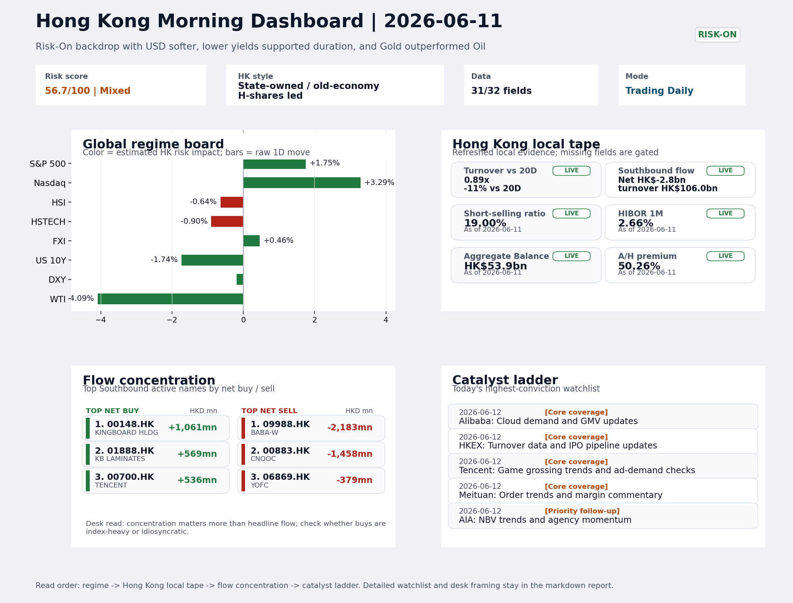
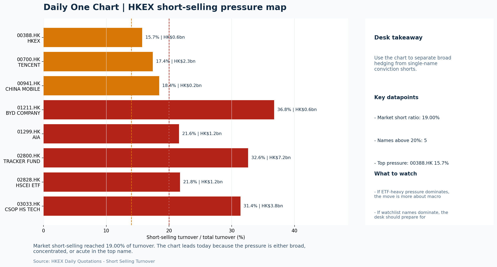

# Morning Research Workbench | 2026-06-12

> Designed for a Hong Kong sell-side commute: Layer 1 `Scan`, Layer 2 `Deep Read`, Layer 3 `Thinking`
> Mode: `Trading Daily` | Keep the report execution-oriented: what mattered in the completed session, what can move Hong Kong leadership, and what needs fast follow-up.
> Briefing date: `2026-06-12` | Review date: `2026-06-11` | Global request: `2026-06-11` | HK/China request: `2026-06-11` | Market effective date: `2026-06-11` | Generated at: `2026-06-12 08:23:53`

## Executive Summary

- **Market pulse:** Softer USD and lower overnight yields offer a constructive macro handoff, but Hong Kong's thin turnover and unchanged local leadership make today's open a conditional test rather.
- **Hong Kong lens:** Hong Kong growth / internet led. Softer USD and lower yields are structurally constructive for HK risk assets, but the Nasdaq-led US growth signal needs HSTECH and FXI to confirm rather than diverge before.
- **Top catalysts:** VIX -12.51%; INTC -6.33%.

## Visual Dashboard

## Layer 1 | Scan (5-10 min)

### 1.1 One-Line Market Pulse
Softer USD and lower overnight yields offer a constructive macro handoff, but Hong Kong's thin turnover and unchanged local leadership make today's open a conditional test rather than a clean risk-on continuation.

### 1.2 Global Asset Price Dashboard

| Asset | Last | 1D move | Read |
| --- | --- | --- | --- |
| S&P 500 | 7,394.30 | **+1.75%** | US large-cap risk appetite |
| Nasdaq 100 | 29,446.18 | **+3.29%** | Growth and duration leadership |
| Hang Seng Index | 24,407.96 | -0.64% | Hong Kong broad beta |
| Hang Seng TECH | 4.6340 | -0.90% | Hong Kong growth / platform read-through |
| CSI 300 | 4,748.59 | -1.11% | Mainland large-cap tone |
| US 10Y | 4.4630 | **-1.74%** | Global discount-rate anchor |
| China 10Y | 1.75% | -0.0bp | China local rates anchor \| Live public \| Eastmoney \| 2026-06-11 |
| CN-US 10Y spread | -270.2bp | +10.0bp | Relative carry and macro-pressure gauge \| Live public \| Eastmoney \| 2026-06-11 |
| DXY | 99.76 | -0.19% | Dollar liquidity impulse |
| USD/CNH | 6.7695 | -0.13% | Offshore China risk appetite |
| USD/HKD | 7.8355 | -0.02% | Linked-exchange regime stress check |
| Brent crude | 89.08 | **-4.32%** | Energy / geopolitics |
| COMEX gold | 4,238.50 | **+3.17%** | Hedge demand / real yields |
| Copper | 6.3905 | **+2.26%** | Global growth proxy |
| VIX | 19.44 | **-12.51%** | US stress barometer |

### 1.3 Hong Kong Key Data Quick Check

| Check | Value | Status | Source / as of | Why it matters |
| --- | --- | --- | --- | --- |
| Main Board turnover vs 20D | 0.89x \| -11% vs 20D | Live local | HKEX \| 2026-06-11 | Trailing 20-session average turnover was HK$322.5bn. |
| Southbound / Northbound net flow | Southbound Net HK$-2.8bn \| turnover HK$106.0bn \| Northbound Turnover HK$339.3bn \| net not reported | Live local | HKEX Connect \| 2026-06-11 | Southbound net buy is calculated from HKEX disclosed buy and sell turnover. |
| Short-selling ratio | 19.00% | Live local | HKEX \| 2026-06-11 | Official HKEX stock-level short-selling table, aggregated as a share of total market turnover. |
| AH premium index | 50.26% | Live public | Yahoo \| 2026-06-11 | Simple average across 19 A/H pairs; use dispersion rather than the average alone. |
| USD/HKD spot vs band | 7.8355 \| band 7.7500 to 7.8500 | Live quote + local | Yahoo \| 2026-06-11 | Inside the linked-exchange band without immediate boundary stress. Official Convertibility Undertakings define the linked-rate stress boundaries for USD/HKD. |
| HIBOR 1M | 2.66% | Live local | HKMA \| 2026-06-11 | 1M HIBOR is the cleanest quick read for Hong Kong funding conditions and equity-duration pressure. |
| Aggregate Balance | HK$53.9bn | Live local | HKMA \| 2026-06-11 | Aggregate Balance helps frame whether linked-rate liquidity conditions are tight or comfortable. |
| Hong Kong leadership | Hong Kong growth / internet led | Proxy | HSI / HSCEI / HSTECH relative perf \| 2026-06-11 | Use HSI / HSCEI / HSTECH relative moves as the opening style read. |

### 1.4 Risk Dashboard
**Composite risk score:** `56.7/100` | **Regime:** `Mixed`

| Component | Score impact | Evidence |
| --- | --- | --- |
| US beta | +10 | S&P 500 +1.75% |
| HK growth | -4.5 | HSTECH -0.90% |
| Offshore China proxy | +2.3 | FXI +0.46% |
| Dollar pressure | +1.9 | DXY -0.19% |
| Volatility | +10 | VIX -12.51% |
| HK short-selling | -8 | Short-selling ratio 19.00% |

### 1.5 Morning Checklist
1. **VIX -12.51%**
 High-frequency data | Lower volatility signals easing stress in the tape.
2. **INTC -6.33%**
 Mover attribution | Announcement / expectations | Guidance reset and margin pressure
3. **Risk-On backdrop with USD softer, lower yields supported duration, and Gold outperformed Oil**
 Overnight regime | Start by deciding whether the day is about Risk-On conditions or a style pivot.
4. **CPI MoM (Released)**
 Macro / policy | Rates expectations, the dollar, and growth-equity valuation | Industries: Technology, Internet, Brokers
5. **Trade Balance (Released)**
 Macro / policy | Watch whether it changes the day's core market narrative | Industries: Market-wide

## Layer 2 | Deep Read (20-30 min)

### 2.1 Overnight Overseas Market Review
#### Market Setup
**Core tape.** Overnight overseas session saw a Risk-On rotation that was selectively bullish rather than uniformly supportive.
**Main driver.** The Nasdaq 100 outperformed (+3.29%) as lower US yields (-1.74% on the 10Y) eased duration pressure on growth and tech, while VIX compressed sharply (-12.51%) to signal stress reduction in the tape.
**HK relevance.** However, the S&P 500 (+1.75%) lagged the Nasdaq and Euro Stoxx 50 actually declined (-0.66%), pointing to a leadership narrowness dominated by US growth style rather than broad global beta.

#### Key Drivers
- Nasdaq 100 surged +3.29% as falling US 10Y yields (-1.74%) reduced equity-duration pressure, specifically supporting tech and growth-style.
- VIX dropped -12.51% to 19.44, indicating broad stress reduction in risk appetite and improved liquidity conditions for EM.
- USD composite weakened (DXY -0.19%, USD/CNH -0.13%).
- Intel guided lower on margin pressure (-6.33%), reinforcing semiconductor sector stress with direct read-through risk to HK-listed chip.

#### Hong Kong Read-Through
**Desk lens.** State-owned / old-economy H-shares led.
**Opening implication.** Softer USD and lower yields are structurally constructive for HK risk assets.
- **Cross-market read:** Hang Seng -0.64% / HSCEI -0.07% / HSTECH -0.90%.
- **Cross-market read:** Offshore China proxy FXI +0.46% and USD/CNH -0.13% frame cross-border risk appetite.
- **Cross-market read:** USD/HKD last traded around 7.8355, which keeps the Hong Kong funding lens in focus.

#### Watch Points
- USD composite moved lower by -0.25pct intraday, with a 0.453pct range.
- Main turning points appeared around 2026-06-11 08:05 trough / 2026-06-11 08:20 trough / 2026-06-11 08:35 peak, suggesting event-driven repricing.
- The biggest cross-asset divergence was Gold versus Oil, a spread of 9.966pct.
- Gold moved +3.58pct intraday with a 4.46pct high-low range.

**Curated overnight stories**
1. **Intel down 6.33% on guidance reset and margin pressure**
 Why it matters: Another major earnings reset from a leading chip designer reinforces ongoing semiconductor sector stress.
 HK read-through: Direct read-through to HK-listed semiconductor names (e.g., SMIC, Hua Hong). Could pull down tech-hardware and chip-related sentiment on Thursday.
2. **Risk-On backdrop with USD softer, lower yields, Gold outperformed Oil**
 Why it matters: The regime shift to Risk-On reduces dollar funding pressure and improves liquidity conditions for EM and offshore-China assets.
 HK read-through: Broadly positive for HK equity market. Supports RMB stability and improves risk appetite for H-share and tech leadership.
3. **SpaceX raising $75 billion in record-setting IPO, Nasdaq debut imminent**
 Why it matters: Largest-ever IPO by a private company. Sets a new benchmark for tech unicorn valuations and may influence investor appetite for mega-cap tech listings globally.
 HK read-through: Limited direct impact on HK-listed names but affects global tech sentiment and the narrative around high-profile tech debuts.
4. **Gold slumps to 6-month low even as inflation fears rise**
 Why it matters: Despite persistent inflation concerns, gold is underperforming. Suggests real yields rising or safe-haven demand rotating elsewhere, which could redirect capital flows.
 HK read-through: Relevant for HK-listed gold miners and precious-metals plays. A weaker gold price may weigh on those names near-term.
5. **KKR says AI productivity boom to continue but warns of 'extreme' 19th-century-style**
 Why it matters: Validates the AI-capex secular theme but flags uneven distribution of gains. Suggests concentration risk in AI leaders versus laggards widening.
 HK read-through: Supports long-term bullish framing for HK tech leaders with AI exposure (e.g., Alibaba, Tencent, Meituan). Warns against broad-based tech optimism without selectivity.

### 2.2 Hong Kong / A-share Previous-Day Review
#### Local Tape Setup
**Local read.** Overnight risk-on was driven by US growth-style transmission, yet the local Hong Kong session on 11 June showed HSTECH down -0.9% while HSCEI was nearly flat (-0.07%), with Main Board turnover at 0.89x the 20-day.
**Verification point.** Southbound net outflows of HK$2.8bn and weak ETF volume proxies further argue that local flow did not validate the overnight signal.
**Risk to watch.** For the recovery to gain credibility, HSTECH needs to lead HSCEI and Southbound must turn net buyer.

#### Style and Local Leadership
**Style leadership.** Hong Kong growth / internet led.
- **Cross-market read:** Hang Seng -0.64% / HSCEI -0.07% / HSTECH -0.90%.
- **Cross-market read:** Offshore China proxy FXI +0.46% and USD/CNH -0.13% frame cross-border risk appetite.
- **Cross-market read:** USD/HKD last traded around 7.8355, which keeps the Hong Kong funding lens in focus.

#### Flow Confirmation
Official Stock Connect evidence is available; use Section 2.3 to confirm whether local money supports the price action.

#### Follow-Through Checklist
**Follow-through check.** Watch whether HSTECH opens positive and outperforms HSCEI on 12 June; also monitor Southbound net buy and whether CSI 300 technology/growth names confirm the same style read.

### 2.3 Flow Tracker and Attribution
#### Cross-Asset Attribution v1

| Driver | Direction | Score | Evidence | HK implication |
| --- | --- | --- | --- | --- |
| US growth-style transmission | supportive | 4.61 | Nasdaq 100 moved +3.29%. | Hong Kong growth and platform names should be tested first at the open. |
| Oil and geopolitics | supportive | 3.46 | Oil moved -4.32%. | Split the read between energy/cyclicals support and margin/geopolitical pressure. |
| Short-selling pressure | drag | 2.8 | HKEX short-selling ratio was 19.00%. | Elevated short activity argues for extra confirmation before chasing rebounds. |
| Rates impulse | supportive | 2.09 | US 10Y yield proxy moved -1.74%. | Lower yields help long-duration growth; higher yields pressure valuation-sensitive |
| Global equity beta | supportive | 1.75 | S&P 500 moved +1.75%. | Broad beta matters if Hong Kong breadth confirms the overseas signal. |
| Hong Kong participation | drag | 1.05 | Main Board turnover was 0.89x the 20-session average. | Thin turnover makes index moves easier to fade. |

#### Flow Tracker
##### Flow Takeaways
- Short-selling pressure is elevated, so local rebounds need cleaner breadth and flow confirmation.
- Stock Connect Southbound: net HK$-2.8bn on turnover HK$106.0bn (as of 2026-06-11).
- Stock Connect Northbound: turnover RMB339.3bn; public file provides total turnover/top active names, not full net-buy.
- AH premium: simple covered-pair average +50.26%; widest premium: Zijin Mining 209.69%.

##### Stock Connect Southbound Active Names

| Rank | Ticker | Name | Buy | Sell | Net buy |
| --- | --- | --- | --- | --- | --- |
| 1 | 09988.HK | BABA-W | HK$3,371.8mn | HK$5,554.7mn | HK$-2,182.9mn |
| 4 | 00883.HK | CNOOC | HK$929.9mn | HK$2,388.1mn | HK$-1,458.3mn |
| 5 | 00148.HK | KINGBOARD HLDG | HK$1,997.6mn | HK$936.1mn | HK$1,061.5mn |
| 8 | 01888.HK | KB LAMINATES | HK$1,466.1mn | HK$896.8mn | HK$569.2mn |
| 2 | 00700.HK | TENCENT | HK$2,873.2mn | HK$2,336.8mn | HK$536.5mn |

##### AH Premium Dispersion

| Name | A ticker | H ticker | Premium | As of |
| --- | --- | --- | --- | --- |
| Zijin Mining | 601899.SS | 2899.HK | +209.69% | 2026-06-11 |
| CITIC Securities | 600030.SS | 6030.HK | +199.63% | 2026-06-11 |
| China Communications Construction | 601800.SS | 1800.HK | +76.35% | 2026-06-11 |
| China Railway | 601390.SS | 0390.HK | +47.01% | 2026-06-11 |
| China Railway Construction | 601186.SS | 1186.HK | +45.71% | 2026-06-11 |

##### HKEX Short-Selling Watch

| Ticker | Name | Short ratio | Short turnover | Total turnover |
| --- | --- | --- | --- | --- |
| 00388.HK | HKEX | 15.72% | HK$0.6bn | HK$3.8bn |
| 00700.HK | TENCENT | 17.43% | HK$2.3bn | HK$13.2bn |
| 00941.HK | CHINA MOBILE | 18.43% | HK$0.2bn | HK$1.1bn |
| 01211.HK | BYD COMPANY | 36.76% | HK$0.6bn | HK$1.8bn |
| 01299.HK | AIA | 21.60% | HK$1.2bn | HK$5.7bn |

- **Short-value leaders:** 02800.HK TRACKER FUND (HK$7.2bn); 03033.HK CSOP HS TECH (HK$3.8bn); 07709.HK XL2CSOPHYNIX (HK$3.6bn); 00700.HK TENCENT (HK$2.3bn).

### 2.4 Macro and Policy Tracking
**Desk read.** The completed session reflected a Risk-On backdrop with USD softer and lower yields supporting duration, while Gold outperformed Oil - a combination that historically favors risk appetite.

**Market sensitivity.** The high-frequency tape shows a sharp VIX decline (-12.5%) indicating stress reduction, yet the macro calendar for tomorrow (2026-06-12) introduces a key repricing risk: US CPI MoM printed hot at 0.3% versus the 0.2% forecast.

**HK implication.** A hotter-than-expected inflation print would pressure duration assets, lift US yields, and support the dollar - creating potential headwind for rate-sensitive Hong Kong sectors (Technology, Internet, Brokers).

**Macro watchpoints**
- DXY and USD/HKD direction after the hot CPI print reprices rate expectations.
- 10-year US Treasury yield response - key for duration-sensitive HK tech/internet sectors.
- Whether VIX holds below 20 or reverses if Powell language surprises hawkishly.
- China trade surplus strength and whether it changes the day's core narrative for HK/China equities.

| Time | Region | Event | Status | Desk read |
| --- | --- | --- | --- | --- |
| 20:30 | US | CPI MoM | Released | Impact: Rates expectations, the dollar, and growth-equity valuation \| Attention: 5/5 \| Industries: Technology, Internet, Brokers |
| 09:30 | China | Trade Balance | Released | Impact: Watch whether it changes the day's core market narrative \| Attention: 3/5 \| Industries: Market-wide |
| 20:30 | US | Retail Sales MoM | Upcoming | Impact: Consumer resilience, growth expectations, and risk-asset pricing \| Attention: 5/5 \| Industries: Consumer, E-commerce, Consumer discretionary |
| 09:20 | China | Loan Prime Rate | Upcoming | Impact: Watch whether it changes the day's core market narrative \| Attention: 3/5 \| Industries: Market-wide |
| 22:00 | Federal Reserve | Jerome Powell: Economic outlook remarks | Central bank | Impact: Policy path, liquidity conditions, and cross-asset risk appetite \| Attention: 5/5 \| Industries: Technology, Financials, Gold |
| 10:00 | PBOC | Open Market Operations Desk: Daily liquidity operation window | Central bank | Impact: Policy path, liquidity conditions, and cross-asset risk appetite \| Attention: 3/5 \| Industries: Technology, Financials, Gold |

#### Positioning and Risk Backdrop
- Options activity centered on KWEB Call, with Vol/OI at 1.88x and a bullish bias.
- Put/Call structure shows equity 0.68 / index 1.15, implying Single-stock optimism with index hedging.
- Geopolitics: Middle East | Regional tension remains elevated | Impact: Oil, freight costs, and safe-haven demand
- Geopolitics: US-China | Technology export-control rhetoric remains active | Impact: China internet, semiconductors, and supply chains

### 2.5 Key Company and Sector Events
No high-conviction sector story cleared the main-report relevance gate for this run.

#### HKEX Announcements

| Grade | Ticker | Type | Release time | Title |
| --- | --- | --- | --- | --- |
| A | 00018.HK | Profit warning | 2026-06-11 | Profit warning / alert announcement |
| A | 00150.HK | Profit warning | 2026-06-11 | Profit warning / alert announcement |
| A | 00287.HK | Profit warning | 2026-06-11 | Profit warning / alert announcement |
| A | 01783.HK | Profit warning | 2026-06-11 | Profit warning / alert announcement |
| A | 02245.HK | Profit warning | 2026-06-11 | Profit warning / alert announcement |
| A | 03683.HK | Profit warning | 2026-06-11 | Profit warning / alert announcement |
| A | 08028.HK | Profit warning | 2026-06-11 | Profit warning / alert announcement |
| A | 08320.HK | Profit warning | 2026-06-11 | Profit warning / alert announcement |

#### Earnings / Results Watch

| Ticker | Company | Timing | Expectation framing |
| --- | --- | --- | --- |
| 0700.HK | Tencent Holdings | After Market Close | EPS est. 4.15 HKD \| revenue est. 163.2bn HKD |
| 0388.HK | Hong Kong Exchanges and Clearing | Before Market Open | EPS est. 2.81 HKD \| revenue est. 6.0bn HKD |

#### Rating Changes
- **9988.HK** | Morgan Stanley | Upgrade | Equal Weight -> Overweight | PT 92 -> 105

#### IPO Watch
- IPO and grey-market monitoring is not yet part of the standard production pack.

### 2.6 Today's Core Names
#### Core coverage

| Name | Ticker | Last | 1D | Range position | Morning note |
| --- | --- | --- | --- | --- | --- |
| Alibaba | 9988.HK | 107.40 | -5.37% | Bottom of range | Short-term pressure is visible; check for a fundamental or regulatory reason. |
| HKEX | 0388.HK | 374.00 | -2.35% | Bottom of range | Short-term pressure is visible; check for a fundamental or regulatory reason. |

**Recent headlines for Alibaba:**
- [3 Juggernaut IPOs: Did Investors Get Rich or Not?](https://finance.yahoo.com/markets/stocks/articles/3-juggernaut-ipos-did-investors-225900644.html) (Zacks)

#### Priority follow-up

| Name | Ticker | Last | 1D | Range position | Morning note |
| --- | --- | --- | --- | --- | --- |
| AIA | 1299.HK | 73.75 | +4.98% | Bottom of range | Short-term price strength is clear; fresh catalysts could trigger broader group follow-through. |
| BYD Company | 1211.HK | 84.95 | -1.44% | Bottom of range | The name sits near the bottom of its recent range and is worth monitoring for a catalyst-led reversal. |

## Layer 3 | Thinking (10-15 min)

### 3.1 Rotating Theme Deep Dive

| Field | Read |
| --- | --- |
| Theme | Hong Kong Market Structure and Flows |
| Angle for the day | Focus on turnover, Stock Connect, ETF flows, HKEX activity, and style leadership to understand whether Hong Kong is being driven by fundamentals or positioning. |

**Theme desk read**
**Core thesis.** The Hong Kong Market Structure and Flows theme deserves attention because the session's Risk-On backdrop - softer USD, lower yields, gold outperforming oil - has not translated into strength in key Hong Kong proxies.
**Evidence.** HKEX closed at the bottom of its range despite easing volatility, and BYD sits similarly pressured ahead of near-term data points.
**What to test.** This suggests that positioning or local sentiment, rather than broad macro conditions, is currently shaping the tape.

**Signals to keep in mind**
- VIX -12.51%: Lower volatility signals easing stress in the tape.
- WTI crude -4.09%: Softer oil argues for a more cautious cyclical-growth read.

**LLM watch items:**
- HKEX: Turnover data and IPO pipeline updates due 2026-06-12 to gauge southbound interest and listing momentum.
- Tracker Fund of Hong Kong: Index-turnover shifts and passive flow direction as a clean broad-market proxy.
- BYD Company: Weekly sales figures expected 2026-06-12 to confirm whether the name can reverse from the bottom of its range.
- Hang Seng TECH ETF: AI narrative shifts and China platform regulation headlines to monitor growth leadership.

**Related names to keep close:**

| Name | Ticker | Bucket | Morning read |
| --- | --- | --- | --- |
| HKEX | 0388.HK | Core coverage | Short-term pressure is visible; check for a fundamental or regulatory reason. |
| BYD Company | 1211.HK | Priority follow-up | The name sits near the bottom of its recent range and is worth monitoring for a catalyst-led reversal. |

**Upcoming catalysts tied to the theme:**
- 2026-06-12 | HKEX: Turnover data and IPO pipeline updates | Direct proxy for Hong Kong market turnover, listings, and southbound interest
- 2026-06-12 | BYD Company: Weekly sales data and model rollout cadence | Hong Kong-listed proxy for EV volumes, export mix, and price competition
- 2026-06-12 | Hang Seng TECH ETF: AI narrative shifts and China platform regulation headlines | Fast proxy for Hong Kong internet and growth leadership
- 2026-06-12 | Tracker Fund of Hong Kong: Index-turnover shifts and ETF flows | Clean listed proxy for broad HSI positioning and passive flows

### 3.2 Today Ahead and Trading Calendar
- Macro: CPI MoM is the first item to anchor the open and the rates/FX response.
- Corporate / event: Alibaba: Cloud demand and GMV updates is the cleanest same-day catalyst to prepare for.

**Same-day macro docket**

| Time | Country | Event | Status | Detail |
| --- | --- | --- | --- | --- |
| 20:30 | US | CPI MoM | Released | Actual 0.3% / Forecast 0.2% / Prior 0.4% |
| 09:30 | China | Trade Balance | Released | Actual USD 85.2bn / Forecast USD 79.0bn / Prior USD 80.6bn |
| 20:30 | US | Retail Sales MoM | Upcoming | Forecast 0.3% / Prior 0.6% |
| 09:20 | China | Loan Prime Rate | Upcoming | Forecast 3.45% / Prior 3.45% |
| 22:00 | Federal Reserve | Jerome Powell: Economic outlook remarks | Central bank | speech |

**Same-day catalyst list**

| Date | Time | Category | Event | Importance |
| --- | --- | --- | --- | --- |
| 2026-06-12 | | Core coverage | Alibaba: Cloud demand and GMV updates | 3 |
| 2026-06-12 | | Core coverage | HKEX: Turnover data and IPO pipeline updates | 3 |
| 2026-06-12 | | Core coverage | Tencent: Game grossing trends and ad-demand checks | 3 |
| 2026-06-12 | | Core coverage | Meituan: Order trends and margin commentary | 3 |

**Next few sessions**

| Date | Category | Event | Impact |
| --- | --- | --- | --- |
| 2026-06-12 | Core coverage | Alibaba: Cloud demand and GMV updates | Key read-through for China consumption, cloud, and platform regulation |
| 2026-06-12 | Core coverage | HKEX: Turnover data and IPO pipeline updates | Direct proxy for Hong Kong market turnover, listings, and southbound |
| 2026-06-12 | Core coverage | Tencent: Game grossing trends and ad-demand checks | Core offshore China platform proxy for gaming, ads, and AI monetization |
| 2026-06-12 | Core coverage | Meituan: Order trends and margin commentary | High-frequency read on local services demand and platform competition |

### 3.3 Daily One Chart
**Daily One Chart | HKEX short-selling pressure map**

**Chart read.** Market short-selling reached 19.00% of turnover.
**Why it matters.** The chart leads today because the pressure is either broad, concentrated, or acute in the top name.

_Source: HKEX Daily Quotations - Short Selling Turnover_

## Traceable Appendix

### Report Metadata
> Date policy: Review date 2026-06-11 is treated as `Trading Daily`. | Global request date is 2026-06-11; adapter effective date is 2026-06-11 and summary date is 2026-06-11. | HK/China local data date is 2026-06-11; role: same-session local cash tape.
> Market data quality: Coverage: `31/32` | Missing: `1`
> Report quality: `88.7/100` | Grade `B` | Status `production ready`

### Key Questions to Keep in Mind
- Is risk appetite rising or fading? The overnight tape reads closer to `Risk-On`.
- Did rates expectations move? Focus on whether US 10Y, DXY, and growth style moved together.
- Were commodities the real story? Watch WTI and gold for geopolitics versus inflation signals.
- Is Hong Kong setup internet-led, SOE-led, or broad beta-led? Compare HSTECH, HSCEI, and HSI.
- Did offshore markets move China risk appetite? Focus on HSI, FXI, USD/CNH, and USD/HKD.

### Report Quality and Validation
- **Quality score:** 88.7/100 | **Grade:** B | **Status:** production ready
- **Run summary:** 7 healthy | 1 caveat | 0 failed
- **Release recommendation:** Send with caveats | The report is usable, but the advisory guidance should travel with it so readers understand the data gaps.

| Source | Status | Bucket |
| --- | --- | --- |
| Market data | ok | healthy |
| Sector and company news | ok | healthy |
| Movers and short selling | ok | healthy |
| Stock Connect | ok | healthy |
| A/H premium | ok | healthy |
| Hong Kong local package | ok | healthy |
| China rates | ok | healthy |
| Narrative overlay | partial | caveat |

**Desk-use guidance summary:** 0 blocking | 1 advisory

**Desk-use guidance**
- **Advisory:** Use deterministic sections as primary support; the narrative overlay was partial or unavailable on this run.

| Component | Score | Weight | Read |
| --- | --- | --- | --- |
| Market data coverage | 96.9 | 0.3 | 31/32 core market fields available. |
| Hong Kong local metrics | 82.3 | 0.25 | 8 live, 3 proxy, 0 unavailable local checks. |
| Key public adapters | 100.0 | 0.2 | 4/4 key adapters were available or partially available. |
| Narrative overlay health | 60.0 | 0.15 | 3/7 narrative overlay tasks succeeded or used validated cache; 1 error(s). |
| Fact-check guardrail | 100.0 | 0.1 | Checked 4 numeric claims; 0 numeric mismatch(es), 0 logic warning(s); 0 critical, 0 review. |

**Narrative fact-check guardrail**
- Checked 4 numeric claims; 0 numeric mismatch(es), 0 logic warning(s); 0 critical, 0 review.

**Adapter status**

| Adapter | Status |
| --- | --- |
| Stock Connect | ok |
| A/H premium | ok |
| HKEX announcements | ok |
| China rates | ok |

### Source Links
- [3 Juggernaut IPOs: Did Investors Get Rich or Not?](https://finance.yahoo.com/markets/stocks/articles/3-juggernaut-ipos-did-investors-225900644.html) (Zacks)
- [Tencent Cloud AI Push And BAPE Deal Test Long Term Investment Case](https://finance.yahoo.com/markets/stocks/articles/tencent-cloud-ai-push-bape-171236289.html) (Simply Wall St.)
- [Meituan Logs Another Loss Amid Food-Delivery Price War](https://www.wsj.com/business/earnings/meituan-logs-another-loss-amid-food-delivery-price-war-fef4c703?siteid=yhoof2&yptr=yahoo) (The Wall Street Journal)
- [00018.HK Profit warning / alert announcement](http://www1.hkexnews.hk/listedco/listconews/sehk/2026/0611/2026061100815.pdf) (HKEXnews)
- [00150.HK Profit warning / alert announcement](http://www1.hkexnews.hk/listedco/listconews/sehk/2026/0611/2026061101463.pdf) (HKEXnews)
- [00287.HK Profit warning / alert announcement](http://www1.hkexnews.hk/listedco/listconews/sehk/2026/0611/2026061100687.pdf) (HKEXnews)
- [01783.HK Profit warning / alert announcement](http://www1.hkexnews.hk/listedco/listconews/sehk/2026/0611/2026061101295.pdf) (HKEXnews)
- [02245.HK Profit warning / alert announcement](http://www1.hkexnews.hk/listedco/listconews/sehk/2026/0611/2026061100384.pdf) (HKEXnews)
- [03683.HK Profit warning / alert announcement](http://www1.hkexnews.hk/listedco/listconews/sehk/2026/0611/2026061100460.pdf) (HKEXnews)
- [08028.HK Profit warning / alert announcement](http://www1.hkexnews.hk/listedco/listconews/gem/2026/0611/2026061100994.pdf) (HKEXnews)
- [08320.HK Profit warning / alert announcement](http://www1.hkexnews.hk/listedco/listconews/gem/2026/0611/2026061101459.pdf) (HKEXnews)

## Supplementary Visual Appendix

This appendix is professional-path only. It keeps a traceable index of the report visuals and the deterministic chart cues used to frame the morning note, without injecting the legacy intraday chart pack.

### Visual Index

| Visual | Path | Role |
| --- | --- | --- |
| Visual Dashboard | `charts/dashboard_2026-06-12.png` | Cross-asset regime board and Hong Kong local tape snapshot. |
| Daily One Chart | `charts/daily_one_chart_2026-06-12.png` | Single highest-conviction visual story for the day. |

### Deterministic Chart Cues
- FX / liquidity: USD composite moved lower by -0.25pct intraday, with a 0.453pct range.
- FX / liquidity: Main turning points appeared around 2026-06-11 08:05 trough / 2026-06-11 08:20 trough / 2026-06-11 08:35 peak, suggesting event-driven repricing rather than a clean one-way USD move.
- Cross-asset: The biggest cross-asset divergence was Gold versus Oil, a spread of 9.966pct.
- Cross-asset: Gold moved +3.58pct intraday with a 4.46pct high-low range.
- Cross-asset: Oil moved -6.38pct intraday with a 7.212pct high-low range.
- Cross-asset: Bitcoin moved +3.05pct intraday with a 3.537pct high-low range.

### Risk Dashboard Components

| Component | Score impact | Evidence |
| --- | --- | --- |
| US beta | +10 | S&P 500 +1.75% |
| HK growth | -4.5 | HSTECH -0.90% |
| Offshore China proxy | +2.3 | FXI +0.46% |
| Dollar pressure | +1.9 | DXY -0.19% |
| Volatility | +10 | VIX -12.51% |
| HK short-selling | -8 | Short-selling ratio 19.00% |
