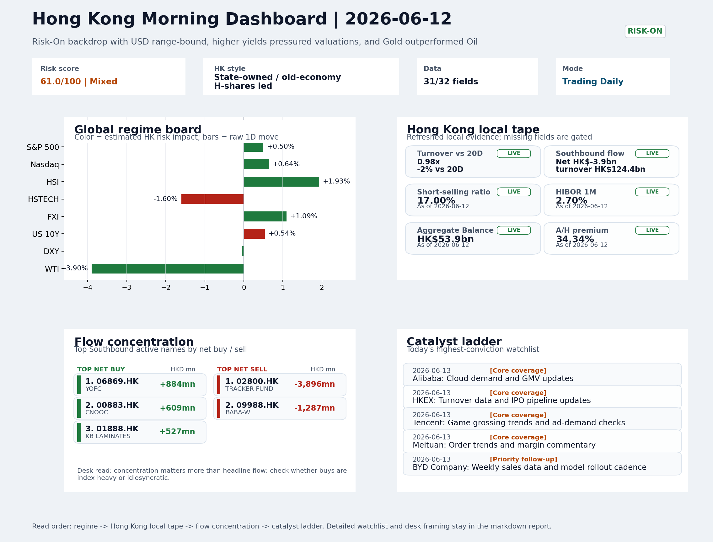

# Morning Research Workbench | 2026-06-13

> Designed for a Hong Kong sell-side commute: Layer 1 `Scan`, Layer 2 `Deep Read`, Layer 3 `Thinking`
> Mode: `Trading Daily` | Keep the report execution-oriented: what mattered in the completed session, what can move Hong Kong leadership, and what needs fast follow-up.
> Briefing date: `2026-06-13` | Review date: `2026-06-12` | Global request: `2026-06-12` | HK/China request: `2026-06-12` | Market effective date: `2026-06-12` | Generated at: `2026-06-13 08:25:35`

## Executive Summary

- **Market pulse:** The overnight Risk-On signal stayed in place but Hong Kong's growth layer lagged sharply, leaving Monday's open contingent on HSTECH stabilization and volume confirmation.
- **Hong Kong lens:** State-owned / old-economy H-shares led. Monday's open is framed as constructive if old-economy leadership holds, but HSTECH's divergence (-1.60%) means a clean Risk-On read for HK growth requires volume confirmation.
- **Top catalysts:** VIX -9.05%; INTC -6.33%.

## Visual Dashboard

## Layer 1 | Scan (5-10 min)

### 1.1 One-Line Market Pulse
The overnight Risk-On signal stayed in place but Hong Kong's growth layer lagged sharply, leaving Monday's open contingent on HSTECH stabilization and volume confirmation above the 20-session average.

### 1.2 Global Asset Price Dashboard

| Asset | Last | 1D move | Read |
| --- | --- | --- | --- |
| S&P 500 | 7,431.46 | +0.50% | US large-cap risk appetite |
| Nasdaq 100 | 29,635.95 | +0.64% | Growth and duration leadership |
| Hang Seng Index | 24,718.10 | **+1.93%** | Hong Kong broad beta |
| Hang Seng TECH | 4.5600 | **-1.60%** | Hong Kong growth / platform read-through |
| CSI 300 | 4,722.41 | -0.55% | Mainland large-cap tone |
| US 10Y | 4.4870 | +0.54% | Global discount-rate anchor |
| China 10Y | 1.74% | -0.5bp | China local rates anchor \| Live public \| Eastmoney \| 2026-06-12 |
| CN-US 10Y spread | -273.7bp | -3.5bp | Relative carry and macro-pressure gauge \| Live public \| Eastmoney \| 2026-06-12 |
| DXY | 99.81 | -0.05% | Dollar liquidity impulse |
| USD/CNH | 6.7220 | -0.69% | Offshore China risk appetite |
| USD/HKD | 7.8345 | -0.01% | Linked-exchange regime stress check |
| Brent crude | 86.71 | **-4.06%** | Energy / geopolitics |
| COMEX gold | 4,239.90 | **+3.66%** | Hedge demand / real yields |
| Copper | 6.4740 | **+3.44%** | Global growth proxy |
| VIX | 17.68 | **-9.05%** | US stress barometer |

### 1.3 Hong Kong Key Data Quick Check

| Check | Value | Status | Source / as of | Why it matters |
| --- | --- | --- | --- | --- |
| Main Board turnover vs 20D | 0.98x \| -2% vs 20D | Live local | HKEX \| 2026-06-12 | Trailing 20-session average turnover was HK$323.0bn. |
| Southbound / Northbound net flow | Southbound Net HK$-3.9bn \| turnover HK$124.4bn \| Northbound Turnover HK$491.0bn \| net not reported | Live local | HKEX Connect \| 2026-06-12 | Southbound net buy is calculated from HKEX disclosed buy and sell turnover. |
| Short-selling ratio | 17.00% | Live local | HKEX \| 2026-06-12 | Official HKEX stock-level short-selling table, aggregated as a share of total market turnover. |
| AH premium index | 34.34% | Live public | Yahoo \| 2026-06-12 | Simple average across 18 A/H pairs; use dispersion rather than the average alone. |
| USD/HKD spot vs band | 7.8345 \| band 7.7500 to 7.8500 | Live quote + local | Yahoo \| 2026-06-12 | Inside the linked-exchange band without immediate boundary stress. Official Convertibility Undertakings define the linked-rate stress boundaries for USD/HKD. |
| HIBOR 1M | 2.70% | Live local | HKMA \| 2026-06-12 | 1M HIBOR is the cleanest quick read for Hong Kong funding conditions and equity-duration pressure. |
| Aggregate Balance | HK$53.9bn | Live local | HKMA \| 2026-06-12 | Aggregate Balance helps frame whether linked-rate liquidity conditions are tight or comfortable. |
| Hong Kong leadership | State-owned / old-economy H-shares led | Proxy | HSI / HSCEI / HSTECH relative perf \| 2026-06-12 | Use HSI / HSCEI / HSTECH relative moves as the opening style read. |

### 1.4 Risk Dashboard
**Composite risk score:** `61.0/100` | **Regime:** `Mixed`

| Component | Score impact | Evidence |
| --- | --- | --- |
| US beta | +3.0 | S&P 500 +0.50% |
| HK growth | -8.0 | HSTECH -1.60% |
| Offshore China proxy | +5.5 | FXI +1.09% |
| Dollar pressure | +0.5 | DXY -0.05% |
| Volatility | +10 | VIX -9.05% |
| HK short-selling | +0 | Short-selling ratio 17.00% |

### 1.5 Morning Checklist
1. **VIX -9.05%**
 High-frequency data | Lower volatility signals easing stress in the tape.
2. **INTC -6.33%**
 Mover attribution | Announcement / expectations | Guidance reset and margin pressure
3. **Risk-On backdrop with USD range-bound, higher yields pressured valuations, and Gold outperformed Oil**
 Overnight regime | Start by deciding whether the day is about Risk-On conditions or a style pivot.
4. **CPI MoM (Released)**
 Macro / policy | Rates expectations, the dollar, and growth-equity valuation | Industries: Technology, Internet, Brokers
5. **Trade Balance (Released)**
 Macro / policy | Watch whether it changes the day's core market narrative | Industries: Market-wide

## Layer 2 | Deep Read (20-30 min)

### 2.1 Overnight Overseas Market Review
#### Market Setup
**Core tape.** Overnight global equities extended Risk-On gains, with Euro Stoxx 50 (+2.16%) leading and S&P 500 (+0.50%) adding modestly as VIX compressed -9.05% to 17.68, signaling broad tape stress easing.
**Main driver.** US 10Y yield rose +0.54%, capping the Nasdaq's upside (+0.64%) and keeping growth/duration names tentative.
**HK relevance.** Offshore China proxies (FXI +1.09%, USD/CNH -0.69%) firmed.

#### Key Drivers
- SpaceX's record $2T Nasdaq IPO anchored institutional growth sentiment and validated risk appetite for large-cap innovation names.
- VIX -9.05% compression confirms Risk-On backdrop; lower volatility reduces options cost and supports positioning into the weekend.
- Oil fell -3.9% to $84.29/bbl, providing a cyclical tailwind (lower input costs) but raising questions about demand-read if copper also.
- US 10Y yield +0.54% to 4.487% kept rate-pressure on valuation-sensitive sectors alive, even as the broader Risk-On tone held.

#### Hong Kong Read-Through
**Desk lens.** State-owned / old-economy H-shares led.
**Opening implication.** Monday's open is framed as constructive if old-economy leadership holds.
- **Cross-market read:** Hang Seng +1.93% / HSCEI +1.91% / HSTECH -1.60%.
- **Cross-market read:** Offshore China proxy FXI +1.09% and USD/CNH -0.69% frame cross-border risk appetite.
- **Cross-market read:** USD/HKD last traded around 7.8345, which keeps the Hong Kong funding lens in focus.

#### Watch Points
- USD composite moved lower by -0.01pct intraday, with a 0.289pct range.
- Main turning points appeared around 2026-06-12 08:10 trough / 2026-06-12 08:25 trough / 2026-06-12 08:40 peak, suggesting event-driven repricing.
- The biggest cross-asset divergence was Gold versus Oil, a spread of 2.824pct.
- Gold moved +0.49pct intraday with a 1.313pct high-low range.

**Curated overnight stories**
1. **SpaceX raising $75 billion in record-setting IPO, targeting $2 trillion market cap on**
 Why it matters: The largest IPO in history anchors global growth-tech sentiment and signals strong institutional risk appetite.
 HK read-through: Positive read-through for HK internet and innovation names. Strong US growth sentiment typically supports offshore-China risk appetite.
2. **VIX declines 9.05%, Risk-On backdrop confirmed with USD range-bound and higher yields**
 Why it matters: Volatility compression confirms easing tape stress. Range-bound USD limits FX headwinds for EM. Higher yields pressuring valuations but the Risk-On tilt is the dominant.
 HK read-through: Supports Hong Kong leadership and growth-oriented positioning. Less flight-to-safety flow helps sentiment. Friday session positioning ahead of weekend.
3. **Intel shares fall 6.33% after guidance reset signals margin pressure**
 Why it matters: Semiconductor sector reset with broad implications for chip industry sentiment. Guidance cut reflects competitive and margin dynamics beyond single-company story.
 HK read-through: Direct read-through to HK-listed semis (SMIC, Hua Hong Semiconductor). May weigh on tech-hardware sentiment but isolated to sector unless broader tape reacts.
4. **Gold slumps to 6-month low even as inflation fears rise, bullion out of favor**
 Why it matters: Contrarian signal: gold weakness despite inflation concerns suggests Risk-On rotation is overriding safe-haven demand. Gold outperformed Oil in the session.
 HK read-through: Mixed for HK gold miners or precious-metals linked names. Commodity sector rotation favors cyclicals over defensive hedges.
5. **KKR says AI productivity boom to keep on going but warns of 'extreme' trend not seen**
 Why it matters: Validates structural AI capex theme from a major institutional investor. 'Extreme' framing suggests uneven benefit distribution - concentration risk in leading players.
 HK read-through: Reinforces Hong Kong and offshore-China AI/internet positioning. Relevant for cloud, platform, and infrastructure names. Supports growth vs. value tilt.

### 2.2 Hong Kong / A-share Previous-Day Review
#### Local Tape Setup
**Local read.** Hong Kong equities posted broad index gains (HSI +1.93%) driven by old-economy and SOE segments, while HSTECH fell 1.60%, marking a clear style divergence.
**Verification point.** Southbound flows were net light (Connect net -HK$3.9bn) with selling concentrated in the Tracker Fund and Alibaba, partially offset by buying in CNOOC and YOFC.
**Risk to watch.** Offshore proxies (FXI +1.09%, USD/CNH -0.69%) held constructive, but the split between HSCEI and HSTECH leaves a mixed read until local follow-through confirms.

#### Style and Local Leadership
**Style leadership.** State-owned / old-economy H-shares led.
- **Cross-market read:** Hang Seng +1.93% / HSCEI +1.91% / HSTECH -1.60%.
- **Cross-market read:** Offshore China proxy FXI +1.09% and USD/CNH -0.69% frame cross-border risk appetite.
- **Cross-market read:** USD/HKD last traded around 7.8345, which keeps the Hong Kong funding lens in focus.

#### Flow Confirmation
Official Stock Connect evidence is available; use Section 2.3 to confirm whether local money supports the price action.

#### Follow-Through Checklist
**Follow-through check.** Watch whether HSTECH stabilises and Southbound net flows turn positive on Monday; failure to do so would flag a persistent growth-defensive rotation that requires a more cautious stance on Hong Kong internet and innovation names.

### 2.3 Flow Tracker and Attribution
#### Cross-Asset Attribution v1

| Driver | Direction | Score | Evidence | HK implication |
| --- | --- | --- | --- | --- |
| Oil and geopolitics | supportive | 3.25 | Oil moved -4.06%. | Split the read between energy/cyclicals support and margin/geopolitical pressure. |
| Dollar / CNH pressure | supportive | 1.03 | DXY -0.05% / USD-CNH -0.69% | A stable or softer CNH makes Hong Kong follow-through more credible. |
| Rates impulse | drag | 0.65 | US 10Y yield proxy moved +0.54%. | Lower yields help long-duration growth; higher yields pressure valuation-sensitive |

#### Flow Tracker
##### Flow Takeaways
- Local flow evidence is not yet strong enough to override the cross-asset setup.
- Stock Connect Southbound: net HK$-3.9bn on turnover HK$124.4bn (as of 2026-06-12).
- Stock Connect Northbound: turnover RMB491.0bn; public file provides total turnover/top active names, not full net-buy.
- AH premium: simple covered-pair average +34.34%; widest premium: Chalco 131.19%.

##### Stock Connect Southbound Active Names

| Rank | Ticker | Name | Buy | Sell | Net buy |
| --- | --- | --- | --- | --- | --- |
| 4 | 02800.HK | TRACKER FUND | HK$2.7mn | HK$3,898.4mn | HK$-3,895.7mn |
| 3 | 09988.HK | BABA-W | HK$1,341.5mn | HK$2,628.3mn | HK$-1,286.8mn |
| 2 | 06869.HK | YOFC | HK$2,752.8mn | HK$1,868.9mn | HK$883.9mn |
| 10 | 00883.HK | CNOOC | HK$1,037.4mn | HK$428.0mn | HK$609.5mn |
| 6 | 01888.HK | KB LAMINATES | HK$1,878.6mn | HK$1,351.7mn | HK$526.9mn |

##### AH Premium Dispersion

| Name | A ticker | H ticker | Premium | As of |
| --- | --- | --- | --- | --- |
| Chalco | 601600.SS | 2600.HK | +131.19% | 2026-06-12 |
| China Communications Construction | 601800.SS | 1800.HK | +74.82% | 2026-06-12 |
| China Railway Construction | 601186.SS | 1186.HK | +47.58% | 2026-06-12 |
| China Railway | 601390.SS | 0390.HK | +46.20% | 2026-06-12 |
| New China Life | 601336.SS | 1336.HK | +38.07% | 2026-06-12 |

##### HKEX Short-Selling Watch

| Ticker | Name | Short ratio | Short turnover | Total turnover |
| --- | --- | --- | --- | --- |
| 00388.HK | HKEX | 12.21% | HK$0.4bn | HK$3.0bn |
| 00700.HK | TENCENT | 16.23% | HK$1.7bn | HK$10.3bn |
| 00941.HK | CHINA MOBILE | 9.60% | HK$0.1bn | HK$1.5bn |
| 01211.HK | BYD COMPANY | 20.68% | HK$0.3bn | HK$1.4bn |
| 01299.HK | AIA | 13.90% | HK$1.0bn | HK$7.5bn |

- **Short-value leaders:** 07709.HK XL2CSOPHYNIX (HK$4.5bn); 02800.HK TRACKER FUND (HK$3.1bn); 07747.HK XL2CSOPSMSN (HK$2.1bn); 03033.HK CSOP HS TECH (HK$1.8bn).

### 2.4 Macro and Policy Tracking
**Desk read.** The completed session shows a Risk-On regime with VIX contracting sharply (-9.05% to 17.68), gold outperforming oil, and copper confirming the bid.

**Market sensitivity.** However, the overnight macro picture on 2026-06-13 introduces repricing risk.

**HK implication.** US CPI came in hot at 0.3% MoM versus the 0.2% forecast, which could pressure duration assets and lift front-end rate expectations if the market interprets it as delaying Fed easing.

**Macro watchpoints**
- DXY and US 2-year yield reaction to the hot CPI print and whether it reprices Fed cut timing.
- US Retail Sales MoM actual versus 0.3% forecast - confirmation or reversal of growth leadership.
- Jerome Powell remarks at 22:00 HKT - hawkish tilt or reaffirmation of current policy path.
- Whether Hang Seng tech proxies hold if real yields rise on CPI surprise.

| Time | Region | Event | Status | Desk read |
| --- | --- | --- | --- | --- |
| 20:30 | US | CPI MoM | Released | Impact: Rates expectations, the dollar, and growth-equity valuation \| Attention: 5/5 \| Industries: Technology, Internet, Brokers |
| 09:30 | China | Trade Balance | Released | Impact: Watch whether it changes the day's core market narrative \| Attention: 3/5 \| Industries: Market-wide |
| 20:30 | US | Retail Sales MoM | Upcoming | Impact: Consumer resilience, growth expectations, and risk-asset pricing \| Attention: 5/5 \| Industries: Consumer, E-commerce, Consumer discretionary |
| 09:20 | China | Loan Prime Rate | Upcoming | Impact: Watch whether it changes the day's core market narrative \| Attention: 3/5 \| Industries: Market-wide |
| 22:00 | Federal Reserve | Jerome Powell: Economic outlook remarks | Central bank | Impact: Policy path, liquidity conditions, and cross-asset risk appetite \| Attention: 5/5 \| Industries: Technology, Financials, Gold |
| 10:00 | PBOC | Open Market Operations Desk: Daily liquidity operation window | Central bank | Impact: Policy path, liquidity conditions, and cross-asset risk appetite \| Attention: 3/5 \| Industries: Technology, Financials, Gold |

#### Positioning and Risk Backdrop
- Options activity centered on KWEB Call, with Vol/OI at 1.88x and a bullish bias.
- Put/Call structure shows equity 0.68 / index 1.15, implying Single-stock optimism with index hedging.
- Geopolitics: Middle East | Regional tension remains elevated | Impact: Oil, freight costs, and safe-haven demand
- Geopolitics: US-China | Technology export-control rhetoric remains active | Impact: China internet, semiconductors, and supply chains

### 2.5 Key Company and Sector Events
No high-conviction sector story cleared the main-report relevance gate for this run.

#### HKEX Announcements

| Grade | Ticker | Type | Release time | Title |
| --- | --- | --- | --- | --- |
| A | 00088.HK | Profit warning | 2026-06-12 | Profit warning / alert announcement |
| A | 00104.HK | Profit warning | 2026-06-12 | Profit warning / alert announcement |
| A | 00186.HK | Profit warning | 2026-06-12 | Profit warning / alert announcement |
| A | 00406.HK | Profit warning | 2026-06-12 | Profit warning / alert announcement |
| A | 01499.HK | Profit warning | 2026-06-12 | Profit warning / alert announcement |
| A | 01647.HK | Profit warning | 2026-06-12 | Profit warning / alert announcement |
| A | 02080.HK | Profit warning | 2026-06-12 | Profit warning / alert announcement |
| A | 02683.HK | Profit warning | 2026-06-12 | Profit warning / alert announcement |

#### Earnings / Results Watch

| Ticker | Company | Timing | Expectation framing |
| --- | --- | --- | --- |
| 0700.HK | Tencent Holdings | After Market Close | EPS est. 4.15 HKD \| revenue est. 163.2bn HKD |
| 0388.HK | Hong Kong Exchanges and Clearing | Before Market Open | EPS est. 2.81 HKD \| revenue est. 6.0bn HKD |

#### Rating Changes
- **9988.HK** | Morgan Stanley | Upgrade | Equal Weight -> Overweight | PT 92 -> 105

#### IPO Watch
- IPO and grey-market monitoring is not yet part of the standard production pack.

### 2.6 Today's Core Names
#### Core coverage

| Name | Ticker | Last | 1D | Range position | Morning note |
| --- | --- | --- | --- | --- | --- |
| Alibaba | 9988.HK | 110.20 | +2.61% | Bottom of range | Short-term price strength is clear; fresh catalysts could trigger broader group follow-through. |
| HKEX | 0388.HK | 380.60 | +1.76% | Bottom of range | The name sits near the bottom of its recent range and is worth monitoring for a catalyst-led reversal. |

**Recent headlines for Alibaba:**
- [BABA Makes $1.5B Play for Pupu Amid Regulatory Scrutiny: What's Ahead?](https://finance.yahoo.com/markets/stocks/articles/baba-makes-1-5b-play-140700553.html) (Zacks)

#### Priority follow-up

| Name | Ticker | Last | 1D | Range position | Morning note |
| --- | --- | --- | --- | --- | --- |
| BYD Company | 1211.HK | 86.55 | +1.88% | Bottom of range | The name sits near the bottom of its recent range and is worth monitoring for a catalyst-led reversal. |
| AIA | 1299.HK | 74.55 | +1.08% | Bottom of range | The name sits near the bottom of its recent range and is worth monitoring for a catalyst-led reversal. |

**Recent headlines for BYD Company:**
- [BYD Balances Stalled Turkey Project With New European Growth Plans](https://finance.yahoo.com/markets/stocks/articles/byd-balances-stalled-turkey-project-201107483.html) (Simply Wall St.)

## Layer 3 | Thinking (10-15 min)

### 3.1 Rotating Theme Deep Dive

| Field | Read |
| --- | --- |
| Theme | AI and Compute Chain |
| Angle for the day | Track whether global AI capex, semis, cloud, and server demand are still carrying offshore China internet and hardware sentiment. |

**Theme desk read**
**Core thesis.** The AI and Compute Chain theme remains in focus as overnight signals show a broad risk-on backdrop, with the VIX down 9.05% and gold, copper, and bitcoin all rising.
**Evidence.** However, the 3.90% drop in WTI crude suggests some caution on cyclical growth, while the hotter-than-expected US CPI (0.3% vs 0.2% forecast) may cap valuation upside for duration-sensitive tech.
**What to test.** Alibaba's $1.5bn bid for Pupu intensifies the instant retail battle with Meituan, keeping competitive dynamics in view, while Tencent's Southeast Asia cloud AI push provides a direct read on enterprise AI monetisation.

**Signals to keep in mind**
- VIX -9.05%: Lower volatility signals easing stress in the tape.
- WTI crude -3.90%: Softer oil argues for a more cautious cyclical-growth read.

**LLM watch items:**
- Alibaba cloud demand and GMV updates (2026-06-13) to confirm AI-driven utilisation and revenue momentum
- Tencent game grossing trends and ad-demand checks (2026-06-13) for AI monetisation signals and platform resilience
- US Retail Sales (MoM, forecast 0.3%) to gauge consumer resilience supporting e-commerce and internet names
- China Loan Prime Rate (forecast 3.45%) for domestic policy support that could lift internet valuations
- Hang Seng TECH ETF as a real-time proxy for whether the AI narrative sustains group leadership

**Related names to keep close:**

| Name | Ticker | Bucket | Morning read |
| --- | --- | --- | --- |
| Alibaba | 9988.HK | Core coverage | Short-term price strength is clear; fresh catalysts could trigger broader group follow-through. |
| Tencent | 0700.HK | Core coverage | Positioning is neutral for now, so use it mainly to monitor marginal information changes. |
| Meituan | 3690.HK | Core coverage | Positioning is neutral for now, so use it mainly to monitor marginal information changes. |
| AIA | 1299.HK | Priority follow-up | The name sits near the bottom of its recent range and is worth monitoring for a catalyst-led reversal. |

**Upcoming catalysts tied to the theme:**
- 2026-06-13 | Alibaba: Cloud demand and GMV updates | Key read-through for China consumption, cloud, and platform regulation
- 2026-06-13 | Tencent: Game grossing trends and ad-demand checks | Core offshore China platform proxy for gaming, ads, and AI monetization
- 2026-06-13 | AIA: NBV trends and agency momentum | Read-through for wealth demand, mainland visitor activity, and HK financial sentiment
- 2026-06-13 | Hang Seng TECH ETF: AI narrative shifts and China platform regulation headlines | Fast proxy for Hong Kong internet and growth leadership

### 3.2 Today Ahead and Trading Calendar
- Macro: CPI MoM is the first item to anchor the open and the rates/FX response.
- Corporate / event: Alibaba: Cloud demand and GMV updates is the cleanest same-day catalyst to prepare for.

**Same-day macro docket**

| Time | Country | Event | Status | Detail |
| --- | --- | --- | --- | --- |
| 20:30 | US | CPI MoM | Released | Actual 0.3% / Forecast 0.2% / Prior 0.4% |
| 09:30 | China | Trade Balance | Released | Actual USD 85.2bn / Forecast USD 79.0bn / Prior USD 80.6bn |
| 20:30 | US | Retail Sales MoM | Upcoming | Forecast 0.3% / Prior 0.6% |
| 09:20 | China | Loan Prime Rate | Upcoming | Forecast 3.45% / Prior 3.45% |
| 22:00 | Federal Reserve | Jerome Powell: Economic outlook remarks | Central bank | speech |

**Same-day catalyst list**

| Date | Time | Category | Event | Importance |
| --- | --- | --- | --- | --- |
| 2026-06-13 | | Core coverage | Alibaba: Cloud demand and GMV updates | 3 |
| 2026-06-13 | | Core coverage | HKEX: Turnover data and IPO pipeline updates | 3 |
| 2026-06-13 | | Core coverage | Tencent: Game grossing trends and ad-demand checks | 3 |
| 2026-06-13 | | Core coverage | Meituan: Order trends and margin commentary | 3 |

**Next few sessions**

| Date | Category | Event | Impact |
| --- | --- | --- | --- |
| 2026-06-13 | Core coverage | Alibaba: Cloud demand and GMV updates | Key read-through for China consumption, cloud, and platform regulation |
| 2026-06-13 | Core coverage | HKEX: Turnover data and IPO pipeline updates | Direct proxy for Hong Kong market turnover, listings, and southbound |
| 2026-06-13 | Core coverage | Tencent: Game grossing trends and ad-demand checks | Core offshore China platform proxy for gaming, ads, and AI monetization |
| 2026-06-13 | Core coverage | Meituan: Order trends and margin commentary | High-frequency read on local services demand and platform competition |

### 3.3 Daily One Chart
**Daily One Chart | HKEX short-selling pressure map**

**Chart read.** Market short-selling reached 17.00% of turnover.
**Why it matters.** The chart leads today because the pressure is either broad, concentrated, or acute in the top name.

_Source: HKEX Daily Quotations - Short Selling Turnover_

## Traceable Appendix

### Report Metadata
> Date policy: Review date 2026-06-12 is treated as `Trading Daily`. | Global request date is 2026-06-12; adapter effective date is 2026-06-12 and summary date is 2026-06-12. | HK/China local data date is 2026-06-12; role: same-session local cash tape.
> Market data quality: Coverage: `31/32` | Missing: `1`
> Report quality: `83.7/100` | Grade `B` | Status `usable with caveats`

### Key Questions to Keep in Mind
- Is risk appetite rising or fading? The overnight tape reads closer to `Risk-On`.
- Did rates expectations move? Focus on whether US 10Y, DXY, and growth style moved together.
- Were commodities the real story? Watch WTI and gold for geopolitics versus inflation signals.
- Is Hong Kong setup internet-led, SOE-led, or broad beta-led? Compare HSTECH, HSCEI, and HSI.
- Did offshore markets move China risk appetite? Focus on HSI, FXI, USD/CNH, and USD/HKD.

### Report Quality and Validation
- **Quality score:** 83.7/100 | **Grade:** B | **Status:** usable with caveats
- **Run summary:** 7 healthy | 1 caveat | 0 failed
- **Release recommendation:** Send with caveats | The report is usable, but the advisory guidance should travel with it so readers understand the data gaps.

| Source | Status | Bucket |
| --- | --- | --- |
| Market data | ok | healthy |
| Sector and company news | ok | healthy |
| Movers and short selling | ok | healthy |
| Stock Connect | ok | healthy |
| A/H premium | ok | healthy |
| Hong Kong local package | ok | healthy |
| China rates | ok | healthy |
| Narrative overlay | partial | caveat |

**Desk-use guidance summary:** 0 blocking | 1 advisory

**Desk-use guidance**
- **Advisory:** Use deterministic sections as primary support; the narrative overlay was partial or unavailable on this run.

| Component | Score | Weight | Read |
| --- | --- | --- | --- |
| Market data coverage | 96.9 | 0.3 | 31/32 core market fields available. |
| Hong Kong local metrics | 82.3 | 0.25 | 8 live, 3 proxy, 0 unavailable local checks. |
| Key public adapters | 100.0 | 0.2 | 4/4 key adapters were available or partially available. |
| Narrative overlay health | 60.0 | 0.15 | 3/7 narrative overlay tasks succeeded or used validated cache; 1 error(s). |
| Fact-check guardrail | 50.0 | 0.1 | Checked 6 numeric claims; 2 numeric mismatch(es), 0 logic warning(s); 2 critical, 0 review. |

**Quality warnings**
- Fact-check guardrail is weak: Checked 6 numeric claims; 2 numeric mismatch(es), 0 logic warning(s); 2 critical, 0 review.
- Narrative fact-check guardrail produced warnings; review the validation table before relying on narrative sections.

**Narrative fact-check guardrail**
- Checked 6 numeric claims; 2 numeric mismatch(es), 0 logic warning(s); 2 critical, 0 review.

| Severity | Field | Claim | Type | Claimed | Expected | Snippet |
| --- | --- | --- | --- | --- | --- | --- |
| critical | tasks.hk_review.paragraph | Hang Seng TECH | change_pct | 1.6 | -1.6 | 3%) driven by old-economy and SOE segments, while HSTECH fell 1.60%, marking a clear style divergence. Southbound flo |
| critical | tasks.theme_deep_dive.paragraph | VIX | change_pct | 9.05 | -9.05 | t signals show a broad risk-on backdrop, with the VIX down 9.05% and gold, copper, and bitcoin all rising, which s |

**Adapter status**

| Adapter | Status |
| --- | --- |
| Stock Connect | ok |
| A/H premium | ok |
| HKEX announcements | ok |
| China rates | ok |

### Source Links
- [BABA Makes $1.5B Play for Pupu Amid Regulatory Scrutiny: What's Ahead?](https://finance.yahoo.com/markets/stocks/articles/baba-makes-1-5b-play-140700553.html) (Zacks)
- [Tencent Cloud AI Push And BAPE Deal Test Long Term Investment Case](https://finance.yahoo.com/markets/stocks/articles/tencent-cloud-ai-push-bape-171236289.html) (Simply Wall St.)
- [Alibaba Bids $1.5 Billion for China Grocer in Meituan Fight](https://finance.yahoo.com/markets/stocks/articles/alibaba-bids-1-5-billion-061524324.html) (Bloomberg)
- [BYD Balances Stalled Turkey Project With New European Growth Plans](https://finance.yahoo.com/markets/stocks/articles/byd-balances-stalled-turkey-project-201107483.html) (Simply Wall St.)
- [00088.HK Profit warning / alert announcement](http://www1.hkexnews.hk/listedco/listconews/sehk/2026/0612/2026061200476.pdf) (HKEXnews)
- [00104.HK Profit warning / alert announcement](http://www1.hkexnews.hk/listedco/listconews/sehk/2026/0612/2026061200872.pdf) (HKEXnews)
- [00186.HK Profit warning / alert announcement](http://www1.hkexnews.hk/listedco/listconews/sehk/2026/0612/2026061200384.pdf) (HKEXnews)
- [00406.HK Profit warning / alert announcement](http://www1.hkexnews.hk/listedco/listconews/sehk/2026/0612/2026061200725.pdf) (HKEXnews)
- [01499.HK Profit warning / alert announcement](http://www1.hkexnews.hk/listedco/listconews/sehk/2026/0612/2026061201162.pdf) (HKEXnews)
- [01647.HK Profit warning / alert announcement](http://www1.hkexnews.hk/listedco/listconews/sehk/2026/0612/2026061201476.pdf) (HKEXnews)
- [02080.HK Profit warning / alert announcement](http://www1.hkexnews.hk/listedco/listconews/sehk/2026/0612/2026061200608.pdf) (HKEXnews)
- [02683.HK Profit warning / alert announcement](http://www1.hkexnews.hk/listedco/listconews/sehk/2026/0612/2026061200798.pdf) (HKEXnews)

## Supplementary Visual Appendix

This appendix is professional-path only. It keeps a traceable index of the report visuals and the deterministic chart cues used to frame the morning note, without injecting the legacy intraday chart pack.

### Visual Index

| Visual | Path | Role |
| --- | --- | --- |
| Visual Dashboard | `charts/dashboard_2026-06-13.png` | Cross-asset regime board and Hong Kong local tape snapshot. |
| Daily One Chart | `charts/daily_one_chart_2026-06-13.png` | Single highest-conviction visual story for the day. |

### Deterministic Chart Cues
- FX / liquidity: USD composite moved lower by -0.01pct intraday, with a 0.289pct range.
- FX / liquidity: Main turning points appeared around 2026-06-12 08:10 trough / 2026-06-12 08:25 trough / 2026-06-12 08:40 peak, suggesting event-driven repricing rather than a clean one-way USD move.
- Cross-asset: The biggest cross-asset divergence was Gold versus Oil, a spread of 2.824pct.
- Cross-asset: Gold moved +0.49pct intraday with a 1.313pct high-low range.
- Cross-asset: Oil moved -2.33pct intraday with a 4.16pct high-low range.
- Cross-asset: Bitcoin moved -0.03pct intraday with a 2.32pct high-low range.

### Risk Dashboard Components

| Component | Score impact | Evidence |
| --- | --- | --- |
| US beta | +3.0 | S&P 500 +0.50% |
| HK growth | -8.0 | HSTECH -1.60% |
| Offshore China proxy | +5.5 | FXI +1.09% |
| Dollar pressure | +0.5 | DXY -0.05% |
| Volatility | +10 | VIX -9.05% |
| HK short-selling | +0 | Short-selling ratio 17.00% |
