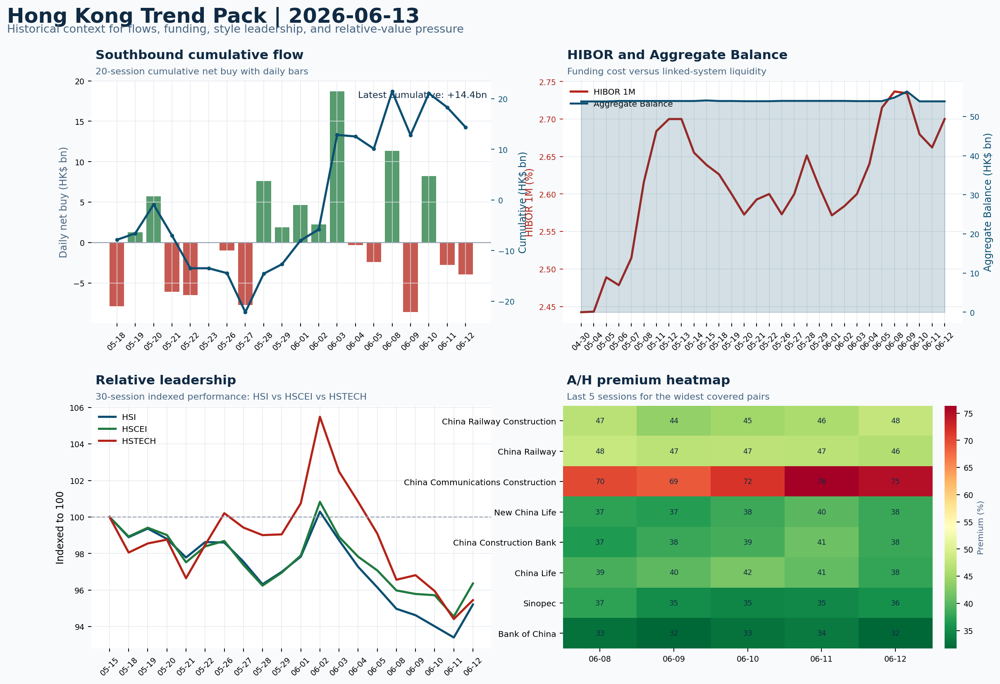

# Morning Research Workbench | 2026-06-14

> Designed for a Hong Kong sell-side commute: Layer 1 `Scan`, Layer 2 `Deep Read`, Layer 3 `Thinking`
> Mode: `Weekly Review` | Use Saturday's non-trading review date to synthesize the completed Hong Kong week and prepare next week's work plan.
> Briefing date: `2026-06-14` | Review date: `2026-06-13` | Global request: `2026-06-13` | HK/China request: `2026-06-12` | Market effective date: `2026-06-12` | Generated at: `2026-06-14 08:17:56`

## Executive Summary

- **Market pulse:** The week confirmed Risk-On with a range-bound dollar and old-economy leadership holding despite benign funding, but the SpaceX IPO's Monday debut and US retail sales data are the key tests.
- **Hong Kong lens:** State-owned / old-economy H-shares led. Monday's open for Hong Kong is likely to see state-owned and old-economy H-shares retain leadership unless the SpaceX IPO narrative triggers a tech rotation.
- **Top catalysts:** VIX -9.05%; Risk-On backdrop with USD range-bound, higher yields pressured valuations, and Gold outperformed Oil.

## Visual Dashboard

## Layer 1 | Weekly Scan (5-10 min)

### 1.1 One-Line Market Pulse
The week confirmed Risk-On with a range-bound dollar and old-economy leadership holding despite benign funding, but the SpaceX IPO's Monday debut and US retail sales data are the key tests for whether this cross-asset setup can attract local flow conviction or remains offshore beta without local follow-through.

### 1.2 Global Asset Price Dashboard

| Asset | Last | 1D move | Read |
| --- | --- | --- | --- |
| S&P 500 | 7,431.46 | +0.50% | US large-cap risk appetite |
| Nasdaq 100 | 29,635.95 | +0.64% | Growth and duration leadership |
| Hang Seng Index | 24,718.10 | **+1.93%** | Hong Kong broad beta |
| Hang Seng TECH | 4.6100 | +1.10% | Hong Kong growth / platform read-through |
| CSI 300 | 4,777.32 | +1.16% | Mainland large-cap tone |
| US 10Y | 4.4870 | +0.54% | Global discount-rate anchor |
| China 10Y | 1.74% | -0.5bp | China local rates anchor \| Live public \| Eastmoney \| 2026-06-12 |
| CN-US 10Y spread | -273.7bp | -3.5bp | Relative carry and macro-pressure gauge \| Live public \| Eastmoney \| 2026-06-12 |
| DXY | 99.75 | -0.11% | Dollar liquidity impulse |
| USD/CNH | 6.7630 | -0.08% | Offshore China risk appetite |
| USD/HKD | 7.8356 | +0.00% | Linked-exchange regime stress check |
| Brent crude | 87.33 | **-3.37%** | Energy / geopolitics |
| COMEX gold | 4,215.00 | **+3.05%** | Hedge demand / real yields |
| Copper | 6.4305 | **+2.74%** | Global growth proxy |
| VIX | 17.68 | **-9.05%** | US stress barometer |

### 1.3 Hong Kong Weekly Tape Quick Check

| Check | Value | Status | Source / as of | Why it matters |
| --- | --- | --- | --- | --- |
| Main Board turnover vs 20D | 0.98x \| -2% vs 20D | Live local | HKEX \| 2026-06-12 | Trailing 20-session average turnover was HK$323.0bn. |
| Southbound / Northbound net flow | Southbound Net HK$-3.9bn \| turnover HK$124.4bn \| Northbound Turnover HK$491.0bn \| net not reported | Live local | HKEX Connect \| 2026-06-12 | Southbound net buy is calculated from HKEX disclosed buy and sell turnover. |
| Short-selling ratio | 17.00% | Live local | HKEX \| 2026-06-12 | Official HKEX stock-level short-selling table, aggregated as a share of total market turnover. |
| AH premium index | 27.10% | Live public | Yahoo \| 2026-06-12 | Simple average across 17 A/H pairs; use dispersion rather than the average alone. |
| USD/HKD spot vs band | 7.8356 \| band 7.7500 to 7.8500 | Live quote + local | Yahoo \| 2026-06-12 | Inside the linked-exchange band without immediate boundary stress. Official Convertibility Undertakings define the linked-rate stress boundaries for USD/HKD. |
| HIBOR 1M | 2.70% | Live local | HKMA \| 2026-06-12 | 1M HIBOR is the cleanest quick read for Hong Kong funding conditions and equity-duration pressure. |
| Aggregate Balance | HK$53.9bn | Live local | HKMA \| 2026-06-12 | Aggregate Balance helps frame whether linked-rate liquidity conditions are tight or comfortable. |
| Hong Kong leadership | State-owned / old-economy H-shares led | Proxy | HSI / HSCEI / HSTECH relative perf \| 2026-06-12 | Use HSI / HSCEI / HSTECH relative moves as the opening style read. |

### 1.4 Risk Dashboard
**Composite risk score:** `75.0/100` | **Regime:** `Risk-on`

| Component | Score impact | Evidence |
| --- | --- | --- |
| US beta | +3.0 | S&P 500 +0.50% |
| HK growth | +5.5 | HSTECH +1.10% |
| Offshore China proxy | +5.5 | FXI +1.09% |
| Dollar pressure | +1.1 | DXY -0.11% |
| Volatility | +10 | VIX -9.05% |
| HK short-selling | +0 | Short-selling ratio 17.00% |

### 1.5 Next Week Checklist
1. **VIX -9.05%**
 High-frequency data | Lower volatility signals easing stress in the tape.
2. **Risk-On backdrop with USD range-bound, higher yields pressured valuations, and Gold outperformed Oil**
 Still-moving markets | No fresh Hong Kong cash session is assumed; use global active assets and policy/event flow to prepare the next open.
3. **CPI MoM (Released)**
 Macro / policy | Rates expectations, the dollar, and growth-equity valuation | Industries: Technology, Internet, Brokers
4. **Trade Balance (Released)**
 Macro / policy | Watch whether it changes the day's core market narrative | Industries: Market-wide
5. **Retail Sales MoM (Upcoming)**
 Macro / policy | Consumer resilience, growth expectations, and risk-asset pricing | Industries: Consumer, E-commerce, Consumer discretionary

## Layer 2 | Deep Read (20-30 min)

### 2.1 Weekly Cross-Asset Review
> Weekly review mode: synthesize the completed Hong Kong week, retain the main cross-asset and policy lessons, and convert them into next-week preparation rather than treating Saturday as a fresh cash-market session.

#### Market Setup
**Core tape.** US equities nudged higher on Friday as a sharp decline in oil prices relieved cost pressures for transport and consumer names.
**Main driver.** European markets rallied strongly, aided by a weaker euro and fading geopolitical premium.
**HK relevance.** The week's pattern - old-economy H-shares outperforming tech - reflects a risk-on backdrop where falling energy costs benefit cyclicals but higher rates pressure growth valuations.

#### Key Drivers
- Oil fell 3.23%, easing input-cost fears and supporting transport and consumer cyclicals.
- US 10-year yield rose 0.54%, pressuring long-duration growth and tech valuations.
- Euro Stoxx 50 gained 2.16%, driven by euro weakness and lower energy costs.

#### Hong Kong Read-Through
**Desk lens.** State-owned / old-economy H-shares led.
**Opening implication.** Monday's open for Hong Kong is likely to see state-owned and old-economy H-shares retain leadership unless the SpaceX IPO narrative triggers a tech rotation; watch southbound flows and HIBOR for local conviction.
- **Cross-market read:** Hang Seng +1.93% / HSCEI +1.91% / HSTECH +1.10%.
- **Cross-market read:** Offshore China proxy FXI +1.09% and USD/CNH -0.08% frame cross-border risk appetite.
- **Cross-market read:** USD/HKD last traded around 7.8356, which keeps the Hong Kong funding lens in focus.

#### Watch Points
- USD composite moved lower by -0.01pct intraday, with a 0.289pct range.
- Main turning points appeared around 2026-06-12 08:10 trough / 2026-06-12 08:25 trough / 2026-06-12 08:40 peak, suggesting event-driven repricing.
- The biggest cross-asset divergence was Gold versus Oil, a spread of 2.114pct.
- Gold moved +0.47pct intraday with a 1.313pct high-low range.

#### Weekly Review Map
- Weekly review window: 2026-06-08 to 2026-06-12. Core regime: Risk-On backdrop with USD range-bound, higher yields pressured valuations, and Gold outperformed Oil. Hong Kong leadership: State-owned / old-economy H-shares led.
- Method note: Trend summary uses the latest available five observations from the Hong Kong Trend Pack inputs.

**Cross-asset weekly dashboard**

| Asset | Latest move | Weekly read |
| --- | --- | --- |
| S&P 500 | +0.50% | Risk appetite |
| Nasdaq 100 | +0.64% | Growth style |
| Hang Seng Index | +1.93% | Hong Kong beta |
| Hang Seng TECH | +1.10% | Hong Kong growth / internet tone |
| DXY | -0.11% | Global liquidity |
| US 10Y | +0.54% | Rates path |
| Gold | +3.05% | Hedge / real yields |
| VIX | -9.05% | Volatility and hedging |

**Hong Kong / China weekly tape**

| Signal | Latest move | Read |
| --- | --- | --- |
| Hang Seng Index | +1.93% | Hong Kong beta |
| HSCEI | +1.91% | China SOE / H-share tone |
| Hang Seng TECH | +1.10% | Hong Kong growth / internet tone |
| China proxy (FXI) | +1.09% | China sentiment |
| USD/CNH | -0.08% | China FX sentiment |
| USD/HKD | +0.00% | Hong Kong funding lens |

**Five-session trend evidence**
_Window: 2026-06-08 to 2026-06-12_

| Signal | Five-session change | Latest | Desk read |
| --- | --- | --- | --- |
| Southbound flow | +4.3bn over 5 sessions | -3.9bn | 2/5 positive sessions; cumulative buying is the flow-confirmation test for next week. |
| HKD funding | HIBOR -4bp; Aggregate Balance -1.0bn | 2.70% / HK$53.9bn | Funding stress matters if HIBOR rises while Aggregate Balance contracts. |
| HK style leadership | HSCEI led (+0.4pp); HSTECH lagged (-1.1pp) | HSCEI leadership | Use HSI / HSCEI / HSTECH spread to separate broad beta from growth-led rerating. |
| A/H premium dispersion | +0.3pp average change | 43.7% average premium | Premium narrowing can support H-share relative demand |

**Flow and attribution clues**
- :
- :

**Next-week desk questions**
- Did Southbound flow confirm the index move, or was the week mainly offshore beta without local money follow-through?
- Did HIBOR and Aggregate Balance point to benign funding, or should tighter HKD liquidity be part of next week's risk case?
- Was leadership broad enough beyond HSTECH / platform beta, or was the week concentrated in a narrow style pocket?
- Which dated macro, policy, earnings, or IPO catalyst can realistically change the next-week narrative?
- What single data point would invalidate the base-case market pulse by Monday or Tuesday morning?

**Key developments to retain**

| Bucket | Item | Why it matters |
| --- | --- | --- |
| Released | CPI MoM | Rates expectations, the dollar, and growth-equity valuation |
| Released | Trade Balance | Watch whether it changes the day's core market narrative |
| Upcoming | Retail Sales MoM | Consumer resilience, growth expectations, and risk-asset pricing |

**Next-week playbook**

| Date | Catalyst | Desk read |
| --- | --- | --- |
| 2026-06-14 | Alibaba: Cloud demand and GMV updates | Key read-through for China consumption, cloud, and platform regulation |
| 2026-06-14 | HKEX: Turnover data and IPO pipeline updates | Direct proxy for Hong Kong market turnover, listings, and southbound interest |
| 2026-06-14 | Tencent: Game grossing trends and ad-demand checks | Core offshore China platform proxy for gaming, ads, and AI monetization |
| 2026-06-14 | Meituan: Order trends and margin commentary | High-frequency read on local services demand and platform competition |
| 2026-06-14 | BYD Company: Weekly sales data and model rollout cadence | Hong Kong-listed proxy for EV volumes, export mix, and price competition |
| 2026-06-14 | AIA: NBV trends and agency momentum | Read-through for wealth demand, mainland visitor activity, and HK financial sentiment |
| 2026-06-14 | China Mobile: Capex updates and dividend policy signals | Defensive SOE benchmark for yield trade and domestic digital-infrastructure spend |
| 2026-06-14 | HSCEI ETF: Policy flow-through and financial/energy leadership | Useful proxy for state-owned and old-economy H-share leadership |

**Curated overnight stories**
1. **SpaceX raising $75 billion in record-setting IPO as Nasdaq debut awaits**
 Why it matters: Largest IPO in history; $2 trillion market cap target resets space for high-multiple growth names.
 HK read-through: Indirect via Nasdaq-linked sentiment; potential spillover to HK-listed tech names and growth-equity risk appetite.
2. **Gold slumps to 6-month low even as inflation fears rise**
 Why it matters: Counterintuitive move: inflation concerns rising but gold falling suggests safe-haven demand is subdued. May reflect higher real yields or positioning unwind.
 HK read-through: HK is a major gold market hub; weakness in gold could weigh on commodities-exposed equities and precious-metals traders.
3. **KKR says AI productivity boom to keep on going - but warns of 'extreme' trend not seen**
 Why it matters: Endorses AI-driven productivity theme but flags concentration risk and 'extreme' market dynamics.
 HK read-through: HK tech sector sentiment closely tied to AI narrative. KKR's warning adds a note of caution to growth-oriented positioning.
4. **CPI MoM (Released) - rates expectations, dollar, and growth-equity valuation**
 Why it matters: Released data anchors current inflation framing; market pricing of Fed path depends on this print.
 HK read-through: Fed rate expectations drive USD direction, which affects HK-dollar peg dynamics and offshore-China capital flows. Growth/tech valuations sensitive to rates narrative.
5. **Retail Sales MoM (Upcoming) - consumer resilience and risk-asset pricing**
 Why it matters: Pending release; if soft, reinforces growth slowdown concerns and could shift Risk-On framing. If resilient, supports risk sentiment and offsets yield headwinds.
 HK read-through: Consumer resilience data matters for HK retail, e-commerce, and consumer-discretionary names. Weak print would add to defensive positioning.

### 2.2 Hong Kong / A-share Weekly Review
> Weekly review mode: synthesize the completed Hong Kong week, retain the main cross-asset and policy lessons, and convert them into next-week preparation rather than treating Saturday as a fresh cash-market session.

#### Local Tape Setup
**Local read.** The week of June 8 - 12 confirmed a Risk-On regime with USD range-bound and Gold outperforming Oil, yet HK leadership was unmistakably old-economy.
**Verification point.** Southbound flows were net negative at -HK$3.9bn on turnover of HK$124.4bn, and the cumulative weekly inflow of +HK$4.3bn was achieved on only 2 of 5 positive sessions - local money follow-through is not confirmed.
**Risk to watch.** Northbound net-buy remains undisclosed, though top-active names on the A-side centred on semiconductors and new-energy supply chain, suggesting institutional rather than retail-led demand.

#### Style and Local Leadership
**Style leadership.** State-owned / old-economy H-shares led.
- **Cross-market read:** Hang Seng +1.93% / HSCEI +1.91% / HSTECH +1.10%.
- **Cross-market read:** Offshore China proxy FXI +1.09% and USD/CNH -0.08% frame cross-border risk appetite.
- **Cross-market read:** USD/HKD last traded around 7.8356, which keeps the Hong Kong funding lens in focus.

#### Flow Confirmation
Official Stock Connect evidence is available; use Section 2.3 to confirm whether local money supports the price action.

#### Follow-Through Checklist
**Follow-through check.** Monitor whether Southbound turns net positive and confirms the index move, or whether this was offshore beta without local money follow-through. If SpaceX IPO opens strong, watch for HSTECH and HK internet names (Tencent, BABA) to respond.

### 2.3 Flow Tracker and Attribution
#### Cross-Asset Attribution v1

| Driver | Direction | Score | Evidence | HK implication |
| --- | --- | --- | --- | --- |
| Oil and geopolitics | supportive | 2.7 | Oil moved -3.37%. | Split the read between energy/cyclicals support and margin/geopolitical pressure. |
| Rates impulse | drag | 0.65 | US 10Y yield proxy moved +0.54%. | Lower yields help long-duration growth; higher yields pressure valuation-sensitive |

#### Flow Tracker
##### Flow Takeaways
- Local flow evidence is not yet strong enough to override the cross-asset setup.
- Stock Connect Southbound: net HK$-3.9bn on turnover HK$124.4bn (as of 2026-06-12).
- Stock Connect Northbound: turnover RMB491.0bn; public file provides total turnover/top active names, not full net-buy.
- AH premium: simple covered-pair average +27.10%; widest premium: China Railway Construction 47.58%.

##### Stock Connect Southbound Active Names

| Rank | Ticker | Name | Buy | Sell | Net buy |
| --- | --- | --- | --- | --- | --- |
| 4 | 02800.HK | TRACKER FUND | HK$2.7mn | HK$3,898.4mn | HK$-3,895.7mn |
| 3 | 09988.HK | BABA-W | HK$1,341.5mn | HK$2,628.3mn | HK$-1,286.8mn |
| 2 | 06869.HK | YOFC | HK$2,752.8mn | HK$1,868.9mn | HK$883.9mn |
| 10 | 00883.HK | CNOOC | HK$1,037.4mn | HK$428.0mn | HK$609.5mn |
| 6 | 01888.HK | KB LAMINATES | HK$1,878.6mn | HK$1,351.7mn | HK$526.9mn |

##### AH Premium Dispersion

| Name | A ticker | H ticker | Premium | As of |
| --- | --- | --- | --- | --- |
| China Railway Construction | 601186.SS | 1186.HK | +47.58% | 2026-06-12 |
| China Railway | 601390.SS | 0390.HK | +46.20% | 2026-06-12 |
| China Communications Construction | 601800.SS | 1800.HK | +45.28% | 2026-06-12 |
| New China Life | 601336.SS | 1336.HK | +38.07% | 2026-06-12 |
| China Construction Bank | 601939.SS | 0939.HK | +37.99% | 2026-06-12 |

##### HKEX Short-Selling Watch

| Ticker | Name | Short ratio | Short turnover | Total turnover |
| --- | --- | --- | --- | --- |
| 00388.HK | HKEX | 12.21% | HK$0.4bn | HK$3.0bn |
| 00700.HK | TENCENT | 16.23% | HK$1.7bn | HK$10.3bn |
| 00941.HK | CHINA MOBILE | 9.60% | HK$0.1bn | HK$1.5bn |
| 01211.HK | BYD COMPANY | 20.68% | HK$0.3bn | HK$1.4bn |
| 01299.HK | AIA | 13.90% | HK$1.0bn | HK$7.5bn |

- **Short-value leaders:** 07709.HK XL2CSOPHYNIX (HK$4.5bn); 02800.HK TRACKER FUND (HK$3.1bn); 07747.HK XL2CSOPSMSN (HK$2.1bn); 03033.HK CSOP HS TECH (HK$1.8bn).

### 2.4 Macro and Policy Tracking
**Desk read.** The completed Hong Kong week (June 8-12) traded under a Risk-On regime with a range-bound USD, but higher yields pressured growth-equity valuations while gold's 3.0% gain reflected hedge demand.

**Market sensitivity.** HSCEI led HSTECH by 0.4 percentage points, and southbound flow delivered a cumulative net buy of HK$4.3bn, though Friday saw a HK$3.9bn outflow.

**HK implication.** US May CPI came in at 0.3% MoM (consensus 0.2%), keeping inflation as a rates catalyst; China's trade surplus widened to US$85.2bn, providing a mild growth signal.

**Macro watchpoints**
- US retail sales (June 14) and Powell speech - any hawkish surprise would steepen US yields and pressure HK growth proxies, especially
- China Loan Prime Rate (June 14) - an unexpected cut would lift onshore sentiment and could narrow A/H premiums further, favoring H-share
- HKD funding conditions - if HIBOR drifts higher from 2.70% while Aggregate Balance remains below HK$54bn, liquidity tightening could weigh on
- Southbound flow - a sustained net buy above HK$1bn per session next week would confirm local institutional conviction, while further large

| Time | Region | Event | Status | Desk read |
| --- | --- | --- | --- | --- |
| 20:30 | US | CPI MoM | Released | Impact: Rates expectations, the dollar, and growth-equity valuation \| Attention: 5/5 \| Industries: Technology, Internet, Brokers |
| 09:30 | China | Trade Balance | Released | Impact: Watch whether it changes the day's core market narrative \| Attention: 3/5 \| Industries: Market-wide |
| 20:30 | US | Retail Sales MoM | Upcoming | Impact: Consumer resilience, growth expectations, and risk-asset pricing \| Attention: 5/5 \| Industries: Consumer, E-commerce, Consumer discretionary |
| 09:20 | China | Loan Prime Rate | Upcoming | Impact: Watch whether it changes the day's core market narrative \| Attention: 3/5 \| Industries: Market-wide |
| 22:00 | Federal Reserve | Jerome Powell: Economic outlook remarks | Central bank | Impact: Policy path, liquidity conditions, and cross-asset risk appetite \| Attention: 5/5 \| Industries: Technology, Financials, Gold |
| 10:00 | PBOC | Open Market Operations Desk: Daily liquidity operation window | Central bank | Impact: Policy path, liquidity conditions, and cross-asset risk appetite \| Attention: 3/5 \| Industries: Technology, Financials, Gold |

#### Positioning and Risk Backdrop
- Options activity centered on KWEB Call, with Vol/OI at 1.88x and a bullish bias.
- Put/Call structure shows equity 0.68 / index 1.15, implying Single-stock optimism with index hedging.
- Geopolitics: Middle East | Regional tension remains elevated | Impact: Oil, freight costs, and safe-haven demand
- Geopolitics: US-China | Technology export-control rhetoric remains active | Impact: China internet, semiconductors, and supply chains

### 2.5 Key Company and Sector Events
No high-conviction sector story cleared the main-report relevance gate for this run.

#### HKEX Announcements

| Grade | Ticker | Type | Release time | Title |
| --- | --- | --- | --- | --- |
| A | 00088.HK | Profit warning | 2026-06-12 | Profit warning / alert announcement |
| A | 00104.HK | Profit warning | 2026-06-12 | Profit warning / alert announcement |
| A | 00186.HK | Profit warning | 2026-06-12 | Profit warning / alert announcement |
| A | 00406.HK | Profit warning | 2026-06-12 | Profit warning / alert announcement |
| A | 01499.HK | Profit warning | 2026-06-12 | Profit warning / alert announcement |
| A | 01647.HK | Profit warning | 2026-06-12 | Profit warning / alert announcement |
| A | 02080.HK | Profit warning | 2026-06-12 | Profit warning / alert announcement |
| A | 02683.HK | Profit warning | 2026-06-12 | Profit warning / alert announcement |

#### Earnings / Results Watch

| Ticker | Company | Timing | Expectation framing |
| --- | --- | --- | --- |
| 0700.HK | Tencent Holdings | After Market Close | EPS est. 4.15 HKD \| revenue est. 163.2bn HKD |
| 0388.HK | Hong Kong Exchanges and Clearing | Before Market Open | EPS est. 2.81 HKD \| revenue est. 6.0bn HKD |

#### Rating Changes
- **9988.HK** | Morgan Stanley | Upgrade | Equal Weight -> Overweight | PT 92 -> 105

#### IPO Watch
- IPO and grey-market monitoring is not yet part of the standard production pack.

### 2.6 Today's Core Names
#### Core coverage

| Name | Ticker | Last | 1D | Range position | Morning note |
| --- | --- | --- | --- | --- | --- |
| Alibaba | 9988.HK | 110.20 | +2.61% | Bottom of range | Short-term price strength is clear; fresh catalysts could trigger broader group follow-through. |
| HKEX | 0388.HK | 380.60 | +1.76% | Bottom of range | The name sits near the bottom of its recent range and is worth monitoring for a catalyst-led reversal. |

**Recent headlines for Alibaba:**
- [Alibaba's US$1.5b Pupu Bid Tests Local Commerce Ambitions](https://finance.yahoo.com/markets/stocks/articles/alibaba-us-1-5b-pupu-101003018.html) (Simply Wall St.)

#### Priority follow-up

| Name | Ticker | Last | 1D | Range position | Morning note |
| --- | --- | --- | --- | --- | --- |
| BYD Company | 1211.HK | 86.55 | +1.88% | Bottom of range | The name sits near the bottom of its recent range and is worth monitoring for a catalyst-led reversal. |
| AIA | 1299.HK | 74.55 | +1.08% | Bottom of range | The name sits near the bottom of its recent range and is worth monitoring for a catalyst-led reversal. |

**Recent headlines for BYD Company:**
- [BYD Balances Stalled Turkey Project With New European Growth Plans](https://finance.yahoo.com/markets/stocks/articles/byd-balances-stalled-turkey-project-201107483.html) (Simply Wall St.)

## Layer 3 | Thinking (10-15 min)

### 3.1 Rotating Theme Deep Dive

| Field | Read |
| --- | --- |
| Theme | AI and Compute Chain |
| Angle for the day | Track whether global AI capex, semis, cloud, and server demand are still carrying offshore China internet and hardware sentiment. |

**Theme desk read**
**Core thesis.** The AI and compute chain theme did not dominate the Hong Kong tape this week, despite a modestly risk-on macro backdrop.
**Evidence.** The HSTECH index underperformed the HSCEI by 1.1 percentage points, signaling that state-owned/old-economy H-shares led while internet and tech names lagged.
**What to test.** Among core coverage, Alibaba (+2.61% on Friday) and Tencent (+1.4%) edged higher but both remain in the bottom-to-mid portion of their recent ranges, with no clear break higher.

**Signals to keep in mind**
- VIX -9.05%: Lower volatility signals easing stress in the tape.
- WTI crude -3.23%: Softer oil argues for a more cautious cyclical-growth read.

**LLM watch items:**
- Alibaba cloud demand commentary - validate whether cloud segment re-acceleration is sustaining the AI capex narrative
- Tencent gaming grossing and ad-demand checks - assess AI monetisation progress in its ecosystem
- HSTECH vs HSCEI performance spread - confirm if tech can close the weekly leadership gap
- Southbound flow momentum into internet names - look for a shift from sporadic to sustained buying
- US retail sales (June 14) - signals on consumer health that could affect e-commerce and cloud end-demand

**Related names to keep close:**

| Name | Ticker | Bucket | Morning read |
| --- | --- | --- | --- |
| Alibaba | 9988.HK | Core coverage | Short-term price strength is clear; fresh catalysts could trigger broader group follow-through. |
| Tencent | 0700.HK | Core coverage | Positioning is neutral for now, so use it mainly to monitor marginal information changes. |
| Meituan | 3690.HK | Core coverage | Positioning is neutral for now, so use it mainly to monitor marginal information changes. |
| AIA | 1299.HK | Priority follow-up | The name sits near the bottom of its recent range and is worth monitoring for a catalyst-led reversal. |

**Upcoming catalysts tied to the theme:**
- 2026-06-14 | Alibaba: Cloud demand and GMV updates | Key read-through for China consumption, cloud, and platform regulation
- 2026-06-14 | Tencent: Game grossing trends and ad-demand checks | Core offshore China platform proxy for gaming, ads, and AI monetization
- 2026-06-14 | AIA: NBV trends and agency momentum | Read-through for wealth demand, mainland visitor activity, and HK financial sentiment
- 2026-06-14 | Hang Seng TECH ETF: AI narrative shifts and China platform regulation headlines | Fast proxy for Hong Kong internet and growth leadership

### 3.2 Next Week Calendar and Reopen Prep
- Non-trading review: use today's calendar to prepare the next Hong Kong open rather than treating the last cash tape as a fresh signal.
- Macro: CPI MoM is the first item to anchor the open and the rates/FX response.
- Corporate / event: Alibaba: Cloud demand and GMV updates is the cleanest same-day catalyst to prepare for.

**Same-day macro docket**

| Time | Country | Event | Status | Detail |
| --- | --- | --- | --- | --- |
| 20:30 | US | CPI MoM | Released | Actual 0.3% / Forecast 0.2% / Prior 0.4% |
| 09:30 | China | Trade Balance | Released | Actual USD 85.2bn / Forecast USD 79.0bn / Prior USD 80.6bn |
| 20:30 | US | Retail Sales MoM | Upcoming | Forecast 0.3% / Prior 0.6% |
| 09:20 | China | Loan Prime Rate | Upcoming | Forecast 3.45% / Prior 3.45% |
| 22:00 | Federal Reserve | Jerome Powell: Economic outlook remarks | Central bank | speech |

**Same-day catalyst list**

| Date | Time | Category | Event | Importance |
| --- | --- | --- | --- | --- |
| 2026-06-14 | | Core coverage | Alibaba: Cloud demand and GMV updates | 3 |
| 2026-06-14 | | Core coverage | HKEX: Turnover data and IPO pipeline updates | 3 |
| 2026-06-14 | | Core coverage | Tencent: Game grossing trends and ad-demand checks | 3 |
| 2026-06-14 | | Core coverage | Meituan: Order trends and margin commentary | 3 |

**Next few sessions**

| Date | Category | Event | Impact |
| --- | --- | --- | --- |
| 2026-06-14 | Core coverage | Alibaba: Cloud demand and GMV updates | Key read-through for China consumption, cloud, and platform regulation |
| 2026-06-14 | Core coverage | HKEX: Turnover data and IPO pipeline updates | Direct proxy for Hong Kong market turnover, listings, and southbound |
| 2026-06-14 | Core coverage | Tencent: Game grossing trends and ad-demand checks | Core offshore China platform proxy for gaming, ads, and AI monetization |
| 2026-06-14 | Core coverage | Meituan: Order trends and margin commentary | High-frequency read on local services demand and platform competition |

### 3.3 Daily One Chart
**Daily One Chart | HKEX short-selling pressure map**

**Chart read.** Market short-selling reached 17.00% of turnover.
**Why it matters.** The chart leads today because the pressure is either broad, concentrated, or acute in the top name.

_Source: HKEX Daily Quotations - Short Selling Turnover_

### 3.4 Hong Kong Trend Pack
**Hong Kong Trend Pack**

**Trend read.** Four historical lenses: Southbound cumulative flow, HKMA funding and liquidity, HSI/HSCEI/HSTECH relative leadership, and A/H premium dispersion.

_Source: HKEX Stock Connect, HKMA liquidity data, and public Yahoo Finance quotes_

## Traceable Appendix

### Report Metadata
> Date policy: Review date 2026-06-13 is treated as `Weekly Review`. | Global request date is 2026-06-13; adapter effective date is 2026-06-12 and summary date is 2026-06-12. | HK/China local data date is 2026-06-12; role: last completed HK/China cash-market reference tape.
> Market data quality: Coverage: `31/32` | Missing: `1`
> Report quality: `88.7/100` | Grade `B` | Status `production ready`

### Key Questions to Keep in Mind
- Is risk appetite rising or fading? The overnight tape reads closer to `Risk-On`.
- Did rates expectations move? Focus on whether US 10Y, DXY, and growth style moved together.
- Were commodities the real story? Watch WTI and gold for geopolitics versus inflation signals.
- Is Hong Kong setup internet-led, SOE-led, or broad beta-led? Compare HSTECH, HSCEI, and HSI.
- Did offshore markets move China risk appetite? Focus on HSI, FXI, USD/CNH, and USD/HKD.

### Report Quality and Validation
- **Quality score:** 88.7/100 | **Grade:** B | **Status:** production ready
- **Run summary:** 7 healthy | 1 caveat | 0 failed
- **Release recommendation:** Send with caveats | The report is usable, but the advisory guidance should travel with it so readers understand the data gaps.

| Source | Status | Bucket |
| --- | --- | --- |
| Market data | ok | healthy |
| Sector and company news | ok | healthy |
| Movers and short selling | ok | healthy |
| Stock Connect | ok | healthy |
| A/H premium | ok | healthy |
| Hong Kong local package | ok | healthy |
| China rates | ok | healthy |
| Narrative overlay | partial | caveat |

**Desk-use guidance summary:** 0 blocking | 1 advisory

**Desk-use guidance**
- **Advisory:** Use deterministic sections as primary support; the narrative overlay was partial or unavailable on this run.

| Component | Score | Weight | Read |
| --- | --- | --- | --- |
| Market data coverage | 96.9 | 0.3 | 31/32 core market fields available. |
| Hong Kong local metrics | 82.3 | 0.25 | 8 live, 3 proxy, 0 unavailable local checks. |
| Key public adapters | 100.0 | 0.2 | 4/4 key adapters were available or partially available. |
| Narrative overlay health | 60.0 | 0.15 | 3/7 narrative overlay tasks succeeded or used validated cache; 1 error(s). |
| Fact-check guardrail | 100.0 | 0.1 | Checked 0 numeric claims; 0 numeric mismatch(es), 0 logic warning(s); 0 critical, 0 review. |

**Narrative fact-check guardrail**
- Checked 0 numeric claims; 0 numeric mismatch(es), 0 logic warning(s); 0 critical, 0 review.

**Adapter status**

| Adapter | Status |
| --- | --- |
| Stock Connect | ok |
| A/H premium | ok |
| HKEX announcements | ok |
| China rates | ok |

### Source Links
- [Alibaba's US$1.5b Pupu Bid Tests Local Commerce Ambitions](https://finance.yahoo.com/markets/stocks/articles/alibaba-us-1-5b-pupu-101003018.html) (Simply Wall St.)
- [Tencent Cloud AI Push And BAPE Deal Test Long Term Investment Case](https://finance.yahoo.com/markets/stocks/articles/tencent-cloud-ai-push-bape-171236289.html) (Simply Wall St.)
- [Alibaba Bids $1.5 Billion for China Grocer in Meituan Fight](https://finance.yahoo.com/markets/stocks/articles/alibaba-bids-1-5-billion-061524324.html) (Bloomberg)
- [BYD Balances Stalled Turkey Project With New European Growth Plans](https://finance.yahoo.com/markets/stocks/articles/byd-balances-stalled-turkey-project-201107483.html) (Simply Wall St.)
- [00088.HK Profit warning / alert announcement](http://www1.hkexnews.hk/listedco/listconews/sehk/2026/0612/2026061200476.pdf) (HKEXnews)
- [00104.HK Profit warning / alert announcement](http://www1.hkexnews.hk/listedco/listconews/sehk/2026/0612/2026061200872.pdf) (HKEXnews)
- [00186.HK Profit warning / alert announcement](http://www1.hkexnews.hk/listedco/listconews/sehk/2026/0612/2026061200384.pdf) (HKEXnews)
- [00406.HK Profit warning / alert announcement](http://www1.hkexnews.hk/listedco/listconews/sehk/2026/0612/2026061200725.pdf) (HKEXnews)
- [01499.HK Profit warning / alert announcement](http://www1.hkexnews.hk/listedco/listconews/sehk/2026/0612/2026061201162.pdf) (HKEXnews)
- [01647.HK Profit warning / alert announcement](http://www1.hkexnews.hk/listedco/listconews/sehk/2026/0612/2026061201476.pdf) (HKEXnews)
- [02080.HK Profit warning / alert announcement](http://www1.hkexnews.hk/listedco/listconews/sehk/2026/0612/2026061200608.pdf) (HKEXnews)
- [02683.HK Profit warning / alert announcement](http://www1.hkexnews.hk/listedco/listconews/sehk/2026/0612/2026061200798.pdf) (HKEXnews)

## Supplementary Visual Appendix

This appendix is professional-path only. It keeps a traceable index of the report visuals and the deterministic chart cues used to frame the morning note, without injecting the legacy intraday chart pack.

### Visual Index

| Visual | Path | Role |
| --- | --- | --- |
| Visual Dashboard | `charts/dashboard_2026-06-14.png` | Cross-asset regime board and Hong Kong local tape snapshot. |
| Daily One Chart | `charts/daily_one_chart_2026-06-14.png` | Single highest-conviction visual story for the day. |
| Hong Kong Trend Pack | `charts/hk_trend_pack_2026-06-14.png` | Historical context for flows, liquidity, leadership, and A/H dispersion. |

### Deterministic Chart Cues
- FX / liquidity: USD composite moved lower by -0.01pct intraday, with a 0.289pct range.
- FX / liquidity: Main turning points appeared around 2026-06-12 08:10 trough / 2026-06-12 08:25 trough / 2026-06-12 08:40 peak, suggesting event-driven repricing rather than a clean one-way USD move.
- Cross-asset: The biggest cross-asset divergence was Gold versus Oil, a spread of 2.114pct.
- Cross-asset: Gold moved +0.47pct intraday with a 1.313pct high-low range.
- Cross-asset: Oil moved -1.65pct intraday with a 4.16pct high-low range.
- Cross-asset: Bitcoin moved +0.02pct intraday with a 2.342pct high-low range.

### Risk Dashboard Components

| Component | Score impact | Evidence |
| --- | --- | --- |
| US beta | +3.0 | S&P 500 +0.50% |
| HK growth | +5.5 | HSTECH +1.10% |
| Offshore China proxy | +5.5 | FXI +1.09% |
| Dollar pressure | +1.1 | DXY -0.11% |
| Volatility | +10 | VIX -9.05% |
| HK short-selling | +0 | Short-selling ratio 17.00% |
