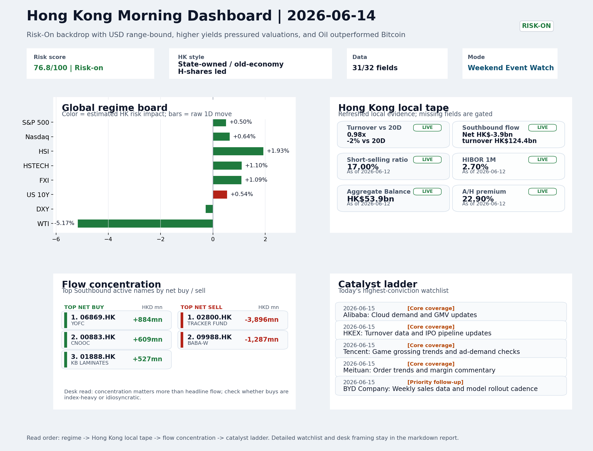
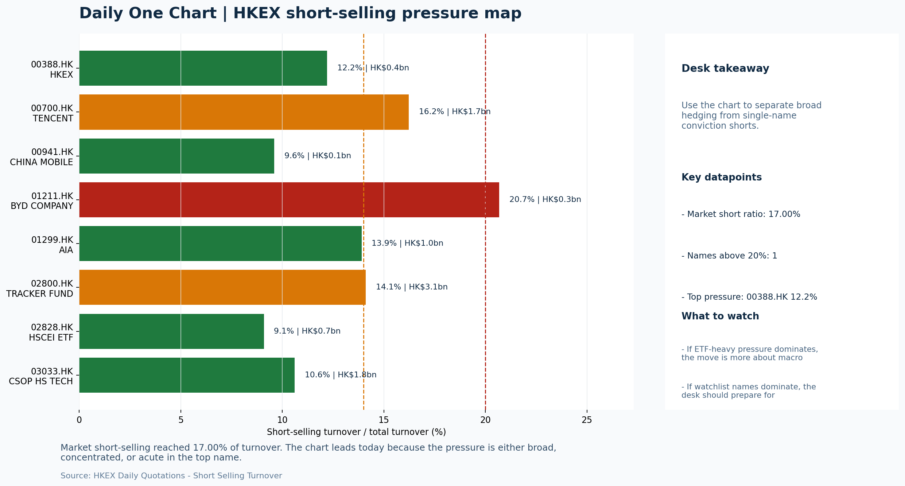

# Morning Research Workbench | 2026-06-15

> Designed for a Hong Kong sell-side commute: Layer 1 `Scan`, Layer 2 `Deep Read`, Layer 3 `Thinking`
> Mode: `Weekend Event Watch` | Track weekend policy, geopolitics, still-moving assets, and Monday open preparation rather than replaying stale cash-market tape.
> Briefing date: `2026-06-15` | Review date: `2026-06-14` | Global request: `2026-06-14` | HK/China request: `2026-06-12` | Market effective date: `2026-06-14` | Generated at: `2026-06-15 08:21:27`

## Executive Summary

- **Market pulse:** Weekend VIX compression and a record SpaceX IPO framed a constructive Risk-On setup for Monday's Hong Kong open, though softer oil and negative Southbound flow kept the signal conditional.
- **Hong Kong lens:** Hong Kong growth / internet led. Monday's open is set up for a constructive tone if VIX holds lower and SpaceX's Nasdaq debut confirms risk appetite rather than retail-capped volatility.
- **Top catalysts:** VIX -9.05%; Risk-On backdrop with USD range-bound, higher yields pressured valuations, and Oil outperformed Bitcoin.

## Visual Dashboard

## Layer 1 | Reset (5-10 min)

### 1.1 One-Line Market Pulse
Weekend VIX compression and a record SpaceX IPO framed a constructive Risk-On setup for Monday's Hong Kong open, though softer oil and negative Southbound flow kept the signal conditional rather than fully confirmed.

### 1.2 Global Asset Price Dashboard

| Asset | Last | 1D move | Read |
| --- | --- | --- | --- |
| S&P 500 | 7,431.46 | +0.50% | US large-cap risk appetite |
| Nasdaq 100 | 29,635.95 | +0.64% | Growth and duration leadership |
| Hang Seng Index | 24,718.10 | **+1.93%** | Hong Kong broad beta |
| Hang Seng TECH | 4.6100 | +1.10% | Hong Kong growth / platform read-through |
| CSI 300 | 4,777.32 | +1.16% | Mainland large-cap tone |
| US 10Y | 4.4870 | +0.54% | Global discount-rate anchor |
| China 10Y | 1.74% | -0.5bp | China local rates anchor \| Live public \| Eastmoney \| 2026-06-12 |
| CN-US 10Y spread | -273.7bp | -3.5bp | Relative carry and macro-pressure gauge \| Live public \| Eastmoney \| 2026-06-12 |
| DXY | 99.47 | -0.28% | Dollar liquidity impulse |
| USD/CNH | 6.7155 | -0.70% | Offshore China risk appetite |
| USD/HKD | 7.8356 | +0.00% | Linked-exchange regime stress check |
| Brent crude | 83.35 | **-4.56%** | Energy / geopolitics |
| COMEX gold | 4,318.90 | **+2.47%** | Hedge demand / real yields |
| Copper | 6.5325 | **+1.59%** | Global growth proxy |
| VIX | 17.68 | **-9.05%** | US stress barometer |

### 1.3 Hong Kong Last Cash-Tape Quick Check (Reference)

| Check | Value | Status | Source / as of | Why it matters |
| --- | --- | --- | --- | --- |
| Main Board turnover vs 20D | 0.98x \| -2% vs 20D | Live local | HKEX \| 2026-06-12 | Trailing 20-session average turnover was HK$323.0bn. |
| Southbound / Northbound net flow | Southbound Net HK$-3.9bn \| turnover HK$124.4bn \| Northbound Turnover HK$491.0bn \| net not reported | Live local | HKEX Connect \| 2026-06-12 | Southbound net buy is calculated from HKEX disclosed buy and sell turnover. |
| Short-selling ratio | 17.00% | Live local | HKEX \| 2026-06-12 | Official HKEX stock-level short-selling table, aggregated as a share of total market turnover. |
| AH premium index | 22.90% | Live public | Yahoo \| 2026-06-12 | Simple average across 18 A/H pairs; use dispersion rather than the average alone. |
| USD/HKD spot vs band | 7.8356 \| band 7.7500 to 7.8500 | Live quote + local | Yahoo \| 2026-06-12 | Inside the linked-exchange band without immediate boundary stress. Official Convertibility Undertakings define the linked-rate stress boundaries for USD/HKD. |
| HIBOR 1M | 2.70% | Live local | HKMA \| 2026-06-12 | 1M HIBOR is the cleanest quick read for Hong Kong funding conditions and equity-duration pressure. |
| Aggregate Balance | HK$53.9bn | Live local | HKMA \| 2026-06-12 | Aggregate Balance helps frame whether linked-rate liquidity conditions are tight or comfortable. |
| Hong Kong leadership | Hong Kong growth / internet led | Proxy | HSI / HSCEI / HSTECH relative perf \| 2026-06-12 | Use HSI / HSCEI / HSTECH relative moves as the opening style read. |

### 1.4 Risk Dashboard
**Composite risk score:** `76.8/100` | **Regime:** `Risk-on`

| Component | Score impact | Evidence |
| --- | --- | --- |
| US beta | +3.0 | S&P 500 +0.50% |
| HK growth | +5.5 | HSTECH +1.10% |
| Offshore China proxy | +5.5 | FXI +1.09% |
| Dollar pressure | +2.8 | DXY -0.28% |
| Volatility | +10 | VIX -9.05% |
| HK short-selling | +0 | Short-selling ratio 17.00% |

### 1.5 Next Open Checklist
1. **VIX -9.05%**
 High-frequency data | Lower volatility signals easing stress in the tape.
2. **Risk-On backdrop with USD range-bound, higher yields pressured valuations, and Oil outperformed Bitcoin**
 Still-moving markets | No fresh Hong Kong cash session is assumed; use global active assets and policy/event flow to prepare the next open.
3. **CPI MoM (Released)**
 Macro / policy | Rates expectations, the dollar, and growth-equity valuation | Industries: Technology, Internet, Brokers
4. **WTI crude -5.17%**
 High-frequency data | Softer oil argues for a more cautious cyclical-growth read.
5. **Trade Balance (Released)**
 Macro / policy | Watch whether it changes the day's core market narrative | Industries: Market-wide

## Layer 2 | Deep Read (20-30 min)

### 2.1 Still-Moving Global Financial Actions
> Non-trading mode: treat the cash-market tape below as last-available reference, not a fresh trading signal. Priority shifts to policy headlines, geopolitics, central-bank repricing, FX/commodities/crypto, corporate actions, and next-open preparation.

#### Market Setup
**Core tape.** The weekend event watch points to a constructive Risk-On setup heading into Monday's Hong Kong open.
**Main driver.** VIX compression (-9.05%) is the most credible bridge signal: sharp vol decline reduces tail-risk pricing and eases funding conditions for leveraged positions before any cash session resumes.
**HK relevance.** The record SpaceX IPO ($75bn, ~$2T debut cap) sets the growth equity benchmark for Monday's Nasdaq debut and will frame how global investors assess high-conviction tech/growth names on the H-share complex.

#### Key Drivers
- VIX -9.05% (17.68): Sharp compression reduces tail-risk pricing and supports a Risk-On posture heading into Monday.
- SpaceX IPO: $75bn raise, ~$2T debut market cap, Monday Nasdaq debut sets the growth equity benchmark for global risk appetite.
- Oil -5.17% ($80.49): Softer crude signals caution on cyclical growth and directly pressures CNOOC and PetroChina H-shares.
- USD/CNH -0.70% (6.7155): Weaker offshore renminbi eases cross-border pressure and makes HK follow-through more credible.

#### Hong Kong Read-Through
**Desk lens.** State-owned / old-economy H-shares led.
**Opening implication.** Monday's open is set up for a constructive tone if VIX holds lower and SpaceX's Nasdaq debut confirms risk appetite rather than retail-capped volatility. Monitor HSTECH, FXI.
- **Cross-market read:** Hang Seng +1.93% / HSCEI +1.91% / HSTECH +1.10%.
- **Cross-market read:** Offshore China proxy FXI +1.09% and USD/CNH -0.70% frame cross-border risk appetite.
- **Cross-market read:** USD/HKD last traded around 7.8356, which keeps the Hong Kong funding lens in focus.

#### Watch Points
- USD composite moved higher by +0.06pct intraday, with a 0.093pct range.
- Main turning points appeared around 2026-06-15 06:05 trough / 2026-06-15 06:30 peak / 2026-06-15 06:50 trough, suggesting event-driven repricing.
- The biggest cross-asset divergence was Oil versus Bitcoin, a spread of 1.09pct.
- Gold moved -0.13pct intraday with a 0.535pct high-low range.

#### Non-Trading Focus Map
- No fresh Hong Kong cash-market session is assumed for 2026-06-14; HK local tape is last completed HK/China cash-market reference tape from 2026-06-12.

| Monitor | Bucket | Last | Move | Why it matters |
| --- | --- | --- | --- | --- |
| VIX | Vol | 17.68 | -9.05% | Lower volatility signals easing stress in the tape. |
| WTI crude | Commodities | 80.49 | -5.17% | Softer oil argues for a more cautious cyclical-growth read. |
| Gold | Commodities | 4,318.90 | +2.47% | Gold rising with the dollar looks more like geopolitical or pure hedge demand. |
| Copper | Commodities | 6.5325 | +1.59% | Keep tracking it to confirm whether the core daily narrative is holding. |
| Bitcoin | Crypto | 64,421.32 | +1.38% | Keep tracking it to confirm whether the core daily narrative is holding. |
| USD/CNH | FX | 6.7155 | -0.70% | Keep tracking it to confirm whether the core daily narrative is holding. |

**Weekend / Holiday Event Docket**

| Channel | Signal | Why monitor | Next check |
| --- | --- | --- | --- |
| Vol | VIX -9.05% | Lower volatility signals easing stress in the tape. | Keep this as the bridge signal until the next Hong Kong cash close confirms or |
| Commodities | WTI crude -5.17% | Softer oil argues for a more cautious cyclical-growth read. | Keep this as the bridge signal until the next Hong Kong cash close confirms or |
| Commodities | Gold +2.47% | Gold rising with the dollar looks more like geopolitical or pure hedge demand. | Keep this as the bridge signal until the next Hong Kong cash close confirms or |
| Commodities | Copper +1.59% | Keep tracking it to confirm whether the core daily narrative is holding. | Keep this as the bridge signal until the next Hong Kong cash close confirms or |
| Released | CPI MoM | Rates expectations, the dollar, and growth-equity valuation | Check the rates, FX, and China-proxy reaction after release or official |
| Released | Trade Balance | Watch whether it changes the day's core market narrative | Check the rates, FX, and China-proxy reaction after release or official |
| Upcoming | Retail Sales MoM | Consumer resilience, growth expectations, and risk-asset pricing | Check the rates, FX, and China-proxy reaction after release or official |
| Geopolitics | Middle East: Regional tension remains elevated | Oil, freight costs, and safe-haven demand | Map any escalation first into oil, gold, USD, CNH, and HK growth-beta sensitivity. |

**Still-moving actions to track**
- **Geopolitics:** Middle East: Regional tension remains elevated | Oil, freight costs, and safe-haven demand
- **Geopolitics:** US-China: Technology export-control rhetoric remains active | China internet, semiconductors, and supply chains
- **Policy / company tape:** Hong Kong Issuers Seek to Boost Trading in Overlooked Stocks | Assess whether the story can propagate through the Other value chain
- **Released:** CPI MoM | Rates expectations, the dollar, and growth-equity valuation
- **Released:** Trade Balance | Watch whether it changes the day's core market narrative

**Next-open preparation**
- First dated catalyst to prepare: 2026-06-15 | Alibaba: Cloud demand and GMV updates.
- Refresh HKEX turnover, Stock Connect, short-selling, and AH dispersion once the next HK cash session closes.
- Use USD/CNH, USD/HKD, DXY, oil, gold, and crypto as bridge signals before cash markets reopen.
- Prepare one base case and one risk case for the next Hong Kong open instead of over-reading stale cash-market moves.

**Curated overnight stories**
1. **SpaceX raising $75 billion in record-setting IPO as Nasdaq debut awaits**
 Why it matters: This is the largest IPO in global equity history, with a predicted debut market cap above $2 trillion.
 HK read-through: Most relevant for Hong Kong tech and growth sentiment. SpaceX's performance will influence how global investors assess high-conviction growth names.
2. **VIX -9.05% (lower volatility signals easing stress in the tape)**
 Why it matters: Sharp VIX compression over the weekend indicates systematic stress has eased heading into Monday.
 HK read-through: Market-wide positive: lower vol backdrop supports H-share and offshore China sentiment, reduces risk-premium demands, and eases funding conditions for leveraged positions.
3. **Gold slumps to 6-month low even as inflation fears rise.**
 Why it matters: Gold breaking to a 6-month low suggests the fear/anti-dollar trade is unwinding. Real yields and USD dynamics are overriding inflation concerns, which changes the safe-haven.
 HK read-through: Relevant for Chinese commodity-linked H-shares and precious-metals producers. A weaker gold price may pressure companies like Zijin Mining or Shandong Gold if the downtrend.
4. **WTI crude -5.17% (softer oil argues for a more cautious cyclical-growth read)**
 Why it matters: Oil underperformance over the weekend signals a potential demand-growth concern or supply normalization.
 HK read-through: Directly relevant for Hong Kong energy names (CNOOC, PetroChina H-shares) and broader China cyclical sectors.
5. **CPI MoM (Released) and Trade Balance (Released) - shifts core market narrative**
 Why it matters: US inflation and trade data inform Fed rate expectations and USD direction. Both released overnight, their readings affect dollar direction, risk appetite, and growth-equity.
 HK read-through: Industries: Technology, Internet, Brokers, and Market-wide. USD direction is critical for HK-listed offshore China stocks and H-share valuation relative to onshore A-shares.

### 2.2 Last Available Hong Kong / A-share Tape (Reference Only)
> Non-trading mode: treat the cash-market tape below as last-available reference, not a fresh trading signal. Priority shifts to policy headlines, geopolitics, central-bank repricing, FX/commodities/crypto, corporate actions, and next-open preparation.

#### Local Tape Setup
**Local read.** The last Hong Kong cash session (12 June) closed with cyclical and old-economy leadership: HSI +1.93%, HSCEI +1.91% versus HSTECH +1.10%.
**Verification point.** Weekend bridge signals - VIX compression (-9.05%) and a softer USD/CNH (-0.70%) - lean toward a growth-friendly setup for Monday's open, though the sharp oil decline (-5.17%) and heavy A-share ETF short ratios (CSOP A50.
**Risk to watch.** Southbound flow was negative (net HK$-3.9bn), and northbound net-buy data is unavailable, so confirmation of foreign demand remains incomplete.

#### Style and Local Leadership
**Style leadership.** Hong Kong growth / internet led.
- **Cross-market read:** Hang Seng +1.93% / HSCEI +1.91% / HSTECH +1.10%.
- **Cross-market read:** Offshore China proxy FXI +1.09% and USD/CNH -0.70% frame cross-border risk appetite.
- **Cross-market read:** USD/HKD last traded around 7.8356, which keeps the Hong Kong funding lens in focus.

#### Flow Confirmation
Official Stock Connect evidence is available; use Section 2.3 to confirm whether local money supports the price action.

#### Follow-Through Checklist
**Follow-through check.** Monitor HSTECH relative to HSCEI and USD/CNH stability; if HSTECH leads with VIX holding below 18, growth can be overweighted. Failure by HSTECH to reclaim leadership would suggest a defensive rotation within the Risk-On envelope.

### 2.3 Flow Tracker and Attribution
#### Cross-Asset Attribution v1

| Driver | Direction | Score | Evidence | HK implication |
| --- | --- | --- | --- | --- |
| Oil and geopolitics | supportive | 3.65 | Oil moved -4.56%. | Split the read between energy/cyclicals support and margin/geopolitical pressure. |
| Dollar / CNH pressure | supportive | 1.05 | DXY -0.28% / USD-CNH -0.70% | A stable or softer CNH makes Hong Kong follow-through more credible. |
| Rates impulse | drag | 0.65 | US 10Y yield proxy moved +0.54%. | Lower yields help long-duration growth; higher yields pressure valuation-sensitive |

#### Flow Tracker
##### Flow Takeaways
- Local flow evidence is not yet strong enough to override the cross-asset setup.
- Stock Connect Southbound: net HK$-3.9bn on turnover HK$124.4bn (as of 2026-06-12).
- Stock Connect Northbound: turnover RMB491.0bn; public file provides total turnover/top active names, not full net-buy.
- AH premium: simple covered-pair average +22.90%; widest premium: China Railway Construction 47.36%.

##### Stock Connect Southbound Active Names

| Rank | Ticker | Name | Buy | Sell | Net buy |
| --- | --- | --- | --- | --- | --- |
| 4 | 02800.HK | TRACKER FUND | HK$2.7mn | HK$3,898.4mn | HK$-3,895.7mn |
| 3 | 09988.HK | BABA-W | HK$1,341.5mn | HK$2,628.3mn | HK$-1,286.8mn |
| 2 | 06869.HK | YOFC | HK$2,752.8mn | HK$1,868.9mn | HK$883.9mn |
| 10 | 00883.HK | CNOOC | HK$1,037.4mn | HK$428.0mn | HK$609.5mn |
| 6 | 01888.HK | KB LAMINATES | HK$1,878.6mn | HK$1,351.7mn | HK$526.9mn |

##### AH Premium Dispersion

| Name | A ticker | H ticker | Premium | As of |
| --- | --- | --- | --- | --- |
| China Railway Construction | 601186.SS | 1186.HK | +47.36% | 2026-06-12 |
| China Railway | 601390.SS | 0390.HK | +45.98% | 2026-06-12 |
| China Communications Construction | 601800.SS | 1800.HK | +45.06% | 2026-06-12 |
| China Construction Bank | 601939.SS | 0939.HK | +37.78% | 2026-06-12 |
| China Life | 601628.SS | 2628.HK | +37.48% | 2026-06-12 |

##### HKEX Short-Selling Watch

| Ticker | Name | Short ratio | Short turnover | Total turnover |
| --- | --- | --- | --- | --- |
| 00388.HK | HKEX | 12.21% | HK$0.4bn | HK$3.0bn |
| 00700.HK | TENCENT | 16.23% | HK$1.7bn | HK$10.3bn |
| 00941.HK | CHINA MOBILE | 9.60% | HK$0.1bn | HK$1.5bn |
| 01211.HK | BYD COMPANY | 20.68% | HK$0.3bn | HK$1.4bn |
| 01299.HK | AIA | 13.90% | HK$1.0bn | HK$7.5bn |

- **Short-value leaders:** 07709.HK XL2CSOPHYNIX (HK$4.5bn); 02800.HK TRACKER FUND (HK$3.1bn); 07747.HK XL2CSOPSMSN (HK$2.1bn); 03033.HK CSOP HS TECH (HK$1.8bn).

### 2.4 Macro and Policy Tracking
**Desk read.** The weekend event watch centers on the already-released US CPI (0.3% MoM vs 0.2% consensus) and China trade balance (USD85.2bn vs 79.0bn forecast).

**Market sensitivity.** The hotter CPI, if absorbed into still-moving rates markets, could press Hong Kong growth-equity valuations at Monday's open, while the trade surplus beat provides a modest offset.

**HK implication.** The upcoming LPR is expected unchanged, so fresh China policy impulse is limited.

**Macro watchpoints**
- US 2-year yield and DXY direction after CPI and ahead of Powell/retail sales, as a proxy for HK tech/broker repricing.
- USD/CNH and PBOC open market liquidity signal to gauge onshore comfort with current risk tone.
- Whether Hong Kong tech and financials lead or fade at the open versus energy and gold plays.
- Geopolitical headlines on Middle East escalation and US-China technology controls that could alter supply-chain risk premia.

| Time | Region | Event | Status | Desk read |
| --- | --- | --- | --- | --- |
| 20:30 | US | CPI MoM | Released | Impact: Rates expectations, the dollar, and growth-equity valuation \| Attention: 5/5 \| Industries: Technology, Internet, Brokers |
| 09:30 | China | Trade Balance | Released | Impact: Watch whether it changes the day's core market narrative \| Attention: 3/5 \| Industries: Market-wide |
| 20:30 | US | Retail Sales MoM | Upcoming | Impact: Consumer resilience, growth expectations, and risk-asset pricing \| Attention: 5/5 \| Industries: Consumer, E-commerce, Consumer discretionary |
| 09:20 | China | Loan Prime Rate | Upcoming | Impact: Watch whether it changes the day's core market narrative \| Attention: 3/5 \| Industries: Market-wide |
| 22:00 | Federal Reserve | Jerome Powell: Economic outlook remarks | Central bank | Impact: Policy path, liquidity conditions, and cross-asset risk appetite \| Attention: 5/5 \| Industries: Technology, Financials, Gold |
| 10:00 | PBOC | Open Market Operations Desk: Daily liquidity operation window | Central bank | Impact: Policy path, liquidity conditions, and cross-asset risk appetite \| Attention: 3/5 \| Industries: Technology, Financials, Gold |

#### Positioning and Risk Backdrop
- Options activity centered on KWEB Call, with Vol/OI at 1.88x and a bullish bias.
- Put/Call structure shows equity 0.68 / index 1.15, implying Single-stock optimism with index hedging.
- Geopolitics: Middle East | Regional tension remains elevated | Impact: Oil, freight costs, and safe-haven demand
- Geopolitics: US-China | Technology export-control rhetoric remains active | Impact: China internet, semiconductors, and supply chains

### 2.5 Key Company and Sector Events
No high-conviction sector story cleared the main-report relevance gate for this run.

#### HKEX Announcements

| Grade | Ticker | Type | Release time | Title |
| --- | --- | --- | --- | --- |
| A | 00088.HK | Profit warning | 2026-06-12 | Profit warning / alert announcement |
| A | 00104.HK | Profit warning | 2026-06-12 | Profit warning / alert announcement |
| A | 00186.HK | Profit warning | 2026-06-12 | Profit warning / alert announcement |
| A | 00406.HK | Profit warning | 2026-06-12 | Profit warning / alert announcement |
| A | 01499.HK | Profit warning | 2026-06-12 | Profit warning / alert announcement |
| A | 01647.HK | Profit warning | 2026-06-12 | Profit warning / alert announcement |
| A | 02080.HK | Profit warning | 2026-06-12 | Profit warning / alert announcement |
| A | 02683.HK | Profit warning | 2026-06-12 | Profit warning / alert announcement |

#### Earnings / Results Watch

| Ticker | Company | Timing | Expectation framing |
| --- | --- | --- | --- |
| 0700.HK | Tencent Holdings | After Market Close | EPS est. 4.15 HKD \| revenue est. 163.2bn HKD |
| 0388.HK | Hong Kong Exchanges and Clearing | Before Market Open | EPS est. 2.81 HKD \| revenue est. 6.0bn HKD |

#### Rating Changes
- **9988.HK** | Morgan Stanley | Upgrade | Equal Weight -> Overweight | PT 92 -> 105

#### IPO Watch
- IPO and grey-market monitoring is not yet part of the standard production pack.

### 2.6 Today's Core Names
#### Core coverage

| Name | Ticker | Last | 1D | Range position | Morning note |
| --- | --- | --- | --- | --- | --- |
| Alibaba | 9988.HK | 110.20 | +2.61% | Bottom of range | Short-term price strength is clear; fresh catalysts could trigger broader group follow-through. |
| HKEX | 0388.HK | 380.60 | +1.76% | Bottom of range | The name sits near the bottom of its recent range and is worth monitoring for a catalyst-led reversal. |

#### Priority follow-up

| Name | Ticker | Last | 1D | Range position | Morning note |
| --- | --- | --- | --- | --- | --- |
| BYD Company | 1211.HK | 86.55 | +1.88% | Bottom of range | The name sits near the bottom of its recent range and is worth monitoring for a catalyst-led reversal. |
| AIA | 1299.HK | 74.55 | +1.08% | Bottom of range | The name sits near the bottom of its recent range and is worth monitoring for a catalyst-led reversal. |

**Recent headlines for BYD Company:**
- [BYD Balances Stalled Turkey Project With New European Growth Plans](https://finance.yahoo.com/markets/stocks/articles/byd-balances-stalled-turkey-project-201107483.html) (Simply Wall St.)

## Layer 3 | Thinking (10-15 min)

### 3.1 Rotating Theme Deep Dive

| Field | Read |
| --- | --- |
| Theme | AI and Compute Chain |
| Angle for the day | Track whether global AI capex, semis, cloud, and server demand are still carrying offshore China internet and hardware sentiment. |

**Theme desk read**
**Core thesis.** The AI and Compute Chain theme remains the right lens heading into the new week: offshore China internet and hardware sentiment are still being shaped by global capex and cloud-demand signals, not just domestic consumption.
**Evidence.** The 9% VIX drop suggests easing tape stress, which is supportive, but the 5% oil decline injects some cyclical-growth caution that could weigh on near-term risk appetite.
**What to test.** On the competitive front, Alibaba's $1.5bn bid for grocery delivery firm Pupu against Meituan is a concrete escalation in platform competition that overlaps with delivery-infrastructure and compute-intensive logistics.

**Signals to keep in mind**
- Hong Kong Issuers Seek to Boost Trading in Overlooked Stocks: Assess whether the story can propagate through the Other value chain
- VIX -9.05%: Lower volatility signals easing stress in the tape.
- WTI crude -5.17%: Softer oil argues for a more cautious cyclical-growth read.

**LLM watch items:**
- VIX to sustain sub-18 as a risk-on signal for tech/growth positioning ahead of HK open
- WTI crude stabilization or further decline as a proxy for cyclical-growth appetite
- Alibaba cloud demand and GMV update - direct read on AI-driven cloud re-rating
- Tencent game grossing and ad-demand checks - AI monetization and ad spend signals
- Meituan competitive response to Alibaba's Pupu bid - margin and order-trend implications

**Related names to keep close:**

| Name | Ticker | Bucket | Morning read |
| --- | --- | --- | --- |
| Alibaba | 9988.HK | Core coverage | Short-term price strength is clear; fresh catalysts could trigger broader group follow-through. |
| Tencent | 0700.HK | Core coverage | Positioning is neutral for now, so use it mainly to monitor marginal information changes. |
| Meituan | 3690.HK | Core coverage | Positioning is neutral for now, so use it mainly to monitor marginal information changes. |
| AIA | 1299.HK | Priority follow-up | The name sits near the bottom of its recent range and is worth monitoring for a catalyst-led reversal. |

**Upcoming catalysts tied to the theme:**
- 2026-06-15 | Alibaba: Cloud demand and GMV updates | Key read-through for China consumption, cloud, and platform regulation
- 2026-06-15 | Tencent: Game grossing trends and ad-demand checks | Core offshore China platform proxy for gaming, ads, and AI monetization
- 2026-06-15 | AIA: NBV trends and agency momentum | Read-through for wealth demand, mainland visitor activity, and HK financial sentiment
- 2026-06-15 | Hang Seng TECH ETF: AI narrative shifts and China platform regulation headlines | Fast proxy for Hong Kong internet and growth leadership

**Relevant headlines:**
- [Hong Kong Issuers Seek to Boost Trading in Overlooked Stocks](https://www.bloomberg.com/news/articles/2026-06-14/hong-kong-issuers-seek-to-boost-trading-in-overlooked-stocks)

### 3.2 Next Session Outlook and Calendar
- Non-trading review: use today's calendar to prepare the next Hong Kong open rather than treating the last cash tape as a fresh signal.
- Macro: CPI MoM is the first item to anchor the open and the rates/FX response.
- Corporate / event: Alibaba: Cloud demand and GMV updates is the cleanest same-day catalyst to prepare for.

**Same-day macro docket**

| Time | Country | Event | Status | Detail |
| --- | --- | --- | --- | --- |
| 20:30 | US | CPI MoM | Released | Actual 0.3% / Forecast 0.2% / Prior 0.4% |
| 09:30 | China | Trade Balance | Released | Actual USD 85.2bn / Forecast USD 79.0bn / Prior USD 80.6bn |
| 20:30 | US | Retail Sales MoM | Upcoming | Forecast 0.3% / Prior 0.6% |
| 09:20 | China | Loan Prime Rate | Upcoming | Forecast 3.45% / Prior 3.45% |
| 22:00 | Federal Reserve | Jerome Powell: Economic outlook remarks | Central bank | speech |

**Same-day catalyst list**

| Date | Time | Category | Event | Importance |
| --- | --- | --- | --- | --- |
| 2026-06-15 | | Core coverage | Alibaba: Cloud demand and GMV updates | 3 |
| 2026-06-15 | | Core coverage | HKEX: Turnover data and IPO pipeline updates | 3 |
| 2026-06-15 | | Core coverage | Tencent: Game grossing trends and ad-demand checks | 3 |
| 2026-06-15 | | Core coverage | Meituan: Order trends and margin commentary | 3 |

**Next few sessions**

| Date | Category | Event | Impact |
| --- | --- | --- | --- |
| 2026-06-15 | Core coverage | Alibaba: Cloud demand and GMV updates | Key read-through for China consumption, cloud, and platform regulation |
| 2026-06-15 | Core coverage | HKEX: Turnover data and IPO pipeline updates | Direct proxy for Hong Kong market turnover, listings, and southbound |
| 2026-06-15 | Core coverage | Tencent: Game grossing trends and ad-demand checks | Core offshore China platform proxy for gaming, ads, and AI monetization |
| 2026-06-15 | Core coverage | Meituan: Order trends and margin commentary | High-frequency read on local services demand and platform competition |

### 3.3 Daily One Chart
**Daily One Chart | HKEX short-selling pressure map**

**Chart read.** Market short-selling reached 17.00% of turnover.
**Why it matters.** The chart leads today because the pressure is either broad, concentrated, or acute in the top name.

_Source: HKEX Daily Quotations - Short Selling Turnover_

## Traceable Appendix

### Report Metadata
> Date policy: Review date 2026-06-14 is treated as `Weekend Event Watch`. | Global request date is 2026-06-14; adapter effective date is 2026-06-14 and summary date is 2026-06-14. | HK/China local data date is 2026-06-12; role: last completed HK/China cash-market reference tape.
> Market data quality: Coverage: `31/32` | Stale items (>1d): `23` | Missing: `1`
> Report quality: `90.0/100` | Grade `A` | Status `production ready`

### Key Questions to Keep in Mind
- Is risk appetite rising or fading? The overnight tape reads closer to `Risk-On`.
- Did rates expectations move? Focus on whether US 10Y, DXY, and growth style moved together.
- Were commodities the real story? Watch WTI and gold for geopolitics versus inflation signals.
- Is Hong Kong setup internet-led, SOE-led, or broad beta-led? Compare HSTECH, HSCEI, and HSI.
- Did offshore markets move China risk appetite? Focus on HSI, FXI, USD/CNH, and USD/HKD.

### Report Quality and Validation
- **Quality score:** 90.0/100 | **Grade:** A | **Status:** production ready
- **Run summary:** 7 healthy | 1 caveat | 0 failed
- **Release recommendation:** Send with caveats | The report is usable, but the advisory guidance should travel with it so readers understand the data gaps.

| Source | Status | Bucket |
| --- | --- | --- |
| Market data | ok | healthy |
| Sector and company news | ok | healthy |
| Movers and short selling | ok | healthy |
| Stock Connect | ok | healthy |
| A/H premium | ok | healthy |
| Hong Kong local package | ok | healthy |
| China rates | ok | healthy |
| Narrative overlay | partial | caveat |

**Desk-use guidance summary:** 0 blocking | 1 advisory

**Desk-use guidance**
- **Advisory:** Use deterministic sections as primary support; the narrative overlay was partial or unavailable on this run.

| Component | Score | Weight | Read |
| --- | --- | --- | --- |
| Market data coverage | 96.9 | 0.3 | 31/32 core market fields available. |
| Hong Kong local metrics | 82.3 | 0.25 | 8 live, 3 proxy, 0 unavailable local checks. |
| Key public adapters | 100.0 | 0.2 | 4/4 key adapters were available or partially available. |
| Narrative overlay health | 68.6 | 0.15 | 4/7 narrative overlay tasks succeeded or used validated cache; 1 error(s). |
| Fact-check guardrail | 100.0 | 0.1 | Checked 2 numeric claims; 0 numeric mismatch(es), 0 logic warning(s); 0 critical, 0 review. |

**Narrative fact-check guardrail**
- Checked 2 numeric claims; 0 numeric mismatch(es), 0 logic warning(s); 0 critical, 0 review.

**Adapter status**

| Adapter | Status |
| --- | --- |
| Stock Connect | ok |
| A/H premium | ok |
| HKEX announcements | ok |
| China rates | ok |

### Source Links
- [Alibaba Bids $1.5 Billion for China Grocer in Meituan Fight](https://finance.yahoo.com/markets/stocks/articles/alibaba-bids-1-5-billion-061524324.html) (Bloomberg)
- [BYD Balances Stalled Turkey Project With New European Growth Plans](https://finance.yahoo.com/markets/stocks/articles/byd-balances-stalled-turkey-project-201107483.html) (Simply Wall St.)
- [00088.HK Profit warning / alert announcement](http://www1.hkexnews.hk/listedco/listconews/sehk/2026/0612/2026061200476.pdf) (HKEXnews)
- [00104.HK Profit warning / alert announcement](http://www1.hkexnews.hk/listedco/listconews/sehk/2026/0612/2026061200872.pdf) (HKEXnews)
- [00186.HK Profit warning / alert announcement](http://www1.hkexnews.hk/listedco/listconews/sehk/2026/0612/2026061200384.pdf) (HKEXnews)
- [00406.HK Profit warning / alert announcement](http://www1.hkexnews.hk/listedco/listconews/sehk/2026/0612/2026061200725.pdf) (HKEXnews)
- [01499.HK Profit warning / alert announcement](http://www1.hkexnews.hk/listedco/listconews/sehk/2026/0612/2026061201162.pdf) (HKEXnews)
- [01647.HK Profit warning / alert announcement](http://www1.hkexnews.hk/listedco/listconews/sehk/2026/0612/2026061201476.pdf) (HKEXnews)
- [02080.HK Profit warning / alert announcement](http://www1.hkexnews.hk/listedco/listconews/sehk/2026/0612/2026061200608.pdf) (HKEXnews)
- [02683.HK Profit warning / alert announcement](http://www1.hkexnews.hk/listedco/listconews/sehk/2026/0612/2026061200798.pdf) (HKEXnews)

## Supplementary Visual Appendix

This appendix is professional-path only. It keeps a traceable index of the report visuals and the deterministic chart cues used to frame the morning note, without injecting the legacy intraday chart pack.

### Visual Index

| Visual | Path | Role |
| --- | --- | --- |
| Visual Dashboard | `charts/dashboard_2026-06-15.png` | Cross-asset regime board and Hong Kong local tape snapshot. |
| Daily One Chart | `charts/daily_one_chart_2026-06-15.png` | Single highest-conviction visual story for the day. |

### Deterministic Chart Cues
- FX / liquidity: USD composite moved higher by +0.06pct intraday, with a 0.093pct range.
- FX / liquidity: Main turning points appeared around 2026-06-15 06:05 trough / 2026-06-15 06:30 peak / 2026-06-15 06:50 trough, suggesting event-driven repricing rather than a clean one-way USD move.
- Cross-asset: The biggest cross-asset divergence was Oil versus Bitcoin, a spread of 1.09pct.
- Cross-asset: Gold moved -0.13pct intraday with a 0.535pct high-low range.
- Cross-asset: Oil moved +0.05pct intraday with a 0.852pct high-low range.
- Cross-asset: Bitcoin moved -1.04pct intraday with a 1.519pct high-low range.

### Risk Dashboard Components

| Component | Score impact | Evidence |
| --- | --- | --- |
| US beta | +3.0 | S&P 500 +0.50% |
| HK growth | +5.5 | HSTECH +1.10% |
| Offshore China proxy | +5.5 | FXI +1.09% |
| Dollar pressure | +2.8 | DXY -0.28% |
| Volatility | +10 | VIX -9.05% |
| HK short-selling | +0 | Short-selling ratio 17.00% |
