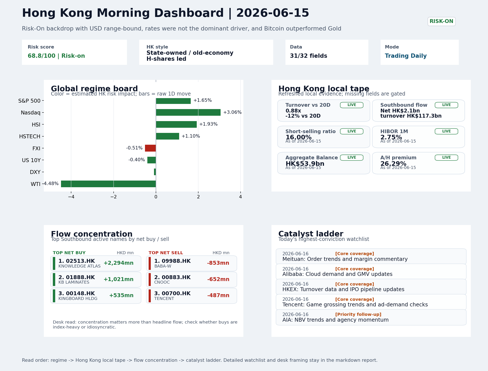
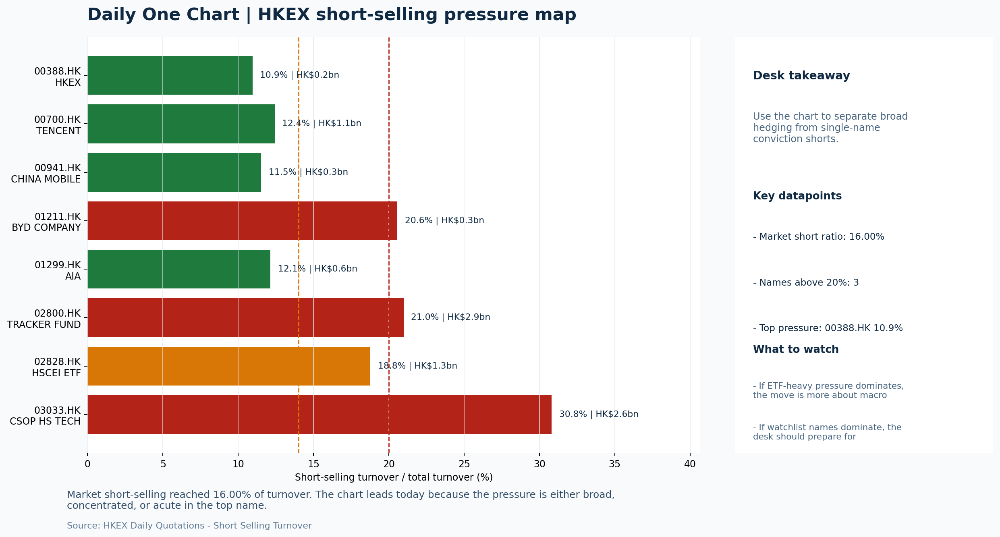

# Morning Research Workbench | 2026-06-16

> Designed for a Hong Kong sell-side commute: Layer 1 `Scan`, Layer 2 `Deep Read`, Layer 3 `Thinking`
> Mode: `Trading Daily` | Keep the report execution-oriented: what mattered in the completed session, what can move Hong Kong leadership, and what needs fast follow-up.
> Briefing date: `2026-06-16` | Review date: `2026-06-15` | Global request: `2026-06-15` | HK/China request: `2026-06-15` | Market effective date: `2026-06-15` | Generated at: `2026-06-16 09:45:24`

## Executive Summary

- **Market pulse:** Overnight risk-on led by Nasdaq +3.06% and VIX -8.37% offers a constructive opening tone, but Hong Kong's light turnover, HSTECH underperformance, and FXI divergence keep the glide-path.
- **Hong Kong lens:** State-owned / old-economy H-shares led. A constructive open is more credible if HSTECH and internet names confirm the Nasdaq-led growth signal rather than letting HSI gains stay in state-owned or old-economy names.
- **Top catalysts:** VIX -8.37%; INTC -6.33%.

## Visual Dashboard

## Layer 1 | Scan (5-10 min)

### 1.1 One-Line Market Pulse
Overnight risk-on led by Nasdaq +3.06% and VIX -8.37% offers a constructive opening tone, but Hong Kong's light turnover, HSTECH underperformance, and FXI divergence keep the glide-path conditional.

### 1.2 Global Asset Price Dashboard

| Asset | Last | 1D move | Read |
| --- | --- | --- | --- |
| S&P 500 | 7,554.29 | **+1.65%** | US large-cap risk appetite |
| Nasdaq 100 | 30,543.92 | **+3.06%** | Growth and duration leadership |
| Hang Seng Index | 24,718.10 | **+1.93%** | Hong Kong broad beta |
| Hang Seng TECH | 4.6100 | +1.10% | Hong Kong growth / platform read-through |
| CSI 300 | 4,777.32 | +1.16% | Mainland large-cap tone |
| US 10Y | 4.4690 | -0.40% | Global discount-rate anchor |
| China 10Y | 1.74% | +0.2bp | China local rates anchor \| Live public \| Eastmoney \| 2026-06-15 |
| CN-US 10Y spread | -272.5bp | +1.2bp | Relative carry and macro-pressure gauge \| Live public \| Eastmoney \| 2026-06-15 |
| DXY | 99.66 | -0.09% | Dollar liquidity impulse |
| USD/CNH | 6.7185 | -0.66% | Offshore China risk appetite |
| USD/HKD | 7.8346 | -0.01% | Linked-exchange regime stress check |
| Brent crude | 83.39 | **-4.51%** | Energy / geopolitics |
| COMEX gold | 4,337.10 | **+2.90%** | Hedge demand / real yields |
| Copper | 6.4485 | +0.28% | Global growth proxy |
| VIX | 16.20 | **-8.37%** | US stress barometer |

### 1.3 Hong Kong Key Data Quick Check

| Check | Value | Status | Source / as of | Why it matters |
| --- | --- | --- | --- | --- |
| Main Board turnover vs 20D | 0.88x \| -12% vs 20D | Live local | HKEX \| 2026-06-15 | Trailing 20-session average turnover was HK$323.5bn. |
| Southbound / Northbound net flow | Southbound Net HK$2.1bn \| turnover HK$117.3bn \| Northbound Turnover HK$409.7bn \| net not reported | Live local | HKEX Connect \| 2026-06-15 | Southbound net buy is calculated from HKEX disclosed buy and sell turnover. |
| Short-selling ratio | 16.00% | Live local | HKEX \| 2026-06-15 | Official HKEX stock-level short-selling table, aggregated as a share of total market turnover. |
| AH premium index | 26.29% | Live public | Yahoo \| 2026-06-15 | Simple average across 18 A/H pairs; use dispersion rather than the average alone. |
| USD/HKD spot vs band | 7.8346 \| band 7.7500 to 7.8500 | Live quote + local | Yahoo \| 2026-06-15 | Inside the linked-exchange band without immediate boundary stress. Official Convertibility Undertakings define the linked-rate stress boundaries for USD/HKD. |
| HIBOR 1M | 2.75% | Live local | HKMA \| 2026-06-15 | 1M HIBOR is the cleanest quick read for Hong Kong funding conditions and equity-duration pressure. |
| Aggregate Balance | HK$53.9bn | Live local | HKMA \| 2026-06-15 | Aggregate Balance helps frame whether linked-rate liquidity conditions are tight or comfortable. |
| Hong Kong leadership | State-owned / old-economy H-shares led | Proxy | HSI / HSCEI / HSTECH relative perf \| 2026-06-15 | Use HSI / HSCEI / HSTECH relative moves as the opening style read. |

### 1.4 Risk Dashboard
**Composite risk score:** `68.8/100` | **Regime:** `Risk-on`

| Component | Score impact | Evidence |
| --- | --- | --- |
| US beta | +9.9 | S&P 500 +1.65% |
| HK growth | +5.5 | HSTECH +1.10% |
| Offshore China proxy | -2.5 | FXI -0.51% |
| Dollar pressure | +0.9 | DXY -0.09% |
| Volatility | +10 | VIX -8.37% |
| HK short-selling | +0 | Short-selling ratio 16.00% |

### 1.5 Morning Checklist
1. **VIX -8.37%**
 High-frequency data | Lower volatility signals easing stress in the tape.
2. **INTC -6.33%**
 Mover attribution | Announcement / expectations | Guidance reset and margin pressure
3. **Risk-On backdrop with USD range-bound, rates were not the dominant driver, and Bitcoin outperformed Gold**
 Overnight regime | Start by deciding whether the day is about Risk-On conditions or a style pivot.
4. **CPI MoM (Released)**
 Macro / policy | Rates expectations, the dollar, and growth-equity valuation | Industries: Technology, Internet, Brokers
5. **Trade Balance (Released)**
 Macro / policy | Watch whether it changes the day's core market narrative | Industries: Market-wide

## Layer 2 | Deep Read (20-30 min)

### 2.1 Overnight Overseas Market Review
#### Market Setup
**Core tape.** Overnight markets staged a broad risk-on move as the VIX fell 8.4% to 16.2 and the S&P 500 gained 1.65%, but the standout was the Nasdaq 100 at +3.06% - growth and tech leadership drove the session rather than defensives.
**Main driver.** The dominant cross-asset signal was Bitcoin outperforming Gold by 1.46pct, reinforcing speculative risk appetite.
**HK relevance.** Offshore China proxy FXI fell -0.51% while the Hang Seng rose +1.93%, creating a divergence that needs watching.

#### Key Drivers
- Nasdaq 100 +3.06% confirms growth-style leadership and tests Hong Kong internet/platform names at the open.
- VIX -8.37% to 16.2 signals easing stress; lower volatility reduces hedging costs and supports positioning in risk assets.
- Bitcoin outperformed Gold by 1.46pct - the clearest signal of speculative risk appetite overnight.
- WTI crude -4.48% argues for a split read: oil's decline eases input cost pressure for cyclicals but signals demand caution.

#### Hong Kong Read-Through
**Desk lens.** State-owned / old-economy H-shares led.
**Opening implication.** A constructive open is more credible if HSTECH and internet names confirm the Nasdaq-led growth signal rather than letting HSI gains stay in state-owned or old-economy names. The FXI divergence is the key litmus test.
- **Cross-market read:** Hang Seng +1.93% / HSCEI +1.91% / HSTECH +1.10%.
- **Cross-market read:** Offshore China proxy FXI -0.51% and USD/CNH -0.66% frame cross-border risk appetite.
- **Cross-market read:** USD/HKD last traded around 7.8346, which keeps the Hong Kong funding lens in focus.

#### Watch Points
- USD composite moved higher by +0.13pct intraday, with a 0.201pct range.
- Main turning points appeared around 2026-06-15 08:05 peak / 2026-06-15 08:30 peak / 2026-06-15 08:55 peak, suggesting event-driven repricing rather.
- The biggest cross-asset divergence was Bitcoin versus Gold, a spread of 1.462pct.
- Gold moved -0.16pct intraday with a 1.466pct high-low range.

**Curated overnight stories**
1. **Risk-On backdrop: USD range-bound, Bitcoin outperformed Gold, VIX -8.37%**
 Why it matters: Sets the macro regime for the session. Lower volatility reduces hedging costs and supports risk-asset positioning. USD stability limits currency-driven rotation.
 HK read-through: Constructive baseline for Hong Kong growth-equity and internet names. Supportslong positioning.
2. **CPI MoM released; Trade Balance released**
 Why it matters: Confirms rate-expectation environment. Stable prints reduce tail-risk around Fed policy and support valuation multiples for rate-sensitive sectors.
 HK read-through: Industries: Technology, Internet, Brokers. Softer-than-expected data would have boosted growth sentiment; in-line data maintains status quo.
3. **SpaceX IPO dominated US equity flows; Ron Baron bought $1B in shares, lifting stake to**
 Why it matters: High-profile IPO signals risk appetite. Baron's mega-position signals institutional conviction. Retail allocation shortage noted.
 HK read-through: Indirect: SpaceX mania may redirect some speculative capital from China internet names. Monitor whether Hong Kong growth funds face redemption pressure for SpaceX allocation.
4. **INTC -6.33%: Guidance reset and margin pressure**
 Why it matters: Intel's reset adds caution to semiconductor sector narrative. Margin pressure signals cost competition or demand softness in chips.
 HK read-through: Relevant for HK-listed tech hardware and semiconductor names. Could weigh on sector multiple if contagion framing emerges.
5. **TD Securities anticipates bigger days ahead for SpaceX**
 Why it matters: Mixed SpaceX framing: bullish on IPO flow vs. skeptical on near-term operational milestones. No fundamental earnings change.
 HK read-through: Secondary to IPO allocation dynamics. Mars commentary is narrative, not near-term earnings-relevant.

### 2.2 Hong Kong / A-share Previous-Day Review
#### Local Tape Setup
**Local read.** Hong Kong's +1.93% session masked a style split: HSTECH added only 1.1% while HSCEI gained 1.91%.
**Verification point.** Main Board turnover was light at 0.88x the 20-session baseline, and the 16% short-selling ratio suggests the rally lacked strong local conviction.
**Risk to watch.** Southbound flow leaned toward hardware and select cyclicals (SMIC, KB Laminates) rather than large internet platforms, consistent with the defensive internal rotation.

#### Style and Local Leadership
**Style leadership.** State-owned / old-economy H-shares led.
- **Cross-market read:** Hang Seng +1.93% / HSCEI +1.91% / HSTECH +1.10%.
- **Cross-market read:** Offshore China proxy FXI -0.51% and USD/CNH -0.66% frame cross-border risk appetite.
- **Cross-market read:** USD/HKD last traded around 7.8346, which keeps the Hong Kong funding lens in focus.

#### Flow Confirmation
Official Stock Connect evidence is available; use Section 2.3 to confirm whether local money supports the price action.

#### Follow-Through Checklist
**Follow-through check.** Confirmation requires HSTECH to outperform HSCEI in the next session and FXI to recover, showing that global growth-style transmission is broadening into China proxies. Also watch for turnover rising above the 20D average to validate any upside follow-through.

### 2.3 Flow Tracker and Attribution
#### Cross-Asset Attribution v1

| Driver | Direction | Score | Evidence | HK implication |
| --- | --- | --- | --- | --- |
| US growth-style transmission | supportive | 4.28 | Nasdaq 100 moved +3.06%. | Hong Kong growth and platform names should be tested first at the open. |
| Oil and geopolitics | supportive | 3.61 | Oil moved -4.51%. | Split the read between energy/cyclicals support and margin/geopolitical pressure. |
| Global equity beta | supportive | 1.65 | S&P 500 moved +1.65%. | Broad beta matters if Hong Kong breadth confirms the overseas signal. |
| Hong Kong participation | drag | 1.24 | Main Board turnover was 0.88x the 20-session average. | Thin turnover makes index moves easier to fade. |
| Dollar / CNH pressure | supportive | 0.99 | DXY -0.09% / USD-CNH -0.66% | A stable or softer CNH makes Hong Kong follow-through more credible. |

#### Flow Tracker
##### Flow Takeaways
- Turnover is light versus the 20-session baseline, so local moves have weaker conviction.
- Stock Connect Southbound: net HK$2.1bn on turnover HK$117.3bn (as of 2026-06-15).
- Stock Connect Northbound: turnover RMB409.7bn; public file provides total turnover/top active names, not full net-buy.
- AH premium: simple covered-pair average +26.29%; widest premium: China Communications Construction 71.23%.

##### Stock Connect Southbound Active Names

| Rank | Ticker | Name | Buy | Sell | Net buy |
| --- | --- | --- | --- | --- | --- |
| 3 | 02513.HK | KNOWLEDGE ATLAS | HK$3,280.3mn | HK$986.4mn | HK$2,293.9mn |
| 6 | 01888.HK | KB LAMINATES | HK$2,482.0mn | HK$1,461.4mn | HK$1,020.6mn |
| 3 | 09988.HK | BABA-W | HK$1,834.7mn | HK$2,688.1mn | HK$-853.4mn |
| 5 | 00883.HK | CNOOC | HK$1,672.8mn | HK$2,324.7mn | HK$-651.9mn |
| 6 | 00148.HK | KINGBOARD HLDG | HK$1,906.7mn | HK$1,371.7mn | HK$535.0mn |

##### AH Premium Dispersion

| Name | A ticker | H ticker | Premium | As of |
| --- | --- | --- | --- | --- |
| China Communications Construction | 601800.SS | 1800.HK | +71.23% | 2026-06-15 |
| China Railway Construction | 601186.SS | 1186.HK | +47.07% | 2026-06-15 |
| China Railway | 601390.SS | 0390.HK | +46.10% | 2026-06-15 |
| New China Life | 601336.SS | 1336.HK | +37.43% | 2026-06-15 |
| China Life | 601628.SS | 2628.HK | +35.54% | 2026-06-15 |

##### HKEX Short-Selling Watch

| Ticker | Name | Short ratio | Short turnover | Total turnover |
| --- | --- | --- | --- | --- |
| 00388.HK | HKEX | 10.95% | HK$0.2bn | HK$2.1bn |
| 00700.HK | TENCENT | 12.42% | HK$1.1bn | HK$9.2bn |
| 00941.HK | CHINA MOBILE | 11.53% | HK$0.3bn | HK$2.4bn |
| 01211.HK | BYD COMPANY | 20.57% | HK$0.3bn | HK$1.7bn |
| 01299.HK | AIA | 12.13% | HK$0.6bn | HK$5.0bn |

- **Short-value leaders:** 02800.HK TRACKER FUND (HK$2.9bn); 03033.HK CSOP HS TECH (HK$2.6bn); 07709.HK XL2CSOPHYNIX (HK$2.2bn); 02828.HK HSCEI ETF (HK$1.3bn).

### 2.4 Macro and Policy Tracking
**Desk read.** The macro calendar today is centered on the US CPI release that printed 0.3% MoM, above the 0.2% forecast but below the prior 0.4%.

**Market sensitivity.** The Risk-On regime has been supported by lower VIX and crypto strength, but the potentially sticky CPI could temper the magnitude of rate-cut expectations, pressuring duration-sensitive sectors like Technology and Brokers.

**HK implication.** Upcoming US retail sales (f/c 0.3%, prior 0.6%) and Powell's remarks later in the day are the events most likely to reprice the dollar and growth-equity valuation, determining whether the current leadership extends or fades.

**Macro watchpoints**
- US 2Y and 10Y yields, and DXY moves following the CPI print and ahead of retail sales.
- Whether Hong Kong's Technology and Internet names hold opening gains after the hotter CPI is absorbed.
- Powell's speech tone: any shift away from the prior dovish lean could alter risk appetite and rate-sensitive FX.
- China Loan Prime Rate setting (f/c unchanged at 3.45%) - a cut would signal policy urgency, while steady reinforces status quo.

| Time | Region | Event | Status | Desk read |
| --- | --- | --- | --- | --- |
| 20:30 | US | CPI MoM | Released | Impact: Rates expectations, the dollar, and growth-equity valuation \| Attention: 5/5 \| Industries: Technology, Internet, Brokers |
| 09:30 | China | Trade Balance | Released | Impact: Watch whether it changes the day's core market narrative \| Attention: 3/5 \| Industries: Market-wide |
| 20:30 | US | Retail Sales MoM | Upcoming | Impact: Consumer resilience, growth expectations, and risk-asset pricing \| Attention: 5/5 \| Industries: Consumer, E-commerce, Consumer discretionary |
| 09:20 | China | Loan Prime Rate | Upcoming | Impact: Watch whether it changes the day's core market narrative \| Attention: 3/5 \| Industries: Market-wide |
| 22:00 | Federal Reserve | Jerome Powell: Economic outlook remarks | Central bank | Impact: Policy path, liquidity conditions, and cross-asset risk appetite \| Attention: 5/5 \| Industries: Technology, Financials, Gold |
| 10:00 | PBOC | Open Market Operations Desk: Daily liquidity operation window | Central bank | Impact: Policy path, liquidity conditions, and cross-asset risk appetite \| Attention: 3/5 \| Industries: Technology, Financials, Gold |

#### Positioning and Risk Backdrop
- Options activity centered on KWEB Call, with Vol/OI at 1.88x and a bullish bias.
- Put/Call structure shows equity 0.68 / index 1.15, implying Single-stock optimism with index hedging.
- Geopolitics: Middle East | Regional tension remains elevated | Impact: Oil, freight costs, and safe-haven demand
- Geopolitics: US-China | Technology export-control rhetoric remains active | Impact: China internet, semiconductors, and supply chains

### 2.5 Key Company and Sector Events
No high-conviction sector story cleared the main-report relevance gate for this run.

#### HKEX Announcements

| Grade | Ticker | Type | Release time | Title |
| --- | --- | --- | --- | --- |
| A | 00147.HK | Profit warning | 2026-06-15 | Profit warning / alert announcement |
| A | 00475.HK | Profit warning | 2026-06-15 | Profit warning / alert announcement |
| A | 00932.HK | Profit warning | 2026-06-15 | Profit warning / alert announcement |
| A | 01200.HK | Profit warning | 2026-06-15 | Profit warning / alert announcement |
| A | 01205.HK | Profit warning | 2026-06-15 | Profit warning / alert announcement |
| A | 01633.HK | Profit warning | 2026-06-15 | Profit warning / alert announcement |
| A | 01716.HK | Profit warning | 2026-06-15 | Profit warning / alert announcement |
| A | 01780.HK | Profit warning | 2026-06-15 | Profit warning / alert announcement |

#### Earnings / Results Watch

| Ticker | Company | Timing | Expectation framing |
| --- | --- | --- | --- |
| 0700.HK | Tencent Holdings | After Market Close | EPS est. 4.15 HKD \| revenue est. 163.2bn HKD |
| 0388.HK | Hong Kong Exchanges and Clearing | Before Market Open | EPS est. 2.81 HKD \| revenue est. 6.0bn HKD |

#### Rating Changes
- **9988.HK** | Morgan Stanley | Upgrade | Equal Weight -> Overweight | PT 92 -> 105

#### IPO Watch
- IPO and grey-market monitoring is not yet part of the standard production pack.

### 2.6 Today's Core Names
#### Core coverage

| Name | Ticker | Last | 1D | Range position | Morning note |
| --- | --- | --- | --- | --- | --- |
| Meituan | 3690.HK | 76.95 | -1.66% | Bottom of range | The name sits near the bottom of its recent range and is worth monitoring for a catalyst-led reversal. |
| Alibaba | 9988.HK | 108.60 | -0.64% | Bottom of range | The name sits near the bottom of its recent range and is worth monitoring for a catalyst-led reversal. |

**Recent headlines for Meituan:**
- [Alibaba Bids $1.5 Billion for China Grocer in Meituan Fight](https://finance.yahoo.com/markets/stocks/articles/alibaba-bids-1-5-billion-061524324.html) (Bloomberg)
**Recent headlines for Alibaba:**
- [Alibaba (NYSE:BABA) Stock After Recent Slide Is The Market Pricing In Too Much Caution](https://finance.yahoo.com/markets/stocks/articles/alibaba-nyse-baba-stock-recent-001735855.html) (Simply Wall St.)

#### Priority follow-up

| Name | Ticker | Last | 1D | Range position | Morning note |
| --- | --- | --- | --- | --- | --- |
| AIA | 1299.HK | 75.90 | -0.78% | Mid-range | Positioning is neutral for now, so use it mainly to monitor marginal information changes. |
| BYD Company | 1211.HK | 85.15 | -0.53% | Bottom of range | The name sits near the bottom of its recent range and is worth monitoring for a catalyst-led reversal. |

## Layer 3 | Thinking (10-15 min)

### 3.1 Rotating Theme Deep Dive

| Field | Read |
| --- | --- |
| Theme | China Consumption Recovery |
| Angle for the day | Focus on whether travel, retail, internet local services, and premium consumption data still support a demand-repair narrative. |

**Theme desk read**
**Core thesis.** The weekly China Consumption Recovery theme remains a focus, but the view is still assembling rather than confirmed.
**Evidence.** Overnight Risk‑On conditions, with VIX down 8.37% and Bitcoin outperforming Gold, provide a constructive backdrop, though the 4.48% drop in WTI crude injects a note of caution on cyclical demand.
**What to test.** Meituan (3690.HK), trading near the lower end of its recent range at 76.95 after a 1.66% decline, now becomes the immediate test.

**Signals to keep in mind**
- VIX -8.37%: Lower volatility signals easing stress in the tape.
- WTI crude -4.48%: Softer oil argues for a more cautious cyclical-growth read.

**LLM watch items:**
- Meituan (3690.HK): order trends and margin commentary on 16 June - the most current demand signal
- US Retail Sales MoM (16 June, forecast 0.3%) - consumer resilience check for broader risk appetite
- China Loan Prime Rate (16 June, forecast 3.45%) - any surprise could shift domestic sentiment
- VIX trajectory: sustained move below 16 would support further risk‑on, a bounce would question it
- WTI crude: stabilisation or further weakness as a proxy for cyclical‑growth expectations

**Related names to keep close:**

| Name | Ticker | Bucket | Morning read |
| --- | --- | --- | --- |
| Meituan | 3690.HK | Core coverage | The name sits near the bottom of its recent range and is worth monitoring for a catalyst-led reversal. |

**Upcoming catalysts tied to the theme:**
- 2026-06-16 | Meituan: Order trends and margin commentary | High-frequency read on local services demand and platform competition
- 2026-06-16 | Retail Sales MoM | Consumer resilience, growth expectations, and risk-asset pricing

### 3.2 Today Ahead and Trading Calendar
- Macro: CPI MoM is the first item to anchor the open and the rates/FX response.
- Corporate / event: Meituan: Order trends and margin commentary is the cleanest same-day catalyst to prepare for.

**Same-day macro docket**

| Time | Country | Event | Status | Detail |
| --- | --- | --- | --- | --- |
| 20:30 | US | CPI MoM | Released | Actual 0.3% / Forecast 0.2% / Prior 0.4% |
| 09:30 | China | Trade Balance | Released | Actual USD 85.2bn / Forecast USD 79.0bn / Prior USD 80.6bn |
| 20:30 | US | Retail Sales MoM | Upcoming | Forecast 0.3% / Prior 0.6% |
| 09:20 | China | Loan Prime Rate | Upcoming | Forecast 3.45% / Prior 3.45% |
| 22:00 | Federal Reserve | Jerome Powell: Economic outlook remarks | Central bank | speech |

**Same-day catalyst list**

| Date | Time | Category | Event | Importance |
| --- | --- | --- | --- | --- |
| 2026-06-16 | | Core coverage | Meituan: Order trends and margin commentary | 3 |
| 2026-06-16 | | Core coverage | Alibaba: Cloud demand and GMV updates | 3 |
| 2026-06-16 | | Core coverage | HKEX: Turnover data and IPO pipeline updates | 3 |
| 2026-06-16 | | Core coverage | Tencent: Game grossing trends and ad-demand checks | 3 |

**Next few sessions**

| Date | Category | Event | Impact |
| --- | --- | --- | --- |
| 2026-06-16 | Core coverage | Meituan: Order trends and margin commentary | High-frequency read on local services demand and platform competition |
| 2026-06-16 | Core coverage | Alibaba: Cloud demand and GMV updates | Key read-through for China consumption, cloud, and platform regulation |
| 2026-06-16 | Core coverage | HKEX: Turnover data and IPO pipeline updates | Direct proxy for Hong Kong market turnover, listings, and southbound |
| 2026-06-16 | Core coverage | Tencent: Game grossing trends and ad-demand checks | Core offshore China platform proxy for gaming, ads, and AI monetization |

### 3.3 Daily One Chart
**Daily One Chart | HKEX short-selling pressure map**

**Chart read.** Market short-selling reached 16.00% of turnover.
**Why it matters.** The chart leads today because the pressure is either broad, concentrated, or acute in the top name.

_Source: HKEX Daily Quotations - Short Selling Turnover_

## Traceable Appendix

### Report Metadata
> Date policy: Review date 2026-06-15 is treated as `Trading Daily`. | Global request date is 2026-06-15; adapter effective date is 2026-06-15 and summary date is 2026-06-15. | HK/China local data date is 2026-06-15; role: same-session local cash tape.
> Market data quality: Coverage: `31/32` | Fallbacks used: `1` | Stale items (>1d): `7` | Missing: `1`
> Report quality: `85.0/100` | Grade `B` | Status `production ready`

### Key Questions to Keep in Mind
- Is risk appetite rising or fading? The overnight tape reads closer to `Risk-On`.
- Did rates expectations move? Focus on whether US 10Y, DXY, and growth style moved together.
- Were commodities the real story? Watch WTI and gold for geopolitics versus inflation signals.
- Is Hong Kong setup internet-led, SOE-led, or broad beta-led? Compare HSTECH, HSCEI, and HSI.
- Did offshore markets move China risk appetite? Focus on HSI, FXI, USD/CNH, and USD/HKD.

### Report Quality and Validation
- **Quality score:** 85.0/100 | **Grade:** B | **Status:** production ready
- **Run summary:** 7 healthy | 1 caveat | 0 failed
- **Release recommendation:** Send with caveats | The report is usable, but the advisory guidance should travel with it so readers understand the data gaps.

| Source | Status | Bucket |
| --- | --- | --- |
| Market data | ok | healthy |
| Sector and company news | ok | healthy |
| Movers and short selling | ok | healthy |
| Stock Connect | ok | healthy |
| A/H premium | ok | healthy |
| Hong Kong local package | ok | healthy |
| China rates | ok | healthy |
| Narrative overlay | partial | caveat |

**Desk-use guidance summary:** 0 blocking | 1 advisory

**Desk-use guidance**
- **Advisory:** Use deterministic sections as primary support; the narrative overlay was partial or unavailable on this run.

| Component | Score | Weight | Read |
| --- | --- | --- | --- |
| Market data coverage | 96.9 | 0.3 | 31/32 core market fields available. |
| Hong Kong local metrics | 82.3 | 0.25 | 8 live, 3 proxy, 0 unavailable local checks. |
| Key public adapters | 100.0 | 0.2 | 4/4 key adapters were available or partially available. |
| Narrative overlay health | 68.6 | 0.15 | 4/7 narrative overlay tasks succeeded or used validated cache; 1 error(s). |
| Fact-check guardrail | 50.0 | 0.1 | Checked 14 numeric claims; 2 numeric mismatch(es), 0 logic warning(s); 2 critical, 0 review. |

**Quality warnings**
- Fact-check guardrail is weak: Checked 14 numeric claims; 2 numeric mismatch(es), 0 logic warning(s); 2 critical, 0 review.
- Narrative fact-check guardrail produced warnings; review the validation table before relying on narrative sections.

**Narrative fact-check guardrail**
- Checked 14 numeric claims; 2 numeric mismatch(es), 0 logic warning(s); 2 critical, 0 review.

| Severity | Field | Claim | Type | Claimed | Expected | Snippet |
| --- | --- | --- | --- | --- | --- | --- |
| critical | tasks.overnight_review.paragraph | VIX | change_pct | 8.4 | -8.37 | rnight markets staged a broad risk-on move as the VIX fell 8.4% to 16.2 and the S&P 500 gained 1.65%, but the sta |
| critical | tasks.theme_deep_dive.paragraph | VIX | change_pct | 8.37 | -8.37 | han confirmed. Overnight Risk‑On conditions, with VIX down 8.37% and Bitcoin outperforming Gold, provide a constru |

**Adapter status**

| Adapter | Status |
| --- | --- |
| Stock Connect | ok |
| A/H premium | ok |
| HKEX announcements | ok |
| China rates | ok |

### Source Links
- [Alibaba Bids $1.5 Billion for China Grocer in Meituan Fight](https://finance.yahoo.com/markets/stocks/articles/alibaba-bids-1-5-billion-061524324.html) (Bloomberg)
- [Alibaba (NYSE:BABA) Stock After Recent Slide Is The Market Pricing In Too Much Caution](https://finance.yahoo.com/markets/stocks/articles/alibaba-nyse-baba-stock-recent-001735855.html) (Simply Wall St.)
- [Enflame Wins IPO Approval for 6 Billion Yuan AI Chip Listing](https://finance.yahoo.com/markets/stocks/articles/enflame-wins-ipo-approval-6-202143008.html) (GuruFocus.com)
- [00147.HK Profit warning / alert announcement](http://www1.hkexnews.hk/listedco/listconews/sehk/2026/0615/2026061501126.pdf) (HKEXnews)
- [00475.HK Profit warning / alert announcement](http://www1.hkexnews.hk/listedco/listconews/sehk/2026/0615/2026061500466.pdf) (HKEXnews)
- [00932.HK Profit warning / alert announcement](http://www1.hkexnews.hk/listedco/listconews/sehk/2026/0615/2026061501299.pdf) (HKEXnews)
- [01200.HK Profit warning / alert announcement](http://www1.hkexnews.hk/listedco/listconews/sehk/2026/0615/2026061500496.pdf) (HKEXnews)
- [01205.HK Profit warning / alert announcement](http://www1.hkexnews.hk/listedco/listconews/sehk/2026/0615/2026061501094.pdf) (HKEXnews)
- [01633.HK Profit warning / alert announcement](http://www1.hkexnews.hk/listedco/listconews/sehk/2026/0615/2026061500766.pdf) (HKEXnews)
- [01716.HK Profit warning / alert announcement](http://www1.hkexnews.hk/listedco/listconews/sehk/2026/0615/2026061501361.pdf) (HKEXnews)
- [01780.HK Profit warning / alert announcement](http://www1.hkexnews.hk/listedco/listconews/sehk/2026/0615/2026061501098.pdf) (HKEXnews)

## Supplementary Visual Appendix

This appendix is professional-path only. It keeps a traceable index of the report visuals and the deterministic chart cues used to frame the morning note, without injecting the legacy intraday chart pack.

### Visual Index

| Visual | Path | Role |
| --- | --- | --- |
| Visual Dashboard | `charts/dashboard_2026-06-16.png` | Cross-asset regime board and Hong Kong local tape snapshot. |
| Daily One Chart | `charts/daily_one_chart_2026-06-16.png` | Single highest-conviction visual story for the day. |

### Deterministic Chart Cues
- FX / liquidity: USD composite moved higher by +0.13pct intraday, with a 0.201pct range.
- FX / liquidity: Main turning points appeared around 2026-06-15 08:05 peak / 2026-06-15 08:30 peak / 2026-06-15 08:55 peak, suggesting event-driven repricing rather than a clean one-way USD move.
- Cross-asset: The biggest cross-asset divergence was Bitcoin versus Gold, a spread of 1.462pct.
- Cross-asset: Gold moved -0.16pct intraday with a 1.466pct high-low range.
- Cross-asset: Oil moved +1.15pct intraday with a 2.27pct high-low range.
- Cross-asset: Bitcoin moved +1.30pct intraday with a 2.892pct high-low range.

### Risk Dashboard Components

| Component | Score impact | Evidence |
| --- | --- | --- |
| US beta | +9.9 | S&P 500 +1.65% |
| HK growth | +5.5 | HSTECH +1.10% |
| Offshore China proxy | -2.5 | FXI -0.51% |
| Dollar pressure | +0.9 | DXY -0.09% |
| Volatility | +10 | VIX -8.37% |
| HK short-selling | +0 | Short-selling ratio 16.00% |
