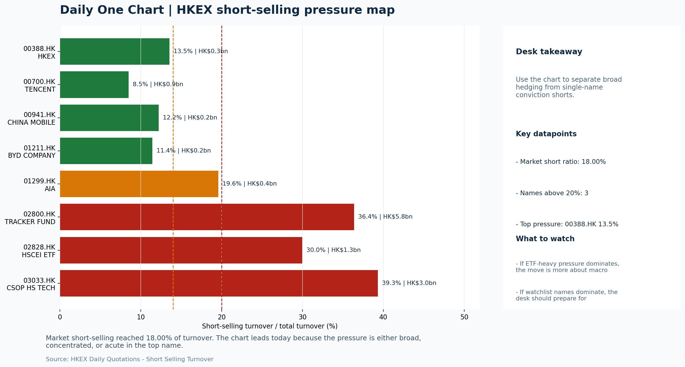

# Morning Research Workbench | 2026-06-17

> Designed for a Hong Kong sell-side commute: Layer 1 `Scan`, Layer 2 `Deep Read`, Layer 3 `Thinking`
> Mode: `Trading Daily` | Keep the report execution-oriented: what mattered in the completed session, what can move Hong Kong leadership, and what needs fast follow-up.
> Briefing date: `2026-06-17` | Review date: `2026-06-16` | Global request: `2026-06-16` | HK/China request: `2026-06-16` | Market effective date: `2026-06-16` | Generated at: `2026-06-17 08:24:56`

## Executive Summary

- **Market pulse:** The June 16 session delivered a bifurcated Hong Kong tape - HSTECH outperformed (+1.26%) despite Nasdaq's -1.89% drop, supported by softer USD and lower yields, but thin turnover (0.78x 20D).
- **Hong Kong lens:** Hong Kong growth / internet led. Hong Kong's local session showed bifurcated leadership - HSTECH +1.26% versus FXI -1.57% - but thin turnover (0.78x the 20-day average) and elevated short-selling (18.00%.
- **Top catalysts:** INTC -6.33%; WTI crude -6.11%.

## Visual Dashboard

## Layer 1 | Scan (5-10 min)

### 1.1 One-Line Market Pulse
The June 16 session delivered a bifurcated Hong Kong tape - HSTECH outperformed (+1.26%) despite Nasdaq's -1.89% drop, supported by softer USD and lower yields, but thin turnover (0.78x 20D) and an elevated 18% short-selling ratio mean the growth-leadership move needs confirmation before it becomes actionable rather than noise heading into the June 17 open.

### 1.2 Global Asset Price Dashboard

| Asset | Last | 1D move | Read |
| --- | --- | --- | --- |
| S&P 500 | 7,511.35 | -0.57% | US large-cap risk appetite |
| Nasdaq 100 | 29,968.13 | **-1.89%** | Growth and duration leadership |
| Hang Seng Index | 24,842.67 | +0.50% | Hong Kong broad beta |
| Hang Seng TECH | 4.6680 | +1.26% | Hong Kong growth / platform read-through |
| CSI 300 | 4,777.32 | +1.16% | Mainland large-cap tone |
| US 10Y | 4.4280 | -1.31% | Global discount-rate anchor |
| China 10Y | 1.73% | -1.2bp | China local rates anchor \| Live public \| Eastmoney \| 2026-06-16 |
| CN-US 10Y spread | -269.8bp | +2.8bp | Relative carry and macro-pressure gauge \| Live public \| Eastmoney \| 2026-06-16 |
| DXY | 99.52 | -0.11% | Dollar liquidity impulse |
| USD/CNH | 6.7165 | -0.69% | Offshore China risk appetite |
| USD/HKD | 7.8345 | -0.00% | Linked-exchange regime stress check |
| Brent crude | 79.47 | **-4.45%** | Energy / geopolitics |
| COMEX gold | 4,357.60 | +0.68% | Hedge demand / real yields |
| Copper | 6.4960 | +0.21% | Global growth proxy |
| VIX | 16.41 | +1.30% | US stress barometer |

### 1.3 Hong Kong Key Data Quick Check

| Check | Value | Status | Source / as of | Why it matters |
| --- | --- | --- | --- | --- |
| Main Board turnover vs 20D | 0.78x \| -22% vs 20D | Live local | HKEX \| 2026-06-16 | Trailing 20-session average turnover was HK$321.4bn. |
| Southbound / Northbound net flow | Southbound Net HK$3.5bn \| turnover HK$110.7bn \| Northbound Turnover HK$383.0bn \| net not reported | Live local | HKEX Connect \| 2026-06-16 | Southbound net buy is calculated from HKEX disclosed buy and sell turnover. |
| Short-selling ratio | 18.00% | Live local | HKEX \| 2026-06-16 | Official HKEX stock-level short-selling table, aggregated as a share of total market turnover. |
| AH premium index | 20.54% | Live public | Yahoo \| 2026-06-16 | Simple average across 19 A/H pairs; use dispersion rather than the average alone. |
| USD/HKD spot vs band | 7.8345 \| band 7.7500 to 7.8500 | Live quote + local | Yahoo \| 2026-06-16 | Inside the linked-exchange band without immediate boundary stress. Official Convertibility Undertakings define the linked-rate stress boundaries for USD/HKD. |
| HIBOR 1M | 2.85% | Live local | HKMA \| 2026-06-16 | 1M HIBOR is the cleanest quick read for Hong Kong funding conditions and equity-duration pressure. |
| Aggregate Balance | HK$53.9bn | Live local | HKMA \| 2026-06-16 | Aggregate Balance helps frame whether linked-rate liquidity conditions are tight or comfortable. |
| Hong Kong leadership | Hong Kong growth / internet led | Proxy | HSI / HSCEI / HSTECH relative perf \| 2026-06-16 | Use HSI / HSCEI / HSTECH relative moves as the opening style read. |

### 1.4 Risk Dashboard
**Composite risk score:** `30.5/100` | **Regime:** `Risk-off`

| Component | Score impact | Evidence |
| --- | --- | --- |
| US beta | -3.4 | S&P 500 -0.57% |
| HK growth | +6.3 | HSTECH +1.26% |
| Offshore China proxy | -7.9 | FXI -1.57% |
| Dollar pressure | +1.1 | DXY -0.11% |
| Volatility | -2.6 | VIX +1.30% |
| HK short-selling | -8 | Short-selling ratio 18.00% |

### 1.5 Morning Checklist
1. **INTC -6.33%**
 Mover attribution | Announcement / expectations | Guidance reset and margin pressure
2. **WTI crude -6.11%**
 High-frequency data | Softer oil argues for a more cautious cyclical-growth read.
3. **Neutral backdrop with USD softer, lower yields supported duration, and Gold outperformed Oil**
 Overnight regime | Start by deciding whether the day is about Neutral conditions or a style pivot.
4. **CPI MoM (Released)**
 Macro / policy | Rates expectations, the dollar, and growth-equity valuation | Industries: Technology, Internet, Brokers
5. **Trade Balance (Released)**
 Macro / policy | Watch whether it changes the day's core market narrative | Industries: Market-wide

## Layer 2 | Deep Read (20-30 min)

### 2.1 Overnight Overseas Market Review
#### Market Setup
**Core tape.** US equities gave back gains as the Nasdaq 100 fell 1.89%, pressured by Intel's guidance reset (-6.33%) and persistent concerns about semiconductor margins, while the S&P 500 dipped 0.57%.
**Main driver.** Euro Stoxx 50 bucked the tone at +0.68%, but the bigger cross-asset signal was Oil's sharp 6.11% decline against a flat Gold print - yielding a 6.1pp divergence that frames the session as defensive rather than risk-on.
**HK relevance.** USD softened modestly (DXY -0.11%, USD/CNH -0.69%) and the US 10Y yield fell 1.31%, which normally supports duration but the equity response was muted, suggesting the move was more about hedging than conviction.

#### Key Drivers
- Intel's guidance cut (-6.33%) reset semiconductor margin expectations, weighing on US growth names and amplifying Nasdaq weakness.
- Oil's 6.11% drop with a 7.3pp intraday range signals demand concerns or supply normalization, reversing commodity-linked tailwinds.
- Lower US 10Y yields (-1.31%) provided an offsetting tailwind for duration.
- USD/CNH's 0.69% decline and DXY's 0.11% drop reflect softer dollar sentiment.

#### Hong Kong Read-Through
**Desk lens.** Hong Kong growth / internet led.
**Opening implication.** Hong Kong's local session showed bifurcated leadership - HSTECH +1.26% versus FXI -1.57% - but thin turnover (0.78x the 20-day average) and elevated short-selling (18.00% of turnover) argue against chasing the move.
- **Cross-market read:** Hang Seng +0.50% / HSCEI +0.02% / HSTECH +1.26%.
- **Cross-market read:** Offshore China proxy FXI -1.57% and USD/CNH -0.69% frame cross-border risk appetite.
- **Cross-market read:** USD/HKD last traded around 7.8345, which keeps the Hong Kong funding lens in focus.

#### Watch Points
- USD composite moved lower by -0.16pct intraday, with a 0.241pct range.
- Main turning points appeared around 2026-06-16 08:10 peak / 2026-06-16 08:25 peak / 2026-06-16 08:40 trough, suggesting event-driven repricing.
- The biggest cross-asset divergence was Gold versus Oil, a spread of 6.079pct.
- Gold moved +0.00pct intraday with a 0.908pct high-low range.

**Curated overnight stories**
1. **INTC -6.33%; Guidance reset and margin pressure**
 Why it matters: Intel's guidance cut signals persistent pressure on semiconductor margins and raises questions about enterprise PC refresh cycles.
 HK read-through: Direct read-through for SMIC and other semiconductor names; indirect pressure on hardware and tech hardware subsectors.
2. **WTI crude -6.11%; Softer oil argues for a more cautious cyclical-growth read**
 Why it matters: Sharp oil decline reverses the commodity-linked tailwind seen in recent sessions. Signals softening demand expectations or supply normalization, challenging energy-sector.
 HK read-through: Negative for PetroChina, CNOOC, and Sinopec. Also reduces the cyclical growth argument for HK-linked industrials and shipping names.
3. **Neutral backdrop with USD softer, lower yields supported duration, Gold outperformed Oil**
 Why it matters: The established overnight regime shows dollar weakness and falling yields. This backdrop is constructive for duration-sensitive HK names and reduces pressure on Hong Kong.
 HK read-through: Supports REITs, utilities, and bond-proxy plays. Provides offset against tech and energy weakness. Gold outperforming may benefit mainland gold miners with HK listings.
4. **CPI MoM released; Rates expectations, the dollar, and growth-equity valuation**
 Why it matters: US CPI data informs Fed rate path expectations. Any softness in inflation supports the softer-dollar regime.
 HK read-through: Market-wide impact through dollar moves and rate-sensitivity. Particularly relevant for HK banks (NIM direction), REITs, and growth-equity multiples.
5. **Trade Balance released; External demand signals for China/HK**
 Why it matters: Trade balance data provides the first read on whether export momentum is sustaining. Weak trade data could reinforce growth concerns for China-linked equities.
 HK read-through: Market-wide read. Directly relevant for shipping, logistics, and export-heavy sectors. Could confirm or challenge the cautious cyclical-growth narrative.

### 2.2 Hong Kong / A-share Previous-Day Review
#### Local Tape Setup
**Local read.** The June 16 session delivered a clean style split: HSTECH outperformed (+1.26%) while FXI underperformed (-1.57%).
**Verification point.** Southbound flows provided underlying support - net HK$3.5bn on turnover HK$110.7bn, with KB Laminates (+HK$1.7bn net) and TRACKER FUND (+HK$2.4bn net) as top buys - partially offset by Tencent (-HK$1.6bn net) and BABA.
**Risk to watch.** However, Main Board turnover at 0.78x the 20-day average and an elevated 18% short-selling ratio mean the day move is fragile.

#### Style and Local Leadership
**Style leadership.** Hong Kong growth / internet led.
- **Cross-market read:** Hang Seng +0.50% / HSCEI +0.02% / HSTECH +1.26%.
- **Cross-market read:** Offshore China proxy FXI -1.57% and USD/CNH -0.69% frame cross-border risk appetite.
- **Cross-market read:** USD/HKD last traded around 7.8345, which keeps the Hong Kong funding lens in focus.

#### Flow Confirmation
Official Stock Connect evidence is available; use Section 2.3 to confirm whether local money supports the price action.

#### Follow-Through Checklist
**Follow-through check.** Confirm June 17 follow-through by watching whether HSTECH ETF (3033.HK) volume ratio rises above 0.64x and whether CSI 300 sectors (semiconductors, power equipment turnover confirmed) align with the same growth read or show divergence.

### 2.3 Flow Tracker and Attribution
#### Cross-Asset Attribution v1

| Driver | Direction | Score | Evidence | HK implication |
| --- | --- | --- | --- | --- |
| Oil and geopolitics | supportive | 3.56 | Oil moved -4.45%. | Split the read between energy/cyclicals support and margin/geopolitical pressure. |
| US growth-style transmission | drag | 2.65 | Nasdaq 100 moved -1.89%. | Hong Kong growth and platform names should be tested first at the open. |
| Hong Kong participation | drag | 2.23 | Main Board turnover was 0.78x the 20-session average. | Thin turnover makes index moves easier to fade. |
| Short-selling pressure | drag | 2.1 | HKEX short-selling ratio was 18.00%. | Elevated short activity argues for extra confirmation before chasing rebounds. |
| Rates impulse | supportive | 1.57 | US 10Y yield proxy moved -1.31%. | Lower yields help long-duration growth; higher yields pressure valuation-sensitive |
| Dollar / CNH pressure | supportive | 1.03 | DXY -0.11% / USD-CNH -0.69% | A stable or softer CNH makes Hong Kong follow-through more credible. |

#### Flow Tracker
##### Flow Takeaways
- Short-selling pressure is elevated, so local rebounds need cleaner breadth and flow confirmation.
- Stock Connect Southbound: net HK$3.5bn on turnover HK$110.7bn (as of 2026-06-16).
- Stock Connect Northbound: turnover RMB383.0bn; public file provides total turnover/top active names, not full net-buy.
- AH premium: simple covered-pair average +20.54%; widest premium: China Communications Construction 71.43%.

##### Stock Connect Southbound Active Names

| Rank | Ticker | Name | Buy | Sell | Net buy |
| --- | --- | --- | --- | --- | --- |
| 4 | 02800.HK | TRACKER FUND | HK$2,356.1mn | HK$5.8mn | HK$2,350.3mn |
| 2 | 01888.HK | KB LAMINATES | HK$3,354.4mn | HK$1,655.1mn | HK$1,699.4mn |
| 1 | 00700.HK | TENCENT | HK$2,304.7mn | HK$3,943.3mn | HK$-1,638.6mn |
| 2 | 09988.HK | BABA-W | HK$1,152.6mn | HK$2,785.6mn | HK$-1,633.0mn |
| 6 | 00148.HK | KINGBOARD HLDG | HK$2,523.8mn | HK$1,122.9mn | HK$1,400.9mn |

##### AH Premium Dispersion

| Name | A ticker | H ticker | Premium | As of |
| --- | --- | --- | --- | --- |
| China Communications Construction | 601800.SS | 1800.HK | +71.43% | 2026-06-16 |
| China Railway Construction | 601186.SS | 1186.HK | +47.27% | 2026-06-16 |
| China Railway | 601390.SS | 0390.HK | +45.06% | 2026-06-16 |
| China Life | 601628.SS | 2628.HK | +37.43% | 2026-06-16 |
| New China Life | 601336.SS | 1336.HK | +35.88% | 2026-06-16 |

##### HKEX Short-Selling Watch

| Ticker | Name | Short ratio | Short turnover | Total turnover |
| --- | --- | --- | --- | --- |
| 00388.HK | HKEX | 13.54% | HK$0.3bn | HK$2.1bn |
| 00700.HK | TENCENT | 8.49% | HK$0.9bn | HK$10.9bn |
| 00941.HK | CHINA MOBILE | 12.21% | HK$0.2bn | HK$1.4bn |
| 01211.HK | BYD COMPANY | 11.43% | HK$0.2bn | HK$1.5bn |
| 01299.HK | AIA | 19.59% | HK$0.4bn | HK$1.8bn |

- **Short-value leaders:** 02800.HK TRACKER FUND (HK$5.8bn); 03033.HK CSOP HS TECH (HK$3.0bn); 07709.HK XL2CSOPHYNIX (HK$2.5bn); 01888.HK KB LAMINATES (HK$1.7bn).

### 2.4 Macro and Policy Tracking
**Desk read.** The US CPI for May surprised to the upside at 0.3% MoM (vs. 0.2% consensus), yet overnight markets saw a softer dollar and lower Treasury yields - a typical 'hawkish data, dovish reaction' pattern that warrants caution.

**Market sensitivity.** If the initial yield dip reflects technical positioning rather than a durable repricing, the hot print still leaves duration-sensitive Hong Kong sectors vulnerable to a reversal.

**HK implication.** China's trade balance (USD 85.2bn, above forecast) offers a modest domestic tailwind.

**Macro watchpoints**
- US 10Y yield and DXY post-US retail sales and during Powell's speech - any bounce would test duration-rich Hong Kong names.
- Hong Kong Technology and Internet sectors: whether they hold opening gains if US yields creep higher.
- Consumer discretionary and e-commerce names on any retail sales surprise.
- Gold miners' relative performance as a cross-check on the real-rate narrative.

| Time | Region | Event | Status | Desk read |
| --- | --- | --- | --- | --- |
| 20:30 | US | CPI MoM | Released | Impact: Rates expectations, the dollar, and growth-equity valuation \| Attention: 5/5 \| Industries: Technology, Internet, Brokers |
| 09:30 | China | Trade Balance | Released | Impact: Watch whether it changes the day's core market narrative \| Attention: 3/5 \| Industries: Market-wide |
| 20:30 | US | Retail Sales MoM | Upcoming | Impact: Consumer resilience, growth expectations, and risk-asset pricing \| Attention: 5/5 \| Industries: Consumer, E-commerce, Consumer discretionary |
| 09:20 | China | Loan Prime Rate | Upcoming | Impact: Watch whether it changes the day's core market narrative \| Attention: 3/5 \| Industries: Market-wide |
| 22:00 | Federal Reserve | Jerome Powell: Economic outlook remarks | Central bank | Impact: Policy path, liquidity conditions, and cross-asset risk appetite \| Attention: 5/5 \| Industries: Technology, Financials, Gold |
| 10:00 | PBOC | Open Market Operations Desk: Daily liquidity operation window | Central bank | Impact: Policy path, liquidity conditions, and cross-asset risk appetite \| Attention: 3/5 \| Industries: Technology, Financials, Gold |

#### Positioning and Risk Backdrop
- Options activity centered on KWEB Call, with Vol/OI at 1.88x and a bullish bias.
- Put/Call structure shows equity 0.68 / index 1.15, implying Single-stock optimism with index hedging.
- Geopolitics: Middle East | Regional tension remains elevated | Impact: Oil, freight costs, and safe-haven demand
- Geopolitics: US-China | Technology export-control rhetoric remains active | Impact: China internet, semiconductors, and supply chains

### 2.5 Key Company and Sector Events
No high-conviction sector story cleared the main-report relevance gate for this run.

#### HKEX Announcements

| Grade | Ticker | Type | Release time | Title |
| --- | --- | --- | --- | --- |
| A | 00526.HK | Profit warning | 2026-06-16 | Profit warning / alert announcement |
| A | 00776.HK | Profit warning | 2026-06-16 | Profit warning / alert announcement |
| A | 01273.HK | Profit warning | 2026-06-16 | Profit warning / alert announcement |
| A | 01382.HK | Profit warning | 2026-06-16 | Profit warning / alert announcement |
| A | 01546.HK | Profit warning | 2026-06-16 | Profit warning / alert announcement |
| A | 08091.HK | Profit warning | 2026-06-16 | Profit warning / alert announcement |
| A | 00147.HK | Profit warning | 2026-06-15 | Profit warning / alert announcement |
| A | 00475.HK | Profit warning | 2026-06-15 | Profit warning / alert announcement |

#### Earnings / Results Watch

| Ticker | Company | Timing | Expectation framing |
| --- | --- | --- | --- |
| 0700.HK | Tencent Holdings | After Market Close | EPS est. 4.15 HKD \| revenue est. 163.2bn HKD |
| 0388.HK | Hong Kong Exchanges and Clearing | Before Market Open | EPS est. 2.81 HKD \| revenue est. 6.0bn HKD |

#### Rating Changes
- **9988.HK** | Morgan Stanley | Upgrade | Equal Weight -> Overweight | PT 92 -> 105

#### IPO Watch
- IPO and grey-market monitoring is not yet part of the standard production pack.

### 2.6 Today's Core Names
#### Core coverage

| Name | Ticker | Last | 1D | Range position | Morning note |
| --- | --- | --- | --- | --- | --- |
| Meituan | 3690.HK | 75.30 | -3.77% | Bottom of range | Short-term pressure is visible; check for a fundamental or regulatory reason. |
| Tencent | 0700.HK | 447.40 | -2.65% | Bottom of range | Short-term pressure is visible; check for a fundamental or regulatory reason. |

**Recent headlines for Meituan:**
- [Alibaba Bids $1.5 Billion for China Grocer in Meituan Fight](https://finance.yahoo.com/markets/stocks/articles/alibaba-bids-1-5-billion-061524324.html) (Bloomberg)
**Recent headlines for Tencent:**
- [Enflame Wins IPO Approval for 6 Billion Yuan AI Chip Listing](https://finance.yahoo.com/markets/stocks/articles/enflame-wins-ipo-approval-6-202143008.html) (GuruFocus.com)

#### Priority follow-up

| Name | Ticker | Last | 1D | Range position | Morning note |
| --- | --- | --- | --- | --- | --- |
| BYD Company | 1211.HK | 84.05 | -1.81% | Bottom of range | The name sits near the bottom of its recent range and is worth monitoring for a catalyst-led reversal. |
| AIA | 1299.HK | 75.20 | -1.70% | Mid-range | Positioning is neutral for now, so use it mainly to monitor marginal information changes. |

## Layer 3 | Thinking (10-15 min)

### 3.1 Rotating Theme Deep Dive

| Field | Read |
| --- | --- |
| Theme | Innovative Biotech and Out-Licensing |
| Angle for the day | Watch whether clinical data, approvals, and licensing momentum are still supporting the innovative-healthcare rerating story. |

**Theme desk read**
**Core thesis.** The weekly Innovative Biotech and Out-Licensing theme is set against a backdrop where lower US 10Y yields (-1.31%) and softer WTI crude (-6.11%) lean supportive for duration-sensitive growth sectors like healthcare.
**Evidence.** However, the supplied facts lack specific biotech or out-licensing names, making it impossible to directly assess whether clinical data or licensing momentum are actually driving a re-rating.
**What to test.** The nearby coverage list (Meituan, BYD) does not map to this theme, so the angle remains a conceptual watch rather than an actionable trade from the provided tickers.

**Signals to keep in mind**
- WTI crude -6.11%: Softer oil argues for a more cautious cyclical-growth read.
- US 10Y -1.31%: Lower yields tend to support growth style and gold.

**LLM watch items:**
- US Retail Sales (Jun 17) outcome to gauge consumer resilience and impact on growth-style positioning
- China Loan Prime Rate decision (Jun 17) to see if a cut reinforces accommodative financial conditions for growth sectors
- Any forthcoming clinical trial readouts or out-licensing announcements from innovative healthcare names (not covered in today's ticker set)

**Related names to keep close:**

| Name | Ticker | Bucket | Morning read |
| --- | --- | --- | --- |
| Meituan | 3690.HK | Core coverage | Short-term pressure is visible; check for a fundamental or regulatory reason. |
| BYD Company | 1211.HK | Priority follow-up | The name sits near the bottom of its recent range and is worth monitoring for a catalyst-led reversal. |

### 3.2 Today Ahead and Trading Calendar
- Macro: CPI MoM is the first item to anchor the open and the rates/FX response.
- Corporate / event: Meituan: Order trends and margin commentary is the cleanest same-day catalyst to prepare for.

**Same-day macro docket**

| Time | Country | Event | Status | Detail |
| --- | --- | --- | --- | --- |
| 20:30 | US | CPI MoM | Released | Actual 0.3% / Forecast 0.2% / Prior 0.4% |
| 09:30 | China | Trade Balance | Released | Actual USD 85.2bn / Forecast USD 79.0bn / Prior USD 80.6bn |
| 20:30 | US | Retail Sales MoM | Upcoming | Forecast 0.3% / Prior 0.6% |
| 09:20 | China | Loan Prime Rate | Upcoming | Forecast 3.45% / Prior 3.45% |
| 22:00 | Federal Reserve | Jerome Powell: Economic outlook remarks | Central bank | speech |

**Same-day catalyst list**

| Date | Time | Category | Event | Importance |
| --- | --- | --- | --- | --- |
| 2026-06-17 | | Core coverage | Meituan: Order trends and margin commentary | 3 |
| 2026-06-17 | | Core coverage | Tencent: Game grossing trends and ad-demand checks | 3 |
| 2026-06-17 | | Core coverage | Alibaba: Cloud demand and GMV updates | 3 |
| 2026-06-17 | | Core coverage | HKEX: Turnover data and IPO pipeline updates | 3 |

**Next few sessions**

| Date | Category | Event | Impact |
| --- | --- | --- | --- |
| 2026-06-17 | Core coverage | Meituan: Order trends and margin commentary | High-frequency read on local services demand and platform competition |
| 2026-06-17 | Core coverage | Tencent: Game grossing trends and ad-demand checks | Core offshore China platform proxy for gaming, ads, and AI monetization |
| 2026-06-17 | Core coverage | Alibaba: Cloud demand and GMV updates | Key read-through for China consumption, cloud, and platform regulation |
| 2026-06-17 | Core coverage | HKEX: Turnover data and IPO pipeline updates | Direct proxy for Hong Kong market turnover, listings, and southbound |

### 3.3 Daily One Chart
**Daily One Chart | HKEX short-selling pressure map**

**Chart read.** Market short-selling reached 18.00% of turnover.
**Why it matters.** The chart leads today because the pressure is either broad, concentrated, or acute in the top name.

_Source: HKEX Daily Quotations - Short Selling Turnover_

## Traceable Appendix

### Report Metadata
> Date policy: Review date 2026-06-16 is treated as `Trading Daily`. | Global request date is 2026-06-16; adapter effective date is 2026-06-16 and summary date is 2026-06-16. | HK/China local data date is 2026-06-16; role: same-session local cash tape.
> Market data quality: Coverage: `31/32` | Stale items (>1d): `1` | Missing: `1`
> Report quality: `82.4/100` | Grade `B` | Status `usable with caveats`

### Key Questions to Keep in Mind
- Is risk appetite rising or fading? The overnight tape reads closer to `Neutral`.
- Did rates expectations move? Focus on whether US 10Y, DXY, and growth style moved together.
- Were commodities the real story? Watch WTI and gold for geopolitics versus inflation signals.
- Is Hong Kong setup internet-led, SOE-led, or broad beta-led? Compare HSTECH, HSCEI, and HSI.
- Did offshore markets move China risk appetite? Focus on HSI, FXI, USD/CNH, and USD/HKD.

### Report Quality and Validation
- **Quality score:** 82.4/100 | **Grade:** B | **Status:** usable with caveats
- **Run summary:** 7 healthy | 1 caveat | 0 failed
- **Release recommendation:** Send with caveats | The report is usable, but the advisory guidance should travel with it so readers understand the data gaps.

| Source | Status | Bucket |
| --- | --- | --- |
| Market data | ok | healthy |
| Sector and company news | ok | healthy |
| Movers and short selling | ok | healthy |
| Stock Connect | ok | healthy |
| A/H premium | ok | healthy |
| Hong Kong local package | ok | healthy |
| China rates | ok | healthy |
| Narrative overlay | partial | caveat |

**Desk-use guidance summary:** 0 blocking | 1 advisory

**Desk-use guidance**
- **Advisory:** Use deterministic sections as primary support; the narrative overlay was partial or unavailable on this run.

| Component | Score | Weight | Read |
| --- | --- | --- | --- |
| Market data coverage | 96.9 | 0.3 | 31/32 core market fields available. |
| Hong Kong local metrics | 82.3 | 0.25 | 8 live, 3 proxy, 0 unavailable local checks. |
| Key public adapters | 100.0 | 0.2 | 4/4 key adapters were available or partially available. |
| Narrative overlay health | 51.4 | 0.15 | 2/7 narrative overlay tasks succeeded or used validated cache; 1 error(s). |
| Fact-check guardrail | 50.0 | 0.1 | Checked 6 numeric claims; 2 numeric mismatch(es), 0 logic warning(s); 2 critical, 0 review. |

**Quality warnings**
- Narrative overlay health is weak: 2/7 narrative overlay tasks succeeded or used validated cache; 1 error(s).
- Fact-check guardrail is weak: Checked 6 numeric claims; 2 numeric mismatch(es), 0 logic warning(s); 2 critical, 0 review.
- Narrative fact-check guardrail produced warnings; review the validation table before relying on narrative sections.

**Narrative fact-check guardrail**
- Checked 6 numeric claims; 2 numeric mismatch(es), 0 logic warning(s); 2 critical, 0 review.

| Severity | Field | Claim | Type | Claimed | Expected | Snippet |
| --- | --- | --- | --- | --- | --- | --- |
| critical | tasks.overnight_review.paragraph | Nasdaq 100 | change_pct | 1.89 | -1.89 | US equities gave back gains as the Nasdaq 100 fell 1.89%, pressured by Intel's guidance reset (-6.33%) and |
| critical | tasks.overnight_review.paragraph | US 10Y | change_pct | 1.31 | -1.31 | ned modestly (DXY -0.11%, USD/CNH -0.69%) and the US 10Y yield fell 1.31%, which normally supports duration but the equity |

**Adapter status**

| Adapter | Status |
| --- | --- |
| Stock Connect | ok |
| A/H premium | ok |
| HKEX announcements | ok |
| China rates | ok |

### Source Links
- [Alibaba Bids $1.5 Billion for China Grocer in Meituan Fight](https://finance.yahoo.com/markets/stocks/articles/alibaba-bids-1-5-billion-061524324.html) (Bloomberg)
- [Enflame Wins IPO Approval for 6 Billion Yuan AI Chip Listing](https://finance.yahoo.com/markets/stocks/articles/enflame-wins-ipo-approval-6-202143008.html) (GuruFocus.com)
- [Alibaba Group Holding Ltd (BABA): Looking Beyond Pentagon's Black List](https://finance.yahoo.com/technology/ai/articles/alibaba-group-holding-ltd-baba-185858436.html) (Insider Monkey)
- [Alibaba Unveils AI Models for Robots](https://finance.yahoo.com/technology/ai/articles/alibaba-unveils-ai-models-robots-152238915.html) (GuruFocus.com)
- [00526.HK Profit warning / alert announcement](http://www1.hkexnews.hk/listedco/listconews/sehk/2026/0616/2026061601000.pdf) (HKEXnews)
- [00776.HK Profit warning / alert announcement](http://www1.hkexnews.hk/listedco/listconews/sehk/2026/0616/2026061601628.pdf) (HKEXnews)
- [01273.HK Profit warning / alert announcement](http://www1.hkexnews.hk/listedco/listconews/sehk/2026/0616/2026061601258.pdf) (HKEXnews)
- [01382.HK Profit warning / alert announcement](http://www1.hkexnews.hk/listedco/listconews/sehk/2026/0616/2026061600728.pdf) (HKEXnews)
- [01546.HK Profit warning / alert announcement](http://www1.hkexnews.hk/listedco/listconews/sehk/2026/0616/2026061601072.pdf) (HKEXnews)
- [08091.HK Profit warning / alert announcement](http://www1.hkexnews.hk/listedco/listconews/gem/2026/0616/2026061601380.pdf) (HKEXnews)
- [00147.HK Profit warning / alert announcement](http://www1.hkexnews.hk/listedco/listconews/sehk/2026/0615/2026061501126.pdf) (HKEXnews)
- [00475.HK Profit warning / alert announcement](http://www1.hkexnews.hk/listedco/listconews/sehk/2026/0615/2026061500466.pdf) (HKEXnews)

## Supplementary Visual Appendix

This appendix is professional-path only. It keeps a traceable index of the report visuals and the deterministic chart cues used to frame the morning note, without injecting the legacy intraday chart pack.

### Visual Index

| Visual | Path | Role |
| --- | --- | --- |
| Visual Dashboard | `charts/dashboard_2026-06-17.png` | Cross-asset regime board and Hong Kong local tape snapshot. |
| Daily One Chart | `charts/daily_one_chart_2026-06-17.png` | Single highest-conviction visual story for the day. |

### Deterministic Chart Cues
- FX / liquidity: USD composite moved lower by -0.16pct intraday, with a 0.241pct range.
- FX / liquidity: Main turning points appeared around 2026-06-16 08:10 peak / 2026-06-16 08:25 peak / 2026-06-16 08:40 trough, suggesting event-driven repricing rather than a clean one-way USD move.
- Cross-asset: The biggest cross-asset divergence was Gold versus Oil, a spread of 6.079pct.
- Cross-asset: Gold moved +0.00pct intraday with a 0.908pct high-low range.
- Cross-asset: Oil moved -6.08pct intraday with a 7.329pct high-low range.
- Cross-asset: Bitcoin moved -0.93pct intraday with a 2.138pct high-low range.

### Risk Dashboard Components

| Component | Score impact | Evidence |
| --- | --- | --- |
| US beta | -3.4 | S&P 500 -0.57% |
| HK growth | +6.3 | HSTECH +1.26% |
| Offshore China proxy | -7.9 | FXI -1.57% |
| Dollar pressure | +1.1 | DXY -0.11% |
| Volatility | -2.6 | VIX +1.30% |
| HK short-selling | -8 | Short-selling ratio 18.00% |
