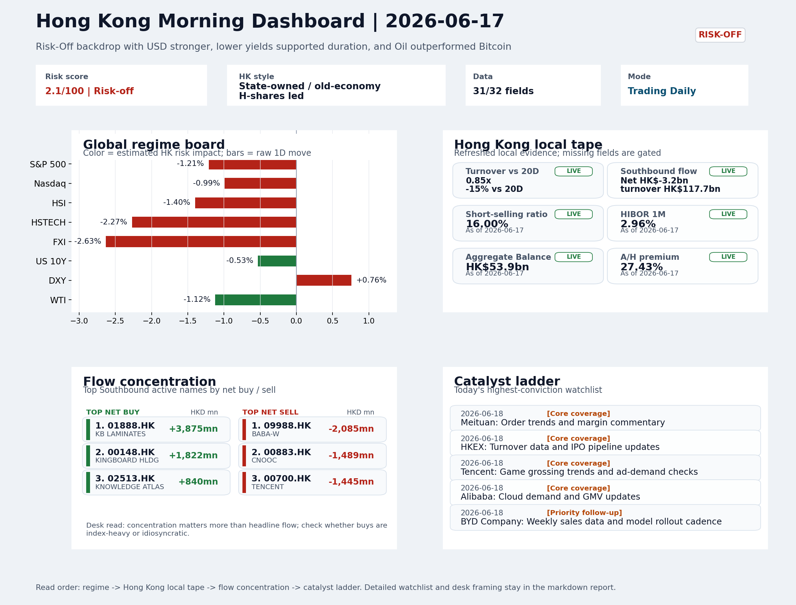
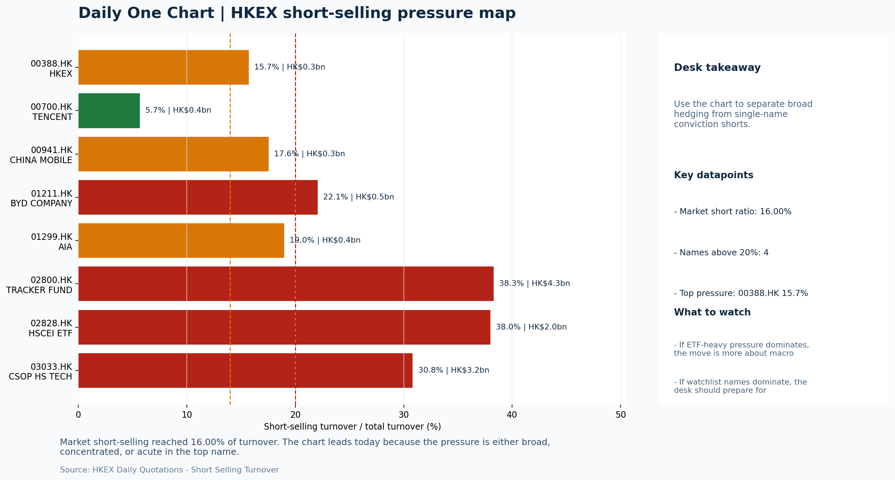

# Morning Research Workbench | 2026-06-18

> Designed for a Hong Kong sell-side commute: Layer 1 `Scan`, Layer 2 `Deep Read`, Layer 3 `Thinking`
> Mode: `Trading Daily` | Keep the report execution-oriented: what mattered in the completed session, what can move Hong Kong leadership, and what needs fast follow-up.
> Briefing date: `2026-06-18` | Review date: `2026-06-17` | Global request: `2026-06-17` | HK/China request: `2026-06-17` | Market effective date: `2026-06-17` | Generated at: `2026-06-18 08:23:37`

## Executive Summary

- **Market pulse:** Fed hawkishness under Chairman Warsh drove the Risk-Off session, with USD strength overwhelming the partial duration support from lower yields, leaving Hong Kong growth (HSTECH -2.27%).
- **Hong Kong lens:** Hong Kong growth / internet led. A Risk-Off open is likely given HSI futures pricing, but FXI (-2.63%) and HSTECH (-2.27%) suggest the downside will concentrate in growth and platform names.
- **Top catalysts:** VIX +12.37%; INTC -6.33%.

## Visual Dashboard

## Layer 1 | Scan (5-10 min)

### 1.1 One-Line Market Pulse
Fed hawkishness under Chairman Warsh drove the Risk-Off session, with USD strength overwhelming the partial duration support from lower yields, leaving Hong Kong growth (HSTECH -2.27%) and the offshore China proxy (FXI -2.63%) as the most damaged instruments in thin turnover.

### 1.2 Global Asset Price Dashboard

| Asset | Last | 1D move | Read |
| --- | --- | --- | --- |
| S&P 500 | 7,420.10 | -1.21% | US large-cap risk appetite |
| Nasdaq 100 | 29,670.95 | -0.99% | Growth and duration leadership |
| Hang Seng Index | 24,493.95 | -1.40% | Hong Kong broad beta |
| Hang Seng TECH | 4.5620 | **-2.27%** | Hong Kong growth / platform read-through |
| CSI 300 | 4,777.32 | +1.16% | Mainland large-cap tone |
| US 10Y | 4.4630 | -0.53% | Global discount-rate anchor |
| China 10Y | 1.73% | -0.5bp | China local rates anchor \| Live public \| Eastmoney \| 2026-06-17 |
| CN-US 10Y spread | -276.3bp | -6.5bp | Relative carry and macro-pressure gauge \| Live public \| Eastmoney \| 2026-06-17 |
| DXY | 100.30 | +0.76% | Dollar liquidity impulse |
| USD/CNH | 6.7330 | -0.44% | Offshore China risk appetite |
| USD/HKD | 7.8326 | -0.02% | Linked-exchange regime stress check |
| Brent crude | 78.76 | -0.25% | Energy / geopolitics |
| COMEX gold | 4,314.10 | -0.39% | Hedge demand / real yields |
| Copper | 6.3970 | -1.42% | Global growth proxy |
| VIX | 18.44 | **+12.37%** | US stress barometer |

### 1.3 Hong Kong Key Data Quick Check

| Check | Value | Status | Source / as of | Why it matters |
| --- | --- | --- | --- | --- |
| Main Board turnover vs 20D | 0.85x \| -15% vs 20D | Live local | HKEX \| 2026-06-17 | Trailing 20-session average turnover was HK$319.3bn. |
| Southbound / Northbound net flow | Southbound Net HK$-3.2bn \| turnover HK$117.7bn \| Northbound Turnover HK$385.1bn \| net not reported | Live local | HKEX Connect \| 2026-06-17 | Southbound net buy is calculated from HKEX disclosed buy and sell turnover. |
| Short-selling ratio | 16.00% | Live local | HKEX \| 2026-06-17 | Official HKEX stock-level short-selling table, aggregated as a share of total market turnover. |
| AH premium index | 27.43% | Live public | Yahoo \| 2026-06-17 | Simple average across 17 A/H pairs; use dispersion rather than the average alone. |
| USD/HKD spot vs band | 7.8326 \| band 7.7500 to 7.8500 | Live quote + local | Yahoo \| 2026-06-17 | Inside the linked-exchange band without immediate boundary stress. Official Convertibility Undertakings define the linked-rate stress boundaries for USD/HKD. |
| HIBOR 1M | 2.96% | Live local | HKMA \| 2026-06-17 | 1M HIBOR is the cleanest quick read for Hong Kong funding conditions and equity-duration pressure. |
| Aggregate Balance | HK$53.9bn | Live local | HKMA \| 2026-06-17 | Aggregate Balance helps frame whether linked-rate liquidity conditions are tight or comfortable. |
| Hong Kong leadership | Hong Kong growth / internet led | Proxy | HSI / HSCEI / HSTECH relative perf \| 2026-06-17 | Use HSI / HSCEI / HSTECH relative moves as the opening style read. |

### 1.4 Risk Dashboard
**Composite risk score:** `2.1/100` | **Regime:** `Risk-off`

| Component | Score impact | Evidence |
| --- | --- | --- |
| US beta | -7.3 | S&P 500 -1.21% |
| HK growth | -10 | HSTECH -2.27% |
| Offshore China proxy | -8 | FXI -2.63% |
| Dollar pressure | -7.6 | DXY +0.76% |
| Volatility | -10 | VIX +12.37% |
| HK short-selling | +0 | Short-selling ratio 16.00% |

### 1.5 Morning Checklist
1. **VIX +12.37%**
 High-frequency data | Higher volatility argues for tighter sizing and tighter stops.
2. **INTC -6.33%**
 Mover attribution | Announcement / expectations | Guidance reset and margin pressure
3. **Risk-Off backdrop with USD stronger, lower yields supported duration, and Oil outperformed Bitcoin**
 Overnight regime | Start by deciding whether the day is about Risk-Off conditions or a style pivot.
4. **CPI MoM (Released)**
 Macro / policy | Rates expectations, the dollar, and growth-equity valuation | Industries: Technology, Internet, Brokers
5. **Trade Balance (Released)**
 Macro / policy | Watch whether it changes the day's core market narrative | Industries: Market-wide

## Layer 2 | Deep Read (20-30 min)

### 2.1 Overnight Overseas Market Review
#### Market Setup
**Core tape.** Global equities fell into a Risk-Off regime as the Fed's first meeting under new Chairman Warsh delivered a hawkish shift - holding rates, stripping out cutting language, and signaling hikes in 2026.
**Main driver.** USD strengthened (+0.76% DXY) while long-end yields fell (-0.53% US 10Y), creating an unusual cross-current where lower yields supported duration but stronger dollar weighed on EM proxies.
**HK relevance.** A sharp VIX spike (+12.37%) and oil outperforming Bitcoin by 2.26% confirm broad risk-off positioning rather than a sector-specific unwind.

#### Key Drivers
- Fed hawkish pivot under Chairman Warsh.
- USD strength (DXY +0.76%) pressured EM and offshore China proxies; FXI's -2.63% was the session's largest single-instrument decline.
- Lower long-end yields (10Y -0.53%) were a partial offset for duration.
- VIX +12.37% confirms elevated volatility regime.

#### Hong Kong Read-Through
**Desk lens.** State-owned / old-economy H-shares led.
**Opening implication.** A Risk-Off open is likely given HSI futures pricing.
- **Cross-market read:** Hang Seng -1.40% / HSCEI -1.62% / HSTECH -2.27%.
- **Cross-market read:** Offshore China proxy FXI -2.63% and USD/CNH -0.44% frame cross-border risk appetite.
- **Cross-market read:** USD/HKD last traded around 7.8326, which keeps the Hong Kong funding lens in focus.

#### Watch Points
- USD composite moved higher by +0.83pct intraday, with a 0.867pct range.
- Main turning points appeared around 2026-06-17 08:15 trough / 2026-06-17 08:30 trough / 2026-06-17 08:50 peak, suggesting event-driven repricing.
- The biggest cross-asset divergence was Oil versus Bitcoin, a spread of 2.26pct.
- Gold moved -1.20pct intraday with a 3.704pct high-low range.

**Curated overnight stories**
1. **Fed holds rates steady, removes cutting bias; Warsh signals more united board**
 Why it matters: New Chairman Warsh's first meeting produced a hawkish shift: the Fed statement was drastically altered to remove easing references, and several members signaled a 2026 rate.
 HK read-through: Negative for HK growth and internet sectors. USD/HKD peg dynamics and higher US rates reduce relative attractiveness of HK equities.
2. **VIX surges +12.37% amid Risk-Off backdrop**
 Why it matters: Volatility has spiked sharply, confirming the Risk-Off regime identified in the session. USD strengthened, yields fell on the long end (supporting duration), while Oil.
 HK read-through: Risk-Off favors defensive sectors in HK: healthcare, utilities, and quality high-dividend names over growth/cyclicals. HSI implied volatility likely elevated.
3. **CPI MoM released; Trade Balance released**
 Why it matters: Both data points landed during the session. CPI informs Fed's inflation trajectory (already hawkish), while Trade Balance can shift daily market narratives.
 HK read-through: HK market sensitive to US inflation via rates expectations. Hot CPI would reinforce Fed hawkishness and further pressure growth-sensitive HK counters.
4. **China pushes for AI safety as G7 summit wraps without Beijing**
 Why it matters: China was excluded from G7 AI governance discussions, choosing instead to articulate its own AI safety framework.
 HK read-through: Relevant for HK-listed China tech and AI-adjacent names (Alibaba, Baidu, Tencent). Sentiment has been fragile on US export controls and AI competition.
5. **INTC -6.33%; guidance reset and margin pressure**
 Why it matters: Intel's sharp decline reflects a guidance reset and margin deterioration. As a US semiconductor bellwether, the move signals ongoing competitive pressure in the chip sector.
 HK read-through: Semi-conductor and hardware names in HK (SMIC, Hua Hong) face indirect sentiment pressure. HK tech index often correlates with US tech weakness.

### 2.2 Hong Kong / A-share Previous-Day Review
#### Local Tape Setup
**Local read.** The risk-off session produced a clear style signal: growth underperformed H-shares (HSTECH -2.27% vs. HSCEI -1.62%), consistent with the Nasdaq drag (Nasdaq 100 -0.99%) and the hawkish Fed repricing narrative.
**Verification point.** Main Board turnover was 0.85x the 20-session average (HK$319.3bn baseline), making the index moves easier to fade.
**Risk to watch.** Southbound net was -HK$3.2bn on combined turnover HK$117.7bn (SSE + SZSE).

#### Style and Local Leadership
**Style leadership.** Hong Kong growth / internet led.
- **Cross-market read:** Hang Seng -1.40% / HSCEI -1.62% / HSTECH -2.27%.
- **Cross-market read:** Offshore China proxy FXI -2.63% and USD/CNH -0.44% frame cross-border risk appetite.
- **Cross-market read:** USD/HKD last traded around 7.8326, which keeps the Hong Kong funding lens in focus.

#### Flow Confirmation
Official Stock Connect evidence is available; use Section 2.3 to confirm whether local money supports the price action.

#### Follow-Through Checklist
**Follow-through check.** Confirm whether growth leadership holds on 2026-06-18: (1) Southbound net flow stabilizes or flips positive - light turnover days can reverse intra-leg; (2) FXI (-2.63%) does not widen the gap over HSTECH.

### 2.3 Flow Tracker and Attribution
#### Cross-Asset Attribution v1

| Driver | Direction | Score | Evidence | HK implication |
| --- | --- | --- | --- | --- |
| Hong Kong participation | drag | 1.53 | Main Board turnover was 0.85x the 20-session average. | Thin turnover makes index moves easier to fade. |
| US growth-style transmission | drag | 1.39 | Nasdaq 100 moved -0.99%. | Hong Kong growth and platform names should be tested first at the open. |
| Global equity beta | drag | 1.21 | S&P 500 moved -1.21%. | Broad beta matters if Hong Kong breadth confirms the overseas signal. |
| Dollar / CNH pressure | drag | 1.14 | DXY +0.76% / USD-CNH -0.44% | A stable or softer CNH makes Hong Kong follow-through more credible. |
| Rates impulse | supportive | 0.64 | US 10Y yield proxy moved -0.53%. | Lower yields help long-duration growth; higher yields pressure valuation-sensitive |

#### Flow Tracker
##### Flow Takeaways
- Turnover is light versus the 20-session baseline, so local moves have weaker conviction.
- Stock Connect Southbound: net HK$-3.2bn on turnover HK$117.7bn (as of 2026-06-17).
- Stock Connect Northbound: turnover RMB385.1bn; public file provides total turnover/top active names, not full net-buy.
- AH premium: simple covered-pair average +27.43%; widest premium: China Communications Construction 78.89%.

##### Stock Connect Southbound Active Names

| Rank | Ticker | Name | Buy | Sell | Net buy |
| --- | --- | --- | --- | --- | --- |
| 1 | 01888.HK | KB LAMINATES | HK$6,337.8mn | HK$2,462.9mn | HK$3,874.8mn |
| 4 | 09988.HK | BABA-W | HK$961.0mn | HK$3,046.0mn | HK$-2,085.0mn |
| 3 | 00148.HK | KINGBOARD HLDG | HK$3,522.6mn | HK$1,700.7mn | HK$1,821.9mn |
| 5 | 00883.HK | CNOOC | HK$1,171.8mn | HK$2,660.9mn | HK$-1,489.1mn |
| 3 | 00700.HK | TENCENT | HK$1,436.1mn | HK$2,881.1mn | HK$-1,445.0mn |

##### AH Premium Dispersion

| Name | A ticker | H ticker | Premium | As of |
| --- | --- | --- | --- | --- |
| China Communications Construction | 601800.SS | 1800.HK | +78.89% | 2026-06-17 |
| China Railway Construction | 601186.SS | 1186.HK | +50.81% | 2026-06-17 |
| China Railway | 601390.SS | 0390.HK | +47.79% | 2026-06-17 |
| China Life | 601628.SS | 2628.HK | +38.34% | 2026-06-17 |
| New China Life | 601336.SS | 1336.HK | +37.36% | 2026-06-17 |

##### HKEX Short-Selling Watch

| Ticker | Name | Short ratio | Short turnover | Total turnover |
| --- | --- | --- | --- | --- |
| 00388.HK | HKEX | 15.70% | HK$0.3bn | HK$1.7bn |
| 00700.HK | TENCENT | 5.66% | HK$0.4bn | HK$7.6bn |
| 00941.HK | CHINA MOBILE | 17.56% | HK$0.3bn | HK$1.4bn |
| 01211.HK | BYD COMPANY | 22.08% | HK$0.5bn | HK$2.2bn |
| 01299.HK | AIA | 18.99% | HK$0.4bn | HK$2.0bn |

- **Short-value leaders:** 02800.HK TRACKER FUND (HK$4.3bn); 03033.HK CSOP HS TECH (HK$3.2bn); 01888.HK KB LAMINATES (HK$2.5bn); 02828.HK HSCEI ETF (HK$2.0bn).

### 2.4 Macro and Policy Tracking
**Desk read.** Today's macro agenda is already shaped by the hotter US May CPI print (0.3% m/m vs. 0.2% expected), which arrives against a Risk-Off backdrop of a stronger dollar and lower yields.

**Market sensitivity.** That surprise challenges the duration-friendly narrative that supported the prior session and can reprice Hong Kong's rate-sensitive leadership - particularly Technology, Internet, and Broker sectors.

**HK implication.** China's May trade surplus beat (USD 85.2bn vs. 79.0bn consensus) offers limited local sentiment cushion but is unlikely to override the US-driven rates-and-dollar impulse.

**Macro watchpoints**
- US 2Y/10Y yield reaction and DXY after the CPI and retail sales data.
- Whether Hong Kong Technology and Internet heavyweights break or hold opening levels given the CPI surprise.
- Powell's language for any shift in rate-cut expectations or balance sheet guidance.
- China LPR decision: a surprise cut, though unlikely, would lift property and financials locally.

| Time | Region | Event | Status | Desk read |
| --- | --- | --- | --- | --- |
| 20:30 | US | CPI MoM | Released | Impact: Rates expectations, the dollar, and growth-equity valuation \| Attention: 5/5 \| Industries: Technology, Internet, Brokers |
| 09:30 | China | Trade Balance | Released | Impact: Watch whether it changes the day's core market narrative \| Attention: 3/5 \| Industries: Market-wide |
| 20:30 | US | Retail Sales MoM | Upcoming | Impact: Consumer resilience, growth expectations, and risk-asset pricing \| Attention: 5/5 \| Industries: Consumer, E-commerce, Consumer discretionary |
| 09:20 | China | Loan Prime Rate | Upcoming | Impact: Watch whether it changes the day's core market narrative \| Attention: 3/5 \| Industries: Market-wide |
| 22:00 | Federal Reserve | Jerome Powell: Economic outlook remarks | Central bank | Impact: Policy path, liquidity conditions, and cross-asset risk appetite \| Attention: 5/5 \| Industries: Technology, Financials, Gold |
| 10:00 | PBOC | Open Market Operations Desk: Daily liquidity operation window | Central bank | Impact: Policy path, liquidity conditions, and cross-asset risk appetite \| Attention: 3/5 \| Industries: Technology, Financials, Gold |

#### Positioning and Risk Backdrop
- Options activity centered on KWEB Call, with Vol/OI at 1.88x and a bullish bias.
- Put/Call structure shows equity 0.68 / index 1.15, implying Single-stock optimism with index hedging.
- Geopolitics: Middle East | Regional tension remains elevated | Impact: Oil, freight costs, and safe-haven demand
- Geopolitics: US-China | Technology export-control rhetoric remains active | Impact: China internet, semiconductors, and supply chains

### 2.5 Key Company and Sector Events
No high-conviction sector story cleared the main-report relevance gate for this run.

#### HKEX Announcements

| Grade | Ticker | Type | Release time | Title |
| --- | --- | --- | --- | --- |
| A | 00546.HK | Profit warning | 2026-06-17 | Profit warning / alert announcement |
| A | 00618.HK | Profit warning | 2026-06-17 | Profit warning / alert announcement |
| A | 00677.HK | Profit warning | 2026-06-17 | Profit warning / alert announcement |
| A | 00789.HK | Profit warning | 2026-06-17 | Profit warning / alert announcement |
| A | 01557.HK | Profit warning | 2026-06-17 | Profit warning / alert announcement |
| A | 01591.HK | Profit warning | 2026-06-17 | Profit warning / alert announcement |
| A | 01613.HK | Profit warning | 2026-06-17 | Profit warning / alert announcement |
| A | 08023.HK | Profit warning | 2026-06-17 | Profit warning / alert announcement |

#### Earnings / Results Watch

| Ticker | Company | Timing | Expectation framing |
| --- | --- | --- | --- |
| 0700.HK | Tencent Holdings | After Market Close | EPS est. 4.15 HKD \| revenue est. 163.2bn HKD |
| 0388.HK | Hong Kong Exchanges and Clearing | Before Market Open | EPS est. 2.81 HKD \| revenue est. 6.0bn HKD |

#### Rating Changes
- **9988.HK** | Morgan Stanley | Upgrade | Equal Weight -> Overweight | PT 92 -> 105

#### IPO Watch
- IPO and grey-market monitoring is not yet part of the standard production pack.

### 2.6 Today's Core Names
#### Core coverage

| Name | Ticker | Last | 1D | Range position | Morning note |
| --- | --- | --- | --- | --- | --- |
| Meituan | 3690.HK | 74.40 | -1.20% | Bottom of range | The name sits near the bottom of its recent range and is worth monitoring for a catalyst-led reversal. |
| HKEX | 0388.HK | 383.40 | -0.67% | Bottom of range | The name sits near the bottom of its recent range and is worth monitoring for a catalyst-led reversal. |

**Recent headlines for Meituan:**
- [Alibaba Bids $1.5 Billion for China Grocer in Meituan Fight](https://finance.yahoo.com/markets/stocks/articles/alibaba-bids-1-5-billion-061524324.html) (Bloomberg)

#### Priority follow-up

| Name | Ticker | Last | 1D | Range position | Morning note |
| --- | --- | --- | --- | --- | --- |
| BYD Company | 1211.HK | 81.90 | -2.56% | Bottom of range | Short-term pressure is visible; check for a fundamental or regulatory reason. |
| China Mobile | 0941.HK | 80.80 | -0.62% | Mid-range | Positioning is neutral for now, so use it mainly to monitor marginal information changes. |

## Layer 3 | Thinking (10-15 min)

### 3.1 Rotating Theme Deep Dive

| Field | Read |
| --- | --- |
| Theme | China Exports and Supply-Chain Relocation |
| Angle for the day | Track tariffs, trade policy, shipping, and manufacturing orders to see whether export resilience is still the cleaner China macro expression. |

**Theme desk read**
**Core thesis.** The weekly focus on China exports and supply-chain relocation gets a mixed signal today.
**Evidence.** China's Trade Balance for May beat (USD 85.2bn vs 79.0bn forecast), underscoring that export momentum has not yet broken.
**What to test.** However, the macro backdrop is firmly Risk-Off - VIX surged 12.4%, copper slipped 1.4%, and the dollar strengthened 0.8% - arguing for tighter sizing regardless of the data.

**Signals to keep in mind**
- VIX +12.37%: Higher volatility argues for tighter sizing and tighter stops.
- Copper -1.42%: Weak copper argues for more caution on cyclical growth.

**LLM watch items:**
- BYD weekly sales data (2026-06-18): check if EV export mix holds up against tariff uncertainty.
- China Mobile capex/dividend update (2026-06-18): gauge domestic infra spend direction.
- US Retail Sales (2026-06-18): consumer demand signal for Chinese export orders.
- VIX sustained above 18: elevated vol may keep risk appetite in check.
- Copper stabilization: further weakness would deepen cyclical caution for export-linked cyclicals.

**Related names to keep close:**

| Name | Ticker | Bucket | Morning read |
| --- | --- | --- | --- |
| BYD Company | 1211.HK | Priority follow-up | Short-term pressure is visible; check for a fundamental or regulatory reason. |
| China Mobile | 0941.HK | Priority follow-up | Positioning is neutral for now, so use it mainly to monitor marginal information changes. |

**Upcoming catalysts tied to the theme:**
- 2026-06-18 | BYD Company: Weekly sales data and model rollout cadence | Hong Kong-listed proxy for EV volumes, export mix, and price competition
- 2026-06-18 | China Mobile: Capex updates and dividend policy signals | Defensive SOE benchmark for yield trade and domestic digital-infrastructure spend

### 3.2 Today Ahead and Trading Calendar
- Macro: CPI MoM is the first item to anchor the open and the rates/FX response.
- Corporate / event: Meituan: Order trends and margin commentary is the cleanest same-day catalyst to prepare for.

**Same-day macro docket**

| Time | Country | Event | Status | Detail |
| --- | --- | --- | --- | --- |
| 20:30 | US | CPI MoM | Released | Actual 0.3% / Forecast 0.2% / Prior 0.4% |
| 09:30 | China | Trade Balance | Released | Actual USD 85.2bn / Forecast USD 79.0bn / Prior USD 80.6bn |
| 20:30 | US | Retail Sales MoM | Upcoming | Forecast 0.3% / Prior 0.6% |
| 09:20 | China | Loan Prime Rate | Upcoming | Forecast 3.45% / Prior 3.45% |
| 22:00 | Federal Reserve | Jerome Powell: Economic outlook remarks | Central bank | speech |

**Same-day catalyst list**

| Date | Time | Category | Event | Importance |
| --- | --- | --- | --- | --- |
| 2026-06-18 | | Core coverage | Meituan: Order trends and margin commentary | 3 |
| 2026-06-18 | | Core coverage | HKEX: Turnover data and IPO pipeline updates | 3 |
| 2026-06-18 | | Core coverage | Tencent: Game grossing trends and ad-demand checks | 3 |
| 2026-06-18 | | Core coverage | Alibaba: Cloud demand and GMV updates | 3 |

**Next few sessions**

| Date | Category | Event | Impact |
| --- | --- | --- | --- |
| 2026-06-18 | Core coverage | Meituan: Order trends and margin commentary | High-frequency read on local services demand and platform competition |
| 2026-06-18 | Core coverage | HKEX: Turnover data and IPO pipeline updates | Direct proxy for Hong Kong market turnover, listings, and southbound |
| 2026-06-18 | Core coverage | Tencent: Game grossing trends and ad-demand checks | Core offshore China platform proxy for gaming, ads, and AI monetization |
| 2026-06-18 | Core coverage | Alibaba: Cloud demand and GMV updates | Key read-through for China consumption, cloud, and platform regulation |

### 3.3 Daily One Chart
**Daily One Chart | HKEX short-selling pressure map**

**Chart read.** Market short-selling reached 16.00% of turnover.
**Why it matters.** The chart leads today because the pressure is either broad, concentrated, or acute in the top name.

_Source: HKEX Daily Quotations - Short Selling Turnover_

## Traceable Appendix

### Report Metadata
> Date policy: Review date 2026-06-17 is treated as `Trading Daily`. | Global request date is 2026-06-17; adapter effective date is 2026-06-17 and summary date is 2026-06-17. | HK/China local data date is 2026-06-17; role: same-session local cash tape.
> Market data quality: Coverage: `31/32` | Stale items (>1d): `1` | Missing: `1`
> Report quality: `87.4/100` | Grade `B` | Status `production ready`

### Key Questions to Keep in Mind
- Is risk appetite rising or fading? The overnight tape reads closer to `Risk-Off`.
- Did rates expectations move? Focus on whether US 10Y, DXY, and growth style moved together.
- Were commodities the real story? Watch WTI and gold for geopolitics versus inflation signals.
- Is Hong Kong setup internet-led, SOE-led, or broad beta-led? Compare HSTECH, HSCEI, and HSI.
- Did offshore markets move China risk appetite? Focus on HSI, FXI, USD/CNH, and USD/HKD.

### Report Quality and Validation
- **Quality score:** 87.4/100 | **Grade:** B | **Status:** production ready
- **Run summary:** 7 healthy | 1 caveat | 0 failed
- **Release recommendation:** Send with caveats | The report is usable, but the advisory guidance should travel with it so readers understand the data gaps.

| Source | Status | Bucket |
| --- | --- | --- |
| Market data | ok | healthy |
| Sector and company news | ok | healthy |
| Movers and short selling | ok | healthy |
| Stock Connect | ok | healthy |
| A/H premium | ok | healthy |
| Hong Kong local package | ok | healthy |
| China rates | ok | healthy |
| Narrative overlay | partial | caveat |

**Desk-use guidance summary:** 0 blocking | 1 advisory

**Desk-use guidance**
- **Advisory:** Use deterministic sections as primary support; the narrative overlay was partial or unavailable on this run.

| Component | Score | Weight | Read |
| --- | --- | --- | --- |
| Market data coverage | 96.9 | 0.3 | 31/32 core market fields available. |
| Hong Kong local metrics | 82.3 | 0.25 | 8 live, 3 proxy, 0 unavailable local checks. |
| Key public adapters | 100.0 | 0.2 | 4/4 key adapters were available or partially available. |
| Narrative overlay health | 51.4 | 0.15 | 2/7 narrative overlay tasks succeeded or used validated cache; 1 error(s). |
| Fact-check guardrail | 100.0 | 0.1 | Checked 2 numeric claims; 0 numeric mismatch(es), 0 logic warning(s); 0 critical, 0 review. |

**Quality warnings**
- Narrative overlay health is weak: 2/7 narrative overlay tasks succeeded or used validated cache; 1 error(s).

**Narrative fact-check guardrail**
- Checked 2 numeric claims; 0 numeric mismatch(es), 0 logic warning(s); 0 critical, 0 review.

**Adapter status**

| Adapter | Status |
| --- | --- |
| Stock Connect | ok |
| A/H premium | ok |
| HKEX announcements | ok |
| China rates | ok |

### Source Links
- [Alibaba Bids $1.5 Billion for China Grocer in Meituan Fight](https://finance.yahoo.com/markets/stocks/articles/alibaba-bids-1-5-billion-061524324.html) (Bloomberg)
- [New Qwen Models Fuel BABA's Robotics Ambitions: Hold the Stock Now?](https://finance.yahoo.com/technology/ai/articles/qwen-models-fuel-babas-robotics-144700254.html) (Zacks)
- [00546.HK Profit warning / alert announcement](http://www1.hkexnews.hk/listedco/listconews/sehk/2026/0617/2026061701620.pdf) (HKEXnews)
- [00618.HK Profit warning / alert announcement](http://www1.hkexnews.hk/listedco/listconews/sehk/2026/0617/2026061701738.pdf) (HKEXnews)
- [00677.HK Profit warning / alert announcement](http://www1.hkexnews.hk/listedco/listconews/sehk/2026/0617/2026061700810.pdf) (HKEXnews)
- [00789.HK Profit warning / alert announcement](http://www1.hkexnews.hk/listedco/listconews/sehk/2026/0617/2026061701672.pdf) (HKEXnews)
- [01557.HK Profit warning / alert announcement](http://www1.hkexnews.hk/listedco/listconews/sehk/2026/0617/2026061700534.pdf) (HKEXnews)
- [01591.HK Profit warning / alert announcement](http://www1.hkexnews.hk/listedco/listconews/sehk/2026/0617/2026061701223.pdf) (HKEXnews)
- [01613.HK Profit warning / alert announcement](http://www1.hkexnews.hk/listedco/listconews/sehk/2026/0617/2026061701608.pdf) (HKEXnews)
- [08023.HK Profit warning / alert announcement](http://www1.hkexnews.hk/listedco/listconews/gem/2026/0617/2026061700530.pdf) (HKEXnews)

## Supplementary Visual Appendix

This appendix is professional-path only. It keeps a traceable index of the report visuals and the deterministic chart cues used to frame the morning note, without injecting the legacy intraday chart pack.

### Visual Index

| Visual | Path | Role |
| --- | --- | --- |
| Visual Dashboard | `charts/dashboard_2026-06-18.png` | Cross-asset regime board and Hong Kong local tape snapshot. |
| Daily One Chart | `charts/daily_one_chart_2026-06-18.png` | Single highest-conviction visual story for the day. |

### Deterministic Chart Cues
- FX / liquidity: USD composite moved higher by +0.83pct intraday, with a 0.867pct range.
- FX / liquidity: Main turning points appeared around 2026-06-17 08:15 trough / 2026-06-17 08:30 trough / 2026-06-17 08:50 peak, suggesting event-driven repricing rather than a clean one-way USD move.
- Cross-asset: The biggest cross-asset divergence was Oil versus Bitcoin, a spread of 2.26pct.
- Cross-asset: Gold moved -1.20pct intraday with a 3.704pct high-low range.
- Cross-asset: Oil moved +0.47pct intraday with a 4.175pct high-low range.
- Cross-asset: Bitcoin moved -1.79pct intraday with a 3.484pct high-low range.

### Risk Dashboard Components

| Component | Score impact | Evidence |
| --- | --- | --- |
| US beta | -7.3 | S&P 500 -1.21% |
| HK growth | -10 | HSTECH -2.27% |
| Offshore China proxy | -8 | FXI -2.63% |
| Dollar pressure | -7.6 | DXY +0.76% |
| Volatility | -10 | VIX +12.37% |
| HK short-selling | +0 | Short-selling ratio 16.00% |
