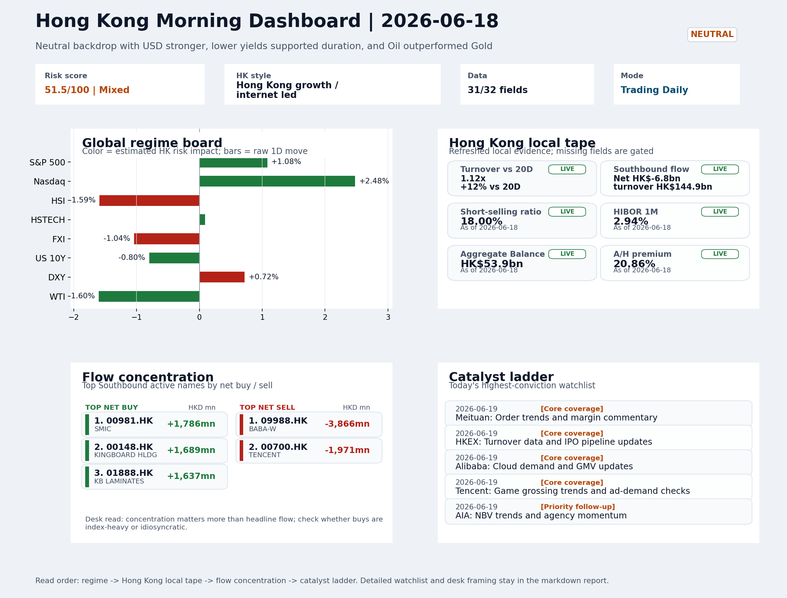

# Morning Research Workbench | 2026-06-19

> Designed for a Hong Kong sell-side commute: Layer 1 `Scan`, Layer 2 `Deep Read`, Layer 3 `Thinking`
> Mode: `Trading Daily` | Keep the report execution-oriented: what mattered in the completed session, what can move Hong Kong leadership, and what needs fast follow-up.
> Briefing date: `2026-06-19` | Review date: `2026-06-18` | Global request: `2026-06-18` | HK/China request: `2026-06-18` | Market effective date: `2026-06-18` | Generated at: `2026-06-19 09:49:10`

## Executive Summary

- **Market pulse:** Nasdaq +2.48% and lower volatility give Hong Kong growth a positive opening lead, but the local tape's HSTECH +0.09%, Southbound HK$6.8bn net sell, and 18% short-selling ratio demand.
- **Hong Kong lens:** Hong Kong growth / internet led. The Nasdaq-driven rally gives Hong Kong growth a positive lead at the open, but the credibility test is whether HSTECH (+0.09%) and FXI (-1.04%) confirm the move rather than lag.
- **Top catalysts:** VIX -11.06%; INTC -6.33%.

## Visual Dashboard

## Layer 1 | Scan (5-10 min)

### 1.1 One-Line Market Pulse
Nasdaq +2.48% and lower volatility give Hong Kong growth a positive opening lead, but the local tape's HSTECH +0.09%, Southbound HK$6.8bn net sell, and 18% short-selling ratio demand breadth confirmation before adding exposure.

### 1.2 Global Asset Price Dashboard
_Coverage gate: 2 unavailable market fields are suppressed from the main table; source status remains in the appendix._

| Asset | Last | 1D move | Read |
| --- | --- | --- | --- |
| S&P 500 | 7,500.58 | +1.08% | US large-cap risk appetite |
| Nasdaq 100 | 30,406.19 | **+2.48%** | Growth and duration leadership |
| Hang Seng Index | 23,924.81 | **-1.59%** | Hong Kong broad beta |
| Hang Seng TECH | 4.5660 | +0.09% | Hong Kong growth / platform read-through |
| CSI 300 | 4,777.32 | +1.16% | Mainland large-cap tone |
| US 10Y | 4.4510 | -0.80% | Global discount-rate anchor |
| DXY | 100.81 | +0.72% | Dollar liquidity impulse |
| USD/CNH | 6.7390 | -0.35% | Offshore China risk appetite |
| USD/HKD | 7.8350 | +0.03% | Linked-exchange regime stress check |
| Brent crude | 79.43 | -0.15% | Energy / geopolitics |
| COMEX gold | 4,204.30 | **-3.55%** | Hedge demand / real yields |
| Copper | 6.3580 | **-1.91%** | Global growth proxy |
| VIX | 16.40 | **-11.06%** | US stress barometer |

### 1.3 Hong Kong Key Data Quick Check

| Check | Value | Status | Source / as of | Why it matters |
| --- | --- | --- | --- | --- |
| Main Board turnover vs 20D | 1.12x \| +12% vs 20D | Live local | HKEX \| 2026-06-18 | Trailing 20-session average turnover was HK$319.2bn. |
| Southbound / Northbound net flow | Southbound Net HK$-6.8bn \| turnover HK$144.9bn \| Northbound Turnover HK$429.3bn \| net not reported | Live local | HKEX Connect \| 2026-06-18 | Southbound net buy is calculated from HKEX disclosed buy and sell turnover. |
| Short-selling ratio | 18.00% | Live local | HKEX \| 2026-06-18 | Official HKEX stock-level short-selling table, aggregated as a share of total market turnover. |
| AH premium index | 20.86% | Live public | Yahoo \| 2026-06-18 | Simple average across 20 A/H pairs; use dispersion rather than the average alone. |
| USD/HKD spot vs band | 7.8350 \| band 7.7500 to 7.8500 | Live quote + local | Yahoo \| 2026-06-18 | Inside the linked-exchange band without immediate boundary stress. Official Convertibility Undertakings define the linked-rate stress boundaries for USD/HKD. |
| HIBOR 1M | 2.94% | Live local | HKMA \| 2026-06-18 | 1M HIBOR is the cleanest quick read for Hong Kong funding conditions and equity-duration pressure. |
| Aggregate Balance | HK$53.9bn | Live local | HKMA \| 2026-06-18 | Aggregate Balance helps frame whether linked-rate liquidity conditions are tight or comfortable. |
| Hong Kong leadership | Hong Kong growth / internet led | Proxy | HSI / HSCEI / HSTECH relative perf \| 2026-06-18 | Use HSI / HSCEI / HSTECH relative moves as the opening style read. |

### 1.4 Risk Dashboard
**Composite risk score:** `51.5/100` | **Regime:** `Mixed`

| Component | Score impact | Evidence |
| --- | --- | --- |
| US beta | +6.5 | S&P 500 +1.08% |
| HK growth | +0.4 | HSTECH +0.09% |
| Offshore China proxy | -5.2 | FXI -1.04% |
| Dollar pressure | -7.2 | DXY +0.72% |
| Volatility | +10 | VIX -11.06% |
| HK short-selling | -8 | Short-selling ratio 18.00% |

### 1.5 Morning Checklist
1. **VIX -11.06%**
 High-frequency data | Lower volatility signals easing stress in the tape.
2. **INTC -6.33%**
 Mover attribution | Announcement / expectations | Guidance reset and margin pressure
3. **Neutral backdrop with USD stronger, lower yields supported duration, and Oil outperformed Gold**
 Overnight regime | Start by deciding whether the day is about Neutral conditions or a style pivot.
4. **CPI MoM (Released)**
 Macro / policy | Rates expectations, the dollar, and growth-equity valuation | Industries: Technology, Internet, Brokers
5. **Trade Balance (Released)**
 Macro / policy | Watch whether it changes the day's core market narrative | Industries: Market-wide

## Layer 2 | Deep Read (20-30 min)

### 2.1 Overnight Overseas Market Review
#### Market Setup
**Core tape.** US growth names surged as the Nasdaq 100 gained +2.48%, outperforming the S&P 500's +1.08% in a classic risk-on growth leadership day.
**Main driver.** Gold's sharp -3.55% decline and VIX's -11.06% drop indicate the move was driven by a reduction in macro uncertainty rather than a reversal of the Fed's hawkish pivot - Chairman Warsh's first FOMC formally removed cutting.
**HK relevance.** Intel's -6.33% guidance reset reinforced caution on traditional hardware, while the 4.239% oil-versus-gold spread reflects geopolitical and commodity demand dynamics diverging from the gold-driven risk-off signal.

#### Key Drivers
- Nasdaq's +2.48% leadership signals a rotation toward growth rather than a broad risk-on rally, with VIX falling -11.06% reducing macro.
- Gold -3.55% suggests markets are pricing the Fed's hawkish pivot as credible rather than temporary.
- US 10Y yields fell -0.80% despite hawkish Fed, likely reflecting growth concerns from Intel's guidance reset rather than a dovish repricing.
- Oil outperformed gold by 4.239% - a cross-commodity divergence that frames geopolitical risk separately from pure risk appetite.

#### Hong Kong Read-Through
**Desk lens.** Hong Kong growth / internet led.
**Opening implication.** The Nasdaq-driven rally gives Hong Kong growth a positive lead at the open.
- **Cross-market read:** Hang Seng -1.59% / HSCEI -2.06% / HSTECH +0.09%.
- **Cross-market read:** Offshore China proxy FXI -1.04% and USD/CNH -0.35% frame cross-border risk appetite.
- **Cross-market read:** USD/HKD last traded around 7.8350, which keeps the Hong Kong funding lens in focus.

#### Watch Points
- USD composite moved higher by +0.61pct intraday, with a 0.623pct range.
- Main turning points appeared around 2026-06-18 08:25 peak / 2026-06-18 08:45 peak / 2026-06-18 09:10 trough, suggesting event-driven repricing.
- The biggest cross-asset divergence was Oil versus Gold, a spread of 4.239pct.
- Gold moved -3.08pct intraday with a 3.145pct high-low range.

**Curated overnight stories**
1. **Chairman Warsh abstains from giving rate forecast as several members signal a hike in 2026**
 Why it matters: Warsh's first FOMC meeting marks a clear policy inflection. The removal of cutting bias and member rate-hike signals suggest the Fed is entering a more restrictive phase.
 HK read-through: Higher-for-longer US rates increase the discount rate applied to HK/China growth equities and ChinaADRs. USD strength may weigh on risk appetite and cross-border flows.
2. **Fed holds rates steady, pares down statement to remove cutting bias**
 Why it matters: The formal statement change - dropping easing language - formalizes the hawkish shift. Jeffrey Gundlach's characterization of Warsh as not the 'easy money' chairman reinforces.
 HK read-through: Duration-sensitive names on both HK and ChinaADR lists face pressure. Brokers and interest-rate-sensitive financials may see relative repricing versus growth screens.
3. **INTC -6.33%: Announcement / expectations | Guidance reset and margin pressure**
 Why it matters: Intel's sharp decline reflects guidance reset and margin concerns. This is the largest single-stock mover overnight and signals continued stress in the semiconductor complex.
 HK read-through: Reinforces caution on hardware, semiconductors, and related supply-chain names in the HK tech space.
4. **Neutral backdrop with USD stronger, lower yields supported duration, and Oil**
 Why it matters: The macro regime shift is playing out in real-time: dollar strength and oil outperforming gold reflect a risk-off, rate-repricing environment.
 HK read-through: USD strength is a headwind for H-share and offshore-China sentiment. Oil outperformance offers partial offset for HK energy names ( PetroChina, CNOOC, Sinopec).
5. **The average SpaceX buyer post-IPO is almost under water after two-day slide**
 Why it matters: SpaceX's post-IPO weakness sets a cautionary tone for new listings and risk appetite in growth-oriented markets.
 HK read-through: Secondary implication for HK IPO pipeline sentiment. Any planned China or Hong Kong tech new listings may face a less receptive backdrop if growth-risk appetite remains.

### 2.2 Hong Kong / A-share Previous-Day Review
#### Local Tape Setup
**Local read.** Overnight Nasdaq +2.48% provided a clear growth impulse, but the same-session Hong Kong tape did not confirm: HSI -1.59%, HSCEI -2.06%, while HSTECH managed only +0.09%.
**Verification point.** The open will test whether HSTECH can lead a rebound against the heavy H-share drag; if HSTECH meaningfully outperforms HSCEI while USD/CNH stays stable or softer, the growth read gains credibility.
**Risk to watch.** Without clean Connect or CCASS evidence of bargain-hunting, the move remains tentative.

#### Style and Local Leadership
**Style leadership.** Hong Kong growth / internet led.
- **Cross-market read:** Hang Seng -1.59% / HSCEI -2.06% / HSTECH +0.09%.
- **Cross-market read:** Offshore China proxy FXI -1.04% and USD/CNH -0.35% frame cross-border risk appetite.
- **Cross-market read:** USD/HKD last traded around 7.8350, which keeps the Hong Kong funding lens in focus.

#### Flow Confirmation
Official Stock Connect evidence is available; use Section 2.3 to confirm whether local money supports the price action.

#### Follow-Through Checklist
**Follow-through check.** Watch whether CSI 300 and offshore China proxies confirm the style read, and whether the short-selling ratio retreats from 18%.

### 2.3 Flow Tracker and Attribution
#### Cross-Asset Attribution v1

| Driver | Direction | Score | Evidence | HK implication |
| --- | --- | --- | --- | --- |
| US growth-style transmission | supportive | 3.47 | Nasdaq 100 moved +2.48%. | Hong Kong growth and platform names should be tested first at the open. |
| Short-selling pressure | drag | 2.1 | HKEX short-selling ratio was 18.00%. | Elevated short activity argues for extra confirmation before chasing rebounds. |
| Hong Kong participation | supportive | 1.24 | Main Board turnover was 1.12x the 20-session average. | Higher participation makes local price action more credible. |
| Global equity beta | supportive | 1.08 | S&P 500 moved +1.08%. | Broad beta matters if Hong Kong breadth confirms the overseas signal. |
| Dollar / CNH pressure | drag | 1.08 | DXY +0.72% / USD-CNH -0.35% | A stable or softer CNH makes Hong Kong follow-through more credible. |
| Rates impulse | supportive | 0.96 | US 10Y yield proxy moved -0.80%. | Lower yields help long-duration growth; higher yields pressure valuation-sensitive |

#### Flow Tracker
##### Flow Takeaways
- Short-selling pressure is elevated, so local rebounds need cleaner breadth and flow confirmation.
- Stock Connect Southbound: net HK$-6.8bn on turnover HK$144.9bn (as of 2026-06-18).
- Stock Connect Northbound: turnover RMB429.3bn; public file provides total turnover/top active names, not full net-buy.
- AH premium: simple covered-pair average +20.86%; widest premium: China Communications Construction 72.77%.

##### Stock Connect Southbound Active Names

| Rank | Ticker | Name | Buy | Sell | Net buy |
| --- | --- | --- | --- | --- | --- |
| 2 | 09988.HK | BABA-W | HK$1,571.3mn | HK$5,437.7mn | HK$-3,866.4mn |
| 3 | 00700.HK | TENCENT | HK$2,095.0mn | HK$4,065.8mn | HK$-1,970.8mn |
| 1 | 00981.HK | SMIC | HK$8,131.7mn | HK$6,346.0mn | HK$1,785.7mn |
| 6 | 00148.HK | KINGBOARD HLDG | HK$3,060.2mn | HK$1,370.9mn | HK$1,689.3mn |
| 3 | 01888.HK | KB LAMINATES | HK$3,645.0mn | HK$2,008.1mn | HK$1,636.9mn |

##### AH Premium Dispersion

| Name | A ticker | H ticker | Premium | As of |
| --- | --- | --- | --- | --- |
| China Communications Construction | 601800.SS | 1800.HK | +72.77% | 2026-06-18 |
| China Railway Construction | 601186.SS | 1186.HK | +49.36% | 2026-06-18 |
| China Railway | 601390.SS | 0390.HK | +46.46% | 2026-06-18 |
| China Life | 601628.SS | 2628.HK | +39.44% | 2026-06-18 |
| New China Life | 601336.SS | 1336.HK | +33.98% | 2026-06-18 |

##### HKEX Short-Selling Watch

| Ticker | Name | Short ratio | Short turnover | Total turnover |
| --- | --- | --- | --- | --- |
| 00388.HK | HKEX | 15.74% | HK$0.5bn | HK$3.0bn |
| 00700.HK | TENCENT | 9.10% | HK$1.2bn | HK$13.2bn |
| 00941.HK | CHINA MOBILE | 12.69% | HK$0.2bn | HK$1.8bn |
| 01211.HK | BYD COMPANY | 17.29% | HK$0.4bn | HK$2.5bn |
| 01299.HK | AIA | 23.29% | HK$0.6bn | HK$2.6bn |

- **Short-value leaders:** 07709.HK XL2CSOPHYNIX (HK$4.5bn); 02828.HK HSCEI ETF (HK$3.9bn); 02800.HK TRACKER FUND (HK$3.5bn); 09988.HK BABA-W (HK$2.1bn).

### 2.4 Macro and Policy Tracking
**Desk read.** June 18 session confirmed a neutral risk backdrop with a bifurcated macro signal.

**Market sensitivity.** US May CPI arrived at 0.3% MoM, running above the 0.2% consensus and providing the first confirmed upside surprise since the recent disinflation trend - this reprices the near-term Fed rate cut probability and is supportive of USD.

**HK implication.** Simultaneously, China May trade balance printed USD 85.2bn against a USD 79.0bn forecast, a material beat that reinforces the view that external demand remains constructive and provides a partial offset to domestic growth.

**Macro watchpoints**
- USD index and HKMA-linked HKD dynamics following the CPI confirmation
- Whether the China trade surplus beat rerates mainland growth proxies in HK
- Powell's economic outlook remarks and any signal on the timing of next Fed action
- US Retail Sales (forecast 0.3%, prior 0.6%) as the next consumer-resilience check

| Time | Region | Event | Status | Desk read |
| --- | --- | --- | --- | --- |
| 20:30 | US | CPI MoM | Released | Impact: Rates expectations, the dollar, and growth-equity valuation \| Attention: 5/5 \| Industries: Technology, Internet, Brokers |
| 09:30 | China | Trade Balance | Released | Impact: Watch whether it changes the day's core market narrative \| Attention: 3/5 \| Industries: Market-wide |
| 20:30 | US | Retail Sales MoM | Upcoming | Impact: Consumer resilience, growth expectations, and risk-asset pricing \| Attention: 5/5 \| Industries: Consumer, E-commerce, Consumer discretionary |
| 09:20 | China | Loan Prime Rate | Upcoming | Impact: Watch whether it changes the day's core market narrative \| Attention: 3/5 \| Industries: Market-wide |
| 22:00 | Federal Reserve | Jerome Powell: Economic outlook remarks | Central bank | Impact: Policy path, liquidity conditions, and cross-asset risk appetite \| Attention: 5/5 \| Industries: Technology, Financials, Gold |
| 10:00 | PBOC | Open Market Operations Desk: Daily liquidity operation window | Central bank | Impact: Policy path, liquidity conditions, and cross-asset risk appetite \| Attention: 3/5 \| Industries: Technology, Financials, Gold |

#### Positioning and Risk Backdrop
- Options activity centered on KWEB Call, with Vol/OI at 1.88x and a bullish bias.
- Put/Call structure shows equity 0.68 / index 1.15, implying Single-stock optimism with index hedging.
- Geopolitics: Middle East | Regional tension remains elevated | Impact: Oil, freight costs, and safe-haven demand
- Geopolitics: US-China | Technology export-control rhetoric remains active | Impact: China internet, semiconductors, and supply chains

### 2.5 Key Company and Sector Events
No high-conviction sector story cleared the main-report relevance gate for this run.

#### Company Event Takeaway
**Desk read.** The June 18 session closed with a neutral macro backdrop but notable single-stock flow.
**Why it matters.** Morgan Stanley's upgrade of 9988.HK (Alibaba) to Overweight with a target raise to HKD 105 stands out as the clearest positive catalyst signal for Hong Kong internet leadership.
**Follow-up.** Earnings calendar is front-loaded tomorrow.

#### LLM Quick Takes
- **9988.HK** | Morgan Stanley upgrade (Equal Weight to Overweight, target 92 to 105) is the clearest positive catalyst today.
- **0388.HK** | Reports tomorrow before market open (EPS est. 2.81 HKD, revenue est. 6.0bn HKD). The stock is at the bottom of its recent range
- **0700.HK** | Reports tomorrow after close (EPS est. 4.15 HKD, revenue est. 163.2bn HKD). Given the breadth of today's moves and Alibaba's upgrade, Tencent results will be a key test
- **3690.HK** | Down 3.49% on new subsidy regulations from China's markets regulator. At bottom of range. The regulatory angle is the primary concern
- **1299.HK** | Down 1.8%, near bottom of recent range. No specific news today, but the name remains a useful read-through for wealth demand and HK financial sentiment.
- **1211.HK** | Down 1.28%, at bottom of range, despite strong Great Tang pre-order data (150k+ units) and European launch plans.

#### HKEX Announcements

| Grade | Ticker | Type | Release time | Title |
| --- | --- | --- | --- | --- |
| A | 00211.HK | Profit warning | 2026-06-18 | Profit warning / alert announcement |
| A | 00223.HK | Profit warning | 2026-06-18 | Profit warning / alert announcement |
| A | 00248.HK | Profit warning | 2026-06-18 | Profit warning / alert announcement |
| A | 00290.HK | Profit warning | 2026-06-18 | Profit warning / alert announcement |
| A | 00306.HK | Profit warning | 2026-06-18 | Profit warning / alert announcement |
| A | 00332.HK | Profit warning | 2026-06-18 | Profit warning / alert announcement |
| A | 00375.HK | Profit warning | 2026-06-18 | Profit warning / alert announcement |
| A | 00403.HK | Profit warning | 2026-06-18 | Profit warning / alert announcement |

#### Earnings / Results Watch

| Ticker | Company | Timing | Expectation framing |
| --- | --- | --- | --- |
| 0700.HK | Tencent Holdings | After Market Close | EPS est. 4.15 HKD \| revenue est. 163.2bn HKD |
| 0388.HK | Hong Kong Exchanges and Clearing | Before Market Open | EPS est. 2.81 HKD \| revenue est. 6.0bn HKD |

#### Rating Changes
- **9988.HK** | Morgan Stanley | Upgrade | Equal Weight -> Overweight | PT 92 -> 105

#### IPO Watch
- IPO and grey-market monitoring is not yet part of the standard production pack.

### 2.6 Today's Core Names
#### Core coverage

| Name | Ticker | Last | 1D | Range position | Morning note |
| --- | --- | --- | --- | --- | --- |
| Meituan | 3690.HK | 71.80 | -3.49% | Bottom of range | Short-term pressure is visible; check for a fundamental or regulatory reason. |
| HKEX | 0388.HK | 374.80 | -2.24% | Bottom of range | Short-term pressure is visible; check for a fundamental or regulatory reason. |

**Recent headlines for Meituan:**
- [China food delivery stocks fall on fresh regulations covering subsidies](https://finance.yahoo.com/markets/stocks/articles/china-food-delivery-stocks-fall-050006974.html) (Investing.com)

#### Priority follow-up

| Name | Ticker | Last | 1D | Range position | Morning note |
| --- | --- | --- | --- | --- | --- |
| AIA | 1299.HK | 73.70 | -1.80% | Bottom of range | The name sits near the bottom of its recent range and is worth monitoring for a catalyst-led reversal. |
| BYD Company | 1211.HK | 80.85 | -1.28% | Bottom of range | The name sits near the bottom of its recent range and is worth monitoring for a catalyst-led reversal. |

**Recent headlines for BYD Company:**
- [BYD (SEHK:1211) Stock Could Be 46.9% Undervalued After Great Tang Pre Orders](https://finance.yahoo.com/markets/stocks/articles/byd-sehk-1211-stock-could-231945039.html) (Simply Wall St.)

## Layer 3 | Thinking (10-15 min)

### 3.1 Rotating Theme Deep Dive

| Field | Read |
| --- | --- |
| Theme | Hong Kong Market Structure and Flows |
| Angle for the day | Focus on turnover, Stock Connect, ETF flows, HKEX activity, and style leadership to understand whether Hong Kong is being driven by fundamentals or positioning. |

**Theme desk read**
**Core thesis.** The weekly focus on Hong Kong market structure and flows remains relevant because current signals point to a tape driven more by positioning than by fresh fundamental conviction.
**Evidence.** The VIX dropped 11.06%, signalling easing stress that could support turnover-sensitive names, while the neutral backdrop with a stronger USD and lower yields points to a cautious, rather than directionally decisive, tone.
**What to test.** HKEX (0388.HK) and BYD Company (1211.HK) both sit near the bottom of their recent ranges.

**Signals to keep in mind**
- VIX -11.06%: Lower volatility signals easing stress in the tape.
- Gold -3.55%: Keep tracking it to confirm whether the core daily narrative is holding.

**LLM watch items:**
- HKEX: Turnover data and IPO pipeline updates (2026-06-19)
- BYD Company: Weekly sales data and model rollout cadence (2026-06-19)
- VIX: sustain sub-17 to confirm stress easing
- Tracker Fund / HSCEI ETF flows to gauge passive positioning
- Southbound Stock Connect daily turnover to assess mainland allocation momentum

**Related names to keep close:**

| Name | Ticker | Bucket | Morning read |
| --- | --- | --- | --- |
| HKEX | 0388.HK | Core coverage | Short-term pressure is visible; check for a fundamental or regulatory reason. |
| BYD Company | 1211.HK | Priority follow-up | The name sits near the bottom of its recent range and is worth monitoring for a catalyst-led reversal. |

**Upcoming catalysts tied to the theme:**
- 2026-06-19 | HKEX: Turnover data and IPO pipeline updates | Direct proxy for Hong Kong market turnover, listings, and southbound interest
- 2026-06-19 | BYD Company: Weekly sales data and model rollout cadence | Hong Kong-listed proxy for EV volumes, export mix, and price competition
- 2026-06-19 | HSCEI ETF: Policy flow-through and financial/energy leadership | Useful proxy for state-owned and old-economy H-share leadership
- 2026-06-19 | Tracker Fund of Hong Kong: Index-turnover shifts and ETF flows | Clean listed proxy for broad HSI positioning and passive flows

### 3.2 Today Ahead and Trading Calendar
- Macro: CPI MoM is the first item to anchor the open and the rates/FX response.
- Corporate / event: Meituan: Order trends and margin commentary is the cleanest same-day catalyst to prepare for.

**Same-day macro docket**

| Time | Country | Event | Status | Detail |
| --- | --- | --- | --- | --- |
| 20:30 | US | CPI MoM | Released | Actual 0.3% / Forecast 0.2% / Prior 0.4% |
| 09:30 | China | Trade Balance | Released | Actual USD 85.2bn / Forecast USD 79.0bn / Prior USD 80.6bn |
| 20:30 | US | Retail Sales MoM | Upcoming | Forecast 0.3% / Prior 0.6% |
| 09:20 | China | Loan Prime Rate | Upcoming | Forecast 3.45% / Prior 3.45% |
| 22:00 | Federal Reserve | Jerome Powell: Economic outlook remarks | Central bank | speech |

**Same-day catalyst list**

| Date | Time | Category | Event | Importance |
| --- | --- | --- | --- | --- |
| 2026-06-19 | | Core coverage | Meituan: Order trends and margin commentary | 3 |
| 2026-06-19 | | Core coverage | HKEX: Turnover data and IPO pipeline updates | 3 |
| 2026-06-19 | | Core coverage | Alibaba: Cloud demand and GMV updates | 3 |
| 2026-06-19 | | Core coverage | Tencent: Game grossing trends and ad-demand checks | 3 |

**Next few sessions**

| Date | Category | Event | Impact |
| --- | --- | --- | --- |
| 2026-06-19 | Core coverage | Meituan: Order trends and margin commentary | High-frequency read on local services demand and platform competition |
| 2026-06-19 | Core coverage | HKEX: Turnover data and IPO pipeline updates | Direct proxy for Hong Kong market turnover, listings, and southbound |
| 2026-06-19 | Core coverage | Alibaba: Cloud demand and GMV updates | Key read-through for China consumption, cloud, and platform regulation |
| 2026-06-19 | Core coverage | Tencent: Game grossing trends and ad-demand checks | Core offshore China platform proxy for gaming, ads, and AI monetization |

### 3.3 Daily One Chart
**Daily One Chart | HKEX short-selling pressure map**

**Chart read.** Market short-selling reached 18.00% of turnover.
**Why it matters.** The chart leads today because the pressure is either broad, concentrated, or acute in the top name.

_Source: HKEX Daily Quotations - Short Selling Turnover_

## Traceable Appendix

### Report Metadata
> Date policy: Review date 2026-06-18 is treated as `Trading Daily`. | Global request date is 2026-06-18; adapter effective date is 2026-06-18 and summary date is 2026-06-18. | HK/China local data date is 2026-06-18; role: same-session local cash tape.
> Market data quality: Coverage: `31/32` | Stale items (>1d): `3` | Missing: `1`
> Report quality: `87.1/100` | Grade `B` | Status `production ready`

### Key Questions to Keep in Mind
- Is risk appetite rising or fading? The overnight tape reads closer to `Neutral`.
- Did rates expectations move? Focus on whether US 10Y, DXY, and growth style moved together.
- Were commodities the real story? Watch WTI and gold for geopolitics versus inflation signals.
- Is Hong Kong setup internet-led, SOE-led, or broad beta-led? Compare HSTECH, HSCEI, and HSI.
- Did offshore markets move China risk appetite? Focus on HSI, FXI, USD/CNH, and USD/HKD.

### Report Quality and Validation
- **Quality score:** 87.1/100 | **Grade:** B | **Status:** production ready
- **Run summary:** 7 healthy | 0 caveat | 1 failed
- **Release recommendation:** Send with caveats | The report is usable, but the advisory guidance should travel with it so readers understand the data gaps.

| Source | Status | Bucket |
| --- | --- | --- |
| Market data | ok | healthy |
| Sector and company news | ok | healthy |
| Movers and short selling | ok | healthy |
| Stock Connect | ok | healthy |
| A/H premium | ok | healthy |
| Hong Kong local package | ok | healthy |
| China rates | error | failed |
| Narrative overlay | ok | healthy |

**Desk-use guidance summary:** 0 blocking | 1 advisory

**Desk-use guidance**
- **Advisory:** Be careful with China macro carry and rates-spread conclusions until the China rates adapter refreshes.

| Component | Score | Weight | Read |
| --- | --- | --- | --- |
| Market data coverage | 96.9 | 0.3 | 31/32 core market fields available. |
| Hong Kong local metrics | 82.3 | 0.25 | 8 live, 3 proxy, 0 unavailable local checks. |
| Key public adapters | 100.0 | 0.2 | 4/4 key adapters were available or partially available. |
| Narrative overlay health | 65.7 | 0.15 | 3/7 narrative overlay tasks succeeded or used validated cache; 0 error(s). |
| Fact-check guardrail | 75.0 | 0.1 | Checked 8 numeric claims; 1 numeric mismatch(es), 0 logic warning(s); 1 critical, 0 review. |

**Quality warnings**
- Narrative fact-check guardrail produced warnings; review the validation table before relying on narrative sections.

**Narrative fact-check guardrail**
- Checked 8 numeric claims; 1 numeric mismatch(es), 0 logic warning(s); 1 critical, 0 review.

| Severity | Field | Claim | Type | Claimed | Expected | Snippet |
| --- | --- | --- | --- | --- | --- | --- |
| critical | tasks.theme_deep_dive.paragraph | VIX | change_pct | 11.06 | -11.06 | tioning than by fresh fundamental conviction. The VIX dropped 11.06%, signalling easing stress that could support turn |

**Adapter status**

| Adapter | Status |
| --- | --- |
| Stock Connect | ok |
| A/H premium | ok |
| HKEX announcements | ok |
| China rates | ok |

### Source Links
- [China food delivery stocks fall on fresh regulations covering subsidies](https://finance.yahoo.com/markets/stocks/articles/china-food-delivery-stocks-fall-050006974.html) (Investing.com)
- [Alibaba (BABA) Faces Pentagon Blacklist As It Pushes Deeper Into AI Robotics](https://finance.yahoo.com/technology/ai/articles/alibaba-baba-faces-pentagon-blacklist-201559991.html) (Simply Wall St.)
- [The Makeup of Alibaba.com Competition Applicants Shows Significant Changes](https://wwd.com/sourcing-journal/industry-news/makeup-of-alibaba-com-competition-applicants-shows-changes-1239016962/) (Sourcing Journal)
- [Microsoft (MSFT) Is Building A Billion Dollar AI Business In China](https://finance.yahoo.com/technology/ai/articles/microsoft-msft-building-billion-dollar-011202001.html) (Simply Wall St.)
- [BYD (SEHK:1211) Stock Could Be 46.9% Undervalued After Great Tang Pre Orders](https://finance.yahoo.com/markets/stocks/articles/byd-sehk-1211-stock-could-231945039.html) (Simply Wall St.)
- [00211.HK Profit warning / alert announcement](http://www1.hkexnews.hk/listedco/listconews/sehk/2026/0618/2026061801214.pdf) (HKEXnews)
- [00223.HK Profit warning / alert announcement](http://www1.hkexnews.hk/listedco/listconews/sehk/2026/0618/2026061802098.pdf) (HKEXnews)
- [00248.HK Profit warning / alert announcement](http://www1.hkexnews.hk/listedco/listconews/sehk/2026/0618/2026061800612.pdf) (HKEXnews)
- [00290.HK Profit warning / alert announcement](http://www1.hkexnews.hk/listedco/listconews/sehk/2026/0618/2026061800478.pdf) (HKEXnews)
- [00306.HK Profit warning / alert announcement](http://www1.hkexnews.hk/listedco/listconews/sehk/2026/0618/2026061802016.pdf) (HKEXnews)
- [00332.HK Profit warning / alert announcement](http://www1.hkexnews.hk/listedco/listconews/sehk/2026/0618/2026061801208.pdf) (HKEXnews)
- [00375.HK Profit warning / alert announcement](http://www1.hkexnews.hk/listedco/listconews/sehk/2026/0618/2026061800650.pdf) (HKEXnews)
- [00403.HK Profit warning / alert announcement](http://www1.hkexnews.hk/listedco/listconews/sehk/2026/0618/2026061801278.pdf) (HKEXnews)

## Supplementary Visual Appendix

This appendix is professional-path only. It keeps a traceable index of the report visuals and the deterministic chart cues used to frame the morning note, without injecting the legacy intraday chart pack.

### Visual Index

| Visual | Path | Role |
| --- | --- | --- |
| Visual Dashboard | `charts/dashboard_2026-06-19.png` | Cross-asset regime board and Hong Kong local tape snapshot. |
| Daily One Chart | `charts/daily_one_chart_2026-06-19.png` | Single highest-conviction visual story for the day. |

### Deterministic Chart Cues
- FX / liquidity: USD composite moved higher by +0.61pct intraday, with a 0.623pct range.
- FX / liquidity: Main turning points appeared around 2026-06-18 08:25 peak / 2026-06-18 08:45 peak / 2026-06-18 09:10 trough, suggesting event-driven repricing rather than a clean one-way USD move.
- Cross-asset: The biggest cross-asset divergence was Oil versus Gold, a spread of 4.239pct.
- Cross-asset: Gold moved -3.08pct intraday with a 3.145pct high-low range.
- Cross-asset: Oil moved +1.15pct intraday with a 3.959pct high-low range.
- Cross-asset: Bitcoin moved -2.33pct intraday with a 3.747pct high-low range.

### Risk Dashboard Components

| Component | Score impact | Evidence |
| --- | --- | --- |
| US beta | +6.5 | S&P 500 +1.08% |
| HK growth | +0.4 | HSTECH +0.09% |
| Offshore China proxy | -5.2 | FXI -1.04% |
| Dollar pressure | -7.2 | DXY +0.72% |
| Volatility | +10 | VIX -11.06% |
| HK short-selling | -8 | Short-selling ratio 18.00% |
