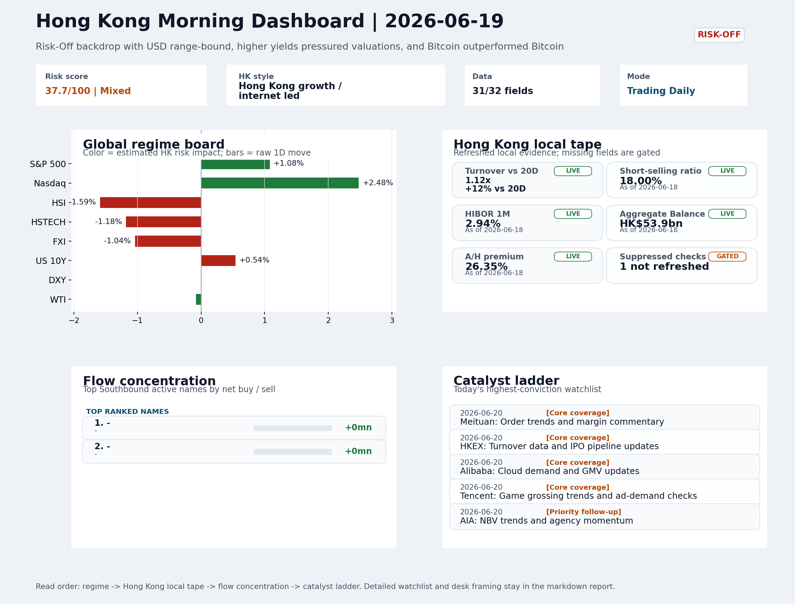
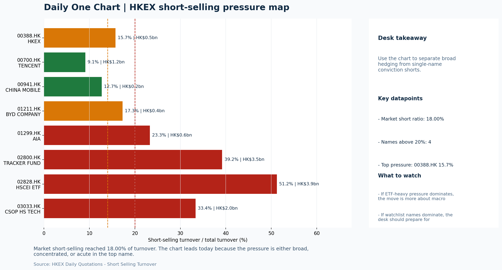

# Morning Research Workbench | 2026-06-20

> Designed for a Hong Kong sell-side commute: Layer 1 `Scan`, Layer 2 `Deep Read`, Layer 3 `Thinking`
> Mode: `Trading Daily` | Keep the report execution-oriented: what mattered in the completed session, what can move Hong Kong leadership, and what needs fast follow-up.
> Briefing date: `2026-06-20` | Review date: `2026-06-19` | Global request: `2026-06-19` | HK/China request: `2026-06-19` | Market effective date: `2026-06-19` | Generated at: `2026-06-20 08:18:18`

## Executive Summary

- **Market pulse:** Nasdaq's overnight rally failed to lift Hong Kong, producing a tentative HSTECH relative-lead against a Risk-Off backdrop with elevated short-selling and unavailable Stock Connect flow data.
- **Hong Kong lens:** Hong Kong growth / internet led. The Nasdaq lead creates an opening gap argument, but the Risk-Off regime, elevated HK short-selling (18%), and the FXI -1.04% / USD/CNH -0.27% signal that cross-border appetite.
- **Top catalysts:** INTC -6.33%; Risk-Off backdrop with USD range-bound, higher yields pressured valuations, and Bitcoin outperformed Bitcoin.

## Visual Dashboard

## Layer 1 | Scan (5-10 min)

### 1.1 One-Line Market Pulse
Nasdaq's overnight rally failed to lift Hong Kong, producing a tentative HSTECH relative-lead against a Risk-Off backdrop with elevated short-selling and unavailable Stock Connect flow data.

### 1.2 Global Asset Price Dashboard

| Asset | Last | 1D move | Read |
| --- | --- | --- | --- |
| S&P 500 | 7,500.58 | +1.08% | US large-cap risk appetite |
| Nasdaq 100 | 30,406.19 | **+2.48%** | Growth and duration leadership |
| Hang Seng Index | 23,924.81 | **-1.59%** | Hong Kong broad beta |
| Hang Seng TECH | 4.5120 | -1.18% | Hong Kong growth / platform read-through |
| CSI 300 | 4,777.32 | +1.16% | Mainland large-cap tone |
| US 10Y | 4.4870 | +0.54% | Global discount-rate anchor |
| China 10Y | 1.73% | +0.3bp | China local rates anchor \| Live public \| Eastmoney \| 2026-06-18 |
| CN-US 10Y spread | -273.0bp | +3.3bp | Relative carry and macro-pressure gauge \| Live public \| Eastmoney \| 2026-06-18 |
| DXY | 100.85 | -0.00% | Dollar liquidity impulse |
| USD/CNH | 6.7450 | -0.27% | Offshore China risk appetite |
| USD/HKD | 7.8365 | +0.02% | Linked-exchange regime stress check |
| Brent crude | 80.59 | +0.93% | Energy / geopolitics |
| COMEX gold | 4,172.90 | -1.21% | Hedge demand / real yields |
| Copper | 6.3370 | -0.59% | Global growth proxy |
| VIX | 16.78 | **+2.32%** | US stress barometer |

### 1.3 Hong Kong Key Data Quick Check
_Coverage gate: 1 unavailable local checks are suppressed here and retained in validation metadata._

| Check | Value | Status | Source / as of | Why it matters |
| --- | --- | --- | --- | --- |
| Main Board turnover vs 20D | 1.12x \| +12% vs 20D | Live local | HKEX \| 2026-06-18 | Trailing 20-session average turnover was HK$319.2bn. |
| Short-selling ratio | 18.00% | Live local | HKEX \| 2026-06-18 | Official HKEX stock-level short-selling table, aggregated as a share of total market turnover. |
| AH premium index | 26.35% | Live public | Yahoo \| 2026-06-18 | Simple average across 16 A/H pairs; use dispersion rather than the average alone. |
| USD/HKD spot vs band | 7.8365 \| band 7.7500 to 7.8500 | Live quote + local | Yahoo \| 2026-06-19 | Inside the linked-exchange band without immediate boundary stress. Official Convertibility Undertakings define the linked-rate stress boundaries for USD/HKD. |
| HIBOR 1M | 2.94% | Live local | HKMA \| 2026-06-18 | 1M HIBOR is the cleanest quick read for Hong Kong funding conditions and equity-duration pressure. |
| Aggregate Balance | HK$53.9bn | Live local | HKMA \| 2026-06-18 | Aggregate Balance helps frame whether linked-rate liquidity conditions are tight or comfortable. |
| Hong Kong leadership | Hong Kong growth / internet led | Proxy | HSI / HSCEI / HSTECH relative perf \| 2026-06-19 | Use HSI / HSCEI / HSTECH relative moves as the opening style read. |

### 1.4 Risk Dashboard
**Composite risk score:** `37.7/100` | **Regime:** `Mixed`

| Component | Score impact | Evidence |
| --- | --- | --- |
| US beta | +6.5 | S&P 500 +1.08% |
| HK growth | -5.9 | HSTECH -1.18% |
| Offshore China proxy | -5.2 | FXI -1.04% |
| Dollar pressure | +0.0 | DXY -0.00% |
| Volatility | -4.6 | VIX +2.32% |
| HK short-selling | -8 | Short-selling ratio 18.00% |

### 1.5 Morning Checklist
1. **INTC -6.33%**
 Mover attribution | Announcement / expectations | Guidance reset and margin pressure
2. **Risk-Off backdrop with USD range-bound, higher yields pressured valuations, and Bitcoin outperformed Bitcoin**
 Overnight regime | Start by deciding whether the day is about Risk-Off conditions or a style pivot.
3. **CPI MoM (Released)**
 Macro / policy | Rates expectations, the dollar, and growth-equity valuation | Industries: Technology, Internet, Brokers
4. **Trade Balance (Released)**
 Macro / policy | Watch whether it changes the day's core market narrative | Industries: Market-wide
5. **Retail Sales MoM (Upcoming)**
 Macro / policy | Consumer resilience, growth expectations, and risk-asset pricing | Industries: Consumer, E-commerce, Consumer discretionary

## Layer 2 | Deep Read (20-30 min)

### 2.1 Overnight Overseas Market Review
#### Market Setup
**Core tape.** Overnight markets presented a clear US-versus-Hong Kong divergence: Nasdaq 100 surged +2.48% and S&P 500 rose +1.08%, yet Hang Seng fell -1.59%, HSCEI -2.06%, and HSTECH -1.18%, with FXI down -1.04%.
**Main driver.** The Fed's hawkish hold under new Chairman Warsh removed cutting bias and signaled potential 2026 hikes, pushing US 10Y yields +0.54%, while Intel's -6.33% guidance reset weighed on semiconductor sentiment broadly.
**HK relevance.** Bitcoin's -4.12% drop and VIX +2.32% confirmed Risk-Off positioning.

#### Key Drivers
- Fed's hawkish pivot under Warsh: removal of cutting language and member hike signals repriced rate-cut expectations, supporting the dollar.
- Nasdaq 100 outperformed: growth-style relief rally in the US was not shared by Hong Kong, raising questions about whether it reflects.
- Intel guidance reset -6.33%: supply-chain linkage to HK-listed hardware names like ASMPT adds semiconductor sector headwinds for today's.
- US 10Y +0.54%: higher yields compress equity duration globally, directly pressuring Hong Kong growth and internet names that are.

#### Hong Kong Read-Through
**Desk lens.** Hong Kong growth / internet led.
**Opening implication.** The Nasdaq lead creates an opening gap argument, but the Risk-Off regime, elevated HK short-selling (18%), and the FXI -1.04% / USD/CNH -0.27% signal that cross-border appetite remains cautious. HSTECH and FXI must confirm the Nasdaq signal at the open.
- **Cross-market read:** Hang Seng -1.59% / HSCEI -2.06% / HSTECH -1.18%.
- **Cross-market read:** Offshore China proxy FXI -1.04% and USD/CNH -0.27% frame cross-border risk appetite.
- **Cross-market read:** USD/HKD last traded around 7.8365, which keeps the Hong Kong funding lens in focus.

#### Watch Points
- USD composite moved lower by -0.01pct intraday, with a 0.217pct range.
- Main turning points appeared around 2026-06-19 08:05 trough / 2026-06-19 08:20 trough / 2026-06-19 08:50 trough, suggesting event-driven repricing.
- The biggest cross-asset divergence was Bitcoin versus Bitcoin, a spread of 0.0pct.
- Bitcoin moved +0.17pct intraday with a 1.647pct high-low range.

**Curated overnight stories**
1. **Fed holds rates steady, pares down statement to remove cutting bias**
 Why it matters: Warsh's first FOMC marks a hawkish pivot. The removal of cutting language and member hike signals signal a tighter-for-longer path, repricing rate-cut expectations.
 HK read-through: Higher-for-longer US rates directly pressure Hong Kong growth and internet valuations, which are rate-sensitive. USD/HKD dynamics and cross-border capital flows will be key.
2. **INTC -6.33% on announcement: Guidance reset and margin pressure**
 Why it matters: Intel's sharp guidance cut signals continued competitive pressure in semis. Given INTC's weight in tech indices and its supply-chain linkages, weakness there ripples.
 HK read-through: Direct read-through to Hong Kong tech and hardware sentiment. The must-watch attribution flags INTC as the session's top mover at score 108.
3. **Risk-Off backdrop with USD range-bound, higher yields pressured valuations, and Bitcoin**
 Why it matters: The market regime is explicitly Risk-Off. Higher yields compress equity multiples broadly. Bitcoin outperforming in a Risk-Off session is atypical and may signal de-risking.
 HK read-through: Sets the tape for Hong Kong. Risk-Off framing means defensive sectors (utilities, high dividend payers, REITs) outperform; growth and unprofitable tech underperform.
4. **CPI MoM and Trade Balance released; Retail Sales MoM upcoming for next session**
 Why it matters: CPI impacts Fed expectations (already integrated into hawkish repricing above). Trade balance data could shift growth narrative.
 HK read-through: Inflation and trade data shape the dollar and growth outlook, both critical for Hong Kong. Given Risk-Off regime, a soft consumer reading could deepen defensive positioning.
5. **SpaceX IPO had a big first week, but average post-IPO buyer almost underwater after**
 Why it matters: High-profile growth IPO underperformance signals risk appetite for growth equities is constrained. SpaceX is a benchmark private-market proxy.
 HK read-through: Indirect read-through to Hong Kong IPO sentiment. Weakness in marquee US growth names may deter demand for HK growth/tech IPOs and pressure recent listings.

### 2.2 Hong Kong / A-share Previous-Day Review
#### Local Tape Setup
**Local read.** US growth rallied strongly overnight (Nasdaq +2.48%, S&P 500 +1.08%), but Hong Kong cash fell across the board with HSI -1.59%, HSCEI -2.06%, and HSTECH -1.18%.
**Verification point.** The internal style read was growth relative outperformance: HSTECH fell less than HSCEI, hinting at support for Chinese internet/platform names despite the Risk-Off regime.
**Risk to watch.** Local flow quality remains weak: short-selling was elevated at 18% of turnover, and ETF proxies (3033.HK, 2800.HK, 2828.HK) showed outflows.

#### Style and Local Leadership
**Style leadership.** Hong Kong growth / internet led.
- **Cross-market read:** Hang Seng -1.59% / HSCEI -2.06% / HSTECH -1.18%.
- **Cross-market read:** Offshore China proxy FXI -1.04% and USD/CNH -0.27% frame cross-border risk appetite.
- **Cross-market read:** USD/HKD last traded around 7.8365, which keeps the Hong Kong funding lens in focus.

#### Flow Confirmation
Official Stock Connect evidence is available; use Section 2.3 to confirm whether local money supports the price action.

#### Follow-Through Checklist
**Follow-through check.** On 22 June, watch whether HSTECH opens positively and extends its relative lead against HSCEI.

### 2.3 Flow Tracker and Attribution
#### Cross-Asset Attribution v1

| Driver | Direction | Score | Evidence | HK implication |
| --- | --- | --- | --- | --- |
| US growth-style transmission | supportive | 3.47 | Nasdaq 100 moved +2.48%. | Hong Kong growth and platform names should be tested first at the open. |
| Short-selling pressure | drag | 2.1 | HKEX short-selling ratio was 18.00%. | Elevated short activity argues for extra confirmation before chasing rebounds. |
| Hong Kong participation | supportive | 1.24 | Main Board turnover was 1.12x the 20-session average. | Higher participation makes local price action more credible. |
| Global equity beta | supportive | 1.08 | S&P 500 moved +1.08%. | Broad beta matters if Hong Kong breadth confirms the overseas signal. |
| Rates impulse | drag | 0.65 | US 10Y yield proxy moved +0.54%. | Lower yields help long-duration growth; higher yields pressure valuation-sensitive |
| Dollar / CNH pressure | supportive | 0.41 | DXY -0.00% / USD-CNH -0.27% | A stable or softer CNH makes Hong Kong follow-through more credible. |

#### Flow Tracker
##### Flow Takeaways
- Short-selling pressure is elevated, so local rebounds need cleaner breadth and flow confirmation.
- AH premium: simple covered-pair average +26.35%; widest premium: China Communications Construction 72.52%.
- ETF flow anomalies were concentrated in: LQD +0.28% / volume ratio 1.41x / inflow; 3033.HK -1.18% / volume ratio 0.62x / outflow; 2800.HK -1.62% / volume ratio 0.64x / outflow.
- HKEX short selling: 18.00% of market turnover (HK$65.2bn short turnover, as of 2026-06-18).

##### Stock Connect Southbound Active Names

| Rank | Ticker | Name | Buy | Sell | Net buy |
| --- | --- | --- | --- | --- | --- |
| 1 | | - | N/A | N/A | N/A |
| 1 | | - | N/A | N/A | N/A |

##### AH Premium Dispersion

| Name | A ticker | H ticker | Premium | As of |
| --- | --- | --- | --- | --- |
| China Communications Construction | 601800.SS | 1800.HK | +72.52% | 2026-06-18 |
| China Railway Construction | 601186.SS | 1186.HK | +49.15% | 2026-06-18 |
| China Railway | 601390.SS | 0390.HK | +46.25% | 2026-06-18 |
| China Life | 601628.SS | 2628.HK | +39.24% | 2026-06-18 |
| China Construction Bank | 601939.SS | 0939.HK | +33.23% | 2026-06-18 |

##### HKEX Short-Selling Watch

| Ticker | Name | Short ratio | Short turnover | Total turnover |
| --- | --- | --- | --- | --- |
| 00388.HK | HKEX | 15.74% | HK$0.5bn | HK$3.0bn |
| 00700.HK | TENCENT | 9.10% | HK$1.2bn | HK$13.2bn |
| 00941.HK | CHINA MOBILE | 12.69% | HK$0.2bn | HK$1.8bn |
| 01211.HK | BYD COMPANY | 17.29% | HK$0.4bn | HK$2.5bn |
| 01299.HK | AIA | 23.29% | HK$0.6bn | HK$2.6bn |

- **Short-value leaders:** 07709.HK XL2CSOPHYNIX (HK$4.5bn); 02828.HK HSCEI ETF (HK$3.9bn); 02800.HK TRACKER FUND (HK$3.5bn); 09988.HK BABA-W (HK$2.1bn).

### 2.4 Macro and Policy Tracking
**Desk read.** The completed session reflects a Risk-Off regime with VIX elevated at 16.78 (+2.32%) and Bitcoin down 4.12%.

**Market sensitivity.** The headline risk for the next session is the US CPI release: actual 0.3% MoM vs forecast 0.2%, a beat that increases the probability of hawkish repricing in US duration and supports the dollar.

**HK implication.** This tightens the HKD-linked rate backdrop and pressures Hong Kong tech and growth proxies that are duration-sensitive.

**Macro watchpoints**
- US 10-year yield and DXY reaction to the CPI beat
- Whether Powell's remarks confirm or partially offset the hawkish CPI signal
- HK tech and growth proxies (e.g., HSI constituents) response at open
- China Trade Balance follow-through; any repricing of China growth narrative

| Time | Region | Event | Status | Desk read |
| --- | --- | --- | --- | --- |
| 20:30 | US | CPI MoM | Released | Impact: Rates expectations, the dollar, and growth-equity valuation \| Attention: 5/5 \| Industries: Technology, Internet, Brokers |
| 09:30 | China | Trade Balance | Released | Impact: Watch whether it changes the day's core market narrative \| Attention: 3/5 \| Industries: Market-wide |
| 20:30 | US | Retail Sales MoM | Upcoming | Impact: Consumer resilience, growth expectations, and risk-asset pricing \| Attention: 5/5 \| Industries: Consumer, E-commerce, Consumer discretionary |
| 09:20 | China | Loan Prime Rate | Upcoming | Impact: Watch whether it changes the day's core market narrative \| Attention: 3/5 \| Industries: Market-wide |
| 22:00 | Federal Reserve | Jerome Powell: Economic outlook remarks | Central bank | Impact: Policy path, liquidity conditions, and cross-asset risk appetite \| Attention: 5/5 \| Industries: Technology, Financials, Gold |
| 10:00 | PBOC | Open Market Operations Desk: Daily liquidity operation window | Central bank | Impact: Policy path, liquidity conditions, and cross-asset risk appetite \| Attention: 3/5 \| Industries: Technology, Financials, Gold |

#### Positioning and Risk Backdrop
- Options activity centered on KWEB Call, with Vol/OI at 1.88x and a bullish bias.
- Put/Call structure shows equity 0.68 / index 1.15, implying Single-stock optimism with index hedging.
- Geopolitics: Middle East | Regional tension remains elevated | Impact: Oil, freight costs, and safe-haven demand
- Geopolitics: US-China | Technology export-control rhetoric remains active | Impact: China internet, semiconductors, and supply chains

### 2.5 Key Company and Sector Events

| Grade | Sector | Headline | Why it matters | Horizon |
| --- | --- | --- | --- | --- |
| A | Autos and EV | Car Dealer Global Auto Is Said to Weigh Toronto IPO This Year | Capital allocation or shareholder-return events can trigger a valuation | Medium-term trend |

#### Company Event Takeaway
**Desk read.** Risk-off conditions weighed on Hong Kong equities on 2026-06-19, with broader market pressure evident across core coverage and index proxies.
**Why it matters.** The session featured an upgrade on Alibaba (9988.HK) from Morgan Stanley, multiple small-cap profit warnings, and fresh regulatory developments in the food delivery sector.
**Follow-up.** Key earnings from Tencent (0700.HK) and HKEX (0388.HK) are scheduled for this cycle, with estimates for Tencent at EPS 4.15 HKD and revenue 163.2bn HKD, and HKEX at EPS 2.81 HKD and revenue 6.0bn HKD.

#### LLM Quick Takes
- **9988.HK** | Morgan Stanley upgrade from Equal Weight to Overweight with target raised to 105 is a positive signal for Hong Kong internet sector sentiment.
- **0700.HK** | Earnings scheduled after market close; estimates at EPS 4.15 HKD and revenue 163.2bn HKD. Given risk-off backdrop and sector pressure, beat/miss on profitability and
- **0388.HK** | Earnings before market open; estimates at EPS 2.81 HKD and revenue 6.0bn HKD. HKEX sits at bottom of range and is a direct proxy for market turnover and listings
- **3690.HK** | Down 3.49% on new subsidy regulations for food delivery sector. Fresh regulatory clarity on subsidy practices could pressure near-term margins and competitive
- **1211.HK** | Trading near bottom of range despite strong pre-order interest in Great Tang SUV (150,000+ units) and European launch plans.
- **1299.HK** | Near bottom of range at -1.8%. Direct read-through for wealth demand and HK financial sentiment.

#### HKEX Announcements

| Grade | Ticker | Type | Release time | Title |
| --- | --- | --- | --- | --- |
| A | 00211.HK | Profit warning | 2026-06-18 | Profit warning / alert announcement |
| A | 00223.HK | Profit warning | 2026-06-18 | Profit warning / alert announcement |
| A | 00248.HK | Profit warning | 2026-06-18 | Profit warning / alert announcement |
| A | 00290.HK | Profit warning | 2026-06-18 | Profit warning / alert announcement |
| A | 00306.HK | Profit warning | 2026-06-18 | Profit warning / alert announcement |
| A | 00332.HK | Profit warning | 2026-06-18 | Profit warning / alert announcement |
| A | 00375.HK | Profit warning | 2026-06-18 | Profit warning / alert announcement |
| A | 00403.HK | Profit warning | 2026-06-18 | Profit warning / alert announcement |

#### Earnings / Results Watch

| Ticker | Company | Timing | Expectation framing |
| --- | --- | --- | --- |
| 0700.HK | Tencent Holdings | After Market Close | EPS est. 4.15 HKD \| revenue est. 163.2bn HKD |
| 0388.HK | Hong Kong Exchanges and Clearing | Before Market Open | EPS est. 2.81 HKD \| revenue est. 6.0bn HKD |

#### Rating Changes
- **9988.HK** | Morgan Stanley | Upgrade | Equal Weight -> Overweight | PT 92 -> 105

#### IPO Watch
- IPO and grey-market monitoring is not yet part of the standard production pack.

### 2.6 Today's Core Names
#### Core coverage

| Name | Ticker | Last | 1D | Range position | Morning note |
| --- | --- | --- | --- | --- | --- |
| Meituan | 3690.HK | 71.80 | -3.49% | Bottom of range | Short-term pressure is visible; check for a fundamental or regulatory reason. |
| HKEX | 0388.HK | 374.80 | -2.24% | Bottom of range | Short-term pressure is visible; check for a fundamental or regulatory reason. |

**Recent headlines for Meituan:**
- [China food delivery stocks fall on fresh regulations covering subsidies](https://finance.yahoo.com/markets/stocks/articles/china-food-delivery-stocks-fall-050006974.html) (Investing.com)

#### Priority follow-up

| Name | Ticker | Last | 1D | Range position | Morning note |
| --- | --- | --- | --- | --- | --- |
| AIA | 1299.HK | 73.70 | -1.80% | Bottom of range | The name sits near the bottom of its recent range and is worth monitoring for a catalyst-led reversal. |
| BYD Company | 1211.HK | 80.85 | -1.28% | Bottom of range | The name sits near the bottom of its recent range and is worth monitoring for a catalyst-led reversal. |

**Recent headlines for BYD Company:**
- [BYD (SEHK:1211) Stock Could Be 46.9% Undervalued After Great Tang Pre Orders](https://finance.yahoo.com/markets/stocks/articles/byd-sehk-1211-stock-could-231945039.html) (Simply Wall St.)

## Layer 3 | Thinking (10-15 min)

### 3.1 Rotating Theme Deep Dive

| Field | Read |
| --- | --- |
| Theme | AI and Compute Chain |
| Angle for the day | Track whether global AI capex, semis, cloud, and server demand are still carrying offshore China internet and hardware sentiment. |

**Theme desk read**
**Core thesis.** The AI and Compute weekly theme is being tested by Friday's Risk-Off tilt: US 10Y nudged to 4.49%, VIX jumped 2.3%, and Bitcoin slid 4.1%, collectively pressing long-duration growth names.
**Evidence.** Still, the question is whether this is a positioning-driven purge rather than a breakdown in the global AI capex thesis.
**What to test.** With Alibaba (9988.HK) and Tencent (0700.HK) both near their range bottoms ahead of key demand updates this weekend, the catalyst window is tight.

**Signals to keep in mind**
- Car Dealer Global Auto Is Said to Weigh Toronto IPO This Year: Capital allocation or shareholder-return events can trigger a valuation reset
- Bitcoin -4.12%: Keep tracking it to confirm whether the core daily narrative is holding.
- VIX +2.32%: Higher volatility argues for tighter sizing and tighter stops.

**LLM watch items:**
- Alibaba: Cloud demand and GMV updates (2026-06-20) - can it lift the stock from its range bottom?
- Tencent: Game grossing trends and ad-demand checks (2026-06-20) - verify if AI monetisation commentary surfaces.
- Hang Seng TECH ETF: monitor whether AI narrative shifts or platform regulation headlines trigger a move on Monday.
- VIX closing above 16; if sustained, reduce beta and tighten stops across the growth book.
- US 10Y yield holding near 4.49% - assess whether it continues to weigh on duration-sensitive Hong Kong tech.

**Related names to keep close:**

| Name | Ticker | Bucket | Morning read |
| --- | --- | --- | --- |
| Alibaba | 9988.HK | Core coverage | The name sits near the bottom of its recent range and is worth monitoring for a catalyst-led reversal. |
| Tencent | 0700.HK | Core coverage | The name sits near the bottom of its recent range and is worth monitoring for a catalyst-led reversal. |
| AIA | 1299.HK | Priority follow-up | The name sits near the bottom of its recent range and is worth monitoring for a catalyst-led reversal. |
| China Mobile | 0941.HK | Priority follow-up | Positioning is neutral for now, so use it mainly to monitor marginal information changes. |

**Upcoming catalysts tied to the theme:**
- 2026-06-20 | Alibaba: Cloud demand and GMV updates | Key read-through for China consumption, cloud, and platform regulation
- 2026-06-20 | Tencent: Game grossing trends and ad-demand checks | Core offshore China platform proxy for gaming, ads, and AI monetization
- 2026-06-20 | AIA: NBV trends and agency momentum | Read-through for wealth demand, mainland visitor activity, and HK financial sentiment
- 2026-06-20 | Hang Seng TECH ETF: AI narrative shifts and China platform regulation headlines | Fast proxy for Hong Kong internet and growth leadership

**Relevant headlines:**
- [Car Dealer Global Auto Is Said to Weigh Toronto IPO This Year](https://www.bloomberg.com/news/articles/2026-06-19/car-dealer-global-auto-is-said-to-weigh-toronto-ipo-this-year)

### 3.2 Today Ahead and Trading Calendar
- Macro: CPI MoM is the first item to anchor the open and the rates/FX response.
- Corporate / event: Meituan: Order trends and margin commentary is the cleanest same-day catalyst to prepare for.

**Same-day macro docket**

| Time | Country | Event | Status | Detail |
| --- | --- | --- | --- | --- |
| 20:30 | US | CPI MoM | Released | Actual 0.3% / Forecast 0.2% / Prior 0.4% |
| 09:30 | China | Trade Balance | Released | Actual USD 85.2bn / Forecast USD 79.0bn / Prior USD 80.6bn |
| 20:30 | US | Retail Sales MoM | Upcoming | Forecast 0.3% / Prior 0.6% |
| 09:20 | China | Loan Prime Rate | Upcoming | Forecast 3.45% / Prior 3.45% |
| 22:00 | Federal Reserve | Jerome Powell: Economic outlook remarks | Central bank | speech |

**Same-day catalyst list**

| Date | Time | Category | Event | Importance |
| --- | --- | --- | --- | --- |
| 2026-06-20 | | Core coverage | Meituan: Order trends and margin commentary | 3 |
| 2026-06-20 | | Core coverage | HKEX: Turnover data and IPO pipeline updates | 3 |
| 2026-06-20 | | Core coverage | Alibaba: Cloud demand and GMV updates | 3 |
| 2026-06-20 | | Core coverage | Tencent: Game grossing trends and ad-demand checks | 3 |

**Next few sessions**

| Date | Category | Event | Impact |
| --- | --- | --- | --- |
| 2026-06-20 | Core coverage | Meituan: Order trends and margin commentary | High-frequency read on local services demand and platform competition |
| 2026-06-20 | Core coverage | HKEX: Turnover data and IPO pipeline updates | Direct proxy for Hong Kong market turnover, listings, and southbound |
| 2026-06-20 | Core coverage | Alibaba: Cloud demand and GMV updates | Key read-through for China consumption, cloud, and platform regulation |
| 2026-06-20 | Core coverage | Tencent: Game grossing trends and ad-demand checks | Core offshore China platform proxy for gaming, ads, and AI monetization |

### 3.3 Daily One Chart
**Daily One Chart | HKEX short-selling pressure map**

**Chart read.** Market short-selling reached 18.00% of turnover.
**Why it matters.** The chart leads today because the pressure is either broad, concentrated, or acute in the top name.

_Source: HKEX Daily Quotations - Short Selling Turnover_

## Traceable Appendix

### Report Metadata
> Date policy: Review date 2026-06-19 is treated as `Trading Daily`. | Global request date is 2026-06-19; adapter effective date is 2026-06-19 and summary date is 2026-06-19. | HK/China local data date is 2026-06-19; role: same-session local cash tape.
> Market data quality: Coverage: `31/32` | Stale items (>1d): `6` | Missing: `1`
> Report quality: `87.3/100` | Grade `B` | Status `production ready`

### Key Questions to Keep in Mind
- Is risk appetite rising or fading? The overnight tape reads closer to `Risk-Off`.
- Did rates expectations move? Focus on whether US 10Y, DXY, and growth style moved together.
- Were commodities the real story? Watch WTI and gold for geopolitics versus inflation signals.
- Is Hong Kong setup internet-led, SOE-led, or broad beta-led? Compare HSTECH, HSCEI, and HSI.
- Did offshore markets move China risk appetite? Focus on HSI, FXI, USD/CNH, and USD/HKD.

### Report Quality and Validation
- **Quality score:** 87.3/100 | **Grade:** B | **Status:** production ready
- **Run summary:** 8 healthy | 0 caveat | 0 failed
- **Release recommendation:** Send | All monitored sources were healthy, so the report is fit for normal distribution.

| Source | Status | Bucket |
| --- | --- | --- |
| Market data | ok | healthy |
| Sector and company news | ok | healthy |
| Movers and short selling | ok | healthy |
| Stock Connect | ok | healthy |
| A/H premium | ok | healthy |
| Hong Kong local package | ok | healthy |
| China rates | ok | healthy |
| Narrative overlay | ok | healthy |

**Desk-use guidance summary:** 0 blocking | 1 advisory

**Desk-use guidance**
- **Advisory:** All monitored sources were healthy for this run; the report can be used as a normal desk-starting point.

| Component | Score | Weight | Read |
| --- | --- | --- | --- |
| Market data coverage | 96.9 | 0.3 | 31/32 core market fields available. |
| Hong Kong local metrics | 73.2 | 0.25 | 7 live, 3 proxy, 1 unavailable local checks. |
| Key public adapters | 100.0 | 0.2 | 4/4 key adapters were available or partially available. |
| Narrative overlay health | 65.7 | 0.15 | 3/7 narrative overlay tasks succeeded or used validated cache; 0 error(s). |
| Fact-check guardrail | 100.0 | 0.1 | Checked 8 numeric claims; 0 numeric mismatch(es), 0 logic warning(s); 0 critical, 0 review. |

**Narrative fact-check guardrail**
- Checked 8 numeric claims; 0 numeric mismatch(es), 0 logic warning(s); 0 critical, 0 review.

**Adapter status**

| Adapter | Status |
| --- | --- |
| Stock Connect | ok |
| A/H premium | ok |
| HKEX announcements | ok |
| China rates | ok |

### Source Links
- [Car Dealer Global Auto Is Said to Weigh Toronto IPO This Year](https://www.bloomberg.com/news/articles/2026-06-19/car-dealer-global-auto-is-said-to-weigh-toronto-ipo-this-year) (bloomberg_markets)
- [China food delivery stocks fall on fresh regulations covering subsidies](https://finance.yahoo.com/markets/stocks/articles/china-food-delivery-stocks-fall-050006974.html) (Investing.com)
- [Tech Investor Prosus Posts Core Earnings Rise on Growth Across Units, Tencent](https://www.wsj.com/business/earnings/prosus-revenue-rises-on-growth-across-businesses-tencent-31e24051?siteid=yhoof2&yptr=yahoo) (The Wall Street Journal)
- [BYD (SEHK:1211) Stock Could Be 46.9% Undervalued After Great Tang Pre Orders](https://finance.yahoo.com/markets/stocks/articles/byd-sehk-1211-stock-could-231945039.html) (Simply Wall St.)
- [00211.HK Profit warning / alert announcement](http://www1.hkexnews.hk/listedco/listconews/sehk/2026/0618/2026061801214.pdf) (HKEXnews)
- [00223.HK Profit warning / alert announcement](http://www1.hkexnews.hk/listedco/listconews/sehk/2026/0618/2026061802098.pdf) (HKEXnews)
- [00248.HK Profit warning / alert announcement](http://www1.hkexnews.hk/listedco/listconews/sehk/2026/0618/2026061800612.pdf) (HKEXnews)
- [00290.HK Profit warning / alert announcement](http://www1.hkexnews.hk/listedco/listconews/sehk/2026/0618/2026061800478.pdf) (HKEXnews)
- [00306.HK Profit warning / alert announcement](http://www1.hkexnews.hk/listedco/listconews/sehk/2026/0618/2026061802016.pdf) (HKEXnews)
- [00332.HK Profit warning / alert announcement](http://www1.hkexnews.hk/listedco/listconews/sehk/2026/0618/2026061801208.pdf) (HKEXnews)
- [00375.HK Profit warning / alert announcement](http://www1.hkexnews.hk/listedco/listconews/sehk/2026/0618/2026061800650.pdf) (HKEXnews)
- [00403.HK Profit warning / alert announcement](http://www1.hkexnews.hk/listedco/listconews/sehk/2026/0618/2026061801278.pdf) (HKEXnews)

## Supplementary Visual Appendix

This appendix is professional-path only. It keeps a traceable index of the report visuals and the deterministic chart cues used to frame the morning note, without injecting the legacy intraday chart pack.

### Visual Index

| Visual | Path | Role |
| --- | --- | --- |
| Visual Dashboard | `charts/dashboard_2026-06-20.png` | Cross-asset regime board and Hong Kong local tape snapshot. |
| Daily One Chart | `charts/daily_one_chart_2026-06-20.png` | Single highest-conviction visual story for the day. |

### Deterministic Chart Cues
- FX / liquidity: USD composite moved lower by -0.01pct intraday, with a 0.217pct range.
- FX / liquidity: Main turning points appeared around 2026-06-19 08:05 trough / 2026-06-19 08:20 trough / 2026-06-19 08:50 trough, suggesting event-driven repricing rather than a clean one-way USD move.
- Cross-asset: The biggest cross-asset divergence was Bitcoin versus Bitcoin, a spread of 0.0pct.
- Cross-asset: Bitcoin moved +0.17pct intraday with a 1.647pct high-low range.

### Risk Dashboard Components

| Component | Score impact | Evidence |
| --- | --- | --- |
| US beta | +6.5 | S&P 500 +1.08% |
| HK growth | -5.9 | HSTECH -1.18% |
| Offshore China proxy | -5.2 | FXI -1.04% |
| Dollar pressure | +0.0 | DXY -0.00% |
| Volatility | -4.6 | VIX +2.32% |
| HK short-selling | -8 | Short-selling ratio 18.00% |
