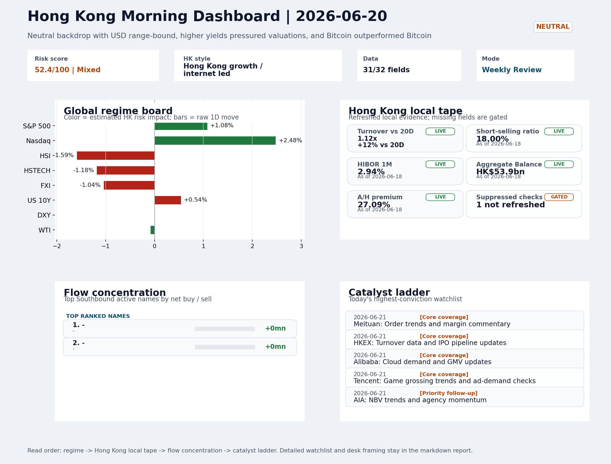
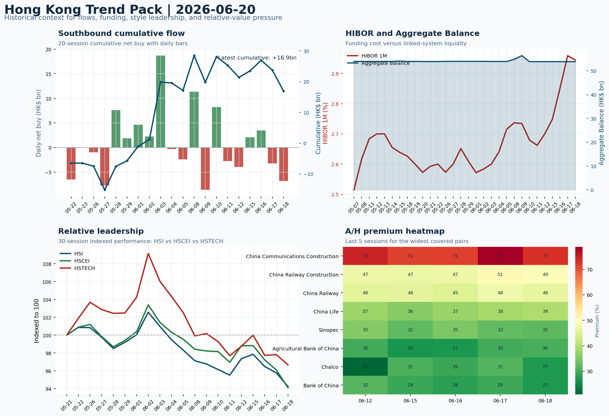

# Morning Research Workbench | 2026-06-21

> Designed for a Hong Kong sell-side commute: Layer 1 `Scan`, Layer 2 `Deep Read`, Layer 3 `Thinking`
> Mode: `Weekly Review` | Use Saturday's non-trading review date to synthesize the completed Hong Kong week and prepare next week's work plan.
> Briefing date: `2026-06-21` | Review date: `2026-06-20` | Global request: `2026-06-20` | HK/China request: `2026-06-19` | Market effective date: `2026-06-19` | Generated at: `2026-06-21 08:18:18`

## Executive Summary

- **Market pulse:** HSTECH-led intraday resilience versus offshore China proxies and elevated local short-selling define the week's mixed signal, with Monday's earnings from Meituan, Tencent, Alibaba, HKEX.
- **Hong Kong lens:** Hong Kong growth / internet led. Monday's HK open faces a hawkish Fed backdrop, higher US yields (+0.54% on 10Y), and elevated local shorting.
- **Top catalysts:** VIX -11.06%; Neutral backdrop with USD range-bound, higher yields pressured valuations, and Bitcoin outperformed Bitcoin.

## Visual Dashboard

## Layer 1 | Weekly Scan (5-10 min)

### 1.1 One-Line Market Pulse
HSTECH-led intraday resilience versus offshore China proxies and elevated local short-selling define the week's mixed signal, with Monday's earnings from Meituan, Tencent, Alibaba, HKEX and BYD serving as the primary confirmation point for whether growth leadership can persist against a hawkish Fed backdrop.

### 1.2 Global Asset Price Dashboard

| Asset | Last | 1D move | Read |
| --- | --- | --- | --- |
| S&P 500 | 7,500.58 | +1.08% | US large-cap risk appetite |
| Nasdaq 100 | 30,406.19 | **+2.48%** | Growth and duration leadership |
| Hang Seng Index | 23,924.81 | **-1.59%** | Hong Kong broad beta |
| Hang Seng TECH | 4.5120 | -1.18% | Hong Kong growth / platform read-through |
| CSI 300 | 4,777.32 | +1.16% | Mainland large-cap tone |
| US 10Y | 4.4870 | +0.54% | Global discount-rate anchor |
| China 10Y | 1.73% | +0.3bp | China local rates anchor \| Live public \| Eastmoney \| 2026-06-18 |
| CN-US 10Y spread | -273.0bp | +3.3bp | Relative carry and macro-pressure gauge \| Live public \| Eastmoney \| 2026-06-18 |
| DXY | 100.85 | -0.00% | Dollar liquidity impulse |
| USD/CNH | 6.7450 | -0.27% | Offshore China risk appetite |
| USD/HKD | 7.8368 | +0.02% | Linked-exchange regime stress check |
| Brent crude | 80.59 | +0.93% | Energy / geopolitics |
| COMEX gold | 4,172.90 | -1.21% | Hedge demand / real yields |
| Copper | 6.3370 | -0.59% | Global growth proxy |
| VIX | 16.40 | **-11.06%** | US stress barometer |

### 1.3 Hong Kong Weekly Tape Quick Check
_Coverage gate: 1 unavailable local checks are suppressed here and retained in validation metadata._

| Check | Value | Status | Source / as of | Why it matters |
| --- | --- | --- | --- | --- |
| Main Board turnover vs 20D | 1.12x \| +12% vs 20D | Live local | HKEX \| 2026-06-18 | Trailing 20-session average turnover was HK$319.2bn. |
| Short-selling ratio | 18.00% | Live local | HKEX \| 2026-06-18 | Official HKEX stock-level short-selling table, aggregated as a share of total market turnover. |
| AH premium index | 27.09% | Live public | Yahoo \| 2026-06-18 | Simple average across 15 A/H pairs; use dispersion rather than the average alone. |
| USD/HKD spot vs band | 7.8368 \| band 7.7500 to 7.8500 | Live quote + local | Yahoo \| 2026-06-19 | Inside the linked-exchange band without immediate boundary stress. Official Convertibility Undertakings define the linked-rate stress boundaries for USD/HKD. |
| HIBOR 1M | 2.94% | Live local | HKMA \| 2026-06-18 | 1M HIBOR is the cleanest quick read for Hong Kong funding conditions and equity-duration pressure. |
| Aggregate Balance | HK$53.9bn | Live local | HKMA \| 2026-06-18 | Aggregate Balance helps frame whether linked-rate liquidity conditions are tight or comfortable. |
| Hong Kong leadership | Hong Kong growth / internet led | Proxy | HSI / HSCEI / HSTECH relative perf \| 2026-06-19 | Use HSI / HSCEI / HSTECH relative moves as the opening style read. |

### 1.4 Risk Dashboard
**Composite risk score:** `52.4/100` | **Regime:** `Mixed`

| Component | Score impact | Evidence |
| --- | --- | --- |
| US beta | +6.5 | S&P 500 +1.08% |
| HK growth | -5.9 | HSTECH -1.18% |
| Offshore China proxy | -5.2 | FXI -1.04% |
| Dollar pressure | +0.0 | DXY -0.00% |
| Volatility | +10 | VIX -11.06% |
| HK short-selling | -8 | Short-selling ratio 18.00% |

### 1.5 Next Week Checklist
1. **VIX -11.06%**
 High-frequency data | Lower volatility signals easing stress in the tape.
2. **Neutral backdrop with USD range-bound, higher yields pressured valuations, and Bitcoin outperformed Bitcoin**
 Still-moving markets | No fresh Hong Kong cash session is assumed; use global active assets and policy/event flow to prepare the next open.
3. **CPI MoM (Released)**
 Macro / policy | Rates expectations, the dollar, and growth-equity valuation | Industries: Technology, Internet, Brokers
4. **Trade Balance (Released)**
 Macro / policy | Watch whether it changes the day's core market narrative | Industries: Market-wide
5. **Retail Sales MoM (Upcoming)**
 Macro / policy | Consumer resilience, growth expectations, and risk-asset pricing | Industries: Consumer, E-commerce, Consumer discretionary

## Layer 2 | Deep Read (20-30 min)

### 2.1 Weekly Cross-Asset Review
> Weekly review mode: synthesize the completed Hong Kong week, retain the main cross-asset and policy lessons, and convert them into next-week preparation rather than treating Saturday as a fresh cash-market session.

#### Market Setup
**Core tape.** Overnight markets digested a decisive Fed hawkish pivot under Chairman Warsh - removing cutting bias and signaling a potential 2026 hike - that arrived alongside persistent US CPI, reinforcing rate-cutoff expectations.
**Main driver.** The Nasdaq 100 outperformed (+2.48%) while the S&P 500 gained a more modest +1.08%, suggesting growth-style leadership in the US was not uniformly impaired by higher yields.
**HK relevance.** Hong Kong proxies (FXI -1.04%, HSTECH -1.18%, HSCEI -2.06%) lagged the US session, reflecting offshore China repricing that preceded and partially discounted the Fed shift, with USD/CNH -0.27% and USD/HKD at 7.8368 framing.

#### Key Drivers
- Fed removed cutting bias under Warsh; multiple members signaled a 2026 hike is on the table, shifting rate-expectations hawkish.
- US CPI MoM confirmed inflation persistence, providing the data justification for the Fed's altered stance.
- Nasdaq 100 (+2.48%) outperformed S&P 500 (+1.08%), indicating growth-style leadership in the US despite higher yields - but this divergence.
- VIX fell 11% overnight, likely position squaring rather than a fundamental easing of macro risk.

#### Hong Kong Read-Through
**Desk lens.** Hong Kong growth / internet led.
**Opening implication.** Monday's HK open faces a hawkish Fed backdrop, higher US yields (+0.54% on 10Y).
- **Cross-market read:** Hang Seng -1.59% / HSCEI -2.06% / HSTECH -1.18%.
- **Cross-market read:** Offshore China proxy FXI -1.04% and USD/CNH -0.27% frame cross-border risk appetite.
- **Cross-market read:** USD/HKD last traded around 7.8368, which keeps the Hong Kong funding lens in focus.

#### Watch Points
- USD composite moved lower by -0.01pct intraday, with a 0.217pct range.
- Main turning points appeared around 2026-06-19 08:05 trough / 2026-06-19 08:20 trough / 2026-06-19 08:50 trough, suggesting event-driven repricing.
- The biggest cross-asset divergence was Bitcoin versus Bitcoin, a spread of 0.0pct.
- Bitcoin moved +0.91pct intraday with a 1.89pct high-low range.

#### Weekly Review Map
- Weekly review window: 2026-06-15 to 2026-06-19. Core regime: Neutral backdrop with USD range-bound, higher yields pressured valuations, and Bitcoin outperformed Bitcoin. Hong Kong leadership: Hong Kong growth / internet led.
- Method note: Trend summary uses the latest available five observations from the Hong Kong Trend Pack inputs.

**Cross-asset weekly dashboard**

| Asset | Latest move | Weekly read |
| --- | --- | --- |
| S&P 500 | +1.08% | Risk appetite |
| Nasdaq 100 | +2.48% | Growth style |
| Hang Seng Index | -1.59% | Hong Kong beta |
| Hang Seng TECH | -1.18% | Hong Kong growth / internet tone |
| DXY | -0.00% | Global liquidity |
| US 10Y | +0.54% | Rates path |
| Gold | -1.21% | Hedge / real yields |
| VIX | -11.06% | Volatility and hedging |

**Hong Kong / China weekly tape**

| Signal | Latest move | Read |
| --- | --- | --- |
| Hang Seng Index | -1.59% | Hong Kong beta |
| HSCEI | -2.06% | China SOE / H-share tone |
| Hang Seng TECH | -1.18% | Hong Kong growth / internet tone |
| China proxy (FXI) | -1.04% | China sentiment |
| USD/CNH | -0.27% | China FX sentiment |
| USD/HKD | +0.02% | Hong Kong funding lens |

**Five-session trend evidence**
_Window: 2026-06-12 to 2026-06-18_

| Signal | Five-session change | Latest | Desk read |
| --- | --- | --- | --- |
| Southbound flow | -8.4bn over 5 sessions | -6.8bn | 2/5 positive sessions; cumulative buying is the flow-confirmation test for next week. |
| HKD funding | HIBOR +24bp; Aggregate Balance -0.0bn | 2.94% / HK$53.9bn | Funding stress matters if HIBOR rises while Aggregate Balance contracts. |
| HK style leadership | HSTECH led (-2.1pp); HSCEI lagged (-4.7pp) | HSTECH leadership | Use HSI / HSCEI / HSTECH spread to separate broad beta from growth-led rerating. |
| A/H premium dispersion | +0.2pp average change | 40.6% average premium | Premium narrowing can support H-share relative demand |

**Flow and attribution clues**
- :
- :
- :

**Next-week desk questions**
- Did Southbound flow confirm the index move, or was the week mainly offshore beta without local money follow-through?
- Did HIBOR and Aggregate Balance point to benign funding, or should tighter HKD liquidity be part of next week's risk case?
- Was leadership broad enough beyond HSTECH / platform beta, or was the week concentrated in a narrow style pocket?
- Which dated macro, policy, earnings, or IPO catalyst can realistically change the next-week narrative?
- What single data point would invalidate the base-case market pulse by Monday or Tuesday morning?

**Key developments to retain**

| Bucket | Item | Why it matters |
| --- | --- | --- |
| C | The Reindustrialize Summit: 'Build, Baby, Build' | Assess whether the story can propagate through the Industrials value chain |
| Released | CPI MoM | Rates expectations, the dollar, and growth-equity valuation |
| Released | Trade Balance | Watch whether it changes the day's core market narrative |
| Upcoming | Retail Sales MoM | Consumer resilience, growth expectations, and risk-asset pricing |

**Next-week playbook**

| Date | Catalyst | Desk read |
| --- | --- | --- |
| 2026-06-21 | Meituan: Order trends and margin commentary | High-frequency read on local services demand and platform competition |
| 2026-06-21 | HKEX: Turnover data and IPO pipeline updates | Direct proxy for Hong Kong market turnover, listings, and southbound interest |
| 2026-06-21 | Alibaba: Cloud demand and GMV updates | Key read-through for China consumption, cloud, and platform regulation |
| 2026-06-21 | Tencent: Game grossing trends and ad-demand checks | Core offshore China platform proxy for gaming, ads, and AI monetization |
| 2026-06-21 | AIA: NBV trends and agency momentum | Read-through for wealth demand, mainland visitor activity, and HK financial sentiment |
| 2026-06-21 | BYD Company: Weekly sales data and model rollout cadence | Hong Kong-listed proxy for EV volumes, export mix, and price competition |
| 2026-06-21 | China Mobile: Capex updates and dividend policy signals | Defensive SOE benchmark for yield trade and domestic digital-infrastructure spend |
| 2026-06-21 | HSCEI ETF: Policy flow-through and financial/energy leadership | Useful proxy for state-owned and old-economy H-share leadership |

**Curated overnight stories**
1. **Fed holds rates, removes cutting bias; Warsh signals potential 2026 hike**
 Why it matters: Chairman Warsh made a decisive hawkish pivot by stripping the rate statement of easing language. Multiple Fed members signaled a hike in 2026, and Warsh declined to provide.
 HK read-through: Direct impact on HKD-USD dynamics and cost of capital for Hong Kong-listed growth and technology names.
2. **US CPI MoM released; confirms inflation persistence**
 Why it matters: CPI data arrived alongside the hawkish Fed pivot, reinforcing the narrative that rate cuts are off the table for now.
 HK read-through: Validates the rate-sensitive selloff thesis for Hong Kong tech and internet names. Also matters for FX watchers tracking USD strength against HKD and CNY.
3. **VIX down 11% overnight**
 Why it matters: Volatility compressed meaningfully, signaling reduced stress in global risk sentiment. However, the VIX decline occurred alongside - rather than despite - the hawkish Fed shift.
 HK read-through: Modestly supportive for Hong Kong risk appetite on open. Partial offset to policy-driven caution. Monitor whether the relief holds if Fed hawkishness deepens next week.
4. **US Retail Sales MoM due next week**
 Why it matters: Consumer spending data will be a key test of whether US growth remains resilient enough to sustain the hawkish Fed stance without triggering a hard landing.
 HK read-through: If strong: reinforces USD strength and further pressures HK growth sectors. If weak: may create a window for easing expectations and support rate-sensitive names.
5. **Iran reportedly closes Strait of Hormuz amid Vance diplomatic talks**
 Why it matters: Geopolitical risk affecting global energy supply chains. Escalation near a critical chokepoint adds a tail risk to commodity prices and risk-asset pricing globally.
 HK read-through: Secondary but worth monitoring. Energy sector exposure through H-shares and ADRs; potential for broader risk-off spillover if tensions escalate before next HK open.

### 2.2 Hong Kong / A-share Weekly Review
> Weekly review mode: synthesize the completed Hong Kong week, retain the main cross-asset and policy lessons, and convert them into next-week preparation rather than treating Saturday as a fresh cash-market session.

#### Local Tape Setup
**Local read.** Hong Kong completed the week in a neutral-but-cautious regime, with HSI -1.59%, HSCEI -2.06%, and HSTECH -1.18%.
**Verification point.** The style spread - HSTECH outperforming HSCEI by roughly 90bp - is the most actionable signal from the week and needs confirmation at Monday's open.
**Risk to watch.** Short-selling at 18% of turnover, ETF outflows in 3033.HK (0.62x volume) and 2800.HK (0.64x volume).

#### Style and Local Leadership
**Style leadership.** Hong Kong growth / internet led.
- **Cross-market read:** Hang Seng -1.59% / HSCEI -2.06% / HSTECH -1.18%.
- **Cross-market read:** Offshore China proxy FXI -1.04% and USD/CNH -0.27% frame cross-border risk appetite.
- **Cross-market read:** USD/HKD last traded around 7.8368, which keeps the Hong Kong funding lens in focus.

#### Flow Confirmation
Official Stock Connect evidence is available; use Section 2.3 to confirm whether local money supports the price action.

#### Follow-Through Checklist
**Follow-through check.** Watch whether Monday's batch of earnings - Meituan, Tencent, Alibaba, HKEX, AIA, BYD - confirms or breaks the growth-led spread. If HSTECH ETF (3033.HK) volume ratio rises above 1.0x alongside positive Southbound read-through, the style read is validated.

### 2.3 Flow Tracker and Attribution
#### Cross-Asset Attribution v1

| Driver | Direction | Score | Evidence | HK implication |
| --- | --- | --- | --- | --- |
| US growth-style transmission | supportive | 3.47 | Nasdaq 100 moved +2.48%. | Hong Kong growth and platform names should be tested first at the open. |
| Short-selling pressure | drag | 2.1 | HKEX short-selling ratio was 18.00%. | Elevated short activity argues for extra confirmation before chasing rebounds. |
| Hong Kong participation | supportive | 1.24 | Main Board turnover was 1.12x the 20-session average. | Higher participation makes local price action more credible. |
| Global equity beta | supportive | 1.08 | S&P 500 moved +1.08%. | Broad beta matters if Hong Kong breadth confirms the overseas signal. |
| Rates impulse | drag | 0.65 | US 10Y yield proxy moved +0.54%. | Lower yields help long-duration growth; higher yields pressure valuation-sensitive |
| Dollar / CNH pressure | supportive | 0.41 | DXY -0.00% / USD-CNH -0.27% | A stable or softer CNH makes Hong Kong follow-through more credible. |

#### Flow Tracker
##### Flow Takeaways
- Short-selling pressure is elevated, so local rebounds need cleaner breadth and flow confirmation.
- AH premium: simple covered-pair average +27.09%; widest premium: China Communications Construction 72.52%.
- ETF flow anomalies were concentrated in: LQD +0.28% / volume ratio 1.41x / inflow; 3033.HK -1.18% / volume ratio 0.62x / outflow; 2800.HK -1.62% / volume ratio 0.64x / outflow.
- HKEX short selling: 18.00% of market turnover (HK$65.2bn short turnover, as of 2026-06-18).

##### Stock Connect Southbound Active Names

| Rank | Ticker | Name | Buy | Sell | Net buy |
| --- | --- | --- | --- | --- | --- |
| 1 | | - | N/A | N/A | N/A |
| 1 | | - | N/A | N/A | N/A |

##### AH Premium Dispersion

| Name | A ticker | H ticker | Premium | As of |
| --- | --- | --- | --- | --- |
| China Communications Construction | 601800.SS | 1800.HK | +72.52% | 2026-06-18 |
| China Railway Construction | 601186.SS | 1186.HK | +49.15% | 2026-06-18 |
| China Railway | 601390.SS | 0390.HK | +46.25% | 2026-06-18 |
| China Life | 601628.SS | 2628.HK | +39.24% | 2026-06-18 |
| Sinopec | 600028.SS | 0386.HK | +31.71% | 2026-06-18 |

##### HKEX Short-Selling Watch

| Ticker | Name | Short ratio | Short turnover | Total turnover |
| --- | --- | --- | --- | --- |
| 00388.HK | HKEX | 15.74% | HK$0.5bn | HK$3.0bn |
| 00700.HK | TENCENT | 9.10% | HK$1.2bn | HK$13.2bn |
| 00941.HK | CHINA MOBILE | 12.69% | HK$0.2bn | HK$1.8bn |
| 01211.HK | BYD COMPANY | 17.29% | HK$0.4bn | HK$2.5bn |
| 01299.HK | AIA | 23.29% | HK$0.6bn | HK$2.6bn |

- **Short-value leaders:** 07709.HK XL2CSOPHYNIX (HK$4.5bn); 02828.HK HSCEI ETF (HK$3.9bn); 02800.HK TRACKER FUND (HK$3.5bn); 09988.HK BABA-W (HK$2.1bn).

### 2.4 Macro and Policy Tracking
**Desk read.** The completed week saw HSTECH lead despite a hotter US CPI (0.3% MoM vs 0.2% forecast), which added pressure to rates and stretched valuation multiples.

**Market sensitivity.** Southbound flow was negative across the week (cumulative outflow of HK$8.4bn), while HIBOR rose 24bp - early signals that funding conditions merit attention.

**HK implication.** China's trade surplus (USD 85.2bn vs 79bn forecast) provided a sentiment cushion but did not reverse the broad dollar-yield drag.

**Macro watchpoints**
- US 10Y yield and DXY reaction to retail sales and Powell: a break higher would challenge growth-sector leadership.
- Southbound flow resumption on Monday: net buying needed to confirm domestic conviction beyond offshore beta.
- HIBOR fixings and Aggregate Balance: further tightening would flag funding stress for Hong Kong risk assets.
- Key earnings/updates (Meituan, Alibaba, Tencent, HKEX, BYD): micro catalysts can override macro drift if numbers or guidance surprise.

| Time | Region | Event | Status | Desk read |
| --- | --- | --- | --- | --- |
| 20:30 | US | CPI MoM | Released | Impact: Rates expectations, the dollar, and growth-equity valuation \| Attention: 5/5 \| Industries: Technology, Internet, Brokers |
| 09:30 | China | Trade Balance | Released | Impact: Watch whether it changes the day's core market narrative \| Attention: 3/5 \| Industries: Market-wide |
| 20:30 | US | Retail Sales MoM | Upcoming | Impact: Consumer resilience, growth expectations, and risk-asset pricing \| Attention: 5/5 \| Industries: Consumer, E-commerce, Consumer discretionary |
| 09:20 | China | Loan Prime Rate | Upcoming | Impact: Watch whether it changes the day's core market narrative \| Attention: 3/5 \| Industries: Market-wide |
| 22:00 | Federal Reserve | Jerome Powell: Economic outlook remarks | Central bank | Impact: Policy path, liquidity conditions, and cross-asset risk appetite \| Attention: 5/5 \| Industries: Technology, Financials, Gold |
| 10:00 | PBOC | Open Market Operations Desk: Daily liquidity operation window | Central bank | Impact: Policy path, liquidity conditions, and cross-asset risk appetite \| Attention: 3/5 \| Industries: Technology, Financials, Gold |

#### Positioning and Risk Backdrop
- Options activity centered on KWEB Call, with Vol/OI at 1.88x and a bullish bias.
- Put/Call structure shows equity 0.68 / index 1.15, implying Single-stock optimism with index hedging.
- Geopolitics: Middle East | Regional tension remains elevated | Impact: Oil, freight costs, and safe-haven demand
- Geopolitics: US-China | Technology export-control rhetoric remains active | Impact: China internet, semiconductors, and supply chains

### 2.5 Key Company and Sector Events
No high-conviction sector story cleared the main-report relevance gate for this run.

#### HKEX Announcements

| Grade | Ticker | Type | Release time | Title |
| --- | --- | --- | --- | --- |
| A | 00211.HK | Profit warning | 2026-06-18 | Profit warning / alert announcement |
| A | 00223.HK | Profit warning | 2026-06-18 | Profit warning / alert announcement |
| A | 00248.HK | Profit warning | 2026-06-18 | Profit warning / alert announcement |
| A | 00290.HK | Profit warning | 2026-06-18 | Profit warning / alert announcement |
| A | 00306.HK | Profit warning | 2026-06-18 | Profit warning / alert announcement |
| A | 00332.HK | Profit warning | 2026-06-18 | Profit warning / alert announcement |
| A | 00375.HK | Profit warning | 2026-06-18 | Profit warning / alert announcement |
| A | 00403.HK | Profit warning | 2026-06-18 | Profit warning / alert announcement |

#### Earnings / Results Watch

| Ticker | Company | Timing | Expectation framing |
| --- | --- | --- | --- |
| 0700.HK | Tencent Holdings | After Market Close | EPS est. 4.15 HKD \| revenue est. 163.2bn HKD |
| 0388.HK | Hong Kong Exchanges and Clearing | Before Market Open | EPS est. 2.81 HKD \| revenue est. 6.0bn HKD |

#### Rating Changes
- **9988.HK** | Morgan Stanley | Upgrade | Equal Weight -> Overweight | PT 92 -> 105

#### IPO Watch
- IPO and grey-market monitoring is not yet part of the standard production pack.

### 2.6 Today's Core Names
#### Core coverage

| Name | Ticker | Last | 1D | Range position | Morning note |
| --- | --- | --- | --- | --- | --- |
| Meituan | 3690.HK | 71.80 | -3.49% | Bottom of range | Short-term pressure is visible; check for a fundamental or regulatory reason. |
| HKEX | 0388.HK | 374.80 | -2.24% | Bottom of range | Short-term pressure is visible; check for a fundamental or regulatory reason. |

**Recent headlines for Meituan:**
- [China food delivery stocks fall on fresh regulations covering subsidies](https://finance.yahoo.com/markets/stocks/articles/china-food-delivery-stocks-fall-050006974.html) (Investing.com)

#### Priority follow-up

| Name | Ticker | Last | 1D | Range position | Morning note |
| --- | --- | --- | --- | --- | --- |
| AIA | 1299.HK | 73.70 | -1.80% | Bottom of range | The name sits near the bottom of its recent range and is worth monitoring for a catalyst-led reversal. |
| BYD Company | 1211.HK | 80.85 | -1.28% | Bottom of range | The name sits near the bottom of its recent range and is worth monitoring for a catalyst-led reversal. |

**Recent headlines for BYD Company:**
- [BYD (SEHK:1211) Stock Could Be 46.9% Undervalued After Great Tang Pre Orders](https://finance.yahoo.com/markets/stocks/articles/byd-sehk-1211-stock-could-231945039.html) (Simply Wall St.)

## Layer 3 | Thinking (10-15 min)

### 3.1 Rotating Theme Deep Dive

| Field | Read |
| --- | --- |
| Theme | AI and Compute Chain |
| Angle for the day | Track whether global AI capex, semis, cloud, and server demand are still carrying offshore China internet and hardware sentiment. |

**Theme desk read**
**Core thesis.** The AI and Compute Chain theme is losing visible support from offshore China internet names this week, even as global risk signals show no outright stress.
**Evidence.** The VIX dropped to 16.4 (-11.06%), and Bitcoin edged higher (+1.02%), suggesting that broad risk appetite is not the binding constraint.
**What to test.** Yet higher US 10Y yields (4.487%, +0.54%) continue to pressure growth-equity valuations, and both Alibaba (-1.87% to 104.9) and Tencent (-1.17% to 440.2) ended the week near the bottom of their recent ranges.

**Signals to keep in mind**
- The Reindustrialize Summit: 'Build, Baby, Build': Assess whether the story can propagate through the Industrials value chain
- VIX -11.06%: Lower volatility signals easing stress in the tape.
- Gold -1.21%: Keep tracking it to confirm whether the core daily narrative is holding.

**LLM watch items:**
- Alibaba cloud demand and GMV updates - verify if AI compute demand translates to China platform numbers.
- Tencent game grossing and ad-demand checks - gauge any early monetization read from AI features.
- US Retail Sales MoM (released Sunday) - consumer resilience matters for e-commerce revenue proxies.
- China Loan Prime Rate - unchanged at 3.45% expected, but any surprise could alter growth-equity sentiment.
- Southbound flow - look for a shift to net buying and more positive sessions to confirm local conviction.

**Related names to keep close:**

| Name | Ticker | Bucket | Morning read |
| --- | --- | --- | --- |
| Alibaba | 9988.HK | Core coverage | The name sits near the bottom of its recent range and is worth monitoring for a catalyst-led reversal. |
| Tencent | 0700.HK | Core coverage | The name sits near the bottom of its recent range and is worth monitoring for a catalyst-led reversal. |
| AIA | 1299.HK | Priority follow-up | The name sits near the bottom of its recent range and is worth monitoring for a catalyst-led reversal. |
| China Mobile | 0941.HK | Priority follow-up | Positioning is neutral for now, so use it mainly to monitor marginal information changes. |

**Upcoming catalysts tied to the theme:**
- 2026-06-21 | Alibaba: Cloud demand and GMV updates | Key read-through for China consumption, cloud, and platform regulation
- 2026-06-21 | Tencent: Game grossing trends and ad-demand checks | Core offshore China platform proxy for gaming, ads, and AI monetization
- 2026-06-21 | AIA: NBV trends and agency momentum | Read-through for wealth demand, mainland visitor activity, and HK financial sentiment
- 2026-06-21 | Hang Seng TECH ETF: AI narrative shifts and China platform regulation headlines | Fast proxy for Hong Kong internet and growth leadership

**Relevant headlines:**
- [The Reindustrialize Summit: 'Build, Baby, Build'](https://www.bloomberg.com/news/videos/2026-06-20/the-reindustrialize-summit-build-baby-build-video)

### 3.2 Next Week Calendar and Reopen Prep
- Non-trading review: use today's calendar to prepare the next Hong Kong open rather than treating the last cash tape as a fresh signal.
- Macro: CPI MoM is the first item to anchor the open and the rates/FX response.
- Corporate / event: Meituan: Order trends and margin commentary is the cleanest same-day catalyst to prepare for.

**Same-day macro docket**

| Time | Country | Event | Status | Detail |
| --- | --- | --- | --- | --- |
| 20:30 | US | CPI MoM | Released | Actual 0.3% / Forecast 0.2% / Prior 0.4% |
| 09:30 | China | Trade Balance | Released | Actual USD 85.2bn / Forecast USD 79.0bn / Prior USD 80.6bn |
| 20:30 | US | Retail Sales MoM | Upcoming | Forecast 0.3% / Prior 0.6% |
| 09:20 | China | Loan Prime Rate | Upcoming | Forecast 3.45% / Prior 3.45% |
| 22:00 | Federal Reserve | Jerome Powell: Economic outlook remarks | Central bank | speech |

**Same-day catalyst list**

| Date | Time | Category | Event | Importance |
| --- | --- | --- | --- | --- |
| 2026-06-21 | | Core coverage | Meituan: Order trends and margin commentary | 3 |
| 2026-06-21 | | Core coverage | HKEX: Turnover data and IPO pipeline updates | 3 |
| 2026-06-21 | | Core coverage | Alibaba: Cloud demand and GMV updates | 3 |
| 2026-06-21 | | Core coverage | Tencent: Game grossing trends and ad-demand checks | 3 |

**Next few sessions**

| Date | Category | Event | Impact |
| --- | --- | --- | --- |
| 2026-06-21 | Core coverage | Meituan: Order trends and margin commentary | High-frequency read on local services demand and platform competition |
| 2026-06-21 | Core coverage | HKEX: Turnover data and IPO pipeline updates | Direct proxy for Hong Kong market turnover, listings, and southbound |
| 2026-06-21 | Core coverage | Alibaba: Cloud demand and GMV updates | Key read-through for China consumption, cloud, and platform regulation |
| 2026-06-21 | Core coverage | Tencent: Game grossing trends and ad-demand checks | Core offshore China platform proxy for gaming, ads, and AI monetization |

### 3.3 Daily One Chart
**Daily One Chart | HKEX short-selling pressure map**

**Chart read.** Market short-selling reached 18.00% of turnover.
**Why it matters.** The chart leads today because the pressure is either broad, concentrated, or acute in the top name.

_Source: HKEX Daily Quotations - Short Selling Turnover_

### 3.4 Hong Kong Trend Pack
**Hong Kong Trend Pack**

**Trend read.** Four historical lenses: Southbound cumulative flow, HKMA funding and liquidity, HSI/HSCEI/HSTECH relative leadership, and A/H premium dispersion.

_Source: HKEX Stock Connect, HKMA liquidity data, and public Yahoo Finance quotes_

## Traceable Appendix

### Report Metadata
> Date policy: Review date 2026-06-20 is treated as `Weekly Review`. | Global request date is 2026-06-20; adapter effective date is 2026-06-19 and summary date is 2026-06-19. | HK/China local data date is 2026-06-19; role: last completed HK/China cash-market reference tape.
> Market data quality: Coverage: `31/32` | Stale items (>1d): `6` | Missing: `1`
> Report quality: `80.1/100` | Grade `B` | Status `usable with caveats`

### Key Questions to Keep in Mind
- Is risk appetite rising or fading? The overnight tape reads closer to `Neutral`.
- Did rates expectations move? Focus on whether US 10Y, DXY, and growth style moved together.
- Were commodities the real story? Watch WTI and gold for geopolitics versus inflation signals.
- Is Hong Kong setup internet-led, SOE-led, or broad beta-led? Compare HSTECH, HSCEI, and HSI.
- Did offshore markets move China risk appetite? Focus on HSI, FXI, USD/CNH, and USD/HKD.

### Report Quality and Validation
- **Quality score:** 80.1/100 | **Grade:** B | **Status:** usable with caveats
- **Run summary:** 7 healthy | 1 caveat | 0 failed
- **Release recommendation:** Send with caveats | The report is usable, but the advisory guidance should travel with it so readers understand the data gaps.

| Source | Status | Bucket |
| --- | --- | --- |
| Market data | ok | healthy |
| Sector and company news | ok | healthy |
| Movers and short selling | ok | healthy |
| Stock Connect | ok | healthy |
| A/H premium | ok | healthy |
| Hong Kong local package | ok | healthy |
| China rates | ok | healthy |
| Narrative overlay | partial | caveat |

**Desk-use guidance summary:** 0 blocking | 1 advisory

**Desk-use guidance**
- **Advisory:** Use deterministic sections as primary support; the narrative overlay was partial or unavailable on this run.

| Component | Score | Weight | Read |
| --- | --- | --- | --- |
| Market data coverage | 96.9 | 0.3 | 31/32 core market fields available. |
| Hong Kong local metrics | 73.2 | 0.25 | 7 live, 3 proxy, 1 unavailable local checks. |
| Key public adapters | 100.0 | 0.2 | 4/4 key adapters were available or partially available. |
| Narrative overlay health | 51.4 | 0.15 | 2/7 narrative overlay tasks succeeded or used validated cache; 1 error(s). |
| Fact-check guardrail | 50.0 | 0.1 | Checked 4 numeric claims; 2 numeric mismatch(es), 0 logic warning(s); 2 critical, 0 review. |

**Quality warnings**
- Narrative overlay health is weak: 2/7 narrative overlay tasks succeeded or used validated cache; 1 error(s).
- Fact-check guardrail is weak: Checked 4 numeric claims; 2 numeric mismatch(es), 0 logic warning(s); 2 critical, 0 review.
- Narrative fact-check guardrail produced warnings; review the validation table before relying on narrative sections.

**Narrative fact-check guardrail**
- Checked 4 numeric claims; 2 numeric mismatch(es), 0 logic warning(s); 2 critical, 0 review.

| Severity | Field | Claim | Type | Claimed | Expected | Snippet |
| --- | --- | --- | --- | --- | --- | --- |
| critical | tasks.news_selection.selected_news[2].headline | VIX | change_pct | 11.0 | -11.06 | VIX down 11% overnight |
| critical | tasks.overnight_review.drivers[3] | VIX | change_pct | 11.0 | -11.06 | VIX fell 11% overnight, likely position squaring rather than a |

**Adapter status**

| Adapter | Status |
| --- | --- |
| Stock Connect | ok |
| A/H premium | ok |
| HKEX announcements | ok |
| China rates | ok |

### Source Links
- [China food delivery stocks fall on fresh regulations covering subsidies](https://finance.yahoo.com/markets/stocks/articles/china-food-delivery-stocks-fall-050006974.html) (Investing.com)
- [Here's What JPMorgan Thinks of Alibaba Group Holding Ltd (BABA)](https://finance.yahoo.com/markets/stocks/articles/jpmorgan-thinks-alibaba-group-holding-122002850.html) (Insider Monkey)
- [Tech Investor Prosus Posts Core Earnings Rise on Growth Across Units, Tencent](https://www.wsj.com/business/earnings/prosus-revenue-rises-on-growth-across-businesses-tencent-31e24051?siteid=yhoof2&yptr=yahoo) (The Wall Street Journal)
- [BYD (SEHK:1211) Stock Could Be 46.9% Undervalued After Great Tang Pre Orders](https://finance.yahoo.com/markets/stocks/articles/byd-sehk-1211-stock-could-231945039.html) (Simply Wall St.)
- [00211.HK Profit warning / alert announcement](http://www1.hkexnews.hk/listedco/listconews/sehk/2026/0618/2026061801214.pdf) (HKEXnews)
- [00223.HK Profit warning / alert announcement](http://www1.hkexnews.hk/listedco/listconews/sehk/2026/0618/2026061802098.pdf) (HKEXnews)
- [00248.HK Profit warning / alert announcement](http://www1.hkexnews.hk/listedco/listconews/sehk/2026/0618/2026061800612.pdf) (HKEXnews)
- [00290.HK Profit warning / alert announcement](http://www1.hkexnews.hk/listedco/listconews/sehk/2026/0618/2026061800478.pdf) (HKEXnews)
- [00306.HK Profit warning / alert announcement](http://www1.hkexnews.hk/listedco/listconews/sehk/2026/0618/2026061802016.pdf) (HKEXnews)
- [00332.HK Profit warning / alert announcement](http://www1.hkexnews.hk/listedco/listconews/sehk/2026/0618/2026061801208.pdf) (HKEXnews)
- [00375.HK Profit warning / alert announcement](http://www1.hkexnews.hk/listedco/listconews/sehk/2026/0618/2026061800650.pdf) (HKEXnews)
- [00403.HK Profit warning / alert announcement](http://www1.hkexnews.hk/listedco/listconews/sehk/2026/0618/2026061801278.pdf) (HKEXnews)

## Supplementary Visual Appendix

This appendix is professional-path only. It keeps a traceable index of the report visuals and the deterministic chart cues used to frame the morning note, without injecting the legacy intraday chart pack.

### Visual Index

| Visual | Path | Role |
| --- | --- | --- |
| Visual Dashboard | `charts/dashboard_2026-06-21.png` | Cross-asset regime board and Hong Kong local tape snapshot. |
| Daily One Chart | `charts/daily_one_chart_2026-06-21.png` | Single highest-conviction visual story for the day. |
| Hong Kong Trend Pack | `charts/hk_trend_pack_2026-06-21.png` | Historical context for flows, liquidity, leadership, and A/H dispersion. |

### Deterministic Chart Cues
- FX / liquidity: USD composite moved lower by -0.01pct intraday, with a 0.217pct range.
- FX / liquidity: Main turning points appeared around 2026-06-19 08:05 trough / 2026-06-19 08:20 trough / 2026-06-19 08:50 trough, suggesting event-driven repricing rather than a clean one-way USD move.
- Cross-asset: The biggest cross-asset divergence was Bitcoin versus Bitcoin, a spread of 0.0pct.
- Cross-asset: Bitcoin moved +0.91pct intraday with a 1.89pct high-low range.

### Risk Dashboard Components

| Component | Score impact | Evidence |
| --- | --- | --- |
| US beta | +6.5 | S&P 500 +1.08% |
| HK growth | -5.9 | HSTECH -1.18% |
| Offshore China proxy | -5.2 | FXI -1.04% |
| Dollar pressure | +0.0 | DXY -0.00% |
| Volatility | +10 | VIX -11.06% |
| HK short-selling | -8 | Short-selling ratio 18.00% |
