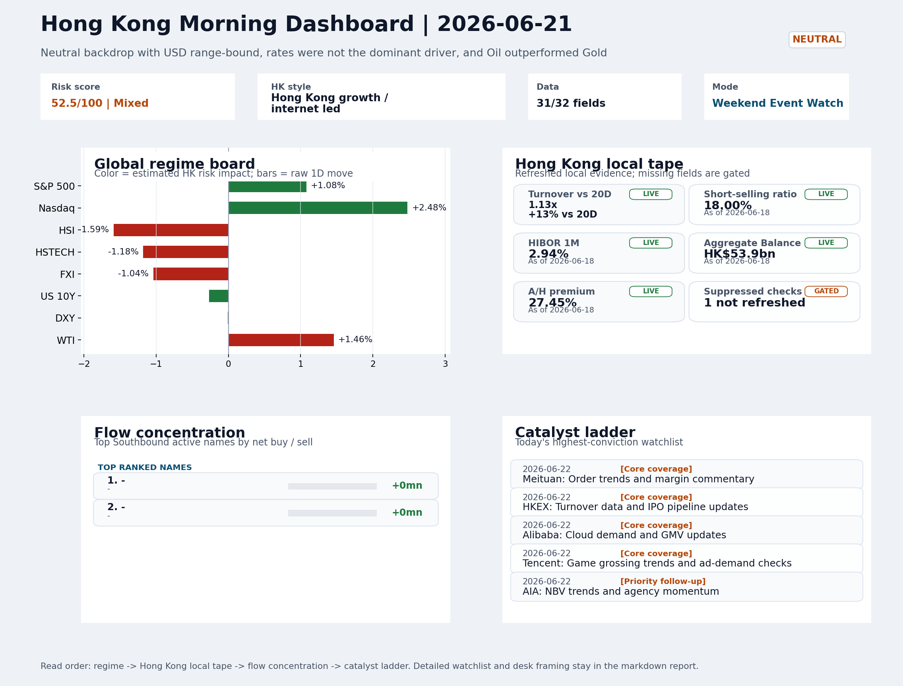

# Morning Research Workbench | 2026-06-22

> Designed for a Hong Kong sell-side commute: Layer 1 `Scan`, Layer 2 `Deep Read`, Layer 3 `Thinking`
> Mode: `Weekend Event Watch` | Track weekend policy, geopolitics, still-moving assets, and Monday open preparation rather than replaying stale cash-market tape.
> Briefing date: `2026-06-22` | Review date: `2026-06-21` | Global request: `2026-06-21` | HK/China request: `2026-06-19` | Market effective date: `2026-06-21` | Generated at: `2026-06-22 08:20:17`

## Executive Summary

- **Market pulse:** Weekend VIX compression (-11.06%) and US growth-style leadership (Nasdaq +2.48%) provide a constructive bridge for Monday's Hong Kong open, but elevated short-selling (18%) and a hawkish.
- **Hong Kong lens:** Hong Kong growth / internet led. A constructive open is more credible if HSTECH and FXI confirm the VIX/Nasdaq signal at Monday open rather than following the stale June 19 cash tape.
- **Top catalysts:** VIX -11.06%; Neutral backdrop with USD range-bound, rates were not the dominant driver, and Oil outperformed Gold.

## Visual Dashboard

## Layer 1 | Reset (5-10 min)

### 1.1 One-Line Market Pulse
Weekend VIX compression (-11.06%) and US growth-style leadership (Nasdaq +2.48%) provide a constructive bridge for Monday's Hong Kong open, but elevated short-selling (18%) and a hawkish Fed repricing under Chairman Warsh make local flow confirmation essential rather than assuming follow-through.

### 1.2 Global Asset Price Dashboard

| Asset | Last | 1D move | Read |
| --- | --- | --- | --- |
| S&P 500 | 7,500.58 | +1.08% | US large-cap risk appetite |
| Nasdaq 100 | 30,406.19 | **+2.48%** | Growth and duration leadership |
| Hang Seng Index | 23,924.81 | **-1.59%** | Hong Kong broad beta |
| Hang Seng TECH | 4.5120 | -1.18% | Hong Kong growth / platform read-through |
| CSI 300 | 4,941.60 | +0.21% | Mainland large-cap tone |
| US 10Y | 4.4510 | -0.27% | Global discount-rate anchor |
| China 10Y | 1.73% | +0.3bp | China local rates anchor \| Live public \| Eastmoney \| 2026-06-18 |
| CN-US 10Y spread | -273.0bp | +3.3bp | Relative carry and macro-pressure gauge \| Live public \| Eastmoney \| 2026-06-18 |
| DXY | 100.84 | -0.01% | Dollar liquidity impulse |
| USD/CNH | 6.7450 | -0.27% | Offshore China risk appetite |
| USD/HKD | 7.8368 | +0.02% | Linked-exchange regime stress check |
| Brent crude | 81.57 | **+2.15%** | Energy / geopolitics |
| COMEX gold | 4,161.90 | -1.47% | Hedge demand / real yields |
| Copper | 6.3325 | -0.66% | Global growth proxy |
| VIX | 16.40 | **-11.06%** | US stress barometer |

### 1.3 Hong Kong Last Cash-Tape Quick Check (Reference)
_Coverage gate: 1 unavailable local checks are suppressed here and retained in validation metadata._

| Check | Value | Status | Source / as of | Why it matters |
| --- | --- | --- | --- | --- |
| Main Board turnover vs 20D | 1.13x \| +13% vs 20D | Live local | HKEX \| 2026-06-18 | Trailing 20-session average turnover was HK$317.0bn. |
| Short-selling ratio | 18.00% | Live local | HKEX \| 2026-06-18 | Official HKEX stock-level short-selling table, aggregated as a share of total market turnover. |
| AH premium index | 27.45% | Live public | Yahoo \| 2026-06-18 | Simple average across 19 A/H pairs; use dispersion rather than the average alone. |
| USD/HKD spot vs band | 7.8368 \| band 7.7500 to 7.8500 | Live quote + local | Yahoo \| 2026-06-19 | Inside the linked-exchange band without immediate boundary stress. Official Convertibility Undertakings define the linked-rate stress boundaries for USD/HKD. |
| HIBOR 1M | 2.94% | Live local | HKMA \| 2026-06-18 | 1M HIBOR is the cleanest quick read for Hong Kong funding conditions and equity-duration pressure. |
| Aggregate Balance | HK$53.9bn | Live local | HKMA \| 2026-06-18 | Aggregate Balance helps frame whether linked-rate liquidity conditions are tight or comfortable. |
| Hong Kong leadership | Hong Kong growth / internet led | Proxy | HSI / HSCEI / HSTECH relative perf \| 2026-06-19 | Use HSI / HSCEI / HSTECH relative moves as the opening style read. |

### 1.4 Risk Dashboard
**Composite risk score:** `52.5/100` | **Regime:** `Mixed`

| Component | Score impact | Evidence |
| --- | --- | --- |
| US beta | +6.5 | S&P 500 +1.08% |
| HK growth | -5.9 | HSTECH -1.18% |
| Offshore China proxy | -5.2 | FXI -1.04% |
| Dollar pressure | +0.1 | DXY -0.01% |
| Volatility | +10 | VIX -11.06% |
| HK short-selling | -8 | Short-selling ratio 18.00% |

### 1.5 Next Open Checklist
1. **VIX -11.06%**
 High-frequency data | Lower volatility signals easing stress in the tape.
2. **Neutral backdrop with USD range-bound, rates were not the dominant driver, and Oil outperformed Gold**
 Still-moving markets | No fresh Hong Kong cash session is assumed; use global active assets and policy/event flow to prepare the next open.
3. **CPI MoM (Released)**
 Macro / policy | Rates expectations, the dollar, and growth-equity valuation | Industries: Technology, Internet, Brokers
4. **Trade Balance (Released)**
 Macro / policy | Watch whether it changes the day's core market narrative | Industries: Market-wide
5. **Retail Sales MoM (Upcoming)**
 Macro / policy | Consumer resilience, growth expectations, and risk-asset pricing | Industries: Consumer, E-commerce, Consumer discretionary

## Layer 2 | Deep Read (20-30 min)

### 2.1 Still-Moving Global Financial Actions
> Non-trading mode: treat the cash-market tape below as last-available reference, not a fresh trading signal. Priority shifts to policy headlines, geopolitics, central-bank repricing, FX/commodities/crypto, corporate actions, and next-open preparation.

#### Market Setup
**Core tape.** Overnight markets saw a constructive divergence: US growth-style assets (Nasdaq +2.48%) and oil outperformed gold, while VIX compressed -11.06% to 16.4, suggesting easing stress premiums.
**Main driver.** However, Chairman Warsh's hawkish Fed repricing and US-Iran Hormuz negotiations add cross-currents for the Monday open.
**HK relevance.** Hong Kong's last cash tape (June 19) showed HSCEI -2.06% and HSTECH -1.18%, but weekend USD/CNH -0.27% and VIX signal a potentially smoother open if China proxies confirm risk appetite at the Monday open.

#### Key Drivers
- VIX -11.06% is the most significant bridge signal; compressed volatility supports smoother Monday open setup.
- Oil +1.46% amid fragile US-Iran Hormuz talks adds commodity-sector complexity; Strait handles ~20% of global oil flows.
- Chairman Warsh's hawkish Fed pivot creates rate-sensitive headwind for H-share financials and property.
- Nasdaq +2.48% confirms US growth-style leadership; this is the positive transmission channel for Hong Kong tech.

#### Hong Kong Read-Through
**Desk lens.** Hong Kong growth / internet led.
**Opening implication.** A constructive open is more credible if HSTECH and FXI confirm the VIX/Nasdaq signal at Monday open rather than following the stale June 19 cash tape.
- **Cross-market read:** Hang Seng -1.59% / HSCEI -2.06% / HSTECH -1.18%.
- **Cross-market read:** Offshore China proxy FXI -1.04% and USD/CNH -0.27% frame cross-border risk appetite.
- **Cross-market read:** USD/HKD last traded around 7.8368, which keeps the Hong Kong funding lens in focus.

#### Watch Points
- USD composite moved higher by +0.00pct intraday, with a 0.061pct range.
- Main turning points appeared around 2026-06-22 06:05 peak / 2026-06-22 06:20 trough / 2026-06-22 06:50 trough, suggesting event-driven repricing.
- The biggest cross-asset divergence was Oil versus Gold, a spread of 0.452pct.
- Gold moved -0.39pct intraday with a 0.628pct high-low range.

#### Non-Trading Focus Map
- No fresh Hong Kong cash-market session is assumed for 2026-06-21; HK local tape is last completed HK/China cash-market reference tape from 2026-06-19.

| Monitor | Bucket | Last | Move | Why it matters |
| --- | --- | --- | --- | --- |
| VIX | Vol | 16.40 | -11.06% | Lower volatility signals easing stress in the tape. |
| Gold | Commodities | 4,161.90 | -1.47% | Keep tracking it to confirm whether the core daily narrative is holding. |
| WTI crude | Commodities | 77.72 | +1.46% | A strong crude move needs to be split between geopolitics and demand repair. |
| Bitcoin | Crypto | 64,239.68 | +1.10% | Keep tracking it to confirm whether the core daily narrative is holding. |
| Copper | Commodities | 6.3325 | -0.66% | Keep tracking it to confirm whether the core daily narrative is holding. |
| US 10Y | Rates | 4.4510 | -0.27% | Keep tracking it to confirm whether the core daily narrative is holding. |

**Weekend / Holiday Event Docket**

| Channel | Signal | Why monitor | Next check |
| --- | --- | --- | --- |
| Vol | VIX -11.06% | Lower volatility signals easing stress in the tape. | Keep this as the bridge signal until the next Hong Kong cash close confirms or |
| Commodities | Gold -1.47% | Keep tracking it to confirm whether the core daily narrative is holding. | Keep this as the bridge signal until the next Hong Kong cash close confirms or |
| Commodities | WTI crude +1.46% | A strong crude move needs to be split between geopolitics and demand repair. | Keep this as the bridge signal until the next Hong Kong cash close confirms or |
| Crypto | Bitcoin +1.10% | Keep tracking it to confirm whether the core daily narrative is holding. | Keep this as the bridge signal until the next Hong Kong cash close confirms or |
| Released | CPI MoM | Rates expectations, the dollar, and growth-equity valuation | Check the rates, FX, and China-proxy reaction after release or official |
| Released | Trade Balance | Watch whether it changes the day's core market narrative | Check the rates, FX, and China-proxy reaction after release or official |
| Upcoming | Retail Sales MoM | Consumer resilience, growth expectations, and risk-asset pricing | Check the rates, FX, and China-proxy reaction after release or official |
| Geopolitics | Middle East: Regional tension remains elevated | Oil, freight costs, and safe-haven demand | Map any escalation first into oil, gold, USD, CNH, and HK growth-beta sensitivity. |

**Still-moving actions to track**
- **Geopolitics:** Middle East: Regional tension remains elevated | Oil, freight costs, and safe-haven demand
- **Geopolitics:** US-China: Technology export-control rhetoric remains active | China internet, semiconductors, and supply chains
- **Policy / company tape:** Eileen Gu on Values That Define Success | Assess whether the story can propagate through the Other value chain
- **Released:** CPI MoM | Rates expectations, the dollar, and growth-equity valuation
- **Released:** Trade Balance | Watch whether it changes the day's core market narrative

**Next-open preparation**
- First dated catalyst to prepare: 2026-06-22 | Meituan: Order trends and margin commentary.
- Refresh HKEX turnover, Stock Connect, short-selling, and AH dispersion once the next HK cash session closes.
- Use USD/CNH, USD/HKD, DXY, oil, gold, and crypto as bridge signals before cash markets reopen.
- Prepare one base case and one risk case for the next Hong Kong open instead of over-reading stale cash-market moves.

**Curated overnight stories**
1. **Chairman Warsh drastically alters Fed rate statement**
 Why it matters: Kevin Warsh is reshaping Fed communications and forward guidance, with several members signalling a rate hike in 2026.
 HK read-through: High relevance for Hong Kong rate-sensitive sectors. A more hawkish Fed path could pressure H-share valuations, especially financials and property.
2. **U.S. and Iran begin peace talks amid conflicting claims over Strait of Hormuz**
 Why it matters: Direct U.S.-Iran diplomatic engagement is underway. However, conflicting claims about the Strait of Hormuz suggest negotiations are fragile.
 HK read-through: Direct relevance for Hong Kong-listed energy and shipping names. Oil outperformed gold overnight, consistent with Hormuz-risk pricing.
3. **SpaceX buyers underwater after post-IPO two-day slide**
 Why it matters: The 'riskiest SpaceX stock trade' is underperforming in its first week of public trading, with average post-IPO buyers facing losses.
 HK read-through: Secondary impact on growth-equity sentiment. SpaceX's weak debut offers a cautionary signal for IPO pipelines globally, including any Asia-adjacent private-market listings.
4. **VIX down 11.06% signals easing stress in global tape**
 Why it matters: Sharp volatility decline indicates compressed risk premiums across markets. Lower VIX is consistent with the neutral-but-constructive risk regime and range-bound USD backdrop.
 HK read-through: Supports a smoother Monday open for Hong Kong equities. Reduced tail-risk pricing could benefit risk-on positioning in growth and tech names, though the Fed hawkishness.
5. **CPI MoM and Trade Balance data released; Retail Sales data upcoming**
 Why it matters: Macro data flow continues to shape growth and inflation expectations. Released CPI and Trade Balance figures set the baseline.
 HK read-through: Relevant for Hong Kong exporters and consumer-facing sectors. A resilient consumer reading would support risk sentiment heading into the week.

### 2.2 Last Available Hong Kong / A-share Tape (Reference Only)
> Non-trading mode: treat the cash-market tape below as last-available reference, not a fresh trading signal. Priority shifts to policy headlines, geopolitics, central-bank repricing, FX/commodities/crypto, corporate actions, and next-open preparation.

#### Local Tape Setup
**Local read.** Overnight US growth-style transmission (Nasdaq +2.48%) and compressed volatility (VIX -11.06%) set a constructive Monday backdrop.
**Verification point.** Elevated short-selling (18%) and absent Stock Connect flow data leave confirmation incomplete; local follow-through requires cleaner breadth and flow evidence at the open.

#### Style and Local Leadership
**Style leadership.** Hong Kong growth / internet led.
- **Cross-market read:** Hang Seng -1.59% / HSCEI -2.06% / HSTECH -1.18%.
- **Cross-market read:** Offshore China proxy FXI -1.04% and USD/CNH -0.27% frame cross-border risk appetite.
- **Cross-market read:** USD/HKD last traded around 7.8368, which keeps the Hong Kong funding lens in focus.

#### Flow Confirmation
Official Stock Connect evidence is available; use Section 2.3 to confirm whether local money supports the price action.

#### Follow-Through Checklist
**Follow-through check.** Watch whether HSTECH opens above its June 19 close with Main Board turnover exceeding the 20D average, and whether the short-selling ratio retreats below 18% to validate overseas growth transmission.

### 2.3 Flow Tracker and Attribution
#### Cross-Asset Attribution v1

| Driver | Direction | Score | Evidence | HK implication |
| --- | --- | --- | --- | --- |
| US growth-style transmission | supportive | 3.47 | Nasdaq 100 moved +2.48%. | Hong Kong growth and platform names should be tested first at the open. |
| Short-selling pressure | drag | 2.1 | HKEX short-selling ratio was 18.00%. | Elevated short activity argues for extra confirmation before chasing rebounds. |
| Oil and geopolitics | mixed | 1.72 | Oil moved +2.15%. | Split the read between energy/cyclicals support and margin/geopolitical pressure. |
| Hong Kong participation | supportive | 1.32 | Main Board turnover was 1.13x the 20-session average. | Higher participation makes local price action more credible. |
| Global equity beta | supportive | 1.08 | S&P 500 moved +1.08%. | Broad beta matters if Hong Kong breadth confirms the overseas signal. |
| Dollar / CNH pressure | supportive | 0.41 | DXY -0.01% / USD-CNH -0.27% | A stable or softer CNH makes Hong Kong follow-through more credible. |

#### Flow Tracker
##### Flow Takeaways
- Short-selling pressure is elevated, so local rebounds need cleaner breadth and flow confirmation.
- AH premium: simple covered-pair average +27.45%; widest premium: China Communications Construction 72.52%.
- ETF flow anomalies were concentrated in: LQD +0.28% / volume ratio 1.41x / inflow; 3033.HK -1.18% / volume ratio 0.62x / outflow; 2800.HK -1.62% / volume ratio 0.64x / outflow.
- HKEX short selling: 18.00% of market turnover (HK$65.2bn short turnover, as of 2026-06-18).

##### Stock Connect Southbound Active Names

| Rank | Ticker | Name | Buy | Sell | Net buy |
| --- | --- | --- | --- | --- | --- |
| 1 | | - | N/A | N/A | N/A |
| 1 | | - | N/A | N/A | N/A |

##### AH Premium Dispersion

| Name | A ticker | H ticker | Premium | As of |
| --- | --- | --- | --- | --- |
| China Communications Construction | 601800.SS | 1800.HK | +72.52% | 2026-06-18 |
| China Railway Construction | 601186.SS | 1186.HK | +49.15% | 2026-06-18 |
| China Railway | 601390.SS | 0390.HK | +46.25% | 2026-06-18 |
| China Life | 601628.SS | 2628.HK | +39.24% | 2026-06-18 |
| New China Life | 601336.SS | 1336.HK | +33.78% | 2026-06-18 |

##### HKEX Short-Selling Watch

| Ticker | Name | Short ratio | Short turnover | Total turnover |
| --- | --- | --- | --- | --- |
| 00388.HK | HKEX | 15.74% | HK$0.5bn | HK$3.0bn |
| 00700.HK | TENCENT | 9.10% | HK$1.2bn | HK$13.2bn |
| 00941.HK | CHINA MOBILE | 12.69% | HK$0.2bn | HK$1.8bn |
| 01211.HK | BYD COMPANY | 17.29% | HK$0.4bn | HK$2.5bn |
| 01299.HK | AIA | 23.29% | HK$0.6bn | HK$2.6bn |

- **Short-value leaders:** 07709.HK XL2CSOPHYNIX (HK$4.5bn); 02828.HK HSCEI ETF (HK$3.9bn); 02800.HK TRACKER FUND (HK$3.5bn); 09988.HK BABA-W (HK$2.1bn).

### 2.4 Macro and Policy Tracking
**Desk read.** This Weekend Event Watch covers the 2026-06-21 period ahead of the Monday 2026-06-22 Hong Kong open.

**Market sensitivity.** Two data releases have landed: US CPI MoM came in at 0.3% versus the 0.2% consensus (prior 0.4%), while China's Trade Balance printed USD 85.2bn, beating the USD 79.0bn forecast.

**HK implication.** The still-moving signal deck shows VIX compression of 11.06% as the dominant cross-asset bridge cue - lower volatility typically eases systematic risk stress that weighs on Hong Kong sentiment proxies.

**Macro watchpoints**
- DXY and USD/CNH direction after the CPI print and ahead of Powell's remarks
- Whether WTI crude's 1.46% gain extends into the Asia session or stabilises at current levels
- VIX trajectory - if 16.4 holds as a floor, systematic short-gamma pressure on HK equities eases
- HK equity futures and ADR overnight repricing as a proxy for Monday open tone

| Time | Region | Event | Status | Desk read |
| --- | --- | --- | --- | --- |
| 20:30 | US | CPI MoM | Released | Impact: Rates expectations, the dollar, and growth-equity valuation \| Attention: 5/5 \| Industries: Technology, Internet, Brokers |
| 09:30 | China | Trade Balance | Released | Impact: Watch whether it changes the day's core market narrative \| Attention: 3/5 \| Industries: Market-wide |
| 20:30 | US | Retail Sales MoM | Upcoming | Impact: Consumer resilience, growth expectations, and risk-asset pricing \| Attention: 5/5 \| Industries: Consumer, E-commerce, Consumer discretionary |
| 09:20 | China | Loan Prime Rate | Upcoming | Impact: Watch whether it changes the day's core market narrative \| Attention: 3/5 \| Industries: Market-wide |
| 22:00 | Federal Reserve | Jerome Powell: Economic outlook remarks | Central bank | Impact: Policy path, liquidity conditions, and cross-asset risk appetite \| Attention: 5/5 \| Industries: Technology, Financials, Gold |
| 10:00 | PBOC | Open Market Operations Desk: Daily liquidity operation window | Central bank | Impact: Policy path, liquidity conditions, and cross-asset risk appetite \| Attention: 3/5 \| Industries: Technology, Financials, Gold |

#### Positioning and Risk Backdrop
- Options activity centered on KWEB Call, with Vol/OI at 1.88x and a bullish bias.
- Put/Call structure shows equity 0.68 / index 1.15, implying Single-stock optimism with index hedging.
- Geopolitics: Middle East | Regional tension remains elevated | Impact: Oil, freight costs, and safe-haven demand
- Geopolitics: US-China | Technology export-control rhetoric remains active | Impact: China internet, semiconductors, and supply chains

### 2.5 Key Company and Sector Events
No high-conviction sector story cleared the main-report relevance gate for this run.

#### HKEX Announcements

| Grade | Ticker | Type | Release time | Title |
| --- | --- | --- | --- | --- |
| A | 00211.HK | Profit warning | 2026-06-18 | Profit warning / alert announcement |
| A | 00223.HK | Profit warning | 2026-06-18 | Profit warning / alert announcement |
| A | 00248.HK | Profit warning | 2026-06-18 | Profit warning / alert announcement |
| A | 00290.HK | Profit warning | 2026-06-18 | Profit warning / alert announcement |
| A | 00306.HK | Profit warning | 2026-06-18 | Profit warning / alert announcement |
| A | 00332.HK | Profit warning | 2026-06-18 | Profit warning / alert announcement |
| A | 00375.HK | Profit warning | 2026-06-18 | Profit warning / alert announcement |
| A | 00403.HK | Profit warning | 2026-06-18 | Profit warning / alert announcement |

#### Earnings / Results Watch

| Ticker | Company | Timing | Expectation framing |
| --- | --- | --- | --- |
| 0700.HK | Tencent Holdings | After Market Close | EPS est. 4.15 HKD \| revenue est. 163.2bn HKD |
| 0388.HK | Hong Kong Exchanges and Clearing | Before Market Open | EPS est. 2.81 HKD \| revenue est. 6.0bn HKD |

#### Rating Changes
- **9988.HK** | Morgan Stanley | Upgrade | Equal Weight -> Overweight | PT 92 -> 105

#### IPO Watch
- IPO and grey-market monitoring is not yet part of the standard production pack.

### 2.6 Today's Core Names
#### Core coverage

| Name | Ticker | Last | 1D | Range position | Morning note |
| --- | --- | --- | --- | --- | --- |
| Meituan | 3690.HK | 71.80 | -3.49% | Bottom of range | Short-term pressure is visible; check for a fundamental or regulatory reason. |
| HKEX | 0388.HK | 374.80 | -2.24% | Bottom of range | Short-term pressure is visible; check for a fundamental or regulatory reason. |

**Recent headlines for Meituan:**
- [China food delivery stocks fall on fresh regulations covering subsidies](https://finance.yahoo.com/markets/stocks/articles/china-food-delivery-stocks-fall-050006974.html) (Investing.com)

#### Priority follow-up

| Name | Ticker | Last | 1D | Range position | Morning note |
| --- | --- | --- | --- | --- | --- |
| AIA | 1299.HK | 73.70 | -1.80% | Bottom of range | The name sits near the bottom of its recent range and is worth monitoring for a catalyst-led reversal. |
| BYD Company | 1211.HK | 80.85 | -1.28% | Bottom of range | The name sits near the bottom of its recent range and is worth monitoring for a catalyst-led reversal. |

**Recent headlines for BYD Company:**
- [BYD (SEHK:1211) Stock Could Be 46.9% Undervalued After Great Tang Pre Orders](https://finance.yahoo.com/markets/stocks/articles/byd-sehk-1211-stock-could-231945039.html) (Simply Wall St.)

## Layer 3 | Thinking (10-15 min)

### 3.1 Rotating Theme Deep Dive

| Field | Read |
| --- | --- |
| Theme | AI and Compute Chain |
| Angle for the day | Track whether global AI capex, semis, cloud, and server demand are still carrying offshore China internet and hardware sentiment. |

**Theme desk read**
**Core thesis.** The AI and Compute Chain theme remains the focal point for offshore China internet and hardware, even as we work through a non-trading weekend.
**Evidence.** The last HK tape showed Alibaba and Tencent both near the bottom of their recent ranges, pricing in some demand uncertainty.
**What to test.** Over the weekend, global signals were mixed: VIX eased materially (-11%), removing some stress, but the US CPI release (0.3% MoM actual vs. 0.2% forecast) keeps rates elevated and may cap duration-sensitive tech valuations.

**Signals to keep in mind**
- Eileen Gu on Values That Define Success: Assess whether the story can propagate through the Other value chain
- VIX -11.06%: Lower volatility signals easing stress in the tape.
- Gold -1.47%: Keep tracking it to confirm whether the core daily narrative is holding.

**LLM watch items:**
- Alibaba (9988.HK): Cloud demand and GMV updates, plus follow-through on Physical AI model announcements.
- Tencent (0700.HK): Game grossing trends and ad-demand checks as proxies for AI monetization traction.
- China Mobile (0941.HK): Capex and dividend signals for digital-infrastructure spending direction.
- Hang Seng TECH ETF: Proxy for whether AI narrative is lifting the broader China internet basket.
- US CPI (released): Monitor USD/CNH, US 10-year yield, and Nasdaq futures for impact on HK tech open.

**Related names to keep close:**

| Name | Ticker | Bucket | Morning read |
| --- | --- | --- | --- |
| Alibaba | 9988.HK | Core coverage | The name sits near the bottom of its recent range and is worth monitoring for a catalyst-led reversal. |
| Tencent | 0700.HK | Core coverage | The name sits near the bottom of its recent range and is worth monitoring for a catalyst-led reversal. |
| AIA | 1299.HK | Priority follow-up | The name sits near the bottom of its recent range and is worth monitoring for a catalyst-led reversal. |
| China Mobile | 0941.HK | Priority follow-up | Positioning is neutral for now, so use it mainly to monitor marginal information changes. |

**Upcoming catalysts tied to the theme:**
- 2026-06-22 | Alibaba: Cloud demand and GMV updates | Key read-through for China consumption, cloud, and platform regulation
- 2026-06-22 | Tencent: Game grossing trends and ad-demand checks | Core offshore China platform proxy for gaming, ads, and AI monetization
- 2026-06-22 | AIA: NBV trends and agency momentum | Read-through for wealth demand, mainland visitor activity, and HK financial sentiment
- 2026-06-22 | Hang Seng TECH ETF: AI narrative shifts and China platform regulation headlines | Fast proxy for Hong Kong internet and growth leadership

**Relevant headlines:**
- [Eileen Gu on Values That Define Success](https://www.bloomberg.com/news/videos/2026-06-21/eileen-gu-on-values-that-define-success-video)

### 3.2 Next Session Outlook and Calendar
- Non-trading review: use today's calendar to prepare the next Hong Kong open rather than treating the last cash tape as a fresh signal.
- Macro: CPI MoM is the first item to anchor the open and the rates/FX response.
- Corporate / event: Meituan: Order trends and margin commentary is the cleanest same-day catalyst to prepare for.

**Same-day macro docket**

| Time | Country | Event | Status | Detail |
| --- | --- | --- | --- | --- |
| 20:30 | US | CPI MoM | Released | Actual 0.3% / Forecast 0.2% / Prior 0.4% |
| 09:30 | China | Trade Balance | Released | Actual USD 85.2bn / Forecast USD 79.0bn / Prior USD 80.6bn |
| 20:30 | US | Retail Sales MoM | Upcoming | Forecast 0.3% / Prior 0.6% |
| 09:20 | China | Loan Prime Rate | Upcoming | Forecast 3.45% / Prior 3.45% |
| 22:00 | Federal Reserve | Jerome Powell: Economic outlook remarks | Central bank | speech |

**Same-day catalyst list**

| Date | Time | Category | Event | Importance |
| --- | --- | --- | --- | --- |
| 2026-06-22 | | Core coverage | Meituan: Order trends and margin commentary | 3 |
| 2026-06-22 | | Core coverage | HKEX: Turnover data and IPO pipeline updates | 3 |
| 2026-06-22 | | Core coverage | Alibaba: Cloud demand and GMV updates | 3 |
| 2026-06-22 | | Core coverage | Tencent: Game grossing trends and ad-demand checks | 3 |

**Next few sessions**

| Date | Category | Event | Impact |
| --- | --- | --- | --- |
| 2026-06-22 | Core coverage | Meituan: Order trends and margin commentary | High-frequency read on local services demand and platform competition |
| 2026-06-22 | Core coverage | HKEX: Turnover data and IPO pipeline updates | Direct proxy for Hong Kong market turnover, listings, and southbound |
| 2026-06-22 | Core coverage | Alibaba: Cloud demand and GMV updates | Key read-through for China consumption, cloud, and platform regulation |
| 2026-06-22 | Core coverage | Tencent: Game grossing trends and ad-demand checks | Core offshore China platform proxy for gaming, ads, and AI monetization |

### 3.3 Daily One Chart
**Daily One Chart | HKEX short-selling pressure map**

**Chart read.** Market short-selling reached 18.00% of turnover.
**Why it matters.** The chart leads today because the pressure is either broad, concentrated, or acute in the top name.

_Source: HKEX Daily Quotations - Short Selling Turnover_

## Traceable Appendix

### Report Metadata
> Date policy: Review date 2026-06-21 is treated as `Weekend Event Watch`. | Global request date is 2026-06-21; adapter effective date is 2026-06-21 and summary date is 2026-06-21. | HK/China local data date is 2026-06-19; role: last completed HK/China cash-market reference tape.
> Market data quality: Coverage: `31/32` | Stale items (>1d): `23` | Missing: `1`
> Report quality: `81.4/100` | Grade `B` | Status `usable with caveats`

### Key Questions to Keep in Mind
- Is risk appetite rising or fading? The overnight tape reads closer to `Neutral`.
- Did rates expectations move? Focus on whether US 10Y, DXY, and growth style moved together.
- Were commodities the real story? Watch WTI and gold for geopolitics versus inflation signals.
- Is Hong Kong setup internet-led, SOE-led, or broad beta-led? Compare HSTECH, HSCEI, and HSI.
- Did offshore markets move China risk appetite? Focus on HSI, FXI, USD/CNH, and USD/HKD.

### Report Quality and Validation
- **Quality score:** 81.4/100 | **Grade:** B | **Status:** usable with caveats
- **Run summary:** 7 healthy | 1 caveat | 0 failed
- **Release recommendation:** Send with caveats | The report is usable, but the advisory guidance should travel with it so readers understand the data gaps.

| Source | Status | Bucket |
| --- | --- | --- |
| Market data | ok | healthy |
| Sector and company news | ok | healthy |
| Movers and short selling | ok | healthy |
| Stock Connect | ok | healthy |
| A/H premium | ok | healthy |
| Hong Kong local package | ok | healthy |
| China rates | ok | healthy |
| Narrative overlay | partial | caveat |

**Desk-use guidance summary:** 0 blocking | 1 advisory

**Desk-use guidance**
- **Advisory:** Use deterministic sections as primary support; the narrative overlay was partial or unavailable on this run.

| Component | Score | Weight | Read |
| --- | --- | --- | --- |
| Market data coverage | 96.9 | 0.3 | 31/32 core market fields available. |
| Hong Kong local metrics | 73.2 | 0.25 | 7 live, 3 proxy, 1 unavailable local checks. |
| Key public adapters | 100.0 | 0.2 | 4/4 key adapters were available or partially available. |
| Narrative overlay health | 60.0 | 0.15 | 3/7 narrative overlay tasks succeeded or used validated cache; 1 error(s). |
| Fact-check guardrail | 50.0 | 0.1 | Checked 4 numeric claims; 2 numeric mismatch(es), 0 logic warning(s); 2 critical, 0 review. |

**Quality warnings**
- Fact-check guardrail is weak: Checked 4 numeric claims; 2 numeric mismatch(es), 0 logic warning(s); 2 critical, 0 review.
- Narrative fact-check guardrail produced warnings; review the validation table before relying on narrative sections.

**Narrative fact-check guardrail**
- Checked 4 numeric claims; 2 numeric mismatch(es), 0 logic warning(s); 2 critical, 0 review.

| Severity | Field | Claim | Type | Claimed | Expected | Snippet |
| --- | --- | --- | --- | --- | --- | --- |
| critical | tasks.macro_interpretation.paragraph | Gold | change_pct | 1.47 | -1.47 | g sentiment proxies. WTI crude gained 1.46% while gold slipped 1.47%, sustaining the Oil-outperforms-Gold theme. Bitco |
| critical | tasks.news_selection.selected_news[3].headline | VIX | change_pct | 11.06 | -11.06 | VIX down 11.06% signals easing stress in global tape |

**Adapter status**

| Adapter | Status |
| --- | --- |
| Stock Connect | ok |
| A/H premium | ok |
| HKEX announcements | ok |
| China rates | ok |

### Source Links
- [China food delivery stocks fall on fresh regulations covering subsidies](https://finance.yahoo.com/markets/stocks/articles/china-food-delivery-stocks-fall-050006974.html) (Investing.com)
- [BABA Stock: The Physical AI Race Heats Up as Alibaba Releases New AI Models for Robots](https://www.barchart.com/story/news/2572409/baba-stock-the-physical-ai-race-heats-up-as-alibaba-releases-new-ai-models-for-robots) (Barchart)
- [Tech Investor Prosus Posts Core Earnings Rise on Growth Across Units, Tencent](https://www.wsj.com/business/earnings/prosus-revenue-rises-on-growth-across-businesses-tencent-31e24051?siteid=yhoof2&yptr=yahoo) (The Wall Street Journal)
- [BYD (SEHK:1211) Stock Could Be 46.9% Undervalued After Great Tang Pre Orders](https://finance.yahoo.com/markets/stocks/articles/byd-sehk-1211-stock-could-231945039.html) (Simply Wall St.)
- [00211.HK Profit warning / alert announcement](http://www1.hkexnews.hk/listedco/listconews/sehk/2026/0618/2026061801214.pdf) (HKEXnews)
- [00223.HK Profit warning / alert announcement](http://www1.hkexnews.hk/listedco/listconews/sehk/2026/0618/2026061802098.pdf) (HKEXnews)
- [00248.HK Profit warning / alert announcement](http://www1.hkexnews.hk/listedco/listconews/sehk/2026/0618/2026061800612.pdf) (HKEXnews)
- [00290.HK Profit warning / alert announcement](http://www1.hkexnews.hk/listedco/listconews/sehk/2026/0618/2026061800478.pdf) (HKEXnews)
- [00306.HK Profit warning / alert announcement](http://www1.hkexnews.hk/listedco/listconews/sehk/2026/0618/2026061802016.pdf) (HKEXnews)
- [00332.HK Profit warning / alert announcement](http://www1.hkexnews.hk/listedco/listconews/sehk/2026/0618/2026061801208.pdf) (HKEXnews)
- [00375.HK Profit warning / alert announcement](http://www1.hkexnews.hk/listedco/listconews/sehk/2026/0618/2026061800650.pdf) (HKEXnews)
- [00403.HK Profit warning / alert announcement](http://www1.hkexnews.hk/listedco/listconews/sehk/2026/0618/2026061801278.pdf) (HKEXnews)

## Supplementary Visual Appendix

This appendix is professional-path only. It keeps a traceable index of the report visuals and the deterministic chart cues used to frame the morning note, without injecting the legacy intraday chart pack.

### Visual Index

| Visual | Path | Role |
| --- | --- | --- |
| Visual Dashboard | `charts/dashboard_2026-06-22.png` | Cross-asset regime board and Hong Kong local tape snapshot. |
| Daily One Chart | `charts/daily_one_chart_2026-06-22.png` | Single highest-conviction visual story for the day. |

### Deterministic Chart Cues
- FX / liquidity: USD composite moved higher by +0.00pct intraday, with a 0.061pct range.
- FX / liquidity: Main turning points appeared around 2026-06-22 06:05 peak / 2026-06-22 06:20 trough / 2026-06-22 06:50 trough, suggesting event-driven repricing rather than a clean one-way USD move.
- Cross-asset: The biggest cross-asset divergence was Oil versus Gold, a spread of 0.452pct.
- Cross-asset: Gold moved -0.39pct intraday with a 0.628pct high-low range.
- Cross-asset: Oil moved +0.06pct intraday with a 1.636pct high-low range.
- Cross-asset: Bitcoin moved -0.06pct intraday with a 0.929pct high-low range.

### Risk Dashboard Components

| Component | Score impact | Evidence |
| --- | --- | --- |
| US beta | +6.5 | S&P 500 +1.08% |
| HK growth | -5.9 | HSTECH -1.18% |
| Offshore China proxy | -5.2 | FXI -1.04% |
| Dollar pressure | +0.1 | DXY -0.01% |
| Volatility | +10 | VIX -11.06% |
| HK short-selling | -8 | Short-selling ratio 18.00% |
