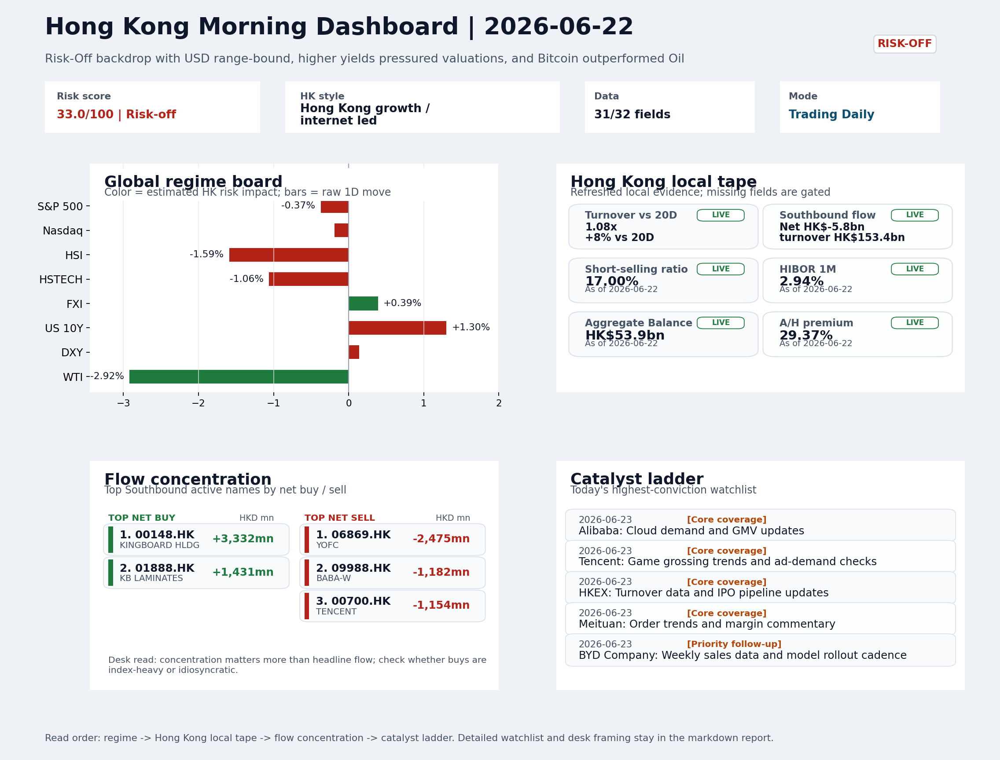
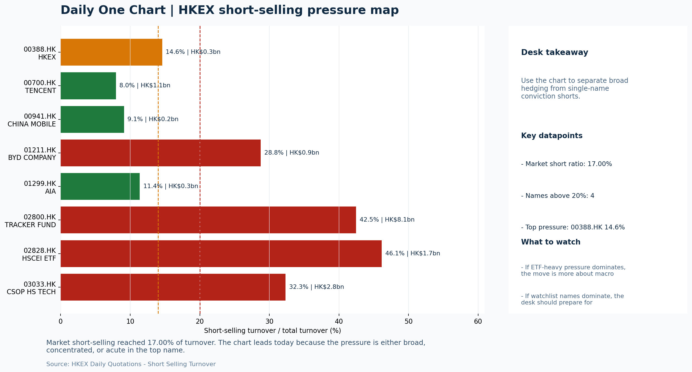

# Morning Research Workbench | 2026-06-23

> Designed for a Hong Kong sell-side commute: Layer 1 `Scan`, Layer 2 `Deep Read`, Layer 3 `Thinking`
> Mode: `Trading Daily` | Keep the report execution-oriented: what mattered in the completed session, what can move Hong Kong leadership, and what needs fast follow-up.
> Briefing date: `2026-06-23` | Review date: `2026-06-22` | Global request: `2026-06-22` | HK/China request: `2026-06-22` | Market effective date: `2026-06-22` | Generated at: `2026-06-23 06:46:30`

## Executive Summary

- **Market pulse:** VIX spike and yield-driven risk-off dominated overnight, but the HSTECH-over-HSCEI tilt and FXI divergence offer a conditional constructive read for Hong Kong, pending tonight's CPI.
- **Hong Kong lens:** Hong Kong growth / internet led. The Hang Seng Index, already down 1.59% on Monday, faces continued pressure from the overnight yield move, though a softer CNH (-0.34%) and stable USD/HKD near 7.8391 suggest.
- **Top catalysts:** INTC -6.33%; Risk-Off backdrop with USD range-bound, higher yields pressured valuations, and Bitcoin outperformed Oil.

## Visual Dashboard

## Layer 1 | Scan (5-10 min)

### 1.1 One-Line Market Pulse
VIX spike and yield-driven risk-off dominated overnight, but the HSTECH-over-HSCEI tilt and FXI divergence offer a conditional constructive read for Hong Kong, pending tonight's CPI reaction and Powell signal.

### 1.2 Global Asset Price Dashboard

| Asset | Last | 1D move | Read |
| --- | --- | --- | --- |
| S&P 500 | 7,472.79 | -0.37% | US large-cap risk appetite |
| Nasdaq 100 | 30,347.08 | -0.19% | Growth and duration leadership |
| Hang Seng Index | 23,924.81 | **-1.59%** | Hong Kong broad beta |
| Hang Seng TECH | 4.4640 | -1.06% | Hong Kong growth / platform read-through |
| CSI 300 | 4,941.60 | +0.21% | Mainland large-cap tone |
| US 10Y | 4.5090 | +1.30% | Global discount-rate anchor |
| China 10Y | 1.74% | +0.8bp | China local rates anchor \| Live public \| Eastmoney \| 2026-06-22 |
| CN-US 10Y spread | -277.2bp | -4.2bp | Relative carry and macro-pressure gauge \| Live public \| Eastmoney \| 2026-06-22 |
| DXY | 101.00 | +0.14% | Dollar liquidity impulse |
| USD/CNH | 6.7400 | -0.34% | Offshore China risk appetite |
| USD/HKD | 7.8391 | +0.03% | Linked-exchange regime stress check |
| Brent crude | 78.34 | **-1.89%** | Energy / geopolitics |
| COMEX gold | 4,210.30 | -0.33% | Hedge demand / real yields |
| Copper | 6.3580 | -0.26% | Global growth proxy |
| VIX | 17.28 | **+5.37%** | US stress barometer |

### 1.3 Hong Kong Key Data Quick Check

| Check | Value | Status | Source / as of | Why it matters |
| --- | --- | --- | --- | --- |
| Main Board turnover vs 20D | 1.08x \| +8% vs 20D | Live local | HKEX \| 2026-06-22 | Trailing 20-session average turnover was HK$324.0bn. |
| Southbound / Northbound net flow | Southbound Net HK$-5.8bn \| turnover HK$153.4bn \| Northbound Turnover HK$482.2bn \| net not reported | Live local | HKEX Connect \| 2026-06-22 | Southbound net buy is calculated from HKEX disclosed buy and sell turnover. |
| Short-selling ratio | 17.00% | Live local | HKEX \| 2026-06-22 | Official HKEX stock-level short-selling table, aggregated as a share of total market turnover. |
| AH premium index | 29.37% | Live public | Yahoo \| 2026-06-22 | Simple average across 17 A/H pairs; use dispersion rather than the average alone. |
| USD/HKD spot vs band | 7.8391 \| band 7.7500 to 7.8500 | Live quote + local | Yahoo \| 2026-06-22 | Inside the linked-exchange band without immediate boundary stress. Official Convertibility Undertakings define the linked-rate stress boundaries for USD/HKD. |
| HIBOR 1M | 2.94% | Live local | HKMA \| 2026-06-22 | 1M HIBOR is the cleanest quick read for Hong Kong funding conditions and equity-duration pressure. |
| Aggregate Balance | HK$53.9bn | Live local | HKMA \| 2026-06-22 | Aggregate Balance helps frame whether linked-rate liquidity conditions are tight or comfortable. |
| Hong Kong leadership | Hong Kong growth / internet led | Proxy | HSI / HSCEI / HSTECH relative perf \| 2026-06-22 | Use HSI / HSCEI / HSTECH relative moves as the opening style read. |

### 1.4 Risk Dashboard
**Composite risk score:** `33.0/100` | **Regime:** `Risk-off`

| Component | Score impact | Evidence |
| --- | --- | --- |
| US beta | -2.2 | S&P 500 -0.37% |
| HK growth | -5.3 | HSTECH -1.06% |
| Offshore China proxy | +2.0 | FXI +0.39% |
| Dollar pressure | -1.4 | DXY +0.14% |
| Volatility | -10 | VIX +5.37% |
| HK short-selling | +0 | Short-selling ratio 17.00% |

### 1.5 Morning Checklist
1. **INTC -6.33%**
 Mover attribution | Announcement / expectations | Guidance reset and margin pressure
2. **Risk-Off backdrop with USD range-bound, higher yields pressured valuations, and Bitcoin outperformed Oil**
 Overnight regime | Start by deciding whether the day is about Risk-Off conditions or a style pivot.
3. **CPI MoM (Released)**
 Macro / policy | Rates expectations, the dollar, and growth-equity valuation | Industries: Technology, Internet, Brokers
4. **VIX +5.37%**
 High-frequency data | Higher volatility argues for tighter sizing and tighter stops.
5. **Trade Balance (Released)**
 Macro / policy | Watch whether it changes the day's core market narrative | Industries: Market-wide

## Layer 2 | Deep Read (20-30 min)

### 2.1 Overnight Overseas Market Review
#### Market Setup
**Core tape.** Overnight equities fell as a 1.3% rise in the 10Y Treasury yield to 4.509% compressed growth valuations, with the VIX jumping 5.37% to 17.28 confirming a risk-off stance.
**Main driver.** WTI crude's 2.92% decline eased energy cost concerns but did not offset the rates-driven drag, while Bitcoin's 0.88% gain versus oil signaled speculative rotation rather than broad confidence.

#### Key Drivers
- Rates impulse: 10Y yield up 1.3%, raising discount rates and pressuring equity multiples.
- Volatility spike: VIX +5.37% reflects heightened risk aversion.
- Oil supportive: WTI -2.92% reduces geopolitical premium and energy margin stress.
- Hawkish Fed repricing: CPI and Warsh commentary reinforced higher-for-longer rate expectations.

#### Hong Kong Read-Through
**Desk lens.** Hong Kong growth / internet led.
**Opening implication.** The Hang Seng Index, already down 1.59% on Monday, faces continued pressure from the overnight yield move, though a softer CNH (-0.34%) and stable USD/HKD near 7.8391 suggest relative resilience in China proxies, consistent with FXI's +0.39% divergence.
- **Cross-market read:** Hang Seng -1.59% / HSCEI -2.06% / HSTECH -1.06%.
- **Cross-market read:** Offshore China proxy FXI +0.39% and USD/CNH -0.34% frame cross-border risk appetite.
- **Cross-market read:** USD/HKD last traded around 7.8391, which keeps the Hong Kong funding lens in focus.

#### Watch Points
- USD composite moved higher by +0.06pct intraday, with a 0.204pct range.
- Main turning points appeared around 2026-06-22 08:10 peak / 2026-06-22 08:25 trough / 2026-06-22 08:45 peak, suggesting event-driven repricing.
- The biggest cross-asset divergence was Bitcoin versus Oil, a spread of 2.229pct.
- Gold moved +0.46pct intraday with a 1.384pct high-low range.

**Curated overnight stories**
1. **INTC -6.33% premarket on guidance reset and margin pressure**
 Why it matters: Intel's guidance reset signals continued semiconductor supply chain and margin stress. It reflects ongoing competitive pressure from AI-centric chipmakers and carries.
 HK read-through: Direct read-through to HK-listed hardware and tech manufacturing names (e.g., SMIC exposure, tech supply chain).
2. **VIX +5.37% amid Risk-Off backdrop with higher yields pressuring valuations**
 Why it matters: Elevated volatility confirms a risk-off session. Bitcoin outperforming oil suggests defensive or speculative rotation rather than growth-confidence.
 HK read-through: Supports defensive positioning in HK. Growth-oriented counters (internet, biotech, unprofitable tech) face elevated sensitivity. Tighter stops and reduced sizing warranted.
3. **CPI MoM released; Kevin Warsh Fed commentary signals hawkish repricing**
 Why it matters: CPI data arrived alongside commentary framing a potentially more hawkish Warsh Fed. This combination directly shapes rate expectations, the dollar trajectory, and global.
 HK read-through: USD range-bound but higher yield backdrop pressures HK growth multiples. brokers and interest-rate-sensitive sectors (REITs, financials) face mixed signals.
4. **Qualcomm nears $4B deal for AI chip startup Modular Inc.**
 Why it matters: Qualcomm's acquisition of a dedicated AI inference chip startup signals continued consolidation in AI silicon.
 HK read-through: Indirect read-through for HK semiconductor and AI-linked names via sector sentiment. Could revive interest in China-based AI chip developers as strategic alternatives.
5. **U.S. and Iran begin peace talks amid conflicting claims over Strait of Hormuz**
 Why it matters: Talks introduce near-term resolution risk for Middle East energy markets. Conflict signals would lift oil; credible progress would cap energy inflation.
 HK read-through: Material for HK energy-linked names and transportation. Oil price direction affects input costs for industrial and sectors.

### 2.2 Hong Kong / A-share Previous-Day Review
#### Local Tape Setup
**Local read.** Despite a broad risk-off session with yields rising and HSI losing 1.59%, style leadership leaned toward growth as HSTECH (-1.06%) held up better than HSCEI (-2.06%).
**Verification point.** Local flow signals were less encouraging: Southbound registered a net HK$-5.8bn outflow and the Tracker Fund (2800.HK) saw elevated volume selling, though aggregate short-selling at 17% of turnover remained moderate.

#### Style and Local Leadership
**Style leadership.** Hong Kong growth / internet led.
- **Cross-market read:** Hang Seng -1.59% / HSCEI -2.06% / HSTECH -1.06%.
- **Cross-market read:** Offshore China proxy FXI +0.39% and USD/CNH -0.34% frame cross-border risk appetite.
- **Cross-market read:** USD/HKD last traded around 7.8391, which keeps the Hong Kong funding lens in focus.

#### Flow Confirmation
Official Stock Connect evidence is available; use Section 2.3 to confirm whether local money supports the price action.

#### Follow-Through Checklist
**Follow-through check.** Watch whether CSI 300 and offshore China proxies (FXI, KWEB) confirm the growth-over-value tilt, and monitor if Southbound flows reverse to net buying and short-selling declines to validate the style signal rather than a one-day defensive rotation.

### 2.3 Flow Tracker and Attribution
#### Cross-Asset Attribution v1

| Driver | Direction | Score | Evidence | HK implication |
| --- | --- | --- | --- | --- |
| Rates impulse | drag | 1.56 | US 10Y yield proxy moved +1.30%. | Lower yields help long-duration growth; higher yields pressure valuation-sensitive |
| Oil and geopolitics | supportive | 1.51 | Oil moved -1.89%. | Split the read between energy/cyclicals support and margin/geopolitical pressure. |
| Dollar / CNH pressure | supportive | 0.51 | DXY +0.14% / USD-CNH -0.34% | A stable or softer CNH makes Hong Kong follow-through more credible. |

#### Flow Tracker
##### Flow Takeaways
- Local flow evidence is not yet strong enough to override the cross-asset setup.
- Stock Connect Southbound: net HK$-5.8bn on turnover HK$153.4bn (as of 2026-06-22).
- Stock Connect Northbound: turnover RMB482.2bn; public file provides total turnover/top active names, not full net-buy.
- AH premium: simple covered-pair average +29.37%; widest premium: China Communications Construction 76.5%.

##### Stock Connect Southbound Active Names

| Rank | Ticker | Name | Buy | Sell | Net buy |
| --- | --- | --- | --- | --- | --- |
| 3 | 00148.HK | KINGBOARD HLDG | HK$4,861.0mn | HK$1,528.9mn | HK$3,332.1mn |
| 1 | 06869.HK | YOFC | HK$4,356.7mn | HK$6,831.7mn | HK$-2,475.1mn |
| 6 | 01888.HK | KB LAMINATES | HK$3,406.9mn | HK$1,976.1mn | HK$1,430.8mn |
| 4 | 09988.HK | BABA-W | HK$1,747.7mn | HK$2,929.6mn | HK$-1,181.9mn |
| 5 | 00700.HK | TENCENT | HK$2,245.0mn | HK$3,398.9mn | HK$-1,153.9mn |

##### AH Premium Dispersion

| Name | A ticker | H ticker | Premium | As of |
| --- | --- | --- | --- | --- |
| China Communications Construction | 601800.SS | 1800.HK | +76.50% | 2026-06-22 |
| China Railway Construction | 601186.SS | 1186.HK | +52.17% | 2026-06-22 |
| China Railway | 601390.SS | 0390.HK | +49.68% | 2026-06-22 |
| China Life | 601628.SS | 2628.HK | +39.16% | 2026-06-22 |
| China Construction Bank | 601939.SS | 0939.HK | +33.72% | 2026-06-22 |

##### HKEX Short-Selling Watch

| Ticker | Name | Short ratio | Short turnover | Total turnover |
| --- | --- | --- | --- | --- |
| 00388.HK | HKEX | 14.60% | HK$0.3bn | HK$2.1bn |
| 00700.HK | TENCENT | 7.95% | HK$1.1bn | HK$13.7bn |
| 00941.HK | CHINA MOBILE | 9.11% | HK$0.2bn | HK$1.8bn |
| 01211.HK | BYD COMPANY | 28.76% | HK$0.9bn | HK$3.1bn |
| 01299.HK | AIA | 11.38% | HK$0.3bn | HK$2.2bn |

- **Short-value leaders:** 02800.HK TRACKER FUND (HK$8.1bn); 07709.HK XL2CSOPHYNIX (HK$3.4bn); 03033.HK CSOP HS TECH (HK$2.8bn); 07747.HK XL2CSOPSMSN (HK$2.7bn).

### 2.4 Macro and Policy Tracking
**Desk read.** The completed session (2026-06-22) is characterized by a Risk-Off regime, with the VIX elevated at 17.28 (+5.37%) and US 10Y yields rising to 4.509% (+1.3%), pressuring growth-valuation proxies.

**Market sensitivity.** Bitcoin's relative outperformance (+0.88%) versus WTI crude (-2.92%) underscores the divergence within the risk complex.

**HK implication.** The most immediate repricing catalyst for the 2026-06-23 HK session is the US CPI release tonight (20:30 SGT), which came in hot at 0.3% MoM versus a 0.2% forecast - the prior was 0.4%.

**Macro watchpoints**
- DXY and US 10Y yield reaction after CPI release at 20:30 SGT.
- HK ADR futures and HSI futures in the 15 minutes following CPI.
- US Retail Sales print at 20:30 SGT - accelerating slowdown would add to risk-off.
- Powell speech at 22:00 SGT - any hawkish surprise would reprice rates and dollar.

| Time | Region | Event | Status | Desk read |
| --- | --- | --- | --- | --- |
| 20:30 | US | CPI MoM | Released | Impact: Rates expectations, the dollar, and growth-equity valuation \| Attention: 5/5 \| Industries: Technology, Internet, Brokers |
| 09:30 | China | Trade Balance | Released | Impact: Watch whether it changes the day's core market narrative \| Attention: 3/5 \| Industries: Market-wide |
| 20:30 | US | Retail Sales MoM | Upcoming | Impact: Consumer resilience, growth expectations, and risk-asset pricing \| Attention: 5/5 \| Industries: Consumer, E-commerce, Consumer discretionary |
| 09:20 | China | Loan Prime Rate | Upcoming | Impact: Watch whether it changes the day's core market narrative \| Attention: 3/5 \| Industries: Market-wide |
| 22:00 | Federal Reserve | Jerome Powell: Economic outlook remarks | Central bank | Impact: Policy path, liquidity conditions, and cross-asset risk appetite \| Attention: 5/5 \| Industries: Technology, Financials, Gold |
| 10:00 | PBOC | Open Market Operations Desk: Daily liquidity operation window | Central bank | Impact: Policy path, liquidity conditions, and cross-asset risk appetite \| Attention: 3/5 \| Industries: Technology, Financials, Gold |

#### Positioning and Risk Backdrop
- Options activity centered on KWEB Call, with Vol/OI at 1.88x and a bullish bias.
- Put/Call structure shows equity 0.68 / index 1.15, implying Single-stock optimism with index hedging.
- Geopolitics: Middle East | Regional tension remains elevated | Impact: Oil, freight costs, and safe-haven demand
- Geopolitics: US-China | Technology export-control rhetoric remains active | Impact: China internet, semiconductors, and supply chains

### 2.5 Key Company and Sector Events

| Grade | Sector | Headline | Why it matters | Horizon |
| --- | --- | --- | --- | --- |
| A | Semiconductors and AI | Qualcomm Nears Deal for AI Chip Startup Modular | Capital allocation or shareholder-return events can trigger a valuation | Medium-term trend |

#### Company Event Takeaway
**Desk read.** Risk-off dominated the session as higher yields pressured growth names, with Bitcoin outperforming Oil reinforcing the defensive tilt.
**Why it matters.** Eight small-cap profit warnings hit the tape on June 22, suggesting earnings caution is spreading beyond headline indices.
**Follow-up.** The notable event is Morgan Stanley upgrading Alibaba (9988.HK) to Overweight with a target lift to 105.

#### LLM Quick Takes
- **0700.HK** | AMC results due after market close; EPS consensus at HKD 4.15 and revenue at 163.2bn. Given positioning at the bottom of the range and risk-off backdrop, a beat could
- **0388.HK** | BMO results before market open; EPS consensus at HKD 2.81 and revenue at 6.0bn. No pre-announcement signal available.
- **9988.HK** | Morgan Stanley upgrade from Equal Weight to Overweight with target raised to 105 from 92. The move is notable given the name sits near the bottom of its range
- **1211.HK** | BYD was the weakest watchlist name at -3.09%, also at the bottom of its range. No specific news catalyst identified
- **00037.HK** | FE Hotels issued a profit warning on June 22, grade A. One of eight small-cap profit warnings on the session
- **00199.HK** | ITC Properties issued a profit warning on June 22, grade A. Small-cap real estate exposure; the cluster of eight warnings suggests earnings caution is not isolated.

#### HKEX Announcements

| Grade | Ticker | Type | Release time | Title |
| --- | --- | --- | --- | --- |
| A | 00037.HK | Profit warning | 2026-06-22 | Profit warning / alert announcement |
| A | 00199.HK | Profit warning | 2026-06-22 | Profit warning / alert announcement |
| A | 00353.HK | Profit warning | 2026-06-22 | Profit warning / alert announcement |
| A | 00616.HK | Profit warning | 2026-06-22 | Profit warning / alert announcement |
| A | 00674.HK | Profit warning | 2026-06-22 | Profit warning / alert announcement |
| A | 00745.HK | Profit warning | 2026-06-22 | Profit warning / alert announcement |
| A | 00794.HK | Profit warning | 2026-06-22 | Profit warning / alert announcement |
| A | 00931.HK | Profit warning | 2026-06-22 | Profit warning / alert announcement |

#### Earnings / Results Watch

| Ticker | Company | Timing | Expectation framing |
| --- | --- | --- | --- |
| 0700.HK | Tencent Holdings | After Market Close | EPS est. 4.15 HKD \| revenue est. 163.2bn HKD |
| 0388.HK | Hong Kong Exchanges and Clearing | Before Market Open | EPS est. 2.81 HKD \| revenue est. 6.0bn HKD |

#### Rating Changes
- **9988.HK** | Morgan Stanley | Upgrade | Equal Weight -> Overweight | PT 92 -> 105

#### IPO Watch
- IPO and grey-market monitoring is not yet part of the standard production pack.

### 2.6 Today's Core Names
#### Core coverage

| Name | Ticker | Last | 1D | Range position | Morning note |
| --- | --- | --- | --- | --- | --- |
| Alibaba | 9988.HK | 102.90 | -1.91% | Bottom of range | The name sits near the bottom of its recent range and is worth monitoring for a catalyst-led reversal. |
| Tencent | 0700.HK | 433.00 | -1.64% | Bottom of range | The name sits near the bottom of its recent range and is worth monitoring for a catalyst-led reversal. |

**Recent headlines for Alibaba:**
- [Alibaba Group Holding Limited (BABA) Is a Trending Stock: Facts to Know Before Betting on It](https://finance.yahoo.com/markets/stocks/articles/alibaba-group-holding-limited-baba-130006828.html) (Zacks)

#### Priority follow-up

| Name | Ticker | Last | 1D | Range position | Morning note |
| --- | --- | --- | --- | --- | --- |
| BYD Company | 1211.HK | 78.35 | -3.09% | Bottom of range | Short-term pressure is visible; check for a fundamental or regulatory reason. |
| China Mobile | 0941.HK | 79.45 | -0.81% | Mid-range | Positioning is neutral for now, so use it mainly to monitor marginal information changes. |

## Layer 3 | Thinking (10-15 min)

### 3.1 Rotating Theme Deep Dive

| Field | Read |
| --- | --- |
| Theme | China Consumption Recovery |
| Angle for the day | Focus on whether travel, retail, internet local services, and premium consumption data still support a demand-repair narrative. |

**Theme desk read**
**Core thesis.** The weekly China Consumption Recovery theme still deserves attention, but the overnight signals add a layer of caution: VIX +5.37% argues for tighter sizing, while WTI -2.92% tempers cyclical enthusiasm.
**Evidence.** Meituan (3690.HK) sits at the bottom of its range and faces a catalyst tomorrow with order trends and margin commentary - a direct high-frequency read on local services demand within the theme.
**What to test.** The US Retail Sales print later in the session is the macro anchor; a soft number could undermine the demand-repair narrative before the Hong Kong close, so we stay reactive rather than anticipatory.

**Signals to keep in mind**
- VIX +5.37%: Higher volatility argues for tighter sizing and tighter stops.
- WTI crude -2.92%: Softer oil argues for a more cautious cyclical-growth read.

**LLM watch items:**
- Meituan (3690.HK) order trends and margin commentary - catalyst for potential range reversal
- US Retail Sales MoM (Jun 23) - confirms or weakens consumer resilience assumptions
- VIX and WTI intraday direction - gauge whether risk-off persists and caps theme-related positioning

**Related names to keep close:**

| Name | Ticker | Bucket | Morning read |
| --- | --- | --- | --- |
| Meituan | 3690.HK | Core coverage | The name sits near the bottom of its recent range and is worth monitoring for a catalyst-led reversal. |

**Upcoming catalysts tied to the theme:**
- 2026-06-23 | Meituan: Order trends and margin commentary | High-frequency read on local services demand and platform competition
- 2026-06-23 | Retail Sales MoM | Consumer resilience, growth expectations, and risk-asset pricing

### 3.2 Today Ahead and Trading Calendar
- Macro: CPI MoM is the first item to anchor the open and the rates/FX response.
- Corporate / event: Alibaba: Cloud demand and GMV updates is the cleanest same-day catalyst to prepare for.

**Same-day macro docket**

| Time | Country | Event | Status | Detail |
| --- | --- | --- | --- | --- |
| 20:30 | US | CPI MoM | Released | Actual 0.3% / Forecast 0.2% / Prior 0.4% |
| 09:30 | China | Trade Balance | Released | Actual USD 85.2bn / Forecast USD 79.0bn / Prior USD 80.6bn |
| 20:30 | US | Retail Sales MoM | Upcoming | Forecast 0.3% / Prior 0.6% |
| 09:20 | China | Loan Prime Rate | Upcoming | Forecast 3.45% / Prior 3.45% |
| 22:00 | Federal Reserve | Jerome Powell: Economic outlook remarks | Central bank | speech |

**Same-day catalyst list**

| Date | Time | Category | Event | Importance |
| --- | --- | --- | --- | --- |
| 2026-06-23 | | Core coverage | Alibaba: Cloud demand and GMV updates | 3 |
| 2026-06-23 | | Core coverage | Tencent: Game grossing trends and ad-demand checks | 3 |
| 2026-06-23 | | Core coverage | HKEX: Turnover data and IPO pipeline updates | 3 |
| 2026-06-23 | | Core coverage | Meituan: Order trends and margin commentary | 3 |

**Next few sessions**

| Date | Category | Event | Impact |
| --- | --- | --- | --- |
| 2026-06-23 | Core coverage | Alibaba: Cloud demand and GMV updates | Key read-through for China consumption, cloud, and platform regulation |
| 2026-06-23 | Core coverage | Tencent: Game grossing trends and ad-demand checks | Core offshore China platform proxy for gaming, ads, and AI monetization |
| 2026-06-23 | Core coverage | HKEX: Turnover data and IPO pipeline updates | Direct proxy for Hong Kong market turnover, listings, and southbound |
| 2026-06-23 | Core coverage | Meituan: Order trends and margin commentary | High-frequency read on local services demand and platform competition |

### 3.3 Daily One Chart
**Daily One Chart | HKEX short-selling pressure map**

**Chart read.** Market short-selling reached 17.00% of turnover.
**Why it matters.** The chart leads today because the pressure is either broad, concentrated, or acute in the top name.

_Source: HKEX Daily Quotations - Short Selling Turnover_

## Traceable Appendix

### Report Metadata
> Date policy: Review date 2026-06-22 is treated as `Trading Daily`. | Global request date is 2026-06-22; adapter effective date is 2026-06-22 and summary date is 2026-06-22. | HK/China local data date is 2026-06-22; role: same-session local cash tape.
> Market data quality: Coverage: `31/32` | Stale items (>1d): `6` | Missing: `1`
> Report quality: `87.1/100` | Grade `B` | Status `production ready`

### Key Questions to Keep in Mind
- Is risk appetite rising or fading? The overnight tape reads closer to `Risk-Off`.
- Did rates expectations move? Focus on whether US 10Y, DXY, and growth style moved together.
- Were commodities the real story? Watch WTI and gold for geopolitics versus inflation signals.
- Is Hong Kong setup internet-led, SOE-led, or broad beta-led? Compare HSTECH, HSCEI, and HSI.
- Did offshore markets move China risk appetite? Focus on HSI, FXI, USD/CNH, and USD/HKD.

### Report Quality and Validation
- **Quality score:** 87.1/100 | **Grade:** B | **Status:** production ready
- **Run summary:** 8 healthy | 0 caveat | 0 failed
- **Release recommendation:** Send | All monitored sources were healthy, so the report is fit for normal distribution.

| Source | Status | Bucket |
| --- | --- | --- |
| Market data | ok | healthy |
| Sector and company news | ok | healthy |
| Movers and short selling | ok | healthy |
| Stock Connect | ok | healthy |
| A/H premium | ok | healthy |
| Hong Kong local package | ok | healthy |
| China rates | ok | healthy |
| Narrative overlay | ok | healthy |

**Desk-use guidance summary:** 0 blocking | 1 advisory

**Desk-use guidance**
- **Advisory:** All monitored sources were healthy for this run; the report can be used as a normal desk-starting point.

| Component | Score | Weight | Read |
| --- | --- | --- | --- |
| Market data coverage | 96.9 | 0.3 | 31/32 core market fields available. |
| Hong Kong local metrics | 82.3 | 0.25 | 8 live, 3 proxy, 0 unavailable local checks. |
| Key public adapters | 100.0 | 0.2 | 4/4 key adapters were available or partially available. |
| Narrative overlay health | 65.7 | 0.15 | 3/7 narrative overlay tasks succeeded or used validated cache; 0 error(s). |
| Fact-check guardrail | 75.0 | 0.1 | Checked 6 numeric claims; 1 numeric mismatch(es), 0 logic warning(s); 1 critical, 0 review. |

**Quality warnings**
- Narrative fact-check guardrail produced warnings; review the validation table before relying on narrative sections.

**Narrative fact-check guardrail**
- Checked 6 numeric claims; 1 numeric mismatch(es), 0 logic warning(s); 1 critical, 0 review.

| Severity | Field | Claim | Type | Claimed | Expected | Snippet |
| --- | --- | --- | --- | --- | --- | --- |
| critical | tasks.overnight_review.hk_open_implication | Hang Seng Index | change_pct | 1.59 | -1.59 | The Hang Seng Index, already down 1.59% on Monday, faces continued pressure from the over |

**Adapter status**

| Adapter | Status |
| --- | --- |
| Stock Connect | ok |
| A/H premium | ok |
| HKEX announcements | ok |
| China rates | ok |

### Source Links
- [Qualcomm Nears Deal for AI Chip Startup Modular](https://www.bloomberg.com/news/articles/2026-06-22/qualcomm-is-said-to-near-deal-for-ai-chip-startup-modular) (bloomberg_markets)
- [Alibaba Group Holding Limited (BABA) Is a Trending Stock: Facts to Know Before Betting on It](https://finance.yahoo.com/markets/stocks/articles/alibaba-group-holding-limited-baba-130006828.html) (Zacks)
- [China food delivery stocks fall on fresh regulations covering subsidies](https://finance.yahoo.com/markets/stocks/articles/china-food-delivery-stocks-fall-050006974.html) (Investing.com)
- [00037.HK Profit warning / alert announcement](http://www1.hkexnews.hk/listedco/listconews/sehk/2026/0622/2026062201000.pdf) (HKEXnews)
- [00199.HK Profit warning / alert announcement](http://www1.hkexnews.hk/listedco/listconews/sehk/2026/0622/2026062201599.pdf) (HKEXnews)
- [00353.HK Profit warning / alert announcement](http://www1.hkexnews.hk/listedco/listconews/sehk/2026/0622/2026062201779.pdf) (HKEXnews)
- [00616.HK Profit warning / alert announcement](http://www1.hkexnews.hk/listedco/listconews/sehk/2026/0622/2026062200860.pdf) (HKEXnews)
- [00674.HK Profit warning / alert announcement](http://www1.hkexnews.hk/listedco/listconews/sehk/2026/0622/2026062201737.pdf) (HKEXnews)
- [00745.HK Profit warning / alert announcement](http://www1.hkexnews.hk/listedco/listconews/sehk/2026/0622/2026062201111.pdf) (HKEXnews)
- [00794.HK Profit warning / alert announcement](http://www1.hkexnews.hk/listedco/listconews/sehk/2026/0622/2026062200598.pdf) (HKEXnews)
- [00931.HK Profit warning / alert announcement](http://www1.hkexnews.hk/listedco/listconews/sehk/2026/0622/2026062200778.pdf) (HKEXnews)

## Supplementary Visual Appendix

This appendix is professional-path only. It keeps a traceable index of the report visuals and the deterministic chart cues used to frame the morning note, without injecting the legacy intraday chart pack.

### Visual Index

| Visual | Path | Role |
| --- | --- | --- |
| Visual Dashboard | `charts/dashboard_2026-06-23.png` | Cross-asset regime board and Hong Kong local tape snapshot. |
| Daily One Chart | `charts/daily_one_chart_2026-06-23.png` | Single highest-conviction visual story for the day. |

### Deterministic Chart Cues
- FX / liquidity: USD composite moved higher by +0.06pct intraday, with a 0.204pct range.
- FX / liquidity: Main turning points appeared around 2026-06-22 08:10 peak / 2026-06-22 08:25 trough / 2026-06-22 08:45 peak, suggesting event-driven repricing rather than a clean one-way USD move.
- Cross-asset: The biggest cross-asset divergence was Bitcoin versus Oil, a spread of 2.229pct.
- Cross-asset: Gold moved +0.46pct intraday with a 1.384pct high-low range.
- Cross-asset: Oil moved -1.55pct intraday with a 4.262pct high-low range.
- Cross-asset: Bitcoin moved +0.68pct intraday with a 3.377pct high-low range.

### Risk Dashboard Components

| Component | Score impact | Evidence |
| --- | --- | --- |
| US beta | -2.2 | S&P 500 -0.37% |
| HK growth | -5.3 | HSTECH -1.06% |
| Offshore China proxy | +2.0 | FXI +0.39% |
| Dollar pressure | -1.4 | DXY +0.14% |
| Volatility | -10 | VIX +5.37% |
| HK short-selling | +0 | Short-selling ratio 17.00% |
