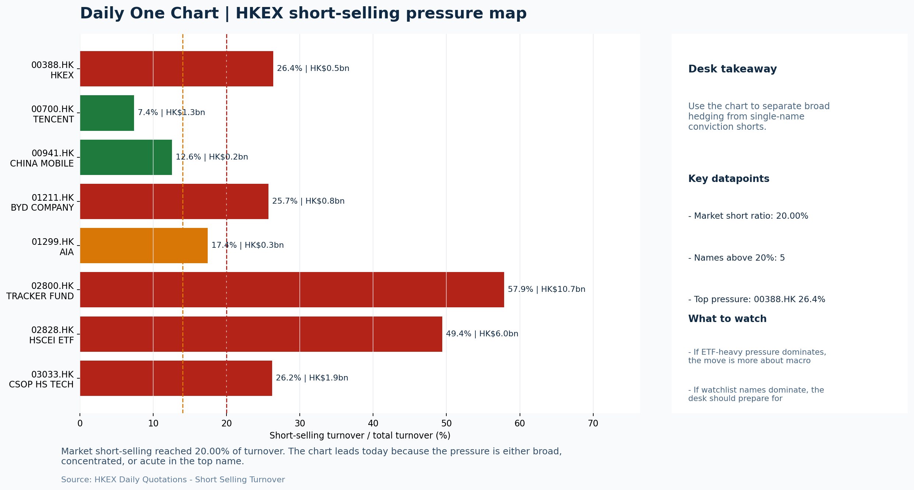

# Morning Research Workbench | 2026-06-24

> Designed for a Hong Kong sell-side commute: Layer 1 `Scan`, Layer 2 `Deep Read`, Layer 3 `Thinking`
> Mode: `Trading Daily` | Keep the report execution-oriented: what mattered in the completed session, what can move Hong Kong leadership, and what needs fast follow-up.
> Briefing date: `2026-06-24` | Review date: `2026-06-23` | Global request: `2026-06-23` | HK/China request: `2026-06-23` | Market effective date: `2026-06-23` | Generated at: `2026-06-24 06:11:29`

## Executive Summary

- **Market pulse:** Elevated VIX, higher US yields, and weak 618 data deepened the risk-off backdrop, with HSTECH down 1.06% and short-selling at 20.00%, leaving the next Hong Kong session cautious.
- **Hong Kong lens:** Hong Kong growth / internet led. A cautious open is indicated, with HSTECH and FXI as the key confirmation names - if both gap lower alongside continued short-selling pressure and elevated VIX, defensive.
- **Top catalysts:** VIX +12.79%; INTC -6.33%.

## Visual Dashboard

## Layer 1 | Scan (5-10 min)

### 1.1 One-Line Market Pulse
Elevated VIX, higher US yields, and weak 618 data deepened the risk-off backdrop, with HSTECH down 1.06% and short-selling at 20.00%, leaving the next Hong Kong session cautious and contingent on breadth, VIX, and CNH stabilization.

### 1.2 Global Asset Price Dashboard

| Asset | Last | 1D move | Read |
| --- | --- | --- | --- |
| S&P 500 | 7,365.46 | -1.44% | US large-cap risk appetite |
| Nasdaq 100 | 29,347.27 | **-3.29%** | Growth and duration leadership |
| Hang Seng Index | 23,768.52 | -0.65% | Hong Kong broad beta |
| Hang Seng TECH | 4.4640 | -1.06% | Hong Kong growth / platform read-through |
| CSI 300 | 4,941.60 | +0.21% | Mainland large-cap tone |
| US 10Y | 4.4930 | +0.94% | Global discount-rate anchor |
| China 10Y | 1.74% | +0.6bp | China local rates anchor \| Live public \| Eastmoney \| 2026-06-23 |
| CN-US 10Y spread | -275.6bp | +1.6bp | Relative carry and macro-pressure gauge \| Live public \| Eastmoney \| 2026-06-23 |
| DXY | 101.36 | +0.34% | Dollar liquidity impulse |
| USD/CNH | 6.7585 | -0.07% | Offshore China risk appetite |
| USD/HKD | 7.8398 | +0.04% | Linked-exchange regime stress check |
| Brent crude | 76.98 | -1.18% | Energy / geopolitics |
| COMEX gold | 4,129.90 | -1.24% | Hedge demand / real yields |
| Copper | 6.1270 | **-3.61%** | Global growth proxy |
| VIX | 19.49 | **+12.79%** | US stress barometer |

### 1.3 Hong Kong Key Data Quick Check

| Check | Value | Status | Source / as of | Why it matters |
| --- | --- | --- | --- | --- |
| Main Board turnover vs 20D | 1.02x \| +2% vs 20D | Live local | HKEX \| 2026-06-23 | Trailing 20-session average turnover was HK$326.5bn. |
| Southbound / Northbound net flow | Southbound Net HK$10.4bn \| turnover HK$138.8bn \| Northbound Turnover HK$444.0bn \| net not reported | Live local | HKEX Connect \| 2026-06-23 | Southbound net buy is calculated from HKEX disclosed buy and sell turnover. |
| Short-selling ratio | 20.00% | Live local | HKEX \| 2026-06-23 | Official HKEX stock-level short-selling table, aggregated as a share of total market turnover. |
| AH premium index | 26.74% | Live public | Yahoo \| 2026-06-23 | Simple average across 19 A/H pairs; use dispersion rather than the average alone. |
| USD/HKD spot vs band | 7.8398 \| band 7.7500 to 7.8500 | Live quote + local | Yahoo \| 2026-06-23 | Inside the linked-exchange band without immediate boundary stress. Official Convertibility Undertakings define the linked-rate stress boundaries for USD/HKD. |
| HIBOR 1M | 2.96% | Live local | HKMA \| 2026-06-23 | 1M HIBOR is the cleanest quick read for Hong Kong funding conditions and equity-duration pressure. |
| Aggregate Balance | HK$53.9bn | Live local | HKMA \| 2026-06-23 | Aggregate Balance helps frame whether linked-rate liquidity conditions are tight or comfortable. |
| Hong Kong leadership | Hong Kong growth / internet led | Proxy | HSI / HSCEI / HSTECH relative perf \| 2026-06-23 | Use HSI / HSCEI / HSTECH relative moves as the opening style read. |

### 1.4 Risk Dashboard
**Composite risk score:** `6.7/100` | **Regime:** `Risk-off`

| Component | Score impact | Evidence |
| --- | --- | --- |
| US beta | -8.6 | S&P 500 -1.44% |
| HK growth | -5.3 | HSTECH -1.06% |
| Offshore China proxy | -8 | FXI -1.79% |
| Dollar pressure | -3.4 | DXY +0.34% |
| Volatility | -10 | VIX +12.79% |
| HK short-selling | -8 | Short-selling ratio 20.00% |

### 1.5 Morning Checklist
1. **VIX +12.79%**
 High-frequency data | Higher volatility argues for tighter sizing and tighter stops.
2. **INTC -6.33%**
 Mover attribution | Announcement / expectations | Guidance reset and margin pressure
3. **Risk-Off backdrop with USD range-bound, higher yields pressured valuations, and Oil outperformed Bitcoin**
 Overnight regime | Start by deciding whether the day is about Risk-Off conditions or a style pivot.
4. **CPI MoM (Released)**
 Macro / policy | Rates expectations, the dollar, and growth-equity valuation | Industries: Technology, Internet, Brokers
5. **Trade Balance (Released)**
 Macro / policy | Watch whether it changes the day's core market narrative | Industries: Market-wide

## Layer 2 | Deep Read (20-30 min)

### 2.1 Overnight Overseas Market Review
#### Market Setup
**Core tape.** Overnight markets exhibited a classic risk-off rotation as higher US yields pressured growth and technology valuations, with the Nasdaq 100 (-3.29%) decisively underperforming the S&P 500 (-1.44%).
**Main driver.** VIX surged +12.79% to 19.49, Intel guided lower and fell -6.33%, and copper's -3.61% decline signaled cyclical demand concerns beyond just rates.
**HK relevance.** China's 618 shopping festival data showed sharply slowing consumption growth, while Beijing's rare-earth counter-measures against US entities added supply-chain friction for tech and semiconductor names.

#### Key Drivers
- Nasdaq -3.29% led the decline as higher US 10Y yields (+0.94%) repriced growth and technology duration, directly threatening HSTECH.
- VIX +12.79% to 19.49 reflects a sharp volatility regime shift that historically tightens Hong Kong equity sizing and stop-loss discipline.
- FXI -1.79% underperformed both HSI (-0.65%) and HSCEI (-0.77%), indicating offshore China sentiment faces additional headwinds beyond.
- HKEX short-selling ratio held at 20.00%, well above neutral, arguing that any local rebounds need cleaner breadth confirmation before.

#### Hong Kong Read-Through
**Desk lens.** Leadership was broad and balanced.
**Opening implication.** A cautious open is indicated, with HSTECH and FXI as the key confirmation names - if both gap lower alongside continued short-selling pressure and elevated VIX, defensive positioning (utilities, HKD-linked majors) is appropriate until breadth and inflows.
- **Cross-market read:** Hang Seng -0.65% / HSCEI -0.77% / HSTECH -1.06%.
- **Cross-market read:** Offshore China proxy FXI -1.79% and USD/CNH -0.07% frame cross-border risk appetite.
- **Cross-market read:** USD/HKD last traded around 7.8398, which keeps the Hong Kong funding lens in focus.

#### Watch Points
- USD composite moved higher by +0.01pct intraday, with a 0.256pct range.
- Main turning points appeared around 2026-06-23 08:05 trough / 2026-06-23 08:20 peak / 2026-06-23 08:35 peak, suggesting event-driven repricing.
- The biggest cross-asset divergence was Oil versus Bitcoin, a spread of 1.372pct.
- Gold moved -0.79pct intraday with a 1.259pct high-low range.

**Curated overnight stories**
1. **China's 618 shopping festival growth slows sharply as consumer spending malaise persists**
 Why it matters: Directly signals weakening domestic consumption momentum, challenging the earnings growth narrative for China internet and consumer stocks.
 HK read-through: Most relevant for Hong Kong-listed e-commerce, internet platforms, and consumer discretionary sectors; likely to weigh on index-heavyweight names.
2. **Risk-Off backdrop: VIX +12.79%, Intel -6.33% on guidance reset, higher yields pressure**
 Why it matters: A classic risk-off shift compresses P/E multiples for growth and tech names, exactly the segments that dominate Hong Kong's equity market.
 HK read-through: Broad headwind for Hong Kong's technology, internet, and broker sectors; tighter stops and lower beta positioning likely at the open.
3. **China Targets US Rare Earths Firms in Response to Pentagon**
 Why it matters: Escalates China-US tech supply-chain friction, potentially tightening rare-earth input costs and adding uncertainty for semiconductor value chains.
 HK read-through: Directly impacts Hong Kong-listed semiconductor and AI-related stocks; may trigger supply-chain risk reassessment in the Hang Seng TECH index.
4. **CPI MoM (Released) - rates expectations and the dollar in focus**
 Why it matters: The inflation print shapes near-term Fed expectations and US dollar direction, which are key drivers of Hong Kong dollar-based equity flows and growth stock valuations.
 HK read-through: Indirect but important: a hawkish CPI bias would further lift US yields and the USD, pressuring offshore-China valuations and capital inflows into H-shares.

### 2.2 Hong Kong / A-share Previous-Day Review
#### Local Tape Setup
**Local read.** Hong Kong's session confirmed the overnight risk-off style read as HSTECH (-1.06%) underperformed HSCEI (-0.77%) and the HSI (-0.65%), concentrating pressure on growth and internet names.
**Verification point.** Southbound net buying of HK$10.4bn provided some local cushion, but the elevated short-selling ratio at 20.00% argues against chasing rebounds without cleaner breadth.
**Risk to watch.** Northbound net-buy data remains unavailable, leaving onshore flow confirmation incomplete.

#### Style and Local Leadership
**Style leadership.** Hong Kong growth / internet led.
- **Cross-market read:** Hang Seng -0.65% / HSCEI -0.77% / HSTECH -1.06%.
- **Cross-market read:** Offshore China proxy FXI -1.79% and USD/CNH -0.07% frame cross-border risk appetite.
- **Cross-market read:** USD/HKD last traded around 7.8398, which keeps the Hong Kong funding lens in focus.

#### Flow Confirmation
Official Stock Connect evidence is available; use Section 2.3 to confirm whether local money supports the price action.

#### Follow-Through Checklist
**Follow-through check.** Watch whether CSI 300 and offshore China proxies (FXI, KWEB) extend the same growth-led weakness; a retreat in the short-selling ratio below 15% and a stable or softer USD/CNH would make a local bounce more credible.

### 2.3 Flow Tracker and Attribution
#### Cross-Asset Attribution v1

| Driver | Direction | Score | Evidence | HK implication |
| --- | --- | --- | --- | --- |
| US growth-style transmission | drag | 4.61 | Nasdaq 100 moved -3.29%. | Hong Kong growth and platform names should be tested first at the open. |
| Short-selling pressure | drag | 3.5 | HKEX short-selling ratio was 20.00%. | Elevated short activity argues for extra confirmation before chasing rebounds. |
| Global equity beta | drag | 1.44 | S&P 500 moved -1.44%. | Broad beta matters if Hong Kong breadth confirms the overseas signal. |
| Rates impulse | drag | 1.13 | US 10Y yield proxy moved +0.94%. | Lower yields help long-duration growth; higher yields pressure valuation-sensitive |
| Dollar / CNH pressure | drag | 0.51 | DXY +0.34% / USD-CNH -0.07% | A stable or softer CNH makes Hong Kong follow-through more credible. |

#### Flow Tracker
##### Flow Takeaways
- Short-selling pressure is elevated, so local rebounds need cleaner breadth and flow confirmation.
- Stock Connect Southbound: net HK$10.4bn on turnover HK$138.8bn (as of 2026-06-23).
- Stock Connect Northbound: turnover RMB444.0bn; public file provides total turnover/top active names, not full net-buy.
- AH premium: simple covered-pair average +26.74%; widest premium: China Communications Construction 77.37%.

##### Stock Connect Southbound Active Names

| Rank | Ticker | Name | Buy | Sell | Net buy |
| --- | --- | --- | --- | --- | --- |
| 4 | 02800.HK | TRACKER FUND | HK$4,209.2mn | HK$36.9mn | HK$4,172.3mn |
| 1 | 00981.HK | SMIC | HK$7,373.5mn | HK$4,901.9mn | HK$2,471.6mn |
| 4 | 09988.HK | BABA-W | HK$2,253.6mn | HK$3,505.8mn | HK$-1,252.2mn |
| 8 | 00148.HK | KINGBOARD HLDG | HK$2,563.1mn | HK$1,510.9mn | HK$1,052.2mn |
| 7 | 01347.HK | HUA HONG GRACE | HK$2,383.3mn | HK$1,863.0mn | HK$520.3mn |

##### AH Premium Dispersion

| Name | A ticker | H ticker | Premium | As of |
| --- | --- | --- | --- | --- |
| China Communications Construction | 601800.SS | 1800.HK | +77.37% | 2026-06-23 |
| China Railway Construction | 601186.SS | 1186.HK | +50.24% | 2026-06-23 |
| China Railway | 601390.SS | 0390.HK | +48.30% | 2026-06-23 |
| China Life | 601628.SS | 2628.HK | +42.52% | 2026-06-23 |
| New China Life | 601336.SS | 1336.HK | +40.63% | 2026-06-23 |

##### HKEX Short-Selling Watch

| Ticker | Name | Short ratio | Short turnover | Total turnover |
| --- | --- | --- | --- | --- |
| 00388.HK | HKEX | 26.38% | HK$0.5bn | HK$1.9bn |
| 00700.HK | TENCENT | 7.39% | HK$1.3bn | HK$18.2bn |
| 00941.HK | CHINA MOBILE | 12.55% | HK$0.2bn | HK$1.8bn |
| 01211.HK | BYD COMPANY | 25.73% | HK$0.8bn | HK$2.9bn |
| 01299.HK | AIA | 17.42% | HK$0.3bn | HK$1.8bn |

- **Short-value leaders:** 02800.HK TRACKER FUND (HK$10.7bn); 07709.HK XL2CSOPHYNIX (HK$8.5bn); 02828.HK HSCEI ETF (HK$6.0bn); 07747.HK XL2CSOPSMSN (HK$2.2bn).

### 2.4 Macro and Policy Tracking
**Desk read.** The completed session shows a Risk-Off backdrop where elevated VIX (+12.8% to 19.49) signals hedging demand and weak copper (-3.6%) reinforces caution on cyclical growth.

**Market sensitivity.** Oil (-2.2%) and Bitcoin (-2.1%) underperformed, consistent with the risk-off theme.

**HK implication.** The China Trade Balance beat (USD 85.2bn vs USD 79.0bn forecast) offers a marginal positive for the CNY complex, but is unlikely to shift the day's core narrative alone.

**Macro watchpoints**
- VIX direction: sustained above 19 elevated level could keep Hong Kong equity sizing constrained.
- US CPI reaction: hot print at 0.3% may pressure HSI via rate sensitivity, particularly for growth proxies.
- HKMA-linked rates: confirm whether higher US CPI prints are transmitting into local funding costs.
- USD/CNY: China trade balance beat provides CNY support; monitor whether it holds against broader USD.

| Time | Region | Event | Status | Desk read |
| --- | --- | --- | --- | --- |
| 20:30 | US | CPI MoM | Released | Impact: Rates expectations, the dollar, and growth-equity valuation \| Attention: 5/5 \| Industries: Technology, Internet, Brokers |
| 09:30 | China | Trade Balance | Released | Impact: Watch whether it changes the day's core market narrative \| Attention: 3/5 \| Industries: Market-wide |
| 20:30 | US | Retail Sales MoM | Upcoming | Impact: Consumer resilience, growth expectations, and risk-asset pricing \| Attention: 5/5 \| Industries: Consumer, E-commerce, Consumer discretionary |
| 09:20 | China | Loan Prime Rate | Upcoming | Impact: Watch whether it changes the day's core market narrative \| Attention: 3/5 \| Industries: Market-wide |
| 22:00 | Federal Reserve | Jerome Powell: Economic outlook remarks | Central bank | Impact: Policy path, liquidity conditions, and cross-asset risk appetite \| Attention: 5/5 \| Industries: Technology, Financials, Gold |
| 10:00 | PBOC | Open Market Operations Desk: Daily liquidity operation window | Central bank | Impact: Policy path, liquidity conditions, and cross-asset risk appetite \| Attention: 3/5 \| Industries: Technology, Financials, Gold |

#### Positioning and Risk Backdrop
- Options activity centered on KWEB Call, with Vol/OI at 1.88x and a bullish bias.
- Put/Call structure shows equity 0.68 / index 1.15, implying Single-stock optimism with index hedging.
- Geopolitics: Middle East | Regional tension remains elevated | Impact: Oil, freight costs, and safe-haven demand
- Geopolitics: US-China | Technology export-control rhetoric remains active | Impact: China internet, semiconductors, and supply chains

### 2.5 Key Company and Sector Events
No high-conviction sector story cleared the main-report relevance gate for this run.

#### HKEX Announcements

| Grade | Ticker | Type | Release time | Title |
| --- | --- | --- | --- | --- |
| A | 00037.HK | Profit warning | 2026-06-23 | Profit warning / alert announcement |
| A | 00858.HK | Profit warning | 2026-06-23 | Profit warning / alert announcement |
| A | 00896.HK | Profit warning | 2026-06-23 | Profit warning / alert announcement |
| A | 01013.HK | Profit warning | 2026-06-23 | Profit warning / alert announcement |
| A | 01170.HK | Profit warning | 2026-06-23 | Profit warning / alert announcement |
| A | 01480.HK | Profit warning | 2026-06-23 | Profit warning / alert announcement |
| A | 02263.HK | Profit warning | 2026-06-23 | Profit warning / alert announcement |
| A | 08111.HK | Profit warning | 2026-06-23 | Profit warning / alert announcement |

#### Earnings / Results Watch

| Ticker | Company | Timing | Expectation framing |
| --- | --- | --- | --- |
| 0700.HK | Tencent Holdings | After Market Close | EPS est. 4.15 HKD \| revenue est. 163.2bn HKD |
| 0388.HK | Hong Kong Exchanges and Clearing | Before Market Open | EPS est. 2.81 HKD \| revenue est. 6.0bn HKD |

#### Rating Changes
- **9988.HK** | Morgan Stanley | Upgrade | Equal Weight -> Overweight | PT 92 -> 105

#### IPO Watch
- IPO and grey-market monitoring is not yet part of the standard production pack.

### 2.6 Today's Core Names
#### Core coverage

| Name | Ticker | Last | 1D | Range position | Morning note |
| --- | --- | --- | --- | --- | --- |
| Tencent | 0700.HK | 414.80 | -4.20% | Bottom of range | Short-term pressure is visible; check for a fundamental or regulatory reason. |
| Alibaba | 9988.HK | 98.95 | -3.84% | Bottom of range | Short-term pressure is visible; check for a fundamental or regulatory reason. |

**Recent headlines for Tencent:**
- [Tencent Rethinks Japan Gaming Bets As AI Race Heats Up](https://finance.yahoo.com/technology/ai/articles/tencent-rethinks-japan-gaming-bets-190303167.html) (GuruFocus.com)
**Recent headlines for Alibaba:**
- [Alibaba sues Pentagon to remove it from military blacklist](https://finance.yahoo.com/technology/articles/alibaba-sues-pentagon-remove-military-192941272.html) (Investing.com)

#### Priority follow-up

| Name | Ticker | Last | 1D | Range position | Morning note |
| --- | --- | --- | --- | --- | --- |
| BYD Company | 1211.HK | 75.85 | -3.19% | Bottom of range | Short-term pressure is visible; check for a fundamental or regulatory reason. |
| AIA | 1299.HK | 72.95 | -1.75% | Bottom of range | The name sits near the bottom of its recent range and is worth monitoring for a catalyst-led reversal. |

## Layer 3 | Thinking (10-15 min)

### 3.1 Rotating Theme Deep Dive

| Field | Read |
| --- | --- |
| Theme | Innovative Biotech and Out-Licensing |
| Angle for the day | Watch whether clinical data, approvals, and licensing momentum are still supporting the innovative-healthcare rerating story. |

**Theme desk read**
**Core thesis.** The weekly innovative biotech and out-licensing theme still warrants attention, but today's risk-off signals complicate the rerating story.
**Evidence.** VIX's +12.79% surge and copper's -3.61% decline raise volatility and cyclical caution, arguing for tighter sizing even in healthcare.
**What to test.** Sharp drops in Tencent (-4.2%) and BYD (-3.19%) to the bottom of their ranges show that macro-driven selling is hitting HK names broadly.

**Signals to keep in mind**
- VIX +12.79%: Higher volatility argues for tighter sizing and tighter stops.
- Copper -3.61%: Weak copper argues for more caution on cyclical growth.

**LLM watch items:**
- Check if VIX stays above 19 and copper stabilizes to gauge when risk-off eases enough for biotech re-engagement.
- Screen for any unscheduled clinical data readouts or licensing deal announcements from Hong Kong-listed innovative drug developers.
- Monitor Tencent and BYD for bottom-of-range stability as a proxy for local equity sentiment.

**Related names to keep close:**

| Name | Ticker | Bucket | Morning read |
| --- | --- | --- | --- |
| Tencent | 0700.HK | Core coverage | Short-term pressure is visible; check for a fundamental or regulatory reason. |
| BYD Company | 1211.HK | Priority follow-up | Short-term pressure is visible; check for a fundamental or regulatory reason. |

### 3.2 Today Ahead and Trading Calendar
- Macro: CPI MoM is the first item to anchor the open and the rates/FX response.
- Corporate / event: Tencent: Game grossing trends and ad-demand checks is the cleanest same-day catalyst to prepare for.

**Same-day macro docket**

| Time | Country | Event | Status | Detail |
| --- | --- | --- | --- | --- |
| 20:30 | US | CPI MoM | Released | Actual 0.3% / Forecast 0.2% / Prior 0.4% |
| 09:30 | China | Trade Balance | Released | Actual USD 85.2bn / Forecast USD 79.0bn / Prior USD 80.6bn |
| 20:30 | US | Retail Sales MoM | Upcoming | Forecast 0.3% / Prior 0.6% |
| 09:20 | China | Loan Prime Rate | Upcoming | Forecast 3.45% / Prior 3.45% |
| 22:00 | Federal Reserve | Jerome Powell: Economic outlook remarks | Central bank | speech |

**Same-day catalyst list**

| Date | Time | Category | Event | Importance |
| --- | --- | --- | --- | --- |
| 2026-06-24 | | Core coverage | Tencent: Game grossing trends and ad-demand checks | 3 |
| 2026-06-24 | | Core coverage | Alibaba: Cloud demand and GMV updates | 3 |
| 2026-06-24 | | Core coverage | Meituan: Order trends and margin commentary | 3 |
| 2026-06-24 | | Core coverage | HKEX: Turnover data and IPO pipeline updates | 3 |

**Next few sessions**

| Date | Category | Event | Impact |
| --- | --- | --- | --- |
| 2026-06-24 | Core coverage | Tencent: Game grossing trends and ad-demand checks | Core offshore China platform proxy for gaming, ads, and AI monetization |
| 2026-06-24 | Core coverage | Alibaba: Cloud demand and GMV updates | Key read-through for China consumption, cloud, and platform regulation |
| 2026-06-24 | Core coverage | Meituan: Order trends and margin commentary | High-frequency read on local services demand and platform competition |
| 2026-06-24 | Core coverage | HKEX: Turnover data and IPO pipeline updates | Direct proxy for Hong Kong market turnover, listings, and southbound |

### 3.3 Daily One Chart
**Daily One Chart | HKEX short-selling pressure map**

**Chart read.** Market short-selling reached 20.00% of turnover.
**Why it matters.** The chart leads today because the pressure is either broad, concentrated, or acute in the top name.

_Source: HKEX Daily Quotations - Short Selling Turnover_

## Traceable Appendix

### Report Metadata
> Date policy: Review date 2026-06-23 is treated as `Trading Daily`. | Global request date is 2026-06-23; adapter effective date is 2026-06-23 and summary date is 2026-06-23. | HK/China local data date is 2026-06-23; role: same-session local cash tape.
> Market data quality: Coverage: `31/32` | Stale items (>1d): `1` | Missing: `1`
> Report quality: `85.0/100` | Grade `B` | Status `production ready`

### Key Questions to Keep in Mind
- Is risk appetite rising or fading? The overnight tape reads closer to `Risk-Off`.
- Did rates expectations move? Focus on whether US 10Y, DXY, and growth style moved together.
- Were commodities the real story? Watch WTI and gold for geopolitics versus inflation signals.
- Is Hong Kong setup internet-led, SOE-led, or broad beta-led? Compare HSTECH, HSCEI, and HSI.
- Did offshore markets move China risk appetite? Focus on HSI, FXI, USD/CNH, and USD/HKD.

### Report Quality and Validation
- **Quality score:** 85.0/100 | **Grade:** B | **Status:** production ready
- **Run summary:** 7 healthy | 1 caveat | 0 failed
- **Release recommendation:** Send with caveats | The report is usable, but the advisory guidance should travel with it so readers understand the data gaps.

| Source | Status | Bucket |
| --- | --- | --- |
| Market data | ok | healthy |
| Sector and company news | ok | healthy |
| Movers and short selling | ok | healthy |
| Stock Connect | ok | healthy |
| A/H premium | ok | healthy |
| Hong Kong local package | ok | healthy |
| China rates | ok | healthy |
| Narrative overlay | partial | caveat |

**Desk-use guidance summary:** 0 blocking | 1 advisory

**Desk-use guidance**
- **Advisory:** Use deterministic sections as primary support; the narrative overlay was partial or unavailable on this run.

| Component | Score | Weight | Read |
| --- | --- | --- | --- |
| Market data coverage | 96.9 | 0.3 | 31/32 core market fields available. |
| Hong Kong local metrics | 82.3 | 0.25 | 8 live, 3 proxy, 0 unavailable local checks. |
| Key public adapters | 100.0 | 0.2 | 4/4 key adapters were available or partially available. |
| Narrative overlay health | 68.6 | 0.15 | 4/7 narrative overlay tasks succeeded or used validated cache; 1 error(s). |
| Fact-check guardrail | 50.0 | 0.1 | Checked 8 numeric claims; 2 numeric mismatch(es), 0 logic warning(s); 2 critical, 0 review. |

**Quality warnings**
- Fact-check guardrail is weak: Checked 8 numeric claims; 2 numeric mismatch(es), 0 logic warning(s); 2 critical, 0 review.
- Narrative fact-check guardrail produced warnings; review the validation table before relying on narrative sections.

**Narrative fact-check guardrail**
- Checked 8 numeric claims; 2 numeric mismatch(es), 0 logic warning(s); 2 critical, 0 review.

| Severity | Field | Claim | Type | Claimed | Expected | Snippet |
| --- | --- | --- | --- | --- | --- | --- |
| critical | tasks.final_framing.one_line_market_pulse | Hang Seng TECH | change_pct | 1.06 | -1.06 | eak 618 data deepened the risk-off backdrop, with HSTECH down 1.06% and short-selling at 20.00%, leaving the next Hon |
| critical | tasks.final_framing.thinking_note | Short-selling ratio | level_pct | 15.0 | 20.0 | ete. A sustainable local bounce would require the short-selling ratio to drop below 15%, VIX to ease, and USD/CNH to remain stable - unti |

**Adapter status**

| Adapter | Status |
| --- | --- |
| Stock Connect | ok |
| A/H premium | ok |
| HKEX announcements | ok |
| China rates | ok |

### Source Links
- [Tencent Rethinks Japan Gaming Bets As AI Race Heats Up](https://finance.yahoo.com/technology/ai/articles/tencent-rethinks-japan-gaming-bets-190303167.html) (GuruFocus.com)
- [Alibaba sues Pentagon to remove it from military blacklist](https://finance.yahoo.com/technology/articles/alibaba-sues-pentagon-remove-military-192941272.html) (Investing.com)
- [China food delivery stocks fall on fresh regulations covering subsidies](https://finance.yahoo.com/markets/stocks/articles/china-food-delivery-stocks-fall-050006974.html) (Investing.com)
- [00037.HK Profit warning / alert announcement](http://www1.hkexnews.hk/listedco/listconews/sehk/2026/0623/2026062201000.pdf) (HKEXnews)
- [00858.HK Profit warning / alert announcement](http://www1.hkexnews.hk/listedco/listconews/sehk/2026/0623/2026062301497.pdf) (HKEXnews)
- [00896.HK Profit warning / alert announcement](http://www1.hkexnews.hk/listedco/listconews/sehk/2026/0623/2026062301171.pdf) (HKEXnews)
- [01013.HK Profit warning / alert announcement](http://www1.hkexnews.hk/listedco/listconews/sehk/2026/0623/2026062301016.pdf) (HKEXnews)
- [01170.HK Profit warning / alert announcement](http://www1.hkexnews.hk/listedco/listconews/sehk/2026/0623/2026062300977.pdf) (HKEXnews)
- [01480.HK Profit warning / alert announcement](http://www1.hkexnews.hk/listedco/listconews/sehk/2026/0623/2026062301195.pdf) (HKEXnews)
- [02263.HK Profit warning / alert announcement](http://www1.hkexnews.hk/listedco/listconews/sehk/2026/0623/2026062301559.pdf) (HKEXnews)
- [08111.HK Profit warning / alert announcement](http://www1.hkexnews.hk/listedco/listconews/gem/2026/0623/2026062301279.pdf) (HKEXnews)

## Supplementary Visual Appendix

This appendix is professional-path only. It keeps a traceable index of the report visuals and the deterministic chart cues used to frame the morning note, without injecting the legacy intraday chart pack.

### Visual Index

| Visual | Path | Role |
| --- | --- | --- |
| Visual Dashboard | `charts/dashboard_2026-06-24.png` | Cross-asset regime board and Hong Kong local tape snapshot. |
| Daily One Chart | `charts/daily_one_chart_2026-06-24.png` | Single highest-conviction visual story for the day. |

### Deterministic Chart Cues
- FX / liquidity: USD composite moved higher by +0.01pct intraday, with a 0.256pct range.
- FX / liquidity: Main turning points appeared around 2026-06-23 08:05 trough / 2026-06-23 08:20 peak / 2026-06-23 08:35 peak, suggesting event-driven repricing rather than a clean one-way USD move.
- Cross-asset: The biggest cross-asset divergence was Oil versus Bitcoin, a spread of 1.372pct.
- Cross-asset: Gold moved -0.79pct intraday with a 1.259pct high-low range.
- Cross-asset: Oil moved -0.69pct intraday with a 2.008pct high-low range.
- Cross-asset: Bitcoin moved -2.06pct intraday with a 3.425pct high-low range.

### Risk Dashboard Components

| Component | Score impact | Evidence |
| --- | --- | --- |
| US beta | -8.6 | S&P 500 -1.44% |
| HK growth | -5.3 | HSTECH -1.06% |
| Offshore China proxy | -8 | FXI -1.79% |
| Dollar pressure | -3.4 | DXY +0.34% |
| Volatility | -10 | VIX +12.79% |
| HK short-selling | -8 | Short-selling ratio 20.00% |
