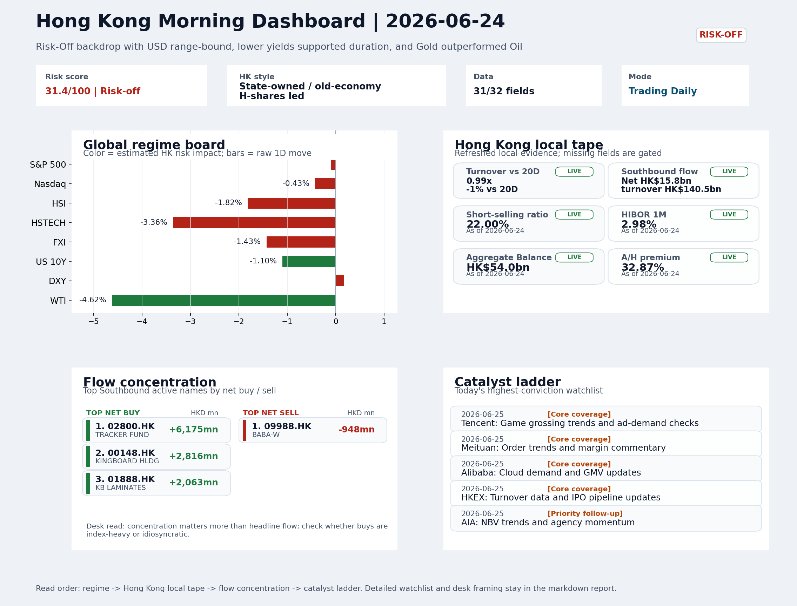
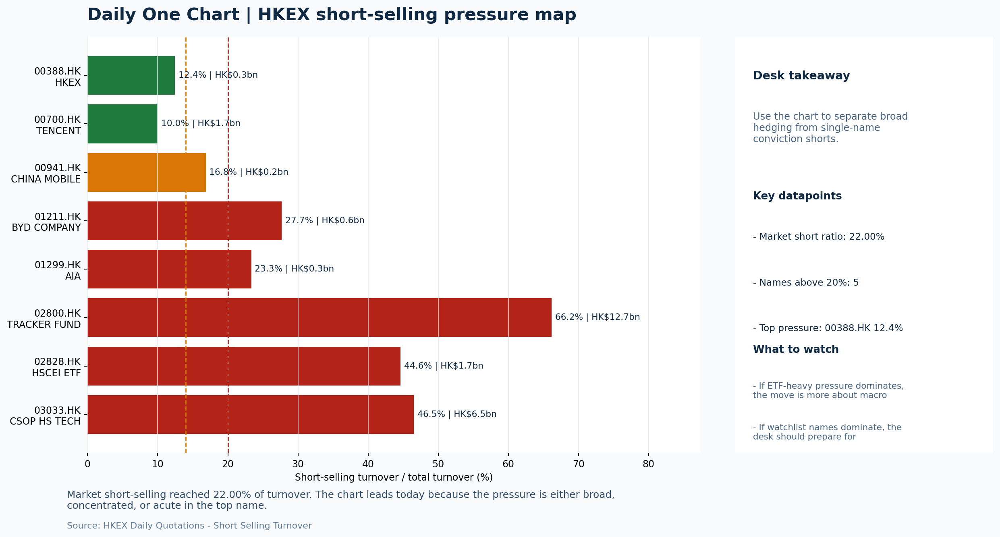

# Morning Research Workbench | 2026-06-25

> Designed for a Hong Kong sell-side commute: Layer 1 `Scan`, Layer 2 `Deep Read`, Layer 3 `Thinking`
> Mode: `Trading Daily` | Keep the report execution-oriented: what mattered in the completed session, what can move Hong Kong leadership, and what needs fast follow-up.
> Briefing date: `2026-06-25` | Review date: `2026-06-24` | Global request: `2026-06-24` | HK/China request: `2026-06-24` | Market effective date: `2026-06-24` | Generated at: `2026-06-25 06:15:46`

## Executive Summary

- **Market pulse:** Risk-off overnight with elevated HK short-selling (22%) and tech underperformance leaves the open defensive.
- **Hong Kong lens:** Hong Kong growth / internet led. Expect a defensive open with tech and energy names under pressure; elevated short-selling ratio (22%) and prior HSTECH underperformance argue for confirming breadth before.
- **Top catalysts:** INTC -6.33%; Risk-Off backdrop with USD range-bound, lower yields supported duration, and Gold outperformed Oil.

## Visual Dashboard

## Layer 1 | Scan (5-10 min)

### 1.1 One-Line Market Pulse
Risk-off overnight with elevated HK short-selling (22%) and tech underperformance leaves the open defensive; local flow confirmation and Tencent/HKEX results are needed before any bounce gains conviction.

### 1.2 Global Asset Price Dashboard

| Asset | Last | 1D move | Read |
| --- | --- | --- | --- |
| S&P 500 | 7,358.22 | -0.10% | US large-cap risk appetite |
| Nasdaq 100 | 29,220.06 | -0.43% | Growth and duration leadership |
| Hang Seng Index | 23,336.28 | **-1.82%** | Hong Kong broad beta |
| Hang Seng TECH | 4.3140 | **-3.36%** | Hong Kong growth / platform read-through |
| CSI 300 | 4,941.60 | +0.21% | Mainland large-cap tone |
| US 10Y | 4.4020 | -1.10% | Global discount-rate anchor |
| China 10Y | 1.75% | +0.2bp | China local rates anchor \| Live public \| Eastmoney \| 2026-06-24 |
| CN-US 10Y spread | -266.5bp | +9.2bp | Relative carry and macro-pressure gauge \| Live public \| Eastmoney \| 2026-06-24 |
| DXY | 101.58 | +0.17% | Dollar liquidity impulse |
| USD/CNH | 6.7775 | +0.21% | Offshore China risk appetite |
| USD/HKD | 7.8390 | -0.00% | Linked-exchange regime stress check |
| Brent crude | 73.18 | **-5.06%** | Energy / geopolitics |
| COMEX gold | 4,024.40 | **-2.55%** | Hedge demand / real yields |
| Copper | 5.9825 | **-2.58%** | Global growth proxy |
| VIX | 18.63 | **-4.41%** | US stress barometer |

### 1.3 Hong Kong Key Data Quick Check

| Check | Value | Status | Source / as of | Why it matters |
| --- | --- | --- | --- | --- |
| Main Board turnover vs 20D | 0.99x \| -1% vs 20D | Live local | HKEX \| 2026-06-24 | Trailing 20-session average turnover was HK$326.1bn. |
| Southbound / Northbound net flow | Southbound Net HK$15.8bn \| turnover HK$140.5bn \| Northbound Turnover HK$424.4bn \| net not reported | Live local | HKEX Connect \| 2026-06-24 | Southbound net buy is calculated from HKEX disclosed buy and sell turnover. |
| Short-selling ratio | 22.00% | Live local | HKEX \| 2026-06-24 | Official HKEX stock-level short-selling table, aggregated as a share of total market turnover. |
| AH premium index | 32.87% | Live public | Yahoo \| 2026-06-24 | Simple average across 18 A/H pairs; use dispersion rather than the average alone. |
| USD/HKD spot vs band | 7.8390 \| band 7.7500 to 7.8500 | Live quote + local | Yahoo \| 2026-06-24 | Inside the linked-exchange band without immediate boundary stress. Official Convertibility Undertakings define the linked-rate stress boundaries for USD/HKD. |
| HIBOR 1M | 2.98% | Live local | HKMA \| 2026-06-24 | 1M HIBOR is the cleanest quick read for Hong Kong funding conditions and equity-duration pressure. |
| Aggregate Balance | HK$54.0bn | Live local | HKMA \| 2026-06-24 | Aggregate Balance helps frame whether linked-rate liquidity conditions are tight or comfortable. |
| Hong Kong leadership | Hong Kong growth / internet led | Proxy | HSI / HSCEI / HSTECH relative perf \| 2026-06-24 | Use HSI / HSCEI / HSTECH relative moves as the opening style read. |

### 1.4 Risk Dashboard
**Composite risk score:** `31.4/100` | **Regime:** `Risk-off`

| Component | Score impact | Evidence |
| --- | --- | --- |
| US beta | -0.6 | S&P 500 -0.10% |
| HK growth | -10 | HSTECH -3.36% |
| Offshore China proxy | -7.1 | FXI -1.43% |
| Dollar pressure | -1.7 | DXY +0.17% |
| Volatility | +8.8 | VIX -4.41% |
| HK short-selling | -8 | Short-selling ratio 22.00% |

### 1.5 Morning Checklist
1. **INTC -6.33%**
 Mover attribution | Announcement / expectations | Guidance reset and margin pressure
2. **Risk-Off backdrop with USD range-bound, lower yields supported duration, and Gold outperformed Oil**
 Overnight regime | Start by deciding whether the day is about Risk-Off conditions or a style pivot.
3. **CPI MoM (Released)**
 Macro / policy | Rates expectations, the dollar, and growth-equity valuation | Industries: Technology, Internet, Brokers
4. **Trade Balance (Released)**
 Macro / policy | Watch whether it changes the day's core market narrative | Industries: Market-wide
5. **WTI crude -4.62%**
 High-frequency data | Softer oil argues for a more cautious cyclical-growth read.

## Layer 2 | Deep Read (20-30 min)

### 2.1 Overnight Overseas Market Review
#### Market Setup
**Core tape.** Overnight, US equities edged lower amid a Risk-Off tone as Intel's guidance reset and softer oil deepened cyclical-growth concerns, while lower Treasury yields offered only partial offset for duration-sensitive sectors.
**Main driver.** European equities fell more sharply, and gold outperformed oil, consistent with global growth slowdown fears.
**HK relevance.** The USD was range-bound and the VIX declined despite the risk-off bias, pointing to controlled repricing rather than panic.

#### Key Drivers
- Intel's -6.33% guidance reset extended semiconductor caution, directly weighing on tech hardware sentiment.
- WTI crude's 4.62% slump signaled demand concerns, dragging energy and cyclical-correlated names.
- US 10Y yield -1.1% gave mechanical support to long-duration assets but did not revive risk appetite.

#### Hong Kong Read-Through
**Desk lens.** State-owned / old-economy H-shares led.
**Opening implication.** Expect a defensive open with tech and energy names under pressure; elevated short-selling ratio (22%) and prior HSTECH underperformance argue for confirming breadth before chasing any early bounce.
- **Cross-market read:** Hang Seng -1.82% / HSCEI -1.96% / HSTECH -3.36%.
- **Cross-market read:** Offshore China proxy FXI -1.43% and USD/CNH +0.21% frame cross-border risk appetite.
- **Cross-market read:** USD/HKD last traded around 7.8390, which keeps the Hong Kong funding lens in focus.

#### Watch Points
- USD composite moved higher by +0.10pct intraday, with a 0.212pct range.
- Main turning points appeared around 2026-06-24 08:25 peak / 2026-06-24 08:40 peak / 2026-06-24 09:00 peak, suggesting event-driven repricing rather.
- The biggest cross-asset divergence was Gold versus Oil, a spread of 2.438pct.
- Gold moved -1.27pct intraday with a 3.192pct high-low range.

**Curated overnight stories**
1. **INTC -6.33% after guidance reset and margin pressure**
 Why it matters: Intel's guidance reset signals persistent structural pressure in semiconductors, extending the sector's risk-off tone.
 HK read-through: Direct read-through to Hong Kong-listed chip names and tech hardware underweight. Likely to cap technology and semiconductor sentiment at open.
2. **CPI MoM released - reinforces rates-expectations constraint**
 Why it matters: Inflation persistence keeps Fed rate-cut timing uncertain, sustaining USD stability while constraining growth-equity valuation expansion.
 HK read-through: Drag on internet and growth names that benefit from lower discount rates. Reinforces defensive positioning in HK cash tape.
3. **Risk-Off backdrop with USD range-bound, lower yields supported duration, Gold**
 Why it matters: The dominant overnight regime signal. Gold outperforming Oil reflects global growth slowdown fears.
 HK read-through: Supports defensive and yield-sensitive names in Hong Kong. Suppresses cyclical and energy sectors. HK dollar stability maintained but no risk-seeking flows.
4. **WTI crude -4.62% signals softer cyclical-growth read**
 Why it matters: Sharp oil decline reflects demand concerns and reinforces the Risk-Off narrative. Complements lower CPI as evidence of subdued global pricing power.
 HK read-through: Pressure on Hong Kong energy names and commodity-linked plays. Indirect read-through to PetroChina, Sinopec, and CNOOC underperformance risk.
5. **JPMorgan $50bn buyback, Goldman dividend hike after Fed stress test**
 Why it matters: Demonstrates capital adequacy and returning excess capital to shareholders. Constructive for global financial sector sentiment but does not offset macro headwinds.
 HK read-through: Mild positive read-through for HK-listed banks and financial intermediaries. May support China banking valuations on capital discipline narrative.

### 2.2 Hong Kong / A-share Previous-Day Review
#### Local Tape Setup
**Local read.** Hong Kong's June 24 session displayed clear growth underperformance, with HSTECH dropping 3.36% versus HSCEI's 1.96% decline, mirroring overnight risk‑off and Intel's guidance reset.
**Verification point.** Southbound net buying reached HK$15.75bn, but elevated short‑selling at 22% of turnover and ETF outflows from 3033.HK and 2828.HK signal defensive caution.
**Risk to watch.** Northbound net‑buy data remains unavailable, leaving the cross‑market read incomplete.

#### Style and Local Leadership
**Style leadership.** Hong Kong growth / internet led.
- **Cross-market read:** Hang Seng -1.82% / HSCEI -1.96% / HSTECH -3.36%.
- **Cross-market read:** Offshore China proxy FXI -1.43% and USD/CNH +0.21% frame cross-border risk appetite.
- **Cross-market read:** USD/HKD last traded around 7.8390, which keeps the Hong Kong funding lens in focus.

#### Flow Confirmation
Official Stock Connect evidence is available; use Section 2.3 to confirm whether local money supports the price action.

#### Follow-Through Checklist
**Follow-through check.** Watch whether CSI 300 and FXI confirm a similar growth‑to‑value rotation, and if the short‑selling ratio retreats below 20% alongside sustained Southbound buying before adding risk.

### 2.3 Flow Tracker and Attribution
#### Cross-Asset Attribution v1

| Driver | Direction | Score | Evidence | HK implication |
| --- | --- | --- | --- | --- |
| Short-selling pressure | drag | 4.9 | HKEX short-selling ratio was 22.00%. | Elevated short activity argues for extra confirmation before chasing rebounds. |
| Oil and geopolitics | supportive | 4.05 | Oil moved -5.06%. | Split the read between energy/cyclicals support and margin/geopolitical pressure. |
| Rates impulse | supportive | 1.32 | US 10Y yield proxy moved -1.10%. | Lower yields help long-duration growth; higher yields pressure valuation-sensitive |

#### Flow Tracker
##### Flow Takeaways
- Short-selling pressure is elevated, so local rebounds need cleaner breadth and flow confirmation.
- Stock Connect Southbound: net HK$15.8bn on turnover HK$140.5bn (as of 2026-06-24).
- Stock Connect Northbound: turnover RMB424.4bn; public file provides total turnover/top active names, not full net-buy.
- AH premium: simple covered-pair average +32.87%; widest premium: Chalco 168.87%.

##### Stock Connect Southbound Active Names

| Rank | Ticker | Name | Buy | Sell | Net buy |
| --- | --- | --- | --- | --- | --- |
| 2 | 02800.HK | TRACKER FUND | HK$6,218.1mn | HK$43.3mn | HK$6,174.8mn |
| 5 | 00148.HK | KINGBOARD HLDG | HK$3,745.1mn | HK$928.8mn | HK$2,816.4mn |
| 5 | 01888.HK | KB LAMINATES | HK$3,766.7mn | HK$1,704.1mn | HK$2,062.6mn |
| 6 | 09988.HK | BABA-W | HK$1,919.9mn | HK$2,868.2mn | HK$-948.2mn |
| 4 | 06869.HK | YOFC | HK$3,388.0mn | HK$2,471.0mn | HK$917.0mn |

##### AH Premium Dispersion

| Name | A ticker | H ticker | Premium | As of |
| --- | --- | --- | --- | --- |
| Chalco | 601600.SS | 2600.HK | +168.87% | 2026-06-24 |
| China Communications Construction | 601800.SS | 1800.HK | +75.99% | 2026-06-24 |
| China Railway Construction | 601186.SS | 1186.HK | +50.59% | 2026-06-24 |
| China Railway | 601390.SS | 0390.HK | +46.89% | 2026-06-24 |
| China Life | 601628.SS | 2628.HK | +45.65% | 2026-06-24 |

##### HKEX Short-Selling Watch

| Ticker | Name | Short ratio | Short turnover | Total turnover |
| --- | --- | --- | --- | --- |
| 00388.HK | HKEX | 12.44% | HK$0.3bn | HK$2.3bn |
| 00700.HK | TENCENT | 9.97% | HK$1.7bn | HK$17.0bn |
| 00941.HK | CHINA MOBILE | 16.84% | HK$0.2bn | HK$1.2bn |
| 01211.HK | BYD COMPANY | 27.69% | HK$0.6bn | HK$2.0bn |
| 01299.HK | AIA | 23.34% | HK$0.3bn | HK$1.3bn |

- **Short-value leaders:** 02800.HK TRACKER FUND (HK$12.7bn); 07709.HK XL2CSOPHYNIX (HK$10.8bn); 03033.HK CSOP HS TECH (HK$6.5bn); 00981.HK SMIC (HK$2.4bn).

### 2.4 Macro and Policy Tracking
**Desk read.** The overnight US CPI print of 0.3% MoM (vs. 0.2% forecast) was hotter than consensus, reinforcing a rates-sensitive risk-off backdrop that already has US yields lower and the dollar range-bound.

**Market sensitivity.** China's trade balance beat at USD 85.2bn provides a modest offset for local sentiment, but the upcoming US retail sales, China LPR decision, and Powell's speech later today are the next potential repricing triggers.

**HK implication.** If retail sales surprise to the upside or Powell sounds hawkish, the current duration-favored, growth-cautious posture could intensify, hitting Hong Kong's tech and broker leadership.

**Macro watchpoints**
- US 2Y and 10Y yields and DXY reaction after Powell's remarks and retail sales data.
- Whether Hong Kong's tech and broker sectors extend yesterday's risk-off tone or stabilize.
- China LPR announcement at 09:20 - any deviation from the 3.45% consensus could shift mainland financials and property credits.
- Gold's outperformance as a destination for duration-seeking flows if Powell reinforces lower-for-longer expectations.

| Time | Region | Event | Status | Desk read |
| --- | --- | --- | --- | --- |
| 20:30 | US | CPI MoM | Released | Impact: Rates expectations, the dollar, and growth-equity valuation \| Attention: 5/5 \| Industries: Technology, Internet, Brokers |
| 09:30 | China | Trade Balance | Released | Impact: Watch whether it changes the day's core market narrative \| Attention: 3/5 \| Industries: Market-wide |
| 20:30 | US | Retail Sales MoM | Upcoming | Impact: Consumer resilience, growth expectations, and risk-asset pricing \| Attention: 5/5 \| Industries: Consumer, E-commerce, Consumer discretionary |
| 09:20 | China | Loan Prime Rate | Upcoming | Impact: Watch whether it changes the day's core market narrative \| Attention: 3/5 \| Industries: Market-wide |
| 22:00 | Federal Reserve | Jerome Powell: Economic outlook remarks | Central bank | Impact: Policy path, liquidity conditions, and cross-asset risk appetite \| Attention: 5/5 \| Industries: Technology, Financials, Gold |
| 10:00 | PBOC | Open Market Operations Desk: Daily liquidity operation window | Central bank | Impact: Policy path, liquidity conditions, and cross-asset risk appetite \| Attention: 3/5 \| Industries: Technology, Financials, Gold |

#### Positioning and Risk Backdrop
- Options activity centered on KWEB Call, with Vol/OI at 1.88x and a bullish bias.
- Put/Call structure shows equity 0.68 / index 1.15, implying Single-stock optimism with index hedging.
- Geopolitics: Middle East | Regional tension remains elevated | Impact: Oil, freight costs, and safe-haven demand
- Geopolitics: US-China | Technology export-control rhetoric remains active | Impact: China internet, semiconductors, and supply chains

### 2.5 Key Company and Sector Events
No high-conviction sector story cleared the main-report relevance gate for this run.

#### Company Event Takeaway
**Desk read.** Risk-off conditions persist as Gold outperforms Oil and yields decline, supporting duration.
**Why it matters.** For Hong Kong, the key near-term catalysts are Tencent (0700.HK) results after market close and HKEX (0388.HK) results before market open on June 25.
**Follow-up.** The Morgan Stanley upgrade on Alibaba (9988.HK) to Overweight with a target raise to 105 is a constructive signal for China internet sentiment.

#### LLM Quick Takes
- **0700.HK** | Trading up 3.38% at the bottom of its range (13.8%). WeCom AI agent launch with DeepSeek integration is a tangible AI monetization step.
- **0388.HK** | Results before market open with consensus EPS of 2.81 HKD and revenue of 6.0bn HKD. As a financial-sector bellwether, the result will set the tone for HK financial
- **9988.HK** | Morgan Stanley upgraded from Equal Weight to Overweight with target raised from 92 to 105. This is the most significant rating-change signal for China internet this
- **3690.HK** | Trading down 2.66% at the bottom of its range (0%). Fresh food-delivery subsidy regulations from the markets regulator continue to weigh on the name.
- **1299.HK** | Trading up 0.96% but near the bottom of its range (19.6%). Insurance sector lacks near-term catalysts but remains a useful read-through for wealth demand and mainland
- **0941.HK** | Trading down 0.32% in mid-range (31.6%). Defensive positioning is neutral. No near-term catalysts

#### HKEX Announcements

| Grade | Ticker | Type | Release time | Title |
| --- | --- | --- | --- | --- |
| A | 01025.HK | Profit warning | 2026-06-24 | Profit warning / alert announcement |
| A | 01500.HK | Profit warning | 2026-06-24 | Profit warning / alert announcement |
| A | 01723.HK | Profit warning | 2026-06-24 | Profit warning / alert announcement |
| A | 06033.HK | Profit warning | 2026-06-24 | Profit warning / alert announcement |
| A | 08161.HK | Profit warning | 2026-06-24 | Profit warning / alert announcement |
| A | 08331.HK | Profit warning | 2026-06-24 | Profit warning / alert announcement |
| A | 00037.HK | Profit warning | 2026-06-23 | Profit warning / alert announcement |
| A | 00858.HK | Profit warning | 2026-06-23 | Profit warning / alert announcement |

#### Earnings / Results Watch

| Ticker | Company | Timing | Expectation framing |
| --- | --- | --- | --- |
| 0700.HK | Tencent Holdings | After Market Close | EPS est. 4.15 HKD \| revenue est. 163.2bn HKD |
| 0388.HK | Hong Kong Exchanges and Clearing | Before Market Open | EPS est. 2.81 HKD \| revenue est. 6.0bn HKD |

#### Rating Changes
- **9988.HK** | Morgan Stanley | Upgrade | Equal Weight -> Overweight | PT 92 -> 105

#### IPO Watch
- IPO and grey-market monitoring is not yet part of the standard production pack.

### 2.6 Today's Core Names
#### Core coverage

| Name | Ticker | Last | 1D | Range position | Morning note |
| --- | --- | --- | --- | --- | --- |
| Tencent | 0700.HK | 428.80 | +3.38% | Bottom of range | Short-term price strength is clear; fresh catalysts could trigger broader group follow-through. |
| Meituan | 3690.HK | 67.75 | -2.66% | Bottom of range | Short-term pressure is visible; check for a fundamental or regulatory reason. |

**Recent headlines for Tencent:**
- [Tencent Shares Jump 6% as WeCom Rolls Out DeepSeek-Powered AI Agent](https://finance.yahoo.com/technology/ai/articles/tencent-shares-jump-6-wecom-133642322.html) (GuruFocus.com)
**Recent headlines for Meituan:**
- [China food delivery stocks fall on fresh regulations covering subsidies](https://finance.yahoo.com/markets/stocks/articles/china-food-delivery-stocks-fall-050006974.html) (Investing.com)

#### Priority follow-up

| Name | Ticker | Last | 1D | Range position | Morning note |
| --- | --- | --- | --- | --- | --- |
| AIA | 1299.HK | 73.65 | +0.96% | Bottom of range | The name sits near the bottom of its recent range and is worth monitoring for a catalyst-led reversal. |
| China Mobile | 0941.HK | 78.05 | -0.32% | Mid-range | Positioning is neutral for now, so use it mainly to monitor marginal information changes. |

## Layer 3 | Thinking (10-15 min)

### 3.1 Rotating Theme Deep Dive

| Field | Read |
| --- | --- |
| Theme | China Exports and Supply-Chain Relocation |
| Angle for the day | Track tariffs, trade policy, shipping, and manufacturing orders to see whether export resilience is still the cleaner China macro expression. |

**Theme desk read**
**Core thesis.** The weekly theme on China exports and supply-chain relocation still deserves attention.
**Evidence.** Overnight signals present a mixed picture: a beat on China's trade balance (USD 85.2bn vs 79.0bn) reinforces the narrative of export resilience.
**What to test.** Lower VIX (-4.41%) suggests easing market stress, but the overall Risk-Off backdrop tempers conviction.

**Signals to keep in mind**
- WTI crude -4.62%: Softer oil argues for a more cautious cyclical-growth read.
- VIX -4.41%: Lower volatility signals easing stress in the tape.

**LLM watch items:**
- BYD weekly sales data: confirm whether export mix is improving and whether it can lift the stock from its bottom-of-range position.
- US Retail Sales MoM (release 20:30 HKT): gauge consumer demand for China's export sector.
- China Trade Balance beat follow-through: watch for any upgrades or positive commentary on export-oriented names.

**Related names to keep close:**

| Name | Ticker | Bucket | Morning read |
| --- | --- | --- | --- |
| China Mobile | 0941.HK | Priority follow-up | Positioning is neutral for now, so use it mainly to monitor marginal information changes. |
| BYD Company | 1211.HK | Priority follow-up | The name sits near the bottom of its recent range and is worth monitoring for a catalyst-led reversal. |

**Upcoming catalysts tied to the theme:**
- 2026-06-25 | China Mobile: Capex updates and dividend policy signals | Defensive SOE benchmark for yield trade and domestic digital-infrastructure spend
- 2026-06-25 | BYD Company: Weekly sales data and model rollout cadence | Hong Kong-listed proxy for EV volumes, export mix, and price competition

### 3.2 Today Ahead and Trading Calendar
- Macro: CPI MoM is the first item to anchor the open and the rates/FX response.
- Corporate / event: Tencent: Game grossing trends and ad-demand checks is the cleanest same-day catalyst to prepare for.

**Same-day macro docket**

| Time | Country | Event | Status | Detail |
| --- | --- | --- | --- | --- |
| 20:30 | US | CPI MoM | Released | Actual 0.3% / Forecast 0.2% / Prior 0.4% |
| 09:30 | China | Trade Balance | Released | Actual USD 85.2bn / Forecast USD 79.0bn / Prior USD 80.6bn |
| 20:30 | US | Retail Sales MoM | Upcoming | Forecast 0.3% / Prior 0.6% |
| 09:20 | China | Loan Prime Rate | Upcoming | Forecast 3.45% / Prior 3.45% |
| 22:00 | Federal Reserve | Jerome Powell: Economic outlook remarks | Central bank | speech |

**Same-day catalyst list**

| Date | Time | Category | Event | Importance |
| --- | --- | --- | --- | --- |
| 2026-06-25 | | Core coverage | Tencent: Game grossing trends and ad-demand checks | 3 |
| 2026-06-25 | | Core coverage | Meituan: Order trends and margin commentary | 3 |
| 2026-06-25 | | Core coverage | Alibaba: Cloud demand and GMV updates | 3 |
| 2026-06-25 | | Core coverage | HKEX: Turnover data and IPO pipeline updates | 3 |

**Next few sessions**

| Date | Category | Event | Impact |
| --- | --- | --- | --- |
| 2026-06-25 | Core coverage | Tencent: Game grossing trends and ad-demand checks | Core offshore China platform proxy for gaming, ads, and AI monetization |
| 2026-06-25 | Core coverage | Meituan: Order trends and margin commentary | High-frequency read on local services demand and platform competition |
| 2026-06-25 | Core coverage | Alibaba: Cloud demand and GMV updates | Key read-through for China consumption, cloud, and platform regulation |
| 2026-06-25 | Core coverage | HKEX: Turnover data and IPO pipeline updates | Direct proxy for Hong Kong market turnover, listings, and southbound |

### 3.3 Daily One Chart
**Daily One Chart | HKEX short-selling pressure map**

**Chart read.** Market short-selling reached 22.00% of turnover.
**Why it matters.** The chart leads today because the pressure is either broad, concentrated, or acute in the top name.

_Source: HKEX Daily Quotations - Short Selling Turnover_

## Traceable Appendix

### Report Metadata
> Date policy: Review date 2026-06-24 is treated as `Trading Daily`. | Global request date is 2026-06-24; adapter effective date is 2026-06-24 and summary date is 2026-06-24. | HK/China local data date is 2026-06-24; role: same-session local cash tape.
> Market data quality: Coverage: `31/32` | Stale items (>1d): `1` | Missing: `1`
> Report quality: `92.1/100` | Grade `A` | Status `production ready`

### Key Questions to Keep in Mind
- Is risk appetite rising or fading? The overnight tape reads closer to `Risk-Off`.
- Did rates expectations move? Focus on whether US 10Y, DXY, and growth style moved together.
- Were commodities the real story? Watch WTI and gold for geopolitics versus inflation signals.
- Is Hong Kong setup internet-led, SOE-led, or broad beta-led? Compare HSTECH, HSCEI, and HSI.
- Did offshore markets move China risk appetite? Focus on HSI, FXI, USD/CNH, and USD/HKD.

### Report Quality and Validation
- **Quality score:** 92.1/100 | **Grade:** A | **Status:** production ready
- **Run summary:** 8 healthy | 0 caveat | 0 failed
- **Release recommendation:** Send | All monitored sources were healthy, so the report is fit for normal distribution.

| Source | Status | Bucket |
| --- | --- | --- |
| Market data | ok | healthy |
| Sector and company news | ok | healthy |
| Movers and short selling | ok | healthy |
| Stock Connect | ok | healthy |
| A/H premium | ok | healthy |
| Hong Kong local package | ok | healthy |
| China rates | ok | healthy |
| Narrative overlay | ok | healthy |

**Desk-use guidance summary:** 0 blocking | 1 advisory

**Desk-use guidance**
- **Advisory:** All monitored sources were healthy for this run; the report can be used as a normal desk-starting point.

| Component | Score | Weight | Read |
| --- | --- | --- | --- |
| Market data coverage | 96.9 | 0.3 | 31/32 core market fields available. |
| Hong Kong local metrics | 82.3 | 0.25 | 8 live, 3 proxy, 0 unavailable local checks. |
| Key public adapters | 100.0 | 0.2 | 4/4 key adapters were available or partially available. |
| Narrative overlay health | 82.9 | 0.15 | 5/7 narrative overlay tasks succeeded or used validated cache; 0 error(s). |
| Fact-check guardrail | 100.0 | 0.1 | Checked 0 numeric claims; 0 numeric mismatch(es), 0 logic warning(s); 0 critical, 0 review. |

**Narrative fact-check guardrail**
- Checked 0 numeric claims; 0 numeric mismatch(es), 0 logic warning(s); 0 critical, 0 review.

**Adapter status**

| Adapter | Status |
| --- | --- |
| Stock Connect | ok |
| A/H premium | ok |
| HKEX announcements | ok |
| China rates | ok |

### Source Links
- [Tencent Shares Jump 6% as WeCom Rolls Out DeepSeek-Powered AI Agent](https://finance.yahoo.com/technology/ai/articles/tencent-shares-jump-6-wecom-133642322.html) (GuruFocus.com)
- [China food delivery stocks fall on fresh regulations covering subsidies](https://finance.yahoo.com/markets/stocks/articles/china-food-delivery-stocks-fall-050006974.html) (Investing.com)
- [Alibaba Stock Slides Further On Report China Tech Giant Tried 'Illicitly' Accessing Anthropic AI Models](https://www.investors.com/news/technology/alibaba-stock-baba-anthropic-ai-claude/?src=A00220&yptr=yahoo) (Investor's Business Daily)
- [Anthropic says Alibaba illicitly extracted Claude AI model capabilities](https://finance.yahoo.com/technology/ai/articles/anthropic-says-alibaba-illicitly-extracted-203048734.html) (Reuters)
- [01025.HK Profit warning / alert announcement](http://www1.hkexnews.hk/listedco/listconews/sehk/2026/0624/2026062401206.pdf) (HKEXnews)
- [01500.HK Profit warning / alert announcement](http://www1.hkexnews.hk/listedco/listconews/sehk/2026/0624/2026062401124.pdf) (HKEXnews)
- [01723.HK Profit warning / alert announcement](http://www1.hkexnews.hk/listedco/listconews/sehk/2026/0624/2026062401434.pdf) (HKEXnews)
- [06033.HK Profit warning / alert announcement](http://www1.hkexnews.hk/listedco/listconews/sehk/2026/0624/2026062401055.pdf) (HKEXnews)
- [08161.HK Profit warning / alert announcement](http://www1.hkexnews.hk/listedco/listconews/gem/2026/0624/2026062401288.pdf) (HKEXnews)
- [08331.HK Profit warning / alert announcement](http://www1.hkexnews.hk/listedco/listconews/gem/2026/0624/2026062401086.pdf) (HKEXnews)
- [00037.HK Profit warning / alert announcement](http://www1.hkexnews.hk/listedco/listconews/sehk/2026/0623/2026062201000.pdf) (HKEXnews)
- [00858.HK Profit warning / alert announcement](http://www1.hkexnews.hk/listedco/listconews/sehk/2026/0623/2026062301497.pdf) (HKEXnews)

## Supplementary Visual Appendix

This appendix is professional-path only. It keeps a traceable index of the report visuals and the deterministic chart cues used to frame the morning note, without injecting the legacy intraday chart pack.

### Visual Index

| Visual | Path | Role |
| --- | --- | --- |
| Visual Dashboard | `charts/dashboard_2026-06-25.png` | Cross-asset regime board and Hong Kong local tape snapshot. |
| Daily One Chart | `charts/daily_one_chart_2026-06-25.png` | Single highest-conviction visual story for the day. |

### Deterministic Chart Cues
- FX / liquidity: USD composite moved higher by +0.10pct intraday, with a 0.212pct range.
- FX / liquidity: Main turning points appeared around 2026-06-24 08:25 peak / 2026-06-24 08:40 peak / 2026-06-24 09:00 peak, suggesting event-driven repricing rather than a clean one-way USD move.
- Cross-asset: The biggest cross-asset divergence was Gold versus Oil, a spread of 2.438pct.
- Cross-asset: Gold moved -1.27pct intraday with a 3.192pct high-low range.
- Cross-asset: Oil moved -3.71pct intraday with a 4.523pct high-low range.
- Cross-asset: Bitcoin moved -2.79pct intraday with a 6.0pct high-low range.

### Risk Dashboard Components

| Component | Score impact | Evidence |
| --- | --- | --- |
| US beta | -0.6 | S&P 500 -0.10% |
| HK growth | -10 | HSTECH -3.36% |
| Offshore China proxy | -7.1 | FXI -1.43% |
| Dollar pressure | -1.7 | DXY +0.17% |
| Volatility | +8.8 | VIX -4.41% |
| HK short-selling | -8 | Short-selling ratio 22.00% |
