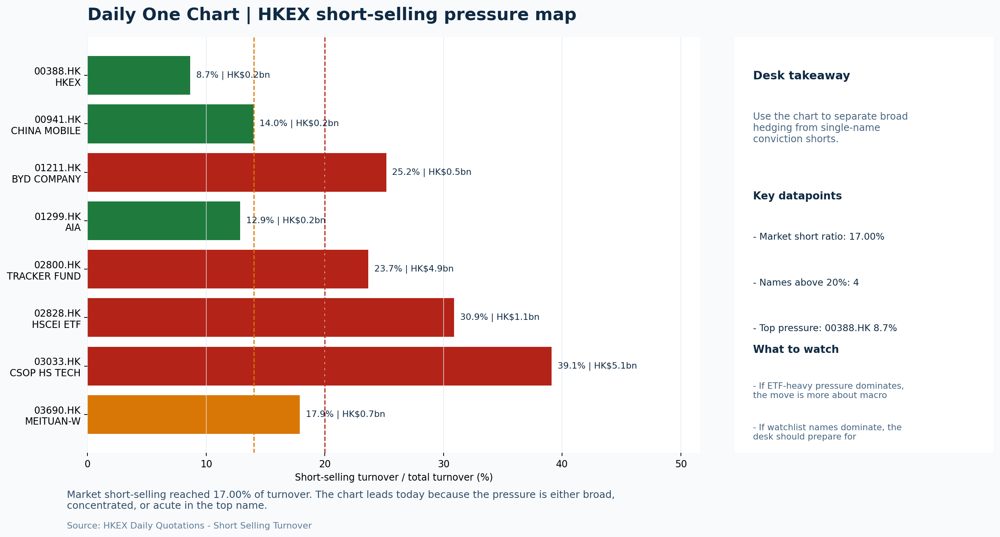

# Morning Research Workbench | 2026-06-26

> Designed for a Hong Kong sell-side commute: Layer 1 `Scan`, Layer 2 `Deep Read`, Layer 3 `Thinking`
> Mode: `Trading Daily` | Keep the report execution-oriented: what mattered in the completed session, what can move Hong Kong leadership, and what needs fast follow-up.
> Briefing date: `2026-06-26` | Review date: `2026-06-25` | Global request: `2026-06-25` | HK/China request: `2026-06-25` | Market effective date: `2026-06-25` | Generated at: `2026-06-26 06:20:42`

## Executive Summary

- **Market pulse:** HSTECH's +1.99% growth leadership looked constructive in the session, but the HK$8.9bn Southbound outflow, FXI's -2.10% offshore China proxy drop, and Intel's -6.33% guidance reset warrant.
- **Hong Kong lens:** Hong Kong growth / internet led. HSTECH's local +1.99% suggests Hong Kong growth names have gathered early positive momentum, but the sharp 2.10% drop in the FXI offshore China proxy and Intel's 6.33% pre-market.
- **Top catalysts:** INTC -6.33%; Risk-On backdrop with USD range-bound, lower yields supported duration, and Oil outperformed Bitcoin.

## Visual Dashboard

## Layer 1 | Scan (5-10 min)

### 1.1 One-Line Market Pulse
HSTECH's +1.99% growth leadership looked constructive in the session, but the HK$8.9bn Southbound outflow, FXI's -2.10% offshore China proxy drop, and Intel's -6.33% guidance reset warrant caution heading into tonight's US CPI release.

### 1.2 Global Asset Price Dashboard

| Asset | Last | 1D move | Read |
| --- | --- | --- | --- |
| S&P 500 | 7,357.49 | -0.01% | US large-cap risk appetite |
| Nasdaq 100 | 29,440.32 | +0.75% | Growth and duration leadership |
| Hang Seng Index | 23,412.18 | +0.33% | Hong Kong broad beta |
| Hang Seng TECH | 4.4000 | **+1.99%** | Hong Kong growth / platform read-through |
| CSI 300 | 4,941.60 | +0.21% | Mainland large-cap tone |
| US 10Y | 4.3920 | -1.33% | Global discount-rate anchor |
| China 10Y | 1.74% | -1.0bp | China local rates anchor \| Live public \| Eastmoney \| 2026-06-25 |
| CN-US 10Y spread | -266.5bp | -0.0bp | Relative carry and macro-pressure gauge \| Live public \| Eastmoney \| 2026-06-25 |
| DXY | 101.44 | -0.17% | Dollar liquidity impulse |
| USD/CNH | 6.7660 | +0.04% | Offshore China risk appetite |
| USD/HKD | 7.8399 | -0.01% | Linked-exchange regime stress check |
| Brent crude | 75.04 | **+1.76%** | Energy / geopolitics |
| COMEX gold | 4,041.30 | +1.28% | Hedge demand / real yields |
| Copper | 6.1175 | **+2.94%** | Global growth proxy |
| VIX | 18.89 | +1.40% | US stress barometer |

### 1.3 Hong Kong Key Data Quick Check

| Check | Value | Status | Source / as of | Why it matters |
| --- | --- | --- | --- | --- |
| Main Board turnover vs 20D | 1.00x \| -0% vs 20D | Live local | HKEX \| 2026-06-25 | Trailing 20-session average turnover was HK$327.3bn. |
| Southbound / Northbound net flow | Southbound Net HK$-8.9bn \| turnover HK$141.8bn \| Northbound Turnover HK$423.9bn \| net not reported | Live local | HKEX Connect \| 2026-06-25 | Southbound net buy is calculated from HKEX disclosed buy and sell turnover. |
| Short-selling ratio | 17.00% | Live local | HKEX \| 2026-06-25 | Official HKEX stock-level short-selling table, aggregated as a share of total market turnover. |
| AH premium index | 24.59% | Live public | Yahoo \| 2026-06-25 | Simple average across 19 A/H pairs; use dispersion rather than the average alone. |
| USD/HKD spot vs band | 7.8399 \| band 7.7500 to 7.8500 | Live quote + local | Yahoo \| 2026-06-25 | Inside the linked-exchange band without immediate boundary stress. Official Convertibility Undertakings define the linked-rate stress boundaries for USD/HKD. |
| HIBOR 1M | 2.96% | Live local | HKMA \| 2026-06-25 | 1M HIBOR is the cleanest quick read for Hong Kong funding conditions and equity-duration pressure. |
| Aggregate Balance | HK$54.0bn | Live local | HKMA \| 2026-06-25 | Aggregate Balance helps frame whether linked-rate liquidity conditions are tight or comfortable. |
| Hong Kong leadership | Hong Kong growth / internet led | Proxy | HSI / HSCEI / HSTECH relative perf \| 2026-06-25 | Use HSI / HSCEI / HSTECH relative moves as the opening style read. |

### 1.4 Risk Dashboard
**Composite risk score:** `50.8/100` | **Regime:** `Mixed`

| Component | Score impact | Evidence |
| --- | --- | --- |
| US beta | -0.1 | S&P 500 -0.01% |
| HK growth | +9.9 | HSTECH +1.99% |
| Offshore China proxy | -8 | FXI -2.10% |
| Dollar pressure | +1.7 | DXY -0.17% |
| Volatility | -2.8 | VIX +1.40% |
| HK short-selling | +0 | Short-selling ratio 17.00% |

### 1.5 Morning Checklist
1. **INTC -6.33%**
 Mover attribution | Announcement / expectations | Guidance reset and margin pressure
2. **Risk-On backdrop with USD range-bound, lower yields supported duration, and Oil outperformed Bitcoin**
 Overnight regime | Start by deciding whether the day is about Risk-On conditions or a style pivot.
3. **CPI MoM (Released)**
 Macro / policy | Rates expectations, the dollar, and growth-equity valuation | Industries: Technology, Internet, Brokers
4. **Trade Balance (Released)**
 Macro / policy | Watch whether it changes the day's core market narrative | Industries: Market-wide
5. **Retail Sales MoM (Upcoming)**
 Macro / policy | Consumer resilience, growth expectations, and risk-asset pricing | Industries: Consumer, E-commerce, Consumer discretionary

## Layer 2 | Deep Read (20-30 min)

### 2.1 Overnight Overseas Market Review
#### Market Setup
**Core tape.** Overnight markets stayed in a risk-on posture, but the S&P 500 closed flat as lower Treasury yields boosted growth while Intel's guidance reset weighed on semiconductors.
**Main driver.** The Nasdaq 100 rose 0.75% on the rates tailwind, and oil advanced 1.6% against falling Bitcoin, underscoring a rotation toward real assets.
**HK relevance.** The dollar index slipped 0.17%, keeping global liquidity conditions supportive.

#### Key Drivers
- US 10Y yield fell 1.33%, supporting duration-sensitive growth as Fed officials offered mixed but largely wait-and-see signals.
- Intel dropped 6.33% after a guidance reset, pressuring the semiconductor complex and offsetting some of the tech gains.
- WTI crude rose 1.58%, reflecting geopolitical premium and demand repair hopes, while Bitcoin fell 2.0%, reinforcing a risk-regime rotation.
- DXY edged down 0.17%, with a range-bound dollar sustaining broad risk appetite, though offshore China proxy FXI slumped 2.10%.

#### Hong Kong Read-Through
**Desk lens.** Hong Kong growth / internet led.
**Opening implication.** HSTECH's local +1.99% suggests Hong Kong growth names have gathered early positive momentum.
- **Cross-market read:** Hang Seng +0.33% / HSCEI +0.07% / HSTECH +1.99%.
- **Cross-market read:** Offshore China proxy FXI -2.10% and USD/CNH +0.04% frame cross-border risk appetite.
- **Cross-market read:** USD/HKD last traded around 7.8399, which keeps the Hong Kong funding lens in focus.

#### Watch Points
- USD composite moved lower by -0.03pct intraday, with a 0.225pct range.
- Main turning points appeared around 2026-06-25 08:10 peak / 2026-06-25 08:35 peak / 2026-06-25 09:20 trough, suggesting event-driven repricing.
- The biggest cross-asset divergence was Oil versus Bitcoin, a spread of 4.973pct.
- Gold moved +0.79pct intraday with a 1.743pct high-low range.

**Curated overnight stories**
1. **Federal Reserve: U.S. banks can withstand $708 billion in losses under new capital rules**
 Why it matters: Strong stress test results validate banking sector resilience. JPMorgan's $50bn buyback and Goldman's dividend raise reinforce financial sector confidence.
 HK read-through: Supports positive risk sentiment globally. HK financials (HSBC, AIA) could benefit from spillover confidence, though these are specific to US operations.
2. **Bond ETF flows surge as investors hunt for yield; BlackRock sees 'market sniffing out**
 Why it matters: Institutional demand for income products remains elevated. Lower yields and duration support reflects uncertainty about growth trajectory.
 HK read-through: Relevant for HK bond proxies, REITs, and defensive high-dividend names. Could support HK dollar fixed income products if USD yields remain pressured.
3. **INTC -6.33%: Guidance reset and margin pressure**
 Why it matters: Largest overnight mover. Semiconductor guidance reset signals continued sector headwinds and margin compression concerns.
 HK read-through: Direct read-through to HK-listed semiconductor and tech hardware names. SMIC and related tech sectors face sentiment headwinds at Thursday open.
4. **Risk-On backdrop with USD range-bound, lower yields, Oil outperformed Bitcoin**
 Why it matters: Confirms overnight risk regime. Oil strength and Bitcoin underperformance suggest rotation toward real assets and away from speculative crypto positions.
 HK read-through: Supports energy and commodity-linked HK names ( PetroChina, CNOOC). Crypto underperformance is neutral for HK market given limited direct exposure.

### 2.2 Hong Kong / A-share Previous-Day Review
#### Local Tape Setup
**Local read.** Hong Kong's onshore session saw HSTECH +1.99% against HSCEI +0.07%, indicating style leadership tilted toward growth.
**Verification point.** Local ETF flows also pointed to outflows in 2800.HK and 2828.HK, while short-selling held at 17%, leaving the style signal unsupported by flow.
**Risk to watch.** A clean cross-market read is not yet complete because Northbound net-buy is unavailable and the offshore proxy diverges.

#### Style and Local Leadership
**Style leadership.** Hong Kong growth / internet led.
- **Cross-market read:** Hang Seng +0.33% / HSCEI +0.07% / HSTECH +1.99%.
- **Cross-market read:** Offshore China proxy FXI -2.10% and USD/CNH +0.04% frame cross-border risk appetite.
- **Cross-market read:** USD/HKD last traded around 7.8399, which keeps the Hong Kong funding lens in focus.

#### Flow Confirmation
Official Stock Connect evidence is available; use Section 2.3 to confirm whether local money supports the price action.

#### Follow-Through Checklist
**Follow-through check.** Confirm whether HSTECH can sustain its relative strength against HSCEI in Friday's session, particularly if SMIC and other semis decouple from Intel's after-hours -6.33%.

### 2.3 Flow Tracker and Attribution
#### Cross-Asset Attribution v1

| Driver | Direction | Score | Evidence | HK implication |
| --- | --- | --- | --- | --- |
| Rates impulse | supportive | 1.6 | US 10Y yield proxy moved -1.33%. | Lower yields help long-duration growth; higher yields pressure valuation-sensitive |
| Oil and geopolitics | mixed | 1.41 | Oil moved +1.76%. | Split the read between energy/cyclicals support and margin/geopolitical pressure. |

#### Flow Tracker
##### Flow Takeaways
- Local flow evidence is not yet strong enough to override the cross-asset setup.
- Stock Connect Southbound: net HK$-8.9bn on turnover HK$141.8bn (as of 2026-06-25).
- Stock Connect Northbound: turnover RMB423.9bn; public file provides total turnover/top active names, not full net-buy.
- AH premium: simple covered-pair average +24.59%; widest premium: Bank of China 65.98%.

##### Stock Connect Southbound Active Names

| Rank | Ticker | Name | Buy | Sell | Net buy |
| --- | --- | --- | --- | --- | --- |
| 3 | 02800.HK | TRACKER FUND | HK$29.3mn | HK$4,408.0mn | HK$-4,378.8mn |
| 3 | 00148.HK | KINGBOARD HLDG | HK$4,720.6mn | HK$1,889.4mn | HK$2,831.2mn |
| 1 | 00981.HK | SMIC | HK$6,062.3mn | HK$3,425.4mn | HK$2,636.9mn |
| 2 | 09988.HK | BABA-W | HK$3,004.9mn | HK$5,256.7mn | HK$-2,251.8mn |
| 6 | 01888.HK | KB LAMINATES | HK$3,327.7mn | HK$1,820.3mn | HK$1,507.3mn |

##### AH Premium Dispersion

| Name | A ticker | H ticker | Premium | As of |
| --- | --- | --- | --- | --- |
| Bank of China | 601988.SS | 3988.HK | +65.98% | 2026-06-25 |
| China Life | 601628.SS | 2628.HK | +49.21% | 2026-06-25 |
| China Railway Construction | 601186.SS | 1186.HK | +48.90% | 2026-06-25 |
| New China Life | 601336.SS | 1336.HK | +47.33% | 2026-06-25 |
| China Railway | 601390.SS | 0390.HK | +46.09% | 2026-06-25 |

##### HKEX Short-Selling Watch

| Ticker | Name | Short ratio | Short turnover | Total turnover |
| --- | --- | --- | --- | --- |
| 00388.HK | HKEX | 8.66% | HK$0.2bn | HK$2.2bn |
| 00941.HK | CHINA MOBILE | 13.97% | HK$0.2bn | HK$1.4bn |
| 01211.HK | BYD COMPANY | 25.17% | HK$0.5bn | HK$2.1bn |
| 01299.HK | AIA | 12.86% | HK$0.2bn | HK$1.7bn |
| 02800.HK | TRACKER FUND | 23.66% | HK$4.9bn | HK$20.7bn |

- **Short-value leaders:** 07709.HK XL2CSOPHYNIX (HK$6.6bn); 03033.HK CSOP HS TECH (HK$5.1bn); 02800.HK TRACKER FUND (HK$4.9bn); 01888.HK KB LAMINATES (HK$1.4bn).

### 2.4 Macro and Policy Tracking
**Desk read.** The completed session's risk-on tone faces an immediate test from tonight's US CPI release.

**Market sensitivity.** The actual print of 0.3% MoM (forecast: 0.2%, prior: 0.4%) exceeds expectations and is the highest-attention item on today's macro calendar.

**HK implication.** A hot inflation reading reprices Fed rate-cut expectations, lifts front-end and belly yields, and pressures duration.

**Macro watchpoints**
- 10-year UST yield trajectory after the hot CPI release (rates expectations, duration pressure on HK high-dividend names).
- DXY direction: range-bound setup at risk if CPI forces a dollar leg up, which would weigh on HKD-linked assets and EM-sensitive sectors.
- Copper (+2.94%) vs Bitcoin (-2.0%): commodity demand narrative vs crypto risk-off within same session - validates or contradicts the risk-on label.
- WTI crude at USD 71.45 (+1.58%): energy sector leadership and any spillover to Hong Kong energy names.

| Time | Region | Event | Status | Desk read |
| --- | --- | --- | --- | --- |
| 20:30 | US | CPI MoM | Released | Impact: Rates expectations, the dollar, and growth-equity valuation \| Attention: 5/5 \| Industries: Technology, Internet, Brokers |
| 09:30 | China | Trade Balance | Released | Impact: Watch whether it changes the day's core market narrative \| Attention: 3/5 \| Industries: Market-wide |
| 20:30 | US | Retail Sales MoM | Upcoming | Impact: Consumer resilience, growth expectations, and risk-asset pricing \| Attention: 5/5 \| Industries: Consumer, E-commerce, Consumer discretionary |
| 09:20 | China | Loan Prime Rate | Upcoming | Impact: Watch whether it changes the day's core market narrative \| Attention: 3/5 \| Industries: Market-wide |
| 22:00 | Federal Reserve | Jerome Powell: Economic outlook remarks | Central bank | Impact: Policy path, liquidity conditions, and cross-asset risk appetite \| Attention: 5/5 \| Industries: Technology, Financials, Gold |
| 10:00 | PBOC | Open Market Operations Desk: Daily liquidity operation window | Central bank | Impact: Policy path, liquidity conditions, and cross-asset risk appetite \| Attention: 3/5 \| Industries: Technology, Financials, Gold |

#### Positioning and Risk Backdrop
- Options activity centered on KWEB Call, with Vol/OI at 1.88x and a bullish bias.
- Put/Call structure shows equity 0.68 / index 1.15, implying Single-stock optimism with index hedging.
- Geopolitics: Middle East | Regional tension remains elevated | Impact: Oil, freight costs, and safe-haven demand
- Geopolitics: US-China | Technology export-control rhetoric remains active | Impact: China internet, semiconductors, and supply chains

### 2.5 Key Company and Sector Events
No high-conviction sector story cleared the main-report relevance gate for this run.

#### HKEX Announcements

| Grade | Ticker | Type | Release time | Title |
| --- | --- | --- | --- | --- |
| A | 00223.HK | Profit warning | 2026-06-25 | Profit warning / alert announcement |
| A | 01172.HK | Profit warning | 2026-06-25 | Profit warning / alert announcement |
| A | 01630.HK | Profit warning | 2026-06-25 | Profit warning / alert announcement |
| A | 01653.HK | Profit warning | 2026-06-25 | Profit warning / alert announcement |
| A | 01841.HK | Profit warning | 2026-06-25 | Profit warning / alert announcement |
| A | 02131.HK | Profit warning | 2026-06-25 | Profit warning / alert announcement |
| A | 02138.HK | Profit warning | 2026-06-25 | Profit warning / alert announcement |
| A | 02221.HK | Profit warning | 2026-06-25 | Profit warning / alert announcement |

#### Earnings / Results Watch

| Ticker | Company | Timing | Expectation framing |
| --- | --- | --- | --- |
| 0700.HK | Tencent Holdings | After Market Close | EPS est. 4.15 HKD \| revenue est. 163.2bn HKD |
| 0388.HK | Hong Kong Exchanges and Clearing | Before Market Open | EPS est. 2.81 HKD \| revenue est. 6.0bn HKD |

#### Rating Changes
- **9988.HK** | Morgan Stanley | Upgrade | Equal Weight -> Overweight | PT 92 -> 105

#### IPO Watch
- IPO and grey-market monitoring is not yet part of the standard production pack.

### 2.6 Today's Core Names
#### Core coverage

| Name | Ticker | Last | 1D | Range position | Morning note |
| --- | --- | --- | --- | --- | --- |
| Alibaba | 9988.HK | 95.00 | -4.43% | Bottom of range | Short-term pressure is visible; check for a fundamental or regulatory reason. |
| Meituan | 3690.HK | 66.10 | -2.44% | Bottom of range | Short-term pressure is visible; check for a fundamental or regulatory reason. |

**Recent headlines for Alibaba:**
- [Alibaba Stock Sink on Explosive Anthropic AI Theft Allegations](https://finance.yahoo.com/technology/ai/articles/alibaba-stock-sink-explosive-anthropic-170538262.html) (GuruFocus.com)
**Recent headlines for Meituan:**
- [Forget FXI. The South Korea Fund Beating China's AI Trade Charges 19% Less](https://247wallst.com/investing/2026/06/25/forget-fxi-the-south-korea-fund-beating-chinas-ai-trade-charges-19-less/) (24/7 Wall St.)

#### Priority follow-up

| Name | Ticker | Last | 1D | Range position | Morning note |
| --- | --- | --- | --- | --- | --- |
| AIA | 1299.HK | 72.20 | -1.97% | Bottom of range | The name sits near the bottom of its recent range and is worth monitoring for a catalyst-led reversal. |
| China Mobile | 0941.HK | 77.65 | -0.51% | Mid-range | Positioning is neutral for now, so use it mainly to monitor marginal information changes. |

## Layer 3 | Thinking (10-15 min)

### 3.1 Rotating Theme Deep Dive

| Field | Read |
| --- | --- |
| Theme | Hong Kong Market Structure and Flows |
| Angle for the day | Focus on turnover, Stock Connect, ETF flows, HKEX activity, and style leadership to understand whether Hong Kong is being driven by fundamentals or positioning. |

**Theme desk read**
**Core thesis.** The weekly Hong Kong market structure theme asks whether price action is driven by fundamentals or positioning, and today's tape offers a clean test case.
**Evidence.** The overnight risk-on backdrop was underpinned by lower US yields and a rise in copper (+2.94%), while Bitcoin slipped 2.00%, pointing to a rotation within risk appetite rather than a broad retreat.
**What to test.** In Hong Kong, both HKEX (0388.HK, -1.24%, bottom of range) and BYD (1211.HK, +0.13%, bottom of range) sit at levels where a catalyst-led reversal would carry the most impact.

**Signals to keep in mind**
- Copper +2.94%: Keep tracking it to confirm whether the core daily narrative is holding.
- Bitcoin -2.00%: Keep tracking it to confirm whether the core daily narrative is holding.

**LLM watch items:**
- HKEX turnover and IPO pipeline update - confirm whether market activity is inflecting from range lows
- BYD weekly sales data and model rollout - test if the 2030 ambition narrative can lift positioning from the bottom of the range
- Hang Seng TECH ETF and Tracker Fund flows - gauge whether style leadership is rotating toward growth or passive positioning
- US retail sales (Jun 26) - validate consumer resilience and risk-asset pricing post-CPI
- China Loan Prime Rate decision - check for any policy signal that shifts the Hong Kong risk backdrop

**Related names to keep close:**

| Name | Ticker | Bucket | Morning read |
| --- | --- | --- | --- |
| HKEX | 0388.HK | Core coverage | The name sits near the bottom of its recent range and is worth monitoring for a catalyst-led reversal. |
| BYD Company | 1211.HK | Priority follow-up | The name sits near the bottom of its recent range and is worth monitoring for a catalyst-led reversal. |

**Upcoming catalysts tied to the theme:**
- 2026-06-26 | HKEX: Turnover data and IPO pipeline updates | Direct proxy for Hong Kong market turnover, listings, and southbound interest
- 2026-06-26 | BYD Company: Weekly sales data and model rollout cadence | Hong Kong-listed proxy for EV volumes, export mix, and price competition
- 2026-06-26 | Hang Seng TECH ETF: AI narrative shifts and China platform regulation headlines | Fast proxy for Hong Kong internet and growth leadership
- 2026-06-26 | Tracker Fund of Hong Kong: Index-turnover shifts and ETF flows | Clean listed proxy for broad HSI positioning and passive flows

### 3.2 Today Ahead and Trading Calendar
- Macro: CPI MoM is the first item to anchor the open and the rates/FX response.
- Corporate / event: Alibaba: Cloud demand and GMV updates is the cleanest same-day catalyst to prepare for.

**Same-day macro docket**

| Time | Country | Event | Status | Detail |
| --- | --- | --- | --- | --- |
| 20:30 | US | CPI MoM | Released | Actual 0.3% / Forecast 0.2% / Prior 0.4% |
| 09:30 | China | Trade Balance | Released | Actual USD 85.2bn / Forecast USD 79.0bn / Prior USD 80.6bn |
| 20:30 | US | Retail Sales MoM | Upcoming | Forecast 0.3% / Prior 0.6% |
| 09:20 | China | Loan Prime Rate | Upcoming | Forecast 3.45% / Prior 3.45% |
| 22:00 | Federal Reserve | Jerome Powell: Economic outlook remarks | Central bank | speech |

**Same-day catalyst list**

| Date | Time | Category | Event | Importance |
| --- | --- | --- | --- | --- |
| 2026-06-26 | | Core coverage | Alibaba: Cloud demand and GMV updates | 3 |
| 2026-06-26 | | Core coverage | Meituan: Order trends and margin commentary | 3 |
| 2026-06-26 | | Core coverage | Tencent: Game grossing trends and ad-demand checks | 3 |
| 2026-06-26 | | Core coverage | HKEX: Turnover data and IPO pipeline updates | 3 |

**Next few sessions**

| Date | Category | Event | Impact |
| --- | --- | --- | --- |
| 2026-06-26 | Core coverage | Alibaba: Cloud demand and GMV updates | Key read-through for China consumption, cloud, and platform regulation |
| 2026-06-26 | Core coverage | Meituan: Order trends and margin commentary | High-frequency read on local services demand and platform competition |
| 2026-06-26 | Core coverage | Tencent: Game grossing trends and ad-demand checks | Core offshore China platform proxy for gaming, ads, and AI monetization |
| 2026-06-26 | Core coverage | HKEX: Turnover data and IPO pipeline updates | Direct proxy for Hong Kong market turnover, listings, and southbound |

### 3.3 Daily One Chart
**Daily One Chart | HKEX short-selling pressure map**

**Chart read.** Market short-selling reached 17.00% of turnover.
**Why it matters.** The chart leads today because the pressure is either broad, concentrated, or acute in the top name.

_Source: HKEX Daily Quotations - Short Selling Turnover_

## Traceable Appendix

### Report Metadata
> Date policy: Review date 2026-06-25 is treated as `Trading Daily`. | Global request date is 2026-06-25; adapter effective date is 2026-06-25 and summary date is 2026-06-25. | HK/China local data date is 2026-06-25; role: same-session local cash tape.
> Market data quality: Coverage: `31/32` | Stale items (>1d): `1` | Missing: `1`
> Report quality: `81.2/100` | Grade `B` | Status `usable with caveats`

### Key Questions to Keep in Mind
- Is risk appetite rising or fading? The overnight tape reads closer to `Risk-On`.
- Did rates expectations move? Focus on whether US 10Y, DXY, and growth style moved together.
- Were commodities the real story? Watch WTI and gold for geopolitics versus inflation signals.
- Is Hong Kong setup internet-led, SOE-led, or broad beta-led? Compare HSTECH, HSCEI, and HSI.
- Did offshore markets move China risk appetite? Focus on HSI, FXI, USD/CNH, and USD/HKD.

### Report Quality and Validation
- **Quality score:** 81.2/100 | **Grade:** B | **Status:** usable with caveats
- **Run summary:** 7 healthy | 1 caveat | 0 failed
- **Release recommendation:** Send with caveats | The report is usable, but the advisory guidance should travel with it so readers understand the data gaps.

| Source | Status | Bucket |
| --- | --- | --- |
| Market data | ok | healthy |
| Sector and company news | ok | healthy |
| Movers and short selling | ok | healthy |
| Stock Connect | ok | healthy |
| A/H premium | ok | healthy |
| Hong Kong local package | ok | healthy |
| China rates | ok | healthy |
| Narrative overlay | partial | caveat |

**Desk-use guidance summary:** 0 blocking | 1 advisory

**Desk-use guidance**
- **Advisory:** Use deterministic sections as primary support; the narrative overlay was partial or unavailable on this run.

| Component | Score | Weight | Read |
| --- | --- | --- | --- |
| Market data coverage | 96.9 | 0.3 | 31/32 core market fields available. |
| Hong Kong local metrics | 82.3 | 0.25 | 8 live, 3 proxy, 0 unavailable local checks. |
| Key public adapters | 100.0 | 0.2 | 4/4 key adapters were available or partially available. |
| Narrative overlay health | 60.0 | 0.15 | 3/7 narrative overlay tasks succeeded or used validated cache; 1 error(s). |
| Fact-check guardrail | 25.0 | 0.1 | Checked 10 numeric claims; 3 numeric mismatch(es), 0 logic warning(s); 3 critical, 0 review. |

**Quality warnings**
- Fact-check guardrail is weak: Checked 10 numeric claims; 3 numeric mismatch(es), 0 logic warning(s); 3 critical, 0 review.
- Narrative fact-check guardrail produced warnings; review the validation table before relying on narrative sections.

**Narrative fact-check guardrail**
- Checked 10 numeric claims; 3 numeric mismatch(es), 0 logic warning(s); 3 critical, 0 review.

| Severity | Field | Claim | Type | Claimed | Expected | Snippet |
| --- | --- | --- | --- | --- | --- | --- |
| critical | tasks.overnight_review.paragraph | DXY | change_pct | 0.17 | -0.17 | , underscoring a rotation toward real assets. The dollar index slipped 0.17%, keeping global liquidity conditions supportive. |
| critical | tasks.overnight_review.drivers[3] | DXY | change_pct | 0.17 | -0.17 | DXY edged down 0.17%, with a range-bound dollar sustaining broad risk |
| critical | tasks.overnight_review.drivers[0] | US 10Y | change_pct | 1.33 | -1.33 | US 10Y yield fell 1.33%, supporting duration-sensitive growth as Fed offi |

**Adapter status**

| Adapter | Status |
| --- | --- |
| Stock Connect | ok |
| A/H premium | ok |
| HKEX announcements | ok |
| China rates | ok |

### Source Links
- [Alibaba Stock Sink on Explosive Anthropic AI Theft Allegations](https://finance.yahoo.com/technology/ai/articles/alibaba-stock-sink-explosive-anthropic-170538262.html) (GuruFocus.com)
- [Anthropic Says Alibaba Used 25,000 Fake Accounts to Copy Its AI, and the Stock Is Already Sliding](https://247wallst.com/investing/2026/06/25/anthropic-says-alibaba-used-25000-fake-accounts-to-copy-its-ai-and-the-stock-is-already-sliding/) (24/7 Wall St.)
- [Forget FXI. The South Korea Fund Beating China's AI Trade Charges 19% Less](https://247wallst.com/investing/2026/06/25/forget-fxi-the-south-korea-fund-beating-chinas-ai-trade-charges-19-less/) (24/7 Wall St.)
- [Prosus Investment Values Health Insurer Alan at $6.3 Billion](https://www.wsj.com/finance/investing/prosus-investment-values-health-insurer-alan-at-6-3-billion-4331cb92?siteid=yhoof2&yptr=yahoo) (The Wall Street Journal)
- [BYD (SEHK:1211) Wants To Beat Toyota And Lead Global Auto Sales By 2030](https://finance.yahoo.com/markets/stocks/articles/byd-sehk-1211-wants-beat-100658295.html) (Simply Wall St.)
- [00223.HK Profit warning / alert announcement](http://www1.hkexnews.hk/listedco/listconews/sehk/2026/0625/2026062501204.pdf) (HKEXnews)
- [01172.HK Profit warning / alert announcement](http://www1.hkexnews.hk/listedco/listconews/sehk/2026/0625/2026062500581.pdf) (HKEXnews)
- [01630.HK Profit warning / alert announcement](http://www1.hkexnews.hk/listedco/listconews/sehk/2026/0625/2026062501051.pdf) (HKEXnews)
- [01653.HK Profit warning / alert announcement](http://www1.hkexnews.hk/listedco/listconews/sehk/2026/0625/2026062501252.pdf) (HKEXnews)
- [01841.HK Profit warning / alert announcement](http://www1.hkexnews.hk/listedco/listconews/sehk/2026/0625/2026062501430.pdf) (HKEXnews)
- [02131.HK Profit warning / alert announcement](http://www1.hkexnews.hk/listedco/listconews/sehk/2026/0625/2026062500298.pdf) (HKEXnews)
- [02138.HK Profit warning / alert announcement](http://www1.hkexnews.hk/listedco/listconews/sehk/2026/0625/2026062501404.pdf) (HKEXnews)
- [02221.HK Profit warning / alert announcement](http://www1.hkexnews.hk/listedco/listconews/sehk/2026/0625/2026062502036.pdf) (HKEXnews)

## Supplementary Visual Appendix

This appendix is professional-path only. It keeps a traceable index of the report visuals and the deterministic chart cues used to frame the morning note, without injecting the legacy intraday chart pack.

### Visual Index

| Visual | Path | Role |
| --- | --- | --- |
| Visual Dashboard | `charts/dashboard_2026-06-26.png` | Cross-asset regime board and Hong Kong local tape snapshot. |
| Daily One Chart | `charts/daily_one_chart_2026-06-26.png` | Single highest-conviction visual story for the day. |

### Deterministic Chart Cues
- FX / liquidity: USD composite moved lower by -0.03pct intraday, with a 0.225pct range.
- FX / liquidity: Main turning points appeared around 2026-06-25 08:10 peak / 2026-06-25 08:35 peak / 2026-06-25 09:20 trough, suggesting event-driven repricing rather than a clean one-way USD move.
- Cross-asset: The biggest cross-asset divergence was Oil versus Bitcoin, a spread of 4.973pct.
- Cross-asset: Gold moved +0.79pct intraday with a 1.743pct high-low range.
- Cross-asset: Oil moved +2.97pct intraday with a 4.941pct high-low range.
- Cross-asset: Bitcoin moved -2.01pct intraday with a 6.178pct high-low range.

### Risk Dashboard Components

| Component | Score impact | Evidence |
| --- | --- | --- |
| US beta | -0.1 | S&P 500 -0.01% |
| HK growth | +9.9 | HSTECH +1.99% |
| Offshore China proxy | -8 | FXI -2.10% |
| Dollar pressure | +1.7 | DXY -0.17% |
| Volatility | -2.8 | VIX +1.40% |
| HK short-selling | +0 | Short-selling ratio 17.00% |
