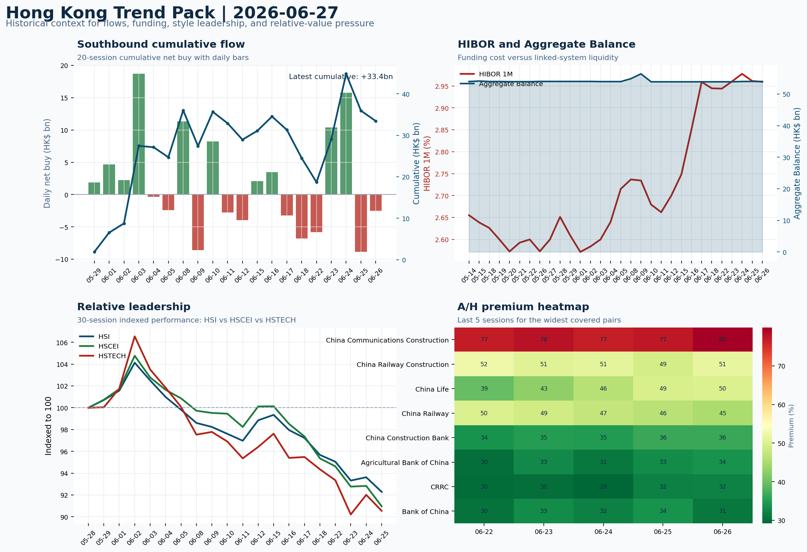

# Morning Research Workbench | 2026-06-28

> Designed for a Hong Kong sell-side commute: Layer 1 `Scan`, Layer 2 `Deep Read`, Layer 3 `Thinking`
> Mode: `Weekly Review` | Use Saturday's non-trading review date to synthesize the completed Hong Kong week and prepare next week's work plan.
> Briefing date: `2026-06-28` | Review date: `2026-06-27` | Global request: `2026-06-27` | HK/China request: `2026-06-26` | Market effective date: `2026-06-26` | Generated at: `2026-06-28 06:02:22`

## Executive Summary

- **Market pulse:** Hong Kong closed a risk-off week led by state-owned H-shares with HSTECH underperforming by 2pp, short-selling elevated at 18%, Southbound flow flipping negative on the final session.
- **Hong Kong lens:** Hong Kong growth / internet led. Monday's open faces a cautious backdrop: tech sentiment under pressure from US semiconductor weakness, short-selling elevated, and the latest southbound flow negative.
- **Top catalysts:** Risk-Off backdrop with USD softer, rates were not the dominant driver, and Gold outperformed Oil; CPI MoM (Released).

## Visual Dashboard

## Layer 1 | Weekly Scan (5-10 min)

### 1.1 One-Line Market Pulse
Hong Kong closed a risk-off week led by state-owned H-shares with HSTECH underperforming by 2pp, short-selling elevated at 18%, Southbound flow flipping negative on the final session, and Alibaba/Tencent/Meituan earnings next week as the primary micro catalyst to test whether growth leadership can recover or the defensive posture persists.

### 1.2 Global Asset Price Dashboard

| Asset | Last | 1D move | Read |
| --- | --- | --- | --- |
| S&P 500 | 7,357.49 | -0.01% | US large-cap risk appetite |
| Nasdaq 100 | 29,440.32 | +0.75% | Growth and duration leadership |
| Hang Seng Index | 23,076.91 | -1.43% | Hong Kong broad beta |
| Hang Seng TECH | 4.1800 | **-3.46%** | Hong Kong growth / platform read-through |
| CSI 300 | 4,941.60 | +0.21% | Mainland large-cap tone |
| US 10Y | 4.4510 | -0.27% | Global discount-rate anchor |
| China 10Y | 1.73% | -0.4bp | China local rates anchor \| Live public \| Eastmoney \| 2026-06-26 |
| CN-US 10Y spread | -264.9bp | +1.6bp | Relative carry and macro-pressure gauge \| Live public \| Eastmoney \| 2026-06-26 |
| DXY | 101.43 | -0.18% | Dollar liquidity impulse |
| USD/CNH | 6.7630 | +0.00% | Offshore China risk appetite |
| USD/HKD | 7.8396 | +0.01% | Linked-exchange regime stress check |
| Brent crude | 71.99 | **-4.34%** | Energy / geopolitics |
| COMEX gold | 4,078.70 | +1.20% | Hedge demand / real yields |
| Copper | 6.1415 | +1.17% | Global growth proxy |
| VIX | 18.89 | +1.40% | US stress barometer |

### 1.3 Hong Kong Weekly Tape Quick Check

| Check | Value | Status | Source / as of | Why it matters |
| --- | --- | --- | --- | --- |
| Main Board turnover vs 20D | 1.04x \| +4% vs 20D | Live local | HKEX \| 2026-06-26 | Trailing 20-session average turnover was HK$327.6bn. |
| Southbound / Northbound net flow | Southbound Net HK$-2.5bn \| turnover HK$127.9bn \| Northbound Turnover HK$413.1bn \| net not reported | Live local | HKEX Connect \| 2026-06-26 | Southbound net buy is calculated from HKEX disclosed buy and sell turnover. |
| Short-selling ratio | 18.00% | Live local | HKEX \| 2026-06-26 | Official HKEX stock-level short-selling table, aggregated as a share of total market turnover. |
| AH premium index | 29.62% | Live public | Yahoo \| 2026-06-26 | Simple average across 16 A/H pairs; use dispersion rather than the average alone. |
| USD/HKD spot vs band | 7.8396 \| band 7.7500 to 7.8500 | Live quote + local | Yahoo \| 2026-06-26 | Inside the linked-exchange band without immediate boundary stress. Official Convertibility Undertakings define the linked-rate stress boundaries for USD/HKD. |
| HIBOR 1M | 2.96% | Live local | HKMA \| 2026-06-26 | 1M HIBOR is the cleanest quick read for Hong Kong funding conditions and equity-duration pressure. |
| Aggregate Balance | HK$54.0bn | Live local | HKMA \| 2026-06-26 | Aggregate Balance helps frame whether linked-rate liquidity conditions are tight or comfortable. |
| Hong Kong leadership | Hong Kong growth / internet led | Proxy | HSI / HSCEI / HSTECH relative perf \| 2026-06-26 | Use HSI / HSCEI / HSTECH relative moves as the opening style read. |

### 1.4 Risk Dashboard
**Composite risk score:** `22.9/100` | **Regime:** `Risk-off`

| Component | Score impact | Evidence |
| --- | --- | --- |
| US beta | -0.1 | S&P 500 -0.01% |
| HK growth | -10 | HSTECH -3.46% |
| Offshore China proxy | -8 | FXI -2.10% |
| Dollar pressure | +1.8 | DXY -0.18% |
| Volatility | -2.8 | VIX +1.40% |
| HK short-selling | -8 | Short-selling ratio 18.00% |

### 1.5 Next Week Checklist
1. **Risk-Off backdrop with USD softer, rates were not the dominant driver, and Gold outperformed Oil**
 Still-moving markets | No fresh Hong Kong cash session is assumed; use global active assets and policy/event flow to prepare the next open.
2. **CPI MoM (Released)**
 Macro / policy | Rates expectations, the dollar, and growth-equity valuation | Industries: Technology, Internet, Brokers
3. **Trade Balance (Released)**
 Macro / policy | Watch whether it changes the day's core market narrative | Industries: Market-wide
4. **Retail Sales MoM (Upcoming)**
 Macro / policy | Consumer resilience, growth expectations, and risk-asset pricing | Industries: Consumer, E-commerce, Consumer discretionary
5. **Loan Prime Rate (Upcoming)**
 Macro / policy | Watch whether it changes the day's core market narrative | Industries: Market-wide

## Layer 2 | Deep Read (20-30 min)

### 2.1 Weekly Cross-Asset Review
> Weekly review mode: synthesize the completed Hong Kong week, retain the main cross-asset and policy lessons, and convert them into next-week preparation rather than treating Saturday as a fresh cash-market session.

#### Market Setup
**Core tape.** Hong Kong equities closed a risk-off week with HSI -1.43%, HSCEI -2.02%, and HSTECH -3.46%, underperforming both the S&P 500 (-0.01%) and Euro Stoxx 50 (+0.85%).
**Main driver.** Leadership rotated toward state-owned H-shares rather than growth or internet names, while elevated short-selling at 18% argues for extra confirmation before chasing rebounds.
**HK relevance.** The USD composite softened (DXY -0.18%) alongside WTI crude (-3.74%), with gold outperforming oil by 3.935% - a cross-asset spread consistent with defensive positioning rather than cyclical recovery.

#### Key Drivers
- Fed hawkishness resurfacing (Kashkari rate-hike mention, Goolsbee inflation caution) narrows near-term PBOC easing optionality and keeps.
- Tech slump in semiconductors and memory spreads through AI value chain, with HK-listed SMIC and Hua Hong likely to track US sector weakness.
- HK leadership rotation to state-owned/old-economy H-shares signals defensive positioning rather than growth rerating, confirmed by HSI.
- Elevated short-selling ratio of 18% argues for cleaner breadth confirmation before adding risk.

#### Hong Kong Read-Through
**Desk lens.** State-owned / old-economy H-shares led.
**Opening implication.** Monday's open faces a cautious backdrop: tech sentiment under pressure from US semiconductor weakness, short-selling elevated.
- **Cross-market read:** Hang Seng -1.43% / HSCEI -2.02% / HSTECH -3.46%.
- **Cross-market read:** Offshore China proxy FXI -2.10% and USD/CNH +0.00% frame cross-border risk appetite.
- **Cross-market read:** USD/HKD last traded around 7.8396, which keeps the Hong Kong funding lens in focus.

#### Watch Points
- USD composite moved lower by -0.22pct intraday, with a 0.239pct range.
- Main turning points appeared around 2026-06-26 08:10 trough / 2026-06-26 08:30 peak / 2026-06-26 08:45 trough, suggesting event-driven repricing.
- The biggest cross-asset divergence was Gold versus Oil, a spread of 3.935pct.
- Gold moved +1.99pct intraday with a 2.341pct high-low range.

#### Weekly Review Map
- Weekly review window: 2026-06-22 to 2026-06-26. Core regime: Risk-Off backdrop with USD softer, rates were not the dominant driver, and Gold outperformed Oil. Hong Kong leadership: State-owned / old-economy H-shares led.
- Method note: Trend summary uses the latest available five observations from the Hong Kong Trend Pack inputs.

**Cross-asset weekly dashboard**

| Asset | Latest move | Weekly read |
| --- | --- | --- |
| S&P 500 | -0.01% | Risk appetite |
| Nasdaq 100 | +0.75% | Growth style |
| Hang Seng Index | -1.43% | Hong Kong beta |
| Hang Seng TECH | -3.46% | Hong Kong growth / internet tone |
| DXY | -0.18% | Global liquidity |
| US 10Y | -0.27% | Rates path |
| Gold | +1.20% | Hedge / real yields |
| VIX | +1.40% | Volatility and hedging |

**Hong Kong / China weekly tape**

| Signal | Latest move | Read |
| --- | --- | --- |
| Hang Seng Index | -1.43% | Hong Kong beta |
| HSCEI | -2.02% | China SOE / H-share tone |
| Hang Seng TECH | -3.46% | Hong Kong growth / internet tone |
| China proxy (FXI) | -2.10% | China sentiment |
| USD/CNH | +0.00% | China FX sentiment |
| USD/HKD | +0.01% | Hong Kong funding lens |

**Five-session trend evidence**
_Window: 2026-06-18 to 2026-06-26_

| Signal | Five-session change | Latest | Desk read |
| --- | --- | --- | --- |
| Southbound flow | +8.9bn over 5 sessions | -2.5bn | 2/5 positive sessions; cumulative buying is the flow-confirmation test for next week. |
| HKD funding | HIBOR +2bp; Aggregate Balance +0.1bn | 2.96% / HK$54.0bn | Funding stress matters if HIBOR rises while Aggregate Balance contracts. |
| HK style leadership | HSI led (-3.4pp); HSCEI lagged (-4.4pp) | HSI leadership | Use HSI / HSCEI / HSTECH spread to separate broad beta from growth-led rerating. |
| A/H premium dispersion | +2.1pp average change | 45.0% average premium | Premium narrowing can support H-share relative demand |

**Flow and attribution clues**
- :
- :

**Next-week desk questions**
- Did Southbound flow confirm the index move, or was the week mainly offshore beta without local money follow-through?
- Did HIBOR and Aggregate Balance point to benign funding, or should tighter HKD liquidity be part of next week's risk case?
- Was leadership broad enough beyond HSTECH / platform beta, or was the week concentrated in a narrow style pocket?
- Which dated macro, policy, earnings, or IPO catalyst can realistically change the next-week narrative?
- What single data point would invalidate the base-case market pulse by Monday or Tuesday morning?

**Key developments to retain**

| Bucket | Item | Why it matters |
| --- | --- | --- |
| B | Tech Slump Deepens | Assess whether the story can propagate through the Semiconductors and AI value chain |
| C | Tech Equity Sales Renew AI Debt-Binge Worries | Assess whether the story can propagate through the Semiconductors and AI value chain |
| Released | CPI MoM | Rates expectations, the dollar, and growth-equity valuation |
| Released | Trade Balance | Watch whether it changes the day's core market narrative |
| Upcoming | Retail Sales MoM | Consumer resilience, growth expectations, and risk-asset pricing |

**Next-week playbook**

| Date | Catalyst | Desk read |
| --- | --- | --- |
| 2026-06-28 | Alibaba: Cloud demand and GMV updates | Key read-through for China consumption, cloud, and platform regulation |
| 2026-06-28 | Meituan: Order trends and margin commentary | High-frequency read on local services demand and platform competition |
| 2026-06-28 | Tencent: Game grossing trends and ad-demand checks | Core offshore China platform proxy for gaming, ads, and AI monetization |
| 2026-06-28 | HKEX: Turnover data and IPO pipeline updates | Direct proxy for Hong Kong market turnover, listings, and southbound interest |
| 2026-06-28 | BYD Company: Weekly sales data and model rollout cadence | Hong Kong-listed proxy for EV volumes, export mix, and price competition |
| 2026-06-28 | AIA: NBV trends and agency momentum | Read-through for wealth demand, mainland visitor activity, and HK financial sentiment |
| 2026-06-28 | China Mobile: Capex updates and dividend policy signals | Defensive SOE benchmark for yield trade and domestic digital-infrastructure spend |
| 2026-06-28 | Hang Seng TECH ETF: AI narrative shifts and China platform | Fast proxy for Hong Kong internet and growth leadership |

**Curated overnight stories**
1. **Minneapolis Fed's Kashkari expects a rate hike this year**
 Why it matters: Fed hawkish repricing contradicts earlier dovish expectations. Kashkari's explicit rate-hike mention and Goolsbee's inflation caution suggest the committee is not ready.
 HK read-through: Higher-for-longer US rates pressure HK-listed growth and tech names through USD strength carry dynamics.
2. **Tech Slump Deepens; semiconductors and memory pricing concerns spread through AI value**
 Why it matters: Continued tech equity weakness, particularly in semiconductors, signals investors are rotating out of high-valuation AI-adjacent names.
 HK read-through: Direct read-through to Hong Kong semiconductor and AI-linked names (e.g., SMIC, Hua Hong). HK tech sector sentiment already under pressure.
3. **SpaceX to join Nasdaq-100 in fast-tracked process, driving massive ETF buying demand**
 Why it matters: Index inclusion will force passive rebalancing across global ETFs. While SpaceX is US-listed, the reallocation effect may redirect institutional flows away from existing.
 HK read-through: Indirect: if US tech rebalancing accelerates, some HK tech names could see relative flow improvement as a secondary effect, but near-term the dominant signal is tech sector.
4. **OpenAI reportedly delaying IPO; Jeremy Grantham calls current US equities 'most**
 Why it matters: Both stories reinforce the view that high-valuation tech and AI-adjacent stories face skepticism from seasoned investors.
 HK read-through: Adds bearish seasoning to HK tech sentiment. Investors watching AI monetization timelines may increase discount rates applied to HK-listed internet and AI platform names.
5. **Risk-Off theme confirmed: USD softer, Gold outperformed Oil through the week**
 Why it matters: The macro backdrop described in the must-watch section - USD weakness alongside commodity divergence - confirms defensive positioning.
 HK read-through: USD softness is marginally constructive for HK dollar assets and offshore-China. Gold strength supports commodity-linked HK names (mining, materials).

### 2.2 Hong Kong / A-share Weekly Review
> Weekly review mode: synthesize the completed Hong Kong week, retain the main cross-asset and policy lessons, and convert them into next-week preparation rather than treating Saturday as a fresh cash-market session.

#### Local Tape Setup
**Local read.** Hong Kong closed a risk-off week with HSI -1.43%, HSCEI -2.02%, and HSTECH -3.46%, underperforming both the S&P 500 (-0.01%) and Euro Stoxx 50 (+0.85%).
**Verification point.** Leadership rotated toward state-owned H-shares rather than growth or internet names - the HSI/HSCEI spread of +0.59pp and HSI/HSTECH spread of +2.03pp confirm defensive positioning without growth rerating.
**Risk to watch.** Southbound flow turned negative on the last session (-HK$2.5bn) after cumulative weekly inflow of +HK$8.9bn, leaving the flow-confirmation test open for next week.

#### Style and Local Leadership
**Style leadership.** Hong Kong growth / internet led.
- **Cross-market read:** Hang Seng -1.43% / HSCEI -2.02% / HSTECH -3.46%.
- **Cross-market read:** Offshore China proxy FXI -2.10% and USD/CNH +0.00% frame cross-border risk appetite.
- **Cross-market read:** USD/HKD last traded around 7.8396, which keeps the Hong Kong funding lens in focus.

#### Flow Confirmation
Official Stock Connect evidence is available; use Section 2.3 to confirm whether local money supports the price action.

#### Follow-Through Checklist
**Follow-through check.** Watch whether Alibaba or Tencent earnings provide a catalyst for HSTECH and FXI to lead rather than lag HSI, and whether Southbound flow flips positive on Monday to confirm the weekly cumulative inflow holds.

### 2.3 Flow Tracker and Attribution
#### Cross-Asset Attribution v1

| Driver | Direction | Score | Evidence | HK implication |
| --- | --- | --- | --- | --- |
| Oil and geopolitics | supportive | 3.47 | Oil moved -4.34%. | Split the read between energy/cyclicals support and margin/geopolitical pressure. |
| Short-selling pressure | drag | 2.1 | HKEX short-selling ratio was 18.00%. | Elevated short activity argues for extra confirmation before chasing rebounds. |

#### Flow Tracker
##### Flow Takeaways
- Short-selling pressure is elevated, so local rebounds need cleaner breadth and flow confirmation.
- Stock Connect Southbound: net HK$-2.5bn on turnover HK$127.9bn (as of 2026-06-26).
- Stock Connect Northbound: turnover RMB413.1bn; public file provides total turnover/top active names, not full net-buy.
- AH premium: simple covered-pair average +29.62%; widest premium: China Communications Construction 79.95%.

##### Stock Connect Southbound Active Names

| Rank | Ticker | Name | Buy | Sell | Net buy |
| --- | --- | --- | --- | --- | --- |
| 6 | 01888.HK | KB LAMINATES | HK$3,940.5mn | HK$1,633.7mn | HK$2,306.8mn |
| 2 | 09988.HK | BABA-W | HK$2,710.2mn | HK$4,979.5mn | HK$-2,269.3mn |
| 3 | 06869.HK | YOFC | HK$4,122.6mn | HK$2,881.5mn | HK$1,241.2mn |
| 8 | 02513.HK | KNOWLEDGE ATLAS | HK$1,911.4mn | HK$1,423.9mn | HK$487.5mn |
| 4 | 00700.HK | TENCENT | HK$2,809.7mn | HK$3,151.0mn | HK$-341.3mn |

##### AH Premium Dispersion

| Name | A ticker | H ticker | Premium | As of |
| --- | --- | --- | --- | --- |
| China Communications Construction | 601800.SS | 1800.HK | +79.95% | 2026-06-26 |
| China Railway Construction | 601186.SS | 1186.HK | +51.41% | 2026-06-26 |
| China Life | 601628.SS | 2628.HK | +49.94% | 2026-06-26 |
| China Railway | 601390.SS | 0390.HK | +45.11% | 2026-06-26 |
| China Construction Bank | 601939.SS | 0939.HK | +36.39% | 2026-06-26 |

##### HKEX Short-Selling Watch

| Ticker | Name | Short ratio | Short turnover | Total turnover |
| --- | --- | --- | --- | --- |
| 00388.HK | HKEX | 15.97% | HK$0.4bn | HK$2.3bn |
| 00700.HK | TENCENT | 6.08% | HK$0.8bn | HK$13.2bn |
| 00941.HK | CHINA MOBILE | 12.16% | HK$0.2bn | HK$1.5bn |
| 01211.HK | BYD COMPANY | 21.48% | HK$0.5bn | HK$2.4bn |
| 01299.HK | AIA | 23.47% | HK$0.7bn | HK$3.1bn |

- **Short-value leaders:** 07709.HK XL2CSOPHYNIX (HK$9.7bn); 02800.HK TRACKER FUND (HK$3.6bn); 00981.HK SMIC (HK$1.9bn); 02828.HK HSCEI ETF (HK$1.8bn).

### 2.4 Macro and Policy Tracking
**Desk read.** Use the calendar table and released data below as the primary macro read.

| Time | Region | Event | Status | Desk read |
| --- | --- | --- | --- | --- |
| 20:30 | US | CPI MoM | Released | Impact: Rates expectations, the dollar, and growth-equity valuation \| Attention: 5/5 \| Industries: Technology, Internet, Brokers |
| 09:30 | China | Trade Balance | Released | Impact: Watch whether it changes the day's core market narrative \| Attention: 3/5 \| Industries: Market-wide |
| 20:30 | US | Retail Sales MoM | Upcoming | Impact: Consumer resilience, growth expectations, and risk-asset pricing \| Attention: 5/5 \| Industries: Consumer, E-commerce, Consumer discretionary |
| 09:20 | China | Loan Prime Rate | Upcoming | Impact: Watch whether it changes the day's core market narrative \| Attention: 3/5 \| Industries: Market-wide |
| 22:00 | Federal Reserve | Jerome Powell: Economic outlook remarks | Central bank | Impact: Policy path, liquidity conditions, and cross-asset risk appetite \| Attention: 5/5 \| Industries: Technology, Financials, Gold |
| 10:00 | PBOC | Open Market Operations Desk: Daily liquidity operation window | Central bank | Impact: Policy path, liquidity conditions, and cross-asset risk appetite \| Attention: 3/5 \| Industries: Technology, Financials, Gold |

#### Positioning and Risk Backdrop
- Options activity centered on KWEB Call, with Vol/OI at 1.88x and a bullish bias.
- Put/Call structure shows equity 0.68 / index 1.15, implying Single-stock optimism with index hedging.
- Geopolitics: Middle East | Regional tension remains elevated | Impact: Oil, freight costs, and safe-haven demand
- Geopolitics: US-China | Technology export-control rhetoric remains active | Impact: China internet, semiconductors, and supply chains

### 2.5 Key Company and Sector Events

| Grade | Sector | Headline | Why it matters | Horizon |
| --- | --- | --- | --- | --- |
| B | Semiconductors and AI | Tech Slump Deepens | Assess whether the story can propagate through the Semiconductors and AI | Monitor |

#### HKEX Announcements

| Grade | Ticker | Type | Release time | Title |
| --- | --- | --- | --- | --- |
| A | 00022.HK | Profit warning | 2026-06-26 | Profit warning / alert announcement |
| A | 00269.HK | Profit warning | 2026-06-26 | Profit warning / alert announcement |
| A | 00558.HK | Profit warning | 2026-06-26 | Profit warning / alert announcement |
| A | 01162.HK | Profit warning | 2026-06-26 | Profit warning / alert announcement |
| A | 01260.HK | Profit warning | 2026-06-26 | Profit warning / alert announcement |
| A | 01315.HK | Profit warning | 2026-06-26 | Profit warning / alert announcement |
| A | 01348.HK | Profit warning | 2026-06-26 | Profit warning / alert announcement |
| A | 01867.HK | Profit warning | 2026-06-26 | Profit warning / alert announcement |

#### Earnings / Results Watch

| Ticker | Company | Timing | Expectation framing |
| --- | --- | --- | --- |
| 0700.HK | Tencent Holdings | After Market Close | EPS est. 4.15 HKD \| revenue est. 163.2bn HKD |
| 0388.HK | Hong Kong Exchanges and Clearing | Before Market Open | EPS est. 2.81 HKD \| revenue est. 6.0bn HKD |

#### Rating Changes
- **9988.HK** | Morgan Stanley | Upgrade | Equal Weight -> Overweight | PT 92 -> 105

#### IPO Watch
- IPO and grey-market monitoring is not yet part of the standard production pack.

### 2.6 Today's Core Names
#### Core coverage

| Name | Ticker | Last | 1D | Range position | Morning note |
| --- | --- | --- | --- | --- | --- |
| Alibaba | 9988.HK | 89.50 | -5.79% | Bottom of range | Short-term pressure is visible; check for a fundamental or regulatory reason. |
| Meituan | 3690.HK | 64.25 | -2.80% | Bottom of range | Short-term pressure is visible; check for a fundamental or regulatory reason. |

**Recent headlines for Alibaba:**
- [Here's How Trump's Tariffs Could Impact Alibaba Stock](https://www.fool.com/investing/2026/06/26/heres-how-trumps-tariffs-could-impact-alibaba-stoc/) (Motley Fool)
**Recent headlines for Meituan:**
- [Forget FXI. The South Korea Fund Beating China's AI Trade Charges 19% Less](https://247wallst.com/investing/2026/06/25/forget-fxi-the-south-korea-fund-beating-chinas-ai-trade-charges-19-less/) (24/7 Wall St.)

#### Priority follow-up

| Name | Ticker | Last | 1D | Range position | Morning note |
| --- | --- | --- | --- | --- | --- |
| BYD Company | 1211.HK | 72.65 | -4.47% | Bottom of range | Short-term pressure is visible; check for a fundamental or regulatory reason. |
| AIA | 1299.HK | 70.80 | -1.94% | Bottom of range | The name sits near the bottom of its recent range and is worth monitoring for a catalyst-led reversal. |

**Recent headlines for BYD Company:**
- [BYD (SEHK:1211) Wants To Beat Toyota And Lead Global Auto Sales By 2030](https://finance.yahoo.com/markets/stocks/articles/byd-sehk-1211-wants-beat-100658295.html) (Simply Wall St.)

## Layer 3 | Thinking (10-15 min)

### 3.1 Rotating Theme Deep Dive

| Field | Read |
| --- | --- |
| Theme | AI and Compute Chain |
| Angle for the day | Track whether global AI capex, semis, cloud, and server demand are still carrying offshore China internet and hardware sentiment. |

**Theme desk read**
**Core thesis.** The AI and Compute Chain theme continues to weigh on Hong Kong listings as global tech sentiment deteriorated further this week.
**Evidence.** Alibaba (9988.HK, -5.79% daily) and Tencent (0700.HK, -2.28%) both reached the bottom of their ranges on Friday, reflecting the broader risk-off backdrop where WTI declined 3.74% and VIX rose 1.40%.
**What to test.** The released US CPI reading (0.3% MoM vs. 0.2% forecast) may keep rate-sensitivity elevated, while the China trade balance beat (USD85.2bn vs. USD79bn) provides only a partial offset.

**Signals to keep in mind**
- Tech Slump Deepens: Assess whether the story can propagate through the Semiconductors and AI value chain
- Tech Equity Sales Renew AI Debt-Binge Worries: Assess whether the story can propagate through the Semiconductors and AI value chain
- WTI crude -3.74%: Softer oil argues for a more cautious cyclical-growth read.
- VIX +1.40%: Keep tracking it to confirm whether the core daily narrative is holding.

**LLM watch items:**
- Alibaba cloud demand/GMV update (Jun 28) - verify if actual demand signals align with global AI capex concerns.
- Tencent game grossing and ad-demand checks - assess whether revenue trends hold up against consumer-discretionary headwinds.
- Southbound flow direction early next week - check if net buying returns to HSTECH names or continues to favour old-economy H-shares.
- VIX and WTI moves into Monday - confirm whether the risk-off regime persists or begins to fade.
- A/H premium dispersion (currently 45.0%) - monitor if narrowing resumes, potentially supporting H-share relative demand.

**Related names to keep close:**

| Name | Ticker | Bucket | Morning read |
| --- | --- | --- | --- |
| Alibaba | 9988.HK | Core coverage | Short-term pressure is visible; check for a fundamental or regulatory reason. |
| Tencent | 0700.HK | Core coverage | Short-term pressure is visible; check for a fundamental or regulatory reason. |
| AIA | 1299.HK | Priority follow-up | The name sits near the bottom of its recent range and is worth monitoring for a catalyst-led reversal. |

**Upcoming catalysts tied to the theme:**
- 2026-06-28 | Alibaba: Cloud demand and GMV updates | Key read-through for China consumption, cloud, and platform regulation
- 2026-06-28 | Tencent: Game grossing trends and ad-demand checks | Core offshore China platform proxy for gaming, ads, and AI monetization
- 2026-06-28 | AIA: NBV trends and agency momentum | Read-through for wealth demand, mainland visitor activity, and HK financial sentiment
- 2026-06-28 | Hang Seng TECH ETF: AI narrative shifts and China platform regulation headlines | Fast proxy for Hong Kong internet and growth leadership

**Relevant headlines:**
- [Tech Slump Deepens](https://www.bloomberg.com/news/videos/2026-06-27/tech-slump-deepens-video)
- [Tech Equity Sales Renew AI Debt-Binge Worries](https://www.bloomberg.com/news/articles/2026-06-27/tech-equity-sales-renew-ai-debt-binge-worries-credit-weekly)

### 3.2 Next Week Calendar and Reopen Prep
- Non-trading review: use today's calendar to prepare the next Hong Kong open rather than treating the last cash tape as a fresh signal.
- Macro: CPI MoM is the first item to anchor the open and the rates/FX response.
- Corporate / event: Alibaba: Cloud demand and GMV updates is the cleanest same-day catalyst to prepare for.

**Same-day macro docket**

| Time | Country | Event | Status | Detail |
| --- | --- | --- | --- | --- |
| 20:30 | US | CPI MoM | Released | Actual 0.3% / Forecast 0.2% / Prior 0.4% |
| 09:30 | China | Trade Balance | Released | Actual USD 85.2bn / Forecast USD 79.0bn / Prior USD 80.6bn |
| 20:30 | US | Retail Sales MoM | Upcoming | Forecast 0.3% / Prior 0.6% |
| 09:20 | China | Loan Prime Rate | Upcoming | Forecast 3.45% / Prior 3.45% |
| 22:00 | Federal Reserve | Jerome Powell: Economic outlook remarks | Central bank | speech |

**Same-day catalyst list**

| Date | Time | Category | Event | Importance |
| --- | --- | --- | --- | --- |
| 2026-06-28 | | Core coverage | Alibaba: Cloud demand and GMV updates | 3 |
| 2026-06-28 | | Core coverage | Meituan: Order trends and margin commentary | 3 |
| 2026-06-28 | | Core coverage | Tencent: Game grossing trends and ad-demand checks | 3 |
| 2026-06-28 | | Core coverage | HKEX: Turnover data and IPO pipeline updates | 3 |

**Next few sessions**

| Date | Category | Event | Impact |
| --- | --- | --- | --- |
| 2026-06-28 | Core coverage | Alibaba: Cloud demand and GMV updates | Key read-through for China consumption, cloud, and platform regulation |
| 2026-06-28 | Core coverage | Meituan: Order trends and margin commentary | High-frequency read on local services demand and platform competition |
| 2026-06-28 | Core coverage | Tencent: Game grossing trends and ad-demand checks | Core offshore China platform proxy for gaming, ads, and AI monetization |
| 2026-06-28 | Core coverage | HKEX: Turnover data and IPO pipeline updates | Direct proxy for Hong Kong market turnover, listings, and southbound |

### 3.3 Daily One Chart
**Daily One Chart | HKEX short-selling pressure map**

**Chart read.** Market short-selling reached 18.00% of turnover.
**Why it matters.** The chart leads today because the pressure is either broad, concentrated, or acute in the top name.

_Source: HKEX Daily Quotations - Short Selling Turnover_

### 3.4 Hong Kong Trend Pack
**Hong Kong Trend Pack**

**Trend read.** Four historical lenses: Southbound cumulative flow, HKMA funding and liquidity, HSI/HSCEI/HSTECH relative leadership, and A/H premium dispersion.

_Source: HKEX Stock Connect, HKMA liquidity data, and public Yahoo Finance quotes_

## Traceable Appendix

### Report Metadata
> Date policy: Review date 2026-06-27 is treated as `Weekly Review`. | Global request date is 2026-06-27; adapter effective date is 2026-06-26 and summary date is 2026-06-26. | HK/China local data date is 2026-06-26; role: last completed HK/China cash-market reference tape.
> Market data quality: Coverage: `31/32` | Stale items (>1d): `7` | Missing: `1`
> Report quality: `85.3/100` | Grade `B` | Status `production ready`

### Key Questions to Keep in Mind
- Is risk appetite rising or fading? The overnight tape reads closer to `Risk-Off`.
- Did rates expectations move? Focus on whether US 10Y, DXY, and growth style moved together.
- Were commodities the real story? Watch WTI and gold for geopolitics versus inflation signals.
- Is Hong Kong setup internet-led, SOE-led, or broad beta-led? Compare HSTECH, HSCEI, and HSI.
- Did offshore markets move China risk appetite? Focus on HSI, FXI, USD/CNH, and USD/HKD.

### Report Quality and Validation
- **Quality score:** 85.3/100 | **Grade:** B | **Status:** production ready
- **Run summary:** 7 healthy | 1 caveat | 0 failed
- **Release recommendation:** Send with caveats | The report is usable, but the advisory guidance should travel with it so readers understand the data gaps.

| Source | Status | Bucket |
| --- | --- | --- |
| Market data | ok | healthy |
| Sector and company news | ok | healthy |
| Movers and short selling | ok | healthy |
| Stock Connect | ok | healthy |
| A/H premium | ok | healthy |
| Hong Kong local package | ok | healthy |
| China rates | ok | healthy |
| Narrative overlay | partial | caveat |

**Desk-use guidance summary:** 0 blocking | 1 advisory

**Desk-use guidance**
- **Advisory:** Use deterministic sections as primary support; the narrative overlay was partial or unavailable on this run.

| Component | Score | Weight | Read |
| --- | --- | --- | --- |
| Market data coverage | 96.9 | 0.3 | 31/32 core market fields available. |
| Hong Kong local metrics | 82.3 | 0.25 | 8 live, 3 proxy, 0 unavailable local checks. |
| Key public adapters | 100.0 | 0.2 | 4/4 key adapters were available or partially available. |
| Narrative overlay health | 37.1 | 0.15 | 1/7 narrative overlay tasks succeeded or used validated cache; 2 error(s). |
| Fact-check guardrail | 100.0 | 0.1 | Checked 4 numeric claims; 0 numeric mismatch(es), 0 logic warning(s); 0 critical, 0 review. |

**Quality warnings**
- Narrative overlay health is weak: 1/7 narrative overlay tasks succeeded or used validated cache; 2 error(s).

**Narrative fact-check guardrail**
- Checked 4 numeric claims; 0 numeric mismatch(es), 0 logic warning(s); 0 critical, 0 review.

**Adapter status**

| Adapter | Status |
| --- | --- |
| Stock Connect | ok |
| A/H premium | ok |
| HKEX announcements | ok |
| China rates | ok |

### Source Links
- [Tech Slump Deepens](https://www.bloomberg.com/news/videos/2026-06-27/tech-slump-deepens-video) (bloomberg_markets)
- [Here's How Trump's Tariffs Could Impact Alibaba Stock](https://www.fool.com/investing/2026/06/26/heres-how-trumps-tariffs-could-impact-alibaba-stoc/) (Motley Fool)
- [Forget FXI. The South Korea Fund Beating China's AI Trade Charges 19% Less](https://247wallst.com/investing/2026/06/25/forget-fxi-the-south-korea-fund-beating-chinas-ai-trade-charges-19-less/) (24/7 Wall St.)
- [Tencent (SEHK:700) Stock Draws Fresh Price Target Split After Earnings And AI Spend](https://finance.yahoo.com/markets/stocks/articles/tencent-sehk-700-stock-draws-101028269.html) (Simply Wall St.)
- [BYD (SEHK:1211) Wants To Beat Toyota And Lead Global Auto Sales By 2030](https://finance.yahoo.com/markets/stocks/articles/byd-sehk-1211-wants-beat-100658295.html) (Simply Wall St.)
- [00022.HK Profit warning / alert announcement](http://www1.hkexnews.hk/listedco/listconews/sehk/2026/0626/2026062602815.pdf) (HKEXnews)
- [00269.HK Profit warning / alert announcement](http://www1.hkexnews.hk/listedco/listconews/sehk/2026/0626/2026062600612.pdf) (HKEXnews)
- [00558.HK Profit warning / alert announcement](http://www1.hkexnews.hk/listedco/listconews/sehk/2026/0626/2026062602051.pdf) (HKEXnews)
- [01162.HK Profit warning / alert announcement](http://www1.hkexnews.hk/listedco/listconews/sehk/2026/0626/2026062600755.pdf) (HKEXnews)
- [01260.HK Profit warning / alert announcement](http://www1.hkexnews.hk/listedco/listconews/sehk/2026/0626/2026062602703.pdf) (HKEXnews)
- [01315.HK Profit warning / alert announcement](http://www1.hkexnews.hk/listedco/listconews/sehk/2026/0626/2026062600968.pdf) (HKEXnews)
- [01348.HK Profit warning / alert announcement](http://www1.hkexnews.hk/listedco/listconews/sehk/2026/0626/2026062602577.pdf) (HKEXnews)
- [01867.HK Profit warning / alert announcement](http://www1.hkexnews.hk/listedco/listconews/sehk/2026/0626/2026062602903.pdf) (HKEXnews)

## Supplementary Visual Appendix

This appendix is professional-path only. It keeps a traceable index of the report visuals and the deterministic chart cues used to frame the morning note, without injecting the legacy intraday chart pack.

### Visual Index

| Visual | Path | Role |
| --- | --- | --- |
| Visual Dashboard | `charts/dashboard_2026-06-28.png` | Cross-asset regime board and Hong Kong local tape snapshot. |
| Daily One Chart | `charts/daily_one_chart_2026-06-28.png` | Single highest-conviction visual story for the day. |
| Hong Kong Trend Pack | `charts/hk_trend_pack_2026-06-28.png` | Historical context for flows, liquidity, leadership, and A/H dispersion. |

### Deterministic Chart Cues
- FX / liquidity: USD composite moved lower by -0.22pct intraday, with a 0.239pct range.
- FX / liquidity: Main turning points appeared around 2026-06-26 08:10 trough / 2026-06-26 08:30 peak / 2026-06-26 08:45 trough, suggesting event-driven repricing rather than a clean one-way USD move.
- Cross-asset: The biggest cross-asset divergence was Gold versus Oil, a spread of 3.935pct.
- Cross-asset: Gold moved +1.99pct intraday with a 2.341pct high-low range.
- Cross-asset: Oil moved -1.94pct intraday with a 3.244pct high-low range.
- Cross-asset: Bitcoin moved +0.46pct intraday with a 3.74pct high-low range.

### Risk Dashboard Components

| Component | Score impact | Evidence |
| --- | --- | --- |
| US beta | -0.1 | S&P 500 -0.01% |
| HK growth | -10 | HSTECH -3.46% |
| Offshore China proxy | -8 | FXI -2.10% |
| Dollar pressure | +1.8 | DXY -0.18% |
| Volatility | -2.8 | VIX +1.40% |
| HK short-selling | -8 | Short-selling ratio 18.00% |
