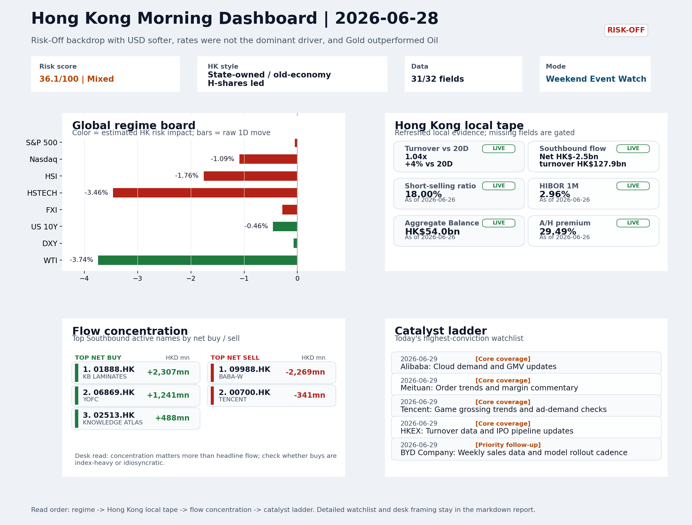
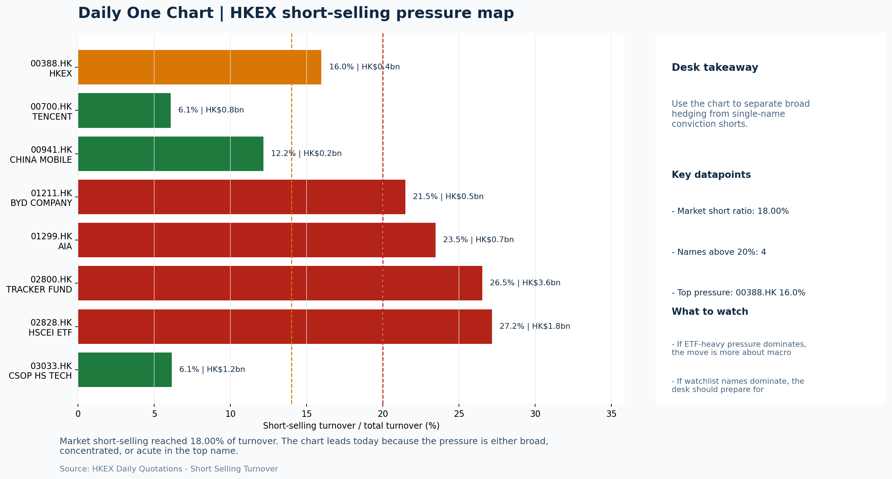

# Morning Research Workbench | 2026-06-29

> Designed for a Hong Kong sell-side commute: Layer 1 `Scan`, Layer 2 `Deep Read`, Layer 3 `Thinking`
> Mode: `Weekend Event Watch` | Track weekend policy, geopolitics, still-moving assets, and Monday open preparation rather than replaying stale cash-market tape.
> Briefing date: `2026-06-29` | Review date: `2026-06-28` | Global request: `2026-06-28` | HK/China request: `2026-06-26` | Market effective date: `2026-06-26` | Generated at: `2026-06-29 06:01:50`

## Executive Summary

- **Market pulse:** Risk-off backdrop with gold outperforming oil and a hot US CPI print sets a cautious weekend tone for Hong Kong's Monday open, though the China Trade Balance beat and AI data-center.
- **Hong Kong lens:** Hong Kong growth / internet led. Monday's open is set to be cautious with HSTECH under pressure from US growth-style softness, but the data-center demand story may cushion select names.
- **Top catalysts:** Risk-Off backdrop with USD softer, rates were not the dominant driver, and Gold outperformed Oil; CPI MoM (Released).

## Visual Dashboard

## Layer 1 | Reset (5-10 min)

### 1.1 One-Line Market Pulse
Risk-off backdrop with gold outperforming oil and a hot US CPI print sets a cautious weekend tone for Hong Kong's Monday open, though the China Trade Balance beat and AI data-center narrative offer selective counterweights.

### 1.2 Global Asset Price Dashboard

| Asset | Last | 1D move | Read |
| --- | --- | --- | --- |
| S&P 500 | 7,354.02 | -0.05% | US large-cap risk appetite |
| Nasdaq 100 | 29,118.24 | -1.09% | Growth and duration leadership |
| Hang Seng Index | 22,671.86 | **-1.76%** | Hong Kong broad beta |
| Hang Seng TECH | 4.1800 | **-3.46%** | Hong Kong growth / platform read-through |
| CSI 300 | 4,868.22 | **-3.03%** | Mainland large-cap tone |
| US 10Y | 4.3720 | -0.46% | Global discount-rate anchor |
| China 10Y | 1.73% | -0.4bp | China local rates anchor \| Live public \| Eastmoney \| 2026-06-26 |
| CN-US 10Y spread | -264.9bp | +1.6bp | Relative carry and macro-pressure gauge \| Live public \| Eastmoney \| 2026-06-26 |
| DXY | 101.36 | -0.07% | Dollar liquidity impulse |
| USD/CNH | 6.7630 | +0.00% | Offshore China risk appetite |
| USD/HKD | 7.8396 | +0.01% | Linked-exchange regime stress check |
| Brent crude | 71.99 | **-4.34%** | Energy / geopolitics |
| COMEX gold | 4,078.70 | +1.20% | Hedge demand / real yields |
| Copper | 6.1415 | +1.17% | Global growth proxy |
| VIX | 18.41 | **-2.54%** | US stress barometer |

### 1.3 Hong Kong Last Cash-Tape Quick Check (Reference)

| Check | Value | Status | Source / as of | Why it matters |
| --- | --- | --- | --- | --- |
| Main Board turnover vs 20D | 1.04x \| +4% vs 20D | Live local | HKEX \| 2026-06-26 | Trailing 20-session average turnover was HK$327.6bn. |
| Southbound / Northbound net flow | Southbound Net HK$-2.5bn \| turnover HK$127.9bn \| Northbound Turnover HK$413.1bn \| net not reported | Live local | HKEX Connect \| 2026-06-26 | Southbound net buy is calculated from HKEX disclosed buy and sell turnover. |
| Short-selling ratio | 18.00% | Live local | HKEX \| 2026-06-26 | Official HKEX stock-level short-selling table, aggregated as a share of total market turnover. |
| AH premium index | 29.49% | Live public | Yahoo \| 2026-06-26 | Simple average across 18 A/H pairs; use dispersion rather than the average alone. |
| USD/HKD spot vs band | 7.8396 \| band 7.7500 to 7.8500 | Live quote + local | Yahoo \| 2026-06-26 | Inside the linked-exchange band without immediate boundary stress. Official Convertibility Undertakings define the linked-rate stress boundaries for USD/HKD. |
| HIBOR 1M | 2.96% | Live local | HKMA \| 2026-06-26 | 1M HIBOR is the cleanest quick read for Hong Kong funding conditions and equity-duration pressure. |
| Aggregate Balance | HK$54.0bn | Live local | HKMA \| 2026-06-26 | Aggregate Balance helps frame whether linked-rate liquidity conditions are tight or comfortable. |
| Hong Kong leadership | Hong Kong growth / internet led | Proxy | HSI / HSCEI / HSTECH relative perf \| 2026-06-26 | Use HSI / HSCEI / HSTECH relative moves as the opening style read. |

### 1.4 Risk Dashboard
**Composite risk score:** `36.1/100` | **Regime:** `Mixed`

| Component | Score impact | Evidence |
| --- | --- | --- |
| US beta | -0.3 | S&P 500 -0.05% |
| HK growth | -10 | HSTECH -3.46% |
| Offshore China proxy | -1.4 | FXI -0.28% |
| Dollar pressure | +0.7 | DXY -0.07% |
| Volatility | +5.1 | VIX -2.54% |
| HK short-selling | -8 | Short-selling ratio 18.00% |

### 1.5 Next Open Checklist
1. **Risk-Off backdrop with USD softer, rates were not the dominant driver, and Gold outperformed Oil**
 Still-moving markets | No fresh Hong Kong cash session is assumed; use global active assets and policy/event flow to prepare the next open.
2. **CPI MoM (Released)**
 Macro / policy | Rates expectations, the dollar, and growth-equity valuation | Industries: Technology, Internet, Brokers
3. **Trade Balance (Released)**
 Macro / policy | Watch whether it changes the day's core market narrative | Industries: Market-wide
4. **Retail Sales MoM (Upcoming)**
 Macro / policy | Consumer resilience, growth expectations, and risk-asset pricing | Industries: Consumer, E-commerce, Consumer discretionary
5. **Loan Prime Rate (Upcoming)**
 Macro / policy | Watch whether it changes the day's core market narrative | Industries: Market-wide

## Layer 2 | Deep Read (20-30 min)

### 2.1 Still-Moving Global Financial Actions
> Non-trading mode: treat the cash-market tape below as last-available reference, not a fresh trading signal. Priority shifts to policy headlines, geopolitics, central-bank repricing, FX/commodities/crypto, corporate actions, and next-open preparation.

#### Market Setup
**Core tape.** Over the weekend, a risk-off tone persisted as gold rose and oil tumbled while equities struggled for direction; Nasdaq's decline fed Hong Kong growth concerns.
**Main driver.** Kashkari's explicit rate-hike call added hawkish pressure, and Grantham's valuation warning reinforced the cautious mood.
**HK relevance.** Still, a lower VIX signalled that stress was not escalating abruptly.

#### Key Drivers
- Oil lost 3.74%, reflecting demand worries and geopolitics, while gold gained 1.20% on safe-haven flows, widening the gold-oil divergence.
- Nasdaq 100 -1.09% transmitted growth-style weakness, pressuring Hong Kong tech and platform names.
- HK short-selling ratio stood at 18.00% at Friday's close, requiring cleaner breadth before chasing any rebound.
- Kashkari's rate-hike forecast and Grantham's bear call reinforced the risk-off regime, lifting USD sensitivity and weighing on cyclicals.

#### Hong Kong Read-Through
**Desk lens.** State-owned / old-economy H-shares led.
**Opening implication.** Monday's open is set to be cautious with HSTECH under pressure from US growth-style softness, but the data-center demand story may cushion select names. Monitor turnover and short-selling relief.
- **Cross-market read:** Hang Seng -1.76% / HSCEI -1.94% / HSTECH -3.46%.
- **Cross-market read:** Offshore China proxy FXI -0.28% and USD/CNH +0.00% frame cross-border risk appetite.
- **Cross-market read:** USD/HKD last traded around 7.8396, which keeps the Hong Kong funding lens in focus.

#### Watch Points
- USD composite moved lower by -0.22pct intraday, with a 0.239pct range.
- Main turning points appeared around 2026-06-26 08:10 trough / 2026-06-26 08:30 peak / 2026-06-26 08:45 trough, suggesting event-driven repricing.
- The biggest cross-asset divergence was Gold versus Oil, a spread of 3.935pct.
- Gold moved +1.99pct intraday with a 2.341pct high-low range.

#### Non-Trading Focus Map
- No fresh Hong Kong cash-market session is assumed for 2026-06-28; HK local tape is last completed HK/China cash-market reference tape from 2026-06-26.

| Monitor | Bucket | Last | Move | Why it matters |
| --- | --- | --- | --- | --- |
| WTI crude | Commodities | 69.23 | -3.74% | Softer oil argues for a more cautious cyclical-growth read. |
| VIX | Vol | 18.41 | -2.54% | Lower volatility signals easing stress in the tape. |
| Gold | Commodities | 4,078.70 | +1.20% | A firm gold price suggests hedge demand or lower real yields. |
| Copper | Commodities | 6.1415 | +1.17% | Keep tracking it to confirm whether the core daily narrative is holding. |
| Bitcoin | Crypto | 60,016.43 | +0.49% | Keep tracking it to confirm whether the core daily narrative is holding. |
| US 10Y | Rates | 4.3720 | -0.46% | Keep tracking it to confirm whether the core daily narrative is holding. |

**Weekend / Holiday Event Docket**

| Channel | Signal | Why monitor | Next check |
| --- | --- | --- | --- |
| Commodities | WTI crude -3.74% | Softer oil argues for a more cautious cyclical-growth read. | Keep this as the bridge signal until the next Hong Kong cash close confirms or |
| Vol | VIX -2.54% | Lower volatility signals easing stress in the tape. | Keep this as the bridge signal until the next Hong Kong cash close confirms or |
| Commodities | Gold +1.20% | A firm gold price suggests hedge demand or lower real yields. | Keep this as the bridge signal until the next Hong Kong cash close confirms or |
| Commodities | Copper +1.17% | Keep tracking it to confirm whether the core daily narrative is holding. | Keep this as the bridge signal until the next Hong Kong cash close confirms or |
| Released | CPI MoM | Rates expectations, the dollar, and growth-equity valuation | Check the rates, FX, and China-proxy reaction after release or official |
| Released | Trade Balance | Watch whether it changes the day's core market narrative | Check the rates, FX, and China-proxy reaction after release or official |
| Upcoming | Retail Sales MoM | Consumer resilience, growth expectations, and risk-asset pricing | Check the rates, FX, and China-proxy reaction after release or official |
| Geopolitics | Middle East: Regional tension remains elevated | Oil, freight costs, and safe-haven demand | Map any escalation first into oil, gold, USD, CNH, and HK growth-beta sensitivity. |

**Still-moving actions to track**
- **Geopolitics:** Middle East: Regional tension remains elevated | Oil, freight costs, and safe-haven demand
- **Geopolitics:** US-China: Technology export-control rhetoric remains active | China internet, semiconductors, and supply chains
- **Released:** CPI MoM | Rates expectations, the dollar, and growth-equity valuation
- **Released:** Trade Balance | Watch whether it changes the day's core market narrative
- **Upcoming:** Retail Sales MoM | Consumer resilience, growth expectations, and risk-asset pricing

**Next-open preparation**
- First dated catalyst to prepare: 2026-06-29 | Alibaba: Cloud demand and GMV updates.
- Refresh HKEX turnover, Stock Connect, short-selling, and AH dispersion once the next HK cash session closes.
- Use USD/CNH, USD/HKD, DXY, oil, gold, and crypto as bridge signals before cash markets reopen.
- Prepare one base case and one risk case for the next Hong Kong open instead of over-reading stale cash-market moves.

**Curated overnight stories**
1. **Minneapolis Fed President Neel Kashkari says he expects a rate hike this year**
 Why it matters: A sitting Fed official explicitly forecasting a hike contradicts market pricing and elevates the June CPI print (July 10) into a high-stakes event.
 HK read-through: Directly relevant for HK dollar-linked rates, H-share and ADR valuations, and EM capital-flow dynamics.
2. **These 10 Chinese stocks are powering U.S. data centers**
 Why it matters: Demonstrates sustained overseas AI infrastructure demand for Chinese hardware and component suppliers.
 HK read-through: Most relevant for Hong Kong internet and hardware names (e.g., component suppliers, power management) with US data-center exposure.
3. **Jeremy Grantham says, 'This is the most expensive market in American history'**
 Why it matters: High-profile bear call from a seasoned macro investor reinforces risk-off positioning and contrasts with equity markets that remain near highs.
 HK read-through: Affects global risk appetite and indirectly HSI positioning. May weigh on growth-oriented Hong Kong sectors (consumer, tech) if US sentiment deteriorates.
4. **Warsh reaches within the Fed for latest advisory appointments**
 Why it matters: Council appointments signal institutional policy lean and internal debate. Warsh is a known inflation hawk.
 HK read-through: Contributes to the hawkish Fed narrative. Supports USD firmness and adds downside risk to EM and China-linked assets in the near term.
5. **CFTC is conducting an investigation into Polymarket, source says**
 Why it matters: Regulatory scrutiny of prediction markets reflects broader crypto/digital-asset policy tightening.
 HK read-through: Secondary for Hong Kong, but adds to the regulatory risk-off backdrop for crypto-adjacent assets. Indirectly reinforces weekend risk-off tone.

### 2.2 Last Available Hong Kong / A-share Tape (Reference Only)
> Non-trading mode: treat the cash-market tape below as last-available reference, not a fresh trading signal. Priority shifts to policy headlines, geopolitics, central-bank repricing, FX/commodities/crypto, corporate actions, and next-open preparation.

#### Local Tape Setup
**Local read.** Hong Kong's last cash session left a clear growth-underperformance gap: HSTECH fell 3.46% versus HSCEI -1.94%, while elevated short-selling at 18.00% and Nasdaq -1.09% reinforced the drag.
**Verification point.** Over the weekend, crude oil's 3.74% decline and gold's 1.20% gain kept the risk-off backdrop dominant, though a narrative around Chinese stocks powering US data centers provides a potential offset for select tech names.
**Risk to watch.** Monday's open will test whether HSTECH can stabilize, and early Southbound flow together with USD/CNH direction will be critical for confirming any style turn.

#### Style and Local Leadership
**Style leadership.** Hong Kong growth / internet led.
- **Cross-market read:** Hang Seng -1.76% / HSCEI -1.94% / HSTECH -3.46%.
- **Cross-market read:** Offshore China proxy FXI -0.28% and USD/CNH +0.00% frame cross-border risk appetite.
- **Cross-market read:** USD/HKD last traded around 7.8396, which keeps the Hong Kong funding lens in focus.

#### Flow Confirmation
Official Stock Connect evidence is available; use Section 2.3 to confirm whether local money supports the price action.

#### Follow-Through Checklist
**Follow-through check.** Watch if HSTECH outperforms HSCEI on higher turnover at Monday's open and Southbound turns net-buy; if not, the growth drag is likely to persist with HSCEI and value-style proxies leading.

### 2.3 Flow Tracker and Attribution
#### Cross-Asset Attribution v1

| Driver | Direction | Score | Evidence | HK implication |
| --- | --- | --- | --- | --- |
| Oil and geopolitics | supportive | 3.47 | Oil moved -4.34%. | Split the read between energy/cyclicals support and margin/geopolitical pressure. |
| Short-selling pressure | drag | 2.1 | HKEX short-selling ratio was 18.00%. | Elevated short activity argues for extra confirmation before chasing rebounds. |
| US growth-style transmission | drag | 1.53 | Nasdaq 100 moved -1.09%. | Hong Kong growth and platform names should be tested first at the open. |

#### Flow Tracker
##### Flow Takeaways
- Short-selling pressure is elevated, so local rebounds need cleaner breadth and flow confirmation.
- Stock Connect Southbound: net HK$-2.5bn on turnover HK$127.9bn (as of 2026-06-26).
- Stock Connect Northbound: turnover RMB413.1bn; public file provides total turnover/top active names, not full net-buy.
- AH premium: simple covered-pair average +29.49%; widest premium: China Communications Construction 80.35%.

##### Stock Connect Southbound Active Names

| Rank | Ticker | Name | Buy | Sell | Net buy |
| --- | --- | --- | --- | --- | --- |
| 6 | 01888.HK | KB LAMINATES | HK$3,940.5mn | HK$1,633.7mn | HK$2,306.8mn |
| 2 | 09988.HK | BABA-W | HK$2,710.2mn | HK$4,979.5mn | HK$-2,269.3mn |
| 3 | 06869.HK | YOFC | HK$4,122.6mn | HK$2,881.5mn | HK$1,241.2mn |
| 8 | 02513.HK | KNOWLEDGE ATLAS | HK$1,911.4mn | HK$1,423.9mn | HK$487.5mn |
| 4 | 00700.HK | TENCENT | HK$2,809.7mn | HK$3,151.0mn | HK$-341.3mn |

##### AH Premium Dispersion

| Name | A ticker | H ticker | Premium | As of |
| --- | --- | --- | --- | --- |
| China Communications Construction | 601800.SS | 1800.HK | +80.35% | 2026-06-26 |
| China Railway Construction | 601186.SS | 1186.HK | +51.75% | 2026-06-26 |
| China Life | 601628.SS | 2628.HK | +50.27% | 2026-06-26 |
| New China Life | 601336.SS | 1336.HK | +48.36% | 2026-06-26 |
| China Railway | 601390.SS | 0390.HK | +45.43% | 2026-06-26 |

##### HKEX Short-Selling Watch

| Ticker | Name | Short ratio | Short turnover | Total turnover |
| --- | --- | --- | --- | --- |
| 00388.HK | HKEX | 15.97% | HK$0.4bn | HK$2.3bn |
| 00700.HK | TENCENT | 6.08% | HK$0.8bn | HK$13.2bn |
| 00941.HK | CHINA MOBILE | 12.16% | HK$0.2bn | HK$1.5bn |
| 01211.HK | BYD COMPANY | 21.48% | HK$0.5bn | HK$2.4bn |
| 01299.HK | AIA | 23.47% | HK$0.7bn | HK$3.1bn |

- **Short-value leaders:** 07709.HK XL2CSOPHYNIX (HK$9.7bn); 02800.HK TRACKER FUND (HK$3.6bn); 00981.HK SMIC (HK$1.9bn); 02828.HK HSCEI ETF (HK$1.8bn).

### 2.4 Macro and Policy Tracking
**Desk read.** The weekend event watch centers on a Risk-Off backdrop with USD softer and Gold outperforming Oil.

**Market sensitivity.** Two releases have arrived before Hong Kong cash markets reopen: China Trade Balance beat at USD 85.2bn (vs USD 79.0bn forecast), and US CPI MoM came in hot at 0.3% (vs 0.2% forecast).

**HK implication.** The hotter-than-expected US CPI print adds a layer of complexity ahead of the FOMC repricing window.

**Macro watchpoints**
- US CPI reaction: DXY and US rates repricing after the hot 0.3% MoM print vs 0.2% forecast.
- Powell remarks: Any unexpectedly hawkish or dovish tilt on the policy path and liquidity conditions.
- China Trade Balance follow-through: Whether the USD 85.2bn beat translates into FX or China-proxy repricing on open.
- WTI crude at USD 69.23 (-3.74%): Confirm whether this cyclical-growth caution holds into the Monday session.

| Time | Region | Event | Status | Desk read |
| --- | --- | --- | --- | --- |
| 20:30 | US | CPI MoM | Released | Impact: Rates expectations, the dollar, and growth-equity valuation \| Attention: 5/5 \| Industries: Technology, Internet, Brokers |
| 09:30 | China | Trade Balance | Released | Impact: Watch whether it changes the day's core market narrative \| Attention: 3/5 \| Industries: Market-wide |
| 20:30 | US | Retail Sales MoM | Upcoming | Impact: Consumer resilience, growth expectations, and risk-asset pricing \| Attention: 5/5 \| Industries: Consumer, E-commerce, Consumer discretionary |
| 09:20 | China | Loan Prime Rate | Upcoming | Impact: Watch whether it changes the day's core market narrative \| Attention: 3/5 \| Industries: Market-wide |
| 22:00 | Federal Reserve | Jerome Powell: Economic outlook remarks | Central bank | Impact: Policy path, liquidity conditions, and cross-asset risk appetite \| Attention: 5/5 \| Industries: Technology, Financials, Gold |
| 10:00 | PBOC | Open Market Operations Desk: Daily liquidity operation window | Central bank | Impact: Policy path, liquidity conditions, and cross-asset risk appetite \| Attention: 3/5 \| Industries: Technology, Financials, Gold |

#### Positioning and Risk Backdrop
- Options activity centered on KWEB Call, with Vol/OI at 1.88x and a bullish bias.
- Put/Call structure shows equity 0.68 / index 1.15, implying Single-stock optimism with index hedging.
- Geopolitics: Middle East | Regional tension remains elevated | Impact: Oil, freight costs, and safe-haven demand
- Geopolitics: US-China | Technology export-control rhetoric remains active | Impact: China internet, semiconductors, and supply chains

### 2.5 Key Company and Sector Events
No high-conviction sector story cleared the main-report relevance gate for this run.

#### HKEX Announcements

| Grade | Ticker | Type | Release time | Title |
| --- | --- | --- | --- | --- |
| A | 00022.HK | Profit warning | 2026-06-26 | Profit warning / alert announcement |
| A | 00269.HK | Profit warning | 2026-06-26 | Profit warning / alert announcement |
| A | 00558.HK | Profit warning | 2026-06-26 | Profit warning / alert announcement |
| A | 01162.HK | Profit warning | 2026-06-26 | Profit warning / alert announcement |
| A | 01260.HK | Profit warning | 2026-06-26 | Profit warning / alert announcement |
| A | 01315.HK | Profit warning | 2026-06-26 | Profit warning / alert announcement |
| A | 01348.HK | Profit warning | 2026-06-26 | Profit warning / alert announcement |
| A | 01867.HK | Profit warning | 2026-06-26 | Profit warning / alert announcement |

#### Earnings / Results Watch

| Ticker | Company | Timing | Expectation framing |
| --- | --- | --- | --- |
| 0700.HK | Tencent Holdings | After Market Close | EPS est. 4.15 HKD \| revenue est. 163.2bn HKD |
| 0388.HK | Hong Kong Exchanges and Clearing | Before Market Open | EPS est. 2.81 HKD \| revenue est. 6.0bn HKD |

#### Rating Changes
- **9988.HK** | Morgan Stanley | Upgrade | Equal Weight -> Overweight | PT 92 -> 105

#### IPO Watch
- IPO and grey-market monitoring is not yet part of the standard production pack.

### 2.6 Today's Core Names
#### Core coverage

| Name | Ticker | Last | 1D | Range position | Morning note |
| --- | --- | --- | --- | --- | --- |
| Alibaba | 9988.HK | 89.50 | -5.79% | Bottom of range | Short-term pressure is visible; check for a fundamental or regulatory reason. |
| Meituan | 3690.HK | 64.25 | -2.80% | Bottom of range | Short-term pressure is visible; check for a fundamental or regulatory reason. |

**Recent headlines for Alibaba:**
- [Galaxy CEO Mike Novogratz Says A Turn In Alibaba Could Signal Bitcoin Has Bottomed](https://stocktwits.com/news-articles/markets/cryptocurrency/galaxy-mike-novogratz-alibaba-bitcoin/cZ1IzD9R7W8) (Stocktwits)
**Recent headlines for Meituan:**
- [Forget FXI. The South Korea Fund Beating China's AI Trade Charges 19% Less](https://247wallst.com/investing/2026/06/25/forget-fxi-the-south-korea-fund-beating-chinas-ai-trade-charges-19-less/) (24/7 Wall St.)

#### Priority follow-up

| Name | Ticker | Last | 1D | Range position | Morning note |
| --- | --- | --- | --- | --- | --- |
| BYD Company | 1211.HK | 72.65 | -4.47% | Bottom of range | Short-term pressure is visible; check for a fundamental or regulatory reason. |
| AIA | 1299.HK | 70.80 | -1.94% | Bottom of range | The name sits near the bottom of its recent range and is worth monitoring for a catalyst-led reversal. |

**Recent headlines for BYD Company:**
- [BYD (SEHK:1211) Wants To Beat Toyota And Lead Global Auto Sales By 2030](https://finance.yahoo.com/markets/stocks/articles/byd-sehk-1211-wants-beat-100658295.html) (Simply Wall St.)

## Layer 3 | Thinking (10-15 min)

### 3.1 Rotating Theme Deep Dive

| Field | Read |
| --- | --- |
| Theme | AI and Compute Chain |
| Angle for the day | Track whether global AI capex, semis, cloud, and server demand are still carrying offshore China internet and hardware sentiment. |

**Theme desk read**
**Core thesis.** The AI and Compute Chain theme faces a test this weekend as the risk-off backdrop - soft oil (WTI -3.74%), firm gold (+1.20%), and a lower VIX (-2.54%) - suggests a cautious cross-asset tone rather than pure growth optimism.
**Evidence.** Core offshore China internet names Alibaba (-5.79%) and Tencent (-2.28%) both sit at the bottom of their ranges.
**What to test.** With the US May CPI release (actual 0.3% vs 0.2% forecast) keeping rates in focus, the near-term catalysts - Alibaba's cloud demand and GMV updates, Tencent's game grossing and ad-demand checks.

**Signals to keep in mind**
- WTI crude -3.74%: Softer oil argues for a more cautious cyclical-growth read.
- VIX -2.54%: Lower volatility signals easing stress in the tape.

**LLM watch items:**
- Alibaba cloud demand and GMV update (29 Jun): confirmation or disappointment on AI-related cloud momentum.
- Tencent game grossing trends and ad-demand checks (29 Jun): proxy for digital ad recovery and AI monetization in China internet.
- US CPI release (0.3% MoM): monitor USD, rates, and growth-equity repricing ahead of the Monday open.
- US-China tech rhetoric: the Anthropic-Alibaba case and any export-control headlines before the Hong Kong cash session.
- Gold/oil ratio and VIX: track as bridge signals for risk appetite; a continued gold bid with soft oil would reinforce the cautious cyclical read.

**Related names to keep close:**

| Name | Ticker | Bucket | Morning read |
| --- | --- | --- | --- |
| Alibaba | 9988.HK | Core coverage | Short-term pressure is visible; check for a fundamental or regulatory reason. |
| Tencent | 0700.HK | Core coverage | Short-term pressure is visible; check for a fundamental or regulatory reason. |
| AIA | 1299.HK | Priority follow-up | The name sits near the bottom of its recent range and is worth monitoring for a catalyst-led reversal. |

**Upcoming catalysts tied to the theme:**
- 2026-06-29 | Alibaba: Cloud demand and GMV updates | Key read-through for China consumption, cloud, and platform regulation
- 2026-06-29 | Tencent: Game grossing trends and ad-demand checks | Core offshore China platform proxy for gaming, ads, and AI monetization
- 2026-06-29 | AIA: NBV trends and agency momentum | Read-through for wealth demand, mainland visitor activity, and HK financial sentiment
- 2026-06-29 | Hang Seng TECH ETF: AI narrative shifts and China platform regulation headlines | Fast proxy for Hong Kong internet and growth leadership

### 3.2 Next Session Outlook and Calendar
- Non-trading review: use today's calendar to prepare the next Hong Kong open rather than treating the last cash tape as a fresh signal.
- Macro: CPI MoM is the first item to anchor the open and the rates/FX response.
- Corporate / event: Alibaba: Cloud demand and GMV updates is the cleanest same-day catalyst to prepare for.

**Same-day macro docket**

| Time | Country | Event | Status | Detail |
| --- | --- | --- | --- | --- |
| 20:30 | US | CPI MoM | Released | Actual 0.3% / Forecast 0.2% / Prior 0.4% |
| 09:30 | China | Trade Balance | Released | Actual USD 85.2bn / Forecast USD 79.0bn / Prior USD 80.6bn |
| 20:30 | US | Retail Sales MoM | Upcoming | Forecast 0.3% / Prior 0.6% |
| 09:20 | China | Loan Prime Rate | Upcoming | Forecast 3.45% / Prior 3.45% |
| 22:00 | Federal Reserve | Jerome Powell: Economic outlook remarks | Central bank | speech |

**Same-day catalyst list**

| Date | Time | Category | Event | Importance |
| --- | --- | --- | --- | --- |
| 2026-06-29 | | Core coverage | Alibaba: Cloud demand and GMV updates | 3 |
| 2026-06-29 | | Core coverage | Meituan: Order trends and margin commentary | 3 |
| 2026-06-29 | | Core coverage | Tencent: Game grossing trends and ad-demand checks | 3 |
| 2026-06-29 | | Core coverage | HKEX: Turnover data and IPO pipeline updates | 3 |

**Next few sessions**

| Date | Category | Event | Impact |
| --- | --- | --- | --- |
| 2026-06-29 | Core coverage | Alibaba: Cloud demand and GMV updates | Key read-through for China consumption, cloud, and platform regulation |
| 2026-06-29 | Core coverage | Meituan: Order trends and margin commentary | High-frequency read on local services demand and platform competition |
| 2026-06-29 | Core coverage | Tencent: Game grossing trends and ad-demand checks | Core offshore China platform proxy for gaming, ads, and AI monetization |
| 2026-06-29 | Core coverage | HKEX: Turnover data and IPO pipeline updates | Direct proxy for Hong Kong market turnover, listings, and southbound |

### 3.3 Daily One Chart
**Daily One Chart | HKEX short-selling pressure map**

**Chart read.** Market short-selling reached 18.00% of turnover.
**Why it matters.** The chart leads today because the pressure is either broad, concentrated, or acute in the top name.

_Source: HKEX Daily Quotations - Short Selling Turnover_

## Traceable Appendix

### Report Metadata
> Date policy: Review date 2026-06-28 is treated as `Weekend Event Watch`. | Global request date is 2026-06-28; adapter effective date is 2026-06-26 and summary date is 2026-06-26. | HK/China local data date is 2026-06-26; role: last completed HK/China cash-market reference tape.
> Market data quality: Coverage: `31/32` | Stale items (>1d): `1` | Missing: `1`
> Report quality: `86.2/100` | Grade `B` | Status `production ready`

### Key Questions to Keep in Mind
- Is risk appetite rising or fading? The overnight tape reads closer to `Risk-Off`.
- Did rates expectations move? Focus on whether US 10Y, DXY, and growth style moved together.
- Were commodities the real story? Watch WTI and gold for geopolitics versus inflation signals.
- Is Hong Kong setup internet-led, SOE-led, or broad beta-led? Compare HSTECH, HSCEI, and HSI.
- Did offshore markets move China risk appetite? Focus on HSI, FXI, USD/CNH, and USD/HKD.

### Report Quality and Validation
- **Quality score:** 86.2/100 | **Grade:** B | **Status:** production ready
- **Run summary:** 7 healthy | 1 caveat | 0 failed
- **Release recommendation:** Send with caveats | The report is usable, but the advisory guidance should travel with it so readers understand the data gaps.

| Source | Status | Bucket |
| --- | --- | --- |
| Market data | ok | healthy |
| Sector and company news | ok | healthy |
| Movers and short selling | ok | healthy |
| Stock Connect | ok | healthy |
| A/H premium | ok | healthy |
| Hong Kong local package | ok | healthy |
| China rates | ok | healthy |
| Narrative overlay | partial | caveat |

**Desk-use guidance summary:** 0 blocking | 1 advisory

**Desk-use guidance**
- **Advisory:** Use deterministic sections as primary support; the narrative overlay was partial or unavailable on this run.

| Component | Score | Weight | Read |
| --- | --- | --- | --- |
| Market data coverage | 96.9 | 0.3 | 31/32 core market fields available. |
| Hong Kong local metrics | 82.3 | 0.25 | 8 live, 3 proxy, 0 unavailable local checks. |
| Key public adapters | 100.0 | 0.2 | 4/4 key adapters were available or partially available. |
| Narrative overlay health | 60.0 | 0.15 | 3/7 narrative overlay tasks succeeded or used validated cache; 1 error(s). |
| Fact-check guardrail | 75.0 | 0.1 | Checked 6 numeric claims; 1 numeric mismatch(es), 0 logic warning(s); 1 critical, 0 review. |

**Quality warnings**
- Narrative fact-check guardrail produced warnings; review the validation table before relying on narrative sections.

**Narrative fact-check guardrail**
- Checked 6 numeric claims; 1 numeric mismatch(es), 0 logic warning(s); 1 critical, 0 review.

| Severity | Field | Claim | Type | Claimed | Expected | Snippet |
| --- | --- | --- | --- | --- | --- | --- |
| critical | tasks.hk_review.paragraph | Hang Seng TECH | change_pct | 3.46 | -3.46 | session left a clear growth-underperformance gap: HSTECH fell 3.46% versus HSCEI -1.94%, while elevated short-selling |

**Adapter status**

| Adapter | Status |
| --- | --- |
| Stock Connect | ok |
| A/H premium | ok |
| HKEX announcements | ok |
| China rates | ok |

### Source Links
- [Galaxy CEO Mike Novogratz Says A Turn In Alibaba Could Signal Bitcoin Has Bottomed](https://stocktwits.com/news-articles/markets/cryptocurrency/galaxy-mike-novogratz-alibaba-bitcoin/cZ1IzD9R7W8) (Stocktwits)
- [Anthropic's Alibaba fight raises a trillion-dollar question for IPO: How defensible is a frontier AI moat against China with Washington's toolbox?](https://finance.yahoo.com/technology/ai/articles/anthropic-alibaba-fight-raises-trillion-100000518.html) (Fortune)
- [Forget FXI. The South Korea Fund Beating China's AI Trade Charges 19% Less](https://247wallst.com/investing/2026/06/25/forget-fxi-the-south-korea-fund-beating-chinas-ai-trade-charges-19-less/) (24/7 Wall St.)
- [Tencent tests TenPayGo app to simplify payments for overseas visitors to China](https://finance.yahoo.com/technology/articles/tencent-tests-tenpaygo-app-simplify-071355025.html) (Investing.com)
- [BYD (SEHK:1211) Wants To Beat Toyota And Lead Global Auto Sales By 2030](https://finance.yahoo.com/markets/stocks/articles/byd-sehk-1211-wants-beat-100658295.html) (Simply Wall St.)
- [00022.HK Profit warning / alert announcement](http://www1.hkexnews.hk/listedco/listconews/sehk/2026/0626/2026062602815.pdf) (HKEXnews)
- [00269.HK Profit warning / alert announcement](http://www1.hkexnews.hk/listedco/listconews/sehk/2026/0626/2026062600612.pdf) (HKEXnews)
- [00558.HK Profit warning / alert announcement](http://www1.hkexnews.hk/listedco/listconews/sehk/2026/0626/2026062602051.pdf) (HKEXnews)
- [01162.HK Profit warning / alert announcement](http://www1.hkexnews.hk/listedco/listconews/sehk/2026/0626/2026062600755.pdf) (HKEXnews)
- [01260.HK Profit warning / alert announcement](http://www1.hkexnews.hk/listedco/listconews/sehk/2026/0626/2026062602703.pdf) (HKEXnews)
- [01315.HK Profit warning / alert announcement](http://www1.hkexnews.hk/listedco/listconews/sehk/2026/0626/2026062600968.pdf) (HKEXnews)
- [01348.HK Profit warning / alert announcement](http://www1.hkexnews.hk/listedco/listconews/sehk/2026/0626/2026062602577.pdf) (HKEXnews)
- [01867.HK Profit warning / alert announcement](http://www1.hkexnews.hk/listedco/listconews/sehk/2026/0626/2026062602903.pdf) (HKEXnews)

## Supplementary Visual Appendix

This appendix is professional-path only. It keeps a traceable index of the report visuals and the deterministic chart cues used to frame the morning note, without injecting the legacy intraday chart pack.

### Visual Index

| Visual | Path | Role |
| --- | --- | --- |
| Visual Dashboard | `charts/dashboard_2026-06-29.png` | Cross-asset regime board and Hong Kong local tape snapshot. |
| Daily One Chart | `charts/daily_one_chart_2026-06-29.png` | Single highest-conviction visual story for the day. |

### Deterministic Chart Cues
- FX / liquidity: USD composite moved lower by -0.22pct intraday, with a 0.239pct range.
- FX / liquidity: Main turning points appeared around 2026-06-26 08:10 trough / 2026-06-26 08:30 peak / 2026-06-26 08:45 trough, suggesting event-driven repricing rather than a clean one-way USD move.
- Cross-asset: The biggest cross-asset divergence was Gold versus Oil, a spread of 3.935pct.
- Cross-asset: Gold moved +1.99pct intraday with a 2.341pct high-low range.
- Cross-asset: Oil moved -1.94pct intraday with a 3.244pct high-low range.
- Cross-asset: Bitcoin moved +0.45pct intraday with a 3.748pct high-low range.

### Risk Dashboard Components

| Component | Score impact | Evidence |
| --- | --- | --- |
| US beta | -0.3 | S&P 500 -0.05% |
| HK growth | -10 | HSTECH -3.46% |
| Offshore China proxy | -1.4 | FXI -0.28% |
| Dollar pressure | +0.7 | DXY -0.07% |
| Volatility | +5.1 | VIX -2.54% |
| HK short-selling | -8 | Short-selling ratio 18.00% |
