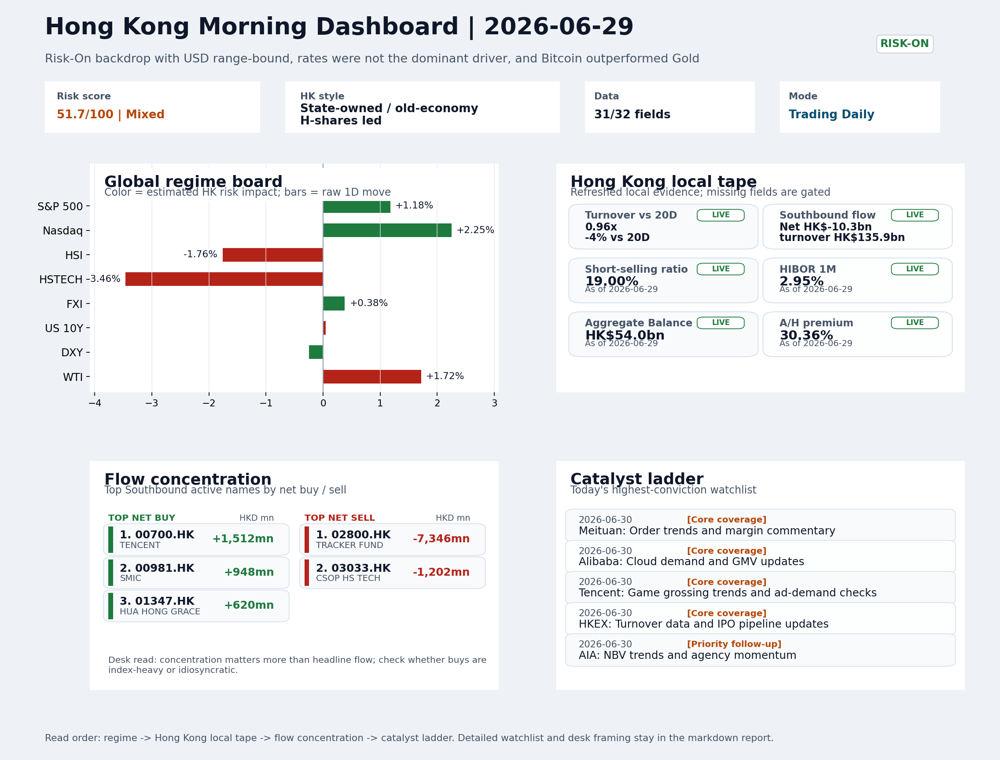
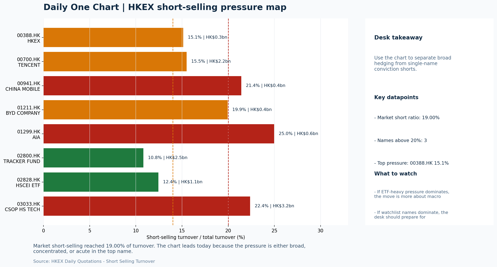

# Morning Research Workbench | 2026-06-30

> Designed for a Hong Kong sell-side commute: Layer 1 `Scan`, Layer 2 `Deep Read`, Layer 3 `Thinking`
> Mode: `Trading Daily` | Keep the report execution-oriented: what mattered in the completed session, what can move Hong Kong leadership, and what needs fast follow-up.
> Briefing date: `2026-06-30` | Review date: `2026-06-29` | Global request: `2026-06-29` | HK/China request: `2026-06-29` | Market effective date: `2026-06-29` | Generated at: `2026-06-30 06:09:22`

## Executive Summary

- **Market pulse:** Overnight Risk-On signals from US growth-style leadership and stable offshore China proxies contrast with Hong Kong's sharp HSTECH underperformance and elevated short-selling, making.
- **Hong Kong lens:** Hong Kong growth / internet led. The divergence between US growth outperformance and HK tech underperformance is the first item to resolve at the open.
- **Top catalysts:** INTC -6.33%; Risk-On backdrop with USD range-bound, rates were not the dominant driver, and Bitcoin outperformed Gold.

## Visual Dashboard

## Layer 1 | Scan (5-10 min)

### 1.1 One-Line Market Pulse
Overnight Risk-On signals from US growth-style leadership and stable offshore China proxies contrast with Hong Kong's sharp HSTECH underperformance and elevated short-selling, making the open a credibility test for HK growth follow-through.

### 1.2 Global Asset Price Dashboard

| Asset | Last | 1D move | Read |
| --- | --- | --- | --- |
| S&P 500 | 7,440.43 | +1.18% | US large-cap risk appetite |
| Nasdaq 100 | 29,774.75 | **+2.25%** | Growth and duration leadership |
| Hang Seng Index | 22,671.86 | **-1.76%** | Hong Kong broad beta |
| Hang Seng TECH | 4.1800 | **-3.46%** | Hong Kong growth / platform read-through |
| CSI 300 | 4,868.22 | **-3.03%** | Mainland large-cap tone |
| US 10Y | 4.3740 | +0.05% | Global discount-rate anchor |
| China 10Y | 1.72% | -1.4bp | China local rates anchor \| Live public \| Eastmoney \| 2026-06-29 |
| CN-US 10Y spread | -266.3bp | -1.4bp | Relative carry and macro-pressure gauge \| Live public \| Eastmoney \| 2026-06-29 |
| DXY | 101.11 | -0.25% | Dollar liquidity impulse |
| USD/CNH | 6.7635 | +0.00% | Offshore China risk appetite |
| USD/HKD | 7.8404 | +0.01% | Linked-exchange regime stress check |
| Brent crude | 73.64 | **+2.29%** | Energy / geopolitics |
| COMEX gold | 4,030.50 | -1.18% | Hedge demand / real yields |
| Copper | 6.1735 | +0.52% | Global growth proxy |
| VIX | 17.65 | **-4.13%** | US stress barometer |

### 1.3 Hong Kong Key Data Quick Check

| Check | Value | Status | Source / as of | Why it matters |
| --- | --- | --- | --- | --- |
| Main Board turnover vs 20D | 0.96x \| -4% vs 20D | Live local | HKEX \| 2026-06-29 | Trailing 20-session average turnover was HK$326.9bn. |
| Southbound / Northbound net flow | Southbound Net HK$-10.3bn \| turnover HK$135.9bn \| Northbound Turnover HK$426.7bn \| net not reported | Live local | HKEX Connect \| 2026-06-29 | Southbound net buy is calculated from HKEX disclosed buy and sell turnover. |
| Short-selling ratio | 19.00% | Live local | HKEX \| 2026-06-29 | Official HKEX stock-level short-selling table, aggregated as a share of total market turnover. |
| AH premium index | 30.36% | Live public | Yahoo \| 2026-06-29 | Simple average across 16 A/H pairs; use dispersion rather than the average alone. |
| USD/HKD spot vs band | 7.8404 \| band 7.7500 to 7.8500 | Live quote + local | Yahoo \| 2026-06-29 | Inside the linked-exchange band without immediate boundary stress. Official Convertibility Undertakings define the linked-rate stress boundaries for USD/HKD. |
| HIBOR 1M | 2.95% | Live local | HKMA \| 2026-06-29 | 1M HIBOR is the cleanest quick read for Hong Kong funding conditions and equity-duration pressure. |
| Aggregate Balance | HK$54.0bn | Live local | HKMA \| 2026-06-29 | Aggregate Balance helps frame whether linked-rate liquidity conditions are tight or comfortable. |
| Hong Kong leadership | Hong Kong growth / internet led | Proxy | HSI / HSCEI / HSTECH relative perf \| 2026-06-29 | Use HSI / HSCEI / HSTECH relative moves as the opening style read. |

### 1.4 Risk Dashboard
**Composite risk score:** `51.7/100` | **Regime:** `Mixed`

| Component | Score impact | Evidence |
| --- | --- | --- |
| US beta | +7.1 | S&P 500 +1.18% |
| HK growth | -10 | HSTECH -3.46% |
| Offshore China proxy | +1.9 | FXI +0.38% |
| Dollar pressure | +2.5 | DXY -0.25% |
| Volatility | +8.3 | VIX -4.13% |
| HK short-selling | -8 | Short-selling ratio 19.00% |

### 1.5 Morning Checklist
1. **INTC -6.33%**
 Mover attribution | Announcement / expectations | Guidance reset and margin pressure
2. **Risk-On backdrop with USD range-bound, rates were not the dominant driver, and Bitcoin outperformed Gold**
 Overnight regime | Start by deciding whether the day is about Risk-On conditions or a style pivot.
3. **CPI MoM (Released)**
 Macro / policy | Rates expectations, the dollar, and growth-equity valuation | Industries: Technology, Internet, Brokers
4. **Trade Balance (Released)**
 Macro / policy | Watch whether it changes the day's core market narrative | Industries: Market-wide
5. **Retail Sales MoM (Upcoming)**
 Macro / policy | Consumer resilience, growth expectations, and risk-asset pricing | Industries: Consumer, E-commerce, Consumer discretionary

## Layer 2 | Deep Read (20-30 min)

### 2.1 Overnight Overseas Market Review
#### Market Setup
**Core tape.** US equities rallied broadly on growth-style leadership, with the Nasdaq 100 gaining +2.25% while the S&P 500 rose +1.18%, as the market interpreted the session as Risk-On with rates not acting as a dominant headwind.
**Main driver.** The key cross-asset signal was Bitcoin outperforming Gold by 2.97 percentage points, a spread consistent with genuine risk appetite rather than defensive positioning.
**HK relevance.** For Hong Kong, the situation is more complicated: HSI fell -1.76%, HSCEI -1.94%.

#### Key Drivers
- US growth-style transmission: Nasdaq 100 surged +2.25%, suggesting rate-path optimism or AI/duration narrative recapturing attention in.
- Elevated HK short-selling: Short-selling ratio of 19% implies mechanical pressure on HK tech and growth names that overwhelmed.
- Oil and geopolitics split: WTI crude +1.72% adds marginal support to energy/cyclicals but raises margin pressure for importers and keeps.
- Dollar/CNH neutral: DXY -0.25% was supportive in aggregate but USD/CNH flat (+0.00%) means the CNH channel did not amplify or dampen.

#### Hong Kong Read-Through
**Desk lens.** State-owned / old-economy H-shares led.
**Opening implication.** The divergence between US growth outperformance and HK tech underperformance is the first item to resolve at the open. FXI +0.38% and USD/CNH stability frame a constructive offshore setup.
- **Cross-market read:** Hang Seng -1.76% / HSCEI -1.94% / HSTECH -3.46%.
- **Cross-market read:** Offshore China proxy FXI +0.38% and USD/CNH +0.00% frame cross-border risk appetite.
- **Cross-market read:** USD/HKD last traded around 7.8404, which keeps the Hong Kong funding lens in focus.

#### Watch Points
- USD composite moved lower by -0.11pct intraday, with a 0.205pct range.
- Main turning points appeared around 2026-06-29 08:25 peak / 2026-06-29 08:40 trough / 2026-06-29 08:55 trough, suggesting event-driven repricing.
- The biggest cross-asset divergence was Bitcoin versus Gold, a spread of 2.97pct.
- Gold moved -1.26pct intraday with a 1.463pct high-low range.

**Curated overnight stories**
1. **China's economy picks up in June on rebounding U.S. exports, analysts say**
 Why it matters: Provides fresh data point that China-U.S. trade channel is stabilizing; June pickup offers partial rebuttal to sequential slowdown fears.
 HK read-through: Most relevant for ChinaADR, H-shares, and export-linked HK blue chips. Supports cautious upgrade to domestic-demand narrative.
2. **INTC -6.33% - Guidance reset and margin pressure**
 Why it matters: Intel's guidance cut signals ongoing semiconductor valuation reset; adds to sector caution entering Q2 earnings season.
 HK read-through: Relevant for HK tech/semiconductor names (e.g., SMIC, Hua Hong) via sector sentiment and potential comparable earnings revision pressure.
3. **Minneapolis Fed President Neel Kashkari says he expects a rate hike this year**
 Why it matters: Continues hawkish voice from Fed officials; contrasts with Risk-On market theme and may cap upside for duration-sensitive HK growth names.
 HK read-through: Watch USD/CNH and HIBOR direction; sustained hawkish signals could limit risk-asset upside for HK/E-China despite Risk-On backdrop.
4. **These 10 Chinese stocks are powering U.S. data centers**
 Why it matters: Highlights continued U.S. dependence on Chinese supply chain for AI infrastructure; reinforces mixed geopolitical trade-off narrative.
 HK read-through: Sector-specific positive for identified names; longer-term policy risk remains for HK/China tech exposure.
5. **SpaceX to join the Nasdaq-100 in a fast-tracked process that will drive huge ETF buying**
 Why it matters: Index rebalancing will generate mechanical buying; SpaceX valuation uplift may reset growth-company benchmarks.
 HK read-through: Indirect - Watch whether HK tech listings (e.g., smart EV/AI adjacents) benefit from global growth-sector re-rating; not a direct mover for HK cash.

### 2.2 Hong Kong / A-share Previous-Day Review
#### Local Tape Setup
**Local read.** The key tension on June 29 was US growth-style outperformance (Nasdaq +2.25%) failing to transmit to Hong Kong, where HSTECH fell -3.46% against HSCEI -1.94% and HSI -1.76%.
**Verification point.** Southbound flows were heavily tilted toward ETFs and broad indices - TRACKER FUND saw -HK$7.35bn net (outflow), CSOP HS TECH -HK$1.20bn - while selective buying in SMIC, Tencent.
**Risk to watch.** Short-selling at 19% of turnover represents a mechanical headwind that the overnight US tape cannot directly offset, so the test is whether HSTECH can narrow its discount to HSCEI without clearing the short-sellers.

#### Style and Local Leadership
**Style leadership.** Hong Kong growth / internet led.
- **Cross-market read:** Hang Seng -1.76% / HSCEI -1.94% / HSTECH -3.46%.
- **Cross-market read:** Offshore China proxy FXI +0.38% and USD/CNH +0.00% frame cross-border risk appetite.
- **Cross-market read:** USD/HKD last traded around 7.8404, which keeps the Hong Kong funding lens in focus.

#### Flow Confirmation
Official Stock Connect evidence is available; use Section 2.3 to confirm whether local money supports the price action.

#### Follow-Through Checklist
**Follow-through check.** Watch HSTECH vs HSCEI spread on June 30 open - if the gap narrows without Southbound ETF outflows resuming, the risk-on read from Nasdaq is credible for HK growth; if HSTECH underperforms again, the short-selling and ETF rotation narrative takes precedence.

### 2.3 Flow Tracker and Attribution
#### Cross-Asset Attribution v1

| Driver | Direction | Score | Evidence | HK implication |
| --- | --- | --- | --- | --- |
| US growth-style transmission | supportive | 3.15 | Nasdaq 100 moved +2.25%. | Hong Kong growth and platform names should be tested first at the open. |
| Short-selling pressure | drag | 2.8 | HKEX short-selling ratio was 19.00%. | Elevated short activity argues for extra confirmation before chasing rebounds. |
| Oil and geopolitics | mixed | 1.83 | Oil moved +2.29%. | Split the read between energy/cyclicals support and margin/geopolitical pressure. |
| Global equity beta | supportive | 1.18 | S&P 500 moved +1.18%. | Broad beta matters if Hong Kong breadth confirms the overseas signal. |
| Dollar / CNH pressure | supportive | 0.38 | DXY -0.25% / USD-CNH +0.00% | A stable or softer CNH makes Hong Kong follow-through more credible. |

#### Flow Tracker
##### Flow Takeaways
- Short-selling pressure is elevated, so local rebounds need cleaner breadth and flow confirmation.
- Stock Connect Southbound: net HK$-10.3bn on turnover HK$135.9bn (as of 2026-06-29).
- Stock Connect Northbound: turnover RMB426.7bn; public file provides total turnover/top active names, not full net-buy.
- AH premium: simple covered-pair average +30.36%; widest premium: China Communications Construction 82.55%.

##### Stock Connect Southbound Active Names

| Rank | Ticker | Name | Buy | Sell | Net buy |
| --- | --- | --- | --- | --- | --- |
| 2 | 02800.HK | TRACKER FUND | HK$4.3mn | HK$7,350.8mn | HK$-7,346.4mn |
| 2 | 00700.HK | TENCENT | HK$4,446.9mn | HK$2,935.3mn | HK$1,511.6mn |
| 10 | 03033.HK | CSOP HS TECH | HK$5.0mn | HK$1,207.3mn | HK$-1,202.3mn |
| 1 | 00981.HK | SMIC | HK$5,524.6mn | HK$4,576.3mn | HK$948.3mn |
| 3 | 01347.HK | HUA HONG GRACE | HK$3,544.1mn | HK$2,924.1mn | HK$619.9mn |

##### AH Premium Dispersion

| Name | A ticker | H ticker | Premium | As of |
| --- | --- | --- | --- | --- |
| China Communications Construction | 601800.SS | 1800.HK | +82.55% | 2026-06-29 |
| China Railway Construction | 601186.SS | 1186.HK | +51.30% | 2026-06-29 |
| China Life | 601628.SS | 2628.HK | +49.00% | 2026-06-29 |
| China Railway | 601390.SS | 0390.HK | +47.07% | 2026-06-29 |
| China Construction Bank | 601939.SS | 0939.HK | +37.46% | 2026-06-29 |

##### HKEX Short-Selling Watch

| Ticker | Name | Short ratio | Short turnover | Total turnover |
| --- | --- | --- | --- | --- |
| 00388.HK | HKEX | 15.14% | HK$0.3bn | HK$1.8bn |
| 00700.HK | TENCENT | 15.49% | HK$2.2bn | HK$14.0bn |
| 00941.HK | CHINA MOBILE | 21.41% | HK$0.4bn | HK$1.7bn |
| 01211.HK | BYD COMPANY | 19.94% | HK$0.4bn | HK$1.8bn |
| 01299.HK | AIA | 24.98% | HK$0.6bn | HK$2.6bn |

- **Short-value leaders:** 07709.HK XL2CSOPHYNIX (HK$6.9bn); 03033.HK CSOP HS TECH (HK$3.2bn); 02800.HK TRACKER FUND (HK$2.5bn); 00700.HK TENCENT (HK$2.2bn).

### 2.4 Macro and Policy Tracking
**Desk read.** The completed session closed with a clear Risk-On inflection: VIX compressed 4.1% to 17.65, Bitcoin (+1.3%) outperformed Gold (-1.2%), and crude rose 1.7% to $70.42.

**Market sensitivity.** USD was range-bound and rates were not the dominant driver, which kept Hong Kong equity risk appetite elevated into the close.

**HK implication.** However, tonight's US CPI release shifts the setup materially.

**Macro watchpoints**
- DXY and HKD spot reaction within 30 minutes of CPI release.
- 2-year and 10-year US Treasury yields post-CPI - direction and magnitude.
- HK tech and internet sector leadership in pre-market or early futures tape.
- Whether Bitcoin holds above $60,000 if dollar strengthens.

| Time | Region | Event | Status | Desk read |
| --- | --- | --- | --- | --- |
| 20:30 | US | CPI MoM | Released | Impact: Rates expectations, the dollar, and growth-equity valuation \| Attention: 5/5 \| Industries: Technology, Internet, Brokers |
| 09:30 | China | Trade Balance | Released | Impact: Watch whether it changes the day's core market narrative \| Attention: 3/5 \| Industries: Market-wide |
| 20:30 | US | Retail Sales MoM | Upcoming | Impact: Consumer resilience, growth expectations, and risk-asset pricing \| Attention: 5/5 \| Industries: Consumer, E-commerce, Consumer discretionary |
| 09:20 | China | Loan Prime Rate | Upcoming | Impact: Watch whether it changes the day's core market narrative \| Attention: 3/5 \| Industries: Market-wide |
| 22:00 | Federal Reserve | Jerome Powell: Economic outlook remarks | Central bank | Impact: Policy path, liquidity conditions, and cross-asset risk appetite \| Attention: 5/5 \| Industries: Technology, Financials, Gold |
| 10:00 | PBOC | Open Market Operations Desk: Daily liquidity operation window | Central bank | Impact: Policy path, liquidity conditions, and cross-asset risk appetite \| Attention: 3/5 \| Industries: Technology, Financials, Gold |

#### Positioning and Risk Backdrop
- Options activity centered on KWEB Call, with Vol/OI at 1.88x and a bullish bias.
- Put/Call structure shows equity 0.68 / index 1.15, implying Single-stock optimism with index hedging.
- Geopolitics: Middle East | Regional tension remains elevated | Impact: Oil, freight costs, and safe-haven demand
- Geopolitics: US-China | Technology export-control rhetoric remains active | Impact: China internet, semiconductors, and supply chains

### 2.5 Key Company and Sector Events
No high-conviction sector story cleared the main-report relevance gate for this run.

#### HKEX Announcements

| Grade | Ticker | Type | Release time | Title |
| --- | --- | --- | --- | --- |
| A | 00343.HK | Profit warning | 2026-06-29 | Profit warning / alert announcement |
| A | 00372.HK | Profit warning | 2026-06-29 | Profit warning / alert announcement |
| A | 00508.HK | Profit warning | 2026-06-29 | Profit warning / alert announcement |
| A | 01466.HK | Profit warning | 2026-06-29 | Profit warning / alert announcement |
| A | 01468.HK | Profit warning | 2026-06-29 | Profit warning / alert announcement |
| A | 01539.HK | Profit warning | 2026-06-29 | Profit warning / alert announcement |
| A | 01703.HK | Profit warning | 2026-06-29 | Profit warning / alert announcement |
| A | 08056.HK | Profit warning | 2026-06-29 | Profit warning / alert announcement |

#### Earnings / Results Watch

| Ticker | Company | Timing | Expectation framing |
| --- | --- | --- | --- |
| 0700.HK | Tencent Holdings | After Market Close | EPS est. 4.15 HKD \| revenue est. 163.2bn HKD |
| 0388.HK | Hong Kong Exchanges and Clearing | Before Market Open | EPS est. 2.81 HKD \| revenue est. 6.0bn HKD |

#### Rating Changes
- **9988.HK** | Morgan Stanley | Upgrade | Equal Weight -> Overweight | PT 92 -> 105

#### IPO Watch
- IPO and grey-market monitoring is not yet part of the standard production pack.

### 2.6 Today's Core Names
#### Core coverage

| Name | Ticker | Last | 1D | Range position | Morning note |
| --- | --- | --- | --- | --- | --- |
| Meituan | 3690.HK | 67.65 | +5.29% | Bottom of range | Short-term price strength is clear; fresh catalysts could trigger broader group follow-through. |
| Alibaba | 9988.HK | 93.00 | +3.91% | Bottom of range | Short-term price strength is clear; fresh catalysts could trigger broader group follow-through. |

**Recent headlines for Meituan:**
- [Forget FXI. The South Korea Fund Beating China's AI Trade Charges 19% Less](https://247wallst.com/investing/2026/06/25/forget-fxi-the-south-korea-fund-beating-chinas-ai-trade-charges-19-less/) (24/7 Wall St.)
**Recent headlines for Alibaba:**
- [Why Did MSTR, BABA, NKE Stocks Tumble To 52-Week Lows Last Week?](https://stocktwits.com/news-articles/markets/equity/why-did-mstr-baba-nke-stocks-tumble-to-52-week-lows-last-week/cZ1BMDJR7WC) (Stocktwits)

#### Priority follow-up

| Name | Ticker | Last | 1D | Range position | Morning note |
| --- | --- | --- | --- | --- | --- |
| AIA | 1299.HK | 72.20 | +1.98% | Bottom of range | The name sits near the bottom of its recent range and is worth monitoring for a catalyst-led reversal. |
| BYD Company | 1211.HK | 72.90 | +0.34% | Bottom of range | The name sits near the bottom of its recent range and is worth monitoring for a catalyst-led reversal. |

## Layer 3 | Thinking (10-15 min)

### 3.1 Rotating Theme Deep Dive

| Field | Read |
| --- | --- |
| Theme | China Consumption Recovery |
| Angle for the day | Focus on whether travel, retail, internet local services, and premium consumption data still support a demand-repair narrative. |

**Theme desk read**
**Core thesis.** The China consumption recovery theme remains in focus, with the risk‑on backdrop - USD range‑bound, rates not the dominant driver, Bitcoin outperforming gold - providing a supportive canvas.
**Evidence.** VIX declined 4.13%, signalling easing stress, while crude's +1.72% move invites a demand‑repair reading alongside geopolitical noise.
**What to test.** Meituan's +5.29% surge from the bottom of its range adds a high‑frequency local‑services name to the narrative, though the real test is whether the incoming catalysts confirm the demand thesis rather than just tactical.

**Signals to keep in mind**
- VIX -4.13%: Lower volatility signals easing stress in the tape.
- WTI crude +1.72%: A strong crude move needs to be split between geopolitics and demand repair.

**LLM watch items:**
- Meituan (3690.HK) order trends and margin commentary - verify if local‑services demand recovery is translating into volume and profitability.
- US Retail Sales MoM (30 June 20:30 HKT) - a beat would reinforce consumer resilience and could lift e‑commerce/discretionary proxies tied to China's

**Related names to keep close:**

| Name | Ticker | Bucket | Morning read |
| --- | --- | --- | --- |
| Meituan | 3690.HK | Core coverage | Short-term price strength is clear; fresh catalysts could trigger broader group follow-through. |

**Upcoming catalysts tied to the theme:**
- 2026-06-30 | Meituan: Order trends and margin commentary | High-frequency read on local services demand and platform competition
- 2026-06-30 | Retail Sales MoM | Consumer resilience, growth expectations, and risk-asset pricing

### 3.2 Today Ahead and Trading Calendar
- Macro: CPI MoM is the first item to anchor the open and the rates/FX response.
- Corporate / event: Meituan: Order trends and margin commentary is the cleanest same-day catalyst to prepare for.

**Same-day macro docket**

| Time | Country | Event | Status | Detail |
| --- | --- | --- | --- | --- |
| 20:30 | US | CPI MoM | Released | Actual 0.3% / Forecast 0.2% / Prior 0.4% |
| 09:30 | China | Trade Balance | Released | Actual USD 85.2bn / Forecast USD 79.0bn / Prior USD 80.6bn |
| 20:30 | US | Retail Sales MoM | Upcoming | Forecast 0.3% / Prior 0.6% |
| 09:20 | China | Loan Prime Rate | Upcoming | Forecast 3.45% / Prior 3.45% |
| 22:00 | Federal Reserve | Jerome Powell: Economic outlook remarks | Central bank | speech |

**Same-day catalyst list**

| Date | Time | Category | Event | Importance |
| --- | --- | --- | --- | --- |
| 2026-06-30 | | Core coverage | Meituan: Order trends and margin commentary | 3 |
| 2026-06-30 | | Core coverage | Alibaba: Cloud demand and GMV updates | 3 |
| 2026-06-30 | | Core coverage | Tencent: Game grossing trends and ad-demand checks | 3 |
| 2026-06-30 | | Core coverage | HKEX: Turnover data and IPO pipeline updates | 3 |

**Next few sessions**

| Date | Category | Event | Impact |
| --- | --- | --- | --- |
| 2026-06-30 | Core coverage | Meituan: Order trends and margin commentary | High-frequency read on local services demand and platform competition |
| 2026-06-30 | Core coverage | Alibaba: Cloud demand and GMV updates | Key read-through for China consumption, cloud, and platform regulation |
| 2026-06-30 | Core coverage | Tencent: Game grossing trends and ad-demand checks | Core offshore China platform proxy for gaming, ads, and AI monetization |
| 2026-06-30 | Core coverage | HKEX: Turnover data and IPO pipeline updates | Direct proxy for Hong Kong market turnover, listings, and southbound |

### 3.3 Daily One Chart
**Daily One Chart | HKEX short-selling pressure map**

**Chart read.** Market short-selling reached 19.00% of turnover.
**Why it matters.** The chart leads today because the pressure is either broad, concentrated, or acute in the top name.

_Source: HKEX Daily Quotations - Short Selling Turnover_

## Traceable Appendix

### Report Metadata
> Date policy: Review date 2026-06-29 is treated as `Trading Daily`. | Global request date is 2026-06-29; adapter effective date is 2026-06-29 and summary date is 2026-06-29. | HK/China local data date is 2026-06-29; role: same-session local cash tape.
> Market data quality: Coverage: `31/32` | Stale items (>1d): `7` | Missing: `1`
> Report quality: `87.4/100` | Grade `B` | Status `production ready`

### Key Questions to Keep in Mind
- Is risk appetite rising or fading? The overnight tape reads closer to `Risk-On`.
- Did rates expectations move? Focus on whether US 10Y, DXY, and growth style moved together.
- Were commodities the real story? Watch WTI and gold for geopolitics versus inflation signals.
- Is Hong Kong setup internet-led, SOE-led, or broad beta-led? Compare HSTECH, HSCEI, and HSI.
- Did offshore markets move China risk appetite? Focus on HSI, FXI, USD/CNH, and USD/HKD.

### Report Quality and Validation
- **Quality score:** 87.4/100 | **Grade:** B | **Status:** production ready
- **Run summary:** 7 healthy | 1 caveat | 0 failed
- **Release recommendation:** Send with caveats | The report is usable, but the advisory guidance should travel with it so readers understand the data gaps.

| Source | Status | Bucket |
| --- | --- | --- |
| Market data | ok | healthy |
| Sector and company news | ok | healthy |
| Movers and short selling | ok | healthy |
| Stock Connect | ok | healthy |
| A/H premium | ok | healthy |
| Hong Kong local package | ok | healthy |
| China rates | ok | healthy |
| Narrative overlay | partial | caveat |

**Desk-use guidance summary:** 0 blocking | 1 advisory

**Desk-use guidance**
- **Advisory:** Use deterministic sections as primary support; the narrative overlay was partial or unavailable on this run.

| Component | Score | Weight | Read |
| --- | --- | --- | --- |
| Market data coverage | 96.9 | 0.3 | 31/32 core market fields available. |
| Hong Kong local metrics | 82.3 | 0.25 | 8 live, 3 proxy, 0 unavailable local checks. |
| Key public adapters | 100.0 | 0.2 | 4/4 key adapters were available or partially available. |
| Narrative overlay health | 51.4 | 0.15 | 2/7 narrative overlay tasks succeeded or used validated cache; 1 error(s). |
| Fact-check guardrail | 100.0 | 0.1 | Checked 6 numeric claims; 0 numeric mismatch(es), 0 logic warning(s); 0 critical, 0 review. |

**Quality warnings**
- Narrative overlay health is weak: 2/7 narrative overlay tasks succeeded or used validated cache; 1 error(s).

**Narrative fact-check guardrail**
- Checked 6 numeric claims; 0 numeric mismatch(es), 0 logic warning(s); 0 critical, 0 review.

**Adapter status**

| Adapter | Status |
| --- | --- |
| Stock Connect | ok |
| A/H premium | ok |
| HKEX announcements | ok |
| China rates | ok |

### Source Links
- [Forget FXI. The South Korea Fund Beating China's AI Trade Charges 19% Less](https://247wallst.com/investing/2026/06/25/forget-fxi-the-south-korea-fund-beating-chinas-ai-trade-charges-19-less/) (24/7 Wall St.)
- [Why Did MSTR, BABA, NKE Stocks Tumble To 52-Week Lows Last Week?](https://stocktwits.com/news-articles/markets/equity/why-did-mstr-baba-nke-stocks-tumble-to-52-week-lows-last-week/cZ1BMDJR7WC) (Stocktwits)
- [Galaxy CEO Mike Novogratz Says A Turn In Alibaba Could Signal Bitcoin Has Bottomed](https://stocktwits.com/news-articles/markets/cryptocurrency/galaxy-mike-novogratz-alibaba-bitcoin/cZ1IzD9R7W8) (Stocktwits)
- [Momenta Targets $752 Million Hong Kong IPO](https://finance.yahoo.com/markets/stocks/articles/momenta-targets-752-million-hong-194724183.html) (GuruFocus.com)
- [Momenta Global Hong Kong IPO raises $751 million](https://qz.com/momenta-global-hong-kong-ipo-self-driving-062926) (Quartz)
- [00343.HK Profit warning / alert announcement](http://www1.hkexnews.hk/listedco/listconews/sehk/2026/0629/2026062902659.pdf) (HKEXnews)
- [00372.HK Profit warning / alert announcement](http://www1.hkexnews.hk/listedco/listconews/sehk/2026/0629/2026062901783.pdf) (HKEXnews)
- [00508.HK Profit warning / alert announcement](http://www1.hkexnews.hk/listedco/listconews/sehk/2026/0629/2026062902221.pdf) (HKEXnews)
- [01466.HK Profit warning / alert announcement](http://www1.hkexnews.hk/listedco/listconews/sehk/2026/0629/2026062902551.pdf) (HKEXnews)
- [01468.HK Profit warning / alert announcement](http://www1.hkexnews.hk/listedco/listconews/sehk/2026/0629/2026062900003.pdf) (HKEXnews)
- [01539.HK Profit warning / alert announcement](http://www1.hkexnews.hk/listedco/listconews/sehk/2026/0629/2026062901491.pdf) (HKEXnews)
- [01703.HK Profit warning / alert announcement](http://www1.hkexnews.hk/listedco/listconews/sehk/2026/0629/2026062902553.pdf) (HKEXnews)
- [08056.HK Profit warning / alert announcement](http://www1.hkexnews.hk/listedco/listconews/gem/2026/0629/2026062902549.pdf) (HKEXnews)

## Supplementary Visual Appendix

This appendix is professional-path only. It keeps a traceable index of the report visuals and the deterministic chart cues used to frame the morning note, without injecting the legacy intraday chart pack.

### Visual Index

| Visual | Path | Role |
| --- | --- | --- |
| Visual Dashboard | `charts/dashboard_2026-06-30.png` | Cross-asset regime board and Hong Kong local tape snapshot. |
| Daily One Chart | `charts/daily_one_chart_2026-06-30.png` | Single highest-conviction visual story for the day. |

### Deterministic Chart Cues
- FX / liquidity: USD composite moved lower by -0.11pct intraday, with a 0.205pct range.
- FX / liquidity: Main turning points appeared around 2026-06-29 08:25 peak / 2026-06-29 08:40 trough / 2026-06-29 08:55 trough, suggesting event-driven repricing rather than a clean one-way USD move.
- Cross-asset: The biggest cross-asset divergence was Bitcoin versus Gold, a spread of 2.97pct.
- Cross-asset: Gold moved -1.26pct intraday with a 1.463pct high-low range.
- Cross-asset: Oil moved +0.46pct intraday with a 2.183pct high-low range.
- Cross-asset: Bitcoin moved +1.71pct intraday with a 2.825pct high-low range.

### Risk Dashboard Components

| Component | Score impact | Evidence |
| --- | --- | --- |
| US beta | +7.1 | S&P 500 +1.18% |
| HK growth | -10 | HSTECH -3.46% |
| Offshore China proxy | +1.9 | FXI +0.38% |
| Dollar pressure | +2.5 | DXY -0.25% |
| Volatility | +8.3 | VIX -4.13% |
| HK short-selling | -8 | Short-selling ratio 19.00% |
