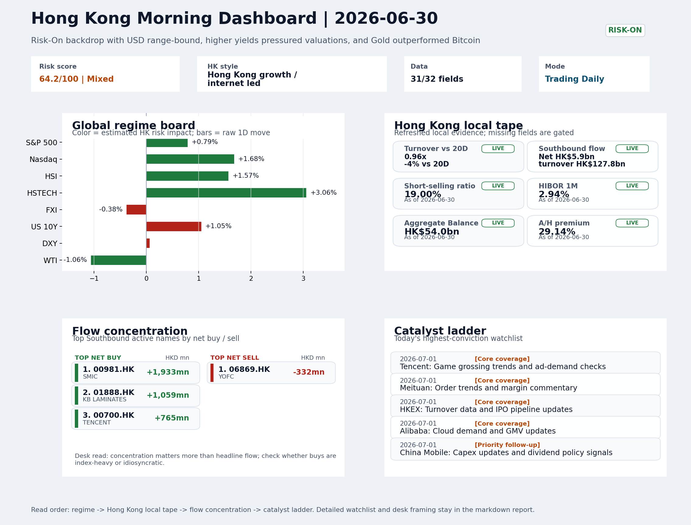
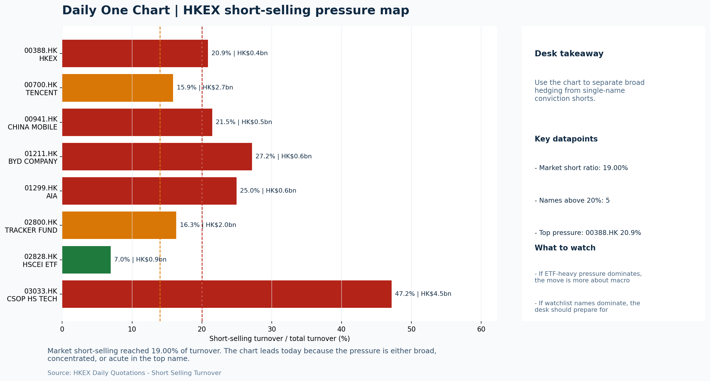

# Morning Research Workbench | 2026-07-01

> Designed for a Hong Kong sell-side commute: Layer 1 `Scan`, Layer 2 `Deep Read`, Layer 3 `Thinking`
> Mode: `Trading Daily` | Keep the report execution-oriented: what mattered in the completed session, what can move Hong Kong leadership, and what needs fast follow-up.
> Briefing date: `2026-07-01` | Review date: `2026-06-30` | Global request: `2026-06-30` | HK/China request: `2026-06-30` | Market effective date: `2026-06-30` | Generated at: `2026-07-01 06:15:31`

## Executive Summary

- **Market pulse:** Risk-On conditions supported Hong Kong growth leadership on June 30, but the +3.06% HSTECH surge arrived alongside an elevated 19% short-selling ratio, offshore China FXI lag, and.
- **Hong Kong lens:** Hong Kong growth / internet led. A constructive open is more credible if HSTECH holds its +3% move on volume and FXI stops acting as a drag - if the offshore China proxy does not recover, the growth/tech.
- **Top catalysts:** VIX -6.80%; INTC -6.33%.

## Visual Dashboard

## Layer 1 | Scan (5-10 min)

### 1.1 One-Line Market Pulse
Risk-On conditions supported Hong Kong growth leadership on June 30, but the +3.06% HSTECH surge arrived alongside an elevated 19% short-selling ratio, offshore China FXI lag, and a hotter-than-expected US CPI print that keeps the yield headwind live for the open.

### 1.2 Global Asset Price Dashboard

| Asset | Last | 1D move | Read |
| --- | --- | --- | --- |
| S&P 500 | 7,499.36 | +0.79% | US large-cap risk appetite |
| Nasdaq 100 | 30,276.35 | **+1.68%** | Growth and duration leadership |
| Hang Seng Index | 23,026.68 | **+1.57%** | Hong Kong broad beta |
| Hang Seng TECH | 4.3080 | **+3.06%** | Hong Kong growth / platform read-through |
| CSI 300 | 4,868.22 | **-3.03%** | Mainland large-cap tone |
| US 10Y | 4.4180 | +1.05% | Global discount-rate anchor |
| China 10Y | 1.73% | +1.6bp | China local rates anchor \| Live public \| Eastmoney \| 2026-06-30 |
| CN-US 10Y spread | -270.7bp | -4.4bp | Relative carry and macro-pressure gauge \| Live public \| Eastmoney \| 2026-06-30 |
| DXY | 101.17 | +0.06% | Dollar liquidity impulse |
| USD/CNH | 6.7570 | +0.00% | Offshore China risk appetite |
| USD/HKD | 7.8419 | +0.00% | Linked-exchange regime stress check |
| Brent crude | 73.31 | +0.22% | Energy / geopolitics |
| COMEX gold | 4,027.70 | +0.13% | Hedge demand / real yields |
| Copper | 6.2555 | **+2.59%** | Global growth proxy |
| VIX | 16.45 | **-6.80%** | US stress barometer |

### 1.3 Hong Kong Key Data Quick Check

| Check | Value | Status | Source / as of | Why it matters |
| --- | --- | --- | --- | --- |
| Main Board turnover vs 20D | 0.96x \| -4% vs 20D | Live local | HKEX \| 2026-06-30 | Trailing 20-session average turnover was HK$319.5bn. |
| Southbound / Northbound net flow | Southbound Net HK$5.9bn \| turnover HK$127.8bn \| Northbound Turnover HK$364.5bn \| net not reported | Live local | HKEX Connect \| 2026-06-30 | Southbound net buy is calculated from HKEX disclosed buy and sell turnover. |
| Short-selling ratio | 19.00% | Live local | HKEX \| 2026-06-30 | Official HKEX stock-level short-selling table, aggregated as a share of total market turnover. |
| AH premium index | 29.14% | Live public | Yahoo \| 2026-06-30 | Simple average across 17 A/H pairs; use dispersion rather than the average alone. |
| USD/HKD spot vs band | 7.8419 \| band 7.7500 to 7.8500 | Live quote + local | Yahoo \| 2026-06-30 | Inside the linked-exchange band without immediate boundary stress. Official Convertibility Undertakings define the linked-rate stress boundaries for USD/HKD. |
| HIBOR 1M | 2.94% | Live local | HKMA \| 2026-06-30 | 1M HIBOR is the cleanest quick read for Hong Kong funding conditions and equity-duration pressure. |
| Aggregate Balance | HK$54.0bn | Live local | HKMA \| 2026-06-30 | Aggregate Balance helps frame whether linked-rate liquidity conditions are tight or comfortable. |
| Hong Kong leadership | Hong Kong growth / internet led | Proxy | HSI / HSCEI / HSTECH relative perf \| 2026-06-30 | Use HSI / HSCEI / HSTECH relative moves as the opening style read. |

### 1.4 Risk Dashboard
**Composite risk score:** `64.2/100` | **Regime:** `Mixed`

| Component | Score impact | Evidence |
| --- | --- | --- |
| US beta | +4.7 | S&P 500 +0.79% |
| HK growth | +10 | HSTECH +3.06% |
| Offshore China proxy | -1.9 | FXI -0.38% |
| Dollar pressure | -0.6 | DXY +0.06% |
| Volatility | +10 | VIX -6.80% |
| HK short-selling | -8 | Short-selling ratio 19.00% |

### 1.5 Morning Checklist
1. **VIX -6.80%**
 High-frequency data | Lower volatility signals easing stress in the tape.
2. **INTC -6.33%**
 Mover attribution | Announcement / expectations | Guidance reset and margin pressure
3. **Risk-On backdrop with USD range-bound, higher yields pressured valuations, and Gold outperformed Bitcoin**
 Overnight regime | Start by deciding whether the day is about Risk-On conditions or a style pivot.
4. **CPI MoM (Released)**
 Macro / policy | Rates expectations, the dollar, and growth-equity valuation | Industries: Technology, Internet, Brokers
5. **Trade Balance (Released)**
 Macro / policy | Watch whether it changes the day's core market narrative | Industries: Market-wide

## Layer 2 | Deep Read (20-30 min)

### 2.1 Overnight Overseas Market Review
#### Market Setup
**Core tape.** Global markets settled into a risk-on tone on June 30, with the VIX compressing -6.80% to 16.45 and US CPI in line to remove near-term rate surprise risk, supporting broad equity appetite.
**Main driver.** The Nasdaq 100 led at +1.68%, transmitting growth-style momentum to Hong Kong where HSTECH surged +3.06% - the strongest single-session performance across major HK indices.
**HK relevance.** However, higher US 10Y yields (+1.05%) and an elevated HK short-selling ratio of 19.00% create a split screen.

#### Key Drivers
- VIX -6.80% compression signals volatility stress has eased and risk appetite stabilized, historically correlated with improved EM fund.
- Nasdaq 100 +1.68% provided the growth-style transmission that lifted Hong Kong tech, though the signal needs confirmation at the open.
- US 10Y yield +1.05% introduces valuation friction for long-duration assets.
- HKEX short-selling ratio of 19.00% remains elevated - above the 15-16% neutral zone - arguing that local rebounds require cleaner breadth.

#### Hong Kong Read-Through
**Desk lens.** Hong Kong growth / internet led.
**Opening implication.** A constructive open is more credible if HSTECH holds its +3% move on volume and FXI stops acting as a drag - if the offshore China proxy does not recover, the growth/tech leadership may face a pullback by midday.
- **Cross-market read:** Hang Seng +1.57% / HSCEI +1.94% / HSTECH +3.06%.
- **Cross-market read:** Offshore China proxy FXI -0.38% and USD/CNH +0.00% frame cross-border risk appetite.
- **Cross-market read:** USD/HKD last traded around 7.8419, which keeps the Hong Kong funding lens in focus.

#### Watch Points
- USD composite moved higher by +0.14pct intraday, with a 0.152pct range.
- Main turning points appeared around 2026-06-30 08:30 peak / 2026-06-30 08:50 peak / 2026-06-30 09:10 peak, suggesting event-driven repricing rather.
- The biggest cross-asset divergence was Gold versus Bitcoin, a spread of 3.629pct.
- Gold moved +1.07pct intraday with a 2.389pct high-low range.

**Curated overnight stories**
1. **VIX -6.80%, volatility stress easing**
 Why it matters: Sharp compression in VIX suggests risk appetite has stabilized after recent turbulence. Lower implied volatility historically correlates with improved emerging market fund.
 HK read-through: Supports risk-on positioning in Hong Kong. Positive for high-beta Hang Seng tech and growth names.
2. **CPI MoM released, in line with expectations**
 Why it matters: No surprise in US inflation data keeps Fed rate path unchanged near-term. Removes a potential catalyst for dollar strength or further yield rise.
 HK read-through: Neutral-to-positive for Hong Kong. Limits the downside risk from further rate-driven valuation compression in growth equities.
3. **China's economy picks up in June on rebounding U.S. exports**
 Why it matters: First positive sequential momentum in China activity data. Tariff front appears less disruptive than feared, and export volumes show recovery.
 HK read-through: Directly relevant for Hong Kong-listed exporters, logistics, and manufacturers. Supports China growth narrative that underpins Hang Seng sentiment.
4. **Cleveland Fed's Hammack flags AI-driven inflation risk, rate hikes may be necessary**
 Why it matters: Fed official commentary has shifted from neutral to slightly hawkish. While not consensus, it raises ceiling on rate expectations and keeps terminal rate uncertainty elevated.
 HK read-through: Risk factor for Hong Kong. Higher-for-longer US rates constrain HKD-linked borrowing costs and weigh on tech/growth multiple re-rating potential.

### 2.2 Hong Kong / A-share Previous-Day Review
#### Local Tape Setup
**Local read.** Hong Kong's session closed with style leadership tilted decisively toward growth, as HSTECH surged +3.06% while HSCEI rose +1.94% and the offshore China proxy FXI slipped -0.38%, indicating the bid was concentrated in.
**Verification point.** Southbound Connect registered a net buy of HK$5.9bn, but short-selling remained elevated at 19.00% of market turnover.

#### Style and Local Leadership
**Style leadership.** Hong Kong growth / internet led.
- **Cross-market read:** Hang Seng +1.57% / HSCEI +1.94% / HSTECH +3.06%.
- **Cross-market read:** Offshore China proxy FXI -0.38% and USD/CNH +0.00% frame cross-border risk appetite.
- **Cross-market read:** USD/HKD last traded around 7.8419, which keeps the Hong Kong funding lens in focus.

#### Flow Confirmation
Official Stock Connect evidence is available; use Section 2.3 to confirm whether local money supports the price action.

#### Follow-Through Checklist
**Follow-through check.** Watch whether HSTECH can hold its +3.06% daily gain on the next session's open and whether FXI recovers to signal a broader China bid.

### 2.3 Flow Tracker and Attribution
#### Cross-Asset Attribution v1

| Driver | Direction | Score | Evidence | HK implication |
| --- | --- | --- | --- | --- |
| Short-selling pressure | drag | 2.8 | HKEX short-selling ratio was 19.00%. | Elevated short activity argues for extra confirmation before chasing rebounds. |
| US growth-style transmission | supportive | 2.35 | Nasdaq 100 moved +1.68%. | Hong Kong growth and platform names should be tested first at the open. |
| Rates impulse | drag | 1.26 | US 10Y yield proxy moved +1.05%. | Lower yields help long-duration growth; higher yields pressure valuation-sensitive |
| Global equity beta | supportive | 0.79 | S&P 500 moved +0.79%. | Broad beta matters if Hong Kong breadth confirms the overseas signal. |

#### Flow Tracker
##### Flow Takeaways
- Short-selling pressure is elevated, so local rebounds need cleaner breadth and flow confirmation.
- Stock Connect Southbound: net HK$5.9bn on turnover HK$127.8bn (as of 2026-06-30).
- Stock Connect Northbound: turnover RMB364.5bn; public file provides total turnover/top active names, not full net-buy.
- AH premium: simple covered-pair average +29.14%; widest premium: China Life 53.02%.

##### Stock Connect Southbound Active Names

| Rank | Ticker | Name | Buy | Sell | Net buy |
| --- | --- | --- | --- | --- | --- |
| 1 | 00981.HK | SMIC | HK$7,584.6mn | HK$5,651.9mn | HK$1,932.7mn |
| 3 | 01888.HK | KB LAMINATES | HK$2,875.8mn | HK$1,816.9mn | HK$1,058.9mn |
| 2 | 00700.HK | TENCENT | HK$4,036.4mn | HK$3,271.3mn | HK$765.0mn |
| 8 | 02513.HK | KNOWLEDGE ATLAS | HK$1,731.0mn | HK$1,077.4mn | HK$653.6mn |
| 4 | 00148.HK | KINGBOARD HLDG | HK$2,619.8mn | HK$2,223.2mn | HK$396.6mn |

##### AH Premium Dispersion

| Name | A ticker | H ticker | Premium | As of |
| --- | --- | --- | --- | --- |
| China Life | 601628.SS | 2628.HK | +53.02% | 2026-06-30 |
| China Railway Construction | 601186.SS | 1186.HK | +50.25% | 2026-06-30 |
| New China Life | 601336.SS | 1336.HK | +49.60% | 2026-06-30 |
| China Railway | 601390.SS | 0390.HK | +45.38% | 2026-06-30 |
| China Communications Construction | 601800.SS | 1800.HK | +44.19% | 2026-06-30 |

##### HKEX Short-Selling Watch

| Ticker | Name | Short ratio | Short turnover | Total turnover |
| --- | --- | --- | --- | --- |
| 00388.HK | HKEX | 20.86% | HK$0.4bn | HK$2.1bn |
| 00700.HK | TENCENT | 15.89% | HK$2.7bn | HK$16.7bn |
| 00941.HK | CHINA MOBILE | 21.47% | HK$0.5bn | HK$2.4bn |
| 01211.HK | BYD COMPANY | 27.16% | HK$0.6bn | HK$2.1bn |
| 01299.HK | AIA | 24.97% | HK$0.6bn | HK$2.4bn |

- **Short-value leaders:** 03033.HK CSOP HS TECH (HK$4.5bn); 07709.HK XL2CSOPHYNIX (HK$4.1bn); 00981.HK SMIC (HK$2.7bn); 00700.HK TENCENT (HK$2.7bn).

### 2.4 Macro and Policy Tracking
**Desk read.** The completed session (2026-06-30) closes with a Risk-On backdrop, but the overnight macro calendar injects a nuanced repricing risk for the Hong Kong open.

**Market sensitivity.** US CPI for July released hotter than expected at 0.3% MoM versus the 0.2% forecast, which immediately pressures duration assets and challenges the benign inflation narrative that had supported tech and internet valuations.

**HK implication.** The China Trade Balance concurrently beat at USD 85.2bn versus USD 79.0bn forecast, offering a marginal positive offset to the domestic growth narrative.

**Macro watchpoints**
- DXY and US 2-year/10-year yields reaction to the hotter CPI print heading into the retail sales release.
- US Retail Sales MoM actual versus 0.3% forecast - if it misses, watch whether the Risk-On tape holds or rotates.
- Jerome Powell speech at 22:00 HKT: any hawkish pivot on inflation durability would pressure HK tech/internet multiples.
- Copper price persistence above 6.25 as a signal of whether the Risk-On theme has real cyclical support.

| Time | Region | Event | Status | Desk read |
| --- | --- | --- | --- | --- |
| 20:30 | US | CPI MoM | Released | Impact: Rates expectations, the dollar, and growth-equity valuation \| Attention: 5/5 \| Industries: Technology, Internet, Brokers |
| 09:30 | China | Trade Balance | Released | Impact: Watch whether it changes the day's core market narrative \| Attention: 3/5 \| Industries: Market-wide |
| 20:30 | US | Retail Sales MoM | Upcoming | Impact: Consumer resilience, growth expectations, and risk-asset pricing \| Attention: 5/5 \| Industries: Consumer, E-commerce, Consumer discretionary |
| 09:20 | China | Loan Prime Rate | Upcoming | Impact: Watch whether it changes the day's core market narrative \| Attention: 3/5 \| Industries: Market-wide |
| 22:00 | Federal Reserve | Jerome Powell: Economic outlook remarks | Central bank | Impact: Policy path, liquidity conditions, and cross-asset risk appetite \| Attention: 5/5 \| Industries: Technology, Financials, Gold |
| 10:00 | PBOC | Open Market Operations Desk: Daily liquidity operation window | Central bank | Impact: Policy path, liquidity conditions, and cross-asset risk appetite \| Attention: 3/5 \| Industries: Technology, Financials, Gold |

#### Positioning and Risk Backdrop
- Options activity centered on KWEB Call, with Vol/OI at 1.88x and a bullish bias.
- Put/Call structure shows equity 0.68 / index 1.15, implying Single-stock optimism with index hedging.
- Geopolitics: Middle East | Regional tension remains elevated | Impact: Oil, freight costs, and safe-haven demand
- Geopolitics: US-China | Technology export-control rhetoric remains active | Impact: China internet, semiconductors, and supply chains

### 2.5 Key Company and Sector Events
No high-conviction sector story cleared the main-report relevance gate for this run.

#### HKEX Announcements

| Grade | Ticker | Type | Release time | Title |
| --- | --- | --- | --- | --- |
| A | 00327.HK | Profit warning | 2026-06-30 | Profit warning / alert announcement |
| A | 00818.HK | Profit warning | 2026-06-30 | Profit warning / alert announcement |
| A | 01053.HK | Profit warning | 2026-06-30 | Profit warning / alert announcement |
| A | 06888.HK | Profit warning | 2026-06-30 | Profit warning / alert announcement |
| A | 00343.HK | Profit warning | 2026-06-29 | Profit warning / alert announcement |
| A | 00372.HK | Profit warning | 2026-06-29 | Profit warning / alert announcement |
| A | 00508.HK | Profit warning | 2026-06-29 | Profit warning / alert announcement |
| A | 01466.HK | Profit warning | 2026-06-29 | Profit warning / alert announcement |

#### Earnings / Results Watch

| Ticker | Company | Timing | Expectation framing |
| --- | --- | --- | --- |
| 0700.HK | Tencent Holdings | After Market Close | EPS est. 4.15 HKD \| revenue est. 163.2bn HKD |
| 0388.HK | Hong Kong Exchanges and Clearing | Before Market Open | EPS est. 2.81 HKD \| revenue est. 6.0bn HKD |

#### Rating Changes
- **9988.HK** | Morgan Stanley | Upgrade | Equal Weight -> Overweight | PT 92 -> 105

#### IPO Watch
- IPO and grey-market monitoring is not yet part of the standard production pack.

### 2.6 Today's Core Names
#### Core coverage

| Name | Ticker | Last | 1D | Range position | Morning note |
| --- | --- | --- | --- | --- | --- |
| Tencent | 0700.HK | 429.80 | +2.28% | Bottom of range | Short-term price strength is clear; fresh catalysts could trigger broader group follow-through. |
| Meituan | 3690.HK | 68.50 | +1.26% | Bottom of range | The name sits near the bottom of its recent range and is worth monitoring for a catalyst-led reversal. |

**Recent headlines for Meituan:**
- [China's Meituan says new AI model trained on domestic chips](https://www.yahoo.com/news/articles/chinas-meituan-says-ai-model-084400341.html) (Reuters)

#### Priority follow-up

| Name | Ticker | Last | 1D | Range position | Morning note |
| --- | --- | --- | --- | --- | --- |
| China Mobile | 0941.HK | 76.15 | -1.42% | Bottom of range | The name sits near the bottom of its recent range and is worth monitoring for a catalyst-led reversal. |
| AIA | 1299.HK | 71.45 | -1.04% | Bottom of range | The name sits near the bottom of its recent range and is worth monitoring for a catalyst-led reversal. |

## Layer 3 | Thinking (10-15 min)

### 3.1 Rotating Theme Deep Dive

| Field | Read |
| --- | --- |
| Theme | Innovative Biotech and Out-Licensing |
| Angle for the day | Watch whether clinical data, approvals, and licensing momentum are still supporting the innovative-healthcare rerating story. |

**Theme desk read**
**Core thesis.** The weekly theme of innovative biotech and out-licensing remains a conceptual rerating story, yet the supplied facts lack ticker-level clinical or deal catalysts to directly test the angle.
**Evidence.** The overnight tape provided a mixed backdrop: VIX declining 6.8% and copper rising 2.6% signal a risk-on impulse.
**What to test.** Separately, Bitcoin softened 2.5% while gold outperformed, hinting at selective risk expression.

**Signals to keep in mind**
- VIX -6.80%: Lower volatility signals easing stress in the tape.
- Copper +2.59%: Keep tracking it to confirm whether the core daily narrative is holding.

**LLM watch items:**
- China Loan Prime Rate (forecast 3.45%, prior 3.45%): unchanged would keep liquidity backdrop stable
- US Retail Sales MoM (forecast 0.3%): a strong print could lift cyclical conviction, potentially rotating flows away from speculative biotech unless

**Related names to keep close:**

| Name | Ticker | Bucket | Morning read |
| --- | --- | --- | --- |
| Tencent | 0700.HK | Core coverage | Short-term price strength is clear; fresh catalysts could trigger broader group follow-through. |
| China Mobile | 0941.HK | Priority follow-up | The name sits near the bottom of its recent range and is worth monitoring for a catalyst-led reversal. |

### 3.2 Today Ahead and Trading Calendar
- Macro: CPI MoM is the first item to anchor the open and the rates/FX response.
- Corporate / event: Tencent: Game grossing trends and ad-demand checks is the cleanest same-day catalyst to prepare for.

**Same-day macro docket**

| Time | Country | Event | Status | Detail |
| --- | --- | --- | --- | --- |
| 20:30 | US | CPI MoM | Released | Actual 0.3% / Forecast 0.2% / Prior 0.4% |
| 09:30 | China | Trade Balance | Released | Actual USD 85.2bn / Forecast USD 79.0bn / Prior USD 80.6bn |
| 20:30 | US | Retail Sales MoM | Upcoming | Forecast 0.3% / Prior 0.6% |
| 09:20 | China | Loan Prime Rate | Upcoming | Forecast 3.45% / Prior 3.45% |
| 22:00 | Federal Reserve | Jerome Powell: Economic outlook remarks | Central bank | speech |

**Same-day catalyst list**

| Date | Time | Category | Event | Importance |
| --- | --- | --- | --- | --- |
| 2026-07-01 | | Core coverage | Tencent: Game grossing trends and ad-demand checks | 3 |
| 2026-07-01 | | Core coverage | Meituan: Order trends and margin commentary | 3 |
| 2026-07-01 | | Core coverage | HKEX: Turnover data and IPO pipeline updates | 3 |
| 2026-07-01 | | Core coverage | Alibaba: Cloud demand and GMV updates | 3 |

**Next few sessions**

| Date | Category | Event | Impact |
| --- | --- | --- | --- |
| 2026-07-01 | Core coverage | Tencent: Game grossing trends and ad-demand checks | Core offshore China platform proxy for gaming, ads, and AI monetization |
| 2026-07-01 | Core coverage | Meituan: Order trends and margin commentary | High-frequency read on local services demand and platform competition |
| 2026-07-01 | Core coverage | HKEX: Turnover data and IPO pipeline updates | Direct proxy for Hong Kong market turnover, listings, and southbound |
| 2026-07-01 | Core coverage | Alibaba: Cloud demand and GMV updates | Key read-through for China consumption, cloud, and platform regulation |

### 3.3 Daily One Chart
**Daily One Chart | HKEX short-selling pressure map**

**Chart read.** Market short-selling reached 19.00% of turnover.
**Why it matters.** The chart leads today because the pressure is either broad, concentrated, or acute in the top name.

_Source: HKEX Daily Quotations - Short Selling Turnover_

## Traceable Appendix

### Report Metadata
> Date policy: Review date 2026-06-30 is treated as `Trading Daily`. | Global request date is 2026-06-30; adapter effective date is 2026-06-30 and summary date is 2026-06-30. | HK/China local data date is 2026-06-30; role: same-session local cash tape.
> Market data quality: Coverage: `31/32` | Stale items (>1d): `1` | Missing: `1`
> Report quality: `87.4/100` | Grade `B` | Status `production ready`

### Key Questions to Keep in Mind
- Is risk appetite rising or fading? The overnight tape reads closer to `Risk-On`.
- Did rates expectations move? Focus on whether US 10Y, DXY, and growth style moved together.
- Were commodities the real story? Watch WTI and gold for geopolitics versus inflation signals.
- Is Hong Kong setup internet-led, SOE-led, or broad beta-led? Compare HSTECH, HSCEI, and HSI.
- Did offshore markets move China risk appetite? Focus on HSI, FXI, USD/CNH, and USD/HKD.

### Report Quality and Validation
- **Quality score:** 87.4/100 | **Grade:** B | **Status:** production ready
- **Run summary:** 7 healthy | 1 caveat | 0 failed
- **Release recommendation:** Send with caveats | The report is usable, but the advisory guidance should travel with it so readers understand the data gaps.

| Source | Status | Bucket |
| --- | --- | --- |
| Market data | ok | healthy |
| Sector and company news | ok | healthy |
| Movers and short selling | ok | healthy |
| Stock Connect | ok | healthy |
| A/H premium | ok | healthy |
| Hong Kong local package | ok | healthy |
| China rates | ok | healthy |
| Narrative overlay | partial | caveat |

**Desk-use guidance summary:** 0 blocking | 1 advisory

**Desk-use guidance**
- **Advisory:** Use deterministic sections as primary support; the narrative overlay was partial or unavailable on this run.

| Component | Score | Weight | Read |
| --- | --- | --- | --- |
| Market data coverage | 96.9 | 0.3 | 31/32 core market fields available. |
| Hong Kong local metrics | 82.3 | 0.25 | 8 live, 3 proxy, 0 unavailable local checks. |
| Key public adapters | 100.0 | 0.2 | 4/4 key adapters were available or partially available. |
| Narrative overlay health | 51.4 | 0.15 | 2/7 narrative overlay tasks succeeded or used validated cache; 1 error(s). |
| Fact-check guardrail | 100.0 | 0.1 | Checked 4 numeric claims; 0 numeric mismatch(es), 0 logic warning(s); 0 critical, 0 review. |

**Quality warnings**
- Narrative overlay health is weak: 2/7 narrative overlay tasks succeeded or used validated cache; 1 error(s).

**Narrative fact-check guardrail**
- Checked 4 numeric claims; 0 numeric mismatch(es), 0 logic warning(s); 0 critical, 0 review.

**Adapter status**

| Adapter | Status |
| --- | --- |
| Stock Connect | ok |
| A/H premium | ok |
| HKEX announcements | ok |
| China rates | ok |

### Source Links
- [China's Meituan says new AI model trained on domestic chips](https://www.yahoo.com/news/articles/chinas-meituan-says-ai-model-084400341.html) (Reuters)
- [Alibaba Loses 5 Lobbying Firms as US Restrictions Hit](https://finance.yahoo.com/technology/articles/alibaba-loses-5-lobbying-firms-162645534.html) (GuruFocus.com)
- [00327.HK Profit warning / alert announcement](http://www1.hkexnews.hk/listedco/listconews/sehk/2026/0630/2026063001618.pdf) (HKEXnews)
- [00818.HK Profit warning / alert announcement](http://www1.hkexnews.hk/listedco/listconews/sehk/2026/0630/2026063001696.pdf) (HKEXnews)
- [01053.HK Profit warning / alert announcement](http://www1.hkexnews.hk/listedco/listconews/sehk/2026/0630/2026063003071.pdf) (HKEXnews)
- [06888.HK Profit warning / alert announcement](http://www1.hkexnews.hk/listedco/listconews/sehk/2026/0630/2026063001345.pdf) (HKEXnews)
- [00343.HK Profit warning / alert announcement](http://www1.hkexnews.hk/listedco/listconews/sehk/2026/0629/2026062902659.pdf) (HKEXnews)
- [00372.HK Profit warning / alert announcement](http://www1.hkexnews.hk/listedco/listconews/sehk/2026/0629/2026062901783.pdf) (HKEXnews)
- [00508.HK Profit warning / alert announcement](http://www1.hkexnews.hk/listedco/listconews/sehk/2026/0629/2026062902221.pdf) (HKEXnews)
- [01466.HK Profit warning / alert announcement](http://www1.hkexnews.hk/listedco/listconews/sehk/2026/0629/2026062902551.pdf) (HKEXnews)

## Supplementary Visual Appendix

This appendix is professional-path only. It keeps a traceable index of the report visuals and the deterministic chart cues used to frame the morning note, without injecting the legacy intraday chart pack.

### Visual Index

| Visual | Path | Role |
| --- | --- | --- |
| Visual Dashboard | `charts/dashboard_2026-07-01.png` | Cross-asset regime board and Hong Kong local tape snapshot. |
| Daily One Chart | `charts/daily_one_chart_2026-07-01.png` | Single highest-conviction visual story for the day. |

### Deterministic Chart Cues
- FX / liquidity: USD composite moved higher by +0.14pct intraday, with a 0.152pct range.
- FX / liquidity: Main turning points appeared around 2026-06-30 08:30 peak / 2026-06-30 08:50 peak / 2026-06-30 09:10 peak, suggesting event-driven repricing rather than a clean one-way USD move.
- Cross-asset: The biggest cross-asset divergence was Gold versus Bitcoin, a spread of 3.629pct.
- Cross-asset: Gold moved +1.07pct intraday with a 2.389pct high-low range.
- Cross-asset: Oil moved -0.60pct intraday with a 3.153pct high-low range.
- Cross-asset: Bitcoin moved -2.56pct intraday with a 3.285pct high-low range.

### Risk Dashboard Components

| Component | Score impact | Evidence |
| --- | --- | --- |
| US beta | +4.7 | S&P 500 +0.79% |
| HK growth | +10 | HSTECH +3.06% |
| Offshore China proxy | -1.9 | FXI -0.38% |
| Dollar pressure | -0.6 | DXY +0.06% |
| Volatility | +10 | VIX -6.80% |
| HK short-selling | -8 | Short-selling ratio 19.00% |
