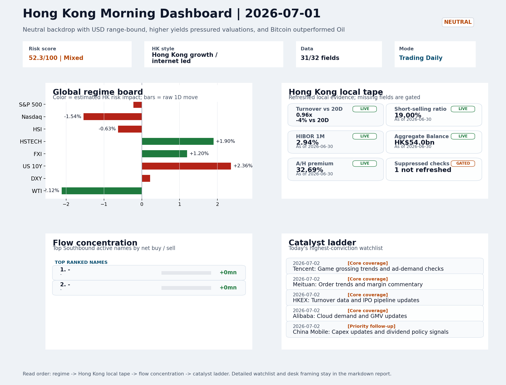

# Morning Research Workbench | 2026-07-02

> Designed for a Hong Kong sell-side commute: Layer 1 `Scan`, Layer 2 `Deep Read`, Layer 3 `Thinking`
> Mode: `Trading Daily` | Keep the report execution-oriented: what mattered in the completed session, what can move Hong Kong leadership, and what needs fast follow-up.
> Briefing date: `2026-07-02` | Review date: `2026-07-01` | Global request: `2026-07-01` | HK/China request: `2026-07-01` | Market effective date: `2026-07-01` | Generated at: `2026-07-02 06:17:31`

## Executive Summary

- **Market pulse:** HSTECH and FXI bucked the higher-yield, lower-Nasdaq overnight with a 1.9% rise, but elevated short-selling and thin turnover keep the move conditional rather than confirmed.
- **Hong Kong lens:** Hong Kong growth / internet led. HSTECH and FXI outperformance provides a constructive anchor, but the Nasdaq drag and short-selling elevation argue for confirming breadth at the open before treating.
- **Top catalysts:** INTC -6.33%; Neutral backdrop with USD range-bound, higher yields pressured valuations, and Bitcoin outperformed Oil.

## Visual Dashboard

## Layer 1 | Scan (5-10 min)

### 1.1 One-Line Market Pulse
HSTECH and FXI bucked the higher-yield, lower-Nasdaq overnight with a 1.9% rise, but elevated short-selling and thin turnover keep the move conditional rather than confirmed.

### 1.2 Global Asset Price Dashboard

| Asset | Last | 1D move | Read |
| --- | --- | --- | --- |
| S&P 500 | 7,483.23 | -0.22% | US large-cap risk appetite |
| Nasdaq 100 | 29,809.13 | **-1.54%** | Growth and duration leadership |
| Hang Seng Index | 22,881.02 | -0.63% | Hong Kong broad beta |
| Hang Seng TECH | 4.3900 | **+1.90%** | Hong Kong growth / platform read-through |
| CSI 300 | 4,868.22 | **-3.03%** | Mainland large-cap tone |
| US 10Y | 4.4750 | **+2.36%** | Global discount-rate anchor |
| China 10Y | 1.74% | +1.2bp | China local rates anchor \| Live public \| Eastmoney \| 2026-07-01 |
| CN-US 10Y spread | -273.5bp | -2.8bp | Relative carry and macro-pressure gauge \| Live public \| Eastmoney \| 2026-07-01 |
| DXY | 101.41 | +0.22% | Dollar liquidity impulse |
| USD/CNH | 6.7605 | +0.00% | Offshore China risk appetite |
| USD/HKD | 7.8432 | +0.04% | Linked-exchange regime stress check |
| Brent crude | 71.17 | **-2.40%** | Energy / geopolitics |
| COMEX gold | 4,051.40 | +0.71% | Hedge demand / real yields |
| Copper | 6.1595 | -0.53% | Global growth proxy |
| VIX | 16.59 | +0.85% | US stress barometer |

### 1.3 Hong Kong Key Data Quick Check
_Coverage gate: 1 unavailable local checks are suppressed here and retained in validation metadata._

| Check | Value | Status | Source / as of | Why it matters |
| --- | --- | --- | --- | --- |
| Main Board turnover vs 20D | 0.96x \| -4% vs 20D | Live local | HKEX \| 2026-06-30 | Trailing 20-session average turnover was HK$319.5bn. |
| Short-selling ratio | 19.00% | Live local | HKEX \| 2026-06-30 | Official HKEX stock-level short-selling table, aggregated as a share of total market turnover. |
| AH premium index | 32.69% | Live public | Yahoo \| 2026-06-30 | Simple average across 18 A/H pairs; use dispersion rather than the average alone. |
| USD/HKD spot vs band | 7.8432 \| band 7.7500 to 7.8500 | Live quote + local | Yahoo \| 2026-07-01 | Inside the linked-exchange band without immediate boundary stress. Official Convertibility Undertakings define the linked-rate stress boundaries for USD/HKD. |
| HIBOR 1M | 2.94% | Live local | HKMA \| 2026-06-30 | 1M HIBOR is the cleanest quick read for Hong Kong funding conditions and equity-duration pressure. |
| Aggregate Balance | HK$54.0bn | Live local | HKMA \| 2026-06-30 | Aggregate Balance helps frame whether linked-rate liquidity conditions are tight or comfortable. |
| Hong Kong leadership | Hong Kong growth / internet led | Proxy | HSI / HSCEI / HSTECH relative perf \| 2026-07-01 | Use HSI / HSCEI / HSTECH relative moves as the opening style read. |

### 1.4 Risk Dashboard
**Composite risk score:** `52.3/100` | **Regime:** `Mixed`

| Component | Score impact | Evidence |
| --- | --- | --- |
| US beta | -1.3 | S&P 500 -0.22% |
| HK growth | +9.5 | HSTECH +1.90% |
| Offshore China proxy | +6.0 | FXI +1.20% |
| Dollar pressure | -2.2 | DXY +0.22% |
| Volatility | -1.7 | VIX +0.85% |
| HK short-selling | -8 | Short-selling ratio 19.00% |

### 1.5 Morning Checklist
1. **INTC -6.33%**
 Mover attribution | Announcement / expectations | Guidance reset and margin pressure
2. **Neutral backdrop with USD range-bound, higher yields pressured valuations, and Bitcoin outperformed Oil**
 Overnight regime | Start by deciding whether the day is about Neutral conditions or a style pivot.
3. **CPI MoM (Released)**
 Macro / policy | Rates expectations, the dollar, and growth-equity valuation | Industries: Technology, Internet, Brokers
4. **Trade Balance (Released)**
 Macro / policy | Watch whether it changes the day's core market narrative | Industries: Market-wide
5. **Retail Sales MoM (Upcoming)**
 Macro / policy | Consumer resilience, growth expectations, and risk-asset pricing | Industries: Consumer, E-commerce, Consumer discretionary

## Layer 2 | Deep Read (20-30 min)

### 2.1 Overnight Overseas Market Review
#### Market Setup
**Core tape.** Higher US yields (+2.36% on the 10Y) weighed on Nasdaq (-1.54%), creating a drag on Hong Kong growth and internet proxies, yet HSTECH (+1.90%) and FXI (+1.20%) held their ground - suggesting selective offshore-China demand.
**Main driver.** Bitcoin's outperformance versus oil (spread of 6.2%) signals risk appetite in digital-asset and alternative-macro corners, but this has not yet translated into broad equity momentum.
**HK relevance.** The combination of hawkish Fed commentary (Hammack on AI-inflation) and Michael Burry's Caterpillar short adds a layer of AI-capex sustainability doubt that may limit the duration of any growth-sector bounce.

#### Key Drivers
- US 10Y yield +2.36% created valuation pressure on Nasdaq and growth-sensitive Hong Kong names, though HSTECH decoupled positively.
- HKEX short-selling ratio at 19.00% remains elevated.
- Bitcoin +3.74% versus Oil -2.12% shows crypto risk-on, but the cross-asset divergence has not fed through to broad equity momentum.
- Hawkish Fed commentary and Burry's contrarian short on Caterpillar introduce AI-capex skepticism that could cap multiple expansion for HK.

#### Hong Kong Read-Through
**Desk lens.** Hong Kong growth / internet led.
**Opening implication.** HSTECH and FXI outperformance provides a constructive anchor, but the Nasdaq drag and short-selling elevation argue for confirming breadth at the open before treating the growth/internet leadership as a durable signal.
- **Cross-market read:** Hang Seng -0.63% / HSCEI -0.62% / HSTECH +1.90%.
- **Cross-market read:** Offshore China proxy FXI +1.20% and USD/CNH +0.00% frame cross-border risk appetite.
- **Cross-market read:** USD/HKD last traded around 7.8432, which keeps the Hong Kong funding lens in focus.

#### Watch Points
- USD composite moved higher by +0.09pct intraday, with a 0.208pct range.
- Main turning points appeared around 2026-07-01 08:15 peak / 2026-07-01 08:45 peak / 2026-07-01 09:10 peak, suggesting event-driven repricing rather.
- The biggest cross-asset divergence was Bitcoin versus Oil, a spread of 6.211pct.
- Gold moved +1.57pct intraday with a 3.778pct high-low range.

**Curated overnight stories**
1. **Cleveland Fed President Hammack says AI could fuel inflation, rate hikes may be necessary**
 Why it matters: A sitting Fed official explicitly linking AI to inflationary persistence shifts the policy framing.
 HK read-through: Direct read-through for Hong Kong growth and internet sectors. Higher-for-longer rates sustain USD strength, compressing HKD liquidity and keeping borrowing costs elevated.
2. **Michael Burry says he's shorting Caterpillar for the first time after it nearly doubled**
 Why it matters: Burry's contrarian call signals skepticism about AI-capex sustainability at current valuations. Caterpillar is a proxy for industrial AI infrastructure spending.
 HK read-through: Relevant for Hong Kong via AI hardware, semiconductor, and industrial automation names. If AI-capex skepticism grows offshore, Chinese AI-adjacent plays (listed in HK).
3. **Inflation peaked in May as energy prices fell in June, Kalshi traders think**
 Why it matters: Market pricing through Kalshi indicates the inflation cycle has likely peaked. This provides a partial counterweight to Hammack's hawkish commentary and supports.
 HK read-through: Mildly supportive for Hong Kong risk sentiment if rate-cut expectations revive. Could provide relief for rate-sensitive sectors (REITs, financials) and growth-oriented.
4. **Warsh faces multiple alternative inflation signs as Fed charts new course**
 Why it matters: Former Fed Governor Warsh's reference to alternative inflation measures adds to the policy uncertainty.
 HK read-through: Reinforces the uncertain rate backdrop. For Hong Kong, this means USD direction remains unclear - limiting a clear tailwind for HKD assets but also reducing tail risk.
5. **China-linked actors target more than technology as AI competition with U.S. intensifies**
 Why it matters: Broadening the scope of US-China AI competition beyond semiconductor restrictions introduces geopolitical risk for Chinese tech firms.
 HK read-through: Adds a layer of policy risk for Hong Kong tech and internet names with US exposure or ADR listings.

### 2.2 Hong Kong / A-share Previous-Day Review
#### Local Tape Setup
**Local read.** On 1 July, HSTECH rose 1.9% while HSI and HSCEI both declined over 0.6%, signalling a growth/internet-led divergence from broad beta.
**Verification point.** FXI gained 1.2%, and ETF flow proxies indicated net buying in the HSTECH ETF (3033.HK) but outflows from the HSCEI ETF (2828.HK).
**Risk to watch.** Official Stock Connect turnover data is unavailable, so local flow confirmation is incomplete; an elevated short-selling ratio of 19% (as of 30 June) warrants caution.

#### Style and Local Leadership
**Style leadership.** Hong Kong growth / internet led.
- **Cross-market read:** Hang Seng -0.63% / HSCEI -0.62% / HSTECH +1.90%.
- **Cross-market read:** Offshore China proxy FXI +1.20% and USD/CNH +0.00% frame cross-border risk appetite.
- **Cross-market read:** USD/HKD last traded around 7.8432, which keeps the Hong Kong funding lens in focus.

#### Flow Confirmation
Official Stock Connect evidence is available; use Section 2.3 to confirm whether local money supports the price action.

#### Follow-Through Checklist
**Follow-through check.** Monitor whether CSI 300 technology names and available southbound flows confirm the same style preference; HSTECH must sustain gains against the US 10Y yield rise and any short-covering signals from the elevated short-selling ratio.

### 2.3 Flow Tracker and Attribution
#### Cross-Asset Attribution v1

| Driver | Direction | Score | Evidence | HK implication |
| --- | --- | --- | --- | --- |
| Rates impulse | drag | 2.83 | US 10Y yield proxy moved +2.36%. | Lower yields help long-duration growth; higher yields pressure valuation-sensitive |
| Short-selling pressure | drag | 2.8 | HKEX short-selling ratio was 19.00%. | Elevated short activity argues for extra confirmation before chasing rebounds. |
| US growth-style transmission | drag | 2.16 | Nasdaq 100 moved -1.54%. | Hong Kong growth and platform names should be tested first at the open. |
| Oil and geopolitics | supportive | 1.92 | Oil moved -2.40%. | Split the read between energy/cyclicals support and margin/geopolitical pressure. |

#### Flow Tracker
##### Flow Takeaways
- Short-selling pressure is elevated, so local rebounds need cleaner breadth and flow confirmation.
- AH premium: simple covered-pair average +32.69%; widest premium: China Communications Construction 83.63%.
- ETF flow anomalies were concentrated in: 2828.HK -0.51% / volume ratio 1.86x / outflow; KWEB +2.66% / volume ratio 1.49x / inflow; USO -2.98% / volume ratio 0.59x / outflow.
- HKEX short selling: 19.00% of market turnover (HK$57.5bn short turnover, as of 2026-06-30).

##### Stock Connect Southbound Active Names

| Rank | Ticker | Name | Buy | Sell | Net buy |
| --- | --- | --- | --- | --- | --- |
| 1 | | - | N/A | N/A | N/A |
| 1 | | - | N/A | N/A | N/A |

##### AH Premium Dispersion

| Name | A ticker | H ticker | Premium | As of |
| --- | --- | --- | --- | --- |
| China Communications Construction | 601800.SS | 1800.HK | +83.63% | 2026-06-30 |
| China Life | 601628.SS | 2628.HK | +67.86% | 2026-06-30 |
| China Railway Construction | 601186.SS | 1186.HK | +52.77% | 2026-06-30 |
| New China Life | 601336.SS | 1336.HK | +49.60% | 2026-06-30 |
| China Railway | 601390.SS | 0390.HK | +48.17% | 2026-06-30 |

##### HKEX Short-Selling Watch

| Ticker | Name | Short ratio | Short turnover | Total turnover |
| --- | --- | --- | --- | --- |
| 00388.HK | HKEX | 20.86% | HK$0.4bn | HK$2.1bn |
| 00700.HK | TENCENT | 15.89% | HK$2.7bn | HK$16.7bn |
| 00941.HK | CHINA MOBILE | 21.47% | HK$0.5bn | HK$2.4bn |
| 01211.HK | BYD COMPANY | 27.16% | HK$0.6bn | HK$2.1bn |
| 01299.HK | AIA | 24.97% | HK$0.6bn | HK$2.4bn |

- **Short-value leaders:** 03033.HK CSOP HS TECH (HK$4.5bn); 07709.HK XL2CSOPHYNIX (HK$4.1bn); 00981.HK SMIC (HK$2.7bn); 00700.HK TENCENT (HK$2.7bn).

### 2.4 Macro and Policy Tracking
**Desk read.** The macro backdrop is already shifting intraday with a hot US CPI print (0.3% MoM versus 0.2% forecast) and a stronger-than-expected China trade balance (USD 85.2bn versus USD 79.0bn).

**Market sensitivity.** The combination of above-forecast US inflation and better Chinese export data creates a mixed signal for Hong Kong risk appetite.

**HK implication.** The 2.36% jump in US 10Y yields is the dominant near-term repricing risk for H-share and tech valuations.

**Macro watchpoints**
- US 10Y yield direction and whether 4.475% holds as a resistance level.
- DXY reaction to the hot CPI print and any Powell hawkishness.
- HK tech and internet sector performance relative to financials and property.
- China Loan Prime Rate decision at 09:20 (forecast steady at 3.45%) and PBOC liquidity operations.

| Time | Region | Event | Status | Desk read |
| --- | --- | --- | --- | --- |
| 20:30 | US | CPI MoM | Released | Impact: Rates expectations, the dollar, and growth-equity valuation \| Attention: 5/5 \| Industries: Technology, Internet, Brokers |
| 09:30 | China | Trade Balance | Released | Impact: Watch whether it changes the day's core market narrative \| Attention: 3/5 \| Industries: Market-wide |
| 20:30 | US | Retail Sales MoM | Upcoming | Impact: Consumer resilience, growth expectations, and risk-asset pricing \| Attention: 5/5 \| Industries: Consumer, E-commerce, Consumer discretionary |
| 09:20 | China | Loan Prime Rate | Upcoming | Impact: Watch whether it changes the day's core market narrative \| Attention: 3/5 \| Industries: Market-wide |
| 22:00 | Federal Reserve | Jerome Powell: Economic outlook remarks | Central bank | Impact: Policy path, liquidity conditions, and cross-asset risk appetite \| Attention: 5/5 \| Industries: Technology, Financials, Gold |
| 10:00 | PBOC | Open Market Operations Desk: Daily liquidity operation window | Central bank | Impact: Policy path, liquidity conditions, and cross-asset risk appetite \| Attention: 3/5 \| Industries: Technology, Financials, Gold |

#### Positioning and Risk Backdrop
- Options activity centered on KWEB Call, with Vol/OI at 1.88x and a bullish bias.
- Put/Call structure shows equity 0.68 / index 1.15, implying Single-stock optimism with index hedging.
- Geopolitics: Middle East | Regional tension remains elevated | Impact: Oil, freight costs, and safe-haven demand
- Geopolitics: US-China | Technology export-control rhetoric remains active | Impact: China internet, semiconductors, and supply chains

### 2.5 Key Company and Sector Events
No high-conviction sector story cleared the main-report relevance gate for this run.

#### HKEX Announcements

| Grade | Ticker | Type | Release time | Title |
| --- | --- | --- | --- | --- |
| A | 05834.HK | Profit warning | 2026-07-01 | Profit warning / alert announcement |
| A | 06680.HK | Profit warning | 2026-07-01 | Profit warning / alert announcement |
| A | 00327.HK | Profit warning | 2026-06-30 | Profit warning / alert announcement |
| A | 00818.HK | Profit warning | 2026-06-30 | Profit warning / alert announcement |
| A | 01053.HK | Profit warning | 2026-06-30 | Profit warning / alert announcement |
| A | 06888.HK | Profit warning | 2026-06-30 | Profit warning / alert announcement |
| A | 00343.HK | Profit warning | 2026-06-29 | Profit warning / alert announcement |
| A | 00372.HK | Profit warning | 2026-06-29 | Profit warning / alert announcement |

#### Earnings / Results Watch

| Ticker | Company | Timing | Expectation framing |
| --- | --- | --- | --- |
| 0700.HK | Tencent Holdings | After Market Close | EPS est. 4.15 HKD \| revenue est. 163.2bn HKD |
| 0388.HK | Hong Kong Exchanges and Clearing | Before Market Open | EPS est. 2.81 HKD \| revenue est. 6.0bn HKD |

#### Rating Changes
- **9988.HK** | Morgan Stanley | Upgrade | Equal Weight -> Overweight | PT 92 -> 105

#### IPO Watch
- IPO and grey-market monitoring is not yet part of the standard production pack.

### 2.6 Today's Core Names
#### Core coverage

| Name | Ticker | Last | 1D | Range position | Morning note |
| --- | --- | --- | --- | --- | --- |
| Tencent | 0700.HK | 429.80 | +2.28% | Bottom of range | Short-term price strength is clear; fresh catalysts could trigger broader group follow-through. |
| Meituan | 3690.HK | 68.50 | +1.26% | Bottom of range | The name sits near the bottom of its recent range and is worth monitoring for a catalyst-led reversal. |

**Recent headlines for Meituan:**
- [China's Meituan says new AI model trained on domestic chips](https://www.yahoo.com/news/articles/chinas-meituan-says-ai-model-084400341.html) (Reuters)

#### Priority follow-up

| Name | Ticker | Last | 1D | Range position | Morning note |
| --- | --- | --- | --- | --- | --- |
| China Mobile | 0941.HK | 76.15 | -1.42% | Bottom of range | The name sits near the bottom of its recent range and is worth monitoring for a catalyst-led reversal. |
| AIA | 1299.HK | 71.45 | -1.04% | Bottom of range | The name sits near the bottom of its recent range and is worth monitoring for a catalyst-led reversal. |

## Layer 3 | Thinking (10-15 min)

### 3.1 Rotating Theme Deep Dive

| Field | Read |
| --- | --- |
| Theme | China Exports and Supply-Chain Relocation |
| Angle for the day | Track tariffs, trade policy, shipping, and manufacturing orders to see whether export resilience is still the cleaner China macro expression. |

**Theme desk read**
**Core thesis.** The weekly theme of China exports and supply-chain relocation remains directly relevant after the 2 July Trade Balance release.
**Evidence.** With the overnight backdrop neutral, US 10Y yields higher (pressuring growth).
**What to test.** Related names 0941.HK and 1211.HK sit at the bottom of their ranges; both have catalysts on 2 July - capex/dividend updates and weekly sales data, respectively - that could validate or challenge the trade-led narrative.

**Signals to keep in mind**
- Bitcoin +3.74%: A strong crypto tape reinforces the risk-on read.
- US 10Y +2.36%: Higher yields can pressure long-duration and growth valuations.

**LLM watch items:**
- Confirm whether the Trade Balance beat translates into outperformance of Hong Kong-listed export sectors in the early session.
- 0941.HK: capex guidance and dividend policy - if stable, the yield support may trigger a range reversal.
- 1211.HK: weekly sales data and any commentary on export mix or price competition.
- US Retail Sales (2 July) as a lead indicator for future export orders.
- Bitcoin risk-on signal: monitor whether it correlates with a bid in China cyclicals or remains isolated.

**Related names to keep close:**

| Name | Ticker | Bucket | Morning read |
| --- | --- | --- | --- |
| China Mobile | 0941.HK | Priority follow-up | The name sits near the bottom of its recent range and is worth monitoring for a catalyst-led reversal. |
| BYD Company | 1211.HK | Priority follow-up | The name sits near the bottom of its recent range and is worth monitoring for a catalyst-led reversal. |

**Upcoming catalysts tied to the theme:**
- 2026-07-02 | China Mobile: Capex updates and dividend policy signals | Defensive SOE benchmark for yield trade and domestic digital-infrastructure spend
- 2026-07-02 | BYD Company: Weekly sales data and model rollout cadence | Hong Kong-listed proxy for EV volumes, export mix, and price competition

### 3.2 Today Ahead and Trading Calendar
- Macro: CPI MoM is the first item to anchor the open and the rates/FX response.
- Corporate / event: Tencent: Game grossing trends and ad-demand checks is the cleanest same-day catalyst to prepare for.

**Same-day macro docket**

| Time | Country | Event | Status | Detail |
| --- | --- | --- | --- | --- |
| 20:30 | US | CPI MoM | Released | Actual 0.3% / Forecast 0.2% / Prior 0.4% |
| 09:30 | China | Trade Balance | Released | Actual USD 85.2bn / Forecast USD 79.0bn / Prior USD 80.6bn |
| 20:30 | US | Retail Sales MoM | Upcoming | Forecast 0.3% / Prior 0.6% |
| 09:20 | China | Loan Prime Rate | Upcoming | Forecast 3.45% / Prior 3.45% |
| 22:00 | Federal Reserve | Jerome Powell: Economic outlook remarks | Central bank | speech |

**Same-day catalyst list**

| Date | Time | Category | Event | Importance |
| --- | --- | --- | --- | --- |
| 2026-07-02 | | Core coverage | Tencent: Game grossing trends and ad-demand checks | 3 |
| 2026-07-02 | | Core coverage | Meituan: Order trends and margin commentary | 3 |
| 2026-07-02 | | Core coverage | HKEX: Turnover data and IPO pipeline updates | 3 |
| 2026-07-02 | | Core coverage | Alibaba: Cloud demand and GMV updates | 3 |

**Next few sessions**

| Date | Category | Event | Impact |
| --- | --- | --- | --- |
| 2026-07-02 | Core coverage | Tencent: Game grossing trends and ad-demand checks | Core offshore China platform proxy for gaming, ads, and AI monetization |
| 2026-07-02 | Core coverage | Meituan: Order trends and margin commentary | High-frequency read on local services demand and platform competition |
| 2026-07-02 | Core coverage | HKEX: Turnover data and IPO pipeline updates | Direct proxy for Hong Kong market turnover, listings, and southbound |
| 2026-07-02 | Core coverage | Alibaba: Cloud demand and GMV updates | Key read-through for China consumption, cloud, and platform regulation |

### 3.3 Daily One Chart
**Daily One Chart | HKEX short-selling pressure map**

**Chart read.** Market short-selling reached 19.00% of turnover.
**Why it matters.** The chart leads today because the pressure is either broad, concentrated, or acute in the top name.

_Source: HKEX Daily Quotations - Short Selling Turnover_

## Traceable Appendix

### Report Metadata
> Date policy: Review date 2026-07-01 is treated as `Trading Daily`. | Global request date is 2026-07-01; adapter effective date is 2026-07-01 and summary date is 2026-07-01. | HK/China local data date is 2026-07-01; role: same-session local cash tape.
> Market data quality: Coverage: `31/32` | Stale items (>1d): `1` | Missing: `1`
> Report quality: `86.4/100` | Grade `B` | Status `production ready`

### Key Questions to Keep in Mind
- Is risk appetite rising or fading? The overnight tape reads closer to `Neutral`.
- Did rates expectations move? Focus on whether US 10Y, DXY, and growth style moved together.
- Were commodities the real story? Watch WTI and gold for geopolitics versus inflation signals.
- Is Hong Kong setup internet-led, SOE-led, or broad beta-led? Compare HSTECH, HSCEI, and HSI.
- Did offshore markets move China risk appetite? Focus on HSI, FXI, USD/CNH, and USD/HKD.

### Report Quality and Validation
- **Quality score:** 86.4/100 | **Grade:** B | **Status:** production ready
- **Run summary:** 7 healthy | 1 caveat | 0 failed
- **Release recommendation:** Send with caveats | The report is usable, but the advisory guidance should travel with it so readers understand the data gaps.

| Source | Status | Bucket |
| --- | --- | --- |
| Market data | ok | healthy |
| Sector and company news | ok | healthy |
| Movers and short selling | ok | healthy |
| Stock Connect | ok | healthy |
| A/H premium | ok | healthy |
| Hong Kong local package | ok | healthy |
| China rates | ok | healthy |
| Narrative overlay | partial | caveat |

**Desk-use guidance summary:** 0 blocking | 1 advisory

**Desk-use guidance**
- **Advisory:** Use deterministic sections as primary support; the narrative overlay was partial or unavailable on this run.

| Component | Score | Weight | Read |
| --- | --- | --- | --- |
| Market data coverage | 96.9 | 0.3 | 31/32 core market fields available. |
| Hong Kong local metrics | 73.2 | 0.25 | 7 live, 3 proxy, 1 unavailable local checks. |
| Key public adapters | 100.0 | 0.2 | 4/4 key adapters were available or partially available. |
| Narrative overlay health | 60.0 | 0.15 | 3/7 narrative overlay tasks succeeded or used validated cache; 1 error(s). |
| Fact-check guardrail | 100.0 | 0.1 | Checked 6 numeric claims; 0 numeric mismatch(es), 0 logic warning(s); 0 critical, 0 review. |

**Narrative fact-check guardrail**
- Checked 6 numeric claims; 0 numeric mismatch(es), 0 logic warning(s); 0 critical, 0 review.

**Adapter status**

| Adapter | Status |
| --- | --- |
| Stock Connect | ok |
| A/H premium | ok |
| HKEX announcements | ok |
| China rates | ok |

### Source Links
- [China's Meituan says new AI model trained on domestic chips](https://www.yahoo.com/news/articles/chinas-meituan-says-ai-model-084400341.html) (Reuters)
- [Alibaba to pay $600M to settle allegations it allowed illegal drug and equipment sales](https://finance.yahoo.com/technology/articles/alibaba-pay-us-600m-settle-201459550.html) (Associated Press)
- [Alibaba, U.S. Payment Processor to Pay $600 Million in DOJ Settlement Over Illegal Drug Sales](https://www.wsj.com/business/alibaba-u-s-payment-processor-to-pay-600-million-in-doj-settlement-over-illegal-drug-sales-23c40942?siteid=yhoof2&yptr=yahoo) (The Wall Street Journal)
- [05834.HK Profit warning / alert announcement](http://www1.hkexnews.hk/listedco/listconews/sehk/2026/0701/2026070100201.pdf) (HKEXnews)
- [00327.HK Profit warning / alert announcement](http://www1.hkexnews.hk/listedco/listconews/sehk/2026/0630/2026063001618.pdf) (HKEXnews)
- [00818.HK Profit warning / alert announcement](http://www1.hkexnews.hk/listedco/listconews/sehk/2026/0630/2026063001696.pdf) (HKEXnews)
- [01053.HK Profit warning / alert announcement](http://www1.hkexnews.hk/listedco/listconews/sehk/2026/0630/2026063003071.pdf) (HKEXnews)
- [06888.HK Profit warning / alert announcement](http://www1.hkexnews.hk/listedco/listconews/sehk/2026/0630/2026063001345.pdf) (HKEXnews)
- [00343.HK Profit warning / alert announcement](http://www1.hkexnews.hk/listedco/listconews/sehk/2026/0629/2026062902659.pdf) (HKEXnews)
- [00372.HK Profit warning / alert announcement](http://www1.hkexnews.hk/listedco/listconews/sehk/2026/0629/2026062901783.pdf) (HKEXnews)

## Supplementary Visual Appendix

This appendix is professional-path only. It keeps a traceable index of the report visuals and the deterministic chart cues used to frame the morning note, without injecting the legacy intraday chart pack.

### Visual Index

| Visual | Path | Role |
| --- | --- | --- |
| Visual Dashboard | `charts/dashboard_2026-07-02.png` | Cross-asset regime board and Hong Kong local tape snapshot. |
| Daily One Chart | `charts/daily_one_chart_2026-07-02.png` | Single highest-conviction visual story for the day. |

### Deterministic Chart Cues
- FX / liquidity: USD composite moved higher by +0.09pct intraday, with a 0.208pct range.
- FX / liquidity: Main turning points appeared around 2026-07-01 08:15 peak / 2026-07-01 08:45 peak / 2026-07-01 09:10 peak, suggesting event-driven repricing rather than a clean one-way USD move.
- Cross-asset: The biggest cross-asset divergence was Bitcoin versus Oil, a spread of 6.211pct.
- Cross-asset: Gold moved +1.57pct intraday with a 3.778pct high-low range.
- Cross-asset: Oil moved -2.58pct intraday with a 2.649pct high-low range.
- Cross-asset: Bitcoin moved +3.63pct intraday with a 4.607pct high-low range.

### Risk Dashboard Components

| Component | Score impact | Evidence |
| --- | --- | --- |
| US beta | -1.3 | S&P 500 -0.22% |
| HK growth | +9.5 | HSTECH +1.90% |
| Offshore China proxy | +6.0 | FXI +1.20% |
| Dollar pressure | -2.2 | DXY +0.22% |
| Volatility | -1.7 | VIX +0.85% |
| HK short-selling | -8 | Short-selling ratio 19.00% |
