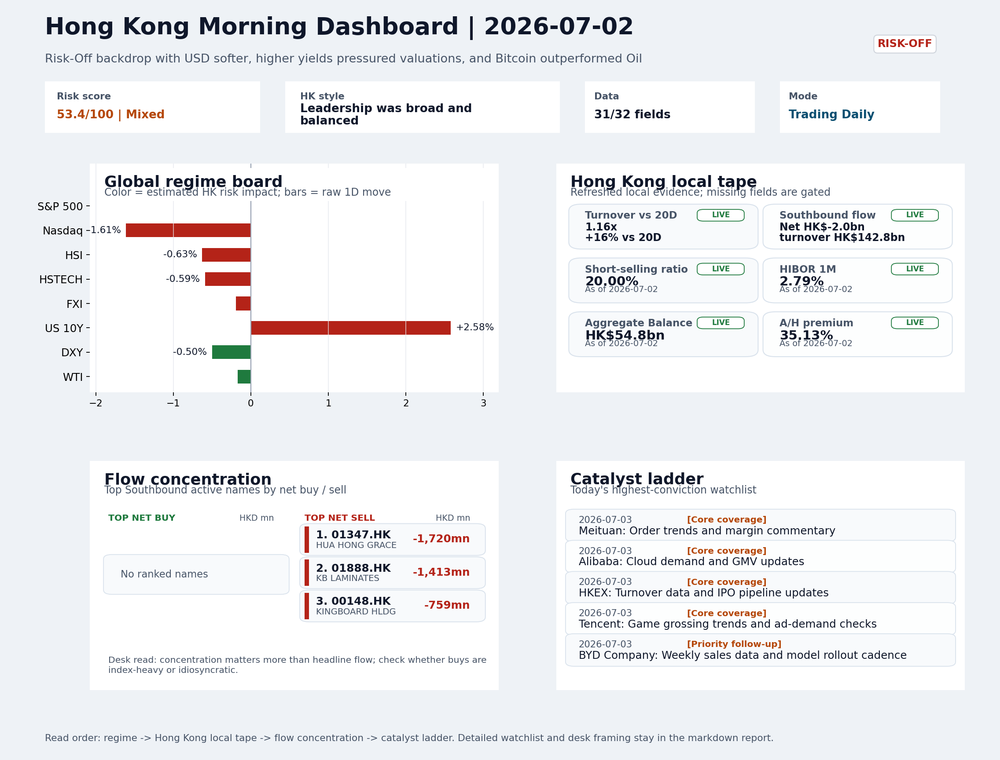
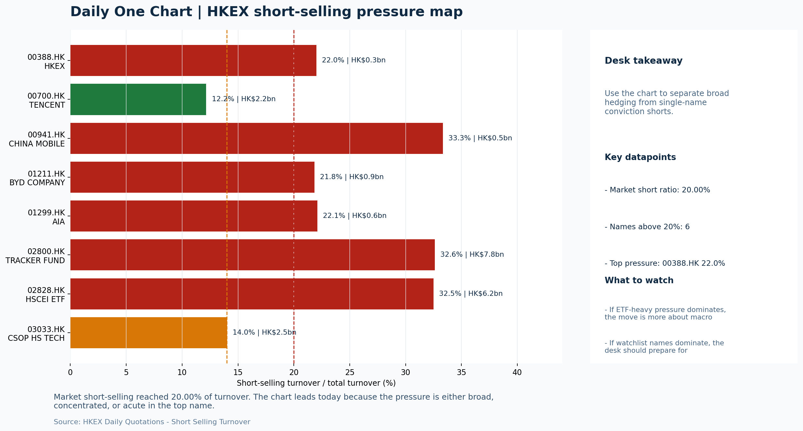

# Morning Research Workbench | 2026-07-03

> Designed for a Hong Kong sell-side commute: Layer 1 `Scan`, Layer 2 `Deep Read`, Layer 3 `Thinking`
> Mode: `Trading Daily` | Keep the report execution-oriented: what mattered in the completed session, what can move Hong Kong leadership, and what needs fast follow-up.
> Briefing date: `2026-07-03` | Review date: `2026-07-02` | Global request: `2026-07-02` | HK/China request: `2026-07-02` | Market effective date: `2026-07-02` | Generated at: `2026-07-03 06:05:57`

## Executive Summary

- **Market pulse:** A Risk-Off overnight with higher yields and a softer dollar leaves Hong Kong opening under pressure, but elevated short-selling and Southbound outflows mean local rebounds need cleaner.
- **Hong Kong lens:** Growth-neutral: HSTECH (-0.59%) roughly matched HSCEI (-0.62%) and HSI (-0.63%), with no actionable style leadership.. Hong Kong is expected to open lower, with HSTECH and internet names bearing the most direct pressure from Nasdaq 100 weakness and higher yields.
- **Top catalysts:** INTC -6.33%; Risk-Off backdrop with USD softer, higher yields pressured valuations, and Bitcoin outperformed Oil.

## Visual Dashboard

## Layer 1 | Scan (5-10 min)

### 1.1 One-Line Market Pulse
A Risk-Off overnight with higher yields and a softer dollar leaves Hong Kong opening under pressure, but elevated short-selling and Southbound outflows mean local rebounds need cleaner breadth and flow confirmation.

### 1.2 Global Asset Price Dashboard

| Asset | Last | 1D move | Read |
| --- | --- | --- | --- |
| S&P 500 | 7,483.24 | +0.00% | US large-cap risk appetite |
| Nasdaq 100 | 29,329.21 | **-1.61%** | Growth and duration leadership |
| Hang Seng Index | 22,881.02 | -0.63% | Hong Kong broad beta |
| Hang Seng TECH | 4.3640 | -0.59% | Hong Kong growth / platform read-through |
| CSI 300 | 4,868.22 | **-3.03%** | Mainland large-cap tone |
| US 10Y | 4.4850 | **+2.58%** | Global discount-rate anchor |
| China 10Y | 1.74% | -0.4bp | China local rates anchor \| Live public \| Eastmoney \| 2026-07-02 |
| CN-US 10Y spread | -274.9bp | -1.4bp | Relative carry and macro-pressure gauge \| Live public \| Eastmoney \| 2026-07-02 |
| DXY | 100.88 | -0.50% | Dollar liquidity impulse |
| USD/CNH | 6.7560 | +0.00% | Offshore China risk appetite |
| USD/HKD | 7.8422 | -0.00% | Linked-exchange regime stress check |
| Brent crude | 71.54 | -0.04% | Energy / geopolitics |
| COMEX gold | 4,135.50 | **+1.65%** | Hedge demand / real yields |
| Copper | 6.1755 | +0.85% | Global growth proxy |
| VIX | 16.15 | **-2.65%** | US stress barometer |

### 1.3 Hong Kong Key Data Quick Check

| Check | Value | Status | Source / as of | Why it matters |
| --- | --- | --- | --- | --- |
| Main Board turnover vs 20D | 1.16x \| +16% vs 20D | Live local | HKEX \| 2026-07-02 | Trailing 20-session average turnover was HK$318.4bn. |
| Southbound / Northbound net flow | Southbound Net HK$-2.0bn \| turnover HK$142.8bn \| Northbound Turnover HK$424.0bn \| net not reported | Live local | HKEX Connect \| 2026-07-02 | Southbound net buy is calculated from HKEX disclosed buy and sell turnover. |
| Short-selling ratio | 20.00% | Live local | HKEX \| 2026-07-02 | Official HKEX stock-level short-selling table, aggregated as a share of total market turnover. |
| AH premium index | 35.13% | Live public | Yahoo \| 2026-07-02 | Simple average across 17 A/H pairs; use dispersion rather than the average alone. |
| USD/HKD spot vs band | 7.8422 \| band 7.7500 to 7.8500 | Live quote + local | Yahoo \| 2026-07-02 | Inside the linked-exchange band without immediate boundary stress. Official Convertibility Undertakings define the linked-rate stress boundaries for USD/HKD. |
| HIBOR 1M | 2.79% | Live local | HKMA \| 2026-07-02 | 1M HIBOR is the cleanest quick read for Hong Kong funding conditions and equity-duration pressure. |
| Aggregate Balance | HK$54.8bn | Live local | HKMA \| 2026-07-02 | Aggregate Balance helps frame whether linked-rate liquidity conditions are tight or comfortable. |
| Hong Kong leadership | Growth-neutral: HSTECH (-0.59%) roughly matched HSCEI (-0.62%) and HSI (-0.63%), with no actionable style leadership. | Proxy | HSI / HSCEI / HSTECH relative perf \| 2026-07-02 | Use HSI / HSCEI / HSTECH relative moves as the opening style read. |

### 1.4 Risk Dashboard
**Composite risk score:** `53.4/100` | **Regime:** `Mixed`

| Component | Score impact | Evidence |
| --- | --- | --- |
| US beta | +0.0 | S&P 500 +0.00% |
| HK growth | -2.9 | HSTECH -0.59% |
| Offshore China proxy | -0.9 | FXI -0.19% |
| Dollar pressure | +5.0 | DXY -0.50% |
| Volatility | +5.3 | VIX -2.65% |
| HK short-selling | -8 | Short-selling ratio 20.00% |

### 1.5 Morning Checklist
1. **INTC -6.33%**
 Mover attribution | Announcement / expectations | Guidance reset and margin pressure
2. **Risk-Off backdrop with USD softer, higher yields pressured valuations, and Bitcoin outperformed Oil**
 Overnight regime | Start by deciding whether the day is about Risk-Off conditions or a style pivot.
3. **CPI MoM (Released)**
 Macro / policy | Rates expectations, the dollar, and growth-equity valuation | Industries: Technology, Internet, Brokers
4. **[A] Alibaba-affiliate Ant Group rushes into humanoid robots with a dozen deals in 18 months**
 News / announcements | Capital allocation or shareholder-return events can trigger a valuation reset
5. **Trade Balance (Released)**
 Macro / policy | Watch whether it changes the day's core market narrative | Industries: Market-wide

## Layer 2 | Deep Read (20-30 min)

### 2.1 Overnight Overseas Market Review
#### Market Setup
**Core tape.** US equities closed mixed but risk-off pressure centered on growth: the S&P 500 was unchanged while the Nasdaq 100 fell 1.61% as US 10Y yields jumped 2.58%.
**Main driver.** Semiconductor caution from the INTC guidance reset and Magnificent 7 weakness deepened the tech drag, while a softer DXY (-0.50%) cushioned broader asset re-pricing.
**HK relevance.** For Hong Kong, the combination of higher yields and stable CNH keeps HSTECH particularly exposed to growth-style rotation, though lower VIX and firm turnover argue against a disorderly open.

#### Key Drivers
- US 10Y yield rose +2.58%, directly compressing long-duration growth valuations and driving the Nasdaq 100 -1.61% decline.
- INTC -6.33% guidance reset and Magnificent 7 underperformance extended the risk-off tone, reinforcing tech sector caution.
- DXY eased -0.50% but USD/CNH was unchanged, so the FX offset to Hong Kong flows is modest.
- VIX dipped -2.65%, indicating the repricing was a style rotation rather than a systemic liquidation.

#### Hong Kong Read-Through
**Desk lens.** Leadership was broad and balanced.
**Opening implication.** Hong Kong is expected to open lower, with HSTECH and internet names bearing the most direct pressure from Nasdaq 100 weakness and higher yields. Elevated short-selling at 20% and turnover at 1.16x suggest local positioning is already cautious.
- **Cross-market read:** Hang Seng -0.63% / HSCEI -0.62% / HSTECH -0.59%.
- **Cross-market read:** Offshore China proxy FXI -0.19% and USD/CNH +0.00% frame cross-border risk appetite.
- **Cross-market read:** USD/HKD last traded around 7.8422, which keeps the Hong Kong funding lens in focus.

#### Watch Points
- USD composite moved lower by -0.46pct intraday, with a 0.552pct range.
- Main turning points appeared around 2026-07-02 08:05 trough / 2026-07-02 08:25 peak / 2026-07-02 08:40 peak, suggesting event-driven repricing.
- The biggest cross-asset divergence was Bitcoin versus Oil, a spread of 1.674pct.
- Gold moved +1.28pct intraday with a 2.123pct high-low range.

**Curated overnight stories**
1. **Risk-Off backdrop with USD softer, higher yields pressured valuations, and Bitcoin**
 Why it matters: Sets the overnight regime framing for HK. Softer USD offers some CNH/HKD relief, but higher yields directly compress growth-sector multiples that dominate Hang Seng index.
 HK read-through: Most relevant for HSI constituents with high duration/growth exposure - internet, healthcare, and property. USD/CNH direction shapes cross-border flow sentiment.
2. **INTC -6.33%: Guidance reset and margin pressure**
 Why it matters: Semiconductor sector guidance reset signals broader tech earnings caution. Extends the June Magnificent 7 underperformance narrative into Q3 earnings visibility.
 HK read-through: Relevant for HK tech and semiconductor supply chain (e.g., SMIC, Hua Hong). Risk-off in global chip names could weigh on local hardware/tech sentiment even without direct.
3. **Alibaba-affiliate Ant Group rushes into humanoid robots with a dozen deals in 18 months**
 Why it matters: Grade-A graded story. Ant's aggressive capital deployment into robotics signals a strategic pivot in Alibaba affiliate allocation.
 HK read-through: Direct read-through to Alibaba and close China Internet peers. Also signals broader tech sector appetite for non-core diversification - watch for comparable capital-allocation.
4. **'Magnificent 7' stocks' rough June pushes them into the red for the year**
 Why it matters: Confirms the leadership rotation theme. If mega-cap tech momentum breaks, capital could redistribute to other regions or sectors - a potential structural shift for global.
 HK read-through: Indirect but relevant: rotation away from US mega-caps could benefit HK growth positioning if global allocators rebalance into EM/China names. Monitor flows.

### 2.2 Hong Kong / A-share Previous-Day Review
#### Local Tape Setup
**Local read.** Hong Kong absorbed overnight tech weakness without a pronounced growth selloff.
**Verification point.** However, elevated short-selling at 20.00% and Southbound net outflows (HK$-2.0bn) signal cautious positioning, so the apparent HSTECH stability remains tentative.
**Risk to watch.** The stable USD/CNH at 6.756 provided some FX cushion, but the lack of a clear style divergence limits conviction in a local growth rotation.

#### Style and Local Leadership
**Style leadership.** Growth-neutral: HSTECH (-0.59%) roughly matched HSCEI (-0.62%) and HSI (-0.63%), with no actionable style leadership..
- **Cross-market read:** Hang Seng -0.63% / HSCEI -0.62% / HSTECH -0.59%.
- **Cross-market read:** Offshore China proxy FXI -0.19% and USD/CNH +0.00% frame cross-border risk appetite.
- **Cross-market read:** USD/HKD last traded around 7.8422, which keeps the Hong Kong funding lens in focus.

#### Flow Confirmation
Official Stock Connect evidence is available; use Section 2.3 to confirm whether local money supports the price action.

#### Follow-Through Checklist
**Follow-through check.** Watch for HSTECH to outperform HSI by at least 0.5pp, accompanied by Southbound net inflows and a short-selling ratio retreat toward 17%. Northbound net-buy data is unavailable; cross-market flow confirmation remains incomplete without it.

### 2.3 Flow Tracker and Attribution
#### Cross-Asset Attribution v1

| Driver | Direction | Score | Evidence | HK implication |
| --- | --- | --- | --- | --- |
| Short-selling pressure | drag | 3.5 | HKEX short-selling ratio was 20.00%. | Elevated short activity argues for extra confirmation before chasing rebounds. |
| Rates impulse | drag | 3.1 | US 10Y yield proxy moved +2.58%. | Lower yields help long-duration growth; higher yields pressure valuation-sensitive |
| US growth-style transmission | drag | 2.25 | Nasdaq 100 moved -1.61%. | Hong Kong growth and platform names should be tested first at the open. |
| Hong Kong participation | supportive | 1.61 | Main Board turnover was 1.16x the 20-session average. | Higher participation makes local price action more credible. |
| Dollar / CNH pressure | supportive | 0.75 | DXY -0.50% / USD-CNH +0.00% | A stable or softer CNH makes Hong Kong follow-through more credible. |

#### Flow Tracker
##### Flow Takeaways
- Short-selling pressure is elevated, so local rebounds need cleaner breadth and flow confirmation.
- Stock Connect Southbound: net HK$-2.0bn on turnover HK$142.8bn (as of 2026-07-02).
- Stock Connect Northbound: turnover RMB424.0bn; public file provides total turnover/top active names, not full net-buy.
- AH premium: simple covered-pair average +35.13%; widest premium: China Communications Construction 106.67%.

##### Stock Connect Southbound Active Names

| Rank | Ticker | Name | Buy | Sell | Net buy |
| --- | --- | --- | --- | --- | --- |
| 4 | 01347.HK | HUA HONG GRACE | HK$2,398.4mn | HK$4,118.2mn | HK$-1,719.7mn |
| 4 | 01888.HK | KB LAMINATES | HK$2,329.0mn | HK$3,742.4mn | HK$-1,413.4mn |
| 7 | 00148.HK | KINGBOARD HLDG | HK$1,397.4mn | HK$2,155.9mn | HK$-758.5mn |
| 1 | 00981.HK | SMIC | HK$6,227.6mn | HK$6,832.3mn | HK$-604.7mn |
| 2 | 00700.HK | TENCENT | HK$4,113.2mn | HK$4,616.5mn | HK$-503.3mn |

##### AH Premium Dispersion

| Name | A ticker | H ticker | Premium | As of |
| --- | --- | --- | --- | --- |
| China Communications Construction | 601800.SS | 1800.HK | +106.67% | 2026-07-02 |
| China Life | 601628.SS | 2628.HK | +58.37% | 2026-07-02 |
| New China Life | 601336.SS | 1336.HK | +54.72% | 2026-07-02 |
| China Railway Construction | 601186.SS | 1186.HK | +52.63% | 2026-07-02 |
| China Railway | 601390.SS | 0390.HK | +49.98% | 2026-07-02 |

##### HKEX Short-Selling Watch

| Ticker | Name | Short ratio | Short turnover | Total turnover |
| --- | --- | --- | --- | --- |
| 00388.HK | HKEX | 22.02% | HK$0.3bn | HK$1.5bn |
| 00700.HK | TENCENT | 12.16% | HK$2.2bn | HK$17.9bn |
| 00941.HK | CHINA MOBILE | 33.34% | HK$0.5bn | HK$1.5bn |
| 01211.HK | BYD COMPANY | 21.83% | HK$0.9bn | HK$4.3bn |
| 01299.HK | AIA | 22.10% | HK$0.6bn | HK$2.6bn |

- **Short-value leaders:** 07709.HK XL2CSOPHYNIX (HK$9.8bn); 02800.HK TRACKER FUND (HK$7.8bn); 02828.HK HSCEI ETF (HK$6.2bn); 03033.HK CSOP HS TECH (HK$2.5bn).

### 2.4 Macro and Policy Tracking
**Desk read.** Today's session enters with a Risk-Off texture but mixed cross-asset signals.

**Market sensitivity.** US CPI printed hotter than expected at +0.3% MoM (vs 0.2% consensus), which has pushed the US 10Y yield up 2.58% to 4.485% and creates immediate pressure on long-duration and growth proxies.

**HK implication.** China Trade Balance beat at USD 85.2bn (vs USD 79.0bn expected), providing a marginal positive data point for the China macro narrative.

**Macro watchpoints**
- US 10Y yield and DXY reaction to the hotter CPI print through Powell's remarks.
- Whether Hong Kong growth proxies (tech, internet) can weather the duration headwind or extend the Risk-Off rotation.
- Powell's tone at 22:00 - any hawkish surprise could reprice HKD-linked assets and shift sector leadership toward defensives.
- Bitcoin's resilience relative to oil - the crypto tape is providing an ambiguous read on true risk appetite.

| Time | Region | Event | Status | Desk read |
| --- | --- | --- | --- | --- |
| 20:30 | US | CPI MoM | Released | Impact: Rates expectations, the dollar, and growth-equity valuation \| Attention: 5/5 \| Industries: Technology, Internet, Brokers |
| 09:30 | China | Trade Balance | Released | Impact: Watch whether it changes the day's core market narrative \| Attention: 3/5 \| Industries: Market-wide |
| 20:30 | US | Retail Sales MoM | Upcoming | Impact: Consumer resilience, growth expectations, and risk-asset pricing \| Attention: 5/5 \| Industries: Consumer, E-commerce, Consumer discretionary |
| 09:20 | China | Loan Prime Rate | Upcoming | Impact: Watch whether it changes the day's core market narrative \| Attention: 3/5 \| Industries: Market-wide |
| 22:00 | Federal Reserve | Jerome Powell: Economic outlook remarks | Central bank | Impact: Policy path, liquidity conditions, and cross-asset risk appetite \| Attention: 5/5 \| Industries: Technology, Financials, Gold |
| 10:00 | PBOC | Open Market Operations Desk: Daily liquidity operation window | Central bank | Impact: Policy path, liquidity conditions, and cross-asset risk appetite \| Attention: 3/5 \| Industries: Technology, Financials, Gold |

#### Positioning and Risk Backdrop
- Options activity centered on KWEB Call, with Vol/OI at 1.88x and a bullish bias.
- Put/Call structure shows equity 0.68 / index 1.15, implying Single-stock optimism with index hedging.
- Geopolitics: Middle East | Regional tension remains elevated | Impact: Oil, freight costs, and safe-haven demand
- Geopolitics: US-China | Technology export-control rhetoric remains active | Impact: China internet, semiconductors, and supply chains

### 2.5 Key Company and Sector Events

| Grade | Sector | Headline | Why it matters | Horizon |
| --- | --- | --- | --- | --- |
| A | China Internet | Alibaba-affiliate Ant Group rushes into humanoid robots with a dozen | Capital allocation or shareholder-return events can trigger a valuation | Medium-term trend |

#### HKEX Announcements

| Grade | Ticker | Type | Release time | Title |
| --- | --- | --- | --- | --- |
| A | 00119.HK | Profit warning | 2026-07-02 | Profit warning / alert announcement |
| A | 05834.HK | Profit warning | 2026-07-01 | Profit warning / alert announcement |
| A | 06680.HK | Profit warning | 2026-07-01 | Profit warning / alert announcement |
| A | 00327.HK | Profit warning | 2026-06-30 | Profit warning / alert announcement |
| A | 00818.HK | Profit warning | 2026-06-30 | Profit warning / alert announcement |
| A | 01053.HK | Profit warning | 2026-06-30 | Profit warning / alert announcement |
| A | 06888.HK | Profit warning | 2026-06-30 | Profit warning / alert announcement |
| A | 00343.HK | Profit warning | 2026-06-29 | Profit warning / alert announcement |

#### Earnings / Results Watch

| Ticker | Company | Timing | Expectation framing |
| --- | --- | --- | --- |
| 0700.HK | Tencent Holdings | After Market Close | EPS est. 4.15 HKD \| revenue est. 163.2bn HKD |
| 0388.HK | Hong Kong Exchanges and Clearing | Before Market Open | EPS est. 2.81 HKD \| revenue est. 6.0bn HKD |

#### Rating Changes
- **9988.HK** | Morgan Stanley | Upgrade | Equal Weight -> Overweight | PT 92 -> 105

#### IPO Watch
- IPO and grey-market monitoring is not yet part of the standard production pack.

### 2.6 Today's Core Names
#### Core coverage

| Name | Ticker | Last | 1D | Range position | Morning note |
| --- | --- | --- | --- | --- | --- |
| Meituan | 3690.HK | 70.85 | +3.43% | Mid-range | Short-term price strength is clear; fresh catalysts could trigger broader group follow-through. |
| Alibaba | 9988.HK | 94.50 | +1.78% | Bottom of range | The name sits near the bottom of its recent range and is worth monitoring for a catalyst-led reversal. |

**Recent headlines for Meituan:**
- [China's Meituan says new AI model trained on domestic chips](https://www.yahoo.com/news/articles/chinas-meituan-says-ai-model-084400341.html) (Reuters)
**Recent headlines for Alibaba:**
- [Alibaba to pay $600 million to settle DOJ illegal drug sales probe](https://qz.com/alibaba-doj-settlement-illegal-drug-sales-600-million-070226) (Quartz)

#### Priority follow-up

| Name | Ticker | Last | 1D | Range position | Morning note |
| --- | --- | --- | --- | --- | --- |
| BYD Company | 1211.HK | 78.30 | +8.07% | Bottom of range | Short-term price strength is clear; fresh catalysts could trigger broader group follow-through. |
| AIA | 1299.HK | 72.80 | +1.89% | Bottom of range | The name sits near the bottom of its recent range and is worth monitoring for a catalyst-led reversal. |

## Layer 3 | Thinking (10-15 min)

### 3.1 Rotating Theme Deep Dive

| Field | Read |
| --- | --- |
| Theme | Hong Kong Market Structure and Flows |
| Angle for the day | Focus on turnover, Stock Connect, ETF flows, HKEX activity, and style leadership to understand whether Hong Kong is being driven by fundamentals or positioning. |

**Theme desk read**
**Core thesis.** The weekly theme of Hong Kong market structure and flows comes at an inflection point.
**Evidence.** For HKEX, sitting near the bottom of its range, tomorrow's turnover data and IPO pipeline update serve as a direct test of whether the lower-volatility tape is translating into improved activity or if risk-off caution.
**What to test.** BYD's sharp 8% move from its own range bottom suggests stock-specific catalysts can buck the macro, but the broader question remains whether southbound demand and HK ETF flows are rotating toward value or growth.

**Signals to keep in mind**
- VIX -2.65%: Lower volatility signals easing stress in the tape.
- US 10Y +2.58%: Higher yields can pressure long-duration and growth valuations.

**LLM watch items:**
- HKEX turnover data and IPO pipeline update on 3 July
- BYD weekly sales figures and model rollout cadence
- Southbound Stock Connect net flow direction and velocity
- Tracker Fund and HSCEI ETF flow trends for HSI vs H-share leadership
- US Retail Sales release and its impact on 10Y yield and HK growth proxies

**Related names to keep close:**

| Name | Ticker | Bucket | Morning read |
| --- | --- | --- | --- |
| HKEX | 0388.HK | Core coverage | The name sits near the bottom of its recent range and is worth monitoring for a catalyst-led reversal. |
| BYD Company | 1211.HK | Priority follow-up | Short-term price strength is clear; fresh catalysts could trigger broader group follow-through. |

**Upcoming catalysts tied to the theme:**
- 2026-07-03 | HKEX: Turnover data and IPO pipeline updates | Direct proxy for Hong Kong market turnover, listings, and southbound interest
- 2026-07-03 | BYD Company: Weekly sales data and model rollout cadence | Hong Kong-listed proxy for EV volumes, export mix, and price competition
- 2026-07-03 | HSCEI ETF: Policy flow-through and financial/energy leadership | Useful proxy for state-owned and old-economy H-share leadership
- 2026-07-03 | Tracker Fund of Hong Kong: Index-turnover shifts and ETF flows | Clean listed proxy for broad HSI positioning and passive flows

### 3.2 Today Ahead and Trading Calendar
- Macro: CPI MoM is the first item to anchor the open and the rates/FX response.
- Corporate / event: Meituan: Order trends and margin commentary is the cleanest same-day catalyst to prepare for.

**Same-day macro docket**

| Time | Country | Event | Status | Detail |
| --- | --- | --- | --- | --- |
| 20:30 | US | CPI MoM | Released | Actual 0.3% / Forecast 0.2% / Prior 0.4% |
| 09:30 | China | Trade Balance | Released | Actual USD 85.2bn / Forecast USD 79.0bn / Prior USD 80.6bn |
| 20:30 | US | Retail Sales MoM | Upcoming | Forecast 0.3% / Prior 0.6% |
| 09:20 | China | Loan Prime Rate | Upcoming | Forecast 3.45% / Prior 3.45% |
| 22:00 | Federal Reserve | Jerome Powell: Economic outlook remarks | Central bank | speech |

**Same-day catalyst list**

| Date | Time | Category | Event | Importance |
| --- | --- | --- | --- | --- |
| 2026-07-03 | | Core coverage | Meituan: Order trends and margin commentary | 3 |
| 2026-07-03 | | Core coverage | Alibaba: Cloud demand and GMV updates | 3 |
| 2026-07-03 | | Core coverage | HKEX: Turnover data and IPO pipeline updates | 3 |
| 2026-07-03 | | Core coverage | Tencent: Game grossing trends and ad-demand checks | 3 |

**Next few sessions**

| Date | Category | Event | Impact |
| --- | --- | --- | --- |
| 2026-07-03 | Core coverage | Meituan: Order trends and margin commentary | High-frequency read on local services demand and platform competition |
| 2026-07-03 | Core coverage | Alibaba: Cloud demand and GMV updates | Key read-through for China consumption, cloud, and platform regulation |
| 2026-07-03 | Core coverage | HKEX: Turnover data and IPO pipeline updates | Direct proxy for Hong Kong market turnover, listings, and southbound |
| 2026-07-03 | Core coverage | Tencent: Game grossing trends and ad-demand checks | Core offshore China platform proxy for gaming, ads, and AI monetization |

### 3.3 Daily One Chart
**Daily One Chart | HKEX short-selling pressure map**

**Chart read.** Market short-selling reached 20.00% of turnover.
**Why it matters.** The chart leads today because the pressure is either broad, concentrated, or acute in the top name.

_Source: HKEX Daily Quotations - Short Selling Turnover_

## Traceable Appendix

### Report Metadata
> Date policy: Review date 2026-07-02 is treated as `Trading Daily`. | Global request date is 2026-07-02; adapter effective date is 2026-07-02 and summary date is 2026-07-02. | HK/China local data date is 2026-07-02; role: same-session local cash tape.
> Market data quality: Coverage: `31/32` | Stale items (>1d): `3` | Missing: `1`
> Report quality: `87.5/100` | Grade `B` | Status `production ready`

### Key Questions to Keep in Mind
- Is risk appetite rising or fading? The overnight tape reads closer to `Risk-Off`.
- Did rates expectations move? Focus on whether US 10Y, DXY, and growth style moved together.
- Were commodities the real story? Watch WTI and gold for geopolitics versus inflation signals.
- Is Hong Kong setup internet-led, SOE-led, or broad beta-led? Compare HSTECH, HSCEI, and HSI.
- Did offshore markets move China risk appetite? Focus on HSI, FXI, USD/CNH, and USD/HKD.

### Report Quality and Validation
- **Quality score:** 87.5/100 | **Grade:** B | **Status:** production ready
- **Run summary:** 7 healthy | 1 caveat | 0 failed
- **Release recommendation:** Send with caveats | The report is usable, but the advisory guidance should travel with it so readers understand the data gaps.

| Source | Status | Bucket |
| --- | --- | --- |
| Market data | ok | healthy |
| Sector and company news | ok | healthy |
| Movers and short selling | ok | healthy |
| Stock Connect | ok | healthy |
| A/H premium | ok | healthy |
| Hong Kong local package | ok | healthy |
| China rates | ok | healthy |
| Narrative overlay | partial | caveat |

**Desk-use guidance summary:** 0 blocking | 1 advisory

**Desk-use guidance**
- **Advisory:** Use deterministic sections as primary support; the narrative overlay was partial or unavailable on this run.

| Component | Score | Weight | Read |
| --- | --- | --- | --- |
| Market data coverage | 96.9 | 0.3 | 31/32 core market fields available. |
| Hong Kong local metrics | 82.3 | 0.25 | 8 live, 3 proxy, 0 unavailable local checks. |
| Key public adapters | 100.0 | 0.2 | 4/4 key adapters were available or partially available. |
| Narrative overlay health | 68.6 | 0.15 | 4/7 narrative overlay tasks succeeded or used validated cache; 1 error(s). |
| Fact-check guardrail | 75.0 | 0.1 | Checked 8 numeric claims; 1 numeric mismatch(es), 0 logic warning(s); 1 critical, 0 review. |

**Quality warnings**
- Narrative fact-check guardrail produced warnings; review the validation table before relying on narrative sections.

**Narrative fact-check guardrail**
- Checked 8 numeric claims; 1 numeric mismatch(es), 0 logic warning(s); 1 critical, 0 review.

| Severity | Field | Claim | Type | Claimed | Expected | Snippet |
| --- | --- | --- | --- | --- | --- | --- |
| critical | tasks.overnight_review.paragraph | Nasdaq 100 | change_pct | 1.61 | -1.61 | ed on growth: the S&P 500 was unchanged while the Nasdaq 100 fell 1.61% as US 10Y yields jumped 2.58%. Semiconductor caut |

**Adapter status**

| Adapter | Status |
| --- | --- |
| Stock Connect | ok |
| A/H premium | ok |
| HKEX announcements | ok |
| China rates | ok |

### Source Links
- [Alibaba-affiliate Ant Group rushes into humanoid robots with a dozen deals in 18 months](https://www.cnbc.com/2026/07/01/alibaba-affiliate-ant-group-enters-the-humanoid-robot-market-with-12-deals.html) (cnbc_markets)
- [China's Meituan says new AI model trained on domestic chips](https://www.yahoo.com/news/articles/chinas-meituan-says-ai-model-084400341.html) (Reuters)
- [Alibaba to pay $600 million to settle DOJ illegal drug sales probe](https://qz.com/alibaba-doj-settlement-illegal-drug-sales-600-million-070226) (Quartz)
- [00119.HK Profit warning / alert announcement](http://www1.hkexnews.hk/listedco/listconews/sehk/2026/0702/2026070203663.pdf) (HKEXnews)
- [05834.HK Profit warning / alert announcement](http://www1.hkexnews.hk/listedco/listconews/sehk/2026/0701/2026070100201.pdf) (HKEXnews)
- [00327.HK Profit warning / alert announcement](http://www1.hkexnews.hk/listedco/listconews/sehk/2026/0630/2026063001618.pdf) (HKEXnews)
- [00818.HK Profit warning / alert announcement](http://www1.hkexnews.hk/listedco/listconews/sehk/2026/0630/2026063001696.pdf) (HKEXnews)
- [01053.HK Profit warning / alert announcement](http://www1.hkexnews.hk/listedco/listconews/sehk/2026/0630/2026063003071.pdf) (HKEXnews)
- [06888.HK Profit warning / alert announcement](http://www1.hkexnews.hk/listedco/listconews/sehk/2026/0630/2026063001345.pdf) (HKEXnews)
- [00343.HK Profit warning / alert announcement](http://www1.hkexnews.hk/listedco/listconews/sehk/2026/0629/2026062902659.pdf) (HKEXnews)

## Supplementary Visual Appendix

This appendix is professional-path only. It keeps a traceable index of the report visuals and the deterministic chart cues used to frame the morning note, without injecting the legacy intraday chart pack.

### Visual Index

| Visual | Path | Role |
| --- | --- | --- |
| Visual Dashboard | `charts/dashboard_2026-07-03.png` | Cross-asset regime board and Hong Kong local tape snapshot. |
| Daily One Chart | `charts/daily_one_chart_2026-07-03.png` | Single highest-conviction visual story for the day. |

### Deterministic Chart Cues
- FX / liquidity: USD composite moved lower by -0.46pct intraday, with a 0.552pct range.
- FX / liquidity: Main turning points appeared around 2026-07-02 08:05 trough / 2026-07-02 08:25 peak / 2026-07-02 08:40 peak, suggesting event-driven repricing rather than a clean one-way USD move.
- Cross-asset: The biggest cross-asset divergence was Bitcoin versus Oil, a spread of 1.674pct.
- Cross-asset: Gold moved +1.28pct intraday with a 2.123pct high-low range.
- Cross-asset: Oil moved +1.03pct intraday with a 2.347pct high-low range.
- Cross-asset: Bitcoin moved +2.71pct intraday with a 4.135pct high-low range.

### Risk Dashboard Components

| Component | Score impact | Evidence |
| --- | --- | --- |
| US beta | +0.0 | S&P 500 +0.00% |
| HK growth | -2.9 | HSTECH -0.59% |
| Offshore China proxy | -0.9 | FXI -0.19% |
| Dollar pressure | +5.0 | DXY -0.50% |
| Volatility | +5.3 | VIX -2.65% |
| HK short-selling | -8 | Short-selling ratio 20.00% |
