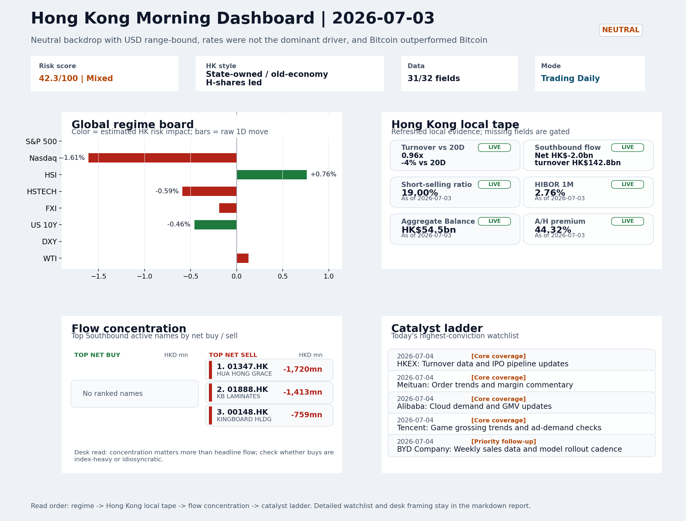

# Morning Research Workbench | 2026-07-04

> Designed for a Hong Kong sell-side commute: Layer 1 `Scan`, Layer 2 `Deep Read`, Layer 3 `Thinking`
> Mode: `Trading Daily` | Keep the report execution-oriented: what mattered in the completed session, what can move Hong Kong leadership, and what needs fast follow-up.
> Briefing date: `2026-07-04` | Review date: `2026-07-03` | Global request: `2026-07-03` | HK/China request: `2026-07-03` | Market effective date: `2026-07-03` | Generated at: `2026-07-04 06:04:17`

## Executive Summary

- **Market pulse:** A hot US June CPI release over the weekend breaks the earlier neutral backdrop and raises the bar for the Monday open, making HSTECH stabilization, a turn in Southbound flow and a retreat.
- **Hong Kong lens:** State-owned / old-economy H-shares led. A mixed open is likely on 2026-07-06 given the Nasdaq drag and elevated HK short-selling; the open is more credible for longs if HSTECH holds or recovers early rather than.
- **Top catalysts:** INTC -6.33%; Neutral backdrop with USD range-bound, rates were not the dominant driver, and Bitcoin outperformed Bitcoin.

## Visual Dashboard

## Layer 1 | Scan (5-10 min)

### 1.1 One-Line Market Pulse
A hot US June CPI release over the weekend breaks the earlier neutral backdrop and raises the bar for the Monday open, making HSTECH stabilization, a turn in Southbound flow and a retreat in the elevated 19% short-selling ratio the minimum for any durable Hong Kong bid.

### 1.2 Global Asset Price Dashboard
_Coverage gate: 1 unavailable market fields are suppressed from the main table; source status remains in the appendix._

| Asset | Last | 1D move | Read |
| --- | --- | --- | --- |
| S&P 500 | 7,483.24 | +0.00% | US large-cap risk appetite |
| Nasdaq 100 | 29,329.21 | **-1.61%** | Growth and duration leadership |
| Hang Seng Index | 23,055.03 | +0.76% | Hong Kong broad beta |
| Hang Seng TECH | 4.3640 | -0.59% | Hong Kong growth / platform read-through |
| CSI 300 | 4,868.22 | **-3.03%** | Mainland large-cap tone |
| US 10Y | 4.3720 | -0.46% | Global discount-rate anchor |
| China 10Y | 1.75% | +0.5bp | China local rates anchor \| Live public \| Eastmoney \| 2026-07-03 |
| DXY | 100.86 | -0.00% | Dollar liquidity impulse |
| USD/CNH | 6.7520 | +0.00% | Offshore China risk appetite |
| USD/HKD | 7.8428 | -0.01% | Linked-exchange regime stress check |
| Brent crude | 72.13 | +0.46% | Energy / geopolitics |
| COMEX gold | 4,187.30 | **+1.81%** | Hedge demand / real yields |
| Copper | 6.2240 | **+1.79%** | Global growth proxy |
| VIX | 15.81 | **-2.11%** | US stress barometer |

### 1.3 Hong Kong Key Data Quick Check

| Check | Value | Status | Source / as of | Why it matters |
| --- | --- | --- | --- | --- |
| Main Board turnover vs 20D | 0.96x \| -4% vs 20D | Live local | HKEX \| 2026-07-03 | Trailing 20-session average turnover was HK$318.2bn. |
| Southbound / Northbound net flow | Southbound Net HK$-2.0bn \| turnover HK$142.8bn \| Northbound Turnover HK$424.0bn \| net not reported | Live local | HKEX Connect \| 2026-07-02 | Southbound net buy is calculated from HKEX disclosed buy and sell turnover. |
| Short-selling ratio | 19.00% | Live local | HKEX \| 2026-07-03 | Official HKEX stock-level short-selling table, aggregated as a share of total market turnover. |
| AH premium index | 44.32% | Live public | Yahoo \| 2026-07-03 | Simple average across 15 A/H pairs; use dispersion rather than the average alone. |
| USD/HKD spot vs band | 7.8428 \| band 7.7500 to 7.8500 | Live quote + local | Yahoo \| 2026-07-03 | Inside the linked-exchange band without immediate boundary stress. Official Convertibility Undertakings define the linked-rate stress boundaries for USD/HKD. |
| HIBOR 1M | 2.76% | Live local | HKMA \| 2026-07-03 | 1M HIBOR is the cleanest quick read for Hong Kong funding conditions and equity-duration pressure. |
| Aggregate Balance | HK$54.5bn | Live local | HKMA \| 2026-07-03 | Aggregate Balance helps frame whether linked-rate liquidity conditions are tight or comfortable. |
| Hong Kong leadership | State-owned / old-economy H-shares led | Proxy | HSI / HSCEI / HSTECH relative perf \| 2026-07-03 | Use HSI / HSCEI / HSTECH relative moves as the opening style read. |

### 1.4 Risk Dashboard
**Composite risk score:** `42.3/100` | **Regime:** `Mixed`

| Component | Score impact | Evidence |
| --- | --- | --- |
| US beta | +0.0 | S&P 500 +0.00% |
| HK growth | -2.9 | HSTECH -0.59% |
| Offshore China proxy | -0.9 | FXI -0.19% |
| Dollar pressure | +0.0 | DXY -0.00% |
| Volatility | +4.2 | VIX -2.11% |
| HK short-selling | -8 | Short-selling ratio 19.00% |

### 1.5 Morning Checklist
1. **INTC -6.33%**
 Mover attribution | Announcement / expectations | Guidance reset and margin pressure
2. **Neutral backdrop with USD range-bound, rates were not the dominant driver, and Bitcoin outperformed Bitcoin**
 Overnight regime | Start by deciding whether the day is about Neutral conditions or a style pivot.
3. **CPI MoM (Released)**
 Macro / policy | Rates expectations, the dollar, and growth-equity valuation | Industries: Technology, Internet, Brokers
4. **[A] Alibaba-affiliate Ant Group rushes into humanoid robots with a dozen deals in 18 months**
 News / announcements | Capital allocation or shareholder-return events can trigger a valuation reset
5. **Trade Balance (Released)**
 Macro / policy | Watch whether it changes the day's core market narrative | Industries: Market-wide

## Layer 2 | Deep Read (20-30 min)

### 2.1 Overnight Overseas Market Review
#### Market Setup
**Core tape.** Overnight US session delivered a bifurcated tape: the S&P 500 held flat while the Nasdaq 100 fell -1.61%, weighed by Intel's sharp -6.33% guidance reset that signals recalibration in semiconductor earnings expectations.
**Main driver.** Euro Stoxx led global equities higher at +1.24%, and Bitcoin's +1.87% gain alongside gold's +1.81% rise suggests hedge and risk-on demand coexist rather than conflict.
**HK relevance.** For Hong Kong, the HSI's +0.76% advance came from state-owned and old-economy H-shares while HSTECH and FXI both declined, flagging that the local rebound lacks broad-based confirmation.

#### Key Drivers
- Intel's -6.33% guidance reset anchors the session as the most immediate risk event, with direct read-through to Hong Kong tech names.
- Nasdaq's -1.61% decline created a drag transmission for Hong Kong growth and platform names.
- HKEX short-selling ratio at 19.00% is elevated.
- CPI confirming inflation peaked in May is a net positive for rates-sensitive positioning and supports the soft-landing narrative, though.

#### Hong Kong Read-Through
**Desk lens.** State-owned / old-economy H-shares led.
**Opening implication.** A mixed open is likely on 2026-07-06 given the Nasdaq drag and elevated HK short-selling.
- **Cross-market read:** Hang Seng +0.76% / HSCEI +0.72% / HSTECH -0.59%.
- **Cross-market read:** Offshore China proxy FXI -0.19% and USD/CNH +0.00% frame cross-border risk appetite.
- **Cross-market read:** USD/HKD last traded around 7.8428, which keeps the Hong Kong funding lens in focus.

#### Watch Points
- USD composite moved lower by -0.11pct intraday, with a 0.28pct range.
- Main turning points appeared around 2026-07-03 08:10 peak / 2026-07-03 08:25 trough / 2026-07-03 08:40 peak, suggesting event-driven repricing.
- The biggest cross-asset divergence was Bitcoin versus Bitcoin, a spread of 0.0pct.
- Bitcoin moved +1.99pct intraday with a 2.566pct high-low range.

**Curated overnight stories**
1. **Intel falls 6.33% on guidance reset and margin pressure**
 Why it matters: The guidance reset reflects structural challenges in semiconductors and could signal broader tech-sector earnings recalibration heading into 2H26.
 HK read-through: Risk-off read-through for Hong Kong tech, particularly names with hardware, chip design, or server exposure.
2. **CPI MoM data released; inflation peaked in May as energy prices fell in June**
 Why it matters: Confirms the soft-landing narrative is intact; supports the case that Fed has room to remain patient on rates.
 HK read-through: Constructive for Hong Kong growth assets if the dollar stays range-bound or softens. Supports HKD stability and cross-border capital flow dynamics.
3. **Alibaba-affiliate Ant Group leads 500M yuan funding round in humanoid robotics start-up**
 Why it matters: Ant has completed 12 deals in 18 months in humanoid robotics, signaling a deliberate capital allocation shift.
 HK read-through: Direct read-through to BABA and close China Internet peers. May reinforce thematic interest in AI-adjacent hardware plays listed in Hong Kong.
4. **Trade Balance data released**
 Why it matters: Provides updated read on US and China trade dynamics. Any deterioration in goods balance could refocus attention on trade policy headlines.
 HK read-through: Market-wide relevance; may affect HKD, export-linked Hong Kong corporates, and China macro positioning. Keep watch for narrative shift potential.
5. **Magnificent 7 stocks post rough June, now in negative territory for the year**
 Why it matters: The concentration trade that defined 2023-24 is unwinding. Broad equity market structure is shifting away from mega-cap growth toward value and international.
 HK read-through: May redirect some global institutional flow toward non-US markets including Hong Kong-listed China names. Supportive for rotation narrative but not an immediate catalyst.

### 2.2 Hong Kong / A-share Previous-Day Review
#### Local Tape Setup
**Local read.** The July 3 session in Hong Kong revealed a clear style divergence: the HSI rose 0.76% and HSCEI added 0.72%, driven by state-owned and old-economy H-shares.
**Verification point.** The Hang Seng TECH underperformance echoes the overnight Nasdaq 100 drop of 1.61%, pointing to US growth-style drag.
**Risk to watch.** Flow signals are inconclusive: Southbound net sold HK$2.0bn on July 2.

#### Style and Local Leadership
**Style leadership.** State-owned / old-economy H-shares led.
- **Cross-market read:** Hang Seng +0.76% / HSCEI +0.72% / HSTECH -0.59%.
- **Cross-market read:** Offshore China proxy FXI -0.19% and USD/CNH +0.00% frame cross-border risk appetite.
- **Cross-market read:** USD/HKD last traded around 7.8428, which keeps the Hong Kong funding lens in focus.

#### Flow Confirmation
Official Stock Connect evidence is available; use Section 2.3 to confirm whether local money supports the price action.

#### Follow-Through Checklist
**Follow-through check.** Watch whether HSTECH stabilizes relative to HSCEI in the next session, Southbound net flow turns positive, and the short-selling ratio falls toward 15% to validate a broadening of the local rebound.

### 2.3 Flow Tracker and Attribution
#### Cross-Asset Attribution v1

| Driver | Direction | Score | Evidence | HK implication |
| --- | --- | --- | --- | --- |
| Short-selling pressure | drag | 2.8 | HKEX short-selling ratio was 19.00%. | Elevated short activity argues for extra confirmation before chasing rebounds. |
| US growth-style transmission | drag | 2.25 | Nasdaq 100 moved -1.61%. | Hong Kong growth and platform names should be tested first at the open. |

#### Flow Tracker
##### Flow Takeaways
- Short-selling pressure is elevated, so local rebounds need cleaner breadth and flow confirmation.
- Stock Connect Southbound: net HK$-2.0bn on turnover HK$142.8bn (as of 2026-07-02).
- Stock Connect Northbound: turnover RMB424.0bn; public file provides total turnover/top active names, not full net-buy.
- AH premium: simple covered-pair average +44.32%; widest premium: Chalco 190.8%.

##### Stock Connect Southbound Active Names

| Rank | Ticker | Name | Buy | Sell | Net buy |
| --- | --- | --- | --- | --- | --- |
| 4 | 01347.HK | HUA HONG GRACE | HK$2,398.4mn | HK$4,118.2mn | HK$-1,719.7mn |
| 4 | 01888.HK | KB LAMINATES | HK$2,329.0mn | HK$3,742.4mn | HK$-1,413.4mn |
| 7 | 00148.HK | KINGBOARD HLDG | HK$1,397.4mn | HK$2,155.9mn | HK$-758.5mn |
| 1 | 00981.HK | SMIC | HK$6,227.6mn | HK$6,832.3mn | HK$-604.7mn |
| 2 | 00700.HK | TENCENT | HK$4,113.2mn | HK$4,616.5mn | HK$-503.3mn |

##### AH Premium Dispersion

| Name | A ticker | H ticker | Premium | As of |
| --- | --- | --- | --- | --- |
| Chalco | 601600.SS | 2600.HK | +190.80% | 2026-07-03 |
| China Communications Construction | 601800.SS | 1800.HK | +82.72% | 2026-07-03 |
| China Life | 601628.SS | 2628.HK | +57.29% | 2026-07-03 |
| China Railway Construction | 601186.SS | 1186.HK | +50.78% | 2026-07-03 |
| China Railway | 601390.SS | 0390.HK | +49.41% | 2026-07-03 |

##### HKEX Short-Selling Watch

| Ticker | Name | Short ratio | Short turnover | Total turnover |
| --- | --- | --- | --- | --- |
| 00388.HK | HKEX | 18.04% | HK$0.2bn | HK$1.3bn |
| 00700.HK | TENCENT | 13.21% | HK$1.4bn | HK$10.9bn |
| 00941.HK | CHINA MOBILE | 26.74% | HK$0.3bn | HK$1.2bn |
| 01211.HK | BYD COMPANY | 34.47% | HK$1.6bn | HK$4.5bn |
| 01299.HK | AIA | 15.69% | HK$0.2bn | HK$1.2bn |

- **Short-value leaders:** 07709.HK XL2CSOPHYNIX (HK$7.6bn); 02800.HK TRACKER FUND (HK$4.8bn); 02828.HK HSCEI ETF (HK$2.7bn); 01810.HK XIAOMI-W (HK$1.7bn).

### 2.4 Macro and Policy Tracking
**Desk read.** The US CPI print for June landed hot at 0.3% MoM versus the 0.2% consensus estimate, releasing while Hong Kong markets were closed.

**Market sensitivity.** This repricing event is the dominant macro input heading into the next session, with duration assets and the dollar vulnerable to further upside pressure if the data cements expectations of a less accommodative Fed path.

**HK implication.** China trade balance simultaneously beat at USD 85.2bn (vs USD 79.0bn forecast), providing a constructive cross-market offset that could limit HKD weakness.

**Macro watchpoints**
- DXY and US 2-year/10-year yields reaction to hot CPI print.
- HKD spot and Hibor fixing direction, particularly for short-end pricing.
- Whether Technology and Internet names can absorb rate pressure or rotate under.
- Powell remarks at 22:00 for any shift in policy tone or reaction function language.

| Time | Region | Event | Status | Desk read |
| --- | --- | --- | --- | --- |
| 20:30 | US | CPI MoM | Released | Impact: Rates expectations, the dollar, and growth-equity valuation \| Attention: 5/5 \| Industries: Technology, Internet, Brokers |
| 09:30 | China | Trade Balance | Released | Impact: Watch whether it changes the day's core market narrative \| Attention: 3/5 \| Industries: Market-wide |
| 20:30 | US | Retail Sales MoM | Upcoming | Impact: Consumer resilience, growth expectations, and risk-asset pricing \| Attention: 5/5 \| Industries: Consumer, E-commerce, Consumer discretionary |
| 09:20 | China | Loan Prime Rate | Upcoming | Impact: Watch whether it changes the day's core market narrative \| Attention: 3/5 \| Industries: Market-wide |
| 22:00 | Federal Reserve | Jerome Powell: Economic outlook remarks | Central bank | Impact: Policy path, liquidity conditions, and cross-asset risk appetite \| Attention: 5/5 \| Industries: Technology, Financials, Gold |
| 10:00 | PBOC | Open Market Operations Desk: Daily liquidity operation window | Central bank | Impact: Policy path, liquidity conditions, and cross-asset risk appetite \| Attention: 3/5 \| Industries: Technology, Financials, Gold |

#### Positioning and Risk Backdrop
- Options activity centered on KWEB Call, with Vol/OI at 1.88x and a bullish bias.
- Put/Call structure shows equity 0.68 / index 1.15, implying Single-stock optimism with index hedging.
- Geopolitics: Middle East | Regional tension remains elevated | Impact: Oil, freight costs, and safe-haven demand
- Geopolitics: US-China | Technology export-control rhetoric remains active | Impact: China internet, semiconductors, and supply chains

### 2.5 Key Company and Sector Events

| Grade | Sector | Headline | Why it matters | Horizon |
| --- | --- | --- | --- | --- |
| A | China Internet | Alibaba-affiliate Ant Group rushes into humanoid robots with a dozen | Capital allocation or shareholder-return events can trigger a valuation | Medium-term trend |

#### HKEX Announcements

| Grade | Ticker | Type | Release time | Title |
| --- | --- | --- | --- | --- |
| A | 02611.HK | Profit warning | 2026-07-03 | Profit warning / alert announcement |
| A | 02788.HK | Profit warning | 2026-07-03 | Profit warning / alert announcement |
| A | 00119.HK | Profit warning | 2026-07-02 | Profit warning / alert announcement |
| A | 05834.HK | Profit warning | 2026-07-01 | Profit warning / alert announcement |
| A | 06680.HK | Profit warning | 2026-07-01 | Profit warning / alert announcement |
| A | 00327.HK | Profit warning | 2026-06-30 | Profit warning / alert announcement |
| A | 00818.HK | Profit warning | 2026-06-30 | Profit warning / alert announcement |
| A | 01053.HK | Profit warning | 2026-06-30 | Profit warning / alert announcement |

#### Earnings / Results Watch

| Ticker | Company | Timing | Expectation framing |
| --- | --- | --- | --- |
| 0700.HK | Tencent Holdings | After Market Close | EPS est. 4.15 HKD \| revenue est. 163.2bn HKD |
| 0388.HK | Hong Kong Exchanges and Clearing | Before Market Open | EPS est. 2.81 HKD \| revenue est. 6.0bn HKD |

#### Rating Changes
- **9988.HK** | Morgan Stanley | Upgrade | Equal Weight -> Overweight | PT 92 -> 105

#### IPO Watch
- IPO and grey-market monitoring is not yet part of the standard production pack.

### 2.6 Today's Core Names
#### Core coverage

| Name | Ticker | Last | 1D | Range position | Morning note |
| --- | --- | --- | --- | --- | --- |
| HKEX | 0388.HK | 375.00 | +2.01% | Bottom of range | Short-term price strength is clear; fresh catalysts could trigger broader group follow-through. |
| Meituan | 3690.HK | 71.60 | +1.06% | Mid-range | Positioning is neutral for now, so use it mainly to monitor marginal information changes. |

**Recent headlines for Meituan:**
- [China's Meituan says new AI model trained on domestic chips](https://www.yahoo.com/news/articles/chinas-meituan-says-ai-model-084400341.html) (Reuters)

#### Priority follow-up

| Name | Ticker | Last | 1D | Range position | Morning note |
| --- | --- | --- | --- | --- | --- |
| BYD Company | 1211.HK | 84.10 | +7.41% | Mid-range | Short-term price strength is clear; fresh catalysts could trigger broader group follow-through. |
| AIA | 1299.HK | 73.25 | +0.62% | Bottom of range | The name sits near the bottom of its recent range and is worth monitoring for a catalyst-led reversal. |

## Layer 3 | Thinking (10-15 min)

### 3.1 Rotating Theme Deep Dive

| Field | Read |
| --- | --- |
| Theme | AI and Compute Chain |
| Angle for the day | Track whether global AI capex, semis, cloud, and server demand are still carrying offshore China internet and hardware sentiment. |

**Theme desk read**
**Core thesis.** The AI and compute theme retains attention because evidence is accumulating that offshore China internet names are pushing their own capex and AI development, rather than merely trading on global semiconductor sentiment.
**Evidence.** Meituan's newly released trillion-parameter model trained entirely on domestic chips, and the $2.8bn Kling AI fundraise backed by Alibaba and Tencent, suggest the sector is allocating capital to AI independently.
**What to test.** Meanwhile, a lower VIX and a firm Bitcoin tape provide a constructive risk backdrop, though rates were not the dominant driver and cross-asset signals remain neutral.

**Signals to keep in mind**
- VIX -2.11%: Lower volatility signals easing stress in the tape.
- Bitcoin +1.87%: A strong crypto tape reinforces the risk-on read.

**LLM watch items:**
- Meituan: verify cost and scalability of domestic-chip AI cluster post-open-source announcement.
- Alibaba: watch for AI contribution to cloud revenue in upcoming business update.
- Tencent: monitor ad-demand checks for signs of AI-driven ad load or pricing improvements.
- Kuaishou Kling AI: track follow-on investor interest and valuation signals as a gauge of AI fundraising momentum.

**Related names to keep close:**

| Name | Ticker | Bucket | Morning read |
| --- | --- | --- | --- |
| Meituan | 3690.HK | Core coverage | Positioning is neutral for now, so use it mainly to monitor marginal information changes. |
| Alibaba | 9988.HK | Core coverage | The name sits near the bottom of its recent range and is worth monitoring for a catalyst-led reversal. |
| Tencent | 0700.HK | Core coverage | The name sits near the bottom of its recent range and is worth monitoring for a catalyst-led reversal. |
| AIA | 1299.HK | Priority follow-up | The name sits near the bottom of its recent range and is worth monitoring for a catalyst-led reversal. |

**Upcoming catalysts tied to the theme:**
- 2026-07-04 | Alibaba: Cloud demand and GMV updates | Key read-through for China consumption, cloud, and platform regulation
- 2026-07-04 | Tencent: Game grossing trends and ad-demand checks | Core offshore China platform proxy for gaming, ads, and AI monetization
- 2026-07-04 | AIA: NBV trends and agency momentum | Read-through for wealth demand, mainland visitor activity, and HK financial sentiment
- 2026-07-04 | Hang Seng TECH ETF: AI narrative shifts and China platform regulation headlines | Fast proxy for Hong Kong internet and growth leadership

### 3.2 Today Ahead and Trading Calendar
- Macro: CPI MoM is the first item to anchor the open and the rates/FX response.
- Corporate / event: HKEX: Turnover data and IPO pipeline updates is the cleanest same-day catalyst to prepare for.

**Same-day macro docket**

| Time | Country | Event | Status | Detail |
| --- | --- | --- | --- | --- |
| 20:30 | US | CPI MoM | Released | Actual 0.3% / Forecast 0.2% / Prior 0.4% |
| 09:30 | China | Trade Balance | Released | Actual USD 85.2bn / Forecast USD 79.0bn / Prior USD 80.6bn |
| 20:30 | US | Retail Sales MoM | Upcoming | Forecast 0.3% / Prior 0.6% |
| 09:20 | China | Loan Prime Rate | Upcoming | Forecast 3.45% / Prior 3.45% |
| 22:00 | Federal Reserve | Jerome Powell: Economic outlook remarks | Central bank | speech |

**Same-day catalyst list**

| Date | Time | Category | Event | Importance |
| --- | --- | --- | --- | --- |
| 2026-07-04 | | Core coverage | HKEX: Turnover data and IPO pipeline updates | 3 |
| 2026-07-04 | | Core coverage | Meituan: Order trends and margin commentary | 3 |
| 2026-07-04 | | Core coverage | Alibaba: Cloud demand and GMV updates | 3 |
| 2026-07-04 | | Core coverage | Tencent: Game grossing trends and ad-demand checks | 3 |

**Next few sessions**

| Date | Category | Event | Impact |
| --- | --- | --- | --- |
| 2026-07-04 | Core coverage | HKEX: Turnover data and IPO pipeline updates | Direct proxy for Hong Kong market turnover, listings, and southbound |
| 2026-07-04 | Core coverage | Meituan: Order trends and margin commentary | High-frequency read on local services demand and platform competition |
| 2026-07-04 | Core coverage | Alibaba: Cloud demand and GMV updates | Key read-through for China consumption, cloud, and platform regulation |
| 2026-07-04 | Core coverage | Tencent: Game grossing trends and ad-demand checks | Core offshore China platform proxy for gaming, ads, and AI monetization |

### 3.3 Daily One Chart
**Daily One Chart | HKEX short-selling pressure map**

**Chart read.** Market short-selling reached 19.00% of turnover.
**Why it matters.** The chart leads today because the pressure is either broad, concentrated, or acute in the top name.

_Source: HKEX Daily Quotations - Short Selling Turnover_

## Traceable Appendix

### Report Metadata
> Date policy: Review date 2026-07-03 is treated as `Trading Daily`. | Global request date is 2026-07-03; adapter effective date is 2026-07-03 and summary date is 2026-07-03. | HK/China local data date is 2026-07-03; role: same-session local cash tape.
> Market data quality: Coverage: `31/32` | Stale items (>1d): `6` | Missing: `1`
> Report quality: `83.7/100` | Grade `B` | Status `usable with caveats`

### Key Questions to Keep in Mind
- Is risk appetite rising or fading? The overnight tape reads closer to `Neutral`.
- Did rates expectations move? Focus on whether US 10Y, DXY, and growth style moved together.
- Were commodities the real story? Watch WTI and gold for geopolitics versus inflation signals.
- Is Hong Kong setup internet-led, SOE-led, or broad beta-led? Compare HSTECH, HSCEI, and HSI.
- Did offshore markets move China risk appetite? Focus on HSI, FXI, USD/CNH, and USD/HKD.

### Report Quality and Validation
- **Quality score:** 83.7/100 | **Grade:** B | **Status:** usable with caveats
- **Run summary:** 7 healthy | 1 caveat | 0 failed
- **Release recommendation:** Send with caveats | The report is usable, but the advisory guidance should travel with it so readers understand the data gaps.

| Source | Status | Bucket |
| --- | --- | --- |
| Market data | ok | healthy |
| Sector and company news | ok | healthy |
| Movers and short selling | ok | healthy |
| Stock Connect | ok | healthy |
| A/H premium | ok | healthy |
| Hong Kong local package | ok | healthy |
| China rates | ok | healthy |
| Narrative overlay | partial | caveat |

**Desk-use guidance summary:** 0 blocking | 1 advisory

**Desk-use guidance**
- **Advisory:** Use deterministic sections as primary support; the narrative overlay was partial or unavailable on this run.

| Component | Score | Weight | Read |
| --- | --- | --- | --- |
| Market data coverage | 96.9 | 0.3 | 31/32 core market fields available. |
| Hong Kong local metrics | 82.3 | 0.25 | 8 live, 3 proxy, 0 unavailable local checks. |
| Key public adapters | 100.0 | 0.2 | 4/4 key adapters were available or partially available. |
| Narrative overlay health | 60.0 | 0.15 | 3/7 narrative overlay tasks succeeded or used validated cache; 1 error(s). |
| Fact-check guardrail | 50.0 | 0.1 | Checked 14 numeric claims; 2 numeric mismatch(es), 0 logic warning(s); 2 critical, 0 review. |

**Quality warnings**
- Fact-check guardrail is weak: Checked 14 numeric claims; 2 numeric mismatch(es), 0 logic warning(s); 2 critical, 0 review.
- Narrative fact-check guardrail produced warnings; review the validation table before relying on narrative sections.

**Narrative fact-check guardrail**
- Checked 14 numeric claims; 2 numeric mismatch(es), 0 logic warning(s); 2 critical, 0 review.

| Severity | Field | Claim | Type | Claimed | Expected | Snippet |
| --- | --- | --- | --- | --- | --- | --- |
| critical | tasks.hk_review.paragraph | Hang Seng TECH | change_pct | 0.59 | -0.59 | en by state-owned and old-economy H-shares, while HSTECH fell 0.59% and the offshore FXI proxy declined 0.19%. The Ha |
| critical | tasks.final_framing.thinking_note | Hang Seng TECH | change_pct | 0.59 | -0.59 | sion delivered a value/SOE-led HSI up 0.76% while HSTECH fell 0.59%, highlighting a split that the earlier neutral ba |

**Adapter status**

| Adapter | Status |
| --- | --- |
| Stock Connect | ok |
| A/H premium | ok |
| HKEX announcements | ok |
| China rates | ok |

### Source Links
- [Alibaba-affiliate Ant Group rushes into humanoid robots with a dozen deals in 18 months](https://www.cnbc.com/2026/07/01/alibaba-affiliate-ant-group-enters-the-humanoid-robot-market-with-12-deals.html) (cnbc_markets)
- [China's Meituan says new AI model trained on domestic chips](https://www.yahoo.com/news/articles/chinas-meituan-says-ai-model-084400341.html) (Reuters)
- [Alibaba Group Holding Limited (BABA) is Attracting Investor Attention: Here is What You Should Know](https://finance.yahoo.com/markets/stocks/articles/alibaba-group-holding-limited-baba-130006174.html) (Zacks)
- [Alibaba, Tencent back Kuaishou's Kling AI in $2.8 billion fundraise](https://finance.yahoo.com/technology/ai/articles/alibaba-tencent-back-kuaishous-kling-093538982.html) (Reuters)
- [02611.HK Profit warning / alert announcement](http://www1.hkexnews.hk/listedco/listconews/sehk/2026/0703/2026070302343.pdf) (HKEXnews)
- [02788.HK Profit warning / alert announcement](http://www1.hkexnews.hk/listedco/listconews/sehk/2026/0703/2026070302607.pdf) (HKEXnews)
- [00119.HK Profit warning / alert announcement](http://www1.hkexnews.hk/listedco/listconews/sehk/2026/0702/2026070203663.pdf) (HKEXnews)
- [05834.HK Profit warning / alert announcement](http://www1.hkexnews.hk/listedco/listconews/sehk/2026/0701/2026070100201.pdf) (HKEXnews)
- [00327.HK Profit warning / alert announcement](http://www1.hkexnews.hk/listedco/listconews/sehk/2026/0630/2026063001618.pdf) (HKEXnews)
- [00818.HK Profit warning / alert announcement](http://www1.hkexnews.hk/listedco/listconews/sehk/2026/0630/2026063001696.pdf) (HKEXnews)
- [01053.HK Profit warning / alert announcement](http://www1.hkexnews.hk/listedco/listconews/sehk/2026/0630/2026063003071.pdf) (HKEXnews)

## Supplementary Visual Appendix

This appendix is professional-path only. It keeps a traceable index of the report visuals and the deterministic chart cues used to frame the morning note, without injecting the legacy intraday chart pack.

### Visual Index

| Visual | Path | Role |
| --- | --- | --- |
| Visual Dashboard | `charts/dashboard_2026-07-04.png` | Cross-asset regime board and Hong Kong local tape snapshot. |
| Daily One Chart | `charts/daily_one_chart_2026-07-04.png` | Single highest-conviction visual story for the day. |

### Deterministic Chart Cues
- FX / liquidity: USD composite moved lower by -0.11pct intraday, with a 0.28pct range.
- FX / liquidity: Main turning points appeared around 2026-07-03 08:10 peak / 2026-07-03 08:25 trough / 2026-07-03 08:40 peak, suggesting event-driven repricing rather than a clean one-way USD move.
- Cross-asset: The biggest cross-asset divergence was Bitcoin versus Bitcoin, a spread of 0.0pct.
- Cross-asset: Bitcoin moved +1.99pct intraday with a 2.566pct high-low range.

### Risk Dashboard Components

| Component | Score impact | Evidence |
| --- | --- | --- |
| US beta | +0.0 | S&P 500 +0.00% |
| HK growth | -2.9 | HSTECH -0.59% |
| Offshore China proxy | -0.9 | FXI -0.19% |
| Dollar pressure | +0.0 | DXY -0.00% |
| Volatility | +4.2 | VIX -2.11% |
| HK short-selling | -8 | Short-selling ratio 19.00% |
