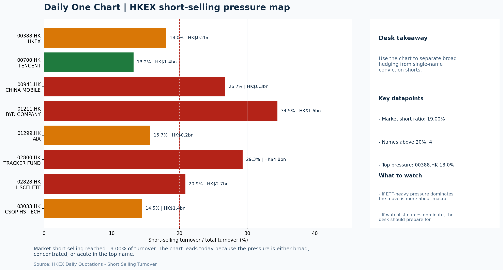
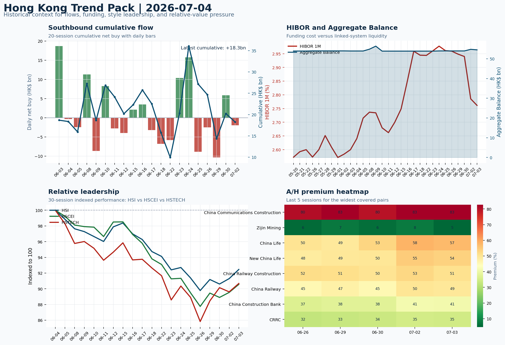

# Morning Research Workbench | 2026-07-05

> Designed for a Hong Kong sell-side commute: Layer 1 `Scan`, Layer 2 `Deep Read`, Layer 3 `Thinking`
> Mode: `Weekly Review` | Use Saturday's non-trading review date to synthesize the completed Hong Kong week and prepare next week's work plan.
> Briefing date: `2026-07-05` | Review date: `2026-07-04` | Global request: `2026-07-04` | HK/China request: `2026-07-03` | Market effective date: `2026-07-03` | Generated at: `2026-07-05 05:58:09`

## Executive Summary

- **Market pulse:** Hong Kong local indices outperformed a Risk-On week but without FXI cross-confirmation or southbound flow support, leaving the next-open case conditional on July 6 breadth and a turning.
- **Hong Kong lens:** Hong Kong growth / internet led. A constructive open on July 6 is more credible if HSTECH and FXI both confirm the move with cleaner breadth and turnover above the 0.96x 20D run-rate.
- **Top catalysts:** Risk-On backdrop with USD range-bound, rates were not the dominant driver, and Bitcoin outperformed Bitcoin; CPI MoM (Released).

## Visual Dashboard

## Layer 1 | Weekly Scan (5-10 min)

### 1.1 One-Line Market Pulse
Hong Kong local indices outperformed a Risk-On week but without FXI cross-confirmation or southbound flow support, leaving the next-open case conditional on July 6 breadth and a turning southbound flow rather than a confirmed offshore beta recovery.

### 1.2 Global Asset Price Dashboard
_Coverage gate: 1 unavailable market fields are suppressed from the main table; source status remains in the appendix._

| Asset | Last | 1D move | Read |
| --- | --- | --- | --- |
| S&P 500 | 7,483.24 | +0.00% | US large-cap risk appetite |
| Nasdaq 100 | 29,329.21 | **-1.61%** | Growth and duration leadership |
| Hang Seng Index | 23,350.03 | +1.28% | Hong Kong broad beta |
| Hang Seng TECH | 4.4160 | +1.19% | Hong Kong growth / platform read-through |
| CSI 300 | 4,842.17 | +0.00% | Mainland large-cap tone |
| US 10Y | 4.4850 | +0.00% | Global discount-rate anchor |
| China 10Y | 1.75% | +0.5bp | China local rates anchor \| Live public \| Eastmoney \| 2026-07-03 |
| DXY | 100.86 | -0.00% | Dollar liquidity impulse |
| USD/CNH | 6.7520 | +0.00% | Offshore China risk appetite |
| USD/HKD | 7.8428 | -0.01% | Linked-exchange regime stress check |
| Brent crude | 72.13 | +0.46% | Energy / geopolitics |
| COMEX gold | 4,187.30 | **+1.81%** | Hedge demand / real yields |
| Copper | 6.2240 | **+1.79%** | Global growth proxy |
| VIX | 16.15 | **-2.65%** | US stress barometer |

### 1.3 Hong Kong Weekly Tape Quick Check

| Check | Value | Status | Source / as of | Why it matters |
| --- | --- | --- | --- | --- |
| Main Board turnover vs 20D | 0.96x \| -4% vs 20D | Live local | HKEX \| 2026-07-03 | Trailing 20-session average turnover was HK$318.2bn. |
| Southbound / Northbound net flow | Southbound Net HK$-2.0bn \| turnover HK$142.8bn \| Northbound Turnover HK$424.0bn \| net not reported | Live local | HKEX Connect \| 2026-07-02 | Southbound net buy is calculated from HKEX disclosed buy and sell turnover. |
| Short-selling ratio | 19.00% | Live local | HKEX \| 2026-07-03 | Official HKEX stock-level short-selling table, aggregated as a share of total market turnover. |
| AH premium index | 36.41% | Live public | Yahoo \| 2026-07-03 | Simple average across 18 A/H pairs; use dispersion rather than the average alone. |
| USD/HKD spot vs band | 7.8428 \| band 7.7500 to 7.8500 | Live quote + local | Yahoo \| 2026-07-03 | Inside the linked-exchange band without immediate boundary stress. Official Convertibility Undertakings define the linked-rate stress boundaries for USD/HKD. |
| HIBOR 1M | 2.76% | Live local | HKMA \| 2026-07-03 | 1M HIBOR is the cleanest quick read for Hong Kong funding conditions and equity-duration pressure. |
| Aggregate Balance | HK$54.5bn | Live local | HKMA \| 2026-07-03 | Aggregate Balance helps frame whether linked-rate liquidity conditions are tight or comfortable. |
| Hong Kong leadership | Hong Kong growth / internet led | Proxy | HSI / HSCEI / HSTECH relative perf \| 2026-07-03 | Use HSI / HSCEI / HSTECH relative moves as the opening style read. |

### 1.4 Risk Dashboard
**Composite risk score:** `52.3/100` | **Regime:** `Mixed`

| Component | Score impact | Evidence |
| --- | --- | --- |
| US beta | +0.0 | S&P 500 +0.00% |
| HK growth | +5.9 | HSTECH +1.19% |
| Offshore China proxy | -0.9 | FXI -0.19% |
| Dollar pressure | +0.0 | DXY -0.00% |
| Volatility | +5.3 | VIX -2.65% |
| HK short-selling | -8 | Short-selling ratio 19.00% |

### 1.5 Next Week Checklist
1. **Risk-On backdrop with USD range-bound, rates were not the dominant driver, and Bitcoin outperformed Bitcoin**
 Still-moving markets | No fresh Hong Kong cash session is assumed; use global active assets and policy/event flow to prepare the next open.
2. **CPI MoM (Released)**
 Macro / policy | Rates expectations, the dollar, and growth-equity valuation | Industries: Technology, Internet, Brokers
3. **[A] Alibaba-affiliate Ant Group rushes into humanoid robots with a dozen deals in 18 months**
 News / announcements | Capital allocation or shareholder-return events can trigger a valuation reset
4. **Trade Balance (Released)**
 Macro / policy | Watch whether it changes the day's core market narrative | Industries: Market-wide
5. **Retail Sales MoM (Upcoming)**
 Macro / policy | Consumer resilience, growth expectations, and risk-asset pricing | Industries: Consumer, E-commerce, Consumer discretionary

## Layer 2 | Deep Read (20-30 min)

### 2.1 Weekly Cross-Asset Review
> Weekly review mode: synthesize the completed Hong Kong week, retain the main cross-asset and policy lessons, and convert them into next-week preparation rather than treating Saturday as a fresh cash-market session.

#### Market Setup
**Core tape.** Global equities exhibited a mixed Risk-On tone over the week ending July 3, with Euro Stoxx 50 gaining +0.82% while Nasdaq 100 fell -1.61%, highlighting a divergence between US growth-style and European risk appetite.
**Main driver.** The VIX compressed -2.65% to 16.15, Bitcoin added +1.72% intraday with a 2.566% high-low range.
**HK relevance.** Hong Kong markets broadly outperformed with Hang Seng +1.28%, HSCEI +1.15%.

#### Key Drivers
- VIX compression to 16.15 (-2.65%) reflects easing stress rather than directional conviction, which tempers the bullish read.
- Nasdaq 100 (-1.61%) dragged growth and platform names, adding a conditional risk for Hong Kong tech and internet leadership on the open.
- Bitcoin +1.72% with a 2.566% high-low range reinforced the Risk-On backdrop but the spread versus Bitcoin zero suggests idiosyncratic.
- FXI (-0.19%) underperformed HK local indices, indicating southbound or cross-border follow-through was incomplete and must be tested on.

#### Hong Kong Read-Through
**Desk lens.** Leadership was broad and balanced.
**Opening implication.** A constructive open on July 6 is more credible if HSTECH and FXI both confirm the move with cleaner breadth and turnover above the 0.96x 20D run-rate. Elevated short-selling and the incomplete FXI response remain the key risks to the base case.
- **Cross-market read:** Hang Seng +1.28% / HSCEI +1.15% / HSTECH +1.19%.
- **Cross-market read:** Offshore China proxy FXI -0.19% and USD/CNH +0.00% frame cross-border risk appetite.
- **Cross-market read:** USD/HKD last traded around 7.8428, which keeps the Hong Kong funding lens in focus.

#### Watch Points
- USD composite moved lower by -0.11pct intraday, with a 0.28pct range.
- Main turning points appeared around 2026-07-03 08:10 peak / 2026-07-03 08:25 trough / 2026-07-03 08:40 peak, suggesting event-driven repricing.
- The biggest cross-asset divergence was Bitcoin versus Bitcoin, a spread of 0.0pct.
- Bitcoin moved +1.84pct intraday with a 2.566pct high-low range.

#### Weekly Review Map
- Weekly review window: 2026-06-29 to 2026-07-03. Core regime: Risk-On backdrop with USD range-bound, rates were not the dominant driver, and Bitcoin outperformed Bitcoin. Hong Kong leadership: Leadership was broad and balanced.
- Method note: Trend summary uses the latest available five observations from the Hong Kong Trend Pack inputs.

**Cross-asset weekly dashboard**

| Asset | Latest move | Weekly read |
| --- | --- | --- |
| S&P 500 | +0.00% | Risk appetite |
| Nasdaq 100 | -1.61% | Growth style |
| Hang Seng Index | +1.28% | Hong Kong beta |
| Hang Seng TECH | +1.19% | Hong Kong growth / internet tone |
| DXY | -0.00% | Global liquidity |
| US 10Y | +0.00% | Rates path |
| Gold | +1.81% | Hedge / real yields |
| VIX | -2.65% | Volatility and hedging |

**Hong Kong / China weekly tape**

| Signal | Latest move | Read |
| --- | --- | --- |
| Hang Seng Index | +1.28% | Hong Kong beta |
| HSCEI | +1.15% | China SOE / H-share tone |
| Hang Seng TECH | +1.19% | Hong Kong growth / internet tone |
| China proxy (FXI) | -0.19% | China sentiment |
| USD/CNH | +0.00% | China FX sentiment |
| USD/HKD | -0.01% | Hong Kong funding lens |

**Five-session trend evidence**
_Window: 2026-06-25 to 2026-07-03_

| Signal | Five-session change | Latest | Desk read |
| --- | --- | --- | --- |
| Southbound flow | -17.8bn over 5 sessions | -2.0bn | 1/5 positive sessions; cumulative buying is the flow-confirmation test for next week. |
| HKD funding | HIBOR -20bp; Aggregate Balance +0.5bn | 2.76% / HK$54.5bn | Funding stress matters if HIBOR rises while Aggregate Balance contracts. |
| HK style leadership | HSTECH led (+4.8pp); HSI lagged (+2.7pp) | HSTECH leadership | Use HSI / HSCEI / HSTECH spread to separate broad beta from growth-led rerating. |
| A/H premium dispersion | +2.9pp average change | 46.8% average premium | Premium narrowing can support H-share relative demand |

**Flow and attribution clues**
- :
- :

**Next-week desk questions**
- Did Southbound flow confirm the index move, or was the week mainly offshore beta without local money follow-through?
- Did HIBOR and Aggregate Balance point to benign funding, or should tighter HKD liquidity be part of next week's risk case?
- Was leadership broad enough beyond HSTECH / platform beta, or was the week concentrated in a narrow style pocket?
- Which dated macro, policy, earnings, or IPO catalyst can realistically change the next-week narrative?
- What single data point would invalidate the base-case market pulse by Monday or Tuesday morning?

**Key developments to retain**

| Bucket | Item | Why it matters |
| --- | --- | --- |
| A | Alibaba-affiliate Ant Group rushes into humanoid robots with a | Capital allocation or shareholder-return events can trigger a valuation reset |
| Released | CPI MoM | Rates expectations, the dollar, and growth-equity valuation |
| Released | Trade Balance | Watch whether it changes the day's core market narrative |
| Upcoming | Retail Sales MoM | Consumer resilience, growth expectations, and risk-asset pricing |

**Next-week playbook**

| Date | Catalyst | Desk read |
| --- | --- | --- |
| 2026-07-05 | HKEX: Turnover data and IPO pipeline updates | Direct proxy for Hong Kong market turnover, listings, and southbound interest |
| 2026-07-05 | Meituan: Order trends and margin commentary | High-frequency read on local services demand and platform competition |
| 2026-07-05 | Alibaba: Cloud demand and GMV updates | Key read-through for China consumption, cloud, and platform regulation |
| 2026-07-05 | Tencent: Game grossing trends and ad-demand checks | Core offshore China platform proxy for gaming, ads, and AI monetization |
| 2026-07-05 | BYD Company: Weekly sales data and model rollout cadence | Hong Kong-listed proxy for EV volumes, export mix, and price competition |
| 2026-07-05 | AIA: NBV trends and agency momentum | Read-through for wealth demand, mainland visitor activity, and HK financial sentiment |
| 2026-07-05 | China Mobile: Capex updates and dividend policy signals | Defensive SOE benchmark for yield trade and domestic digital-infrastructure spend |
| 2026-07-05 | Tracker Fund of Hong Kong: Index-turnover shifts and ETF flows | Clean listed proxy for broad HSI positioning and passive flows |

**Curated overnight stories**
1. **Alibaba-affiliate Ant Group rushes into humanoid robots with a dozen deals in 18 months**
 Why it matters: Ant led a 500 million yuan ($73.59 million) funding round in Zeroth, signaling strategic capital allocation into an emerging tech vertical.
 HK read-through: Most directly relevant for Alibaba (9988.HK) andAnt's direct peers in the China Internet and AI-adjacent ecosystem. Could reinforce intraday tech/growth sentiment on July 6.
2. **CPI MoM released (date not specified in supplied facts)**
 Why it matters: Released CPI reading shapes rates expectations, the USD trajectory, and growth-equity valuation frameworks.
 HK read-through: Industries flagged: Technology, Internet, Brokers. USD direction remains the primary transmission mechanism for H-share and Hong Kong local market flows.
3. **Trade Balance released (date not specified in supplied facts)**
 Why it matters: Trade balance data can shift the day's core market narrative, particularly for export-oriented Chinese sectors and companies with significant offshore revenue exposure.
 HK read-through: Market-wide relevance. The direction of trade surplus/deficit influences renminbi expectations and indirectly affects Hong Kong-listed mainland names.
4. **Citadel's hedge funds post broad first-half gains; top strategy sidesteps quant selloff**
 Why it matters: Institutional flow indicators matter for Hong Kong because major global macro funds allocate to H-shares and ADR derivatives.
 HK read-through: Indirect; affects positioning sentiment for offshore China assets through cross-market flow proxies rather than direct Hong Kong cash impact.
5. **Bitcoin outperformed (context from market theme; no standalone headline provided)**
 Why it matters: Crypto performance serves as a risk-appetite barometer. In a Risk-On week where rates were not the dominant driver, above-market crypto returns reinforce liquidity-seeking.
 HK read-through: Sentiment indicator for risk assets broadly; crypto proxies or blockchain-adjacent Hong Kong-listed names (if any) may benefit from positive cross-asset momentum into Monday.

### 2.2 Hong Kong / A-share Weekly Review
> Weekly review mode: synthesize the completed Hong Kong week, retain the main cross-asset and policy lessons, and convert them into next-week preparation rather than treating Saturday as a fresh cash-market session.

#### Local Tape Setup
**Local read.** The week ending July 3 confirmed a Risk-On tone but with an incomplete cross-border confirmation signal: Hang Seng (+1.28%), HSCEI (+1.15%).
**Verification point.** Short-selling remained elevated at 19.00% of Main Board turnover, with stock-level concentrations in 02823.HK (80.67%), 03466.HK (60.81%).
**Risk to watch.** Southbound net flow was -2.0bn on HK$142.8bn turnover over the last reported session, and cumulative weekly southbound was approximately -17.8bn over five sessions, meaning domestic money did not confirm the index move.

#### Style and Local Leadership
**Style leadership.** Hong Kong growth / internet led.
- **Cross-market read:** Hang Seng +1.28% / HSCEI +1.15% / HSTECH +1.19%.
- **Cross-market read:** Offshore China proxy FXI -0.19% and USD/CNH +0.00% frame cross-border risk appetite.
- **Cross-market read:** USD/HKD last traded around 7.8428, which keeps the Hong Kong funding lens in focus.

#### Flow Confirmation
Official Stock Connect evidence is available; use Section 2.3 to confirm whether local money supports the price action.

#### Follow-Through Checklist
**Follow-through check.** Watch whether July 6 turnover exceeds the 0.96x 20D run-rate and whether HSTECH and 3033.HK hold their weekly gains alongside a turning southbound flow.

### 2.3 Flow Tracker and Attribution
#### Cross-Asset Attribution v1

| Driver | Direction | Score | Evidence | HK implication |
| --- | --- | --- | --- | --- |
| Short-selling pressure | drag | 2.8 | HKEX short-selling ratio was 19.00%. | Elevated short activity argues for extra confirmation before chasing rebounds. |
| US growth-style transmission | drag | 2.25 | Nasdaq 100 moved -1.61%. | Hong Kong growth and platform names should be tested first at the open. |

#### Flow Tracker
##### Flow Takeaways
- Short-selling pressure is elevated, so local rebounds need cleaner breadth and flow confirmation.
- Stock Connect Southbound: net HK$-2.0bn on turnover HK$142.8bn (as of 2026-07-02).
- Stock Connect Northbound: turnover RMB424.0bn; public file provides total turnover/top active names, not full net-buy.
- AH premium: simple covered-pair average +36.41%; widest premium: China Communications Construction 82.72%.

##### Stock Connect Southbound Active Names

| Rank | Ticker | Name | Buy | Sell | Net buy |
| --- | --- | --- | --- | --- | --- |
| 4 | 01347.HK | HUA HONG GRACE | HK$2,398.4mn | HK$4,118.2mn | HK$-1,719.7mn |
| 4 | 01888.HK | KB LAMINATES | HK$2,329.0mn | HK$3,742.4mn | HK$-1,413.4mn |
| 7 | 00148.HK | KINGBOARD HLDG | HK$1,397.4mn | HK$2,155.9mn | HK$-758.5mn |
| 1 | 00981.HK | SMIC | HK$6,227.6mn | HK$6,832.3mn | HK$-604.7mn |
| 2 | 00700.HK | TENCENT | HK$4,113.2mn | HK$4,616.5mn | HK$-503.3mn |

##### AH Premium Dispersion

| Name | A ticker | H ticker | Premium | As of |
| --- | --- | --- | --- | --- |
| China Communications Construction | 601800.SS | 1800.HK | +82.72% | 2026-07-03 |
| Zijin Mining | 601899.SS | 2899.HK | +79.57% | 2026-07-03 |
| China Life | 601628.SS | 2628.HK | +57.29% | 2026-07-03 |
| New China Life | 601336.SS | 1336.HK | +53.74% | 2026-07-03 |
| China Railway Construction | 601186.SS | 1186.HK | +50.78% | 2026-07-03 |

##### HKEX Short-Selling Watch

| Ticker | Name | Short ratio | Short turnover | Total turnover |
| --- | --- | --- | --- | --- |
| 00388.HK | HKEX | 18.04% | HK$0.2bn | HK$1.3bn |
| 00700.HK | TENCENT | 13.21% | HK$1.4bn | HK$10.9bn |
| 00941.HK | CHINA MOBILE | 26.74% | HK$0.3bn | HK$1.2bn |
| 01211.HK | BYD COMPANY | 34.47% | HK$1.6bn | HK$4.5bn |
| 01299.HK | AIA | 15.69% | HK$0.2bn | HK$1.2bn |

- **Short-value leaders:** 07709.HK XL2CSOPHYNIX (HK$7.6bn); 02800.HK TRACKER FUND (HK$4.8bn); 02828.HK HSCEI ETF (HK$2.7bn); 01810.HK XIAOMI-W (HK$1.7bn).

### 2.4 Macro and Policy Tracking
**Desk read.** The macro agenda heading into next week carries the potential to reset the rates‑and‑dollar backdrop that supported this week's Risk‑On bias.

**Market sensitivity.** The released US CPI (0.3% MoM vs 0.2% forecast) and above‑consensus China trade balance already provided a mildly warm growth impulse, while the upcoming Retail Sales print, Loan Prime Rate decision.

**HK implication.** If Retail Sales surprise to the upside or Powell's language skews hawkish, the USD and Treasury yields could rise, pressuring duration‑sensitive Technology and Internet names that led the week's HSTECH outperformance.

**Macro watchpoints**
- US 2‑year and 10‑year yield moves after Retail Sales and Powell speech; whether the dollar index breaks above recent range‑bound levels.
- HKD spot and 1‑month HIBOR response to any USD/HKD repricing, especially if Aggregate Balance contracts.
- HSTECH vs HSI relative performance on Monday - whether the growth‑led rerating holds or rotates.
- Southbound flow direction - a quick positive turn after last week's net outflows would confirm risk appetite, while continued selling would

| Time | Region | Event | Status | Desk read |
| --- | --- | --- | --- | --- |
| 20:30 | US | CPI MoM | Released | Impact: Rates expectations, the dollar, and growth-equity valuation \| Attention: 5/5 \| Industries: Technology, Internet, Brokers |
| 09:30 | China | Trade Balance | Released | Impact: Watch whether it changes the day's core market narrative \| Attention: 3/5 \| Industries: Market-wide |
| 20:30 | US | Retail Sales MoM | Upcoming | Impact: Consumer resilience, growth expectations, and risk-asset pricing \| Attention: 5/5 \| Industries: Consumer, E-commerce, Consumer discretionary |
| 09:20 | China | Loan Prime Rate | Upcoming | Impact: Watch whether it changes the day's core market narrative \| Attention: 3/5 \| Industries: Market-wide |
| 22:00 | Federal Reserve | Jerome Powell: Economic outlook remarks | Central bank | Impact: Policy path, liquidity conditions, and cross-asset risk appetite \| Attention: 5/5 \| Industries: Technology, Financials, Gold |
| 10:00 | PBOC | Open Market Operations Desk: Daily liquidity operation window | Central bank | Impact: Policy path, liquidity conditions, and cross-asset risk appetite \| Attention: 3/5 \| Industries: Technology, Financials, Gold |

#### Positioning and Risk Backdrop
- Options activity centered on KWEB Call, with Vol/OI at 1.88x and a bullish bias.
- Put/Call structure shows equity 0.68 / index 1.15, implying Single-stock optimism with index hedging.
- Geopolitics: Middle East | Regional tension remains elevated | Impact: Oil, freight costs, and safe-haven demand
- Geopolitics: US-China | Technology export-control rhetoric remains active | Impact: China internet, semiconductors, and supply chains

### 2.5 Key Company and Sector Events

| Grade | Sector | Headline | Why it matters | Horizon |
| --- | --- | --- | --- | --- |
| A | China Internet | Alibaba-affiliate Ant Group rushes into humanoid robots with a dozen | Capital allocation or shareholder-return events can trigger a valuation | Medium-term trend |

#### HKEX Announcements

| Grade | Ticker | Type | Release time | Title |
| --- | --- | --- | --- | --- |
| A | 02611.HK | Profit warning | 2026-07-03 | Profit warning / alert announcement |
| A | 02788.HK | Profit warning | 2026-07-03 | Profit warning / alert announcement |
| A | 00119.HK | Profit warning | 2026-07-02 | Profit warning / alert announcement |
| A | 05834.HK | Profit warning | 2026-07-01 | Profit warning / alert announcement |
| A | 06680.HK | Profit warning | 2026-07-01 | Profit warning / alert announcement |
| A | 00327.HK | Profit warning | 2026-06-30 | Profit warning / alert announcement |
| A | 00818.HK | Profit warning | 2026-06-30 | Profit warning / alert announcement |
| A | 01053.HK | Profit warning | 2026-06-30 | Profit warning / alert announcement |

#### Earnings / Results Watch

| Ticker | Company | Timing | Expectation framing |
| --- | --- | --- | --- |
| 0700.HK | Tencent Holdings | After Market Close | EPS est. 4.15 HKD \| revenue est. 163.2bn HKD |
| 0388.HK | Hong Kong Exchanges and Clearing | Before Market Open | EPS est. 2.81 HKD \| revenue est. 6.0bn HKD |

#### Rating Changes
- **9988.HK** | Morgan Stanley | Upgrade | Equal Weight -> Overweight | PT 92 -> 105

#### IPO Watch
- IPO and grey-market monitoring is not yet part of the standard production pack.

### 2.6 Today's Core Names
#### Core coverage

| Name | Ticker | Last | 1D | Range position | Morning note |
| --- | --- | --- | --- | --- | --- |
| HKEX | 0388.HK | 375.00 | +2.01% | Bottom of range | Short-term price strength is clear; fresh catalysts could trigger broader group follow-through. |
| Meituan | 3690.HK | 71.60 | +1.06% | Mid-range | Positioning is neutral for now, so use it mainly to monitor marginal information changes. |

**Recent headlines for Meituan:**
- [China's Meituan says new AI model trained on domestic chips](https://www.yahoo.com/news/articles/chinas-meituan-says-ai-model-084400341.html) (Reuters)

#### Priority follow-up

| Name | Ticker | Last | 1D | Range position | Morning note |
| --- | --- | --- | --- | --- | --- |
| BYD Company | 1211.HK | 84.10 | +7.41% | Mid-range | Short-term price strength is clear; fresh catalysts could trigger broader group follow-through. |
| AIA | 1299.HK | 73.25 | +0.62% | Bottom of range | The name sits near the bottom of its recent range and is worth monitoring for a catalyst-led reversal. |

## Layer 3 | Thinking (10-15 min)

### 3.1 Rotating Theme Deep Dive

| Field | Read |
| --- | --- |
| Theme | AI and Compute Chain |
| Angle for the day | Track whether global AI capex, semis, cloud, and server demand are still carrying offshore China internet and hardware sentiment. |

**Theme desk read**
**Core thesis.** The AI and compute chain theme drew attention this week as Meituan released a trillion-parameter model trained entirely on Chinese domestic chips.
**Evidence.** These developments support the notion that China's internet platforms are building their own AI infrastructure, aligning with the angle that global compute demand may indirectly lift sentiment.
**What to test.** However, the week's risk-on backdrop was driven more by Bitcoin and commodities than semiconductor proxies; HSTECH leadership (+4.8pp over HSI) was notable.

**Signals to keep in mind**
- VIX -2.65%: Lower volatility signals easing stress in the tape.
- Gold +1.81%: A firm gold price suggests hedge demand or lower real yields.

**LLM watch items:**
- Alibaba's cloud demand and GMV updates to gauge AI-driven revenue.
- Tencent's ad-demand checks as a proxy for AI-enhanced monetization.
- Meituan's order trends and margin commentary to assess core business health amid AI spending.
- Southbound flow turn: a positive session early next week would verify foreign-led gains.
- US Retail Sales (Jul 5) for consumer resilience, impacting risk appetite for growth names.

**Related names to keep close:**

| Name | Ticker | Bucket | Morning read |
| --- | --- | --- | --- |
| Meituan | 3690.HK | Core coverage | Positioning is neutral for now, so use it mainly to monitor marginal information changes. |
| Alibaba | 9988.HK | Core coverage | The name sits near the bottom of its recent range and is worth monitoring for a catalyst-led reversal. |
| Tencent | 0700.HK | Core coverage | The name sits near the bottom of its recent range and is worth monitoring for a catalyst-led reversal. |
| AIA | 1299.HK | Priority follow-up | The name sits near the bottom of its recent range and is worth monitoring for a catalyst-led reversal. |

**Upcoming catalysts tied to the theme:**
- 2026-07-05 | Alibaba: Cloud demand and GMV updates | Key read-through for China consumption, cloud, and platform regulation
- 2026-07-05 | Tencent: Game grossing trends and ad-demand checks | Core offshore China platform proxy for gaming, ads, and AI monetization
- 2026-07-05 | AIA: NBV trends and agency momentum | Read-through for wealth demand, mainland visitor activity, and HK financial sentiment
- 2026-07-05 | Hang Seng TECH ETF: AI narrative shifts and China platform regulation headlines | Fast proxy for Hong Kong internet and growth leadership

### 3.2 Next Week Calendar and Reopen Prep
- Non-trading review: use today's calendar to prepare the next Hong Kong open rather than treating the last cash tape as a fresh signal.
- Macro: CPI MoM is the first item to anchor the open and the rates/FX response.
- Corporate / event: HKEX: Turnover data and IPO pipeline updates is the cleanest same-day catalyst to prepare for.

**Same-day macro docket**

| Time | Country | Event | Status | Detail |
| --- | --- | --- | --- | --- |
| 20:30 | US | CPI MoM | Released | Actual 0.3% / Forecast 0.2% / Prior 0.4% |
| 09:30 | China | Trade Balance | Released | Actual USD 85.2bn / Forecast USD 79.0bn / Prior USD 80.6bn |
| 20:30 | US | Retail Sales MoM | Upcoming | Forecast 0.3% / Prior 0.6% |
| 09:20 | China | Loan Prime Rate | Upcoming | Forecast 3.45% / Prior 3.45% |
| 22:00 | Federal Reserve | Jerome Powell: Economic outlook remarks | Central bank | speech |

**Same-day catalyst list**

| Date | Time | Category | Event | Importance |
| --- | --- | --- | --- | --- |
| 2026-07-05 | | Core coverage | HKEX: Turnover data and IPO pipeline updates | 3 |
| 2026-07-05 | | Core coverage | Meituan: Order trends and margin commentary | 3 |
| 2026-07-05 | | Core coverage | Alibaba: Cloud demand and GMV updates | 3 |
| 2026-07-05 | | Core coverage | Tencent: Game grossing trends and ad-demand checks | 3 |

**Next few sessions**

| Date | Category | Event | Impact |
| --- | --- | --- | --- |
| 2026-07-05 | Core coverage | HKEX: Turnover data and IPO pipeline updates | Direct proxy for Hong Kong market turnover, listings, and southbound |
| 2026-07-05 | Core coverage | Meituan: Order trends and margin commentary | High-frequency read on local services demand and platform competition |
| 2026-07-05 | Core coverage | Alibaba: Cloud demand and GMV updates | Key read-through for China consumption, cloud, and platform regulation |
| 2026-07-05 | Core coverage | Tencent: Game grossing trends and ad-demand checks | Core offshore China platform proxy for gaming, ads, and AI monetization |

### 3.3 Daily One Chart
**Daily One Chart | HKEX short-selling pressure map**

**Chart read.** Market short-selling reached 19.00% of turnover.
**Why it matters.** The chart leads today because the pressure is either broad, concentrated, or acute in the top name.

_Source: HKEX Daily Quotations - Short Selling Turnover_

### 3.4 Hong Kong Trend Pack
**Hong Kong Trend Pack**

**Trend read.** Four historical lenses: Southbound cumulative flow, HKMA funding and liquidity, HSI/HSCEI/HSTECH relative leadership, and A/H premium dispersion.

_Source: HKEX Stock Connect, HKMA liquidity data, and public Yahoo Finance quotes_

## Traceable Appendix

### Report Metadata
> Date policy: Review date 2026-07-04 is treated as `Weekly Review`. | Global request date is 2026-07-04; adapter effective date is 2026-07-03 and summary date is 2026-07-03. | HK/China local data date is 2026-07-03; role: last completed HK/China cash-market reference tape.
> Market data quality: Coverage: `31/32` | Missing: `1`
> Report quality: `87.4/100` | Grade `B` | Status `production ready`

### Key Questions to Keep in Mind
- Is risk appetite rising or fading? The overnight tape reads closer to `Risk-On`.
- Did rates expectations move? Focus on whether US 10Y, DXY, and growth style moved together.
- Were commodities the real story? Watch WTI and gold for geopolitics versus inflation signals.
- Is Hong Kong setup internet-led, SOE-led, or broad beta-led? Compare HSTECH, HSCEI, and HSI.
- Did offshore markets move China risk appetite? Focus on HSI, FXI, USD/CNH, and USD/HKD.

### Report Quality and Validation
- **Quality score:** 87.4/100 | **Grade:** B | **Status:** production ready
- **Run summary:** 7 healthy | 1 caveat | 0 failed
- **Release recommendation:** Send with caveats | The report is usable, but the advisory guidance should travel with it so readers understand the data gaps.

| Source | Status | Bucket |
| --- | --- | --- |
| Market data | ok | healthy |
| Sector and company news | ok | healthy |
| Movers and short selling | ok | healthy |
| Stock Connect | ok | healthy |
| A/H premium | ok | healthy |
| Hong Kong local package | ok | healthy |
| China rates | ok | healthy |
| Narrative overlay | partial | caveat |

**Desk-use guidance summary:** 0 blocking | 1 advisory

**Desk-use guidance**
- **Advisory:** Use deterministic sections as primary support; the narrative overlay was partial or unavailable on this run.

| Component | Score | Weight | Read |
| --- | --- | --- | --- |
| Market data coverage | 96.9 | 0.3 | 31/32 core market fields available. |
| Hong Kong local metrics | 82.3 | 0.25 | 8 live, 3 proxy, 0 unavailable local checks. |
| Key public adapters | 100.0 | 0.2 | 4/4 key adapters were available or partially available. |
| Narrative overlay health | 51.4 | 0.15 | 2/7 narrative overlay tasks succeeded or used validated cache; 1 error(s). |
| Fact-check guardrail | 100.0 | 0.1 | Checked 14 numeric claims; 0 numeric mismatch(es), 0 logic warning(s); 0 critical, 0 review. |

**Quality warnings**
- Narrative overlay health is weak: 2/7 narrative overlay tasks succeeded or used validated cache; 1 error(s).

**Narrative fact-check guardrail**
- Checked 14 numeric claims; 0 numeric mismatch(es), 0 logic warning(s); 0 critical, 0 review.

**Adapter status**

| Adapter | Status |
| --- | --- |
| Stock Connect | ok |
| A/H premium | ok |
| HKEX announcements | ok |
| China rates | ok |

### Source Links
- [Alibaba-affiliate Ant Group rushes into humanoid robots with a dozen deals in 18 months](https://www.cnbc.com/2026/07/01/alibaba-affiliate-ant-group-enters-the-humanoid-robot-market-with-12-deals.html) (cnbc_markets)
- [China's Meituan says new AI model trained on domestic chips](https://www.yahoo.com/news/articles/chinas-meituan-says-ai-model-084400341.html) (Reuters)
- [Alibaba, Tencent back Kuaishou's Kling AI in $2.8 billion fundraise](https://finance.yahoo.com/technology/ai/articles/alibaba-tencent-back-kuaishous-kling-093538982.html) (Reuters)
- [02611.HK Profit warning / alert announcement](http://www1.hkexnews.hk/listedco/listconews/sehk/2026/0703/2026070302343.pdf) (HKEXnews)
- [02788.HK Profit warning / alert announcement](http://www1.hkexnews.hk/listedco/listconews/sehk/2026/0703/2026070302607.pdf) (HKEXnews)
- [00119.HK Profit warning / alert announcement](http://www1.hkexnews.hk/listedco/listconews/sehk/2026/0702/2026070203663.pdf) (HKEXnews)
- [05834.HK Profit warning / alert announcement](http://www1.hkexnews.hk/listedco/listconews/sehk/2026/0701/2026070100201.pdf) (HKEXnews)
- [00327.HK Profit warning / alert announcement](http://www1.hkexnews.hk/listedco/listconews/sehk/2026/0630/2026063001618.pdf) (HKEXnews)
- [00818.HK Profit warning / alert announcement](http://www1.hkexnews.hk/listedco/listconews/sehk/2026/0630/2026063001696.pdf) (HKEXnews)
- [01053.HK Profit warning / alert announcement](http://www1.hkexnews.hk/listedco/listconews/sehk/2026/0630/2026063003071.pdf) (HKEXnews)

## Supplementary Visual Appendix

This appendix is professional-path only. It keeps a traceable index of the report visuals and the deterministic chart cues used to frame the morning note, without injecting the legacy intraday chart pack.

### Visual Index

| Visual | Path | Role |
| --- | --- | --- |
| Visual Dashboard | `charts/dashboard_2026-07-05.png` | Cross-asset regime board and Hong Kong local tape snapshot. |
| Daily One Chart | `charts/daily_one_chart_2026-07-05.png` | Single highest-conviction visual story for the day. |
| Hong Kong Trend Pack | `charts/hk_trend_pack_2026-07-05.png` | Historical context for flows, liquidity, leadership, and A/H dispersion. |

### Deterministic Chart Cues
- FX / liquidity: USD composite moved lower by -0.11pct intraday, with a 0.28pct range.
- FX / liquidity: Main turning points appeared around 2026-07-03 08:10 peak / 2026-07-03 08:25 trough / 2026-07-03 08:40 peak, suggesting event-driven repricing rather than a clean one-way USD move.
- Cross-asset: The biggest cross-asset divergence was Bitcoin versus Bitcoin, a spread of 0.0pct.
- Cross-asset: Bitcoin moved +1.84pct intraday with a 2.566pct high-low range.

### Risk Dashboard Components

| Component | Score impact | Evidence |
| --- | --- | --- |
| US beta | +0.0 | S&P 500 +0.00% |
| HK growth | +5.9 | HSTECH +1.19% |
| Offshore China proxy | -0.9 | FXI -0.19% |
| Dollar pressure | +0.0 | DXY -0.00% |
| Volatility | +5.3 | VIX -2.65% |
| HK short-selling | -8 | Short-selling ratio 19.00% |
