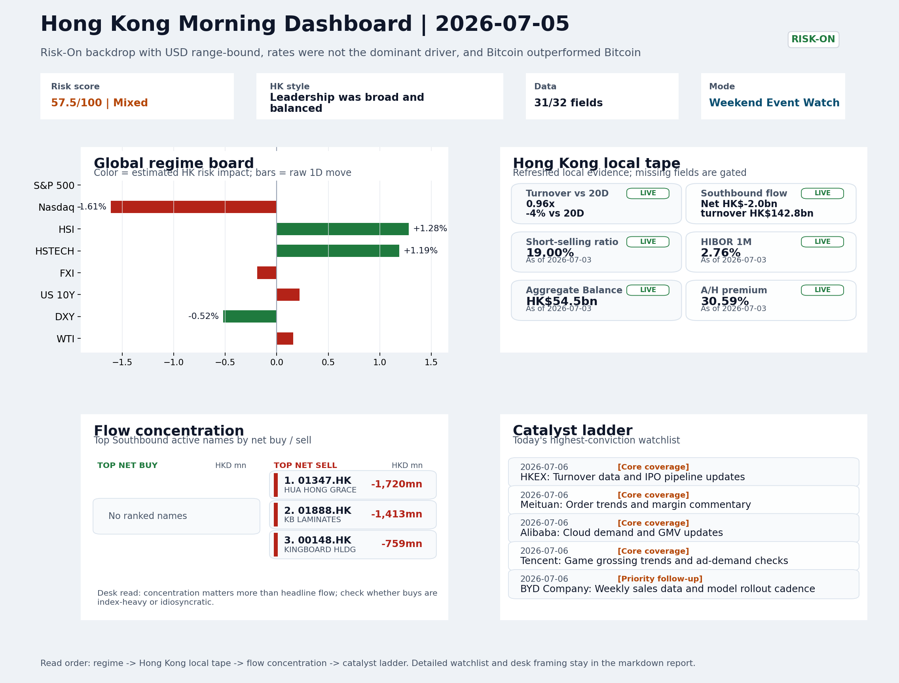

# Morning Research Workbench | 2026-07-06

> Designed for a Hong Kong sell-side commute: Layer 1 `Scan`, Layer 2 `Deep Read`, Layer 3 `Thinking`
> Mode: `Weekend Event Watch` | Track weekend policy, geopolitics, still-moving assets, and Monday open preparation rather than replaying stale cash-market tape.
> Briefing date: `2026-07-06` | Review date: `2026-07-05` | Global request: `2026-07-05` | HK/China request: `2026-07-03` | Market effective date: `2026-07-03` | Generated at: `2026-07-06 06:00:14`

## Executive Summary

- **Market pulse:** A softer dollar and lower volatility keep the Risk-On bridge intact, turning Monday's focus to corporate catalysts, led by Ant Group's aggressive push into humanoid robotics.
- **Hong Kong lens:** Growth-leaning if HSTECH opens firm on Ant/AI capex sentiment, but US tech weakness and heavy short positions argue for a cautious bias.. Monday's open is set constructively, anchored by a soft dollar and eased volatility, with the Ant Group robotics news likely providing a targeted lift to Hang Seng Tech.
- **Top catalysts:** Risk-On backdrop with USD range-bound, rates were not the dominant driver, and Bitcoin outperformed Bitcoin; CPI MoM (Released).

## Visual Dashboard

## Layer 1 | Reset (5-10 min)

### 1.1 One-Line Market Pulse
A softer dollar and lower volatility keep the Risk-On bridge intact, turning Monday's focus to corporate catalysts, led by Ant Group's aggressive push into humanoid robotics.

### 1.2 Global Asset Price Dashboard
_Coverage gate: 1 unavailable market fields are suppressed from the main table; source status remains in the appendix._

| Asset | Last | 1D move | Read |
| --- | --- | --- | --- |
| S&P 500 | 7,483.24 | +0.00% | US large-cap risk appetite |
| Nasdaq 100 | 29,329.21 | **-1.61%** | Growth and duration leadership |
| Hang Seng Index | 23,350.03 | +1.28% | Hong Kong broad beta |
| Hang Seng TECH | 4.4160 | +1.19% | Hong Kong growth / platform read-through |
| CSI 300 | 4,842.17 | +0.62% | Mainland large-cap tone |
| US 10Y | 4.4850 | +0.22% | Global discount-rate anchor |
| China 10Y | 1.75% | +0.5bp | China local rates anchor \| Live public \| Eastmoney \| 2026-07-03 |
| DXY | 100.86 | -0.52% | Dollar liquidity impulse |
| USD/CNH | 6.7520 | +0.00% | Offshore China risk appetite |
| USD/HKD | 7.8428 | -0.01% | Linked-exchange regime stress check |
| Brent crude | 71.80 | +0.32% | Energy / geopolitics |
| COMEX gold | 4,112.70 | +1.09% | Hedge demand / real yields |
| Copper | 6.1145 | -0.15% | Global growth proxy |
| VIX | 16.15 | **-2.65%** | US stress barometer |

### 1.3 Hong Kong Last Cash-Tape Quick Check (Reference)

| Check | Value | Status | Source / as of | Why it matters |
| --- | --- | --- | --- | --- |
| Main Board turnover vs 20D | 0.96x \| -4% vs 20D | Live local | HKEX \| 2026-07-03 | Trailing 20-session average turnover was HK$318.2bn. |
| Southbound / Northbound net flow | Southbound Net HK$-2.0bn \| turnover HK$142.8bn \| Northbound Turnover HK$424.0bn \| net not reported | Live local | HKEX Connect \| 2026-07-02 | Southbound net buy is calculated from HKEX disclosed buy and sell turnover. |
| Short-selling ratio | 19.00% | Live local | HKEX \| 2026-07-03 | Official HKEX stock-level short-selling table, aggregated as a share of total market turnover. |
| AH premium index | 30.59% | Live public | Yahoo \| 2026-07-03 | Simple average across 18 A/H pairs; use dispersion rather than the average alone. |
| USD/HKD spot vs band | 7.8428 \| band 7.7500 to 7.8500 | Live quote + local | Yahoo \| 2026-07-03 | Inside the linked-exchange band without immediate boundary stress. Official Convertibility Undertakings define the linked-rate stress boundaries for USD/HKD. |
| HIBOR 1M | 2.76% | Live local | HKMA \| 2026-07-03 | 1M HIBOR is the cleanest quick read for Hong Kong funding conditions and equity-duration pressure. |
| Aggregate Balance | HK$54.5bn | Live local | HKMA \| 2026-07-03 | Aggregate Balance helps frame whether linked-rate liquidity conditions are tight or comfortable. |
| Hong Kong leadership | Growth-leaning if HSTECH opens firm on Ant/AI capex sentiment, but US tech weakness and heavy short positions argue for a cautious bias. | Proxy | HSI / HSCEI / HSTECH relative perf \| 2026-07-03 | Use HSI / HSCEI / HSTECH relative moves as the opening style read. |

### 1.4 Risk Dashboard
**Composite risk score:** `57.5/100` | **Regime:** `Mixed`

| Component | Score impact | Evidence |
| --- | --- | --- |
| US beta | +0.0 | S&P 500 +0.00% |
| HK growth | +5.9 | HSTECH +1.19% |
| Offshore China proxy | -0.9 | FXI -0.19% |
| Dollar pressure | +5.2 | DXY -0.52% |
| Volatility | +5.3 | VIX -2.65% |
| HK short-selling | -8 | Short-selling ratio 19.00% |

### 1.5 Next Open Checklist
1. **Risk-On backdrop with USD range-bound, rates were not the dominant driver, and Bitcoin outperformed Bitcoin**
 Still-moving markets | No fresh Hong Kong cash session is assumed; use global active assets and policy/event flow to prepare the next open.
2. **CPI MoM (Released)**
 Macro / policy | Rates expectations, the dollar, and growth-equity valuation | Industries: Technology, Internet, Brokers
3. **[A] Alibaba-affiliate Ant Group rushes into humanoid robots with a dozen deals in 18 months**
 News / announcements | Capital allocation or shareholder-return events can trigger a valuation reset
4. **Trade Balance (Released)**
 Macro / policy | Watch whether it changes the day's core market narrative | Industries: Market-wide
5. **Retail Sales MoM (Upcoming)**
 Macro / policy | Consumer resilience, growth expectations, and risk-asset pricing | Industries: Consumer, E-commerce, Consumer discretionary

## Layer 2 | Deep Read (20-30 min)

### 2.1 Still-Moving Global Financial Actions
> Non-trading mode: treat the cash-market tape below as last-available reference, not a fresh trading signal. Priority shifts to policy headlines, geopolitics, central-bank repricing, FX/commodities/crypto, corporate actions, and next-open preparation.

#### Market Setup
**Core tape.** Global markets held a risk-on tone over the weekend, supported by a softer dollar, declining volatility, and firmer crypto, even as US tech lagged in the prior cash session.
**Main driver.** The release of CPI and trade balance data did not alter the prevailing narrative, keeping the focus on corporate catalysts and still-moving assets.
**HK relevance.** Ant Group's aggressive push into humanoid robotics emerged as the standout corporate development with direct relevance to Hong Kong's internet sector.

#### Key Drivers
- DXY fell 0.52%, VIX dropped 2.65%, and Bitcoin rose 1.72%, collectively signalling continued risk appetite and lower stress.
- Gold added 1.09%, suggesting concurrent real-rate demand or geopolitical hedging without derailing the risk-on backdrop.
- US Nasdaq 100 closed -1.61% in the prior session, highlighting a growth-style lag that did not contaminate broader equity sentiment.
- CPI MoM and Trade Balance data were released and broadly aligned with expectations, preventing a shift in the core market narrative.

#### Hong Kong Read-Through
**Desk lens.** Leadership was broad and balanced.
**Opening implication.** Monday's open is set constructively, anchored by a soft dollar and eased volatility, with the Ant Group robotics news likely providing a targeted lift to Hang Seng Tech.
- **Cross-market read:** Hang Seng +1.28% / HSCEI +1.15% / HSTECH +1.19%.
- **Cross-market read:** Offshore China proxy FXI -0.19% and USD/CNH +0.00% frame cross-border risk appetite.
- **Cross-market read:** USD/HKD last traded around 7.8428, which keeps the Hong Kong funding lens in focus.

#### Watch Points
- USD composite moved lower by -0.11pct intraday, with a 0.28pct range.
- Main turning points appeared around 2026-07-03 08:10 peak / 2026-07-03 08:25 trough / 2026-07-03 08:40 peak, suggesting event-driven repricing.
- The biggest cross-asset divergence was Bitcoin versus Bitcoin, a spread of 0.0pct.
- Bitcoin moved +1.84pct intraday with a 2.566pct high-low range.

#### Non-Trading Focus Map
- No fresh Hong Kong cash-market session is assumed for 2026-07-05; HK local tape is last completed HK/China cash-market reference tape from 2026-07-03.

| Monitor | Bucket | Last | Move | Why it matters |
| --- | --- | --- | --- | --- |
| VIX | Vol | 16.15 | -2.65% | Lower volatility signals easing stress in the tape. |
| Bitcoin | Crypto | 62,544.20 | +1.72% | A strong crypto tape reinforces the risk-on read. |
| Gold | Commodities | 4,112.70 | +1.09% | A firm gold price suggests hedge demand or lower real yields. |
| DXY | FX | 100.86 | -0.52% | A softer dollar makes it easier for risk appetite and duration to extend. |
| US 10Y | Rates | 4.4850 | +0.22% | Keep tracking it to confirm whether the core daily narrative is holding. |
| WTI crude | Commodities | 68.69 | +0.16% | Keep tracking it to confirm whether the core daily narrative is holding. |

**Weekend / Holiday Event Docket**

| Channel | Signal | Why monitor | Next check |
| --- | --- | --- | --- |
| Vol | VIX -2.65% | Lower volatility signals easing stress in the tape. | Keep this as the bridge signal until the next Hong Kong cash close confirms or |
| Crypto | Bitcoin +1.72% | A strong crypto tape reinforces the risk-on read. | Keep this as the bridge signal until the next Hong Kong cash close confirms or |
| Commodities | Gold +1.09% | A firm gold price suggests hedge demand or lower real yields. | Keep this as the bridge signal until the next Hong Kong cash close confirms or |
| FX | DXY -0.52% | A softer dollar makes it easier for risk appetite and duration to extend. | Keep this as the bridge signal until the next Hong Kong cash close confirms or |
| Released | CPI MoM | Rates expectations, the dollar, and growth-equity valuation | Check the rates, FX, and China-proxy reaction after release or official |
| Released | Trade Balance | Watch whether it changes the day's core market narrative | Check the rates, FX, and China-proxy reaction after release or official |
| Upcoming | Retail Sales MoM | Consumer resilience, growth expectations, and risk-asset pricing | Check the rates, FX, and China-proxy reaction after release or official |
| Geopolitics | Middle East: Regional tension remains elevated | Oil, freight costs, and safe-haven demand | Map any escalation first into oil, gold, USD, CNH, and HK growth-beta sensitivity. |

**Still-moving actions to track**
- **Geopolitics:** Middle East: Regional tension remains elevated | Oil, freight costs, and safe-haven demand
- **Geopolitics:** US-China: Technology export-control rhetoric remains active | China internet, semiconductors, and supply chains
- **Policy / company tape:** Alibaba-affiliate Ant Group rushes into humanoid robots with a dozen | Capital allocation or shareholder-return events can trigger a valuation reset
- **Released:** CPI MoM | Rates expectations, the dollar, and growth-equity valuation
- **Released:** Trade Balance | Watch whether it changes the day's core market narrative

**Next-open preparation**
- First dated catalyst to prepare: 2026-07-06 | HKEX: Turnover data and IPO pipeline updates.
- Refresh HKEX turnover, Stock Connect, short-selling, and AH dispersion once the next HK cash session closes.
- Use USD/CNH, USD/HKD, DXY, oil, gold, and crypto as bridge signals before cash markets reopen.
- Prepare one base case and one risk case for the next Hong Kong open instead of over-reading stale cash-market moves.

**Curated overnight stories**
1. **Ant Group deploys 500M yuan in humanoid robotics via Zeroth, completing 12 deals in 18**
 Why it matters: Alibaba affiliate Ant Group is signaling serious capital commitment to humanoid robotics. With 12 deals in 18 months, this represents a strategic pivot beyond fintech.
 HK read-through: Directly relevant for Alibaba (9988.HK) and China Internet ecosystem. Robotics/AI-capex narrative could lift Hang Seng Tech sentiment Monday.
2. **CPI MoM and Trade Balance data released; no regime shift**
 Why it matters: Both US CPI and trade balance figures were released. The must-watch summary notes these did not become the day's core narrative, implying the data was broadly in-line.
 HK read-through: Relief that macro data did not disrupt the Risk-On theme. HK equities can open without a rates-overhang or dollar-spike fear.
3. **Macquarie initiates coverage on Chinese AI chip makers; names favorites**
 Why it matters: Sell-side upgrades on China AI/semiconductor names can drive sentiment and rotation. If Macquarie's 'best time to buy' call gains traction, it could anchor AI-capex.
 HK read-through: Potential catalyst for China Semiconductor names listed in Hong Kong (e.g., SMIC, Hua Hong). Watch for whether this overlaps with the broader robotics/AI narrative or trades.
4. **Retail Sales MoM data upcoming; consumer resilience in focus**
 Why it matters: Consumer spending data scheduled for release represents a key input for HK-listed consumer, e-commerce, and discretionary names.
 HK read-through: Direct read-through for JD.com (9618.HK), Meituan (3690.HK), and Alibaba. If retail sales miss, defensive positioning may uptick Monday.

### 2.2 Last Available Hong Kong / A-share Tape (Reference Only)
> Non-trading mode: treat the cash-market tape below as last-available reference, not a fresh trading signal. Priority shifts to policy headlines, geopolitics, central-bank repricing, FX/commodities/crypto, corporate actions, and next-open preparation.

#### Local Tape Setup
**Local read.** The weekend risk-on backdrop, marked by a softer dollar, lower VIX, and higher Bitcoin, sets a constructive tone for Monday.
**Verification point.** Hong Kong's last cash tape showed HSTECH edging out HSCEI, though the prior Nasdaq drag and a 19% short-selling ratio caution against extrapolation.
**Risk to watch.** Ant Group's humanoid robotics push could catalyse China internet, but negative Southbound flows and elevated hedging keep the recovery untested.

#### Style and Local Leadership
**Style leadership.** Growth-leaning if HSTECH opens firm on Ant/AI capex sentiment, but US tech weakness and heavy short positions argue for a cautious bias..
- **Cross-market read:** Hang Seng +1.28% / HSCEI +1.15% / HSTECH +1.19%.
- **Cross-market read:** Offshore China proxy FXI -0.19% and USD/CNH +0.00% frame cross-border risk appetite.
- **Cross-market read:** USD/HKD last traded around 7.8428, which keeps the Hong Kong funding lens in focus.

#### Flow Confirmation
Official Stock Connect evidence is available; use Section 2.3 to confirm whether local money supports the price action.

#### Follow-Through Checklist
**Follow-through check.** Watch for HSTECH to widen its lead over HSCEI at the open, Southbound flows to turn net buy, and USD/CNH to stay stable. Failure on at least two of these would mark the move as a tactical bounce rather than a style shift.

### 2.3 Flow Tracker and Attribution
#### Cross-Asset Attribution v1

| Driver | Direction | Score | Evidence | HK implication |
| --- | --- | --- | --- | --- |
| Short-selling pressure | drag | 2.8 | HKEX short-selling ratio was 19.00%. | Elevated short activity argues for extra confirmation before chasing rebounds. |
| US growth-style transmission | drag | 2.25 | Nasdaq 100 moved -1.61%. | Hong Kong growth and platform names should be tested first at the open. |
| Dollar / CNH pressure | supportive | 0.78 | DXY -0.52% / USD-CNH +0.00% | A stable or softer CNH makes Hong Kong follow-through more credible. |

#### Flow Tracker
##### Flow Takeaways
- Short-selling pressure is elevated, so local rebounds need cleaner breadth and flow confirmation.
- Stock Connect Southbound: net HK$-2.0bn on turnover HK$142.8bn (as of 2026-07-02).
- Stock Connect Northbound: turnover RMB424.0bn; public file provides total turnover/top active names, not full net-buy.
- AH premium: simple covered-pair average +30.59%; widest premium: China Communications Construction 82.68%.

##### Stock Connect Southbound Active Names

| Rank | Ticker | Name | Buy | Sell | Net buy |
| --- | --- | --- | --- | --- | --- |
| 4 | 01347.HK | HUA HONG GRACE | HK$2,398.4mn | HK$4,118.2mn | HK$-1,719.7mn |
| 4 | 01888.HK | KB LAMINATES | HK$2,329.0mn | HK$3,742.4mn | HK$-1,413.4mn |
| 7 | 00148.HK | KINGBOARD HLDG | HK$1,397.4mn | HK$2,155.9mn | HK$-758.5mn |
| 1 | 00981.HK | SMIC | HK$6,227.6mn | HK$6,832.3mn | HK$-604.7mn |
| 2 | 00700.HK | TENCENT | HK$4,113.2mn | HK$4,616.5mn | HK$-503.3mn |

##### AH Premium Dispersion

| Name | A ticker | H ticker | Premium | As of |
| --- | --- | --- | --- | --- |
| China Communications Construction | 601800.SS | 1800.HK | +82.68% | 2026-07-03 |
| China Life | 601628.SS | 2628.HK | +57.26% | 2026-07-03 |
| China Railway Construction | 601186.SS | 1186.HK | +50.75% | 2026-07-03 |
| China Railway | 601390.SS | 0390.HK | +49.38% | 2026-07-03 |
| China Construction Bank | 601939.SS | 0939.HK | +40.91% | 2026-07-03 |

##### HKEX Short-Selling Watch

| Ticker | Name | Short ratio | Short turnover | Total turnover |
| --- | --- | --- | --- | --- |
| 00388.HK | HKEX | 18.04% | HK$0.2bn | HK$1.3bn |
| 00700.HK | TENCENT | 13.21% | HK$1.4bn | HK$10.9bn |
| 00941.HK | CHINA MOBILE | 26.74% | HK$0.3bn | HK$1.2bn |
| 01211.HK | BYD COMPANY | 34.47% | HK$1.6bn | HK$4.5bn |
| 01299.HK | AIA | 15.69% | HK$0.2bn | HK$1.2bn |

- **Short-value leaders:** 07709.HK XL2CSOPHYNIX (HK$7.6bn); 02800.HK TRACKER FUND (HK$4.8bn); 02828.HK HSCEI ETF (HK$2.7bn); 01810.HK XIAOMI-W (HK$1.7bn).

### 2.4 Macro and Policy Tracking
**Desk read.** Use the calendar table and released data below as the primary macro read.

| Time | Region | Event | Status | Desk read |
| --- | --- | --- | --- | --- |
| 20:30 | US | CPI MoM | Released | Impact: Rates expectations, the dollar, and growth-equity valuation \| Attention: 5/5 \| Industries: Technology, Internet, Brokers |
| 09:30 | China | Trade Balance | Released | Impact: Watch whether it changes the day's core market narrative \| Attention: 3/5 \| Industries: Market-wide |
| 20:30 | US | Retail Sales MoM | Upcoming | Impact: Consumer resilience, growth expectations, and risk-asset pricing \| Attention: 5/5 \| Industries: Consumer, E-commerce, Consumer discretionary |
| 09:20 | China | Loan Prime Rate | Upcoming | Impact: Watch whether it changes the day's core market narrative \| Attention: 3/5 \| Industries: Market-wide |
| 22:00 | Federal Reserve | Jerome Powell: Economic outlook remarks | Central bank | Impact: Policy path, liquidity conditions, and cross-asset risk appetite \| Attention: 5/5 \| Industries: Technology, Financials, Gold |
| 10:00 | PBOC | Open Market Operations Desk: Daily liquidity operation window | Central bank | Impact: Policy path, liquidity conditions, and cross-asset risk appetite \| Attention: 3/5 \| Industries: Technology, Financials, Gold |

#### Positioning and Risk Backdrop
- Options activity centered on KWEB Call, with Vol/OI at 1.88x and a bullish bias.
- Put/Call structure shows equity 0.68 / index 1.15, implying Single-stock optimism with index hedging.
- Geopolitics: Middle East | Regional tension remains elevated | Impact: Oil, freight costs, and safe-haven demand
- Geopolitics: US-China | Technology export-control rhetoric remains active | Impact: China internet, semiconductors, and supply chains

### 2.5 Key Company and Sector Events

| Grade | Sector | Headline | Why it matters | Horizon |
| --- | --- | --- | --- | --- |
| A | China Internet | Alibaba-affiliate Ant Group rushes into humanoid robots with a dozen | Capital allocation or shareholder-return events can trigger a valuation | Medium-term trend |

#### Company Event Takeaway
**Desk read.** The weekend event watch sets up a data-rich Monday with Tencent and HKEX reporting, a notable Morgan Stanley upgrade on Alibaba to Overweight (target HKD 105).
**Why it matters.** The macro backdrop is Risk-On with range-bound USD and Bitcoin outperforming, which supports the thesis that equity-specific catalysts - not rates - will dominate near-term H-share direction.
**Follow-up.** The Ant Group/Zeroth robotics deal signals capital allocation diversifying into AI-adjacent hardware, with read-through likely for China Internet leaders and tech-adjacent names on Monday.

#### LLM Quick Takes
- **0388.HK** | Reports before open with revenue est. HKD 6.0bn and EPS est. HKD 2.81. Sitting at bottom of range with +2.01% on Jul 3
- **0700.HK** | Reports after market close with revenue est. HKD 163.2bn and EPS est. HKD 4.15. The after-hours print will set sentiment for China Internet for the rest of the week.
- **9988.HK** | Morgan Stanley upgrade from Equal Weight to Overweight, target raised from 92 to 105. The re-rate reflects a valuation reset
- **02611.HK** | Grade-A profit warning released Jul 3. Specifics not disclosed in the announcement; investors should flag for earnings revision risk and potential sector read-through
- **02788.HK** | Grade-A profit warning released Jul 3. Small-cap industrials name; idiosyncratic unless broader materials sector shows similar stress.
- **06680.HK** | Grade-A profit warning released Jul 1 alongside JLMAG B3008 (05834.HK). Both JLMAG entries suggest a parent-subsidiary or linked entity earnings shock

#### HKEX Announcements

| Grade | Ticker | Type | Release time | Title |
| --- | --- | --- | --- | --- |
| A | 02611.HK | Profit warning | 2026-07-03 | Profit warning / alert announcement |
| A | 02788.HK | Profit warning | 2026-07-03 | Profit warning / alert announcement |
| A | 00119.HK | Profit warning | 2026-07-02 | Profit warning / alert announcement |
| A | 05834.HK | Profit warning | 2026-07-01 | Profit warning / alert announcement |
| A | 06680.HK | Profit warning | 2026-07-01 | Profit warning / alert announcement |
| A | 00327.HK | Profit warning | 2026-06-30 | Profit warning / alert announcement |
| A | 00818.HK | Profit warning | 2026-06-30 | Profit warning / alert announcement |
| A | 01053.HK | Profit warning | 2026-06-30 | Profit warning / alert announcement |

#### Earnings / Results Watch

| Ticker | Company | Timing | Expectation framing |
| --- | --- | --- | --- |
| 0700.HK | Tencent Holdings | After Market Close | EPS est. 4.15 HKD \| revenue est. 163.2bn HKD |
| 0388.HK | Hong Kong Exchanges and Clearing | Before Market Open | EPS est. 2.81 HKD \| revenue est. 6.0bn HKD |

#### Rating Changes
- **9988.HK** | Morgan Stanley | Upgrade | Equal Weight -> Overweight | PT 92 -> 105

#### IPO Watch
- IPO and grey-market monitoring is not yet part of the standard production pack.

### 2.6 Today's Core Names
#### Core coverage

| Name | Ticker | Last | 1D | Range position | Morning note |
| --- | --- | --- | --- | --- | --- |
| HKEX | 0388.HK | 375.00 | +2.01% | Bottom of range | Short-term price strength is clear; fresh catalysts could trigger broader group follow-through. |
| Meituan | 3690.HK | 71.60 | +1.06% | Mid-range | Positioning is neutral for now, so use it mainly to monitor marginal information changes. |

**Recent headlines for Meituan:**
- [China's Meituan says new AI model trained on domestic chips](https://www.yahoo.com/news/articles/chinas-meituan-says-ai-model-084400341.html) (Reuters)

#### Priority follow-up

| Name | Ticker | Last | 1D | Range position | Morning note |
| --- | --- | --- | --- | --- | --- |
| BYD Company | 1211.HK | 84.10 | +7.41% | Mid-range | Short-term price strength is clear; fresh catalysts could trigger broader group follow-through. |
| AIA | 1299.HK | 73.25 | +0.62% | Bottom of range | The name sits near the bottom of its recent range and is worth monitoring for a catalyst-led reversal. |

## Layer 3 | Thinking (10-15 min)

### 3.1 Rotating Theme Deep Dive

| Field | Read |
| --- | --- |
| Theme | AI and Compute Chain |
| Angle for the day | Track whether global AI capex, semis, cloud, and server demand are still carrying offshore China internet and hardware sentiment. |

**Theme desk read**
**Core thesis.** The AI and compute chain theme remains worth tracking over the weekend because global risk appetite signals are still leaning supportive, even as China cash markets are closed for fresh tape.
**Evidence.** Bitcoin (+1.72%) and a lower VIX (-2.65%) reinforce a risk-on backdrop, while a softer DXY (-0.52%) and firm gold (+1.09%) suggest the rates and dollar environment is not yet a headwind.
**What to test.** The just-released US CPI MoM came in at 0.3% versus the 0.2% consensus, which, alongside a prior 0.4%, keeps a mild sticky-inflation narrative in play but not dramatically worse.

**Signals to keep in mind**
- VIX -2.65%: Lower volatility signals easing stress in the tape.
- Bitcoin +1.72%: A strong crypto tape reinforces the risk-on read.

**LLM watch items:**
- US CPI MoM actual 0.3% vs. forecast 0.2%: watch whether it nudges 10Y yields meaningfully above 4.50% and weighs on China ADRs into the Monday open.
- Alibaba (9988.HK) cloud demand/GMV update on July 6: a positive tone could catalyze a bounce from the bottom-of-range setup.
- Tencent (0700.HK) game grossing and ad-demand checks on July 6: any upside surprise would support the AI monetization narrative for the sector.
- Meituan (3690.HK) AI model news flow: if further competitive details emerge, it could refocus attention on domestic AI capex as a sentiment driver.
- Next macro check: US Retail Sales MoM (forecast 0.3%) on July 6 and China LPR decision (forecast 3.45%)

**Related names to keep close:**

| Name | Ticker | Bucket | Morning read |
| --- | --- | --- | --- |
| Meituan | 3690.HK | Core coverage | Positioning is neutral for now, so use it mainly to monitor marginal information changes. |
| Alibaba | 9988.HK | Core coverage | The name sits near the bottom of its recent range and is worth monitoring for a catalyst-led reversal. |
| Tencent | 0700.HK | Core coverage | The name sits near the bottom of its recent range and is worth monitoring for a catalyst-led reversal. |
| AIA | 1299.HK | Priority follow-up | The name sits near the bottom of its recent range and is worth monitoring for a catalyst-led reversal. |

**Upcoming catalysts tied to the theme:**
- 2026-07-06 | Alibaba: Cloud demand and GMV updates | Key read-through for China consumption, cloud, and platform regulation
- 2026-07-06 | Tencent: Game grossing trends and ad-demand checks | Core offshore China platform proxy for gaming, ads, and AI monetization
- 2026-07-06 | AIA: NBV trends and agency momentum | Read-through for wealth demand, mainland visitor activity, and HK financial sentiment
- 2026-07-06 | Hang Seng TECH ETF: AI narrative shifts and China platform regulation headlines | Fast proxy for Hong Kong internet and growth leadership

### 3.2 Next Session Outlook and Calendar
- Non-trading review: use today's calendar to prepare the next Hong Kong open rather than treating the last cash tape as a fresh signal.
- Macro: CPI MoM is the first item to anchor the open and the rates/FX response.
- Corporate / event: HKEX: Turnover data and IPO pipeline updates is the cleanest same-day catalyst to prepare for.

**Same-day macro docket**

| Time | Country | Event | Status | Detail |
| --- | --- | --- | --- | --- |
| 20:30 | US | CPI MoM | Released | Actual 0.3% / Forecast 0.2% / Prior 0.4% |
| 09:30 | China | Trade Balance | Released | Actual USD 85.2bn / Forecast USD 79.0bn / Prior USD 80.6bn |
| 20:30 | US | Retail Sales MoM | Upcoming | Forecast 0.3% / Prior 0.6% |
| 09:20 | China | Loan Prime Rate | Upcoming | Forecast 3.45% / Prior 3.45% |
| 22:00 | Federal Reserve | Jerome Powell: Economic outlook remarks | Central bank | speech |

**Same-day catalyst list**

| Date | Time | Category | Event | Importance |
| --- | --- | --- | --- | --- |
| 2026-07-06 | | Core coverage | HKEX: Turnover data and IPO pipeline updates | 3 |
| 2026-07-06 | | Core coverage | Meituan: Order trends and margin commentary | 3 |
| 2026-07-06 | | Core coverage | Alibaba: Cloud demand and GMV updates | 3 |
| 2026-07-06 | | Core coverage | Tencent: Game grossing trends and ad-demand checks | 3 |

**Next few sessions**

| Date | Category | Event | Impact |
| --- | --- | --- | --- |
| 2026-07-06 | Core coverage | HKEX: Turnover data and IPO pipeline updates | Direct proxy for Hong Kong market turnover, listings, and southbound |
| 2026-07-06 | Core coverage | Meituan: Order trends and margin commentary | High-frequency read on local services demand and platform competition |
| 2026-07-06 | Core coverage | Alibaba: Cloud demand and GMV updates | Key read-through for China consumption, cloud, and platform regulation |
| 2026-07-06 | Core coverage | Tencent: Game grossing trends and ad-demand checks | Core offshore China platform proxy for gaming, ads, and AI monetization |

### 3.3 Daily One Chart
**Daily One Chart | HKEX short-selling pressure map**

**Chart read.** Market short-selling reached 19.00% of turnover.
**Why it matters.** The chart leads today because the pressure is either broad, concentrated, or acute in the top name.

_Source: HKEX Daily Quotations - Short Selling Turnover_

## Traceable Appendix

### Report Metadata
> Date policy: Review date 2026-07-05 is treated as `Weekend Event Watch`. | Global request date is 2026-07-05; adapter effective date is 2026-07-03 and summary date is 2026-07-03. | HK/China local data date is 2026-07-03; role: last completed HK/China cash-market reference tape.
> Market data quality: Coverage: `31/32` | Fallbacks used: `1` | Missing: `1`
> Report quality: `85.0/100` | Grade `B` | Status `production ready`

### Key Questions to Keep in Mind
- Is risk appetite rising or fading? The overnight tape reads closer to `Risk-On`.
- Did rates expectations move? Focus on whether US 10Y, DXY, and growth style moved together.
- Were commodities the real story? Watch WTI and gold for geopolitics versus inflation signals.
- Is Hong Kong setup internet-led, SOE-led, or broad beta-led? Compare HSTECH, HSCEI, and HSI.
- Did offshore markets move China risk appetite? Focus on HSI, FXI, USD/CNH, and USD/HKD.

### Report Quality and Validation
- **Quality score:** 85.0/100 | **Grade:** B | **Status:** production ready
- **Run summary:** 7 healthy | 1 caveat | 0 failed
- **Release recommendation:** Send with caveats | The report is usable, but the advisory guidance should travel with it so readers understand the data gaps.

| Source | Status | Bucket |
| --- | --- | --- |
| Market data | ok | healthy |
| Sector and company news | ok | healthy |
| Movers and short selling | ok | healthy |
| Stock Connect | ok | healthy |
| A/H premium | ok | healthy |
| Hong Kong local package | ok | healthy |
| China rates | ok | healthy |
| Narrative overlay | partial | caveat |

**Desk-use guidance summary:** 0 blocking | 1 advisory

**Desk-use guidance**
- **Advisory:** Use deterministic sections as primary support; the narrative overlay was partial or unavailable on this run.

| Component | Score | Weight | Read |
| --- | --- | --- | --- |
| Market data coverage | 96.9 | 0.3 | 31/32 core market fields available. |
| Hong Kong local metrics | 82.3 | 0.25 | 8 live, 3 proxy, 0 unavailable local checks. |
| Key public adapters | 100.0 | 0.2 | 4/4 key adapters were available or partially available. |
| Narrative overlay health | 68.6 | 0.15 | 4/7 narrative overlay tasks succeeded or used validated cache; 1 error(s). |
| Fact-check guardrail | 50.0 | 0.1 | Checked 6 numeric claims; 2 numeric mismatch(es), 0 logic warning(s); 2 critical, 0 review. |

**Quality warnings**
- Fact-check guardrail is weak: Checked 6 numeric claims; 2 numeric mismatch(es), 0 logic warning(s); 2 critical, 0 review.
- Narrative fact-check guardrail produced warnings; review the validation table before relying on narrative sections.

**Narrative fact-check guardrail**
- Checked 6 numeric claims; 2 numeric mismatch(es), 0 logic warning(s); 2 critical, 0 review.

| Severity | Field | Claim | Type | Claimed | Expected | Snippet |
| --- | --- | --- | --- | --- | --- | --- |
| critical | tasks.overnight_review.drivers[0] | DXY | change_pct | 0.52 | -0.52 | DXY fell 0.52%, VIX dropped 2.65%, and Bitcoin rose 1.72%, colle |
| critical | tasks.overnight_review.drivers[0] | VIX | change_pct | 2.65 | -2.65 | DXY fell 0.52%, VIX dropped 2.65%, and Bitcoin rose 1.72%, collectively signalling |

**Adapter status**

| Adapter | Status |
| --- | --- |
| Stock Connect | ok |
| A/H premium | ok |
| HKEX announcements | ok |
| China rates | ok |

### Source Links
- [Alibaba-affiliate Ant Group rushes into humanoid robots with a dozen deals in 18 months](https://www.cnbc.com/2026/07/01/alibaba-affiliate-ant-group-enters-the-humanoid-robot-market-with-12-deals.html) (cnbc_markets)
- [China's Meituan says new AI model trained on domestic chips](https://www.yahoo.com/news/articles/chinas-meituan-says-ai-model-084400341.html) (Reuters)
- [Alibaba Gets Reprieve From Lobbying Ban Tied To Pentagon's Curbs](https://finance.yahoo.com/economy/policy/articles/alibaba-gets-reprieve-lobbying-ban-182017857.html) (Bloomberg)
- [Is Alibaba (BABA) the Most Oversold Strong Buy-Rated Stock to Invest In Now?](https://finance.yahoo.com/markets/stocks/articles/alibaba-baba-most-oversold-strong-113534474.html) (Insider Monkey)
- [Alibaba, Tencent back Kuaishou's Kling AI in $2.8 billion fundraise](https://finance.yahoo.com/technology/ai/articles/alibaba-tencent-back-kuaishous-kling-093538982.html) (Reuters)
- [02611.HK Profit warning / alert announcement](http://www1.hkexnews.hk/listedco/listconews/sehk/2026/0703/2026070302343.pdf) (HKEXnews)
- [02788.HK Profit warning / alert announcement](http://www1.hkexnews.hk/listedco/listconews/sehk/2026/0703/2026070302607.pdf) (HKEXnews)
- [00119.HK Profit warning / alert announcement](http://www1.hkexnews.hk/listedco/listconews/sehk/2026/0702/2026070203663.pdf) (HKEXnews)
- [05834.HK Profit warning / alert announcement](http://www1.hkexnews.hk/listedco/listconews/sehk/2026/0701/2026070100201.pdf) (HKEXnews)
- [00327.HK Profit warning / alert announcement](http://www1.hkexnews.hk/listedco/listconews/sehk/2026/0630/2026063001618.pdf) (HKEXnews)
- [00818.HK Profit warning / alert announcement](http://www1.hkexnews.hk/listedco/listconews/sehk/2026/0630/2026063001696.pdf) (HKEXnews)
- [01053.HK Profit warning / alert announcement](http://www1.hkexnews.hk/listedco/listconews/sehk/2026/0630/2026063003071.pdf) (HKEXnews)

## Supplementary Visual Appendix

This appendix is professional-path only. It keeps a traceable index of the report visuals and the deterministic chart cues used to frame the morning note, without injecting the legacy intraday chart pack.

### Visual Index

| Visual | Path | Role |
| --- | --- | --- |
| Visual Dashboard | `charts/dashboard_2026-07-06.png` | Cross-asset regime board and Hong Kong local tape snapshot. |
| Daily One Chart | `charts/daily_one_chart_2026-07-06.png` | Single highest-conviction visual story for the day. |

### Deterministic Chart Cues
- FX / liquidity: USD composite moved lower by -0.11pct intraday, with a 0.28pct range.
- FX / liquidity: Main turning points appeared around 2026-07-03 08:10 peak / 2026-07-03 08:25 trough / 2026-07-03 08:40 peak, suggesting event-driven repricing rather than a clean one-way USD move.
- Cross-asset: The biggest cross-asset divergence was Bitcoin versus Bitcoin, a spread of 0.0pct.
- Cross-asset: Bitcoin moved +1.84pct intraday with a 2.566pct high-low range.

### Risk Dashboard Components

| Component | Score impact | Evidence |
| --- | --- | --- |
| US beta | +0.0 | S&P 500 +0.00% |
| HK growth | +5.9 | HSTECH +1.19% |
| Offshore China proxy | -0.9 | FXI -0.19% |
| Dollar pressure | +5.2 | DXY -0.52% |
| Volatility | +5.3 | VIX -2.65% |
| HK short-selling | -8 | Short-selling ratio 19.00% |
