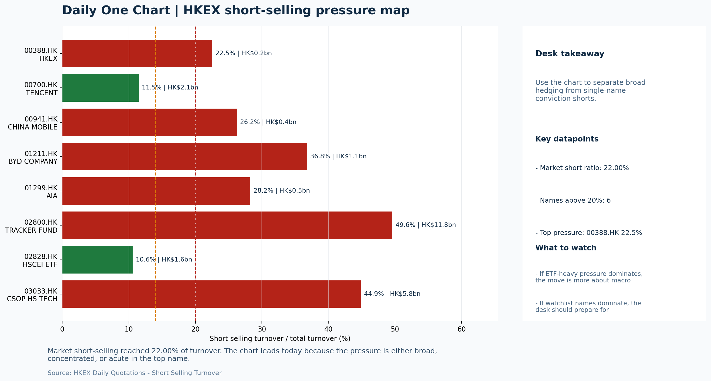

# Morning Research Workbench | 2026-07-07

> Designed for a Hong Kong sell-side commute: Layer 1 `Scan`, Layer 2 `Deep Read`, Layer 3 `Thinking`
> Mode: `Trading Daily` | Keep the report execution-oriented: what mattered in the completed session, what can move Hong Kong leadership, and what needs fast follow-up.
> Briefing date: `2026-07-07` | Review date: `2026-07-06` | Global request: `2026-07-06` | HK/China request: `2026-07-06` | Market effective date: `2026-07-06` | Generated at: `2026-07-07 06:12:54`

## Executive Summary

- **Market pulse:** Risk-On backdrop with Nasdaq growth leadership and a 22% short-selling ratio sets a constructive but flow-confirmation-dependent open for Hong Kong, with the hot CPI print now the key.
- **Hong Kong lens:** Hong Kong growth / internet led. Risk-On backdrop with Nasdaq leadership and FXI strength sets a constructive tone, but Intel's guidance cut could cap semis.
- **Top catalysts:** INTC -6.33%; Risk-On backdrop with USD range-bound, rates were not the dominant driver, and Bitcoin outperformed Gold.

## Visual Dashboard

## Layer 1 | Scan (5-10 min)

### 1.1 One-Line Market Pulse
Risk-On backdrop with Nasdaq growth leadership and a 22% short-selling ratio sets a constructive but flow-confirmation-dependent open for Hong Kong, with the hot CPI print now the key near-term catalyst to watch for repricing risk.

### 1.2 Global Asset Price Dashboard

| Asset | Last | 1D move | Read |
| --- | --- | --- | --- |
| S&P 500 | 7,537.43 | +0.72% | US large-cap risk appetite |
| Nasdaq 100 | 29,697.87 | +1.26% | Growth and duration leadership |
| Hang Seng Index | 23,350.03 | +1.28% | Hong Kong broad beta |
| Hang Seng TECH | 4.4160 | +1.19% | Hong Kong growth / platform read-through |
| CSI 300 | 4,842.17 | +0.62% | Mainland large-cap tone |
| US 10Y | 4.4790 | -0.13% | Global discount-rate anchor |
| China 10Y | 1.74% | -0.8bp | China local rates anchor \| Live public \| Eastmoney \| 2026-07-06 |
| CN-US 10Y spread | -274.2bp | | Relative carry and macro-pressure gauge \| Live public \| Eastmoney \| 2026-07-06 |
| DXY | 100.84 | -0.02% | Dollar liquidity impulse |
| USD/CNH | 6.7630 | +0.00% | Offshore China risk appetite |
| USD/HKD | 7.8423 | -0.01% | Linked-exchange regime stress check |
| Brent crude | 72.11 | +0.43% | Energy / geopolitics |
| COMEX gold | 4,178.00 | **+1.59%** | Hedge demand / real yields |
| Copper | 6.2510 | **+2.23%** | Global growth proxy |
| VIX | 15.57 | **-3.59%** | US stress barometer |

### 1.3 Hong Kong Key Data Quick Check

| Check | Value | Status | Source / as of | Why it matters |
| --- | --- | --- | --- | --- |
| Main Board turnover vs 20D | 0.99x \| -1% vs 20D | Live local | HKEX \| 2026-07-06 | Trailing 20-session average turnover was HK$317.3bn. |
| Southbound / Northbound net flow | Southbound Net HK$20.5bn \| turnover HK$147.4bn \| Northbound Turnover HK$396.3bn \| net not reported | Live local | HKEX Connect \| 2026-07-06 | Southbound net buy is calculated from HKEX disclosed buy and sell turnover. |
| Short-selling ratio | 22.00% | Live local | HKEX \| 2026-07-06 | Official HKEX stock-level short-selling table, aggregated as a share of total market turnover. |
| AH premium index | 36.69% | Live public | Yahoo \| 2026-07-06 | Simple average across 18 A/H pairs; use dispersion rather than the average alone. |
| USD/HKD spot vs band | 7.8423 \| band 7.7500 to 7.8500 | Live quote + local | Yahoo \| 2026-07-06 | Inside the linked-exchange band without immediate boundary stress. Official Convertibility Undertakings define the linked-rate stress boundaries for USD/HKD. |
| HIBOR 1M | 2.76% | Live local | HKMA \| 2026-07-06 | 1M HIBOR is the cleanest quick read for Hong Kong funding conditions and equity-duration pressure. |
| Aggregate Balance | HK$54.2bn | Live local | HKMA \| 2026-07-06 | Aggregate Balance helps frame whether linked-rate liquidity conditions are tight or comfortable. |
| Hong Kong leadership | Hong Kong growth / internet led | Proxy | HSI / HSCEI / HSTECH relative perf \| 2026-07-06 | Use HSI / HSCEI / HSTECH relative moves as the opening style read. |

### 1.4 Risk Dashboard
**Composite risk score:** `67.7/100` | **Regime:** `Risk-on`

| Component | Score impact | Evidence |
| --- | --- | --- |
| US beta | +4.3 | S&P 500 +0.72% |
| HK growth | +5.9 | HSTECH +1.19% |
| Offshore China proxy | +8 | FXI +1.82% |
| Dollar pressure | +0.2 | DXY -0.02% |
| Volatility | +7.2 | VIX -3.59% |
| HK short-selling | -8 | Short-selling ratio 22.00% |

### 1.5 Morning Checklist
1. **INTC -6.33%**
 Mover attribution | Announcement / expectations | Guidance reset and margin pressure
2. **Risk-On backdrop with USD range-bound, rates were not the dominant driver, and Bitcoin outperformed Gold**
 Overnight regime | Start by deciding whether the day is about Risk-On conditions or a style pivot.
3. **CPI MoM (Released)**
 Macro / policy | Rates expectations, the dollar, and growth-equity valuation | Industries: Technology, Internet, Brokers
4. **[A] Alibaba-affiliate Ant Group rushes into humanoid robots with a dozen deals in 18 months**
 News / announcements | Capital allocation or shareholder-return events can trigger a valuation reset
5. **Trade Balance (Released)**
 Macro / policy | Watch whether it changes the day's core market narrative | Industries: Market-wide

## Layer 2 | Deep Read (20-30 min)

### 2.1 Overnight Overseas Market Review
#### Market Setup
**Core tape.** Global equities extended gains with growth styles leading as the Nasdaq 100 rose 1.26% while the S&P 500 added 0.72%, in a session where rates were not the dominant driver and the dollar held range-bound.
**Main driver.** Bitcoin outperforming Gold by nearly 90 basis points and a 3.59% decline in the VIX to 15.57 confirmed Risk-On positioning without reaching elevated levels.
**HK relevance.** FXI surged 1.82%, outpacing Hang Seng indices, suggesting offshore China sentiment is a driver rather than just a follower of US momentum.

#### Key Drivers
- Nasdaq 100 +1.26% transmitted via growth-style correlation to Hong Kong tech and platform names.
- Bitcoin +1.15% and the 0.897% spread over Gold confirmed speculative risk appetite without extreme positioning.
- VIX fell 3.59% to 15.57, reducing the fear premium that typically caps Hong Kong equity duration.
- Copper rose 2.23%, providing a constructive macro read for industrial demand and EM sentiment.

#### Hong Kong Read-Through
**Desk lens.** Leadership was broad and balanced.
**Opening implication.** Risk-On backdrop with Nasdaq leadership and FXI strength sets a constructive tone, but Intel's guidance cut could cap semis. Watch whether HSTECH and HSCEI confirm FXI's outperformance.
- **Cross-market read:** Hang Seng +1.28% / HSCEI +1.15% / HSTECH +1.19%.
- **Cross-market read:** Offshore China proxy FXI +1.82% and USD/CNH +0.00% frame cross-border risk appetite.
- **Cross-market read:** USD/HKD last traded around 7.8423, which keeps the Hong Kong funding lens in focus.

#### Watch Points
- USD composite moved higher by +0.09pct intraday, with a 0.214pct range.
- Main turning points appeared around 2026-07-06 08:05 peak / 2026-07-06 08:20 peak / 2026-07-06 08:35 peak, suggesting event-driven repricing rather.
- The biggest cross-asset divergence was Bitcoin versus Gold, a spread of 0.897pct.
- Gold moved +0.08pct intraday with a 1.071pct high-low range.

**Curated overnight stories**
1. **INTC -6.33%: Guidance reset and margin pressure**
 Why it matters: Intel's guidance reset signals continued competitive pressure in semis. This creates a negative read-through for global semis and hardware names, which are well-represented.
 HK read-through: Relevant for Hang Seng TECH and related hardware/semis names. May weigh on sentiment for chip-related plays including AI hardware.
2. **Macquarie says now is the 'best time' to buy Chinese AI chip stocks**
 Why it matters: A sell-side upgrade from a major bank on a specific theme (Chinese AI chips) can redirect institutional allocation. Names mentioned could see inflows.
 HK read-through: Directly relevant for Hong Kong-listed AI and chip names. Could support continued strength in tech leadership if momentum holds into Monday.
3. **Alibaba-affiliate Ant Group rushes into humanoid robots with a dozen deals in 18 months**
 Why it matters: Ant led a 500M yuan funding round in Zeroth robotics. Signals capital allocation toward new growth vectors beyond fintech, potentially resetting valuation frameworks.
 HK read-through: Maps into China Internet leaders and close peers. Medium-term capital allocation shift could re-rate associated names.

### 2.2 Hong Kong / A-share Previous-Day Review
#### Local Tape Setup
**Local read.** Hong Kong ended the session with HSI +1.28%, and HSTECH (+1.19%) did slightly better than HSCEI (+1.15%), pointing to modest growth leadership in a risk-on tape.
**Verification point.** Southbound net buying of HK$20.5bn concentrated in Tracker Fund and HSCEI ETF, but the short-selling ratio held at 22%, so the rally still needs confirmation from cleaner local breadth.
**Risk to watch.** The offshore proxy FXI surged 1.82%, well ahead of local indices, signalling cross-market support that has yet to be fully echoed onshore.

#### Style and Local Leadership
**Style leadership.** Hong Kong growth / internet led.
- **Cross-market read:** Hang Seng +1.28% / HSCEI +1.15% / HSTECH +1.19%.
- **Cross-market read:** Offshore China proxy FXI +1.82% and USD/CNH +0.00% frame cross-border risk appetite.
- **Cross-market read:** USD/HKD last traded around 7.8423, which keeps the Hong Kong funding lens in focus.

#### Flow Confirmation
Official Stock Connect evidence is available; use Section 2.3 to confirm whether local money supports the price action.

#### Follow-Through Checklist
**Follow-through check.** Confirm that HSTECH can extend its edge over HSCEI in early trade and that main board turnover rises above the 20-day average of HK$317.3bn.

### 2.3 Flow Tracker and Attribution
#### Cross-Asset Attribution v1

| Driver | Direction | Score | Evidence | HK implication |
| --- | --- | --- | --- | --- |
| Short-selling pressure | drag | 4.9 | HKEX short-selling ratio was 22.00%. | Elevated short activity argues for extra confirmation before chasing rebounds. |
| US growth-style transmission | supportive | 1.76 | Nasdaq 100 moved +1.26%. | Hong Kong growth and platform names should be tested first at the open. |
| Global equity beta | supportive | 0.72 | S&P 500 moved +0.72%. | Broad beta matters if Hong Kong breadth confirms the overseas signal. |

#### Flow Tracker
##### Flow Takeaways
- Short-selling pressure is elevated, so local rebounds need cleaner breadth and flow confirmation.
- Stock Connect Southbound: net HK$20.5bn on turnover HK$147.4bn (as of 2026-07-06).
- Stock Connect Northbound: turnover RMB396.3bn; public file provides total turnover/top active names, not full net-buy.
- AH premium: simple covered-pair average +36.69%; widest premium: Everbright Bank 100.76%.

##### Stock Connect Southbound Active Names

| Rank | Ticker | Name | Buy | Sell | Net buy |
| --- | --- | --- | --- | --- | --- |
| 3 | 02800.HK | TRACKER FUND | HK$6,875.0mn | HK$6.5mn | HK$6,868.5mn |
| 2 | 00700.HK | TENCENT | HK$6,901.2mn | HK$4,407.8mn | HK$2,493.4mn |
| 3 | 06869.HK | YOFC | HK$3,644.0mn | HK$4,731.6mn | HK$-1,087.6mn |
| 4 | 01888.HK | KB LAMINATES | HK$3,202.9mn | HK$4,270.6mn | HK$-1,067.8mn |
| 10 | 02828.HK | HSCEI ETF | HK$963.8mn | HK$0.1mn | HK$963.8mn |

##### AH Premium Dispersion

| Name | A ticker | H ticker | Premium | As of |
| --- | --- | --- | --- | --- |
| Everbright Bank | 601818.SS | 6818.HK | +100.76% | 2026-07-06 |
| China Communications Construction | 601800.SS | 1800.HK | +82.28% | 2026-07-06 |
| China Life | 601628.SS | 2628.HK | +51.47% | 2026-07-06 |
| New China Life | 601336.SS | 1336.HK | +50.99% | 2026-07-06 |
| China Railway Construction | 601186.SS | 1186.HK | +50.96% | 2026-07-06 |

##### HKEX Short-Selling Watch

| Ticker | Name | Short ratio | Short turnover | Total turnover |
| --- | --- | --- | --- | --- |
| 00388.HK | HKEX | 22.50% | HK$0.2bn | HK$1.1bn |
| 00700.HK | TENCENT | 11.46% | HK$2.1bn | HK$18.5bn |
| 00941.HK | CHINA MOBILE | 26.23% | HK$0.4bn | HK$1.5bn |
| 01211.HK | BYD COMPANY | 36.79% | HK$1.1bn | HK$3.0bn |
| 01299.HK | AIA | 28.25% | HK$0.5bn | HK$1.7bn |

- **Short-value leaders:** 02800.HK TRACKER FUND (HK$11.8bn); 03033.HK CSOP HS TECH (HK$5.8bn); 07709.HK XL2CSOPHYNIX (HK$4.0bn); 00700.HK TENCENT (HK$2.1bn).

### 2.4 Macro and Policy Tracking
**Desk read.** The completed session confirmed a Risk-On posture with USD range-bound and rates not a dominant driver.

**Market sensitivity.** Bitcoin outperformed Gold, and the VIX compressed to 15.57 (-3.59%), signaling easing stress.

**HK implication.** For the next session, the immediate catalyst is US CPI at 20:30 HKT, which printed hot at 0.3% vs 0.2% forecast - the direction is clear.

**Macro watchpoints**
- US yields and DXY reaction to the hot CPI print (0.3% vs 0.2% forecast).
- Whether Risk-On proxies - Copper, Bitcoin, VIX - maintain their tone into the Powell speech.
- US Retail Sales actual vs 0.3% forecast; any downside could test the Risk-On narrative.
- Powell's remarks at 22:00 HKT: any hawkish deviation on rates or the labor market could reprice rate-cut expectations.

| Time | Region | Event | Status | Desk read |
| --- | --- | --- | --- | --- |
| 20:30 | US | CPI MoM | Released | Impact: Rates expectations, the dollar, and growth-equity valuation \| Attention: 5/5 \| Industries: Technology, Internet, Brokers |
| 09:30 | China | Trade Balance | Released | Impact: Watch whether it changes the day's core market narrative \| Attention: 3/5 \| Industries: Market-wide |
| 20:30 | US | Retail Sales MoM | Upcoming | Impact: Consumer resilience, growth expectations, and risk-asset pricing \| Attention: 5/5 \| Industries: Consumer, E-commerce, Consumer discretionary |
| 09:20 | China | Loan Prime Rate | Upcoming | Impact: Watch whether it changes the day's core market narrative \| Attention: 3/5 \| Industries: Market-wide |
| 22:00 | Federal Reserve | Jerome Powell: Economic outlook remarks | Central bank | Impact: Policy path, liquidity conditions, and cross-asset risk appetite \| Attention: 5/5 \| Industries: Technology, Financials, Gold |
| 10:00 | PBOC | Open Market Operations Desk: Daily liquidity operation window | Central bank | Impact: Policy path, liquidity conditions, and cross-asset risk appetite \| Attention: 3/5 \| Industries: Technology, Financials, Gold |

#### Positioning and Risk Backdrop
- Options activity centered on KWEB Call, with Vol/OI at 1.88x and a bullish bias.
- Put/Call structure shows equity 0.68 / index 1.15, implying Single-stock optimism with index hedging.
- Geopolitics: Middle East | Regional tension remains elevated | Impact: Oil, freight costs, and safe-haven demand
- Geopolitics: US-China | Technology export-control rhetoric remains active | Impact: China internet, semiconductors, and supply chains

### 2.5 Key Company and Sector Events

| Grade | Sector | Headline | Why it matters | Horizon |
| --- | --- | --- | --- | --- |
| A | China Internet | Alibaba-affiliate Ant Group rushes into humanoid robots with a dozen | Capital allocation or shareholder-return events can trigger a valuation | Medium-term trend |

#### HKEX Announcements

| Grade | Ticker | Type | Release time | Title |
| --- | --- | --- | --- | --- |
| A | 00498.HK | Profit warning | 2026-07-06 | Profit warning / alert announcement |
| A | 01112.HK | Profit warning | 2026-07-05 | Profit warning / alert announcement |
| A | 05411.HK | Profit warning | 2026-07-05 | Profit warning / alert announcement |
| A | 02611.HK | Profit warning | 2026-07-03 | Profit warning / alert announcement |
| A | 02788.HK | Profit warning | 2026-07-03 | Profit warning / alert announcement |
| A | 00119.HK | Profit warning | 2026-07-02 | Profit warning / alert announcement |
| A | 05834.HK | Profit warning | 2026-07-01 | Profit warning / alert announcement |
| A | 06680.HK | Profit warning | 2026-07-01 | Profit warning / alert announcement |

#### Earnings / Results Watch

| Ticker | Company | Timing | Expectation framing |
| --- | --- | --- | --- |
| 0700.HK | Tencent Holdings | After Market Close | EPS est. 4.15 HKD \| revenue est. 163.2bn HKD |
| 0388.HK | Hong Kong Exchanges and Clearing | Before Market Open | EPS est. 2.81 HKD \| revenue est. 6.0bn HKD |

#### Rating Changes
- **9988.HK** | Morgan Stanley | Upgrade | Equal Weight -> Overweight | PT 92 -> 105

#### IPO Watch
- IPO and grey-market monitoring is not yet part of the standard production pack.

### 2.6 Today's Core Names
#### Core coverage

| Name | Ticker | Last | 1D | Range position | Morning note |
| --- | --- | --- | --- | --- | --- |
| Tencent | 0700.HK | 452.00 | +4.82% | Mid-range | Short-term price strength is clear; fresh catalysts could trigger broader group follow-through. |
| Meituan | 3690.HK | 74.95 | +4.68% | Mid-range | Short-term price strength is clear; fresh catalysts could trigger broader group follow-through. |

**Recent headlines for Tencent:**
- [China AI Giants Pull Back Companion Chatbot Features](https://finance.yahoo.com/technology/ai/articles/china-ai-giants-pull-back-170403877.html) (GuruFocus.com)
**Recent headlines for Meituan:**
- [Smart glasses maker Even Realities hits $1B valuation with $150M funding led by Meituan, Tencent](https://finance.yahoo.com/technology/articles/smart-glasses-maker-even-realities-090000351.html) (TechCrunch)

#### Priority follow-up

| Name | Ticker | Last | 1D | Range position | Morning note |
| --- | --- | --- | --- | --- | --- |
| AIA | 1299.HK | 74.00 | +1.02% | Bottom of range | The name sits near the bottom of its recent range and is worth monitoring for a catalyst-led reversal. |
| China Mobile | 0941.HK | 77.15 | +0.59% | Bottom of range | The name sits near the bottom of its recent range and is worth monitoring for a catalyst-led reversal. |

## Layer 3 | Thinking (10-15 min)

### 3.1 Rotating Theme Deep Dive

| Field | Read |
| --- | --- |
| Theme | China Consumption Recovery |
| Angle for the day | Focus on whether travel, retail, internet local services, and premium consumption data still support a demand-repair narrative. |

**Theme desk read**
**Core thesis.** The China Consumption Recovery theme faces a near-term test as Meituan (3690.HK) releases order trends and margin commentary today, providing a high-frequency read on local services demand.
**Evidence.** The macro backdrop is supportive: VIX eased 3.59% and copper rose 2.23%, consistent with a risk-on tape where rates were not the dominant driver.
**What to test.** Meituan rallied 4.68% on Monday, signaling short-term strength, but the catalyst must confirm whether the demand-repair narrative can trigger broader internet and consumer group follow-through.

**Signals to keep in mind**
- VIX -3.59%: Lower volatility signals easing stress in the tape.
- Copper +2.23%: Keep tracking it to confirm whether the core daily narrative is holding.

**LLM watch items:**
- Meituan (3690.HK) order trends and margin commentary - verify local services demand repair.
- US Retail Sales MoM (20:30, July 7) - confirm global consumer resilience; hot CPI may cap enthusiasm.
- China Loan Prime Rate (09:20, July 7) - any cut would signal policy support for consumption.

**Related names to keep close:**

| Name | Ticker | Bucket | Morning read |
| --- | --- | --- | --- |
| Meituan | 3690.HK | Core coverage | Short-term price strength is clear; fresh catalysts could trigger broader group follow-through. |

**Upcoming catalysts tied to the theme:**
- 2026-07-07 | Meituan: Order trends and margin commentary | High-frequency read on local services demand and platform competition
- 2026-07-07 | Retail Sales MoM | Consumer resilience, growth expectations, and risk-asset pricing

### 3.2 Today Ahead and Trading Calendar
- Macro: CPI MoM is the first item to anchor the open and the rates/FX response.
- Corporate / event: Tencent: Game grossing trends and ad-demand checks is the cleanest same-day catalyst to prepare for.

**Same-day macro docket**

| Time | Country | Event | Status | Detail |
| --- | --- | --- | --- | --- |
| 20:30 | US | CPI MoM | Released | Actual 0.3% / Forecast 0.2% / Prior 0.4% |
| 09:30 | China | Trade Balance | Released | Actual USD 85.2bn / Forecast USD 79.0bn / Prior USD 80.6bn |
| 20:30 | US | Retail Sales MoM | Upcoming | Forecast 0.3% / Prior 0.6% |
| 09:20 | China | Loan Prime Rate | Upcoming | Forecast 3.45% / Prior 3.45% |
| 22:00 | Federal Reserve | Jerome Powell: Economic outlook remarks | Central bank | speech |

**Same-day catalyst list**

| Date | Time | Category | Event | Importance |
| --- | --- | --- | --- | --- |
| 2026-07-07 | | Core coverage | Tencent: Game grossing trends and ad-demand checks | 3 |
| 2026-07-07 | | Core coverage | Meituan: Order trends and margin commentary | 3 |
| 2026-07-07 | | Core coverage | Alibaba: Cloud demand and GMV updates | 3 |
| 2026-07-07 | | Core coverage | HKEX: Turnover data and IPO pipeline updates | 3 |

**Next few sessions**

| Date | Category | Event | Impact |
| --- | --- | --- | --- |
| 2026-07-07 | Core coverage | Tencent: Game grossing trends and ad-demand checks | Core offshore China platform proxy for gaming, ads, and AI monetization |
| 2026-07-07 | Core coverage | Meituan: Order trends and margin commentary | High-frequency read on local services demand and platform competition |
| 2026-07-07 | Core coverage | Alibaba: Cloud demand and GMV updates | Key read-through for China consumption, cloud, and platform regulation |
| 2026-07-07 | Core coverage | HKEX: Turnover data and IPO pipeline updates | Direct proxy for Hong Kong market turnover, listings, and southbound |

### 3.3 Daily One Chart
**Daily One Chart | HKEX short-selling pressure map**

**Chart read.** Market short-selling reached 22.00% of turnover.
**Why it matters.** The chart leads today because the pressure is either broad, concentrated, or acute in the top name.

_Source: HKEX Daily Quotations - Short Selling Turnover_

## Traceable Appendix

### Report Metadata
> Date policy: Review date 2026-07-06 is treated as `Trading Daily`. | Global request date is 2026-07-06; adapter effective date is 2026-07-06 and summary date is 2026-07-06. | HK/China local data date is 2026-07-06; role: same-session local cash tape.
> Market data quality: Coverage: `31/32` | Stale items (>1d): `7` | Missing: `1`
> Report quality: `84.9/100` | Grade `B` | Status `usable with caveats`

### Key Questions to Keep in Mind
- Is risk appetite rising or fading? The overnight tape reads closer to `Risk-On`.
- Did rates expectations move? Focus on whether US 10Y, DXY, and growth style moved together.
- Were commodities the real story? Watch WTI and gold for geopolitics versus inflation signals.
- Is Hong Kong setup internet-led, SOE-led, or broad beta-led? Compare HSTECH, HSCEI, and HSI.
- Did offshore markets move China risk appetite? Focus on HSI, FXI, USD/CNH, and USD/HKD.

### Report Quality and Validation
- **Quality score:** 84.9/100 | **Grade:** B | **Status:** usable with caveats
- **Run summary:** 7 healthy | 1 caveat | 0 failed
- **Release recommendation:** Send with caveats | The report is usable, but the advisory guidance should travel with it so readers understand the data gaps.

| Source | Status | Bucket |
| --- | --- | --- |
| Market data | ok | healthy |
| Sector and company news | ok | healthy |
| Movers and short selling | ok | healthy |
| Stock Connect | ok | healthy |
| A/H premium | ok | healthy |
| Hong Kong local package | ok | healthy |
| China rates | ok | healthy |
| Narrative overlay | partial | caveat |

**Desk-use guidance summary:** 0 blocking | 1 advisory

**Desk-use guidance**
- **Advisory:** Use deterministic sections as primary support; the narrative overlay was partial or unavailable on this run.

| Component | Score | Weight | Read |
| --- | --- | --- | --- |
| Market data coverage | 96.9 | 0.3 | 31/32 core market fields available. |
| Hong Kong local metrics | 82.3 | 0.25 | 8 live, 3 proxy, 0 unavailable local checks. |
| Key public adapters | 100.0 | 0.2 | 4/4 key adapters were available or partially available. |
| Narrative overlay health | 51.4 | 0.15 | 2/7 narrative overlay tasks succeeded or used validated cache; 1 error(s). |
| Fact-check guardrail | 75.0 | 0.1 | Checked 10 numeric claims; 1 numeric mismatch(es), 0 logic warning(s); 1 critical, 0 review. |

**Quality warnings**
- Narrative overlay health is weak: 2/7 narrative overlay tasks succeeded or used validated cache; 1 error(s).
- Narrative fact-check guardrail produced warnings; review the validation table before relying on narrative sections.

**Narrative fact-check guardrail**
- Checked 10 numeric claims; 1 numeric mismatch(es), 0 logic warning(s); 1 critical, 0 review.

| Severity | Field | Claim | Type | Claimed | Expected | Snippet |
| --- | --- | --- | --- | --- | --- | --- |
| critical | tasks.overnight_review.drivers[2] | VIX | change_pct | 3.59 | -3.59 | VIX fell 3.59% to 15.57, reducing the fear premium that typicall |

**Adapter status**

| Adapter | Status |
| --- | --- |
| Stock Connect | ok |
| A/H premium | ok |
| HKEX announcements | ok |
| China rates | ok |

### Source Links
- [Alibaba-affiliate Ant Group rushes into humanoid robots with a dozen deals in 18 months](https://www.cnbc.com/2026/07/01/alibaba-affiliate-ant-group-enters-the-humanoid-robot-market-with-12-deals.html) (cnbc_markets)
- [China AI Giants Pull Back Companion Chatbot Features](https://finance.yahoo.com/technology/ai/articles/china-ai-giants-pull-back-170403877.html) (GuruFocus.com)
- [Smart glasses maker Even Realities hits $1B valuation with $150M funding led by Meituan, Tencent](https://finance.yahoo.com/technology/articles/smart-glasses-maker-even-realities-090000351.html) (TechCrunch)
- [Alibaba's Anthropic ban hides bigger AI shift](https://www.thestreet.com/investing/alibabas-anthropic-ban-hides-bigger-ai-shift) (TheStreet)
- [00498.HK Profit warning / alert announcement](http://www1.hkexnews.hk/listedco/listconews/sehk/2026/0706/2026070601002.pdf) (HKEXnews)
- [01112.HK Profit warning / alert announcement](http://www1.hkexnews.hk/listedco/listconews/sehk/2026/0705/2026070500105.pdf) (HKEXnews)
- [02611.HK Profit warning / alert announcement](http://www1.hkexnews.hk/listedco/listconews/sehk/2026/0703/2026070302343.pdf) (HKEXnews)
- [02788.HK Profit warning / alert announcement](http://www1.hkexnews.hk/listedco/listconews/sehk/2026/0703/2026070302607.pdf) (HKEXnews)
- [00119.HK Profit warning / alert announcement](http://www1.hkexnews.hk/listedco/listconews/sehk/2026/0702/2026070203663.pdf) (HKEXnews)
- [05834.HK Profit warning / alert announcement](http://www1.hkexnews.hk/listedco/listconews/sehk/2026/0701/2026070100201.pdf) (HKEXnews)

## Supplementary Visual Appendix

This appendix is professional-path only. It keeps a traceable index of the report visuals and the deterministic chart cues used to frame the morning note, without injecting the legacy intraday chart pack.

### Visual Index

| Visual | Path | Role |
| --- | --- | --- |
| Visual Dashboard | `charts/dashboard_2026-07-07.png` | Cross-asset regime board and Hong Kong local tape snapshot. |
| Daily One Chart | `charts/daily_one_chart_2026-07-07.png` | Single highest-conviction visual story for the day. |

### Deterministic Chart Cues
- FX / liquidity: USD composite moved higher by +0.09pct intraday, with a 0.214pct range.
- FX / liquidity: Main turning points appeared around 2026-07-06 08:05 peak / 2026-07-06 08:20 peak / 2026-07-06 08:35 peak, suggesting event-driven repricing rather than a clean one-way USD move.
- Cross-asset: The biggest cross-asset divergence was Bitcoin versus Gold, a spread of 0.897pct.
- Cross-asset: Gold moved +0.08pct intraday with a 1.071pct high-low range.
- Cross-asset: Oil moved +0.36pct intraday with a 1.783pct high-low range.
- Cross-asset: Bitcoin moved +0.98pct intraday with a 4.796pct high-low range.

### Risk Dashboard Components

| Component | Score impact | Evidence |
| --- | --- | --- |
| US beta | +4.3 | S&P 500 +0.72% |
| HK growth | +5.9 | HSTECH +1.19% |
| Offshore China proxy | +8 | FXI +1.82% |
| Dollar pressure | +0.2 | DXY -0.02% |
| Volatility | +7.2 | VIX -3.59% |
| HK short-selling | -8 | Short-selling ratio 22.00% |
